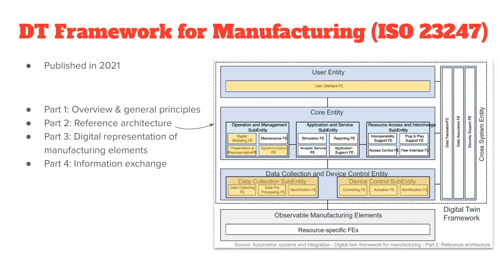
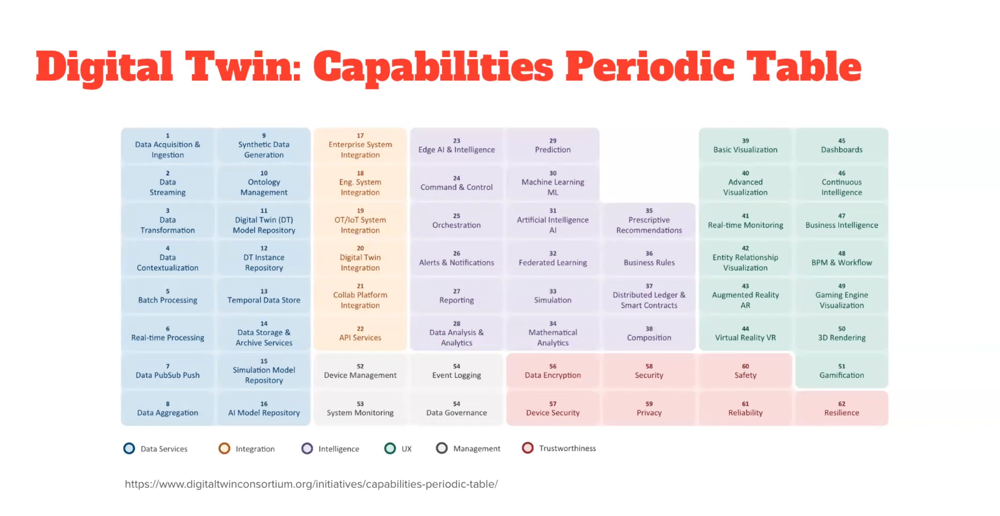

La norme **ISO 23247**, publiée en 2021, est le texte de référence international pour la mise en œuvre des **jumeaux numériques (Digital Twins)** dans le secteur de la fabrication (manufacturing).

Son but n'est pas de définir _comment_ coder un jumeau, mais de fournir un **cadre structurel** pour que tous les éléments d'une usine parlent la même langue.

Voici l'essentiel à retenir, structuré par ses quatre piliers fondamentaux :

# 1. L'Objectif : L'interopérabilité

Le problème majeur dans l'industrie est que les machines (monde physique) et les logiciels (monde numérique) proviennent de fournisseurs différents. L'ISO 23247 définit une architecture standardisée pour que :

- Les données remontent du terrain sans perte.
    
- Les simulations numériques soient synchronisées en temps réel.
    
- Les décisions prises par l'IA ou l'humain puissent être renvoyées vers les machines.
    

# 2. Structure en 4 Parties

La norme est divisée pour couvrir tout le cycle de vie du projet :

- **Partie 1 (Principes) :** Définit les termes et les concepts. Elle explique ce qu'est un jumeau numérique dans ce contexte : une représentation numérique d'un élément de fabrication avec une synchronisation bidirectionnelle.
    
- **Partie 2 (Architecture) :** C'est le schéma de votre capture. Elle définit les couches (Entité Utilisateur, Entité Centrale, Entité de Collecte) et les briques fonctionnelles (FE).
    
- **Partie 3 (Représentation) :** Elle explique comment "modéliser" les objets (une machine, un robot, un ouvrier) pour qu'ils soient reconnus informatiquement de façon uniforme.
    
- **Partie 4 (Échange d'information) :** Elle définit les protocoles et les méthodes pour que les données circulent de manière sécurisée et fluide entre les couches.
    

# 3. Le Concept de "Synchronisation"

C'est le point de rupture avec les simples modèles 3D ou simulations classiques. Selon l'ISO 23247, un jumeau numérique doit avoir :

1. **L'Observation :** Le numérique "voit" ce que fait le physique (capteurs).
    
2. **L'Analyse :** Le numérique simule ou analyse (Core Entity).
    
3. **Le Contrôle (Boucle fermée) :** Le numérique peut agir sur le physique pour optimiser la production ou éviter une panne.
    

# 4. Bénéfices pour l'Industrie

| **Avant l'ISO 23247**               | **Avec l'ISO 23247**                          |
| ----------------------------------- | --------------------------------------------- |
| Systèmes fermés et propriétaires    | Systèmes ouverts et modulaires                |
| Données isolées en silos            | Flux de données continu et standardisé        |
| Difficulté à changer de fournisseur | Possibilité d'interchanger des "briques" (FE) |
| Analyse a posteriori (historique)   | Analyse en temps réel et prédictive           |

# Cadre de référence des jumeaux numériques

Cette image présente le cadre de référence pour les **Jumeaux Numériques (Digital Twins - DT)** dans le secteur de la manufacture, tel que défini par la norme internationale **ISO 23247**, publiée en 2021.

L'objectif de cette norme est de fournir une architecture standardisée pour que les différents systèmes d'une usine puissent communiquer et créer des répliques numériques efficaces de leurs actifs physiques.

## 1. Les 4 Parties de la Norme ISO 23247

Le texte à gauche décompose la norme en quatre piliers :

- **Partie 1 :** Principes généraux et vue d'ensemble.
    
- **Partie 2 :** L'architecture de référence (c'est le schéma que l'on voit à droite).
    
- **Partie 3 :** Comment représenter numériquement les éléments de fabrication (machines, robots, etc.).
    
- **Partie 4 :** Comment échanger les informations entre le physique et le numérique.
    

---

## 2. Décomposition de l'Architecture (Le Schéma)

L'architecture est organisée de bas en haut, du monde physique vers l'utilisateur :

### A. Observable Manufacturing Elements (Le Monde Physique)

C'est la base. Ce sont les entités réelles de l'usine : machines-outils, capteurs, bras robotisés ou même les opérateurs. Ils possèdent des **Functional Entities (FE)** spécifiques aux ressources pour extraire des données.

### B. Data Collection and Device Control Entity (L'Interface)

Cette couche fait le pont entre le physique et le numérique :

- **Data Collection :** Récupère, traite et identifie les données provenant du terrain.
    
- **Device Control :** Envoie des commandes en retour vers les machines (actionnement) pour modifier leur comportement en fonction des analyses du jumeau.
    

### C. Core Entity (Le Cerveau du Jumeau Numérique)

C'est ici que réside "l'intelligence" du système. Elle est divisée en trois sous-entités :

- **Operation and Management :** Gère la modélisation numérique, la synchronisation (pour que le numérique soit à jour par rapport au physique) et la maintenance.
    
- **Application and Service :** Contient les outils de simulation, de reporting et d'analyse prédictive.
    
- **Resource Access and Interchange :** Assure l'interopérabilité, permettant au système d'être "Plug & Play" et de gérer qui a accès à quoi.
    

### D. User Entity (L'Interface Humaine)

C'est la couche supérieure où l'utilisateur interagit avec le jumeau numérique via une interface (UI/UX) pour visualiser l'état de l'usine ou prendre des décisions.

---

## 3. Les Fonctions Transverses (Cross System Entity)

Sur la droite, on voit une colonne verticale qui traverse toutes les couches. Elle regroupe les fonctions indispensables à la fiabilité du système :

- **Translation des données :** Conversion des formats pour que tout le monde se comprenne.
    
- **Assurance des données :** Vérification de la qualité et de la précision des données.
    
- **Sécurité :** Protection contre les cyberattaques et confidentialité des échanges.
    

---

Dans ce contexte technique et selon la nomenclature de la norme **ISO 23247**, l'abréviation **FE** signifie :

> **Functional Entity** (en français : **Entité Fonctionnelle**)

## Qu'est-ce qu'une "Functional Entity" ?

Une entité fonctionnelle est un composant logiciel ou matériel élémentaire qui remplit une tâche spécifique au sein de l'architecture du jumeau numérique.

Dans le schéma, vous remarquerez que presque chaque bloc se termine par "FE". Voici quelques exemples pour mieux comprendre leur rôle :

- **Data Collecting FE :** Le module chargé spécifiquement de la capture des données brutes sur une machine.
    
- **Simulation FE :** Le module qui exécute les algorithmes de simulation pour prédire le comportement futur de la machine.
    
- **Synchronization FE :** L'entité qui s'assure que les données du monde physique et la réplique numérique sont parfaitement alignées dans le temps.
    
- **User Interface FE :** La partie logicielle qui gère l'affichage pour l'opérateur humain.
    

### Pourquoi utiliser ce terme ?

L'utilisation du terme "Entité Fonctionnelle" permet à la norme d'être **agnostique sur le plan technologique**.

Peu importe que la fonction soit codée en Python, en C++, ou qu'elle soit intégrée directement dans un automate programmable (PLC) ; tant qu'elle remplit la fonction décrite (par exemple, "Actuation FE" pour déclencher un mouvement), elle est considérée comme une brique valide du cadre ISO.

C'est cette approche modulaire qui permet de construire des systèmes complexes en assemblant différentes "briques" (FE) provenant potentiellement de fournisseurs différents.

# Table périodique des capacités du jumeau numérique

Cette image présente la **"Table Périodique des Capacités du Jumeau Numérique"**, un outil stratégique développé par le **Digital Twin Consortium**.

Inspirée du tableau de Mendeleïev, cette table ne classe les **fonctionnalités (capacités)** qu'un jumeau numérique peut posséder. C'est une boussole pour les entreprises : au lieu de dire "je veux un jumeau numérique" (ce qui est trop vaste), elles choisissent les "atomes" dont elles ont besoin pour construire leur solution.

Voici la décomposition par grandes familles de couleurs :

---

## 1. Data Services (Bleu) - La Fondation

C'est la base du système. Ces capacités concernent la manière dont le jumeau numérique gère la matière première : la donnée.

- **Acquisition & Ingestion :** Comment on récupère les données des capteurs.
    
- **Streaming & Real-time Processing :** Traiter l'info instantanément.
    
- **Modèles & Dépôts :** Stocker les modèles d'IA, les simulations et les historiques (Temporal Data Store).
    

### 2. Integration (Orange) - La Connectivité

Un jumeau numérique ne vit pas seul. Cette section définit comment il se connecte au reste de l'entreprise.

- **Systèmes Enterprise/OT/IT :** Connexion aux logiciels de gestion (ERP), aux systèmes de production et aux API externes.
    
- **Collaboration :** Partage des données entre différentes plateformes.
    

### 3. Intelligence (Violet) - Le Cerveau

C'est ici que l'on passe de la simple visualisation à la valeur ajoutée.

- **Analytique & Simulation :** Utiliser la physique pour prédire ce qui va se passer.
    
- **IA & Machine Learning :** Apprendre des données pour détecter des anomalies.
    
- **Prediction & Prescriptive Recommendations :** Non seulement prédire une panne, mais suggérer comment la réparer.
    

### 4. UX - User Experience (Vert) - L'Interface

Comment l'humain interagit avec le jumeau.

- **Visualisation (2D/3D) :** Tableaux de bord (Dashboards) et rendus réalistes.
    
- **Réalité Augmentée (AR) / Virtuelle (VR) :** Pour permettre à un technicien de voir les données numériques superposées à la machine réelle.
    
- **Gamification :** Utiliser des mécaniques de jeu pour l'entraînement ou l'engagement.
    

### 5. Management (Gris) - Le Pilotage

Les capacités nécessaires pour gérer le système lui-même.

- **Device Management :** Gérer le parc de capteurs.
    
- **Data Governance :** S'assurer que les données sont propres, légales et bien gérées.
    

### 6. Trustworthiness (Rouge) - La Confiance

Élément crucial souvent oublié, situé en bas. Sans cela, le jumeau est un risque.

- **Security & Privacy :** Protection contre le piratage.
    
- **Safety & Reliability :** Garantir que les décisions du jumeau ne mettront personne en danger.
    
- **Resilience :** Capacité du système à continuer de fonctionner en cas de problème.
    

---

### Pourquoi ce tableau est-il utile ?

1. **Définir le périmètre :** Au début d'un projet, on coche les cases nécessaires. Un jumeau pour la maintenance prédictive cochera "Prediction" et "IoT Integration", tandis qu'un jumeau pour la formation cochera "Virtual Reality" et "Gamification".
    
2. **Évaluer la maturité :** Une entreprise peut regarder son jumeau actuel et voir quelles cases elle remplit, et quelles sont les prochaines étapes de son évolution.
    
3. **Standardiser le langage :** Comme pour la norme ISO 23247 que nous avons vue précédemment, cela permet à tous les acteurs (fournisseurs, ingénieurs, clients) d'utiliser les mêmes termes.
    

C'est en quelque sorte le "menu à la carte" pour concevoir un jumeau numérique sur mesure. Y a-t-il une "famille" de capacités (par exemple l'Intelligence ou l'UX) que vous souhaiteriez approfondir ?