> [!info] Livre « Les CNN et RNN » — chapitre 1/8
> [[Les CNN et RNN — Sommaire|Sommaire]] · [[Les CNN et RNN — Sommaire|← Sommaire]] · [[Les CNN et RNN — 02 — Les convolutions en profondeur|02 — Les convolutions en profondeur →]]

*Partie I — Les réseaux de neurones convolutifs (CNN)*

# Chapitre A — Le principe des CNN
## A.1. Objectif du chapitre

Dans cette première partie du cours, nous allons étudier une famille de réseaux de neurones fondamentaux pour le traitement des données à structure spatiale : les **CNN**, ou **réseaux de neurones convolutifs** (de l'anglais *Convolutional Neural Networks*).

Nous allons comprendre :

- pourquoi un réseau dense classique est insuffisant pour traiter une image ;

- ce qu'est une convolution et pourquoi elle est adaptée aux données spatiales ;

- comment un filtre extrait des motifs locaux ;

- ce qu'est une carte d'activation ;

- comment plusieurs couches permettent d'extraire des représentations de plus en plus abstraites ;

- à quoi sert le pooling ;

- comment l'architecture générale d'un CNN est organisée ;

- quelles sont les limites de cette architecture.

L'objectif est de poser une base solide sur les CNN avant d'aborder les RNN, afin de comprendre pourquoi certaines architectures sont adaptées à certains types de données.

---

## A.2. Rappel : les données à structure spatiale

Avant de définir les CNN, il est important de comprendre ce que nous entendons par **données à structure spatiale**.

Une image numérique en niveaux de gris peut être représentée comme une grille de nombres.

Exemple d'image 4×4 :

```txt
 12  45  78  90
 34  56  89 102
  8  23  67  44
 55  71  33  19
```

Chaque nombre correspond à un pixel.

Dans une image en couleur (RGB), nous avons trois grilles de ce type, une par canal.

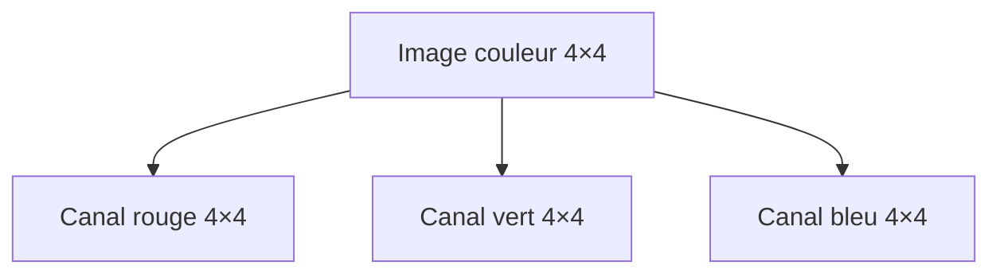

Ce qui rend cette représentation particulière, c'est que les pixels voisins sont **structurellement liés** : ils partagent un contexte spatial.

Un pixel isolé ne signifie rien de précis. C'est sa relation avec ses voisins qui contient l'information : une arête, une texture, un contour.

---

## A.3. Pourquoi un réseau dense est insuffisant

Un réseau dense classique traite chaque entrée comme un vecteur sans structure.

Si nous prenons une image de 64×64 pixels en RGB, nous obtenons un vecteur de :

$$64 \times 64 \times 3 = 12\,288 \text{ valeurs}$$

Un réseau dense connecté à ce vecteur crée des connexions entre **toutes** les entrées et **tous** les neurones de la couche suivante.

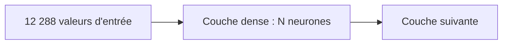

Ce type de réseau pose plusieurs problèmes avec des images.

### A.3.1 Explosion du nombre de paramètres

Une image de 224×224×3 pixels connectée à une couche de 1000 neurones nécessite :

$$224 \times 224 \times 3 \times 1000 = 150\,528\,000 \text{ paramètres}$$

C'est uniquement pour la première couche.

Ce nombre explose très rapidement avec la taille des images.

### A.3.2 Ignorance de la structure spatiale

Un réseau dense traite chaque pixel indépendamment.

Il ne tire pas parti du fait que des pixels voisins sont probablement liés.

Si nous décalons un objet de quelques pixels, le réseau dense voit une entrée complètement différente.

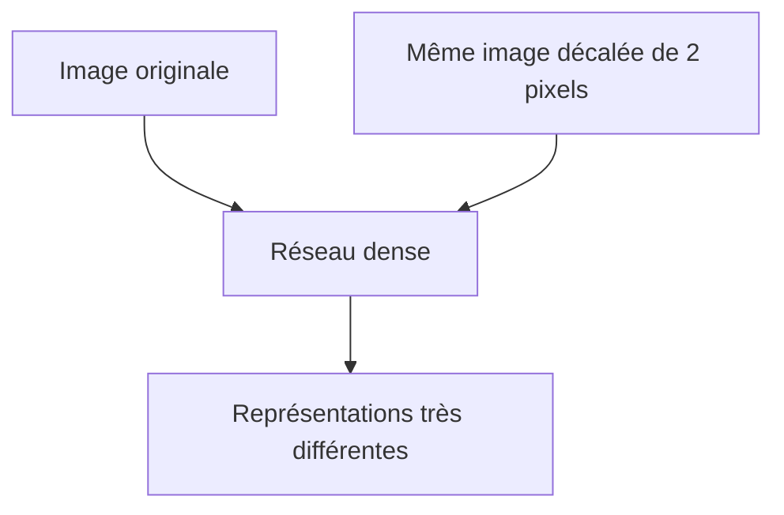

Cela rend l'apprentissage beaucoup plus coûteux.

### A.3.3 Absence d'invariance spatiale

Le réseau dense doit apprendre séparément à reconnaître un chat en haut à gauche, en bas à droite, au centre, etc.

Les CNN vont résoudre ces problèmes.

---

## A.4. L'idée fondamentale : la convolution

La **convolution** est l'opération centrale d'un CNN.

L'idée est simple :

> Au lieu de connecter chaque neurone à toute l'image, nous appliquons un petit filtre localement, en le faisant glisser sur toute l'image.

Ce filtre est une petite matrice de nombres appris, appelée **noyau** ou **kernel**.

Exemple de filtre 3×3 :

```txt
 1  0 -1
 1  0 -1
 1  0 -1
```

Nous faisons glisser ce filtre sur l'image et calculons, à chaque position, le produit scalaire entre le filtre et la région locale de l'image.

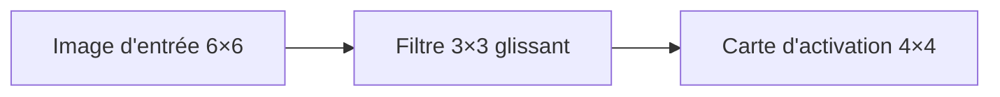

Ce mécanisme de glissement s'appelle la **convolution discrète** en traitement du signal.

---

## A.5. Le calcul d'une convolution

Prenons une image d'entrée simple de 4×4 :

```txt
 1  2  3  4
 5  6  7  8
 9 10 11 12
13 14 15 16
```

Et un filtre 2×2 :

```txt
 1  0
 0 -1
```

Nous appliquons ce filtre en position (1,1), c'est-à-dire sur les pixels :

```txt
 1  2
 5  6
```

Le produit scalaire donne :

$$1 \times 1 + 2 \times 0 + 5 \times 0 + 6 \times (-1) = 1 + 0 + 0 - 6 = -5$$

Nous faisons de même pour toutes les positions valides.

La valeur calculée à chaque position forme la **carte d'activation** (ou *feature map*).

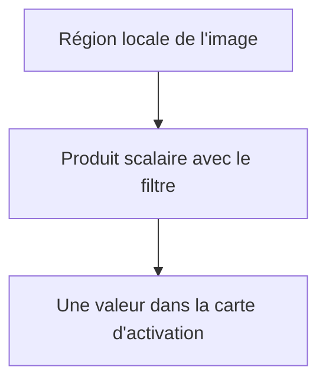

---

## A.6. La carte d'activation

La **carte d'activation** contient les réponses du filtre à chaque position de l'image.

Si le filtre est conçu pour détecter les bords verticaux, la carte d'activation aura des valeurs élevées là où l'image contient des bords verticaux.

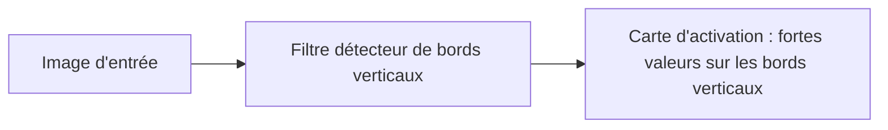

Un CNN apprend automatiquement les filtres qui lui sont utiles pour la tâche.

Il ne faut pas définir manuellement les filtres : ils sont appris par rétropropagation, exactement comme les poids d'un réseau dense.

---

## A.7. Le partage des poids

Un filtre est appliqué à **toutes** les positions de l'image.

Les poids du filtre sont donc partagés dans l'espace, de la même façon que les poids d'un RNN sont partagés dans le temps.

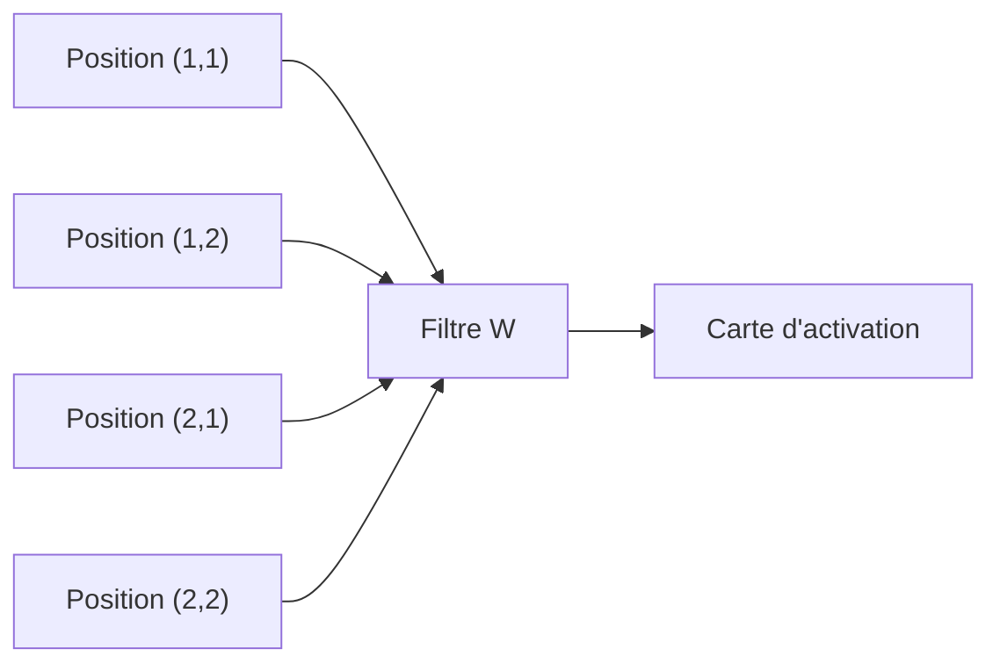

Ce partage a deux avantages majeurs :

1. le nombre de paramètres est indépendant de la taille de l'image ;

2. si un motif est appris à une position, il est reconnu partout ailleurs dans l'image.

C'est l'**invariance par translation** : le filtre sait reconnaître un motif où qu'il se trouve.

---

## A.8. Plusieurs filtres en parallèle

En pratique, une couche de convolution utilise non pas un seul filtre, mais plusieurs filtres en parallèle.

Chaque filtre produit une carte d'activation différente.

Si nous utilisons 32 filtres de taille 3×3, nous obtenons 32 cartes d'activation.

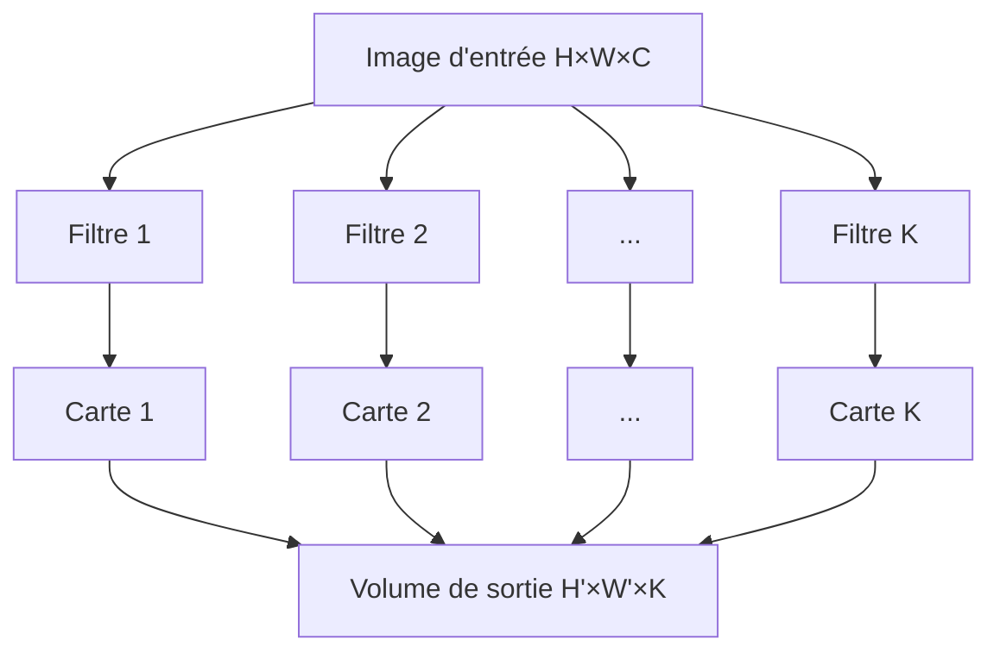

L'ensemble des cartes d'activation forme un **volume** de sortie, avec une profondeur égale au nombre de filtres.

---

## A.9. Les dimensions d'une couche de convolution

Notons :

- $H$ la hauteur de l'entrée ;
- $W$ la largeur de l'entrée ;
- $C$ le nombre de canaux de l'entrée ;
- $K$ le nombre de filtres ;
- $F$ la taille du filtre (par exemple 3 pour un filtre 3×3) ;
- $S$ le **stride**, c'est-à-dire le pas de déplacement du filtre ;
- $P$ le **padding**, c'est-à-dire le rembourrage ajouté autour de l'image.

Alors la sortie a les dimensions :

$$H' = \frac{H - F + 2P}{S} + 1$$

$$W' = \frac{W - F + 2P}{S} + 1$$

La sortie a donc la forme $H' \times W' \times K$.

Le nombre de paramètres de cette couche est :

$$F \times F \times C \times K + K$$

où $K$ est le nombre de biais.

---

## A.10. Le stride

Le **stride** contrôle le pas de déplacement du filtre.

Avec un stride de 1, le filtre se décale d'un pixel à la fois.

Avec un stride de 2, il se décale de deux pixels à la fois.

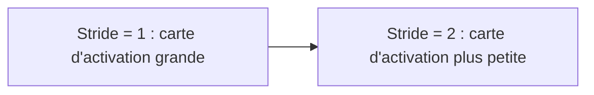

Un stride plus grand réduit la taille de la sortie et diminue le coût de calcul.

Mais il perd aussi de l'information spatiale fine.

---

## A.11. Le padding

Lorsque nous appliquons un filtre, les pixels de bord participent à moins de calculs que les pixels centraux.

Si nous ne faisons rien, la carte d'activation est plus petite que l'entrée.

Le **padding** consiste à ajouter une bordure de zéros autour de l'image.

```txt
Entrée originale 4×4 avec padding=1 :

0  0  0  0  0  0
0  1  2  3  4  0
0  5  6  7  8  0
0  9 10 11 12  0
0 13 14 15 16  0
0  0  0  0  0  0
```

Cela permet de conserver les dimensions spatiales entre l'entrée et la sortie (*same padding*), ou de contrôler finement la réduction.

---

## A.12. La fonction d'activation

Après la convolution, nous appliquons une **fonction d'activation non linéaire** à chaque valeur de la carte d'activation.

La plus utilisée est la **ReLU** (*Rectified Linear Unit*) :

$$\text{ReLU}(x) = \max(0, x)$$

Elle met à zéro toutes les valeurs négatives.

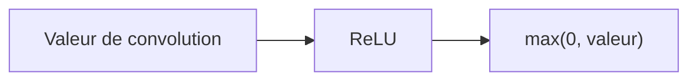

Sans cette non-linéarité, empiler plusieurs couches de convolution ne serait pas plus puissant qu'une seule couche.

La ReLU est simple, efficace et évite certains problèmes de gradient.

---

## A.13. L'opération de pooling

Après une ou plusieurs couches de convolution, on insère souvent une couche de **pooling**.

Le pooling réduit les dimensions spatiales de la carte d'activation.

### A.13.1 Max pooling

Le **max pooling** découpe la carte d'activation en régions et garde la valeur maximale de chaque région.

Exemple avec un max pooling 2×2 et stride 2 sur une carte 4×4 :

```txt
Carte d'activation :
 1  3  2  4
 5  6  7  8
 9  2  3  4
 1  8  7  6

Résultat max pooling 2×2 :
 6  8
 9  7
```

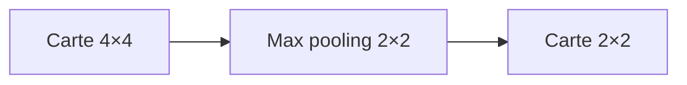

### A.13.2 Average pooling

L'**average pooling** calcule la moyenne de chaque région plutôt que le maximum.

### A.13.3 Rôle du pooling

Le pooling sert à :

- réduire la taille des cartes d'activation ;

- diminuer le nombre de calculs ;

- rendre les représentations légèrement invariantes aux petites translations.

---

## A.14. Architecture générale d'un CNN

Un CNN classique s'organise en deux parties principales.

### A.14.1 La partie extraction de caractéristiques

Cette partie est composée de couches alternant convolution, activation et pooling.

Elle transforme l'image d'entrée en une représentation de plus en plus abstraite.

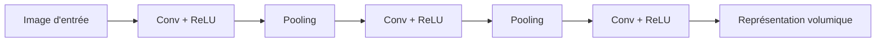

### A.14.2 La partie classification

À la fin des couches convolutives, on **aplatit** le volume de caractéristiques en un vecteur.

Ce vecteur est ensuite traité par des couches denses classiques, qui produisent la prédiction finale.

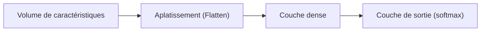

---

## A.15. Ce que les couches apprennent

Les couches profondes d'un CNN n'apprennent pas toutes les mêmes choses.

Il existe une hiérarchie de représentations.

### A.15.1 Premières couches

Les premières couches apprennent des **motifs simples et locaux** :

- bords ;

- coins ;

- couleurs simples ;

- textures de base.

### A.15.2 Couches intermédiaires

Les couches intermédiaires combinent ces motifs pour former des **motifs plus complexes** :

- yeux, oreilles ;

- roues, fenêtres ;

- formes géométriques.

### A.15.3 Couches profondes

Les couches profondes apprennent des **représentations sémantiques** :

- visage complet ;

- voiture entière ;

- type de scène.

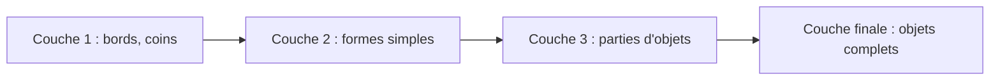

Cette hiérarchie est une des raisons du succès des CNN : ils apprennent une représentation de plus en plus abstraite de façon automatique.

---

## A.16. Exemple : classification d'images

Prenons une tâche classique : reconnaître si une image contient un chat ou un chien.

```txt
Entrée : image 224×224×3
```

Un CNN peut être organisé ainsi :

```txt
Conv 3×3, 32 filtres → ReLU → MaxPool 2×2
Conv 3×3, 64 filtres → ReLU → MaxPool 2×2
Conv 3×3, 128 filtres → ReLU → MaxPool 2×2
Flatten
Dense 256 → ReLU
Dense 2 → Softmax
```

À chaque couche de convolution, le réseau détecte des caractéristiques de plus en plus complexes.

À la fin, le vecteur dense est projeté sur deux classes.

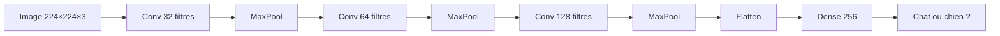

---

## A.17. Comparaison réseau dense vs CNN

Résumons la différence fondamentale :

| Critère | Réseau dense | CNN |
|---|---|---|
| Connexions | Toutes les entrées | Région locale (filtre) |
| Poids | Un par connexion | Partagés sur toute l'image |
| Structure spatiale | Ignorée | Exploitée |
| Invariance à la translation | Non | Oui (partielle) |
| Nombre de paramètres | Très élevé | Bien plus faible |

---

## A.18. Limites des CNN classiques

Les CNN ont des limites importantes.

### A.18.1 Invariance globale non garantie

Le max pooling donne une invariance locale aux petites translations.

Mais un objet très décalé ou tourné peut ne pas être reconnu.

### A.18.2 Taille d'entrée fixe

Les couches denses en fin de réseau exigent souvent une taille d'entrée fixe.

### A.18.3 Données séquentielles

Les CNN sont bien adaptés aux données spatiales, mais moins aux données séquentielles (texte, parole, séries temporelles).

Pour ces cas, les RNN et leurs dérivés offrent une meilleure inductive bias.

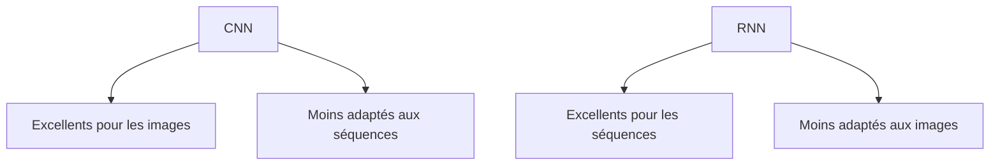

---

## A.19. Résumé du chapitre

Dans ce chapitre, nous avons posé les bases des **CNN**.

Nous avons vu que :

- une image est une donnée à structure spatiale ;

- un réseau dense est insuffisant car il ignore cette structure et crée trop de paramètres ;

- la convolution applique un filtre local qui glisse sur toute l'image ;

- les poids du filtre sont partagés dans l'espace, ce qui réduit les paramètres et confère une invariance à la translation ;

- plusieurs filtres en parallèle produisent plusieurs cartes d'activation ;

- le pooling réduit les dimensions spatiales ;

- les couches profondes apprennent des représentations de plus en plus abstraites.

---

## A.20. Schéma de synthèse

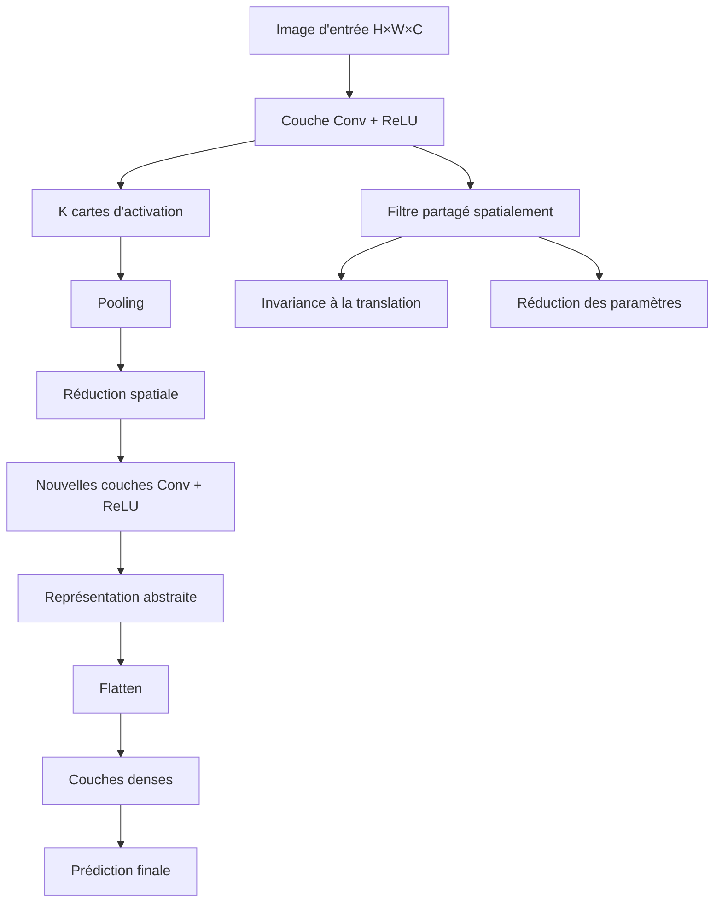

---

## A.21. Questions de compréhension

### Question 1

Pourquoi un réseau dense est-il inadapté au traitement d'images haute résolution ?

Réponse attendue : parce qu'il connecte chaque pixel à chaque neurone, ce qui produit un nombre de paramètres qui explose avec la résolution, et parce qu'il ignore la structure spatiale locale.

### Question 2

Qu'est-ce qu'un filtre convolutif ?

Réponse attendue : c'est une petite matrice de poids appris qui est appliquée localement à chaque position de l'image par produit scalaire.

### Question 3

Qu'est-ce que le partage des poids dans un CNN ?

Réponse attendue : le même filtre est appliqué à toutes les positions de l'image, ce qui signifie que les poids sont partagés spatialement.

### Question 4

Qu'est-ce qu'une carte d'activation ?

Réponse attendue : c'est la réponse d'un filtre à chaque position de l'image, formant une nouvelle représentation spatiale.

### Question 5

Quel est le rôle du stride ?

Réponse attendue : le stride contrôle le pas de déplacement du filtre ; un stride plus grand réduit la taille de la sortie.

### Question 6

Quel est le rôle du pooling ?

Réponse attendue : réduire les dimensions spatiales des cartes d'activation, diminuer le coût de calcul, et conférer une légère invariance aux petites translations.

### Question 7

Que signifie la hiérarchie de représentations dans un CNN ?

Réponse attendue : les premières couches apprennent des motifs simples comme des bords, tandis que les couches plus profondes apprennent des représentations plus abstraites comme des parties d'objets ou des objets entiers.

### Question 8

Pourquoi les CNN sont-ils moins adaptés aux données séquentielles ?

Réponse attendue : parce que les CNN exploitent la structure spatiale locale, mais ne modélisent pas naturellement l'ordre temporel ou la dépendance à distance caractéristiques des séquences.

---

## A.22. Transition vers le chapitre suivant

Nous avons maintenant une bonne compréhension du fonctionnement des CNN.

Nous savons qu'ils sont particulièrement efficaces pour exploiter la structure spatiale des données, notamment les images.

Mais certaines données n'ont pas de structure spatiale : elles ont une structure **temporelle** ou **séquentielle**.

Dans le texte, un mot dépend de ceux qui le précèdent.

Dans une série temporelle, une valeur dépend des valeurs passées.

C'est précisément pour ce type de données que les **RNN**, ou réseaux de neurones récurrents, ont été conçus.

Dans le chapitre suivant, nous allons donc entrer dans le principe des RNN.

---

---
> [!info] Livre « Les CNN et RNN » — chapitre 1/8
> [[Les CNN et RNN — Sommaire|Sommaire]] · [[Les CNN et RNN — Sommaire|← Sommaire]] · [[Les CNN et RNN — 02 — Les convolutions en profondeur|02 — Les convolutions en profondeur →]]
