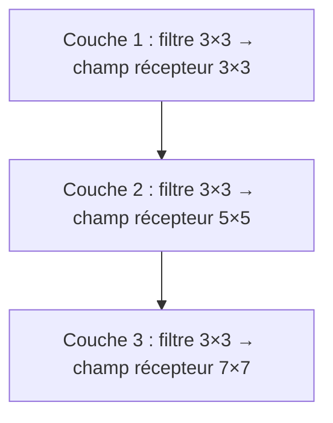
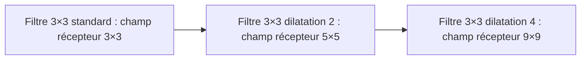
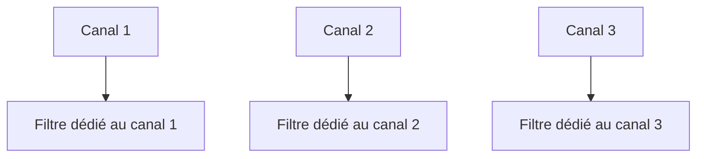
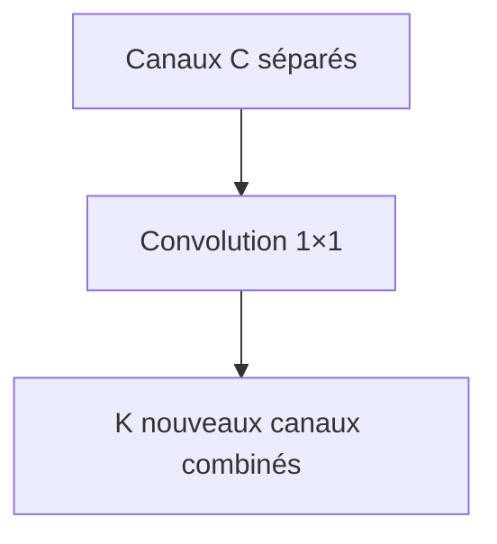
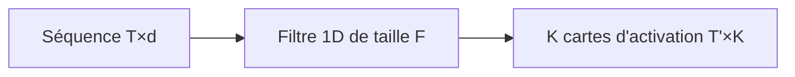
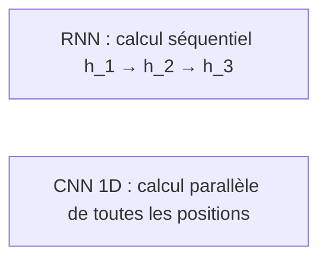

> [!info] Livre « Les CNN et RNN » — chapitre 2/8
> [[Les CNN et RNN — Sommaire|Sommaire]] · [[Les CNN et RNN — 01 — Le principe des CNN|← 01 — Le principe des CNN]] · [[Les CNN et RNN — 03 — Le principe des RNN|03 — Le principe des RNN →]]

# Chapitre B — Les convolutions en profondeur
## B.1. Objectif du chapitre

Dans le chapitre précédent, nous avons posé les bases de la convolution et de l'architecture CNN.

Dans ce chapitre, nous allons aller plus loin et comprendre :

- comment les convolutions s'enchaînent pour construire un champ récepteur progressivement plus grand ;

- ce qu'est le champ récepteur d'un neurone ;

- comment les CNN s'adaptent au traitement multi-échelle ;

- ce que sont les convolutions dilatées ;

- ce que sont les convolutions dépthwise et pointwise ;

- comment les CNN peuvent traiter des séquences.

Ce chapitre approfondit la compréhension des CNN et prépare la comparaison avec les RNN.

---

## B.2. Le champ récepteur

Le **champ récepteur** d'un neurone dans une couche intermédiaire est la région de l'image d'entrée qui influence sa valeur.

Pour un neurone de la première carte d'activation avec un filtre 3×3, le champ récepteur est 3×3.

Mais pour un neurone de la deuxième couche de convolution (avec encore un filtre 3×3), chaque position couvrait déjà 3×3 pixels.

Donc le champ récepteur dans l'image d'entrée est maintenant :

$$(3-1) + 3 = 5 \times 5$$



En empilant des couches, le champ récepteur grandit.

Les couches profondes voient donc une plus grande région de l'image.

C'est une façon d'extraire des informations globales sans augmenter la taille des filtres.

---

## B.3. Formule du champ récepteur

Pour $L$ couches de convolution avec des filtres de taille $F$ et un stride de 1, le champ récepteur est :

$$r_L = 1 + L \times (F - 1)$$

Avec $L=3$ couches et $F=3$ :

$$r_3 = 1 + 3 \times 2 = 7$$

Si nous ajoutons un stride $S > 1$, le champ récepteur grandit encore plus vite.

---

## B.4. Convolutions dilatées

Une façon d'augmenter le champ récepteur sans ajouter de couches est d'utiliser des **convolutions dilatées** (ou *atrous convolutions*).

L'idée est d'espacer les entrées du filtre avec un facteur de dilatation $d$.

Avec $d=1$ (standard) :

```txt
x x x
x x x
x x x
```

Avec $d=2$ (dilatation) :

```txt
x . x . x
. . . . .
x . x . x
. . . . .
x . x . x
```

Le filtre couvre une région plus grande de l'entrée, mais avec le même nombre de paramètres.



Les convolutions dilatées sont très utilisées pour des tâches de segmentation sémantique (comme dans DeepLab).

---

## B.5. Convolutions depthwise et pointwise

Dans les architectures modernes légères, on distingue souvent deux types de convolutions.

### B.5.1 Convolution depthwise

La **convolution depthwise** applique un filtre séparé à chaque canal d'entrée, sans mélanger les canaux.

Pour une entrée de dimensions $H \times W \times C$, elle produit une sortie de dimensions $H' \times W' \times C$.

Chaque canal est traité indépendamment.



### B.5.2 Convolution pointwise

La **convolution pointwise** est une convolution 1×1 qui mélange les canaux.

Elle combine les informations de tous les canaux en chaque position spatiale.



### B.5.3 Convolution separable en profondeur

La combinaison depthwise + pointwise est appelée **separable depthwise convolution**.

Elle réduit le nombre de paramètres et de calculs tout en maintenant une expressivité comparable.

C'est le cœur des architectures légères comme **MobileNet**.

---

## B.6. CNN appliqués aux séquences

Les CNN ne sont pas limités aux images bidimensionnelles.

Ils peuvent aussi être appliqués à des séquences avec des convolutions 1D.

### B.6.1 Convolution 1D

Au lieu de glisser un filtre sur une grille 2D, on le glisse sur une séquence 1D.

Exemple : une phrase de $T$ tokens, chacun représenté par un vecteur de dimension $d$.

```txt
Entrée : T × d
Filtre : F × d × K
Sortie : T' × K
```



### B.6.2 Avantage des CNN sur les séquences

Les convolutions 1D sur des séquences présentent un avantage important par rapport aux RNN : elles sont **parallélisables**.

Toutes les positions peuvent être calculées en même temps.



Mais les CNN 1D ont une limite : le champ récepteur est local et de taille fixe.

Pour capturer des dépendances très longues, il faudrait soit de nombreuses couches, soit des filtres très larges.

---

## B.7. Résumé du chapitre

Dans ce chapitre, nous avons approfondi notre compréhension des CNN.

Nous avons vu que :

- le champ récepteur grandit avec la profondeur du réseau ;

- les convolutions dilatées permettent d'agrandir le champ récepteur sans ajouter de paramètres ;

- les convolutions depthwise et pointwise permettent de réduire le coût computationnel ;

- les convolutions 1D permettent d'appliquer les CNN à des séquences.

Ces outils montrent que les CNN sont polyvalents.

Mais pour les données à dépendances longues ou à structure temporelle forte, les RNN ont été historiquement plus adaptés.

C'est cette complémentarité entre CNN et RNN qui justifie de les étudier ensemble avant d'aborder les Transformers, qui cherchent à combiner le meilleur des deux.

---

## B.8. Questions de compréhension

### Question 1

Qu'est-ce que le champ récepteur d'un neurone dans un CNN ?

Réponse attendue : c'est la région de l'image d'entrée qui influence la valeur de ce neurone.

### Question 2

Comment le champ récepteur évolue-t-il avec la profondeur du réseau ?

Réponse attendue : il grandit à chaque couche supplémentaire de convolution, permettant aux couches profondes de capturer des informations à plus grande échelle.

### Question 3

Qu'est-ce qu'une convolution dilatée ?

Réponse attendue : une convolution où les éléments du filtre sont espacés par un facteur de dilatation, augmentant le champ récepteur sans augmenter le nombre de paramètres.

### Question 4

Quelle est la différence entre une convolution depthwise et une convolution pointwise ?

Réponse attendue : la convolution depthwise traite chaque canal indépendamment ; la convolution pointwise combine les canaux sans tenir compte de la dimension spatiale.

### Question 5

Quel est l'avantage principal des CNN 1D sur les RNN pour le traitement de séquences ?

Réponse attendue : les CNN 1D permettent un calcul parallèle de toutes les positions de la séquence, alors que les RNN doivent les traiter séquentiellement.

---

## B.9. Transition vers la partie RNN

Nous avons maintenant une vision solide des CNN, de leur fonctionnement spatial, et de leurs extensions.

Nous avons vu qu'ils sont bien adaptés aux données spatiales et qu'ils peuvent aussi traiter des séquences, mais avec des champs récepteurs locaux et sans véritable mémoire du passé.

Pour les données où l'ordre et la dépendance temporelle sont centraux — comme le texte ou la parole — nous avons besoin d'une architecture différente.

C'est l'objet de la partie suivante : les **RNN**, ou réseaux de neurones récurrents.

---

---
> [!info] Livre « Les CNN et RNN » — chapitre 2/8
> [[Les CNN et RNN — Sommaire|Sommaire]] · [[Les CNN et RNN — 01 — Le principe des CNN|← 01 — Le principe des CNN]] · [[Les CNN et RNN — 03 — Le principe des RNN|03 — Le principe des RNN →]]
