> [!info] Livre « Les CNN et RNN » — chapitre 3/8
> [[Les CNN et RNN — Sommaire|Sommaire]] · [[Les CNN et RNN — 02 — Les convolutions en profondeur|← 02 — Les convolutions en profondeur]] · [[Les CNN et RNN — 04 — Le problème des dépendances longues|04 — Le problème des dépendances longues →]]

*Partie II — Les réseaux de neurones récurrents (RNN)*

# Chapitre 1 — Le principe des RNN
## 1.1. Objectif du chapitre

Dans le chapitre précédent, nous avons commencé à comprendre comment les modèles de traitement séquentiel fonctionnent avant l’arrivée des Transformers.

Nous avons vu que les **RNN**, ou **réseaux de neurones récurrents**, lisent une séquence élément par élément.

Dans ce chapitre, nous allons entrer plus précisément dans leur fonctionnement interne.

Nous allons comprendre :

- ce qu’est une cellule RNN ;
    
- ce qu’est un état caché ;
    
- comment le modèle transporte une mémoire ;
    
- comment une séquence est traitée pas à pas ;
    
- pourquoi cette mémoire est utile ;
    
- pourquoi elle reste limitée ;
    
- en quoi cette limite préparera l’arrivée des Transformers.
    

L’objectif est simple : nous devons comprendre le fonctionnement des RNN pour mieux comprendre ensuite pourquoi les Transformers ont proposé une rupture.

---

## 1.2. Rappel : une séquence se lit étape par étape

Un RNN traite une séquence dans l’ordre.

Prenons la phrase :

```txt
Le chat dort sur le canapé.
```

Après tokenisation, nous pouvons obtenir :

```txt
["Le", "chat", "dort", "sur", "le", "canapé", "."]
```

Le RNN lit alors les tokens un par un :

```txt
Le → chat → dort → sur → le → canapé → .
```

À chaque étape, il met à jour une représentation interne que nous appelons **état caché**.

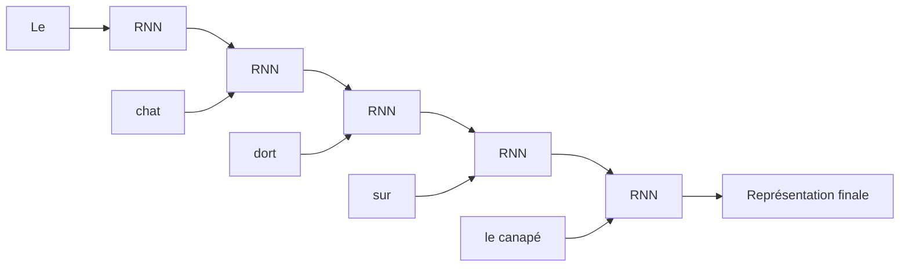

Nous pouvons donc voir le RNN comme un lecteur qui avance dans la phrase en gardant une mémoire de ce qu’il a déjà lu.

---

## 1.3. La cellule RNN

Le cœur d’un RNN est la **cellule récurrente**.

À chaque position $t$, cette cellule reçoit deux informations :

1. l’entrée actuelle $x_t$ ;
    
2. l’état caché précédent $h_{t-1}$.
    

Elle produit ensuite :

1. un nouvel état caché $h_t$ ;
    
2. éventuellement une sortie $y_t$.
    

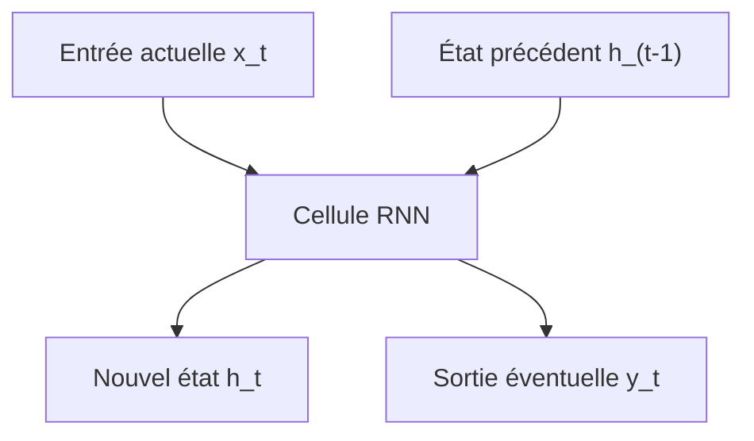

L’idée est très importante :

> Le RNN ne regarde pas seulement le token actuel. Il regarde aussi une mémoire de ce qui a été lu avant.

C’est ce qui distingue un RNN d’un simple réseau dense appliqué indépendamment à chaque mot.

---

## 1.4. La formule fondamentale

Mathématiquement, nous pouvons écrire :


$$h_t = f(x_t, h_{t-1})$$

où :

- $x_t$ est l’entrée au temps $t$ ;
    
- $h_{t-1}$ est l’état caché précédent ;
    
- $h_t$ est le nouvel état caché ;
    
-$f$est une fonction apprise par le réseau.
    

Cette formule dit simplement :

> Le nouvel état dépend à la fois de l’entrée actuelle et de la mémoire précédente.

Dans un RNN classique, on utilise souvent une formule de ce type :

$$h_t = \tanh(W_x x_t + W_h h_{t-1} + b)$$

où :

- $W_x$ est la matrice de poids appliquée à l’entrée actuelle ;
    
- $W_h$ est la matrice de poids appliquée à l’état précédent ;
    
- $b$ est un biais ;
    
- $\tanh$ est une fonction d’activation non linéaire.
    

Nous pouvons la lire ainsi :

```txt
nouvel état = activation(entrée transformée + mémoire transformée + biais)
```

---

## 1.5. Exemple intuitif avec une phrase

Prenons la phrase :

```txt
Le chat dort.
```

Nous pouvons noter :

```txt
x1 = "Le"
x2 = "chat"
x3 = "dort"
x4 = "."
```

Le RNN calcule successivement :

$$h_1 = f(x_1, h_0)$$

$$h_2 = f(x_2, h_1)$$

$$h_3 = f(x_3, h_2)$$

$$h_4 = f(x_4, h_3)$$

L’état initial (h_0) est souvent un vecteur de zéros ou un vecteur appris.

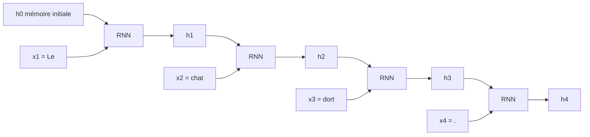

Chaque état contient donc une représentation partielle de la séquence lue jusqu’ici.

---

## 1.6. Ce que contient l’état caché

L’état caché $h_t$ est un vecteur.

Il ne contient pas les mots sous forme lisible.

Il contient une représentation numérique apprise.

Par exemple, après avoir lu :

```txt
Le chat
```

l’état caché peut contenir implicitement des informations comme :

- nous parlons probablement d’un animal ;
    
- le sujet est au singulier ;
    
- une action peut suivre ;
    
- le contexte grammatical est en cours de construction.
    

Évidemment, le modèle ne stocke pas ces informations sous forme de phrases humaines. Il les encode dans des nombres.

Nous pouvons représenter cela ainsi :

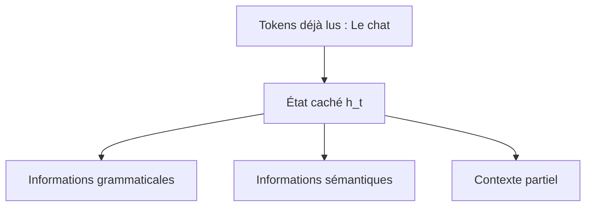

L’état caché est donc une forme de mémoire compressée.

---

## 1.7. RNN déroulé dans le temps

Quand nous dessinons un RNN, nous pouvons le représenter de deux façons.

La première est compacte :

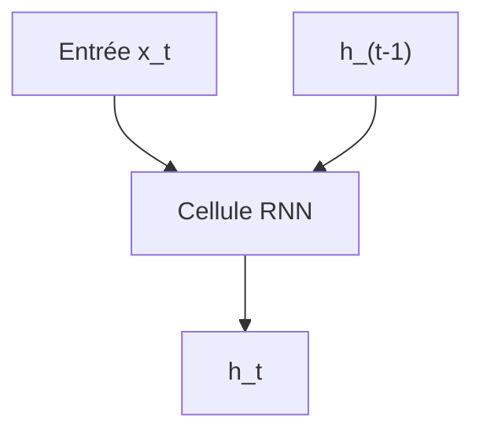

Mais pour comprendre son traitement d’une séquence, nous le **déroulons dans le temps**.

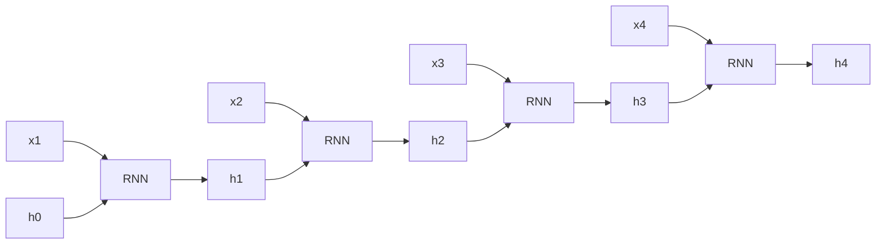

Il faut bien comprendre que les cellules dessinées (R1), (R2), (R3), (R4) représentent généralement **la même cellule RNN réutilisée à chaque étape**.

Autrement dit, les poids sont partagés dans le temps.

---

## 1.8. Partage des poids dans le temps

Un RNN n’apprend pas une matrice différente pour chaque position.

Il utilise les mêmes poids à chaque étape.

Cela signifie que la même transformation est appliquée à :

```txt
x1 avec h0
x2 avec h1
x3 avec h2
x4 avec h3
```

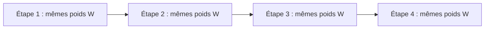

Ce partage des poids a deux avantages :

1. le modèle peut traiter des séquences de longueurs variables ;
    
2. le nombre de paramètres ne dépend pas directement de la longueur de la séquence.
    

C’est une idée élégante : nous apprenons une règle générale de mise à jour de la mémoire, puis nous l’appliquons autant de fois que nécessaire.

---

## 1.9. Dimensions dans un RNN

Supposons que chaque token soit représenté par un embedding de dimension :

$$d_{input}$$

et que l’état caché ait une dimension :

$$d_{hidden}$$

Alors :

$$x_t \in \mathbb{R}^{d_{input}}$$

$$h_t \in \mathbb{R}^{d_{hidden}}$$

La matrice $W_x$ transforme l’entrée vers l’espace caché :

$$W_x \in \mathbb{R}^{d_{hidden} \times d_{input}}$$

La matrice $W_h$ transforme l’état précédent vers le nouvel état caché :

$$W_h \in \mathbb{R}^{d_{hidden} \times d_{hidden}}$$

La formule complète est donc :

$$h_t = \tanh(W_x x_t + W_h h_{t-1} + b)$$

avec :

$$b \in \mathbb{R}^{d_{hidden}}$$

Nous devons retenir que l’état caché est un vecteur de taille fixe, même si la séquence est longue.

C’est un point qui deviendra important pour comprendre les limites des RNN.

---

## 1.10. Sortie à chaque étape ou sortie finale

Un RNN peut être utilisé de plusieurs manières.

### 1.10.1 Sortie finale uniquement

Pour une tâche de classification de phrase, nous pouvons utiliser uniquement le dernier état caché.

Exemple :

```txt
Phrase : Ce film est excellent.
Tâche : sentiment positif ou négatif
```

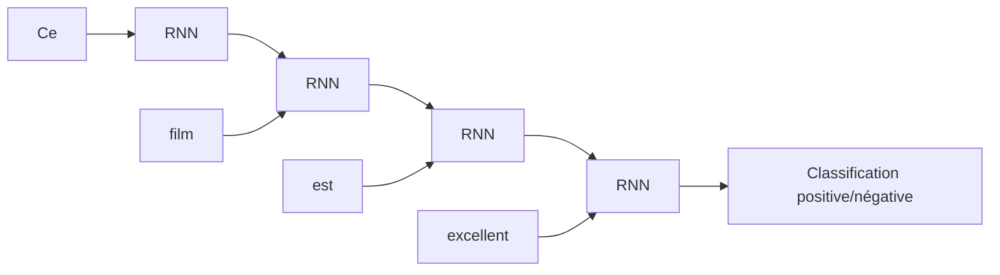

Ici, le dernier état doit résumer toute la phrase.

---

### 1.10.2 Sortie à chaque étape

Pour une tâche d’étiquetage de séquence, nous pouvons produire une sortie à chaque token.

Exemple :

```txt
Phrase : Marie habite Paris.
Tâche : reconnaissance d'entités nommées
```

Nous voulons prédire :

```txt
Marie  → PERSONNE
habite → O
Paris  → LIEU
```

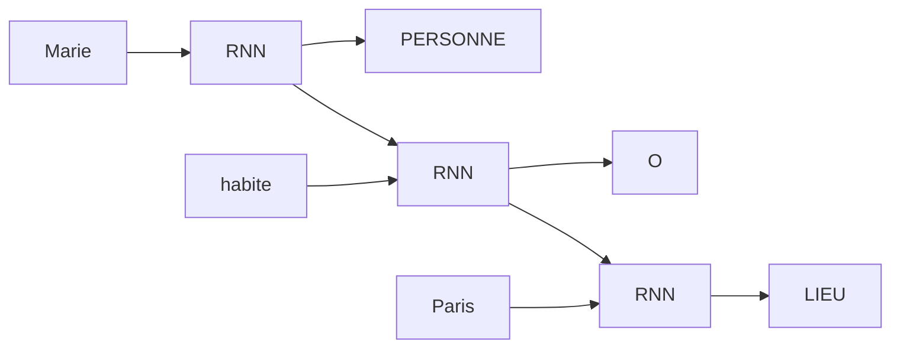

Dans ce cas, chaque état caché sert à produire une prédiction locale.

---

## 1.11. Les grandes configurations des RNN

Nous pouvons classer les usages des RNN selon la forme de l’entrée et de la sortie.

### 1.11.1 One-to-one

Un seul input donne un seul output.

Ce n’est pas vraiment le cas typique des RNN, mais cela correspond à un réseau classique.

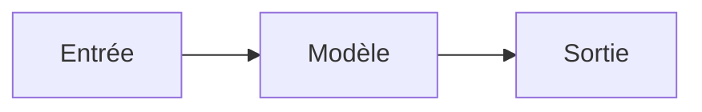

---

### 1.11.2 One-to-many

Une seule entrée produit une séquence.

Exemple : génération de légende d’image.

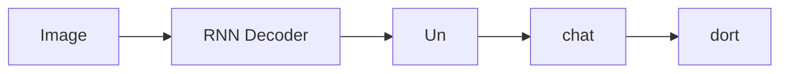

---

### 1.11.3 Many-to-one

Une séquence produit une seule sortie.

Exemple : classification de sentiment.

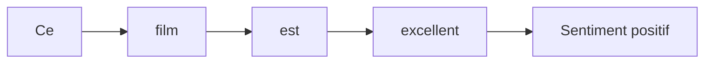

---

### 1.11.4 Many-to-many aligné

Une séquence produit une sortie à chaque position.

Exemple : étiquetage grammatical.

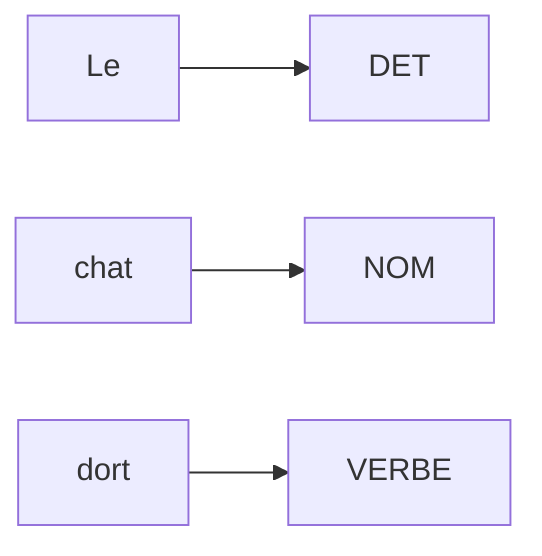

---

### 1.11.5 Many-to-many non aligné

Une séquence produit une autre séquence de longueur différente.

Exemple : traduction automatique.

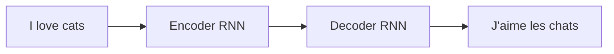

Cette dernière configuration a joué un rôle central avant les Transformers.

---

## 1.12. Le RNN comme mémoire compressée

Nous pouvons maintenant formuler une idée essentielle :

> Dans un RNN, l’état caché est une mémoire compressée de tous les tokens précédents.

Après avoir lu une longue phrase, le dernier état doit contenir les informations nécessaires à la tâche.

Prenons :

```txt
Le livre que Paul a acheté hier dans une petite librairie du centre-ville est passionnant.
```

Si nous voulons classifier cette phrase ou la traduire, le dernier état doit contenir beaucoup d’informations :

- le sujet principal : `Le livre` ;
    
- l’action secondaire : `Paul a acheté` ;
    
- le lieu : `librairie du centre-ville` ;
    
- le prédicat principal : `est passionnant`.
    

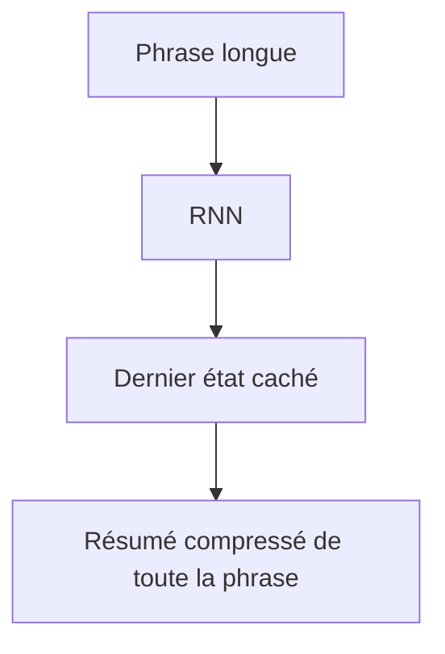

Le problème est que cette mémoire a une taille fixe.

Même si la phrase contient 10 tokens, 100 tokens ou 1000 tokens, l’état caché garde la même dimension.

---

## 1.13. Pourquoi cette mémoire est limitée

La limite principale vient du fait que l’information est transmise étape après étape.

Si une information importante apparaît au début de la séquence, elle doit survivre à toutes les mises à jour successives.

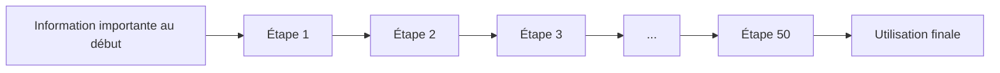

À chaque étape, le modèle peut modifier, écraser ou diluer cette information.

C’est un peu comme si nous devions retenir une phrase longue tout en recevant constamment de nouveaux mots.

Certaines informations anciennes peuvent se perdre.

---

## 1.14. Exemple de dépendance longue

Prenons la phrase :

```txt
Les clés que mon frère a laissées hier dans la voiture de notre voisin sont sur la table.
```

Le verbe `sont` dépend du sujet `Les clés`.

Mais entre les deux, nous avons une longue proposition relative :

```txt
que mon frère a laissées hier dans la voiture de notre voisin
```

Pour comprendre correctement la phrase, le modèle doit conserver l’information :

```txt
sujet = Les clés
nombre = pluriel
```

jusqu’au mot :

```txt
sont
```

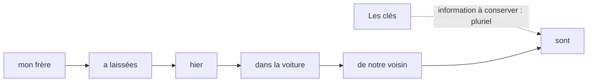

Un RNN peut théoriquement apprendre cette dépendance.

Mais en pratique, plus la distance augmente, plus cela devient difficile.

---

## 1.15. Le problème du gradient

Pour apprendre, un réseau de neurones utilise la rétropropagation.

Dans un RNN, comme la même cellule est répétée dans le temps, nous devons rétropropager l’erreur à travers toutes les étapes.

C’est ce que nous appelons la **Backpropagation Through Time**, ou **BPTT**.

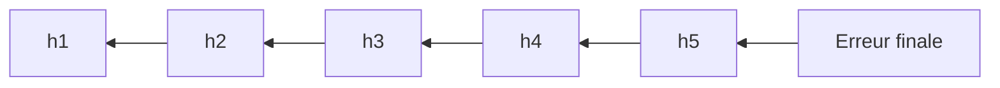

Le problème est que le gradient peut :

- devenir très petit ;
    
- devenir très grand.
    

Nous parlons alors de :

- **vanishing gradient** : gradient qui disparaît ;
    
- **exploding gradient** : gradient qui explose.
    

---

## 1.16. Vanishing gradient

Le **vanishing gradient** se produit quand le signal d’apprentissage devient de plus en plus faible en remontant dans le temps.

Conséquence : les premiers tokens reçoivent un signal de correction très faible.

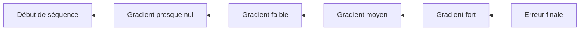

Le modèle apprend donc difficilement que des éléments très anciens influencent la sortie finale.

Cela explique pourquoi les RNN classiques ont du mal avec les dépendances longues.

---

## 1.17. Exploding gradient

À l’inverse, le gradient peut aussi devenir très grand.

Dans ce cas, les poids du modèle peuvent être mis à jour de manière trop brutale.

Cela rend l’entraînement instable.

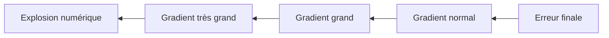

Une technique classique pour limiter ce problème est le **gradient clipping**.

L’idée est de limiter la norme du gradient pour éviter des mises à jour trop importantes.

---

## 1.18. Pourquoi utiliser une fonction tanh ?

Dans un RNN classique, nous utilisons souvent :

$$h_t = \tanh(W_x x_t + W_h h_{t-1} + b)$$

La fonction $\tanh$ renvoie des valeurs entre (-1) et (1).

Cela permet de garder l’état caché dans une plage contrôlée.

```mermaid
flowchart LR
    A["Combinaison linéaire"] --> B["tanh"]
    B --> C["Valeurs entre -1 et 1"]
```

Mais cette saturation peut aussi contribuer au vanishing gradient.

Quand $\tanh$ est saturée, sa dérivée devient très faible.

Donc le signal d’apprentissage peut diminuer rapidement.

---

## 1.19. RNN bidirectionnels

Pour certaines tâches, il est utile de connaître à la fois le contexte gauche et le contexte droit.

Par exemple, dans la phrase :

```txt
Il mange une pomme verte.
```

Pour comprendre `pomme`, il est utile de savoir ce qui vient avant :

```txt
Il mange une
```

mais aussi ce qui vient après :

```txt
verte
```

Les **RNN bidirectionnels** lisent donc la séquence dans les deux sens :

- un RNN de gauche à droite ;
    
- un RNN de droite à gauche.
    

```mermaid
flowchart LR
    A["Token 1"] --> B["Token 2"] --> C["Token 3"] --> D["Token 4"]
    D --> E["RNN backward"]
    C --> E
    B --> E
    A --> E

    A --> F["RNN forward"]
    B --> F
    C --> F
    D --> F
```

Une représentation finale combine alors les deux directions.

```mermaid
flowchart TD
    A["Contexte gauche → droite"] --> C["Représentation du token"]
    B["Contexte droite → gauche"] --> C
```

Les RNN bidirectionnels sont utiles pour des tâches de compréhension, mais ils ne conviennent pas directement à la génération autoregressive, car dans la génération nous ne devons pas regarder les tokens futurs.

---

## 1.20. RNN profonds

Nous pouvons aussi empiler plusieurs couches RNN.

La sortie d’une couche devient l’entrée de la couche suivante.

```mermaid
flowchart TD
    X["Séquence d'entrée"] --> R1["Couche RNN 1"]
    R1 --> R2["Couche RNN 2"]
    R2 --> R3["Couche RNN 3"]
    R3 --> Y["Sortie"]
```

Cela augmente la capacité du modèle.

La première couche peut apprendre des motifs simples.

Les couches supérieures peuvent apprendre des représentations plus abstraites.

Mais cela rend aussi l’entraînement plus difficile, notamment à cause des gradients et du coût séquentiel.

---

## 1.21. RNN pour la génération de texte

Un RNN peut être utilisé pour générer du texte.

L’idée est de prédire le prochain token à partir des tokens précédents.

Par exemple :

```txt
Le chat
```

Le modèle peut prédire :

```txt
dort
```

Puis il réinjecte ce token dans le modèle pour prédire le suivant :

```txt
Le chat dort
```

```mermaid
flowchart LR
    A["Le"] --> R1["RNN"]
    R1 --> B["prédit : chat"]
    B --> R2["RNN"]
    R2 --> C["prédit : dort"]
    C --> R3["RNN"]
    R3 --> D["prédit : ."]
```

Cette logique autoregressive sera aussi présente dans les modèles GPT, mais avec une architecture Transformer decoder-only.

---

## 1.22. Entraînement d’un RNN génératif

Pendant l’entraînement, nous donnons au modèle une séquence réelle et nous lui demandons de prédire le token suivant.

Pour la phrase :

```txt
Le chat dort.
```

Nous créons les couples :

```txt
Entrée : Le       → cible : chat
Entrée : Le chat  → cible : dort
Entrée : Le chat dort → cible : .
```

En pratique, le modèle prédit à chaque position le token suivant.

```mermaid
flowchart TD
    A["Entrée : Le chat dort"] --> B["RNN"]
    B --> C["Prédictions à chaque position"]
    C --> D["Cibles : chat dort ."]
    D --> E["Calcul de la loss"]
```

Cette idée de prédiction du prochain token reste centrale dans les grands modèles de langage modernes.

---

## 1.23. RNN Seq2Seq

Les RNN ont aussi été très utilisés dans les architectures **Seq2Seq**.

Une architecture Seq2Seq comporte deux parties :

1. un encodeur ;
    
2. un décodeur.
    

L’encodeur lit la séquence source.

Le décodeur produit la séquence cible.

Exemple :

```txt
Source : I love cats.
Cible  : J'aime les chats.
```

```mermaid
flowchart LR
    A["I"] --> E1["Encoder RNN"]
    E1 --> E2["Encoder RNN"]
    B["love"] --> E2
    E2 --> E3["Encoder RNN"]
    C["cats"] --> E3
    E3 --> H["Vecteur de contexte"]

    H --> D1["Decoder RNN"]
    D1 --> Y1["J'"]
    D1 --> D2["Decoder RNN"]
    D2 --> Y2["aime"]
    D2 --> D3["Decoder RNN"]
    D3 --> Y3["les chats"]
```

Le vecteur de contexte sert de résumé de la phrase source.

C’est précisément ce résumé unique qui deviendra une limite importante.

---

## 1.24. Limite du vecteur de contexte

Dans un Seq2Seq RNN classique, l’encodeur compresse toute la phrase source dans un seul vecteur.

Pour une phrase courte, cela peut fonctionner :

```txt
I love cats.
```

Mais pour une phrase longue, cela devient difficile :

```txt
Although the committee initially rejected the proposal, it later accepted a revised version after several months of discussion.
```

```mermaid
flowchart LR
    A["Phrase source longue"] --> B["Encoder RNN"]
    B --> C["Vecteur unique"]
    C --> D["Decoder RNN"]
    D --> E["Traduction"]
```

Le décodeur doit produire toute la traduction à partir d’un seul résumé.

Nous avons donc un goulot d’étranglement informationnel.

L’attention est apparue en partie pour résoudre ce problème.

---

## 1.25. Comparaison avec un modèle non récurrent

Pour mieux comprendre le rôle du RNN, comparons deux approches.

### 1.25.1 Modèle sans mémoire

Si nous appliquons un réseau indépendamment à chaque token, le modèle voit seulement le token actuel.

```mermaid
flowchart TD
    A["Token actuel"] --> B["Réseau dense"]
    B --> C["Sortie"]
```

Il ne sait pas ce qui a été lu avant.

### 1.25.2 Modèle récurrent

Un RNN reçoit le token actuel et l’état précédent.

```mermaid
flowchart TD
    A["Token actuel"] --> C["RNN"]
    B["Mémoire précédente"] --> C
    C --> D["Nouvelle mémoire"]
```

Il peut donc accumuler de l’information.

La récurrence est précisément ce mécanisme de réutilisation de l’état précédent.

---

## 1.26. Ce que les RNN ont apporté

Les RNN ont été fondamentaux dans l’histoire du deep learning.

Ils ont permis de traiter des données séquentielles comme :

- le texte ;
    
- la parole ;
    
- les séries temporelles ;
    
- les signaux ;
    
- la musique ;
    
- les logs ;
    
- les séquences biologiques.
    

Ils ont introduit une idée essentielle :

> Une donnée n’est pas toujours indépendante : son interprétation dépend de ce qui précède.

Cette idée reste fondamentale dans les Transformers.

La différence est que les Transformers ne transportent pas l’information de proche en proche de la même façon.

---

## 1.27. Ce que les RNN ne résolvent pas bien

Les RNN classiques ont trois limites majeures.

### 1.27.1 Dépendances longues

Ils ont du mal à conserver des informations importantes pendant de nombreuses étapes.

### 1.27.2 Faible parallélisation

Le calcul de $h_t$ dépend de $h_{t-1}$.

Donc nous ne pouvons pas facilement calculer toutes les positions en parallèle.

```mermaid
flowchart LR
    H1["h1"] --> H2["h2"] --> H3["h3"] --> H4["h4"]
```

### 1.27.3 Compression excessive

Dans les modèles Seq2Seq classiques, toute la séquence source peut devoir être compressée dans un seul vecteur.

Ces trois limites ouvriront la voie :

- aux LSTM et GRU ;
    
- aux mécanismes d’attention ;
    
- puis aux Transformers.
    

---

## 1.28. L’idée clé à retenir

Nous pouvons résumer le principe des RNN ainsi :

> Un RNN lit une séquence pas à pas et met à jour une mémoire interne appelée état caché.

Cette mémoire permet au modèle de tenir compte du contexte précédent.

Mais cette mémoire est :

- compressée ;
    
- mise à jour à chaque étape ;
    
- difficile à préserver sur de longues distances ;
    
- coûteuse à calculer séquentiellement.
    

C’est pourquoi les RNN sont élégants, mais limités pour les très grands modèles de langage.

---

## 1.29. Schéma de synthèse

```mermaid
flowchart TD
    A["Entrée actuelle x_t"] --> C["Cellule RNN"]
    B["État précédent h_(t-1)"] --> C

    C --> D["Nouvel état h_t"]
    D --> E["Mémoire mise à jour"]

    E --> F["Étape suivante"]
    F --> G["Traitement séquentiel"]

    G --> H["Avantage : contexte précédent"]
    G --> I["Limite : dépendances longues"]
    G --> J["Limite : faible parallélisation"]
    G --> K["Limite : mémoire compressée"]
```

---

## 1.30. Questions de compréhension

### Question 1

Quelles sont les deux entrées principales d’une cellule RNN à l’étape $t$ ?

Réponse attendue : l’entrée actuelle $x_t$ et l’état caché précédent $h_{t-1}$.

### Question 2

Que représente l’état caché $h_t$ ?

Réponse attendue : il représente une mémoire numérique de la séquence lue jusqu’à l’étape $t$.

### Question 3

Pourquoi dit-on que les poids d’un RNN sont partagés dans le temps ?

Réponse attendue : parce que la même cellule, avec les mêmes matrices de poids, est appliquée à chaque étape de la séquence.

### Question 4

Quelle est la formule simple d’un RNN ?

Réponse attendue :

$$h_t = f(x_t, h_{t-1})$$

ou, dans une version classique :

$$h_t = \tanh(W_x x_t + W_h h_{t-1} + b)$$
### Question 5

Pourquoi les RNN peuvent-ils traiter des séquences de longueurs variables ?

Réponse attendue : parce que la même cellule peut être appliquée autant de fois qu’il y a de tokens dans la séquence.

### Question 6

Pourquoi les RNN ont-ils du mal avec les dépendances longues ?

Réponse attendue : parce que l’information doit traverser de nombreuses étapes successives, ce qui peut entraîner une perte d’information et un affaiblissement du gradient.

### Question 7

Qu’est-ce que la Backpropagation Through Time ?

Réponse attendue : c’est la rétropropagation du gradient à travers les différentes étapes temporelles d’un RNN déroulé.

### Question 8

Quelle différence faisons-nous entre une sortie finale et une sortie à chaque étape ?

Réponse attendue : une sortie finale est utilisée quand toute la séquence produit une seule prédiction, tandis qu’une sortie à chaque étape est utilisée quand chaque token doit recevoir une prédiction.

---

## 1.31. Transition vers le chapitre suivant

Nous savons maintenant comment fonctionne un RNN classique.

Nous avons compris que son état caché joue le rôle d’une mémoire.

Mais nous avons aussi vu que cette mémoire est limitée, surtout lorsque les dépendances sont longues.

Dans le chapitre suivant, nous allons donc étudier plus précisément le problème des dépendances longues.

Nous verrons pourquoi une information située au début d’une séquence peut être difficile à utiliser beaucoup plus tard, et pourquoi cette difficulté a motivé l’apparition des LSTM, des GRU, puis de l’attention.


---

---
> [!info] Livre « Les CNN et RNN » — chapitre 3/8
> [[Les CNN et RNN — Sommaire|Sommaire]] · [[Les CNN et RNN — 02 — Les convolutions en profondeur|← 02 — Les convolutions en profondeur]] · [[Les CNN et RNN — 04 — Le problème des dépendances longues|04 — Le problème des dépendances longues →]]
