> [!info] Livre « Les CNN et RNN » — chapitre 4/8
> [[Les CNN et RNN — Sommaire|Sommaire]] · [[Les CNN et RNN — 03 — Le principe des RNN|← 03 — Le principe des RNN]] · [[Les CNN et RNN — 05 — Le problème du gradient qui disparaît|05 — Le problème du gradient qui disparaît →]]

# Chapitre 2 — Le problème des dépendances longues
## 2.1. Objectif du chapitre

Dans le chapitre précédent, nous avons étudié le principe des **RNN**.

Nous avons vu qu’un RNN lit une séquence étape par étape, en mettant à jour un **état caché** :

$$h_t = f(x_t, h_{t-1})$$

Cette idée est puissante, car le modèle possède une forme de mémoire.

Mais cette mémoire pose un problème important :

> Plus une information doit être conservée longtemps, plus elle risque d’être perdue, déformée ou écrasée.

Dans ce chapitre, nous allons donc comprendre le problème des **dépendances longues**.

Nous verrons pourquoi ce problème est central dans le traitement du langage naturel, pourquoi les RNN classiques y sont particulièrement sensibles, et pourquoi cette difficulté a motivé l’apparition des LSTM, des GRU, puis des mécanismes d’attention.

---

## 2.2. Une phrase simple : dépendance courte

Commençons par une phrase très simple :

```txt
Le chat dort.
```

Ici, la relation entre le sujet et le verbe est courte :

```txt
Le chat → dort
```

Le modèle doit comprendre que :

- `Le chat` est le sujet ;
    
- `dort` est le verbe ;
    
- l’action de dormir concerne le chat.
    


Dans ce cas, un RNN classique peut souvent gérer correctement la relation.

L’information importante n’a pas besoin de traverser beaucoup d’étapes.

---

## 2.3. Une phrase plus longue : dépendance longue

Prenons maintenant une phrase plus complexe :

```txt
Le livre que Paul a acheté hier dans une petite librairie du centre-ville est passionnant.
```

Le sujet principal est :

```txt
Le livre
```

Le verbe associé est :

```txt
est
```

Mais entre les deux, nous avons beaucoup d’informations intermédiaires :

```txt
que Paul a acheté hier dans une petite librairie du centre-ville
```

Le modèle doit comprendre que :

```txt
Le livre ... est passionnant.
```

et non :

```txt
Paul ... est passionnant.
la librairie ... est passionnant.
le centre-ville ... est passionnant.
```

Le problème est que les RNN doivent transporter l’information importante à travers plusieurs étapes successives.

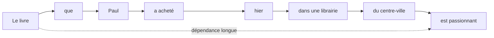

Plus la séquence est longue, plus il devient difficile de conserver les informations importantes.

C’est ce que nous appelons le problème des **dépendances longues**.

---

## 2.4. Qu’est-ce qu’une dépendance longue ?

Une **dépendance longue** apparaît lorsqu’un élément d’une séquence doit être relié à un autre élément éloigné.

Dans le langage naturel, cela arrive très souvent.

Par exemple :

```txt
Les clés que mon frère a laissées dans la voiture sont sur la table.
```

Le sujet principal est :

```txt
Les clés
```

Le verbe principal est :

```txt
sont
```

Le modèle doit donc garder en mémoire que le sujet est pluriel.

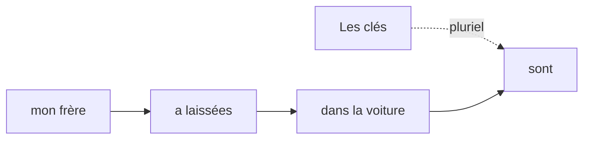

Si le modèle se laisse influencer par `mon frère`, il pourrait produire une mauvaise analyse grammaticale.

Il doit donc être capable de distinguer :

- l’information principale ;
    
- les informations secondaires ;
    
- les groupes syntaxiques imbriqués ;
    
- les relations éloignées mais importantes.
    

---

## 2.5. Pourquoi les dépendances longues sont importantes ?

Les dépendances longues ne sont pas un détail.

Elles sont essentielles pour comprendre correctement :

- la grammaire ;
    
- le sens d’une phrase ;
    
- les références pronominales ;
    
- les accords ;
    
- la structure logique ;
    
- les relations de cause à effet ;
    
- les textes longs ;
    
- les dialogues ;
    
- les programmes informatiques.
    

Prenons un exemple avec un pronom :

```txt
Marie a donné son livre à Julie parce qu’elle partait en voyage.
```

Le pronom :

```txt
elle
```

peut théoriquement désigner :

```txt
Marie
```

ou :

```txt
Julie
```

Pour interpréter correctement la phrase, le modèle doit utiliser le contexte.

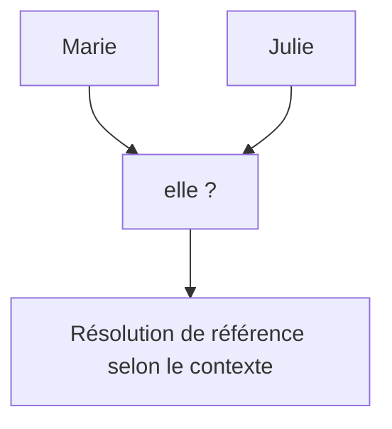

La compréhension du langage dépend donc fortement de la capacité à relier des éléments parfois très éloignés.

---

## 2.6. Le RNN face à une dépendance longue

Dans un RNN, l’information est transmise de proche en proche.

Si une information apparaît au temps (t = 1), mais qu’elle est utile au temps (t = 20), elle doit passer par tous les états intermédiaires :

$$h_1 \rightarrow h_2 \rightarrow h_3 \rightarrow \dots \rightarrow h_{20}$$

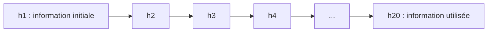

À chaque étape, l’état caché est recalculé :

$$h_t = f(x_t, h_{t-1})$$

Cela signifie que l’information ancienne est constamment mélangée avec une nouvelle entrée.

Le modèle doit apprendre à préserver ce qui est important et à oublier ce qui ne l’est pas.

Mais dans un RNN classique, ce contrôle est assez faible.

---

## 2.7. La mémoire cachée comme résumé compressé

L’état caché d’un RNN a une taille fixe.

Par exemple, il peut avoir une dimension de 256, 512 ou 1024.

Mais la phrase peut être courte ou très longue.

Cela signifie qu’un même vecteur doit parfois résumer beaucoup d’informations.

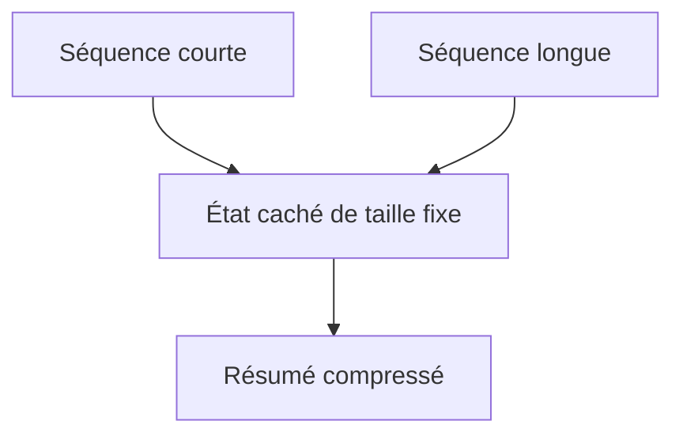

Pour une phrase courte, ce résumé peut suffire.

Pour une phrase longue, il devient difficile de tout conserver.

C’est comme essayer de résumer un roman entier dans une seule phrase : certaines informations seront forcément perdues.

---

## 2.8. Exemple détaillé : sujet et verbe éloignés

Reprenons la phrase :

```txt
Le livre que Paul a acheté hier dans une petite librairie du centre-ville est passionnant.
```

Nous pouvons découper la phrase ainsi :

```txt
[Le livre] [que Paul a acheté hier dans une petite librairie du centre-ville] [est passionnant]
```

La structure principale est :

```txt
Le livre est passionnant.
```

Mais le RNN lit la phrase linéairement :

```txt
Le → livre → que → Paul → a → acheté → hier → dans → une → petite → librairie → du → centre-ville → est → passionnant
```

Quand il arrive à `est`, il doit encore avoir conservé l’information :

```txt
Le livre = sujet principal
```

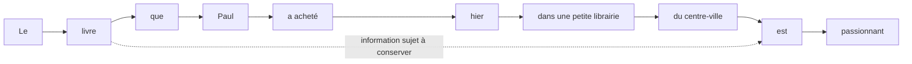

Mais plusieurs informations concurrentes sont apparues entre-temps :

- `Paul` ;
    
- `hier` ;
    
- `librairie` ;
    
- `centre-ville`.
    

Le modèle doit donc ne pas confondre le sujet principal avec les éléments intermédiaires.

---

## 2.9. Dépendance longue et accord grammatical

Les dépendances longues sont particulièrement visibles dans les accords.

Exemple :

```txt
Les propositions que le directeur a présentées pendant la réunion sont intéressantes.
```

Le sujet est :

```txt
Les propositions
```

Le verbe est :

```txt
sont
```

Le modèle doit comprendre que le verbe doit être au pluriel.

Pourtant, plusieurs mots singuliers apparaissent entre les deux :

```txt
le directeur
la réunion
```

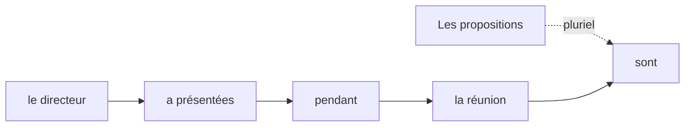

Un modèle faible pourrait être attiré par le nom le plus proche, par exemple `réunion`, et perdre la structure grammaticale globale.

---

## 2.10. Dépendance longue et référence pronominale

Les dépendances longues apparaissent aussi avec les pronoms.

Exemple :

```txt
Thomas a rangé le dossier dans l’armoire avant de partir, mais il ne l’a pas fermé correctement.
```

Le pronom :

```txt
l’
```

renvoie probablement à :

```txt
le dossier
```

Mais plusieurs mots sont apparus entre les deux.

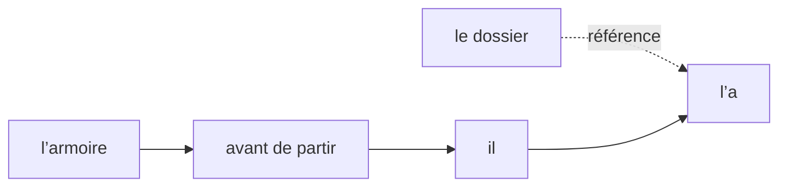

Pour comprendre le texte, le modèle doit résoudre cette référence.

Cela demande une mémoire du contexte, mais aussi une capacité à distinguer les entités mentionnées.

---

## 2.11. Dépendance longue et logique du discours

Dans un texte plus long, une information introduite au début peut être nécessaire beaucoup plus tard.

Exemple :

```txt
Au début du chapitre, nous avons défini la notion d’état caché. Nous allons maintenant expliquer pourquoi cette notion devient problématique lorsque les séquences deviennent longues.
```

Pour comprendre `cette notion`, le modèle doit relier l’expression à :

```txt
la notion d’état caché
```

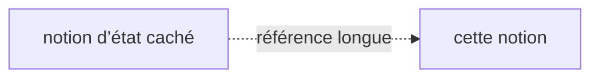

Dans un dialogue, un rapport, un article scientifique ou un document juridique, les dépendances peuvent s’étendre sur plusieurs paragraphes.

C’est une difficulté majeure pour les modèles séquentiels classiques.

---

## 2.12. Pourquoi les RNN oublient-ils ?

Un RNN n’oublie pas volontairement comme un humain.

Mais à chaque étape, il recalcule son état :

$$h_t = \tanh(W_x x_t + W_h h_{t-1} + b)$$

Cela signifie que l’ancien état (h_{t-1}) est transformé puis mélangé avec la nouvelle entrée (x_t).

Si une information ancienne n’est pas renforcée ou protégée, elle peut être progressivement diluée.

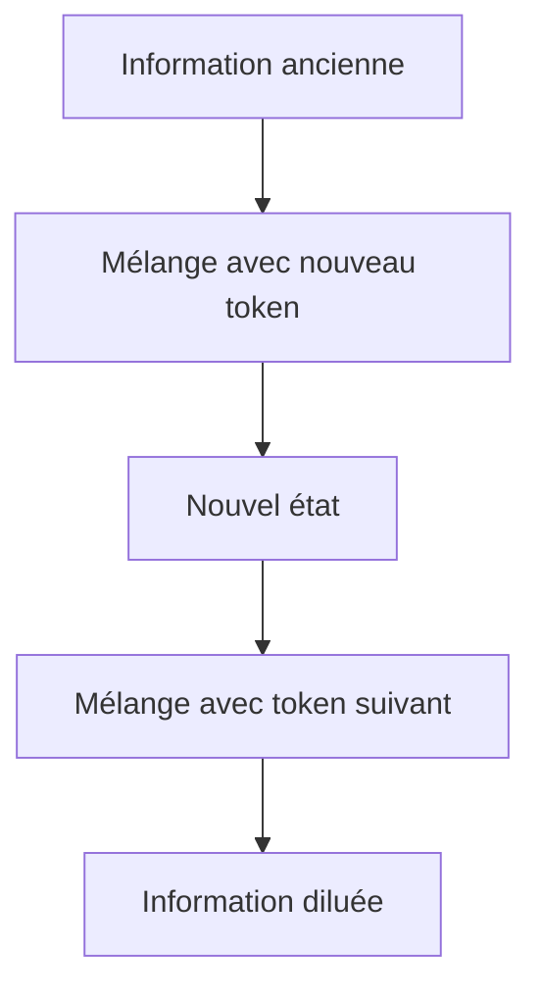

Cette dilution est une des causes pratiques de la difficulté à conserver des dépendances longues.

---

## 2.13. Le lien avec le gradient qui disparaît

Le problème des dépendances longues est aussi lié au problème du **gradient qui disparaît**.

Pendant l’entraînement, si une erreur à la fin de la séquence dépend d’un mot au début, le gradient doit remonter sur beaucoup d’étapes.

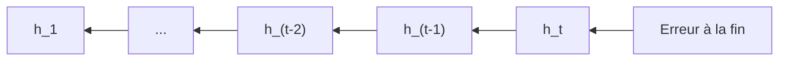

À chaque étape, le gradient peut être multiplié par des valeurs qui le réduisent.

Résultat :

> Le début de la séquence reçoit un signal d’apprentissage très faible.

Donc le modèle apprend difficilement que les premiers mots peuvent être importants pour une décision prise beaucoup plus tard.

---

## 2.14. Exemple pédagogique du gradient

Imaginons que le modèle fasse une erreur sur le verbe :

```txt
Les clés ... est sur la table.
```

au lieu de :

```txt
Les clés ... sont sur la table.
```

L’erreur apparaît au moment de prédire :

```txt
sont
```

Mais pour corriger cette erreur, le modèle doit comprendre que l’information importante était au début :

```txt
Les clés
```

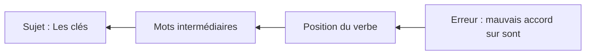

Si le gradient ne remonte pas correctement jusqu’au début, le modèle ne corrige pas bien son comportement.

---

## 2.15. Une difficulté mathématique simple

Dans une chaîne de calculs répétitifs, les gradients sont multipliés plusieurs fois.

Si nous multiplions plusieurs fois par un nombre inférieur à 1, le résultat devient très petit.

Par exemple :

$$0.5^{10} = 0.0009765625$$

$$0.5^{20} = 0.0000009536743164$$

Cela illustre intuitivement pourquoi un signal peut disparaître quand il traverse beaucoup d’étapes.

Inversement, si nous multiplions plusieurs fois par un nombre supérieur à 1, le signal peut exploser.

Par exemple :

$$2^{10} = 1024$$

$$2^{20} = 1,048,576$$

Dans les RNN, les dépendances temporelles longues entraînent ce type de phénomènes lors de la rétropropagation.

---

## 2.16. Dépendance longue et coût séquentiel

Le problème n’est pas seulement la mémoire.

Il est aussi computationnel.

Dans un RNN, pour atteindre le token numéro 100, nous devons avoir calculé les 99 états précédents.

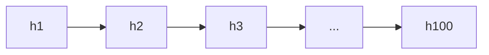

Nous ne pouvons pas facilement calculer (h_{100}) directement.

Cela limite la parallélisation.

Donc les RNN souffrent de deux difficultés liées :

1. ils transportent difficilement l’information sur de longues distances ;
    
2. ils calculent les états dans un ordre strictement séquentiel.
    

Ces deux points seront précisément remis en question par les Transformers.

---

## 2.17. Les LSTM et GRU : une réponse partielle

Les **LSTM** et les **GRU** ont été conçus pour mieux gérer les dépendances longues.

Ils introduisent des mécanismes de portes.

Ces portes permettent au modèle de décider :

- ce qu’il faut oublier ;
    
- ce qu’il faut conserver ;
    
- ce qu’il faut ajouter ;
    
- ce qu’il faut transmettre.
    

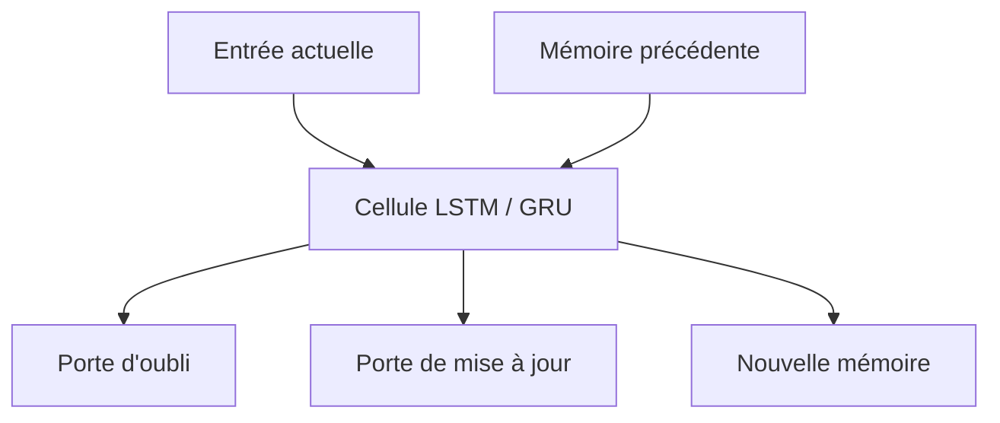

L’idée est de protéger certaines informations importantes contre l’effacement progressif.

Par exemple, si le modèle lit :

```txt
Les clés ...
```

il peut apprendre à conserver l’information :

```txt
sujet pluriel
```

jusqu’au verbe.

Mais même les LSTM et GRU restent fondamentalement séquentiels.

Ils améliorent la mémoire, mais ne suppriment pas complètement le problème.

---

## 2.18. L’attention : une autre manière de résoudre le problème

L’attention propose une idée différente.

Au lieu de forcer le modèle à transporter toute l’information de proche en proche, nous lui permettons de regarder directement les éléments utiles.

Dans une phrase comme :

```txt
Le livre que Paul a acheté hier dans une petite librairie du centre-ville est passionnant.
```

le mot `est` pourrait directement regarder `Le livre`.

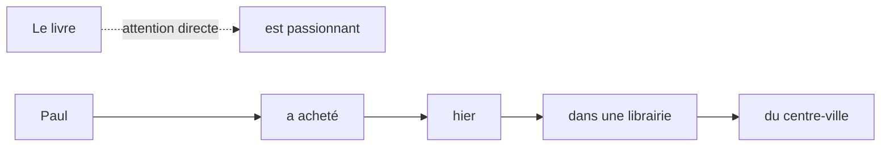

C’est une rupture importante.

Nous ne dépendons plus uniquement d’une mémoire transmise étape par étape.

Nous créons des connexions directes entre les positions pertinentes.

---

## 2.19. Comparaison : RNN contre attention

Dans un RNN, l’information doit suivre un chemin long :


Avec l’attention, le chemin peut être direct :


Cette différence est fondamentale.

Le Transformer utilisera précisément cette idée :

> Chaque token peut regarder directement les autres tokens de la séquence.

Cela ne signifie pas que tout est résolu, mais cela rend les dépendances longues plus accessibles.

---

## 2.20. Exemple avec une matrice d’attention

Imaginons une phrase simplifiée :

```txt
Le livre est passionnant.
```

Nous pouvons représenter les relations entre tokens sous forme de matrice.

Chaque ligne correspond au token qui regarde.

Chaque colonne correspond au token regardé.

```txt
                 Le   livre   est   passionnant
Le              0.2    0.5   0.1       0.2
livre           0.3    0.4   0.1       0.2
est             0.1    0.7   0.1       0.1
passionnant     0.1    0.6   0.2       0.1
```

Ici, nous pouvons imaginer que `est` accorde beaucoup d’attention à `livre`.

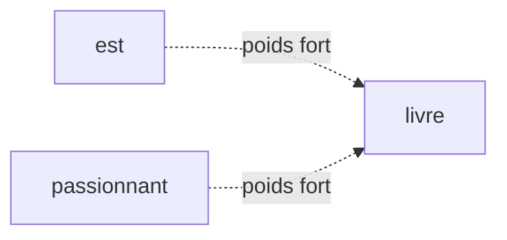

L’attention permet donc au modèle de construire des relations explicites entre positions, même éloignées.

---

## 2.21. Les dépendances longues dans le code informatique

Les dépendances longues ne concernent pas seulement le langage naturel.

Elles sont aussi très importantes dans le code.

Exemple :

```js
function calculerTotal(prix, quantite) {
    const total = prix * quantite;

    // beaucoup de lignes intermédiaires

    return total;
}
```

Le `return total` dépend de la déclaration :

```js
const total = prix * quantite;
```

qui peut être située plusieurs lignes avant.

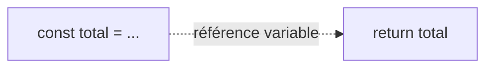

Pour comprendre ou générer du code, un modèle doit pouvoir relier :

- une variable à sa déclaration ;
    
- une fonction à ses appels ;
    
- une classe à ses méthodes ;
    
- une parenthèse ouvrante à sa parenthèse fermante ;
    
- une condition à son bloc associé.
    

Cela explique pourquoi les dépendances longues sont aussi centrales dans les modèles de génération de code.

---

## 2.22. Les dépendances longues dans les séries temporelles

Dans les séries temporelles, un événement ancien peut influencer un événement futur.

Exemple :

```txt
Une anomalie faible apparaît au début d’un signal, puis une panne se produit beaucoup plus tard.
```

Le modèle doit pouvoir relier :

```txt
anomalie faible
```

à :

```txt
panne future
```

```mermaid
flowchart LR
    A["t = 1 : anomalie faible"] -. "influence retardée" .-> B["t = 100 : panne"]
```

Les RNN ont longtemps été utilisés pour ce type de données, mais les architectures attentionnelles sont devenues très intéressantes lorsque les dépendances temporelles sont longues.

---

## 2.23. Les dépendances longues dans un document

Dans un document complet, une information peut être introduite très tôt, puis réutilisée beaucoup plus tard.

Exemple :

```txt
Au début du rapport, nous définissons une politique de confidentialité stricte.
...
Plus loin, nous analysons les conséquences de cette politique sur le traitement des données utilisateurs.
```

L’expression :

```txt
cette politique
```

renvoie à une information précédente.

```mermaid
flowchart TD
    A["Définition initiale"] --> B["Plusieurs paragraphes intermédiaires"]
    B --> C["Référence ultérieure : cette politique"]
    A -. "dépendance documentaire longue" .-> C
```

C’est un problème majeur pour les systèmes de question-réponse, de résumé automatique et de RAG.

---

## 2.24. Pourquoi ce problème prépare les Transformers

Nous pouvons maintenant comprendre pourquoi les Transformers sont apparus.

Les RNN imposent un chemin séquentiel :

```txt
token 1 → token 2 → token 3 → ... → token n
```

Les Transformers proposent une approche différente :

```txt
chaque token peut interagir avec chaque autre token
```

```mermaid
flowchart TD
    A["RNN"] --> B["Information transmise étape par étape"]
    B --> C["Difficulté avec les dépendances longues"]

    D["Transformer"] --> E["Attention entre tous les tokens"]
    E --> F["Accès plus direct aux relations éloignées"]
```

Le problème des dépendances longues est donc l’une des motivations majeures de l’attention et des Transformers.

---

## 2.25. Attention : les Transformers ne sont pas magiques

Il faut toutefois rester prudent.

Les Transformers facilitent les dépendances longues, mais ils ne les résolvent pas parfaitement.

Ils ont leurs propres limites :

- coût quadratique de l’attention ;
    
- longueur de contexte limitée ;
    
- difficulté à hiérarchiser les informations très longues ;
    
- risque de se concentrer sur des corrélations superficielles ;
    
- besoin de beaucoup de données.
    

Mais ils suppriment une contrainte majeure des RNN :

> l’obligation de transmettre toute l’information uniquement de proche en proche.

C’est ce qui explique leur succès dans de nombreuses tâches.

---

## 2.26. Résumé du chapitre

Dans ce chapitre, nous avons étudié le problème des **dépendances longues**.

Nous avons vu qu’une dépendance longue apparaît lorsqu’un élément d’une séquence doit être relié à un autre élément éloigné.

Dans le langage naturel, cela se produit souvent avec :

- les accords sujet-verbe ;
    
- les pronoms ;
    
- les propositions relatives ;
    
- les références dans un texte ;
    
- les relations logiques entre phrases.
    

Les RNN ont du mal avec ces situations, car ils transmettent l’information étape par étape à travers un état caché de taille fixe.

Plus la distance augmente, plus l’information risque d’être diluée, écrasée ou mal transmise.

Ce problème est lié à deux limites majeures :

- la mémoire compressée ;
    
- le gradient qui disparaît.
    

Les LSTM et GRU améliorent la situation grâce à des mécanismes de portes, mais ils restent séquentiels.

L’attention propose une autre solution : permettre à un token de regarder directement les tokens pertinents, même s’ils sont éloignés.

C’est cette idée qui préparera l’architecture Transformer.

---

## 2.27. Schéma de synthèse

```mermaid
flowchart TD
    A["Séquence longue"] --> B["Information importante au début"]
    B --> C["RNN : transmission étape par étape"]
    C --> D["Risque de dilution"]
    C --> E["Gradient qui disparaît"]
    C --> F["Difficulté à apprendre"]

    D --> G["Dépendance longue mal capturée"]
    E --> G
    F --> G

    G --> H["LSTM / GRU"]
    H --> I["Meilleure mémoire mais toujours séquentielle"]

    G --> J["Attention"]
    J --> K["Connexion directe entre tokens éloignés"]

    K --> L["Transformer"]
```

---

## 2.28. Questions de compréhension

### Question 1

Qu’est-ce qu’une dépendance longue ?

Réponse attendue : c’est une relation entre deux éléments éloignés dans une séquence, par exemple un sujet au début d’une phrase et son verbe beaucoup plus loin.

### Question 2

Pourquoi les RNN ont-ils du mal avec les dépendances longues ?

Réponse attendue : parce que l’information doit être transportée étape par étape dans l’état caché, ce qui peut la diluer ou l’effacer progressivement.

### Question 3

Pourquoi l’état caché d’un RNN est-il une mémoire compressée ?

Réponse attendue : parce qu’il doit résumer la séquence déjà lue dans un vecteur de taille fixe.

### Question 4

Quel est le lien entre dépendances longues et vanishing gradient ?

Réponse attendue : pour apprendre une dépendance longue, le gradient doit remonter sur beaucoup d’étapes ; il peut devenir très faible avant d’atteindre les premiers tokens.

### Question 5

Comment les LSTM et GRU améliorent-ils les RNN classiques ?

Réponse attendue : ils ajoutent des mécanismes de portes qui permettent de mieux contrôler ce qui est conservé, oublié ou mis à jour dans la mémoire.

### Question 6

Pourquoi l’attention est-elle intéressante pour les dépendances longues ?

Réponse attendue : parce qu’elle permet à un token de regarder directement un autre token pertinent, même s’il est éloigné dans la séquence.

### Question 7

Pourquoi les Transformers ne résolvent-ils pas tout ?

Réponse attendue : parce que l’attention complète coûte cher en mémoire et en calcul, notamment pour les longues séquences, et parce que la compréhension de très longs contextes reste difficile.

---

## 2.29. Transition vers le chapitre suivant

Nous avons maintenant compris pourquoi les dépendances longues posent problème aux RNN classiques.

Dans le chapitre suivant, nous allons étudier plus précisément le **problème du gradient qui disparaît**.

Nous verrons pourquoi l’apprentissage devient difficile lorsque le signal d’erreur doit traverser de nombreuses étapes, et pourquoi cette difficulté a poussé les chercheurs à concevoir des architectures plus stables comme les LSTM et GRU.

---

---
> [!info] Livre « Les CNN et RNN » — chapitre 4/8
> [[Les CNN et RNN — Sommaire|Sommaire]] · [[Les CNN et RNN — 03 — Le principe des RNN|← 03 — Le principe des RNN]] · [[Les CNN et RNN — 05 — Le problème du gradient qui disparaît|05 — Le problème du gradient qui disparaît →]]
