> [!info] Livre « Les CNN et RNN » — chapitre 5/8
> [[Les CNN et RNN — Sommaire|Sommaire]] · [[Les CNN et RNN — 04 — Le problème des dépendances longues|← 04 — Le problème des dépendances longues]] · [[Les CNN et RNN — 06 — Les LSTM et GRU une amélioration des RNN|06 — Les LSTM et GRU une amélioration des RNN →]]

# Chapitre 3 — Le problème du gradient qui disparaît
## 3.1. Objectif du chapitre

Dans le chapitre précédent, nous avons étudié le problème des **dépendances longues**.

Nous avons vu qu’un RNN peut avoir du mal à relier deux informations éloignées dans une séquence, par exemple :

```txt
Le chat que j’ai vu hier dans la rue près de la gare était noir.
```

Dans cette phrase, le modèle doit comprendre que :

```txt
Le chat ... était noir.
```

Même si beaucoup de mots apparaissent entre `chat` et `était noir`.

Dans ce chapitre, nous allons expliquer une cause majeure de cette difficulté : le **gradient qui disparaît**, appelé en anglais **vanishing gradient**.

Nous allons comprendre :

- ce qu’est un gradient ;
    
- pourquoi il est nécessaire pour apprendre ;
    
- comment fonctionne la rétropropagation dans un RNN ;
    
- pourquoi le signal d’apprentissage peut devenir trop faible ;
    
- pourquoi cela empêche le modèle d’apprendre les dépendances longues ;
    
- comment les LSTM, GRU et Transformers répondent partiellement à ce problème.
    

---

## 3.2. Rappel : comment un modèle apprend-il ?

Un réseau de neurones apprend en corrigeant progressivement ses erreurs.

Prenons une tâche simple : prédire le prochain mot.

Entrée :

```txt
Le chat
```

Cible attendue :

```txt
dort
```

Le modèle produit une prédiction :

```txt
mange
```

Il y a donc une erreur.

Nous calculons alors une fonction de perte, appelée **loss**, qui mesure l’écart entre la prédiction et la bonne réponse.

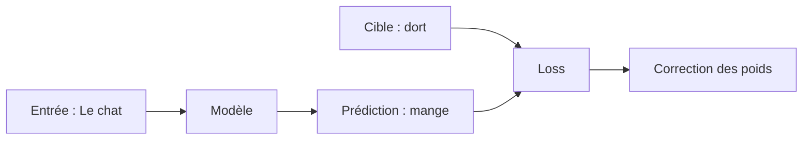

L’objectif de l’entraînement est de modifier les poids du réseau pour réduire cette loss.

---

## 3.3. Qu’est-ce qu’un gradient ?

Le **gradient** indique dans quelle direction modifier les paramètres du modèle pour réduire l’erreur.

Nous pouvons l’imaginer comme une pente.

Si nous sommes sur une montagne et que nous voulons descendre vers une vallée, nous regardons la pente locale pour savoir dans quelle direction aller.

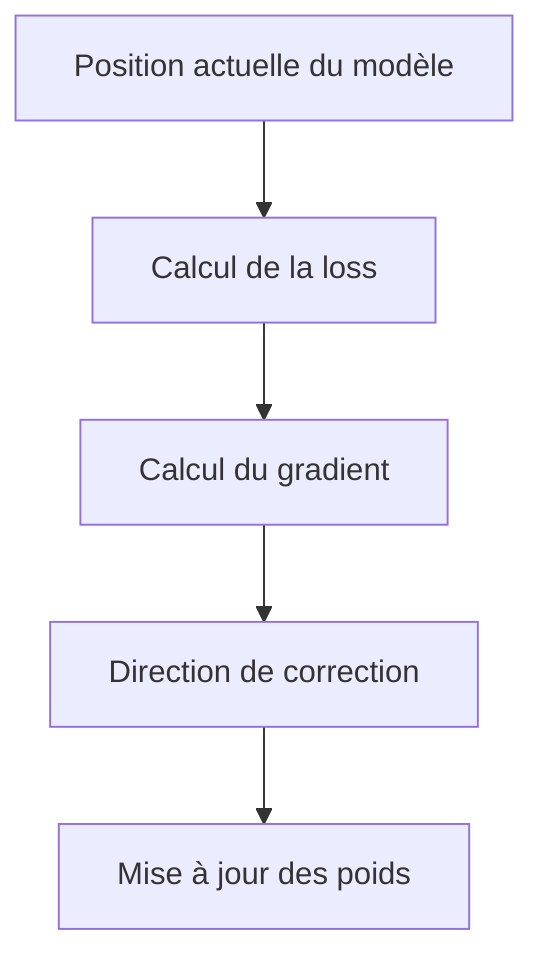

Dans un réseau de neurones, le gradient indique comment chaque poids contribue à l’erreur finale.

Si un poids contribue beaucoup à l’erreur, il doit être corrigé davantage.

Si un poids contribue peu, il est peu modifié.

---

## 3.4. La rétropropagation du gradient

Pour entraîner un réseau de neurones, nous utilisons la **rétropropagation**.

L’idée est la suivante :

1. nous faisons passer les données dans le réseau ;
    
2. le modèle produit une sortie ;
    
3. nous calculons l’erreur ;
    
4. nous faisons remonter cette erreur dans le réseau ;
    
5. nous ajustons les poids.
    

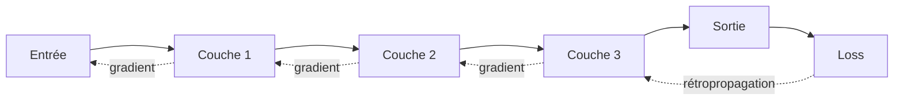

Dans un réseau classique, la rétropropagation traverse les couches.

Dans un RNN, elle traverse aussi les étapes temporelles.

---

## 3.5. Rétropropagation dans un RNN

Dans un RNN, une séquence est traitée étape par étape.

Par exemple :

```txt
Le → chat → dort → .
```

Le RNN calcule :

$$h_1, h_2, h_3, h_4$$

Si l’erreur apparaît à la fin, le gradient doit revenir en arrière à travers les états cachés.

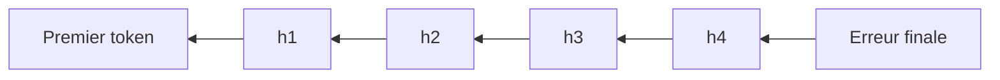

Cette rétropropagation à travers les étapes temporelles s’appelle :

```txt
Backpropagation Through Time
```

ou **BPTT**.

Nous pouvons la traduire par :

> rétropropagation à travers le temps.

---

## 3.6. Pourquoi parle-t-on de “temps” ?

Dans les RNN, le mot **temps** ne désigne pas forcément le temps réel.

Il désigne surtout la position dans la séquence.

Pour une phrase :

```txt
Le chat dort.
```

nous avons :

```txt
t = 1 → Le
t = 2 → chat
t = 3 → dort
t = 4 → .
```

Chaque token correspond à une étape temporelle.

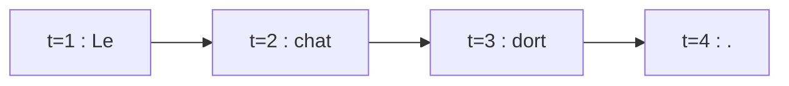

Dans une série temporelle, cela peut correspondre à du vrai temps.

Dans une phrase, cela correspond simplement à l’ordre des tokens.

---

## 3.7. Le problème central

Le problème apparaît lorsque la séquence est longue.

Si une erreur à la fin dépend d’une information au début, le gradient doit traverser beaucoup d’étapes.

Exemple :

```txt
Le chat que j’ai vu hier dans la rue près de la gare était noir.
```

La relation importante est :

```txt
Le chat → était noir
```

Mais entre les deux, le gradient doit traverser de nombreuses positions.

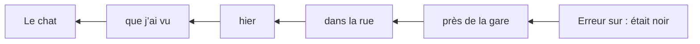

Plus le chemin est long, plus le signal peut s’affaiblir.

---

## 3.8. Définition du vanishing gradient

Le **vanishing gradient** désigne le cas où le gradient devient extrêmement faible pendant la rétropropagation.

Autrement dit, le signal de correction arrive presque nul aux premières étapes.

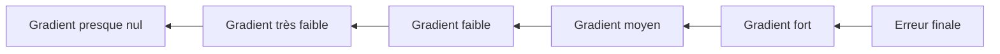

Conséquence :

> Les premiers tokens reçoivent très peu de correction, même s’ils sont importants pour la prédiction finale.

Le modèle apprend donc mal les dépendances longues.

---

## 3.9. Exemple intuitif

Imaginons que le modèle doive apprendre cette relation :

```txt
Les clés ... sont
```

Phrase complète :

```txt
Les clés que mon frère a laissées hier dans la voiture sont sur la table.
```

Si le modèle prédit incorrectement :

```txt
Les clés ... est sur la table.
```

la correction doit remonter jusqu’à :

```txt
Les clés
```

car c’est cette information qui indique le pluriel.

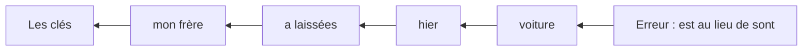

Mais si le gradient disparaît avant d’atteindre `Les clés`, le modèle ne comprend pas bien pourquoi il s’est trompé.

Il risque alors de continuer à faire ce type d’erreur.

---

## 3.10. Pourquoi le gradient diminue-t-il ?

Pour comprendre simplement, nous devons regarder ce qui se passe dans une chaîne de calculs.

Dans un RNN, chaque état dépend de l’état précédent :

$$h_t = f(h_{t-1}, x_t)$$

Donc, pour savoir comment une erreur finale dépend d’un état ancien, nous devons appliquer la règle de dérivation en chaîne.

Cela produit une multiplication de plusieurs termes.

Schématiquement :

 $$  
\frac{\partial L}{\partial h_1}

\frac{\partial L}{\partial h_T}  
\times  
\frac{\partial h_T}{\partial h_{T-1}}  
\times  
\frac{\partial h_{T-1}}{\partial h_{T-2}}  
\times  
\dots  
\times  
\frac{\partial h_2}{\partial h_1}  
$$

Cette formule signifie :

> Pour corriger le début de la séquence, le gradient doit traverser toutes les transformations intermédiaires.

Si beaucoup de facteurs sont inférieurs à 1, le produit devient très petit.

---

## 3.11. Exemple numérique simple

Prenons un exemple simplifié.

Supposons qu’à chaque étape, le gradient soit multiplié par :

$$0.5$$

Après 1 étape :

$$0.5$$

Après 2 étapes :

$$0.5 \times 0.5 = 0.25$$

Après 5 étapes :

$$0.5^5 = 0.03125$$

Après 10 étapes :

$$0.5^{10} = 0.0009765625$$

Après 20 étapes :

$$0.5^{20} \approx 0.00000095$$

Le signal devient quasiment nul.

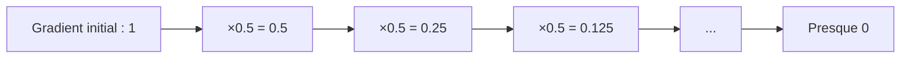

C’est l’intuition fondamentale du vanishing gradient.

---

## 3.12. Le rôle de la fonction d’activation

Dans un RNN classique, nous avons souvent :

$$h_t = \tanh(W_x x_t + W_h h_{t-1} + b)$$

La fonction (\tanh) transforme les valeurs pour les ramener entre (-1) et (1).

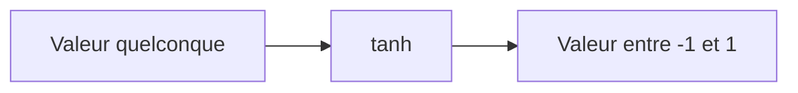

C’est utile pour stabiliser les activations.

Mais cela peut aussi poser problème.

Quand (\tanh) est saturée, sa dérivée devient très faible.

Autrement dit, si les valeurs sont trop grandes ou trop petites, la fonction devient presque plate.

Une fonction presque plate donne un gradient presque nul.

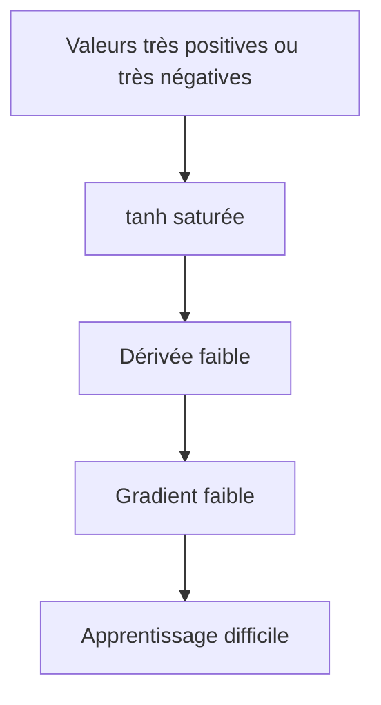

---

## 3.13. Conséquence sur l’apprentissage

Le vanishing gradient ne signifie pas que le modèle ne peut plus rien apprendre.

Il peut encore apprendre des relations courtes.

Par exemple :

```txt
un chat noir
```

Ici, `chat` et `noir` sont proches.

Le gradient n’a pas besoin de traverser beaucoup d’étapes.

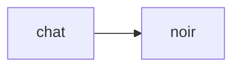

Mais pour une phrase plus longue :

```txt
Le chat que j’ai vu hier dans la rue près de la gare était noir.
```

la relation est plus éloignée :

```txt
chat → noir
```

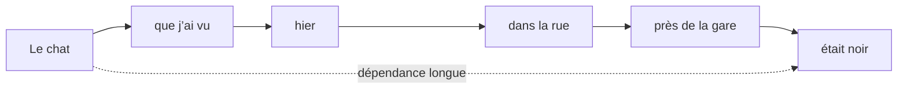

Le modèle peut donc apprendre correctement certaines régularités locales, mais échouer à capturer les dépendances globales.

---

## 3.14. Vanishing gradient et mémoire courte

Le vanishing gradient donne aux RNN classiques une forme de **mémoire courte effective**.

Théoriquement, un RNN peut transporter de l’information sur une séquence très longue.

Mais en pratique, il apprend surtout à exploiter les informations proches.

Nous pouvons résumer ainsi :

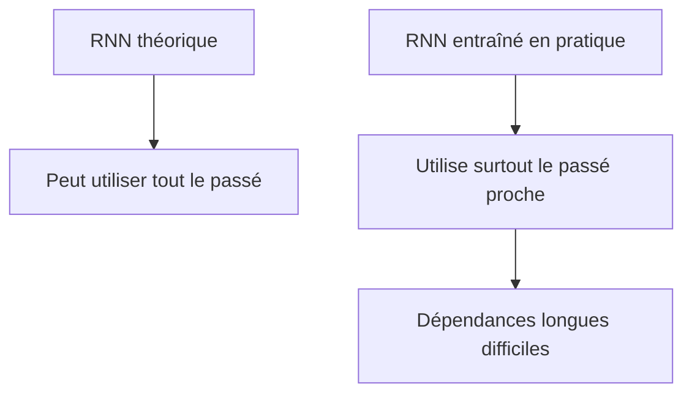

C’est une distinction importante :

> Le problème n’est pas seulement ce que l’architecture peut représenter théoriquement, mais ce qu’elle peut apprendre efficacement.

---

## 3.15. Le problème inverse : exploding gradient

Le gradient peut aussi faire l’inverse : devenir trop grand.

C’est le problème de l’**exploding gradient**, ou **gradient qui explose**.

Si, à chaque étape, le gradient est multiplié par un facteur supérieur à 1, il peut croître très vite.

Par exemple :

$$2^{10} = 1024$$

$$2^{20} = 1,048,576$$

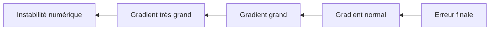

Dans ce cas, les mises à jour des poids deviennent trop importantes.

Le modèle peut devenir instable, voire produire des valeurs numériques invalides.

---

## 3.16. Gradient clipping

Pour limiter l’exploding gradient, on utilise souvent le **gradient clipping**.

L’idée est simple :

> Si le gradient devient trop grand, nous le réduisons avant de mettre à jour les poids.

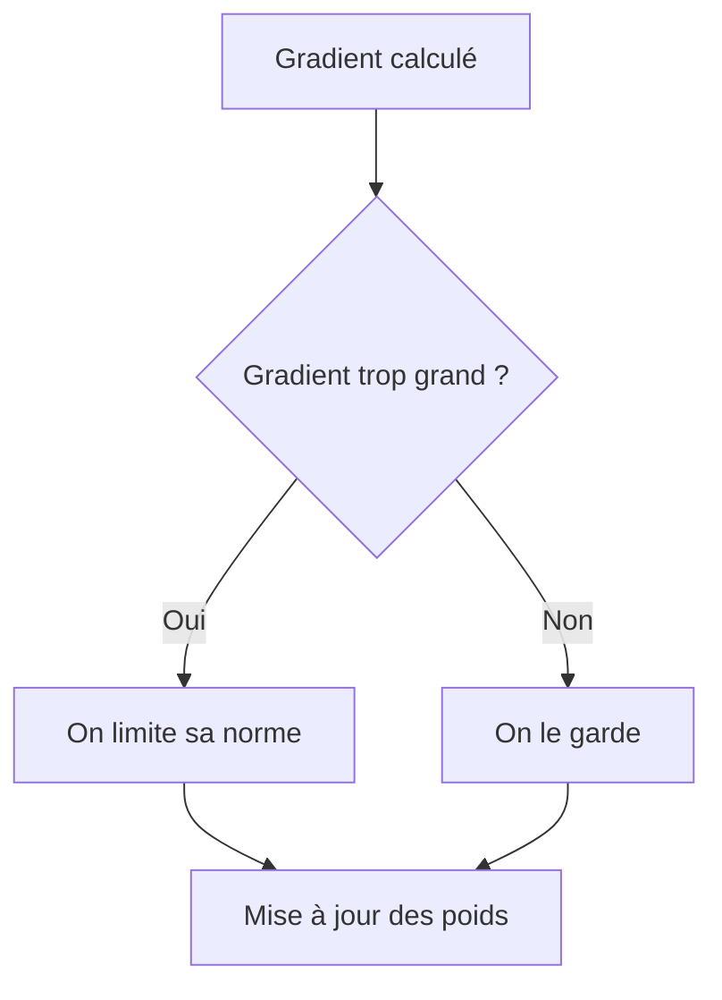

Le gradient clipping ne résout pas vraiment le vanishing gradient.

Il aide surtout contre l’explosion du gradient.

Pour le gradient qui disparaît, il faut modifier l’architecture ou les chemins de gradient.

---

## 3.17. LSTM : une réponse au vanishing gradient

Les **LSTM** ont été conçus pour mieux conserver l’information sur de longues distances.

LSTM signifie :

```txt
Long Short-Term Memory
```

L’idée centrale est d’ajouter une mémoire plus stable, appelée souvent **cell state**.

Cette mémoire peut transporter de l’information avec moins de transformations destructrices.

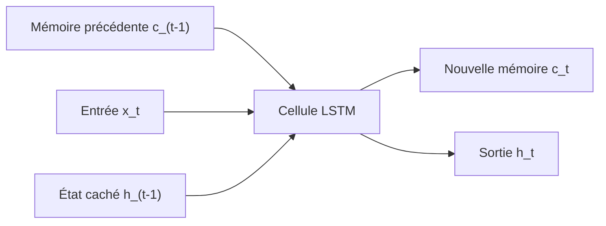

Les LSTM utilisent des portes pour contrôler :

- ce qui est oublié ;
    
- ce qui est ajouté ;
    
- ce qui est transmis.
    

---

## 3.18. Les portes dans un LSTM

Un LSTM contient principalement trois portes :

|Porte|Rôle|
|---|---|
|Porte d’oubli|décide quoi supprimer de la mémoire|
|Porte d’entrée|décide quoi ajouter à la mémoire|
|Porte de sortie|décide quoi exposer comme état caché|

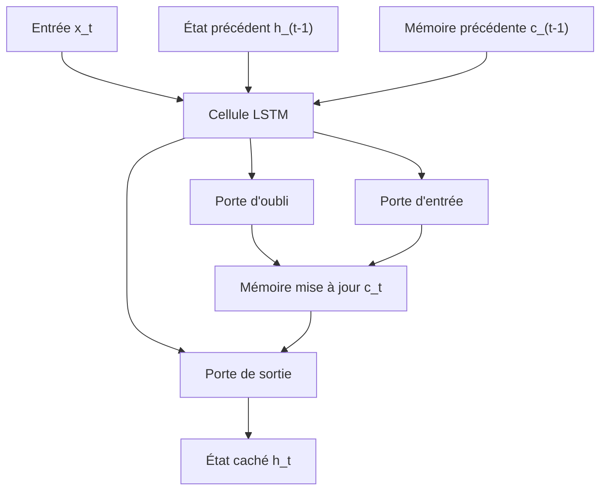

Ces portes permettent au modèle de mieux protéger certaines informations importantes.

Par exemple, dans :

```txt
Les clés que mon frère a laissées dans la voiture sont sur la table.
```

un LSTM peut apprendre à conserver l’information :

```txt
sujet pluriel
```

jusqu’au verbe `sont`.

---

## 3.19. GRU : une version plus compacte

Les **GRU**, ou **Gated Recurrent Units**, sont une autre réponse aux limites des RNN classiques.

Ils sont souvent plus simples que les LSTM.

Ils utilisent notamment :

- une porte de mise à jour ;
    
- une porte de réinitialisation.
    

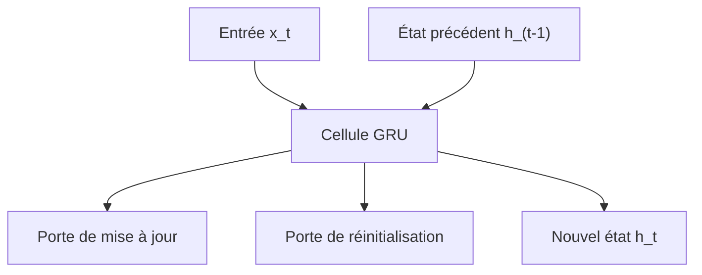

Les GRU cherchent le même objectif général :

> mieux contrôler la circulation de l’information dans le temps.

Ils peuvent être plus rapides à entraîner que les LSTM, tout en donnant souvent de bonnes performances.

---

## 3.20. Limite des LSTM et GRU

Les LSTM et GRU améliorent fortement les RNN classiques.

Mais ils ne suppriment pas toutes les difficultés.

Ils restent :

- séquentiels ;
    
- difficiles à paralléliser ;
    
- coûteux pour les très longues séquences ;
    
- dépendants d’un état transmis étape par étape.
    

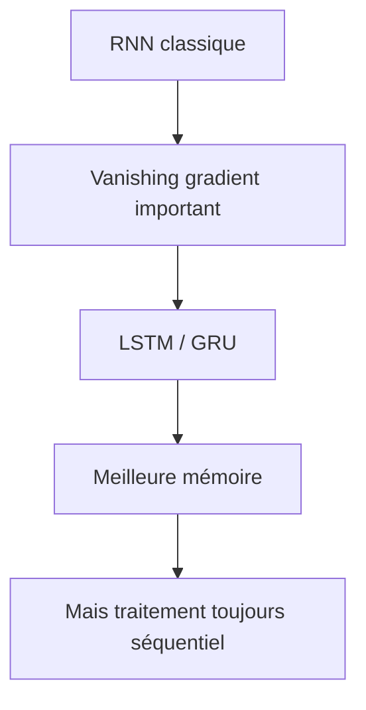

Même avec des portes, l’information circule encore principalement dans l’ordre de la séquence.

C’est précisément ce que les Transformers vont changer.

---

## 3.21. L’attention comme chemin plus court pour le gradient

Avec l’attention, un token peut regarder directement un autre token.

Cela crée des chemins plus courts entre des positions éloignées.

Dans une phrase comme :

```txt
Le chat que j’ai vu hier dans la rue près de la gare était noir.
```

le token `noir` peut accorder de l’attention directement à `chat`.

```mermaid
flowchart LR
    A["Le chat"] -. "attention directe" .-> F["était noir"]
    B["que j’ai vu"] --> C["hier"]
    C --> D["dans la rue"]
    D --> E["près de la gare"]
```

Cela ne signifie pas que le gradient ne pose plus jamais problème, mais cela réduit fortement la dépendance à une chaîne temporelle longue.

Le chemin entre deux tokens importants peut devenir beaucoup plus direct.

---

## 3.22. RNN contre Transformer : chemin de gradient

Dans un RNN, pour relier le token 1 au token 10, le signal passe par toutes les étapes :

```mermaid
flowchart LR
    A["Token 1"] --> B["Token 2"]
    B --> C["Token 3"]
    C --> D["..."]
    D --> E["Token 10"]
```

Dans un Transformer avec self-attention, le token 10 peut accéder directement au token 1 :

```mermaid
flowchart LR
    A["Token 1"] -. "attention" .-> E["Token 10"]
```

Cette différence est une motivation majeure du Transformer.

---

## 3.23. Le lien avec “Attention Is All You Need”

Le papier **Attention Is All You Need** propose de supprimer complètement la récurrence.

Cela signifie que nous n’avons plus besoin de propager l’information uniquement ainsi :

```txt
h1 → h2 → h3 → h4 → ... → hn
```

À la place, nous construisons des représentations où chaque token peut interagir avec les autres via l’attention.

```mermaid
flowchart TD
    A["RNN"] --> B["Chaîne temporelle"]
    B --> C["Gradient traverse de nombreuses étapes"]

    D["Transformer"] --> E["Self-attention"]
    E --> F["Relations directes entre positions"]
```

C’est l’une des raisons pour lesquelles les Transformers ont permis de meilleurs résultats sur les longues séquences et un entraînement plus efficace sur matériel parallèle.

---

## 3.24. Attention : le problème n’est pas entièrement supprimé

Il serait faux de dire que les Transformers n’ont plus aucun problème de gradient.

Les grands modèles profonds peuvent encore rencontrer :

- des problèmes de stabilité ;
    
- des gradients mal conditionnés ;
    
- des difficultés d’optimisation ;
    
- des problèmes liés à la profondeur ;
    
- des problèmes liés à la longueur de contexte.
    

C’est pourquoi les Transformers utilisent aussi :

- des connexions résiduelles ;
    
- de la normalisation ;
    
- des initialisations adaptées ;
    
- des optimiseurs comme Adam ;
    
- des schedules de learning rate ;
    
- parfois du gradient clipping.
    

Mais ils évitent une limite majeure des RNN :

> l’obligation de transmettre toute l’information dans une chaîne temporelle strictement séquentielle.

---

## 3.25. Exemple comparatif complet

Prenons la phrase :

```txt
La décision que le comité a longuement discutée pendant plusieurs réunions a été validée.
```

La relation principale est :

```txt
La décision → a été validée
```

### Avec un RNN

L’information `La décision` doit traverser :

```txt
que → le comité → a longuement discutée → pendant → plusieurs réunions
```

avant d’être utilisée.

```mermaid
flowchart LR
    A["La décision"] --> B["que"]
    B --> C["le comité"]
    C --> D["a discutée"]
    D --> E["pendant plusieurs réunions"]
    E --> F["a été validée"]

    A -. "information à conserver longtemps" .-> F
```

### Avec l’attention

Le token correspondant à `validée` peut apprendre à regarder directement `La décision`.

```mermaid
flowchart LR
    A["La décision"] -. "attention directe" .-> F["validée"]
    B["le comité"] --> C["a discutée"]
    C --> D["pendant plusieurs réunions"]
```

Cette connexion directe facilite l’apprentissage de la relation.

---

## 3.26. Ce qu’il faut retenir mathématiquement

Le point mathématique essentiel est que le gradient dans un RNN traverse une chaîne de dépendances.

Si la sortie finale dépend d’un état ancien, la correction doit passer par beaucoup de dérivées intermédiaires.

Schématiquement :

$$  
\frac{\partial L}{\partial h_1}

\frac{\partial L}{\partial h_T}  
\prod_{t=2}^{T}  
\frac{\partial h_t}{\partial h_{t-1}}  
$$

Cette multiplication répétée peut rendre le gradient :

- très petit : vanishing gradient ;
    
- très grand : exploding gradient.
    

Dans le cas du vanishing gradient, les premières étapes n’apprennent presque plus.

---

## 3.27. Ce qu’il faut retenir intuitivement

Nous pouvons retenir l’image suivante.

Un RNN doit transmettre un message de personne en personne.

```mermaid
flowchart LR
    A["Message initial"] --> B["Personne 1"]
    B --> C["Personne 2"]
    C --> D["Personne 3"]
    D --> E["..."]
    E --> F["Personne 20"]
```

À chaque transmission, le message peut être légèrement modifié ou affaibli.

Au bout d’un grand nombre de transmissions, le message original peut être perdu.

L’attention, elle, permettrait à la personne 20 de demander directement l’information à la personne 1.

```mermaid
flowchart LR
    A["Personne 1"] -. "connexion directe" .-> F["Personne 20"]
```

C’est cette intuition qui nous aidera à comprendre le cœur des Transformers.

---

## 3.28. Résumé du chapitre

Dans ce chapitre, nous avons étudié le **gradient qui disparaît**.

Nous avons vu que les RNN apprennent grâce à la rétropropagation à travers le temps.

Quand une erreur finale dépend d’un élément ancien de la séquence, le gradient doit remonter à travers de nombreuses étapes.

À chaque étape, le signal peut être réduit.

Si cette réduction se répète plusieurs fois, le gradient devient presque nul.

Conséquence :

> Le modèle apprend mal les relations éloignées.

Il peut apprendre correctement des dépendances courtes comme :

```txt
un chat noir
```

mais il aura plus de difficulté avec :

```txt
Le chat que j’ai vu hier dans la rue près de la gare était noir.
```

Les LSTM et GRU améliorent cette situation en ajoutant des mécanismes de portes.

Mais ils restent séquentiels.

Les Transformers proposent une autre solution : utiliser l’attention pour créer des relations directes entre tokens éloignés.

---

## 3.29. Schéma de synthèse

```mermaid
flowchart TD
    A["Erreur finale"] --> B["Rétropropagation dans le temps"]
    B --> C["Gradient traverse de nombreuses étapes"]
    C --> D{"Multiplications répétées"}

    D --> E["Facteurs < 1"]
    E --> F["Gradient qui disparaît"]
    F --> G["Début de séquence peu corrigé"]
    G --> H["Dépendances longues mal apprises"]

    D --> I["Facteurs > 1"]
    I --> J["Gradient qui explose"]
    J --> K["Entraînement instable"]

    H --> L["LSTM / GRU"]
    L --> M["Meilleure mémoire"]

    H --> N["Attention"]
    N --> O["Chemins plus directs entre tokens"]
```

---

## 3.30. Questions de compréhension

### Question 1

Qu’est-ce que la rétropropagation du gradient ?

Réponse attendue : c’est le mécanisme qui permet de calculer comment modifier les poids du modèle pour réduire l’erreur.

### Question 2

Pourquoi parle-t-on de Backpropagation Through Time dans les RNN ?

Réponse attendue : parce que le RNN est déroulé sur les différentes étapes de la séquence, et que le gradient doit remonter à travers ces étapes temporelles.

### Question 3

Qu’est-ce que le vanishing gradient ?

Réponse attendue : c’est le phénomène où le gradient devient très faible pendant la rétropropagation, au point que les premières couches ou premières étapes apprennent très peu.

### Question 4

Pourquoi le vanishing gradient gêne-t-il l’apprentissage des dépendances longues ?

Réponse attendue : parce que les informations anciennes reçoivent un signal de correction trop faible, même si elles sont importantes pour une erreur observée plus tard.

### Question 5

Quelle est la différence entre vanishing gradient et exploding gradient ?

Réponse attendue : dans le vanishing gradient, le gradient devient trop petit ; dans l’exploding gradient, il devient trop grand et rend l’entraînement instable.

### Question 6

Quel est le rôle du gradient clipping ?

Réponse attendue : il limite la taille du gradient lorsqu’il devient trop grand, afin d’éviter les mises à jour instables.

### Question 7

Pourquoi les LSTM et GRU aident-ils ?

Réponse attendue : ils ajoutent des portes qui contrôlent mieux la mémoire et permettent de conserver certaines informations plus longtemps.

### Question 8

Pourquoi l’attention aide-t-elle aussi ?

Réponse attendue : elle permet de créer des connexions directes entre tokens éloignés, ce qui réduit la dépendance à une transmission étape par étape.

---

## 3.31. Transition vers le chapitre suivant

Nous avons maintenant compris pourquoi les RNN classiques ont du mal à apprendre les relations éloignées : le signal d’apprentissage peut disparaître en remontant dans le temps.

Dans le chapitre suivant, nous allons étudier les **LSTM et GRU**, qui ont été conçus précisément pour améliorer la mémoire des RNN.

Nous verrons comment ces architectures ajoutent des portes de contrôle pour décider :

- quoi oublier ;
    
- quoi conserver ;
    
- quoi ajouter ;
    
- quoi transmettre.
    

Cela nous permettra de comprendre pourquoi les LSTM ont représenté une étape importante avant l’arrivée des Transformers.

---

---
> [!info] Livre « Les CNN et RNN » — chapitre 5/8
> [[Les CNN et RNN — Sommaire|Sommaire]] · [[Les CNN et RNN — 04 — Le problème des dépendances longues|← 04 — Le problème des dépendances longues]] · [[Les CNN et RNN — 06 — Les LSTM et GRU une amélioration des RNN|06 — Les LSTM et GRU une amélioration des RNN →]]
