> [!info] Livre « Les CNN et RNN » — chapitre 6/8
> [[Les CNN et RNN — Sommaire|Sommaire]] · [[Les CNN et RNN — 05 — Le problème du gradient qui disparaît|← 05 — Le problème du gradient qui disparaît]] · [[Les CNN et RNN — 07 — Le problème de la parallélisation|07 — Le problème de la parallélisation →]]

# Chapitre 4 — Les LSTM et GRU : une amélioration des RNN
## 4.1. Objectif du chapitre

Dans les chapitres précédents, nous avons étudié deux limites majeures des RNN classiques :

1. le problème des **dépendances longues** ;
    
2. le problème du **gradient qui disparaît**.
    

Nous avons vu qu’un RNN classique possède une mémoire sous forme d’état caché :

$$h_t = f(x_t, h_{t-1})$$

Mais cette mémoire est fragile.

À chaque étape, elle est modifiée, mélangée avec une nouvelle entrée, puis transmise à l’étape suivante.

Cela rend difficile la conservation d’une information importante pendant longtemps.

Pour limiter ces problèmes, des architectures plus avancées ont été proposées, notamment :

- les **LSTM** ;
    
- les **GRU**.
    

Ces modèles ajoutent des mécanismes de contrôle de la mémoire.

L’idée est de permettre au réseau de décider :

- quoi oublier ;
    
- quoi conserver ;
    
- quoi mettre à jour ;
    
- quoi transmettre.
    

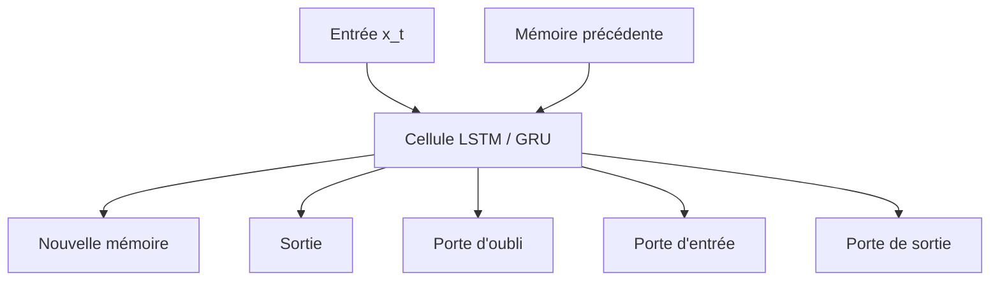

Les LSTM et GRU ont beaucoup amélioré la capacité des réseaux à traiter des séquences.

Mais ils conservent une limite importante :

> Ils traitent toujours les éléments principalement les uns après les autres.

Cette nature séquentielle devient un problème lorsque nous voulons entraîner de grands modèles sur beaucoup de données.

---

## 4.2. Pourquoi les RNN classiques sont insuffisants ?

Reprenons la formule simplifiée d’un RNN classique :

$$h_t = \tanh(W_x x_t + W_h h_{t-1} + b)$$

À chaque étape, le nouvel état caché (h_t) dépend :

- du token actuel (x_t) ;
    
- de l’état caché précédent (h_{t-1}).
    

Le problème est que cette mise à jour est assez brutale.

L’état précédent est transformé, combiné avec la nouvelle entrée, puis passé dans une fonction d’activation.

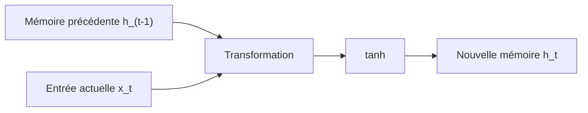

Le modèle n’a pas de mécanisme explicite pour dire :

```txt
Cette information est très importante, il faut la garder longtemps.
```

ou :

```txt
Cette information n’est plus utile, nous pouvons l’oublier.
```

Tout passe par la même mise à jour.

Les LSTM et GRU introduisent donc une idée centrale :

> Nous allons ajouter des portes qui contrôlent le flux d’information.

---

## 4.3. L’idée des portes

Une **porte**, dans un réseau récurrent, est un mécanisme qui décide quelle quantité d’information doit passer.

Nous pouvons l’imaginer comme un robinet.

- Si la porte vaut près de 0, l’information est bloquée.
    
- Si la porte vaut près de 1, l’information passe.
    
- Si la porte vaut une valeur intermédiaire, l’information passe partiellement.
    

Mathématiquement, une porte est souvent calculée avec une fonction sigmoïde :

$$\sigma(z) = \frac{1}{1 + e^{-z}}$$

Cette fonction renvoie une valeur entre 0 et 1.

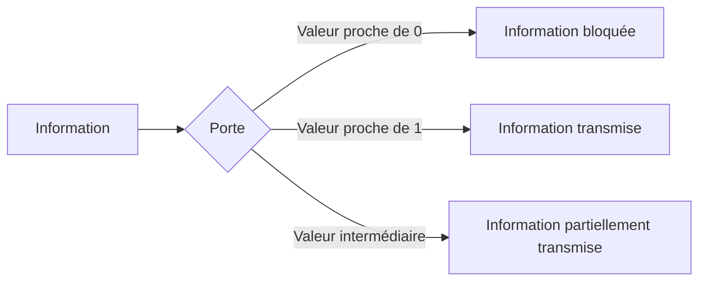

Dans les LSTM et GRU, ces portes sont apprises automatiquement pendant l’entraînement.

Le modèle apprend donc à contrôler sa mémoire.

---

## 4.4. Intuition générale des LSTM

LSTM signifie :

```txt
Long Short-Term Memory
```

En français, nous pourrions traduire par :

```txt
mémoire à long et court terme
```

Le LSTM a été conçu pour mieux conserver les informations importantes sur de longues distances.

L’idée centrale est d’ajouter une mémoire plus stable appelée :

$$c_t$$

Cette mémoire est souvent appelée **cell state**.

Nous avons donc deux états principaux :

- (h_t) : l’état caché, utilisé comme sortie de la cellule ;
    
- (c_t) : l’état de cellule, qui transporte la mémoire à plus long terme.
    

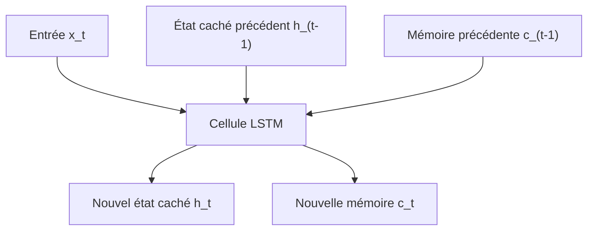

La différence avec un RNN classique est importante.

Dans un RNN classique, nous avons principalement :

$$h_t$$

Dans un LSTM, nous avons :

$$h_t \quad \text{et} \quad c_t$$

Le LSTM sépare donc davantage :

- la mémoire interne ;
    
- la sortie exposée à l’étape suivante.
    

---

## 4.5. Pourquoi ajouter une mémoire de cellule ?

Dans un RNN classique, la mémoire est constamment recalculée.

Dans un LSTM, la mémoire de cellule (c_t) peut être transmise plus directement d’une étape à l’autre.

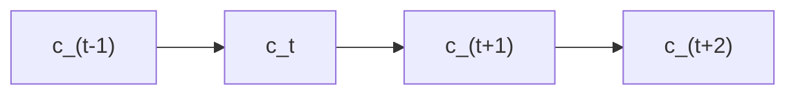

Cette circulation plus directe facilite le passage du gradient.

Autrement dit, l’information importante peut survivre plus longtemps.

Cela ne rend pas le modèle parfait, mais cela améliore fortement la capacité à apprendre des dépendances longues.

---

## 4.6. Les trois portes principales du LSTM

Un LSTM utilise principalement trois portes :

1. la **porte d’oubli** ;
    
2. la **porte d’entrée** ;
    
3. la **porte de sortie**.
    

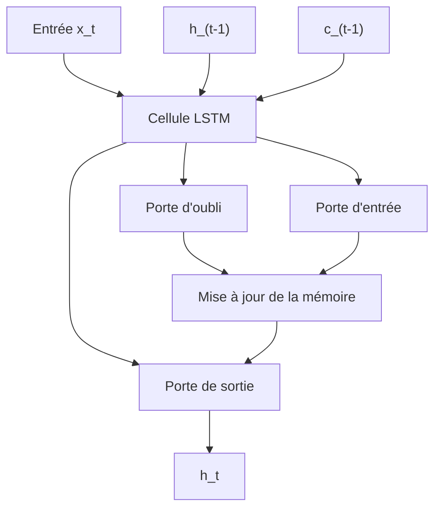

Ces trois portes répondent à trois questions :

|Porte|Question posée|
|---|---|
|Porte d’oubli|Que devons-nous supprimer de l’ancienne mémoire ?|
|Porte d’entrée|Quelle nouvelle information devons-nous ajouter ?|
|Porte de sortie|Quelle partie de la mémoire devons-nous exposer en sortie ?|

---

## 4.7. La porte d’oubli

La **porte d’oubli** décide quelle partie de l’ancienne mémoire doit être conservée ou supprimée.

Elle prend en compte :

- l’entrée actuelle (x_t) ;
    
- l’état caché précédent (h_{t-1}).
    

Elle produit un vecteur (f_t), dont les valeurs sont entre 0 et 1.

$$f_t = \sigma(W_f [h_{t-1}, x_t] + b_f)$$

où :

- (f_t) est la porte d’oubli ;
    
- (W_f) est une matrice de poids ;
    
- (b_f) est un biais ;
    
- (\sigma) est la fonction sigmoïde ;
    
- ([h_{t-1}, x_t]) représente la concaténation de l’état précédent et de l’entrée actuelle.
    

Si une composante de (f_t) est proche de 0, l’information correspondante est oubliée.

Si elle est proche de 1, elle est conservée.

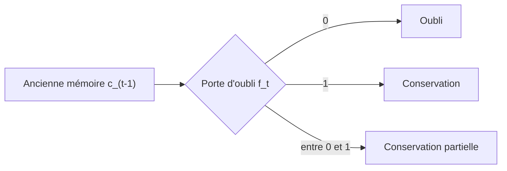

Exemple intuitif :

Si nous lisons :

```txt
Marie habitait à Lille. Elle a ensuite déménagé à Toulouse.
```

Quand le modèle lit `Toulouse`, il peut apprendre à diminuer l’importance de l’ancienne information `Lille` pour la résidence actuelle.

---

## 4.8. La porte d’entrée

La **porte d’entrée** décide quelles nouvelles informations doivent être ajoutées à la mémoire.

Elle est généralement associée à deux calculs :

1. une porte d’entrée (i_t) ;
    
2. une mémoire candidate (\tilde{c}_t).
    

La porte d’entrée :

$$i_t = \sigma(W_i [h_{t-1}, x_t] + b_i)$$

La mémoire candidate :

$$\tilde{c}_t = \tanh(W_c [h_{t-1}, x_t] + b_c)$$

Puis nous décidons quelle partie de cette mémoire candidate est ajoutée.

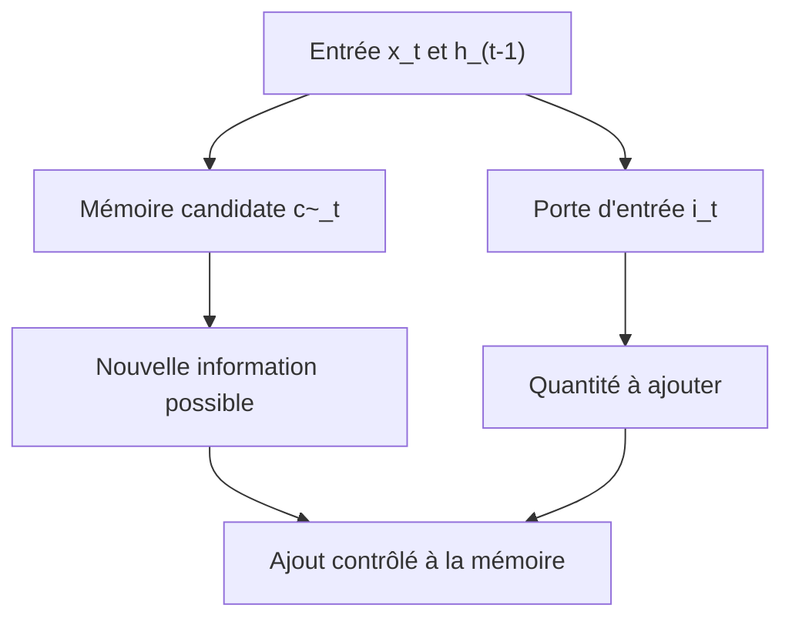

Exemple intuitif :

Si la phrase introduit une nouvelle entité importante :

```txt
Le contrat signé par l’entreprise prévoit une clause de confidentialité.
```

Le modèle peut apprendre à ajouter à sa mémoire :

```txt
entité importante = le contrat
```

---

## 4.9. Mise à jour de la mémoire dans un LSTM

La nouvelle mémoire (c_t) combine :

1. l’ancienne mémoire, filtrée par la porte d’oubli ;
    
2. la nouvelle mémoire candidate, filtrée par la porte d’entrée.
    

La formule est :

$$c_t = f_t \odot c_{t-1} + i_t \odot \tilde{c}_t$$

où (\odot) désigne la multiplication élément par élément.

Nous pouvons lire cette formule ainsi :

```txt
nouvelle mémoire =
ce que nous gardons de l’ancienne mémoire
+
ce que nous ajoutons comme nouvelle information
```

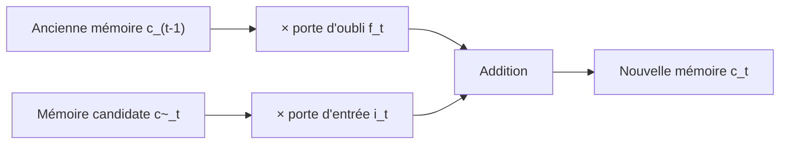

Cette formule est le cœur du LSTM.

Elle permet à la mémoire de se modifier de manière plus contrôlée que dans un RNN classique.

---

## 4.10. La porte de sortie

La **porte de sortie** décide quelle partie de la mémoire interne doit être exposée comme état caché (h_t).

Elle est calculée ainsi :

$$o_t = \sigma(W_o [h_{t-1}, x_t] + b_o)$$

Puis l’état caché est :

$$h_t = o_t \odot \tanh(c_t)$$

Autrement dit :

```txt
état caché =
partie visible de la mémoire interne
```

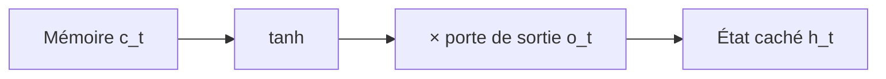

Le LSTM peut donc conserver une information dans sa mémoire interne sans forcément l’exposer entièrement en sortie à chaque étape.

---

## 4.11. Résumé du fonctionnement d’un LSTM

Nous pouvons résumer une cellule LSTM ainsi :

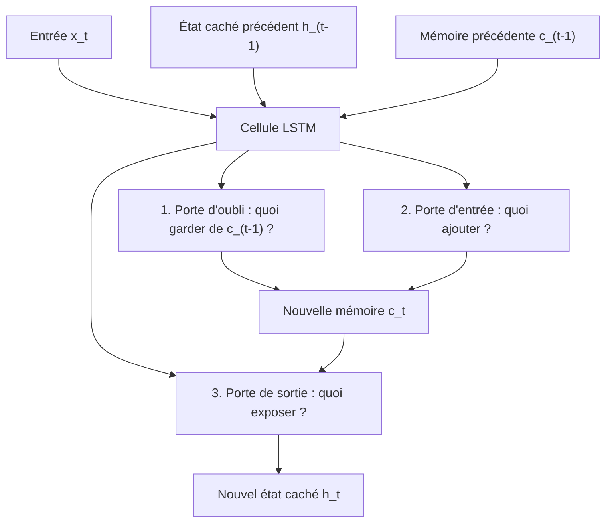

Le LSTM est donc une cellule récurrente avec une mémoire contrôlée.

Nous pouvons le voir comme une version améliorée du RNN classique, capable de mieux préserver certaines informations.

---

## 4.12. Exemple pédagogique : accord sujet-verbe

Prenons la phrase :

```txt
Les clés que mon frère a laissées dans la voiture sont sur la table.
```

Le modèle doit retenir que le sujet principal est :

```txt
Les clés
```

et que ce sujet est pluriel.

Plus tard, lorsqu’il arrive à :

```txt
sont
```

il doit utiliser cette information.

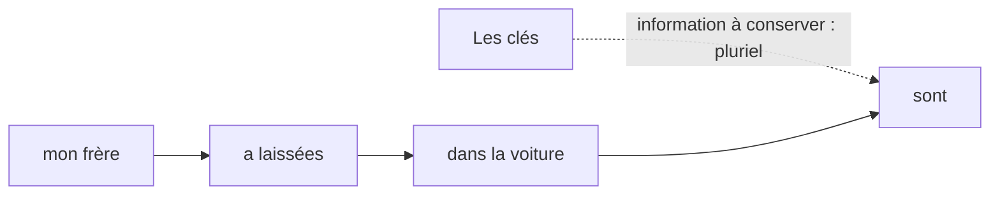

Dans un RNN classique, l’information `pluriel` peut être diluée.

Dans un LSTM, la mémoire de cellule peut apprendre à conserver cette information plus longtemps.

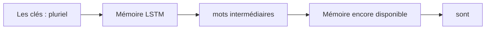

---

## 4.13. Exemple pédagogique : changement de sujet

Prenons maintenant :

```txt
Pierre vivait à Lille. Après ses études, il a déménagé à Lyon.
```

Au début, la mémoire peut contenir :

```txt
Pierre → ville actuelle : Lille
```

Puis, quand nous lisons :

```txt
a déménagé à Lyon
```

le modèle doit mettre à jour cette information.

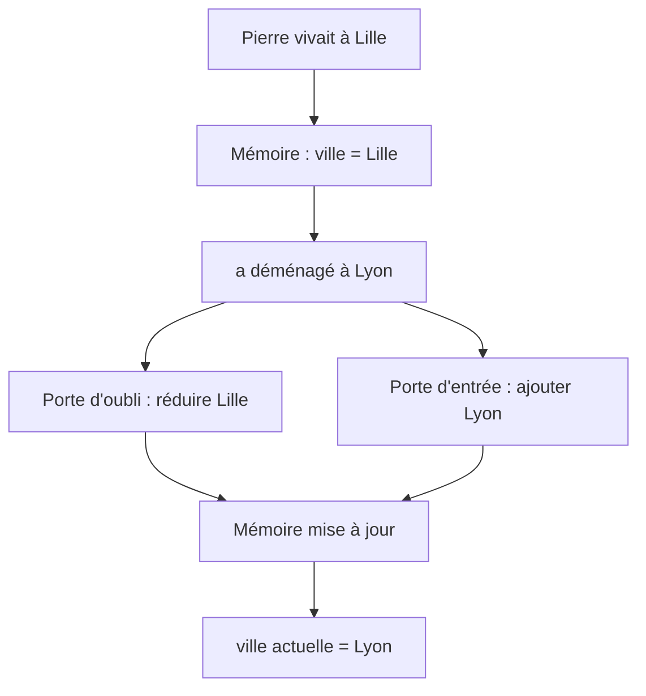

Le LSTM permet ce type de mise à jour contrôlée.

---

## 4.14. Les GRU : une autre amélioration

Les **GRU**, ou **Gated Recurrent Units**, sont une autre architecture récurrente avec des portes.

Ils poursuivent le même objectif général que les LSTM :

> mieux contrôler la circulation de l’information dans le temps.

Mais ils sont plus simples.

Un GRU n’a pas de mémoire de cellule séparée (c_t).

Il utilise seulement un état caché (h_t), mais avec des portes de contrôle.

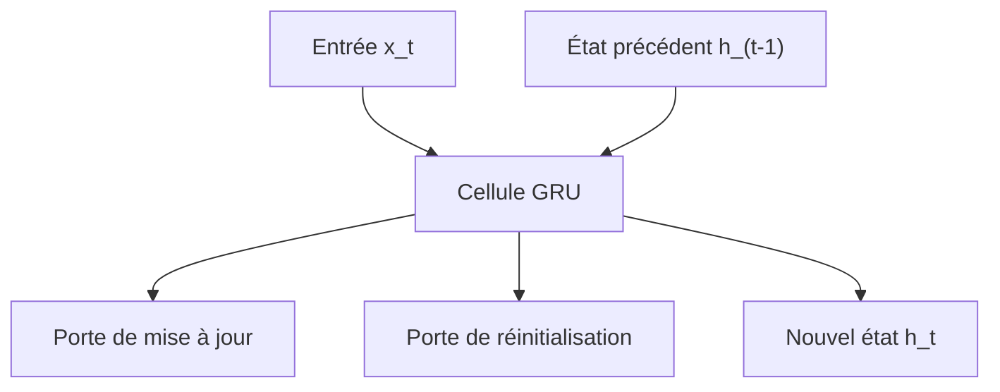

Cette architecture est souvent plus légère que le LSTM.

---

## 4.15. Les deux portes principales du GRU

Un GRU utilise principalement deux portes :

|Porte|Rôle|
|---|---|
|Porte de mise à jour|décide combien de l’ancien état conserver|
|Porte de réinitialisation|décide combien de l’ancien état utiliser pour calculer la nouvelle information|

Ces portes sont :

- la porte de mise à jour (z_t) ;
    
- la porte de réinitialisation (r_t).
    

---

## 4.16. La porte de mise à jour du GRU

La porte de mise à jour (z_t) décide dans quelle mesure nous gardons l’ancien état caché.

$$z_t = \sigma(W_z [h_{t-1}, x_t])$$

Si (z_t) est proche de 1, nous conservons beaucoup de l’ancien état.

Si (z_t) est proche de 0, nous remplaçons davantage l’ancien état par une nouvelle information.

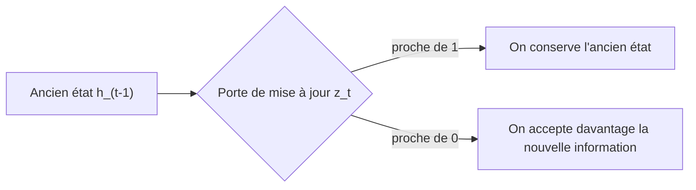

Cette porte joue un rôle proche de la combinaison entre la porte d’oubli et la porte d’entrée du LSTM.

---

## 4.17. La porte de réinitialisation du GRU

La porte de réinitialisation (r_t) décide combien de l’ancien état doit être utilisé pour calculer la mémoire candidate.

$$r_t = \sigma(W_r [h_{t-1}, x_t])$$

Si (r_t) est proche de 0, le modèle ignore largement l’ancien contexte pour calculer la nouvelle information.

Si (r_t) est proche de 1, il utilise fortement l’ancien contexte.

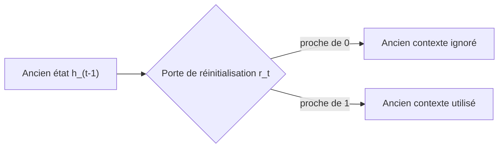

Cela permet au GRU de décider quand repartir presque de zéro, par exemple lorsqu’un nouveau segment de phrase ou un nouveau sujet commence.

---

## 4.18. Mise à jour de l’état dans un GRU

Le GRU calcule d’abord une mémoire candidate (\tilde{h}_t) :

$$\tilde{h}_t = \tanh(W [r_t \odot h_{t-1}, x_t])$$

Puis il combine l’ancien état et le nouvel état candidat :

$$h_t = (1 - z_t) \odot h_{t-1} + z_t \odot \tilde{h}_t$$

Selon les conventions, on peut parfois trouver une formule inversée sur le rôle de (z_t), mais l’idée reste la même :

> le GRU apprend à mélanger l’ancienne mémoire et la nouvelle information.

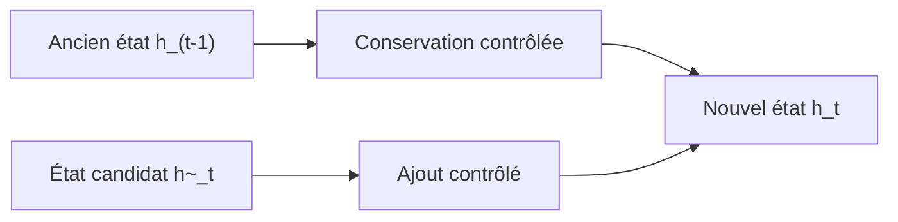

Le GRU est donc plus simple que le LSTM, mais il conserve l’idée fondamentale des portes.

---

## 4.19. LSTM contre GRU

Nous pouvons comparer les deux architectures.

|Critère|LSTM|GRU|
|---|---|---|
|Mémoire séparée|Oui, (c_t) et (h_t)|Non, principalement (h_t)|
|Nombre de portes|3 principales|2 principales|
|Complexité|Plus élevée|Plus compacte|
|Coût calculatoire|Plus important|Souvent plus faible|
|Capacité mémoire|Très bonne|Très bonne aussi dans beaucoup de cas|
|Usage historique|Très utilisé en NLP, parole, séries temporelles|Très utilisé aussi, souvent plus simple|

Il n’y a pas de gagnant absolu.

Le choix dépend :

- de la tâche ;
    
- de la taille du dataset ;
    
- du coût acceptable ;
    
- de la longueur des séquences ;
    
- de l’architecture globale.
    

---

## 4.20. Pourquoi les portes aident contre le gradient qui disparaît ?

Les portes aident parce qu’elles créent des chemins plus contrôlés pour l’information et le gradient.

Dans un RNN classique, l’état est transformé à chaque étape par une fonction non linéaire.

Dans un LSTM, une partie de la mémoire peut être transmise plus directement.

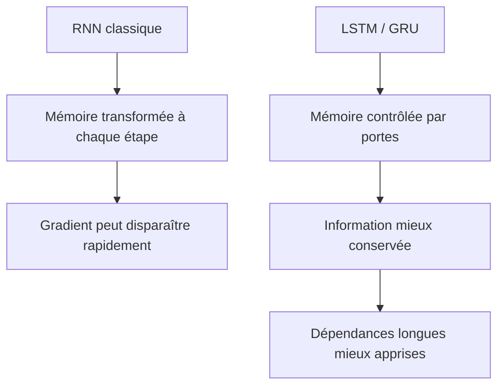

L’idée n’est pas que le gradient ne disparaît plus jamais.

L’idée est que l’architecture rend plus facile la conservation d’informations importantes.

---

## 4.21. Exemple comparatif RNN / LSTM

Prenons la phrase :

```txt
La maison que les ouvriers ont rénovée pendant l’été est magnifique.
```

La relation importante est :

```txt
La maison → est magnifique
```

## Avec un RNN classique

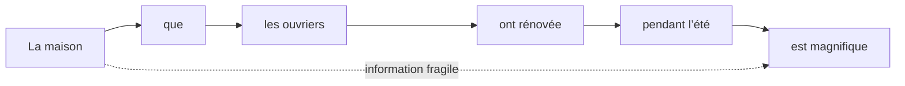

L’information `La maison` peut être progressivement diluée.

## Avec un LSTM

```mermaid
flowchart LR
    A["La maison"] --> B["Mémoire LSTM"]
    B --> C["mots intermédiaires"]
    C --> D["Mémoire conservée"]
    D --> E["est magnifique"]
```

Grâce aux portes, le modèle peut mieux préserver l’information principale.

---

## 4.22. Les LSTM et GRU dans les modèles Seq2Seq

Avant les Transformers, les LSTM et GRU ont été très utilisés dans les modèles **Seq2Seq**.

Un encodeur lit une phrase source.

Un décodeur produit une phrase cible.

```mermaid
flowchart LR
    A["Phrase source"] --> B["Encodeur LSTM / GRU"]
    B --> C["Représentation de contexte"]
    C --> D["Décodeur LSTM / GRU"]
    D --> E["Phrase cible"]
```

Exemple :

```txt
Source : I love machine learning.
Cible  : J’aime l’apprentissage automatique.
```

Les LSTM et GRU ont permis de meilleurs résultats que les RNN classiques, notamment parce qu’ils géraient mieux les séquences longues.

Mais ils restaient confrontés au problème du **vecteur de contexte unique**.

---

## 4.23. LSTM, GRU et attention

L’attention a d’abord été ajoutée aux modèles récurrents.

L’idée était de permettre au décodeur de regarder directement les états de l’encodeur.

```mermaid
flowchart LR
    A["Phrase source"] --> B["Encodeur LSTM"]
    B --> C["États cachés h1, h2, h3, ..."]
    C --> D["Mécanisme d'attention"]
    D --> E["Décodeur LSTM"]
    E --> F["Phrase cible"]
```

Cela a beaucoup amélioré les modèles Seq2Seq.

Le décodeur n’était plus obligé de dépendre uniquement d’un seul vecteur de contexte.

À chaque étape, il pouvait sélectionner les parties utiles de la phrase source.

```mermaid
flowchart TD
    A["États encodeur"] --> B["Attention"]
    C["État courant du décodeur"] --> B
    B --> D["Contexte dynamique"]
    D --> E["Prédiction du prochain token"]
```

Cette combinaison RNN + attention prépare directement l’arrivée du Transformer.

---

## 4.24. La limite fondamentale restante : le traitement séquentiel

Même avec LSTM ou GRU, le modèle reste récurrent.

Cela signifie que pour calculer l’état (h_t), nous devons connaître (h_{t-1}).

Donc :

$$h_1 \rightarrow h_2 \rightarrow h_3 \rightarrow \dots \rightarrow h_t$$

```mermaid
flowchart LR
    H1["h1"] --> H2["h2"]
    H2 --> H3["h3"]
    H3 --> H4["h4"]
    H4 --> H5["..."]
    H5 --> HT["h_t"]
```

Nous ne pouvons pas facilement calculer tous les états en parallèle.

C’est une limite très importante lorsque nous voulons entraîner de grands modèles sur des corpus massifs.

---

## 4.25. Pourquoi la séquentialité limite le passage à l’échelle ?

Les GPU et TPU sont très efficaces lorsqu’ils peuvent effectuer beaucoup d’opérations en parallèle.

Mais les LSTM et GRU imposent une dépendance temporelle forte.

Pour calculer (h_{50}), il faut avoir calculé :

```txt
h1, h2, h3, ..., h49
```

Cela crée une forme d’attente.

```mermaid
flowchart TD
    A["GPU / TPU"] --> B["Très efficace pour calculs parallèles"]
    C["LSTM / GRU"] --> D["Calcul séquentiel étape par étape"]
    D --> E["Parallélisation limitée"]
    E --> F["Passage à l'échelle plus difficile"]
```

Même si les calculs internes d’une cellule peuvent être parallélisés, la dépendance entre étapes reste un goulot d’étranglement.

---

## 4.26. Comparaison avec l’attention

L’attention propose une autre approche.

Au lieu de transmettre l’information token par token, nous calculons directement les relations entre les tokens.

```mermaid
flowchart TD
    A["Token 1"] <--> B["Token 2"]
    A <--> C["Token 3"]
    A <--> D["Token 4"]
    B <--> C
    B <--> D
    C <--> D
```

Cela permet une parallélisation beaucoup plus forte pendant l’entraînement.

Tous les tokens d’une séquence peuvent être projetés en même temps, puis comparés via des opérations matricielles.

C’est exactement le type d’opérations que les GPU savent très bien faire.

---

## 4.27. Pourquoi les LSTM et GRU restent importants historiquement ?

Même si les Transformers dominent aujourd’hui de nombreuses tâches de NLP, les LSTM et GRU restent importants à comprendre.

Ils représentent une étape majeure dans l’histoire des architectures séquentielles.

Ils ont montré que la mémoire devait être contrôlée explicitement.

Ils ont aussi préparé plusieurs idées reprises ensuite :

- importance des chemins de gradient ;
    
- contrôle du flux d’information ;
    
- traitement des dépendances longues ;
    
- modélisation de séquences ;
    
- architectures encodeur-décodeur ;
    
- génération autoregressive.
    

```mermaid
flowchart LR
    A["RNN"] --> B["LSTM / GRU"]
    B --> C["Seq2Seq"]
    C --> D["Seq2Seq + Attention"]
    D --> E["Transformer"]
```

Nous ne devons donc pas les voir comme des architectures dépassées sans intérêt.

Nous devons les voir comme une étape essentielle pour comprendre pourquoi les Transformers ont été une rupture.

---

## 4.28. LSTM et GRU sont-ils encore utilisés ?

Oui, même si les Transformers sont devenus dominants dans beaucoup de tâches de langage.

Les LSTM et GRU peuvent encore être utiles lorsque :

- les données sont de taille modérée ;
    
- les séquences ne sont pas trop longues ;
    
- le coût de calcul doit rester faible ;
    
- nous travaillons sur des séries temporelles simples ;
    
- nous avons besoin d’un modèle plus léger ;
    
- nous ne disposons pas d’une infrastructure lourde ;
    
- nous voulons un modèle embarqué ou rapide.
    

Dans certains contextes, un LSTM bien conçu peut être plus approprié qu’un Transformer trop coûteux.

Mais pour le NLP massif, la traduction moderne, les LLM et les modèles multimodaux, les Transformers sont devenus l’architecture dominante.

---

## 4.29. Résumé du chapitre

Dans ce chapitre, nous avons étudié les **LSTM** et les **GRU**.

Nous avons vu que ces architectures ont été conçues pour améliorer les RNN classiques, notamment face au problème des dépendances longues et du gradient qui disparaît.

Les LSTM introduisent une mémoire de cellule (c_t), distincte de l’état caché (h_t).

Ils utilisent trois portes principales :

- une porte d’oubli ;
    
- une porte d’entrée ;
    
- une porte de sortie.
    

Ces portes permettent de contrôler ce qui est conservé, ajouté ou exposé.

Les GRU proposent une version plus compacte, avec principalement :

- une porte de mise à jour ;
    
- une porte de réinitialisation.
    

Ces architectures améliorent fortement les RNN classiques.

Mais elles conservent une limite majeure :

> Elles restent fondamentalement séquentielles.

C’est cette limite qui prépare l’arrivée des architectures fondées sur l’attention, puis des Transformers.

---

## 4.30. Schéma de synthèse

```mermaid
flowchart TD
    A["RNN classique"] --> B["Mémoire fragile h_t"]
    B --> C["Dépendances longues difficiles"]
    B --> D["Gradient qui disparaît"]

    C --> E["LSTM"]
    D --> E
    E --> F["Mémoire de cellule c_t"]
    E --> G["Porte d'oubli"]
    E --> H["Porte d'entrée"]
    E --> I["Porte de sortie"]

    C --> J["GRU"]
    D --> J
    J --> K["Porte de mise à jour"]
    J --> L["Porte de réinitialisation"]

    E --> M["Meilleure mémoire"]
    J --> M

    M --> N["Mais traitement toujours séquentiel"]
    N --> O["Besoin d'attention"]
    O --> P["Transformer"]
```

---

## 4.31. Questions de compréhension

### Question 1

Pourquoi les LSTM et GRU ont-ils été proposés ?

Réponse attendue : ils ont été proposés pour améliorer les RNN classiques, notamment face aux dépendances longues et au problème du gradient qui disparaît.

### Question 2

Quelle est l’idée principale des portes ?

Réponse attendue : une porte contrôle la quantité d’information qui doit passer, être conservée, oubliée ou ajoutée.

### Question 3

Quelle est la différence principale entre un RNN classique et un LSTM ?

Réponse attendue : un LSTM possède une mémoire de cellule (c_t) et plusieurs portes de contrôle, alors qu’un RNN classique met simplement à jour un état caché (h_t).

### Question 4

Quelles sont les trois portes principales d’un LSTM ?

Réponse attendue : la porte d’oubli, la porte d’entrée et la porte de sortie.

### Question 5

Quel est le rôle de la porte d’oubli ?

Réponse attendue : elle décide quelle partie de l’ancienne mémoire doit être conservée ou supprimée.

### Question 6

Quel est le rôle de la porte d’entrée ?

Réponse attendue : elle décide quelle nouvelle information doit être ajoutée à la mémoire.

### Question 7

Quel est le rôle de la porte de sortie ?

Réponse attendue : elle décide quelle partie de la mémoire interne doit être exposée comme état caché.

### Question 8

Quelle est la différence principale entre LSTM et GRU ?

Réponse attendue : le GRU est plus compact, avec moins de portes et sans mémoire de cellule séparée.

### Question 9

Pourquoi les LSTM et GRU restent-ils limités malgré leurs améliorations ?

Réponse attendue : parce qu’ils restent séquentiels : le calcul de l’état courant dépend de l’état précédent.

### Question 10

Pourquoi cette limite est-elle importante pour les grands modèles ?

Réponse attendue : parce qu’elle limite la parallélisation sur GPU/TPU et rend plus difficile l’entraînement sur de très grandes quantités de données.

---

## 4.32. Transition vers le chapitre suivant

Nous avons maintenant compris pourquoi les LSTM et GRU ont constitué une amélioration majeure des RNN classiques.

Ils permettent de mieux contrôler la mémoire et de mieux apprendre certaines dépendances longues.

Mais ils restent prisonniers d’une contrainte fondamentale :

```txt
nous devons traiter la séquence étape par étape
```

Dans le chapitre suivant, nous allons donc étudier le **problème de la parallélisation**.

Nous verrons pourquoi le traitement séquentiel devient un obstacle majeur lorsque nous voulons entraîner des modèles très grands sur de très grands corpus, et pourquoi cette difficulté a fortement motivé l’abandon progressif de la récurrence au profit de l’attention.

---

---
> [!info] Livre « Les CNN et RNN » — chapitre 6/8
> [[Les CNN et RNN — Sommaire|Sommaire]] · [[Les CNN et RNN — 05 — Le problème du gradient qui disparaît|← 05 — Le problème du gradient qui disparaît]] · [[Les CNN et RNN — 07 — Le problème de la parallélisation|07 — Le problème de la parallélisation →]]
