> [!info] Livre « Les CNN et RNN » — chapitre 7/8
> [[Les CNN et RNN — Sommaire|Sommaire]] · [[Les CNN et RNN — 06 — Les LSTM et GRU une amélioration des RNN|← 06 — Les LSTM et GRU une amélioration des RNN]] · [[Les CNN et RNN — 08 — Les modèles Seq2Seq|08 — Les modèles Seq2Seq →]]

# Chapitre 5 — Le problème de la parallélisation
## 5.1. Objectif du chapitre

Dans les chapitres précédents, nous avons étudié les limites des RNN classiques, puis les améliorations apportées par les LSTM et les GRU.

Nous avons vu que ces architectures permettent de mieux gérer la mémoire, notamment grâce à des mécanismes de portes.

Mais une limite fondamentale demeure :

> Les RNN, LSTM et GRU traitent les séquences principalement étape par étape.

Dans ce chapitre, nous allons comprendre pourquoi cette nature séquentielle devient un problème majeur lorsque nous voulons entraîner de grands modèles sur de très grandes quantités de données.

Nous allons donc étudier :

- pourquoi un RNN est difficile à paralléliser ;
    
- pourquoi les GPU et TPU préfèrent les calculs massivement parallèles ;
    
- pourquoi la dépendance (h_t \leftarrow h_{t-1}) ralentit l’entraînement ;
    
- comment cela limite le passage à l’échelle ;
    
- pourquoi les Transformers ont été conçus pour mieux exploiter le parallélisme matériel.
    

---

## 5.2. Rappel : le calcul récurrent

Dans un RNN, chaque état caché dépend de l’état précédent.

La formule générale est :

$$h_t = f(x_t, h_{t-1})$$

Cela signifie que, pour calculer (h_t), nous avons besoin de deux éléments :

- l’entrée actuelle (x_t) ;
    
- l’état précédent (h_{t-1}).
    

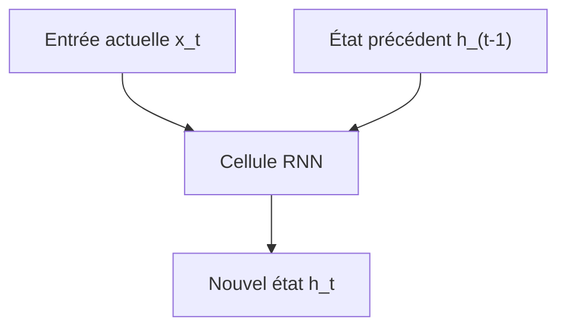

Cette relation est au cœur des RNN.

Elle permet au modèle de transporter une mémoire, mais elle impose aussi un ordre strict de calcul.

---

## 5.3. Le calcul étape par étape

Un RNN doit calculer l’état (h_t) à partir de l’état (h_{t-1}).

Cela signifie que nous ne pouvons pas facilement calculer tous les états en même temps.

Pour calculer le mot 4, nous devons avoir calculé le mot 3.

Pour calculer le mot 3, nous devons avoir calculé le mot 2.

Pour calculer le mot 2, nous devons avoir calculé le mot 1.

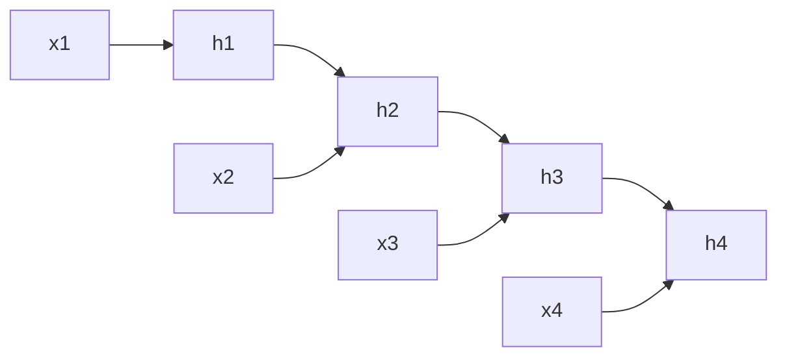

Le calcul est donc fortement séquentiel.

Or, les GPU et TPU sont très efficaces quand nous pouvons faire beaucoup de calculs en parallèle.

Les RNN utilisent mal cette capacité de parallélisation.

C’est une limite majeure pour entraîner des modèles très grands.

---

## 5.4. Exemple concret avec une phrase

Prenons la phrase :

```txt
Le chat dort sur le canapé.
```

Après tokenisation, nous obtenons :

```txt
["Le", "chat", "dort", "sur", "le", "canapé", "."]
```

Le RNN calcule :

$$h_1 = f(x_1, h_0)$$

$$h_2 = f(x_2, h_1)$$

$$h_3 = f(x_3, h_2)$$

$$h_4 = f(x_4, h_3)$$

et ainsi de suite.

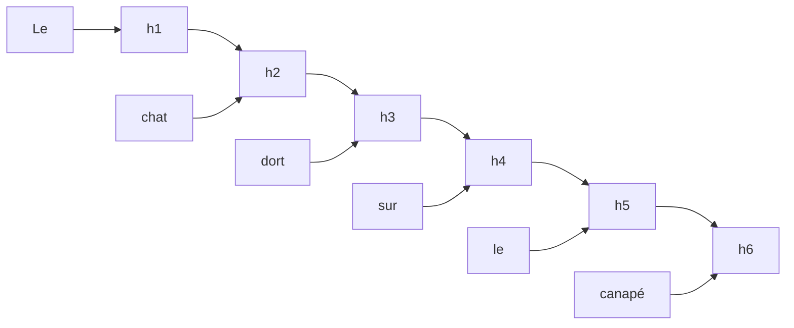

Le point important est le suivant :

> Même si nous avons tous les tokens disponibles dès le départ, le RNN ne peut pas calculer (h_6) avant d’avoir calculé (h_5).

Cette contrainte limite fortement le parallélisme.

---

## 5.5. Pourquoi le parallélisme est-il important ?

L’apprentissage profond moderne repose sur de très grands volumes de calcul.

Pour entraîner un modèle, nous devons effectuer des opérations sur :

- des millions ou milliards de paramètres ;
    
- des millions ou milliards de tokens ;
    
- de grands batches ;
    
- plusieurs couches ;
    
- plusieurs époques d’entraînement.
    

Si chaque opération doit attendre la précédente, l’entraînement devient très lent.

Au contraire, si nous pouvons effectuer beaucoup d’opérations en même temps, nous pouvons mieux exploiter le matériel.

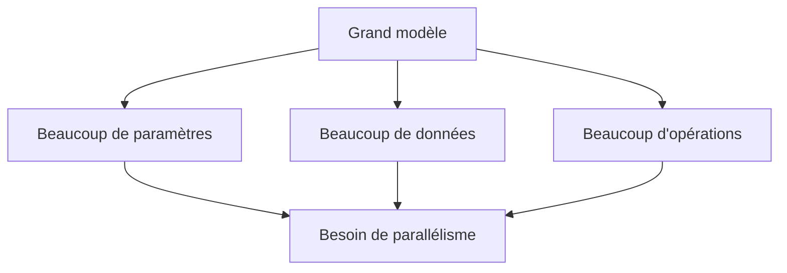

Le parallélisme est donc une condition essentielle du passage à l’échelle.

---

## 5.6. CPU, GPU et TPU : intuition

Un CPU est très polyvalent.

Il est excellent pour exécuter des tâches variées, complexes et parfois séquentielles.

Un GPU, lui, est conçu pour exécuter beaucoup d’opérations similaires en parallèle.

Un TPU est également conçu pour accélérer massivement les calculs matriciels utilisés en apprentissage profond.

Nous pouvons simplifier ainsi :

|Matériel|Point fort|
|---|---|
|CPU|Flexibilité, logique générale, tâches séquentielles|
|GPU|Calculs parallèles massifs, matrices, tenseurs|
|TPU|Calculs tensoriels spécialisés pour le deep learning|

Les réseaux de neurones modernes utilisent énormément de multiplications de matrices.

Les GPU et TPU sont donc particulièrement adaptés.

---

## 5.7. Le calcul matriciel est naturellement parallèle

Une opération matricielle peut souvent être découpée en de très nombreux petits calculs indépendants.

Par exemple, pour multiplier deux matrices, chaque élément du résultat peut être calculé à partir d’une combinaison de lignes et de colonnes.

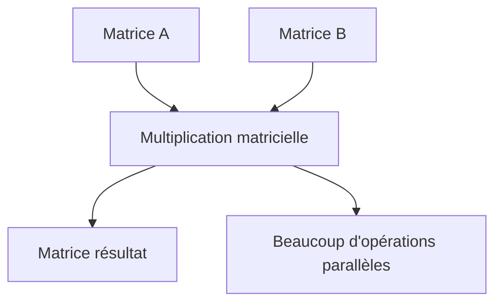

Les GPU excellent dans ce type d’opérations.

C’est pourquoi les architectures qui transforment le maximum de calculs en opérations matricielles parallèles sont très efficaces.

Les Transformers reposent beaucoup sur cette idée.

---

## 5.8. Le problème particulier des RNN

Dans un RNN, même si chaque étape contient des multiplications de matrices, les étapes elles-mêmes dépendent les unes des autres.

Nous pouvons paralléliser une partie du calcul interne à une cellule, mais pas facilement la progression temporelle complète.

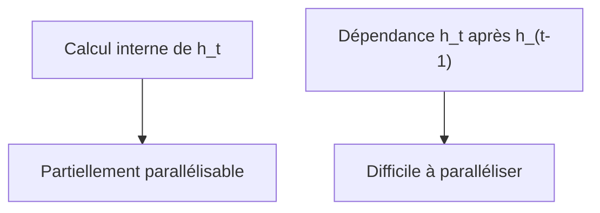

Autrement dit :

- le calcul à l’intérieur d’un pas temporel peut utiliser le GPU ;
    
- mais le passage de (h_1) à (h_2), puis (h_3), puis (h_4), reste séquentiel.
    

C’est ce qui limite fortement les RNN sur de longues séquences.

---

## 5.9. Exemple avec une séquence longue

Supposons que nous ayons une séquence de 1 000 tokens.

Un RNN doit effectuer 1 000 étapes successives :

```txt
h1 → h2 → h3 → ... → h1000
```

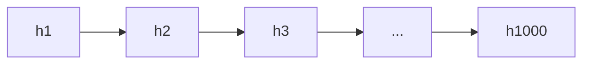

Même si chaque étape est rapide, l’accumulation de 1 000 dépendances successives devient coûteuse.

Le problème est encore plus fort si nous empilons plusieurs couches récurrentes.

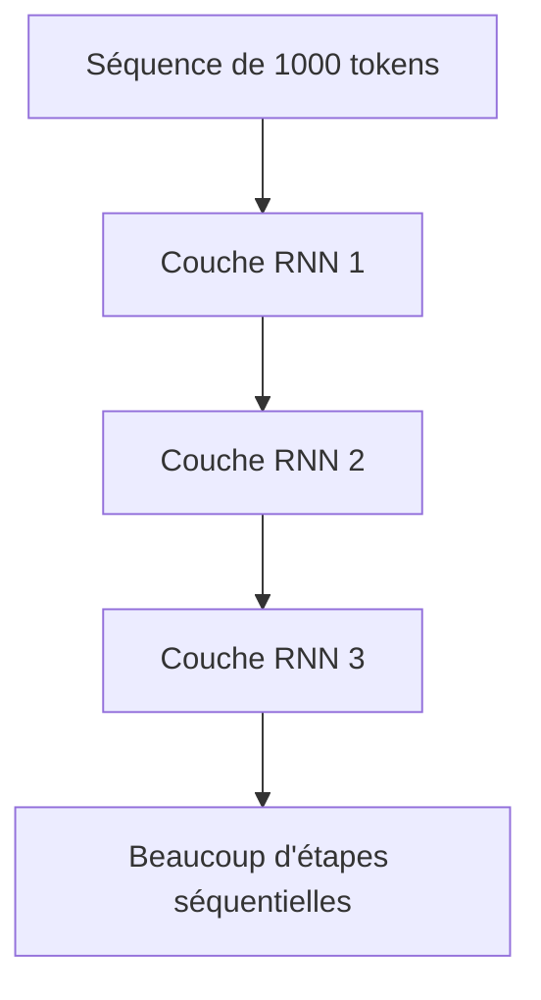

Le temps d’entraînement augmente fortement avec la longueur de séquence.

---

## 5.10. Batch parallèle, temps séquentiel

Il faut être précis : les RNN peuvent quand même exploiter une forme de parallélisme.

Nous pouvons traiter plusieurs séquences en batch.

Par exemple, nous pouvons traiter 64 phrases en même temps.

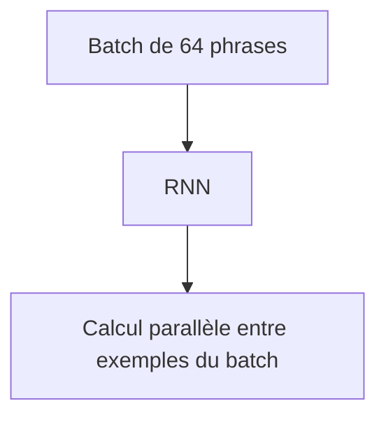

Mais à l’intérieur de chaque phrase, la progression temporelle reste séquentielle.

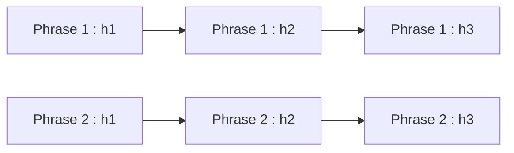

Donc nous avons :

- parallélisme entre exemples du batch ;
    
- mais dépendance séquentielle dans chaque exemple.
    

C’est mieux que rien, mais insuffisant pour exploiter pleinement les accélérateurs modernes.

---

## 5.11. Le problème de la latence

La nature séquentielle des RNN pose aussi un problème de latence.

Si nous devons attendre chaque étape avant de calculer la suivante, nous accumulons du temps d’attente.

Pour une phrase courte, cela peut être acceptable.

Pour une longue séquence, cela devient problématique.

```mermaid
gantt
    title Calcul séquentiel simplifié d'un RNN
    dateFormat X
    axisFormat %s

    section RNN
    Calcul h1 :0, 1
    Calcul h2 :1, 1
    Calcul h3 :2, 1
    Calcul h4 :3, 1
    Calcul h5 :4, 1
```

Chaque calcul commence après le précédent.

Nous ne pouvons pas les lancer tous simultanément.

---

## 5.12. Parallélisme idéal

Dans un modèle plus parallélisable, nous voudrions calculer plusieurs représentations en même temps.

```mermaid
gantt
    title Calcul parallèle simplifié
    dateFormat X
    axisFormat %s

    section Calcul parallèle
    Calcul position 1 :0, 1
    Calcul position 2 :0, 1
    Calcul position 3 :0, 1
    Calcul position 4 :0, 1
    Calcul position 5 :0, 1
```

Toutes les positions commencent au même moment.

Ce type de structure exploite beaucoup mieux les GPU et TPU.

C’est précisément l’un des grands avantages des Transformers pendant l’entraînement.

---

## 5.13. Pourquoi les Transformers sont plus parallélisables ?

Dans un Transformer, nous ne calculons pas un état caché (h_t) à partir de (h_{t-1}).

Nous partons d’une matrice d’embeddings pour toute la séquence.

Par exemple, une phrase de (n) tokens devient :

$$X \in \mathbb{R}^{n \times d_{model}}$$

Nous pouvons projeter tous les tokens en même temps vers des représentations internes.

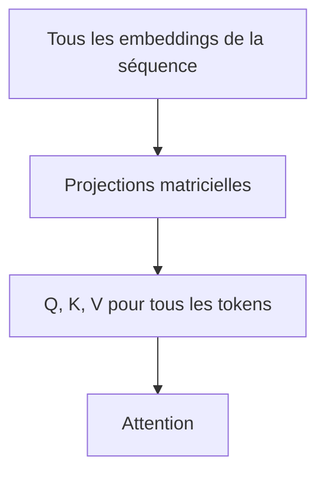

Les calculs principaux se font sous forme d’opérations matricielles.

Cela permet une parallélisation massive.

---

## 5.14. Différence clé : dépendance temporelle contre dépendance matricielle

Dans un RNN :

$$h_t = f(x_t, h_{t-1})$$

Le calcul de (h_t) dépend du résultat précédent.

Dans un Transformer, pour une couche donnée, les représentations des positions peuvent être calculées ensemble à partir de matrices.

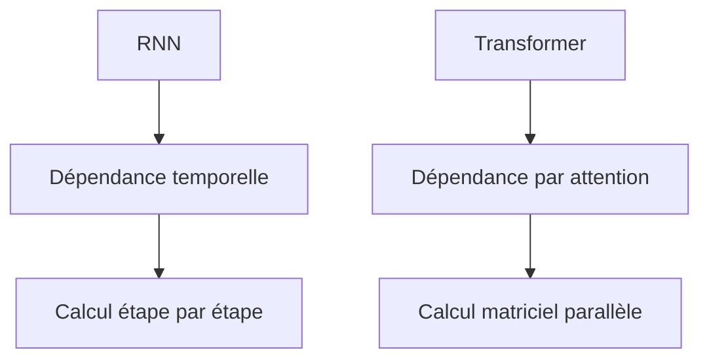

Le Transformer a bien sûr des dépendances entre couches : la couche 2 dépend de la couche 1.

Mais à l’intérieur d’une couche, toutes les positions peuvent être traitées beaucoup plus simultanément.

---

## 5.15. Comparaison visuelle

## RNN


## Transformer

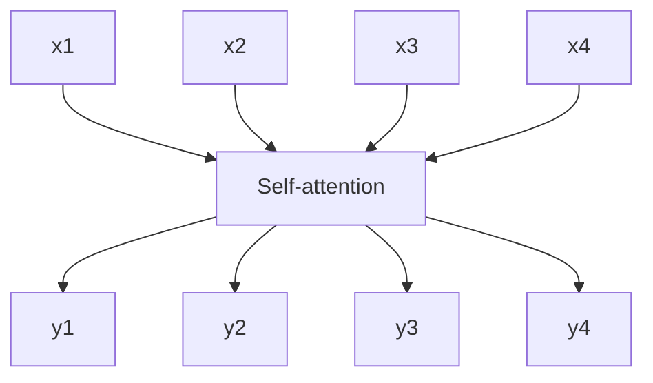

Dans le RNN, la progression est linéaire.

Dans le Transformer, la couche d’attention reçoit toute la séquence et produit toutes les représentations contextualisées.

---

## 5.16. Le coût caché du Transformer

Il ne faut pas croire que le Transformer est simplement moins coûteux.

Il est plus parallélisable, mais son attention complète a un coût important.

Si chaque token regarde tous les autres, nous construisons une matrice d’attention de taille :

$$n \times n$$

où (n) est la longueur de la séquence.

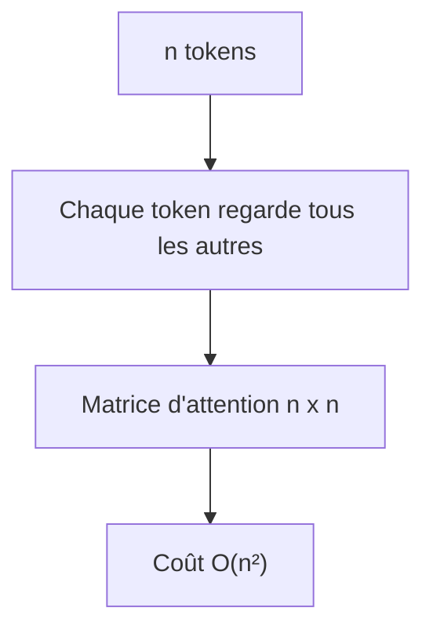

Donc les Transformers ont une autre limite :

> Ils sont très parallélisables, mais leur coût mémoire et calculatoire augmente rapidement avec la longueur de contexte.

Nous reviendrons sur ce problème plus loin dans le cours.

---

## 5.17. Parallélisation et entraînement des grands modèles

Pourquoi cette différence a-t-elle été aussi importante historiquement ?

Parce que les grands modèles modernes sont entraînés sur des volumes massifs de données.

Pour entraîner un grand modèle de langage, nous devons traiter énormément de tokens.

Si le modèle est fortement séquentiel, l’entraînement devient trop lent.

Si le modèle est fortement parallélisable, nous pouvons mieux utiliser :

- plusieurs GPU ;
    
- plusieurs TPU ;
    
- des calculs matriciels optimisés ;
    
- des batches plus grands ;
    
- du data parallelism ;
    
- du tensor parallelism ;
    
- du pipeline parallelism.
    

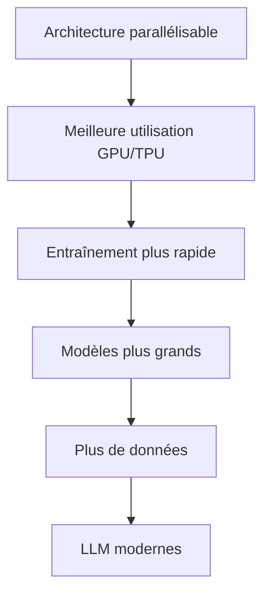

La parallélisation a donc été une condition technique importante de l’explosion des Transformers.

---

## 5.18. La différence entre entraînement et génération

Nous devons cependant distinguer deux situations :

1. l’entraînement ;
    
2. la génération autoregressive.
    

Pendant l’entraînement d’un Transformer decoder-only, nous pouvons calculer les prédictions pour tous les tokens d’une séquence en parallèle grâce au masque causal.

Par exemple, pour :

```txt
Le chat dort sur le canapé
```

le modèle apprend à prédire :

```txt
chat, dort, sur, le, canapé
```

en une seule passe parallèle.

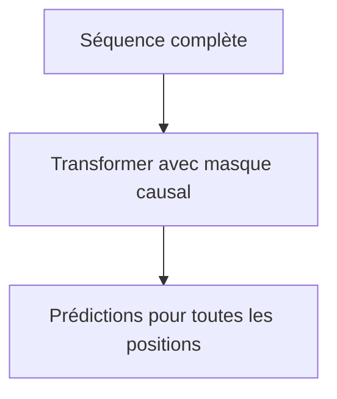

Mais pendant la génération, nous produisons souvent les tokens un par un.

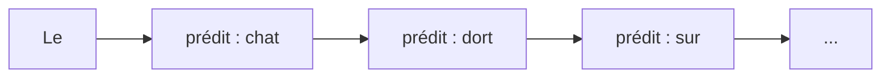

Donc les Transformers sont très parallélisables à l’entraînement, mais la génération autoregressive reste en partie séquentielle.

C’est une nuance importante.

---

## 5.19. Pourquoi le masque causal permet l’entraînement parallèle ?

Dans un modèle autoregressif, le token à la position (t) ne doit pas voir les tokens futurs.

Par exemple, pour prédire `dort`, le modèle peut voir :

```txt
Le chat
```

mais pas :

```txt
sur le canapé
```

Le masque causal interdit l’accès au futur.

```mermaid
flowchart TD
    A["Séquence complète disponible"] --> B["Masque causal"]
    B --> C["Chaque position voit seulement le passé"]
    C --> D["Calcul parallèle des prédictions"]
```

Grâce à ce masque, nous pouvons fournir toute la séquence au modèle pendant l’entraînement, tout en respectant la logique autoregressive.

Cela permet de calculer beaucoup de prédictions en parallèle.

---

## 5.0. Exemple comparatif d’entraînement

## RNN génératif

Pour entraîner un RNN génératif, les états doivent être calculés dans l’ordre :

```mermaid
flowchart LR
    A["Le"] --> H1["h1"]
    H1 --> H2["h2"]
    B["chat"] --> H2
    H2 --> H3["h3"]
    C["dort"] --> H3
    H3 --> H4["h4"]
    D["sur"] --> H4
```

## Transformer génératif

Pour entraîner un Transformer génératif, nous pouvons traiter toute la séquence en parallèle avec un masque causal :

```mermaid
flowchart TD
    A["Le"] --> T["Transformer masqué"]
    B["chat"] --> T
    C["dort"] --> T
    D["sur"] --> T

    T --> P1["prédit chat"]
    T --> P2["prédit dort"]
    T --> P3["prédit sur"]
    T --> P4["prédit ..."]
```

Cette différence rend les Transformers beaucoup plus efficaces à entraîner sur de grands corpus.

---

## 5.21. Parallélisme et taille des batches

Un autre avantage des Transformers est qu’ils s’intègrent bien aux gros batches.

Un batch peut être représenté par un tenseur :

$$B \times n \times d_{model}$$

où :

- (B) est la taille du batch ;
    
- (n) est la longueur de séquence ;
    
- (d_{model}) est la dimension du modèle.
    

```mermaid
flowchart TD
    A["Batch de séquences"] --> B["Tenseur B x n x d_model"]
    B --> C["Calculs matriciels massifs"]
    C --> D["GPU/TPU bien utilisés"]
```

Les calculs d’attention, de projections linéaires et de feed-forward networks s’expriment naturellement en opérations tensorisées.

Cela rend l’architecture très compatible avec les bibliothèques modernes comme PyTorch, TensorFlow ou JAX.

---

## 5.22. La parallélisation entre couches

Même dans un Transformer, toutes les opérations ne sont pas parallélisables.

La couche 2 dépend de la sortie de la couche 1.

La couche 3 dépend de la sortie de la couche 2.

```mermaid
flowchart TD
    A["Entrée"] --> B["Couche Transformer 1"]
    B --> C["Couche Transformer 2"]
    C --> D["Couche Transformer 3"]
    D --> E["Sortie"]
```

Donc il reste une profondeur séquentielle.

Mais la différence avec les RNN est que cette séquentialité dépend du nombre de couches, pas directement du nombre de tokens.

Dans un RNN, la profondeur temporelle dépend de la longueur de la séquence.

Dans un Transformer, pour une couche donnée, les tokens sont traités ensemble.

---

## 5.23. Comparaison : longueur de séquence et profondeur de calcul

Supposons une séquence de 1 000 tokens.

Un RNN doit traverser 1 000 étapes temporelles.

Un Transformer avec 12 couches doit traverser 12 couches.

Bien sûr, chaque couche Transformer coûte plus cher, notamment à cause de l’attention (O(n^2)).

Mais la profondeur séquentielle liée aux tokens est beaucoup plus faible.

|Architecture|Dépendance séquentielle principale|
|---|---|
|RNN|Longueur de séquence|
|LSTM / GRU|Longueur de séquence|
|Transformer|Nombre de couches|

Cela explique pourquoi les Transformers peuvent mieux exploiter le calcul parallèle.

---

## 5.24. Impact sur la recherche en NLP

Cette capacité de parallélisation a changé l’échelle des modèles entraînables.

Avant les Transformers, les modèles récurrents étaient performants, mais plus difficiles à entraîner massivement.

Avec les Transformers, il est devenu plus réaliste d’entraîner des modèles :

- plus profonds ;
    
- plus larges ;
    
- sur plus de données ;
    
- avec plus de contexte ;
    
- sur des infrastructures distribuées.
    

```mermaid
flowchart LR
    A["RNN / LSTM"] --> B["Bon traitement séquentiel"]
    B --> C["Mais parallélisation limitée"]

    D["Transformer"] --> E["Attention parallélisable"]
    E --> F["Passage à l'échelle"]
    F --> G["BERT, GPT, T5, LLM"]
```

La rupture n’est donc pas seulement conceptuelle.

Elle est aussi matérielle et industrielle.

---

## 5.25. Attention et opérations matricielles

Dans l’attention, nous calculons notamment :

$$QK^T$$

où :

- (Q) représente les queries ;
    
- (K) représente les keys ;
    
- (V) représente les values.
    

Même sans encore entrer dans les détails, nous devons retenir que ce calcul est une multiplication matricielle.

```mermaid
flowchart LR
    Q["Matrice Q"] --> M["QK^T"]
    K["Matrice K"] --> M
    M --> S["Scores d'attention"]
    S --> V["Combinaison avec V"]
```

Les multiplications matricielles sont précisément le type d’opérations très bien optimisées sur GPU et TPU.

C’est une des raisons pratiques du succès des Transformers.

---

## 5.26. Mais pourquoi les RNN ne peuvent-ils pas faire pareil ?

Un RNN utilise aussi des matrices.

Par exemple :

$$W_x x_t + W_h h_{t-1}$$

Mais le problème est la dépendance sur (h_{t-1}).

Même si la multiplication matricielle est rapide, nous devons attendre le résultat précédent.

```mermaid
flowchart TD
    A["Multiplication rapide à l'étape t"] --> B["Produit h_t"]
    B --> C["Nécessaire pour l'étape t+1"]
    C --> D["Attente séquentielle"]
```

Le goulot d’étranglement n’est donc pas seulement le type d’opération.

C’est la structure de dépendance entre les opérations.

---

## 5.27. Analogie : chaîne de montage contre équipe parallèle

Nous pouvons utiliser une analogie.

Un RNN ressemble à une chaîne où chaque personne doit attendre le travail de la personne précédente.

```mermaid
flowchart LR
    A["Personne 1"] --> B["Personne 2"]
    B --> C["Personne 3"]
    C --> D["Personne 4"]
```

Si la personne 2 n’a pas terminé, la personne 3 ne peut pas commencer.

Un Transformer ressemble davantage à une équipe qui reçoit toutes les informations en même temps et calcule les relations entre elles.

```mermaid
flowchart TD
    A["Information 1"] --> E["Équipe"]
    B["Information 2"] --> E
    C["Information 3"] --> E
    D["Information 4"] --> E
    E --> F["Résultat collectif"]
```

Cette analogie simplifie beaucoup, mais elle capture bien l’idée :

> Les Transformers permettent davantage de travail simultané.

---

## 5.28. Conséquence sur l’entraînement de modèles très grands

Quand nous entraînons un modèle de quelques milliers ou millions de paramètres, la parallélisation est déjà utile.

Mais quand nous passons à des centaines de millions ou milliards de paramètres, elle devient indispensable.

Un modèle très grand nécessite :

- beaucoup d’opérations ;
    
- beaucoup de mémoire ;
    
- beaucoup de données ;
    
- beaucoup de temps d’entraînement.
    

Sans parallélisme, l’entraînement devient rapidement impraticable.

```mermaid
flowchart TD
    A["Modèle très grand"] --> B["Coût énorme"]
    B --> C["Besoin de GPU/TPU"]
    C --> D["Besoin d'opérations parallèles"]
    D --> E["Architecture adaptée : Transformer"]
```

C’est pourquoi le passage des RNN aux Transformers est aussi un passage vers une architecture mieux adaptée aux infrastructures modernes.

---

##7.29. Limite actuelle : les longues séquences

Même si les Transformers sont plus parallélisables, ils ont un problème avec les très longues séquences.

La self-attention complète demande de comparer tous les tokens entre eux.

Pour (n) tokens, cela donne :

$$n^2$$

relations.

Si (n = 1,000), cela fait :

$$1,000,000$$

relations.

Si (n = 10,000), cela fait :

$$100,000,000$$

relations.

```mermaid
flowchart TD
    A["Longueur n"] --> B["Relations d'attention n²"]
    B --> C["n=1 000 → 1 000 000"]
    B --> D["n=10 000 → 100 000 000"]
    C --> E["Coût mémoire"]
    D --> E
```

Cela explique pourquoi de nombreuses recherches cherchent à optimiser l’attention :

- attention sparse ;
    
- attention locale ;
    
- sliding window attention ;
    
- FlashAttention ;
    
- linear attention ;
    
- architectures hybrides ;
    
- state-space models.
    

Nous reviendrons sur ces sujets plus loin dans le cours.

---

## 5.30. Le compromis fondamental

Nous pouvons maintenant formuler le compromis.

Les RNN ont un coût séquentiel important, mais ils traitent chaque étape de manière relativement locale.

Les Transformers sont beaucoup plus parallélisables, mais l’attention complète coûte cher pour les longues séquences.

|Architecture|Avantage|Limite|
|---|---|---|
|RNN / LSTM / GRU|Mémoire séquentielle naturelle|Faible parallélisation|
|Transformer|Forte parallélisation|Attention coûteuse en (O(n^2))|

Le succès des Transformers vient du fait que, pour beaucoup de tâches modernes, la parallélisation massive compense largement le coût de l’attention.

---

## 5.31. Résumé du chapitre

Dans ce chapitre, nous avons étudié le problème de la parallélisation.

Nous avons vu qu’un RNN calcule chaque état caché à partir de l’état précédent :

$$h_t = f(x_t, h_{t-1})$$

Cette dépendance impose un traitement étape par étape.

Même si nous pouvons paralléliser certains calculs internes et traiter plusieurs séquences en batch, la progression temporelle reste séquentielle.

Cette contrainte limite l’utilisation efficace des GPU et TPU.

Or, les grands modèles modernes nécessitent énormément de calcul et doivent donc exploiter le parallélisme matériel.

Les Transformers répondent à cette limite en remplaçant la récurrence par des opérations d’attention et des calculs matriciels appliqués à toute la séquence.

Cela rend l’entraînement beaucoup plus parallélisable.

Mais cette parallélisation a un coût : l’attention complète nécessite une matrice de taille (n \times n), donc un coût quadratique en longueur de séquence.

---

## 5.32. Schéma de synthèse

```mermaid
flowchart TD
    A["RNN / LSTM / GRU"] --> B["h_t dépend de h_(t-1)"]
    B --> C["Calcul étape par étape"]
    C --> D["Faible parallélisation temporelle"]
    D --> E["Mauvaise exploitation GPU/TPU"]
    E --> F["Passage à l'échelle difficile"]

    G["Transformer"] --> H["Toute la séquence en entrée"]
    H --> I["Calculs matriciels"]
    I --> J["Self-attention"]
    J --> K["Forte parallélisation"]
    K --> L["Entraînement de grands modèles"]

    J --> M["Coût O(n²)"]
    M --> N["Limite pour longues séquences"]
```

---

## 5.33. Questions de compréhension

### Question 1

Pourquoi un RNN est-il difficile à paralléliser sur la dimension temporelle ?

Réponse attendue : parce que le calcul de (h_t) dépend de (h_{t-1}), donc il faut calculer les états dans l’ordre.

### Question 2

Quelle est la différence entre paralléliser un batch et paralléliser une séquence ?

Réponse attendue : paralléliser un batch signifie traiter plusieurs exemples en même temps ; paralléliser une séquence signifie traiter plusieurs positions d’une même séquence en même temps. Les RNN parallélisent mieux le batch que la séquence.

### Question 3

Pourquoi les GPU et TPU sont-ils importants pour les grands modèles ?

Réponse attendue : parce qu’ils accélèrent massivement les calculs matriciels et tensoriels utilisés dans l’apprentissage profond.

### Question 4

Pourquoi les Transformers exploitent-ils mieux les GPU/TPU ?

Réponse attendue : parce qu’ils utilisent de grandes opérations matricielles sur toute la séquence, notamment dans les projections et l’attention.

### Question 5

Pourquoi un Transformer n’est-il pas totalement sans contrainte séquentielle ?

Réponse attendue : parce que les couches restent empilées : la couche suivante dépend de la couche précédente. En génération autoregressive, les tokens sont aussi produits un par un.

### Question 6

Quelle est la différence importante entre entraînement et génération autoregressive ?

Réponse attendue : pendant l’entraînement, les prédictions de plusieurs positions peuvent être calculées en parallèle grâce au masque causal ; pendant la génération, les tokens sont souvent produits un par un.

### Question 7

Quelle est la principale limite de la self-attention complète ?

Réponse attendue : son coût mémoire et calculatoire augmente en (O(n^2)) avec la longueur de la séquence.

### Question 8

Pourquoi cette question de parallélisation a-t-elle été décisive pour les LLM ?

Réponse attendue : parce que les LLM nécessitent un entraînement massif sur énormément de tokens, ce qui impose une architecture capable d’exploiter fortement les GPU/TPU.

---

## 34. Transition vers le chapitre suivant

Nous avons maintenant compris une limite fondamentale des RNN, LSTM et GRU : leur traitement séquentiel freine la parallélisation.

Dans le chapitre suivant, nous allons étudier les **modèles Seq2Seq**, qui ont joué un rôle central avant les Transformers, notamment en traduction automatique.

Nous verrons comment un encodeur lit une séquence source, comment un décodeur produit une séquence cible, et pourquoi le vecteur de contexte unique est devenu un goulot d’étranglement.

Ce sera l’étape nécessaire avant d’introduire l’attention comme mécanisme de dépassement.

---

---
> [!info] Livre « Les CNN et RNN » — chapitre 7/8
> [[Les CNN et RNN — Sommaire|Sommaire]] · [[Les CNN et RNN — 06 — Les LSTM et GRU une amélioration des RNN|← 06 — Les LSTM et GRU une amélioration des RNN]] · [[Les CNN et RNN — 08 — Les modèles Seq2Seq|08 — Les modèles Seq2Seq →]]
