> [!info] Livre « Les CNN et RNN » — chapitre 8/8
> [[Les CNN et RNN — Sommaire|Sommaire]] · [[Les CNN et RNN — 07 — Le problème de la parallélisation|← 07 — Le problème de la parallélisation]] · [[Les CNN et RNN — Compléments 2026|Compléments 2026 →]]

# Chapitre 6 — Les modèles Seq2Seq
## 6.1. Objectif du chapitre

Dans les chapitres précédents, nous avons étudié les RNN, les LSTM, les GRU, ainsi que leurs limites principales :

- difficulté à apprendre les dépendances longues ;
    
- problème du gradient qui disparaît ;
    
- traitement séquentiel difficile à paralléliser.
    

Dans ce chapitre, nous allons étudier une architecture très importante dans l’histoire du traitement automatique du langage : les modèles **sequence-to-sequence**, souvent abrégés en **Seq2Seq**.

Avant les Transformers, les architectures Seq2Seq ont joué un rôle central, notamment pour :

- la traduction automatique ;
    
- le résumé automatique ;
    
- la génération de texte ;
    
- la transcription ;
    
- les systèmes de dialogue ;
    
- la conversion d’une séquence en une autre séquence.
    

L’idée générale est simple :

> Nous utilisons un encodeur pour lire une séquence d’entrée, puis un décodeur pour générer une séquence de sortie.

---

## 6.2. Pourquoi avons-nous besoin de Seq2Seq ?

Certaines tâches ne consistent pas à produire une seule réponse à partir d’une séquence.

Par exemple, dans une tâche de classification de sentiment, nous avons :

```txt
Entrée : Ce film est excellent.
Sortie : positif
```

La sortie est une seule étiquette.

Mais dans une tâche de traduction, nous avons :

```txt
Entrée : I love machine learning.
Sortie : J’aime l’apprentissage automatique.
```

La sortie est elle-même une séquence.

Nous devons donc transformer une séquence en une autre séquence.

C’est précisément le problème **sequence-to-sequence**.

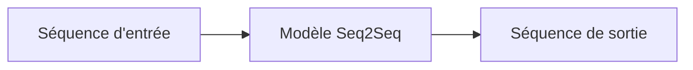

Nous ne cherchons pas simplement à classer une phrase.

Nous cherchons à générer une nouvelle phrase.

---

## 6.3. Exemples de tâches Seq2Seq

Les modèles Seq2Seq peuvent être utilisés pour de nombreuses tâches.

|Tâche|Séquence source|Séquence cible|
|---|---|---|
|Traduction|`I love cats.`|`J’aime les chats.`|
|Résumé|Article long|Résumé court|
|Dialogue|Message utilisateur|Réponse du système|
|Transcription|Signal audio|Texte|
|Correction grammaticale|Phrase incorrecte|Phrase corrigée|
|Génération de code|Description en langage naturel|Code|
|Reformulation|Phrase initiale|Phrase reformulée|

Le point commun est toujours le même :

> Nous avons une entrée séquentielle et nous devons produire une sortie séquentielle.

---

## 6.4. Le principe général d’un modèle Seq2Seq

Avant les Transformers, une architecture très utilisée pour la traduction automatique était le modèle **sequence-to-sequence**, ou **Seq2Seq**.

L’idée est simple :

- un encodeur lit la phrase source ;
    
- il produit une représentation ;
    
- un décodeur génère la phrase cible.
    

Par exemple :

```txt
Source : I love machine learning.
Cible  : J'aime l'apprentissage automatique.
```

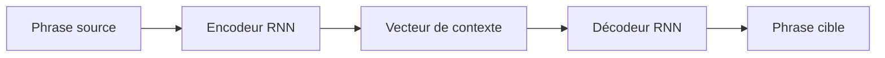

Le problème est que toute la phrase source doit être compressée dans un seul vecteur de contexte.

Pour une phrase courte, cela peut fonctionner.

Pour une phrase longue, c’est beaucoup plus difficile.

---

## 6.5. L’encodeur

L’encodeur est généralement un RNN, un LSTM ou un GRU.

Son rôle est de lire la phrase source token par token.

Prenons la phrase source :

```txt
I love machine learning.
```

Après tokenisation, nous pouvons obtenir :

```txt
["I", "love", "machine", "learning", "."]
```

L’encodeur lit alors :

```txt
I → love → machine → learning → .
```

À chaque étape, il met à jour son état caché.

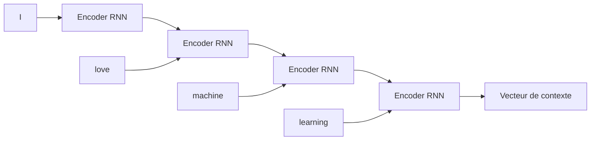

Le dernier état caché est souvent utilisé comme résumé de toute la phrase source.

Nous l’appelons le **vecteur de contexte**.

---

## 6.6. Le vecteur de contexte

Le vecteur de contexte est la représentation produite par l’encodeur après lecture de toute la séquence source.

Nous pouvons le voir comme un résumé numérique de la phrase.

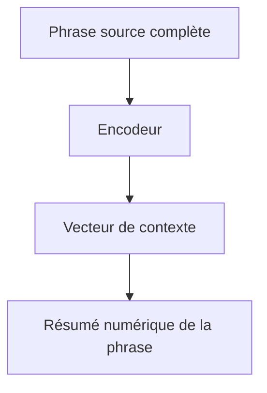

Par exemple, pour :

```txt
I love machine learning.
```

le vecteur de contexte doit contenir implicitement :

- le sujet : `I` ;
    
- le verbe : `love` ;
    
- l’objet : `machine learning` ;
    
- le sens global : une appréciation positive ou une préférence ;
    
- les informations nécessaires pour produire la traduction française.
    

Mais ce vecteur n’est pas lisible directement par un humain.

Il s’agit d’un vecteur numérique appris.

---

## 6.7. Le décodeur

Le décodeur est lui aussi souvent un RNN, LSTM ou GRU.

Son rôle est de produire la phrase cible, token par token.

Pour la cible :

```txt
J'aime l'apprentissage automatique.
```

le décodeur génère par exemple :

```txt
J' → aime → l' → apprentissage → automatique → .
```

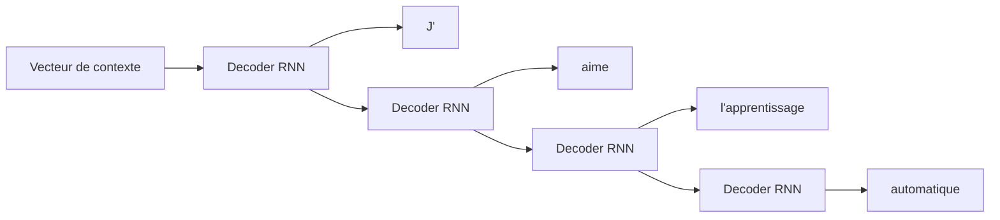

À chaque étape, le décodeur utilise :

- son état précédent ;
    
- le token généré précédemment ;
    
- le vecteur de contexte fourni par l’encodeur.
    

---

## 6.8. Génération token par token

Le décodeur génère la sortie de manière autoregressive.

Cela signifie que chaque token généré dépend des tokens précédents.

Par exemple :

```txt
Début → J'
J' → aime
J' aime → l'
J' aime l' → apprentissage
J' aime l'apprentissage → automatique
```

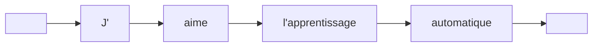

Nous utilisons souvent deux tokens spéciaux :

- `<bos>` : début de séquence ;
    
- `<eos>` : fin de séquence.
    

Le décodeur commence avec `<bos>` et s’arrête lorsqu’il produit `<eos>`.

---

## 6.9. Exemple complet : traduction

Prenons l’exemple :

```txt
Source : I love machine learning.
Cible  : J'aime l'apprentissage automatique.
```

Le modèle fonctionne en deux grandes phases.

### 6.9.1 Phase d’encodage

L’encodeur lit la phrase source :

```txt
I → love → machine → learning → .
```

et produit un vecteur de contexte.

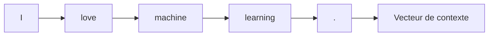

### 6.9.2 Phase de décodage

Le décodeur utilise ce vecteur pour générer la phrase cible :

```txt
J' → aime → l'apprentissage → automatique → .
```

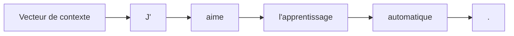

Le modèle apprend donc une correspondance entre deux séquences.

---

## 6.10. Architecture globale détaillée

Nous pouvons représenter le modèle Seq2Seq complet ainsi :

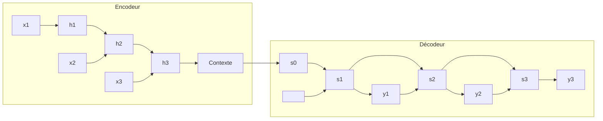

Ici :

- (x_1, x_2, x_3) sont les tokens source ;
    
- (h_1, h_2, h_3) sont les états de l’encodeur ;
    
- (C) est le vecteur de contexte ;
    
- (s_1, s_2, s_3) sont les états du décodeur ;
    
- (y_1, y_2, y_3) sont les tokens générés.
    

---

## 6.11. Formalisation simple

Soit une séquence source :

$$X = (x_1, x_2, \dots, x_n)$$

et une séquence cible :

$$Y = (y_1, y_2, \dots, y_m)$$

L’encodeur produit une représentation :

$$C = Encoder(X)$$

Le décodeur génère ensuite :

$$P(Y|X)$$

c’est-à-dire la probabilité de la séquence cible sachant la séquence source.

On peut décomposer cette probabilité token par token :

$$P(Y|X) = \prod_{t=1}^{m} P(y_t | y_1, \dots, y_{t-1}, C)$$

Cela signifie :

> À chaque étape, le décodeur prédit le prochain token à partir des tokens déjà générés et du contexte source.

---

## 6.12. Teacher forcing

Pendant l’entraînement, nous utilisons souvent une technique appelée **teacher forcing**.

L’idée est la suivante :

> Au lieu de donner au décodeur sa propre prédiction précédente, nous lui donnons le vrai token précédent.

Par exemple, pour la cible :

```txt
J'aime l'apprentissage automatique.
```

Pendant l’entraînement, le modèle reçoit :

```txt
Entrée décodeur : <bos> J'aime l'apprentissage automatique
Cible attendue  : J'aime l'apprentissage automatique <eos>
```

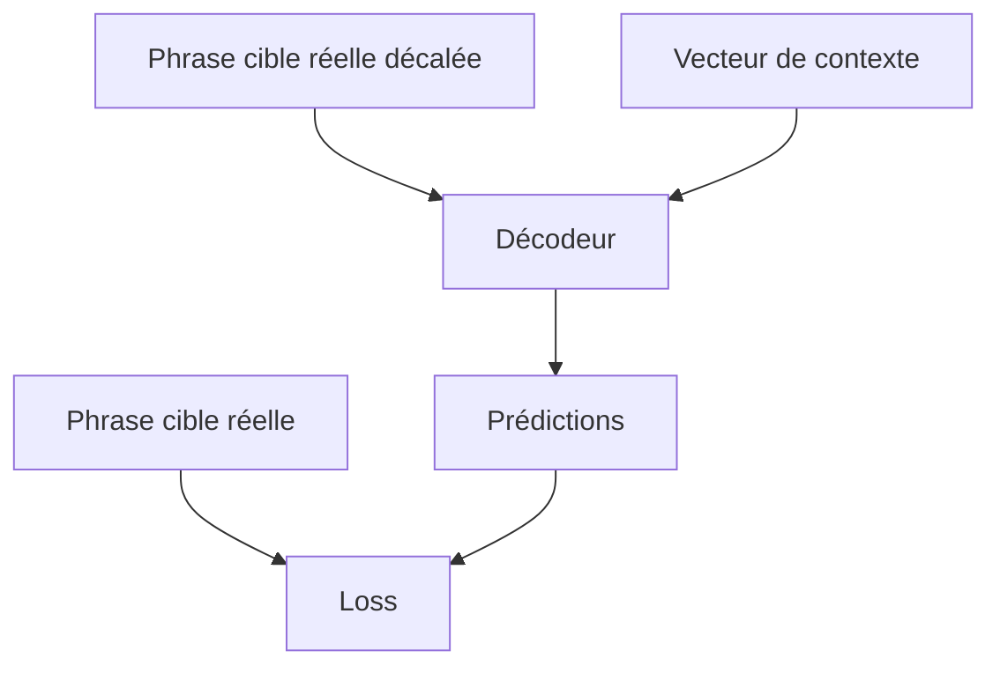

Le teacher forcing rend l’entraînement plus stable et plus rapide, car le décodeur reçoit des entrées correctes pendant l’apprentissage.

---

## 6.13. Différence entre entraînement et inférence

Il faut distinguer deux moments.

### 6.13.1 Pendant l’entraînement

Nous connaissons la bonne réponse.

Nous pouvons donc fournir au décodeur les vrais tokens précédents.

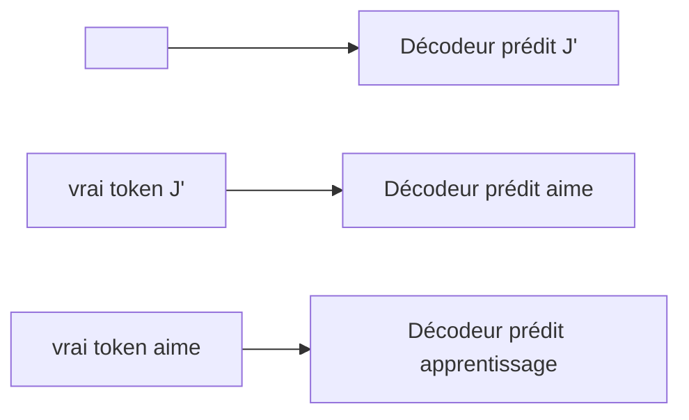

### 6.13.2 Pendant l’inférence

Nous ne connaissons pas la phrase cible.

Le modèle doit utiliser ses propres prédictions précédentes.

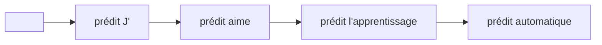

Cela peut poser un problème : si le modèle fait une erreur tôt, cette erreur peut influencer toutes les prédictions suivantes.

---

## 6.14. Erreur accumulée pendant la génération

Supposons que le modèle doive traduire :

```txt
I love machine learning.
```

La bonne sortie est :

```txt
J'aime l'apprentissage automatique.
```

Mais si le modèle commence par générer :

```txt
Je déteste
```

alors la suite risque d’être fortement influencée par cette mauvaise prédiction.

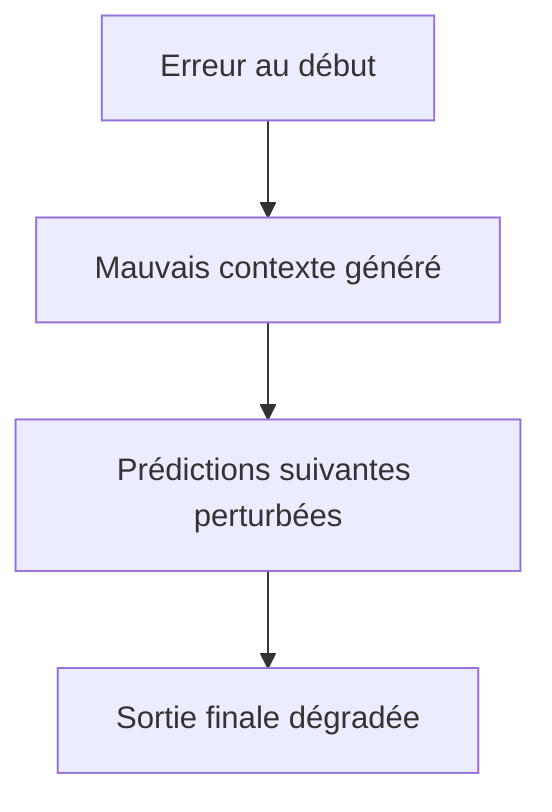

C’est une difficulté classique des modèles génératifs autoregressifs.

---

## 6.15. Beam search

Pour améliorer la génération, on utilise souvent une stratégie appelée **beam search**.

Au lieu de garder uniquement le token le plus probable à chaque étape, nous gardons plusieurs hypothèses.

Par exemple, avec un beam de taille 3, nous gardons les 3 meilleures séquences partielles.

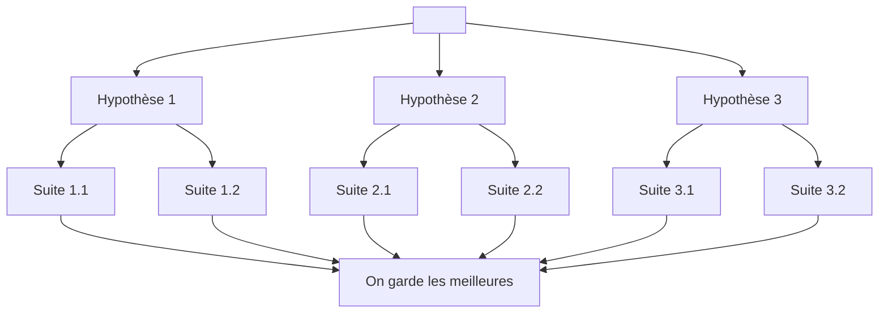

Cela permet parfois d’éviter de choisir trop tôt une mauvaise suite.

Mais beam search augmente aussi le coût de génération.

---

## 6.16. Le problème du vecteur de contexte unique

Le grand problème des premiers modèles Seq2Seq est le vecteur de contexte unique.

L’encodeur lit toute la phrase source et la compresse dans un seul vecteur (C).

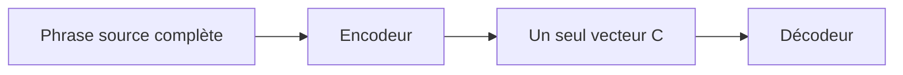

Ce vecteur doit contenir toutes les informations nécessaires à la génération de la phrase cible.

Pour une phrase courte, cela peut fonctionner.

Exemple :

```txt
I sleep.
Je dors.
```

Mais pour une phrase longue, c’est beaucoup plus difficile.

---

## 6.17. Exemple de phrase longue

Prenons la phrase :

```txt
Although the committee had initially rejected the proposal, it later accepted a revised version after several months of discussion.
```

Une traduction française pourrait être :

```txt
Bien que le comité ait initialement rejeté la proposition, il a ensuite accepté une version révisée après plusieurs mois de discussion.
```

Le modèle doit conserver :

- le connecteur logique `Although` ;
    
- le sujet `the committee` ;
    
- l’action initiale `had rejected` ;
    
- l’objet `the proposal` ;
    
- le contraste avec `later accepted` ;
    
- l’objet final `a revised version` ;
    
- le complément temporel `after several months of discussion`.
    

Compresser tout cela dans un seul vecteur fixe est difficile.

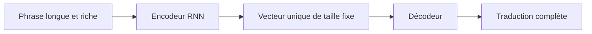

Le vecteur de contexte devient un **goulot d’étranglement informationnel**.

---

## 6.18. Goulot d’étranglement informationnel

Un goulot d’étranglement informationnel apparaît quand beaucoup d’informations doivent passer par une représentation trop limitée.

Ici, toute la phrase source doit passer par un seul vecteur.

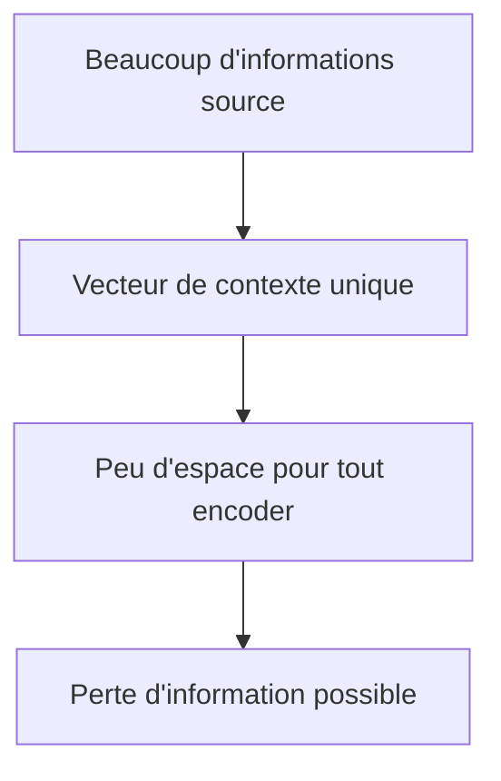

Nous pouvons faire une analogie simple.

C’est comme demander à quelqu’un de résumer un long article scientifique en une seule phrase, puis de reconstruire l’article complet à partir de cette phrase.

Pour une information courte, cela peut marcher.

Pour une information complexe, c’est insuffisant.

---

## 6.19. Longueur variable, vecteur fixe

Un autre problème est que la longueur de la phrase source varie.

Nous pouvons avoir :

```txt
I sleep.
```

ou :

```txt
Although the committee had initially rejected the proposal, it later accepted a revised version after several months of discussion.
```

Mais dans les deux cas, le vecteur de contexte a la même taille.

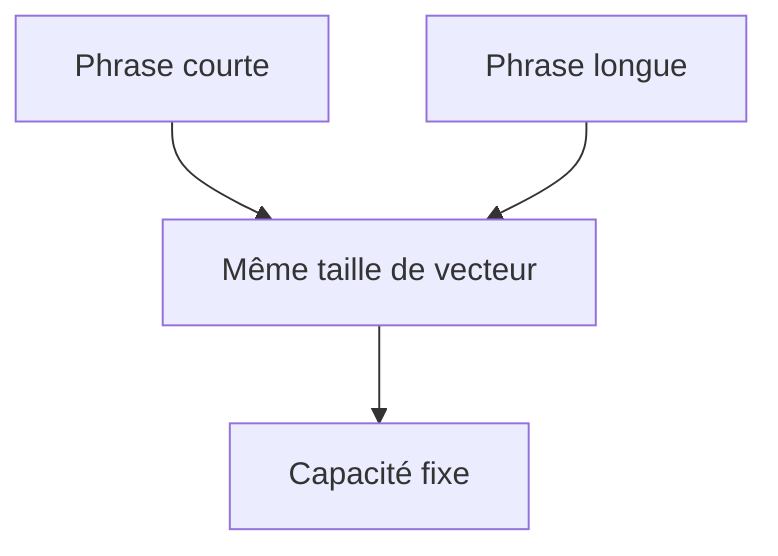

Cela signifie que plus la phrase est longue, plus la compression est forte.

---

## 6.20. Perte des détails fins

Dans une traduction, certains détails sont essentiels.

Par exemple :

```txt
The researcher did not confirm that the treatment was effective.
```

La négation `not` est cruciale.

Si le vecteur de contexte encode mal cette négation, la traduction peut devenir dangereusement incorrecte :

```txt
Le chercheur a confirmé que le traitement était efficace.
```

au lieu de :

```txt
Le chercheur n’a pas confirmé que le traitement était efficace.
```

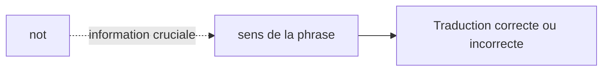

Le goulot d’étranglement du vecteur de contexte peut donc entraîner la perte d’informations importantes.

---

## 6.21. Les difficultés avec les phrases longues

Les premiers modèles Seq2Seq avaient tendance à moins bien fonctionner lorsque les phrases devenaient longues.

Les erreurs pouvaient être :

- omissions ;
    
- répétitions ;
    
- mauvaise traduction des dépendances longues ;
    
- perte de négation ;
    
- confusion des sujets ;
    
- mauvaise gestion des propositions relatives ;
    
- oubli de certains compléments ;
    
- terminaison trop rapide de la phrase.
    

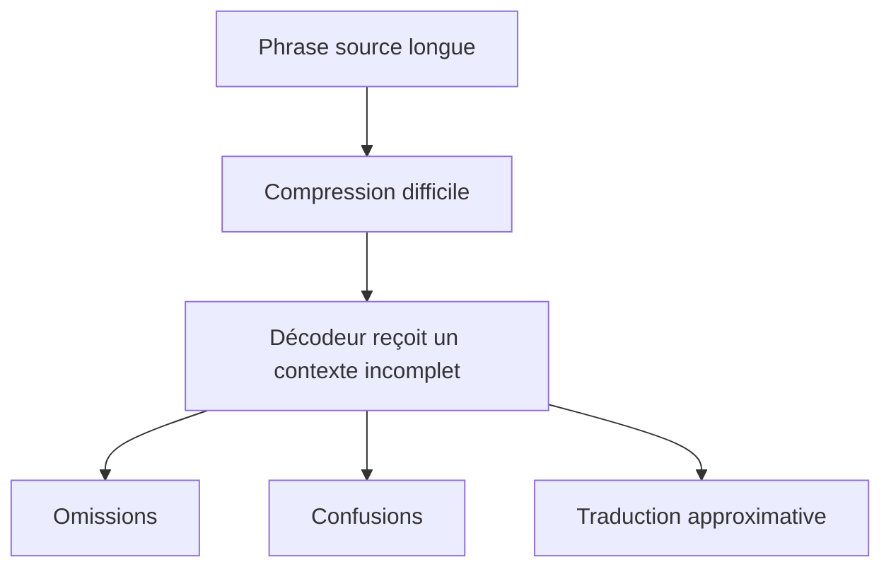

Cela a motivé l’introduction de l’attention.

---

## 6.22. L’idée qui va résoudre partiellement le problème

Le problème est le suivant :

> Pourquoi obliger le décodeur à utiliser un seul vecteur de contexte ?

Au lieu de cela, nous pourrions donner au décodeur accès à tous les états de l’encodeur.

L’encodeur ne produirait donc plus seulement :

```txt
un seul vecteur final
```

mais une séquence d’états :

```txt
h1, h2, h3, ..., hn
```

```mermaid
flowchart LR
    A["Phrase source"] --> B["Encodeur"]
    B --> H1["h1"]
    B --> H2["h2"]
    B --> H3["h3"]
    B --> HN["hn"]

    H1 --> D["Décodeur avec attention"]
    H2 --> D
    H3 --> D
    HN --> D
```

À chaque étape, le décodeur pourrait choisir les états source les plus utiles.

C’est précisément l’idée de l’attention.

---

## 6.23. Avant attention : contexte fixe

Dans le Seq2Seq classique, le contexte est fixe.

Le même vecteur (C) est utilisé pour générer toute la phrase cible.

```mermaid
flowchart TD
    C["Vecteur de contexte unique"] --> Y1["Générer y1"]
    C --> Y2["Générer y2"]
    C --> Y3["Générer y3"]
    C --> Y4["Générer y4"]
```

Mais tous les mots cible n’ont pas besoin des mêmes informations.

Quand nous traduisons :

```txt
The black cat sleeps.
```

Pour générer `chat`, nous avons surtout besoin de `cat`.

Pour générer `noir`, nous avons surtout besoin de `black`.

Pour générer `dort`, nous avons surtout besoin de `sleeps`.

Un contexte fixe est donc trop rigide.

---

## 6.24. Avec attention : contexte dynamique

Avec l’attention, le décodeur peut construire un contexte différent à chaque étape.

```mermaid
flowchart TD
    H1["État source : The"] --> A1["Attention étape 1"]
    H2["État source : black"] --> A1
    H3["État source : cat"] --> A1
    H4["État source : sleeps"] --> A1

    H1 --> A2["Attention étape 2"]
    H2 --> A2
    H3 --> A2
    H4 --> A2

    A1 --> Y1["Générer : Le"]
    A2 --> Y2["Générer : chat / noir / dort"]
```

Le contexte devient donc dynamique.

Il dépend :

- de la phrase source ;
    
- des états de l’encodeur ;
    
- de l’état courant du décodeur ;
    
- du token que nous sommes en train de générer.
    

Cette idée sera étudiée dans le chapitre suivant.

---

## 6.25. Seq2Seq et traduction automatique neuronale

Les modèles Seq2Seq ont marqué une étape majeure dans la traduction automatique neuronale.

Avant eux, de nombreux systèmes de traduction utilisaient des approches statistiques avec des alignements explicites.

Avec Seq2Seq, nous apprenons directement une fonction de transformation entre séquences.

```mermaid
flowchart LR
    A["Traduction statistique"] --> B["Alignements et règles probabilistes"]
    C["Seq2Seq neuronal"] --> D["Représentations apprises de bout en bout"]
```

L’avantage est que le modèle peut apprendre des représentations continues et généraliser à partir de nombreux exemples.

Mais sans attention, le modèle reste limité par la compression dans un vecteur unique.

---

## 6.26. Seq2Seq avec LSTM ou GRU

En pratique, les modèles Seq2Seq utilisaient souvent des LSTM ou des GRU plutôt que des RNN simples.

Pourquoi ?

Parce que les LSTM et GRU gèrent mieux les dépendances longues et le gradient qui disparaît.

```mermaid
flowchart LR
    A["Seq2Seq avec RNN simple"] --> B["Mémoire limitée"]
    B --> C["Seq2Seq avec LSTM / GRU"]
    C --> D["Meilleure mémoire"]
    D --> E["Meilleure traduction"]
```

Mais même avec LSTM ou GRU, le problème du vecteur de contexte unique reste important.

---

## 6.27. Encodeur bidirectionnel

Dans certains modèles Seq2Seq, l’encodeur est bidirectionnel.

Cela signifie qu’il lit la phrase source :

- de gauche à droite ;
    
- de droite à gauche.
    

```mermaid
flowchart LR
    A["x1"] --> B["x2"] --> C["x3"] --> D["x4"]
    D --> E["backward"]
    C --> E
    B --> E
    A --> E

    A --> F["forward"]
    B --> F
    C --> F
    D --> F
```

Cela permet à chaque position source d’avoir un contexte à gauche et à droite.

C’est très utile pour comprendre la phrase source.

Mais le décodeur, lui, génère toujours la phrase cible de manière séquentielle.

---

## 6.28. Seq2Seq et résumé automatique

Les modèles Seq2Seq ne servent pas seulement à la traduction.

Ils peuvent aussi produire un résumé.

Exemple :

```txt
Entrée : long article
Sortie : résumé court
```

```mermaid
flowchart LR
    A["Article long"] --> B["Encodeur"]
    B --> C["Vecteur de contexte"]
    C --> D["Décodeur"]
    D --> E["Résumé"]
```

Mais ici encore, le problème du contexte unique devient encore plus fort.

Résumer un long article à partir d’un seul vecteur est très difficile.

Cela explique pourquoi l’attention est devenue indispensable pour ces tâches.

---

## 6.29. Seq2Seq et dialogue

Un modèle Seq2Seq peut aussi être utilisé pour générer une réponse dans un dialogue.

Exemple :

```txt
Utilisateur : Bonjour, comment allez-vous ?
Modèle      : Je vais bien, merci.
```

```mermaid
flowchart LR
    A["Message utilisateur"] --> B["Encodeur"]
    B --> C["Contexte"]
    C --> D["Décodeur"]
    D --> E["Réponse générée"]
```

Mais un dialogue exige souvent de conserver des informations plus larges :

- contexte précédent ;
    
- intention de l’utilisateur ;
    
- sujet discuté ;
    
- contraintes ;
    
- mémoire éventuelle.
    

Les modèles Seq2Seq simples étaient donc limités pour des conversations longues.

---

## 6.30. Les limites principales des modèles Seq2Seq classiques

Nous pouvons résumer les limites ainsi :

### 6.30.1 Vecteur de contexte unique

Toute la phrase source est compressée dans un seul vecteur.

C’est le problème principal.

### 6.30.2 Dépendances longues

Les longues phrases restent difficiles, même avec LSTM ou GRU.

### 6.30.3 Traitement séquentiel

L’encodeur et le décodeur restent souvent récurrents.

Donc la parallélisation reste limitée.

### 6.30.4 Génération autoregressive

Le décodeur génère token par token.

Les erreurs peuvent s’accumuler.

### 6.30.5 Difficulté d’alignement

Le modèle doit apprendre implicitement quels mots source correspondent aux mots cible.

Sans attention, cet alignement est difficile.

```mermaid
flowchart TD
    A["Seq2Seq classique"] --> B["Contexte unique"]
    A --> C["RNN / LSTM / GRU"]
    A --> D["Génération séquentielle"]
    A --> E["Alignement difficile"]

    B --> F["Phrases longues difficiles"]
    C --> G["Parallélisation limitée"]
    D --> H["Erreurs accumulées"]
    E --> I["Traduction moins précise"]
```

---

## 6.31. Pourquoi ce chapitre est important pour comprendre les Transformers

Les Transformers ne surgissent pas de nulle part.

Ils répondent à une série de problèmes rencontrés dans les architectures précédentes.

Les modèles Seq2Seq ont posé une structure importante :

```txt
encodeur → représentation → décodeur
```

Le Transformer original reprend cette structure encoder-decoder.

Mais il remplace les RNN par des blocs d’attention.

```mermaid
flowchart LR
    A["Seq2Seq RNN"] --> B["Encodeur RNN"]
    A --> C["Décodeur RNN"]

    D["Transformer original"] --> E["Encodeur Transformer"]
    D --> F["Décodeur Transformer"]

    B --> G["Même idée générale : encoder puis décoder"]
    E --> G
```

Le papier **Attention Is All You Need** s’inscrit donc dans cette continuité :

- il conserve l’idée encodeur-décodeur ;
    
- il supprime la récurrence ;
    
- il remplace le traitement séquentiel par l’attention ;
    
- il améliore la parallélisation ;
    
- il rend les dépendances longues plus accessibles.
    

---

## 6.32. Résumé du chapitre

Dans ce chapitre, nous avons étudié les modèles **Seq2Seq**.

Nous avons vu qu’ils permettent de transformer une séquence source en une séquence cible.

Ils sont composés de deux parties :

- un **encodeur**, qui lit la séquence source ;
    
- un **décodeur**, qui génère la séquence cible.
    

Avant les Transformers, ces composants étaient souvent des RNN, LSTM ou GRU.

Les modèles Seq2Seq ont été très importants, notamment pour la traduction automatique neuronale.

Mais les premiers modèles Seq2Seq souffraient d’une limite majeure :

> toute la phrase source devait être compressée dans un seul vecteur de contexte.

Ce vecteur devenait un goulot d’étranglement, surtout pour les phrases longues ou complexes.

L’attention a été introduite pour permettre au décodeur de regarder directement les états de l’encodeur à chaque étape de génération.

Cette transition entre Seq2Seq classique et Seq2Seq avec attention prépare directement l’arrivée des Transformers.

---

## 6.33. Schéma de synthèse

```mermaid
flowchart TD
    A["Tâche : transformer une séquence en une autre"] --> B["Seq2Seq"]
    B --> C["Encodeur"]
    B --> D["Décodeur"]

    C --> E["Lit la phrase source"]
    E --> F["Produit un vecteur de contexte"]

    D --> G["Génère la phrase cible token par token"]
    F --> G

    F --> H["Problème : contexte unique"]
    H --> I["Goulot d'étranglement informationnel"]
    I --> J["Phrases longues difficiles"]

    J --> K["Solution partielle : attention"]
    K --> L["Le décodeur regarde directement les états source"]

    L --> M["Préparation des Transformers"]
```

---

## 6.34. Questions de compréhension

### Question 1

Qu’est-ce qu’un modèle Seq2Seq ?

Réponse attendue : c’est un modèle qui transforme une séquence d’entrée en une séquence de sortie, par exemple une phrase anglaise en phrase française.

### Question 2

Quels sont les deux composants principaux d’un modèle Seq2Seq ?

Réponse attendue : l’encodeur et le décodeur.

### Question 3

Quel est le rôle de l’encodeur ?

Réponse attendue : lire la séquence source et produire une représentation, souvent appelée vecteur de contexte.

### Question 4

Quel est le rôle du décodeur ?

Réponse attendue : générer la séquence cible token par token à partir du contexte produit par l’encodeur.

### Question 5

Pourquoi les premiers modèles Seq2Seq avaient-ils du mal avec les phrases longues ?

Réponse attendue : parce que toute la phrase source devait être compressée dans un seul vecteur de contexte de taille fixe.

### Question 6

Qu’est-ce que le teacher forcing ?

Réponse attendue : c’est une technique d’entraînement où l’on donne au décodeur le vrai token précédent au lieu de sa propre prédiction précédente.

### Question 7

Quelle est la différence entre entraînement et inférence dans un modèle Seq2Seq ?

Réponse attendue : pendant l’entraînement, nous connaissons la cible et pouvons utiliser les vrais tokens précédents ; pendant l’inférence, le modèle doit utiliser ses propres prédictions précédentes.

### Question 8

Pourquoi l’attention est-elle devenue importante dans les modèles Seq2Seq ?

Réponse attendue : parce qu’elle permet au décodeur de regarder directement les états de l’encodeur, au lieu de dépendre uniquement d’un seul vecteur de contexte.

### Question 9

Quel lien existe entre Seq2Seq et le Transformer original ?

Réponse attendue : le Transformer original conserve l’idée encodeur-décodeur, mais remplace les RNN par des mécanismes d’attention.

---

## 6.35. Transition vers le chapitre suivant

Nous avons maintenant compris le fonctionnement général des modèles Seq2Seq.

Nous avons aussi identifié leur limite principale : le **goulot d’étranglement du vecteur de contexte unique**.

Ce problème a été corrigé par les transformer détaillés dans le cours : [[Les transformers]].

---
> [!info] Livre « Les CNN et RNN » — chapitre 8/8
> [[Les CNN et RNN — Sommaire|Sommaire]] · [[Les CNN et RNN — 07 — Le problème de la parallélisation|← 07 — Le problème de la parallélisation]] · [[Les CNN et RNN — Compléments 2026|Compléments 2026 →]]
