> [!info] Livre « Les transformers » — chapitre 1/30
> [[Les transformers — Sommaire|Sommaire]] · [[Les transformers — Sommaire|← Sommaire]] · [[Les transformers — 02 — Rappels nécessaires tenseurs, embeddings et séquences|02 — Rappels nécessaires tenseurs, embeddings et séquences →]]

# Chapitre 1 — Pourquoi les Transformers ?
## 1.1. Objectif du chapitre

Dans ce premier chapitre, nous allons comprendre **pourquoi les Transformers sont apparus** et **quel problème ils ont résolu**.

Nous ne commencerons pas directement par les équations. Nous allons d’abord replacer les Transformers dans l’histoire des modèles de traitement de séquences.

Une **séquence**, en informatique et en apprentissage automatique, est une donnée composée d’éléments ordonnés :

- une phrase ;
    
- un paragraphe ;
    
- une suite de mots ;
    
- une suite de caractères ;
    
- une série temporelle ;
    
- une séquence audio ;
    
- une vidéo découpée en images ;
    
- une suite d’instructions de code.
    

Le problème général est donc le suivant :

> Comment construire un modèle capable de comprendre une suite d’éléments dont le sens dépend à la fois du contenu et de l’ordre ?

Par exemple, les phrases suivantes contiennent presque les mêmes mots, mais n’ont pas le même sens :

```txt
Le chien mord l’homme.
L’homme mord le chien.
```

Le modèle doit donc comprendre :

- les mots ;
    
- leur ordre ;
    
- leurs relations ;
    
- leur contexte ;
    
- les dépendances longues ;
    
- les ambiguïtés.
    

C’est précisément ce type de problème qui a conduit à l’apparition des architectures de type Transformer.

---

## 1.2. Avant les Transformers : le traitement séquentiel

Avant les Transformers, les modèles dominants pour traiter les séquences étaient les **réseaux de neurones récurrents**, appelés **[RNN][https://fr.wikipedia.org/wiki/R%C3%A9seau_de_neurones_r%C3%A9currents)**.

Un RNN lit une séquence élément par élément. À chaque étape, il reçoit un nouvel élément et met à jour un état interne.

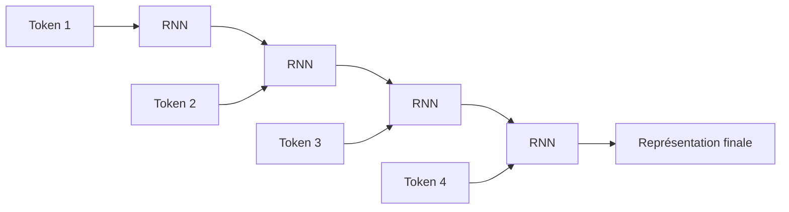

Nous pouvons résumer l’idée ainsi :

> Le RNN lit la phrase de gauche à droite et transporte une mémoire interne au fur et à mesure.

Par exemple, pour la phrase :

```txt
Le chat dort sur le canapé.
```

Le modèle lit :

```txt
Le → chat → dort → sur → le → canapé
```

À chaque mot, il met à jour son état.

---

## 1.3. Le principe des RNN

Un RNN reçoit deux informations à chaque étape :

1. l’entrée actuelle ;
    
2. l’état précédent.
    

Il produit ensuite :

1. un nouvel état ;
    
2. éventuellement une sortie.
    

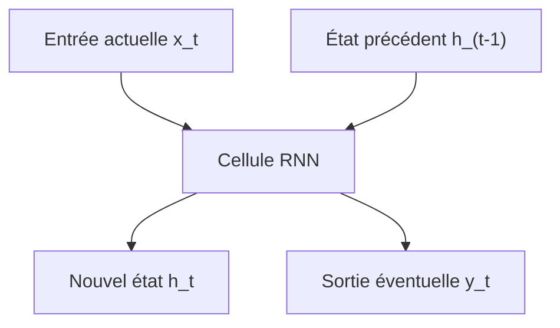

Mathématiquement, on peut écrire :

$$
h_t = f(x_t, h_{t-1})  
$$

où :

- $x_t$ est l’entrée au temps $t$ ;
    
- $h_{t-1}$ est l’état précédent ;
    
- $h_t$ est le nouvel état ;
    
-$f$est une fonction apprise par le réseau.
    

L’idée est élégante : le modèle possède une forme de mémoire.

Mais cette mémoire est limitée.

---

## 1.4. Le problème des dépendances longues

Prenons une phrase comme :

```txt
Le livre que Paul a acheté hier dans une petite librairie du centre-ville est passionnant.
```

Le sujet principal est :

```txt
Le livre
```

Le verbe associé est :

```txt
est
```

Mais entre les deux, nous avons beaucoup d’informations intermédiaires :

```txt
que Paul a acheté hier dans une petite librairie du centre-ville
```

Un modèle doit comprendre que :

```txt
Le livre ... est passionnant.
```

et non :

```txt
Paul ... est passionnant.
la librairie ... est passionnant.
le centre-ville ... est passionnant.
```

Le problème est que les RNN doivent transporter l’information importante à travers plusieurs étapes successives.

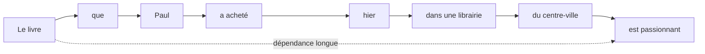

Plus la séquence est longue, plus il devient difficile de conserver les informations importantes.

C’est ce que nous appelons le problème des **dépendances longues**.

---

## 1.5. Le problème du gradient qui disparaît

Pendant l’entraînement, le modèle apprend en corrigeant ses erreurs. Cette correction se fait par un mécanisme appelé **[rétropropagation du gradient](https://fr.wikipedia.org/wiki/R%C3%A9tropropagation_du_gradient)**.

Dans un RNN, la rétropropagation doit traverser toutes les étapes temporelles.

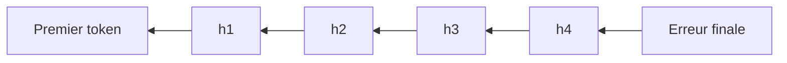

Quand la séquence est longue, le signal d’apprentissage peut devenir très faible en remontant vers les premiers tokens.

C’est le problème du **vanishing gradient**, ou **gradient qui disparaît**.

Conséquence :

> Le modèle apprend mal les relations éloignées dans la séquence.

Il peut très bien apprendre des dépendances courtes :

```txt
un chat noir
```

Mais il peut avoir plus de difficulté avec :

```txt
Le chat que j’ai vu hier dans la rue près de la gare était noir.
```

---

## 1.6. Les LSTM et GRU : une amélioration des RNN

Pour limiter ces problèmes, des architectures plus avancées ont été proposées, notamment :

- les **LSTM** ([Long short-term memory](https://fr.wikipedia.org/wiki/R%C3%A9seau_de_neurones_r%C3%A9currents#Long_short-term_memory));
    
- les **GRU** ([Gate Recurrent Unit](https://fr.wikipedia.org/wiki/Unit%C3%A9_r%C3%A9currente_ferm%C3%A9e)).
    

Ces modèles ajoutent des mécanismes de contrôle de la mémoire.

L’idée est de permettre au réseau de décider :

- quoi oublier ;
    
- quoi conserver ;
    
- quoi mettre à jour ;
    
- quoi transmettre.
    

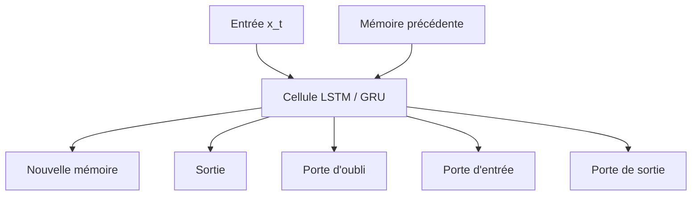

Les LSTM et GRU ont beaucoup amélioré la capacité des réseaux à traiter des séquences.

Mais ils conservent une limite importante :

> Ils traitent toujours les éléments principalement les uns après les autres.

Cette nature séquentielle devient un problème lorsque nous voulons entraîner de grands modèles sur beaucoup de données.

---

## 1.7. Le problème de la parallélisation

Un RNN doit calculer l’état $h_t$ à partir de l’état $h_{t-1}$.

Cela signifie que nous ne pouvons pas facilement calculer tous les états en même temps.

Pour calculer le mot 4, nous devons avoir calculé le mot 3.

Pour calculer le mot 3, nous devons avoir calculé le mot 2.

Pour calculer le mot 2, nous devons avoir calculé le mot 1.

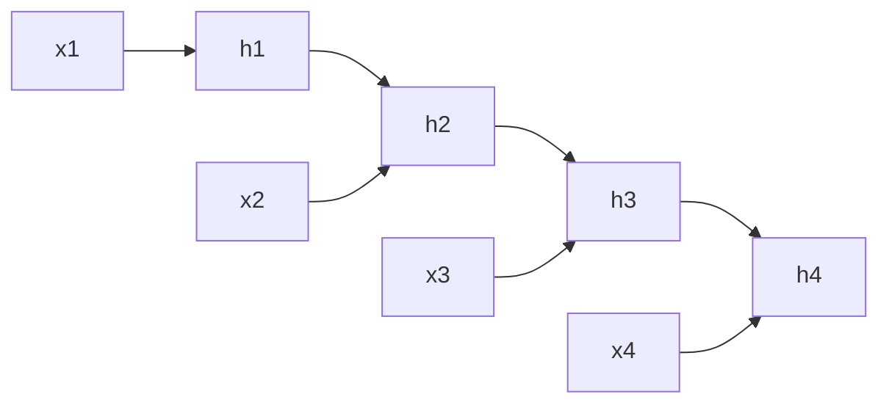

Le calcul est donc fortement séquentiel.

Or, les GPU et TPU sont très efficaces quand nous pouvons faire beaucoup de calculs en parallèle.

Les RNN utilisent mal cette capacité de parallélisation.

C’est une limite majeure pour entraîner des modèles très grands.

---

## 1.8. Les modèles Seq2Seq

Avant les Transformers, une architecture très utilisée pour la traduction automatique était le modèle **sequence-to-sequence**, ou **Seq2Seq**.

L’idée est simple :

- un encodeur lit la phrase source ;
    
- il produit une représentation ;
    
- un décodeur génère la phrase cible.
    

Par exemple :

```txt
Source : I love machine learning.
Cible  : J'aime l'apprentissage automatique.
```

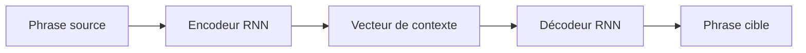

Le problème est que toute la phrase source doit être compressée dans un seul vecteur de contexte.

Pour une phrase courte, cela peut fonctionner.

Pour une phrase longue, c’est beaucoup plus difficile.

---

## 1.9. Le goulot d’étranglement du vecteur de contexte

Dans les premiers modèles Seq2Seq, l’encodeur devait résumer toute la phrase dans un vecteur unique.

Imaginons que nous devions traduire :

```txt
Although the committee had initially rejected the proposal, it later accepted a revised version after several months of discussion.
```

Il est difficile de condenser toutes les informations importantes dans une seule représentation fixe.

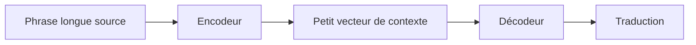

Ce vecteur devient un **goulot d’étranglement informationnel**.

Le décodeur doit générer une phrase complète à partir d’un résumé compact, alors qu’il aurait parfois besoin de regarder directement certaines parties précises de la phrase source.

C’est ici que l’attention va devenir importante.

---

## 1.10. L’arrivée de l’attention

L’idée de l’attention est de permettre au décodeur de ne pas dépendre uniquement d’un seul vecteur global.

Au lieu de cela, à chaque étape de génération, le décodeur peut regarder différentes parties de la phrase source.

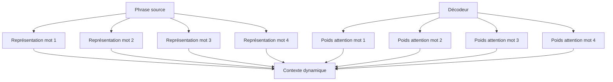

Nous pouvons décrire l’attention ainsi :

> L’attention permet au modèle de sélectionner dynamiquement les informations utiles dans une séquence.

Dans une tâche de traduction, lorsqu’il génère un mot français, le modèle peut regarder les mots anglais les plus pertinents.

Par exemple :

```txt
The black cat sleeps.
Le chat noir dort.
```

Quand le modèle génère :

```txt
chat
```

il doit surtout regarder :

```txt
cat
```

Quand il génère :

```txt
noir
```

il doit surtout regarder :

```txt
black
```

---

## 1.11. L’attention comme alignement

Dans la traduction automatique, l’attention peut être vue comme une forme d’alignement entre les mots source et les mots cible.

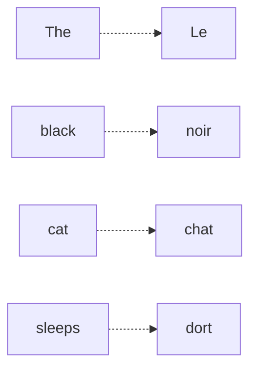

Ce point est important historiquement.

Avant les modèles neuronaux modernes, la traduction automatique utilisait souvent des mécanismes explicites d’alignement statistique.

L’attention a permis de retrouver une forme d’alignement, mais apprise automatiquement par le réseau.

---

## 1.12. Première rupture : l’attention améliore les RNN

Dans un premier temps, l’attention n’a pas remplacé les RNN.

Elle les a complétés.

Nous avions donc des architectures de ce type :

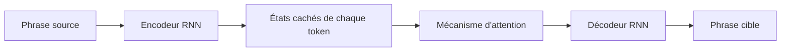

Cela a permis de grandes améliorations, car le décodeur pouvait accéder à tous les états de l’encodeur, et pas seulement au dernier.

Mais le modèle restait encore partiellement séquentiel.

L’encodeur était souvent récurrent.

Le décodeur était récurrent.

La parallélisation restait limitée.

---

## 1.13. La question centrale

À ce stade, une question devient naturelle :

> Si l’attention est si utile, avons-nous encore besoin des RNN ?

C’est exactement la rupture proposée par le papier **Attention Is All You Need**.

L’idée fondamentale est :

> Nous pouvons construire un modèle de séquence uniquement à partir de mécanismes d’attention, sans récurrence et sans convolution.

Autrement dit, au lieu de lire la phrase mot par mot, nous la traitons globalement.

---

## 1.14. La rupture Transformer

Le Transformer remplace le traitement séquentiel par un traitement fondé sur l’attention entre tous les tokens.

Dans un RNN, chaque token dépend surtout de l’état précédent.

Dans un Transformer, chaque token peut directement interagir avec tous les autres tokens.

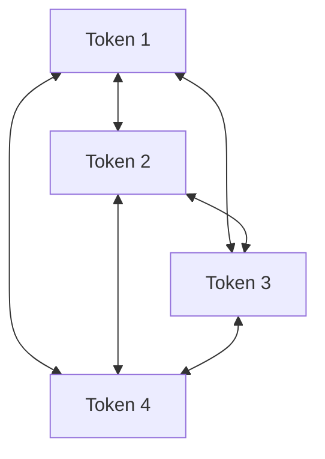

Cela change profondément la manière de traiter les séquences.

Nous ne sommes plus dans une lecture strictement linéaire.

Nous sommes dans une mise en relation globale.

---

## 1.15. Exemple intuitif

Prenons la phrase :

```txt
La souris que le chat poursuit court très vite.
```

Le mot :

```txt
court
```

doit être relié à :

```txt
La souris
```

et non à :

```txt
le chat
```

Un Transformer peut apprendre à faire regarder le token `court` vers les tokens utiles :

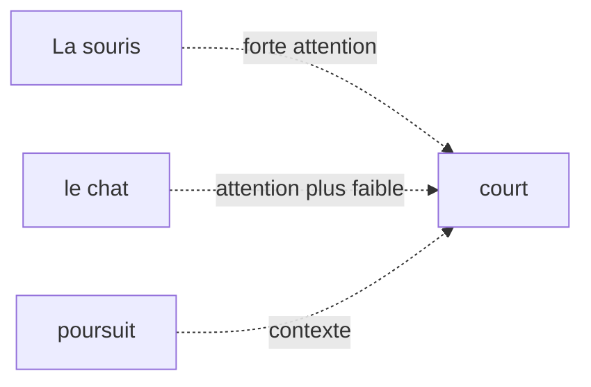

Le modèle apprend donc des relations grammaticales, sémantiques et contextuelles à partir des données.

---

## 1.16. Comparaison RNN vs Transformer

Nous pouvons comparer les deux approches simplement.

|Critère|RNN / LSTM / GRU|Transformer|
|---|---|---|
|Traitement|Séquentiel|Global et parallélisable|
|Dépendances longues|Difficiles|Plus directes|
|Parallélisation|Limitée|Très forte|
|Mémoire du contexte|Compressée dans des états successifs|Relations directes entre tokens|
|Architecture dominante aujourd’hui|Moins utilisée pour NLP massif|Dominante dans les LLM|

Le point clé est le suivant :

> Le Transformer rend beaucoup plus efficace l’apprentissage sur de grands corpus grâce à sa parallélisation et à son accès direct aux relations entre tokens.

---

## 1.17. Ce que le Transformer gagne

Le Transformer apporte plusieurs avantages majeurs.

### 1.17.1 Meilleure parallélisation

Comme tous les tokens d’une séquence peuvent être traités en même temps dans certaines parties du modèle, l’entraînement devient beaucoup plus efficace sur GPU ou TPU.

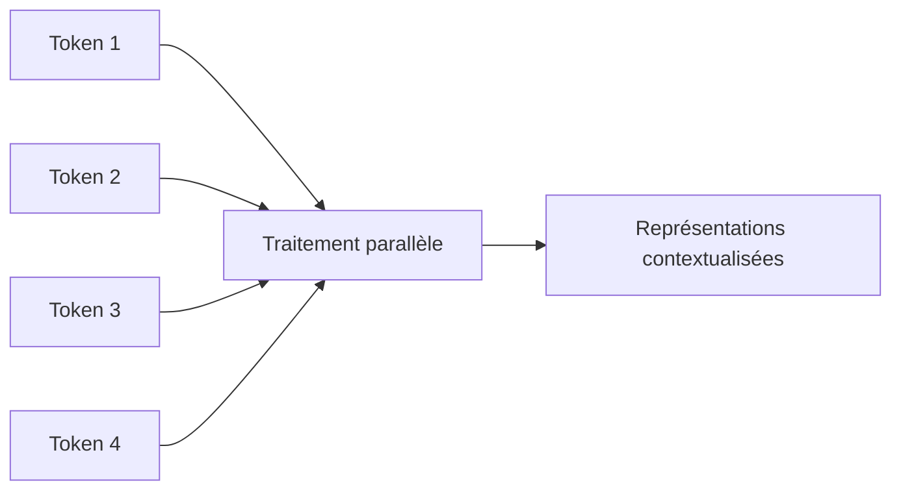

Cela permet d’entraîner des modèles plus grands sur davantage de données.

---

### 1.17.2 Meilleure gestion des dépendances longues

Dans un Transformer, deux tokens éloignés peuvent interagir directement via l’attention.

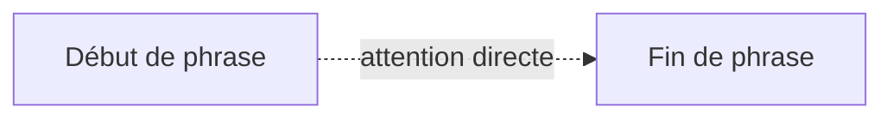

Dans un RNN, l’information doit passer par tous les états intermédiaires.

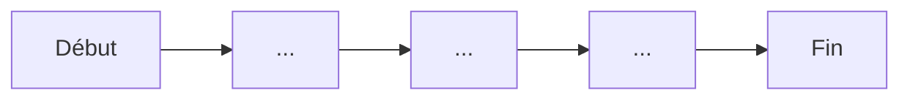

La différence est essentielle.

---

### 1.17.3 Représentations contextualisées

Dans un Transformer, le vecteur associé à un mot dépend des autres mots de la phrase.

Le mot `banque` n’a pas la même représentation dans :

```txt
Je vais à la banque déposer un chèque.
```

et :

```txt
Nous nous asseyons sur la banque au bord de la rivière.
```

Même mot, mais contexte différent.

Le Transformer produit donc une représentation contextualisée.

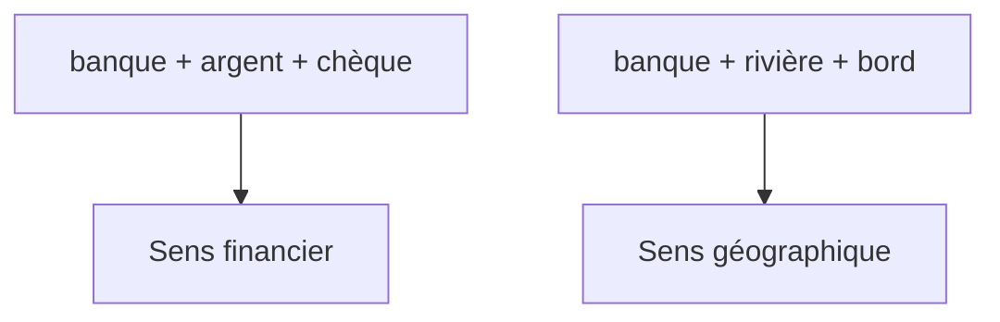

---

## 1.18. Ce que le Transformer perd ou complique

Il ne faut pas présenter les Transformers comme une solution magique.

Ils ont aussi des limites.

### 1.18.1 Coût quadratique de l’attention

Si chaque token regarde tous les autres tokens, alors le nombre de relations à calculer augmente très vite.

Pour une séquence de longueur $n$, la matrice d’attention contient :

$$n \times n$$


relations.

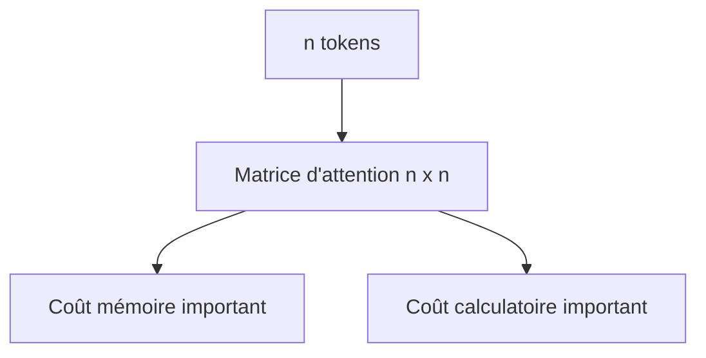

C’est pourquoi les longues séquences sont coûteuses.

Nous reviendrons sur ce point dans le chapitre consacré à la complexité.

---

### 1.18.2 Absence d’ordre naturel

Un RNN lit les mots dans l’ordre. L’ordre est donc intégré naturellement dans le processus.

Un Transformer, lui, regarde tous les tokens en parallèle.

Il faut donc lui ajouter explicitement une information de position.

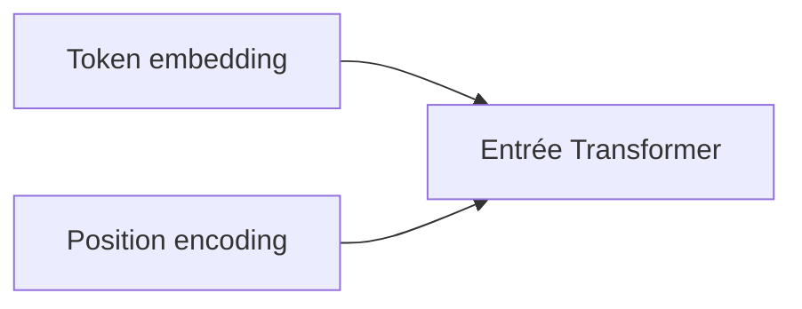

Sans information de position, le Transformer ne saurait pas distinguer :

```txt
Le chien mord l’homme.
```

de :

```txt
L’homme mord le chien.
```

Nous étudierons ce problème en détail dans le chapitre 3.

---

### 1.18.3 Besoin massif de données

Les Transformers modernes sont très puissants, mais ils nécessitent souvent :

- beaucoup de données ;
    
- beaucoup de calcul ;
    
- beaucoup de mémoire ;
    
- une infrastructure matérielle importante.
    

C’est particulièrement vrai pour les grands modèles de langage.

---

## 1.19. Transformer et changement d’échelle

Le succès des Transformers ne vient pas seulement de leur élégance théorique.

Il vient aussi de leur compatibilité avec le passage à l’échelle.

Autrement dit, les Transformers se sont révélés très efficaces lorsque nous augmentons :

- la taille des données ;
    
- la taille du modèle ;
    
- la durée d’entraînement ;
    
- la puissance de calcul.
    

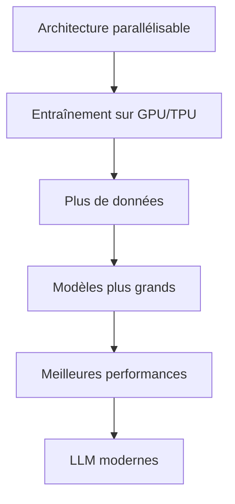

C’est ce qui a permis l’émergence des grands modèles de langage modernes.

---

## 1.20. Les grandes étapes historiques

Nous pouvons résumer l’évolution des architectures de séquences ainsi :

```mermaid
timeline
    title Évolution des modèles de séquences
    RNN : Lecture séquentielle simple
    LSTM / GRU : Meilleure mémoire
    Seq2Seq : Traduction neuronale
    Attention : Accès dynamique au contexte
    Transformer : Attention sans récurrence
    BERT / GPT : Pré-entraînement massif
    LLM modernes : Passage à l'échelle
```

Cette progression montre que les Transformers ne sont pas apparus de nulle part.

Ils sont la réponse à plusieurs limites accumulées :

- les RNN traitaient mal les dépendances longues ;
    
- les modèles Seq2Seq compressaient trop l’information ;
    
- les modèles récurrents étaient difficiles à paralléliser ;
    
- l’attention avait déjà montré son efficacité ;
    
- les GPU/TPU favorisaient les architectures parallélisables.
    

---

## 1.21. L’idée centrale du chapitre

Nous pouvons maintenant formuler l’idée centrale :

> Le Transformer est une architecture conçue pour traiter les séquences en reliant directement les éléments entre eux grâce à l’attention, au lieu de les traiter uniquement dans un ordre séquentiel.

Cela permet :

- de mieux capturer les dépendances longues ;
    
- de paralléliser fortement l’entraînement ;
    
- de produire des représentations contextualisées ;
    
- de construire des modèles très grands ;
    
- de généraliser l’architecture à de nombreux domaines.
    

---

## 1.22. Exemple global : d’une phrase à une représentation contextualisée

Prenons la phrase :

```txt
Le chat noir dort sur le canapé.
```

Un Transformer ne se contente pas d’associer un vecteur fixe à chaque mot.

Il construit une représentation de chaque mot en fonction de tous les autres.

```mermaid
flowchart TD
    A["Le"] --> T["Transformer"]
    B["chat"] --> T
    C["noir"] --> T
    D["dort"] --> T
    E["sur"] --> T
    F["le"] --> T
    G["canapé"] --> T

    T --> A2["Représentation contextualisée de Le"]
    T --> B2["Représentation contextualisée de chat"]
    T --> C2["Représentation contextualisée de noir"]
    T --> D2["Représentation contextualisée de dort"]
    T --> G2["Représentation contextualisée de canapé"]
```

Le mot `chat` sera influencé par :

- `Le`, qui indique le déterminant ;
    
- `noir`, qui apporte une propriété ;
    
- `dort`, qui indique l’action ;
    
- `canapé`, qui donne le contexte de la scène.
    

---

## 1.23. Attention : ce que nous ne savons pas encore

À ce stade du cours, nous comprenons pourquoi les Transformers sont nécessaires, mais nous n’avons pas encore détaillé comment ils fonctionnent.

Nous ne savons pas encore précisément :

- comment un mot devient un vecteur ;
    
- comment le modèle encode l’ordre ;
    
- ce que sont Query, Key et Value ;
    
- comment l’attention est calculée ;
    
- pourquoi on parle de multi-head attention ;
    
- comment fonctionne un bloc encoder ;
    
- comment fonctionne un bloc decoder ;
    
- comment le modèle est entraîné.
    

Ces éléments seront construits progressivement dans les chapitres suivants.

---

## 1.24. Résumé du chapitre

Nous avons vu que les Transformers répondent à plusieurs limites des architectures précédentes.

Les **RNN** lisent les séquences pas à pas, ce qui rend les dépendances longues difficiles et limite la parallélisation.

Les **LSTM** et **GRU** améliorent la mémoire, mais restent fondamentalement séquentiels.

Les modèles **Seq2Seq** ont permis de grandes avancées, notamment en traduction automatique, mais ils souffraient du goulot d’étranglement du vecteur de contexte.

L’**attention** a permis au modèle de sélectionner dynamiquement les parties pertinentes d’une séquence.

Le **Transformer** pousse cette idée plus loin :

> Nous supprimons la récurrence et nous construisons une architecture entièrement fondée sur l’attention.

Cela permet de traiter les séquences de manière plus globale, plus parallélisable et plus adaptée au passage à l’échelle.

---

## 1.25. Schéma de synthèse

```mermaid
flowchart TD
    A["Problème : traiter des séquences"] --> B["RNN"]
    B --> C["Limite : dépendances longues"]
    B --> D["Limite : faible parallélisation"]

    C --> E["LSTM / GRU"]
    D --> E

    E --> F["Seq2Seq"]
    F --> G["Limite : vecteur de contexte unique"]

    G --> H["Attention"]
    H --> I["Meilleur accès au contexte"]

    I --> J["Transformer"]
    J --> K["Attention sans récurrence"]
    J --> L["Parallélisation"]
    J --> M["Dépendances longues"]
    J --> N["LLM modernes"]
```

---

## 1.26. Questions de compréhension

Pour vérifier que nous avons compris ce chapitre, nous pouvons répondre aux questions suivantes.

### Question 1

Pourquoi les RNN sont-ils naturellement adaptés aux séquences ?

Réponse attendue : parce qu’ils lisent les éléments les uns après les autres et maintiennent un état interne qui transporte l’information au fil du temps.

### Question 2

Pourquoi les RNN ont-ils du mal avec les dépendances longues ?

Réponse attendue : parce que l’information doit traverser de nombreuses étapes successives, ce qui peut entraîner une perte d’information et un affaiblissement du gradient.

### Question 3

Quel problème les LSTM et GRU cherchent-ils à résoudre ?

Réponse attendue : ils cherchent à améliorer la mémoire des RNN grâce à des mécanismes de portes permettant de contrôler ce qui est conservé, oublié ou transmis.

### Question 4

Quel est le problème du vecteur de contexte unique dans les premiers modèles Seq2Seq ?

Réponse attendue : toute la phrase source doit être compressée dans une seule représentation, ce qui devient insuffisant pour les phrases longues ou complexes.

### Question 5

Quelle est l’idée principale de l’attention ?

Réponse attendue : permettre au modèle de regarder dynamiquement les parties pertinentes de la séquence au lieu de dépendre d’une seule représentation globale.

### Question 6

Quelle est la rupture introduite par le Transformer ?

Réponse attendue : le Transformer supprime la récurrence et repose principalement sur l’attention pour relier directement les tokens entre eux.

### Question 7

Pourquoi les Transformers sont-ils plus faciles à paralléliser que les RNN ?

Réponse attendue : parce que les représentations des tokens peuvent être calculées simultanément dans les couches d’attention, alors que les RNN nécessitent de calculer les états dans l’ordre.

### Question 8

Quelle est une limite importante des Transformers ?

Réponse attendue : le coût de l’attention augmente quadratiquement avec la longueur de la séquence, car chaque token peut regarder tous les autres tokens.

---

## 1.27. Transition vers le chapitre 2

Dans ce chapitre, nous avons compris pourquoi les Transformers ont été proposés.

Dans le chapitre suivant, nous allons préparer les bases nécessaires pour entrer dans leur fonctionnement interne.

Nous verrons comment passer de ceci :

```txt
Le chat dort.
```

à ceci :

```txt
[154, 932, 421, 13]
```

puis à des vecteurs numériques manipulables par un réseau de neurones.

Autrement dit, nous allons étudier :

- la tokenisation ;
    
- les tokens ;
    
- les embeddings ;
    
- les tenseurs ;
    
- les dimensions utilisées dans un Transformer.
    

Le chapitre 2 construira donc le pont entre le texte brut et l’entrée numérique du modèle.

---

---
> [!info] Livre « Les transformers » — chapitre 1/30
> [[Les transformers — Sommaire|Sommaire]] · [[Les transformers — Sommaire|← Sommaire]] · [[Les transformers — 02 — Rappels nécessaires tenseurs, embeddings et séquences|02 — Rappels nécessaires tenseurs, embeddings et séquences →]]
