> [!info] Livre « Les transformers » — chapitre 2/30
> [[Les transformers — Sommaire|Sommaire]] · [[Les transformers — 01 — Pourquoi les Transformers|← 01 — Pourquoi les Transformers]] · [[Les transformers — 03 — Le problème de l’ordre dans les séquences|03 — Le problème de l’ordre dans les séquences →]]

# Chapitre 2 Rappels nécessaires : tenseurs, embeddings et séquences
## 2.1. Objectif du chapitre

Dans le chapitre précédent, nous avons compris **pourquoi les Transformers ont été introduits** : ils répondent aux limites des architectures séquentielles comme les RNN, LSTM et GRU.

Dans ce deuxième chapitre, nous allons préparer les bases techniques nécessaires pour comprendre l’entrée d’un Transformer.

Un Transformer ne manipule pas directement du texte brut comme :

```txt
Le chat dort sur le canapé.
```

Il manipule des **nombres**, organisés dans des **vecteurs**, eux-mêmes regroupés dans des **matrices** ou des **tenseurs**.

Nous allons donc comprendre comment nous passons de ceci :

```txt
Le chat dort sur le canapé.
```

à ceci :

```txt
[154, 932, 421, 78, 154, 2356]
```

puis à ceci :

```txt
[
  [0.12, -0.45, 0.88, ...],
  [0.31,  0.07, -0.22, ...],
  ...
]
```

Autrement dit, nous allons étudier :

- la tokenisation ;
    
- les tokens ;
    
- les identifiants de tokens ;
    
- les embeddings ;
    
- les tenseurs ;
    
- les dimensions utilisées dans les Transformers ;
    
- la différence entre représentation symbolique et représentation vectorielle.
    

---

## 2.2. Du texte brut aux données numériques

Un réseau de neurones ne comprend pas directement les mots.

Pour un humain, cette phrase est lisible :

```txt
Le chat dort.
```

Mais pour une machine learning model, ce texte doit être converti en nombres.

Nous avons donc une chaîne de transformation :

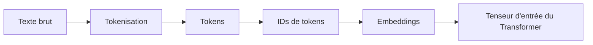

L’idée générale est la suivante :

1. nous découpons le texte en morceaux ;
    
2. nous associons chaque morceau à un identifiant numérique ;
    
3. nous transformons chaque identifiant en vecteur dense ;
    
4. nous envoyons ces vecteurs dans le Transformer.
    

---

## 2.3. Qu’est-ce qu’un token ?

Un **token** est une unité de texte manipulée par le modèle.

Un token peut être :

- un mot ;
    
- une partie de mot ;
    
- un caractère ;
    
- un symbole ;
    
- un signe de ponctuation ;
    
- un espace ou une marque spéciale selon le tokenizer.
    

Par exemple, la phrase :

```txt
Le chat dort.
```

peut être découpée ainsi :

```txt
["Le", "chat", "dort", "."]
```

Mais selon le tokenizer, elle pourrait aussi être découpée différemment.

Par exemple :

```txt
["Le", "Ġchat", "Ġdort", "."]
```

ou encore :

```txt
["L", "e", "chat", "dort", "."]
```

Le token n’est donc pas forcément un mot.

C’est un point fondamental.

---

## 2.4. Pourquoi ne pas utiliser directement les mots ?

Nous pourrions imaginer un modèle qui manipule directement les mots du dictionnaire.

Mais cela pose plusieurs problèmes.

### 2.4.1 Vocabulaire énorme

Une langue contient énormément de mots :

```txt
chat, chats, chatte, chaton, chatière, etc.
```

Si nous ajoutons :

- les conjugaisons ;
    
- les accords ;
    
- les noms propres ;
    
- les fautes de frappe ;
    
- les mots rares ;
    
- les termes techniques ;
    
- les mots étrangers ;
    

le vocabulaire devient gigantesque.

### 2.4.2 Mots inconnus

Si le modèle rencontre un mot absent de son vocabulaire, il ne sait pas quoi faire.

Par exemple :

```txt
anticonstitutionnellement
```

ou :

```txt
GmodIntegration
```

ou encore :

```txt
docker-compose.override.yml
```

Un tokenizer moderne doit pouvoir traiter ces formes rares ou nouvelles.

### 2.4.3 Sous-mots

Pour résoudre ce problème, beaucoup de modèles utilisent des tokens de type **sous-mots**.

Par exemple :

```txt
anticonstitutionnellement
```

pourrait être découpé en :

```txt
["anti", "constitution", "nelle", "ment"]
```

L’avantage est que le modèle peut comprendre un mot rare à partir de morceaux plus fréquents.

---

## 2.5. Tokenisation par mots, caractères et sous-mots

Nous pouvons distinguer trois grandes approches.

### 2.5.1 Tokenisation par mots

La phrase :

```txt
Le chat dort.
```

devient :

```txt
["Le", "chat", "dort", "."]
```

Avantage : c’est intuitif.

Inconvénient : le vocabulaire devient très grand et les mots rares posent problème.

---

### 2.5.2 Tokenisation par caractères

La phrase :

```txt
chat
```

devient :

```txt
["c", "h", "a", "t"]
```

Avantage : presque aucun mot inconnu.

Inconvénient : les séquences deviennent beaucoup plus longues.

Le modèle doit reconstruire lui-même les mots à partir des caractères.

---

### 2.5.3 Tokenisation par sous-mots

La phrase :

```txt
reconstruction
```

peut devenir :

```txt
["re", "construction"]
```

ou :

```txt
["recon", "struction"]
```

ou encore :

```txt
["re", "construct", "ion"]
```

C’est l’approche la plus utilisée dans les grands modèles de langage modernes.

Elle offre un bon compromis entre :

- vocabulaire raisonnable ;
    
- capacité à traiter les mots rares ;
    
- longueur de séquence acceptable.
    

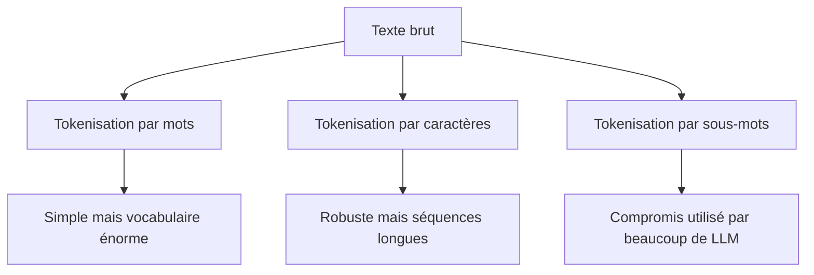

---

## 2.6. Le vocabulaire du modèle

Un modèle de langage possède un **vocabulaire**, c’est-à-dire une liste finie de tokens qu’il connaît.

Par exemple, un vocabulaire simplifié pourrait être :

|ID|Token|
|--:|---|
|0|`<pad>`|
|1|`<unk>`|
|2|`Le`|
|3|`chat`|
|4|`dort`|
|5|`sur`|
|6|`canapé`|
|7|`.`|

La phrase :

```txt
Le chat dort sur le canapé.
```

pourrait alors devenir :

```txt
[2, 3, 4, 5, 2, 6, 7]
```

Nous avons remplacé les tokens par des identifiants numériques.

Mais attention : ces identifiants ne portent pas encore de sens mathématique.

Le fait que `chat = 3` et `dort = 4` ne signifie pas que `dort` est “plus grand” que `chat`.

Ces IDs sont seulement des indices dans une table.

---

## 2.7. Tokens spéciaux

Les modèles utilisent souvent des tokens spéciaux.

Par exemple :

|Token spécial|Rôle|
|---|---|
|`<pad>`|Remplissage pour obtenir des séquences de même longueur|
|`<unk>`|Token inconnu|
|`<bos>`|Début de séquence|
|`<eos>`|Fin de séquence|
|`<mask>`|Token masqué, utilisé notamment dans BERT|
|`<sep>`|Séparateur entre deux segments|
|`<cls>`|Token de classification, utilisé notamment dans BERT|

Par exemple, pour une tâche de classification, nous pourrions avoir :

```txt
[CLS] Le chat dort. [SEP]
```

Pour une tâche de génération, nous pourrions avoir :

```txt
[BOS] Le chat dort. [EOS]
```

Ces tokens spéciaux permettent au modèle de repérer la structure de l’entrée.

---

## 2.8. Padding : pourquoi compléter les séquences ?

Dans un batch, nous entraînons souvent le modèle sur plusieurs phrases en même temps.

Mais les phrases n’ont pas toutes la même longueur.

Par exemple :

```txt
Phrase 1 : Le chat dort.
Phrase 2 : Le petit chat noir dort sur le canapé.
```

Après tokenisation :

```txt
Phrase 1 : [2, 3, 4, 7]
Phrase 2 : [2, 8, 3, 9, 4, 5, 2, 6, 7]
```

Pour les mettre dans un même tenseur, nous devons souvent les compléter avec un token de padding :

```txt
Phrase 1 : [2, 3, 4, 7, 0, 0, 0, 0, 0]
Phrase 2 : [2, 8, 3, 9, 4, 5, 2, 6, 7]
```

Ici, `0` correspond à `<pad>`.

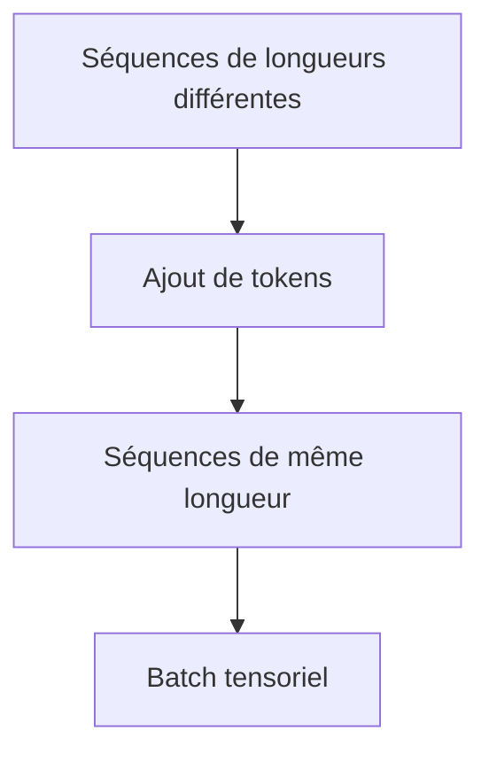

Cependant, le modèle ne doit pas considérer les tokens `<pad>` comme du vrai texte.

Nous utiliserons donc plus tard un **padding mask** pour les ignorer dans l’attention.

---

## 2.9. Représentation symbolique contre représentation distribuée

Une fois que nous avons des IDs de tokens, nous avons une représentation symbolique :

```txt
Le    → 2
chat  → 3
dort  → 4
```

Mais cette représentation est pauvre.

Elle ne dit pas que :

- `chat` est proche de `chien` ;
    
- `dort` est proche de `sommeille` ;
    
- `canapé` est proche de `fauteuil` ;
    
- `manger` est différent de `dormir`.
    

Pour que le modèle apprenne des relations sémantiques, chaque token est transformé en vecteur.

C’est le rôle des **embeddings**.

---

## 2.10. Qu’est-ce qu’un embedding ?

Un **embedding** est un vecteur dense associé à un token.

Par exemple, le token `chat` peut être représenté par un vecteur :

```txt
chat → [0.21, -0.38, 0.74, 0.12, ...]
```

Dans un vrai Transformer, ce vecteur peut avoir une dimension comme :

```txt
768, 1024, 4096, 8192, ...
```

selon la taille du modèle.

Nous appelons souvent cette dimension :

$$d_{model}$$
C’est la dimension principale des représentations internes du Transformer.

---

## 2.11. Table d’embeddings

Concrètement, le modèle contient une grande matrice appelée **table d’embeddings**.

Si le vocabulaire contient $V$ tokens et que chaque embedding a une dimension $d_{model}$, alors la table d’embeddings a la forme :

$$V \times d_{model}$$

Par exemple, avec :

```txt
V = 50 000 tokens
d_model = 768
```

la matrice d’embeddings contient :

```txt
50 000 × 768
```

valeurs apprises.

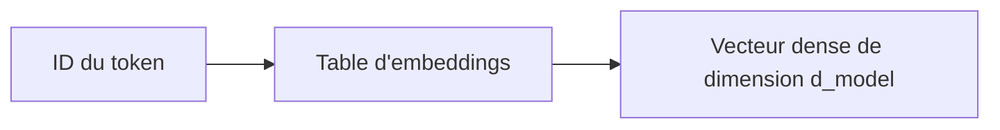

Exemple simplifié :

|Token|ID|Embedding simplifié|
|---|--:|---|
|Le|2|`[0.1, 0.4, -0.2]`|
|chat|3|`[0.7, -0.1, 0.5]`|
|dort|4|`[-0.3, 0.8, 0.2]`|

Donc :

```txt
[2, 3, 4]
```

devient :

```txt
[
  [0.1, 0.4, -0.2],
  [0.7, -0.1, 0.5],
  [-0.3, 0.8, 0.2]
]
```

---

## 2.12. Les embeddings sont appris

Les embeddings ne sont pas écrits à la main.

Ils sont appris pendant l’entraînement.

Au début, ils peuvent être initialisés aléatoirement.

Puis, au fil de l’apprentissage, le modèle ajuste les vecteurs pour mieux résoudre sa tâche.

Par exemple, dans un modèle de langage, le modèle apprend progressivement que certains tokens apparaissent dans des contextes similaires.

Ainsi, les embeddings de mots proches sémantiquement peuvent finir par se rapprocher dans l’espace vectoriel.

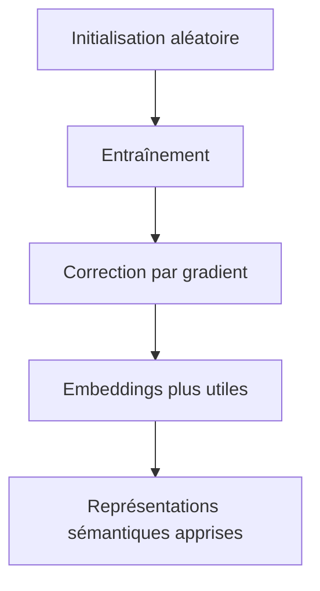

---

## 2.13. Intuition géométrique des embeddings

Nous pouvons voir les embeddings comme des points dans un espace multidimensionnel.

Dans un espace très simplifié à deux dimensions, nous pourrions imaginer :

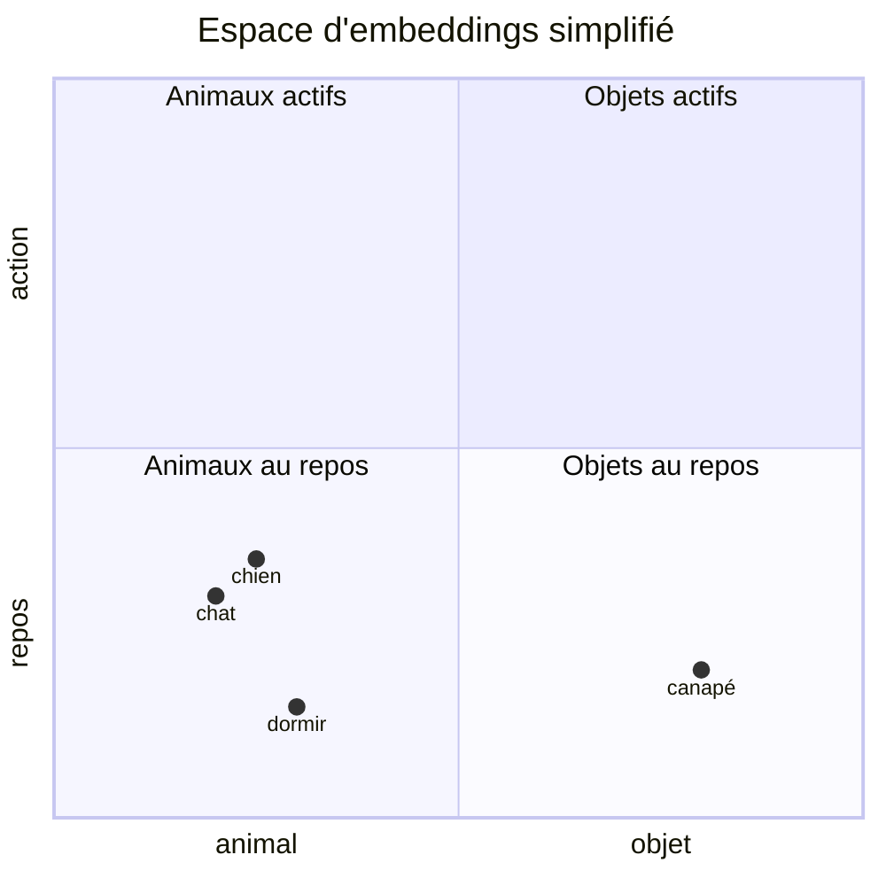

Bien sûr, dans un vrai modèle, l’espace n’a pas deux dimensions mais souvent plusieurs centaines ou milliers.

L’important est l’idée suivante :

> Les embeddings permettent de représenter les tokens dans un espace où les relations entre vecteurs peuvent porter du sens.

---

## 2.14. Embedding statique et embedding contextualisé

Il faut distinguer deux notions.

### 2.14.1 Embedding statique

La table d’embeddings donne une représentation initiale du token.

Par exemple :

```txt
banque → [0.18, -0.22, 0.91, ...]
```

Cette représentation est la même au départ, quel que soit le contexte.

### 2.14.2 Représentation contextualisée

Après passage dans le Transformer, le vecteur du token dépend du contexte.

Le mot `banque` dans :

```txt
Je vais à la banque déposer un chèque.
```

n’aura pas la même représentation finale que dans :

```txt
Nous marchons sur la banque de sable.
```

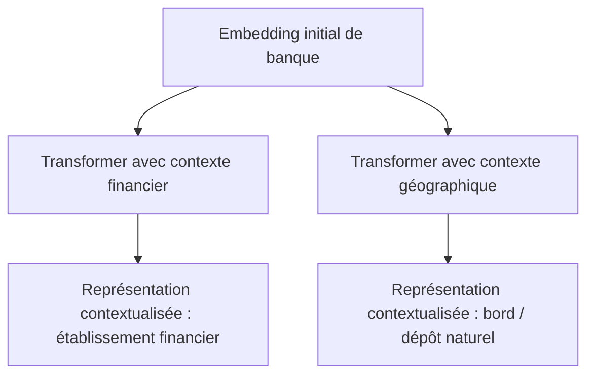

Donc :

> L’embedding initial donne un point de départ, mais le Transformer construit ensuite une représentation dépendante du contexte.

---

## 2.15. Qu’est-ce qu’un tenseur ?

Un **tenseur** est une généralisation des scalaires, vecteurs et matrices.

Nous pouvons retenir simplement :

|Objet|Exemple|Nombre de dimensions|
|---|---|--:|
|Scalaire|`3.14`|0D|
|Vecteur|`[0.1, 0.2, 0.3]`|1D|
|Matrice|`[[1, 2], [3, 4]]`|2D|
|Tenseur|batch de matrices|3D ou plus|

Dans les Transformers, nous manipulons très souvent des tenseurs à trois dimensions :

```txt
(batch_size, sequence_length, d_model)
```

---

## 2.16. Dimensions classiques dans un Transformer

Prenons un exemple.

Nous avons un batch de 32 phrases.

Chaque phrase est tronquée ou complétée à 128 tokens.

Chaque token est représenté par un embedding de dimension 768.

Le tenseur d’entrée a donc la forme :

```txt
(32, 128, 768)
```

Ce qui signifie :

```txt
32 phrases
128 tokens par phrase
768 valeurs par token
```

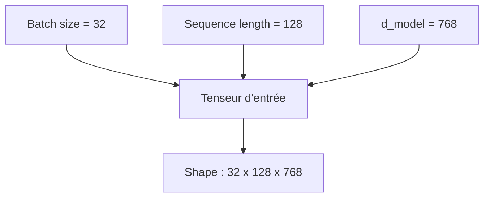

Nous retrouverons ces dimensions tout au long du cours.

---

## 2.17. Dimension batch

La dimension **batch** correspond au nombre d’exemples traités en même temps.

Par exemple :

```txt
batch_size = 4
```

signifie que nous envoyons 4 séquences en parallèle au modèle.

```txt
Phrase 1 : Le chat dort.
Phrase 2 : Le chien aboie.
Phrase 3 : Il pleut aujourd’hui.
Phrase 4 : J’aime les Transformers.
```

Le batch permet :

- d’accélérer l’entraînement ;
    
- de mieux utiliser le GPU ;
    
- de stabiliser l’estimation du gradient.
    

---

## 2.18. Dimension sequence length

La dimension **sequence length** correspond au nombre de tokens dans chaque séquence.

Par exemple :

```txt
Le chat dort.
```

peut devenir :

```txt
["Le", "chat", "dort", "."]
```

Donc :

```txt
sequence_length = 4
```

Mais dans un batch, nous fixons souvent une longueur maximale :

```txt
max_sequence_length = 128
```

Les phrases plus courtes sont complétées avec du padding.

Les phrases plus longues sont tronquées ou découpées.

---

## 2.19. Dimension d_model

La dimension $d_{model}$ est la taille du vecteur associé à chaque token.

Par exemple :

```txt
d_model = 768
```

signifie que chaque token est représenté par 768 nombres.

Le choix de $d_{model}$ influence :

- la capacité du modèle ;
    
- le nombre de paramètres ;
    
- le coût mémoire ;
    
- le coût calculatoire.
    

Un modèle avec un $d_{model}$ plus grand peut représenter plus d’informations, mais coûte plus cher à entraîner et à utiliser.

---

## 2.20. Exemple complet de transformation

Prenons la phrase :

```txt
Le chat dort.
```

Étape 1 : tokenisation

```txt
["Le", "chat", "dort", "."]
```

Étape 2 : conversion en IDs

```txt
[2, 3, 4, 7]
```

Étape 3 : embeddings simplifiés

```txt
[
  [0.1, 0.4, -0.2],
  [0.7, -0.1, 0.5],
  [-0.3, 0.8, 0.2],
  [0.0, -0.5, 0.9]
]
```

Ici, nous avons :

```txt
sequence_length = 4
d_model = 3
```

Donc la forme est :

```txt
(4, 3)
```

Si nous ajoutons un batch de taille 1, la forme devient :

```txt
(1, 4, 3)
```

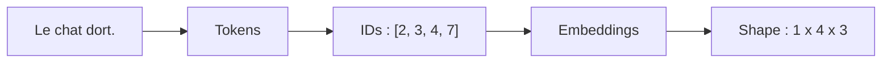

---

## 2.21. Pourquoi les embeddings ne suffisent pas ?

Les embeddings initiaux ne connaissent pas encore le contexte précis.

Par exemple, dans :

```txt
Le chat dort.
```

le token `chat` reçoit un vecteur initial.

Dans :

```txt
Le chat de discussion est ouvert.
```

le token `chat` peut avoir une signification différente selon le contexte.

L’embedding initial ne suffit donc pas.

Le rôle du Transformer sera de transformer ces embeddings initiaux en représentations contextualisées.

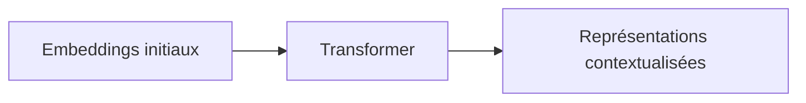

---

## 2.22. Séquence d’entrée dans un Transformer

L’entrée d’un Transformer est donc une matrice de vecteurs.

Pour une phrase de $n$ tokens, nous avons :
 
$$X \in \mathbb{R}^{n \times d_{model}}$$

où :

- $n$ est la longueur de la séquence ;
    
- $d_{model}$ est la dimension des embeddings.
    

Pour un batch, nous avons :

$$X \in \mathbb{R}^{B \times n \times d_{model}}$$
où :

- $B$ est la taille du batch ;
    
- $n$ est la longueur de séquence ;
    
- $d_{model}$ est la dimension du modèle.
    

C’est ce tenseur qui sera envoyé dans les couches du Transformer.

---

## 2.23. Le problème restant : l’ordre

À ce stade, nous avons transformé les tokens en vecteurs.

Mais nous avons un problème majeur.

Si nous envoyons simplement une liste de vecteurs au Transformer, l’architecture d’attention ne connaît pas naturellement l’ordre des tokens.

La phrase :

```txt
Le chien mord l’homme.
```

et la phrase :

```txt
L’homme mord le chien.
```

contiennent presque les mêmes tokens.

Mais le sens est différent.

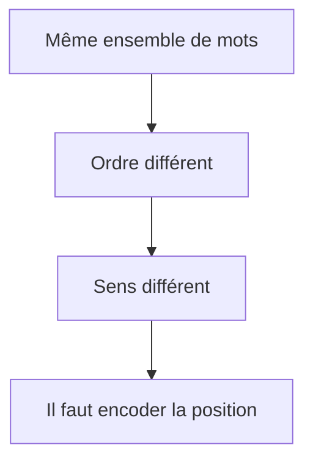

Un RNN encode implicitement l’ordre car il lit la phrase de gauche à droite.

Un Transformer, lui, traite les tokens en parallèle.

Nous devrons donc ajouter explicitement une information de position.

C’est le sujet du chapitre suivant.

---

## 2.24. Résumé du chapitre

Dans ce chapitre, nous avons construit le pipeline d’entrée d’un Transformer.

Nous avons vu que le texte brut doit être transformé en nombres.

La première étape est la **tokenisation**, qui découpe le texte en tokens.

Ces tokens sont ensuite convertis en **IDs**, c’est-à-dire en indices dans le vocabulaire du modèle.

Ces IDs sont transformés en **embeddings**, c’est-à-dire en vecteurs denses appris pendant l’entraînement.

Ces vecteurs sont regroupés dans un **tenseur** de forme typique :

```txt
(batch_size, sequence_length, d_model)
```

Nous avons aussi distingué :

- l’embedding initial, associé au token ;
    
- la représentation contextualisée, produite ensuite par le Transformer.
    

Enfin, nous avons identifié le problème suivant :

> Les Transformers ne connaissent pas naturellement l’ordre des tokens.

Nous devrons donc ajouter une information de position.

---

## 25. Schéma de synthèse

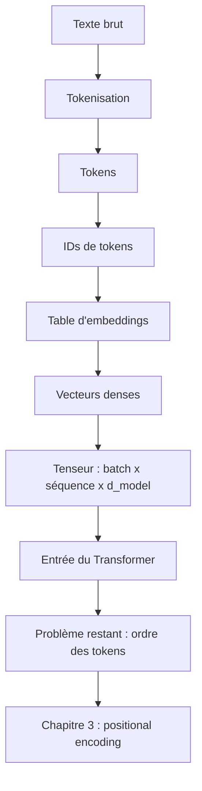

---

## 2.26. Questions de compréhension

### Question 1

Pourquoi un Transformer ne peut-il pas manipuler directement du texte brut ?

Réponse attendue : parce qu’un réseau de neurones manipule des nombres, pas des chaînes de caractères. Le texte doit donc être converti en tokens, puis en IDs, puis en vecteurs.

### Question 2

Qu’est-ce qu’un token ?

Réponse attendue : un token est une unité de texte manipulée par le modèle. Il peut correspondre à un mot, un sous-mot, un caractère, une ponctuation ou un symbole spécial.

### Question 3

Pourquoi utilise-t-on souvent des sous-mots plutôt que des mots entiers ?

Réponse attendue : parce que les sous-mots permettent de limiter la taille du vocabulaire tout en traitant correctement les mots rares, composés ou inconnus.

### Question 4

Quelle est la différence entre un ID de token et un embedding ?

Réponse attendue : un ID est simplement un indice numérique dans le vocabulaire. Un embedding est un vecteur dense appris qui représente le token dans un espace numérique.

### Question 5

Quelle est la forme typique d’un tenseur d’entrée dans un Transformer ?

Réponse attendue :

```txt
(batch_size, sequence_length, d_model)
```

### Question 6

Que signifie $d_{model}$ ?

Réponse attendue : $d_{model}$ est la dimension des vecteurs internes du Transformer, donc la taille de la représentation associée à chaque token.

### Question 7

Pourquoi les tokens `<pad>` sont-ils nécessaires ?

Réponse attendue : ils permettent de compléter les séquences plus courtes afin d’obtenir des séquences de même longueur dans un batch.

### Question 8

Pourquoi les embeddings initiaux ne suffisent-ils pas ?

Réponse attendue : parce qu’ils ne dépendent pas encore du contexte précis de la phrase. Le Transformer doit ensuite produire des représentations contextualisées.

### Question 9

Quel problème reste à résoudre à la fin du chapitre ?

Réponse attendue : il reste à représenter l’ordre des tokens, car le Transformer ne lit pas naturellement la séquence de gauche à droite comme un RNN.

---

## 2.27. Transition vers le chapitre 3

Nous savons maintenant comment transformer du texte brut en tenseur d’entrée.

Mais nous avons identifié un problème fondamental : une simple collection de vecteurs ne suffit pas à représenter une phrase.

L’ordre des mots est essentiel.

Dans le chapitre suivant, nous allons donc étudier :

- pourquoi le Transformer ne connaît pas naturellement les positions ;
    
- comment ajouter une information de position ;
    
- les positional encodings sinusoïdaux du papier original ;
    
- les positional embeddings appris ;
    
- les méthodes modernes comme RoPE et ALiBi.
    

Le chapitre 3 répondra donc à cette question :

> Comment un Transformer sait-il où se trouve chaque token dans la séquence ?

---

---
> [!info] Livre « Les transformers » — chapitre 2/30
> [[Les transformers — Sommaire|Sommaire]] · [[Les transformers — 01 — Pourquoi les Transformers|← 01 — Pourquoi les Transformers]] · [[Les transformers — 03 — Le problème de l’ordre dans les séquences|03 — Le problème de l’ordre dans les séquences →]]
