> [!info] Livre « Les transformers » — chapitre 3/30
> [[Les transformers — Sommaire|Sommaire]] · [[Les transformers — 02 — Rappels nécessaires tenseurs, embeddings et séquences|← 02 — Rappels nécessaires tenseurs, embeddings et séquences]] · [[Les transformers — 04 — Le mécanisme d’attention intuition et formulation|04 — Le mécanisme d’attention intuition et formulation →]]

# Chapitre 3 — Le problème de l’ordre dans les séquences
## 3.1 Objectif du chapitre

Dans le chapitre précédent, nous avons vu comment transformer un texte brut en entrée numérique pour un Transformer.

Nous avons suivi cette chaîne :

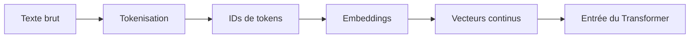

Nous avons donc obtenu une séquence de vecteurs.

Mais une question fondamentale reste ouverte :

> Comment le Transformer sait-il dans quel ordre les tokens apparaissent ?

Cette question est essentielle, car le sens d’une phrase dépend très fortement de l’ordre des mots.

Par exemple :

```txt
Le chien mord l’homme.
```

et :

```txt
L’homme mord le chien.
```

contiennent presque les mêmes mots, mais ne veulent pas dire la même chose.

Dans ce chapitre, nous allons comprendre pourquoi l’ordre n’est pas naturellement intégré dans l’attention, puis nous verrons comment les Transformers injectent une information de position.

Nous étudierons :

- pourquoi l’ordre est indispensable ;
    
- pourquoi l’attention seule ne suffit pas ;
    
- les positional encodings sinusoïdaux ;
    
- les positional embeddings appris ;
    
- les encodages relatifs de position ;
    
- RoPE ;
    
- ALiBi ;
    
- les enjeux modernes liés aux longues fenêtres de contexte.
    

---

## 3.2 Pourquoi l’ordre est indispensable

Une séquence n’est pas seulement un ensemble d’éléments.

C’est un ensemble **ordonné**.

La phrase :

```txt
Marie aime Paul.
```

n’a pas le même sens que :

```txt
Paul aime Marie.
```

Les tokens sont presque identiques :

```txt
["Marie", "aime", "Paul"]
["Paul", "aime", "Marie"]
```

Mais les rôles syntaxiques changent.

Dans la première phrase :

```txt
Marie = sujet
Paul = complément
```

Dans la seconde :

```txt
Paul = sujet
Marie = complément
```

Le modèle doit donc comprendre que la position d’un token influence son rôle.

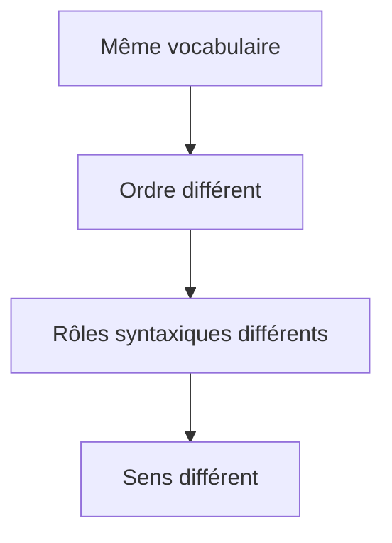

Nous ne pouvons donc pas représenter une phrase uniquement comme un sac de mots.

---

## 3.3 Le modèle sac de mots : ce qu’il perd

Un modèle très simple pourrait représenter une phrase uniquement par les mots qu’elle contient, sans tenir compte de l’ordre.

C’est ce qu’on appelle parfois une représentation **bag-of-words**, ou **sac de mots**.

Par exemple, les deux phrases suivantes :

```txt
Le chat poursuit la souris.
La souris poursuit le chat.
```

auraient presque la même représentation si nous ne regardons que les mots présents :

```txt
{le, chat, poursuit, la, souris}
```

Mais leur sens est opposé.

Dans la première phrase :

```txt
chat → poursuit → souris
```

Dans la seconde :

```txt
souris → poursuit → chat
```

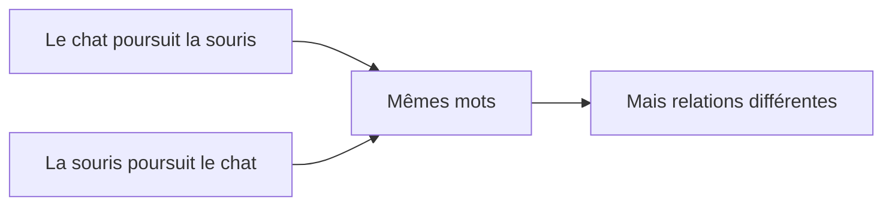

Le Transformer doit donc être capable de représenter non seulement les tokens, mais aussi leur position dans la séquence.

---

## 3.4 RNN et ordre naturel

Les réseaux récurrents, comme les RNN, LSTM et GRU, lisent naturellement les tokens dans l’ordre.

Ils traitent la séquence étape par étape :

```txt
Token 1 → Token 2 → Token 3 → Token 4
```

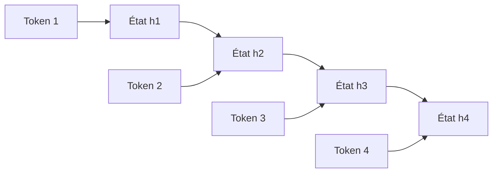

Dans ce type d’architecture, l’ordre est intégré par construction.

Le modèle sait qu’un token arrive après un autre, parce que le calcul lui-même se fait dans cet ordre.

Mais le Transformer fonctionne différemment.

Il traite les tokens en parallèle, ce qui est très efficace pour l’entraînement, mais cela signifie que l’ordre n’est pas automatiquement présent dans le mécanisme de base.

---

## 3.5 Le Transformer ne lit pas naturellement de gauche à droite

Dans un Transformer, les tokens sont représentés comme une matrice.

Par exemple, une phrase de 5 tokens avec des embeddings de dimension 4 peut être représentée comme :

```txt
[
  [0.2, -0.1,  0.7,  0.4],
  [0.5,  0.3, -0.2,  0.8],
  [0.1,  0.9,  0.6, -0.5],
  [0.7, -0.4,  0.2,  0.3],
  [0.0,  0.1, -0.8,  0.6]
]
```

Cette matrice contient une ligne par token.

Mais si nous ne donnons aucune information de position, le modèle voit surtout un ensemble de vecteurs.

Il ne sait pas intrinsèquement que la première ligne correspond au premier token, que la deuxième correspond au deuxième, etc.

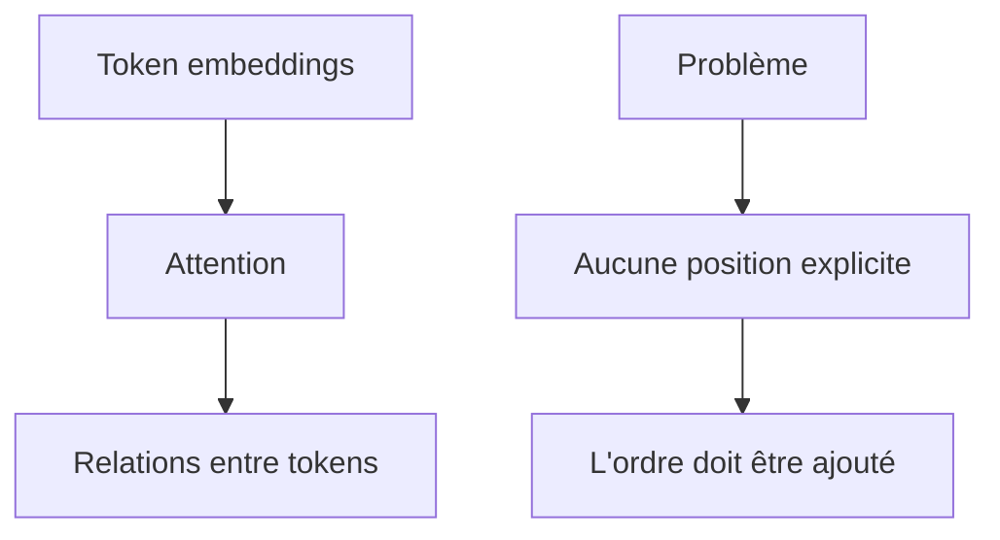

Nous devons donc ajouter une information supplémentaire : la position.

---

## 3.6 Pourquoi l’attention seule ne suffit pas

Le mécanisme d’attention compare les tokens entre eux.

Il répond à une question du type :

> À quels autres tokens ce token doit-il prêter attention ?

Mais si les embeddings ne contiennent aucune information de position, l’attention ne sait pas distinguer clairement deux séquences qui contiennent les mêmes tokens dans un ordre différent.

Prenons deux séquences :

```txt
A B C
C B A
```

Si nous donnons seulement les embeddings de `A`, `B`, `C`, sans position, le modèle connaît les tokens présents, mais pas leur rang exact.

L’attention peut apprendre des relations entre `A`, `B` et `C`, mais il lui manque l’information :

```txt
A est en position 1
B est en position 2
C est en position 3
```

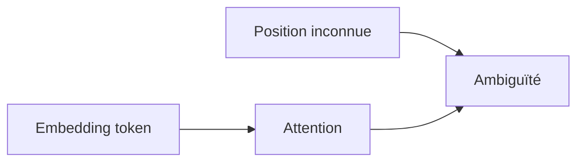

Nous devons donc enrichir chaque token avec une information indiquant sa place dans la séquence.

---

## 3.7 L’idée générale : ajouter une information de position

L’idée la plus simple est la suivante :

> Pour chaque token, nous ajoutons à son embedding une représentation de sa position.

Autrement dit, l’entrée du Transformer n’est pas seulement :

```txt
embedding(token)
```

mais plutôt :

```txt
embedding(token) + encoding(position)
```

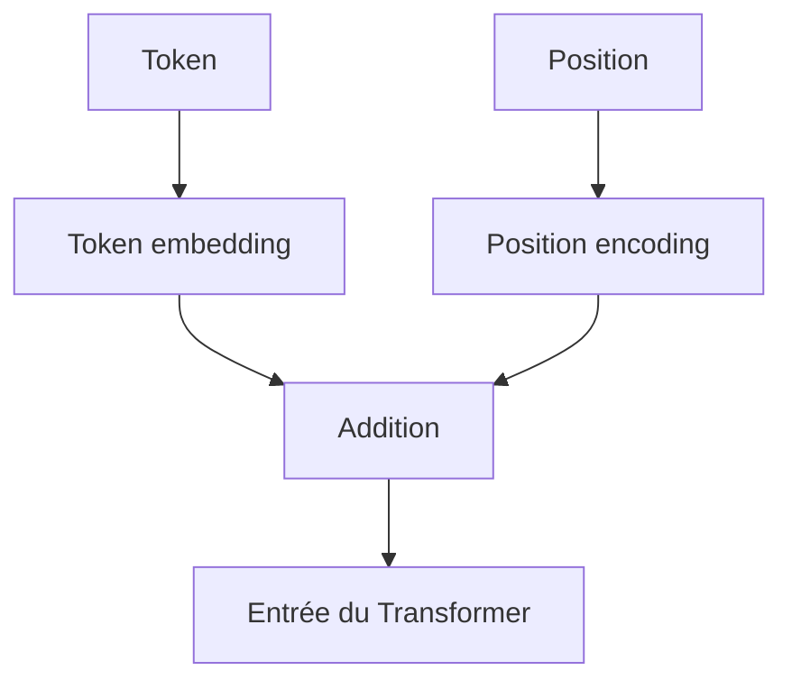

Par exemple, pour la phrase :

```txt
Le chat dort.
```

nous pouvons représenter :

```txt
Le    = embedding("Le")    + position(0)
chat  = embedding("chat")  + position(1)
dort  = embedding("dort")  + position(2)
.     = embedding(".")     + position(3)
```

Cela permet au modèle de savoir non seulement quel token est présent, mais aussi où il se trouve.

---

## 3.8 Forme des embeddings de position

L’embedding de position doit avoir la même dimension que l’embedding du token.

Si :

```txt
d_model = 512
```

alors chaque token embedding est un vecteur de dimension 512.

L’encodage de position doit donc également être un vecteur de dimension 512, afin que nous puissions les additionner.

$$
x_i = token_embedding_i + position_encoding_i  
$$

où :

- $x_i$ est l’entrée finale du token en position $i$ ;
    
- $token_embedding_i$ représente le contenu du token ;
    
- $position_encoding_i$ représente sa position.
    

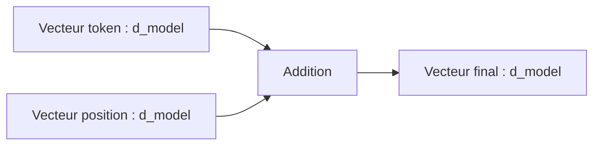

Cette addition est simple, efficace et conserve la même dimension d’entrée pour le Transformer.

---

## 3.9 Exemple numérique simplifié

Supposons que nous ayons un embedding de token en dimension 3.

Pour le token `chat`, nous avons :

```txt
embedding("chat") = [0.7, -0.1, 0.9]
```

Pour la position 1, nous avons :

```txt
position(1) = [0.05, 0.20, -0.10]
```

L’entrée finale devient :

```txt
x = [0.7, -0.1, 0.9] + [0.05, 0.20, -0.10]
```

Donc :

```txt
x = [0.75, 0.10, 0.80]
```

Le modèle reçoit donc un vecteur qui mélange deux informations :

- le contenu : `chat` ;
    
- la position : `position 1`.
    

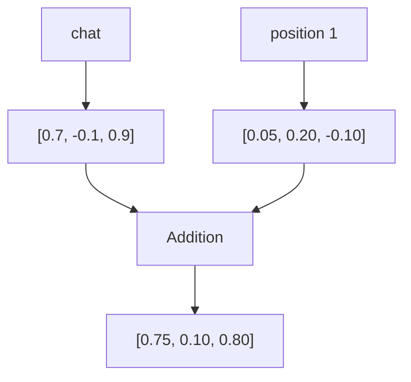

---

## 3.10 Deux grandes familles d’encodages de position

Nous pouvons distinguer deux grandes familles.

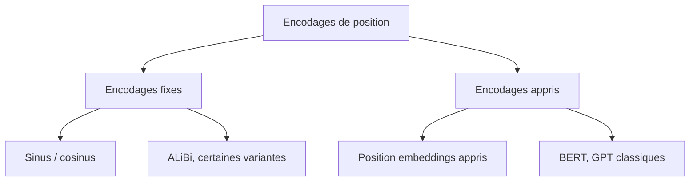

### 3.10.1 Encodages fixes

Dans un encodage fixe, les vecteurs de position ne sont pas appris.

Ils sont calculés à partir d’une formule.

C’est le cas des **positional encodings sinusoïdaux** du papier _Attention Is All You Need_.

### 3.10.2 Encodages appris

Dans un encodage appris, chaque position possède un vecteur appris pendant l’entraînement.

C’est une méthode très utilisée dans de nombreux modèles modernes.

---

## 3.11 Les positional encodings sinusoïdaux

Dans le Transformer original, les auteurs utilisent des fonctions sinus et cosinus pour représenter les positions.

L’idée est d’associer à chaque position un vecteur déterministe, calculé avec des fréquences différentes.

La formule donnée dans le papier est :

$$
PE_{(pos, 2i)} = \sin\left(\frac{pos}{10000^{2i/d_{model}}}\right)  
$$

$$
PE_{(pos, 2i+1)} = \cos\left(\frac{pos}{10000^{2i/d_{model}}}\right)  
$$

où :

- $pos$ est la position du token dans la séquence ;
    
- $i$ est l’indice de la dimension ;
    
- $d_{model}$ est la dimension totale du modèle ;
    
- les dimensions paires utilisent sinus ;
    
- les dimensions impaires utilisent cosinus.
    

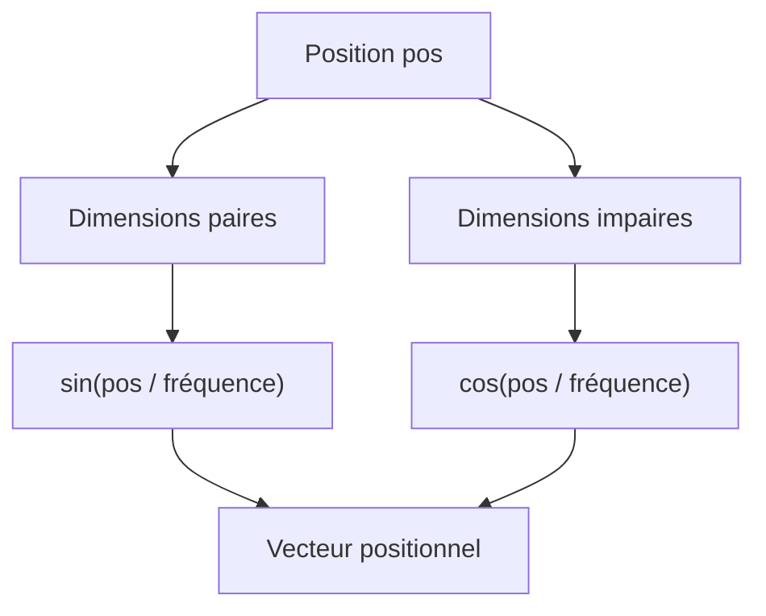

---

## 3.12 Intuition des sinus et cosinus

Pourquoi utiliser sinus et cosinus ?

L’idée est de représenter chaque position avec plusieurs fréquences.

Certaines dimensions varient rapidement avec la position.

D’autres dimensions varient lentement.

Cela permet au modèle de disposer d’informations à plusieurs échelles.

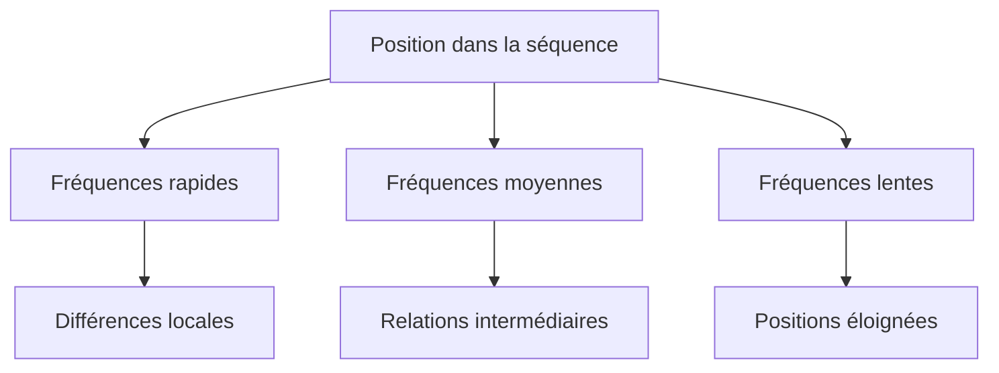

Nous pouvons faire une analogie avec une horloge.

Sur une horloge :

- l’aiguille des secondes change très vite ;
    
- l’aiguille des minutes change plus lentement ;
    
- l’aiguille des heures change encore plus lentement.
    

En combinant plusieurs rythmes, nous pouvons identifier une position temporelle.

Les positional encodings sinusoïdaux fonctionnent avec une idée similaire : plusieurs fréquences permettent de distinguer les positions.

---

## 3.13 Pourquoi alterner sinus et cosinus ?

L’utilisation conjointe de sinus et cosinus permet de mieux représenter les relations de décalage entre positions.

Deux fonctions sinus seules peuvent être ambiguës.

Le couple sinus/cosinus encode une position comme un point sur un cercle.

Pour une fréquence donnée, nous pouvons voir :

$$
(\sin(pos), \cos(pos))  
$$

comme une position angulaire.

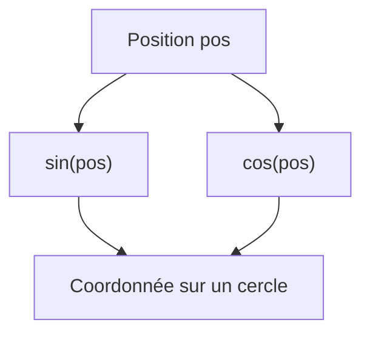

Cette structure rend les relations entre positions plus faciles à exploiter mathématiquement.

En particulier, elle permet au modèle d’apprendre plus facilement des relations relatives du type :

```txt
le token actuel regarde le token situé 3 positions avant
```

ou :

```txt
le token actuel regarde le token situé 5 positions après
```

---

## 3.14 Exemple simplifié de positional encoding

Prenons une dimension très petite, uniquement pour comprendre.

Supposons que (d_{model} = 4).

Pour chaque position, nous allons produire un vecteur de 4 valeurs :

```txt
[position_dim_0, position_dim_1, position_dim_2, position_dim_3]
```

Les dimensions 0 et 2 utiliseront sinus.

Les dimensions 1 et 3 utiliseront cosinus.

Exemple conceptuel :

|Position|Dimension 0|Dimension 1|Dimension 2|Dimension 3|
|--:|--:|--:|--:|--:|
|0|sin(...)|cos(...)|sin(...)|cos(...)|
|1|sin(...)|cos(...)|sin(...)|cos(...)|
|2|sin(...)|cos(...)|sin(...)|cos(...)|
|3|sin(...)|cos(...)|sin(...)|cos(...)|

Chaque position obtient donc une signature vectorielle différente.

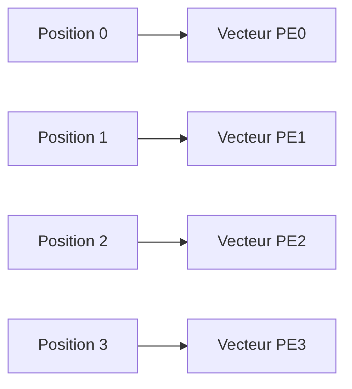

---

## 3.15 Avantage des encodages sinusoïdaux

Le premier avantage est qu’ils ne nécessitent pas de paramètres appris.

Ils sont calculés directement.

Cela signifie qu’ils n’ajoutent pas de poids supplémentaires au modèle.

Deuxième avantage : ils peuvent théoriquement généraliser à des longueurs de séquence plus grandes que celles vues pendant l’entraînement, car nous pouvons calculer les valeurs pour n’importe quelle position.

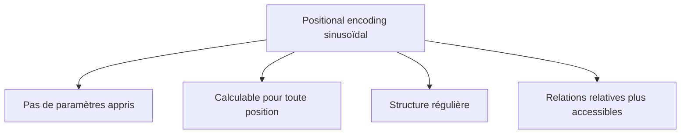

Cela dit, cette généralisation théorique ne signifie pas toujours que le modèle fonctionnera parfaitement sur des contextes beaucoup plus longs que ceux vus pendant l’entraînement.

---

## 3.16 Limites des encodages sinusoïdaux

Les positional encodings sinusoïdaux sont élégants, mais ils ont aussi des limites.

Ils imposent une structure fixe.

Le modèle ne choisit pas lui-même la meilleure manière de représenter les positions.

Dans certains cas, des embeddings de position appris peuvent mieux s’adapter aux données.

Autre limite : pour les très longues séquences, la gestion de la position devient plus complexe. Les modèles modernes utilisent souvent d’autres méthodes, comme RoPE ou ALiBi.

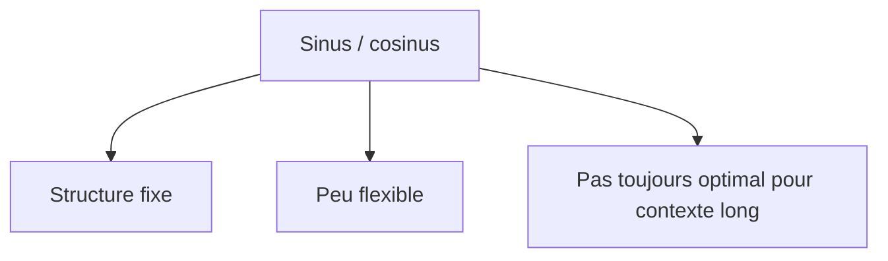

---

## 3.17 Les positional embeddings appris

Une autre approche consiste à apprendre directement un vecteur pour chaque position.

Supposons que le modèle accepte des séquences de longueur maximale 512.

Nous créons alors une table de positions :

```txt
position 0   → vecteur appris
position 1   → vecteur appris
position 2   → vecteur appris
...
position 511 → vecteur appris
```

Cette table a la forme :

$$
max_seq_len \times d_{model}  
$$

Par exemple :

```txt
max_seq_len = 512
d_model = 768
```

La table de positions a donc :

```txt
512 × 768
```

paramètres.

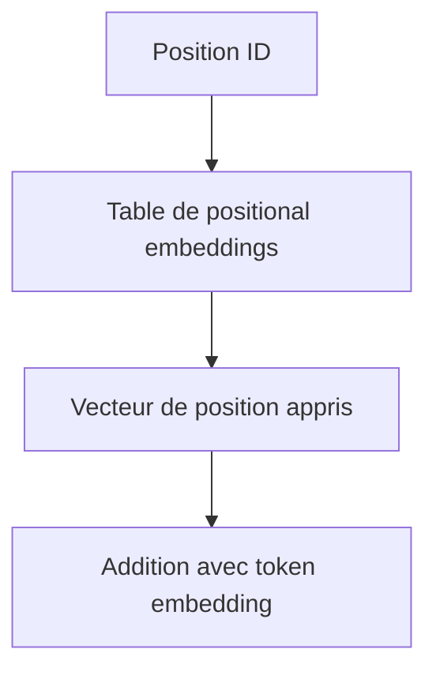

---

## 3.18 Exemple d’embeddings de position appris

Pour une phrase :

```txt
Le chat dort.
```

Nous avons :

```txt
Le    → position 0
chat  → position 1
dort  → position 2
.     → position 3
```

Chaque position est associée à un vecteur appris :

```txt
position 0 → p0
position 1 → p1
position 2 → p2
position 3 → p3
```

L’entrée finale est :

```txt
x0 = embedding("Le")   + p0
x1 = embedding("chat") + p1
x2 = embedding("dort") + p2
x3 = embedding(".")    + p3
```

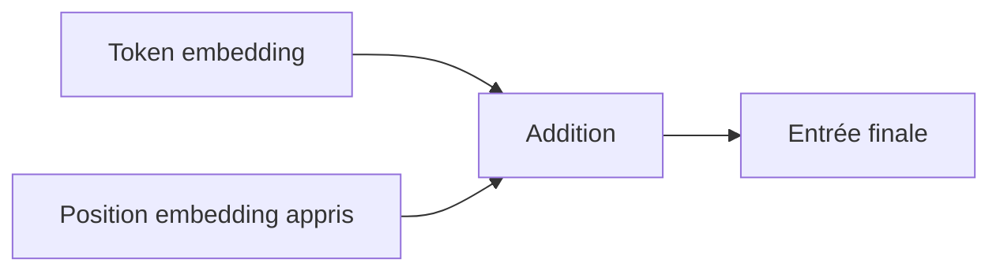

---

## 3.19 Avantages des embeddings appris

Les embeddings de position appris sont flexibles.

Le modèle peut apprendre la représentation positionnelle la plus utile pour sa tâche.

C’est particulièrement intéressant lorsque la structure des données possède des régularités propres.

Par exemple, dans certains modèles de langage, les premières positions peuvent avoir des rôles particuliers :

- début de prompt ;
    
- instruction ;
    
- contexte système ;
    
- question utilisateur ;
    
- réponse attendue.
    

Un embedding appris peut s’adapter statistiquement à ces usages.

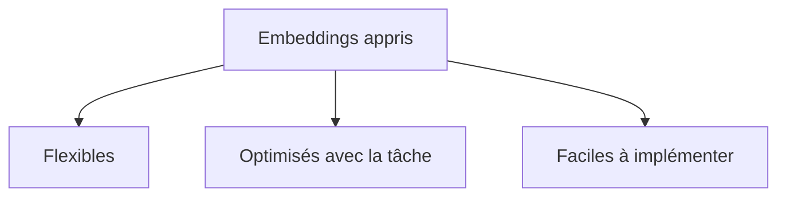

---

## 3.20 Limites des embeddings appris

La limite principale est que le modèle apprend seulement les positions prévues dans sa fenêtre maximale.

Si le modèle a été entraîné avec :

```txt
max_seq_len = 512
```

alors il possède des vecteurs appris pour les positions de 0 à 511.

Mais que faire pour la position 800 ?

Il n’existe pas forcément de vecteur appris.

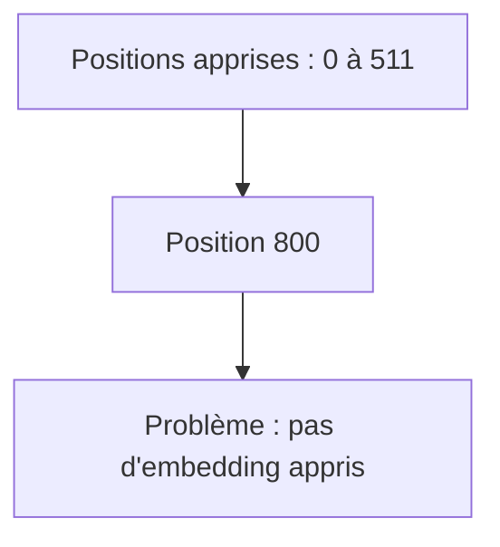

Cela rend l’extrapolation vers des séquences plus longues plus difficile.

Pour cette raison, les modèles modernes ont beaucoup travaillé sur des encodages positionnels plus robustes.

---

## 3.21 Position absolue et position relative

Jusqu’ici, nous avons surtout parlé de position absolue.

La position absolue indique :

```txt
ce token est en position 0
ce token est en position 1
ce token est en position 2
```

Mais dans beaucoup de tâches, ce qui compte le plus n’est pas seulement la position absolue, mais la distance entre deux tokens.

Par exemple :

```txt
Le chat noir dort.
```

Le lien entre `chat` et `noir` dépend surtout du fait qu’ils sont proches.

Nous pouvons donc vouloir représenter :

```txt
noir est 1 token après chat
dort est 2 tokens après chat
Le est 1 token avant chat
```

C’est ce qu’on appelle la **position relative**.

```mermaid
flowchart LR
    A["chat"] --> B["noir"]
    A -. "+1" .-> B
    A --> C["dort"]
    A -. "+2" .-> C
    D["Le"] -. "-1" .-> A
```

---

## 3.22 Encodage absolu vs relatif

Nous pouvons résumer la différence ainsi :

|Type|Question représentée|
|---|---|
|Position absolue|Où est ce token dans la séquence ?|
|Position relative|À quelle distance sont deux tokens ?|

Exemple :

```txt
Position absolue :
"chat" est en position 1

Position relative :
"noir" est à +1 de "chat"
```

Les encodages relatifs sont souvent très utiles parce que de nombreuses structures linguistiques dépendent des distances locales.

Par exemple :

- adjectif proche du nom ;
    
- sujet proche ou éloigné du verbe ;
    
- parenthèses ;
    
- blocs de code ;
    
- indentation ;
    
- dépendances syntaxiques.
    

---

## 3.23 Pourquoi les positions relatives sont importantes

Dans une phrase longue, deux tokens peuvent avoir une relation forte même si leur position absolue change.

Prenons :

```txt
Le chat noir dort.
```

et :

```txt
Hier soir, le chat noir dort.
```

Dans les deux cas, `chat` et `noir` sont proches.

Mais leur position absolue change.

Dans la première phrase :

```txt
chat = position 1
noir = position 2
```

Dans la deuxième :

```txt
chat = position 3
noir = position 4
```

La relation importante est :

```txt
noir est juste après chat
```

pas nécessairement :

```txt
noir est en position 2 ou 4
```

```mermaid
flowchart TD
    A["Phrase 1 : chat position 1, noir position 2"] --> C["Distance relative +1"]
    B["Phrase 2 : chat position 3, noir position 4"] --> C
    C --> D["Relation similaire"]
```

Les encodages relatifs permettent donc de mieux capturer certaines régularités transférables.

---

## 3.24 Position et attention

La position intervient directement dans l’attention.

Rappelons l’idée de l’attention : chaque token calcule des scores avec les autres tokens.

Mais pour bien interpréter ces scores, le modèle doit savoir si un token est :

- avant ;
    
- après ;
    
- proche ;
    
- loin ;
    
- au début ;
    
- à la fin.
    

Exemple avec la phrase :

```txt
Le chat que le chien poursuit dort.
```

Le token `dort` doit comprendre que son sujet est `chat`, même si d’autres noms apparaissent entre les deux.

```mermaid
flowchart LR
    A["Le chat"] -. "sujet de dort" .-> E["dort"]
    B["le chien"] -. "distracteur" .-> E
    C["poursuit"] -. "subordonnée" .-> E
```

Les informations de position aident le modèle à structurer ces relations.

---

## 3.25 RoPE : Rotary Position Embedding

Les modèles modernes utilisent souvent des variantes plus sophistiquées que les encodages absolus classiques.

Une méthode très importante est **RoPE**, pour **Rotary Position Embedding**.

L’idée de RoPE est différente d’une simple addition :

> Au lieu d’ajouter un vecteur de position, nous appliquons une rotation aux vecteurs de requête et de clé selon leur position.

Nous verrons les requêtes et les clés en détail dans le chapitre sur l’attention.

Pour l’instant, retenons simplement que RoPE injecte la position dans le calcul d’attention lui-même.

```mermaid
flowchart TD
    A["Token embedding"] --> B["Projection en Query / Key"]
    C["Position"] --> D["Rotation dépendante de la position"]
    B --> D
    D --> E["Attention avec information positionnelle"]
```

RoPE est notamment utilisé dans plusieurs familles de modèles de langage modernes, car il permet de mieux gérer les relations relatives entre tokens.

---

## 3.26 Intuition de RoPE

Pour comprendre intuitivement RoPE, imaginons que chaque position fasse tourner les vecteurs dans l’espace.

Un token en position 0 garde une certaine orientation.

Un token en position 1 est légèrement tourné.

Un token en position 2 est un peu plus tourné.

Ainsi, quand deux tokens interagissent dans l’attention, leur relation dépend aussi de leur écart de position.

```mermaid
flowchart LR
    A["Position 0"] --> B["Rotation 0"]
    C["Position 1"] --> D["Petite rotation"]
    E["Position 2"] --> F["Rotation plus grande"]
    G["Position n"] --> H["Rotation selon n"]
```

L’intérêt est que le produit scalaire entre queries et keys incorpore naturellement une information relative.

Cela rend RoPE très intéressant pour les modèles autoregressifs de type GPT.

---

## 3.27 ALiBi : Attention with Linear Biases

Une autre approche moderne est **ALiBi**, pour **Attention with Linear Biases**.

L’idée est d’ajouter un biais directement aux scores d’attention selon la distance entre les tokens.

Plus un token est éloigné, plus son score peut être pénalisé.

Conceptuellement :

```txt
score_attention = score_original + biais_positionnel
```

Le biais dépend de la distance.

```mermaid
flowchart TD
    A["Scores d'attention"] --> B["Distance entre tokens"]
    B --> C["Biais linéaire"]
    A --> D["Score modifié"]
    C --> D
    D --> E["Softmax"]
```

ALiBi est intéressant parce qu’il ne nécessite pas d’apprendre une table de positions et qu’il peut mieux extrapoler vers des séquences plus longues dans certains contextes.

---

## 3.28 Comparaison des principales méthodes

Nous pouvons comparer les approches principales.

|Méthode|Principe|Avantage|Limite|
|---|---|---|---|
|Sinus/cosinus|Encodage fixe ajouté aux embeddings|Pas de paramètres, extrapolable|Moins flexible|
|Position embeddings appris|Table de positions apprise|Très flexible|Difficile d’extrapoler|
|Position relative|Encode les distances entre tokens|Bonne généralisation locale|Plus complexe|
|RoPE|Rotation des queries/keys|Très adapté aux LLM modernes|Plus difficile à comprendre|
|ALiBi|Biais linéaire dans l’attention|Simple, extrapolation intéressante|Hypothèse de pénalité avec distance|

Il n’existe pas une seule méthode parfaite.

Le choix dépend :

- du type de modèle ;
    
- de la longueur de contexte ;
    
- du type de tâche ;
    
- de la stabilité d’entraînement ;
    
- du coût de calcul ;
    
- de la capacité d’extrapolation souhaitée.
    

---

## 3.29 Positions dans un modèle encoder-only

Dans un modèle encoder-only, comme BERT, le modèle voit toute la séquence en même temps.

Il peut regarder à gauche et à droite.

Exemple :

```txt
Le chat [MASK] sur le canapé.
```

Pour prédire `[MASK]`, le modèle peut utiliser :

- les tokens avant ;
    
- les tokens après.
    

```mermaid
flowchart LR
    A["Tokens gauche"] --> B["Token masqué"]
    C["Tokens droite"] --> B
    B --> D["Prédiction"]
```

Dans ce cas, l’information de position aide le modèle à comprendre l’organisation globale de la phrase.

---

## 3.30 Positions dans un modèle decoder-only

Dans un modèle decoder-only, comme les modèles GPT, le modèle génère du texte de gauche à droite.

Il ne doit pas voir les tokens futurs.

Exemple :

```txt
Le chat dort sur le
```

Le modèle doit prédire le token suivant, par exemple :

```txt
canapé
```

Il utilise donc uniquement le contexte passé.

```mermaid
flowchart LR
    A["Le"] --> E["Prédiction prochain token"]
    B["chat"] --> E
    C["dort"] --> E
    D["sur le"] --> E
    F["Tokens futurs"] -. "interdits" .-> E
```

Dans ce cas, la position est combinée avec un **masque causal**, que nous étudierons en détail dans un chapitre ultérieur.

---

## 3.31 Positions dans un modèle encoder-decoder

Dans le Transformer original, nous avons une architecture encoder-decoder.

L’encoder reçoit la phrase source.

Le decoder génère la phrase cible.

Il y a donc deux séquences :

- la séquence source ;
    
- la séquence cible.
    

Chaque séquence a ses propres positions.

```mermaid
flowchart TD
    A["Phrase source"] --> B["Token embeddings source"]
    B --> C["Positions source"]
    C --> D["Encoder"]

    E["Phrase cible"] --> F["Token embeddings cible"]
    F --> G["Positions cible"]
    G --> H["Decoder"]

    D --> H
```

Cela est essentiel en traduction automatique, car l’ordre des mots peut être différent entre les langues.

---

## 3.32 Ordre source et ordre cible en traduction

Prenons une traduction simple :

```txt
The black cat sleeps.
Le chat noir dort.
```

En anglais, l’adjectif `black` vient avant le nom `cat`.

En français, l’adjectif `noir` vient après le nom `chat`.

```mermaid
flowchart LR
    A["black"] -. "correspond à" .-> D["noir"]
    B["cat"] -. "correspond à" .-> C["chat"]

    A --> B
    C --> D
```

Le modèle doit donc comprendre :

- l’ordre dans la phrase source ;
    
- l’ordre dans la phrase cible ;
    
- les correspondances entre les deux.
    

Les encodages positionnels sont donc indispensables pour la traduction.

---

## 3.33 Le cas du code informatique

Les positions sont également importantes pour le code.

Prenons :

```js
if (x > 0) {
  return x;
}
```

Dans du code, l’ordre des tokens, les blocs et l’indentation sont cruciaux.

Un changement de position peut changer le programme.

```js
return x;
if (x > 0) {
}
```

Ce second exemple n’a pas du tout la même structure.

```mermaid
flowchart TD
    A["Code source"] --> B["Ordre des tokens"]
    A --> C["Structure des blocs"]
    A --> D["Portée des variables"]
    A --> E["Contrôle du flux"]
```

Pour les modèles de génération de code, la position est donc aussi importante que pour le langage naturel.

---

## 3.34 Le cas de la vision

Les Transformers ne sont pas utilisés uniquement pour le texte.

Dans les Vision Transformers, une image est découpée en patches.

Chaque patch devient un token.

Mais là encore, l’ordre spatial est indispensable.

Un patch en haut à gauche n’a pas le même rôle qu’un patch en bas à droite.

```mermaid
flowchart TD
    A["Image"] --> B["Découpage en patches"]
    B --> C["Patch tokens"]
    C --> D["Position spatiale"]
    D --> E["Transformer"]
```

Sans information de position, le modèle verrait seulement un ensemble de morceaux d’image sans connaître leur disposition spatiale.

---

## 3.35 Longueur de contexte et extrapolation

Dans les LLM modernes, la longueur de contexte est devenue un enjeu majeur.

Nous voulons parfois traiter :

- 4 000 tokens ;
    
- 16 000 tokens ;
    
- 128 000 tokens ;
    
- parfois davantage.
    

Mais les encodages de position doivent rester fiables sur ces longues distances.

```mermaid
flowchart TD
    A["Contexte court"] --> B["Positions faciles à gérer"]
    C["Contexte long"] --> D["Positions nombreuses"]
    D --> E["Extrapolation difficile"]
    D --> F["Coût mémoire élevé"]
    D --> G["Relations longues plus rares"]
```

Un modèle entraîné sur des séquences courtes peut ne pas savoir utiliser correctement des positions beaucoup plus grandes.

Cela explique pourquoi les techniques positionnelles modernes sont si importantes.

---

## 3.36 Attention locale et biais de proximité

Dans beaucoup de données, les tokens proches sont souvent plus pertinents que les tokens très éloignés.

Par exemple, dans une phrase :

```txt
Le très vieux chat noir dort.
```

Les mots proches de `chat` sont souvent importants :

```txt
vieux
noir
dort
```

Mais cela n’est pas toujours vrai.

Dans certains cas, une dépendance longue est essentielle :

```txt
Le livre que Paul a acheté hier dans une librairie ancienne du centre-ville est passionnant.
```

Ici, `livre` est relié à `est passionnant`, malgré la distance.

```mermaid
flowchart TD
    A["Relations locales"] --> C["Souvent utiles"]
    B["Relations longues"] --> D["Parfois essentielles"]
    C --> E["Le modèle doit gérer les deux"]
    D --> E
```

Les encodages de position doivent donc permettre au modèle de combiner proximité locale et dépendances longues.

---

## 3.37 Erreur fréquente : confondre ordre et causalité

Il faut distinguer deux notions :

|Notion|Signification|
|---|---|
|Position|Où se trouve un token dans la séquence|
|Causalité|Quels tokens le modèle a le droit de regarder|

Un modèle peut connaître la position de tous les tokens, mais être empêché de regarder les tokens futurs.

C’est le cas des modèles autoregressifs.

```mermaid
flowchart TD
    A["Position"] --> B["Information sur le rang du token"]
    C["Masque causal"] --> D["Interdiction de voir le futur"]
```

Dans un GPT, le token en position 5 sait qu’il est en position 5, mais il ne doit pas accéder au contenu de la position 6 pendant la prédiction.

Nous reviendrons à ce point dans le chapitre sur les masques d’attention.

---

## 3.38 Erreur fréquente : penser que l’addition détruit l’information

Une question naturelle est :

> Si nous additionnons l’embedding du token et l’embedding de position, ne mélangeons-nous pas trop les informations ?

En pratique, cette addition fonctionne bien, car les dimensions du modèle sont apprises pour exploiter cette combinaison.

Le Transformer reçoit un vecteur qui contient à la fois :

- une composante liée au contenu ;
    
- une composante liée à la position.
    

Les couches suivantes peuvent apprendre à séparer ou combiner ces informations selon les besoins.

```mermaid
flowchart LR
    A["Contenu lexical"] --> C["Vecteur final"]
    B["Position"] --> C
    C --> D["Couches Transformer"]
    D --> E["Interprétation apprise"]
```

L’addition est donc un choix simple, mais efficace.

---

## 3.39 Erreur fréquente : croire que les positions suffisent à comprendre la syntaxe

Les encodages de position donnent une information d’ordre.

Mais ils ne donnent pas directement une analyse grammaticale.

Ils ne disent pas explicitement :

```txt
ce mot est le sujet
ce mot est le complément
ce mot est un verbe
```

Ils fournissent seulement une information permettant au modèle d’apprendre ces relations.

```mermaid
flowchart TD
    A["Position"] --> B["Information d'ordre"]
    B --> C["Attention + apprentissage"]
    C --> D["Relations syntaxiques apprises"]
```

La syntaxe émerge de l’apprentissage, des données, de l’architecture et de l’objectif d’entraînement.

---

## 3.40 Synthèse : ce que nous ajoutons au Transformer

Nous pouvons maintenant résumer l’entrée réelle d’un Transformer.

Pour chaque token, nous construisons :

$$ 
x_i = e_i + p_i  
$$

où :

- $e_i$ est l’embedding du token ;
    
- $p_i$ est l’information de position ;
    
- $x_i$ est le vecteur final envoyé au Transformer.
    

```mermaid
flowchart TD
    A["Token brut"] --> B["Tokenisation"]
    B --> C["ID de token"]
    C --> D["Token embedding e_i"]

    E["Indice de position i"] --> F["Position encoding p_i"]

    D --> G["Addition"]
    F --> G
    G --> H["x_i = e_i + p_i"]
    H --> I["Transformer"]
```

C’est cette entrée enrichie qui permet au Transformer de traiter les tokens comme une séquence ordonnée plutôt que comme un simple ensemble de vecteurs.

---

## 3.41 Résumé du chapitre

Nous avons vu que les Transformers ne possèdent pas naturellement une notion d’ordre comparable à celle des RNN.

Les RNN lisent les tokens les uns après les autres, ce qui intègre l’ordre dans le calcul.

Les Transformers, eux, traitent les tokens en parallèle et utilisent l’attention pour mettre les tokens en relation.

Cette parallélisation est une grande force, mais elle impose d’ajouter explicitement une information de position.

Nous avons étudié plusieurs approches :

- les encodages sinusoïdaux du Transformer original ;
    
- les embeddings de position appris ;
    
- les encodages relatifs ;
    
- RoPE ;
    
- ALiBi.
    

Nous avons aussi distingué :

- position absolue ;
    
- position relative ;
    
- information de position ;
    
- masque causal.
    

Le point central est le suivant :

> Un Transformer ne comprend une séquence comme une séquence ordonnée que si nous lui fournissons une information de position exploitable.

---

## 3.42 Schéma de synthèse

```mermaid
flowchart TD
    A["Texte brut"] --> B["Tokenisation"]
    B --> C["IDs"]
    C --> D["Token embeddings"]

    E["Positions"] --> F["Position encodings"]

    D --> G["Addition ou intégration positionnelle"]
    F --> G

    G --> H["Entrée ordonnée du Transformer"]

    H --> I["Attention"]
    I --> J["Relations entre tokens"]

    K["Sans position"] --> L["Risque de perte de l'ordre"]
    F --> M["Ordre explicite"]
```

---

## 3.43 Questions de compréhension

### 3.43.1 Question 1

Pourquoi l’ordre est-il indispensable dans le traitement du langage ?

Réponse attendue : parce que deux phrases contenant les mêmes mots peuvent avoir des sens différents si l’ordre change.

### 3.43.2 Question 2

Pourquoi un RNN connaît-il naturellement l’ordre des tokens ?

Réponse attendue : parce qu’il traite les tokens séquentiellement, un par un, en mettant à jour un état interne à chaque étape.

### 3.43.3 Question 3

Pourquoi l’attention seule ne suffit-elle pas à représenter l’ordre ?

Réponse attendue : parce que l’attention compare les tokens entre eux, mais ne sait pas automatiquement à quelle position chaque token apparaît si cette information n’est pas fournie.

### 3.43.4 Question 4

Quelle est l’idée générale d’un positional encoding ?

Réponse attendue : associer à chaque position un vecteur qui est combiné avec l’embedding du token.

### 3.43.5 Question 5

Quelle est la différence entre position absolue et position relative ?

Réponse attendue : la position absolue indique le rang exact d’un token dans la séquence, tandis que la position relative indique la distance entre deux tokens.

### 3.43.6 Question 6

Pourquoi les positional embeddings appris peuvent-ils poser problème avec les longues séquences ?

Réponse attendue : parce qu’ils sont généralement appris pour une longueur maximale donnée et n’ont pas forcément de représentation prévue pour les positions au-delà.

### 3.43.7 Question 7

Quelle est l’idée générale de RoPE ?

Réponse attendue : injecter l’information de position en appliquant une rotation dépendante de la position aux vecteurs utilisés dans l’attention.

### 3.43.8 Question 8

Quelle est l’idée générale d’ALiBi ?

Réponse attendue : ajouter un biais aux scores d’attention en fonction de la distance entre les tokens.

### 3.43.9 Question 9

Quelle est la différence entre position et masque causal ?

Réponse attendue : la position indique où se trouve un token, tandis que le masque causal indique quels tokens le modèle a le droit de regarder.

---

## 3.44 Transition vers le chapitre 4

Nous savons maintenant comment un Transformer reçoit une séquence de vecteurs enrichis par une information de position.

Nous avons donc une entrée de la forme :

$$ 
X \in \mathbb{R}^{B \times T \times d_{model}}  
$$

où chaque vecteur contient :

- une information sur le token ;
    
- une information sur sa position.
    

Nous pouvons maintenant entrer dans le cœur du Transformer : **le mécanisme d’attention**.

Dans le chapitre suivant, nous verrons comment chaque token peut regarder les autres tokens de la séquence pour construire une représentation contextualisée.

Nous introduirons les notions fondamentales de :

- Query ;
    
- Key ;
    
- Value ;
    
- score d’attention ;
    
- softmax ;
    
- somme pondérée ;
    
- contexte.
    

C’est à partir de ce mécanisme que nous comprendrons vraiment pourquoi le Transformer a révolutionné le traitement des séquences.

---
> [!info] Livre « Les transformers » — chapitre 3/30
> [[Les transformers — Sommaire|Sommaire]] · [[Les transformers — 02 — Rappels nécessaires tenseurs, embeddings et séquences|← 02 — Rappels nécessaires tenseurs, embeddings et séquences]] · [[Les transformers — 04 — Le mécanisme d’attention intuition et formulation|04 — Le mécanisme d’attention intuition et formulation →]]
