> [!info] Livre « Les transformers » — chapitre 4/30
> [[Les transformers — Sommaire|Sommaire]] · [[Les transformers — 03 — Le problème de l’ordre dans les séquences|← 03 — Le problème de l’ordre dans les séquences]] · [[Les transformers — 05 — Scaled Dot-Product Attention|05 — Scaled Dot-Product Attention →]]

# Chapitre 4 — Le mécanisme d’attention : intuition et formulation
## 4.1 Objectif du chapitre

Dans les chapitres précédents, nous avons construit les bases nécessaires pour comprendre les Transformers.

Nous avons vu :

- pourquoi les Transformers ont remplacé progressivement les architectures récurrentes ;
    
- comment un texte brut devient une séquence de vecteurs ;
    
- pourquoi nous devons ajouter une information de position aux embeddings.
    

Nous avons donc maintenant une entrée de la forme :

$$ 
X \in \mathbb{R}^{B \times T \times d_{model}}  
$$

où :

- $B$ est la taille du batch ;
    
- $T$ est la longueur de séquence ;
    
- $d_{model}$ est la dimension des vecteurs ;
    
- chaque token est représenté par un vecteur enrichi avec une information de position.
    

Nous pouvons maintenant entrer dans le cœur du Transformer : **le mécanisme d’attention**.

Dans ce chapitre, nous allons comprendre l’idée fondamentale :

> Pour construire la représentation d’un token, le modèle apprend à regarder les autres tokens utiles dans la séquence.

Ce chapitre correspond au chapitre prévu dans notre plan de cours sur les Transformers : nous y introduisons l’intuition de l’attention, les notions de Query, Key et Value, les scores d’attention, le softmax, la pondération des valeurs et la notion de contexte.

---

## 4.2 Le problème : un token n’a pas de sens seul

Prenons le mot :

```txt
banc
```

Pris isolément, ce mot est ambigu.

Il peut désigner :

- un banc pour s’asseoir ;
    
- un banc de poissons ;
    
- un banc de sable ;
    
- un banc d’essai.
    

Le sens dépend du contexte.

Exemples :

```txt
Nous nous asseyons sur le banc.
```

```txt
Le bateau approche d’un banc de sable.
```

```txt
Un banc de poissons traverse la baie.
```

Dans chaque cas, le mot `banc` doit être interprété à partir des mots autour de lui.

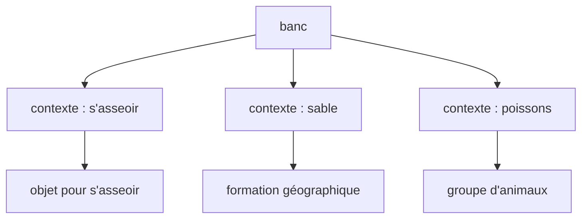

L’attention sert précisément à cela :

> Elle permet à chaque token de construire son sens en fonction des autres tokens.

---

## 4.3 L’idée intuitive de l’attention

L’attention répond à une question simple :

> Quand nous traitons un token, quels autres tokens devons-nous regarder ?

Prenons la phrase :

```txt
Le chat noir dort sur le canapé.
```

Quand le modèle traite le token `chat`, il peut être utile de regarder :

- `Le`, pour l’accord et le groupe nominal ;
    
- `noir`, pour la description ;
    
- `dort`, pour l’action ;
    
- `canapé`, pour le contexte de la scène.
    

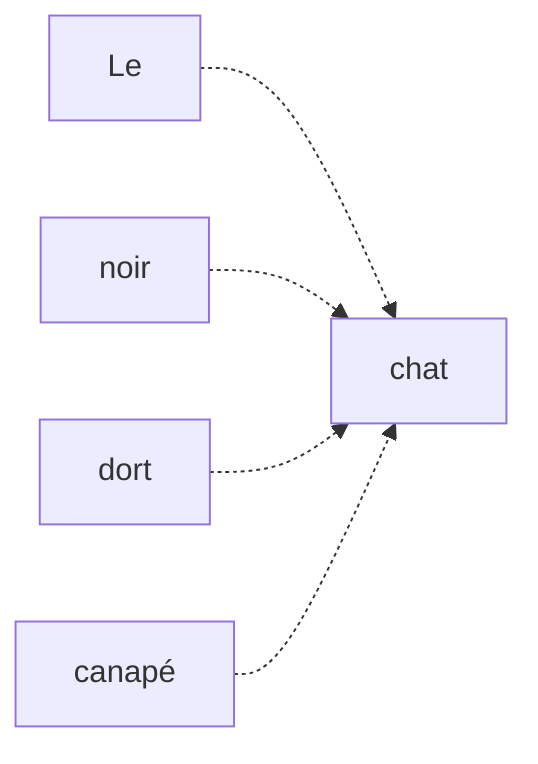

Mais tous ces mots n’ont pas la même importance.

Pour comprendre `chat`, `noir` est probablement plus directement utile que `canapé`.

L’attention consiste donc à attribuer des **poids** aux autres tokens.

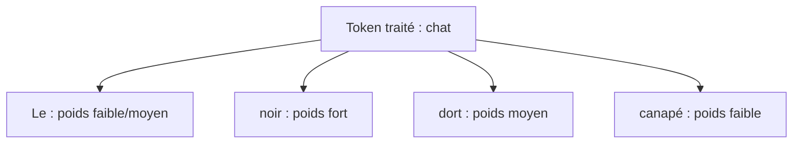

---

## 4.4 L’attention comme sélection souple

L’attention peut être vue comme une forme de recherche d’information.

Quand nous lisons une phrase, nous ne donnons pas exactement la même importance à chaque mot.

Nous focalisons notre attention sur les éléments utiles.

Mais contrairement à une sélection stricte, l’attention du Transformer est **souple**.

Le modèle ne choisit pas un seul token.

Il attribue une distribution de poids sur plusieurs tokens.

Par exemple, pour le token `dort`, dans :

```txt
Le chat noir dort sur le canapé.
```

nous pourrions avoir conceptuellement :

|Token regardé|Poids d’attention|
|---|--:|
|Le|0.05|
|chat|0.45|
|noir|0.15|
|dort|0.20|
|sur|0.05|
|le|0.03|
|canapé|0.07|

Ces poids indiquent que, pour construire la représentation de `dort`, le modèle regarde surtout `chat`.

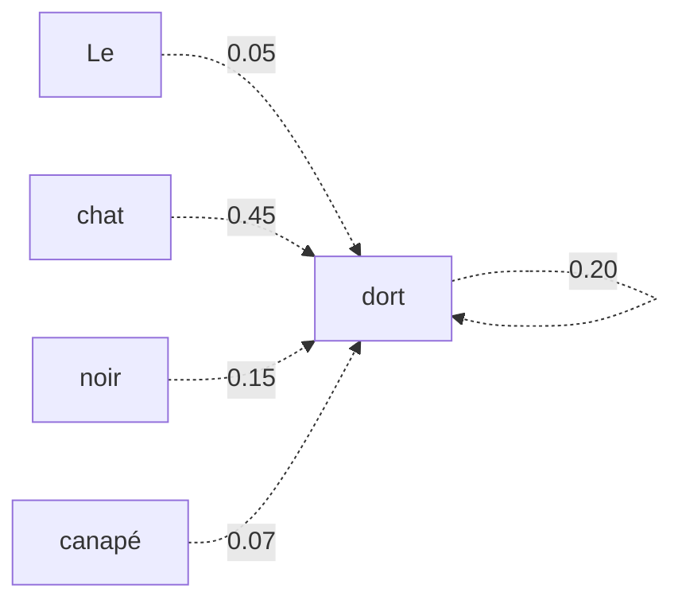

---

## 4.5 Attention et représentation contextualisée

Dans le chapitre 2, nous avons distingué :

- l’embedding initial ;
    
- la représentation contextualisée.
    

L’embedding initial du mot `avocat` est le même dans toutes les phrases.

Mais après attention, sa représentation dépend du contexte.

Exemple :

```txt
L’avocat plaide devant le tribunal.
```

```txt
L’avocat est mûr et délicieux.
```

Dans le premier cas, `avocat` doit regarder des mots comme :

```txt
plaide
tribunal
```

Dans le second cas, il doit regarder :

```txt
mûr
délicieux
```

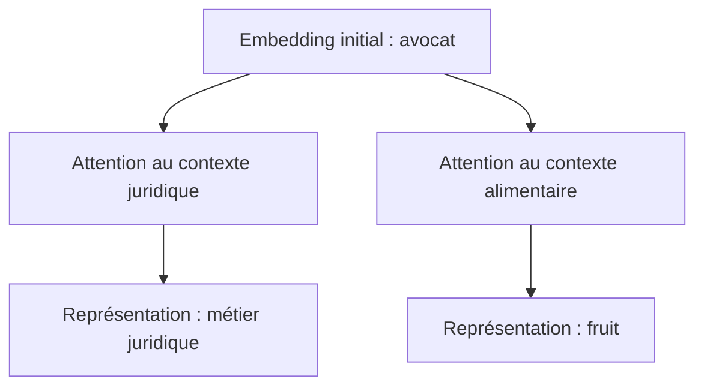

L’attention permet donc de transformer un vecteur initial relativement général en un vecteur contextualisé.

---

## 4.6 Self-attention

Dans un Transformer, nous parlons souvent de **self-attention**.

Le terme est important.

La self-attention signifie que les tokens d’une même séquence s’observent entre eux.

Autrement dit, la séquence se sert d’elle-même comme contexte.

Pour la phrase :

```txt
Le chat dort.
```

chaque token peut regarder les autres tokens de la même phrase.

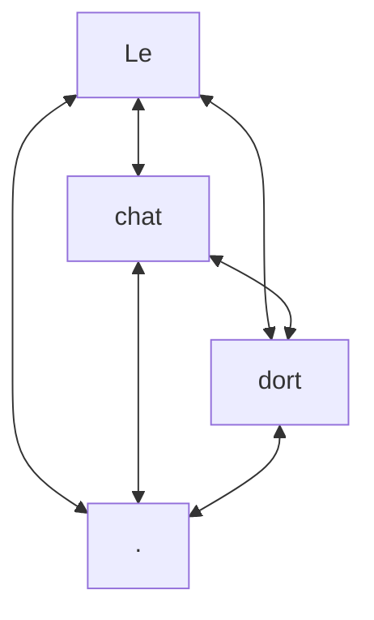

Le mot **self** indique donc :

> La séquence construit ses propres représentations internes en mettant ses éléments en relation les uns avec les autres.

---

## 4.7 Attention globale entre tous les tokens

Dans la self-attention standard, chaque token peut théoriquement regarder tous les autres tokens.

Pour une séquence de longueur $T$, nous calculons donc des relations entre chaque paire de positions.

Si (T = 5), nous avons une matrice d’attention de taille :

$$ 
5 \times 5  
$$

Si (T = 128), nous avons :

$$
128 \times 128  
$$

relations d’attention.

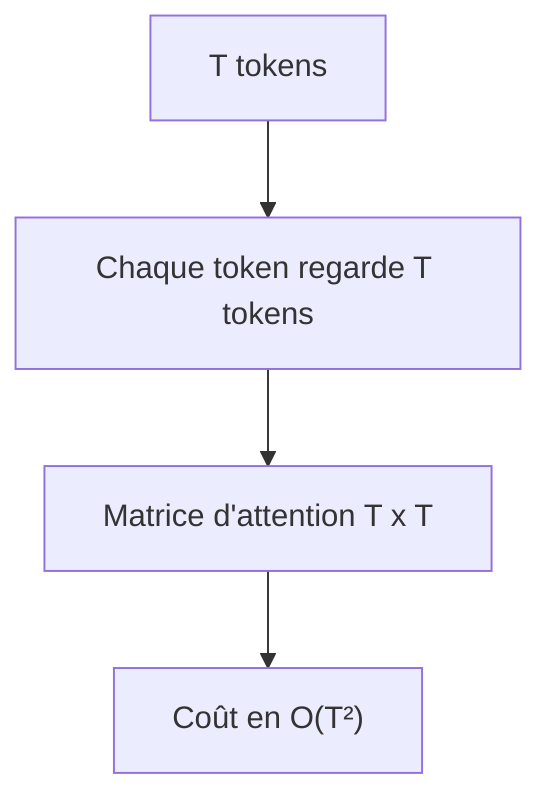

C’est très puissant, car les dépendances longues deviennent directes.

Mais cela a aussi un coût calculatoire important.

Nous reviendrons en détail sur ce coût dans le chapitre consacré à la complexité.

---

## 4.8 Exemple : dépendance longue

Prenons la phrase :

```txt
Le livre que Paul a acheté hier dans une petite librairie du centre-ville est passionnant.
```

Le token `est` doit se relier à `livre`.

Pour un RNN, l’information doit traverser de nombreuses étapes.

Pour un Transformer, `est` peut directement regarder `livre`.

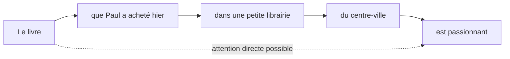

C’est l’un des avantages majeurs de l’attention.

Elle donne au modèle un chemin direct entre tokens éloignés.

---

## 4.9 Les trois rôles : Query, Key, Value

Pour calculer l’attention, le Transformer transforme chaque token en trois vecteurs différents :

- une **Query** ;
    
- une **Key** ;
    
- une **Value**.
    

Ces trois termes peuvent paraître abstraits, mais nous pouvons les comprendre avec une analogie de recherche d’information.

Imaginons une bibliothèque.

Quand nous cherchons un livre :

- notre requête correspond à une **Query** ;
    
- les étiquettes ou descriptions des livres correspondent aux **Keys** ;
    
- le contenu réel des livres correspond aux **Values**.
    

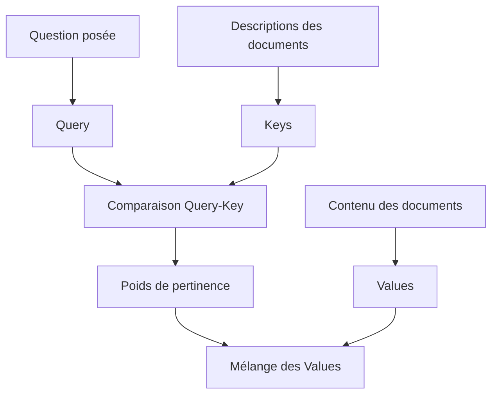

Dans un Transformer, chaque token produit sa propre Query, sa propre Key et sa propre Value.

---

## 4.10 Intuition de Query

La **Query** représente ce que le token courant cherche.

Par exemple, dans la phrase :

```txt
Le chat noir dort.
```

Quand nous traitons le token `dort`, sa Query peut chercher une information du type :

```txt
Quel est le sujet de cette action ?
```

Elle va donc être comparée aux Keys des autres tokens.

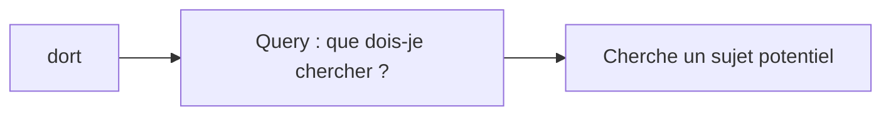

La Query est donc le vecteur qui exprime le besoin informationnel du token courant.

---

## 4.11 Intuition de Key

La **Key** représente ce qu’un token offre comme information pour être retrouvé.

Si `chat` est un nom susceptible d’être sujet du verbe `dort`, sa Key peut indiquer qu’il est pertinent pour répondre à une Query cherchant un sujet.

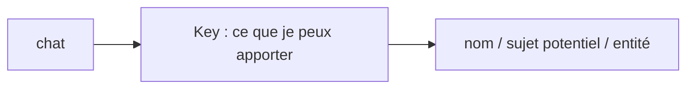

La Key est donc ce qui permet de mesurer la compatibilité entre deux tokens.

---

## 4.12 Intuition de Value

La **Value** représente l’information qui sera réellement transmise si le token est jugé pertinent.

Une fois que le modèle a décidé que `chat` est important pour `dort`, il utilise la Value de `chat` pour enrichir la représentation de `dort`.

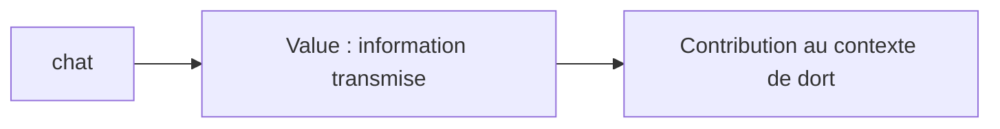

Nous pouvons résumer ainsi :

|Élément|Rôle intuitif|
|---|---|
|Query|Ce que le token cherche|
|Key|Ce que chaque token propose pour être trouvé|
|Value|L’information réellement transmise|

---

## 4.13 Calculer la compatibilité entre Query et Key

Pour savoir si un token doit prêter attention à un autre token, nous comparons sa Query avec la Key de l’autre token.

Dans le Transformer, cette comparaison se fait généralement par un **produit scalaire**.

Si la Query et la Key pointent dans une direction similaire, leur produit scalaire est grand.

Si elles sont peu compatibles, le produit scalaire est plus faible.

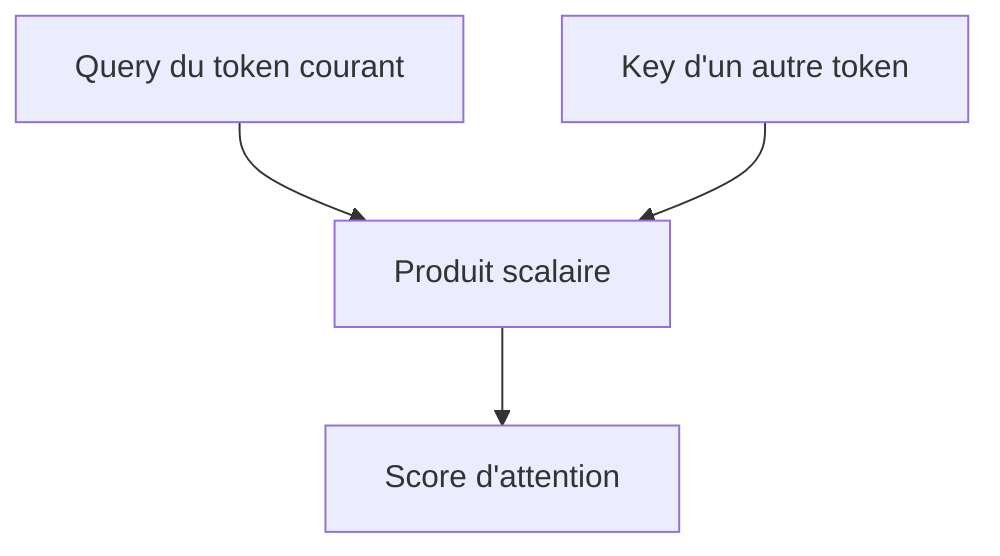

Ce score est un nombre réel.

Plus le score est élevé, plus le token correspondant est jugé pertinent.

---

## 4.14 Exemple conceptuel de scores

Supposons que nous traitions le token `dort` dans la phrase :

```txt
Le chat noir dort.
```

Le modèle compare la Query de `dort` aux Keys des autres tokens.

|Token regardé|Score brut|
|---|--:|
|Le|0.8|
|chat|3.2|
|noir|1.4|
|dort|1.0|
|.|0.1|

Le score le plus élevé correspond ici à `chat`.

Cela signifie que, pour construire la représentation de `dort`, le modèle considère `chat` comme très pertinent.

Mais ces scores bruts ne sont pas encore des poids d’attention.

Nous devons les transformer en probabilités.

---

## 4.15 Le rôle du softmax

Le softmax transforme une liste de scores en une distribution de poids positifs dont la somme vaut 1.

Par exemple, si nous avons des scores :

```txt
[0.8, 3.2, 1.4, 1.0, 0.1]
```

le softmax peut produire une distribution du type :

```txt
[0.06, 0.67, 0.12, 0.09, 0.06]
```

La somme vaut :

```txt
0.06 + 0.67 + 0.12 + 0.09 + 0.06 = 1.00
```

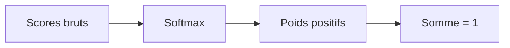

Le softmax permet donc d’interpréter les scores comme des poids d’attention.

---

## 4.16 Formule du softmax

Pour une liste de scores (s_1, s_2, ..., s_n), le softmax est défini par :

$$ 
softmax(s_i) = \frac{e^{s_i}}{\sum_{j=1}^{n} e^{s_j}}  
$$

Cette formule donne un poids positif à chaque score.

Les scores les plus élevés reçoivent des poids beaucoup plus importants.

Par exemple, si un score est nettement supérieur aux autres, son poids après softmax dominera la distribution.

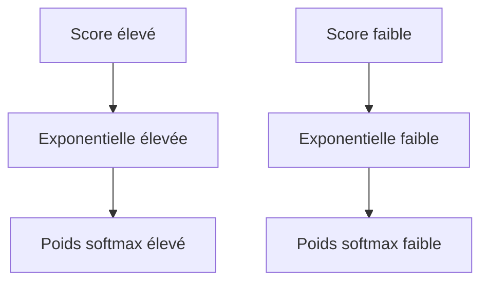

Le softmax rend donc l’attention différentiable, continue et entraînable par descente de gradient.

---

## 4.17 De la compatibilité aux poids d’attention

Le calcul se déroule en trois étapes.

Première étape : nous calculons les scores entre une Query et toutes les Keys.

Deuxième étape : nous appliquons le softmax.

Troisième étape : nous obtenons les poids d’attention.

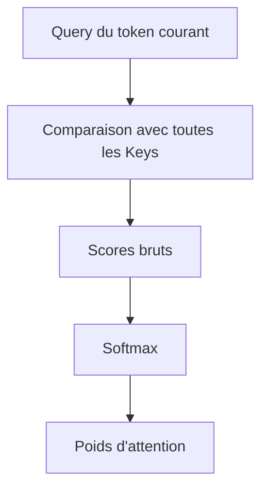

Ces poids indiquent combien chaque token doit contribuer à la nouvelle représentation du token courant.

---

## 4.18 Mélanger les Values

Une fois que nous avons les poids d’attention, nous les utilisons pour faire une somme pondérée des Values.

Si un token reçoit un poids élevé, sa Value contribue fortement.

Si un token reçoit un poids faible, sa Value contribue peu.

$$ 
contexte = \sum_{j=1}^{T} \alpha_j V_j  
$$

où :

- $\alpha_j$ est le poids d’attention attribué au token $j$ ;
    
- $V_j$ est la Value du token $j$ ;
    
- $T$ est la longueur de la séquence.
    

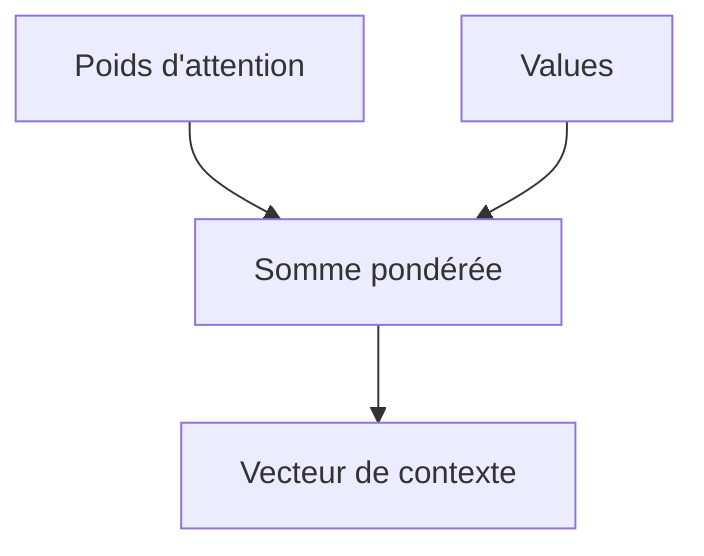

Le résultat est un nouveau vecteur : la représentation contextualisée du token courant.

---

## 4.19 Exemple simplifié de somme pondérée

Supposons que nous ayons trois tokens :

```txt
Le chat dort
```

Pour le token `dort`, le modèle calcule les poids :

|Token|Poids|
|---|--:|
|Le|0.1|
|chat|0.7|
|dort|0.2|

Supposons que les Values soient en dimension 2 :

```txt
Value(Le)   = [1.0, 0.0]
Value(chat) = [0.0, 2.0]
Value(dort) = [1.0, 1.0]
```

La somme pondérée donne :

$$ 
0.1[1.0, 0.0] + 0.7[0.0, 2.0] + 0.2[1.0, 1.0]  
$$

Calcul :

```txt
0.1[1.0, 0.0] = [0.1, 0.0]
0.7[0.0, 2.0] = [0.0, 1.4]
0.2[1.0, 1.0] = [0.2, 0.2]
```

Somme :

```txt
[0.3, 1.6]
```

Ce vecteur devient la nouvelle représentation contextualisée de `dort`.

---

## 4.20 Schéma complet pour un token

Nous pouvons maintenant résumer le mécanisme pour un seul token.

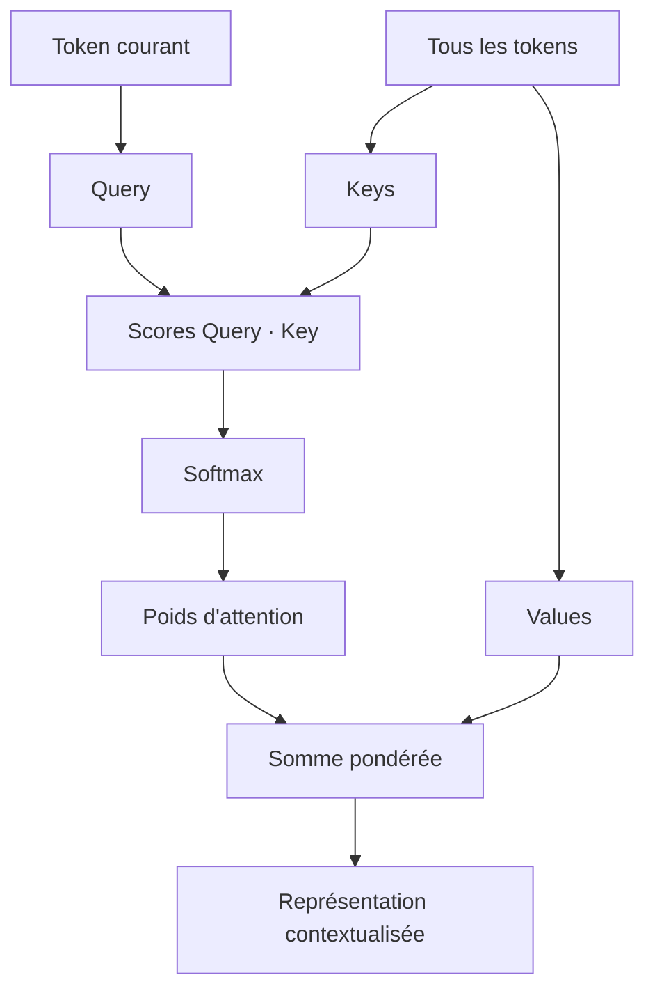

Ce schéma est au cœur du Transformer.

Chaque token répète ce processus.

---

## 4.21 Self-attention pour toute la séquence

Jusqu’ici, nous avons raisonné pour un seul token.

Mais en pratique, le Transformer calcule l’attention pour tous les tokens en parallèle.

Pour chaque token, nous avons :

- une Query ;
    
- une Key ;
    
- une Value.
    

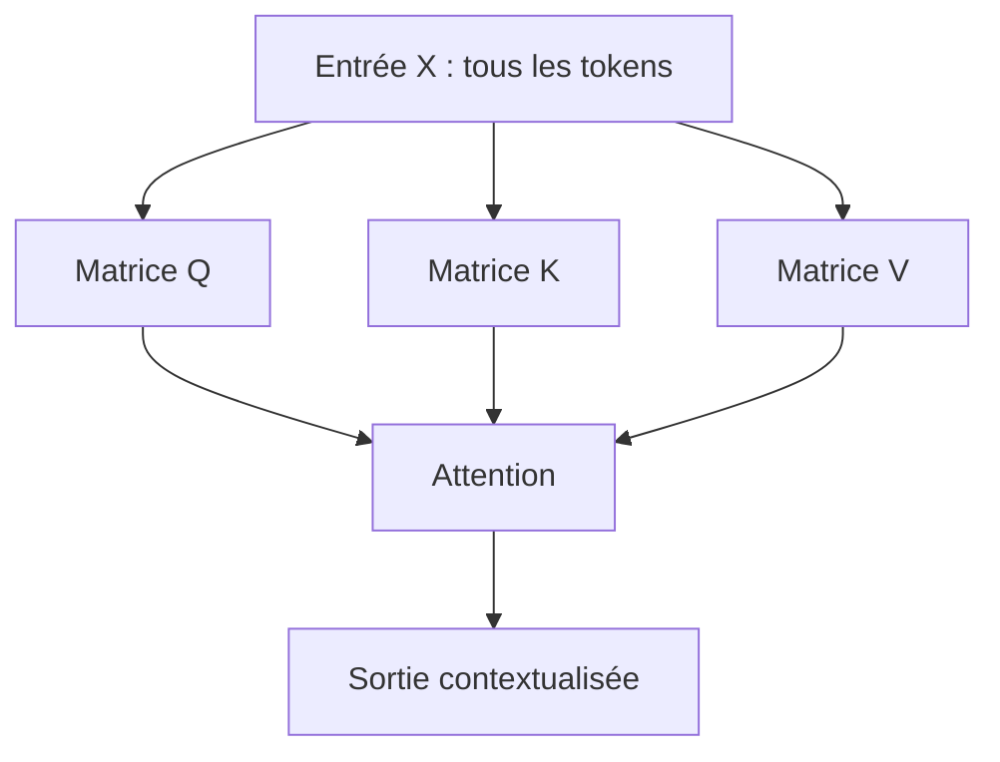

Au lieu de traiter les tokens un par un avec des boucles, nous utilisons des opérations matricielles.

C’est l’une des raisons pour lesquelles les Transformers sont efficaces sur GPU.

---

## 4.22 Les matrices Q, K et V

Soit une entrée :

$$ 
X \in \mathbb{R}^{T \times d_{model}}  
$$

pour une séquence de longueur $T$.

Nous calculons :

$$ 
Q = XW_Q  
$$

$$ 
K = XW_K  
$$

$$
V = XW_V  
$$

où :

- $W_Q$ est une matrice apprise pour produire les Queries ;
    
- $W_K$ est une matrice apprise pour produire les Keys ;
    
- $W_V$ est une matrice apprise pour produire les Values.
    

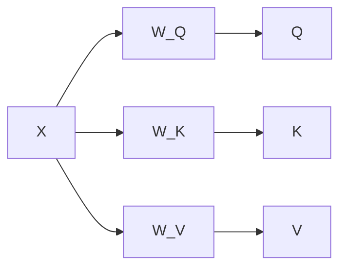

Ces matrices sont apprises pendant l’entraînement.

Le modèle apprend donc lui-même comment produire les bonnes Queries, Keys et Values.

---

## 4.23 Dimensions de Q, K et V

Dans une version simplifiée, nous pouvons dire :

$$ 
X \in \mathbb{R}^{T \times d_{model}}  
$$

$$ 
W_Q \in \mathbb{R}^{d_{model} \times d_k}  
$$

$$ 
W_K \in \mathbb{R}^{d_{model} \times d_k}  
$$

$$ 
W_V \in \mathbb{R}^{d_{model} \times d_v}  
$$

Alors :

$$ 
Q \in \mathbb{R}^{T \times d_k}  
$$

$$ 
K \in \mathbb{R}^{T \times d_k}  
$$

$$ 
V \in \mathbb{R}^{T \times d_v}  
$$

Le point important est que $Q$ et $K$ doivent avoir la même dimension $d_k$, car nous allons calculer leurs produits scalaires.

```mermaid
flowchart TD
    A["Q : T x d_k"] --> C["QK^T"]
    B["K : T x d_k"] --> C
    C --> D["Scores : T x T"]

    E["V : T x d_v"] --> F["Sortie : T x d_v"]
```

---

## 4.24 La matrice de scores $QK^T$

Le produit :

$$ 
QK^T  
$$

calcule tous les scores de compatibilité entre toutes les Queries et toutes les Keys.

Si :

$$ 
Q \in \mathbb{R}^{T \times d_k}  
$$

et :

$$ 
K^T \in \mathbb{R}^{d_k \times T}  
$$

alors :

$$ 
QK^T \in \mathbb{R}^{T \times T}  
$$

Chaque case $(i,j)$ indique le score entre :

- la Query du token $i$ ;
    
- la Key du token $j$.
    

```mermaid
flowchart TD
    A["Q : T x d_k"] --> C["QK^T"]
    B["K^T : d_k x T"] --> C
    C --> D["Scores : T x T"]
    D --> E["Score i,j = token i regarde token j"]
```

Cette matrice est la matrice d’attention brute.

---

## 4.25 Lecture d’une matrice d’attention

Imaginons une phrase :

```txt
Le chat noir dort
```

Nous avons 4 tokens.

La matrice d’attention est de taille :

$$ 
4 \times 4  
$$

Conceptuellement :

|Token qui regarde → / Token regardé ↓|Le|chat|noir|dort|
|---|--:|--:|--:|--:|
|Le|score|score|score|score|
|chat|score|score|score|score|
|noir|score|score|score|score|
|dort|score|score|score|score|

Chaque ligne correspond au token qui cherche de l’information.

Chaque colonne correspond au token regardé.

La ligne `dort` indique donc quels tokens sont utilisés pour construire la représentation de `dort`.

```mermaid
flowchart TD
    A["Ligne i"] --> B["Token i qui regarde"]
    C["Colonne j"] --> D["Token j regardé"]
    B --> E["Case i,j = importance de j pour i"]
    D --> E
```

---

## 4.26 Pourquoi diviser par $\sqrt{d_k}$ ?

Dans le Transformer, on ne calcule pas simplement :

$$ 
softmax$QK^T$V  
$$

On calcule :

$$ 
softmax\left(\frac{QK^T}{\sqrt{d_k}}\right)V  
$$

La division par $\sqrt{d_k}$ permet de stabiliser les scores.

Quand la dimension $d_k$ est grande, les produits scalaires peuvent devenir très grands en valeur absolue.

Si les scores deviennent trop grands, le softmax devient trop saturé.

Cela signifie qu’il donne presque tout le poids à un seul token, et presque zéro aux autres.

```mermaid
flowchart TD
    A["d_k grand"] --> B["Produits scalaires plus grands"]
    B --> C["Softmax saturé"]
    C --> D["Gradients moins utiles"]
    D --> E["Entraînement moins stable"]

    B --> F["Division par sqrt(d_k)"]
    F --> G["Scores stabilisés"]
```

Nous reviendrons plus formellement sur cette formule dans le chapitre 5.

---

## 4.27 Formule générale de l’attention

La formule centrale est :

$$ 
Attention(Q,K,V) = softmax\left(\frac{QK^T}{\sqrt{d_k}}\right)V  
$$

Elle contient tout le mécanisme :

1. $QK^T$ calcule les compatibilités ;
    
2. la division par $\sqrt{d_k}$ stabilise les scores ;
    
3. le softmax transforme les scores en poids ;
    
4. la multiplication par $V$ produit les représentations contextualisées.
    

```mermaid
flowchart LR
    Q["Q"] --> A["QK^T"]
    K["K"] --> A
    A --> B["/ sqrt(d_k)"]
    B --> C["Softmax"]
    C --> D["Poids d'attention"]
    D --> E["× V"]
    V --> E
    E --> F["Sortie"]
```

Cette formule sera étudiée en détail au chapitre suivant.

---

## 4.28 Le rôle de la différentiabilité

L’attention est entièrement différentiable.

Cela signifie que nous pouvons entraîner les matrices $W_Q$, $W_K$, $W_V$ par rétropropagation.

Le modèle apprend donc :

- quelles Queries produire ;
    
- quelles Keys produire ;
    
- quelles Values transmettre ;
    
- quelles relations entre tokens sont utiles.
    

```mermaid
flowchart TD
    A["Erreur de prédiction"] --> B["Rétropropagation"]
    B --> C["Mise à jour de W_Q"]
    B --> D["Mise à jour de W_K"]
    B --> E["Mise à jour de W_V"]
    C --> F["Meilleures Queries"]
    D --> G["Meilleures Keys"]
    E --> H["Meilleures Values"]
```

L’attention n’est donc pas programmée manuellement.

Elle est apprise à partir des données.

---

## 4.29 Attention et interprétabilité

Il est tentant de dire :

> Les poids d’attention expliquent ce que le modèle regarde.

C’est partiellement vrai, mais il faut être prudent.

Les matrices d’attention peuvent donner des indices intéressants.

Par exemple, une tête d’attention peut sembler relier :

- un verbe à son sujet ;
    
- un pronom à son antécédent ;
    
- une parenthèse ouvrante à une parenthèse fermante ;
    
- un token à la ponctuation.
    

Mais les poids d’attention ne sont pas toujours une explication complète du raisonnement du modèle.

```mermaid
flowchart TD
    A["Poids d'attention"] --> B["Indications utiles"]
    A --> C["Visualisations possibles"]
    A --> D["Pas une explication complète"]
```

L’attention est un mécanisme interne, mais l’interpréter naïvement peut être trompeur.

---

## 4.30 Exemple : pronom et antécédent

Prenons la phrase :

```txt
Marie a donné son livre à Julie parce qu’elle partait.
```

Le pronom `elle` est ambigu.

Il peut se référer à :

- Marie ;
    
- Julie.
    

Le modèle doit utiliser le contexte pour décider.

L’attention peut apprendre à relier `elle` à un antécédent probable.

```mermaid
flowchart LR
    A["Marie"] -. "antécédent possible" .-> E["elle"]
    B["Julie"] -. "antécédent possible" .-> E
    C["partait"] -. "indice contextuel" .-> E
```

Ce type de relation est précisément ce que l’attention aide à modéliser.

---

## 4.31 Exemple : code source

Dans du code informatique, l’attention peut relier des éléments structurels.

Exemple :

```js
function add(a, b) {
  return a + b;
}
```

Le modèle peut apprendre à relier :

- `function` au nom de fonction ;
    
- les paramètres `a`, `b` à leur usage ;
    
- l’accolade ouvrante à l’accolade fermante ;
    
- `return` à l’expression retournée.
    

```mermaid
flowchart TD
    A["function"] --> B["add"]
    C["paramètre a"] -.-> D["usage a"]
    E["paramètre b"] -.-> F["usage b"]
    G["{"] -.-> H["}"]
    I["return"] --> J["a + b"]
```

Cela explique pourquoi les Transformers sont très adaptés aux tâches de génération et compréhension de code.

---

## 4.32 Attention bidirectionnelle et attention causale

Toutes les attentions ne regardent pas les mêmes directions.

Dans un modèle encoder-only, comme BERT, chaque token peut regarder à gauche et à droite.

C’est une attention bidirectionnelle.

```mermaid
flowchart LR
    A["Token gauche"] <--> B["Token courant"]
    B <--> C["Token droite"]
```

Dans un modèle decoder-only, comme GPT, un token ne doit regarder que les tokens précédents.

C’est une attention causale.

```mermaid
flowchart LR
    A["Token 1"] --> D["Token courant"]
    B["Token 2"] --> D
    C["Token 3"] --> D
    E["Token futur"] -. "masqué" .-> D
```

La différence ne vient pas de $Q$, $K$, $V$, mais du **masque d’attention**, que nous étudierons plus tard.

---

## 4.33 Attention et parallélisation

L’un des grands avantages de l’attention est que les scores entre tokens peuvent être calculés par grandes multiplications matricielles.

Les GPU sont très efficaces pour ces opérations.

```mermaid
flowchart TD
    A["Tous les tokens"] --> B["Matrices Q, K, V"]
    B --> C["Multiplication QK^T"]
    C --> D["Softmax"]
    D --> E["Multiplication par V"]
    E --> F["Sortie contextualisée"]
```

Contrairement aux RNN, nous n’avons pas besoin d’attendre que l’état du token précédent soit calculé pour traiter le token suivant.

Cette parallélisation est une des raisons du succès des Transformers à grande échelle.

---

## 4.34 Attention et complexité quadratique

L’attention globale entre tous les tokens a cependant un coût.

Si nous avons $T$ tokens, la matrice d’attention contient :

$$ 
T \times T  
$$

scores.

Donc le coût augmente approximativement comme :

$$ 
O(T^2)  
$$

Exemples :

|Longueur $T$|Nombre de scores (T^2)|
|--:|--:|
|128|16 384|
|1 024|1 048 576|
|8 192|67 108 864|
|32 768|1 073 741 824|

```mermaid
flowchart TD
    A["Longueur T"] --> B["Matrice T x T"]
    B --> C["Mémoire O(T²)"]
    B --> D["Calcul O(T²)"]
    C --> E["Problème des longs contextes"]
    D --> E
```

C’est pourquoi les longs contextes sont coûteux pour les Transformers classiques.

---

## 4.35 Attention comme routage d’information

Nous pouvons aussi comprendre l’attention comme un mécanisme de routage.

Chaque token décide quelles informations doivent être acheminées vers lui.

Par exemple :

```txt
Le chat noir dort sur le canapé.
```

Le token `dort` peut recevoir de l’information de `chat`.

Le token `noir` peut recevoir de l’information de `chat`.

Le token `canapé` peut recevoir de l’information de `sur`.

```mermaid
flowchart TD
    A["chat"] --> D["dort"]
    A --> C["noir"]
    E["sur"] --> F["canapé"]
    B["Le"] --> A
```

L’attention permet donc de construire progressivement une représentation riche de la séquence.

---

## 4.36 Plusieurs types de relations

Une seule couche d’attention peut apprendre différents types de relations.

Par exemple :

- relation sujet-verbe ;
    
- relation déterminant-nom ;
    
- relation adjectif-nom ;
    
- relation pronom-antécédent ;
    
- relation parenthèse ouvrante/fermante ;
    
- relation fonction/appel de fonction ;
    
- relation question/réponse.
    

```mermaid
flowchart TD
    A["Attention"] --> B["Relations syntaxiques"]
    A --> C["Relations sémantiques"]
    A --> D["Relations de référence"]
    A --> E["Relations structurelles"]
```

Cependant, dans la pratique, une seule attention n’est pas toujours suffisante.

C’est pourquoi les Transformers utilisent la **multi-head attention**, que nous étudierons au chapitre 6.

---

## 4.37 Pourquoi plusieurs couches ?

Une couche d’attention construit une première représentation contextualisée.

Mais les modèles profonds empilent plusieurs couches.

Chaque couche peut raffiner les représentations.

```mermaid
flowchart TD
    A["Embeddings initiaux"] --> B["Attention couche 1"]
    B --> C["Relations simples"]
    C --> D["Attention couche 2"]
    D --> E["Relations plus abstraites"]
    E --> F["Attention couche 3"]
    F --> G["Représentations complexes"]
```

Dans les premières couches, le modèle peut apprendre des relations locales ou lexicales.

Dans les couches plus profondes, il peut apprendre des relations plus abstraites.

Cette idée est à prendre avec prudence, mais elle donne une bonne intuition pédagogique.

---

## 4.38 Attention et contexte dynamique

Une idée essentielle est que le contexte n’est pas fixe.

Pour chaque token, le modèle construit un contexte différent.

Dans la phrase :

```txt
Le chat noir dort sur le canapé.
```

Le contexte utile pour `chat` n’est pas exactement le même que pour `canapé`.

```mermaid
flowchart TD
    A["Token : chat"] --> B["Contexte : Le, noir, dort"]
    C["Token : canapé"] --> D["Contexte : sur, le, dort"]
    E["Token : dort"] --> F["Contexte : chat, canapé"]
```

L’attention produit donc un contexte **spécifique à chaque position**.

C’est très différent d’une représentation globale unique de la phrase.

---

## 4.39 Attention et traduction automatique

Historiquement, l’attention a été très importante en traduction automatique.

Prenons :

```txt
The black cat sleeps.
```

et sa traduction :

```txt
Le chat noir dort.
```

Quand le modèle génère `chat`, il doit regarder `cat`.

Quand il génère `noir`, il doit regarder `black`.

Quand il génère `dort`, il doit regarder `sleeps`.

```mermaid
flowchart LR
    A["The"] -.-> E["Le"]
    B["black"] -.-> G["noir"]
    C["cat"] -.-> F["chat"]
    D["sleeps"] -.-> H["dort"]
```

L’attention permet donc de construire des alignements souples entre les tokens source et cible.

Dans le Transformer original, cette idée sera généralisée et intégrée partout.

---

## 4.40 Self-attention vs cross-attention

Nous devons distinguer deux formes d’attention.

### Self-attention

Les tokens d’une même séquence se regardent entre eux.

```mermaid
flowchart LR
    A["Séquence X"] --> B["Q, K, V issus de X"]
    B --> C["Self-attention"]
```

### Cross-attention

Une séquence regarde une autre séquence.

Dans un modèle encoder-decoder, le decoder produit les Queries, tandis que l’encoder fournit les Keys et les Values.

```mermaid
flowchart LR
    A["Decoder states"] --> Q["Queries"]
    B["Encoder states"] --> K["Keys"]
    B --> V["Values"]
    Q --> C["Cross-attention"]
    K --> C
    V --> C
```

La cross-attention est essentielle pour la traduction, le résumé et les modèles multimodaux.

---

## 4.41 Attention dans le Transformer original

Dans le Transformer original, nous trouvons plusieurs usages de l’attention :

- self-attention dans l’encoder ;
    
- masked self-attention dans le decoder ;
    
- encoder-decoder attention dans le decoder.
    

```mermaid
flowchart TD
    A["Encoder"] --> B["Self-attention bidirectionnelle"]
    C["Decoder"] --> D["Masked self-attention"]
    C --> E["Encoder-decoder attention"]
    A --> E
```

Nous détaillerons cette architecture dans les chapitres suivants.

Pour l’instant, nous devons bien maîtriser le mécanisme de base.

---

## 4.42 Résumé intuitif de Query, Key, Value

Nous pouvons retenir cette analogie :

```txt
Query = ce que je cherche
Key   = ce que les autres annoncent comme contenu
Value = ce que les autres transmettent réellement
```

Pour chaque token :

1. nous produisons une Query ;
    
2. nous comparons cette Query aux Keys de tous les tokens ;
    
3. nous obtenons des scores ;
    
4. nous transformons ces scores en poids ;
    
5. nous mélangeons les Values selon ces poids ;
    
6. nous obtenons une nouvelle représentation contextualisée.
    

```mermaid
flowchart TD
    A["Je cherche"] --> B["Query"]
    C["Les autres décrivent ce qu'ils peuvent fournir"] --> D["Keys"]
    B --> E["Compatibilité"]
    D --> E
    E --> F["Poids"]
    G["Informations transmises"] --> H["Values"]
    F --> I["Mélange"]
    H --> I
    I --> J["Contexte"]
```

---

## 4.43 Mini-exemple complet

Prenons une phrase courte :

```txt
Le chat dort
```

Nous voulons construire la représentation contextualisée de `dort`.

### Étape 1 : produire Query, Keys, Values

Le token `dort` produit une Query.

Tous les tokens produisent des Keys et Values.

```mermaid
flowchart TD
    A["dort"] --> Q["Query de dort"]

    B["Le"] --> K1["Key Le"]
    C["chat"] --> K2["Key chat"]
    D["dort"] --> K3["Key dort"]

    B --> V1["Value Le"]
    C --> V2["Value chat"]
    D --> V3["Value dort"]
```

### Étape 2 : comparer Query et Keys

```txt
score(dort, Le)
score(dort, chat)
score(dort, dort)
```

### Étape 3 : appliquer softmax

```txt
scores → poids d’attention
```

### Étape 4 : mélanger les Values

```txt
nouveau vecteur de dort =
poids_Le × Value(Le)
+ poids_chat × Value(chat)
+ poids_dort × Value(dort)
```

Le résultat est une représentation de `dort` qui contient du contexte.

---

## 4.44 Attention et apprentissage statistique

Il est important de comprendre que le modèle ne reçoit pas explicitement des règles comme :

```txt
Un verbe doit regarder son sujet.
```

Il apprend ces régularités à partir des données.

Pendant l’entraînement, si regarder le sujet aide à mieux prédire, traduire ou compléter une phrase, alors les paramètres $W_Q$, $W_K$, $W_V$ seront ajustés pour rendre cette relation plus facile à utiliser.

```mermaid
flowchart TD
    A["Données d'entraînement"] --> B["Prédictions"]
    B --> C["Erreur"]
    C --> D["Rétropropagation"]
    D --> E["Paramètres d'attention ajustés"]
    E --> F["Relations utiles mieux capturées"]
```

L’attention est donc un mécanisme appris, pas un ensemble de règles linguistiques codées à la main.

---

## 4.45 Ce que l’attention ne fait pas seule

L’attention est puissante, mais elle ne constitue pas tout le Transformer.

Elle permet surtout de mélanger les informations entre tokens.

Mais un bloc Transformer contient aussi :

- des projections linéaires ;
    
- des connexions résiduelles ;
    
- de la normalisation ;
    
- un réseau feed-forward ;
    
- parfois du dropout ;
    
- des masques ;
    
- plusieurs têtes d’attention.
    

```mermaid
flowchart TD
    A["Attention"] --> B["Mélange d'informations entre tokens"]
    C["Feed-forward"] --> D["Transformation non linéaire par token"]
    E["Résidus"] --> F["Stabilité du gradient"]
    G["Normalisation"] --> H["Stabilité de l'entraînement"]
```

Il ne faut donc pas réduire tout le Transformer à l’attention, même si l’attention est son mécanisme central.

---

## 4.46 Erreur fréquente : croire que l’attention est une mémoire parfaite

L’attention permet à un token de regarder d’autres tokens, mais cela ne veut pas dire que le modèle comprend tout parfaitement.

Plusieurs limites existent :

- les scores peuvent être mal répartis ;
    
- les longues séquences restent coûteuses ;
    
- certaines relations peuvent être ignorées ;
    
- l’attention dépend des données d’entraînement ;
    
- les représentations internes restent difficiles à interpréter.
    

```mermaid
flowchart TD
    A["Attention"] --> B["Accès direct aux tokens"]
    A --> C["Mais pas compréhension parfaite"]
    C --> D["Limites d'entraînement"]
    C --> E["Limites de contexte"]
    C --> F["Limites d'interprétation"]
```

L’attention est un outil puissant, pas une garantie de raisonnement fiable.

---

## 4.47 Erreur fréquente : confondre poids d’attention et importance réelle

Un poids d’attention élevé peut indiquer qu’un token contribue fortement à une représentation.

Mais cela ne signifie pas toujours que ce token est la cause principale de la décision finale.

Les représentations passent ensuite par :

- d’autres couches ;
    
- d’autres têtes ;
    
- des feed-forward networks ;
    
- des normalisations ;
    
- une tête de sortie.
    

```mermaid
flowchart TD
    A["Poids d'attention"] --> B["Contribution locale"]
    B --> C["Couches suivantes"]
    C --> D["Décision finale"]
    E["Interprétation prudente"] --> A
```

Nous devons donc être prudents quand nous visualisons des cartes d’attention.

---

## 4.48 Schéma global du chapitre

```mermaid
flowchart TD
    A["Entrée X"] --> B["Projections linéaires"]
    B --> Q["Queries Q"]
    B --> K["Keys K"]
    B --> V["Values V"]

    Q --> S["Scores QK^T"]
    K --> S
    S --> N["Division par sqrt(d_k)"]
    N --> SM["Softmax"]
    SM --> W["Poids d'attention"]
    W --> O["Somme pondérée des Values"]
    V --> O
    O --> Y["Sortie contextualisée"]
```

Ce schéma est la base de presque tous les Transformers.

---

## 4.49 Résumé du chapitre

Nous avons introduit le mécanisme d’attention, qui permet à chaque token de construire une représentation contextualisée en regardant les autres tokens de la séquence.

Nous avons vu que l’attention repose sur trois rôles :

- **Query** : ce que le token cherche ;
    
- **Key** : ce que chaque token propose pour être retrouvé ;
    
- **Value** : l’information transmise.
    

Nous avons compris que les Queries sont comparées aux Keys pour produire des scores d’attention.

Ces scores sont transformés par softmax en poids positifs dont la somme vaut 1.

Ces poids servent ensuite à calculer une somme pondérée des Values.

Le résultat est une nouvelle représentation de chaque token, enrichie par le contexte.

La formule générale est :

$$ 
Attention(Q,K,V) = softmax\left(\frac{QK^T}{\sqrt{d_k}}\right)V  
$$

Nous avons aussi introduit plusieurs distinctions importantes :

- self-attention ;
    
- cross-attention ;
    
- attention bidirectionnelle ;
    
- attention causale ;
    
- matrice d’attention ;
    
- poids d’attention ;
    
- représentation contextualisée.
    

Le point central du chapitre est le suivant :

> L’attention est un mécanisme différentiable qui permet à chaque token de sélectionner et combiner les informations pertinentes provenant des autres tokens.

---

## 4.50 Questions de compréhension

### 4.50.1 Question 1

Pourquoi un token ne peut-il pas toujours être interprété seul ?

Réponse attendue : parce que son sens dépend souvent du contexte dans lequel il apparaît.

### 4.50.2 Question 2

Que signifie self-attention ?

Réponse attendue : cela signifie que les tokens d’une même séquence se regardent entre eux pour construire leurs représentations contextualisées.

### 4.50.3 Question 3

Quel est le rôle d’une Query ?

Réponse attendue : la Query représente ce que le token courant cherche comme information.

### 4.50.4 Question 4

Quel est le rôle d’une Key ?

Réponse attendue : la Key représente ce qu’un token propose comme information pour être comparé à une Query.

### 4.50.5 Question 5

Quel est le rôle d’une Value ?

Réponse attendue : la Value contient l’information effectivement transmise lorsque le token reçoit un poids d’attention.

### 4.50.6 Question 6

Pourquoi utilise-t-on un produit scalaire entre Query et Key ?

Réponse attendue : pour mesurer leur compatibilité ou leur similarité.

### 4.50.7 Question 7

À quoi sert le softmax ?

Réponse attendue : il transforme les scores bruts en poids positifs dont la somme vaut 1.

### 4.50.8 Question 8

Que représente une matrice d’attention de taille $T \times T$ ?

Réponse attendue : elle représente les scores ou poids d’attention entre chaque paire de tokens d’une séquence de longueur $T$.

### 4.50.9 Question 9

Pourquoi divise-t-on les scores par $\sqrt{d_k}$ ?

Réponse attendue : pour éviter que les produits scalaires deviennent trop grands lorsque la dimension augmente, ce qui stabilise le softmax et l’entraînement.

### 4.50.10 Question 10

Quelle est la différence entre self-attention et cross-attention ?

Réponse attendue : en self-attention, une séquence se regarde elle-même ; en cross-attention, une séquence utilise les Queries d’une source et les Keys/Values d’une autre source.

---

## 4.51 Transition vers le chapitre 5

Nous avons maintenant compris l’intuition générale de l’attention.

Nous savons que le mécanisme repose sur :

$$ 
Q,\ K,\ V  
$$

et sur la formule :

$$ 
Attention(Q,K,V) = softmax\left(\frac{QK^T}{\sqrt{d_k}}\right)V  
$$

Dans le chapitre suivant, nous allons formaliser complètement cette opération.

Nous détaillerons :

- les dimensions exactes des matrices ;
    
- le calcul de $QK^T$ ;
    
- la division par $\sqrt{d_k}$ ;
    
- l’application du softmax ligne par ligne ;
    
- la multiplication par $V$ ;
    
- un exemple numérique complet ;
    
- le lien avec l’implémentation en code.
    

Le chapitre 5 sera donc consacré à la **Scaled Dot-Product Attention**, c’est-à-dire la forme précise d’attention utilisée dans le Transformer original.

---
> [!info] Livre « Les transformers » — chapitre 4/30
> [[Les transformers — Sommaire|Sommaire]] · [[Les transformers — 03 — Le problème de l’ordre dans les séquences|← 03 — Le problème de l’ordre dans les séquences]] · [[Les transformers — 05 — Scaled Dot-Product Attention|05 — Scaled Dot-Product Attention →]]
