> [!info] Livre « Les transformers » — chapitre 5/30
> [[Les transformers — Sommaire|Sommaire]] · [[Les transformers — 04 — Le mécanisme d’attention intuition et formulation|← 04 — Le mécanisme d’attention intuition et formulation]] · [[Les transformers — 06 — Multi-Head Attention|06 — Multi-Head Attention →]]

# Chapitre 5 — Scaled Dot-Product Attention
## 5.1 Objectif du chapitre

Dans le chapitre précédent, nous avons introduit le mécanisme général d’attention.

Nous avons vu que chaque token produit trois vecteurs :

- une **Query** ;
    
- une **Key** ;
    
- une **Value**.
    

Nous avons aussi introduit la formule centrale :

$$ 
Attention(Q,K,V) = softmax\left(\frac{QK^T}{\sqrt{d_k}}\right)V  
$$

Dans ce chapitre, nous allons entrer dans le détail mathématique de cette formule. C’est une étape essentielle du cours, car la **Scaled Dot-Product Attention** est le mécanisme d’attention utilisé dans le Transformer original, tel que prévu dans notre plan de cours.

Nous allons comprendre :

- pourquoi nous utilisons un produit scalaire ;
    
- pourquoi nous calculons $QK^T$ ;
    
- pourquoi nous divisons par $\sqrt{d_k}$ ;
    
- comment le softmax transforme les scores en poids ;
    
- comment la multiplication par $V$ produit une représentation contextualisée ;
    
- quelles sont les dimensions exactes des matrices ;
    
- comment faire un exemple numérique simplifié.
    

Le but est qu’à la fin du chapitre, nous soyons capables de lire cette formule sans la voir comme une boîte noire.

---

## 5.2 Rappel : de l’attention intuitive à l’attention formelle

Dans le chapitre 4, nous avons compris l’attention avec une intuition simple :

> Pour construire la représentation d’un token, nous regardons les autres tokens avec des poids différents.

Par exemple, dans la phrase :

```txt
Le chat noir dort.
```

pour construire la représentation du token `dort`, le modèle peut accorder un poids important à `chat`.

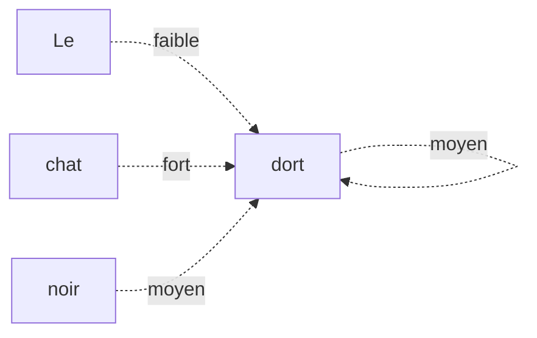

Mais cette intuition doit maintenant être traduite en calculs matriciels.

La question devient donc :

> Comment calculer automatiquement ces poids d’attention à partir des vecteurs des tokens ?

La réponse est la Scaled Dot-Product Attention.

---

## 5.3 Vue d’ensemble de la formule

La formule complète est :

$$ 
Attention(Q,K,V) = softmax\left(\frac{QK^T}{\sqrt{d_k}}\right)V  
$$

Nous pouvons la lire en quatre étapes.

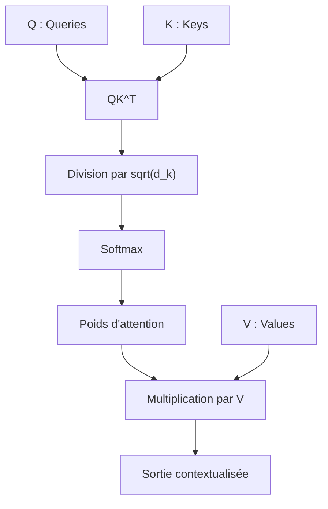

Étape par étape :

1. $QK^T$ calcule les scores de compatibilité entre tokens.
    
2. $\frac{QK^T}{\sqrt{d_k}}$ stabilise l’échelle des scores.
    
3. (softmax(...)) transforme les scores en poids d’attention.
    
4. La multiplication par $V$ mélange les informations des tokens selon ces poids.
    

---

## 5.4 Les entrées du mécanisme : $Q$, $K$, $V$

Nous partons d’une séquence représentée par une matrice :

$$
X \in \mathbb{R}^{T \times d_{model}}  
$$

où :

- $T$ est le nombre de tokens ;
    
- $d_{model}$ est la dimension du modèle.
    

Pour obtenir $Q$, $K$ et $V$, nous appliquons trois projections linéaires apprises :

$$
Q = XW_Q  
$$

$$ 
K = XW_K  
$$

$$
V = XW_V  
$$

avec :

$$
W_Q \in \mathbb{R}^{d_{model} \times d_k}  
$$

$$
W_K \in \mathbb{R}^{d_{model} \times d_k}  
$$

$$
W_V \in \mathbb{R}^{d_{model} \times d_v}  
$$

Donc :

$$
Q \in \mathbb{R}^{T \times d_k}  
$$

$$
K \in \mathbb{R}^{T \times d_k}  
$$

$$
V \in \mathbb{R}^{T \times d_v}  
$$

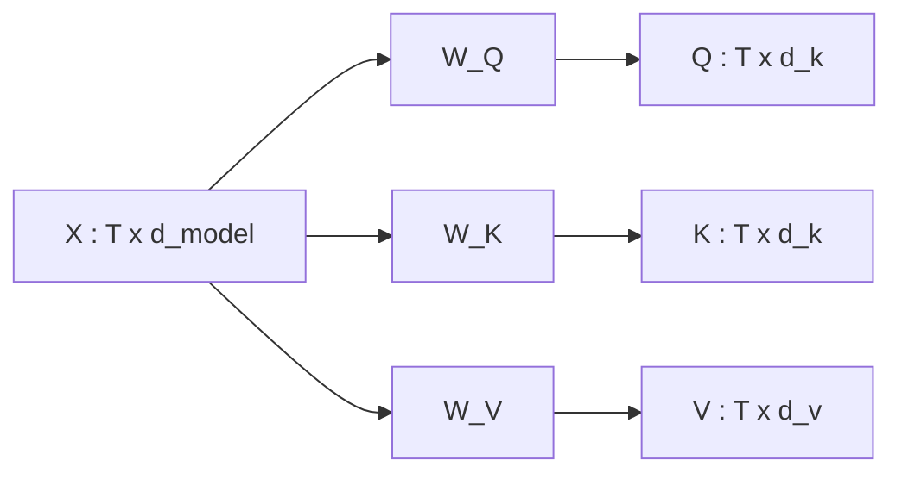

Les matrices $W_Q$, $W_K$ et $W_V$ sont apprises pendant l’entraînement.

---

## 5.5 Pourquoi trois projections différentes ?

Une question naturelle est :

> Pourquoi ne pas utiliser directement $X$ pour tout ?

Nous pourrions imaginer comparer les tokens directement entre eux avec leurs embeddings.

Mais le Transformer apprend trois rôles différents :

| Matrice | Rôle                                                     |
| ------- | -------------------------------------------------------- |
| $Q$     | Ce que chaque token cherche                              |
| $K$     | Ce que chaque token annonce comme information disponible |
| $V$     | Ce que chaque token transmet effectivement               |

Ces rôles ne doivent pas forcément être représentés dans le même espace.

Par exemple, un token peut être très utile comme information transmise, mais ne pas être recherché de la même manière selon le contexte.

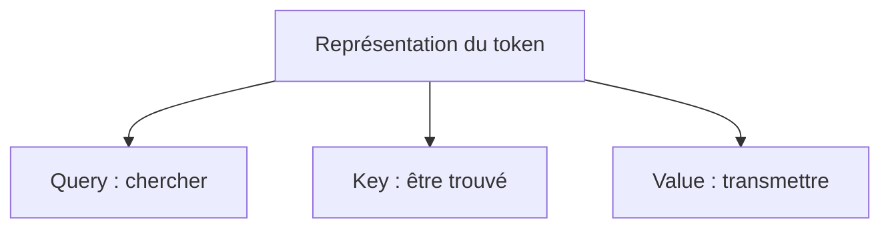

Les projections $W_Q$, $W_K$, $W_V$ donnent donc au modèle la liberté d’apprendre des espaces spécialisés.

---

## 5.6 Le produit scalaire : mesurer une compatibilité

Le produit scalaire entre deux vecteurs mesure leur compatibilité.

Si nous avons :

$$
q_i \in \mathbb{R}^{d_k}  
$$

et :

$$
k_j \in \mathbb{R}^{d_k}  
$$

alors leur produit scalaire est :

$$
q_i \cdot k_j = \sum_{\ell=1}^{d_k} q_{i,\ell}k_{j,\ell}  
$$

Ce nombre indique à quel point la Query du token $i$ est compatible avec la Key du token $j$.

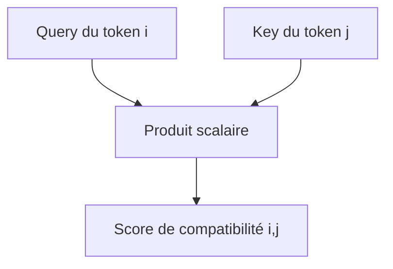

Si le score est élevé, le token $i$ doit probablement prêter attention au token $j$.

---

## 5.7 Exemple intuitif de compatibilité

Supposons que nous traitions la phrase :

```txt
Le chat dort.
```

Pour le token `dort`, la Query peut chercher :

```txt
Quel est le sujet de l’action ?
```

La Key du token `chat` peut correspondre à :

```txt
Je suis un nom, sujet potentiel.
```

La compatibilité est donc forte.

La Key du token `.` est moins pertinente.

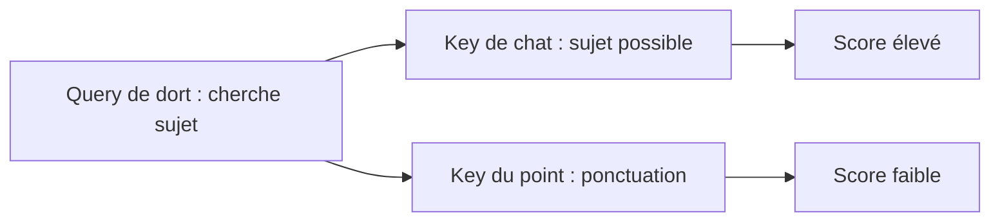

Le produit scalaire est la manière numérique de calculer cette compatibilité.

---

## 5.8 Calculer tous les scores avec $QK^T$

Pour une séquence de $T$ tokens, nous devons comparer chaque Query avec chaque Key.

Nous pourrions faire cela paire par paire, mais ce serait inefficace.

À la place, nous utilisons une multiplication matricielle :

$$
QK^T  
$$

Si :

$$
Q \in \mathbb{R}^{T \times d_k}  
$$

et :

$$
K^T \in \mathbb{R}^{d_k \times T}  
$$

alors :

$$
QK^T \in \mathbb{R}^{T \times T}  
$$

Chaque élément de cette matrice est :

$$
$QK^T$_{ij} = q_i \cdot k_j  
$$

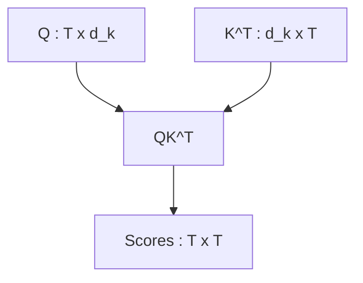

La case $(i,j)$ signifie :

> À quel point le token *$i$* doit-il regarder le token $j$ ?

---

## 5.9 Interpréter la matrice $QK^T$

Prenons une séquence de 4 tokens :

```txt
Le chat noir dort
```

La matrice $QK^T$ contient les scores suivants :

|Token qui regarde / Token regardé|Le|chat|noir|dort|
|---|--:|--:|--:|--:|
|Le|score|score|score|score|
|chat|score|score|score|score|
|noir|score|score|score|score|
|dort|score|score|score|score|

Chaque ligne correspond à un token qui cherche de l’information.

Chaque colonne correspond à un token qui peut être regardé.

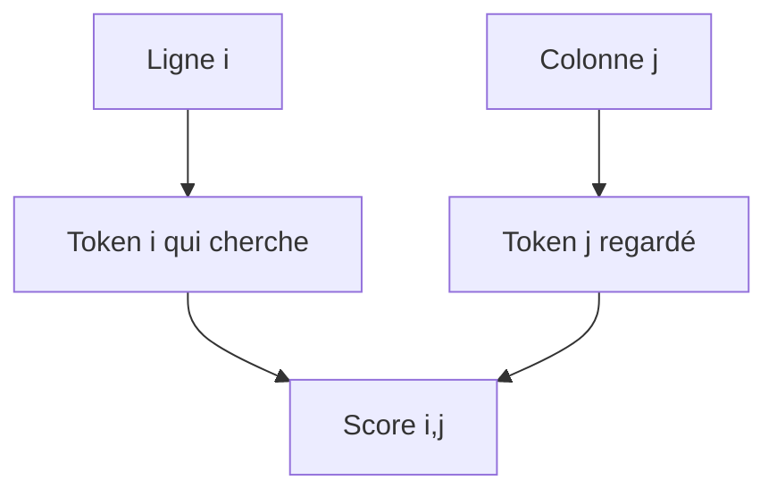

La ligne correspondant à `dort` nous dit quels tokens sont importants pour construire la représentation de `dort`.

---

## 5.10 Pourquoi parle-t-on de Dot-Product Attention ?

On parle de **Dot-Product Attention** parce que les scores d’attention sont calculés avec des produits scalaires.

En anglais :

```txt
dot product = produit scalaire
```

La partie :

$$
QK^T  
$$

est donc la partie **dot-product** de la formule.

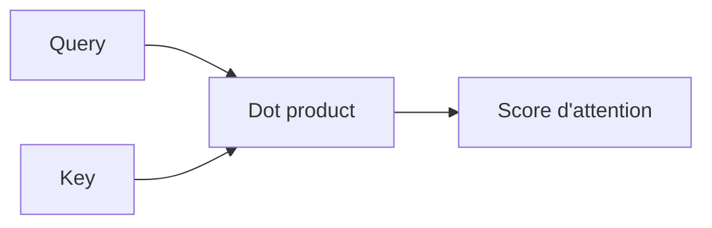

Cette méthode est simple, rapide et très efficace sur GPU, car elle se ramène à des multiplications matricielles.

---

## 5.11 Pourquoi parle-t-on de Scaled Attention ?

On parle de **Scaled Dot-Product Attention** parce que les scores sont divisés par :

$$
\sqrt{d_k}  
$$

Le terme **scaled** signifie donc que nous redimensionnons l’échelle des scores avant le softmax.

La formule sans scaling serait :

$$
softmax$QK^T$V  
$$

La formule réelle est :

$$
softmax\left(\frac{QK^T}{\sqrt{d_k}}\right)V  
$$

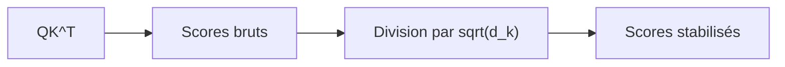

Nous allons maintenant comprendre pourquoi cette division est nécessaire.

---

## 5.12 Le problème des grands produits scalaires

Quand la dimension $d_k$ augmente, les produits scalaires ont tendance à devenir plus grands en valeur absolue.

Pourquoi ?

Parce qu’un produit scalaire additionne $d_k$ termes :

$$
q_i \cdot k_j = \sum_{\ell=1}^{d_k} q_{i,\ell}k_{j,\ell}  
$$

Plus $d_k$ est grand, plus nous additionnons de termes.

Même si chaque terme est modéré, la somme peut devenir grande.

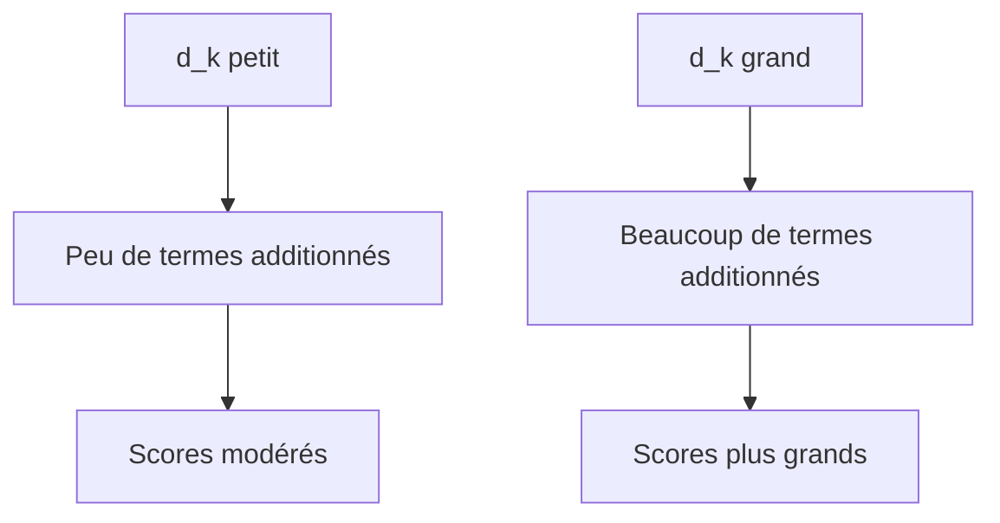

Des scores trop grands posent un problème au softmax.

---

## 5.13 Softmax saturé

Le softmax transforme les scores en poids.

Si les scores sont modérés, il produit une distribution relativement exploitable.

Exemple :

```txt
scores = [1, 2, 3]
softmax ≈ [0.09, 0.24, 0.67]
```

Mais si les scores sont très grands :

```txt
scores = [10, 20, 30]
softmax ≈ [0.00, 0.00, 1.00]
```

Le softmax devient saturé : presque tout le poids va au plus grand score.

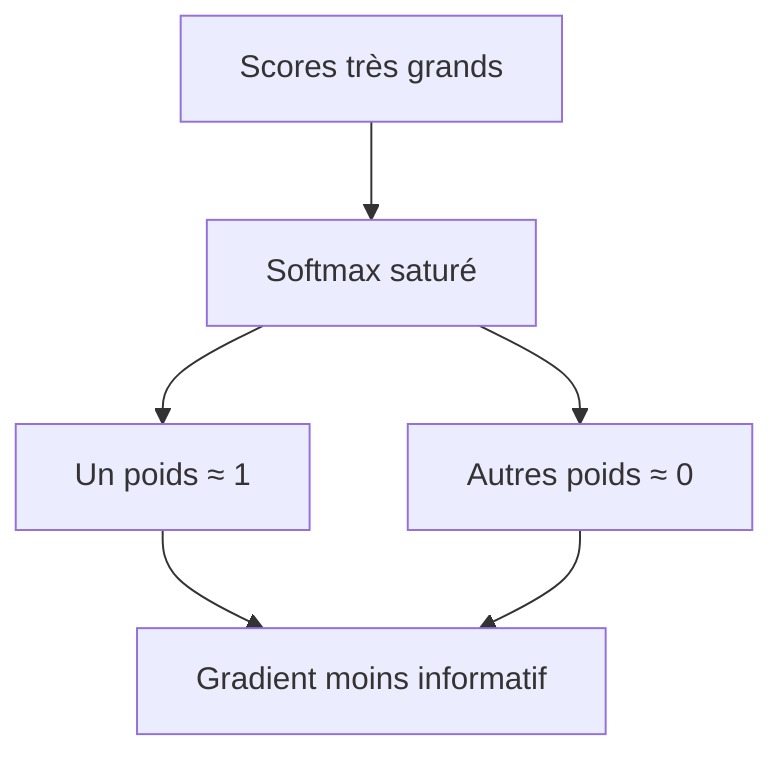

Cela peut rendre l’apprentissage moins stable.

---

## 5.14 Pourquoi diviser par $\sqrt{d_k}$ ?

La division par $\sqrt{d_k}$ sert à garder les scores dans une échelle raisonnable.

Intuitivement :

- le produit scalaire additionne $d_k$ contributions ;
    
- sa variance augmente avec $d_k$ ;
    
- diviser par $\sqrt{d_k}$ compense cette augmentation.
    

Ainsi, les scores envoyés au softmax restent plus stables.

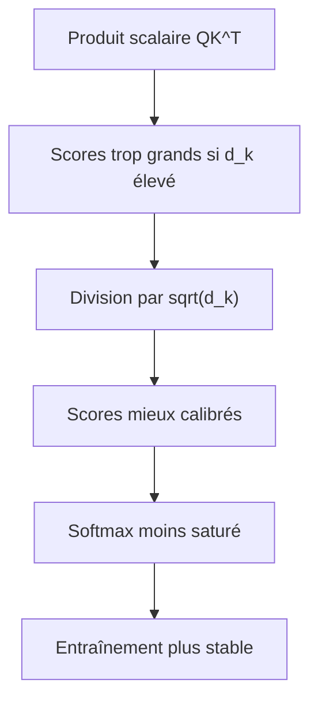

Ce facteur de normalisation est une petite modification, mais elle est très importante dans la pratique.

---

## 5.15 Une intuition statistique simple

Supposons que les composantes de $q$ et $k$ soient des variables de moyenne 0 et de variance 1.

Le produit scalaire est :

$$ 
q \cdot k = \sum_{\ell=1}^{d_k} q_\ell k_\ell  
$$

Chaque terme $q_\ell k_\ell$ a une variance approximativement constante.

Quand nous additionnons $d_k$ termes, la variance totale augmente proportionnellement à $d_k$.

L’écart-type augmente donc comme :

$$ 
\sqrt{d_k}  
$$

Diviser par $\sqrt{d_k}$ permet de ramener l’écart-type à une échelle plus stable.

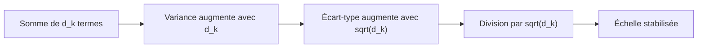

Nous n’avons pas besoin de retenir toute la démonstration, mais nous devons retenir l’idée :

> Le scaling évite que les scores d’attention deviennent trop grands quand la dimension augmente.

---

## 5.16 Le rôle du softmax ligne par ligne

Après la division par $\sqrt{d_k}$, nous appliquons le softmax.

Mais attention : le softmax est appliqué **ligne par ligne** sur la matrice des scores.

Pourquoi ?

Parce que chaque ligne correspond à un token qui regarde tous les autres tokens.

Pour chaque token $i$, nous voulons une distribution de poids sur les tokens $j$.

Donc, pour chaque ligne :

$$
\sum_{j=1}^{T} \alpha_{ij} = 1  
$$

où $\alpha_{ij}$ est le poids d’attention du token $i$ vers le token $j$.

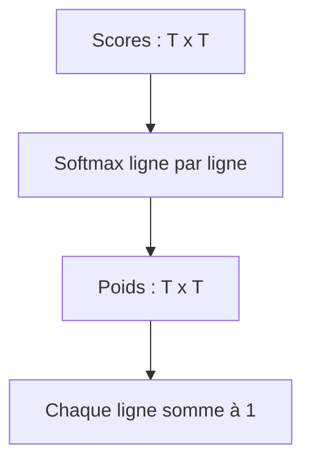

Chaque token possède donc sa propre distribution d’attention.

---

## 5.17 Exemple de matrice de poids d’attention

Supposons que nous ayons la phrase :

```txt
Le chat dort
```

Après softmax, nous pouvons obtenir une matrice conceptuelle :

|Token qui regarde / Token regardé|Le|chat|dort|
|---|--:|--:|--:|
|Le|0.60|0.30|0.10|
|chat|0.20|0.50|0.30|
|dort|0.10|0.70|0.20|

Interprétation :

- `Le` regarde surtout `Le` lui-même ;
    
- `chat` regarde surtout `chat`, mais aussi `dort` ;
    
- `dort` regarde surtout `chat`.
    

Chaque ligne somme à 1.

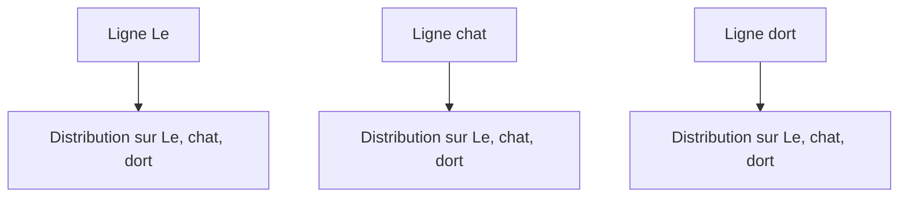

---

## 5.18 Multiplier les poids par $V$

Une fois que nous avons les poids d’attention :

$$
A = softmax\left(\frac{QK^T}{\sqrt{d_k}}\right)  
$$

nous calculons :

$$
AV  
$$

Si :

$$
A \in \mathbb{R}^{T \times T}  
$$

et :

$$
V \in \mathbb{R}^{T \times d_v}  
$$

alors :

$$
AV \in \mathbb{R}^{T \times d_v}  
$$

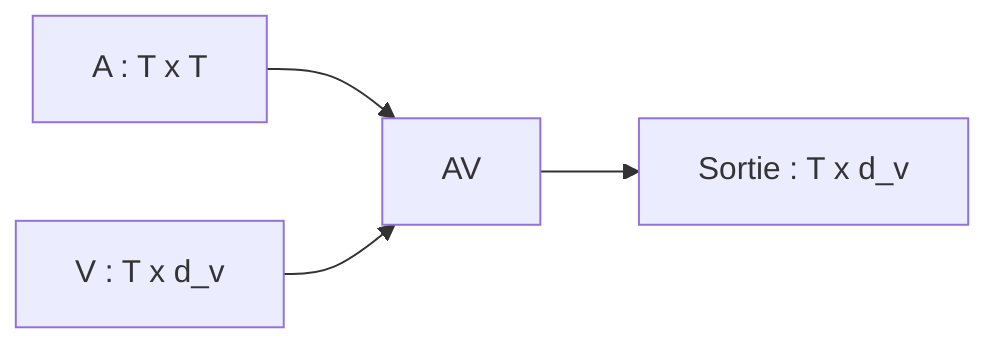

Chaque ligne de $AV$ est une somme pondérée des Values.

---

## 5.19 Interprétation de $AV$

La sortie pour le token $i$ est :

$$
y_i = \sum_{j=1}^{T} \alpha_{ij}v_j  
$$

où :

- $y_i$ est la nouvelle représentation du token $i$ ;
    
- $\alpha_{ij}$ est le poids donné par le token $i$ au token $j$ ;
    
- $v_j$ est la Value du token $j$.
    

Autrement dit :

> La nouvelle représentation d’un token est un mélange des informations portées par tous les tokens, pondéré par leur pertinence.

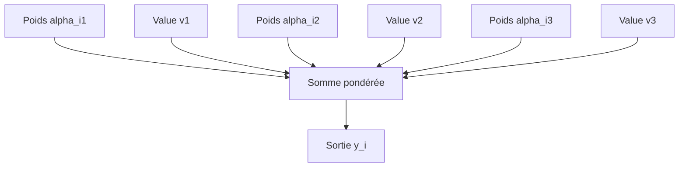

C’est ici que l’attention produit véritablement une représentation contextualisée.

---

## 5.20 Dimensions complètes sans batch

Récapitulons les dimensions dans le cas d’une seule séquence.

Nous avons :

$$ 
X \in \mathbb{R}^{T \times d_{model}}  
$$

Projections :

$$
W_Q \in \mathbb{R}^{d_{model} \times d_k}  
$$

$$
W_K \in \mathbb{R}^{d_{model} \times d_k}  
$$

$$
W_V \in \mathbb{R}^{d_{model} \times d_v}  
$$

Donc :

$$
Q \in \mathbb{R}^{T \times d_k}  
$$

$$
K \in \mathbb{R}^{T \times d_k}  
$$

$$
V \in \mathbb{R}^{T \times d_v}  
$$

Scores :

$$
QK^T \in \mathbb{R}^{T \times T}  
$$

Poids :

$$
A \in \mathbb{R}^{T \times T}  
$$

Sortie :

$$
Y = AV \in \mathbb{R}^{T \times d_v}  
$$

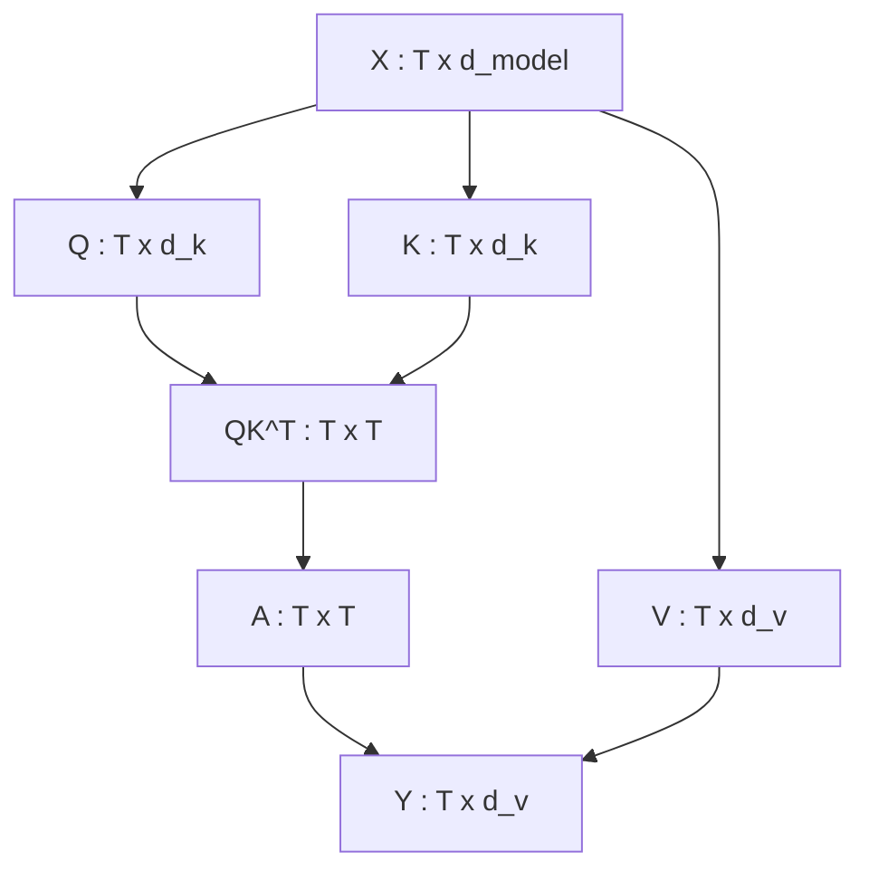

---

## 5.21 Dimensions complètes avec batch

En pratique, nous traitons plusieurs séquences en parallèle.

L’entrée a donc souvent la forme :

$$
X \in \mathbb{R}^{B \times T \times d_{model}}  
$$

où :

- $B$ est la taille du batch ;
    
- $T$ est la longueur de séquence ;
    
- $d_{model}$ est la dimension du modèle.
    

Après projection :

$$
Q \in \mathbb{R}^{B \times T \times d_k}  
$$

$$
K \in \mathbb{R}^{B \times T \times d_k}  
$$

$$
V \in \mathbb{R}^{B \times T \times d_v}  
$$

Pour chaque élément du batch, nous calculons une matrice d’attention :

$$
A \in \mathbb{R}^{B \times T \times T}  
$$

La sortie est :

$$
Y \in \mathbb{R}^{B \times T \times d_v}  
$$

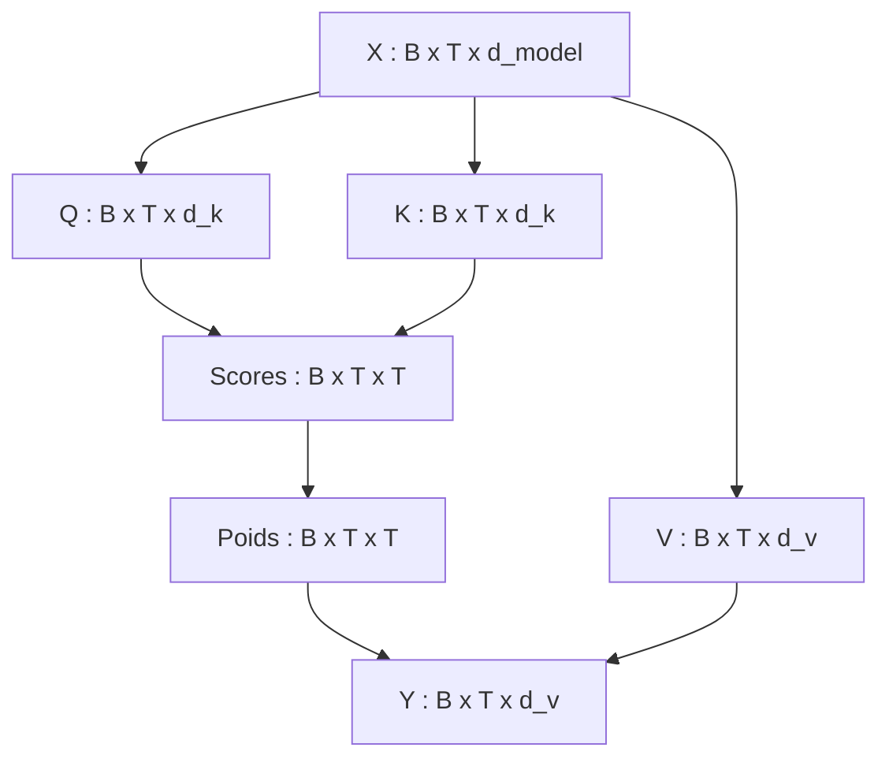

Le batch ajoute donc une dimension externe, mais le mécanisme reste le même.

---

## 5.22 Exemple numérique complet

Prenons une séquence très courte de deux tokens :

```txt
A B
```

Nous allons utiliser une dimension très petite :

$$
d_k = 2  
$$

et :

$$
d_v = 2  
$$

Supposons que nous ayons :

$$
Q =  
\begin{bmatrix}  
1 & 0 \  
0 & 1  
\end{bmatrix}  
$$

$$
K =  
\begin{bmatrix}  
1 & 0 \  
1 & 1  
\end{bmatrix}  
$$

$$
V =  
\begin{bmatrix}  
2 & 0 \  
0 & 4  
\end{bmatrix}  
$$

Nous allons calculer :

$$
Attention(Q,K,V) = softmax\left(\frac{QK^T}{\sqrt{2}}\right)V  
$$

---

## 5.23 Étape 1 : calcul de $K^T$

Nous avons :

$$
K =  
\begin{bmatrix}  
1 & 0 \  
1 & 1  
\end{bmatrix}  
$$

Donc :

$$
K^T =  
\begin{bmatrix}  
1 & 1 \  
0 & 1  
\end{bmatrix}  
$$

```mermaid
flowchart LR
    K["K"] --> KT["K^T"]
```

La transposition transforme les lignes en colonnes.

---

## 5.24 Étape 2 : calcul de $QK^T$

Nous avons :

$$
Q =  
\begin{bmatrix}  
1 & 0 \  
0 & 1  
\end{bmatrix}  
$$

et :

$$
K^T =  
\begin{bmatrix}  
1 & 1 \  
0 & 1  
\end{bmatrix}  
$$

Donc :

$$
QK^T =  
\begin{bmatrix}  
1 & 1 \  
0 & 1  
\end{bmatrix}  
$$

Interprétation :

- le token 1 a un score 1 avec le token 1 ;
    
- le token 1 a un score 1 avec le token 2 ;
    
- le token 2 a un score 0 avec le token 1 ;
    
- le token 2 a un score 1 avec le token 2.
    

```mermaid
flowchart TD
    Q["Q"] --> S["QK^T"]
    KT["K^T"] --> S
    S --> R["Scores bruts"]
```

---

## 5.25 Étape 3 : division par $\sqrt{d_k}$

Ici :

$$
d_k = 2  
$$

donc :

$$
\sqrt{d_k} = \sqrt{2} \approx 1.414  
$$

Nous divisons les scores :

$$
\frac{QK^T}{\sqrt{2}} =  
\begin{bmatrix}  
0.707 & 0.707 \  
0 & 0.707  
\end{bmatrix}  
$$

```mermaid
flowchart LR
    A["Scores bruts"] --> B["Division par sqrt(2)"]
    B --> C["Scores stabilisés"]
```

---

## 5.26 Étape 4 : softmax ligne par ligne

Nous appliquons maintenant le softmax à chaque ligne.

Première ligne :

$$
[0.707, 0.707]  
$$

Les deux scores sont égaux, donc :

$$
softmax([0.707, 0.707]) = [0.5, 0.5]  
$$

Deuxième ligne :

$$
[0, 0.707]  
$$

Calcul approximatif :

$$
e^0 = 1  
$$

$$
e^{0.707} \approx 2.028  
$$

Somme :

$$
1 + 2.028 = 3.028  
$$

Donc :

$$
softmax([0, 0.707]) \approx [0.330, 0.670]  
$$

La matrice d’attention devient donc :

$$
A =  
\begin{bmatrix}  
0.5 & 0.5 \  
0.330 & 0.670  
\end{bmatrix}  
$$

```mermaid
flowchart TD
    S["Scores stabilisés"] --> SM["Softmax ligne par ligne"]
    SM --> A["Poids d'attention"]
```

---

## 5.27 Étape 5 : multiplication par $V$

Nous avons :

$$
A =  
\begin{bmatrix}  
0.5 & 0.5 \  
0.330 & 0.670  
\end{bmatrix}  
$$

et :

$$
V =  
\begin{bmatrix}  
2 & 0 \  
0 & 4  
\end{bmatrix}  
$$

Nous calculons :

$$
AV =  
\begin{bmatrix}  
0.5 & 0.5 \  
0.330 & 0.670  
\end{bmatrix}  
\begin{bmatrix}  
2 & 0 \  
0 & 4  
\end{bmatrix}  
$$

Première ligne :

$$
0.5 + 0.5 =  
$$

Deuxième ligne :

$$
0.330 + 0.670 = [0.660,2.680]  
$$

Donc :

$$
Y =  
\begin{bmatrix}  
1 & 2 \  
0.660 & 2.680  
\end{bmatrix}  
$$

```mermaid
flowchart TD
    A["Poids d'attention A"] --> M["A x V"]
    V["Values V"] --> M
    M --> Y["Sortie Y"]
```

Nous avons obtenu une nouvelle représentation pour chacun des deux tokens.

---

## 5.28 Interprétation de l’exemple

Dans cet exemple :

- le premier token regarde les deux tokens avec le même poids ;
    
- le second token regarde davantage le second token ;
    
- la sortie est un mélange pondéré des Values.
    

La première sortie :

$$
  
$$

est exactement la moyenne de :

$$
  
$$

et :

$$
  
$$

La deuxième sortie :

$$
[0.660,2.680]  
$$

est plus proche de la deuxième Value, car le poids 0.670 est plus fort.

Cela illustre le principe fondamental :

> L’attention ne copie pas simplement un token ; elle mélange les informations selon des poids appris.

---

## 5.29 Pourquoi la sortie est contextualisée

Chaque ligne de sortie dépend potentiellement de toutes les lignes de $V$.

Autrement dit, la représentation finale d’un token dépend des autres tokens.

Si nous modifions un token dans la séquence, ses Key et Value changent, donc les sorties peuvent changer.

```mermaid
flowchart TD
    A["Token 1"] --> QKV["Q, K, V"]
    B["Token 2"] --> QKV
    C["Token 3"] --> QKV

    QKV --> ATT["Attention"]
    ATT --> Y1["Sortie token 1 contextualisée"]
    ATT --> Y2["Sortie token 2 contextualisée"]
    ATT --> Y3["Sortie token 3 contextualisée"]
```

C’est cette dépendance mutuelle qui rend l’attention si puissante pour représenter les séquences.

---

## 5.30 Attention et parallélisation matricielle

L’une des grandes forces de la Scaled Dot-Product Attention est qu’elle se formule avec des opérations matricielles.

Ces opérations sont très efficaces sur GPU :

- multiplication $QK^T$ ;
    
- softmax ;
    
- multiplication par $V$.
    

```mermaid
flowchart LR
    A["Multiplication matricielle"] --> B["GPU efficace"]
    C["Softmax vectorisé"] --> B
    D["Multiplication par V"] --> B
    B --> E["Entraînement parallèle"]
```

Contrairement aux RNN, nous n’avons pas besoin de calculer un état après l’autre dans le temps.

Cela explique une partie majeure du succès des Transformers.

---

## 5.31 Lien avec la complexité (O(T^2))

La matrice $QK^T$ a une taille :

$$
T \times T  
$$

Donc le nombre de scores d’attention augmente comme :

$$
T^2  
$$

Si (T = 1,000), nous avons :

$$
1,000,000  
$$

scores.

Si (T = 10,000), nous avons :

$$
100,000,000  
$$

scores.

```mermaid
flowchart TD
    A["Longueur de séquence T"] --> B["Scores T x T"]
    B --> C["Coût mémoire O(T²)"]
    B --> D["Coût calculatoire O(T²)"]
```

L’attention est donc très parallélisable, mais pas gratuite.

Le coût quadratique est l’un des grands problèmes des Transformers pour les longs contextes.

---

## 5.32 Attention avec masque

Dans certains cas, nous ne voulons pas que tous les tokens puissent regarder tous les autres tokens.

Par exemple, dans un modèle génératif, le token en position $i$ ne doit pas regarder les tokens futurs.

Nous appliquons alors un masque avant le softmax.

```mermaid
flowchart TD
    A["Scores QK^T / sqrt(d_k)"] --> B["Application du masque"]
    B --> C["Positions interdites = -inf"]
    C --> D["Softmax"]
    D --> E["Poids d'attention autorisés"]
```

Le masque modifie les scores avant le softmax.

Les positions interdites reçoivent une valeur très négative, souvent représentée par :

$$ 
-\infty  
$$

Après softmax, leur poids devient 0.

Nous détaillerons les masques dans un chapitre spécifique, mais il est important de savoir dès maintenant où ils interviennent.

---

## 5.33 Exemple de masque causal

Dans une séquence de 4 tokens :

```txt
t1 t2 t3 t4
```

un modèle causal autorise :

- (t1) à regarder seulement (t1) ;
    
- (t2) à regarder (t1, t2) ;
    
- (t3) à regarder (t1, t2, t3) ;
    
- (t4) à regarder (t1, t2, t3, t4).
    

Matrice autorisée :

|Token qui regarde / Token regardé|t1|t2|t3|t4|
|---|--:|--:|--:|--:|
|t1|oui|non|non|non|
|t2|oui|oui|non|non|
|t3|oui|oui|oui|non|
|t4|oui|oui|oui|oui|

```mermaid
flowchart TD
    A["Scores complets"] --> B["Masque causal triangulaire"]
    B --> C["Les tokens futurs sont interdits"]
```

Cela permet au modèle de générer du texte sans tricher.

---

## 5.34 Attention bidirectionnelle sans masque causal

Dans un encoder classique, comme dans le Transformer original côté encoder ou dans BERT, chaque token peut regarder tous les autres tokens.

La matrice d’attention n’est donc pas masquée causalement.

```mermaid
flowchart LR
    A["Token 1"] <--> B["Token 2"]
    A <--> C["Token 3"]
    B <--> C
    C <--> D["Token 4"]
    A <--> D
```

Cela est utile pour les tâches de compréhension :

- classification ;
    
- extraction d’information ;
    
- prédiction de token masqué ;
    
- représentation de phrase ;
    
- analyse de texte.
    

Mais ce n’est pas adapté tel quel à la génération autoregressive, car le modèle verrait le futur.

---

## 5.35 L’attention comme moyenne pondérée adaptative

Nous pouvons aussi comprendre la Scaled Dot-Product Attention comme une moyenne pondérée adaptative.

Pour chaque token :

1. nous calculons quels tokens sont pertinents ;
    
2. nous transformons cette pertinence en poids ;
    
3. nous faisons une moyenne pondérée des informations.
    

```mermaid
flowchart TD
    A["Pertinence Query-Key"] --> B["Poids d'attention"]
    B --> C["Moyenne pondérée des Values"]
    C --> D["Représentation contextualisée"]
```

Le mot important est **adaptative**.

Les poids dépendent :

- du token courant ;
    
- des autres tokens ;
    
- du contexte ;
    
- des paramètres appris.
    

---

## 5.36 Différence entre attention et simple moyenne

Si nous faisions une simple moyenne des embeddings, chaque token contribuerait de manière identique.

Par exemple :

```txt
nouvelle représentation = moyenne de tous les tokens
```

Ce serait trop pauvre.

L’attention apprend des poids différents selon la situation.

```mermaid
flowchart TD
    A["Moyenne simple"] --> B["Tous les tokens ont le même poids"]
    C["Attention"] --> D["Poids différents selon le contexte"]
```

Dans :

```txt
Le chat dort.
```

pour le token `dort`, `chat` doit probablement compter davantage que le point final.

L’attention permet cette pondération dynamique.

---

## 5.37 Pourquoi le softmax donne une distribution

Le softmax impose deux propriétés importantes :

1. chaque poids est positif ;
    
2. la somme des poids vaut 1.
    

Cela rend les poids interprétables comme une distribution.

$$ 
\alpha_{ij} \ge 0  
$$

$$ 
\sum_j \alpha_{ij} = 1  
$$

```mermaid
flowchart TD
    A["Scores quelconques"] --> B["Softmax"]
    B --> C["Poids positifs"]
    B --> D["Somme = 1"]
```

Ainsi, la sortie d’attention est une combinaison convexe des Values.

C’est-à-dire une forme de mélange pondéré.

---

## 5.38 Pourquoi pas une autre fonction que softmax ?

On pourrait imaginer d’autres fonctions de normalisation.

Mais le softmax a plusieurs avantages :

- il est différentiable ;
    
- il accentue les scores les plus élevés ;
    
- il produit des poids positifs ;
    
- il normalise chaque ligne ;
    
- il est simple à implémenter ;
    
- il fonctionne bien empiriquement.
    

Cela dit, des variantes modernes explorent parfois d’autres formes d’attention, notamment pour réduire le coût sur les longues séquences.

Nous les aborderons plus tard dans le cours.

---

## 5.39 Lien avec la mémoire associative

L’attention peut être vue comme une forme de mémoire associative.

Nous avons :

- une Query qui interroge la mémoire ;
    
- des Keys qui servent d’adresses ;
    
- des Values qui servent de contenus.
    

```mermaid
flowchart TD
    Q["Query : requête"] --> K["Keys : adresses"]
    K --> S["Scores de correspondance"]
    S --> W["Poids"]
    W --> V["Values : contenus"]
    V --> O["Réponse mémoire"]
```

Cette analogie est très utile :

> Les Keys permettent de retrouver les informations, les Values contiennent les informations retrouvées.

Le Transformer apprend donc à créer et interroger une mémoire contextuelle à chaque couche.

---

## 5.40 Attention et récupération d’information

Nous pouvons aussi faire le lien avec un moteur de recherche.

Quand nous faisons une recherche :

```txt
meilleur restaurant italien Lille
```

le moteur compare notre requête avec les documents indexés.

Il attribue un score aux documents, puis retourne les plus pertinents.

Dans l’attention :

- la Query est la recherche ;
    
- les Keys sont les représentations indexées ;
    
- les scores indiquent la pertinence ;
    
- les Values sont les contenus utilisés pour produire la réponse.
    

```mermaid
flowchart LR
    A["Requête"] --> B["Comparaison avec index"]
    B --> C["Scores"]
    C --> D["Documents pondérés"]
    D --> E["Réponse"]

    F["Query"] --> G["Keys"]
    G --> H["Scores attention"]
    H --> I["Values pondérées"]
    I --> J["Sortie"]
```

La différence est que tout cela se passe à l’intérieur du modèle, de manière différentiable.

---

## 5.41 Stabilité numérique du softmax

En pratique, le softmax est souvent calculé avec une astuce de stabilité numérique.

Au lieu de calculer directement :

$$ 
softmax(s_i) = \frac{e^{s_i}}{\sum_j e^{s_j}}  
$$

on soustrait d’abord le maximum de la ligne :

$$ 
softmax(s_i) = \frac{e^{s_i - m}}{\sum_j e^{s_j - m}}  
$$

où :

$$ 
m = \max_j(s_j)  
$$

Cela évite que les exponentielles deviennent trop grandes.

```mermaid
flowchart TD
    A["Scores"] --> B["Soustraction du maximum"]
    B --> C["Exponentielles plus stables"]
    C --> D["Softmax"]
```

Cette astuce ne change pas le résultat mathématique, mais elle évite des problèmes de calcul informatique.

---

## 5.42 Implémentation conceptuelle en pseudo-code

Nous pouvons écrire la Scaled Dot-Product Attention en pseudo-code :

```python
def scaled_dot_product_attention(Q, K, V, mask=None):
    scores = Q @ K.transpose(-2, -1)
    scores = scores / sqrt(d_k)

    if mask is not None:
        scores = scores.masked_fill(mask == 0, -inf)

    weights = softmax(scores, dim=-1)
    output = weights @ V

    return output, weights
```

Les dimensions typiques sont :

```txt
Q : batch x seq_len x d_k
K : batch x seq_len x d_k
V : batch x seq_len x d_v
scores : batch x seq_len x seq_len
weights : batch x seq_len x seq_len
output : batch x seq_len x d_v
```

Ce pseudo-code est très proche de ce que nous retrouverons dans les bibliothèques de deep learning.

---

## 5.43 Version PyTorch simplifiée

En PyTorch, nous pourrions écrire une version simplifiée :

```python
import torch
import math

def scaled_dot_product_attention(Q, K, V, mask=None):
    d_k = Q.size(-1)

    scores = torch.matmul(Q, K.transpose(-2, -1)) / math.sqrt(d_k)

    if mask is not None:
        scores = scores.masked_fill(mask == 0, float("-inf"))

    weights = torch.softmax(scores, dim=-1)
    output = torch.matmul(weights, V)

    return output, weights
```

Cette fonction ne gère pas encore tous les détails industriels :

- dropout ;
    
- multi-head attention ;
    
- optimisations mémoire ;
    
- types flottants réduits ;
    
- FlashAttention ;
    
- masques complexes.
    

Mais elle contient le cœur mathématique.

---

## 5.44 Vérification des dimensions en pseudo-code

Supposons :

```python
B = 2
T = 4
d_k = 3
d_v = 5
```

Alors :

```python
Q.shape == (2, 4, 3)
K.shape == (2, 4, 3)
V.shape == (2, 4, 5)
```

Calcul :

```python
scores = Q @ K.transpose(-2, -1)
```

Dimensions :

```txt
Q                  : (2, 4, 3)
K.transpose(-2,-1): (2, 3, 4)
scores             : (2, 4, 4)
```

Puis :

```python
weights = softmax(scores, dim=-1)
output = weights @ V
```

Dimensions :

```txt
weights : (2, 4, 4)
V       : (2, 4, 5)
output  : (2, 4, 5)
```

```mermaid
flowchart TD
    Q["Q : B x T x d_k"] --> S["Scores : B x T x T"]
    K["K : B x T x d_k"] --> S
    S --> W["Weights : B x T x T"]
    W --> O["Output : B x T x d_v"]
    V["V : B x T x d_v"] --> O
```

---

## 5.45 Attention et gradient

Comme toutes les opérations sont différentiables, le gradient peut traverser :

- la multiplication par $V$ ;
    
- le softmax ;
    
- la division par $\sqrt{d_k}$ ;
    
- le produit $QK^T$ ;
    
- les projections $W_Q$, $W_K$, $W_V$.
    

```mermaid
flowchart RL
    L["Loss"] --> O["Output"]
    O --> W["Weights"]
    W --> SM["Softmax"]
    SM --> S["Scores"]
    S --> Q["Q"]
    S --> K["K"]
    O --> V["V"]
    Q --> WQ["W_Q"]
    K --> WK["W_K"]
    V --> WV["W_V"]
```

Cela signifie que le modèle apprend automatiquement à produire de meilleures Queries, Keys et Values.

---

## 5.46 Attention et apprentissage des relations

Pendant l’entraînement, si une relation entre deux tokens aide à réduire la loss, les paramètres peuvent s’ajuster pour augmenter la compatibilité entre leurs Query et Key.

Exemple :

```txt
Le chat dort.
```

Si relier `dort` à `chat` aide à prédire correctement ou à construire une meilleure représentation, le modèle peut apprendre à augmenter le score :

$$ 
q_{dort} \cdot k_{chat}  
$$

```mermaid
flowchart TD
    A["Relation utile : dort -> chat"] --> B["Réduction de la loss"]
    B --> C["Gradient"]
    C --> D["Ajustement de W_Q et W_K"]
    D --> E["Compatibilité plus forte"]
```

L’attention n’est donc pas une règle écrite à la main.

C’est une structure qui permet au modèle d’apprendre des relations utiles.

---

## 5.47 Erreur fréquente : oublier que $Q$, $K$, $V$ sont appris

Une erreur fréquente consiste à croire que $Q$, $K$, $V$ sont donnés directement.

En réalité, ils sont produits par des projections apprises.

Nous partons de $X$, puis nous calculons :

$$ 
Q = XW_Q  
$$

$$ 
K = XW_K  
$$

$$ 
V = XW_V  
$$

Les matrices $W_Q$, $W_K$, $W_V$ sont des paramètres du modèle.

```mermaid
flowchart TD
    A["X"] --> B["W_Q appris"]
    A --> C["W_K appris"]
    A --> D["W_V appris"]

    B --> E["Q"]
    C --> F["K"]
    D --> G["V"]
```

C’est le modèle qui apprend comment poser les bonnes questions, comment indexer les tokens, et quelles informations transmettre.

---

## 5.48 Erreur fréquente : confondre $K$ et $V$

Les Keys et les Values ont des rôles différents.

Les Keys servent à calculer les scores.

Les Values servent à construire la sortie.

```mermaid
flowchart TD
    K["Keys"] --> S["Scores avec Queries"]
    S --> W["Poids d'attention"]
    V["Values"] --> O["Somme pondérée"]
    W --> O
```

Autrement dit :

- $K$ sert à décider **où regarder** ;
    
- $V$ sert à décider **ce qu’on récupère**.
    

Cette distinction est fondamentale pour comprendre les architectures encoder-decoder et la cross-attention.

---

## 5.49 Erreur fréquente : croire que les poids d’attention sont les sorties

Les poids d’attention ne sont pas la sortie finale de l’attention.

Ils sont une étape intermédiaire.

La sortie finale est obtenue après multiplication par $V$.

$$ 
A = softmax\left(\frac{QK^T}{\sqrt{d_k}}\right)  
$$

$$ 
Y = AV  
$$

```mermaid
flowchart LR
    A["Poids d'attention"] --> B["Multiplication par V"]
    B --> C["Sortie contextualisée"]
```

Les poids nous disent où le modèle regarde.

La sortie contient l’information récupérée.

---

## 5.50 Erreur fréquente : oublier le softmax ligne par ligne

Le softmax ne s’applique pas à toute la matrice en une seule distribution globale.

Il s’applique ligne par ligne.

Chaque token possède sa propre distribution d’attention.

```mermaid
flowchart TD
    A["Matrice scores T x T"] --> B["Ligne 1 : softmax"]
    A --> C["Ligne 2 : softmax"]
    A --> D["Ligne 3 : softmax"]
    A --> E["..."]
```

Si nous appliquions le softmax sur toute la matrice, nous mélangerions les distributions de tous les tokens, ce qui ne correspondrait pas au mécanisme voulu.

---

## 5.51 Erreur fréquente : oublier le scaling

Si nous oublions la division par $\sqrt{d_k}$, le modèle peut encore fonctionner dans certains petits exemples.

Mais pour des dimensions plus grandes, les scores risquent d’être trop grands, ce qui rend le softmax trop saturé.

```mermaid
flowchart TD
    A["Pas de scaling"] --> B["Scores élevés"]
    B --> C["Softmax saturé"]
    C --> D["Apprentissage moins stable"]
```

Le scaling est donc une partie importante de la formule, pas un détail décoratif.

---

## 5.52 Synthèse mathématique

Nous pouvons résumer tout le mécanisme ainsi.

Entrée :

$$ 
X \in \mathbb{R}^{B \times T \times d_{model}}  
$$

Projections :

$$ 
Q = XW_Q  
$$

$$ 
K = XW_K  
$$

$$ 
V = XW_V  
$$

Scores :

$$ 
S = \frac{QK^T}{\sqrt{d_k}}  
$$

Poids :

$$ 
A = softmax(S)  
$$

Sortie :

$$ 
Y = AV  
$$

Formule compacte :

$$ 
Attention(Q,K,V) = softmax\left(\frac{QK^T}{\sqrt{d_k}}\right)V  
$$

---

## 5.53 Schéma global de synthèse

```mermaid
flowchart TD
    X["Entrée X"] --> WQ["Projection W_Q"]
    X --> WK["Projection W_K"]
    X --> WV["Projection W_V"]

    WQ --> Q["Q"]
    WK --> K["K"]
    WV --> V["V"]

    Q --> S["QK^T"]
    K --> S

    S --> SCALE["Division par sqrt(d_k)"]
    SCALE --> MASK["Masque éventuel"]
    MASK --> SM["Softmax ligne par ligne"]
    SM --> A["Poids d'attention"]

    A --> OUT["Multiplication par V"]
    V --> OUT

    OUT --> Y["Sortie contextualisée"]
```

Ce schéma est probablement l’un des plus importants du cours.

---

## 5.54 Résumé du chapitre

Nous avons étudié en détail la **Scaled Dot-Product Attention**.

Nous sommes partis des matrices $Q$, $K$ et $V$, produites par des projections linéaires apprises à partir de l’entrée $X$.

Nous avons vu que :

$$ 
QK^T  
$$

calcule tous les scores de compatibilité entre les Queries et les Keys.

Nous avons compris pourquoi nous divisons par :

$$ 
\sqrt{d_k}  
$$

afin de stabiliser l’échelle des scores et d’éviter un softmax trop saturé.

Nous avons vu que le softmax est appliqué ligne par ligne pour produire une distribution d’attention par token.

Enfin, nous avons vu que la multiplication par $V$ produit une nouvelle représentation contextualisée pour chaque token.

Le point central est :

> La Scaled Dot-Product Attention transforme une séquence de vecteurs en une nouvelle séquence de vecteurs, où chaque token contient un mélange pondéré d’informations provenant des autres tokens.

---

## 5.55 Questions de compréhension

### 5.55.1 Question 1

Que signifie **Dot-Product Attention** ?

Réponse attendue : cela signifie que les scores d’attention sont calculés avec des produits scalaires entre Queries et Keys.

### 5.55.2 Question 2

Pourquoi calcule-t-on $QK^T$ ?

Réponse attendue : pour obtenir tous les scores de compatibilité entre chaque Query et chaque Key de la séquence.

### 5.55.3 Question 3

Quelle est la forme de $QK^T$ si $Q$ et $K$ ont la forme $T \times d_k$ ?

Réponse attendue :

$$ 
QK^T \in \mathbb{R}^{T \times T}  
$$

### 5.55.4 Question 4

Pourquoi divise-t-on par $\sqrt{d_k}$ ?

Réponse attendue : pour stabiliser l’échelle des scores et éviter que le softmax devienne trop saturé lorsque $d_k$ est grand.

### 5.55.5 Question 5

Pourquoi applique-t-on le softmax ligne par ligne ?

Réponse attendue : parce que chaque ligne correspond à un token qui distribue son attention sur tous les tokens regardés.

### 5.55.6 Question 6

Quel est le rôle de $V$ dans la formule ?

Réponse attendue : $V$ contient les informations qui sont mélangées selon les poids d’attention pour produire la sortie contextualisée.

### 5.55.7 Question 7

Quelle est la différence entre $K$ et $V$ ?

Réponse attendue : $K$ sert à calculer les scores de pertinence, tandis que $V$ contient l’information effectivement transmise.

### 5.55.8 Question 8

Quelle est la forme de la sortie si $A$ a la forme $T \times T$ et $V$ la forme $T \times d_v$ ?

Réponse attendue :

$$ 
AV \in \mathbb{R}^{T \times d_v}  
$$

### 5.55.9 Question 9

Où intervient le masque d’attention ?

Réponse attendue : le masque intervient après le calcul des scores et avant le softmax.

### 5.55.10 Question 10

Pourquoi la Scaled Dot-Product Attention est-elle efficace sur GPU ?

Réponse attendue : parce qu’elle repose principalement sur de grandes multiplications matricielles, qui sont très bien parallélisées sur GPU.

---

## 5.56 Transition vers le chapitre 6

Nous savons maintenant calculer une attention complète avec :

$$ 
Attention(Q,K,V) = softmax\left(\frac{QK^T}{\sqrt{d_k}}\right)V  
$$

Mais dans le Transformer, nous n’utilisons pas une seule attention.

Nous utilisons plusieurs attentions en parallèle.

C’est le principe de la **Multi-Head Attention**.

Dans le chapitre suivant, nous verrons pourquoi une seule tête d’attention peut être insuffisante, puis comment plusieurs têtes permettent au modèle d’apprendre différents types de relations en parallèle.

Nous étudierons :

- le principe des têtes multiples ;
    
- les projections propres à chaque tête ;
    
- la concaténation des résultats ;
    
- la projection finale ;
    
- les dimensions utilisées dans le papier original ;
    
- l’interprétation pédagogique des têtes d’attention ;
    
- les limites de cette interprétation.

---
> [!info] Livre « Les transformers » — chapitre 5/30
> [[Les transformers — Sommaire|Sommaire]] · [[Les transformers — 04 — Le mécanisme d’attention intuition et formulation|← 04 — Le mécanisme d’attention intuition et formulation]] · [[Les transformers — 06 — Multi-Head Attention|06 — Multi-Head Attention →]]
