> [!info] Livre « Les transformers » — chapitre 6/30
> [[Les transformers — Sommaire|Sommaire]] · [[Les transformers — 05 — Scaled Dot-Product Attention|← 05 — Scaled Dot-Product Attention]] · [[Les transformers — 07 — Architecture Encoder-Decoder du Transformer original|07 — Architecture Encoder-Decoder du Transformer original →]]

# Chapitre 6 — Multi-Head Attention
## 6.1 Objectif du chapitre

Dans le chapitre précédent, nous avons étudié en détail la **Scaled Dot-Product Attention** :

$$ 
Attention(Q,K,V) = softmax\left(\frac{QK^T}{\sqrt{d_k}}\right)V  
$$

Nous avons compris comment une Query est comparée à des Keys, comment les scores sont transformés en poids par softmax, puis comment ces poids servent à mélanger les Values.

Dans ce chapitre, nous allons franchir une étape essentielle : comprendre la **Multi-Head Attention**, c’est-à-dire l’attention multi-têtes.

Dans le Transformer original, le modèle n’utilise pas une seule attention, mais plusieurs attentions en parallèle. C’est précisément le sujet prévu pour le chapitre 6 de notre plan de cours : comprendre la limite d’une seule tête d’attention, les projections linéaires de $Q$, $K$, $V$, la concaténation des têtes, la projection finale et les limites de l’interprétation naïve des têtes.

L’idée centrale est la suivante :

> Une seule attention peut apprendre une manière de regarder la séquence ; plusieurs têtes d’attention permettent d’apprendre plusieurs types de relations en parallèle.

---

## 6.2 Rappel : une seule tête d’attention

Dans une attention simple, nous partons d’une entrée :

$$
X \in \mathbb{R}^{T \times d_{model}}  
$$

Nous calculons :

$$
Q = XW_Q  
$$

$$
K = XW_K  
$$

$$ 
V = XW_V  
$$

Puis :

$$  
Attention(Q,K,V) = softmax\left(\frac{QK^T}{\sqrt{d_k}}\right)V  
$$

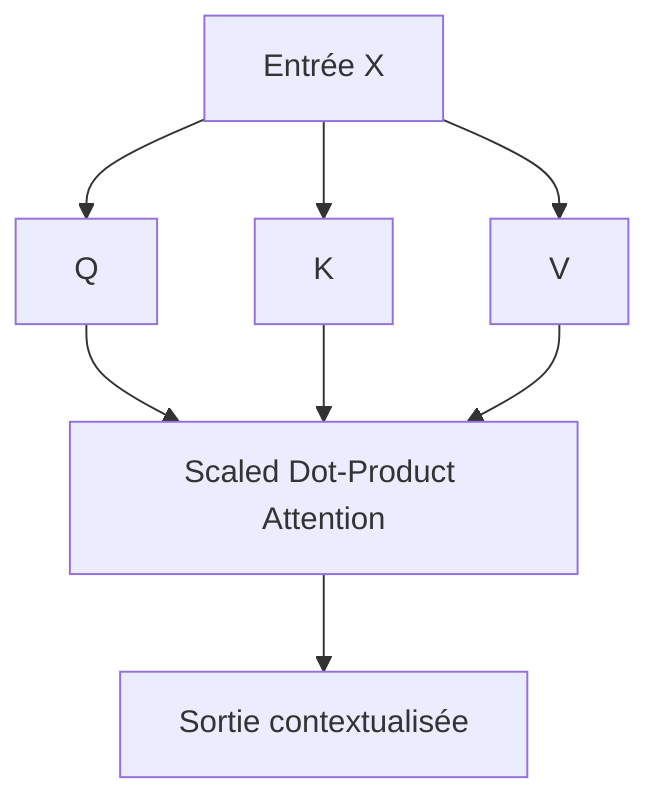

Cette attention produit une nouvelle représentation pour chaque token.

Mais elle ne regarde la séquence que selon **un seul espace de relation**.

---

## 6.3 La limite d’une seule tête

Une phrase contient souvent plusieurs types de relations en même temps.

Prenons :

```txt
Le petit chat noir dort sur le canapé.
```

Pour comprendre cette phrase, le modèle peut avoir besoin de plusieurs relations :

- `petit` qualifie `chat` ;
    
- `noir` qualifie `chat` ;
    
- `chat` est le sujet de `dort` ;
    
- `sur` introduit un complément de lieu ;
    
- `canapé` est lié à `sur`.
    

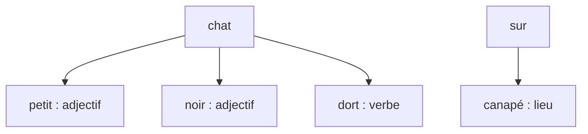

Une seule tête d’attention peut apprendre certaines de ces relations, mais elle doit tout représenter dans un seul espace.

Cela peut être limitant.

---

## 6.4 L’idée de la Multi-Head Attention

La **Multi-Head Attention** consiste à calculer plusieurs attentions en parallèle.

Chaque tête possède ses propres projections $W_Q$, $W_K$, $W_V$.

Chaque tête peut donc apprendre une manière différente de représenter les relations entre tokens.

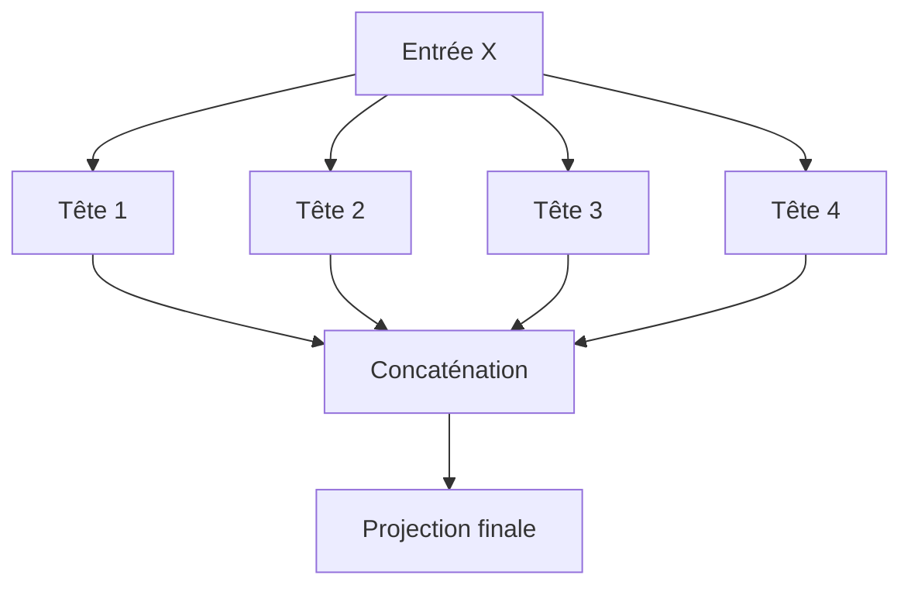

Nous pouvons retenir l’intuition suivante :

> Une tête peut regarder les relations syntaxiques, une autre les relations sémantiques, une autre les relations de proximité, une autre les dépendances longues.

Cette interprétation est pédagogique. En pratique, les têtes ne se spécialisent pas toujours de manière aussi propre.

---

## 6.5 Pourquoi plusieurs têtes ?

L’attention multi-têtes permet au modèle d’observer la séquence depuis plusieurs points de vue.

Prenons une phrase :

```txt
Marie donne son livre à Paul parce qu’il l’a demandé.
```

Cette phrase contient plusieurs relations :

- `Marie` est le sujet de `donne` ;
    
- `livre` est l’objet donné ;
    
- `Paul` est le destinataire ;
    
- `il` renvoie probablement à `Paul` ;
    
- `l’` renvoie probablement à `livre`.
    

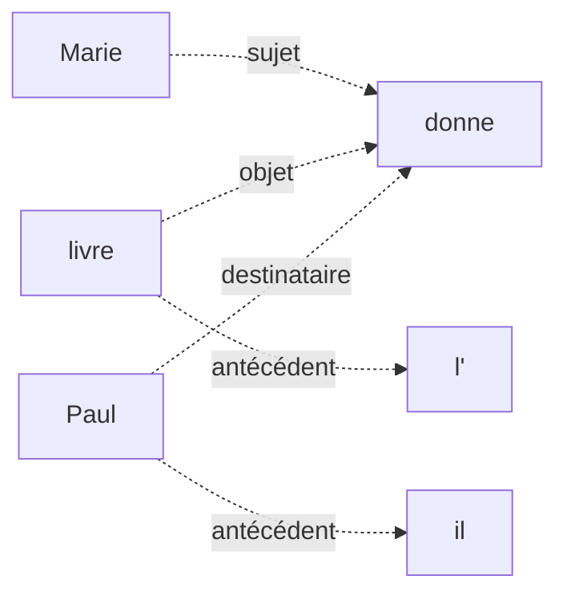

Une tête pourrait apprendre à repérer des sujets.

Une autre pourrait apprendre à repérer des objets.

Une autre pourrait apprendre des références pronominales.

Une autre pourrait apprendre des relations de position locale.

La multi-head attention rend cette diversité possible.

---

## 6.6 Analogie : plusieurs lecteurs spécialisés

Nous pouvons imaginer la Multi-Head Attention comme plusieurs lecteurs lisant la même phrase avec des objectifs différents.

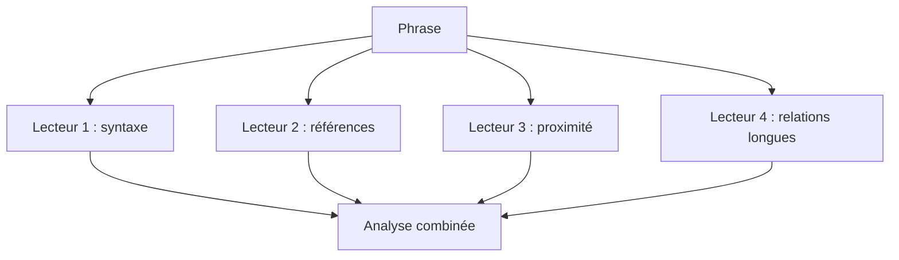

Chaque lecteur produit une représentation.

Ensuite, nous combinons ces représentations pour obtenir une sortie plus riche.

C’est exactement l’idée de la multi-head attention.

---

## 6.7 Formule générale de la Multi-Head Attention

Dans le papier original, la Multi-Head Attention est définie ainsi :

$$
MultiHead(Q,K,V) = Concat(head_1, ..., head_h)W^O  
$$

avec :

$$
head_i = Attention(QW_i^Q, KW_i^K, VW_i^V)  
$$

où :

- $h$ est le nombre de têtes ;
    
- $W_i^Q$ est la projection Query de la tête $i$ ;
    
- $W_i^K$ est la projection Key de la tête $i$ ;
    
- $W_i^V$ est la projection Value de la tête $i$ ;
    
- $W^O$ est la projection finale après concaténation.
    

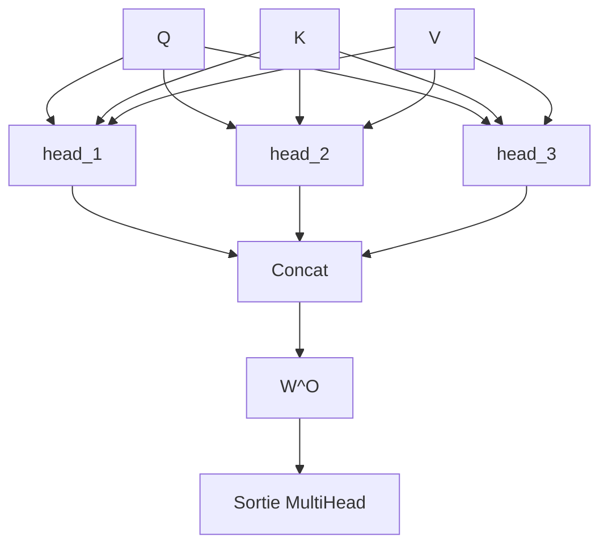

Cette formule peut sembler dense, mais elle exprime une idée simple : nous faisons plusieurs attentions, puis nous concaténons leurs résultats.

---

## 6.8 Attention simple vs Multi-Head Attention

Comparons les deux approches.

### Attention simple

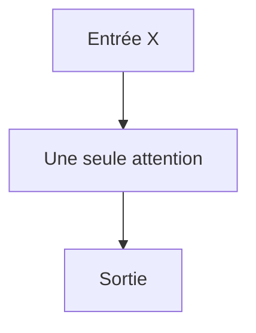

### Multi-Head Attention

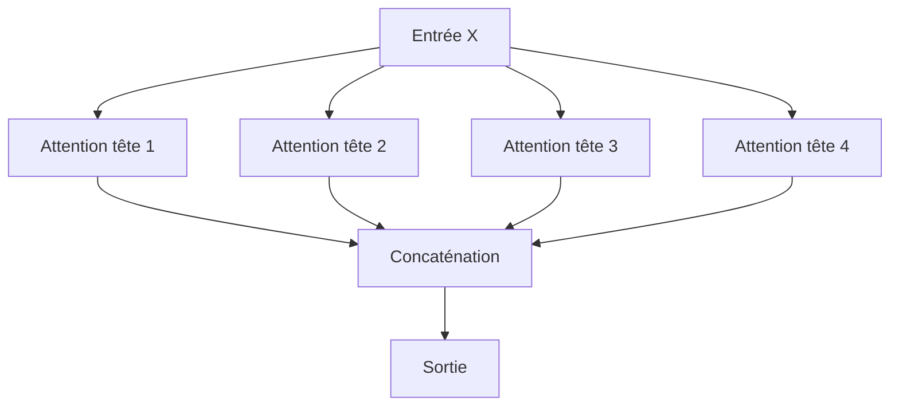

La différence principale est la diversité des sous-espaces appris.

Avec une seule tête, nous obtenons une seule matrice d’attention.

Avec plusieurs têtes, nous obtenons plusieurs matrices d’attention.

---

## 6.9 Chaque tête a ses propres projections

Dans une tête unique, nous avons :

$$ 
Q = XW_Q  
$$

$$
K = XW_K  
$$

$$
V = XW_V  
$$

Dans la Multi-Head Attention, chaque tête $i$ possède ses propres projections :

$$
Q_i = XW_i^Q  
$$

$$
K_i = XW_i^K  
$$

$$
V_i = XW_i^V  
$$

Puis :

$$
head_i = Attention(Q_i,K_i,V_i)  
$$

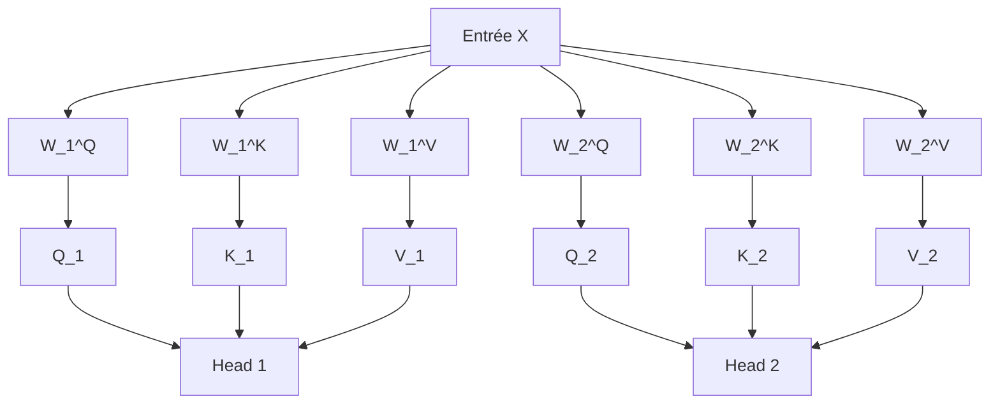

Chaque tête apprend donc sa propre manière de poser des questions, d’indexer les tokens et de transmettre l’information.

---

## 6.10 Dimensions dans le Transformer original

Dans le Transformer original, les auteurs utilisent notamment :

$$
d_{model} = 512  
$$

$$
h = 8  
$$

où $h$ est le nombre de têtes.

Chaque tête travaille alors dans une dimension plus petite :

$$
d_k = d_v = \frac{d_{model}}{h}  
$$

Donc :

$$
d_k = d_v = \frac{512}{8} = 64  
$$

Cela signifie que chaque tête travaille sur un sous-espace de dimension 64.

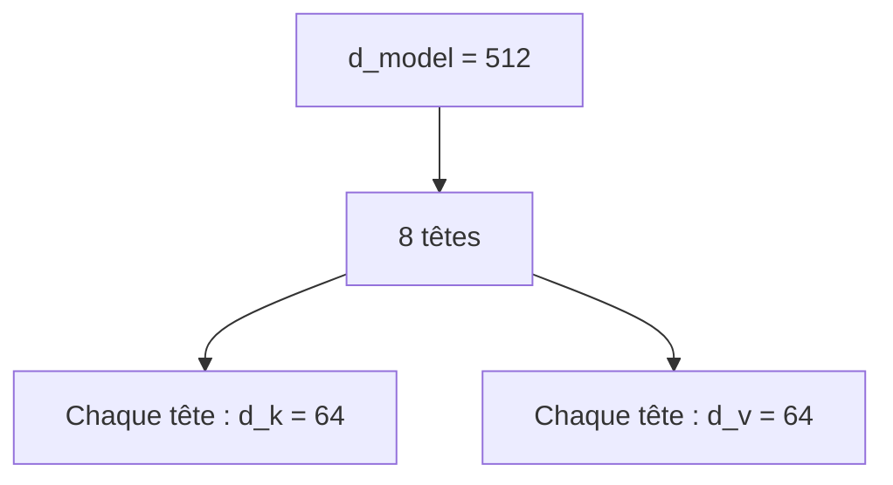

La concaténation des 8 têtes redonne :

$$ 
8 \times 64 = 512  
$$

Nous retrouvons donc la dimension du modèle.

---

## 6.11 Pourquoi réduire la dimension par tête ?

Une question importante est :

> Pourquoi chaque tête ne garde-t-elle pas toute la dimension $d_{model}$ ?

Si nous avions 8 têtes de dimension 512 chacune, la concaténation donnerait :

$$
8 \times 512 = 4096  
$$

Cela augmenterait énormément le coût.

Au lieu de cela, nous divisons la dimension entre les têtes.

Chaque tête travaille dans un sous-espace plus petit, et la concaténation retrouve la dimension initiale.

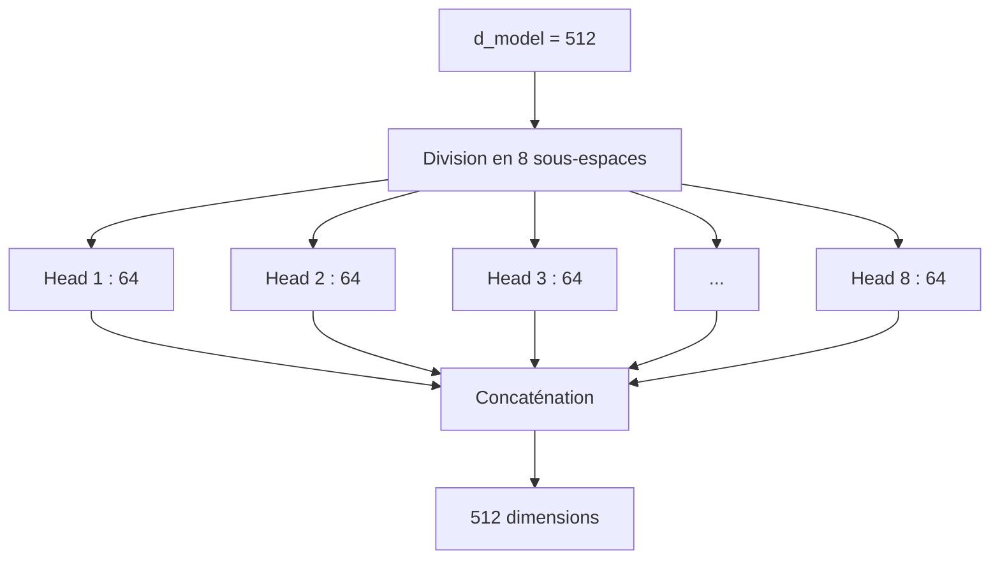

Cela permet d’avoir plusieurs têtes sans multiplier excessivement la taille de la sortie.

---

## 6.12 Dimensions pour une tête

Supposons une seule séquence, sans batch.

Nous avons :

[  
X \in \mathbb{R}^{T \times d_{model}}  
]

Pour la tête $i$ :

[  
W_i^Q \in \mathbb{R}^{d_{model} \times d_k}  
]

[  
W_i^K \in \mathbb{R}^{d_{model} \times d_k}  
]

[  
W_i^V \in \mathbb{R}^{d_{model} \times d_v}  
]

Donc :

[  
Q_i \in \mathbb{R}^{T \times d_k}  
]

[  
K_i \in \mathbb{R}^{T \times d_k}  
]

[  
V_i \in \mathbb{R}^{T \times d_v}  
]

La sortie d’une tête est :

[  
head_i \in \mathbb{R}^{T \times d_v}  
]

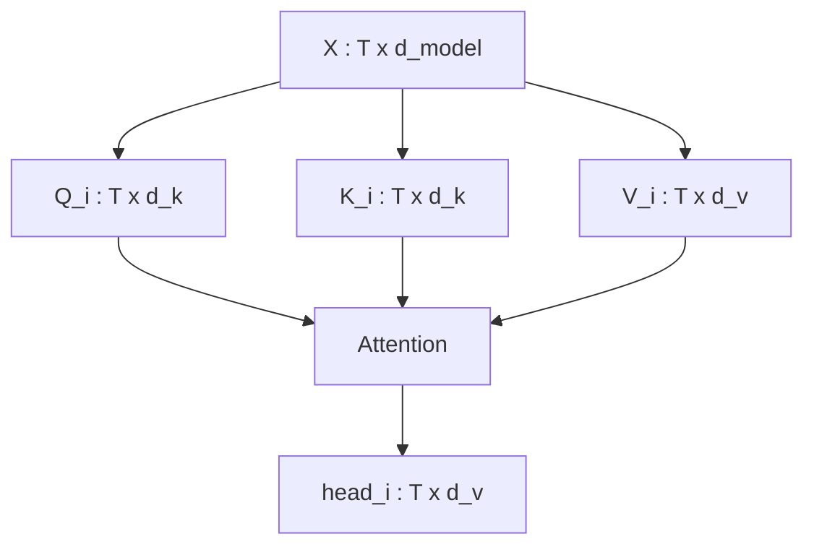

---

## 6.13 Dimensions après concaténation

Si nous avons $h$ têtes, et que chaque tête produit :

[  
head_i \in \mathbb{R}^{T \times d_v}  
]

alors la concaténation produit :

[  
Concat(head_1, ..., head_h) \in \mathbb{R}^{T \times h d_v}  
]

Dans le cas classique :

[  
h d_v = d_{model}  
]

Donc :

[  
Concat(head_1, ..., head_h) \in \mathbb{R}^{T \times d_{model}}  
]

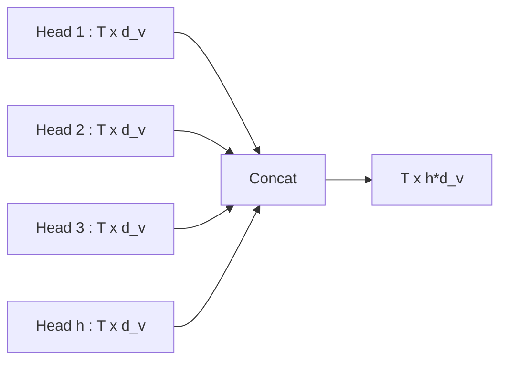

La concaténation rassemble les informations extraites par chaque tête.

---

## 6.14 La projection finale $W^O$

Après concaténation, nous appliquons une projection linéaire finale :

[  
W^O \in \mathbb{R}^{h d_v \times d_{model}}  
]

La sortie finale est :

[  
MultiHead(Q,K,V) = Concat(head_1, ..., head_h)W^O  
]

Cette projection permet de mélanger les informations provenant des différentes têtes.

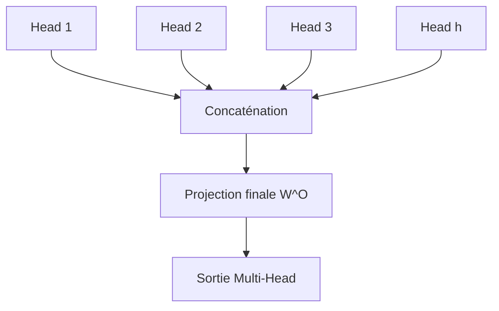

La projection $W^O$ est importante : elle ne se contente pas de remettre les dimensions au bon format, elle permet aussi au modèle de combiner les points de vue des têtes.

---

## 6.15 Schéma complet de la Multi-Head Attention

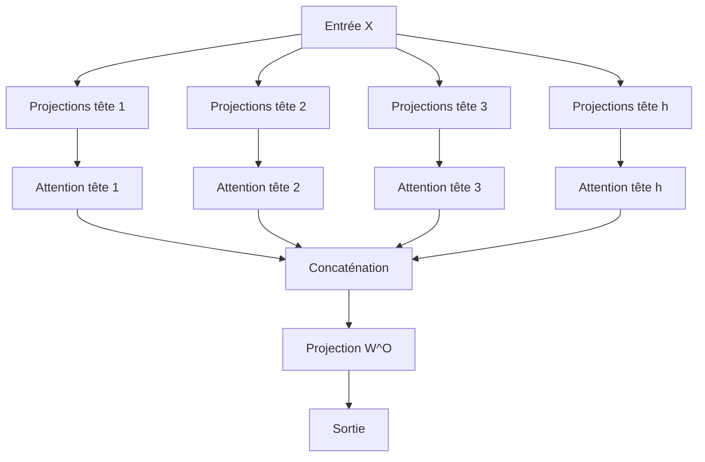

Ce schéma représente la structure générale de la multi-head attention.

---

## 6.16 Exemple conceptuel : plusieurs relations dans une phrase

Prenons :

```txt
Le chat que le chien poursuit dort.
```

Cette phrase contient une structure plus complexe.

Le mot `dort` doit être relié à `chat`.

Mais le mot le plus proche avant `dort` est `poursuit`, et un autre nom `chien` apparaît entre les deux.

Une tête peut apprendre une relation sujet-verbe longue :

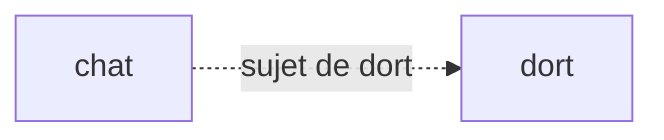

Une autre tête peut apprendre la structure de la subordonnée :

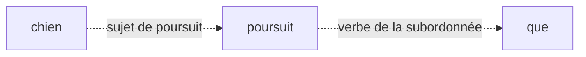

Une autre tête peut regarder les relations locales :

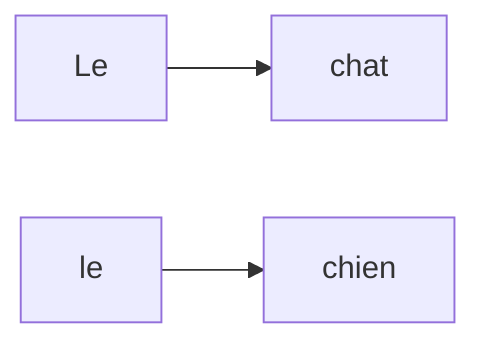

La Multi-Head Attention permet de représenter toutes ces relations en parallèle.

---

## 6.17 Une tête peut regarder localement

Certaines têtes peuvent apprendre à regarder les tokens proches.

C’est utile pour les relations locales :

- déterminant-nom ;
    
- adjectif-nom ;
    
- préposition-groupe nominal ;
    
- ponctuation ;
    
- parenthèses ;
    
- indentation en code.
    

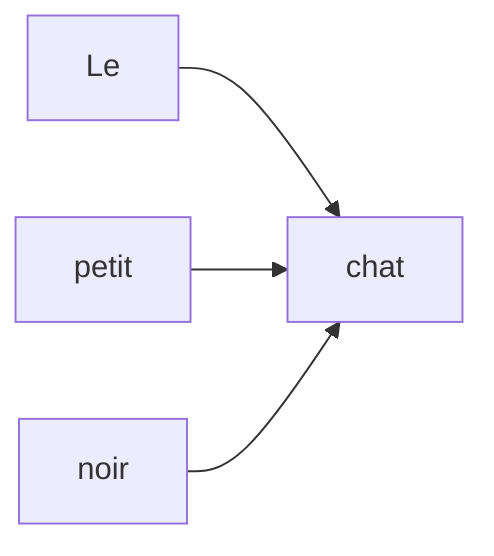

Ces relations locales sont très fréquentes et très utiles.

---

## 6.18 Une tête peut regarder loin

D’autres têtes peuvent apprendre à regarder des tokens éloignés.

Exemple :

```txt
Le livre que Marie a acheté hier dans une librairie ancienne est passionnant.
```

Ici, `livre` est lié à `est passionnant`.

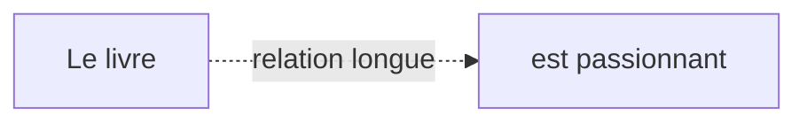

L’attention permet ce lien direct, même si de nombreux tokens se trouvent entre les deux.

---

## 6.19 Une tête peut suivre les références

Dans un texte, certains mots renvoient à d’autres.

Exemple :

```txt
Julie a prêté son vélo à Marie. Elle l’a rendu le lendemain.
```

`Elle` peut renvoyer à `Marie`.

`l’` peut renvoyer à `vélo`.

```mermaid
flowchart LR
    A["Marie"] -. "référence possible" .-> C["Elle"]
    B["vélo"] -. "référence" .-> D["l'"]
```

Une tête peut apprendre à capturer ce type de relation, surtout si cela aide la tâche d’entraînement.

---

## 6.20 Une tête peut structurer le code

Dans les modèles de code, les têtes d’attention peuvent aussi relier des éléments structurels.

Exemple :

```js
function add(a, b) {
  return a + b;
}
```

Relations possibles :

```mermaid
flowchart TD
    A["function"] --> B["add"]
    C["a paramètre"] -.-> D["a utilisé"]
    E["b paramètre"] -.-> F["b utilisé"]
    G["{"] -.-> H["}"]
    I["return"] --> J["a + b"]
```

Ces relations sont cruciales pour la compréhension et la génération de code.

---

## 6.21 Mais les têtes ne sont pas toujours interprétables

Il est tentant de dire :

> La tête 1 apprend la syntaxe, la tête 2 apprend les pronoms, la tête 3 apprend les dépendances longues.

Cette idée est utile pédagogiquement, mais elle est simplificatrice.

En réalité :

- certaines têtes sont difficiles à interpréter ;
    
- plusieurs têtes peuvent apprendre des comportements redondants ;
    
- certaines têtes peuvent être peu utiles ;
    
- les relations ne se répartissent pas toujours proprement ;
    
- l’information circule ensuite dans les couches suivantes.
    

```mermaid
flowchart TD
    A["Têtes d'attention"] --> B["Parfois spécialisées"]
    A --> C["Parfois redondantes"]
    A --> D["Parfois difficiles à interpréter"]
    A --> E["Pas une explication complète"]
```

Nous devons donc utiliser l’interprétation des têtes avec prudence.

---

## 6.22 Multi-Head Attention avec batch

En pratique, nous travaillons avec un batch.

L’entrée a la forme :

[  
X \in \mathbb{R}^{B \times T \times d_{model}}  
]

Après projection, nous obtenons souvent :

[  
Q \in \mathbb{R}^{B \times T \times d_{model}}  
]

[  
K \in \mathbb{R}^{B \times T \times d_{model}}  
]

[  
V \in \mathbb{R}^{B \times T \times d_{model}}  
]

Puis nous réorganisons les dimensions pour séparer les têtes :

[  
Q \in \mathbb{R}^{B \times h \times T \times d_k}  
]

[  
K \in \mathbb{R}^{B \times h \times T \times d_k}  
]

[  
V \in \mathbb{R}^{B \times h \times T \times d_v}  
]

```mermaid
flowchart TD
    A["B x T x d_model"] --> B["Projection Q,K,V"]
    B --> C["B x T x d_model"]
    C --> D["Reshape"]
    D --> E["B x h x T x d_k"]
```

Cette organisation permet de calculer toutes les têtes en parallèle.

---

## 6.23 Pourquoi reshape et transpose ?

Dans une implémentation, nous ne lançons pas vraiment $h$ attentions une par une avec des boucles Python.

Nous utilisons des opérations tensorisées.

Typiquement :

```txt
B x T x d_model
```

devient :

```txt
B x T x h x d_k
```

puis :

```txt
B x h x T x d_k
```

Pourquoi placer $h$ avant $T$ ?

Parce que cela facilite le calcul parallèle des matrices d’attention pour chaque tête.

```mermaid
flowchart LR
    A["B x T x d_model"] --> B["B x T x h x d_k"]
    B --> C["B x h x T x d_k"]
    C --> D["Attention par tête en parallèle"]
```

La tête devient une dimension du tenseur.

---

## 6.24 Calcul des scores avec plusieurs têtes

Avec plusieurs têtes :

[  
Q \in \mathbb{R}^{B \times h \times T \times d_k}  
]

[  
K \in \mathbb{R}^{B \times h \times T \times d_k}  
]

Nous calculons :

[  
Scores = QK^T  
]

La transposition se fait sur les deux dernières dimensions :

[  
K^T \in \mathbb{R}^{B \times h \times d_k \times T}  
]

Donc :

[  
Scores \in \mathbb{R}^{B \times h \times T \times T}  
]

```mermaid
flowchart TD
    Q["Q : B x h x T x d_k"] --> S["Scores"]
    K["K : B x h x T x d_k"] --> KT["K^T : B x h x d_k x T"]
    KT --> S
    S --> R["B x h x T x T"]
```

Nous avons donc une matrice d’attention par élément du batch et par tête.

---

## 6.25 Softmax par tête

Après scaling et éventuel masque, nous appliquons le softmax sur la dernière dimension.

Cela signifie :

> Pour chaque batch, pour chaque tête, pour chaque token, nous produisons une distribution sur les tokens regardés.

```mermaid
flowchart TD
    A["Scores : B x h x T x T"] --> B["Softmax sur la dernière dimension"]
    B --> C["Weights : B x h x T x T"]
```

Chaque ligne de chaque matrice d’attention somme à 1.

---

## 6.26 Multiplication par les Values

Les Values ont la forme :

[  
V \in \mathbb{R}^{B \times h \times T \times d_v}  
]

Les poids d’attention ont la forme :

[  
A \in \mathbb{R}^{B \times h \times T \times T}  
]

Nous calculons :

[  
A V  
]

La sortie a la forme :

[  
H \in \mathbb{R}^{B \times h \times T \times d_v}  
]

```mermaid
flowchart LR
    A["Weights : B x h x T x T"] --> O["Output heads"]
    V["V : B x h x T x d_v"] --> O
    O --> H["B x h x T x d_v"]
```

Nous avons maintenant une sortie pour chaque tête.

---

## 6.27 Recombiner les têtes

Après le calcul de l’attention, nous devons recombiner les têtes.

Nous passons de :

[  
B \times h \times T \times d_v  
]

à :

[  
B \times T \times h \times d_v  
]

puis nous concaténons :

[  
B \times T \times $h d_v$  
]

Si :

[  
h d_v = d_{model}  
]

alors :

[  
B \times T \times d_{model}  
]

```mermaid
flowchart LR
    A["B x h x T x d_v"] --> B["Transpose"]
    B --> C["B x T x h x d_v"]
    C --> D["Concat"]
    D --> E["B x T x d_model"]
```

Enfin, nous appliquons $W^O$.

---

## 6.28 Projection finale avec batch

La projection finale agit sur la dernière dimension.

Si la concaténation donne :

[  
Z \in \mathbb{R}^{B \times T \times d_{model}}  
]

et :

[  
W^O \in \mathbb{R}^{d_{model} \times d_{model}}  
]

alors :

[  
Y = ZW^O  
]

avec :

[  
Y \in \mathbb{R}^{B \times T \times d_{model}}  
]

```mermaid
flowchart TD
    A["Concat : B x T x d_model"] --> B["Projection W^O"]
    B --> C["Sortie : B x T x d_model"]
```

La sortie conserve donc la même forme que l’entrée.

C’est important pour empiler plusieurs blocs Transformer.

---

## 6.29 Pourquoi garder la même dimension en sortie ?

Un bloc Transformer reçoit généralement :

[  
B \times T \times d_{model}  
]

et produit :

[  
B \times T \times d_{model}  
]

Cela permet d’empiler les couches facilement.

```mermaid
flowchart TD
    A["Entrée : B x T x d_model"] --> B["Bloc Transformer 1"]
    B --> C["B x T x d_model"]
    C --> D["Bloc Transformer 2"]
    D --> E["B x T x d_model"]
    E --> F["Bloc Transformer 3"]
```

Si chaque couche changeait arbitrairement la dimension, l’architecture serait beaucoup plus difficile à construire.

---

## 6.30 Multi-Head Attention dans un bloc Transformer

Dans un bloc Transformer, la Multi-Head Attention n’est qu’une sous-couche.

Elle est généralement suivie :

- d’une connexion résiduelle ;
    
- d’une normalisation ;
    
- d’un feed-forward network ;
    
- d’une autre connexion résiduelle ;
    
- d’une autre normalisation.
    

```mermaid
flowchart TD
    X["Entrée"] --> MHA["Multi-Head Attention"]
    MHA --> ADD1["Add & Norm"]
    X --> ADD1
    ADD1 --> FFN["Feed-Forward Network"]
    FFN --> ADD2["Add & Norm"]
    ADD1 --> ADD2
    ADD2 --> Y["Sortie du bloc"]
```

Nous détaillerons ces composants dans les chapitres suivants.

---

## 6.31 Self-attention multi-têtes

Dans la self-attention multi-têtes, $Q$, $K$ et $V$ viennent de la même séquence.

```mermaid
flowchart TD
    X["Séquence X"] --> Q["Q"]
    X --> K["K"]
    X --> V["V"]

    Q --> MHA["Multi-Head Self-Attention"]
    K --> MHA
    V --> MHA
```

C’est le cas dans :

- l’encoder du Transformer ;
    
- le decoder avec masque causal ;
    
- les modèles BERT ;
    
- les modèles GPT.
    

La différence entre BERT et GPT ne vient pas du principe multi-têtes, mais du masque utilisé.

---

## 6.32 Cross-attention multi-têtes

Dans la cross-attention, $Q$ vient d’une séquence, tandis que $K$ et $V$ viennent d’une autre.

Dans un Transformer encoder-decoder :

- le decoder fournit les Queries ;
    
- l’encoder fournit les Keys et Values.
    

```mermaid
flowchart TD
    D["États du decoder"] --> Q["Queries"]
    E["Sorties de l'encoder"] --> K["Keys"]
    E --> V["Values"]

    Q --> MHA["Multi-Head Cross-Attention"]
    K --> MHA
    V --> MHA

    MHA --> O["Sortie decoder enrichie par la source"]
```

Cela permet au decoder de regarder la phrase source pendant qu’il génère la phrase cible.

---

## 6.33 Exemple en traduction

Prenons :

```txt
Source : The black cat sleeps.
Cible  : Le chat noir dort.
```

Pendant que le decoder génère `chat`, il peut regarder `cat`.

Pendant qu’il génère `noir`, il peut regarder `black`.

Pendant qu’il génère `dort`, il peut regarder `sleeps`.

```mermaid
flowchart LR
    A["The"] -.-> E["Le"]
    B["black"] -.-> G["noir"]
    C["cat"] -.-> F["chat"]
    D["sleeps"] -.-> H["dort"]
```

La cross-attention multi-têtes permet de capturer plusieurs alignements en parallèle.

Une tête peut capturer les correspondances lexicales.

Une autre peut capturer les réordonnancements.

Une autre peut capturer les accords ou relations grammaticales.

---

## 6.34 Multi-Head Attention et masque causal

Dans les modèles autoregressifs, la Multi-Head Attention est souvent combinée à un masque causal.

Cela empêche chaque position de regarder les positions futures.

```mermaid
flowchart TD
    A["Scores : B x h x T x T"] --> B["Masque causal"]
    B --> C["Scores futurs = -inf"]
    C --> D["Softmax"]
    D --> E["Poids causaux"]
```

Le masque est appliqué à chaque tête.

Ainsi, même avec plusieurs têtes, aucune tête ne peut tricher en regardant le futur.

---

## 6.35 Exemple de masque causal multi-têtes

Pour une séquence :

```txt
t1 t2 t3 t4
```

chaque tête reçoit le même type de contrainte :

|Token qui regarde|Peut regarder|
|---|---|
|t1|t1|
|t2|t1, t2|
|t3|t1, t2, t3|
|t4|t1, t2, t3, t4|

```mermaid
flowchart TD
    A["Tête 1"] --> M["Masque causal"]
    B["Tête 2"] --> M
    C["Tête 3"] --> M
    D["Tête h"] --> M

    M --> E["Aucun accès aux tokens futurs"]
```

Le masque ne supprime pas la diversité des têtes.

Il impose simplement une contrainte de visibilité.

---

## 6.36 Multi-Head Attention et positions

Les têtes d’attention utilisent les représentations qui contiennent déjà une information de position.

Selon les modèles, cette position peut venir :

- d’un positional encoding ajouté aux embeddings ;
    
- d’un positional embedding appris ;
    
- de RoPE ;
    
- d’ALiBi ;
    
- d’un biais relatif de position.
    

```mermaid
flowchart TD
    A["Token embeddings"] --> C["Entrée avec position"]
    B["Information de position"] --> C
    C --> D["Multi-Head Attention"]
    D --> E["Relations entre tokens positionnés"]
```

Sans position, les têtes sauraient quels tokens sont présents, mais auraient du mal à exploiter leur ordre.

---

## 6.37 Exemple d’interprétation pédagogique des têtes

Imaginons une phrase :

```txt
Le professeur corrige les copies que les étudiants ont rendues.
```

Nous pouvons imaginer plusieurs têtes :

|Tête|Relation possible|
|---|---|
|Tête 1|déterminant → nom|
|Tête 2|sujet → verbe|
|Tête 3|nom → proposition relative|
|Tête 4|verbe → objet|
|Tête 5|dépendance longue entre `copies` et `rendues`|

```mermaid
flowchart TD
    A["Tête 1"] --> B["Relations locales"]
    C["Tête 2"] --> D["Sujet-verbe"]
    E["Tête 3"] --> F["Propositions relatives"]
    G["Tête 4"] --> H["Verbe-objet"]
    I["Tête 5"] --> J["Dépendances longues"]
```

Encore une fois, c’est une interprétation utile pour apprendre, mais elle ne doit pas être prise comme une règle absolue.

---

## 6.38 Redondance entre têtes

Des recherches empiriques ont montré que certaines têtes peuvent être redondantes ou peu importantes dans certains modèles.

Cela signifie qu’un modèle peut parfois continuer à fonctionner même si certaines têtes sont supprimées ou simplifiées.

Pourquoi ?

Parce que :

- plusieurs têtes peuvent apprendre des choses proches ;
    
- les couches suivantes peuvent compenser ;
    
- certaines têtes peuvent être spécialisées dans des cas rares ;
    
- l’optimisation ne force pas une spécialisation parfaite.
    

```mermaid
flowchart TD
    A["Plusieurs têtes"] --> B["Diversité utile"]
    A --> C["Redondance possible"]
    A --> D["Certaines têtes moins importantes"]
```

Cela montre que la multi-head attention donne de la capacité au modèle, mais que cette capacité n’est pas toujours utilisée de manière parfaitement organisée.

---

## 6.39 Nombre de têtes : hyperparamètre important

Le nombre de têtes $h$ est un hyperparamètre du modèle.

Si nous utilisons trop peu de têtes, le modèle peut manquer de diversité relationnelle.

Si nous utilisons trop de têtes, chaque tête peut devenir trop petite si $d_{model}$ reste fixe.

Exemple :

[  
d_{model} = 512  
]

Si :

[  
h = 8  
]

alors :

[  
d_k = 64  
]

Si :

[  
h = 16  
]

alors :

[  
d_k = 32  
]

Si :

[  
h = 64  
]

alors :

[  
d_k = 8  
]

```mermaid
flowchart TD
    A["d_model fixe"] --> B["Plus de têtes"]
    B --> C["Dimension par tête plus petite"]
    C --> D["Moins de capacité par tête"]
```

Il faut donc équilibrer nombre de têtes et dimension par tête.

---

## 6.40 Exemple de configurations

Quelques configurations conceptuelles :

|(d_{model})|Nombre de têtes $h$|Dimension par tête $d_k$|
|--:|--:|--:|
|512|8|64|
|768|12|64|
|1024|16|64|
|4096|32|128|

La dimension par tête est souvent choisie pour rester suffisamment grande.

Une tête trop petite peut manquer de capacité pour représenter des relations riches.

---

## 6.41 Paramètres de la Multi-Head Attention

Dans une implémentation classique, nous pouvons projeter $X$ vers $Q$, $K$, $V$ avec trois grandes matrices :

[  
W_Q \in \mathbb{R}^{d_{model} \times d_{model}}  
]

[  
W_K \in \mathbb{R}^{d_{model} \times d_{model}}  
]

[  
W_V \in \mathbb{R}^{d_{model} \times d_{model}}  
]

Puis nous découpons chaque résultat en $h$ têtes.

Ensuite, nous appliquons :

[  
W^O \in \mathbb{R}^{d_{model} \times d_{model}}  
]

```mermaid
flowchart TD
    X["X"] --> WQ["Grande projection W_Q"]
    X --> WK["Grande projection W_K"]
    X --> WV["Grande projection W_V"]

    WQ --> SQ["Découpage en h têtes"]
    WK --> SK["Découpage en h têtes"]
    WV --> SV["Découpage en h têtes"]

    SQ --> A["Attention multi-têtes"]
    SK --> A
    SV --> A

    A --> WO["Projection W^O"]
```

Cette implémentation est plus efficace que créer explicitement une matrice séparée par tête dans le code.

Mathématiquement, c’est équivalent à plusieurs projections par tête.

---

## 6.42 Pseudo-code de la Multi-Head Attention

Voici un pseudo-code simplifié :

```python
def multi_head_attention(X, W_Q, W_K, W_V, W_O, num_heads, mask=None):
    B, T, d_model = X.shape
    d_k = d_model // num_heads

    Q = X @ W_Q
    K = X @ W_K
    V = X @ W_V

    Q = Q.reshape(B, T, num_heads, d_k).transpose(1, 2)
    K = K.reshape(B, T, num_heads, d_k).transpose(1, 2)
    V = V.reshape(B, T, num_heads, d_k).transpose(1, 2)

    scores = Q @ K.transpose(-2, -1)
    scores = scores / sqrt(d_k)

    if mask is not None:
        scores = scores.masked_fill(mask == 0, -inf)

    weights = softmax(scores, dim=-1)
    heads = weights @ V

    heads = heads.transpose(1, 2).reshape(B, T, d_model)

    output = heads @ W_O

    return output
```

Ce code résume les grandes étapes :

1. projection ;
    
2. séparation en têtes ;
    
3. attention par tête ;
    
4. concaténation ;
    
5. projection finale.
    

---

## 6.43 Version PyTorch simplifiée

En PyTorch, une version pédagogique pourrait ressembler à ceci :

```python
import torch
import math

def multi_head_attention(X, W_Q, W_K, W_V, W_O, num_heads, mask=None):
    B, T, d_model = X.shape
    d_k = d_model // num_heads

    Q = X @ W_Q
    K = X @ W_K
    V = X @ W_V

    Q = Q.view(B, T, num_heads, d_k).transpose(1, 2)
    K = K.view(B, T, num_heads, d_k).transpose(1, 2)
    V = V.view(B, T, num_heads, d_k).transpose(1, 2)

    scores = torch.matmul(Q, K.transpose(-2, -1)) / math.sqrt(d_k)

    if mask is not None:
        scores = scores.masked_fill(mask == 0, float("-inf"))

    weights = torch.softmax(scores, dim=-1)
    heads = torch.matmul(weights, V)

    heads = heads.transpose(1, 2).contiguous().view(B, T, d_model)

    output = heads @ W_O

    return output, weights
```

Cette version n’inclut pas encore :

- dropout ;
    
- biais ;
    
- optimisations mémoire ;
    
- FlashAttention ;
    
- gestion avancée des types ;
    
- KV cache pour génération.
    

Mais elle expose clairement la logique mathématique.

---

## 6.44 Pourquoi utiliser `.contiguous()` en PyTorch ?

Après une opération comme :

```python
transpose(1, 2)
```

le tenseur peut ne plus être stocké en mémoire de manière contiguë.

Avant d’utiliser :

```python
view(...)
```

il est souvent nécessaire d’appeler :

```python
contiguous()
```

Conceptuellement, ce n’est pas une opération mathématique du Transformer.

C’est une contrainte pratique liée à l’organisation mémoire des tenseurs dans PyTorch.

```mermaid
flowchart LR
    A["Transpose"] --> B["Mémoire non contiguë"]
    B --> C["contiguous()"]
    C --> D["view() possible"]
```

Ce type de détail devient important quand nous passons de la théorie à l’implémentation.

---

## 6.45 Multi-Head Attention et coût calculatoire

La Multi-Head Attention ne supprime pas le coût quadratique.

Pour chaque tête, nous avons une matrice :

[  
T \times T  
]

Avec $h$ têtes, nous avons :

[  
h \times T \times T  
]

scores.

Cependant, chaque tête travaille avec une dimension plus petite.

```mermaid
flowchart TD
    A["h têtes"] --> B["h matrices d'attention T x T"]
    B --> C["Coût mémoire attention"]
    B --> D["Coût calcul"]

    E["Dimension par tête réduite"] --> D
```

Le coût reste important pour les longues séquences.

C’est pourquoi les optimisations comme FlashAttention ou l’attention sparse sont devenues importantes.

---

## 6.46 Multi-Head Attention et mémoire

La mémoire nécessaire pour stocker les poids d’attention peut être très élevée.

La forme des poids est :

[  
B \times h \times T \times T  
]

Si :

[  
B = 8  
]

[  
h = 16  
]

[  
T = 4096  
]

alors le nombre de scores est :

[  
8 \times 16 \times 4096 \times 4096  
]

Ce qui est énorme.

```mermaid
flowchart TD
    A["B x h x T x T"] --> B["Mémoire importante"]
    B --> C["Limite pour longs contextes"]
```

La Multi-Head Attention est donc expressive, mais coûteuse.

---

## 6.47 Lien avec FlashAttention

FlashAttention est une optimisation qui permet de calculer l’attention de manière plus efficace en mémoire.

L’idée générale est de ne pas matérialiser toute la matrice d’attention en mémoire de manière naïve.

```mermaid
flowchart TD
    A["Attention standard"] --> B["Stocke grande matrice T x T"]
    C["FlashAttention"] --> D["Calcule par blocs"]
    D --> E["Réduit les accès mémoire"]
```

Nous détaillerons ce type d’optimisation dans le chapitre consacré à la complexité algorithmique.

Pour l’instant, retenons seulement que la multi-head attention classique peut devenir coûteuse sur de longues séquences.

---

## 6.48 Multi-Head Attention dans GPT

Dans un modèle GPT, nous utilisons une self-attention multi-têtes causale.

Chaque token peut regarder les tokens précédents, mais pas les tokens futurs.

```mermaid
flowchart TD
    X["Tokens précédents"] --> MHA["Masked Multi-Head Self-Attention"]
    MHA --> Y["Représentations contextualisées"]
    Y --> P["Prédiction du prochain token"]
```

La Multi-Head Attention permet au modèle de combiner :

- dépendances locales ;
    
- dépendances longues ;
    
- structure grammaticale ;
    
- références ;
    
- informations de style ;
    
- contexte de consigne.
    

---

## 6.49 Multi-Head Attention dans BERT

Dans un modèle BERT, nous utilisons une self-attention multi-têtes bidirectionnelle.

Chaque token peut regarder tous les autres tokens.

```mermaid
flowchart TD
    X["Séquence complète"] --> MHA["Multi-Head Self-Attention bidirectionnelle"]
    MHA --> Y["Représentations contextualisées"]
    Y --> Z["Classification / token masqué / extraction"]
```

Cela rend BERT très adapté aux tâches de compréhension du langage.

---

## 6.50 Multi-Head Attention dans le Transformer original

Dans le Transformer original, la Multi-Head Attention apparaît à trois endroits :

1. dans l’encoder ;
    
2. dans la masked self-attention du decoder ;
    
3. dans l’encoder-decoder attention du decoder.
    

```mermaid
flowchart TD
    A["Encoder"] --> B["Multi-Head Self-Attention"]

    C["Decoder"] --> D["Masked Multi-Head Self-Attention"]
    C --> E["Multi-Head Encoder-Decoder Attention"]

    A --> E
```

Nous détaillerons cette architecture complète dans le chapitre suivant.

---

## 6.51 Erreur fréquente : croire qu’une tête = un mot regardé

Une tête d’attention ne correspond pas à un seul mot regardé.

Une tête produit une distribution de poids pour chaque token.

Pour une séquence de longueur $T$, une tête produit une matrice :

[  
T \times T  
]

Chaque ligne est une distribution sur tous les tokens.

```mermaid
flowchart TD
    A["Une tête"] --> B["Matrice T x T"]
    B --> C["Une ligne par token"]
    C --> D["Une distribution sur les tokens regardés"]
```

Une tête ne regarde donc pas un seul endroit ; elle produit un ensemble de distributions.

---

## 6.52 Erreur fréquente : croire que plus de têtes signifie toujours meilleur modèle

Ajouter plus de têtes peut augmenter la capacité du modèle, mais ce n’est pas toujours bénéfique.

Si $d_{model}$ reste fixe, augmenter le nombre de têtes réduit la dimension par tête.

Une tête trop petite peut perdre en expressivité.

```mermaid
flowchart TD
    A["Plus de têtes"] --> B["Plus de points de vue"]
    A --> C["Mais dimension par tête plus petite"]
    C --> D["Capacité par tête réduite"]
```

Il faut donc choisir le nombre de têtes en cohérence avec $d_{model}$.

---

## 6.53 Erreur fréquente : oublier la projection finale

Après avoir concaténé les têtes, nous ne nous arrêtons pas là.

Nous appliquons une projection finale $W^O$.

Cette projection permet de mélanger les informations entre têtes.

```mermaid
flowchart LR
    A["Concat(heads)"] --> B["Projection W^O"]
    B --> C["Sortie finale"]
```

Sans cette projection, les informations resteraient simplement juxtaposées.

La projection finale apprend à les recombiner.

---

## 6.54 Erreur fréquente : penser que les têtes sont indépendantes jusqu’à la fin du modèle

Les têtes sont calculées séparément dans la sous-couche d’attention, mais leurs résultats sont ensuite concaténés puis mélangés par $W^O$.

Ensuite, les couches suivantes continuent de mélanger l’information.

```mermaid
flowchart TD
    A["Têtes séparées"] --> B["Concaténation"]
    B --> C["Projection W^O"]
    C --> D["Mélange des têtes"]
    D --> E["Couches suivantes"]
```

Les têtes ne restent donc pas isolées dans tout le modèle.

---

## 6.55 Synthèse mathématique

Nous pouvons résumer la Multi-Head Attention ainsi.

Pour chaque tête $i$ :

[  
head_i = Attention(XW_i^Q, XW_i^K, XW_i^V)  
]

Puis :

[  
MultiHead(X) = Concat(head_1, ..., head_h)W^O  
]

Avec :

[  
Attention(Q,K,V) = softmax\left(\frac{QK^T}{\sqrt{d_k}}\right)V  
]

Dans le cas courant :

[  
d_k = d_v = \frac{d_{model}}{h}  
]

et la sortie finale garde la forme :

[  
B \times T \times d_{model}  
]

---

## 6.56 Schéma global de synthèse

```mermaid
flowchart TD
    X["Entrée X : B x T x d_model"] --> QKV["Projections Q,K,V"]

    QKV --> R["Reshape : B x h x T x d_k"]

    R --> H1["Head 1 : attention"]
    R --> H2["Head 2 : attention"]
    R --> H3["Head ..."]
    R --> Hh["Head h : attention"]

    H1 --> C["Concaténation des têtes"]
    H2 --> C
    H3 --> C
    Hh --> C

    C --> WO["Projection finale W^O"]
    WO --> Y["Sortie : B x T x d_model"]
```

Ce schéma résume la structure complète du mécanisme.

---

## 6.57 Résumé du chapitre

Nous avons vu que la Multi-Head Attention généralise la Scaled Dot-Product Attention en calculant plusieurs attentions en parallèle.

Chaque tête possède ses propres projections $Q$, $K$, $V$, ce qui lui permet de travailler dans un sous-espace différent.

Les sorties des têtes sont concaténées, puis mélangées par une projection finale $W^O$.

Nous avons compris que plusieurs têtes permettent au modèle de capturer plusieurs types de relations :

- relations locales ;
    
- relations longues ;
    
- relations syntaxiques ;
    
- relations sémantiques ;
    
- références ;
    
- structures de code ;
    
- alignements entre source et cible.
    

Nous avons aussi insisté sur les limites de l’interprétation :

> Une tête n’est pas toujours spécialisée de manière claire, et les poids d’attention ne constituent pas une explication complète du comportement du modèle.

Enfin, nous avons étudié les dimensions typiques :

[  
B \times T \times d_{model}  
]

devient :

[  
B \times h \times T \times d_k  
]

puis revient à :

[  
B \times T \times d_{model}  
]

après concaténation et projection finale.

---

## 6.58 Questions de compréhension

### 6.58.1 Question 1

Pourquoi une seule tête d’attention peut-elle être insuffisante ?

Réponse attendue : parce qu’une séquence contient plusieurs types de relations, et une seule tête doit tout représenter dans un seul espace.

### 6.58.2 Question 2

Quelle est l’idée principale de la Multi-Head Attention ?

Réponse attendue : calculer plusieurs attentions en parallèle pour capturer différents types de relations entre tokens.

### 6.58.3 Question 3

Quelle est la formule générale de la Multi-Head Attention ?

Réponse attendue :

[  
MultiHead(Q,K,V) = Concat(head_1, ..., head_h)W^O  
]

avec :

[  
head_i = Attention(QW_i^Q, KW_i^K, VW_i^V)  
]

### 6.58.4 Question 4

Dans le Transformer original, si (d_{model}=512) et (h=8), quelle est la dimension par tête ?

Réponse attendue :

[  
d_k = d_v = 64  
]

### 6.58.5 Question 5

Pourquoi concatène-t-on les têtes ?

Réponse attendue : pour rassembler les informations extraites par chaque tête dans une représentation commune.

### 6.58.6 Question 6

À quoi sert la projection finale $W^O$ ?

Réponse attendue : elle mélange les informations issues des différentes têtes et produit une sortie dans la dimension $d_{model}$.

### 6.58.7 Question 7

Quelle est la forme des scores d’attention avec batch et plusieurs têtes ?

Réponse attendue :

[  
B \times h \times T \times T  
]

### 6.58.8 Question 8

Pourquoi faut-il être prudent dans l’interprétation des têtes ?

Réponse attendue : parce que les têtes ne sont pas toujours clairement spécialisées, certaines peuvent être redondantes ou difficiles à interpréter.

### 6.58.9 Question 9

Quelle est la différence entre self-attention multi-têtes et cross-attention multi-têtes ?

Réponse attendue : en self-attention, $Q$, $K$, $V$ viennent de la même séquence ; en cross-attention, $Q$ vient d’une séquence et (K,V) viennent d’une autre.

### 6.58.10 Question 10

Pourquoi le nombre de têtes est-il un hyperparamètre important ?

Réponse attendue : parce qu’il contrôle le compromis entre diversité des relations apprises et dimension disponible pour chaque tête.

---

## 6.59 Transition vers le chapitre 7

Nous comprenons maintenant les deux briques centrales du Transformer :

1. la **Scaled Dot-Product Attention** ;
    
2. la **Multi-Head Attention**.
    

Nous pouvons maintenant assembler ces briques dans l’architecture complète du Transformer original.

Dans le chapitre suivant, nous étudierons l’architecture **encoder-decoder** proposée dans le papier **Attention Is All You Need**.

Nous verrons :

- le rôle de l’encoder ;
    
- le rôle du decoder ;
    
- la self-attention dans l’encoder ;
    
- la masked self-attention dans le decoder ;
    
- l’encoder-decoder attention ;
    
- l’empilement des couches ;
    
- le lien avec la traduction automatique.
    

Nous passerons donc du mécanisme local d’attention à l’architecture complète du Transformer.

---
> [!info] Livre « Les transformers » — chapitre 6/30
> [[Les transformers — Sommaire|Sommaire]] · [[Les transformers — 05 — Scaled Dot-Product Attention|← 05 — Scaled Dot-Product Attention]] · [[Les transformers — 07 — Architecture Encoder-Decoder du Transformer original|07 — Architecture Encoder-Decoder du Transformer original →]]
