> [!info] Livre « Les transformers » — chapitre 7/30
> [[Les transformers — Sommaire|Sommaire]] · [[Les transformers — 06 — Multi-Head Attention|← 06 — Multi-Head Attention]] · [[Les transformers — 08 — Bloc Encoder en détail|08 — Bloc Encoder en détail →]]

# Chapitre 7 — Architecture Encoder-Decoder du Transformer original
## 7.1 Objectif du chapitre

Dans les chapitres précédents, nous avons construit les briques fondamentales du Transformer :

- les embeddings ;
    
- les encodages de position ;
    
- la Scaled Dot-Product Attention ;
    
- la Multi-Head Attention.
    

Nous pouvons maintenant assembler ces briques pour comprendre l’architecture complète proposée dans le papier **Attention Is All You Need**.

Ce chapitre correspond à l’étape prévue dans notre plan : nous allons étudier le rôle de l’encoder, le rôle du decoder, l’empilement de plusieurs couches, la self-attention dans l’encoder, la masked self-attention dans le decoder, l’encoder-decoder attention et le lien avec les tâches de traduction.

L’objectif est de comprendre la structure globale suivante :

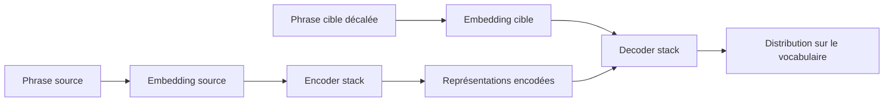

Nous allons donc passer d’une vision locale :

```txt
une attention entre tokens
```

à une vision architecturale complète :

```txt
un modèle capable de transformer une séquence source en séquence cible
```

---

## 7.2 Le Transformer original : une architecture de traduction

Le Transformer original a été conçu principalement pour la **traduction automatique**.

Le problème est le suivant :

> Nous recevons une phrase dans une langue source, et nous devons produire une phrase dans une langue cible.

Exemple :

```txt
Source : The black cat sleeps on the sofa.
Cible  : Le chat noir dort sur le canapé.
```

Nous avons donc deux séquences :

- une séquence d’entrée, appelée **source** ;
    
- une séquence de sortie, appelée **cible**.
    

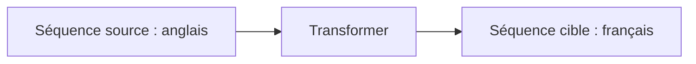

Le Transformer original n’est donc pas uniquement un modèle qui lit une phrase.

C’est un modèle qui lit une séquence, en construit une représentation, puis génère une autre séquence.

---

## 7.3 Pourquoi une architecture encoder-decoder ?

Pour traduire une phrase, nous devons faire deux choses différentes.

D’abord, nous devons **comprendre** la phrase source.

Ensuite, nous devons **produire** une phrase cible.

Ces deux opérations sont liées, mais elles ne sont pas identiques.

C’est pour cela que l’architecture est séparée en deux grandes parties :

|Partie|Rôle|
|---|---|
|Encoder|Lire et représenter la séquence source|
|Decoder|Générer la séquence cible en utilisant la représentation source|

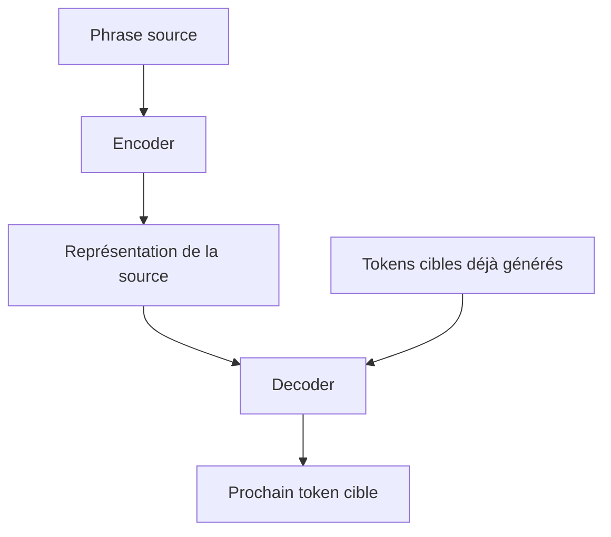

L’encoder construit une mémoire riche de la phrase source.

Le decoder utilise cette mémoire pour produire la traduction progressivement.

---

## 7.4 Vue globale de l’architecture

L’architecture complète du Transformer original peut être représentée ainsi :

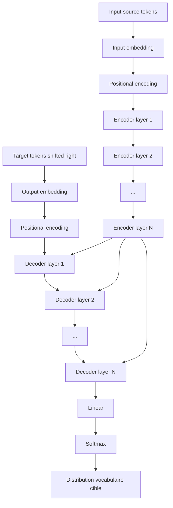

Dans le papier original, l’encoder et le decoder sont chacun composés de **N = 6 couches**.

Cela signifie :

```txt
Encoder : 6 blocs empilés
Decoder : 6 blocs empilés
```

Nous détaillerons les blocs encoder et decoder dans les chapitres suivants, mais nous allons déjà comprendre leur rôle global.

---

## 7.5 L’entrée source

La phrase source est d’abord tokenisée.

Exemple :

```txt
The black cat sleeps.
```

peut devenir :

```txt
["The", "black", "cat", "sleeps", "."]
```

Puis chaque token est converti en ID :

```txt
[42, 918, 135, 4412, 9]
```

Ensuite, chaque ID est transformé en embedding :

```txt
[
  embedding("The"),
  embedding("black"),
  embedding("cat"),
  embedding("sleeps"),
  embedding(".")
]
```

Puis nous ajoutons l’information de position.

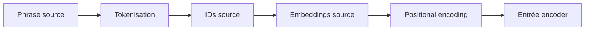

L’entrée de l’encoder est donc une séquence de vecteurs positionnés.

---

## 7.6 L’entrée cible pendant l’entraînement

Pendant l’entraînement, nous connaissons la phrase cible correcte.

Exemple :

```txt
Le chat noir dort.
```

Mais le decoder ne reçoit pas directement toute la phrase cible telle quelle.

Il reçoit une version **décalée vers la droite**.

Cela signifie que pour prédire un token, il reçoit les tokens précédents.

Par exemple :

```txt
Cible réelle :
Le chat noir dort .

Entrée du decoder :
<BOS> Le chat noir dort
```

Sortie attendue :

```txt
Le chat noir dort .
```

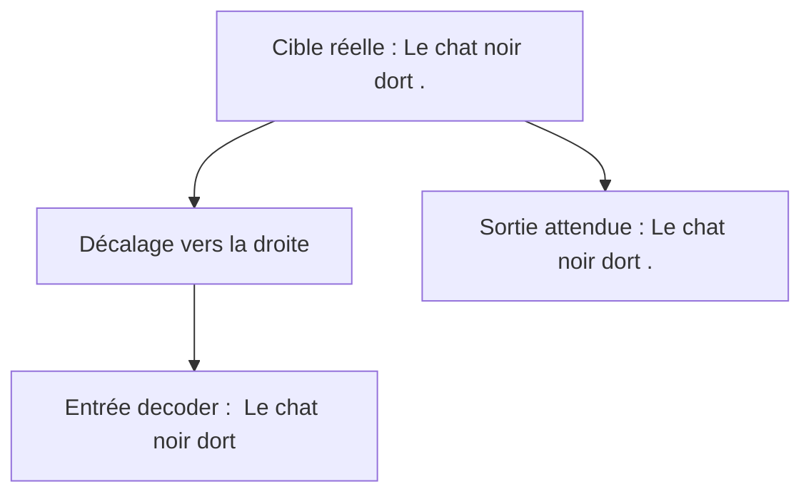

Le token `<BOS>` signifie **beginning of sequence**, c’est-à-dire début de séquence.

Ce décalage permet au modèle d’apprendre à prédire le prochain token à partir des tokens précédents.

---

## 7.7 Pourquoi décaler la cible ?

Le decoder est entraîné à générer une séquence de gauche à droite.

À chaque position, il doit prédire le token suivant.

Exemple :

|Entrée decoder visible|Token à prédire|
|---|---|
|`<BOS>`|`Le`|
|`<BOS> Le`|`chat`|
|`<BOS> Le chat`|`noir`|
|`<BOS> Le chat noir`|`dort`|
|`<BOS> Le chat noir dort`|`.`|

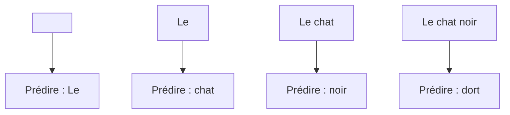

Nous appelons cela une génération **autoregressive** :

> Chaque nouveau token est prédit à partir des tokens précédents.

Pendant l’entraînement, cette technique permet de calculer toutes les prédictions en parallèle, tout en empêchant le modèle de regarder les tokens futurs grâce au masque causal.

---

## 7.8 L’encoder : rôle général

L’encoder reçoit la séquence source complète.

Son rôle est de produire une représentation contextualisée de chaque token source.

Si la source est :

```txt
The black cat sleeps.
```

l’encoder produit une représentation pour :

- `The` ;
    
- `black` ;
    
- `cat` ;
    
- `sleeps` ;
    
- `.`.
    

Mais ces représentations ne sont pas de simples embeddings.

Chaque vecteur est enrichi par le contexte complet de la phrase source.

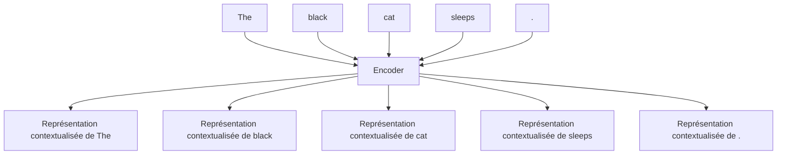

L’encoder construit donc une sorte de mémoire structurée de la phrase source.

---

## 7.9 Self-attention dans l’encoder

Chaque couche encoder contient une **Multi-Head Self-Attention**.

Cela signifie que les tokens source se regardent entre eux.

Dans l’encoder, l’attention est généralement **bidirectionnelle** : chaque token peut regarder les tokens avant et après lui.

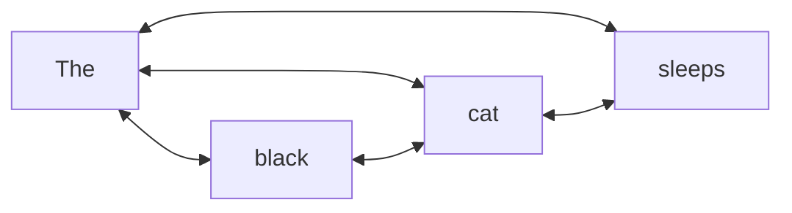

Cela est possible parce que la phrase source est connue entièrement dès le départ.

L’encoder ne génère pas de texte token par token.

Il lit toute la phrase source.

Donc il peut utiliser le contexte gauche et le contexte droit.

---

## 7.10 Exemple : contextualisation dans l’encoder

Prenons la phrase source :

```txt
The bank is near the river.
```

Le mot `bank` est ambigu.

Il peut signifier :

- une banque financière ;
    
- une berge de rivière.
    

Grâce à la self-attention, le token `bank` peut regarder `river`.

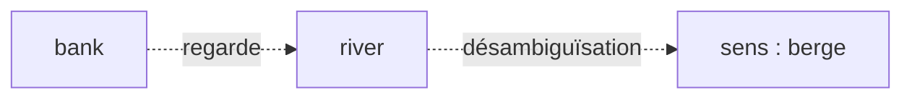

La représentation finale de `bank` dans l’encoder sera donc influencée par `river`.

Ce n’est plus seulement une représentation du mot `bank`.

C’est une représentation de `bank dans ce contexte précis`.

---

## 7.11 Structure d’une couche encoder

Une couche encoder contient principalement deux sous-couches :

1. une multi-head self-attention ;
    
2. un feed-forward network appliqué position par position.
    

Chaque sous-couche est entourée par :

- une connexion résiduelle ;
    
- une normalisation.
    

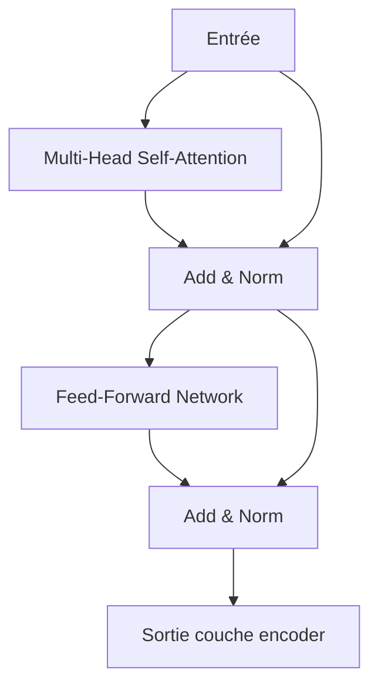

Nous détaillerons cette couche dans le chapitre 8.

Pour l’instant, retenons :

> L’encoder alterne mélange d’informations entre tokens et transformation non linéaire de chaque token.

---

## 7.12 Empilement des couches encoder

Le Transformer original empile plusieurs couches encoder.

Dans le papier original, il y en a 6.

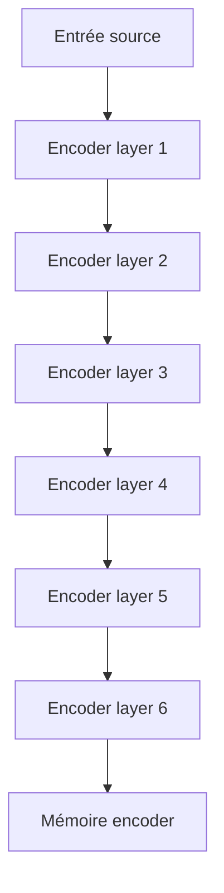

Chaque couche affine les représentations.

Les premières couches peuvent capturer des relations relativement locales.

Les couches plus profondes peuvent construire des représentations plus abstraites.

Mais cette interprétation reste pédagogique : en pratique, les comportements des couches peuvent être plus complexes.

---

## 7.13 La sortie de l’encoder

La sortie finale de l’encoder est une séquence de vecteurs.

Si la phrase source contient $T_s$ tokens, la sortie a la forme :

[  
B \times T_s \times d_{model}  
]

où :

- $B$ est la taille du batch ;
    
- $T_s$ est la longueur de la séquence source ;
    
- $d_{model}$ est la dimension du modèle.
    

Cette sortie contient une représentation contextualisée de chaque token source.

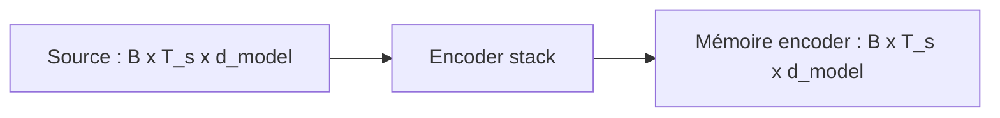

Nous appelons parfois cette sortie la **mémoire de l’encoder**, car le decoder va venir y chercher de l’information.

---

## 7.14 Le decoder : rôle général

Le decoder génère la séquence cible.

Il reçoit deux sources d’information :

1. les tokens cibles déjà disponibles ;
    
2. la sortie de l’encoder.
    

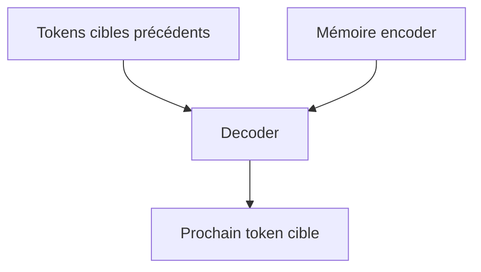

Par exemple, pour traduire :

```txt
The black cat sleeps.
```

si le decoder a déjà généré :

```txt
Le chat noir
```

il doit prédire :

```txt
dort
```

Pour cela, il utilise :

- le début de phrase cible : `Le chat noir` ;
    
- la mémoire source : `The black cat sleeps`.
    

---

## 7.15 Le decoder génère token par token

En inférence, c’est-à-dire quand nous utilisons le modèle pour traduire une nouvelle phrase, le decoder génère un token à la fois.

Exemple :

```txt
Étape 1 : <BOS> → Le
Étape 2 : <BOS> Le → chat
Étape 3 : <BOS> Le chat → noir
Étape 4 : <BOS> Le chat noir → dort
Étape 5 : <BOS> Le chat noir dort → .
Étape 6 : <BOS> Le chat noir dort . → <EOS>
```

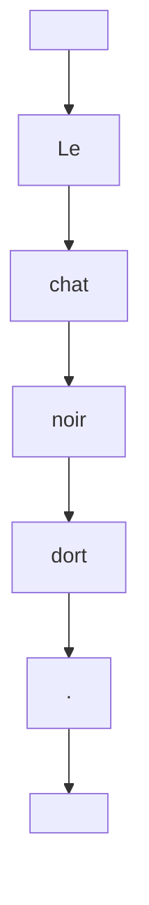

Le token `<EOS>` indique la fin de séquence.

---

## 7.16 Structure d’une couche decoder

Une couche decoder est plus complexe qu’une couche encoder.

Elle contient trois sous-couches principales :

1. masked multi-head self-attention ;
    
2. encoder-decoder attention ;
    
3. feed-forward network.
    

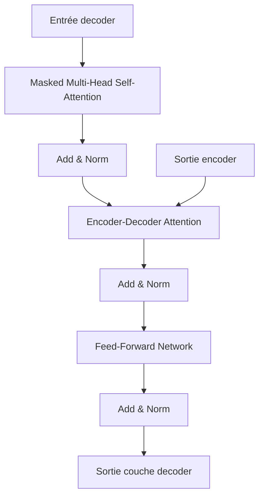

Nous détaillerons le decoder au chapitre 9.

Mais nous pouvons déjà comprendre le rôle de chaque sous-couche.

---

## 7.17 Première sous-couche decoder : masked self-attention

La première sous-couche du decoder est une self-attention sur les tokens cibles.

Mais elle est **masquée**.

Cela signifie que le token à la position $i$ ne peut pas regarder les tokens futurs.

Exemple :

```txt
Le chat noir dort
```

Quand le modèle prédit `noir`, il ne doit pas voir `dort`.

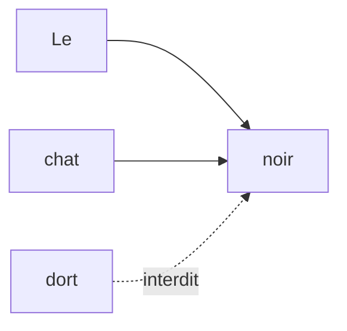

Cette contrainte est essentielle.

Sans elle, le modèle pourrait tricher pendant l’entraînement en regardant directement la réponse future.

---

## 7.18 Masque causal dans le decoder

Le masque causal a une forme triangulaire.

Pour une séquence cible :

```txt
t1 t2 t3 t4
```

les autorisations sont :

|Token qui regarde|t1|t2|t3|t4|
|---|--:|--:|--:|--:|
|t1|oui|non|non|non|
|t2|oui|oui|non|non|
|t3|oui|oui|oui|non|
|t4|oui|oui|oui|oui|

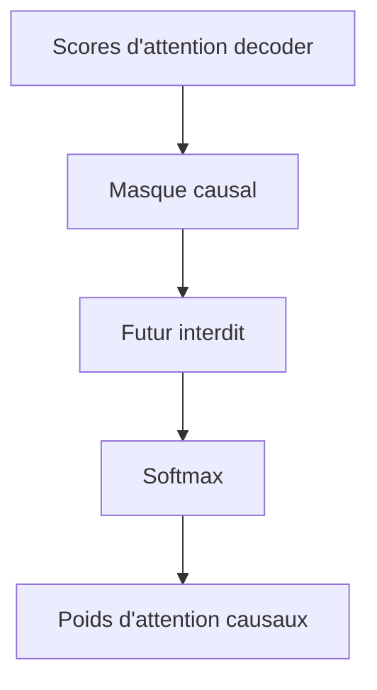

Nous verrons les masques en détail au chapitre 10.

Pour l’instant, retenons :

> Le masque causal impose une génération de gauche à droite.

---

## 7.19 Deuxième sous-couche decoder : encoder-decoder attention

La deuxième sous-couche du decoder est l’**encoder-decoder attention**, aussi appelée **cross-attention**.

Ici, le decoder regarde la sortie de l’encoder.

Cela permet au modèle de relier les tokens cibles aux tokens sources.

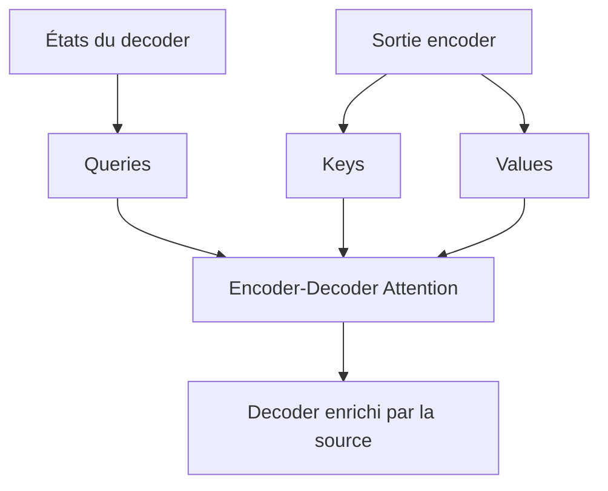

Dans cette attention :

- les Queries viennent du decoder ;
    
- les Keys viennent de l’encoder ;
    
- les Values viennent de l’encoder.
    

C’est une distinction fondamentale.

---

## 7.20 Exemple de cross-attention en traduction

Prenons :

```txt
Source : The black cat sleeps.
Cible  : Le chat noir dort.
```

Quand le decoder génère `chat`, il peut regarder le token source `cat`.

Quand il génère `noir`, il peut regarder `black`.

Quand il génère `dort`, il peut regarder `sleeps`.

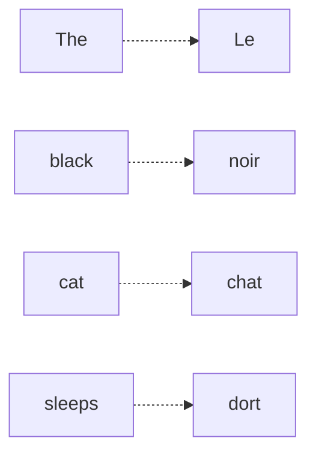

La cross-attention construit donc un alignement souple entre la séquence cible en cours de génération et la séquence source encodée.

---

## 7.21 Pourquoi le decoder a besoin de l’encoder ?

Sans encoder, le decoder pourrait seulement produire une phrase plausible dans la langue cible.

Mais il ne saurait pas quoi traduire.

L’encoder fournit le contenu source.

Le decoder fournit la génération cible.

```mermaid
flowchart TD
    A["Encoder"] --> B["Que faut-il traduire ?"]
    C["Decoder"] --> D["Comment le formuler dans la langue cible ?"]
    B --> E["Traduction correcte"]
    D --> E
```

Nous pouvons voir le decoder comme un générateur conditionné par la mémoire de l’encoder.

---

## 7.22 Troisième sous-couche decoder : feed-forward network

Après les deux attentions, chaque position passe dans un feed-forward network.

Ce réseau est appliqué indépendamment à chaque token.

Il permet d’ajouter de la capacité non linéaire.

```mermaid
flowchart LR
    X["Vecteur token"] --> L1["Linear d_model -> d_ff"]
    L1 --> A["Activation"]
    A --> L2["Linear d_ff -> d_model"]
    L2 --> Y["Vecteur transformé"]
```

L’attention mélange l’information entre tokens.

Le feed-forward transforme chaque représentation individuellement.

Ces deux opérations sont complémentaires.

---

## 7.23 Empilement des couches decoder

Comme l’encoder, le decoder est empilé en plusieurs couches.

Dans le Transformer original, il y a aussi 6 couches decoder.

```mermaid
flowchart TD
    X["Entrée cible décalée"] --> D1["Decoder layer 1"]
    D1 --> D2["Decoder layer 2"]
    D2 --> D3["Decoder layer 3"]
    D3 --> D4["Decoder layer 4"]
    D4 --> D5["Decoder layer 5"]
    D5 --> D6["Decoder layer 6"]
    D6 --> O["Sortie decoder"]
```

Chaque couche decoder peut :

- mieux structurer la séquence cible ;
    
- mieux exploiter la mémoire source ;
    
- raffiner les représentations ;
    
- améliorer la prédiction du prochain token.
    

---

## 7.24 Comment l’encoder et le decoder communiquent

L’encoder communique avec le decoder via la cross-attention.

La sortie de l’encoder est fournie à chaque couche decoder dans sa sous-couche encoder-decoder attention.

```mermaid
flowchart TD
    E1["Encoder layer 1"] --> E2["Encoder layer 2"]
    E2 --> E3["..."]
    E3 --> EN["Encoder final output"]

    D1["Decoder layer 1"] --> D2["Decoder layer 2"]
    D2 --> D3["..."]
    D3 --> DN["Decoder final output"]

    EN --> D1
    EN --> D2
    EN --> DN
```

La mémoire de l’encoder reste disponible tout au long de la génération.

---

## 7.25 Différence entre self-attention et encoder-decoder attention

Nous pouvons résumer la différence ainsi :

|Type d’attention|Queries|Keys|Values|Rôle|
|---|---|---|---|---|
|Encoder self-attention|Source|Source|Source|Contextualiser la source|
|Decoder masked self-attention|Cible|Cible|Cible|Contextualiser les tokens cibles précédents|
|Encoder-decoder attention|Cible|Source|Source|Relier la cible à la source|

```mermaid
flowchart TD
    A["Encoder self-attention"] --> B["Source regarde source"]
    C["Decoder masked self-attention"] --> D["Cible regarde cible passée"]
    E["Encoder-decoder attention"] --> F["Cible regarde source"]
```

Cette table est fondamentale pour comprendre le Transformer original.

---

## 7.26 Sortie du decoder

La sortie finale du decoder est une séquence de vecteurs.

Si la séquence cible a une longueur $T_t$, la sortie a la forme :

[  
B \times T_t \times d_{model}  
]

Chaque vecteur correspond à une position cible.

Mais ces vecteurs ne sont pas encore des tokens.

Nous devons les transformer en scores sur le vocabulaire cible.

```mermaid
flowchart LR
    A["Sortie decoder : B x T_t x d_model"] --> B["Projection linéaire"]
    B --> C["Scores vocabulaire"]
    C --> D["Softmax"]
    D --> E["Probabilités tokens"]
```

C’est le rôle de la couche linéaire finale et du softmax.

---

## 7.27 Projection vers le vocabulaire

Supposons que le vocabulaire cible ait une taille :

[  
V  
]

La couche linéaire finale projette chaque vecteur de dimension $d_{model}$ vers un vecteur de dimension $V$.

[  
logits = YW_{vocab}  
]

avec :

[  
Y \in \mathbb{R}^{B \times T_t \times d_{model}}  
]

et :

[  
W_{vocab} \in \mathbb{R}^{d_{model} \times V}  
]

Donc :

[  
logits \in \mathbb{R}^{B \times T_t \times V}  
]

```mermaid
flowchart TD
    A["Vecteur decoder : d_model"] --> B["Linear d_model -> V"]
    B --> C["Logits vocabulaire"]
    C --> D["Softmax"]
    D --> E["Distribution sur les tokens"]
```

Le modèle produit donc, pour chaque position, une distribution de probabilité sur tous les tokens possibles.

---

## 7.28 Logits, softmax et prédiction

Les **logits** sont des scores bruts.

Ils ne sont pas encore des probabilités.

Le softmax transforme ces logits en probabilités.

Exemple simplifié :

|Token|Logit|Probabilité|
|---|--:|--:|
|`Le`|1.2|0.15|
|`chat`|4.8|0.72|
|`noir`|0.7|0.09|
|`dort`|-0.2|0.04|

Le token avec la probabilité la plus élevée peut être choisi comme prédiction.

```mermaid
flowchart LR
    A["Logits"] --> B["Softmax"]
    B --> C["Probabilités"]
    C --> D["Choix du token"]
```

Pendant l’entraînement, nous comparons cette distribution avec le token cible réel.

---

## 7.29 Entraînement : prédire tous les tokens cibles

Pendant l’entraînement, grâce au décalage de la cible et au masque causal, le Transformer peut prédire tous les tokens cibles en parallèle.

Exemple :

```txt
Entrée decoder :
<BOS> Le chat noir dort

Sortie attendue :
Le chat noir dort .
```

Le modèle produit une distribution pour chaque position.

```mermaid
flowchart TD
    A["<BOS>"] --> P1["Prédire Le"]
    B["Le"] --> P2["Prédire chat"]
    C["chat"] --> P3["Prédire noir"]
    D["noir"] --> P4["Prédire dort"]
    E["dort"] --> P5["Prédire ."]
```

Nous calculons ensuite une loss, souvent une cross-entropy, entre les distributions prédites et les tokens réels.

---

## 7.30 Inférence : générer progressivement

En inférence, nous ne connaissons pas la phrase cible à l’avance.

Nous devons la générer progressivement.

Le processus est :

1. encoder la phrase source ;
    
2. initialiser le decoder avec `<BOS>` ;
    
3. prédire le prochain token ;
    
4. ajouter ce token à l’entrée du decoder ;
    
5. recommencer jusqu’à `<EOS>` ou une longueur maximale.
    

```mermaid
flowchart TD
    A["Phrase source"] --> B["Encoder"]
    B --> C["Mémoire source"]

    D["<BOS>"] --> E["Decoder"]
    C --> E
    E --> F["Token prédit"]
    F --> G["Ajout à la séquence cible"]
    G --> E
```

Cette génération peut utiliser plusieurs stratégies :

- greedy decoding ;
    
- beam search ;
    
- sampling ;
    
- top-k ;
    
- top-p.
    

Ces stratégies seront évoquées plus tard dans le cours.

---

## 7.31 Exemple complet de traduction

Prenons une traduction simple.

Source :

```txt
The cat sleeps.
```

Cible attendue :

```txt
Le chat dort.
```

### Étape encoder

```mermaid
flowchart LR
    A["The"] --> E["Encoder"]
    B["cat"] --> E
    C["sleeps"] --> E
    D["."] --> E

    E --> M["Mémoire source"]
```

L’encoder produit une mémoire contenant les représentations contextualisées de la phrase source.

### Étape decoder

```mermaid
flowchart TD
    M["Mémoire source"] --> D1["Decoder avec <BOS>"]
    D1 --> T1["Prédit : Le"]

    T1 --> D2["Decoder avec <BOS> Le"]
    M --> D2
    D2 --> T2["Prédit : chat"]

    T2 --> D3["Decoder avec <BOS> Le chat"]
    M --> D3
    D3 --> T3["Prédit : dort"]

    T3 --> D4["Decoder avec <BOS> Le chat dort"]
    M --> D4
    D4 --> T4["Prédit : ."]
```

Le decoder produit la phrase cible token par token.

---

## 7.32 Pourquoi le Transformer original n’est pas un GPT

Il est important de ne pas confondre le Transformer original avec les modèles GPT modernes.

Le Transformer original est une architecture **encoder-decoder**.

GPT est une architecture **decoder-only**.

```mermaid
flowchart TD
    A["Transformer original"] --> B["Encoder + Decoder"]
    C["GPT"] --> D["Decoder-only"]
    E["BERT"] --> F["Encoder-only"]
```

Le Transformer original est particulièrement adapté aux tâches sequence-to-sequence :

- traduction ;
    
- résumé ;
    
- reformulation ;
    
- génération conditionnée par une entrée structurée.
    

GPT est conçu principalement pour prédire le prochain token à partir d’un contexte passé.

---

## 7.33 Pourquoi le Transformer original n’est pas un BERT

BERT utilise seulement la partie encoder du Transformer.

Il lit toute la séquence de manière bidirectionnelle.

Il est donc très bon pour les tâches de compréhension :

- classification ;
    
- extraction d’entités ;
    
- question-réponse extractive ;
    
- prédiction de tokens masqués.
    

Mais BERT n’est pas naturellement un modèle autoregressif de génération gauche-droite.

```mermaid
flowchart TD
    A["BERT"] --> B["Encoder-only"]
    B --> C["Compréhension"]
    B --> D["Bidirectionnel"]

    E["Transformer original"] --> F["Encoder-decoder"]
    F --> G["Génération conditionnée"]
```

Nous reviendrons sur ces familles dans les chapitres 16 à 18.

---

## 7.34 Pourquoi cette architecture était révolutionnaire

Avant le Transformer, les modèles sequence-to-sequence utilisaient souvent des RNN, LSTM ou GRU.

Ces modèles traitaient les séquences étape par étape.

Le Transformer supprime la récurrence.

Il repose entièrement sur :

- self-attention ;
    
- cross-attention ;
    
- feed-forward networks ;
    
- positional encodings ;
    
- résidus et normalisation.
    

```mermaid
flowchart LR
    A["Seq2Seq RNN"] --> B["Traitement séquentiel"]
    C["Transformer"] --> D["Attention parallélisable"]
    D --> E["Meilleur passage à l'échelle"]
```

Le changement fondamental est que la dépendance entre tokens est modélisée par attention plutôt que par propagation d’un état récurrent.

---

## 7.35 Le rôle de la parallélisation

Dans un RNN, les états doivent être calculés dans l’ordre :

```txt
h1 → h2 → h3 → h4
```

Dans l’encoder du Transformer, tous les tokens peuvent être traités en parallèle dans les grandes opérations matricielles.

```mermaid
flowchart TD
    A["Tous les tokens source"] --> B["Self-attention parallèle"]
    B --> C["Représentations contextualisées"]
```

C’est un avantage énorme pour l’entraînement sur GPU ou TPU.

Le decoder reste autoregressif en inférence, car il génère token par token.

Mais pendant l’entraînement, grâce au masque causal, nous pouvons calculer les prédictions de plusieurs positions en parallèle.

---

## 7.36 Comparaison avec un modèle Seq2Seq RNN

Dans un Seq2Seq RNN classique :

```mermaid
flowchart LR
    A["Source"] --> B["Encoder RNN"]
    B --> C["État final / contexte"]
    C --> D["Decoder RNN"]
    D --> E["Cible"]
```

Le risque est de compresser la source dans un état final trop limité.

Avec attention, les RNN ont amélioré cela.

Mais le Transformer va plus loin :

```mermaid
flowchart LR
    A["Source"] --> B["Encoder Transformer"]
    B --> C["Mémoire source complète"]
    C --> D["Decoder Transformer avec cross-attention"]
    D --> E["Cible"]
```

La mémoire source contient une représentation contextualisée pour chaque token, et le decoder peut y accéder à chaque couche.

---

## 7.37 Architecture complète avec dimensions

Supposons :

- batch size : $B$ ;
    
- longueur source : $T_s$ ;
    
- longueur cible : $T_t$ ;
    
- dimension modèle : $d_{model}$ ;
    
- taille vocabulaire cible : $V$.
    

Entrée source :

[  
X_s \in \mathbb{R}^{B \times T_s}  
]

Après embeddings :

[  
E_s \in \mathbb{R}^{B \times T_s \times d_{model}}  
]

Sortie encoder :

[  
H_s \in \mathbb{R}^{B \times T_s \times d_{model}}  
]

Entrée cible décalée :

[  
X_t \in \mathbb{R}^{B \times T_t}  
]

Après embeddings :

[  
E_t \in \mathbb{R}^{B \times T_t \times d_{model}}  
]

Sortie decoder :

[  
H_t \in \mathbb{R}^{B \times T_t \times d_{model}}  
]

Logits :

[  
Z \in \mathbb{R}^{B \times T_t \times V}  
]

```mermaid
flowchart TD
    A["Source IDs : B x T_s"] --> B["Source embeddings : B x T_s x d_model"]
    B --> C["Encoder"]
    C --> D["Mémoire : B x T_s x d_model"]

    E["Target shifted IDs : B x T_t"] --> F["Target embeddings : B x T_t x d_model"]
    F --> G["Decoder"]
    D --> G
    G --> H["Decoder output : B x T_t x d_model"]
    H --> I["Logits : B x T_t x V"]
```

---

## 7.38 Les trois attentions du Transformer original

Nous pouvons maintenant nommer clairement les trois attentions.

### 7.38.1 Encoder self-attention

```txt
Source regarde source
```

Elle sert à contextualiser la phrase source.

### 7.38.2 Decoder masked self-attention

```txt
Cible passée regarde cible passée
```

Elle sert à contextualiser la génération cible sans regarder le futur.

### 7.38.3 Encoder-decoder attention

```txt
Cible regarde source
```

Elle sert à conditionner la génération cible sur la phrase source.

```mermaid
flowchart TD
    A["Encoder self-attention"] --> B["Comprendre la source"]
    C["Decoder masked self-attention"] --> D["Construire la cible déjà générée"]
    E["Encoder-decoder attention"] --> F["Aligner cible et source"]
```

---

## 7.39 Pourquoi le decoder a deux attentions ?

Le decoder doit répondre à deux questions différentes.

Première question :

> Qu’ai-je déjà généré dans la langue cible ?

C’est le rôle de la masked self-attention.

Deuxième question :

> Quelle partie de la source dois-je utiliser maintenant ?

C’est le rôle de l’encoder-decoder attention.

```mermaid
flowchart TD
    A["Decoder"] --> B["Regarder la cible déjà générée"]
    A --> C["Regarder la source encodée"]

    B --> D["Masked self-attention"]
    C --> E["Encoder-decoder attention"]
```

Ces deux attentions sont nécessaires pour produire une traduction cohérente.

---

## 7.40 Exemple : génération du mot `noir`

Source :

```txt
The black cat sleeps.
```

Cible déjà générée :

```txt
Le chat
```

Le decoder doit maintenant générer :

```txt
noir
```

Pour cela :

- la masked self-attention regarde `Le chat` ;
    
- la cross-attention regarde la source, notamment `black`.
    

```mermaid
flowchart TD
    A["Cible passée : Le chat"] --> B["Masked self-attention"]
    C["Source encodée : The black cat sleeps"] --> D["Cross-attention"]
    B --> E["Decoder"]
    D --> E
    E --> F["Prédiction : noir"]
```

Le modèle combine donc la cohérence cible et l’information source.

---

## 7.41 Le rôle des positional encodings dans l’architecture

Le Transformer ne contient pas de récurrence.

Il ne connaît donc pas naturellement l’ordre des tokens.

Nous ajoutons donc des positional encodings aux embeddings source et cible.

```mermaid
flowchart TD
    A["Source token embeddings"] --> B["Ajout positions source"]
    B --> C["Encoder"]

    D["Target token embeddings"] --> E["Ajout positions cible"]
    E --> F["Decoder"]
```

La position est nécessaire des deux côtés :

- côté source, pour comprendre l’ordre de la phrase à traduire ;
    
- côté cible, pour générer les mots dans le bon ordre.
    

---

## 7.42 Le rôle des connexions résiduelles

Dans chaque couche, les sous-couches sont entourées de connexions résiduelles.

L’idée générale est :

[  
sortie = x + sous_couche(x)  
]

puis normalisation.

```mermaid
flowchart LR
    X["x"] --> S["Sous-couche"]
    S --> A["Addition"]
    X --> A
    A --> N["LayerNorm"]
    N --> Y["sortie"]
```

Les connexions résiduelles facilitent l’entraînement de modèles profonds.

Elles permettent au gradient de circuler plus facilement à travers les couches.

---

## 7.43 Le rôle de LayerNorm

La normalisation stabilise les activations.

Dans le Transformer original, la normalisation est appliquée après l’addition résiduelle.

On parle souvent de structure **Post-LN**.

```mermaid
flowchart TD
    A["Sous-couche"] --> B["Add"]
    C["Entrée résiduelle"] --> B
    B --> D["LayerNorm"]
```

Des variantes modernes utilisent souvent **Pre-LN**, où la normalisation est appliquée avant la sous-couche.

Nous reviendrons sur ce point au chapitre 12.

---

## 7.44 Le rôle du feed-forward network

Chaque couche encoder et decoder contient un feed-forward network.

Ce réseau est appliqué indépendamment à chaque position.

Il ne mélange pas directement les tokens entre eux.

Ce mélange est fait par l’attention.

Le feed-forward sert à transformer chaque représentation avec une non-linéarité.

```mermaid
flowchart TD
    A["Attention"] --> B["Mélange entre tokens"]
    C["Feed-forward"] --> D["Transformation par token"]
```

L’alternance attention + feed-forward est au cœur des blocs Transformer.

---

## 7.45 Pourquoi empiler attention et feed-forward ?

L’attention permet à chaque token d’intégrer des informations venant des autres tokens.

Le feed-forward permet ensuite de traiter cette information localement, position par position.

Une couche fait donc :

```txt
mélanger → transformer
```

Plusieurs couches font :

```txt
mélanger → transformer → mélanger → transformer → ...
```

```mermaid
flowchart LR
    A["Embeddings"] --> B["Attention"]
    B --> C["Feed-forward"]
    C --> D["Attention"]
    D --> E["Feed-forward"]
    E --> F["Représentations profondes"]
```

C’est cette répétition qui permet au modèle de construire des représentations riches.

---

## 7.46 Le Transformer original comme modèle sequence-to-sequence

Nous pouvons maintenant formuler clairement ce que fait le Transformer original.

Il prend :

[  
source = (x_1, x_2, ..., x_n)  
]

et produit :

[  
target = (y_1, y_2, ..., y_m)  
]

Il modélise la probabilité :

[  
P(y_1, ..., y_m \mid x_1, ..., x_n)  
]

En génération autoregressive, cette probabilité est factorisée ainsi :

[  
P(y_1, ..., y_m \mid x) =  
\prod_{t=1}^{m} P(y_t \mid y_{<t}, x)  
]

Cela signifie :

> Chaque token cible est prédit à partir des tokens cibles précédents et de toute la source encodée.

---

## 7.47 Lecture de la formule autoregressive

La formule :

[  
P(y_t \mid y_{<t}, x)  
]

se lit ainsi :

> Probabilité du token cible $y_t$, sachant les tokens cibles précédents $y_{<t}$ et la source $x$.

Dans une traduction :

```txt
Source x : The cat sleeps.
Cible partielle y_<t : Le chat
Prochain token y_t : dort
```

Le modèle estime :

```txt
P("dort" | "Le chat", "The cat sleeps")
```

```mermaid
flowchart TD
    A["Source x"] --> C["P(y_t | y_<t, x)"]
    B["Cible précédente y_<t"] --> C
    C --> D["Prochain token y_t"]
```

C’est exactement le rôle du decoder conditionné par l’encoder.

---

## 7.48 Le Transformer pendant l’entraînement

Pendant l’entraînement, le modèle reçoit :

- la source complète ;
    
- la cible décalée.
    

Il produit des prédictions pour chaque position cible.

Puis nous calculons la loss.

```mermaid
flowchart LR
    A["Source"] --> T["Transformer"]
    B["Cible décalée"] --> T
    T --> P["Prédictions"]
    C["Cible réelle"] --> L["Loss"]
    P --> L
```

Le masque causal garantit que, même si toute la cible décalée est fournie, chaque position ne peut utiliser que les positions précédentes.

---

## 7.49 Le Transformer pendant l’inférence

Pendant l’inférence, le processus est différent.

Nous n’avons pas la cible réelle.

Nous générons un token, puis nous le réinjectons.

```mermaid
flowchart TD
    A["Source"] --> B["Encoder"]
    B --> C["Mémoire source"]

    D["<BOS>"] --> E["Decoder"]
    C --> E
    E --> F["Distribution prochain token"]
    F --> G["Choix token"]
    G --> H["Ajout à la cible partielle"]
    H --> E
```

Cette différence entre entraînement et inférence est très importante.

Pendant l’entraînement, nous utilisons les vrais tokens précédents.

Pendant l’inférence, nous utilisons les tokens déjà générés par le modèle.

---

## 7.50 Teacher forcing

Pendant l’entraînement, le fait de fournir les vrais tokens précédents au decoder s’appelle souvent **teacher forcing**.

Exemple :

Pour prédire `noir`, nous donnons au modèle :

```txt
<BOS> Le chat
```

même si, en inférence, le modèle pourrait avoir généré une erreur avant.

```mermaid
flowchart TD
    A["Cible réelle précédente"] --> B["Entrée decoder"]
    B --> C["Prédiction prochain token"]
    D["Cible réelle suivante"] --> E["Loss"]
    C --> E
```

Le teacher forcing rend l’entraînement plus stable et plus parallèle.

Mais il crée aussi un écart entre entraînement et inférence, car en inférence le modèle dépend de ses propres prédictions.

---

## 7.51 Résumé visuel complet

```mermaid
flowchart TD
    S["Phrase source"] --> ST["Tokenisation source"]
    ST --> SE["Embeddings + positions source"]
    SE --> ENC["Encoder stack"]

    T["Phrase cible décalée"] --> TT["Tokenisation cible"]
    TT --> TE["Embeddings + positions cible"]
    TE --> DEC["Decoder stack"]

    ENC --> DEC

    DEC --> LIN["Linear"]
    LIN --> SOFT["Softmax"]
    SOFT --> OUT["Probabilités sur vocabulaire cible"]
```

Ce schéma résume toute l’architecture du Transformer original.

---

## 7.52 Ce que nous avons compris à ce stade

Nous pouvons maintenant lire l’architecture du Transformer original comme un système composé de deux grandes parties.

L’encoder :

```txt
source → représentations contextualisées
```

Le decoder :

```txt
cible précédente + source encodée → prochain token cible
```

```mermaid
flowchart LR
    A["Encoder"] --> B["Comprendre / représenter la source"]
    C["Decoder"] --> D["Générer la cible"]
    B --> D
```

C’est cette séparation qui rend l’architecture très adaptée aux tâches sequence-to-sequence.

---

## 7.53 Erreur fréquente : croire que le decoder fonctionne seul

Dans le Transformer original, le decoder n’est pas autonome.

Il dépend de la sortie de l’encoder.

Sans cross-attention, il deviendrait un simple modèle de langage cible.

```mermaid
flowchart TD
    A["Decoder seul"] --> B["Produit une langue cible plausible"]
    C["Decoder + encoder"] --> D["Produit une traduction conditionnée par la source"]
```

La cross-attention est donc indispensable pour la traduction.

---

## 7.54 Erreur fréquente : oublier le masque du decoder

Pendant l’entraînement, toute la cible décalée est fournie au decoder.

Mais cela ne signifie pas que chaque position peut tout regarder.

Le masque causal empêche de voir le futur.

```mermaid
flowchart TD
    A["Cible complète décalée"] --> B["Decoder"]
    B --> C["Masque causal"]
    C --> D["Pas d'accès aux tokens futurs"]
```

Sans ce masque, la tâche deviendrait trop facile et le modèle apprendrait à tricher.

---

## 7.55 Erreur fréquente : confondre sortie encoder et phrase traduite

La sortie de l’encoder n’est pas une traduction.

C’est une séquence de vecteurs contextualisés.

```mermaid
flowchart LR
    A["Phrase source"] --> B["Encoder"]
    B --> C["Vecteurs contextualisés"]
    C -. "pas directement" .-> D["Phrase traduite"]
```

La phrase traduite est produite par le decoder, puis par la projection vers le vocabulaire.

---

## 7.56 Erreur fréquente : croire que l’encoder compresse tout dans un seul vecteur

Contrairement aux premiers modèles Seq2Seq, le Transformer ne compresse pas toute la source dans un unique vecteur.

Il garde une représentation par position source.

```mermaid
flowchart TD
    A["Source tokens"] --> B["Encoder"]
    B --> C["Vecteur token 1"]
    B --> D["Vecteur token 2"]
    B --> E["Vecteur token 3"]
    B --> F["..."]
```

Le decoder peut ensuite regarder différentes positions source grâce à la cross-attention.

Cela réduit le goulot d’étranglement du vecteur unique.

---

## 7.57 Synthèse des flux d’information

Nous pouvons représenter les flux d’information ainsi :

```mermaid
flowchart TD
    A["Source"] --> B["Encoder self-attention"]
    B --> C["Mémoire source"]

    D["Cible précédente"] --> E["Decoder masked self-attention"]
    E --> F["Représentation cible partielle"]

    C --> G["Encoder-decoder attention"]
    F --> G

    G --> H["Feed-forward decoder"]
    H --> I["Logits vocabulaire"]
    I --> J["Prochain token"]
```

Trois flux sont essentiels :

1. source vers encoder ;
    
2. cible précédente vers decoder ;
    
3. mémoire source vers decoder.
    

---

## 7.58 Résumé du chapitre

Nous avons étudié l’architecture encoder-decoder du Transformer original.

Nous avons vu que l’encoder reçoit la phrase source et produit une mémoire contextualisée.

Le decoder reçoit la cible décalée, utilise une masked self-attention pour ne pas voir le futur, puis utilise une encoder-decoder attention pour regarder la source encodée.

Nous avons distingué trois types d’attention :

- encoder self-attention ;
    
- decoder masked self-attention ;
    
- encoder-decoder attention.
    

Nous avons compris que le Transformer original est un modèle sequence-to-sequence conçu pour des tâches comme la traduction automatique.

Nous avons aussi vu la différence entre entraînement et inférence :

- pendant l’entraînement, la cible réelle décalée est fournie ;
    
- pendant l’inférence, le modèle génère token par token.
    

Le point central du chapitre est :

> Le Transformer original encode une séquence source complète, puis décode une séquence cible autoregressivement en s’appuyant sur la mémoire produite par l’encoder.

---

## 7.59 Questions de compréhension

### 7.59.1 Question 1

Pourquoi le Transformer original utilise-t-il une architecture encoder-decoder ?

Réponse attendue : parce qu’il doit lire une séquence source, en construire une représentation, puis générer une séquence cible conditionnée par cette source.

### 7.59.2 Question 2

Quel est le rôle de l’encoder ?

Réponse attendue : produire des représentations contextualisées de chaque token de la séquence source.

### 7.59.3 Question 3

Quel est le rôle du decoder ?

Réponse attendue : générer la séquence cible à partir des tokens cibles précédents et de la mémoire produite par l’encoder.

### 7.59.4 Question 4

Pourquoi le decoder utilise-t-il une masked self-attention ?

Réponse attendue : pour empêcher chaque position de regarder les tokens futurs pendant la génération.

### 7.59.5 Question 5

Quelle est la différence entre self-attention et encoder-decoder attention ?

Réponse attendue : en self-attention, une séquence se regarde elle-même ; en encoder-decoder attention, le decoder regarde la sortie de l’encoder.

### 7.59.6 Question 6

Dans l’encoder-decoder attention, d’où viennent les Queries, Keys et Values ?

Réponse attendue : les Queries viennent du decoder ; les Keys et Values viennent de l’encoder.

### 7.59.7 Question 7

Pourquoi décale-t-on la cible vers la droite pendant l’entraînement ?

Réponse attendue : pour que le modèle apprenne à prédire chaque token cible à partir des tokens précédents.

### 7.59.8 Question 8

Quelle est la différence entre entraînement et inférence ?

Réponse attendue : pendant l’entraînement, le modèle reçoit la cible réelle décalée ; pendant l’inférence, il génère progressivement ses propres tokens.

### 7.59.9 Question 9

Pourquoi la sortie de l’encoder n’est-elle pas directement la traduction ?

Réponse attendue : parce que la sortie de l’encoder est une séquence de vecteurs contextualisés ; la traduction est générée par le decoder.

### 7.59.10 Question 10

Pourquoi le Transformer original est-il plus parallélisable qu’un Seq2Seq RNN ?

Réponse attendue : parce qu’il repose sur des opérations d’attention et des multiplications matricielles plutôt que sur un traitement récurrent strictement séquentiel.

---

## 7.60 Transition vers le chapitre 8

Nous avons maintenant compris l’architecture globale du Transformer original.

Nous savons que l’encoder reçoit la source et produit une mémoire contextualisée.

Mais nous n’avons pas encore étudié précisément l’intérieur d’un bloc encoder.

Dans le chapitre suivant, nous allons donc détailler le **bloc Encoder**.

Nous verrons :

- la multi-head self-attention ;
    
- les connexions résiduelles ;
    
- la normalisation ;
    
- le feed-forward network ;
    
- l’empilement des blocs ;
    
- le rôle de chaque sous-couche ;
    
- pourquoi l’encoder alterne attention et transformation non linéaire.
    

Nous passerons donc de l’architecture globale au fonctionnement interne précis d’une couche encoder.

---
> [!info] Livre « Les transformers » — chapitre 7/30
> [[Les transformers — Sommaire|Sommaire]] · [[Les transformers — 06 — Multi-Head Attention|← 06 — Multi-Head Attention]] · [[Les transformers — 08 — Bloc Encoder en détail|08 — Bloc Encoder en détail →]]
