> [!info] Livre « Les transformers » — chapitre 8/30
> [[Les transformers — Sommaire|Sommaire]] · [[Les transformers — 07 — Architecture Encoder-Decoder du Transformer original|← 07 — Architecture Encoder-Decoder du Transformer original]] · [[Les transformers — 09 — Bloc Decoder en détail|09 — Bloc Decoder en détail →]]

# Chapitre 8 — Bloc Encoder en détail
## 8.1 Objectif du chapitre

Dans le chapitre précédent, nous avons étudié l’architecture globale du Transformer original.

Nous avons vu que le Transformer repose sur une structure **encoder-decoder** :

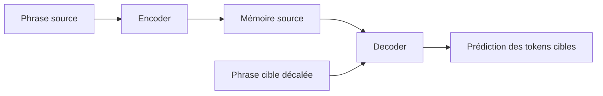

Nous allons maintenant zoomer sur l’intérieur de l’**encoder**.

Dans le plan général du cours, ce chapitre est consacré au bloc encoder : self-attention, connexions résiduelles, normalisation, feed-forward network, empilement des blocs et rôle de chaque sous-couche.

L’objectif est de comprendre précisément ce schéma :

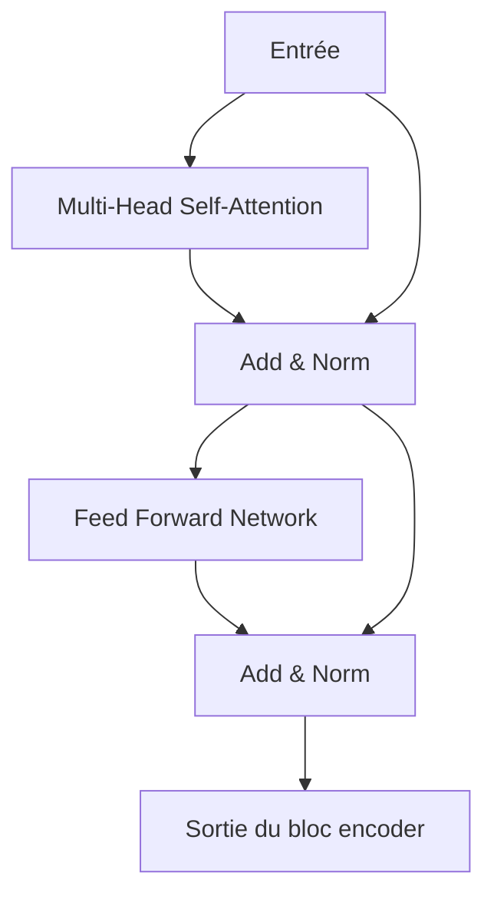

À la fin de ce chapitre, nous devrons comprendre comment un bloc encoder transforme une séquence de vecteurs en une séquence de vecteurs plus contextualisés.

---

## 8.2 Rappel : rôle général de l’encoder

L’encoder reçoit une séquence source.

Par exemple :

```txt
The black cat sleeps.
```

Après tokenisation, embeddings et ajout des positions, nous obtenons une matrice :

[  
X \in \mathbb{R}^{B \times T \times d_{model}}  
]

où :

- $B$ est la taille du batch ;
    
- $T$ est la longueur de la séquence source ;
    
- $d_{model}$ est la dimension du modèle.
    

L’encoder doit transformer cette entrée en une mémoire source contextualisée :

[  
H \in \mathbb{R}^{B \times T \times d_{model}}  
]

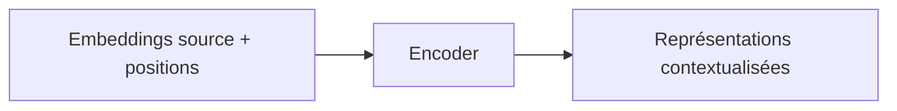

Chaque token de sortie représente le token correspondant, mais enrichi par les informations des autres tokens de la séquence.

---

## 8.3 Ce que fait un bloc encoder

Un bloc encoder applique deux grandes opérations :

1. il mélange les informations entre les tokens avec la **Multi-Head Self-Attention** ;
    
2. il transforme chaque token individuellement avec un **Feed-Forward Network**.
    

Entre ces opérations, il utilise :

- des connexions résiduelles ;
    
- de la normalisation ;
    
- parfois du dropout.
    

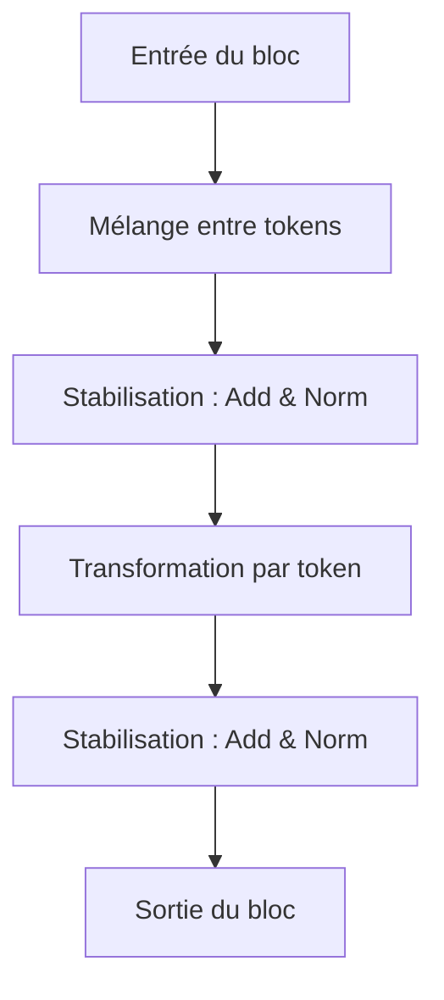

Nous pouvons résumer l’idée ainsi :

> L’attention permet aux tokens d’échanger de l’information ; le feed-forward permet de retravailler localement chaque représentation.

---

## 8.4 Pourquoi l’encoder utilise de la self-attention

Dans l’encoder, nous avons une séquence source complète.

Le modèle peut donc regarder tous les tokens de la phrase source.

Par exemple :

```txt
The animal did not cross the street because it was tired.
```

Le mot `it` doit être relié à un antécédent probable.

La self-attention permet à chaque token de regarder les autres tokens :

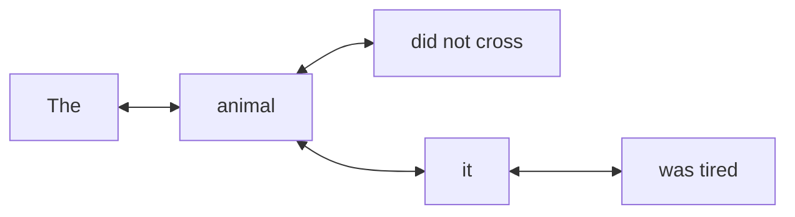

Dans l’encoder, cette attention est généralement **bidirectionnelle**.

Cela signifie :

> Un token peut regarder les tokens avant lui et après lui.

Contrairement au decoder autoregressif, l’encoder n’a pas besoin de cacher le futur.

---

## 8.5 Structure complète d’un bloc encoder

Un bloc encoder suit généralement cette structure :

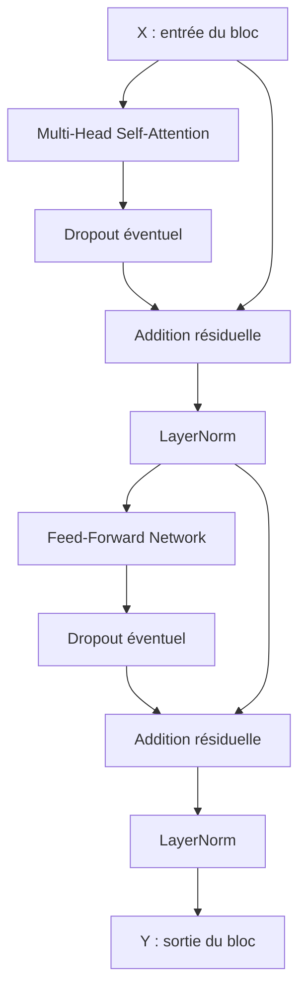

Dans le Transformer original, la structure est souvent décrite comme :

```txt
Sublayer(x) → Add & Norm
```

C’est-à-dire :

[  
LayerNorm(x + Sublayer(x))  
]

Nous reviendrons plus tard sur la différence entre **Post-LN** et **Pre-LN**.

---

## 8.6 Première sous-couche : Multi-Head Self-Attention

La première sous-couche est une Multi-Head Self-Attention.

Dans une self-attention, les Queries, Keys et Values viennent de la même entrée.

[  
Q = XW_Q  
]

[  
K = XW_K  
]

[  
V = XW_V  
]

Puis :

[  
Attention(Q,K,V) = softmax\left(\frac{QK^T}{\sqrt{d_k}}\right)V  
]

Avec plusieurs têtes :

[  
MultiHead(X) = Concat(head_1, ..., head_h)W^O  
]

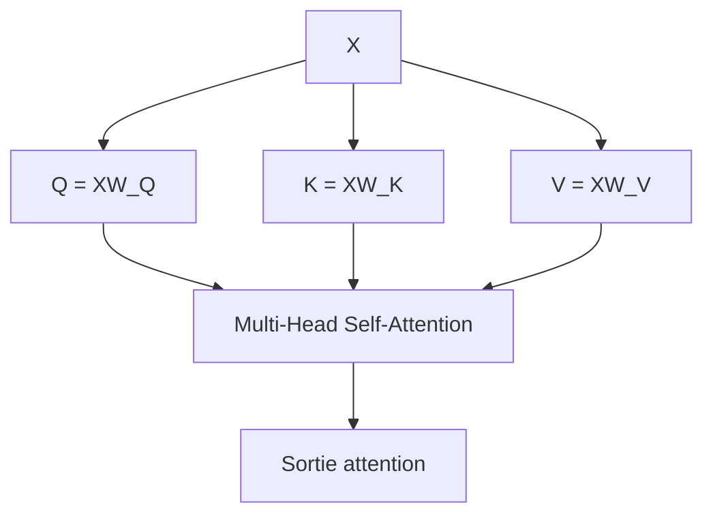

Cette opération produit une nouvelle représentation de chaque token en fonction des autres tokens.

---

## 8.7 Exemple intuitif de self-attention dans l’encoder

Prenons la phrase :

```txt
Le chat que le chien poursuit dort.
```

Le token `dort` doit être relié à `chat`, et non à `chien`.

La self-attention peut apprendre cette relation :

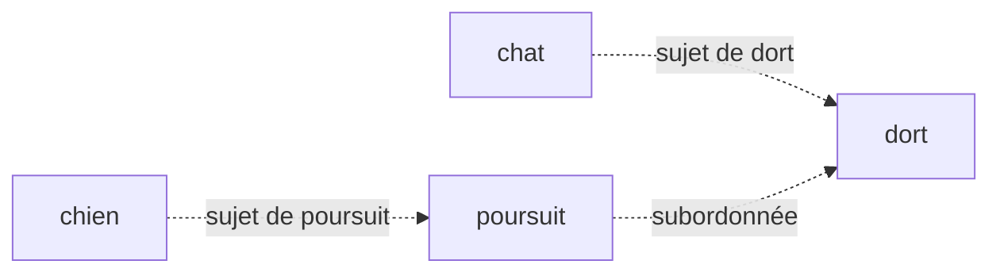

Après la self-attention, la représentation de `dort` contient davantage d’information sur `chat`.

De même, la représentation de `chat` peut contenir des informations sur `chien`, `poursuit` et `dort`.

Chaque token est donc enrichi par la structure globale de la phrase.

---

## 8.8 Sortie de la self-attention

La Multi-Head Self-Attention reçoit :

[  
X \in \mathbb{R}^{B \times T \times d_{model}}  
]

et produit une sortie de même forme :

[  
A \in \mathbb{R}^{B \times T \times d_{model}}  
]

Cette conservation de dimension est essentielle.

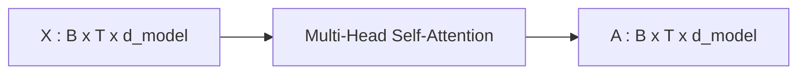

Pourquoi garder la même dimension ?

Parce que nous voulons pouvoir :

- ajouter la connexion résiduelle (X + A) ;
    
- empiler plusieurs blocs encoder ;
    
- garder une architecture stable et régulière.
    

---

## 8.9 La connexion résiduelle après l’attention

Après la self-attention, nous ajoutons l’entrée originale $X$ à la sortie de l’attention.

[  
Z = X + MultiHeadSelfAttention(X)  
]

C’est ce qu’on appelle une **connexion résiduelle**.

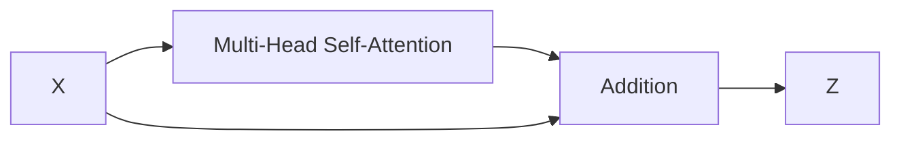

L’idée est simple :

> La couche n’est pas obligée de reconstruire toute l’information ; elle peut apprendre une correction ou un enrichissement de l’entrée.

Cela facilite l’entraînement des modèles profonds.

---

## 8.10 Pourquoi les connexions résiduelles sont importantes

Sans connexion résiduelle, chaque couche devrait transformer complètement la représentation.

Avec une connexion résiduelle, la couche peut apprendre :

[  
sortie = entrée + modification  
]

Cela aide le gradient à circuler dans les couches profondes.

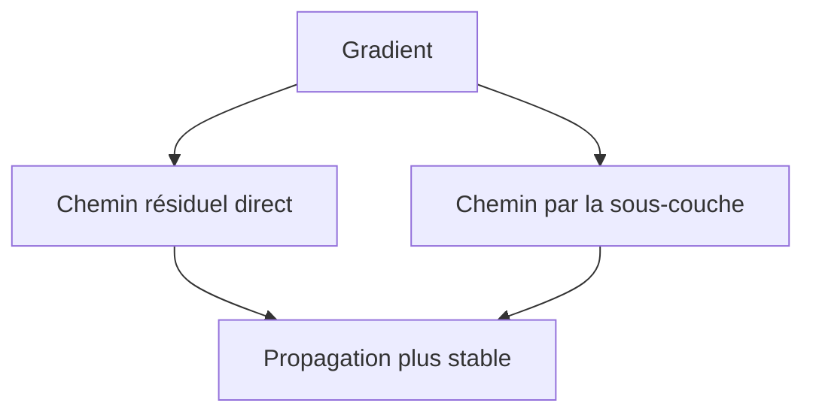

Les connexions résiduelles permettent donc :

- de stabiliser l’entraînement ;
    
- de faciliter l’empilement des couches ;
    
- de conserver l’information utile ;
    
- d’éviter que certaines transformations détruisent trop vite les représentations.
    

---

## 8.11 Add & Norm

Après l’addition résiduelle, le Transformer original applique une normalisation.

On écrit souvent :

[  
LayerNorm(X + Sublayer(X))  
]

Pour la première sous-couche :

[  
X_1 = LayerNorm(X + MultiHeadSelfAttention(X))  
]

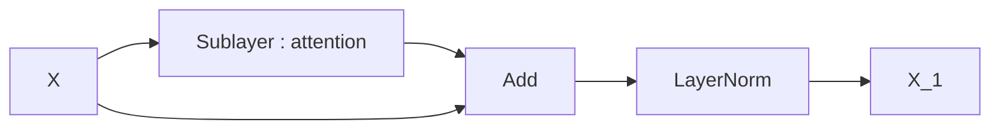

Cette opération est appelée **Add & Norm**.

Elle combine :

- une addition résiduelle ;
    
- une normalisation.
    

---

## 8.12 Pourquoi normaliser ?

Pendant l’entraînement, les distributions d’activations peuvent varier fortement d’une couche à l’autre.

La normalisation aide à stabiliser ces activations.

LayerNorm normalise les valeurs d’un vecteur de features.

Pour chaque token, elle normalise les dimensions de sa représentation.

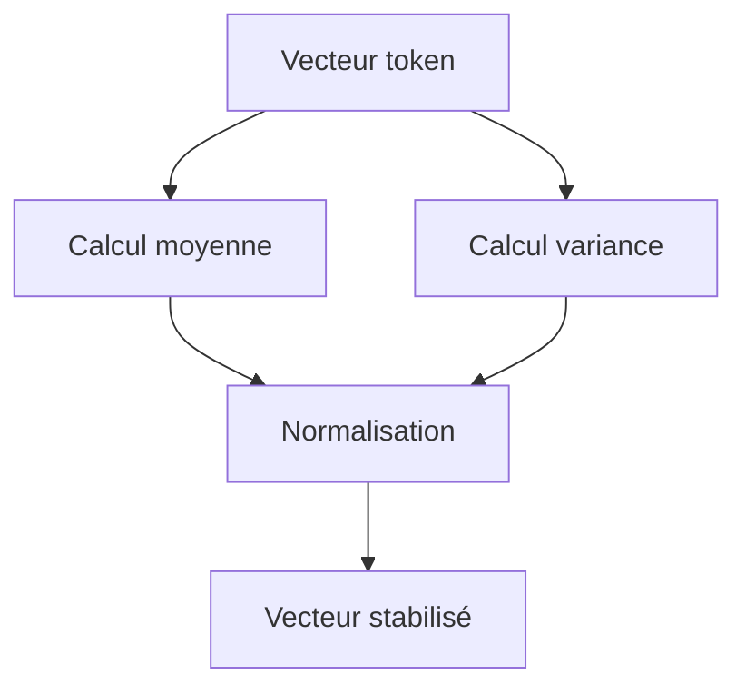

La normalisation permet :

- un apprentissage plus stable ;
    
- une meilleure circulation du gradient ;
    
- une réduction des explosions d’activations ;
    
- une architecture plus facile à entraîner.
    

---

## 8.13 LayerNorm agit par token

Dans un tenseur :

[  
X \in \mathbb{R}^{B \times T \times d_{model}}  
]

LayerNorm agit généralement sur la dernière dimension :

[  
d_{model}  
]

Cela signifie que pour chaque token de chaque exemple du batch, nous normalisons son vecteur de features.

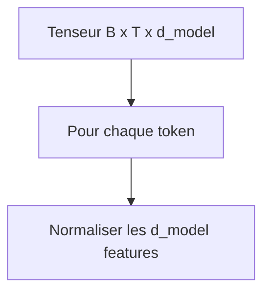

LayerNorm ne mélange donc pas les tokens entre eux.

Le mélange entre tokens est fait par l’attention.

LayerNorm stabilise chaque représentation individuellement.

---

## 8.14 Formule simplifiée de LayerNorm

Pour un vecteur $x$, LayerNorm calcule :

[  
\mu = \frac{1}{d}\sum_{i=1}^{d}x_i  
]

[  
\sigma^2 = \frac{1}{d}\sum_{i=1}^{d}(x_i - \mu)^2  
]

Puis :

[  
\hat{x}_i = \frac{x_i - \mu}{\sqrt{\sigma^2 + \epsilon}}  
]

Enfin, LayerNorm applique deux paramètres appris :

[  
y_i = \gamma_i \hat{x}_i + \beta_i  
]

où :

- $\gamma$ est un facteur d’échelle appris ;
    
- $\beta$ est un biais appris ;
    
- $\epsilon$ évite une division par zéro.
    

Nous n’avons pas besoin de mémoriser toute la formule au début, mais nous devons comprendre l’idée :

> LayerNorm stabilise chaque vecteur de token en normalisant ses dimensions internes.

---

## 8.15 Deuxième sous-couche : Feed-Forward Network

Après la self-attention et le premier Add & Norm, nous obtenons :

[  
X_1  
]

Nous appliquons ensuite un **Feed-Forward Network**, souvent abrégé **FFN**.

Dans le Transformer original, ce réseau est appliqué indépendamment à chaque position.

Formule :

[  
FFN(x) = max(0, xW_1 + b_1)W_2 + b_2  
]

Le (max(0, ...)) correspond à l’activation ReLU.

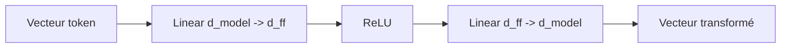

Le FFN transforme chaque token séparément.

---

## 8.16 Pourquoi ajouter un feed-forward network ?

L’attention mélange l’information entre tokens.

Mais l’attention seule est essentiellement une opération de combinaison pondérée.

Nous avons besoin d’une transformation non linéaire pour enrichir la capacité du modèle.

Le feed-forward network permet au modèle de transformer chaque représentation de manière plus complexe.

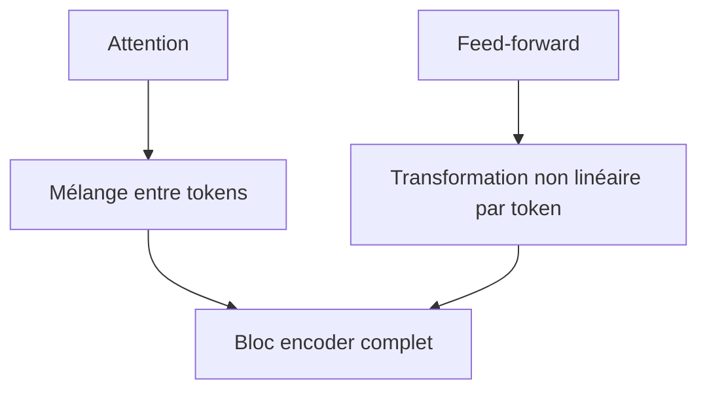

Nous pouvons retenir :

> L’attention communique ; le feed-forward réfléchit localement.

---

## 8.17 Le FFN est position-wise

Le feed-forward network est dit **position-wise**.

Cela signifie qu’il est appliqué de la même manière à chaque position.

Si nous avons :

```txt
Token 1
Token 2
Token 3
```

le même FFN est appliqué à chacun.

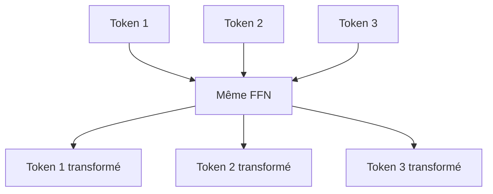

Attention : le FFN ne mélange pas directement les positions.

Mais comme les représentations ont déjà été contextualisées par l’attention, chaque token contient déjà de l’information sur les autres tokens.

---

## 8.18 Dimensions du Feed-Forward Network

Dans le Transformer original :

[  
d_{model} = 512  
]

[  
d_{ff} = 2048  
]

Donc le FFN fait :

[  
512 \rightarrow 2048 \rightarrow 512  
]

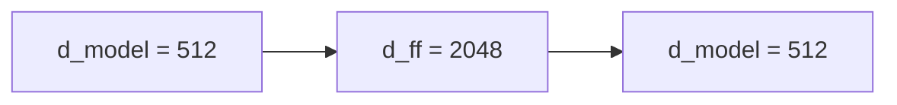

Pourquoi augmenter temporairement la dimension ?

Parce que cela donne au réseau plus de capacité pour transformer les représentations.

Le modèle projette le vecteur dans un espace plus grand, applique une non-linéarité, puis revient à la dimension initiale.

---

## 8.19 Deuxième connexion résiduelle

Après le feed-forward network, nous ajoutons de nouveau une connexion résiduelle.

Si l’entrée du FFN est (X_1), alors :

[  
X_2 = LayerNorm(X_1 + FFN(X_1))  
]

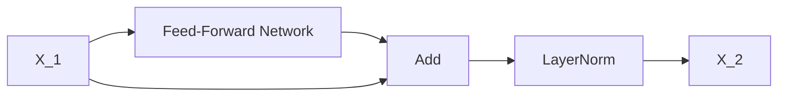

La sortie (X_2) est la sortie finale du bloc encoder.

Elle garde la même forme :

[  
B \times T \times d_{model}  
]

---

## 8.20 Résumé des calculs d’un bloc encoder

Nous pouvons écrire un bloc encoder de manière compacte.

Première sous-couche :

[  
X_1 = LayerNorm(X + MultiHeadSelfAttention(X))  
]

Deuxième sous-couche :

[  
Y = LayerNorm(X_1 + FFN(X_1))  
]

Donc :

```txt
Entrée X
→ Multi-Head Self-Attention
→ Add & Norm
→ Feed-Forward Network
→ Add & Norm
→ Sortie Y
```

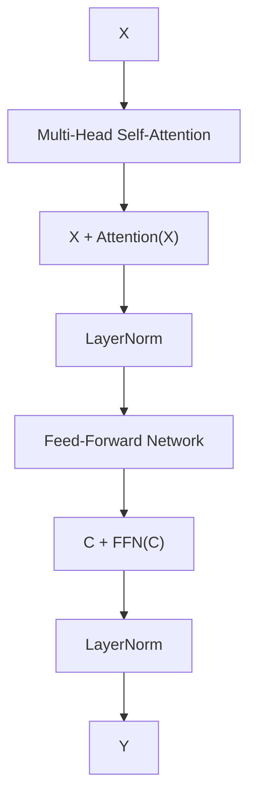

---

## 8.21 Dimensions dans tout le bloc encoder

L’entrée :

[  
X \in \mathbb{R}^{B \times T \times d_{model}}  
]

La sortie de la self-attention :

[  
A \in \mathbb{R}^{B \times T \times d_{model}}  
]

Après Add & Norm :

[  
X_1 \in \mathbb{R}^{B \times T \times d_{model}}  
]

Après FFN :

[  
F \in \mathbb{R}^{B \times T \times d_{model}}  
]

Après le second Add & Norm :

[  
Y \in \mathbb{R}^{B \times T \times d_{model}}  
]

```mermaid
flowchart LR
    A["B x T x d_model"] --> B["Self-attention"]
    B --> C["B x T x d_model"]
    C --> D["FFN"]
    D --> E["B x T x d_model"]
```

La dimension reste constante dans tout le bloc.

Cela rend l’empilement très simple.

---

## 8.22 Empilement des blocs encoder

Le Transformer original utilise plusieurs blocs encoder empilés.

Dans le papier original :

[  
N = 6  
]

```mermaid
flowchart TD
    X["Entrée encoder"] --> E1["Bloc encoder 1"]
    E1 --> E2["Bloc encoder 2"]
    E2 --> E3["Bloc encoder 3"]
    E3 --> E4["Bloc encoder 4"]
    E4 --> E5["Bloc encoder 5"]
    E5 --> E6["Bloc encoder 6"]
    E6 --> H["Sortie encoder"]
```

Chaque bloc reçoit une séquence de vecteurs et produit une nouvelle séquence de vecteurs.

Plus nous empilons de blocs, plus les représentations peuvent devenir abstraites et contextualisées.

---

## 8.23 Pourquoi empiler plusieurs blocs ?

Un seul bloc permet déjà aux tokens de communiquer.

Mais plusieurs blocs permettent de construire des représentations en plusieurs étapes.

Première couche :

```txt
relations locales, formes simples, proximités
```

Couches intermédiaires :

```txt
relations syntaxiques, dépendances
```

Couches profondes :

```txt
représentations plus abstraites, sens global
```

```mermaid
flowchart TD
    A["Embeddings initiaux"] --> B["Bloc 1 : premières relations"]
    B --> C["Bloc 2 : relations enrichies"]
    C --> D["Bloc 3 : structures plus complexes"]
    D --> E["Bloc N : représentations profondes"]
```

Cette lecture est une intuition pédagogique, pas une règle stricte.

En pratique, les couches peuvent apprendre des comportements variés.

---

## 8.24 Exemple d’évolution d’une représentation

Prenons le token `banque`.

Phrase :

```txt
La banque est fermée le dimanche.
```

Dans les premières couches, le modèle peut identifier :

- le token ;
    
- sa position ;
    
- les mots proches.
    

Dans les couches suivantes, il peut intégrer :

- `fermée` ;
    
- `dimanche` ;
    
- le contexte commercial.
    

La représentation de `banque` devient donc liée au sens financier.

Autre phrase :

```txt
La banque de sable bloque le bateau.
```

Le token `banque` peut regarder :

- `sable` ;
    
- `bateau`.
    

Sa représentation devient liée au sens géographique.

```mermaid
flowchart TD
    A["Embedding initial : banque"] --> B["Contexte financier"]
    A --> C["Contexte géographique"]

    B --> D["Représentation : établissement financier"]
    C --> E["Représentation : formation naturelle"]
```

C’est l’empilement des blocs encoder qui affine progressivement ces représentations.

---

## 8.25 Le rôle de l’encoder dans la traduction

Dans une tâche de traduction, l’encoder doit produire une mémoire source exploitable par le decoder.

Exemple :

```txt
The black cat sleeps.
```

L’encoder doit produire des représentations qui permettent au decoder de comprendre :

- `black` correspond à une propriété du chat ;
    
- `cat` est le sujet ;
    
- `sleeps` est l’action ;
    
- l’ordre français sera peut-être différent.
    

```mermaid
flowchart TD
    A["The black cat sleeps"] --> B["Encoder"]
    B --> C["Représentation de black"]
    B --> D["Représentation de cat"]
    B --> E["Représentation de sleeps"]

    C --> F["Utilisable pour générer : noir"]
    D --> G["Utilisable pour générer : chat"]
    E --> H["Utilisable pour générer : dort"]
```

L’encoder ne traduit pas directement.

Il prépare des représentations suffisamment riches pour que le decoder puisse traduire.

---

## 8.26 Self-attention bidirectionnelle dans l’encoder

Dans l’encoder, chaque token peut regarder tous les autres.

Pour une phrase de longueur 5 :

```txt
t1 t2 t3 t4 t5
```

le token (t3) peut regarder :

```txt
t1, t2, t3, t4, t5
```

```mermaid
flowchart LR
    T1["t1"] <--> T3["t3"]
    T2["t2"] <--> T3
    T3 <--> T4["t4"]
    T3 <--> T5["t5"]
```

Cette bidirectionnalité rend l’encoder très adapté aux tâches de compréhension.

Il peut utiliser le contexte gauche et droit.

---

## 8.27 Masque de padding dans l’encoder

Même si l’encoder n’utilise pas de masque causal, il peut utiliser un **padding mask**.

Pourquoi ?

Parce que dans un batch, les séquences n’ont pas toutes la même longueur.

Exemple :

```txt
Phrase 1 : Le chat dort .
Phrase 2 : Le chien court dans le jardin .
```

Nous ajoutons des tokens `<pad>` pour aligner les longueurs.

```txt
Le chat dort . <pad> <pad> <pad>
```

Mais le modèle ne doit pas accorder d’attention aux tokens `<pad>`.

```mermaid
flowchart TD
    A["Séquence avec padding"] --> B["Self-attention"]
    C["Padding mask"] --> B
    B --> D["Les tokens pad sont ignorés"]
```

Le padding mask empêche les tokens réels de regarder les positions de remplissage.

---

## 8.28 Différence entre padding mask et causal mask

Dans l’encoder :

```txt
padding mask : oui
causal mask : non
```

Dans le decoder autoregressif :

```txt
padding mask : possible
causal mask : oui
```

|Masque|Rôle|Encoder|
|---|---|---|
|Padding mask|Ignorer les tokens `<pad>`|Oui|
|Causal mask|Interdire de regarder le futur|Non|

```mermaid
flowchart TD
    A["Encoder"] --> B["Peut regarder gauche et droite"]
    A --> C["Ignore seulement le padding"]

    D["Decoder"] --> E["Ignore padding"]
    D --> F["Interdit le futur"]
```

Cette distinction est importante pour éviter de confondre compréhension bidirectionnelle et génération autoregressive.

---

## 8.29 Le bloc encoder comme fonction

Nous pouvons voir un bloc encoder comme une fonction :

[  
EncoderBlock : \mathbb{R}^{B \times T \times d_{model}} \rightarrow \mathbb{R}^{B \times T \times d_{model}}  
]

Il prend une séquence de vecteurs et renvoie une séquence de vecteurs de même forme.

```mermaid
flowchart LR
    A["X : B x T x d_model"] --> B["EncoderBlock"]
    B --> C["Y : B x T x d_model"]
```

Cette fonction est composée de :

[  
Y = EncoderBlock(X)  
]

avec :

[  
X_1 = LayerNorm(X + MHA(X))  
]

[  
Y = LayerNorm(X_1 + FFN(X_1))  
]

---

## 8.30 Variante moderne : Pre-LN

Dans le Transformer original, on utilise souvent une structure de type Post-LN :

[  
LayerNorm(X + Sublayer(X))  
]

Dans beaucoup de Transformers modernes, on utilise plutôt Pre-LN :

[  
X + Sublayer(LayerNorm(X))  
]

```mermaid
flowchart TD
    A["Post-LN"] --> B["Sublayer"]
    B --> C["Add"]
    C --> D["LayerNorm"]

    E["Pre-LN"] --> F["LayerNorm"]
    F --> G["Sublayer"]
    G --> H["Add"]
```

Pourquoi ?

Parce que Pre-LN peut stabiliser l’entraînement des modèles très profonds.

Nous détaillerons ce point dans le chapitre 12.

Pour le moment, nous retenons surtout la version originale :

```txt
Sublayer → Add → Norm
```

---

## 8.31 Dropout dans le bloc encoder

Le Transformer original utilise aussi du dropout.

Le dropout est une technique de régularisation.

Pendant l’entraînement, certaines activations sont mises à zéro aléatoirement.

Cela aide à réduire le surapprentissage.

Dans un bloc encoder, le dropout peut être appliqué :

- après l’attention ;
    
- après le feed-forward ;
    
- parfois sur les embeddings ;
    
- parfois sur les poids d’attention.
    

```mermaid
flowchart TD
    A["Attention output"] --> B["Dropout"]
    B --> C["Add & Norm"]

    D["FFN output"] --> E["Dropout"]
    E --> F["Add & Norm"]
```

Pendant l’inférence, le dropout est désactivé.

---

## 8.32 Bloc encoder en pseudo-code

Nous pouvons écrire un bloc encoder en pseudo-code :

```python
def encoder_block(X, attention, feed_forward):
    A = attention(X, X, X)
    X1 = layer_norm(X + A)

    F = feed_forward(X1)
    Y = layer_norm(X1 + F)

    return Y
```

Avec dropout :

```python
def encoder_block(X, attention, feed_forward):
    A = attention(X, X, X)
    A = dropout(A)
    X1 = layer_norm(X + A)

    F = feed_forward(X1)
    F = dropout(F)
    Y = layer_norm(X1 + F)

    return Y
```

Le point important est :

```txt
attention(X, X, X)
```

Cela signifie que $Q$, $K$, $V$ viennent tous de la même séquence.

C’est bien de la self-attention.

---

## 8.33 Bloc encoder en version PyTorch conceptuelle

Voici une version pédagogique, volontairement simplifiée :

```python
import torch
import torch.nn as nn

class EncoderBlock(nn.Module):
    def __init__(self, d_model, num_heads, d_ff, dropout=0.1):
        super().__init__()

        self.self_attention = nn.MultiheadAttention(
            embed_dim=d_model,
            num_heads=num_heads,
            dropout=dropout,
            batch_first=True,
        )

        self.norm1 = nn.LayerNorm(d_model)
        self.norm2 = nn.LayerNorm(d_model)

        self.feed_forward = nn.Sequential(
            nn.Linear(d_model, d_ff),
            nn.ReLU(),
            nn.Linear(d_ff, d_model),
        )

        self.dropout = nn.Dropout(dropout)

    def forward(self, x, key_padding_mask=None):
        attn_output, attn_weights = self.self_attention(
            x, x, x,
            key_padding_mask=key_padding_mask,
            need_weights=True,
        )

        x = self.norm1(x + self.dropout(attn_output))

        ff_output = self.feed_forward(x)

        x = self.norm2(x + self.dropout(ff_output))

        return x, attn_weights
```

Cette version correspond à la logique Post-LN simplifiée.

Dans des modèles modernes, l’ordre exact peut différer.

---

## 8.34 Attention : PyTorch et conventions de formes

Selon les bibliothèques, les tenseurs peuvent être organisés différemment.

Avec `batch_first=True`, PyTorch attend :

```txt
batch x sequence x features
```

c’est-à-dire :

[  
B \times T \times d_{model}  
]

Sans `batch_first=True`, certaines couches attendent :

```txt
sequence x batch x features
```

c’est-à-dire :

[  
T \times B \times d_{model}  
]

```mermaid
flowchart TD
    A["batch_first=True"] --> B["B x T x d_model"]
    C["batch_first=False"] --> D["T x B x d_model"]
```

Cette différence est une source fréquente d’erreurs d’implémentation.

---

## 8.35 Ce que l’encoder apprend

L’encoder apprend à construire des représentations utiles pour la tâche.

Dans une tâche de traduction, il apprend à représenter la phrase source pour faciliter la génération cible.

Dans une tâche de classification, un encoder peut apprendre à représenter le sens global d’une phrase.

Dans une tâche de question-réponse, il peut apprendre à relier les questions et les passages.

```mermaid
flowchart TD
    A["Encoder"] --> B["Relations syntaxiques"]
    A --> C["Relations sémantiques"]
    A --> D["Désambiguïsation"]
    A --> E["Références"]
    A --> F["Structure globale"]
```

Le bloc encoder ne contient pas de règles linguistiques écrites à la main.

Il apprend ces régularités à partir des données et de la fonction de perte.

---

## 8.36 Représentation finale de chaque token

Après plusieurs blocs encoder, chaque token possède une représentation contextualisée profonde.

Pour la phrase :

```txt
Le chat noir dort.
```

la sortie contient :

```txt
h_Le
h_chat
h_noir
h_dort
h_.
```

Chaque vecteur dépend potentiellement de toute la phrase.

```mermaid
flowchart TD
    A["Le"] --> E["Encoder stack"]
    B["chat"] --> E
    C["noir"] --> E
    D["dort"] --> E
    P["."] --> E

    E --> A2["h_Le"]
    E --> B2["h_chat"]
    E --> C2["h_noir"]
    E --> D2["h_dort"]
    E --> P2["h_."]
```

La sortie garde donc l’alignement avec les positions d’entrée.

Il y a une représentation par token.

---

## 8.37 Encoder et classification

Même si le Transformer original utilise l’encoder pour la traduction, les encoders seuls peuvent servir à la classification.

Par exemple, dans BERT, on ajoute souvent un token spécial `[CLS]`.

```txt
[CLS] Le film est excellent .
```

Après l’encoder, la représentation de `[CLS]` peut être utilisée pour classifier la phrase.

```mermaid
flowchart LR
    A["[CLS] + phrase"] --> B["Encoder"]
    B --> C["Représentation de [CLS]"]
    C --> D["Classifieur"]
```

Cette idée sera détaillée plus tard dans le chapitre sur BERT.

---

## 8.38 Encoder et extraction d’information

Un encoder peut aussi produire une représentation pour chaque token, utile pour des tâches comme :

- reconnaissance d’entités nommées ;
    
- étiquetage grammatical ;
    
- extraction de réponse ;
    
- classification de tokens.
    

```mermaid
flowchart TD
    A["Tokens"] --> B["Encoder"]
    B --> C["Vecteur token 1"]
    B --> D["Vecteur token 2"]
    B --> E["Vecteur token 3"]

    C --> F["Label token 1"]
    D --> G["Label token 2"]
    E --> H["Label token 3"]
```

La structure du bloc encoder est donc extrêmement générale.

---

## 8.39 Encoder dans les modèles modernes

Les blocs encoder sont à la base de nombreux modèles :

- BERT ;
    
- RoBERTa ;
    
- DeBERTa ;
    
- certains modèles de représentation de phrases ;
    
- certains modèles multimodaux ;
    
- certains Vision Transformers.
    

```mermaid
flowchart TD
    A["Bloc encoder Transformer"] --> B["BERT"]
    A --> C["RoBERTa"]
    A --> D["Vision Transformer"]
    A --> E["Encodeurs multimodaux"]
```

La logique générale reste :

```txt
self-attention bidirectionnelle + feed-forward + résidus + normalisation
```

Même si les variantes modernes modifient certains détails.

---

## 8.40 Comparaison encoder vs decoder

Nous pouvons déjà comparer l’encoder et le decoder.

|Élément|Encoder|Decoder|
|---|---|---|
|Regarde toute la séquence ?|Oui|Non, pas le futur|
|Utilise un masque causal ?|Non|Oui|
|A de la cross-attention ?|Non|Oui, dans encoder-decoder|
|Rôle|Comprendre/représenter|Générer|
|Sortie|Mémoire contextualisée|Prédiction cible|

```mermaid
flowchart TD
    A["Encoder"] --> B["Self-attention bidirectionnelle"]
    A --> C["Représentation"]

    D["Decoder"] --> E["Masked self-attention"]
    D --> F["Cross-attention"]
    D --> G["Génération"]
```

Nous détaillerons le decoder au chapitre suivant.

---

## 8.41 Pourquoi le bloc encoder n’a pas de cross-attention

L’encoder ne regarde que la séquence source.

Il n’a pas besoin de regarder une autre séquence.

Dans le Transformer original :

```txt
Encoder : source → source contextualisée
Decoder : cible + source → prédictions
```

La cross-attention est donc dans le decoder, pas dans l’encoder.

```mermaid
flowchart TD
    A["Encoder"] --> B["Source uniquement"]
    C["Decoder"] --> D["Cible + source encodée"]
```

L’encoder est chargé de construire une mémoire source autonome.

---

## 8.42 Pourquoi le bloc encoder est parallélisable

Dans l’encoder, tous les tokens source sont disponibles dès le départ.

Nous pouvons donc calculer la self-attention pour toutes les positions en parallèle.

```mermaid
flowchart TD
    A["Tous les tokens source"] --> B["Q,K,V en parallèle"]
    B --> C["QK^T"]
    C --> D["Attention parallèle"]
    D --> E["Sorties pour tous les tokens"]
```

C’est une différence majeure avec un RNN classique, qui doit traiter les tokens séquentiellement.

La parallélisation de l’encoder est l’un des grands avantages du Transformer.

---

## 8.43 Coût du bloc encoder

Le coût principal du bloc encoder vient de la self-attention.

Pour une séquence de longueur $T$, la matrice d’attention a une taille :

[  
T \times T  
]

Avec $h$ têtes et un batch $B$, les poids d’attention ont la forme :

[  
B \times h \times T \times T  
]

```mermaid
flowchart TD
    A["Longueur T"] --> B["Matrice attention T x T"]
    B --> C["Coût O(T²)"]
    D["Feed-forward"] --> E["Coût important mais linéaire en T"]
```

Le feed-forward peut aussi représenter une part importante du coût, surtout dans les grands modèles, mais il est linéaire par rapport à $T$.

L’attention, elle, devient particulièrement coûteuse quand $T$ augmente beaucoup.

---

## 8.44 Erreur fréquente : croire que le FFN mélange les tokens

Le feed-forward network est appliqué indépendamment à chaque position.

Il ne mélange pas directement les tokens entre eux.

```mermaid
flowchart TD
    A["Token 1"] --> F1["FFN"]
    B["Token 2"] --> F2["Même FFN"]
    C["Token 3"] --> F3["Même FFN"]

    F1 --> A2["Token 1 transformé"]
    F2 --> B2["Token 2 transformé"]
    F3 --> C2["Token 3 transformé"]
```

Le mélange entre tokens est fait par la self-attention.

Le FFN transforme chaque token après que l’attention lui a apporté du contexte.

---

## 8.45 Erreur fréquente : oublier la connexion résiduelle

Si nous écrivons seulement :

```txt
X → Attention → FFN → Y
```

nous oublions une partie cruciale.

La vraie structure inclut les chemins résiduels :

```mermaid
flowchart TD
    X["X"] --> A["Attention"]
    A --> ADD1["Add"]
    X --> ADD1

    ADD1 --> F["FFN"]
    F --> ADD2["Add"]
    ADD1 --> ADD2
```

Ces chemins sont essentiels pour l’entraînement stable des réseaux profonds.

---

## 8.46 Erreur fréquente : confondre LayerNorm et BatchNorm

LayerNorm et BatchNorm ne normalisent pas de la même manière.

BatchNorm utilise des statistiques sur le batch.

LayerNorm normalise les features d’un exemple donné.

Dans les Transformers, LayerNorm est préféré car il fonctionne bien avec les séquences et les tailles de batch variables.

```mermaid
flowchart TD
    A["BatchNorm"] --> B["Statistiques sur le batch"]
    C["LayerNorm"] --> D["Statistiques sur les features du token"]
```

Dans les Transformers, nous devons surtout retenir :

> LayerNorm agit sur la dimension $d_{model}$ de chaque token.

---

## 8.47 Erreur fréquente : penser que l’encoder donne une seule représentation

L’encoder ne produit pas un seul vecteur global par défaut.

Il produit une séquence de vecteurs :

[  
B \times T \times d_{model}  
]

Il y a une représentation par token.

```mermaid
flowchart LR
    A["Tokens source"] --> B["Encoder"]
    B --> C["Vecteur token 1"]
    B --> D["Vecteur token 2"]
    B --> E["Vecteur token 3"]
```

Pour certaines tâches, on peut ensuite agréger ces vecteurs ou utiliser un token spécial.

Mais la sortie native de l’encoder reste une séquence.

---

## 8.48 Erreur fréquente : croire que les blocs encoder ont tous des poids partagés

Dans le Transformer original, les différentes couches encoder ne partagent pas leurs poids.

Chaque bloc possède ses propres paramètres :

- ses propres projections d’attention ;
    
- ses propres paramètres de feed-forward ;
    
- ses propres LayerNorm.
    

```mermaid
flowchart TD
    A["Bloc encoder 1"] --> B["Paramètres propres"]
    C["Bloc encoder 2"] --> D["Paramètres propres"]
    E["Bloc encoder 3"] --> F["Paramètres propres"]
```

Cela permet à chaque couche d’apprendre des transformations différentes.

---

## 8.49 Synthèse mathématique du bloc encoder

Nous pouvons résumer un bloc encoder avec les équations suivantes.

Entrée :

[  
X \in \mathbb{R}^{B \times T \times d_{model}}  
]

Self-attention :

[  
A = MultiHeadSelfAttention(X)  
]

Premier Add & Norm :

[  
X_1 = LayerNorm(X + A)  
]

Feed-forward :

[  
F = FFN(X_1)  
]

Deuxième Add & Norm :

[  
Y = LayerNorm(X_1 + F)  
]

Sortie :

[  
Y \in \mathbb{R}^{B \times T \times d_{model}}  
]

---

## 8.50 Schéma global de synthèse

```mermaid
flowchart TD
    X["Entrée X : B x T x d_model"]

    X --> QKV["Projections Q,K,V"]
    QKV --> MHA["Multi-Head Self-Attention"]
    MHA --> A["Sortie attention"]

    A --> ADD1["Addition résiduelle"]
    X --> ADD1
    ADD1 --> LN1["LayerNorm"]

    LN1 --> FFN["Feed-Forward Network"]
    FFN --> F["Sortie FFN"]

    F --> ADD2["Addition résiduelle"]
    LN1 --> ADD2
    ADD2 --> LN2["LayerNorm"]

    LN2 --> Y["Sortie Y : B x T x d_model"]
```

Ce schéma est la représentation complète d’un bloc encoder dans le Transformer original.

---

## 8.51 Résumé du chapitre

Nous avons étudié en détail le bloc encoder du Transformer.

Un bloc encoder reçoit une séquence de vecteurs :

[  
B \times T \times d_{model}  
]

et renvoie une séquence de même forme.

Il contient deux grandes sous-couches :

1. une **Multi-Head Self-Attention**, qui permet aux tokens de communiquer entre eux ;
    
2. un **Feed-Forward Network**, qui transforme chaque token individuellement avec une non-linéarité.
    

Chaque sous-couche est entourée par :

- une connexion résiduelle ;
    
- une normalisation LayerNorm.
    

Nous avons vu que l’encoder utilise une self-attention bidirectionnelle : chaque token source peut regarder tous les autres tokens source.

Nous avons aussi distingué :

- padding mask et causal mask ;
    
- attention et feed-forward ;
    
- LayerNorm et BatchNorm ;
    
- sortie par token et représentation globale.
    

Le point central du chapitre est :

> Le bloc encoder transforme une séquence de vecteurs en une séquence de représentations contextualisées, en alternant communication entre tokens et transformation locale de chaque token.

---

## 8.52 Questions de compréhension

### 8.52.1 Question 1

Quel est le rôle principal du bloc encoder ?

Réponse attendue : transformer une séquence de vecteurs en une séquence de représentations contextualisées.

### 8.52.2 Question 2

Quelles sont les deux grandes sous-couches d’un bloc encoder ?

Réponse attendue : la Multi-Head Self-Attention et le Feed-Forward Network.

### 8.52.3 Question 3

Pourquoi parle-t-on de self-attention dans l’encoder ?

Réponse attendue : parce que les Queries, Keys et Values viennent de la même séquence source.

### 8.52.4 Question 4

L’encoder utilise-t-il un masque causal ?

Réponse attendue : non, car il peut regarder toute la séquence source. Il peut toutefois utiliser un padding mask.

### 8.52.5 Question 5

À quoi sert la connexion résiduelle ?

Réponse attendue : elle facilite l’entraînement, aide le gradient à circuler et permet à la couche d’apprendre une correction plutôt qu’une transformation complète.

### 8.52.6 Question 6

À quoi sert LayerNorm ?

Réponse attendue : à stabiliser les activations en normalisant les features de chaque token.

### 8.52.7 Question 7

Le Feed-Forward Network mélange-t-il directement les tokens entre eux ?

Réponse attendue : non. Il est appliqué indépendamment à chaque position. Le mélange entre tokens est fait par l’attention.

### 8.52.8 Question 8

Pourquoi garde-t-on la même dimension $d_{model}$ en entrée et en sortie du bloc ?

Réponse attendue : pour permettre les connexions résiduelles et l’empilement simple de plusieurs blocs.

### 8.52.9 Question 9

Quelle est la forme de la sortie d’un encoder pour un batch de taille $B$, une séquence de longueur $T$, et une dimension $d_{model}$ ?

Réponse attendue :

[  
B \times T \times d_{model}  
]

### 8.52.10 Question 10

Pourquoi empile-t-on plusieurs blocs encoder ?

Réponse attendue : pour construire progressivement des représentations plus riches, plus contextualisées et plus abstraites.

---

## 8.53 Transition vers le chapitre 9

Nous avons maintenant compris précisément le fonctionnement d’un bloc encoder.

Nous savons comment la source est contextualisée grâce à :

- la self-attention bidirectionnelle ;
    
- les connexions résiduelles ;
    
- LayerNorm ;
    
- le feed-forward network ;
    
- l’empilement de plusieurs blocs.
    

Dans le chapitre suivant, nous allons étudier le **bloc decoder**.

Il est plus complexe que le bloc encoder, car il doit gérer trois contraintes :

1. générer la séquence cible de gauche à droite ;
    
2. empêcher l’accès aux tokens futurs grâce au masque causal ;
    
3. regarder la source encodée grâce à la cross-attention.
    

Nous verrons donc pourquoi le decoder contient :

- une masked multi-head self-attention ;
    
- une encoder-decoder attention ;
    
- un feed-forward network ;
    
- plusieurs Add & Norm ;
    
- une logique différente entre entraînement et inférence.

---
> [!info] Livre « Les transformers » — chapitre 8/30
> [[Les transformers — Sommaire|Sommaire]] · [[Les transformers — 07 — Architecture Encoder-Decoder du Transformer original|← 07 — Architecture Encoder-Decoder du Transformer original]] · [[Les transformers — 09 — Bloc Decoder en détail|09 — Bloc Decoder en détail →]]
