> [!info] Livre « Les transformers » — chapitre 9/30
> [[Les transformers — Sommaire|Sommaire]] · [[Les transformers — 08 — Bloc Encoder en détail|← 08 — Bloc Encoder en détail]] · [[Les transformers — 10 — Masques d’attention|10 — Masques d’attention →]]

# Chapitre 9 — Bloc Decoder en détail
## 9.1 Objectif du chapitre

Dans le chapitre précédent, nous avons étudié le **bloc encoder** du Transformer.

Nous avons vu qu’un bloc encoder contient principalement :

- une multi-head self-attention bidirectionnelle ;
    
- une connexion résiduelle ;
    
- une normalisation ;
    
- un feed-forward network ;
    
- une seconde connexion résiduelle ;
    
- une seconde normalisation.
    

Le decoder ressemble à l’encoder, mais il est plus complexe.

Dans notre plan de cours, ce chapitre est consacré au **bloc decoder** : masked self-attention, masque causal, attention vers l’encoder, génération token par token, décalage de la cible pendant l’entraînement, et différence entre entraînement et inférence.

Le bloc decoder doit résoudre trois problèmes à la fois :

1. construire une représentation de la séquence cible déjà générée ;
    
2. empêcher le modèle de regarder les tokens futurs ;
    
3. utiliser la mémoire produite par l’encoder.
    

Le schéma général est le suivant :

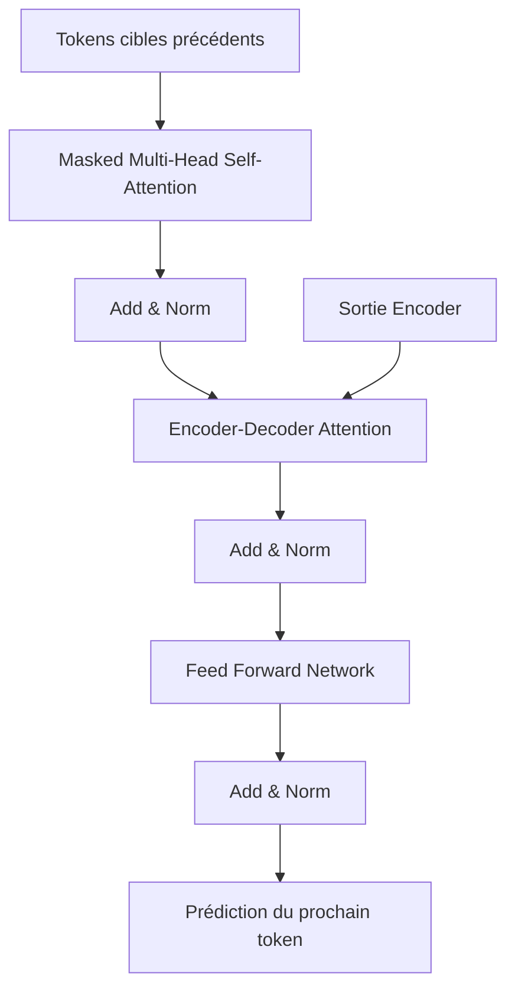

---

## 9.2 Rappel : rôle général du decoder

Le decoder est la partie du Transformer qui produit la séquence cible.

Dans une tâche de traduction :

```txt
Source : The black cat sleeps.
Cible  : Le chat noir dort.
```

l’encoder lit :

```txt
The black cat sleeps.
```

et le decoder génère progressivement :

```txt
Le → chat → noir → dort → .
```

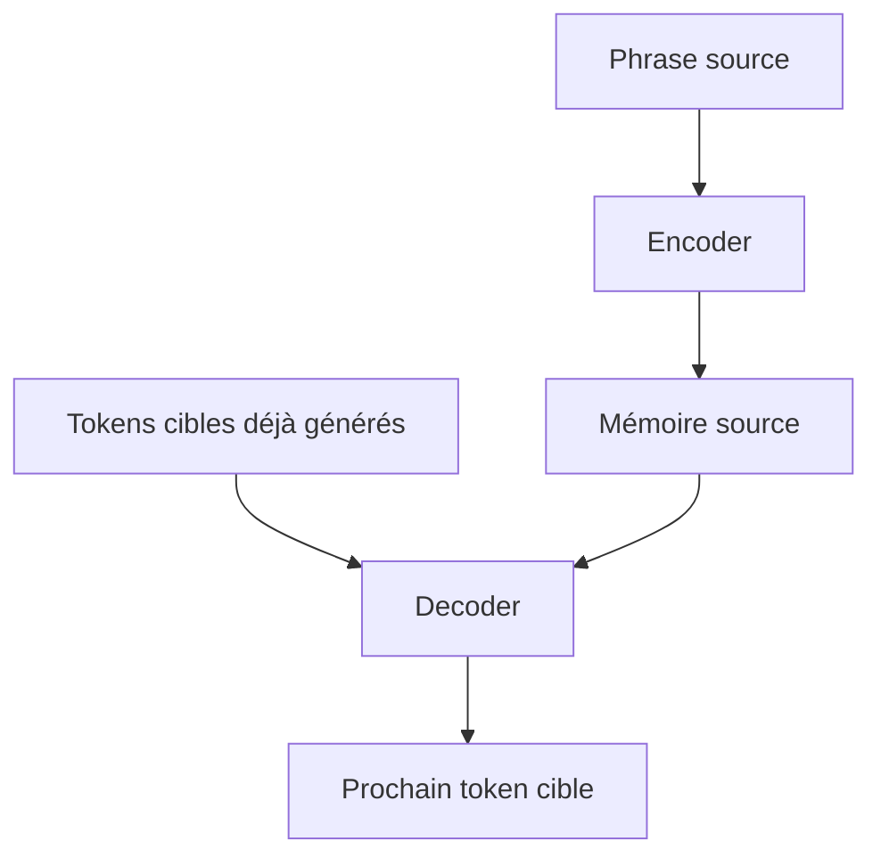

Le decoder ne travaille donc pas seul.

Il est conditionné par :

- ce qu’il a déjà généré ;
    
- ce que l’encoder a compris de la source.
    

---

## 9.3 Le decoder comme modèle autoregressif

Le decoder fonctionne de manière **autoregressive**.

Cela signifie que chaque token est généré à partir des tokens précédents.

La probabilité de la séquence cible se décompose ainsi :

[  
P(y_1, y_2, ..., y_m \mid x) =  
\prod_{t=1}^{m} P(y_t \mid y_{<t}, x)  
]

Autrement dit :

> Pour prédire le token $y_t$, le modèle utilise les tokens cibles précédents $y_{<t}$ et la source $x$.

Exemple :

```txt
P("dort" | "Le chat noir", "The black cat sleeps")
```

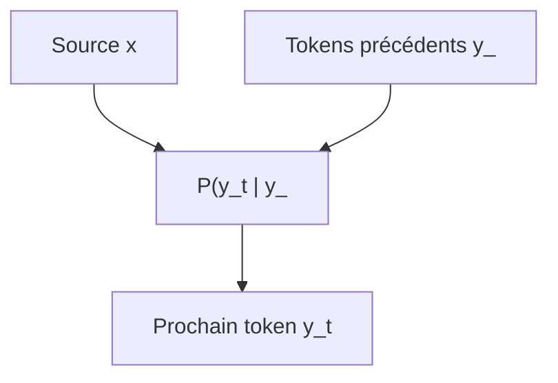

C’est cette logique qui impose l’utilisation d’un masque causal.

---

## 9.4 Pourquoi le decoder ne doit pas voir le futur

Pendant l’entraînement, nous connaissons toute la phrase cible correcte.

Exemple :

```txt
Le chat noir dort.
```

Nous pourrions être tentés de donner toute cette phrase au decoder.

Mais pour prédire `chat`, le modèle ne doit pas voir `noir` ou `dort`.

Sinon, il tricherait.

Exemple interdit :

```txt
Entrée visible pour prédire chat :
Le [chat] noir dort .
```

Le modèle pourrait simplement lire la réponse au lieu d’apprendre à la prédire.

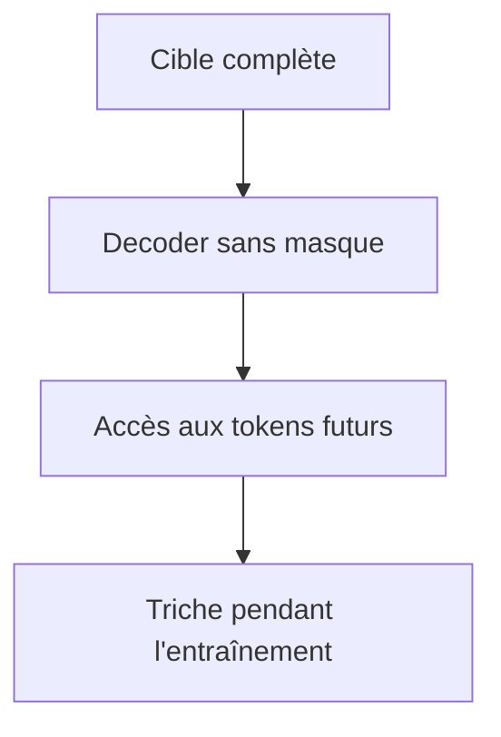

Le masque causal empêche ce problème.

---

## 9.5 Décalage de la cible vers la droite

Pendant l’entraînement, nous utilisons une version décalée de la cible.

Cible réelle :

```txt
Le chat noir dort .
```

Entrée du decoder :

```txt
<BOS> Le chat noir dort
```

Sortie attendue :

```txt
Le chat noir dort .
```

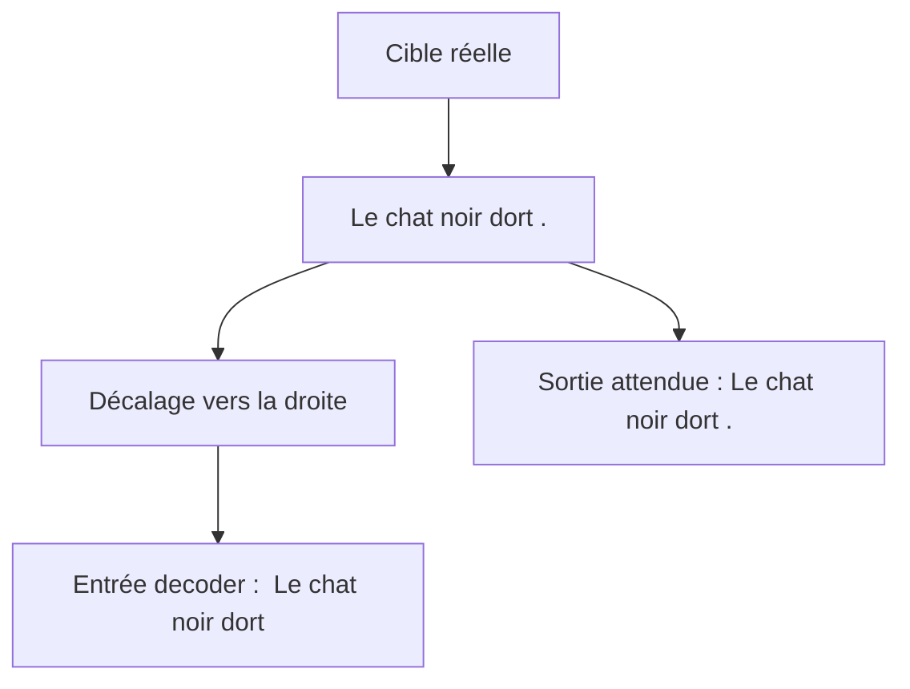

Le token `<BOS>` indique le début de séquence.

Le modèle apprend alors :

|Entrée visible|Token à prédire|
|---|---|
|`<BOS>`|`Le`|
|`<BOS> Le`|`chat`|
|`<BOS> Le chat`|`noir`|
|`<BOS> Le chat noir`|`dort`|
|`<BOS> Le chat noir dort`|`.`|

---

## 9.6 Le masque causal

Le masque causal interdit à chaque position de regarder les positions futures.

Pour une séquence cible :

```txt
t1 t2 t3 t4
```

les autorisations sont :

|Token qui regarde|t1|t2|t3|t4|
|---|--:|--:|--:|--:|
|t1|oui|non|non|non|
|t2|oui|oui|non|non|
|t3|oui|oui|oui|non|
|t4|oui|oui|oui|oui|

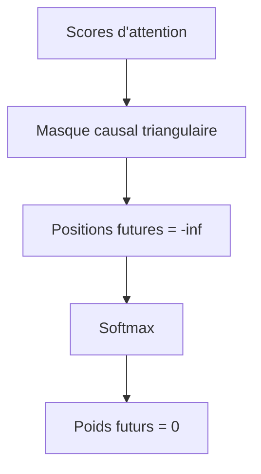

Les positions interdites reçoivent une valeur très négative avant le softmax.

Après le softmax, leur poids devient nul.

---

## 9.7 Masked Multi-Head Self-Attention

La première sous-couche du decoder est une **Masked Multi-Head Self-Attention**.

Elle ressemble à la self-attention de l’encoder, mais avec un masque causal.

Les Queries, Keys et Values viennent tous de la séquence cible partielle :

[  
Q = XW_Q  
]

[  
K = XW_K  
]

[  
V = XW_V  
]

Mais les scores sont masqués avant le softmax :

[  
Attention(Q,K,V) =  
softmax\left(\frac{QK^T + mask}{\sqrt{d_k}}\right)V  
]

Conceptuellement, le masque interdit les positions futures.

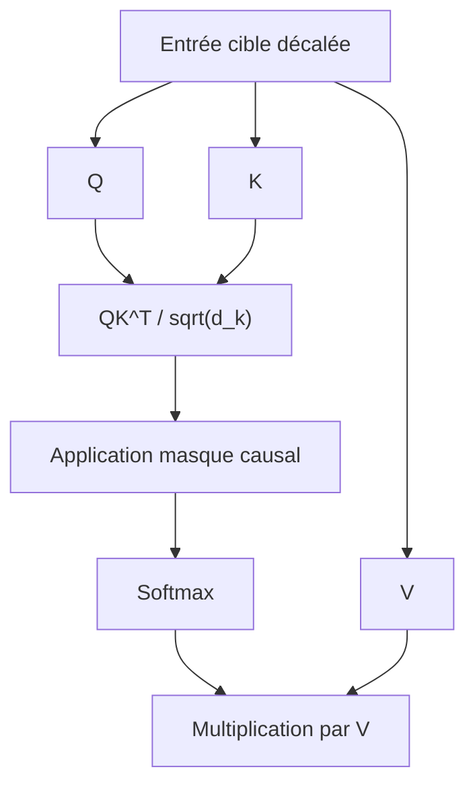

---

## 9.8 Exemple de masked self-attention

Prenons la cible décalée :

```txt
<BOS> Le chat noir
```

Si nous sommes à la position du token `chat`, le modèle peut regarder :

```txt
<BOS> Le chat
```

mais pas :

```txt
noir
```

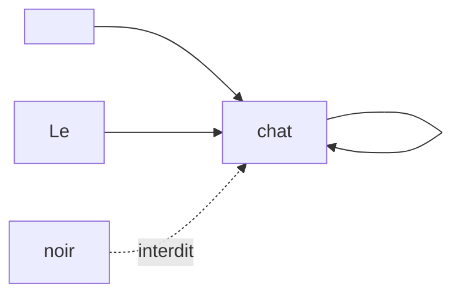

Ainsi, le modèle apprend à prédire chaque token à partir du passé uniquement.

---

## 9.9 Pourquoi plusieurs têtes dans le decoder ?

Comme dans l’encoder, le decoder utilise plusieurs têtes d’attention.

Chaque tête peut apprendre des relations différentes dans la séquence cible partielle.

Par exemple, dans :

```txt
Le chat noir dort sur le canapé.
```

certaines têtes peuvent apprendre :

- déterminant → nom ;
    
- adjectif → nom ;
    
- sujet → verbe ;
    
- préposition → complément ;
    
- ponctuation ;
    
- continuité stylistique.
    

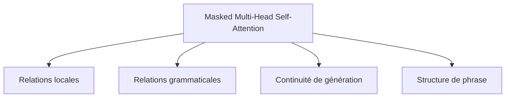

Le masque causal est appliqué à toutes les têtes.

Aucune tête ne peut voir le futur.

---

## 9.10 Premier Add & Norm du decoder

Après la masked self-attention, nous appliquons une connexion résiduelle et une normalisation.

Si l’entrée du decoder est $X$, nous avons :

[  
X_1 = LayerNorm(X + MaskedMHA(X))  
]

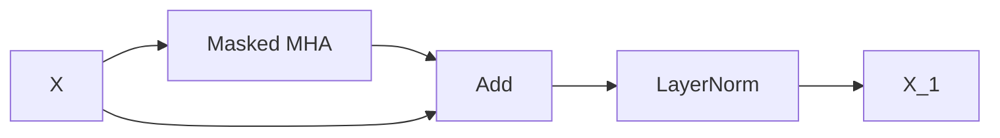

Comme dans l’encoder, cette structure stabilise l’entraînement.

Elle permet aussi de préserver l’information d’origine tout en ajoutant le contexte calculé par l’attention.

---

## 9.11 Deuxième sous-couche : encoder-decoder attention

La deuxième sous-couche est la grande différence entre un bloc decoder et un bloc encoder.

Le decoder doit regarder la mémoire produite par l’encoder.

C’est le rôle de l’**encoder-decoder attention**, aussi appelée **cross-attention**.

Dans cette attention :

- les Queries viennent du decoder ;
    
- les Keys viennent de l’encoder ;
    
- les Values viennent de l’encoder.
    

[  
Q = X_1W_Q  
]

[  
K = HW_K  
]

[  
V = HW_V  
]

où $H$ est la sortie de l’encoder.

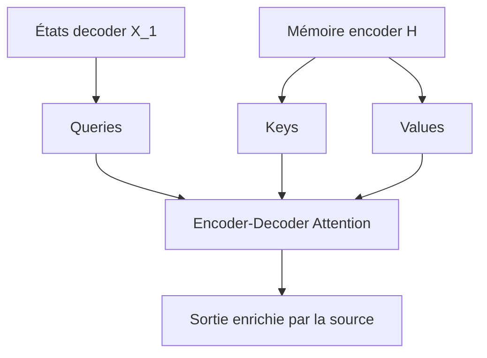

---

## 9.12 Intuition de la cross-attention

La cross-attention permet au decoder de poser une question à la source.

Exemple :

```txt
Source : The black cat sleeps.
Cible partielle : Le chat
```

Le decoder veut prédire :

```txt
noir
```

Pour cela, il doit regarder dans la source et trouver l’information `black`.

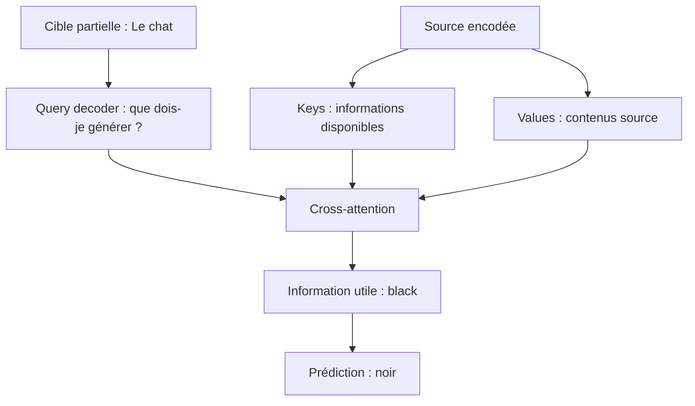

La cross-attention est donc le mécanisme qui relie la génération cible au contenu source.

---

## 9.13 Exemple d’alignement source-cible

Dans la traduction :

```txt
Source : The black cat sleeps.
Cible  : Le chat noir dort.
```

le decoder peut apprendre des alignements souples :

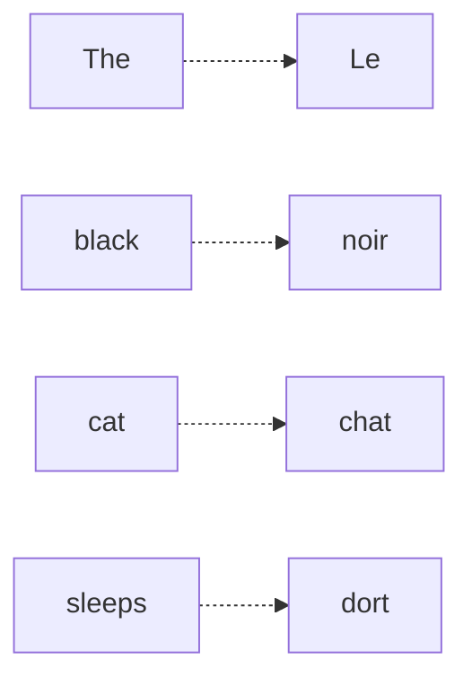

Ces alignements ne sont pas codés à la main.

Ils émergent de l’apprentissage.

La cross-attention permet au decoder de choisir dynamiquement quelles parties de la source regarder à chaque étape.

---

## 9.14 Dimensions de la cross-attention

Supposons :

- longueur cible : $T_t$ ;
    
- longueur source : $T_s$ ;
    
- batch : $B$ ;
    
- dimension modèle : $d_{model}$.
    

Les états du decoder ont la forme :

[  
X_1 \in \mathbb{R}^{B \times T_t \times d_{model}}  
]

La mémoire encoder a la forme :

[  
H \in \mathbb{R}^{B \times T_s \times d_{model}}  
]

Les Queries viennent du decoder :

[  
Q \in \mathbb{R}^{B \times T_t \times d_k}  
]

Les Keys et Values viennent de l’encoder :

[  
K \in \mathbb{R}^{B \times T_s \times d_k}  
]

[  
V \in \mathbb{R}^{B \times T_s \times d_v}  
]

La matrice de scores a donc la forme :

[  
B \times T_t \times T_s  
]

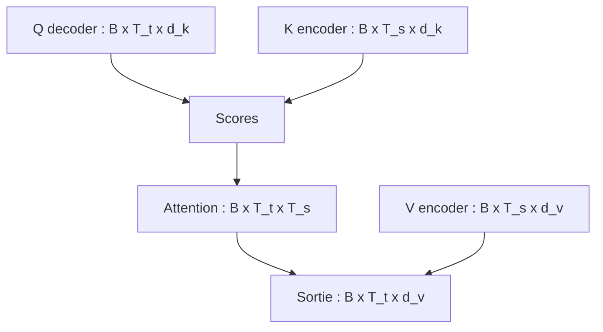

Chaque position cible peut donc regarder toutes les positions source.

---

## 9.15 Cross-attention avec plusieurs têtes

Avec $h$ têtes, les dimensions deviennent :

[  
Q \in \mathbb{R}^{B \times h \times T_t \times d_k}  
]

[  
K \in \mathbb{R}^{B \times h \times T_s \times d_k}  
]

[  
V \in \mathbb{R}^{B \times h \times T_s \times d_v}  
]

Les scores ont la forme :

[  
B \times h \times T_t \times T_s  
]

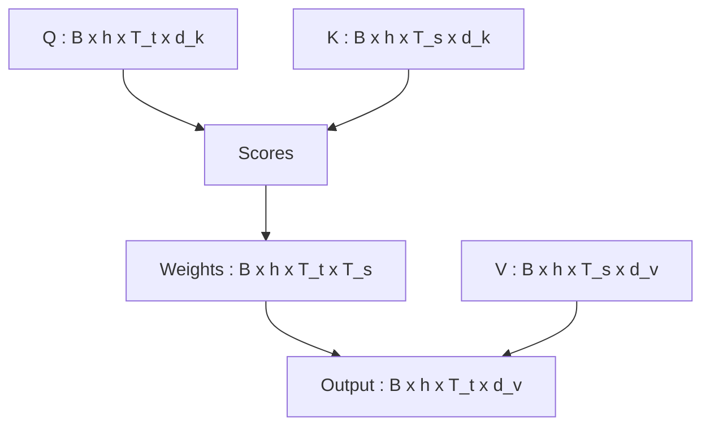

Chaque tête peut apprendre une manière différente d’aligner la cible et la source.

---

## 9.16 Deuxième Add & Norm

Après la cross-attention, nous appliquons un deuxième Add & Norm.

Si (X_1) est l’entrée de la cross-attention :

[  
X_2 = LayerNorm(X_1 + CrossAttention(X_1, H))  
]

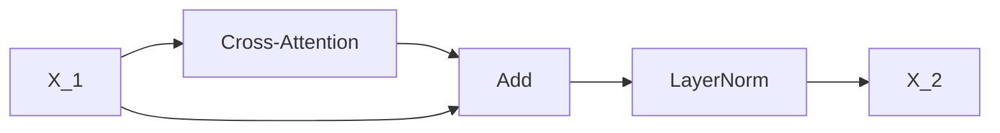

Cette étape produit une représentation cible enrichie par la source.

Autrement dit, chaque position cible contient maintenant :

- les informations des tokens cibles précédents ;
    
- les informations pertinentes de la phrase source.
    

---

## 9.17 Troisième sous-couche : Feed-Forward Network

Comme l’encoder, le decoder contient ensuite un feed-forward network.

Il est appliqué position par position.

[  
FFN(x) = max(0, xW_1 + b_1)W_2 + b_2  
]

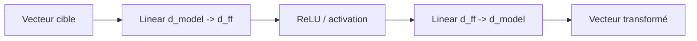

Le FFN ne mélange pas directement les positions.

Il transforme chaque représentation cible après que l’attention lui a apporté le contexte cible et source.

---

## 9.18 Troisième Add & Norm

Après le feed-forward network, nous appliquons un troisième Add & Norm.

[  
Y = LayerNorm(X_2 + FFN(X_2))  
]

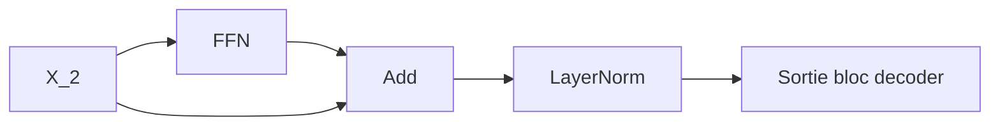

La sortie du bloc decoder garde la forme :

[  
B \times T_t \times d_{model}  
]

Cela permet d’empiler plusieurs blocs decoder.

---

## 9.19 Résumé des calculs d’un bloc decoder

Nous pouvons résumer le bloc decoder avec trois étapes principales.

Première étape : masked self-attention.

[  
X_1 = LayerNorm(X + MaskedMHA(X))  
]

Deuxième étape : cross-attention vers l’encoder.

[  
X_2 = LayerNorm(X_1 + CrossAttention(X_1, H))  
]

Troisième étape : feed-forward network.

[  
Y = LayerNorm(X_2 + FFN(X_2))  
]

où :

- $X$ est l’entrée cible ;
    
- $H$ est la mémoire encoder ;
    
- $Y$ est la sortie du bloc decoder.
    

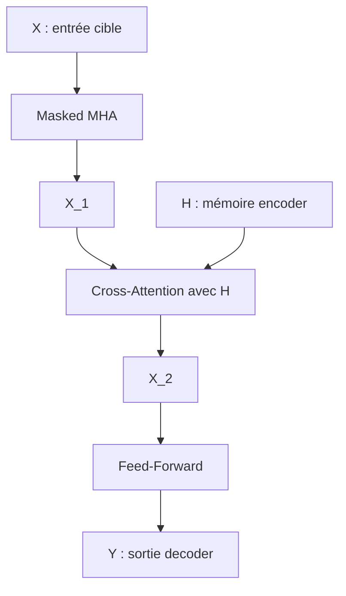

---

## 9.20 Structure complète du bloc decoder

Le schéma complet est :

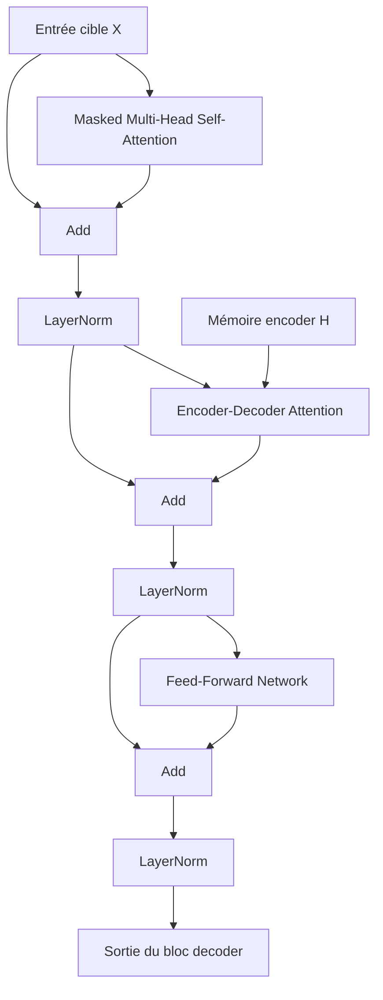

Nous voyons que le decoder a trois sous-couches, donc trois Add & Norm.

C’est une différence importante avec l’encoder, qui n’a que deux sous-couches.

---

## 9.21 Empilement des blocs decoder

Dans le Transformer original, le decoder est composé de plusieurs blocs empilés.

Le papier original utilise :

[  
N = 6  
]

```mermaid
flowchart TD
    X["Entrée cible décalée"] --> D1["Bloc decoder 1"]
    D1 --> D2["Bloc decoder 2"]
    D2 --> D3["Bloc decoder 3"]
    D3 --> D4["Bloc decoder 4"]
    D4 --> D5["Bloc decoder 5"]
    D5 --> D6["Bloc decoder 6"]
    D6 --> O["Sortie decoder"]
```

À chaque couche, le decoder peut :

- mieux structurer la cible partielle ;
    
- mieux regarder la source ;
    
- raffiner ses représentations ;
    
- améliorer la prédiction du prochain token.
    

---

## 9.22 Comment chaque couche decoder utilise l’encoder

La mémoire encoder est transmise à chaque bloc decoder.

```mermaid
flowchart TD
    E["Sortie finale encoder"] --> D1["Cross-attention decoder 1"]
    E --> D2["Cross-attention decoder 2"]
    E --> D3["Cross-attention decoder 3"]
    E --> D4["Cross-attention decoder N"]

    X["Cible décalée"] --> D1
    D1 --> D2
    D2 --> D3
    D3 --> D4
```

Chaque couche decoder peut donc interroger la source à son propre niveau de représentation.

Cela donne au modèle plusieurs occasions d’aligner la cible avec la source.

---

## 9.23 Sortie finale du decoder

Après le dernier bloc decoder, nous obtenons :

[  
Y \in \mathbb{R}^{B \times T_t \times d_{model}}  
]

Cette sortie n’est pas encore une séquence de tokens.

Nous devons la projeter vers le vocabulaire cible.

```mermaid
flowchart LR
    A["Sortie decoder : B x T_t x d_model"] --> B["Linear d_model -> V"]
    B --> C["Logits : B x T_t x V"]
    C --> D["Softmax"]
    D --> E["Probabilités tokens"]
```

Pour chaque position cible, nous obtenons une distribution sur le vocabulaire.

---

## 9.24 Entraînement du decoder

Pendant l’entraînement, le decoder reçoit la cible décalée.

Exemple :

```txt
Entrée decoder :
<BOS> Le chat noir dort

Sortie attendue :
Le chat noir dort .
```

Le modèle produit une distribution pour chaque position.

```mermaid
flowchart TD
    A["<BOS>"] --> P1["Prédire Le"]
    B["Le"] --> P2["Prédire chat"]
    C["chat"] --> P3["Prédire noir"]
    D["noir"] --> P4["Prédire dort"]
    E["dort"] --> P5["Prédire ."]
```

La loss compare les prédictions avec les vrais tokens cibles.

C’est souvent une cross-entropy.

---

## 9.25 Teacher forcing

Pendant l’entraînement, nous donnons au decoder les vrais tokens précédents.

C’est ce qu’on appelle **teacher forcing**.

Par exemple, pour prédire `dort`, le modèle reçoit :

```txt
<BOS> Le chat noir
```

même si, en inférence, il pourrait avoir généré un mauvais token avant.

```mermaid
flowchart TD
    A["Tokens réels précédents"] --> B["Entrée decoder"]
    B --> C["Prédiction"]
    D["Token réel suivant"] --> E["Loss"]
    C --> E
```

Le teacher forcing rend l’entraînement plus efficace, mais il crée une différence entre entraînement et inférence.

---

## 9.26 Inférence du decoder

En inférence, nous ne connaissons pas la phrase cible.

Le decoder doit générer un token à la fois.

Processus :

1. nous encodons la source ;
    
2. nous donnons `<BOS>` au decoder ;
    
3. le decoder prédit un token ;
    
4. nous ajoutons ce token à la cible partielle ;
    
5. nous recommençons.
    

```mermaid
flowchart TD
    A["Source"] --> B["Encoder"]
    B --> H["Mémoire encoder"]

    C["<BOS>"] --> D["Decoder"]
    H --> D
    D --> E["Distribution prochain token"]
    E --> F["Choix token"]
    F --> G["Ajout à la séquence cible"]
    G --> D
```

La génération s’arrête quand le modèle produit `<EOS>` ou quand une longueur maximale est atteinte.

---

## 9.27 Exemple d’inférence pas à pas

Source :

```txt
The cat sleeps.
```

Étape 1 :

```txt
Entrée decoder : <BOS>
Prédiction : Le
```

Étape 2 :

```txt
Entrée decoder : <BOS> Le
Prédiction : chat
```

Étape 3 :

```txt
Entrée decoder : <BOS> Le chat
Prédiction : dort
```

Étape 4 :

```txt
Entrée decoder : <BOS> Le chat dort
Prédiction : .
```

Étape 5 :

```txt
Entrée decoder : <BOS> Le chat dort .
Prédiction : <EOS>
```

```mermaid
flowchart LR
    A["<BOS>"] --> B["Le"]
    B --> C["chat"]
    C --> D["dort"]
    D --> E["."]
    E --> F["<EOS>"]
```

---

## 9.28 Greedy decoding

La stratégie la plus simple consiste à choisir à chaque étape le token le plus probable.

C’est le **greedy decoding**.

Exemple :

|Token|Probabilité|
|---|--:|
|`chat`|0.62|
|`chien`|0.21|
|`canapé`|0.07|

Le modèle choisit :

```txt
chat
```

```mermaid
flowchart TD
    A["Distribution vocabulaire"] --> B["Token le plus probable"]
    B --> C["Ajout à la séquence"]
```

Cette méthode est simple, mais elle peut produire des traductions moins bonnes, car le meilleur choix local n’est pas toujours le meilleur choix global.

---

## 9.29 Beam search

En traduction automatique, on utilise souvent le **beam search**.

Au lieu de garder une seule séquence candidate, nous gardons plusieurs hypothèses.

Par exemple, avec un beam de taille 3, nous gardons les 3 meilleures séquences partielles à chaque étape.

```mermaid
flowchart TD
    A["<BOS>"] --> B1["Le"]
    A --> B2["Un"]
    A --> B3["Ce"]

    B1 --> C1["Le chat"]
    B1 --> C2["Le chien"]
    B2 --> C3["Un chat"]

    C1 --> D1["Le chat dort"]
    C2 --> D2["Le chien court"]
    C3 --> D3["Un chat dort"]
```

Le beam search explore plusieurs traductions possibles et choisit la plus probable selon le modèle.

Nous n’approfondissons pas encore ce point, mais il est important de savoir que la sortie du decoder peut être utilisée avec différentes stratégies de génération.

---

## 9.30 Différence entre entraînement et inférence

La différence est fondamentale.

Pendant l’entraînement :

```txt
Le decoder reçoit les vrais tokens précédents.
```

Pendant l’inférence :

```txt
Le decoder reçoit ses propres prédictions précédentes.
```

```mermaid
flowchart TD
    A["Entraînement"] --> B["Entrée = cible réelle décalée"]
    A --> C["Prédictions parallèles"]

    D["Inférence"] --> E["Entrée = tokens générés"]
    D --> F["Génération pas à pas"]
```

Cette différence peut provoquer une accumulation d’erreurs.

Si le modèle se trompe au début, les prédictions suivantes peuvent être affectées.

---

## 9.31 Pourquoi l’entraînement peut être parallèle

Même si le decoder est autoregressif, pendant l’entraînement nous pouvons calculer toutes les positions en parallèle.

Pourquoi ?

Parce que nous connaissons toute la cible décalée.

Le masque causal garantit que chaque position ne voit que le passé.

```mermaid
flowchart TD
    A["Cible décalée complète"] --> B["Decoder"]
    C["Masque causal"] --> B
    B --> D["Prédictions pour toutes les positions"]
```

Ainsi, le modèle peut prédire :

```txt
Le, chat, noir, dort, .
```

en un seul passage, tout en respectant la contrainte causale.

---

## 9.32 Pourquoi l’inférence est séquentielle

En inférence, nous ne connaissons pas les futurs tokens.

Nous devons donc générer :

```txt
token 1 puis token 2 puis token 3...
```

Chaque token dépend des précédents.

```mermaid
flowchart LR
    A["Prédire y1"] --> B["Prédire y2"]
    B --> C["Prédire y3"]
    C --> D["Prédire y4"]
```

C’est pourquoi l’inférence d’un modèle autoregressif est plus difficile à paralléliser que l’entraînement.

---

## 9.33 KV cache en inférence

Dans les modèles decoder-only modernes, et aussi dans les decoders autoregressifs, on utilise souvent un **KV cache**.

L’idée est de ne pas recalculer les Keys et Values des tokens précédents à chaque étape.

À chaque nouveau token, nous ajoutons ses nouvelles Keys et Values au cache.

```mermaid
flowchart TD
    A["Tokens précédents"] --> B["Keys/Values déjà calculées"]
    B --> C["KV cache"]

    D["Nouveau token"] --> E["Nouvelles Key/Value"]
    E --> C

    C --> F["Attention du prochain token"]
```

Dans le Transformer original de traduction, cette idée peut aussi être utile en génération.

Nous reviendrons sur les caches dans les chapitres liés aux modèles decoder-only et aux LLM modernes.

---

## 9.34 Pourquoi le decoder est plus complexe que l’encoder

Le bloc encoder contient deux sous-couches :

1. self-attention ;
    
2. feed-forward.
    

Le bloc decoder contient trois sous-couches :

1. masked self-attention ;
    
2. cross-attention ;
    
3. feed-forward.
    

```mermaid
flowchart TD
    A["Encoder block"] --> B["Self-attention"]
    A --> C["Feed-forward"]

    D["Decoder block"] --> E["Masked self-attention"]
    D --> F["Cross-attention"]
    D --> G["Feed-forward"]
```

Le decoder est donc plus complexe parce qu’il doit à la fois :

- gérer la cible déjà produite ;
    
- respecter la contrainte causale ;
    
- interroger la source encodée.
    

---

## 9.35 Comparaison encoder / decoder

|Élément|Encoder|Decoder|
|---|---|---|
|Entrée principale|Source|Cible décalée|
|Self-attention|Bidirectionnelle|Masquée causalement|
|Cross-attention|Non|Oui|
|Nombre de sous-couches|2|3|
|Rôle|Comprendre la source|Générer la cible|
|Peut voir le futur ?|Oui, côté source|Non, côté cible|

```mermaid
flowchart TD
    A["Encoder"] --> B["Lire toute la source"]
    A --> C["Construire une mémoire"]

    D["Decoder"] --> E["Lire la cible passée"]
    D --> F["Regarder la source"]
    D --> G["Prédire la suite"]
```

Cette comparaison est essentielle pour comprendre l’architecture encoder-decoder.

---

## 9.36 Decoder dans le Transformer original vs GPT

Le decoder du Transformer original ressemble aux modèles GPT, mais il n’est pas identique.

Le decoder original contient une cross-attention vers l’encoder.

GPT est généralement **decoder-only** : il n’a pas d’encoder à regarder.

```mermaid
flowchart TD
    A["Decoder Transformer original"] --> B["Masked self-attention"]
    A --> C["Cross-attention vers encoder"]
    A --> D["Feed-forward"]

    E["GPT decoder-only"] --> F["Masked self-attention"]
    E --> G["Feed-forward"]
    E --> H["Pas d'encoder séparé"]
```

Donc :

- le decoder original génère conditionné par une source encodée ;
    
- GPT génère conditionné par son contexte textuel précédent.
    

---

## 9.37 Decoder dans la traduction

Dans la traduction, le decoder doit produire une phrase fluide dans la langue cible.

Mais il doit aussi rester fidèle à la source.

Ces deux contraintes correspondent aux deux attentions :

|Contrainte|Mécanisme|
|---|---|
|Cohérence de la cible|Masked self-attention|
|Fidélité à la source|Cross-attention|

```mermaid
flowchart TD
    A["Decoder"] --> B["Langue cible cohérente"]
    A --> C["Respect du contenu source"]

    B --> D["Masked self-attention"]
    C --> E["Cross-attention"]
```

Un bon decoder doit équilibrer les deux.

---

## 9.38 Exemple : réordonnancement entre langues

L’ordre des mots peut changer entre les langues.

Exemple :

```txt
Source : The black cat
Cible  : Le chat noir
```

En anglais :

```txt
black → cat
```

En français :

```txt
chat → noir
```

```mermaid
flowchart LR
    A["black"] -.-> D["noir"]
    B["cat"] -.-> C["chat"]
    A --> B
    C --> D
```

La cross-attention aide le decoder à retrouver les bonnes correspondances même si l’ordre change.

---

## 9.39 Exemple : accord grammatical

Le decoder doit aussi produire des formes correctes dans la langue cible.

Exemple :

```txt
The black cats sleep.
Les chats noirs dorment.
```

Le decoder doit gérer :

- pluriel de `chats` ;
    
- accord de `noirs` ;
    
- conjugaison `dorment`.
    

```mermaid
flowchart TD
    A["Source : cats"] --> B["Information pluriel"]
    B --> C["Decoder"]
    C --> D["chats"]
    C --> E["noirs"]
    C --> F["dorment"]
```

La cross-attention fournit des informations depuis la source, mais la masked self-attention aide aussi à maintenir la cohérence grammaticale de la cible.

---

## 9.40 Decoder et hallucination

Dans les modèles génératifs, le decoder peut produire des tokens plausibles mais non fidèles à la source.

En traduction, cela peut donner une phrase fluide mais incorrecte.

```mermaid
flowchart TD
    A["Source"] --> B["Information réelle"]
    C["Decoder"] --> D["Phrase cible fluide"]
    D --> E["Risque : ajout ou omission"]
```

La cross-attention réduit ce risque en permettant au decoder de regarder la source.

Mais elle ne garantit pas une fidélité parfaite.

---

## 9.41 Le decoder comme combinaison de deux contextes

À chaque position cible, le decoder combine deux contextes :

1. le contexte cible passé ;
    
2. le contexte source.
    

```mermaid
flowchart TD
    A["Contexte cible passé"] --> C["Représentation decoder"]
    B["Contexte source"] --> C
    C --> D["Prédiction prochain token"]
```

Nous pouvons résumer :

$$  
decoder\ state = f(y_{<t}, x)  
$$

où :

- $y_{<t}$ est la cible déjà générée ;
    
- $x$ est la source encodée.
    

---

## 9.42 Dimensions complètes du bloc decoder

Supposons :

- batch : $B$ ;
    
- longueur cible : $T_t$ ;
    
- longueur source : $T_s$ ;
    
- dimension modèle : $d_{model}$.
    

Entrée cible :

[  
X \in \mathbb{R}^{B \times T_t \times d_{model}}  
]

Mémoire encoder :

[  
H \in \mathbb{R}^{B \times T_s \times d_{model}}  
]

Après masked self-attention :

[  
X_1 \in \mathbb{R}^{B \times T_t \times d_{model}}  
]

Après cross-attention :

[  
X_2 \in \mathbb{R}^{B \times T_t \times d_{model}}  
]

Après FFN :

[  
Y \in \mathbb{R}^{B \times T_t \times d_{model}}  
]

```mermaid
flowchart LR
    A["X : B x T_t x d_model"] --> B["Masked MHA"]
    B --> C["B x T_t x d_model"]
    C --> D["Cross-attention avec H"]
    H["H : B x T_s x d_model"] --> D
    D --> E["B x T_t x d_model"]
    E --> F["FFN"]
    F --> G["Y : B x T_t x d_model"]
```

La longueur source $T_s$ apparaît dans la cross-attention, mais la sortie du decoder reste alignée sur la longueur cible $T_t$.

---

## 9.43 Pseudo-code du bloc decoder

Nous pouvons écrire un bloc decoder en pseudo-code :

```python
def decoder_block(x, encoder_memory):
    # 1. Masked self-attention sur la cible
    a = masked_self_attention(x, x, x)
    x1 = layer_norm(x + a)

    # 2. Cross-attention vers la mémoire encoder
    c = cross_attention(query=x1, key=encoder_memory, value=encoder_memory)
    x2 = layer_norm(x1 + c)

    # 3. Feed-forward position-wise
    f = feed_forward(x2)
    y = layer_norm(x2 + f)

    return y
```

Avec masques :

```python
def decoder_block(x, encoder_memory, causal_mask=None, source_padding_mask=None):
    a = masked_self_attention(x, x, x, mask=causal_mask)
    x1 = layer_norm(x + dropout(a))

    c = cross_attention(
        query=x1,
        key=encoder_memory,
        value=encoder_memory,
        mask=source_padding_mask,
    )
    x2 = layer_norm(x1 + dropout(c))

    f = feed_forward(x2)
    y = layer_norm(x2 + dropout(f))

    return y
```

Ce pseudo-code montre bien la différence entre :

```txt
self-attention sur la cible
```

et :

```txt
cross-attention vers la source
```

---

## 9.44 Version PyTorch conceptuelle

Voici une version simplifiée d’un bloc decoder en PyTorch :

```python
import torch
import torch.nn as nn

class DecoderBlock(nn.Module):
    def __init__(self, d_model, num_heads, d_ff, dropout=0.1):
        super().__init__()

        self.masked_self_attention = nn.MultiheadAttention(
            embed_dim=d_model,
            num_heads=num_heads,
            dropout=dropout,
            batch_first=True,
        )

        self.cross_attention = nn.MultiheadAttention(
            embed_dim=d_model,
            num_heads=num_heads,
            dropout=dropout,
            batch_first=True,
        )

        self.feed_forward = nn.Sequential(
            nn.Linear(d_model, d_ff),
            nn.ReLU(),
            nn.Linear(d_ff, d_model),
        )

        self.norm1 = nn.LayerNorm(d_model)
        self.norm2 = nn.LayerNorm(d_model)
        self.norm3 = nn.LayerNorm(d_model)

        self.dropout = nn.Dropout(dropout)

    def forward(
        self,
        x,
        encoder_memory,
        causal_mask=None,
        target_padding_mask=None,
        source_padding_mask=None,
    ):
        self_attn_output, _ = self.masked_self_attention(
            query=x,
            key=x,
            value=x,
            attn_mask=causal_mask,
            key_padding_mask=target_padding_mask,
        )

        x = self.norm1(x + self.dropout(self_attn_output))

        cross_attn_output, _ = self.cross_attention(
            query=x,
            key=encoder_memory,
            value=encoder_memory,
            key_padding_mask=source_padding_mask,
        )

        x = self.norm2(x + self.dropout(cross_attn_output))

        ff_output = self.feed_forward(x)

        x = self.norm3(x + self.dropout(ff_output))

        return x
```

Cette version reste pédagogique.

Les implémentations industrielles ajoutent souvent :

- Pre-LN ;
    
- GELU ou SwiGLU ;
    
- FlashAttention ;
    
- KV cache ;
    
- optimisations mémoire ;
    
- fusion d’opérations.
    

---

## 9.45 Masques utilisés dans le decoder

Le decoder peut utiliser plusieurs masques.

|Masque|Rôle|
|---|---|
|Causal mask|Empêche de regarder les tokens futurs|
|Target padding mask|Ignore les `<pad>` dans la cible|
|Source padding mask|Ignore les `<pad>` dans la source pendant la cross-attention|

```mermaid
flowchart TD
    A["Decoder"] --> B["Causal mask"]
    A --> C["Target padding mask"]
    A --> D["Source padding mask"]

    B --> E["Pas de futur"]
    C --> F["Ignore padding cible"]
    D --> G["Ignore padding source"]
```

Nous détaillerons les masques dans le chapitre 10.

---

## 9.46 Erreur fréquente : oublier que la cross-attention n’est pas causale

La cross-attention regarde la source encodée.

La source est déjà entièrement connue.

Donc, en traduction, le decoder peut regarder toute la source.

Le masque causal s’applique à la self-attention cible, pas à la cross-attention source.

```mermaid
flowchart TD
    A["Masked self-attention"] --> B["Causal mask"]
    C["Cross-attention"] --> D["Pas de causal mask sur la source"]
    C --> E["Source complète visible"]
```

Il peut toutefois y avoir un padding mask pour ignorer les tokens `<pad>` de la source.

---

## 9.47 Erreur fréquente : croire que le decoder voit la cible future via l’encoder

L’encoder ne reçoit que la source.

Il ne contient pas les tokens futurs de la cible.

Donc la cross-attention ne permet pas au decoder de tricher sur la cible future.

```mermaid
flowchart TD
    A["Encoder"] --> B["Contient la source"]
    B --> C["Ne contient pas la cible future"]

    D["Decoder"] --> E["Cross-attention vers source"]
    E --> F["Pas d'accès aux futurs tokens cibles"]
```

Le risque de fuite du futur vient de la self-attention cible, d’où le masque causal.

---

## 9.48 Erreur fréquente : confondre cible décalée et masque causal

Le décalage de la cible et le masque causal sont deux choses différentes.

Le décalage prépare l’entrée et la sortie :

```txt
Entrée : <BOS> Le chat
Sortie : Le chat dort
```

Le masque causal contrôle ce que chaque position peut regarder.

```mermaid
flowchart TD
    A["Décalage cible"] --> B["Aligne entrée et prédiction"]
    C["Masque causal"] --> D["Empêche l'accès au futur"]
```

Les deux sont nécessaires pendant l’entraînement.

---

## 9.49 Erreur fréquente : croire que le decoder produit directement du texte

Le decoder produit des vecteurs.

Ces vecteurs sont ensuite projetés vers le vocabulaire.

```mermaid
flowchart LR
    A["Sortie decoder"] --> B["Vecteurs"]
    B --> C["Linear vers vocabulaire"]
    C --> D["Logits"]
    D --> E["Softmax"]
    E --> F["Choix token"]
```

Le texte final apparaît seulement après la sélection des tokens.

---

## 9.50 Erreur fréquente : penser que toutes les positions sont générées en parallèle en inférence

Pendant l’entraînement, nous pouvons calculer toutes les positions en parallèle grâce au masque.

Mais pendant l’inférence, nous devons générer progressivement.

```mermaid
flowchart TD
    A["Entraînement"] --> B["Toutes les positions en parallèle"]
    C["Inférence"] --> D["Une position après l'autre"]
```

C’est une différence fondamentale.

---

## 9.51 Synthèse mathématique du bloc decoder

Soit :

[  
X \in \mathbb{R}^{B \times T_t \times d_{model}}  
]

l’entrée cible, et :

[  
H \in \mathbb{R}^{B \times T_s \times d_{model}}  
]

la mémoire encoder.

Première sous-couche :

[  
X_1 = LayerNorm(X + MaskedMHA(X))  
]

Deuxième sous-couche :

[  
X_2 = LayerNorm(X_1 + CrossAttention(Q=X_1, K=H, V=H))  
]

Troisième sous-couche :

[  
Y = LayerNorm(X_2 + FFN(X_2))  
]

La sortie est :

[  
Y \in \mathbb{R}^{B \times T_t \times d_{model}}  
]

---

## 9.52 Schéma global de synthèse

```mermaid
flowchart TD
    X["Entrée cible décalée : B x T_t x d_model"]
    H["Mémoire encoder : B x T_s x d_model"]

    X --> MSA["Masked Multi-Head Self-Attention"]
    MSA --> ADD1["Add & Norm"]
    X --> ADD1

    ADD1 --> CA["Encoder-Decoder Cross-Attention"]
    H --> CA
    CA --> ADD2["Add & Norm"]
    ADD1 --> ADD2

    ADD2 --> FFN["Feed-Forward Network"]
    FFN --> ADD3["Add & Norm"]
    ADD2 --> ADD3

    ADD3 --> Y["Sortie decoder : B x T_t x d_model"]
    Y --> L["Linear vers vocabulaire"]
    L --> P["Probabilités du prochain token"]
```

Ce schéma résume le bloc decoder et son rôle dans la génération.

---

## 9.53 Résumé du chapitre

Nous avons étudié le bloc decoder en détail.

Nous avons vu qu’il est plus complexe que le bloc encoder, car il contient trois sous-couches :

1. une **masked multi-head self-attention** ;
    
2. une **encoder-decoder attention**, ou cross-attention ;
    
3. un **feed-forward network**.
    

La masked self-attention permet au decoder de construire une représentation de la cible déjà générée sans regarder les tokens futurs.

La cross-attention permet au decoder de regarder la mémoire produite par l’encoder.

Le feed-forward network transforme ensuite chaque position cible individuellement.

Nous avons également distingué :

- entraînement et inférence ;
    
- cible décalée et masque causal ;
    
- self-attention et cross-attention ;
    
- greedy decoding et beam search ;
    
- decoder du Transformer original et decoder-only de type GPT.
    

Le point central est :

> Le decoder génère une séquence cible de gauche à droite, en combinant le contexte cible passé et la mémoire de la source encodée.

---

## 9.54 Questions de compréhension

### 9.54.1 Question 1

Pourquoi le decoder est-il plus complexe que l’encoder ?

Réponse attendue : parce qu’il doit gérer la cible déjà générée, empêcher l’accès au futur et regarder la source encodée.

### 9.54.2 Question 2

À quoi sert la masked self-attention ?

Réponse attendue : elle permet aux tokens cibles de regarder uniquement les tokens précédents ou présents, mais pas les tokens futurs.

### 9.54.3 Question 3

À quoi sert le masque causal ?

Réponse attendue : il empêche le decoder de tricher en regardant les futurs tokens de la séquence cible.

### 9.54.4 Question 4

Pourquoi décale-t-on la cible vers la droite pendant l’entraînement ?

Réponse attendue : pour aligner l’entrée du decoder avec la tâche de prédiction du token suivant.

### 9.54.5 Question 5

Qu’est-ce que la cross-attention ?

Réponse attendue : c’est une attention où les Queries viennent du decoder, tandis que les Keys et Values viennent de l’encoder.

### 9.54.6 Question 6

Dans la cross-attention, d’où viennent $Q$, $K$ et $V$ ?

Réponse attendue : $Q$ vient du decoder ; $K$ et $V$ viennent de la mémoire encoder.

### 9.54.7 Question 7

Quelle est la différence entre entraînement et inférence pour le decoder ?

Réponse attendue : pendant l’entraînement, le decoder reçoit les vrais tokens précédents ; pendant l’inférence, il reçoit ses propres prédictions précédentes.

### 9.54.8 Question 8

Pourquoi l’entraînement peut-il être parallèle alors que l’inférence est séquentielle ?

Réponse attendue : parce qu’en entraînement la cible décalée complète est connue et masquée causalement, tandis qu’en inférence les tokens futurs ne sont pas encore générés.

### 9.54.9 Question 9

Le decoder produit-il directement du texte ?

Réponse attendue : non. Il produit des vecteurs, ensuite projetés en logits sur le vocabulaire, puis convertis en tokens.

### 9.54.10 Question 10

Quelle est la principale différence entre le decoder du Transformer original et GPT ?

Réponse attendue : le decoder original possède une cross-attention vers un encoder, tandis que GPT est généralement decoder-only et n’a pas d’encoder séparé.

---

## 9.55 Transition vers le chapitre 10

Nous avons vu que le decoder dépend fortement des masques d’attention.

En particulier, le masque causal est indispensable pour empêcher le modèle de voir les futurs tokens.

Mais il existe plusieurs types de masques :

- padding mask ;
    
- causal mask ;
    
- look-ahead mask ;
    
- masques combinés ;
    
- masques source et cible.
    

Dans le chapitre suivant, nous allons donc étudier précisément les **masques d’attention**.

Nous verrons comment ils modifient les scores d’attention avant le softmax, pourquoi ils utilisent souvent la valeur (-\infty), et comment ils garantissent que le Transformer respecte les contraintes de la tâche.

---
> [!info] Livre « Les transformers » — chapitre 9/30
> [[Les transformers — Sommaire|Sommaire]] · [[Les transformers — 08 — Bloc Encoder en détail|← 08 — Bloc Encoder en détail]] · [[Les transformers — 10 — Masques d’attention|10 — Masques d’attention →]]
