> [!info] Livre « Les transformers » — chapitre 10/30
> [[Les transformers — Sommaire|Sommaire]] · [[Les transformers — 09 — Bloc Decoder en détail|← 09 — Bloc Decoder en détail]] · [[Les transformers — 11 — Feed-Forward Network et non-linéarités|11 — Feed-Forward Network et non-linéarités →]]

# Chapitre 10 — Masques d’attention
## 10.1 Objectif du chapitre

Dans les chapitres précédents, nous avons étudié :

- la Scaled Dot-Product Attention ;
    
- la Multi-Head Attention ;
    
- l’encoder ;
    
- le decoder ;
    
- la masked self-attention du decoder.
    

Nous avons déjà rencontré plusieurs fois l’idée de **masque d’attention**.

Dans ce chapitre, nous allons l’étudier en détail.

Dans notre plan de cours, ce chapitre est consacré au padding mask, au causal mask, au look-ahead mask, au fait que le decoder ne doit pas voir le futur, à la manière dont les masques modifient les scores d’attention, au lien avec la génération autoregressive et aux erreurs fréquentes liées aux masques.

L’idée centrale est la suivante :

> Un masque d’attention sert à interdire certaines connexions entre tokens avant l’application du softmax.

Le masque ne change pas directement les tokens.

Il change ce que chaque token a le droit de regarder.

---

## 10.2 Rappel : où intervient le masque dans l’attention ?

La formule de base de l’attention est :

[  
Attention(Q,K,V) =  
softmax\left(\frac{QK^T}{\sqrt{d_k}}\right)V  
]

Avec un masque, nous écrivons conceptuellement :

[  
Attention(Q,K,V) =  
softmax\left(\frac{QK^T}{\sqrt{d_k}} + mask\right)V  
]

Le masque est donc appliqué **avant le softmax**.

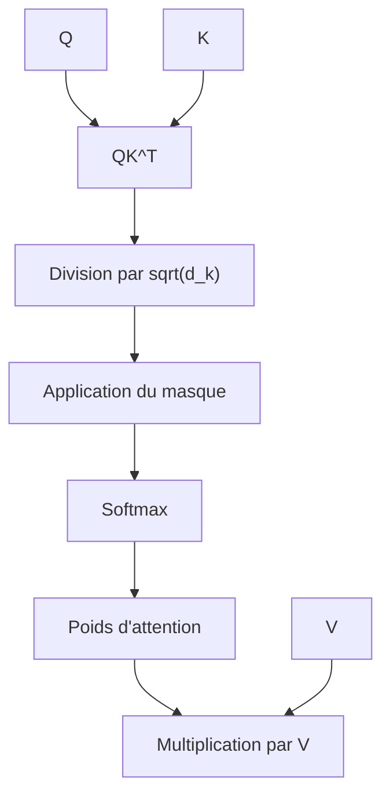

C’est très important.

Nous ne masquons pas les Values directement.

Nous masquons les **scores d’attention** avant qu’ils deviennent des poids.

---

## 10.3 Pourquoi masquer les scores plutôt que les poids ?

Nous voulons empêcher certaines positions d’obtenir un poids d’attention positif.

Le softmax transforme les scores en poids.

Si une position reçoit un score très négatif, par exemple :

[  
-\infty  
]

alors après softmax, son poids devient :

[  
0  
]

Ainsi, le token interdit ne contribue pas à la somme pondérée des Values.

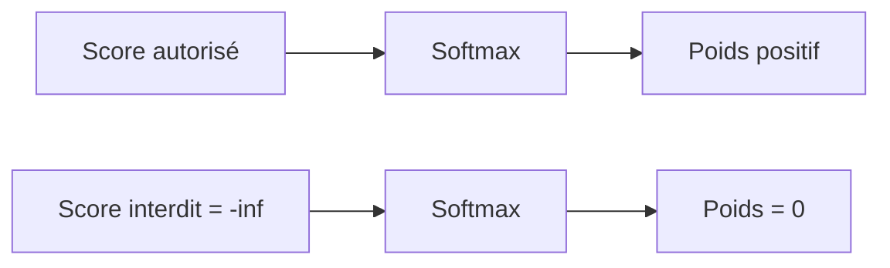

En pratique informatique, on utilise souvent une très grande valeur négative, par exemple :

```txt
-1e9
```

ou :

```txt
float("-inf")
```

selon les bibliothèques et les types numériques.

---

## 10.4 Masque comme contrainte de visibilité

Un masque répond à la question :

> Quels tokens sont visibles depuis une position donnée ?

Dans une séquence :

```txt
t1 t2 t3 t4
```

nous pouvons autoriser ou interdire certaines connexions.

Sans masque, chaque token peut regarder tous les autres :

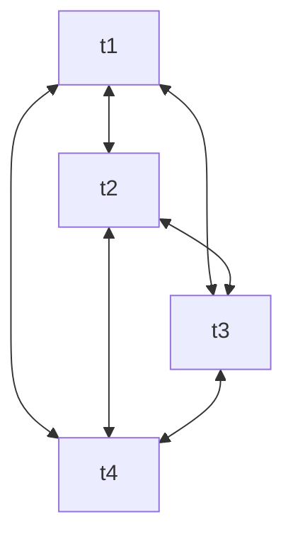

Avec un masque, certaines connexions disparaissent.

Par exemple, dans un modèle causal, `t2` ne peut pas regarder `t3` ni `t4`.

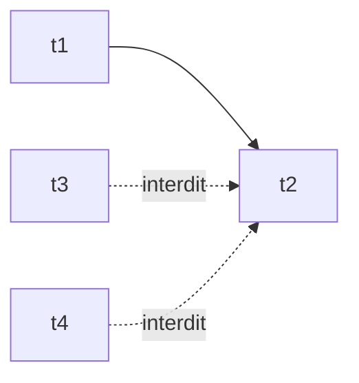

Le masque impose donc une structure de visibilité.

---

## 10.5 Les deux grandes familles de masques

Nous allons distinguer deux grandes familles :

1. les masques de **padding** ;
    
2. les masques **causaux**.
    

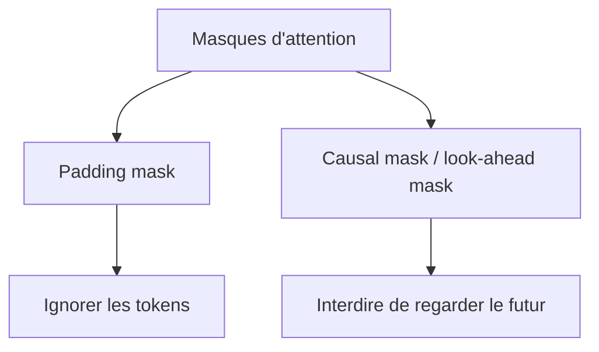

Ces deux masques peuvent être utilisés séparément ou combinés.

Dans l’encoder, nous utilisons souvent un padding mask.

Dans le decoder, nous utilisons souvent :

- un causal mask ;
    
- un target padding mask ;
    
- parfois un source padding mask dans la cross-attention.
    

---

## 10.6 Le padding mask

Le **padding mask** sert à ignorer les tokens de remplissage.

Dans un batch, toutes les séquences doivent souvent avoir la même longueur.

Exemple :

```txt
Phrase 1 : Le chat dort .
Phrase 2 : Le chien court dans le jardin .
```

Si nous fixons une longueur commune de 7 tokens, la première phrase devient :

```txt
Le chat dort . <pad> <pad> <pad>
```

Le modèle ne doit pas accorder d’attention aux tokens `<pad>`.

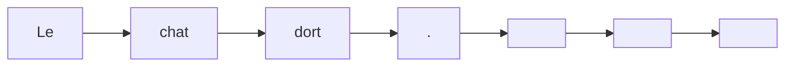

Le padding mask indique donc :

```txt
tokens réels : visibles
tokens <pad> : invisibles
```

---

## 10.7 Exemple de padding mask

Séquence :

```txt
Le chat dort . <pad> <pad>
```

Nous pouvons représenter un masque simple :

|Position|Token|Visible ?|
|--:|---|---|
|1|Le|oui|
|2|chat|oui|
|3|dort|oui|
|4|.|oui|
|5|`<pad>`|non|
|6|`<pad>`|non|

Conceptuellement :

```txt
[1, 1, 1, 1, 0, 0]
```

où :

- `1` signifie visible ;
    
- `0` signifie masqué.
    

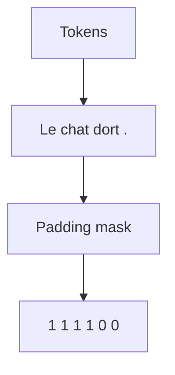

Attention : selon les bibliothèques, la convention peut être inversée.

Parfois `True` signifie “masquer”.

Parfois `True` signifie “garder”.

C’est une source classique de bugs.

---

## 10.8 Effet du padding mask sur l’attention

Supposons que le token `chat` regarde tous les tokens.

Sans masque, il pourrait accorder de l’attention à `<pad>`.

Avec padding mask, les scores vers `<pad>` sont remplacés par (-\infty).

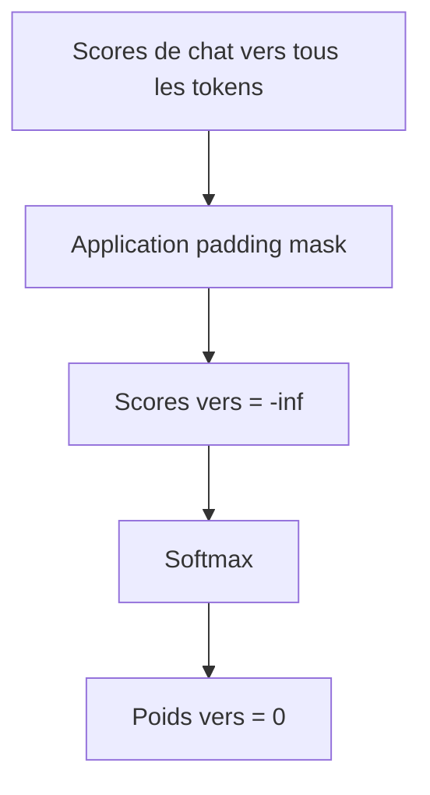

Ainsi, les tokens de remplissage ne contribuent pas à la représentation finale.

---

## 10.9 Pourquoi le padding est nécessaire

Le padding est nécessaire pour construire des batchs réguliers.

Un tenseur doit avoir des dimensions fixes.

Si nous avons des phrases de longueurs différentes :

```txt
4 tokens
7 tokens
12 tokens
```

nous devons souvent les compléter jusqu’à une longueur commune.

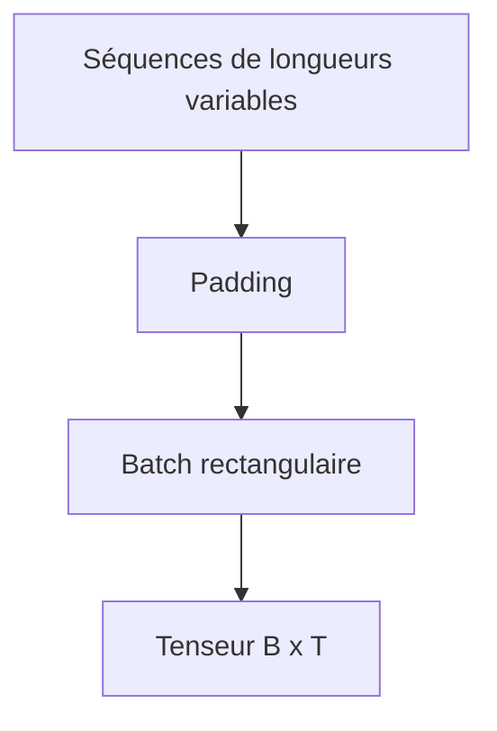

Mais ce padding est artificiel.

Le modèle doit savoir l’ignorer.

C’est le rôle du padding mask.

---

## 10.10 Padding mask dans l’encoder

Dans l’encoder, chaque token réel peut regarder tous les autres tokens réels.

Mais il ne doit pas regarder les tokens `<pad>`.

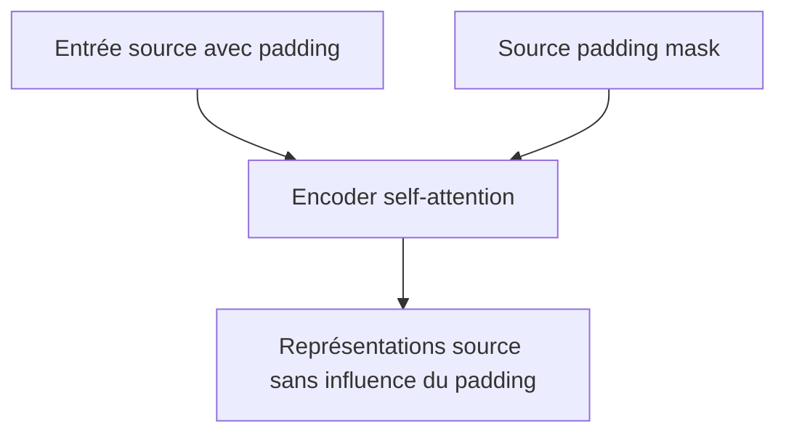

Exemple :

```txt
Source :
The cat sleeps . <pad> <pad>
```

Le token `cat` peut regarder :

```txt
The, cat, sleeps, .
```

mais pas :

```txt
<pad>, <pad>
```

---

## 10.11 Padding mask dans le decoder

Dans le decoder, nous pouvons aussi avoir du padding côté cible.

Exemple :

```txt
<BOS> Le chat dort . <pad> <pad>
```

Le decoder doit ignorer les tokens `<pad>` côté cible.

Mais il doit aussi respecter le masque causal.

Donc côté cible, nous pouvons avoir deux contraintes :

1. ne pas regarder le futur ;
    
2. ne pas regarder le padding.
    

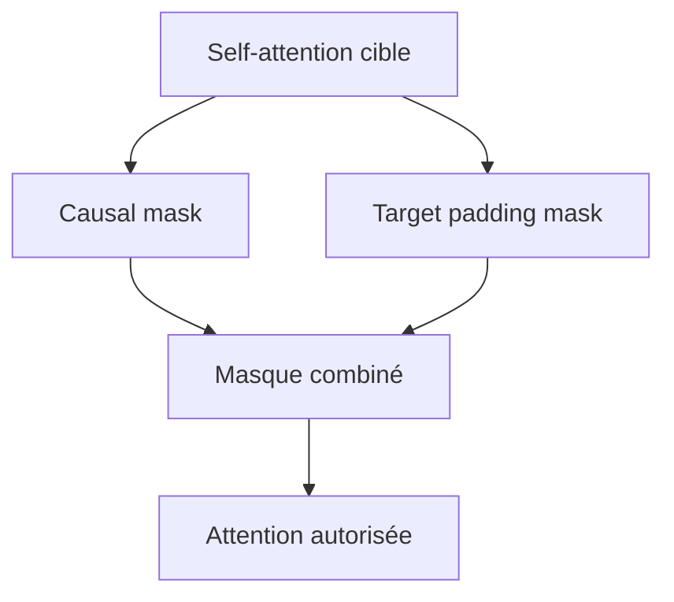

Le masque final est souvent une combinaison du causal mask et du padding mask.

---

## 10.12 Le causal mask

Le **causal mask** interdit à une position de regarder les positions futures.

Il est indispensable pour les modèles autoregressifs.

Pour une séquence :

```txt
t1 t2 t3 t4
```

les règles sont :

- `t1` peut regarder `t1` ;
    
- `t2` peut regarder `t1`, `t2` ;
    
- `t3` peut regarder `t1`, `t2`, `t3` ;
    
- `t4` peut regarder `t1`, `t2`, `t3`, `t4`.
    

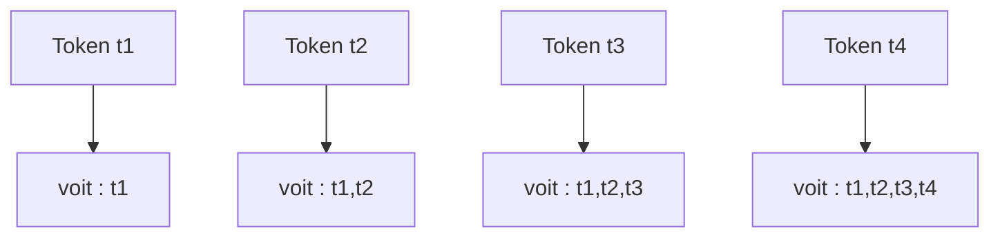

Le futur est toujours interdit.

---

## 10.13 Matrice du causal mask

Pour une séquence de 4 tokens, la matrice d’autorisation est :

|Token qui regarde / Token regardé|t1|t2|t3|t4|
|---|--:|--:|--:|--:|
|t1|oui|non|non|non|
|t2|oui|oui|non|non|
|t3|oui|oui|oui|non|
|t4|oui|oui|oui|oui|

Sous forme binaire :

[  
\begin{bmatrix}  
1 & 0 & 0 & 0 \  
1 & 1 & 0 & 0 \  
1 & 1 & 1 & 0 \  
1 & 1 & 1 & 1  
\end{bmatrix}  
]

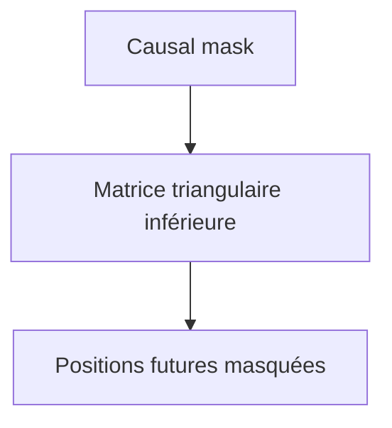

Cette matrice est triangulaire.

---

## 10.14 Pourquoi parle-t-on aussi de look-ahead mask ?

Le causal mask est parfois appelé **look-ahead mask**.

Ce nom signifie :

> Masque qui empêche de regarder en avant.

Les deux termes désignent souvent la même idée.

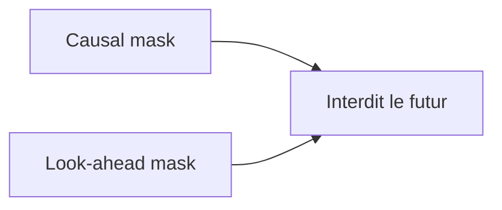

Dans la littérature, les noms peuvent varier :

- causal mask ;
    
- subsequent mask ;
    
- look-ahead mask ;
    
- triangular mask.
    

L’idée reste la même.

---

## 10.15 Effet du causal mask sur les scores

Supposons que nous avons les scores bruts suivants :

[  
S =  
\begin{bmatrix}  
0.2 & 1.1 & 0.7 & -0.3 \  
0.4 & 0.9 & 2.1 & 0.5 \  
1.2 & 0.1 & 0.8 & 1.7 \  
0.3 & 0.6 & 0.2 & 0.9  
\end{bmatrix}  
]

Après causal mask, les positions futures deviennent (-\infty) :

[  
S_{masked} =  
\begin{bmatrix}  
0.2 & -\infty & -\infty & -\infty \  
0.4 & 0.9 & -\infty & -\infty \  
1.2 & 0.1 & 0.8 & -\infty \  
0.3 & 0.6 & 0.2 & 0.9  
\end{bmatrix}  
]

Après softmax, les positions masquées ont un poids nul.

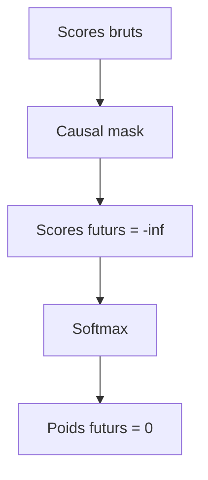

---

## 10.16 Pourquoi le causal mask est indispensable pendant l’entraînement

Pendant l’entraînement, nous donnons souvent toute la cible décalée au decoder.

Exemple :

```txt
Entrée decoder :
<BOS> Le chat noir dort
```

Le modèle produit en parallèle :

```txt
Le chat noir dort .
```

Sans causal mask, la position qui doit prédire `chat` pourrait regarder `chat`, `noir`, `dort`, etc.

Avec causal mask, chaque position ne voit que le passé.

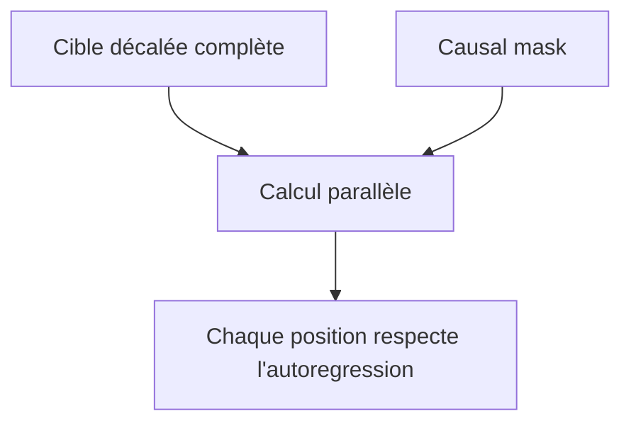

Le masque permet donc de combiner :

- entraînement parallèle ;
    
- contrainte autoregressive.
    

---

## 10.17 Pourquoi le causal mask reste utile en inférence

En inférence naïve, nous générons les tokens un par un.

À l’étape $t$, il n’y a pas encore de futur dans l’entrée.

On pourrait donc penser que le masque causal n’est plus nécessaire.

Mais dans les implémentations réelles, nous gardons souvent la même logique de masque pour garantir que la structure reste correcte.

De plus, dans certaines optimisations ou générations par blocs, le masque causal reste indispensable.

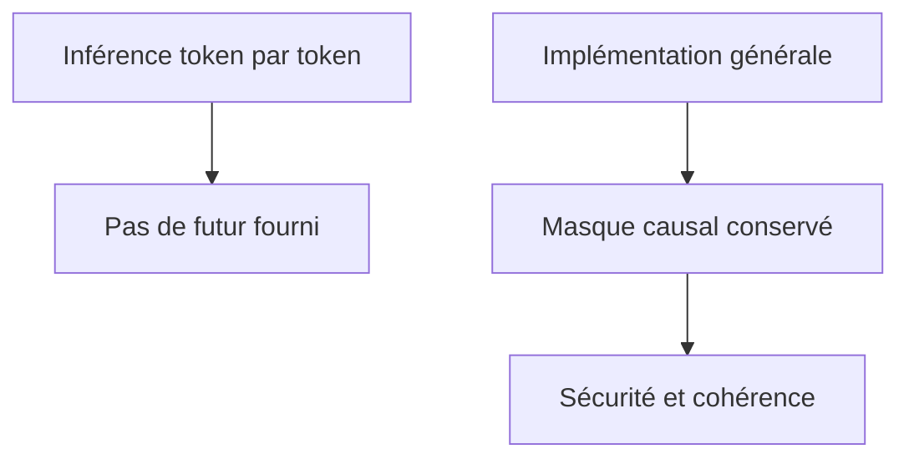

Nous pouvons retenir :

> Le causal mask définit la nature autoregressive du decoder.

---

## 10.18 Combiner causal mask et padding mask

Supposons une cible :

```txt
<BOS> Le chat . <pad> <pad>
```

Pour le token `chat`, nous voulons :

- autoriser `<BOS>`, `Le`, `chat` ;
    
- interdire le futur `.` si nous sommes avant ;
    
- interdire `<pad>`.
    

Le masque final combine donc :

```txt
interdiction du futur
+
interdiction du padding
```

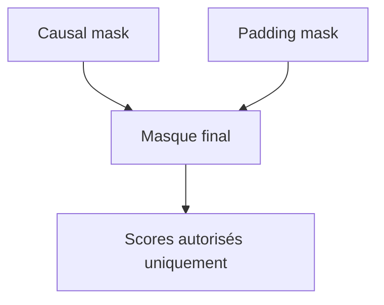

En pratique, cette combinaison peut être délicate à implémenter, notamment à cause des dimensions de tenseurs.

---

## 10.19 Masque source dans la cross-attention

Dans la cross-attention du decoder, les Queries viennent de la cible, mais les Keys et Values viennent de la source.

Si la source contient du padding, le decoder ne doit pas regarder ces positions.

Exemple :

```txt
Source :
The cat sleeps . <pad> <pad>
```

Quand le decoder génère la cible, il peut regarder :

```txt
The, cat, sleeps, .
```

mais pas :

```txt
<pad>, <pad>
```

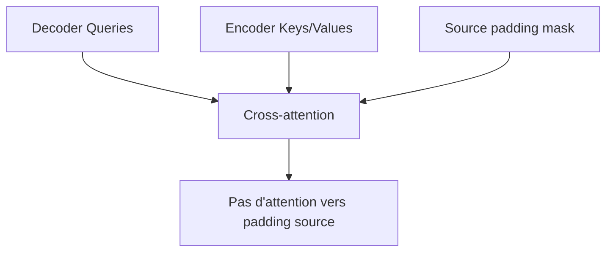

Il n’y a pas de causal mask sur la source.

La source complète est visible.

---

## 10.20 Différence entre self-attention cible et cross-attention

Dans la self-attention cible :

- les Queries viennent de la cible ;
    
- les Keys viennent de la cible ;
    
- les Values viennent de la cible ;
    
- il faut un causal mask.
    

Dans la cross-attention :

- les Queries viennent de la cible ;
    
- les Keys viennent de la source ;
    
- les Values viennent de la source ;
    
- il faut surtout un source padding mask.
    

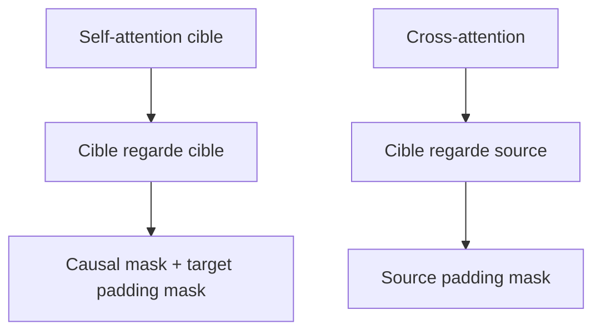

Cette distinction est essentielle pour comprendre les masques dans l’architecture encoder-decoder.

---

## 10.21 Masques dans l’encoder-decoder complet

Nous pouvons résumer les masques du Transformer original ainsi :

|Partie|Type d’attention|Masque principal|
|---|---|---|
|Encoder|Self-attention source|Source padding mask|
|Decoder 1|Masked self-attention cible|Causal mask + target padding mask|
|Decoder 2|Cross-attention source-cible|Source padding mask|

```mermaid
flowchart TD
    A["Encoder self-attention"] --> B["Source padding mask"]
    C["Decoder masked self-attention"] --> D["Causal mask + target padding mask"]
    E["Decoder cross-attention"] --> F["Source padding mask"]
```

C’est une table à retenir.

---

## 10.22 Masque booléen et masque additif

Il existe deux grandes façons de représenter un masque.

### Masque booléen

Un masque booléen indique directement quelles positions sont autorisées ou interdites.

Exemple :

```txt
True  = autorisé
False = interdit
```

ou parfois l’inverse selon la bibliothèque.

### Masque additif

Un masque additif contient :

```txt
0 pour les positions autorisées
-inf pour les positions interdites
```

Il est ajouté aux scores.

```mermaid
flowchart TD
    A["Masque booléen"] --> B["Converti en masque additif"]
    B --> C["Ajouté aux scores"]
    C --> D["Softmax"]
```

Les deux représentations sont équivalentes si elles sont bien utilisées.

---

## 10.23 Exemple de masque additif

Causal mask pour 4 tokens :

[  
M =  
\begin{bmatrix}  
0 & -\infty & -\infty & -\infty \  
0 & 0 & -\infty & -\infty \  
0 & 0 & 0 & -\infty \  
0 & 0 & 0 & 0  
\end{bmatrix}  
]

Scores masqués :

[  
S_{masked} = S + M  
]

Positions autorisées :

```txt
score + 0 = score inchangé
```

Positions interdites :

```txt
score + (-inf) = -inf
```

Après softmax :

```txt
poids = 0
```

---

## 10.24 Attention aux conventions des bibliothèques

Les bibliothèques ne suivent pas toujours les mêmes conventions.

Dans certains cas :

```txt
mask = 1 signifie garder
mask = 0 signifie masquer
```

Dans d’autres cas :

```txt
mask = True signifie masquer
mask = False signifie garder
```

Cela peut produire des bugs très difficiles à voir.

```mermaid
flowchart TD
    A["Convention 1"] --> B["True = garder"]
    C["Convention 2"] --> D["True = masquer"]
    B --> E["Risque de confusion"]
    D --> E
```

Quand nous implémentons un Transformer, nous devons toujours vérifier la documentation exacte de la fonction utilisée.

---

## 10.25 Dimensions des masques

Les masques doivent être compatibles avec les dimensions des scores d’attention.

Pour une attention multi-têtes, les scores ont souvent la forme :

[  
B \times h \times T_q \times T_k  
]

où :

- $B$ est le batch ;
    
- $h$ est le nombre de têtes ;
    
- $T_q$ est la longueur des Queries ;
    
- $T_k$ est la longueur des Keys.
    

Le masque doit pouvoir être diffusé, ou **broadcasté**, vers cette forme.

```mermaid
flowchart TD
    A["Scores : B x h x T_q x T_k"] --> B["Masque compatible"]
    B --> C["Broadcasting"]
    C --> D["Application aux scores"]
```

Les erreurs de dimensions sont très fréquentes avec les masques.

---

## 10.26 Dimensions du causal mask

Pour une self-attention cible :

[  
T_q = T_k = T_t  
]

Le causal mask a souvent la forme :

[  
T_t \times T_t  
]

Puis il est broadcasté vers :

[  
B \times h \times T_t \times T_t  
]

```mermaid
flowchart LR
    A["Causal mask : T_t x T_t"] --> B["Broadcast"]
    B --> C["B x h x T_t x T_t"]
```

Cela signifie que le même masque causal est appliqué :

- à tous les exemples du batch ;
    
- à toutes les têtes.
    

---

## 10.27 Dimensions du padding mask

Un padding mask de source peut avoir la forme :

[  
B \times T_s  
]

Il indique, pour chaque exemple du batch, quelles positions source sont du padding.

Pour être utilisé dans l’attention, il peut être transformé en :

[  
B \times 1 \times 1 \times T_s  
]

afin d’être broadcasté vers :

[  
B \times h \times T_q \times T_s  
]

```mermaid
flowchart LR
    A["Padding mask : B x T_s"] --> B["Unsqueeze"]
    B --> C["B x 1 x 1 x T_s"]
    C --> D["Broadcast vers B x h x T_q x T_s"]
```

Cette transformation est une source très fréquente de bugs.

---

## 10.28 Exemple PyTorch : causal mask

En PyTorch, nous pouvons créer un causal mask ainsi :

```python
import torch

T = 4

mask = torch.tril(torch.ones(T, T))
```

Cela donne :

```txt
tensor([
  [1, 0, 0, 0],
  [1, 1, 0, 0],
  [1, 1, 1, 0],
  [1, 1, 1, 1]
])
```

Si la bibliothèque attend `True` pour masquer, nous pouvons inverser :

```python
causal_mask = mask == 0
```

Cela donne `True` sur les positions futures interdites.

```mermaid
flowchart TD
    A["torch.ones(T,T)"] --> B["torch.tril"]
    B --> C["Matrice triangulaire inférieure"]
    C --> D["Inversion éventuelle selon convention"]
```

---

## 10.29 Exemple PyTorch : appliquer un masque additif

Supposons que nous ayons des scores :

```python
scores = torch.randn(B, h, T, T)
```

et un masque booléen où `True` signifie “masquer” :

```python
scores = scores.masked_fill(mask, float("-inf"))
```

Puis :

```python
weights = torch.softmax(scores, dim=-1)
```

Conceptuellement :

```python
scores[positions_interdites] = -inf
```

Après softmax :

```python
weights[positions_interdites] = 0
```

C’est la logique de base.

---

## 10.30 Attention aux types numériques

Avec certains types numériques comme `float16` ou `bfloat16`, utiliser directement `-inf` peut parfois être délicat selon les implémentations.

On utilise alors parfois une grande valeur négative :

```python
-1e9
```

ou :

```python
torch.finfo(scores.dtype).min
```

Mais il faut faire attention aux overflow, aux NaN, et aux comportements propres aux kernels optimisés.

```mermaid
flowchart TD
    A["float32"] --> B["-inf souvent acceptable"]
    C["float16 / bfloat16"] --> D["Attention stabilité numérique"]
    D --> E["Valeur négative adaptée"]
```

Dans un cours de Master, il est important de comprendre que le masque est simple mathématiquement, mais parfois subtil numériquement.

---

## 10.31 Pourquoi un mauvais masque casse l’apprentissage

Un masque mal construit peut avoir des effets graves.

Exemples :

- le modèle voit le futur ;
    
- le modèle ignore des tokens utiles ;
    
- le modèle regarde le padding ;
    
- certaines lignes sont entièrement masquées ;
    
- le softmax produit des NaN ;
    
- l’entraînement semble fonctionner mais les résultats sont mauvais.
    

```mermaid
flowchart TD
    A["Masque incorrect"] --> B["Fuite du futur"]
    A --> C["Attention au padding"]
    A --> D["NaN"]
    A --> E["Apprentissage instable"]
    A --> F["Résultats incohérents"]
```

Les bugs de masque sont parmi les plus fréquents dans les implémentations de Transformers.

---

## 10.32 Cas dangereux : ligne entièrement masquée

Si une ligne de scores est entièrement masquée, nous obtenons :

```txt
[-inf, -inf, -inf, -inf]
```

Le softmax de cette ligne est indéfini.

Il peut produire :

```txt
NaN
```

```mermaid
flowchart TD
    A["Ligne entièrement -inf"] --> B["Softmax impossible"]
    B --> C["NaN"]
```

Nous devons donc nous assurer que chaque position autorisée peut regarder au moins une position.

Dans un causal mask standard, chaque token peut au moins regarder lui-même.

---

## 10.33 Pourquoi autoriser l’attention à soi-même

Dans la plupart des causal masks, un token peut regarder sa propre position.

La diagonale est autorisée.

Pour une séquence :

```txt
t1 t2 t3
```

le masque autorise :

[  
\begin{bmatrix}  
1 & 0 & 0 \  
1 & 1 & 0 \  
1 & 1 & 1  
\end{bmatrix}  
]

Si nous interdisions la diagonale, le premier token ne pourrait rien regarder.

```mermaid
flowchart TD
    A["Diagonale autorisée"] --> B["Chaque token peut se regarder"]
    B --> C["Pas de ligne entièrement masquée"]
```

Cela évite des problèmes numériques et permet au token de conserver sa propre information.

---

## 10.34 Masque causal et prédiction du prochain token

Une confusion fréquente vient du fait que le token à la position $i$ peut regarder sa propre position.

Mais en entraînement, l’entrée du decoder est déjà décalée.

Exemple :

```txt
Entrée decoder :
<BOS> Le chat

Sortie attendue :
Le chat dort
```

La position contenant `chat` sert à prédire `dort`.

Donc regarder `chat` n’est pas tricher.

```mermaid
flowchart TD
    A["Entrée position i : token précédent ou courant décalé"] --> B["Prédiction position i : token suivant attendu"]
    C["Causal mask"] --> D["Autorise la diagonale"]
```

Le décalage de la cible et le masque causal fonctionnent ensemble.

---

## 10.35 Masques dans les modèles encoder-only

Dans un modèle encoder-only comme BERT, il n’y a pas de causal mask.

Le modèle peut regarder à gauche et à droite.

Il utilise surtout :

- un padding mask ;
    
- parfois des masques spécifiques à certaines tâches.
    

```mermaid
flowchart TD
    A["BERT / encoder-only"] --> B["Self-attention bidirectionnelle"]
    B --> C["Pas de causal mask"]
    B --> D["Padding mask"]
```

C’est ce qui permet à BERT de faire de la compréhension bidirectionnelle.

---

## 10.36 Masques dans les modèles decoder-only

Dans un modèle decoder-only comme GPT, il n’y a pas d’encoder séparé.

Le modèle utilise principalement :

- un causal mask ;
    
- un padding mask si des séquences sont paddées.
    

```mermaid
flowchart TD
    A["GPT / decoder-only"] --> B["Masked self-attention"]
    B --> C["Causal mask"]
    B --> D["Padding mask éventuel"]
```

Le causal mask définit la génération gauche-droite.

---

## 10.37 Masques dans les modèles encoder-decoder

Dans un modèle encoder-decoder, nous avons plusieurs masques.

```mermaid
flowchart TD
    A["Source"] --> B["Encoder"]
    C["Source padding mask"] --> B

    D["Cible décalée"] --> E["Decoder self-attention"]
    F["Causal mask"] --> E
    G["Target padding mask"] --> E

    B --> H["Cross-attention"]
    C --> H
```

Récapitulons :

- source padding mask dans l’encoder ;
    
- causal mask dans la self-attention du decoder ;
    
- target padding mask dans la self-attention du decoder ;
    
- source padding mask dans la cross-attention.
    

---

## 10.38 Masque et perte d’entraînement

Le padding doit aussi être ignoré dans la loss.

Si la cible contient :

```txt
Le chat dort . <pad> <pad>
```

nous ne voulons pas pénaliser le modèle pour ses prédictions sur `<pad>`.

Donc, en plus du masque d’attention, nous utilisons souvent un masque de loss.

```mermaid
flowchart TD
    A["Attention mask"] --> B["Empêche de regarder le padding"]
    C["Loss mask"] --> D["Empêche de calculer la perte sur le padding"]
```

Ce sont deux masques différents.

Le premier agit dans l’attention.

Le second agit dans la fonction de perte.

---

## 10.39 Différence entre attention mask et loss mask

|Masque|Où agit-il ?|Rôle|
|---|---|---|
|Attention mask|Dans les scores d’attention|Contrôle ce que le modèle peut regarder|
|Loss mask|Dans la fonction de perte|Contrôle quelles prédictions comptent pour l’apprentissage|

```mermaid
flowchart TD
    A["Attention mask"] --> B["Avant softmax attention"]
    C["Loss mask"] --> D["Après prédiction, pendant la loss"]
```

Il ne faut pas les confondre.

Un modèle peut ignorer le padding dans l’attention, mais si la loss inclut les positions `<pad>`, l’entraînement peut quand même être perturbé.

---

## 10.40 Exemple complet : traduction avec padding et causal mask

Source :

```txt
The cat sleeps . <pad> <pad>
```

Cible décalée :

```txt
<BOS> Le chat dort . <pad>
```

Nous avons besoin de :

1. source padding mask pour l’encoder ;
    
2. causal mask pour le decoder ;
    
3. target padding mask pour le decoder ;
    
4. source padding mask pour la cross-attention ;
    
5. loss mask pour ignorer les `<pad>` dans la cible.
    

```mermaid
flowchart TD
    A["Source avec padding"] --> B["Encoder"]
    M1["Source padding mask"] --> B

    C["Cible décalée"] --> D["Decoder masked self-attention"]
    M2["Causal mask"] --> D
    M3["Target padding mask"] --> D

    B --> E["Cross-attention"]
    M1 --> E

    E --> F["Prédictions"]
    M4["Loss mask"] --> G["Loss"]
    F --> G
```

Ce schéma montre que les masques interviennent à plusieurs endroits.

---

## 10.41 Masques et batchs de longueurs variables

Dans un batch, chaque exemple peut avoir une longueur différente.

Exemple :

```txt
Phrase 1 : 4 tokens réels + 3 pads
Phrase 2 : 7 tokens réels + 0 pad
Phrase 3 : 5 tokens réels + 2 pads
```

Le padding mask doit donc être propre à chaque élément du batch.

```mermaid
flowchart TD
    A["Batch"] --> B["Exemple 1 : masque différent"]
    A --> C["Exemple 2 : masque différent"]
    A --> D["Exemple 3 : masque différent"]
```

En revanche, le causal mask dépend surtout de la longueur maximale $T$, et peut être partagé entre les exemples.

---

## 10.42 Masque et attention multi-têtes

Le même masque est généralement appliqué à toutes les têtes.

Les têtes peuvent apprendre des relations différentes, mais elles doivent respecter les mêmes contraintes de visibilité.

```mermaid
flowchart TD
    A["Masque"] --> B["Tête 1"]
    A --> C["Tête 2"]
    A --> D["Tête 3"]
    A --> E["Tête h"]

    B --> F["Toutes respectent les mêmes interdictions"]
    C --> F
    D --> F
    E --> F
```

Par exemple, dans un decoder causal, aucune tête n’a le droit de regarder le futur.

---

## 10.43 Masque et valeurs de padding

Il ne suffit pas que l’embedding de `<pad>` soit nul ou spécial.

Même si le token `<pad>` a un embedding particulier, il peut polluer l’attention si nous ne le masquons pas.

Le modèle pourrait apprendre à utiliser les positions de padding comme signal artificiel.

```mermaid
flowchart TD
    A["Token <pad>"] --> B["Embedding"]
    B --> C["Peut être regardé sans masque"]
    C --> D["Pollution possible"]
    E["Padding mask"] --> F["Empêche cette attention"]
```

Il est donc préférable de masquer explicitement le padding.

---

## 10.44 Masque et causalité dans le langage

Le causal mask correspond à une contrainte de génération.

Quand nous écrivons une phrase, nous produisons les mots dans l’ordre.

Pour prédire le prochain mot, nous n’avons pas accès aux mots futurs.

```txt
Le chat dort sur le ___
```

Nous devons prédire :

```txt
canapé
```

sans connaître la suite.

```mermaid
flowchart LR
    A["Contexte passé"] --> B["Prédiction prochain token"]
    C["Futur"] -. "non disponible" .-> B
```

Le causal mask impose cette situation pendant l’entraînement.

---

## 10.45 Masque et bidirectionnalité

À l’inverse, dans une tâche de compréhension, nous pouvons utiliser le contexte complet.

Exemple :

```txt
Le chat dort sur le canapé parce qu’il est fatigué.
```

Pour comprendre `il`, le modèle peut regarder avant et après.

Un encoder bidirectionnel n’utilise donc pas de causal mask.

```mermaid
flowchart LR
    A["Contexte gauche"] --> B["Token à comprendre"]
    C["Contexte droit"] --> B
```

La présence ou absence de causal mask change donc profondément la nature du modèle.

---

## 10.46 Causal mask et modèles génératifs

Les modèles génératifs de texte de type decoder-only reposent sur le causal mask.

Ils apprennent :

[  
P(x_t \mid x_{<t})  
]

C’est-à-dire :

> prédire le prochain token à partir des tokens précédents.

```mermaid
flowchart TD
    A["Tokens précédents"] --> B["Causal self-attention"]
    B --> C["Distribution prochain token"]
```

Sans causal mask, ils ne seraient plus de vrais modèles autoregressifs.

---

## 10.47 Masques et fuite d’information

Une fuite d’information se produit si le modèle accède à une information qu’il ne devrait pas avoir.

Exemple :

```txt
Le modèle doit prédire le token 5
mais il peut regarder le token 5 ou 6 dans la cible réelle.
```

C’est une fuite du futur.

```mermaid
flowchart TD
    A["Futur visible"] --> B["Prédiction artificiellement facile"]
    B --> C["Loss basse"]
    C --> D["Mauvaise inférence"]
```

Le modèle peut sembler très performant pendant l’entraînement, mais échouer en génération.

---

## 10.48 Comment détecter un problème de masque

Quelques symptômes possibles :

- loss d’entraînement anormalement basse ;
    
- très mauvaise génération en inférence ;
    
- attention vers les tokens `<pad>` ;
    
- NaN dans la loss ;
    
- différences fortes entre entraînement et validation ;
    
- modèle qui répète ou s’arrête mal ;
    
- erreurs de dimensions dans les tenseurs.
    

```mermaid
flowchart TD
    A["Bug de masque"] --> B["Loss suspecte"]
    A --> C["NaN"]
    A --> D["Génération mauvaise"]
    A --> E["Attention vers padding"]
```

Quand un Transformer se comporte étrangement, les masques sont l’un des premiers éléments à vérifier.

---

## 10.49 Checklist d’implémentation des masques

Pour implémenter correctement les masques, nous devons vérifier :

1. la convention de la bibliothèque ;
    
2. la forme du masque ;
    
3. le broadcasting ;
    
4. le type du masque ;
    
5. l’application avant softmax ;
    
6. la présence du causal mask côté decoder ;
    
7. la présence du padding mask côté source et cible ;
    
8. l’exclusion du padding dans la loss.
    

```mermaid
flowchart TD
    A["Masques corrects"] --> B["Convention"]
    A --> C["Dimensions"]
    A --> D["Broadcasting"]
    A --> E["Avant softmax"]
    A --> F["Padding"]
    A --> G["Causalité"]
    A --> H["Loss"]
```

Cette checklist est très utile en pratique.

---

## 10.50 Exemple de pseudo-code général

Voici une version simplifiée de l’attention avec masque :

```python
def attention(Q, K, V, mask=None):
    d_k = Q.size(-1)

    scores = Q @ K.transpose(-2, -1)
    scores = scores / sqrt(d_k)

    if mask is not None:
        scores = scores.masked_fill(mask == 0, -inf)

    weights = softmax(scores, dim=-1)
    output = weights @ V

    return output
```

Attention : ici, nous supposons que :

```txt
mask == 0 signifie position interdite
```

Dans une autre bibliothèque, la convention peut être différente.

---

## 10.51 Exemple de causal mask en pseudo-code

```python
def make_causal_mask(T):
    mask = tril(ones(T, T))
    return mask
```

Ce masque vaut :

```txt
1 pour le passé et la position courante
0 pour le futur
```

Il peut ensuite être broadcasté vers :

```txt
B x h x T x T
```

```mermaid
flowchart LR
    A["T x T"] --> B["1 x 1 x T x T"]
    B --> C["B x h x T x T"]
```

---

## 10.52 Exemple de padding mask en pseudo-code

Supposons que l’ID du token `<pad>` soit 0.

```python
def make_padding_mask(token_ids, pad_id=0):
    return token_ids != pad_id
```

Si :

```txt
token_ids = [15, 82, 137, 9, 0, 0]
```

alors :

```txt
mask = [True, True, True, True, False, False]
```

Selon la convention, nous pouvons ensuite convertir ce masque.

```mermaid
flowchart TD
    A["IDs tokens"] --> B["Comparaison avec pad_id"]
    B --> C["Mask positions réelles / padding"]
```

---

## 10.53 Masque dans la loss : pseudo-code

Pour ignorer le padding dans la loss, nous pouvons utiliser un `ignore_index`.

Exemple conceptuel en PyTorch :

```python
loss_fn = CrossEntropyLoss(ignore_index=pad_id)
```

Ainsi, les positions où la cible vaut `<pad>` ne contribuent pas à la loss.

```mermaid
flowchart TD
    A["Cibles"] --> B["Positions pad"]
    B --> C["Ignorées dans la loss"]
    D["Positions réelles"] --> E["Contribuent à la loss"]
```

Cela complète les masques d’attention.

---

## 10.54 Erreur fréquente : appliquer le masque après softmax

Si nous appliquons le masque après softmax, nous pouvons casser la normalisation.

Exemple :

```txt
softmax → poids qui somment à 1
masque après → certains poids à 0
somme finale < 1
```

Ce n’est pas la formulation standard.

Il vaut mieux appliquer le masque avant le softmax, en mettant les scores interdits à (-\infty).

```mermaid
flowchart TD
    A["Correct"] --> B["Masque avant softmax"]
    B --> C["Somme des poids autorisés = 1"]

    D["Incorrect"] --> E["Masque après softmax"]
    E --> F["Normalisation cassée"]
```

---

## 10.55 Erreur fréquente : oublier le masque de padding dans la cross-attention

Même si le decoder utilise bien un causal mask, il peut encore regarder des `<pad>` côté source si nous oublions le source padding mask.

```mermaid
flowchart TD
    A["Source avec padding"] --> B["Encoder"]
    B --> C["Cross-attention"]
    D["Pas de source padding mask"] --> C
    C --> E["Decoder peut regarder <pad>"]
```

Dans un modèle encoder-decoder, le source padding mask doit être utilisé :

- dans l’encoder ;
    
- dans la cross-attention du decoder.
    

---

## 10.56 Erreur fréquente : inverser le masque

C’est probablement l’une des erreurs les plus fréquentes.

Nous pensons que :

```txt
1 = garder
0 = masquer
```

mais la fonction attend :

```txt
True = masquer
False = garder
```

Résultat : nous masquons les bons tokens et nous gardons les mauvais.

```mermaid
flowchart TD
    A["Masque inversé"] --> B["Tokens utiles interdits"]
    A --> C["Padding autorisé"]
    A --> D["Apprentissage détruit"]
```

Il faut toujours tester un petit exemple manuellement.

---

## 10.57 Erreur fréquente : mauvaise dimension de broadcasting

Un masque de forme :

[  
B \times T  
]

ne s’applique pas toujours correctement à des scores :

[  
B \times h \times T \times T  
]

Il faut parfois ajouter des dimensions :

```python
mask = mask[:, None, None, :]
```

pour obtenir :

[  
B \times 1 \times 1 \times T  
]

```mermaid
flowchart LR
    A["B x T"] --> B["B x 1 x 1 x T"]
    B --> C["Broadcast vers B x h x T_q x T_k"]
```

Les erreurs de broadcasting peuvent produire des bugs silencieux si le tenseur se diffuse dans la mauvaise dimension.

---

## 10.58 Erreur fréquente : confondre masque et positional encoding

Le positional encoding indique où se trouve un token.

Le masque indique quels tokens sont visibles.

Ce sont deux notions différentes.

```mermaid
flowchart TD
    A["Positional encoding"] --> B["Information de position"]
    C["Attention mask"] --> D["Contrainte de visibilité"]
```

Un modèle peut connaître la position d’un token tout en n’ayant pas le droit de le regarder.

C’est le cas dans le decoder causal.

---

## 10.59 Synthèse mathématique

La formule complète avec masque peut s’écrire :

[  
S = \frac{QK^T}{\sqrt{d_k}}  
]

[  
S_{masked} = S + M  
]

[  
A = softmax(S_{masked})  
]

[  
Y = AV  
]

où $M$ contient :

- (0) pour les positions autorisées ;
    
- (-\infty) pour les positions interdites.
    

La sortie reste :

[  
Y \in \mathbb{R}^{B \times T_q \times d_v}  
]

dans le cas général.

---

## 10.60 Schéma global de synthèse

```mermaid
flowchart TD
    Q["Queries Q"] --> S["Scores QK^T / sqrt(d_k)"]
    K["Keys K"] --> S

    S --> M["Ajout du masque"]
    M --> I["Positions interdites = -inf"]
    I --> SM["Softmax"]
    SM --> W["Poids d'attention"]

    W --> VEC["Somme pondérée"]
    V["Values V"] --> VEC

    VEC --> Y["Sortie attention"]

    A["Padding mask"] --> M
    B["Causal mask"] --> M
```

Ce schéma résume le rôle du masque dans l’attention.

---

## 10.61 Résumé du chapitre

Nous avons étudié les masques d’attention.

Nous avons vu qu’un masque sert à contrôler quelles positions peuvent être regardées par chaque token.

Le masque est appliqué aux scores d’attention avant le softmax.

Les positions interdites reçoivent une valeur très négative, souvent (-\infty), afin que leur poids après softmax devienne zéro.

Nous avons distingué plusieurs masques :

- le **padding mask**, qui permet d’ignorer les tokens `<pad>` ;
    
- le **causal mask**, qui empêche le decoder de regarder les tokens futurs ;
    
- le **look-ahead mask**, autre nom fréquent du causal mask ;
    
- le **source padding mask** utilisé dans la cross-attention ;
    
- le **loss mask**, qui empêche le padding de contribuer à la perte.
    

Nous avons aussi vu que les masques sont une source fréquente de bugs :

- convention inversée ;
    
- mauvaise dimension ;
    
- application après softmax ;
    
- oubli du source padding mask ;
    
- fuite du futur ;
    
- ligne entièrement masquée ;
    
- NaN.
    

Le point central est :

> Les masques ne modifient pas le contenu des tokens ; ils modifient la structure de visibilité dans l’attention.

---

## 10.62 Questions de compréhension

### 10.62.1 Question 1

À quoi sert un masque d’attention ?

Réponse attendue : à interdire certaines positions dans le calcul de l’attention.

### 10.62.2 Question 2

À quel moment applique-t-on le masque ?

Réponse attendue : après le calcul des scores d’attention et avant le softmax.

### 10.62.3 Question 3

Pourquoi met-on souvent les positions interdites à (-\infty) ?

Réponse attendue : pour que leur poids après softmax devienne zéro.

### 10.62.4 Question 4

À quoi sert le padding mask ?

Réponse attendue : à empêcher le modèle de regarder les tokens de remplissage `<pad>`.

### 10.62.5 Question 5

À quoi sert le causal mask ?

Réponse attendue : à empêcher un token de regarder les tokens futurs dans un modèle autoregressif.

### 10.62.6 Question 6

Pourquoi le decoder a-t-il besoin d’un causal mask pendant l’entraînement ?

Réponse attendue : parce qu’il reçoit la cible décalée complète, et le masque l’empêche de voir les futurs tokens.

### 10.62.7 Question 7

La cross-attention utilise-t-elle un causal mask sur la source ?

Réponse attendue : non. La source complète est visible. On utilise plutôt un source padding mask si la source contient du padding.

### 10.62.8 Question 8

Quelle est la différence entre attention mask et loss mask ?

Réponse attendue : l’attention mask contrôle les positions visibles dans l’attention ; le loss mask contrôle quelles positions contribuent à la fonction de perte.

### 10.62.9 Question 9

Pourquoi une ligne entièrement masquée est-elle dangereuse ?

Réponse attendue : parce que le softmax d’une ligne entièrement à (-\infty) peut produire des NaN.

### 10.62.10 Question 10

Quelle erreur fréquente peut survenir avec les conventions booléennes des masques ?

Réponse attendue : inverser le sens du masque, par exemple croire que `True` signifie garder alors que la fonction attend `True` pour masquer.

---

## 10.63 Transition vers le chapitre 11

Nous avons maintenant compris comment contrôler la visibilité des tokens dans l’attention.

Nous savons donc comment :

- ignorer le padding ;
    
- empêcher le decoder de voir le futur ;
    
- garantir une génération autoregressive correcte ;
    
- protéger l’attention contre des positions non pertinentes.
    

Dans le chapitre suivant, nous allons étudier une autre composante essentielle du bloc Transformer : le **Feed-Forward Network**.

Nous verrons pourquoi l’attention seule ne suffit pas, pourquoi chaque position passe ensuite dans un petit réseau dense, et comment les fonctions d’activation comme ReLU ou GELU permettent d’ajouter de la capacité non linéaire au modèle.

---
> [!info] Livre « Les transformers » — chapitre 10/30
> [[Les transformers — Sommaire|Sommaire]] · [[Les transformers — 09 — Bloc Decoder en détail|← 09 — Bloc Decoder en détail]] · [[Les transformers — 11 — Feed-Forward Network et non-linéarités|11 — Feed-Forward Network et non-linéarités →]]
