> [!info] Livre « Les transformers » — chapitre 11/30
> [[Les transformers — Sommaire|Sommaire]] · [[Les transformers — 10 — Masques d’attention|← 10 — Masques d’attention]] · [[Les transformers — 12 — Résidus, normalisation et stabilité de l’entraînement|12 — Résidus, normalisation et stabilité de l’entraînement →]]

# Chapitre 11 — Feed-Forward Network et non-linéarités
## 11.1 Objectif du chapitre

Dans les chapitres précédents, nous avons beaucoup insisté sur l’attention :

* Scaled Dot-Product Attention ;
* Multi-Head Attention ;
* self-attention ;
* cross-attention ;
* masques d’attention.

Mais un bloc Transformer ne contient pas seulement de l’attention.

Après chaque sous-couche d’attention, nous trouvons généralement un **Feed-Forward Network**, souvent abrégé **FFN**.

Dans notre plan de cours, ce chapitre est consacré au feed-forward network position-wise, aux dimensions internes, aux fonctions d’activation, à ReLU dans le papier original, à GELU dans les modèles modernes, au rôle de la capacité non linéaire, et à la raison pour laquelle l’attention seule ne suffit pas. 

Le schéma général est le suivant :

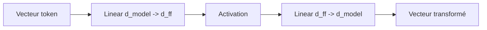

L’objectif de ce chapitre est de comprendre pourquoi cette sous-couche est indispensable.

---

## 11.2 Où se trouve le feed-forward network dans un bloc Transformer ?

Dans un bloc encoder, le Feed-Forward Network arrive après la self-attention :

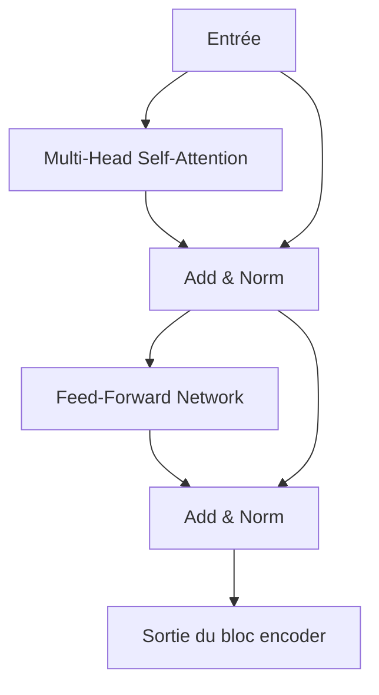

Dans un bloc decoder, il arrive après :

1. la masked self-attention ;
2. la cross-attention ;
3. puis seulement ensuite le feed-forward.

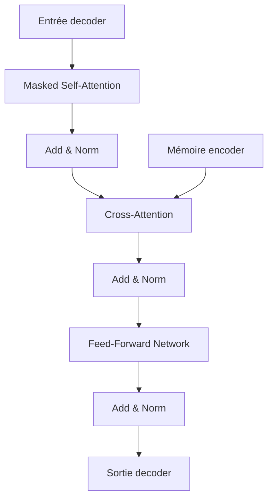

Dans les deux cas, le Feed-Forward Network joue le même rôle fondamental :

> Il transforme chaque représentation de token indépendamment, après que l’attention a mélangé les informations entre tokens.

---

## 11.3 Attention et feed-forward : deux rôles complémentaires

Nous devons bien distinguer les deux grandes opérations d’un bloc Transformer.

| Sous-couche          | Rôle principal                            |
| -------------------- | ----------------------------------------- |
| Attention            | Mélanger l’information entre les tokens   |
| Feed-Forward Network | Transformer chaque token individuellement |

L’attention permet à un token d’intégrer de l’information venant des autres tokens.

Le feed-forward permet ensuite de retravailler cette représentation avec une transformation non linéaire.

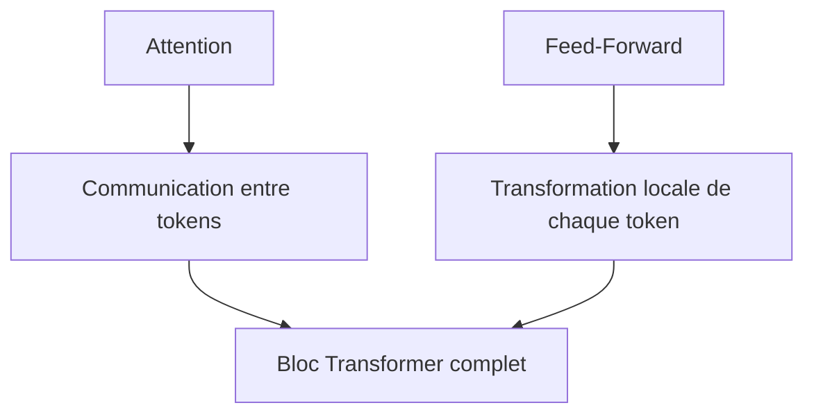

Nous pouvons retenir cette intuition :

> L’attention fait circuler l’information ; le feed-forward la transforme.

---

## 11.4 Pourquoi l’attention seule ne suffit pas

L’attention calcule essentiellement une somme pondérée de Values.

Pour un token donné :

$$
y_i = \sum_j \alpha_{ij} v_j
$$

$$
y_i = \sum_j \alpha_{ij} v_j
$$
C’est très puissant pour mélanger de l’information.

Mais cette opération reste principalement une combinaison de vecteurs.

Pour obtenir une capacité de représentation plus riche, nous avons besoin de transformations non linéaires.

C’est le rôle du Feed-Forward Network.

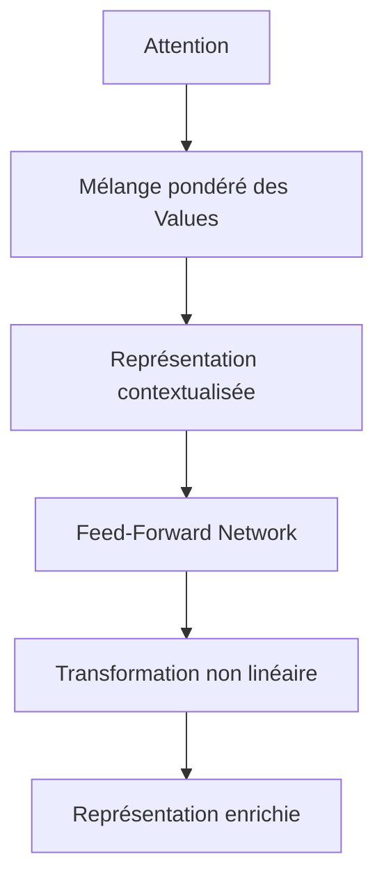

Sans feed-forward, le modèle aurait beaucoup moins de capacité pour construire des représentations complexes.

---

## 11.5 Le Feed-Forward Network est position-wise

Dans le Transformer, le feed-forward network est appelé **position-wise**.

Cela signifie qu’il est appliqué indépendamment à chaque position de la séquence.

Si nous avons une séquence :

```txt
t1 t2 t3 t4
```

le même réseau est appliqué à chaque token :

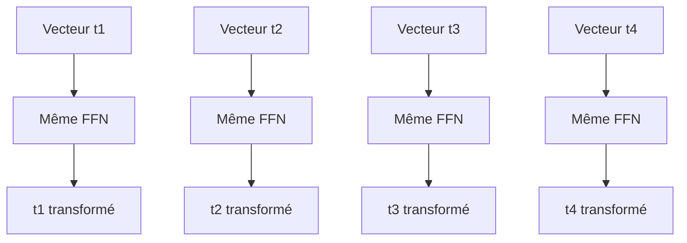

Le FFN ne mélange donc pas directement les positions.

C’est l’attention qui s’occupe du mélange entre tokens.

---

## 11.6 Attention : le FFN ne travaille pas sur des tokens isolés au sens naïf

Dire que le FFN est appliqué indépendamment à chaque position ne signifie pas qu’il ignore le contexte.

Pourquoi ?

Parce que son entrée est déjà contextualisée par l’attention.

Prenons :

```txt
Le chat noir dort.
```

Après l’attention, le vecteur correspondant à `dort` peut déjà contenir des informations sur `chat`, `noir`, et le reste de la phrase.

Le FFN transforme donc le vecteur de `dort`, mais ce vecteur contient déjà du contexte.

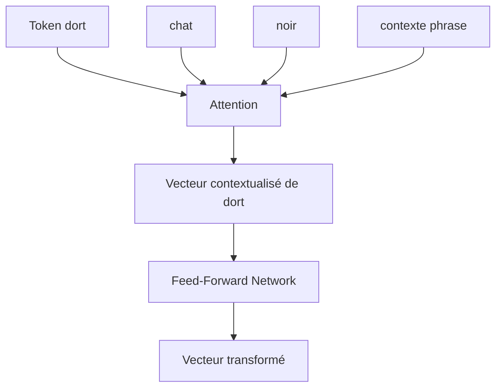

Le FFN ne mélange pas les tokens, mais il transforme des représentations qui ont déjà reçu du contexte.

---

## 11.7 Forme générale du Feed-Forward Network

Dans le Transformer original, le Feed-Forward Network est défini comme :

$$
FFN(x) = max(0, xW_1 + b_1)W_2 + b_2
$$

Nous pouvons le décomposer :

1. première projection linéaire ;
2. fonction d’activation ;
3. deuxième projection linéaire.

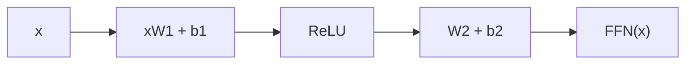

La fonction (max(0, \cdot)) correspond à ReLU.

---

## 11.8 Dimensions du FFN dans le Transformer original

Dans le Transformer original, les dimensions typiques sont :

$$
d_{model} = 512
$$

$$
d_{ff} = 2048
$$

Le FFN fait donc :

$$
512 \rightarrow 2048 \rightarrow 512
$$

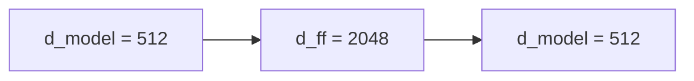

La dimension interne $d_{ff}$ est plus grande que $d_{model}$.

Dans le papier original, elle est 4 fois plus grande :

$$
d_{ff} = 4 \times d_{model}
$$

car :

$$
2048 = 4 \times 512
$$

---

## 11.9 Pourquoi augmenter la dimension interne ?

Nous pouvons voir le FFN comme une expansion temporaire.

Le modèle projette chaque token dans un espace plus grand, applique une non-linéarité, puis revient à la dimension initiale.

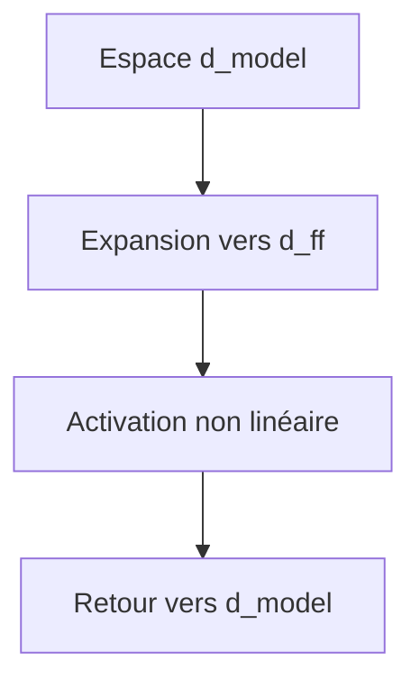

Cette expansion donne au modèle plus de capacité.

Elle permet de représenter des combinaisons plus complexes de features.

Intuitivement :

> Le modèle ouvre plus de dimensions pour manipuler l’information, puis la compresse à nouveau dans la dimension standard du Transformer.

---

## 11.10 Les matrices du FFN

Le FFN contient deux matrices principales.

Première matrice :

$$
W_1 \in \mathbb{R}^{d_{model} \times d_{ff}}
$$

Deuxième matrice :

$$
W_2 \in \mathbb{R}^{d_{ff} \times d_{model}}
$$

Avec les biais :

$$
b_1 \in \mathbb{R}^{d_{ff}}
$$

$$
b_2 \in \mathbb{R}^{d_{model}}
$$

Pour un vecteur token :

$$
x \in \mathbb{R}^{d_{model}}
$$

nous obtenons :

$$
xW_1 + b_1 \in \mathbb{R}^{d_{ff}}
$$

puis :

$$
FFN(x) \in \mathbb{R}^{d_{model}}
$$

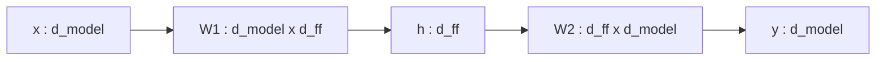

---

## 11.11 Dimensions avec batch et séquence

Dans un vrai Transformer, nous ne traitons pas un seul vecteur.

Nous traitons un tenseur :

$$
X \in \mathbb{R}^{B \times T \times d_{model}}
$$

Le FFN est appliqué à la dernière dimension.

Après la première projection :

$$
H \in \mathbb{R}^{B \times T \times d_{ff}}
$$

Après la deuxième projection :

$$
Y \in \mathbb{R}^{B \times T \times d_{model}}
$$

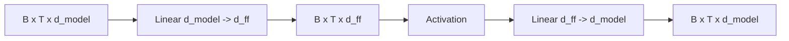

La longueur de séquence $T$ ne change pas.

Le batch $B$ ne change pas.

Seule la dimension interne varie temporairement.

---

## 11.12 Le FFN comme MLP partagé

Le Feed-Forward Network est un petit **MLP**, c’est-à-dire un perceptron multicouche.

Mais il est partagé entre toutes les positions.

Cela signifie que les mêmes poids (W_1), (b_1), (W_2), (b_2) sont utilisés pour tous les tokens.

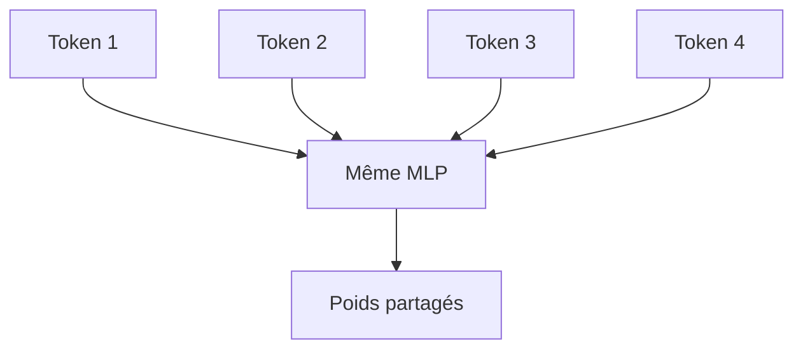

Le FFN apprend donc une transformation générale applicable à n’importe quelle position de la séquence.

---

## 11.13 Pourquoi partager les poids entre positions ?

Si chaque position avait son propre FFN, le nombre de paramètres exploserait.

De plus, le modèle perdrait une forme importante de généralisation.

Nous voulons qu’une même transformation puisse s’appliquer au token 3, au token 10 ou au token 150.

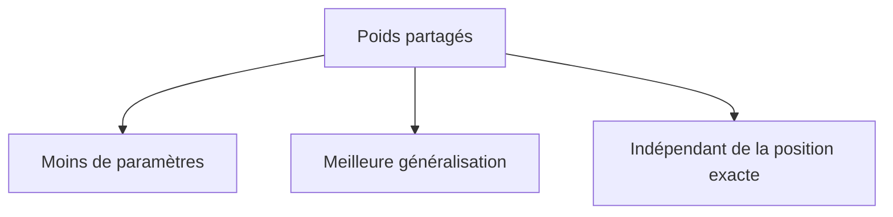

La position est déjà encodée dans les représentations.

Le FFN n’a pas besoin d’avoir des poids différents pour chaque position.

---

## 11.14 Le rôle de la fonction d’activation

Si nous avions seulement deux couches linéaires sans activation :

$$
xW_1W_2
$$

cela resterait équivalent à une seule transformation linéaire.

Autrement dit :

$$
Linear(Linear(x)) = Linear(x)
$$

La fonction d’activation rend la transformation non linéaire.

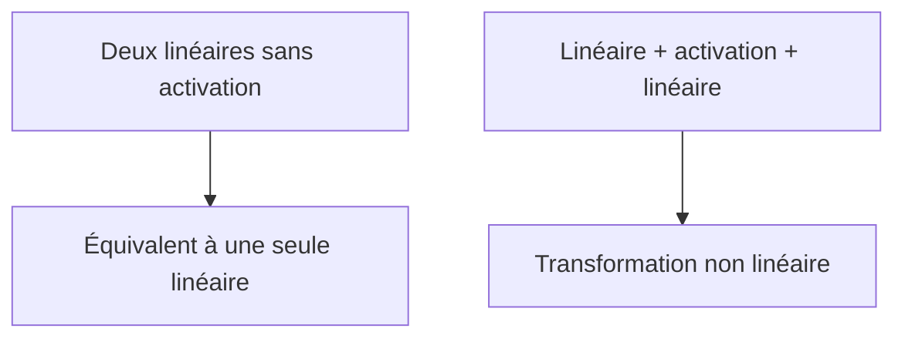

C’est la non-linéarité qui permet au réseau de représenter des fonctions complexes.

---

## 11.15 ReLU dans le Transformer original

Dans le Transformer original, l’activation utilisée dans le FFN est **ReLU**.

ReLU signifie :

```txt
Rectified Linear Unit
```

Sa formule est :

$$
ReLU(x) = max(0, x)
$$

Cela signifie :

* si (x > 0), on garde $x$ ;
* si (x \leq 0), on met (0).

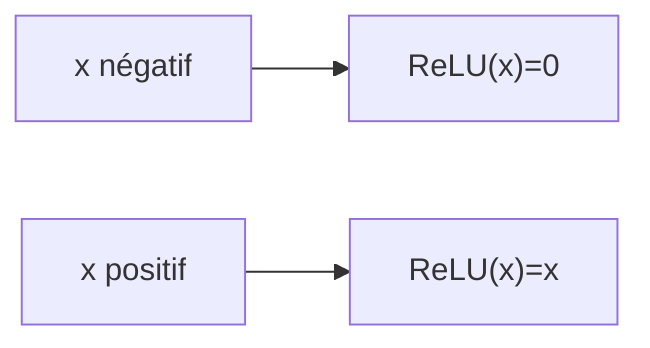

ReLU est simple, efficace et peu coûteuse.

---

## 11.16 Intuition de ReLU

ReLU agit comme une porte.

Certaines dimensions sont activées.

D’autres sont mises à zéro.

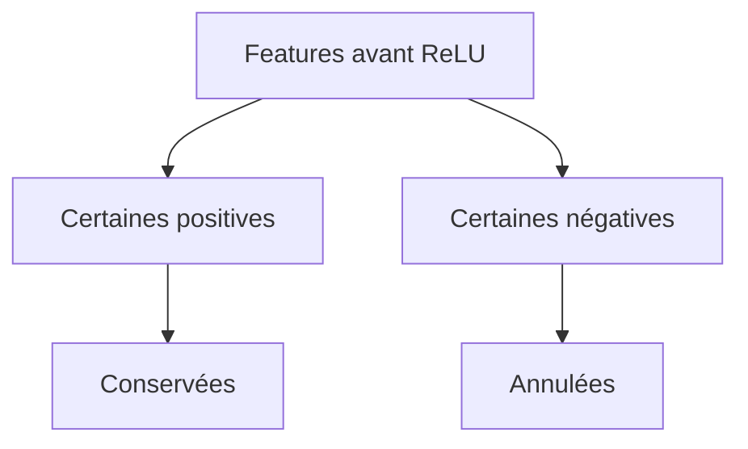

Cela permet au réseau de sélectionner certaines caractéristiques et d’en ignorer d’autres selon le contexte.

Pour un token donné, certaines dimensions internes du FFN peuvent s’activer fortement, tandis que d’autres restent inactives.

---

## 11.17 Exemple numérique simple avec ReLU

Supposons qu’après la première couche linéaire, nous obtenions :

$$
h = [-1.2,\ 0.5,\ 3.1,\ -0.7]
$$

Après ReLU :

$$
ReLU(h) = [0,\ 0.5,\ 3.1,\ 0]
$$

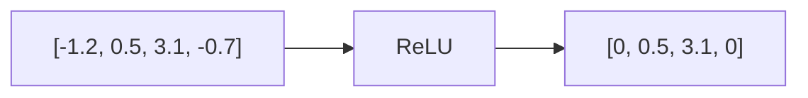

Les valeurs négatives sont coupées.

Les valeurs positives sont conservées.

---

## 11.18 Limites de ReLU

ReLU est simple, mais elle a quelques limites.

Par exemple, si une unité produit toujours une valeur négative, elle peut rester inactive.

On parle parfois de **dead ReLU**.

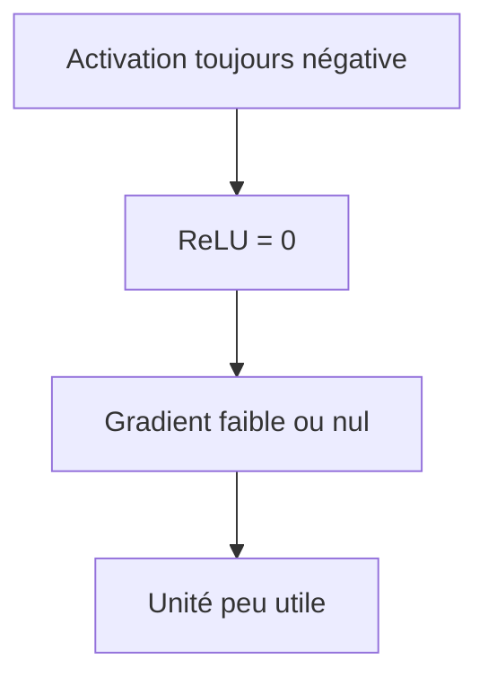

Cela ne veut pas dire que ReLU est mauvaise.

Elle a été extrêmement utile en deep learning.

Mais les modèles modernes utilisent souvent d’autres activations.

---

## 11.19 GELU dans les modèles modernes

De nombreux Transformers modernes utilisent **GELU** plutôt que ReLU.

GELU signifie :

```txt
Gaussian Error Linear Unit
```

Contrairement à ReLU, GELU ne coupe pas brutalement à zéro.

Elle applique une transition plus douce.

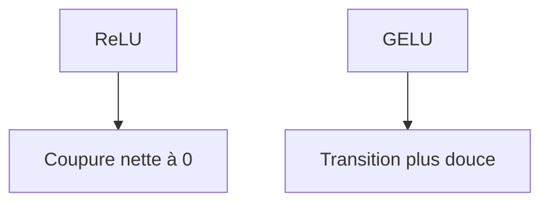

GELU est notamment utilisée dans des modèles comme BERT et de nombreux grands modèles de langage.

---

## 11.20 Intuition de GELU

ReLU répond grossièrement :

```txt
si positif : garder
si négatif : couper
```

GELU répond plutôt :

```txt
garder une valeur selon une probabilité liée à sa magnitude
```

L’intuition est plus douce :

* les grandes valeurs positives sont fortement conservées ;
* les grandes valeurs négatives sont fortement réduites ;
* les valeurs proches de zéro sont traitées progressivement.

```mermaid
flowchart LR
    A["Valeurs très négatives"] --> B["Fortement réduites"]
    C["Valeurs proches de 0"] --> D["Transition douce"]
    E["Valeurs positives"] --> F["Conservées davantage"]
```

Nous n’avons pas besoin de maîtriser immédiatement toute la formule de GELU, mais nous devons comprendre pourquoi elle est souvent préférée : elle donne une non-linéarité plus lisse.

---

## 11.21 Formule de GELU

Une formule courante de GELU est :

$$
GELU(x) = x \Phi(x)
$$

où (\Phi(x)) est la fonction de répartition de la loi normale standard.

Une approximation souvent utilisée est :

$$
GELU(x) \approx 0.5x\left(1 + tanh\left(\sqrt{\frac{2}{\pi}}(x + 0.044715x^3)\right)\right)
$$

Cette formule peut sembler plus complexe que ReLU, mais elle est très bien optimisée dans les bibliothèques modernes.

```mermaid
flowchart TD
    A["x"] --> B["GELU"]
    B --> C["Activation douce"]
```

---

## 11.22 ReLU vs GELU

Nous pouvons comparer simplement :

| Activation   | Idée                                 | Avantage                        | Limite                 |
| ------------ | ------------------------------------ | ------------------------------- | ---------------------- |
| ReLU         | Coupe les valeurs négatives          | Simple, rapide                  | Coupure brutale        |
| GELU         | Pondère les valeurs de manière douce | Souvent meilleure empiriquement | Plus coûteuse          |
| SiLU / Swish | (x \cdot sigmoid(x))                 | Douce et performante            | Plus coûteuse que ReLU |

```mermaid
flowchart TD
    A["Activations"] --> B["ReLU"]
    A --> C["GELU"]
    A --> D["SiLU / Swish"]

    B --> E["Simple"]
    C --> F["Douce"]
    D --> G["Douce avec sigmoid"]
```

Dans le Transformer original, nous retenons surtout ReLU.

Dans les modèles modernes, nous rencontrons fréquemment GELU, SiLU ou des variantes gated.

---

## 11.23 Les variantes gated : GLU, GeGLU, SwiGLU

Les Transformers modernes utilisent parfois des variantes du FFN avec une porte, appelées **gated feed-forward networks**.

L’idée est d’apprendre non seulement une transformation, mais aussi une porte qui contrôle quelles informations passent.

Une forme générale est :

$$
FFN(x) = (Activation(xW_1) \odot xW_2)W_3
$$

où $\odot$ représente une multiplication élément par élément.

```mermaid
flowchart TD
    X["x"] --> A["Projection 1 + activation"]
    X --> B["Projection 2 : porte"]
    A --> M["Multiplication élément par élément"]
    B --> M
    M --> C["Projection finale"]
```

Ces variantes ne sont pas dans le Transformer original, mais elles sont importantes dans les modèles modernes.

---

## 11.24 Intuition des mécanismes gated

Un mécanisme gated fonctionne comme une vanne.

Une partie du réseau produit un contenu.

Une autre partie décide combien de ce contenu doit passer.

```mermaid
flowchart LR
    A["Contenu"] --> C["Porte"]
    B["Signal de contrôle"] --> C
    C --> D["Information filtrée"]
```

Cela donne au modèle une capacité supplémentaire pour contrôler l’information.

Dans les grands modèles de langage modernes, ce type de FFN est très fréquent.

---

## 11.25 Le FFN contient beaucoup de paramètres

Dans un Transformer, le Feed-Forward Network représente souvent une grande partie des paramètres.

Prenons :

$$
d_{model} = 512
$$

$$
d_{ff} = 2048
$$

Première matrice :

$$
512 \times 2048 = 1,048,576
$$

Deuxième matrice :

$$
2048 \times 512 = 1,048,576
$$

Total approximatif, sans biais :

$$
2,097,152
$$

paramètres par FFN.

```mermaid
flowchart TD
    A["W1 : d_model x d_ff"] --> C["Beaucoup de paramètres"]
    B["W2 : d_ff x d_model"] --> C
```

Dans les grands modèles, les FFN peuvent représenter une part majeure du coût et de la capacité.

---

## 11.26 Pourquoi le FFN est coûteux

Le FFN est appliqué à chaque token, dans chaque couche.

Si nous avons :

* $B$ exemples ;
* $T$ tokens ;
* $N$ couches ;
* une grande dimension $d_{ff}$,

le coût devient important.

```mermaid
flowchart TD
    A["B batchs"] --> E["Coût total FFN"]
    B["T tokens"] --> E
    C["N couches"] --> E
    D["d_ff élevé"] --> E
```

Même si l’attention a un coût quadratique en $T$, le FFN peut dominer le coût pour certaines tailles de contexte et certains modèles.

---

## 11.27 Complexité du FFN

Pour chaque token, le coût principal est :

$$
d_{model} \times d_{ff} + d_{ff} \times d_{model}
$$

Donc environ :

$$
2d_{model}d_{ff}
$$

Pour une séquence de longueur $T$, le coût est :

$$
O(Td_{model}d_{ff})
$$

Avec un batch $B$ :

$$
O(BTd_{model}d_{ff})
$$

```mermaid
flowchart LR
    A["T tokens"] --> B["FFN appliqué à chaque token"]
    B --> C["Coût linéaire en T"]
```

Le FFN est linéaire en longueur de séquence, contrairement à l’attention qui est quadratique en $T$.

---

## 11.28 FFN et capacité du modèle

Nous pouvons voir le FFN comme une source majeure de capacité du Transformer.

L’attention indique quelles informations combiner.

Le FFN apprend comment transformer ces informations.

```mermaid
flowchart TD
    A["Attention"] --> B["Récupère le contexte pertinent"]
    B --> C["FFN"]
    C --> D["Transforme et enrichit la représentation"]
```

Dans certains travaux d’interprétation, les FFN sont parfois vus comme des mémoires associatives internes.

L’idée est que certaines dimensions ou neurones du FFN peuvent s’activer pour certains motifs, concepts ou contextes.

Nous devons rester prudents avec cette interprétation, mais elle est utile pour comprendre pourquoi le FFN est si important.

---

## 11.29 Le FFN comme transformation de features

Après l’attention, un token peut contenir plusieurs types d’informations :

* information lexicale ;
* information syntaxique ;
* information sémantique ;
* information de position ;
* information venue d’autres tokens.

Le FFN peut recombiner ces features.

```mermaid
flowchart TD
    A["Features du token contextualisé"] --> B["FFN"]
    B --> C["Nouvelles combinaisons de features"]
    C --> D["Représentation enrichie"]
```

Par exemple, pour un token verbal, il peut transformer des informations sur :

* le sujet ;
* le temps ;
* le nombre ;
* le contexte ;
* la relation avec d’autres mots.

---

## 11.30 Exemple intuitif : accord grammatical

Prenons :

```txt
Les chats noirs dorment.
```

Après l’attention, le token `dorment` peut avoir reçu des informations de :

* `chats` ;
* `Les` ;
* `noirs`.

Le FFN peut ensuite transformer cette représentation pour encoder plus fortement l’idée :

```txt
verbe pluriel accordé avec sujet pluriel
```

```mermaid
flowchart TD
    A["Attention : dorment regarde chats"] --> B["Information sujet pluriel"]
    B --> C["FFN"]
    C --> D["Représentation verbale enrichie"]
```

Le FFN ne remplace pas l’attention.

Il exploite l’information que l’attention a rassemblée.

---

## 11.31 Exemple intuitif : désambiguïsation

Phrase :

```txt
L’avocat plaide au tribunal.
```

Après l’attention, `avocat` peut intégrer :

* `plaide` ;
* `tribunal`.

Le FFN peut transformer cette représentation pour renforcer le sens juridique.

Autre phrase :

```txt
L’avocat est mûr.
```

Après l’attention, `avocat` peut intégrer :

* `mûr`.

Le FFN peut renforcer le sens alimentaire.

```mermaid
flowchart TD
    A["avocat + tribunal"] --> B["Attention"]
    B --> C["FFN"]
    C --> D["Sens juridique"]

    E["avocat + mûr"] --> F["Attention"]
    F --> G["FFN"]
    G --> H["Sens fruit"]
```

La contextualisation vient de l’attention, mais la transformation discriminante vient en grande partie du FFN.

---

## 11.32 Le FFN et les représentations internes

Dans un Transformer profond, chaque couche contient un FFN.

Ainsi, chaque couche peut :

1. récupérer du contexte par attention ;
2. transformer ce contexte localement ;
3. passer une représentation enrichie à la couche suivante.

```mermaid
flowchart TD
    A["Couche 1 attention"] --> B["Couche 1 FFN"]
    B --> C["Couche 2 attention"]
    C --> D["Couche 2 FFN"]
    D --> E["Couche 3 attention"]
    E --> F["Couche 3 FFN"]
```

Cette alternance est fondamentale.

Sans FFN, les couches d’attention empilées seraient moins expressives.

---

## 11.33 FFN dans l’encoder

Dans l’encoder, le FFN transforme les représentations source.

Exemple en traduction :

```txt
Source : The black cat sleeps.
```

Après self-attention, le token `cat` contient des informations sur `black` et `sleeps`.

Le FFN transforme cette représentation pour la rendre plus utile au decoder.

```mermaid
flowchart TD
    A["Source token cat"] --> B["Self-attention encoder"]
    B --> C["Contexte : black, sleeps"]
    C --> D["FFN encoder"]
    D --> E["Mémoire source enrichie"]
```

L’encoder prépare donc une mémoire source plus exploitable.

---

## 11.34 FFN dans le decoder

Dans le decoder, le FFN intervient après :

* masked self-attention ;
* cross-attention.

Donc chaque token cible contient déjà :

* le contexte cible passé ;
* le contexte source pertinent.

Le FFN transforme cette représentation avant la prédiction.

```mermaid
flowchart TD
    A["Contexte cible passé"] --> C["Représentation decoder"]
    B["Contexte source"] --> C
    C --> D["FFN decoder"]
    D --> E["Représentation prête pour prédiction"]
```

Le FFN du decoder contribue directement à la qualité de la distribution sur le prochain token.

---

## 11.35 FFN et projection finale : ne pas confondre

Le FFN dans les blocs Transformer ne doit pas être confondu avec la projection finale vers le vocabulaire.

Le FFN fait :

$$
d_{model} \rightarrow d_{ff} \rightarrow d_{model}
$$

La projection vocabulaire fait :

$$
d_{model} \rightarrow V
$$

où $V$ est la taille du vocabulaire.

```mermaid
flowchart TD
    A["FFN de bloc"] --> B["Transforme les représentations internes"]
    C["Projection vocabulaire"] --> D["Produit des logits de tokens"]
```

Le FFN est interne au Transformer.

La projection vocabulaire sert à produire les scores des tokens de sortie.

---

## 11.36 FFN et convolution 1x1

Il existe une autre manière de voir le FFN position-wise.

Comme il applique la même transformation à chaque position indépendamment, il ressemble à une convolution 1D avec noyau de taille 1.

```mermaid
flowchart TD
    A["FFN position-wise"] --> B["Même transformation par position"]
    C["Convolution 1x1"] --> D["Même idée : transformer les canaux localement"]
```

Cette analogie est utile en vision ou en traitement du signal.

Le FFN mélange les **features** d’un token, mais pas directement les positions.

---

## 11.37 Pourquoi le FFN revient à $d_{model}$

Le FFN augmente temporairement la dimension vers $d_{ff}$, mais revient à $d_{model}$.

Pourquoi ?

Parce que la sortie doit être compatible avec :

* la connexion résiduelle ;
* la couche suivante ;
* l’empilement régulier des blocs.

```mermaid
flowchart LR
    A["Entrée : d_model"] --> B["FFN interne : d_ff"]
    B --> C["Sortie : d_model"]
    C --> D["Compatible avec le bloc suivant"]
```

Si la sortie ne revenait pas à $d_{model}$, l’architecture serait plus difficile à empiler.

---

## 11.38 FFN et connexion résiduelle

Le FFN est entouré par une connexion résiduelle.

Dans le Transformer original :

$$
Y = LayerNorm(X + FFN(X))
$$

Cela signifie que le modèle conserve l’entrée et ajoute la transformation du FFN.

```mermaid
flowchart LR
    X["X"] --> F["FFN"]
    F --> ADD["Add"]
    X --> ADD
    ADD --> LN["LayerNorm"]
    LN --> Y["Y"]
```

La sortie n’est donc pas seulement :

```txt
FFN(X)
```

mais :

```txt
X + FFN(X)
```

Cela aide à préserver l’information et à stabiliser l’apprentissage.

---

## 11.39 FFN et dropout

Dans le Transformer original, on applique souvent du dropout autour du FFN.

Typiquement :

```txt
FFN → Dropout → Add & Norm
```

```mermaid
flowchart LR
    X["X"] --> F["FFN"]
    F --> D["Dropout"]
    D --> A["Add"]
    X --> A
    A --> N["LayerNorm"]
```

Le dropout sert à régulariser l’apprentissage.

Pendant l’entraînement, il désactive aléatoirement certaines activations.

Pendant l’inférence, il est désactivé.

---

## 11.40 FFN et LayerNorm

Le FFN est généralement combiné avec LayerNorm.

Dans la version Post-LN du Transformer original :

$$
LayerNorm(X + FFN(X))
$$

Dans une version Pre-LN moderne :

$$
X + FFN(LayerNorm(X))
$$

```mermaid
flowchart TD
    A["Post-LN"] --> B["FFN puis Add puis Norm"]
    C["Pre-LN"] --> D["Norm puis FFN puis Add"]
```

Le choix Post-LN ou Pre-LN influence la stabilité de l’entraînement.

Nous approfondirons cela dans le chapitre 12.

---

## 11.41 FFN et modèles modernes : dimensions plus grandes

Dans de nombreux grands modèles modernes, la dimension $d_{ff}$ est souvent plusieurs fois plus grande que $d_{model}$.

Un choix classique est :

$$
d_{ff} \approx 4d_{model}
$$

Mais avec certaines variantes gated, la dimension peut être choisie différemment.

```mermaid
flowchart TD
    A["d_model"] --> B["d_ff plus grand"]
    B --> C["Capacité de transformation"]
    C --> D["Retour vers d_model"]
```

L’augmentation de $d_{ff}$ est l’un des leviers d’augmentation de capacité du modèle.

---

## 11.42 Exemple de calcul de paramètres

Supposons :

$$
d_{model} = 768
$$

$$
d_{ff} = 3072
$$

Première matrice :

$$
768 \times 3072 = 2,359,296
$$

Deuxième matrice :

$$
3072 \times 768 = 2,359,296
$$

Total sans biais :

$$
4,718,592
$$

paramètres par FFN et par couche.

Si nous avons 12 couches :

$$
12 \times 4,718,592 = 56,623,104
$$

paramètres uniquement pour les matrices FFN.

```mermaid
flowchart TD
    A["Un FFN"] --> B["Plusieurs millions de paramètres"]
    B --> C["Multiplié par le nombre de couches"]
    C --> D["Part majeure du modèle"]
```

Cela montre que le FFN est loin d’être un détail.

---

## 11.43 FFN et mémoire des connaissances

Dans les grands modèles de langage, certains chercheurs interprètent les FFN comme des lieux où une partie des connaissances factuelles ou conceptuelles peut être stockée.

L’idée intuitive est :

* l’attention récupère et combine le contexte ;
* le FFN active des motifs internes ;
* certaines activations peuvent correspondre à des connaissances, styles ou régularités.

```mermaid
flowchart TD
    A["Contexte"] --> B["Attention"]
    B --> C["Représentation contextualisée"]
    C --> D["FFN"]
    D --> E["Activation de motifs internes"]
```

Nous devons rester prudents : un modèle ne stocke pas ses connaissances comme une base de données relationnelle.

Mais cette intuition aide à comprendre pourquoi les FFN prennent une place importante dans les LLM.

---

## 11.44 FFN et sparsité d’activation

Avec des activations comme ReLU, certaines dimensions internes sont mises à zéro.

Cela crée une forme de sparsité.

```mermaid
flowchart LR
    A["Vecteur dense"] --> B["ReLU"]
    B --> C["Certaines dimensions à zéro"]
    C --> D["Activation partiellement sparse"]
```

Cette sparsité peut être utile, car différentes entrées peuvent activer différents sous-ensembles de neurones.

Dans les modèles modernes, cette idée est poussée plus loin avec des architectures comme les Mixture of Experts, où seules certaines parties du réseau sont activées pour un token donné.

---

## 11.45 Lien avec Mixture of Experts

Les modèles **Mixture of Experts**, ou MoE, remplacent parfois le FFN dense par plusieurs experts.

Un routeur choisit quels experts appliquer à chaque token.

```mermaid
flowchart TD
    X["Token representation"] --> R["Router"]
    R --> E1["Expert FFN 1"]
    R --> E2["Expert FFN 2"]
    R --> E3["Expert FFN 3"]
    R --> E4["Expert FFN 4"]

    E1 --> Y["Sortie combinée"]
    E2 --> Y
```

Chaque expert est souvent un FFN.

Le MoE permet d’augmenter le nombre total de paramètres sans activer tous les paramètres à chaque token.

Nous détaillerons ces architectures dans les chapitres modernes, mais il est utile de comprendre que le FFN standard est la base de ces variantes.

---

## 11.46 FFN dans un mini-Transformer

Dans une implémentation pédagogique, nous pouvons écrire :

```python
class FeedForward(nn.Module):
    def __init__(self, d_model, d_ff, dropout=0.1):
        super().__init__()
        self.net = nn.Sequential(
            nn.Linear(d_model, d_ff),
            nn.ReLU(),
            nn.Dropout(dropout),
            nn.Linear(d_ff, d_model),
        )

    def forward(self, x):
        return self.net(x)
```

Cette classe reçoit :

```txt
B x T x d_model
```

et renvoie :

```txt
B x T x d_model
```

PyTorch applique automatiquement les couches linéaires sur la dernière dimension.

---

## 11.47 Version avec GELU

Une version moderne peut utiliser GELU :

```python
class FeedForward(nn.Module):
    def __init__(self, d_model, d_ff, dropout=0.1):
        super().__init__()
        self.net = nn.Sequential(
            nn.Linear(d_model, d_ff),
            nn.GELU(),
            nn.Dropout(dropout),
            nn.Linear(d_ff, d_model),
        )

    def forward(self, x):
        return self.net(x)
```

La seule différence ici est :

```python
nn.GELU()
```

à la place de :

```python
nn.ReLU()
```

Mais cette différence peut avoir un impact sur les performances empiriques.

---

## 11.48 Version avec SwiGLU simplifiée

Une version gated de type SwiGLU peut ressembler conceptuellement à ceci :

```python
class SwiGLUFeedForward(nn.Module):
    def __init__(self, d_model, d_ff):
        super().__init__()
        self.w1 = nn.Linear(d_model, d_ff)
        self.w2 = nn.Linear(d_model, d_ff)
        self.w3 = nn.Linear(d_ff, d_model)

    def forward(self, x):
        return self.w3(torch.nn.functional.silu(self.w1(x)) * self.w2(x))
```

Ici :

* `w1` produit une transformation activée ;
* `w2` produit une porte ;
* les deux sont multipliées ;
* `w3` revient à $d_{model}$.

```mermaid
flowchart TD
    X["x"] --> W1["w1 + SiLU"]
    X --> W2["w2"]
    W1 --> M["Multiplication"]
    W2 --> M
    M --> W3["w3"]
    W3 --> Y["y"]
```

Cette variante n’est pas celle du papier original, mais elle est importante dans les modèles modernes.

---

## 11.49 FFN et ordre des opérations dans un bloc

Dans un bloc Transformer original, le FFN est utilisé après l’attention.

Pour l’encoder :

```txt
Self-attention → Add & Norm → FFN → Add & Norm
```

Pour le decoder :

```txt
Masked self-attention → Add & Norm
→ Cross-attention → Add & Norm
→ FFN → Add & Norm
```

```mermaid
flowchart TD
    A["Attention"] --> B["Add & Norm"]
    B --> C["FFN"]
    C --> D["Add & Norm"]
```

Le FFN est donc toujours placé après que le token a reçu de l’information contextuelle.

---

## 11.50 Pourquoi ne pas mettre le FFN avant l’attention ?

On pourrait imaginer l’ordre inverse :

```txt
FFN → Attention
```

Certaines architectures expérimentales peuvent modifier l’ordre des sous-couches.

Mais dans le Transformer original, l’attention arrive d’abord, puis le FFN.

Intuition :

1. nous mélangeons les informations entre tokens ;
2. nous transformons chaque représentation enrichie.

```mermaid
flowchart LR
    A["Mélanger le contexte"] --> B["Transformer localement"]
```

Cet ordre est simple et efficace.

---

## 11.51 FFN et profondeur du modèle

Chaque couche possède son propre FFN.

Les FFN ne partagent généralement pas leurs paramètres entre couches.

```mermaid
flowchart TD
    A["Couche 1"] --> B["FFN 1"]
    C["Couche 2"] --> D["FFN 2"]
    E["Couche 3"] --> F["FFN 3"]
```

Cela permet à chaque couche d’apprendre une transformation différente.

Les couches basses peuvent traiter des motifs plus locaux.

Les couches hautes peuvent traiter des représentations plus abstraites.

Encore une fois, cela reste une intuition pédagogique, pas une règle stricte.

---

## 11.52 FFN et interprétation des couches

Dans une lecture pédagogique, nous pouvons dire :

* l’attention choisit les informations pertinentes ;
* le FFN applique des transformations spécialisées ;
* les couches successives construisent des niveaux de représentation.

```mermaid
flowchart TD
    A["Couche basse"] --> B["Motifs simples"]
    B --> C["Couche intermédiaire"]
    C --> D["Relations syntaxiques/sémantiques"]
    D --> E["Couche haute"]
    E --> F["Représentations abstraites"]
```

Mais il faut éviter de penser que chaque couche a une fonction parfaitement claire.

Les Transformers apprennent des représentations distribuées et souvent difficiles à interpréter.

---

## 11.53 FFN et stabilité de l’entraînement

Le FFN peut produire des activations de grande amplitude.

C’est pourquoi il est entouré par :

* dropout ;
* connexion résiduelle ;
* LayerNorm.

```mermaid
flowchart TD
    A["FFN"] --> B["Activations potentiellement fortes"]
    B --> C["Dropout"]
    C --> D["Add résiduel"]
    D --> E["LayerNorm"]
    E --> F["Stabilité"]
```

Nous étudierons plus précisément les résidus et la normalisation dans le chapitre 12.

---

## 11.54 Erreur fréquente : croire que le Transformer est uniquement de l’attention

Le papier original s’intitule **Attention Is All You Need**, mais cela ne signifie pas que le modèle ne contient que de l’attention.

Un Transformer contient aussi :

* embeddings ;
* positional encodings ;
* feed-forward networks ;
* connexions résiduelles ;
* normalisation ;
* projections linéaires ;
* softmax ;
* dropout.

```mermaid
flowchart TD
    A["Transformer"] --> B["Attention"]
    A --> C["Feed-Forward Networks"]
    A --> D["LayerNorm"]
    A --> E["Résidus"]
    A --> F["Embeddings"]
```

L’attention est la rupture architecturale majeure, mais le FFN est indispensable.

---

## 11.55 Erreur fréquente : croire que le FFN mélange les tokens

Le FFN ne mélange pas directement les tokens.

Il est appliqué à chaque position indépendamment.

```mermaid
flowchart TD
    A["Mélange des tokens"] --> B["Attention"]
    C["Transformation par token"] --> D["FFN"]
```

Si nous voulons qu’un token reçoive de l’information d’un autre token, cela doit passer par l’attention.

Le FFN traite ensuite cette information localement.

---

## 11.56 Erreur fréquente : oublier la dimension $d_{ff}$

On parle souvent de $d_{model}$, mais $d_{ff}$ est tout aussi important.

La dimension $d_{ff}$ contrôle la capacité du FFN.

Si elle est trop petite, le modèle peut manquer de capacité.

Si elle est très grande, le modèle devient plus coûteux.

```mermaid
flowchart TD
    A["d_ff faible"] --> B["Moins de capacité"]
    C["d_ff élevé"] --> D["Plus de capacité"]
    D --> E["Plus de coût"]
```

Le choix de $d_{ff}$ est donc un compromis.

---

## 11.57 Erreur fréquente : confondre activation et softmax

La fonction d’activation du FFN, comme ReLU ou GELU, n’a pas le même rôle que le softmax de l’attention.

| Fonction      | Où ?               | Rôle                                |
| ------------- | ------------------ | ----------------------------------- |
| Softmax       | Attention          | Transformer les scores en poids     |
| ReLU/GELU     | FFN                | Ajouter une non-linéarité           |
| Softmax final | Sortie vocabulaire | Produire des probabilités de tokens |

```mermaid
flowchart TD
    A["Softmax attention"] --> B["Poids d'attention"]
    C["ReLU/GELU"] --> D["Transformation non linéaire"]
    E["Softmax vocabulaire"] --> F["Probabilités de tokens"]
```

Ces opérations sont différentes.

---

## 11.58 Erreur fréquente : croire que deux couches linéaires suffisent sans activation

Deux transformations linéaires successives sans activation sont équivalentes à une seule transformation linéaire.

Donc, sans activation, le FFN perdrait une grande partie de son intérêt.

```mermaid
flowchart LR
    A["Linear 1"] --> B["Linear 2"]
    B --> C["Équivaut à Linear unique"]

    D["Linear 1"] --> E["Activation"]
    E --> F["Linear 2"]
    F --> G["Transformation non linéaire"]
```

La non-linéarité est donc indispensable.

---

## 11.59 Synthèse mathématique

Le Feed-Forward Network position-wise du Transformer original est :

$$
FFN(x) = max(0, xW_1 + b_1)W_2 + b_2
$$

avec :

$$
W_1 \in \mathbb{R}^{d_{model} \times d_{ff}}
$$

$$
W_2 \in \mathbb{R}^{d_{ff} \times d_{model}}
$$

Pour un tenseur :

$$
X \in \mathbb{R}^{B \times T \times d_{model}}
$$

nous obtenons :

$$
FFN(X) \in \mathbb{R}^{B \times T \times d_{model}}
$$

Le FFN est appliqué indépendamment à chaque position, mais avec les mêmes paramètres.

---

## 11.60 Schéma global de synthèse

```mermaid
flowchart TD
    X["Entrée : B x T x d_model"] --> L1["Linear d_model -> d_ff"]
    L1 --> H["B x T x d_ff"]
    H --> ACT["Activation ReLU / GELU"]
    ACT --> L2["Linear d_ff -> d_model"]
    L2 --> Y["B x T x d_model"]

    Y --> ADD["Connexion résiduelle avec X"]
    X --> ADD
    ADD --> LN["LayerNorm"]
    LN --> OUT["Sortie du bloc"]
```

Ce schéma montre le FFN dans son contexte réel : il est généralement suivi d’un Add & Norm.

---

## 11.61 Résumé du chapitre

Nous avons étudié le **Feed-Forward Network** dans les Transformers.

Nous avons vu qu’il ne mélange pas directement les tokens entre eux.

Il est appliqué indépendamment à chaque position, avec les mêmes paramètres pour toutes les positions.

Son rôle est de transformer chaque représentation contextualisée grâce à une projection vers une dimension interne plus grande, une fonction d’activation non linéaire, puis une projection de retour vers $d_{model}$.

Dans le Transformer original, le FFN utilise ReLU :

$$
FFN(x) = max(0, xW_1 + b_1)W_2 + b_2
$$

avec typiquement :

$$
d_{model} = 512
$$

$$
d_{ff} = 2048
$$

Nous avons aussi vu que les modèles modernes utilisent souvent GELU, SiLU, SwiGLU ou des variantes gated.

Le point central est :

> L’attention permet aux tokens d’échanger de l’information ; le Feed-Forward Network transforme ensuite chaque représentation avec une capacité non linéaire importante.

---

## 11.62 Questions de compréhension

### 11.62.1 Question 1

Quel est le rôle principal du Feed-Forward Network dans un Transformer ?

Réponse attendue : transformer chaque représentation de token individuellement avec une transformation non linéaire.

### 11.62.2 Question 2

Le FFN mélange-t-il directement les tokens entre eux ?

Réponse attendue : non. Il est appliqué indépendamment à chaque position. Le mélange entre tokens est réalisé par l’attention.

### 11.62.3 Question 3

Pourquoi dit-on que le FFN est position-wise ?

Réponse attendue : parce que le même réseau est appliqué séparément à chaque position de la séquence.

### 11.62.4 Question 4

Quelle est la forme générale du FFN dans le Transformer original ?

Réponse attendue :

$$
FFN(x) = max(0, xW_1 + b_1)W_2 + b_2
$$

### 11.62.5 Question 5

Pourquoi utilise-t-on une fonction d’activation entre les deux couches linéaires ?

Réponse attendue : parce que sans activation, deux couches linéaires successives seraient équivalentes à une seule transformation linéaire.

### 11.62.6 Question 6

Quelle activation est utilisée dans le Transformer original ?

Réponse attendue : ReLU.

### 11.62.7 Question 7

Quelle activation est souvent utilisée dans les Transformers modernes comme BERT ?

Réponse attendue : GELU.

### 11.62.8 Question 8

Pourquoi $d_{ff}$ est-il souvent plus grand que $d_{model}$ ?

Réponse attendue : pour donner au FFN plus de capacité en projetant temporairement les représentations dans un espace plus large.

### 11.62.9 Question 9

Quelle est la forme de sortie du FFN si l’entrée est $B \times T \times d_{model}$ ?

Réponse attendue :

$$
B \times T \times d_{model}
$$

### 11.62.10 Question 10

Pourquoi le FFN est-il entouré par une connexion résiduelle et une normalisation ?

Réponse attendue : pour stabiliser l’entraînement, préserver l’information d’entrée et faciliter la circulation du gradient.

---

## 11.63 Transition vers le chapitre 12

Nous avons maintenant étudié les deux grandes opérations internes d’un bloc Transformer :

* l’attention ;
* le feed-forward network.

Mais ces opérations ne suffisent pas à elles seules à entraîner efficacement des modèles profonds.

Les Transformers utilisent aussi des mécanismes de stabilisation :

* connexions résiduelles ;
* LayerNorm ;
* Add & Norm ;
* dropout ;
* variantes Post-LN et Pre-LN.

Dans le chapitre suivant, nous allons donc étudier les **résidus, la normalisation et la stabilité de l’entraînement**.

Nous verrons pourquoi ces composants sont essentiels pour permettre l’empilement de nombreuses couches Transformer.

---
> [!info] Livre « Les transformers » — chapitre 11/30
> [[Les transformers — Sommaire|Sommaire]] · [[Les transformers — 10 — Masques d’attention|← 10 — Masques d’attention]] · [[Les transformers — 12 — Résidus, normalisation et stabilité de l’entraînement|12 — Résidus, normalisation et stabilité de l’entraînement →]]
