> [!info] Livre « Les transformers » — chapitre 12/30
> [[Les transformers — Sommaire|Sommaire]] · [[Les transformers — 11 — Feed-Forward Network et non-linéarités|← 11 — Feed-Forward Network et non-linéarités]] · [[Les transformers — 13 — Entraînement du Transformer original|13 — Entraînement du Transformer original →]]

# Chapitre 12 — Résidus, normalisation et stabilité de l’entraînement
## 12.1 Objectif du chapitre

Dans les chapitres précédents, nous avons étudié les grandes briques fonctionnelles du Transformer :

- l’attention ;
    
- la multi-head attention ;
    
- les masques ;
    
- le feed-forward network ;
    
- les blocs encoder et decoder.
    

Mais pour qu’un Transformer profond puisse réellement être entraîné, il ne suffit pas d’empiler attention et feed-forward.

Nous avons besoin de mécanismes de stabilisation.

Dans notre plan de cours, ce chapitre est consacré aux connexions résiduelles, à LayerNorm, à Add & Norm, à Post-LN dans le Transformer original, à Pre-LN dans de nombreux modèles modernes, au gradient flow, aux problèmes d’instabilité et à l’importance de la normalisation dans les grands modèles.

Le schéma de base est le suivant :

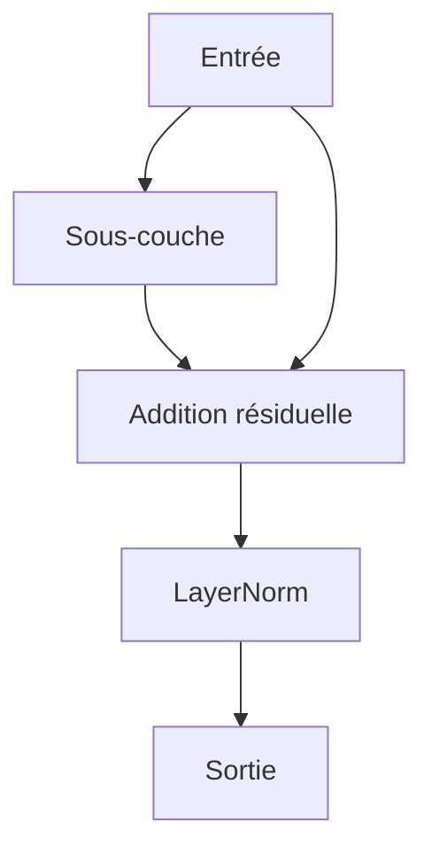

L’objectif du chapitre est de comprendre pourquoi ces éléments sont indispensables, même s’ils paraissent moins spectaculaires que l’attention.

---

## 12.2 Pourquoi parler de stabilité ?

Un Transformer est un réseau profond.

Il contient plusieurs couches, parfois des dizaines, parfois des centaines dans les grands modèles modernes.

À chaque couche, nous appliquons :

- des projections linéaires ;
    
- des produits matriciels ;
    
- des softmax ;
    
- des activations ;
    
- des feed-forward networks ;
    
- des additions ;
    
- des normalisations.
    

Sans mécanismes de stabilisation, les représentations peuvent devenir difficiles à contrôler.

Elles peuvent :

- exploser ;
    
- s’écraser ;
    
- devenir instables ;
    
- produire des gradients trop grands ;
    
- produire des gradients trop faibles ;
    
- rendre l’entraînement très difficile.
    

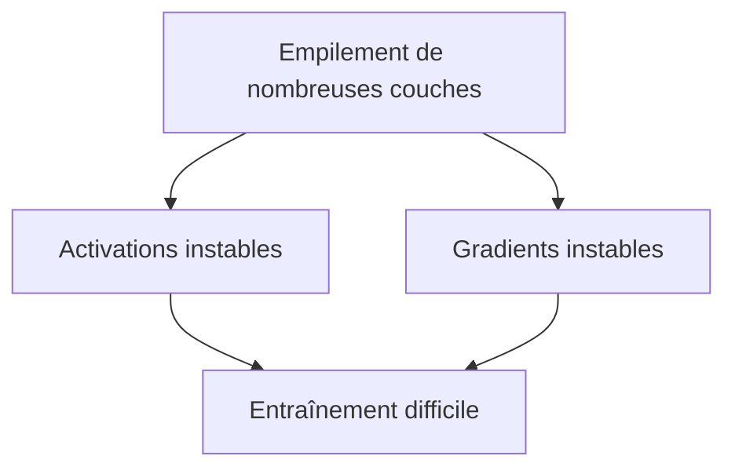

Les connexions résiduelles et la normalisation répondent précisément à ce problème.

---

## 12.3 Le problème des réseaux profonds

Quand nous empilons beaucoup de couches, le signal doit traverser toute la profondeur du réseau.

Pendant la passe avant, les représentations passent de couche en couche.

Pendant la rétropropagation, le gradient doit revenir de la sortie vers les premières couches.

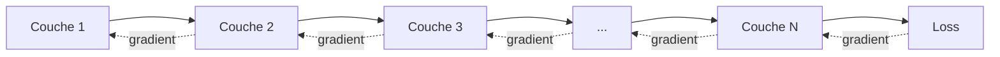

Plus le réseau est profond, plus le gradient peut devenir difficile à propager.

C’est le problème du **gradient flow**, c’est-à-dire la circulation du gradient.

---

## 12.4 Gradient qui disparaît et gradient qui explose

Deux problèmes classiques apparaissent dans les réseaux profonds.

### Gradient qui disparaît

Le gradient devient de plus en plus petit en remontant vers les premières couches.

Conséquence :

```txt
Les premières couches apprennent très lentement, voire presque plus.
```

### Gradient qui explose

Le gradient devient trop grand.

Conséquence :

```txt
Les mises à jour deviennent instables, la loss peut diverger.
```

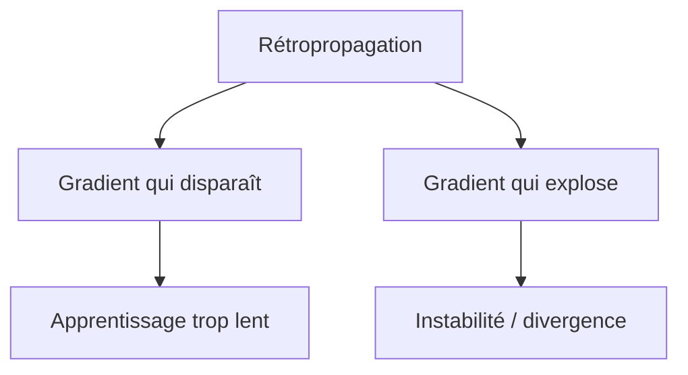

Les Transformers utilisent plusieurs mécanismes pour limiter ces problèmes.

---

## 12.5 Les connexions résiduelles

Une connexion résiduelle consiste à ajouter l’entrée d’une sous-couche à sa sortie.

Si une sous-couche est notée :

[  
S(x)  
]

alors la connexion résiduelle donne :

[  
x + S(x)  
]

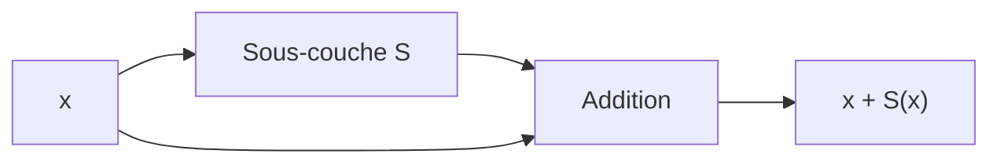

L’idée est simple :

> La sous-couche n’a pas besoin de reconstruire toute la représentation ; elle peut apprendre une modification de l’entrée.

C’est une idée très puissante.

---

## 12.6 Intuition des résidus

Sans connexion résiduelle, une couche doit produire directement la représentation suivante.

Avec connexion résiduelle, elle apprend plutôt une correction.

```txt
sortie = entrée + correction
```

Par exemple, si l’entrée est déjà utile, la couche peut apprendre une petite modification.

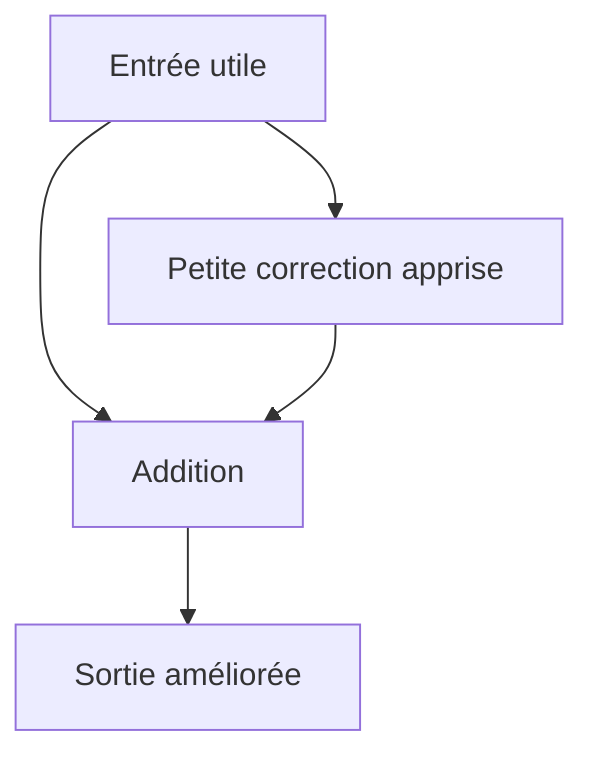

Cela rend l’apprentissage plus facile.

Le réseau peut progressivement raffiner les représentations plutôt que les reconstruire entièrement à chaque couche.

---

## 12.7 Résidus et préservation de l’information

Les connexions résiduelles aident à préserver l’information.

Dans un Transformer, une sous-couche d’attention ou de feed-forward pourrait transformer fortement les vecteurs.

Le chemin résiduel garantit que l’entrée originale reste disponible.

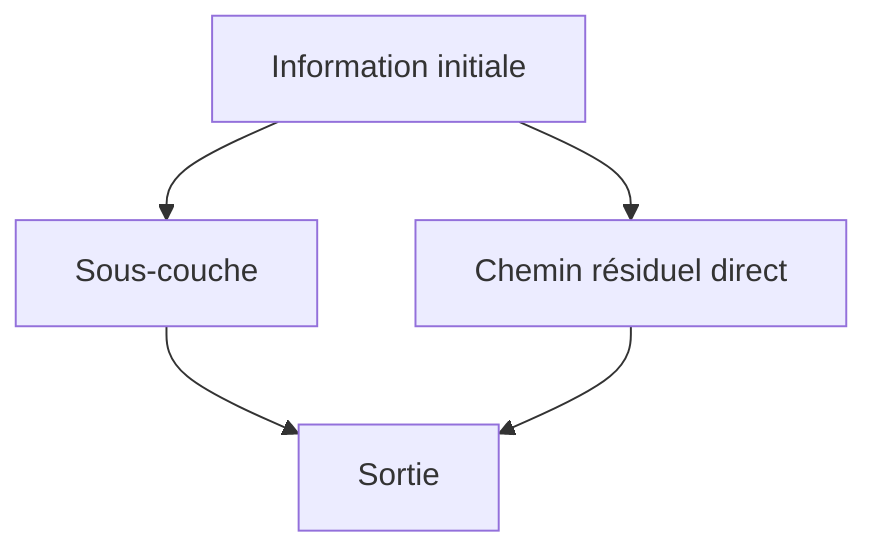

Ainsi, même si une sous-couche produit une transformation imparfaite, la représentation d’origine n’est pas complètement perdue.

---

## 12.8 Résidus et circulation du gradient

Les connexions résiduelles facilitent aussi la rétropropagation.

Le gradient peut passer par le chemin de la sous-couche, mais aussi par le chemin direct.

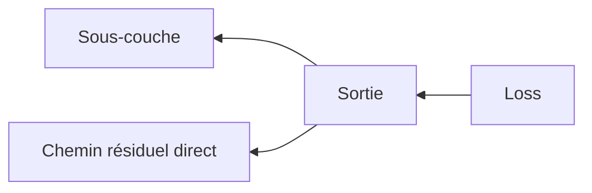

Ce chemin direct permet au gradient de circuler plus facilement vers les couches précédentes.

C’est l’une des raisons pour lesquelles les réseaux très profonds sont devenus entraînables.

---

## 12.9 Résidus dans le bloc encoder

Dans un bloc encoder, nous avons deux connexions résiduelles.

Première connexion autour de la self-attention :

[  
X_1 = LayerNorm(X + MultiHeadSelfAttention(X))  
]

Deuxième connexion autour du feed-forward network :

[  
Y = LayerNorm(X_1 + FFN(X_1))  
]

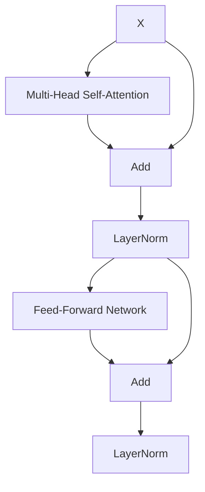

Chaque sous-couche est donc entourée par un chemin résiduel.

---

## 12.10 Résidus dans le bloc decoder

Dans un bloc decoder, nous avons trois sous-couches, donc trois connexions résiduelles.

1. autour de la masked self-attention ;
    
2. autour de la cross-attention ;
    
3. autour du feed-forward network.
    

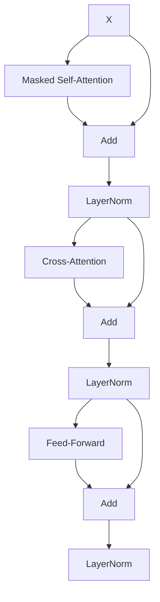

Le principe reste le même : chaque transformation est ajoutée à son entrée.

---

## 12.11 Condition nécessaire : mêmes dimensions

Pour additionner deux tenseurs, ils doivent avoir la même forme.

C’est pourquoi les sous-couches du Transformer produisent généralement une sortie de forme :

[  
B \times T \times d_{model}  
]

comme leur entrée.

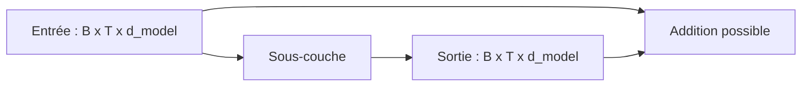

Cette contrainte explique pourquoi :

- la multi-head attention revient à $d_{model}$ après projection finale ;
    
- le FFN revient à $d_{model}$ après expansion vers $d_{ff}$.
    

---

## 12.12 LayerNorm : pourquoi normaliser ?

Les activations d’un réseau profond peuvent changer d’échelle d’une couche à l’autre.

Certaines dimensions peuvent devenir très grandes.

D’autres peuvent devenir très petites.

Cela complique l’apprentissage.

LayerNorm stabilise les représentations en normalisant chaque vecteur de token.

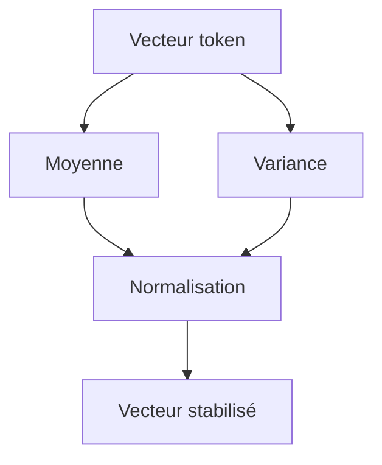

L’idée est :

> Avant de transmettre une représentation à la suite du modèle, nous la remettons dans une échelle plus contrôlée.

---

## 12.13 Où agit LayerNorm ?

Dans un tenseur :

[  
X \in \mathbb{R}^{B \times T \times d_{model}}  
]

LayerNorm agit sur la dernière dimension :

[  
d_{model}  
]

Pour chaque token de chaque exemple du batch, nous normalisons son vecteur de features.

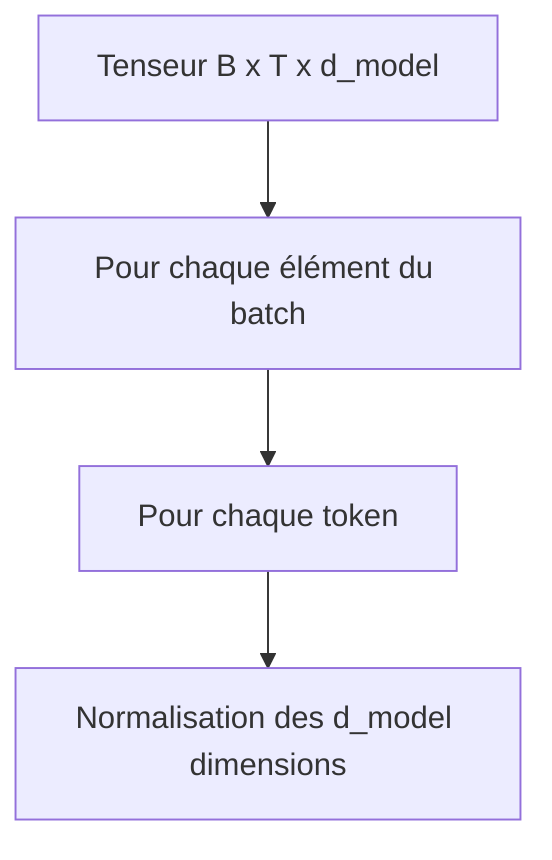

LayerNorm ne calcule pas des statistiques sur tout le batch.

Elle normalise localement chaque représentation.

---

## 12.14 Formule de LayerNorm

Pour un vecteur :

[  
x = (x_1, x_2, ..., x_d)  
]

nous calculons la moyenne :

[  
\mu = \frac{1}{d}\sum_{i=1}^{d} x_i  
]

puis la variance :

[  
\sigma^2 = \frac{1}{d}\sum_{i=1}^{d}(x_i - \mu)^2  
]

Ensuite, nous normalisons :

[  
\hat{x_i} = \frac{x_i - \mu}{\sqrt{\sigma^2 + \epsilon}}  
]

Enfin, nous appliquons deux paramètres appris :

[  
y_i = \gamma_i \hat{x_i} + \beta_i  
]

où :

- $\gamma$ est un facteur d’échelle appris ;
    
- $\beta$ est un biais appris ;
    
- $\epsilon$ évite la division par zéro.
    

---

## 12.15 Pourquoi LayerNorm a des paramètres appris ?

Si LayerNorm normalisait simplement les vecteurs, elle imposerait toujours une même échelle et un même centrage.

Les paramètres $\gamma$ et $\beta$ permettent au modèle de réajuster cette normalisation.

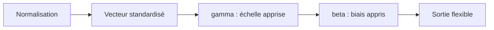

Ainsi, LayerNorm stabilise l’apprentissage tout en laissant au modèle la possibilité de choisir une échelle utile.

---

## 12.16 LayerNorm vs BatchNorm

Il ne faut pas confondre LayerNorm et BatchNorm.

|Normalisation|Statistiques calculées sur|Usage fréquent|
|---|---|---|
|BatchNorm|Le batch|CNN classiques|
|LayerNorm|Les features d’un exemple/token|Transformers|
|RMSNorm|Norme RMS des features|LLM modernes|

BatchNorm dépend fortement de la taille du batch.

LayerNorm est plus adaptée aux séquences, aux tailles variables et aux modèles autoregressifs.

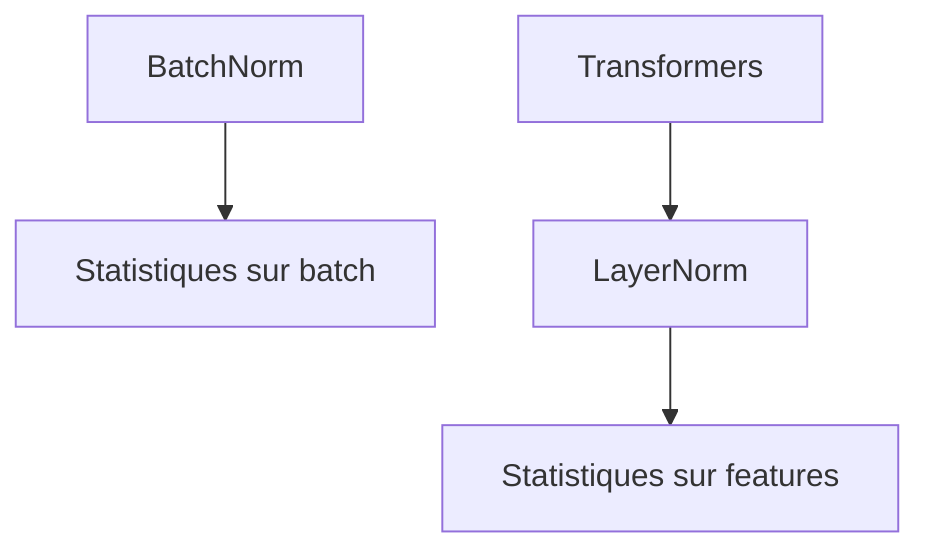

Dans les Transformers, LayerNorm est devenue la normalisation standard, même si certaines variantes modernes utilisent RMSNorm.

---

## 12.17 Add & Norm dans le Transformer original

Dans le papier original, chaque sous-couche est suivie de :

```txt
Add & Norm
```

Cela signifie :

1. on ajoute la connexion résiduelle ;
    
2. on applique LayerNorm.
    

Formellement :

[  
Output = LayerNorm(x + Sublayer(x))  
]

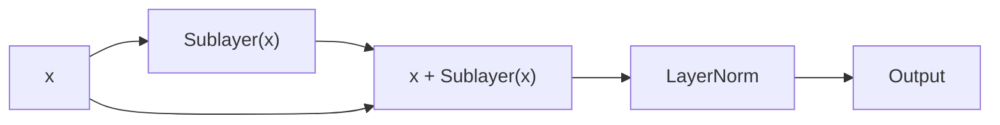

Cette structure est appelée **Post-LN**, car la normalisation est appliquée après la sous-couche et l’addition.

---

## 12.18 Post-LN : structure du Transformer original

Dans la version Post-LN :

[  
y = LayerNorm(x + Sublayer(x))  
]

Le flux est :

```txt
Sous-couche → Addition résiduelle → LayerNorm
```

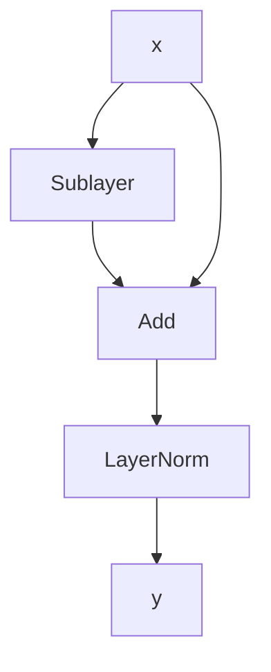

C’est la structure utilisée dans le Transformer original.

Elle fonctionne bien pour des modèles de taille modérée, comme ceux du papier initial.

---

## 12.19 Limites du Post-LN

Quand les modèles deviennent très profonds, Post-LN peut rendre l’entraînement plus délicat.

Le gradient doit traverser les LayerNorm placées après chaque addition.

Cela peut compliquer la circulation du gradient dans les très grandes profondeurs.

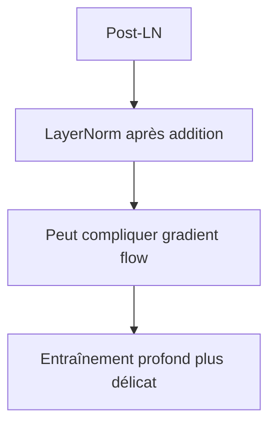

Pour cette raison, de nombreux modèles modernes utilisent plutôt une structure **Pre-LN**.

---

## 12.20 Pre-LN : normaliser avant la sous-couche

Dans une structure Pre-LN, nous appliquons LayerNorm avant la sous-couche.

La formule devient :

[  
y = x + Sublayer(LayerNorm(x))  
]

Le flux est :

```txt
LayerNorm → Sous-couche → Addition résiduelle
```

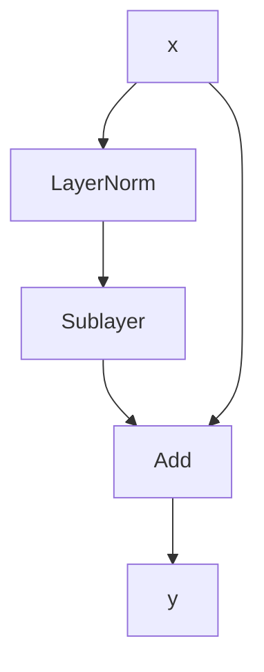

Le chemin résiduel direct est plus propre pour le gradient.

Cela rend souvent l’entraînement des modèles profonds plus stable.

---

## 12.21 Comparaison Post-LN et Pre-LN

|Structure|Formule|Normalisation|
|---|---|---|
|Post-LN|(LayerNorm(x + Sublayer(x)))|Après l’addition|
|Pre-LN|(x + Sublayer(LayerNorm(x)))|Avant la sous-couche|

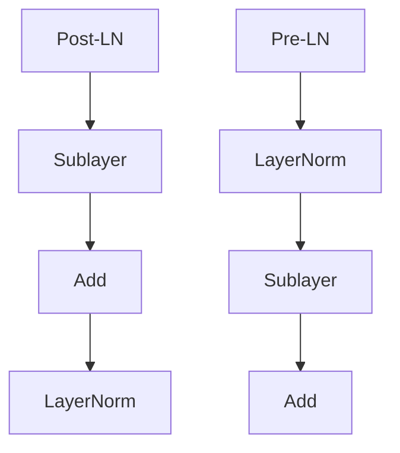

À retenir :

- Post-LN correspond au Transformer original ;
    
- Pre-LN est très courant dans les modèles modernes profonds.
    

---

## 12.22 Intuition du meilleur gradient flow en Pre-LN

Dans Pre-LN, la sortie est :

[  
y = x + Sublayer(LayerNorm(x))  
]

Il existe donc un chemin direct :

[  
x \rightarrow y  
]

sans passer par une normalisation après l’addition.

```mermaid
flowchart LR
    X["x"] --> Y["y"]
    X --> LN["LayerNorm"]
    LN --> S["Sublayer"]
    S --> Y
```

Ce chemin direct facilite le passage du gradient.

C’est l’une des raisons pour lesquelles Pre-LN est apprécié pour les Transformers profonds.

---

## 12.23 Mais Pre-LN n’est pas magique

Pre-LN améliore souvent la stabilité, mais ce n’est pas une solution parfaite à tous les problèmes.

Il peut aussi changer la dynamique d’entraînement et parfois produire des représentations finales qui nécessitent une normalisation finale supplémentaire.

Dans beaucoup de modèles Pre-LN, on ajoute une LayerNorm finale après toutes les couches.

```mermaid
flowchart TD
    A["Blocs Pre-LN empilés"] --> B["Sortie"]
    B --> C["LayerNorm finale"]
```

Nous devons retenir que Pre-LN est un choix architectural moderne fréquent, mais pas une loi universelle.

---

## 12.24 RMSNorm : une variante moderne

Certains modèles modernes utilisent **RMSNorm** au lieu de LayerNorm.

LayerNorm soustrait la moyenne et divise par l’écart-type.

RMSNorm simplifie en normalisant principalement par la racine de la moyenne des carrés.

Intuition :

```txt
RMSNorm stabilise l’échelle sans recentrer explicitement par la moyenne.
```

```mermaid
flowchart TD
    A["LayerNorm"] --> B["Centre + normalise"]
    C["RMSNorm"] --> D["Normalise surtout l'échelle"]
```

RMSNorm peut être plus simple et plus efficace dans certains grands modèles.

Nous n’avons pas besoin de la détailler entièrement ici, mais il est utile de connaître son existence.

---

## 12.25 Dropout et stabilité

Le dropout est un autre mécanisme utilisé dans le Transformer original.

Il consiste à désactiver aléatoirement certaines activations pendant l’entraînement.

Cela force le modèle à ne pas trop dépendre de chemins spécifiques.

```mermaid
flowchart TD
    A["Activations"] --> B["Dropout pendant entraînement"]
    B --> C["Certaines valeurs mises à 0"]
    C --> D["Régularisation"]
```

Le dropout sert surtout à réduire le surapprentissage.

Il contribue indirectement à la stabilité de l’entraînement.

---

## 12.26 Dropout dans le Transformer

Dans le Transformer, le dropout peut être appliqué :

- après les embeddings ;
    
- après les sorties d’attention ;
    
- après les FFN ;
    
- parfois sur les poids d’attention.
    

```mermaid
flowchart TD
    A["Embeddings"] --> B["Dropout possible"]
    C["Attention output"] --> D["Dropout possible"]
    E["FFN output"] --> F["Dropout possible"]
    G["Attention weights"] --> H["Dropout possible"]
```

Pendant l’inférence, le dropout est désactivé.

---

## 12.27 Stabilité et initialisation des poids

La stabilité dépend aussi de l’initialisation des poids.

Si les poids sont initialisés trop grands, les activations peuvent exploser.

S’ils sont trop petits, les signaux peuvent s’écraser.

```mermaid
flowchart TD
    A["Initialisation des poids"] --> B["Trop grande"]
    A --> C["Trop petite"]
    B --> D["Activations instables"]
    C --> E["Signal faible"]
```

Les bibliothèques modernes utilisent des initialisations adaptées, mais pour comprendre les Transformers, nous devons savoir que l’initialisation fait partie des conditions de stabilité.

---

## 12.28 Stabilité et learning rate

Le learning rate influence fortement la stabilité.

Un learning rate trop élevé peut faire diverger l’entraînement.

Un learning rate trop faible peut rendre l’apprentissage très lent.

Dans le papier original, les auteurs utilisent un schedule avec warmup.

Nous l’étudierons au chapitre 13.

```mermaid
flowchart TD
    A["Learning rate"] --> B["Trop élevé"]
    A --> C["Trop faible"]
    B --> D["Divergence"]
    C --> E["Apprentissage lent"]
```

Les mécanismes architecturaux comme LayerNorm et les résidus aident, mais ils ne remplacent pas un bon choix d’optimisation.

---

## 12.29 Warmup et normalisation

Le warmup consiste à augmenter progressivement le learning rate au début de l’entraînement.

Pourquoi ?

Au début, les poids sont encore peu adaptés.

Un learning rate trop fort immédiatement peut déstabiliser le modèle.

```mermaid
flowchart TD
    A["Début entraînement"] --> B["Poids peu stabilisés"]
    B --> C["Warmup"]
    C --> D["Learning rate augmente progressivement"]
```

Le warmup complète les mécanismes de stabilisation internes comme LayerNorm et les connexions résiduelles.

---

## 12.30 Stabilité dans les grands modèles

Plus un modèle est grand, plus la stabilité devient importante.

Dans les grands modèles de langage, nous devons contrôler :

- les activations ;
    
- les gradients ;
    
- les normes ;
    
- les précisions numériques ;
    
- les learning rates ;
    
- les initialisations ;
    
- les normalisations.
    

```mermaid
flowchart TD
    A["Grand modèle"] --> B["Plus de couches"]
    A --> C["Plus de paramètres"]
    A --> D["Plus de calculs"]
    B --> E["Stabilité critique"]
    C --> E
    D --> E
```

Les résidus et les normalisations ne sont donc pas des détails : ce sont des conditions de possibilité des grands Transformers.

---

## 12.31 Le rôle des normes d’activation

Pendant l’entraînement, on surveille parfois les normes des activations.

Si elles augmentent fortement couche après couche, cela peut annoncer une instabilité.

Si elles s’écrasent, le modèle peut perdre de l’information.

LayerNorm aide à contrôler ces échelles.

```mermaid
flowchart TD
    A["Activations"] --> B["Normes trop grandes"]
    A --> C["Normes trop petites"]
    B --> D["Instabilité"]
    C --> E["Perte de signal"]
    F["LayerNorm"] --> G["Échelle plus contrôlée"]
```

---

## 12.32 Gradient clipping

Dans certaines situations, on utilise aussi le **gradient clipping**.

Cela consiste à limiter la norme du gradient.

Si le gradient devient trop grand, il est rescalé.

```mermaid
flowchart TD
    A["Gradient"] --> B["Norme trop grande ?"]
    B -->|Oui| C["Réduction de la norme"]
    B -->|Non| D["Gradient inchangé"]
```

Le gradient clipping n’est pas une spécificité des Transformers, mais il peut aider dans l’entraînement de réseaux profonds.

---

## 12.33 Pourquoi les résidus ne suffisent pas seuls

Les connexions résiduelles facilitent la circulation de l’information et du gradient.

Mais elles ne contrôlent pas complètement l’échelle des activations.

Si nous additionnons beaucoup de sorties de sous-couches, les valeurs peuvent changer d’échelle.

C’est pourquoi nous combinons résidus et normalisation.

```mermaid
flowchart TD
    A["Résidus"] --> B["Préservent information"]
    A --> C["Facilitent gradient"]
    D["LayerNorm"] --> E["Contrôle l'échelle"]
    B --> F["Stabilité"]
    C --> F
    E --> F
```

Les deux mécanismes sont complémentaires.

---

## 12.34 Pourquoi LayerNorm ne suffit pas seul

LayerNorm stabilise les activations.

Mais sans chemin résiduel, le gradient peut encore avoir du mal à traverser un réseau très profond.

```mermaid
flowchart TD
    A["LayerNorm seule"] --> B["Activations stabilisées"]
    B --> C["Mais pas de chemin direct pour le gradient"]
    D["Résidus"] --> E["Chemin direct"]
```

C’est la combinaison qui rend l’architecture robuste.

---

## 12.35 Add & Norm comme motif architectural

Dans le Transformer original, le motif se répète partout :

```txt
Sous-couche → Add → Norm
```

Encoder :

```txt
Self-attention → Add & Norm
FFN → Add & Norm
```

Decoder :

```txt
Masked self-attention → Add & Norm
Cross-attention → Add & Norm
FFN → Add & Norm
```

```mermaid
flowchart TD
    A["Transformer block"] --> B["Sublayer 1 + Add & Norm"]
    A --> C["Sublayer 2 + Add & Norm"]
    A --> D["Sublayer 3 éventuelle + Add & Norm"]
```

Ce motif est aussi important que les sous-couches elles-mêmes.

---

## 12.36 Exemple complet : encoder Post-LN

Un bloc encoder Post-LN peut s’écrire :

[  
X_1 = LayerNorm(X + MHA(X))  
]

[  
Y = LayerNorm(X_1 + FFN(X_1))  
]

```mermaid
flowchart TD
    X["X"] --> MHA["MHA"]
    MHA --> ADD1["Add"]
    X --> ADD1
    ADD1 --> LN1["LayerNorm"]
    LN1 --> FFN["FFN"]
    FFN --> ADD2["Add"]
    LN1 --> ADD2
    ADD2 --> LN2["LayerNorm"]
    LN2 --> Y["Y"]
```

C’est la forme pédagogique alignée avec le Transformer original.

---

## 12.37 Exemple complet : encoder Pre-LN

Un bloc encoder Pre-LN peut s’écrire :

[  
X_1 = X + MHA(LayerNorm(X))  
]

[  
Y = X_1 + FFN(LayerNorm(X_1))  
]

On ajoute parfois une normalisation finale après toute la pile de couches.

```mermaid
flowchart TD
    X["X"] --> LN1["LayerNorm"]
    LN1 --> MHA["MHA"]
    MHA --> ADD1["Add"]
    X --> ADD1

    ADD1 --> LN2["LayerNorm"]
    LN2 --> FFN["FFN"]
    FFN --> ADD2["Add"]
    ADD1 --> ADD2

    ADD2 --> Y["Y"]
```

Cette forme est très fréquente dans les modèles modernes.

---

## 12.38 Comparaison intuitive Post-LN / Pre-LN

Dans Post-LN :

```txt
nous normalisons après avoir ajouté la transformation
```

Dans Pre-LN :

```txt
nous normalisons avant de transformer, puis nous ajoutons au chemin résiduel
```

```mermaid
flowchart TD
    A["Post-LN"] --> B["Sorties de blocs bien normalisées"]
    A --> C["Gradient parfois plus délicat en profondeur"]

    D["Pre-LN"] --> E["Gradient flow plus stable"]
    D --> F["Souvent utilisé en modèles profonds"]
```

Pour un cours de Master, nous devons surtout retenir :

> Le Transformer original est Post-LN ; beaucoup de Transformers modernes profonds sont Pre-LN.

---

## 12.39 Normalisation finale dans les modèles modernes

Dans les architectures Pre-LN, il est courant d’ajouter une normalisation finale après tous les blocs.

```mermaid
flowchart TD
    A["Bloc 1 Pre-LN"] --> B["Bloc 2 Pre-LN"]
    B --> C["Bloc 3 Pre-LN"]
    C --> D["..."]
    D --> E["Bloc N Pre-LN"]
    E --> F["LayerNorm finale"]
```

Cette normalisation finale prépare les représentations pour la tête de sortie ou les couches suivantes.

---

## 12.40 Résidus et identité

Une propriété importante des connexions résiduelles est que le bloc peut facilement apprendre une fonction proche de l’identité.

Si :

[  
S(x) \approx 0  
]

alors :

[  
x + S(x) \approx x  
]

```mermaid
flowchart LR
    X["x"] --> ADD["x + 0"]
    Z["S(x) ≈ 0"] --> ADD
    ADD --> Y["y ≈ x"]
```

Cela signifie qu’une couche peut ne pas perturber fortement l’information si elle n’a rien d’utile à ajouter.

C’est très utile dans des réseaux profonds.

---

## 12.41 Résidus et raffinement progressif

Grâce aux résidus, nous pouvons voir un Transformer comme une suite de raffinements.

```txt
représentation initiale
+ correction couche 1
+ correction couche 2
+ correction couche 3
...
```

```mermaid
flowchart TD
    A["Embedding initial"] --> B["+ correction attention couche 1"]
    B --> C["+ correction FFN couche 1"]
    C --> D["+ correction attention couche 2"]
    D --> E["+ correction FFN couche 2"]
    E --> F["Représentation finale"]
```

Cette vision est très utile pour comprendre l’empilement des couches.

---

## 12.42 Stabilité et précision numérique

Les Transformers modernes sont souvent entraînés en précision réduite :

- float16 ;
    
- bfloat16 ;
    
- parfois formats encore plus compacts.
    

Cela rend la stabilité numérique encore plus importante.

```mermaid
flowchart TD
    A["Précision réduite"] --> B["Calculs plus rapides"]
    A --> C["Moins de mémoire"]
    A --> D["Risque numérique accru"]
    D --> E["Normalisation importante"]
```

LayerNorm, RMSNorm, le scaling de l’attention et les bonnes pratiques d’optimisation deviennent alors essentiels.

---

## 12.43 Stabilité du softmax d’attention

Nous avons déjà vu que l’attention utilise :

[  
\frac{QK^T}{\sqrt{d_k}}  
]

La division par $\sqrt{d_k}$ contribue aussi à la stabilité.

Si les scores deviennent trop grands, le softmax se sature.

```mermaid
flowchart TD
    A["Scores attention élevés"] --> B["Softmax saturé"]
    B --> C["Gradients moins utiles"]
    D["Division par sqrt(d_k)"] --> E["Scores mieux calibrés"]
```

La stabilité du Transformer repose donc sur plusieurs mécanismes complémentaires.

---

## 12.44 Ensemble des mécanismes de stabilisation

Nous pouvons lister les mécanismes importants :

- connexions résiduelles ;
    
- LayerNorm ou RMSNorm ;
    
- scaling de l’attention ;
    
- dropout ;
    
- initialisation adaptée ;
    
- learning rate schedule ;
    
- warmup ;
    
- gradient clipping éventuel ;
    
- précision numérique contrôlée.
    

```mermaid
flowchart TD
    A["Stabilité Transformer"] --> B["Résidus"]
    A --> C["LayerNorm / RMSNorm"]
    A --> D["Scaling attention"]
    A --> E["Dropout"]
    A --> F["Initialisation"]
    A --> G["Warmup"]
    A --> H["Gradient clipping"]
```

Nous voyons que la stabilité n’est pas assurée par un seul composant, mais par un ensemble cohérent.

---

## 12.45 Pseudo-code Post-LN

Voici un bloc encoder Post-LN simplifié :

```python
def encoder_block_post_ln(x):
    attn_out = self_attention(x)
    x = layer_norm(x + dropout(attn_out))

    ffn_out = feed_forward(x)
    x = layer_norm(x + dropout(ffn_out))

    return x
```

C’est proche de la structure du Transformer original.

---

## 12.46 Pseudo-code Pre-LN

Voici une version Pre-LN simplifiée :

```python
def encoder_block_pre_ln(x):
    attn_out = self_attention(layer_norm_1(x))
    x = x + dropout(attn_out)

    ffn_out = feed_forward(layer_norm_2(x))
    x = x + dropout(ffn_out)

    return x
```

La différence principale est visible :

```txt
LayerNorm avant la sous-couche
```

au lieu de :

```txt
LayerNorm après l’addition
```

---

## 12.47 Exemple PyTorch conceptuel Post-LN

```python
class EncoderBlockPostLN(nn.Module):
    def __init__(self, d_model, attention, feed_forward, dropout=0.1):
        super().__init__()
        self.attention = attention
        self.feed_forward = feed_forward
        self.norm1 = nn.LayerNorm(d_model)
        self.norm2 = nn.LayerNorm(d_model)
        self.dropout = nn.Dropout(dropout)

    def forward(self, x, mask=None):
        attn_out = self.attention(x, mask=mask)
        x = self.norm1(x + self.dropout(attn_out))

        ffn_out = self.feed_forward(x)
        x = self.norm2(x + self.dropout(ffn_out))

        return x
```

Cette version suit le motif :

```txt
Sublayer → Add → Norm
```

---

## 12.48 Exemple PyTorch conceptuel Pre-LN

```python
class EncoderBlockPreLN(nn.Module):
    def __init__(self, d_model, attention, feed_forward, dropout=0.1):
        super().__init__()
        self.attention = attention
        self.feed_forward = feed_forward
        self.norm1 = nn.LayerNorm(d_model)
        self.norm2 = nn.LayerNorm(d_model)
        self.dropout = nn.Dropout(dropout)

    def forward(self, x, mask=None):
        attn_out = self.attention(self.norm1(x), mask=mask)
        x = x + self.dropout(attn_out)

        ffn_out = self.feed_forward(self.norm2(x))
        x = x + self.dropout(ffn_out)

        return x
```

Cette version suit le motif :

```txt
Norm → Sublayer → Add
```

---

## 12.49 Erreur fréquente : oublier les résidus

Une erreur d’implémentation classique consiste à écrire :

```python
x = self_attention(x)
x = feed_forward(x)
```

au lieu de :

```python
x = x + self_attention(x)
x = x + feed_forward(x)
```

Sans résidus, l’entraînement devient souvent beaucoup plus difficile.

```mermaid
flowchart TD
    A["Sans résidus"] --> B["Gradient plus fragile"]
    A --> C["Information moins préservée"]
    A --> D["Entraînement plus difficile"]
```

---

## 12.50 Erreur fréquente : mauvaise dimension dans l’addition

Pour additionner :

[  
x + Sublayer(x)  
]

les formes doivent être identiques.

Erreur possible :

```txt
x : B x T x d_model
Sublayer(x) : B x T x d_ff
```

Impossible à additionner directement.

```mermaid
flowchart TD
    A["x : B x T x d_model"] --> C["Addition"]
    B["Sublayer : B x T x d_ff"] --> C
    C --> D["Erreur de dimensions"]
```

C’est pourquoi le FFN revient toujours à $d_{model}$, et la multi-head attention applique une projection finale vers $d_{model}$.

---

## 12.51 Erreur fréquente : confondre LayerNorm et softmax

LayerNorm et softmax sont deux opérations très différentes.

|Opération|Rôle|
|---|---|
|Softmax|Convertit des scores en distribution de poids|
|LayerNorm|Stabilise les features d’un vecteur|
|RMSNorm|Stabilise principalement l’échelle d’un vecteur|

```mermaid
flowchart TD
    A["Softmax"] --> B["Poids d'attention ou probabilités"]
    C["LayerNorm"] --> D["Normalisation de représentations"]
```

Softmax intervient dans l’attention et la sortie vocabulaire.

LayerNorm intervient dans les blocs Transformer.

---

## 12.52 Erreur fréquente : croire que la normalisation remplace l’apprentissage

LayerNorm ne rend pas le modèle intelligent.

Elle ne découvre pas les relations entre tokens.

Elle ne remplace pas l’attention ou le FFN.

Elle stabilise simplement les représentations.

```mermaid
flowchart TD
    A["LayerNorm"] --> B["Stabilise"]
    C["Attention"] --> D["Mélange l'information"]
    E["FFN"] --> F["Transforme"]
```

Le rôle de LayerNorm est technique, mais indispensable.

---

## 12.53 Erreur fréquente : mélanger Pre-LN et Post-LN sans cohérence

Dans une implémentation, il faut choisir clairement la structure.

Si nous mélangeons Pre-LN et Post-LN sans réflexion, nous pouvons modifier fortement la dynamique du modèle.

```mermaid
flowchart TD
    A["Architecture"] --> B["Post-LN cohérent"]
    A --> C["Pre-LN cohérent"]
    A --> D["Mélange accidentel"]
    D --> E["Comportement difficile à prévoir"]
```

Pour un mini-Transformer pédagogique, il est préférable de choisir une version et de s’y tenir.

---

## 12.54 Erreur fréquente : oublier le mode entraînement/inférence pour le dropout

Le dropout doit être actif pendant l’entraînement et désactivé pendant l’inférence.

En PyTorch :

```python
model.train()  # dropout actif
model.eval()   # dropout désactivé
```

Si nous oublions `model.eval()` pendant l’évaluation, les sorties peuvent être instables.

```mermaid
flowchart TD
    A["model.train()"] --> B["Dropout actif"]
    C["model.eval()"] --> D["Dropout désactivé"]
```

Ce détail peut fausser les résultats.

---

## 12.55 Synthèse : pourquoi ces composants sont indispensables

Les Transformers doivent être :

- profonds ;
    
- parallélisables ;
    
- entraînables ;
    
- stables ;
    
- expressifs.
    

L’attention et le FFN donnent l’expressivité.

Les résidus et la normalisation donnent la stabilité.

```mermaid
flowchart TD
    A["Transformer"] --> B["Expressivité"]
    A --> C["Stabilité"]

    B --> D["Attention"]
    B --> E["Feed-Forward"]

    C --> F["Résidus"]
    C --> G["LayerNorm"]
    C --> H["Dropout / warmup / scaling"]
```

Sans ces mécanismes de stabilisation, l’empilement profond de couches serait beaucoup plus difficile.

---

## 12.56 Synthèse mathématique

Pour une sous-couche $S$, la structure Post-LN du Transformer original est :

[  
y = LayerNorm(x + S(x))  
]

La structure Pre-LN moderne courante est :

[  
y = x + S(LayerNorm(x))  
]

Dans un bloc encoder Post-LN :

[  
X_1 = LayerNorm(X + MHA(X))  
]

[  
Y = LayerNorm(X_1 + FFN(X_1))  
]

Dans un bloc decoder Post-LN :

[  
X_1 = LayerNorm(X + MaskedMHA(X))  
]

[  
X_2 = LayerNorm(X_1 + CrossAttention(X_1, H))  
]

[  
Y = LayerNorm(X_2 + FFN(X_2))  
]

---

## 12.57 Schéma global de synthèse

```mermaid
flowchart TD
    X["Entrée x"] --> S["Sous-couche : Attention ou FFN"]
    S --> D["Dropout éventuel"]
    D --> A["Addition résiduelle"]
    X --> A
    A --> N["LayerNorm"]
    N --> Y["Sortie y"]

    R["Rôle résidu"] --> R1["Préserver information"]
    R --> R2["Faciliter gradient"]

    L["Rôle LayerNorm"] --> L1["Stabiliser activations"]
    L --> L2["Contrôler l'échelle"]
```

Ce schéma résume le motif fondamental du Transformer original.

---

## 12.58 Résumé du chapitre

Nous avons étudié les mécanismes qui stabilisent l’entraînement des Transformers.

Les connexions résiduelles permettent de préserver l’information et de faciliter la circulation du gradient.

LayerNorm stabilise les représentations en normalisant les features de chaque token.

Le Transformer original utilise une structure appelée **Post-LN** :

[  
LayerNorm(x + Sublayer(x))  
]

De nombreux modèles modernes utilisent plutôt **Pre-LN** :

[  
x + Sublayer(LayerNorm(x))  
]

car cette structure facilite souvent l’entraînement de modèles plus profonds.

Nous avons aussi évoqué :

- Dropout ;
    
- RMSNorm ;
    
- warmup ;
    
- gradient clipping ;
    
- précision numérique ;
    
- stabilité du softmax ;
    
- importance du learning rate.
    

Le point central est :

> L’attention et le feed-forward donnent au Transformer sa capacité de représentation ; les connexions résiduelles et la normalisation rendent cette capacité entraînable en profondeur.

---

## 12.59 Questions de compréhension

### 12.59.1 Question 1

Pourquoi les Transformers ont-ils besoin de mécanismes de stabilisation ?

Réponse attendue : parce qu’ils empilent de nombreuses couches, ce qui peut provoquer des activations et des gradients instables.

### 12.59.2 Question 2

Qu’est-ce qu’une connexion résiduelle ?

Réponse attendue : c’est une connexion qui ajoute l’entrée d’une sous-couche à sa sortie, sous la forme (x + Sublayer(x)).

### 12.59.3 Question 3

Pourquoi les connexions résiduelles facilitent-elles l’entraînement ?

Réponse attendue : elles préservent l’information et offrent un chemin plus direct pour la circulation du gradient.

### 12.59.4 Question 4

À quoi sert LayerNorm ?

Réponse attendue : à stabiliser les représentations en normalisant les features de chaque token.

### 12.59.5 Question 5

Sur quelle dimension agit généralement LayerNorm dans un Transformer ?

Réponse attendue : sur la dimension $d_{model}$, c’est-à-dire les features de chaque token.

### 12.59.6 Question 6

Quelle est la formule Post-LN du Transformer original ?

Réponse attendue :

[  
LayerNorm(x + Sublayer(x))  
]

### 12.59.7 Question 7

Quelle est la formule Pre-LN courante dans les modèles modernes ?

Réponse attendue :

[  
x + Sublayer(LayerNorm(x))  
]

### 12.59.8 Question 8

Pourquoi Pre-LN est-il souvent utilisé dans les Transformers profonds ?

Réponse attendue : parce qu’il facilite souvent la circulation du gradient grâce à un chemin résiduel plus direct.

### 12.59.9 Question 9

Pourquoi les sous-couches doivent-elles conserver la dimension $d_{model}$ ?

Réponse attendue : pour permettre l’addition résiduelle avec l’entrée.

### 12.59.10 Question 10

Pourquoi Dropout est-il désactivé pendant l’inférence ?

Réponse attendue : parce qu’en inférence nous voulons des sorties déterministes et utiliser toute la capacité du modèle, alors que le dropout sert seulement à régulariser pendant l’entraînement.

---

## 12.60 Transition vers le chapitre 13

Nous comprenons maintenant les composants qui rendent les Transformers profonds entraînables :

- résidus ;
    
- normalisation ;
    
- dropout ;
    
- stabilité des gradients ;
    
- ordre Post-LN ou Pre-LN.
    

Dans le chapitre suivant, nous allons étudier l’entraînement du Transformer original.

Nous verrons :

- le teacher forcing ;
    
- le décalage de la cible ;
    
- la cross-entropy ;
    
- l’optimiseur Adam ;
    
- le learning rate schedule ;
    
- le warmup ;
    
- le label smoothing ;
    
- le batching ;
    
- la parallélisation.
    

Nous passerons donc de la stabilité architecturale à la dynamique complète d’apprentissage.

---
> [!info] Livre « Les transformers » — chapitre 12/30
> [[Les transformers — Sommaire|Sommaire]] · [[Les transformers — 11 — Feed-Forward Network et non-linéarités|← 11 — Feed-Forward Network et non-linéarités]] · [[Les transformers — 13 — Entraînement du Transformer original|13 — Entraînement du Transformer original →]]
