> [!info] Livre « Les transformers » — chapitre 13/30
> [[Les transformers — Sommaire|Sommaire]] · [[Les transformers — 12 — Résidus, normalisation et stabilité de l’entraînement|← 12 — Résidus, normalisation et stabilité de l’entraînement]] · [[Les transformers — 14 — Complexité algorithmique et mémoire des Transformers|14 — Complexité algorithmique et mémoire des Transformers →]]

# Chapitre 13 — Entraînement du Transformer original
## 13.1 Objectif du chapitre

Dans les chapitres précédents, nous avons étudié l’architecture du Transformer :

- embeddings ;
    
- positional encodings ;
    
- attention ;
    
- multi-head attention ;
    
- encoder ;
    
- decoder ;
    
- masques ;
    
- feed-forward networks ;
    
- connexions résiduelles ;
    
- normalisation.
    

Nous allons maintenant étudier comment entraîner un Transformer.

Dans le papier **Attention Is All You Need**, le Transformer est entraîné principalement sur une tâche de **traduction automatique**. Le modèle reçoit une phrase source et apprend à produire une phrase cible.

L’objectif du chapitre est de comprendre :

- comment préparer les entrées source et cible ;
    
- pourquoi on décale la cible vers la droite ;
    
- ce qu’est le teacher forcing ;
    
- comment le modèle produit une distribution sur le vocabulaire ;
    
- comment fonctionne la cross-entropy ;
    
- pourquoi on utilise Adam ;
    
- ce qu’est le learning rate warmup ;
    
- ce qu’est le label smoothing ;
    
- comment le batching permet la parallélisation ;
    
- pourquoi l’entraînement est parallèle alors que l’inférence est autoregressive.
    

---

## 13.2 Le problème d’apprentissage

Le Transformer original apprend à transformer une séquence source en séquence cible.

Exemple :

```txt
Source : The black cat sleeps.
Cible  : Le chat noir dort.
```

Le modèle doit apprendre la probabilité :

[  
P(y_1, y_2, ..., y_m \mid x_1, x_2, ..., x_n)  
]

où :

- (x_1, ..., x_n) sont les tokens source ;
    
- (y_1, ..., y_m) sont les tokens cible.
    

Comme le decoder génère la cible de gauche à droite, nous factorisons cette probabilité ainsi :

[  
P(y_1, ..., y_m \mid x) =  
\prod_{t=1}^{m} P(y_t \mid y_{<t}, x)  
]

Cela signifie :

> Le modèle apprend à prédire chaque token cible à partir des tokens cibles précédents et de la source encodée.

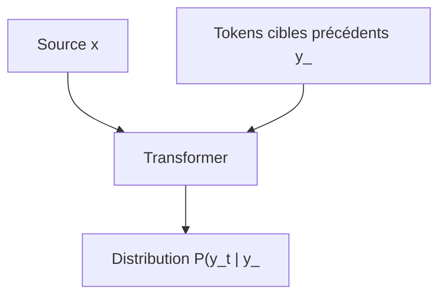

---

## 13.3 Données d’entraînement

Pour entraîner un modèle de traduction, nous avons besoin d’un corpus parallèle.

Un corpus parallèle contient des paires :

```txt
phrase source → phrase cible
```

Exemples :

|Source|Cible|
|---|---|
|`The cat sleeps.`|`Le chat dort.`|
|`I like machine learning.`|`J’aime l’apprentissage automatique.`|
|`The book is interesting.`|`Le livre est intéressant.`|

Le modèle apprend à partir de millions de paires de ce type.

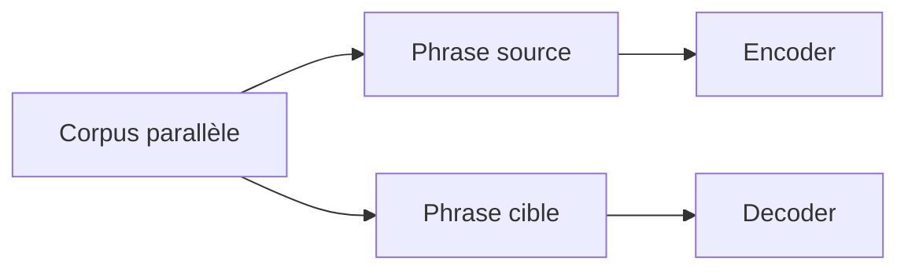

Le Transformer ne reçoit pas explicitement des règles de grammaire ou de traduction.

Il apprend statistiquement à partir des exemples.

---

## 13.4 Préparation des séquences

Avant l’entraînement, chaque phrase doit être transformée en tokens puis en IDs.

Source :

```txt
The black cat sleeps.
```

peut devenir :

```txt
[12, 245, 89, 531, 7]
```

Cible :

```txt
Le chat noir dort.
```

peut devenir :

```txt
[31, 102, 318, 472, 7]
```

Nous ajoutons souvent des tokens spéciaux :

```txt
<BOS> début de séquence
<EOS> fin de séquence
<PAD> remplissage
```

Exemple cible complète :

```txt
<BOS> Le chat noir dort . <EOS>
```

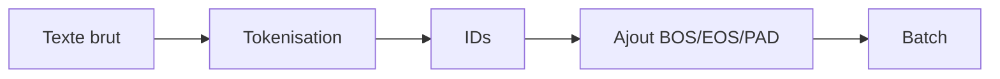

---

## 13.5 Entrée source et entrée cible

Pendant l’entraînement, nous avons deux entrées principales :

1. la source complète ;
    
2. la cible décalée vers la droite.
    

Exemple :

```txt
Source :
The black cat sleeps .

Cible réelle :
Le chat noir dort .

Entrée decoder :
<BOS> Le chat noir dort

Sortie attendue :
Le chat noir dort .
```

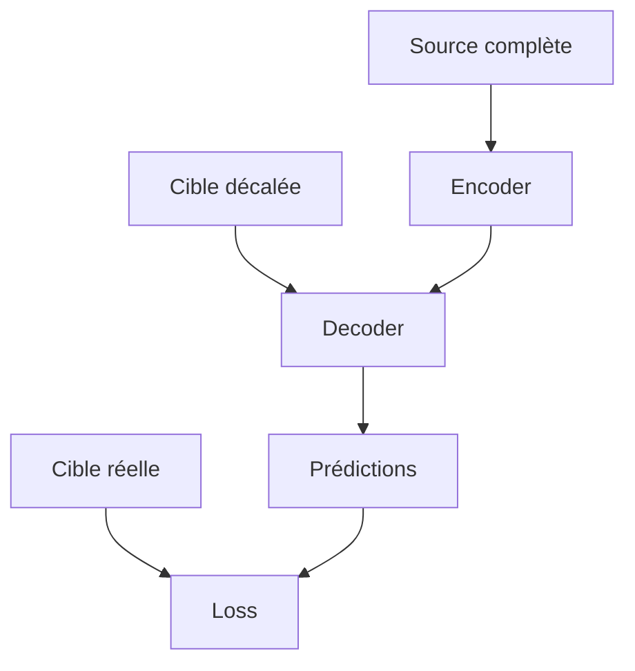

Le décalage de la cible est indispensable pour apprendre la prédiction du prochain token.

---

## 13.6 Pourquoi décaler la cible ?

Le decoder doit apprendre :

```txt
à partir du passé → prédire le prochain token
```

Pour la cible :

```txt
Le chat noir dort .
```

nous construisons :

|Entrée decoder|Sortie attendue|
|---|---|
|`<BOS>`|`Le`|
|`Le`|`chat`|
|`chat`|`noir`|
|`noir`|`dort`|
|`dort`|`.`|

Plus précisément, toute la séquence est traitée en parallèle :

```txt
Entrée decoder : <BOS> Le chat noir dort
Sortie attendue : Le chat noir dort .
```

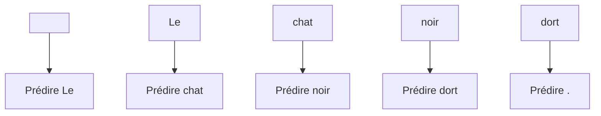

Le modèle apprend donc une tâche de prédiction du token suivant, conditionnée par la source.

---

## 13.7 Teacher forcing

Pendant l’entraînement, le decoder reçoit les vrais tokens précédents.

C’est ce qu’on appelle **teacher forcing**.

Par exemple, pour prédire `dort`, le modèle reçoit :

```txt
<BOS> Le chat noir
```

même si, en inférence, il aurait peut-être généré une erreur avant.

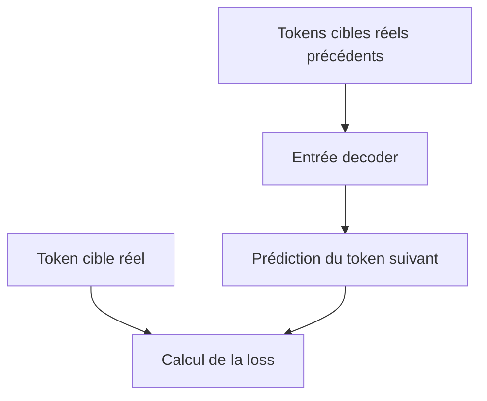

Le teacher forcing rend l’entraînement plus stable et plus efficace.

Mais il crée une différence entre entraînement et inférence :

- pendant l’entraînement, le modèle voit les vrais tokens précédents ;
    
- pendant l’inférence, il voit ses propres tokens générés.
    

---

## 13.8 Masque causal pendant l’entraînement

Même si la cible décalée complète est fournie au decoder, le modèle ne doit pas regarder les positions futures.

Nous utilisons donc un **masque causal**.

Sans masque causal, la position chargée de prédire `chat` pourrait regarder `chat`, `noir` ou `dort`.

Avec masque causal, chaque position ne regarde que le passé et la position courante.

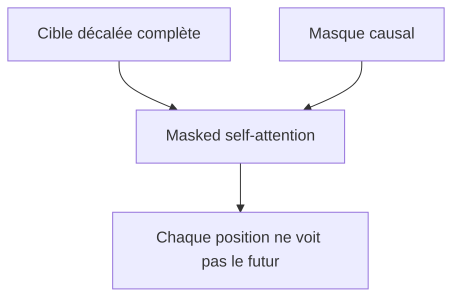

Cela permet un entraînement parallèle sans fuite d’information.

---

## 13.9 Prédictions du modèle

La sortie du decoder a la forme :

[  
B \times T_t \times d_{model}  
]

où :

- $B$ est la taille du batch ;
    
- $T_t$ est la longueur cible ;
    
- $d_{model}$ est la dimension du modèle.
    

Ensuite, nous appliquons une projection linéaire vers le vocabulaire :

[  
logits = YW_{vocab}  
]

Si le vocabulaire cible a une taille $V$, alors :

[  
logits \in \mathbb{R}^{B \times T_t \times V}  
]

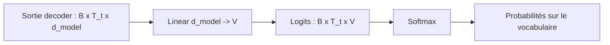

Pour chaque position cible, le modèle produit donc une distribution sur tous les tokens possibles.

---

## 13.10 Logits et probabilités

Les logits sont des scores bruts.

Exemple simplifié pour une position :

|Token|Logit|
|---|--:|
|`Le`|0.8|
|`chat`|4.1|
|`noir`|1.2|
|`dort`|-0.4|

Ces logits sont transformés par softmax en probabilités :

|Token|Probabilité|
|---|--:|
|`Le`|0.03|
|`chat`|0.87|
|`noir`|0.08|
|`dort`|0.02|

Le modèle prédit donc une distribution, pas seulement un token.

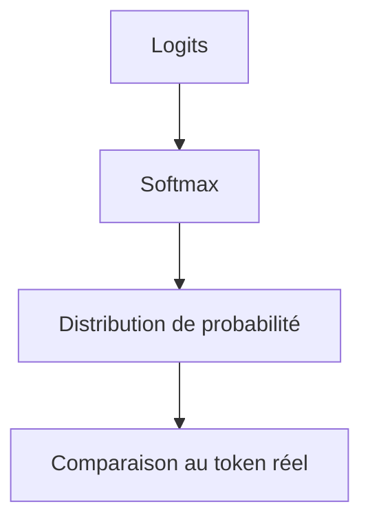

Pendant l’entraînement, nous comparons cette distribution avec le token attendu.

---

## 13.11 La cross-entropy

La fonction de perte la plus courante pour entraîner un Transformer de traduction est la **cross-entropy**.

Elle mesure l’écart entre :

- la distribution prédite par le modèle ;
    
- le token cible réel.
    

Si le token correct est `chat`, nous voulons que le modèle donne une probabilité élevée à `chat`.

La perte pour une position est :

[  
Loss = -\log(P(token\ correct))  
]

Si le modèle donne une probabilité élevée au bon token, la loss est faible.

Si le modèle donne une probabilité faible au bon token, la loss est élevée.

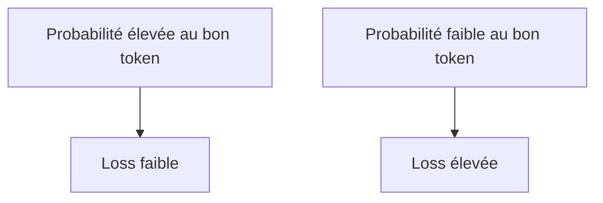

---

## 13.12 Exemple numérique de cross-entropy

Supposons que le bon token soit `chat`.

Cas 1 :

```txt
P(chat) = 0.90
```

Alors :

[  
Loss = -\log(0.90) \approx 0.105  
]

Cas 2 :

```txt
P(chat) = 0.10
```

Alors :

[  
Loss = -\log(0.10) \approx 2.303  
]

Le second cas est beaucoup plus pénalisé.

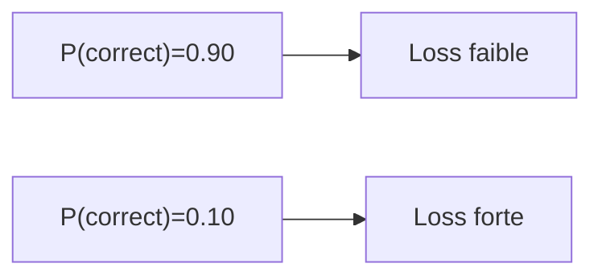

La cross-entropy pousse donc le modèle à augmenter la probabilité du bon token.

---

## 13.13 Loss sur toute la séquence

Pour une séquence cible complète, nous calculons une loss à chaque position.

Exemple :

```txt
Entrée decoder : <BOS> Le chat noir dort
Cible attendue : Le chat noir dort .
```

Nous calculons :

```txt
loss pour Le
loss pour chat
loss pour noir
loss pour dort
loss pour .
```

Puis nous faisons une moyenne ou une somme.

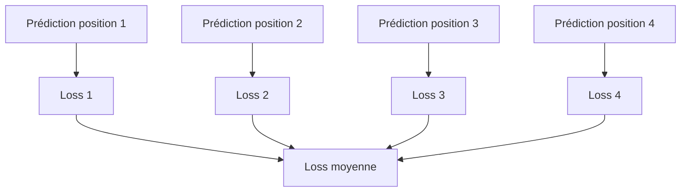

La loss finale sert ensuite à mettre à jour tous les paramètres du modèle.

---

## 13.14 Ignorer le padding dans la loss

Dans un batch, certaines séquences sont complétées avec `<PAD>`.

Exemple :

```txt
Le chat dort . <PAD> <PAD>
```

Nous ne voulons pas entraîner le modèle à prédire les `<PAD>` comme s’ils étaient des mots importants.

Nous devons donc ignorer ces positions dans la loss.

En pratique, on utilise souvent un `ignore_index`.

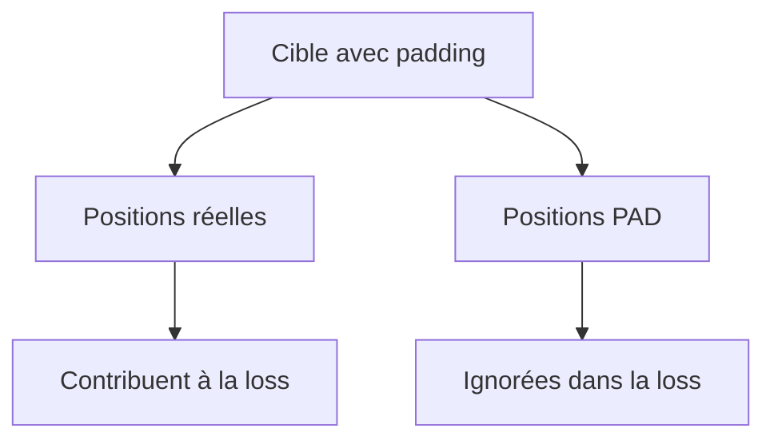

Cela complète le padding mask utilisé dans l’attention.

---

## 13.15 Attention mask et loss mask

Il faut distinguer deux types de masques.

|Masque|Où agit-il ?|Rôle|
|---|---|---|
|Attention mask|Dans l’attention|Empêcher de regarder certaines positions|
|Loss mask|Dans la fonction de perte|Ignorer certaines prédictions|

Le padding peut donc intervenir à deux endroits :

1. dans l’attention, pour éviter que le modèle regarde `<PAD>` ;
    
2. dans la loss, pour éviter que les positions `<PAD>` comptent dans l’apprentissage.
    

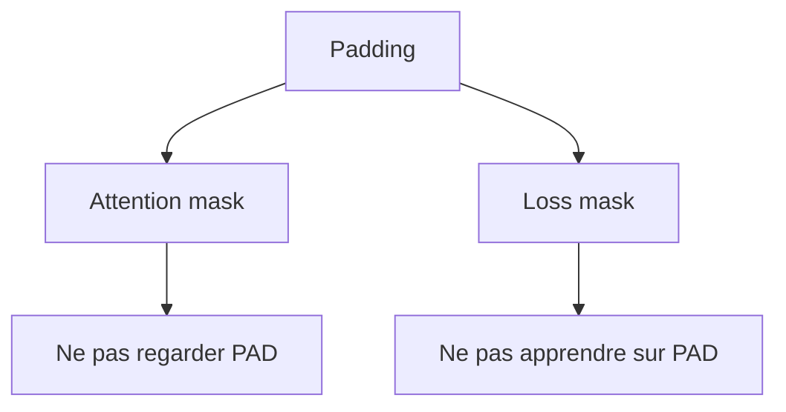

Les deux sont nécessaires.

---

## 13.16 Rétropropagation

Une fois la loss calculée, nous effectuons la rétropropagation.

Le gradient traverse :

- la projection vocabulaire ;
    
- le decoder ;
    
- la cross-attention ;
    
- l’encoder ;
    
- les embeddings ;
    
- toutes les matrices $W_Q$, $W_K$, $W_V$, $W^O$ ;
    
- les FFN ;
    
- les LayerNorm.
    

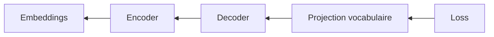

Le modèle ajuste ses paramètres pour réduire la probabilité des mauvaises prédictions et augmenter celle des bonnes.

---

## 13.17 Les paramètres entraînés

Dans un Transformer, presque tout est appris.

Parmi les paramètres entraînés, nous avons :

- embeddings de tokens ;
    
- éventuellement embeddings de position appris ;
    
- matrices $W_Q$, $W_K$, $W_V$ ;
    
- matrices $W^O$ ;
    
- paramètres des FFN ;
    
- paramètres LayerNorm ;
    
- projection vers le vocabulaire.
    

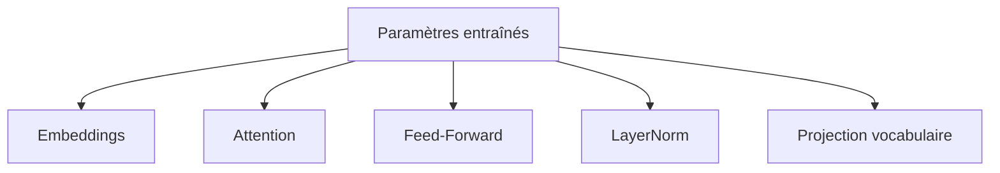

Les positional encodings sinusoïdaux du Transformer original ne sont pas appris, mais les autres paramètres le sont.

---

## 13.18 Optimisation

L’objectif de l’entraînement est de minimiser la loss moyenne sur les données.

Nous cherchons les paramètres $\theta$ qui minimisent :

[  
\mathcal{L}(\theta)  
]

où $\mathcal{L}$ est la cross-entropy moyenne.

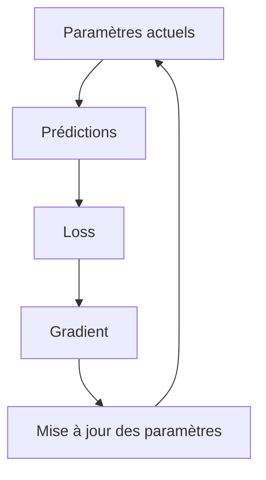

Cette boucle est répétée sur de très nombreux batchs.

---

## 13.19 L’optimiseur Adam

Dans le Transformer original, les auteurs utilisent l’optimiseur **Adam**.

Adam est une méthode d’optimisation qui adapte le learning rate pour chaque paramètre en utilisant des estimations des moments du gradient.

Intuition :

- il suit une moyenne des gradients ;
    
- il suit une moyenne des carrés des gradients ;
    
- il ajuste les mises à jour en conséquence.
    

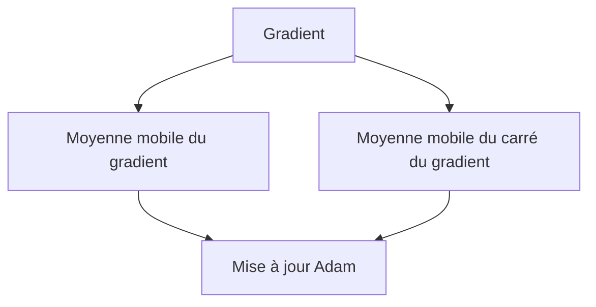

Adam est très utilisé en deep learning parce qu’il est robuste et efficace.

---

## 13.20 Pourquoi ne pas utiliser une simple descente de gradient ?

La descente de gradient simple applique le même type de mise à jour partout.

Adam adapte les mises à jour selon l’historique des gradients.

Cela aide quand :

- les paramètres ont des échelles différentes ;
    
- les gradients sont bruités ;
    
- l’optimisation est complexe ;
    
- les modèles sont profonds.
    

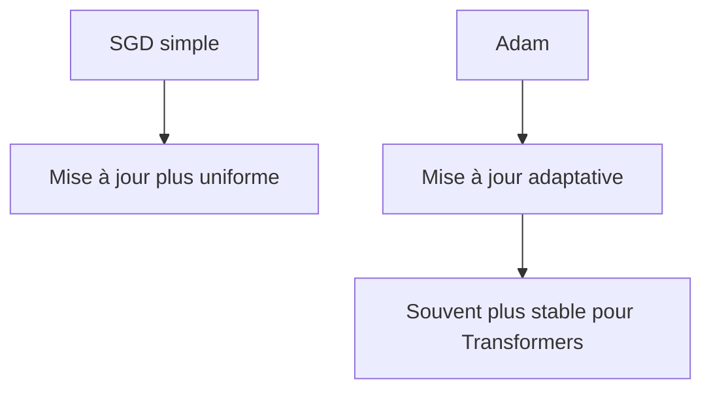

Pour les Transformers, Adam est devenu un choix standard, même si des variantes modernes existent.

---

## 13.21 Learning rate schedule

Le learning rate ne reste pas forcément constant.

Dans le Transformer original, les auteurs utilisent un learning rate schedule spécifique.

Il commence par augmenter pendant une phase de **warmup**, puis diminue progressivement.

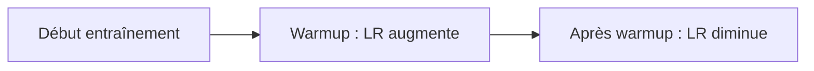

L’idée est :

> Au début, nous entraînons prudemment ; ensuite, nous augmentons le rythme ; puis nous diminuons progressivement pour stabiliser la convergence.

---

## 13.22 Formule du learning rate dans le Transformer original

Le papier original utilise la formule :

[  
lrate = d_{model}^{-0.5} \cdot \min(step_num^{-0.5}, step_num \cdot warmup_steps^{-1.5})  
]

Cette formule combine deux comportements.

Pendant le warmup :

[  
step_num \cdot warmup_steps^{-1.5}  
]

domine, donc le learning rate augmente.

Après le warmup :

[  
step_num^{-0.5}  
]

domine, donc le learning rate diminue.

```mermaid
flowchart TD
    A["Learning rate"] --> B["Phase 1 : warmup"]
    A --> C["Phase 2 : décroissance"]
    B --> D["Augmentation progressive"]
    C --> E["Diminution en 1/sqrt(step)"]
```

Cette stratégie aide à stabiliser l’entraînement au début.

---

## 13.23 Pourquoi le warmup est utile

Au début de l’entraînement, les poids du modèle sont encore aléatoires ou mal adaptés.

Si le learning rate est trop élevé dès le départ, les mises à jour peuvent être trop violentes.

Le warmup évite cela.

```mermaid
flowchart TD
    A["Début entraînement"] --> B["Paramètres peu stabilisés"]
    B --> C["Warmup"]
    C --> D["Learning rate augmente progressivement"]
    D --> E["Entraînement plus stable"]
```

Le warmup est particulièrement important pour les architectures profondes avec attention, résidus et normalisation.

---

## 13.24 Lien entre $d_{model}$ et learning rate

Dans la formule du papier original, le learning rate est multiplié par :

[  
d_{model}^{-0.5}  
]

Cela signifie que si $d_{model}$ augmente, le learning rate de base diminue.

Intuition :

> Plus les vecteurs internes sont grands, plus nous réduisons l’échelle du learning rate pour stabiliser les mises à jour.

```mermaid
flowchart TD
    A["d_model plus grand"] --> B["d_model^-0.5 plus petit"]
    B --> C["Learning rate réduit"]
```

Cette dépendance fait partie du design original du Transformer.

---

## 13.25 Label smoothing

Le Transformer original utilise aussi le **label smoothing**.

Normalement, pour un token correct, la cible est une distribution one-hot.

Exemple :

|Token|Cible classique|
|---|--:|
|`chat`|1.0|
|autres tokens|0.0|

Avec label smoothing, nous ne donnons pas exactement 1 au bon token et 0 aux autres.

Nous donnons par exemple :

|Token|Cible lissée|
|---|--:|
|`chat`|0.9|
|autres tokens|petite probabilité|

```mermaid
flowchart TD
    A["Cible one-hot"] --> B["Très confiante"]
    C["Label smoothing"] --> D["Cible légèrement adoucie"]
```

Cela empêche le modèle de devenir trop confiant.

---

## 13.26 Pourquoi éviter la surconfiance ?

Un modèle trop confiant peut attribuer une probabilité proche de 1 à une seule réponse.

Mais dans le langage, plusieurs traductions ou formulations peuvent être acceptables.

Exemple :

```txt
The cat sleeps.
```

peut être traduit par :

```txt
Le chat dort.
```

ou parfois :

```txt
Le chat est en train de dormir.
```

Le label smoothing rend l’apprentissage moins brutal.

```mermaid
flowchart TD
    A["Sans label smoothing"] --> B["Modèle très confiant"]
    C["Avec label smoothing"] --> D["Distribution cible plus souple"]
    D --> E["Meilleure généralisation possible"]
```

Cela peut améliorer la robustesse et la généralisation.

---

## 13.27 Effet du label smoothing sur la loss

Avec une cible one-hot, la loss pousse très fortement le modèle vers une probabilité de 1 pour le bon token.

Avec label smoothing, la cible est légèrement répartie.

Le modèle apprend toujours à privilégier le bon token, mais sans écraser totalement les autres.

```mermaid
flowchart LR
    A["One-hot"] --> B["Pousser vers certitude"]
    C["Label smoothing"] --> D["Pousser vers forte probabilité mais pas absolue"]
```

Cela agit comme une régularisation.

---

## 13.28 Batching

L’entraînement se fait par batchs.

Au lieu de traiter une phrase à la fois, nous traitons plusieurs paires source-cible en parallèle.

```mermaid
flowchart TD
    A["Exemple 1"] --> B["Batch"]
    C["Exemple 2"] --> B
    D["Exemple 3"] --> B
    E["Exemple N"] --> B

    B --> F["Passage dans le Transformer"]
```

Le batch permet :

- d’utiliser efficacement les GPU ;
    
- de stabiliser les gradients ;
    
- de paralléliser les calculs.
    

---

## 13.29 Batching par nombre de tokens

Dans le traitement du langage, les séquences ont des longueurs variables.

Il est parfois plus pertinent de définir les batchs par nombre de tokens plutôt que par nombre de phrases.

Exemple :

```txt
Batch A : 32 phrases courtes
Batch B : 8 phrases longues
```

peuvent avoir un nombre de tokens similaire.

```mermaid
flowchart TD
    A["Phrases courtes"] --> B["Plus d'exemples par batch"]
    C["Phrases longues"] --> D["Moins d'exemples par batch"]
    B --> E["Nombre de tokens contrôlé"]
    D --> E
```

Cela permet de mieux contrôler l’utilisation mémoire.

---

## 13.30 Padding et efficacité

Quand les phrases d’un batch ont des longueurs très différentes, nous ajoutons beaucoup de padding.

Cela gaspille du calcul.

Exemple :

```txt
Phrase courte : 5 tokens
Phrase longue : 100 tokens
```

Si elles sont dans le même batch, la phrase courte peut recevoir 95 tokens `<PAD>`.

```mermaid
flowchart TD
    A["Longueurs très différentes"] --> B["Beaucoup de padding"]
    B --> C["Calcul gaspillé"]
```

Pour limiter ce problème, on regroupe souvent les phrases de longueurs proches.

C’est parfois appelé **bucketing**.

---

## 13.31 Bucketing

Le bucketing consiste à regrouper les séquences de longueurs similaires dans les mêmes batchs.

```mermaid
flowchart TD
    A["Séquences"] --> B["Courtes"]
    A --> C["Moyennes"]
    A --> D["Longues"]

    B --> E["Batch court"]
    C --> F["Batch moyen"]
    D --> G["Batch long"]
```

Cela réduit le padding inutile.

Le modèle est le même, mais l’entraînement devient plus efficace.

---

## 13.32 Parallélisation pendant l’entraînement

L’un des grands avantages du Transformer est que l’entraînement est fortement parallélisable.

Dans l’encoder, tous les tokens source peuvent être traités en parallèle.

Dans le decoder, toutes les positions cibles peuvent aussi être traitées en parallèle pendant l’entraînement, grâce au masque causal.

```mermaid
flowchart TD
    A["Source complète"] --> B["Encoder parallèle"]
    C["Cible décalée complète"] --> D["Decoder parallèle avec masque causal"]
    B --> D
    D --> E["Prédictions toutes positions"]
```

C’est une différence majeure avec les RNN, qui traitent les tokens séquentiellement.

---

## 13.33 Pourquoi l’inférence reste séquentielle

Pendant l’inférence, nous ne connaissons pas la cible.

Nous devons donc générer :

```txt
token 1 → token 2 → token 3 → ...
```

Chaque token dépend des précédents.

```mermaid
flowchart LR
    A["Générer y1"] --> B["Générer y2"]
    B --> C["Générer y3"]
    C --> D["Générer y4"]
```

L’entraînement peut être parallèle, mais la génération autoregressive reste séquentielle.

C’est un point essentiel.

---

## 13.34 Stratégies de décodage

Une fois que le modèle produit une distribution sur le vocabulaire, nous devons choisir un token.

Plusieurs stratégies existent :

- greedy decoding ;
    
- beam search ;
    
- sampling ;
    
- top-k ;
    
- nucleus sampling, ou top-p.
    

Dans la traduction automatique classique, le beam search est très utilisé.

Dans les grands modèles conversationnels modernes, le sampling top-k ou top-p est souvent utilisé pour produire des réponses plus variées.

```mermaid
flowchart TD
    A["Distribution vocabulaire"] --> B["Greedy"]
    A --> C["Beam search"]
    A --> D["Sampling"]
    A --> E["Top-k / Top-p"]
```

Le choix de la stratégie influence fortement la sortie finale.

---

## 13.35 Greedy decoding

Le greedy decoding choisit toujours le token le plus probable.

Exemple :

|Token|Probabilité|
|---|--:|
|`chat`|0.65|
|`chien`|0.20|
|`souris`|0.10|
|`table`|0.05|

Le modèle choisit :

```txt
chat
```

```mermaid
flowchart LR
    A["Distribution"] --> B["Token le plus probable"]
    B --> C["Ajout à la séquence"]
```

Cette stratégie est simple, mais elle peut être sous-optimale.

Le meilleur choix local n’est pas toujours le meilleur choix global.

---

## 13.36 Beam search

Le beam search garde plusieurs hypothèses de génération.

Avec un beam de taille 3, nous gardons les 3 meilleures séquences partielles à chaque étape.

```mermaid
flowchart TD
    A["<BOS>"] --> B1["Le"]
    A --> B2["Un"]
    A --> B3["Ce"]

    B1 --> C1["Le chat"]
    B1 --> C2["Le chien"]
    B2 --> C3["Un chat"]

    C1 --> D1["Le chat dort"]
    C2 --> D2["Le chien court"]
    C3 --> D3["Un chat dort"]
```

Beam search est utile en traduction, car il explore plusieurs traductions possibles.

---

## 13.37 Sampling

Le sampling consiste à tirer un token aléatoirement selon la distribution produite par le modèle.

Si :

```txt
P(chat) = 0.6
P(chien) = 0.3
P(souris) = 0.1
```

le modèle choisira souvent `chat`, mais parfois `chien` ou `souris`.

```mermaid
flowchart TD
    A["Distribution de probabilités"] --> B["Tirage aléatoire"]
    B --> C["Token choisi"]
```

Le sampling produit des sorties plus variées, mais peut aussi produire plus d’erreurs.

---

## 13.38 Température

La température modifie la distribution avant le sampling.

On divise les logits par une température $T$ :

[  
softmax\left(\frac{logits}{T}\right)  
]

Si (T < 1), la distribution devient plus concentrée.

Si (T > 1), la distribution devient plus plate.

```mermaid
flowchart TD
    A["Température basse"] --> B["Sorties plus déterministes"]
    C["Température haute"] --> D["Sorties plus variées"]
```

La température est surtout importante en génération libre.

Pour la traduction, on préfère souvent des méthodes plus déterministes comme beam search.

---

## 13.39 Évaluation pendant l’entraînement

Pendant l’entraînement, nous surveillons généralement :

- la loss d’entraînement ;
    
- la loss de validation ;
    
- parfois la perplexité ;
    
- pour la traduction, des métriques comme BLEU.
    

```mermaid
flowchart TD
    A["Entraînement"] --> B["Training loss"]
    A --> C["Validation loss"]
    A --> D["Métriques de tâche"]
```

La loss indique si le modèle apprend à prédire les tokens cibles.

Mais une bonne loss ne garantit pas toujours une bonne qualité de traduction perçue.

---

## 13.40 Perplexité

La perplexité est une mesure liée à la cross-entropy.

Intuitivement, elle indique à quel point le modèle est incertain.

Si la cross-entropy moyenne est $L$, la perplexité est :

[  
PPL = e^L  
]

Une perplexité plus faible indique généralement un meilleur modèle de langage.

```mermaid
flowchart LR
    A["Cross-entropy faible"] --> B["Perplexité faible"]
    C["Cross-entropy élevée"] --> D["Perplexité élevée"]
```

Dans les tâches de génération, la perplexité est utile mais ne suffit pas à mesurer toute la qualité.

---

## 13.41 BLEU pour la traduction

Pour la traduction automatique, une métrique historique est **BLEU**.

BLEU compare la traduction produite avec une ou plusieurs traductions de référence, en regardant notamment les chevauchements de n-grammes.

Exemple :

```txt
Référence : Le chat noir dort.
Prédiction : Le chat dort.
```

BLEU mesure partiellement la proximité entre les deux.

```mermaid
flowchart TD
    A["Traduction générée"] --> C["Comparaison n-grammes"]
    B["Traduction de référence"] --> C
    C --> D["Score BLEU"]
```

BLEU est utile, mais imparfait.

Deux traductions différentes peuvent être correctes même si elles ne partagent pas exactement les mêmes mots.

---

## 13.42 Sauvegarde de checkpoints

Pendant l’entraînement, nous sauvegardons régulièrement des checkpoints.

Un checkpoint contient généralement :

- les poids du modèle ;
    
- l’état de l’optimiseur ;
    
- le nombre d’étapes ;
    
- parfois l’état du scheduler.
    

```mermaid
flowchart TD
    A["Entraînement"] --> B["Checkpoint étape N"]
    B --> C["Poids modèle"]
    B --> D["État optimiseur"]
    B --> E["État scheduler"]
```

Cela permet de reprendre l’entraînement en cas d’interruption ou de sélectionner le meilleur modèle sur validation.

---

## 13.43 Overfitting

L’overfitting se produit lorsque le modèle apprend trop bien les données d’entraînement, mais généralise mal.

Signes possibles :

```txt
training loss baisse
validation loss augmente
```

```mermaid
flowchart TD
    A["Modèle très performant sur train"] --> B["Mauvais sur validation"]
    B --> C["Overfitting"]
```

Pour réduire l’overfitting, on peut utiliser :

- dropout ;
    
- label smoothing ;
    
- plus de données ;
    
- early stopping ;
    
- régularisation ;
    
- data augmentation selon les tâches.
    

---

## 13.44 Underfitting

L’underfitting se produit lorsque le modèle n’arrive même pas à bien apprendre les données d’entraînement.

Causes possibles :

- modèle trop petit ;
    
- entraînement trop court ;
    
- learning rate mal choisi ;
    
- données trop bruitées ;
    
- bug d’implémentation ;
    
- masques incorrects.
    

```mermaid
flowchart TD
    A["Training loss élevée"] --> B["Validation loss élevée"]
    B --> C["Underfitting possible"]
```

Il faut alors vérifier à la fois l’architecture, les données et l’optimisation.

---

## 13.45 Bugs fréquents pendant l’entraînement

Les Transformers sont sensibles aux détails.

Bugs fréquents :

- cible non décalée ;
    
- masque causal absent ;
    
- padding non ignoré dans la loss ;
    
- masque inversé ;
    
- mauvaise dimension de tenseur ;
    
- learning rate trop élevé ;
    
- oubli de `model.train()` ou `model.eval()` ;
    
- dropout actif en évaluation ;
    
- mauvais vocabulaire source/cible ;
    
- erreur dans les tokens `<BOS>` ou `<EOS>`.
    

```mermaid
flowchart TD
    A["Bugs fréquents"] --> B["Décalage cible"]
    A --> C["Masques"]
    A --> D["Padding"]
    A --> E["Learning rate"]
    A --> F["Modes train/eval"]
```

Une loss qui baisse trop vite ou des générations incohérentes peuvent souvent révéler un problème de masque ou de décalage.

---

## 13.46 Vérification simple sur petit batch

Une bonne pratique consiste à tester le modèle sur un tout petit jeu de données.

Par exemple :

```txt
10 exemples
```

Un modèle correctement implémenté doit être capable de surapprendre ce mini-dataset.

```mermaid
flowchart TD
    A["Petit dataset"] --> B["Entraîner modèle"]
    B --> C["Doit pouvoir surapprendre"]
    C --> D["Sinon bug probable"]
```

Si le modèle ne peut pas surapprendre quelques exemples, il y a probablement un bug dans :

- les masques ;
    
- la loss ;
    
- les dimensions ;
    
- l’optimiseur ;
    
- les données.
    

---

## 13.47 Exemple de boucle d’entraînement simplifiée

Voici une boucle d’entraînement conceptuelle :

```python
for source_ids, target_ids in dataloader:
    target_input = target_ids[:, :-1]
    target_output = target_ids[:, 1:]

    logits = model(source_ids, target_input)

    loss = cross_entropy(
        logits.reshape(-1, vocab_size),
        target_output.reshape(-1),
        ignore_index=pad_id,
    )

    optimizer.zero_grad()
    loss.backward()
    optimizer.step()
    scheduler.step()
```

Les étapes importantes sont :

1. découper la cible en entrée et sortie ;
    
2. faire passer source et cible décalée dans le modèle ;
    
3. calculer la cross-entropy ;
    
4. ignorer le padding ;
    
5. rétropropager ;
    
6. mettre à jour les paramètres.
    

---

## 13.48 Découpage cible dans la boucle

Si la cible complète est :

```txt
<BOS> Le chat dort . <EOS>
```

alors :

```txt
target_input  = <BOS> Le chat dort .
target_output = Le chat dort . <EOS>
```

En code :

```python
target_input = target[:, :-1]
target_output = target[:, 1:]
```

```mermaid
flowchart TD
    A["Cible complète"] --> B["target[:, :-1]"]
    A --> C["target[:, 1:]"]

    B --> D["Entrée decoder"]
    C --> E["Labels attendus"]
```

C’est une opération simple, mais fondamentale.

---

## 13.49 Cross-entropy en pratique

Les logits ont souvent la forme :

[  
B \times T \times V  
]

Mais la cross-entropy des bibliothèques attend souvent :

[  
(BT) \times V  
]

et les labels :

[  
BT  
]

Nous faisons donc un reshape.

```python
logits = logits.reshape(-1, vocab_size)
labels = target_output.reshape(-1)
loss = cross_entropy(logits, labels, ignore_index=pad_id)
```

```mermaid
flowchart LR
    A["B x T x V"] --> B["(B*T) x V"]
    C["B x T"] --> D["B*T"]
    B --> E["CrossEntropyLoss"]
    D --> E
```

Ce reshape ne change pas les valeurs, il réorganise seulement les dimensions pour calculer la loss.

---

## 13.50 Entraînement complet : vue globale

```mermaid
flowchart TD
    A["Batch source"] --> B["Encoder"]
    C["Batch cible complète"] --> D["Décalage cible"]
    D --> E["target_input"]
    D --> F["target_output"]

    E --> G["Decoder"]
    B --> G

    G --> H["Logits vocabulaire"]
    H --> I["Cross-entropy avec target_output"]
    I --> J["Backpropagation"]
    J --> K["Adam update"]
    K --> L["Scheduler / warmup"]
```

Ce schéma résume toute la dynamique d’apprentissage.

---

## 13.51 Entraînement vs inférence : synthèse

|Phase|Entrée decoder|Calcul|Particularité|
|---|---|---|---|
|Entraînement|Cible réelle décalée|Parallèle|Teacher forcing + causal mask|
|Inférence|Tokens générés|Séquentiel|Choix token par token|

```mermaid
flowchart TD
    A["Entraînement"] --> B["Cible réelle décalée"]
    A --> C["Prédictions parallèles"]

    D["Inférence"] --> E["Tokens générés"]
    D --> F["Génération autoregressive"]
```

Cette distinction est essentielle pour comprendre le comportement des modèles de génération.

---

## 13.52 Pourquoi le modèle apprend la traduction ?

Le modèle apprend parce que la loss le pousse à prédire le bon token cible à chaque position.

Si la source est :

```txt
The cat sleeps.
```

et que la cible est :

```txt
Le chat dort.
```

alors, à chaque étape, les gradients ajustent :

- l’encoder pour mieux représenter la source ;
    
- la cross-attention pour mieux aligner source et cible ;
    
- le decoder pour mieux générer la langue cible ;
    
- les embeddings pour mieux représenter les tokens ;
    
- la projection finale pour mieux prédire les tokens.
    

```mermaid
flowchart TD
    A["Erreur de prédiction"] --> B["Gradient"]
    B --> C["Encoder amélioré"]
    B --> D["Cross-attention améliorée"]
    B --> E["Decoder amélioré"]
    B --> F["Embeddings améliorés"]
```

L’apprentissage est donc global : toutes les parties du modèle sont ajustées ensemble.

---

## 13.53 Erreur fréquente : oublier le décalage de la cible

Si nous donnons la même cible en entrée et en sortie, le modèle peut apprendre une correspondance incorrecte.

La bonne pratique est :

```python
target_input = target[:, :-1]
target_output = target[:, 1:]
```

```mermaid
flowchart TD
    A["Pas de décalage"] --> B["Mauvaise tâche d'apprentissage"]
    C["Décalage correct"] --> D["Prédiction du prochain token"]
```

Le décalage est une des premières choses à vérifier en cas de mauvais entraînement.

---

## 13.54 Erreur fréquente : oublier le causal mask

Sans causal mask, le decoder peut voir les tokens futurs pendant l’entraînement.

Le modèle peut alors obtenir une loss artificiellement basse, mais échouer en inférence.

```mermaid
flowchart TD
    A["Pas de causal mask"] --> B["Fuite du futur"]
    B --> C["Loss trompeusement faible"]
    C --> D["Mauvaise génération"]
```

Le causal mask est indispensable.

---

## 13.55 Erreur fréquente : ne pas ignorer le padding

Si nous calculons la loss sur les tokens `<PAD>`, le modèle apprend à prédire du padding.

Cela peut perturber fortement l’apprentissage.

```mermaid
flowchart TD
    A["Padding inclus dans loss"] --> B["Signal inutile"]
    B --> C["Apprentissage perturbé"]
```

Nous devons donc utiliser un `ignore_index` ou un loss mask.

---

## 13.56 Erreur fréquente : learning rate trop élevé

Un learning rate trop élevé peut produire :

- divergence de la loss ;
    
- NaN ;
    
- gradients instables ;
    
- modèle inutilisable.
    

```mermaid
flowchart TD
    A["Learning rate trop élevé"] --> B["Mises à jour trop grandes"]
    B --> C["Divergence"]
```

Le warmup et le schedule réduisent ce risque.

---

## 13.57 Erreur fréquente : croire que la loss suffit à évaluer la qualité

Une loss faible indique que le modèle prédit bien les tokens selon le corpus.

Mais elle ne garantit pas toujours :

- une traduction fluide ;
    
- une traduction fidèle ;
    
- une bonne robustesse ;
    
- une absence d’hallucination ;
    
- une bonne qualité humaine.
    

```mermaid
flowchart TD
    A["Loss faible"] --> B["Bon signal"]
    A --> C["Mais pas évaluation complète"]
```

Pour la traduction, il faut aussi regarder des exemples générés et des métriques de tâche.

---

## 13.58 Synthèse mathématique

Le modèle apprend :

[  
P(y_1, ..., y_m \mid x)  
]

avec la factorisation autoregressive :

## [  
P(y_1, ..., y_m \mid x)

\prod_{t=1}^{m} P(y_t \mid y_{<t}, x)  
]

La loss est la cross-entropy moyenne :

## [  
\mathcal{L}

-\frac{1}{N}  
\sum_{t}  
\log P(y_t^{correct} \mid y_{<t}, x)  
]

Les positions `<PAD>` sont ignorées.

Les paramètres sont mis à jour par rétropropagation avec Adam et un learning rate schedule avec warmup.

---

## 13.59 Schéma global de synthèse

```mermaid
flowchart TD
    A["Paires source-cible"] --> B["Tokenisation"]
    B --> C["Source IDs"]
    B --> D["Target IDs"]

    D --> E["Décalage cible"]
    E --> F["target_input"]
    E --> G["target_output"]

    C --> H["Encoder"]
    F --> I["Decoder masqué"]
    H --> I

    I --> J["Logits vocabulaire"]
    J --> K["Cross-entropy"]
    G --> K

    K --> L["Backpropagation"]
    L --> M["Adam"]
    M --> N["Learning rate schedule + warmup"]
    N --> O["Paramètres mis à jour"]
```

---

## 13.60 Résumé du chapitre

Nous avons étudié l’entraînement du Transformer original.

Le modèle apprend à traduire une séquence source en séquence cible en prédisant chaque token cible à partir des tokens précédents et de la source encodée.

Pendant l’entraînement, nous utilisons le **teacher forcing** : le decoder reçoit la cible réelle décalée vers la droite.

Le masque causal empêche le decoder de regarder les futurs tokens, ce qui permet un entraînement parallèle sans fuite d’information.

Le modèle produit des logits sur le vocabulaire, transformés en probabilités par softmax.

La fonction de perte principale est la cross-entropy, généralement calculée en ignorant les positions `<PAD>`.

Le Transformer original utilise Adam, un learning rate schedule avec warmup et du label smoothing.

Le point central est :

> L’entraînement du Transformer combine prédiction autoregressive, teacher forcing, masquage causal, cross-entropy et optimisation adaptative pour apprendre à générer une séquence cible conditionnée par une séquence source.

---

## 13.61 Questions de compréhension

### 13.61.1 Question 1

Quel est l’objectif d’entraînement du Transformer original en traduction ?

Réponse attendue : apprendre à prédire la séquence cible à partir de la séquence source.

### 13.61.2 Question 2

Pourquoi factorise-t-on la probabilité cible de manière autoregressive ?

Réponse attendue : parce que le decoder génère la cible token par token de gauche à droite.

### 13.61.3 Question 3

Qu’est-ce que le teacher forcing ?

Réponse attendue : pendant l’entraînement, le decoder reçoit les vrais tokens précédents plutôt que ses propres prédictions.

### 13.61.4 Question 4

Pourquoi décale-t-on la cible vers la droite ?

Réponse attendue : pour que l’entrée du decoder corresponde aux tokens précédents et que la sortie attendue corresponde aux tokens suivants.

### 13.61.5 Question 5

Pourquoi faut-il un masque causal pendant l’entraînement ?

Réponse attendue : pour empêcher le decoder de regarder les futurs tokens de la cible.

### 13.61.6 Question 6

Quelle est la forme des logits si le batch vaut $B$, la longueur cible $T_t$, et le vocabulaire $V$ ?

Réponse attendue :

[  
B \times T_t \times V  
]

### 13.61.7 Question 7

Que mesure la cross-entropy ?

Réponse attendue : elle mesure à quel point le modèle attribue une probabilité élevée au token correct.

### 13.61.8 Question 8

Pourquoi ignore-t-on les tokens `<PAD>` dans la loss ?

Réponse attendue : parce qu’ils ne correspondent pas à des tokens réels à apprendre.

### 13.61.9 Question 9

À quoi sert le warmup du learning rate ?

Réponse attendue : à augmenter progressivement le learning rate au début pour stabiliser l’entraînement.

### 13.61.10 Question 10

Quelle est la différence principale entre entraînement et inférence ?

Réponse attendue : pendant l’entraînement, le decoder reçoit la cible réelle décalée ; pendant l’inférence, il reçoit ses propres tokens générés progressivement.

---

## 13.62 Transition vers le chapitre 14

Nous avons compris comment entraîner un Transformer.

Mais nous n’avons pas encore étudié en détail les coûts de calcul.

Or, les Transformers sont puissants, mais coûteux :

- l’attention a un coût quadratique en longueur de séquence ;
    
- le feed-forward représente beaucoup de paramètres ;
    
- la mémoire devient un facteur limitant ;
    
- l’inférence autoregressive peut être lente ;
    
- les optimisations matérielles deviennent essentielles.
    

Dans le chapitre suivant, nous allons donc étudier la **complexité algorithmique et mémoire des Transformers**.

Nous verrons :

- le coût de l’attention ;
    
- le coût du FFN ;
    
- l’impact de $T$, $d_{model}$, $h$, $d_{ff}$ ;
    
- pourquoi les longues fenêtres de contexte sont coûteuses ;
    
- les premières idées d’optimisation comme sparse attention, FlashAttention et KV cache.

---
> [!info] Livre « Les transformers » — chapitre 13/30
> [[Les transformers — Sommaire|Sommaire]] · [[Les transformers — 12 — Résidus, normalisation et stabilité de l’entraînement|← 12 — Résidus, normalisation et stabilité de l’entraînement]] · [[Les transformers — 14 — Complexité algorithmique et mémoire des Transformers|14 — Complexité algorithmique et mémoire des Transformers →]]
