> [!info] Livre « Les transformers » — chapitre 14/30
> [[Les transformers — Sommaire|Sommaire]] · [[Les transformers — 13 — Entraînement du Transformer original|← 13 — Entraînement du Transformer original]] · [[Les transformers — 15 — Complexité algorithmique des Transformers|15 — Complexité algorithmique des Transformers →]]

# Chapitre 14 — Complexité algorithmique et mémoire des Transformers
## 14.1 Objectif du chapitre

Dans les chapitres précédents, nous avons étudié le fonctionnement interne du Transformer :

- embeddings ;
    
- positional encodings ;
    
- attention ;
    
- multi-head attention ;
    
- encoder ;
    
- decoder ;
    
- masques ;
    
- feed-forward networks ;
    
- résidus et normalisation ;
    
- entraînement.
    

Nous savons maintenant **comment** fonctionne un Transformer.

Nous devons maintenant comprendre **combien il coûte**.

Cette question est essentielle, car les Transformers sont puissants, mais leur coût augmente rapidement avec :

- la longueur de séquence ;
    
- la dimension du modèle ;
    
- le nombre de couches ;
    
- le nombre de têtes ;
    
- la taille du vocabulaire ;
    
- la taille du batch ;
    
- le type d’entraînement ou d’inférence.
    

Dans ce chapitre, nous allons étudier :

- le coût de la self-attention ;
    
- le coût de la multi-head attention ;
    
- le coût du feed-forward network ;
    
- la mémoire nécessaire pour stocker les activations ;
    
- la différence entre entraînement et inférence ;
    
- le problème des longues fenêtres de contexte ;
    
- le rôle du KV cache ;
    
- les premières idées d’optimisation comme sparse attention et FlashAttention.
    

Le point central est le suivant :

> Le Transformer est très parallélisable, mais son attention globale a un coût quadratique en longueur de séquence.

---

## 14.2 Les dimensions importantes

Pour analyser la complexité, nous allons utiliser les notations suivantes :

|Symbole|Signification|
|---|---|
|(B)|taille du batch|
|(T)|longueur de séquence|
|(T_s)|longueur de la séquence source|
|(T_t)|longueur de la séquence cible|
|(d_{model})|dimension du modèle|
|(h)|nombre de têtes d’attention|
|(d_k)|dimension des Queries et Keys par tête|
|(d_v)|dimension des Values par tête|
|(d_{ff})|dimension interne du feed-forward|
|(N)|nombre de couches|
|(V)|taille du vocabulaire|

Dans beaucoup de Transformers classiques :

[  
d_k = d_v = \frac{d_{model}}{h}  
]

Par exemple, dans le Transformer original :

[  
d_{model} = 512  
]

[  
h = 8  
]

[  
d_k = d_v = 64  
]

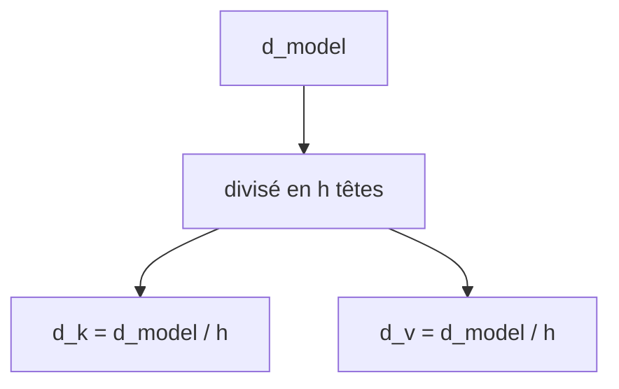

Ces dimensions vont déterminer le coût du modèle.

---

## 14.3 Les grandes sources de coût

Dans un Transformer, les coûts principaux viennent de plusieurs composants :

1. les projections $Q$, $K$, $V$ ;
    
2. le calcul des scores d’attention $QK^T$ ;
    
3. le softmax sur la matrice d’attention ;
    
4. la multiplication des poids par $V$ ;
    
5. le feed-forward network ;
    
6. la projection vers le vocabulaire ;
    
7. le stockage des activations pendant l’entraînement.
    

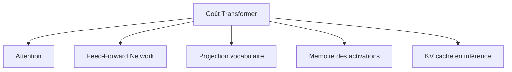

Nous allons étudier ces coûts séparément.

---

## 14.4 Complexité de l’attention simple

Rappelons la formule :

[  
Attention(Q,K,V) =  
softmax\left(\frac{QK^T}{\sqrt{d_k}}\right)V  
]

Pour une séquence de longueur $T$, nous avons :

[  
Q \in \mathbb{R}^{T \times d_k}  
]

[  
K \in \mathbb{R}^{T \times d_k}  
]

[  
V \in \mathbb{R}^{T \times d_v}  
]

Le produit :

[  
QK^T  
]

donne une matrice :

[  
T \times T  
]

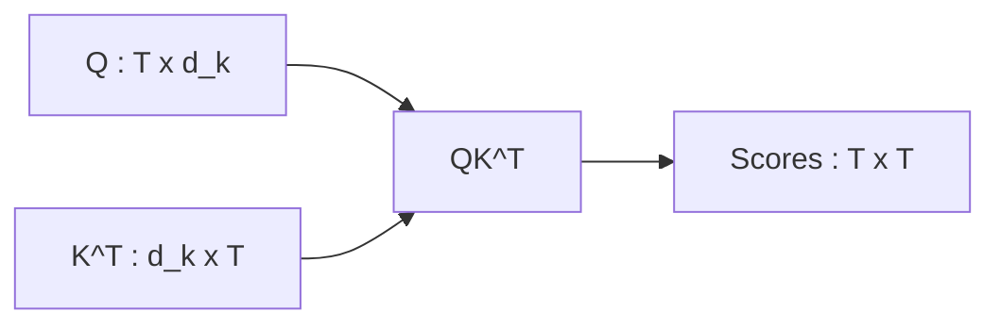

C’est ici que le coût quadratique apparaît.

---

## 14.5 Coût de $QK^T$

Le produit :

[  
QK^T  
]

multiplie une matrice $T \times d_k$ par une matrice $d_k \times T$.

Le coût est donc approximativement :

[  
O(T^2 d_k)  
]

Pourquoi ?

Parce que nous calculons $T \times T$ scores, et chaque score est un produit scalaire de dimension $d_k$.

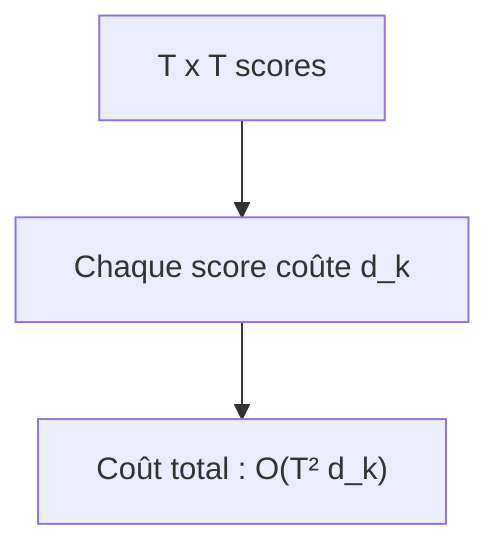

Si $T$ double, le nombre de scores est multiplié par 4.

C’est la source principale du problème des longs contextes.

---

## 14.6 Coût du softmax

Après $QK^T$, nous appliquons le softmax sur chaque ligne de la matrice d’attention.

La matrice a une taille :

[  
T \times T  
]

Le coût du softmax est donc :

[  
O(T^2)  
]

Ce coût est généralement moins dominant que le produit matriciel si $d_k$ est grand, mais il reste important.

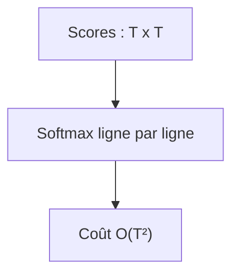

Le softmax ajoute aussi un coût mémoire, car il produit les poids d’attention.

---

## 14.7 Coût de la multiplication par $V$

Après le softmax, nous avons une matrice de poids :

[  
A \in \mathbb{R}^{T \times T}  
]

Nous la multiplions par :

[  
V \in \mathbb{R}^{T \times d_v}  
]

Le résultat est :

[  
Y \in \mathbb{R}^{T \times d_v}  
]

Le coût est :

[  
O(T^2 d_v)  
]

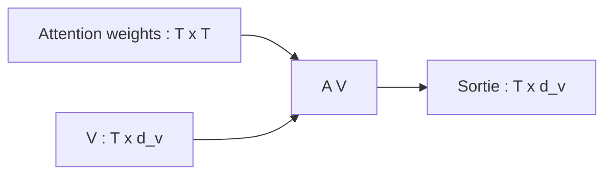

Donc, pour une tête, l’attention coûte environ :

[  
O(T^2 d_k + T^2 d_v)  
]

Si (d_k = d_v), nous pouvons retenir :

[  
O(T^2 d_k)  
]

à un facteur constant près.

---

## 14.8 Coût de la multi-head attention

Avec $h$ têtes, chaque tête travaille sur une dimension :

[  
d_k = \frac{d_{model}}{h}  
]

Le coût d’une tête est :

[  
O(T^2 d_k)  
]

Avec $h$ têtes :

[  
h \cdot O(T^2 d_k)  
]

Comme :

[  
h d_k = d_{model}  
]

nous obtenons :

[  
O(T^2 d_{model})  
]

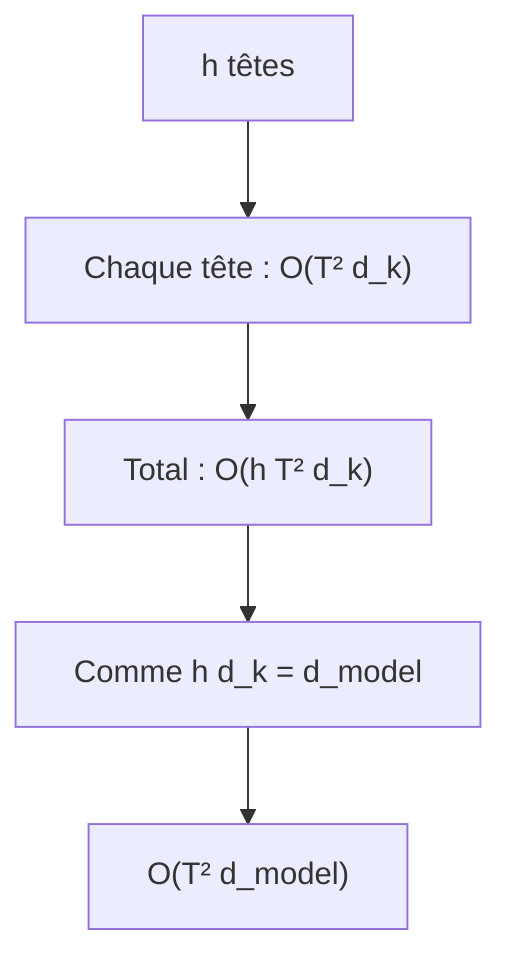

La multi-head attention ne change donc pas l’ordre de grandeur par rapport à une attention travaillant directement en dimension $d_{model}$.

Mais elle augmente la richesse des représentations.

---

## 14.9 Coût des projections $Q$, $K$, $V$

Avant l’attention, nous devons projeter l’entrée $X$ vers $Q$, $K$ et $V$.

Si :

[  
X \in \mathbb{R}^{T \times d_{model}}  
]

et si chaque projection va de $d_{model}$ vers $d_{model}$, alors chaque projection coûte :

[  
O(T d_{model}^2)  
]

Nous avons trois projections :

[  
Q,\ K,\ V  
]

donc :

[  
O(3T d_{model}^2)  
]

Puis la projection finale $W^O$ coûte aussi :

[  
O(T d_{model}^2)  
]

Au total, les projections coûtent environ :

[  
O(4T d_{model}^2)  
]

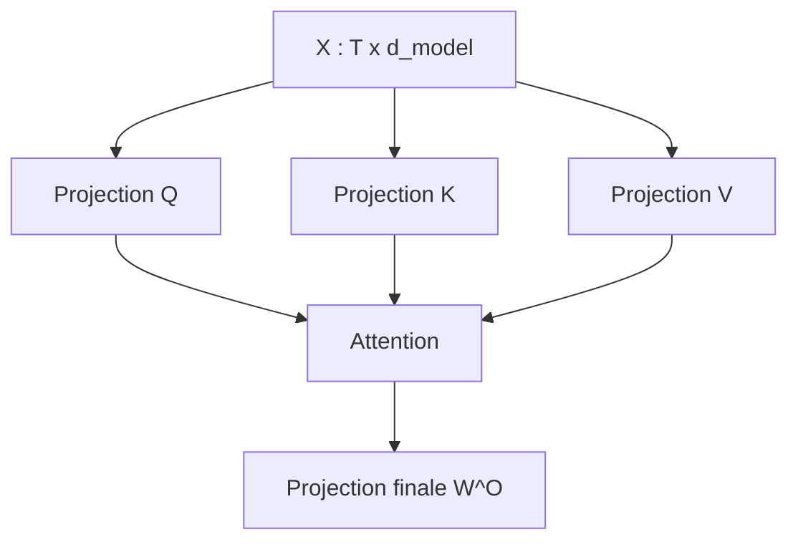

Ce coût est linéaire en $T$, mais quadratique en $d_{model}$.

---

## 14.10 Coût total de la multi-head attention

Nous pouvons résumer le coût d’une multi-head attention ainsi :

[  
O(T d_{model}^2)  
]

pour les projections, plus :

[  
O(T^2 d_{model})  
]

pour l’attention.

Donc :

[  
O(T d_{model}^2 + T^2 d_{model})  
]

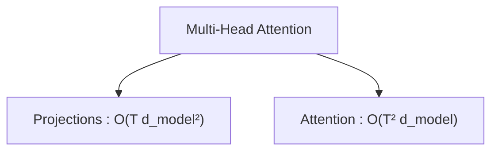

Selon les valeurs de $T$ et $d_{model}$, l’un ou l’autre terme peut dominer.

- Si $T$ est petit et $d_{model}$ grand, les projections peuvent être très coûteuses.
    
- Si $T$ est très grand, le terme (T^2) devient dominant.
    

---

## 14.11 Le problème du (T^2)

Le terme :

[  
T^2  
]

est le problème central des longues séquences.

Si nous doublons $T$, le coût d’attention est multiplié par 4.

Si nous multiplions $T$ par 10, le coût est multiplié par 100.

|Longueur $T$|(T^2)|
|--:|--:|
|512|262 144|
|1 024|1 048 576|
|4 096|16 777 216|
|8 192|67 108 864|
|32 768|1 073 741 824|
|128 000|16 384 000 000|

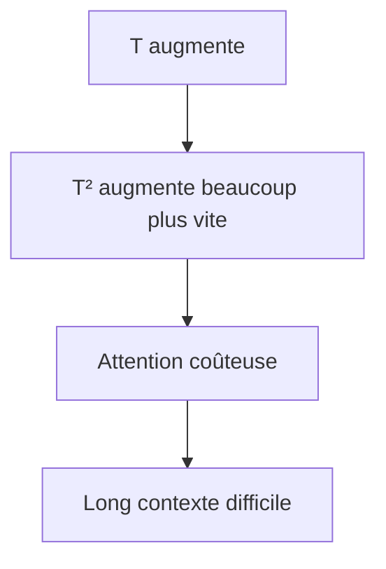

C’est pourquoi les longs contextes demandent des optimisations spécifiques.

---

## 14.12 Mémoire de la matrice d’attention

La matrice d’attention a la forme :

[  
B \times h \times T \times T  
]

Cela signifie que la mémoire augmente aussi quadratiquement avec $T$.

Exemple :

[  
B = 1  
]

[  
h = 16  
]

[  
T = 8192  
]

Le nombre de poids d’attention est :

[  
1 \times 16 \times 8192 \times 8192  
]

[  
= 1,073,741,824  
]

C’est plus d’un milliard de valeurs.

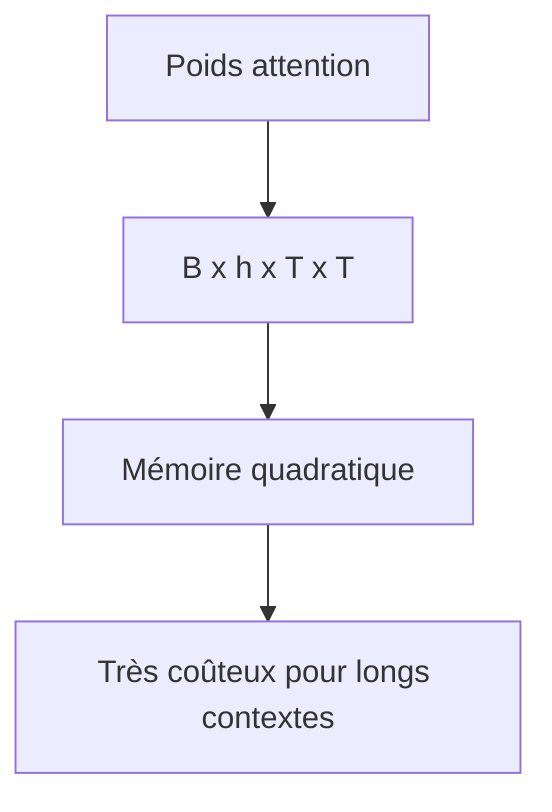

Même en précision réduite, cela représente une quantité très importante de mémoire.

---

## 14.13 Coût du Feed-Forward Network

Le Feed-Forward Network fait :

[  
d_{model} \rightarrow d_{ff} \rightarrow d_{model}  
]

Pour chaque token, le coût est approximativement :

[  
O(d_{model} d_{ff} + d_{ff} d_{model})  
]

donc :

[  
O(2 d_{model} d_{ff})  
]

Pour une séquence de longueur $T$ :

[  
O(T d_{model} d_{ff})  
]

Avec un batch $B$ :

[  
O(BT d_{model} d_{ff})  
]

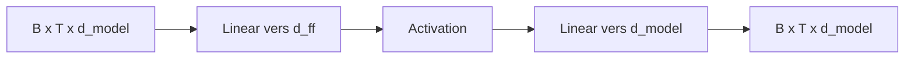

Le FFN est linéaire en $T$, mais il peut être très coûteux car $d_{ff}$ est souvent grand.

---

## 14.14 Comparaison attention vs FFN

Dans un bloc Transformer, nous avons deux coûts majeurs :

[  
Attention \approx O(T^2 d_{model})  
]

[  
FFN \approx O(T d_{model} d_{ff})  
]

Si :

[  
d_{ff} = 4d_{model}  
]

alors :

[  
FFN \approx O(4T d_{model}^2)  
]

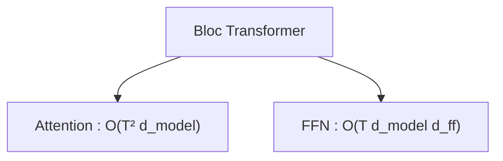

Pour des séquences courtes, le FFN peut représenter une part majeure du calcul.

Pour des séquences très longues, l’attention devient dominante à cause du (T^2).

---

## 14.15 Exemple numérique simple

Supposons :

[  
T = 1024  
]

[  
d_{model} = 768  
]

[  
d_{ff} = 3072  
]

Coût attention approximatif :

## [  
T^2 d_{model}

1024^2 \times 768  
]

[  
= 1,048,576 \times 768  
]

[  
\approx 805,000,000  
]

Coût FFN approximatif :

## [  
T d_{model} d_{ff}

1024 \times 768 \times 3072  
]

[  
\approx 2,416,000,000  
]

Dans cet exemple, le FFN peut coûter davantage que l’attention.

Mais si nous augmentons $T$, l’attention finit par dominer.

---

## 14.16 Quand l’attention domine-t-elle ?

Comparons les deux termes :

[  
Attention \approx T^2 d_{model}  
]

[  
FFN \approx T d_{model} d_{ff}  
]

L’attention devient comparable au FFN quand :

[  
T^2 d_{model} \approx T d_{model} d_{ff}  
]

Nous simplifions par $T d_{model}$ :

[  
T \approx d_{ff}  
]

Donc si :

[  
d_{ff} = 3072  
]

l’attention devient très dominante quand $T$ dépasse plusieurs milliers de tokens.

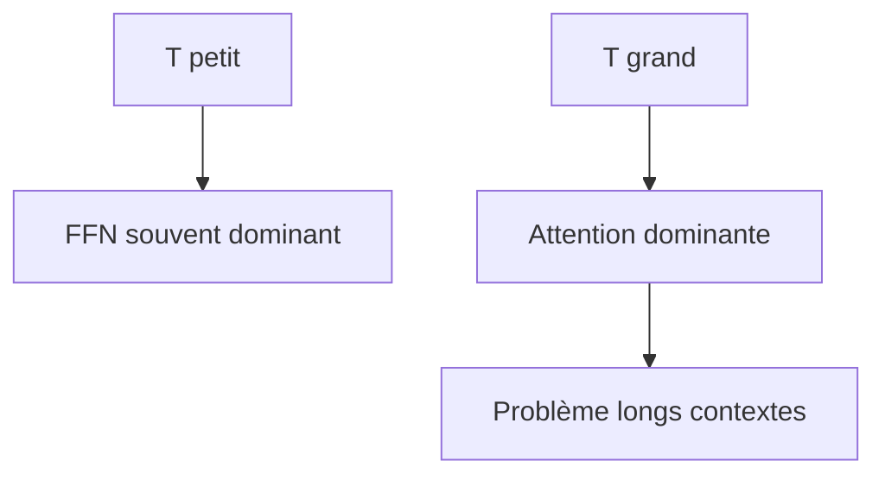

Cette règle est approximative, mais elle donne une bonne intuition.

---

## 14.17 Coût par couche et coût total

Un Transformer contient plusieurs couches.

Si une couche coûte :

[  
C  
]

et que nous avons $N$ couches, le coût total est :

[  
O(NC)  
]

Pour un encoder avec $N$ couches :

[  
O(N(T d_{model}^2 + T^2 d_{model} + T d_{model}d_{ff}))  
]

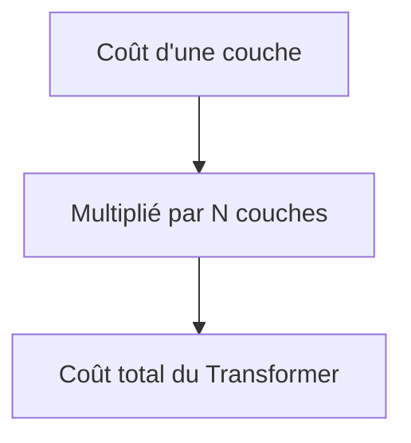

Plus le modèle est profond, plus le coût augmente linéairement avec $N$.

---

## 14.18 Coût de l’encoder

Dans un encoder, chaque couche contient :

- une self-attention ;
    
- un feed-forward network.
    

Pour une séquence source de longueur $T_s$, une couche encoder coûte approximativement :

[  
O(T_s d_{model}^2 + T_s^2 d_{model} + T_s d_{model}d_{ff})  
]

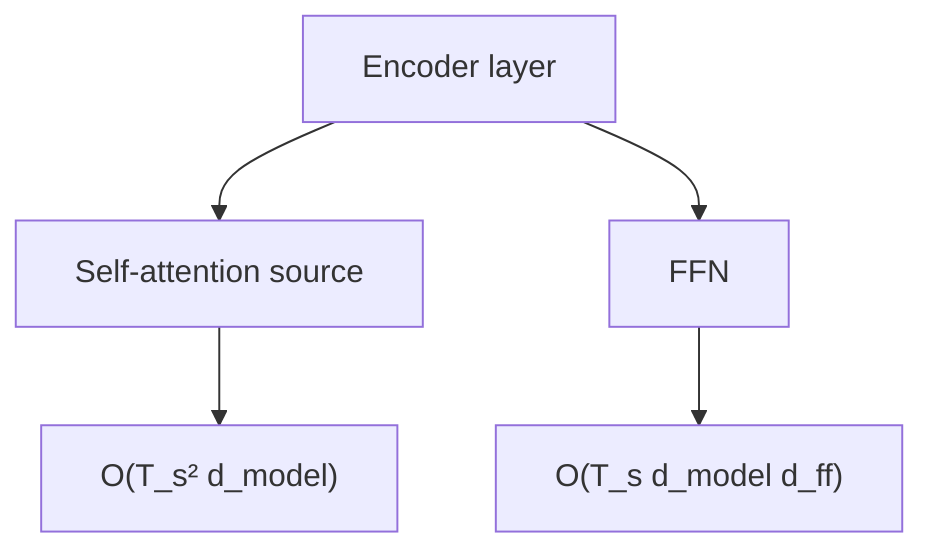

Le coût est fortement influencé par la longueur source $T_s$.

---

## 14.19 Coût du decoder pendant l’entraînement

Pendant l’entraînement, le decoder traite toute la séquence cible décalée en parallèle.

Une couche decoder contient :

1. masked self-attention cible ;
    
2. cross-attention vers la source ;
    
3. feed-forward network.
    

Pour une longueur cible $T_t$ et source $T_s$ :

- masked self-attention :
    

[  
O(T_t^2 d_{model})  
]

- cross-attention :
    

[  
O(T_t T_s d_{model})  
]

- FFN :
    

[  
O(T_t d_{model} d_{ff})  
]

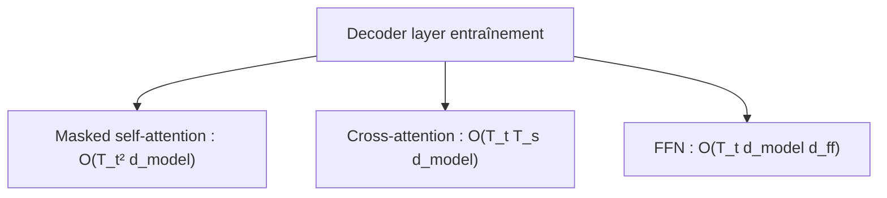

La cross-attention est quadratique seulement si $T_t$ et $T_s$ grandissent ensemble.

---

## 14.20 Coût de la cross-attention

Dans la cross-attention :

[  
Q \in \mathbb{R}^{T_t \times d_k}  
]

[  
K \in \mathbb{R}^{T_s \times d_k}  
]

Le produit :

[  
QK^T  
]

produit une matrice :

[  
T_t \times T_s  
]

Le coût est :

[  
O(T_t T_s d_k)  
]

Avec toutes les têtes :

[  
O(T_t T_s d_{model})  
]

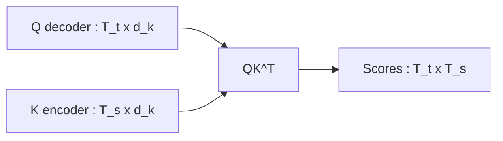

La cross-attention dépend donc de la longueur cible et de la longueur source.

---

## 14.21 Coût de la projection vocabulaire

À la sortie du decoder, nous projetons :

[  
d_{model} \rightarrow V  
]

où $V$ est la taille du vocabulaire.

Pour chaque position cible, le coût est :

[  
O(d_{model} V)  
]

Pour $T_t$ positions :

[  
O(T_t d_{model} V)  
]

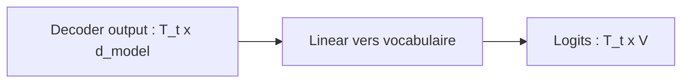

Si le vocabulaire est très grand, cette projection peut être coûteuse.

Dans les grands modèles de langage, la tête de sortie peut représenter un coût important.

---

## 14.22 Mémoire pendant l’entraînement

Pendant l’entraînement, nous devons stocker beaucoup d’intermédiaires pour la rétropropagation.

Nous devons stocker :

- activations des couches ;
    
- sorties d’attention ;
    
- poids d’attention ;
    
- sorties des FFN ;
    
- normalisations ;
    
- parfois les logits ;
    
- états de l’optimiseur.
    

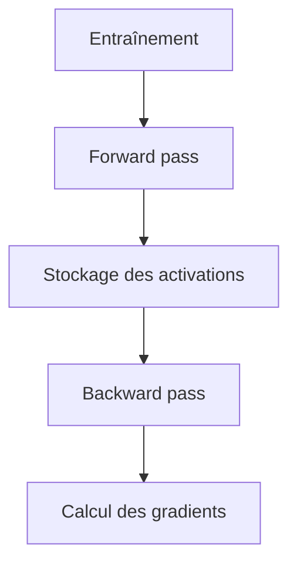

La mémoire d’entraînement est donc beaucoup plus élevée que la mémoire d’inférence.

---

## 14.23 Pourquoi stocker les activations ?

Pendant la rétropropagation, nous avons besoin des valeurs calculées pendant la passe avant.

Par exemple, pour calculer le gradient d’une couche, nous avons besoin de ses entrées et sorties.

```mermaid
flowchart LR
    A["Forward"] --> B["Activations stockées"]
    B --> C["Backward"]
    C --> D["Gradients"]
```

C’est pourquoi l’entraînement demande beaucoup de mémoire GPU.

---

## 14.24 Activation checkpointing

Pour réduire la mémoire, nous pouvons utiliser l’**activation checkpointing**.

L’idée est de ne pas stocker toutes les activations.

On stocke seulement certains points de contrôle, puis on recalcule les activations intermédiaires pendant la rétropropagation.

```mermaid
flowchart TD
    A["Sans checkpointing"] --> B["Stocker beaucoup d'activations"]
    C["Avec checkpointing"] --> D["Stocker moins"]
    D --> E["Recalcul pendant backward"]
```

Cela réduit la mémoire, mais augmente le temps de calcul.

C’est un compromis classique :

```txt
moins de mémoire ↔ plus de calcul
```

---

## 14.25 Mémoire de l’optimiseur Adam

Adam stocke plusieurs valeurs pour chaque paramètre :

- le paramètre lui-même ;
    
- le gradient ;
    
- une moyenne mobile du gradient ;
    
- une moyenne mobile du carré du gradient.
    

Cela signifie que l’état de l’optimiseur peut consommer beaucoup de mémoire.

```mermaid
flowchart TD
    A["Un paramètre"] --> B["Poids"]
    A --> C["Gradient"]
    A --> D["Moment 1 Adam"]
    A --> E["Moment 2 Adam"]
```

Pour les grands Transformers, la mémoire de l’optimiseur est un facteur majeur.

---

## 14.26 Entraînement en précision réduite

Pour économiser mémoire et accélérer le calcul, on utilise souvent :

- float16 ;
    
- bfloat16 ;
    
- mixed precision.
    

```mermaid
flowchart TD
    A["Précision réduite"] --> B["Moins de mémoire"]
    A --> C["Calcul plus rapide"]
    A --> D["Risque numérique"]
```

La précision réduite rend les calculs plus efficaces, mais demande une bonne gestion de la stabilité numérique.

C’est pourquoi la normalisation, le scaling et les bonnes pratiques d’optimisation sont importants.

---

## 14.27 Coût de l’inférence

Pendant l’inférence, nous ne faisons pas de rétropropagation.

Nous n’avons donc pas besoin de stocker toutes les activations pour le gradient.

Mais dans les modèles autoregressifs, nous générons les tokens un par un.

```mermaid
flowchart LR
    A["Token 1"] --> B["Token 2"]
    B --> C["Token 3"]
    C --> D["Token 4"]
```

L’inférence est donc limitée par :

- le coût par token ;
    
- le nombre de tokens générés ;
    
- la gestion du KV cache ;
    
- la bande passante mémoire ;
    
- la taille du modèle.
    

---

## 14.28 Inférence sans KV cache

Supposons que nous générions une séquence de longueur $T$.

Sans cache, à chaque étape, nous recalculons toutes les Keys et Values des tokens précédents.

Étape 1 :

```txt
1 token
```

Étape 2 :

```txt
2 tokens
```

Étape 3 :

```txt
3 tokens
```

Étape $T$ :

```txt
T tokens
```

```mermaid
flowchart TD
    A["Étape 1 : recalcul 1 token"] --> B["Étape 2 : recalcul 2 tokens"]
    B --> C["Étape 3 : recalcul 3 tokens"]
    C --> D["..."]
    D --> E["Étape T : recalcul T tokens"]
```

C’est inefficace.

---

## 14.29 KV cache

Le **KV cache** stocke les Keys et Values déjà calculées pour les tokens précédents.

À chaque nouveau token, nous calculons seulement :

- la nouvelle Query ;
    
- la nouvelle Key ;
    
- la nouvelle Value.
    

Puis nous ajoutons la Key et la Value au cache.

```mermaid
flowchart TD
    A["Tokens précédents"] --> B["Keys/Values déjà stockées"]
    B --> C["KV cache"]

    D["Nouveau token"] --> E["Nouvelle Key/Value"]
    E --> C

    C --> F["Attention du nouveau token"]
```

Cela évite de recalculer tout le passé à chaque étape.

---

## 14.30 Coût avec KV cache

Avec KV cache, à chaque nouveau token :

- la Query a une longueur 1 ;
    
- les Keys ont une longueur $T$, correspondant au contexte déjà généré ;
    
- l’attention du nouveau token vers le passé coûte :
    

[  
O(T d_{model})  
]

au lieu de recalculer toute la matrice pour tous les tokens.

```mermaid
flowchart LR
    Q["Q nouveau token : 1 x d"] --> S["QK^T"]
    K["K cache : T x d"] --> S
    S --> A["Scores : 1 x T"]
```

Le coût par nouveau token augmente linéairement avec la longueur du contexte.

C’est beaucoup mieux que recalculer tout le préfixe à chaque étape.

---

## 14.31 Mémoire du KV cache

Le KV cache économise du calcul, mais consomme de la mémoire.

Pour chaque couche, chaque tête, chaque token, nous stockons :

- une Key ;
    
- une Value.
    

La forme typique est :

[  
B \times h \times T \times d_k  
]

pour les Keys, et la même chose pour les Values.

Donc :

[  
2 \times B \times h \times T \times d_k  
]

par couche.

Avec $N$ couches :

[  
2 \times N \times B \times h \times T \times d_k  
]

Comme :

[  
h d_k = d_{model}  
]

nous pouvons retenir :

[  
O(NBTd_{model})  
]

```mermaid
flowchart TD
    A["KV cache"] --> B["Keys"]
    A --> C["Values"]
    B --> D["Stockées pour chaque couche"]
    C --> D
    D --> E["Mémoire linéaire en T"]
```

La mémoire du KV cache devient très importante pour les longs contextes.

---

## 14.32 Long contexte : double problème

Les longues séquences posent deux problèmes différents.

Pendant l’entraînement :

```txt
attention globale → mémoire O(T²)
```

Pendant l’inférence avec KV cache :

```txt
cache → mémoire O(T)
par token, attention vers tout le contexte → coût O(T)
```

```mermaid
flowchart TD
    A["Long contexte"] --> B["Entraînement : attention T²"]
    A --> C["Inférence : KV cache T"]
    A --> D["Coût par token augmente avec T"]
```

Même si le KV cache évite un coût quadratique par étape, générer avec un très long contexte reste coûteux.

---

## 14.33 Pourquoi les longues fenêtres de contexte sont difficiles

Une fenêtre de contexte longue permet au modèle de lire plus de tokens.

Mais elle augmente :

- la mémoire d’attention ;
    
- la mémoire du KV cache ;
    
- le temps de calcul ;
    
- le coût d’entraînement ;
    
- la latence d’inférence ;
    
- les besoins matériels.
    

```mermaid
flowchart TD
    A["Contexte plus long"] --> B["Plus d'informations disponibles"]
    A --> C["Coût mémoire plus élevé"]
    A --> D["Calcul plus long"]
    A --> E["Latence plus grande"]
```

Le long contexte est donc utile, mais pas gratuit.

---

## 14.34 Sparse attention

Une première idée pour réduire le coût est de ne pas permettre à chaque token de regarder tous les autres.

C’est l’idée de la **sparse attention**.

Au lieu d’une matrice complète $T \times T$, nous autorisons seulement certaines connexions.

```mermaid
flowchart TD
    A["Attention dense"] --> B["Chaque token regarde tous les tokens"]
    C["Sparse attention"] --> D["Chaque token regarde une partie des tokens"]
```

Cela peut réduire le coût si la structure sparse est bien choisie.

---

## 14.35 Attention locale

Une forme simple de sparse attention est l’attention locale.

Chaque token regarde seulement une fenêtre autour de lui.

Exemple :

```txt
un token regarde les 128 tokens précédents et suivants
```

```mermaid
flowchart LR
    A["Tokens lointains"] -. "ignorés" .-> C["Token courant"]
    B["Fenêtre locale"] --> C
    C --> D["Fenêtre locale"]
    E["Tokens lointains"] -. "ignorés" .-> C
```

Le coût devient alors approximativement :

[  
O(Tw)  
]

où $w$ est la taille de la fenêtre locale.

Si $w$ est beaucoup plus petit que $T$, c’est beaucoup moins cher que (O(T^2)).

---

## 14.36 Limite de l’attention locale

L’attention locale réduit le coût, mais elle limite les dépendances longues.

Si deux tokens sont très éloignés, ils ne peuvent pas se voir directement.

```mermaid
flowchart TD
    A["Attention locale"] --> B["Moins coûteuse"]
    A --> C["Moins bonne pour dépendances longues directes"]
```

Pour compenser, on peut :

- empiler plusieurs couches ;
    
- ajouter des tokens globaux ;
    
- utiliser des motifs sparse plus complexes ;
    
- combiner attention locale et globale.
    

---

## 14.37 Attention globale + locale

Certains modèles combinent :

- une attention locale pour la majorité des tokens ;
    
- une attention globale pour certains tokens spéciaux.
    

```mermaid
flowchart TD
    A["Tokens ordinaires"] --> B["Attention locale"]
    C["Tokens globaux"] --> D["Attention vers tous"]
    D --> E["Communication longue distance"]
```

Par exemple, un token global peut servir de point de collecte d’information.

Cela réduit le coût tout en gardant certaines capacités de longue portée.

---

## 14.38 FlashAttention : idée générale

FlashAttention est une optimisation de l’attention exacte.

Contrairement à la sparse attention, elle ne change pas le résultat mathématique de l’attention dense.

Son objectif est de calculer l’attention de manière plus efficace en mémoire.

L’idée générale est :

> Ne pas matérialiser naïvement toute la matrice d’attention en mémoire GPU globale.

```mermaid
flowchart TD
    A["Attention standard"] --> B["Matérialise scores T x T"]
    C["FlashAttention"] --> D["Calcule par blocs"]
    D --> E["Réduit les accès mémoire"]
```

FlashAttention exploite mieux la hiérarchie mémoire des GPU.

---

## 14.39 Pourquoi la mémoire GPU est critique

Les GPU sont très rapides pour le calcul, mais les accès mémoire peuvent devenir le goulot d’étranglement.

Une opération peut être limitée non par le nombre d’opérations arithmétiques, mais par la quantité de données à lire et écrire.

```mermaid
flowchart TD
    A["GPU"] --> B["Calcul rapide"]
    A --> C["Accès mémoire coûteux"]
    C --> D["Bottleneck possible"]
```

FlashAttention réduit les lectures et écritures inutiles en recalculant et en fusionnant certaines étapes.

---

## 14.40 FlashAttention ne rend pas l’attention linéaire

Il faut éviter une confusion.

FlashAttention ne transforme pas l’attention dense en attention linéaire.

Le coût théorique reste lié à (T^2).

Mais le calcul est beaucoup plus efficace en pratique.

```mermaid
flowchart TD
    A["FlashAttention"] --> B["Même attention dense exacte"]
    A --> C["Meilleure efficacité mémoire"]
    A --> D["Pas une attention sparse"]
    A --> E["Pas O(T) en général"]
```

Donc FlashAttention améliore fortement les performances, mais ne supprime pas entièrement le problème des très longs contextes.

---

## 14.41 Attention linéaire

Une autre famille de méthodes cherche à approximer l’attention pour obtenir un coût linéaire en $T$.

L’idée est de reformuler :

[  
softmax(QK^T)V  
]

pour éviter de construire explicitement la matrice $T \times T$.

```mermaid
flowchart TD
    A["Attention classique"] --> B["Matrice T x T"]
    C["Attention linéaire"] --> D["Éviter matrice complète"]
    D --> E["Coût proche de O(T)"]
```

Ces méthodes peuvent être intéressantes, mais elles changent souvent le comportement du modèle.

Elles ne sont pas toujours équivalentes à l’attention dense originale.

---

## 14.42 Réduction de contexte et retrieval

Une autre stratégie consiste à ne pas mettre tout le contexte directement dans la fenêtre du Transformer.

Dans les systèmes RAG, par exemple, nous récupérons seulement les documents ou passages pertinents.

```mermaid
flowchart TD
    A["Grande base documentaire"] --> B["Retrieval"]
    B --> C["Passages pertinents"]
    C --> D["Contexte fourni au Transformer"]
```

Cela réduit la longueur effective de la séquence traitée.

Au lieu de donner 1 million de tokens, nous donnons quelques milliers de tokens mieux sélectionnés.

---

## 14.43 Compression de contexte

Une autre idée est de compresser le contexte.

Par exemple :

- résumer des passages ;
    
- encoder des documents en représentations plus compactes ;
    
- utiliser une mémoire externe ;
    
- utiliser des tokens latents ;
    
- regrouper plusieurs tokens en blocs.
    

```mermaid
flowchart TD
    A["Long contexte brut"] --> B["Compression"]
    B --> C["Contexte plus court"]
    C --> D["Transformer"]
```

La compression réduit le coût, mais peut perdre de l’information.

---

## 14.44 Long contexte ne signifie pas toujours bonne utilisation du contexte

Avoir une grande fenêtre de contexte ne garantit pas que le modèle utilise parfaitement toute l’information.

Le modèle peut :

- ignorer des informations au milieu ;
    
- privilégier le début ou la fin ;
    
- se perdre dans du bruit ;
    
- manquer des détails importants.
    

```mermaid
flowchart TD
    A["Très long contexte"] --> B["Plus d'informations"]
    A --> C["Plus de bruit"]
    A --> D["Difficulté à retrouver l'information utile"]
```

Le coût algorithmique n’est donc pas le seul problème.

Il y a aussi un problème d’utilisation effective du contexte.

---

## 14.45 Complexité et architecture moderne

Les modèles modernes combinent souvent plusieurs stratégies :

- FlashAttention ;
    
- KV cache optimisé ;
    
- quantization ;
    
- tensor parallelism ;
    
- pipeline parallelism ;
    
- activation checkpointing ;
    
- attention optimisée ;
    
- batching dynamique ;
    
- speculative decoding.
    

```mermaid
flowchart TD
    A["Optimisation Transformer"] --> B["Mémoire"]
    A --> C["Calcul"]
    A --> D["Parallélisme"]
    A --> E["Décodage"]
```

Nous n’allons pas tout détailler ici, mais nous devons comprendre que l’architecture seule ne suffit pas : l’ingénierie système est fondamentale.

---

## 14.46 Quantization

La quantization consiste à représenter les poids ou activations avec moins de bits.

Par exemple :

- float16 ;
    
- int8 ;
    
- int4.
    

```mermaid
flowchart TD
    A["Poids float32"] --> B["Quantization"]
    B --> C["Poids int8 / int4"]
    C --> D["Moins de mémoire"]
```

Cela réduit la mémoire et peut accélérer l’inférence.

Mais cela peut aussi dégrader la qualité si c’est mal fait.

---

## 14.47 Parallélisme de données

Le parallélisme de données consiste à copier le modèle sur plusieurs GPU.

Chaque GPU traite un batch différent.

Les gradients sont ensuite synchronisés.

```mermaid
flowchart TD
    A["Modèle copié GPU 1"] --> G["Synchronisation gradients"]
    B["Modèle copié GPU 2"] --> G
    C["Modèle copié GPU 3"] --> G
    G --> D["Mise à jour commune"]
```

C’est une stratégie simple et très utilisée.

Mais elle demande que le modèle tienne sur chaque GPU.

---

## 14.48 Parallélisme de modèle

Si le modèle est trop grand pour tenir sur un seul GPU, nous pouvons le répartir.

Deux grandes idées :

- tensor parallelism ;
    
- pipeline parallelism.
    

```mermaid
flowchart TD
    A["Modèle trop grand"] --> B["Tensor parallelism"]
    A --> C["Pipeline parallelism"]
```

Le tensor parallelism découpe certaines matrices entre GPU.

Le pipeline parallelism place différentes couches sur différents GPU.

---

## 14.49 Pipeline parallelism

Dans le pipeline parallelism, les couches sont réparties entre plusieurs GPU.

```mermaid
flowchart LR
    A["Couches 1-4 GPU 1"] --> B["Couches 5-8 GPU 2"]
    B --> C["Couches 9-12 GPU 3"]
```

Cela permet d’entraîner de plus grands modèles.

Mais cela introduit des défis :

- communication entre GPU ;
    
- bulles de pipeline ;
    
- équilibrage de charge ;
    
- complexité d’implémentation.
    

---

## 14.50 Tensor parallelism

Dans le tensor parallelism, une même opération matricielle est divisée entre plusieurs GPU.

Par exemple, une grande projection linéaire peut être découpée par colonnes ou par lignes.

```mermaid
flowchart TD
    A["Grande matrice"] --> B["Partie GPU 1"]
    A --> C["Partie GPU 2"]
    A --> D["Partie GPU 3"]
    B --> E["Résultat combiné"]
    C --> E
    D --> E
```

C’est très utile pour les grands Transformers, où les matrices sont énormes.

---

## 14.51 Complexité de l’entraînement distribué

Distribuer l’entraînement permet d’utiliser plus de calcul, mais ajoute des coûts de communication.

Les GPU doivent échanger :

- gradients ;
    
- activations ;
    
- paramètres ;
    
- états intermédiaires.
    

```mermaid
flowchart TD
    A["Plusieurs GPU"] --> B["Plus de calcul disponible"]
    A --> C["Communication nécessaire"]
    C --> D["Coût supplémentaire"]
```

Le passage à l’échelle n’est donc pas seulement une question de nombre de GPU.

Il faut aussi optimiser la communication.

---

## 14.52 Latence vs débit

En inférence, nous distinguons deux notions :

|Terme|Signification|
|---|---|
|Latence|temps pour obtenir une réponse|
|Débit|nombre de tokens ou requêtes traités par seconde|

Un système peut avoir un bon débit mais une latence élevée.

```mermaid
flowchart TD
    A["Inférence"] --> B["Latence"]
    A --> C["Débit"]
```

Pour un chatbot, la latence est très importante.

Pour traiter beaucoup de documents en batch, le débit peut être plus important.

---

## 14.53 Batch en inférence

On peut aussi faire du batching en inférence.

Cela permet de traiter plusieurs requêtes en parallèle.

```mermaid
flowchart TD
    A["Requête 1"] --> B["Batch inférence"]
    C["Requête 2"] --> B
    D["Requête 3"] --> B
    B --> E["GPU mieux utilisé"]
```

Mais le batching peut augmenter la latence si une requête doit attendre d’autres requêtes pour former un batch.

C’est donc un compromis.

---

## 14.54 Décodage spéculatif

Le décodage spéculatif est une technique moderne pour accélérer la génération.

L’idée simplifiée :

1. un petit modèle propose plusieurs tokens rapidement ;
    
2. le grand modèle vérifie ces tokens ;
    
3. si les tokens sont acceptés, on gagne du temps.
    

```mermaid
flowchart TD
    A["Petit modèle"] --> B["Propose plusieurs tokens"]
    B --> C["Grand modèle vérifie"]
    C --> D["Tokens acceptés ou rejetés"]
```

Cette technique ne change pas l’architecture du Transformer, mais optimise l’inférence autoregressive.

---

## 14.55 Comparaison entraînement / inférence

|Aspect|Entraînement|Inférence|
|---|---|---|
|Rétropropagation|Oui|Non|
|Stockage activations|Oui|Non, beaucoup moins|
|Génération|Parallèle sur cible connue|Autoregressive|
|KV cache|Pas toujours utile|Très utile|
|Mémoire principale|Activations + optimiseur|Poids + KV cache|
|Goulot fréquent|mémoire GPU|latence / bande passante mémoire|

```mermaid
flowchart TD
    A["Entraînement"] --> B["Activations + gradients + optimiseur"]
    C["Inférence"] --> D["Poids + KV cache + décodage"]
```

Les contraintes ne sont donc pas les mêmes.

---

## 14.56 Résumé des complexités principales

Pour une couche Transformer encoder simple :

|Composant|Complexité approximative|
|---|---|
|Projections QKV + sortie|(O(T d_{model}^2))|
|Attention dense|(O(T^2 d_{model}))|
|FFN|(O(T d_{model} d_{ff}))|
|Mémoire attention|(O(BhT^2))|
|Mémoire activations|dépend de (N, B, T, d_{model})|

Pour un decoder encoder-decoder :

|Composant|Complexité|
|---|---|
|Masked self-attention cible|(O(T_t^2 d_{model}))|
|Cross-attention|(O(T_t T_s d_{model}))|
|FFN|(O(T_t d_{model} d_{ff}))|

```mermaid
flowchart TD
    A["Complexité Transformer"] --> B["Attention : T²"]
    A --> C["FFN : linéaire en T"]
    A --> D["Projections : linéaires en T"]
    A --> E["Mémoire attention : T²"]
```

---

## 14.57 Erreur fréquente : croire que les têtes multiplient toujours le coût par $h$

On pourrait penser :

```txt
8 têtes = 8 fois plus cher
```

Mais chaque tête travaille généralement sur une dimension réduite :

[  
d_k = \frac{d_{model}}{h}  
]

Donc le coût total reste de l’ordre :

[  
O(T^2 d_{model})  
]

```mermaid
flowchart TD
    A["Plus de têtes"] --> B["Dimension par tête plus petite"]
    B --> C["Coût total contrôlé"]
```

Le nombre de têtes influence le coût réel et les constantes, mais pas forcément l’ordre de grandeur si $d_{model}$ reste fixe.

---

## 14.58 Erreur fréquente : ne regarder que le coût de l’attention

L’attention est célèbre pour son coût quadratique.

Mais dans beaucoup de configurations, le FFN représente aussi une part majeure du calcul et des paramètres.

```mermaid
flowchart TD
    A["Coût Transformer"] --> B["Attention"]
    A --> C["FFN"]
    A --> D["Projection vocabulaire"]
```

Il ne faut donc pas réduire le coût d’un Transformer au seul (T^2).

Le coût dépend de l’ensemble :

[  
T,\ d_{model},\ d_{ff},\ N,\ V,\ B  
]

---

## 14.59 Erreur fréquente : confondre mémoire et calcul

Une opération peut être coûteuse en calcul, en mémoire, ou les deux.

Par exemple :

- $QK^T$ coûte beaucoup en calcul ;
    
- stocker la matrice $T \times T$ coûte beaucoup en mémoire ;
    
- le KV cache coûte surtout en mémoire pendant l’inférence.
    

```mermaid
flowchart TD
    A["Coût"] --> B["Calcul"]
    A --> C["Mémoire"]
    B --> D["FLOPs"]
    C --> E["RAM GPU / VRAM"]
```

Certaines optimisations réduisent la mémoire sans réduire beaucoup le nombre théorique d’opérations.

FlashAttention en est un bon exemple.

---

## 14.60 Erreur fréquente : croire que FlashAttention change le modèle

FlashAttention ne change pas le Transformer du point de vue mathématique.

Il change la manière de calculer l’attention.

```mermaid
flowchart TD
    A["Attention standard"] --> B["Même résultat mathématique"]
    C["FlashAttention"] --> B
    C --> D["Calcul plus efficace"]
```

C’est une optimisation d’implémentation, pas une nouvelle architecture conceptuelle.

---

## 14.61 Erreur fréquente : croire qu’un long contexte est toujours préférable

Un contexte plus long peut aider, mais il peut aussi :

- coûter beaucoup plus cher ;
    
- ajouter du bruit ;
    
- ralentir la génération ;
    
- compliquer l’attention ;
    
- rendre l’information utile plus difficile à retrouver.
    

```mermaid
flowchart TD
    A["Contexte long"] --> B["Plus d'informations"]
    A --> C["Plus de coût"]
    A --> D["Plus de bruit"]
```

La qualité dépend aussi de la manière dont le contexte est sélectionné, structuré et utilisé.

---

## 14.62 Synthèse mathématique

Pour une couche Transformer de type encoder, nous pouvons retenir :

[  
C_{attention} \approx O(T^2 d_{model})  
]

[  
C_{ffn} \approx O(T d_{model} d_{ff})  
]

[  
C_{projections} \approx O(T d_{model}^2)  
]

La mémoire des poids d’attention est :

[  
O(BhT^2)  
]

La mémoire du KV cache en inférence est :

[  
O(NBTd_{model})  
]

Le coût total dépend donc fortement de :

[  
T,\ B,\ N,\ d_{model},\ d_{ff},\ h  
]

---

## 14.63 Schéma global de synthèse

```mermaid
flowchart TD
    A["Transformer"] --> B["Attention dense"]
    B --> B1["Calcul : O(T² d_model)"]
    B --> B2["Mémoire : O(B h T²)"]

    A --> C["Feed-Forward"]
    C --> C1["Calcul : O(T d_model d_ff)"]
    C --> C2["Paramètres nombreux"]

    A --> D["Projections"]
    D --> D1["O(T d_model²)"]

    A --> E["Inférence autoregressive"]
    E --> E1["KV cache"]
    E1 --> E2["Mémoire : O(N B T d_model)"]

    A --> F["Optimisations"]
    F --> F1["FlashAttention"]
    F --> F2["Sparse attention"]
    F --> F3["Quantization"]
    F --> F4["Parallelism"]
```

---

## 14.64 Résumé du chapitre

Nous avons étudié la complexité algorithmique et mémoire des Transformers.

Nous avons vu que l’attention dense globale calcule une matrice de scores de taille :

[  
T \times T  
]

ce qui entraîne un coût :

[  
O(T^2 d_{model})  
]

et une mémoire d’attention :

[  
O(BhT^2)  
]

Nous avons aussi vu que le feed-forward network est très coûteux, avec une complexité :

[  
O(T d_{model} d_{ff})  
]

et qu’il représente souvent une grande part des paramètres du modèle.

Nous avons distingué les coûts de l’entraînement et de l’inférence :

- l’entraînement doit stocker les activations et les états de l’optimiseur ;
    
- l’inférence autoregressive utilise fortement le KV cache ;
    
- les longs contextes augmentent fortement les coûts.
    

Nous avons enfin introduit plusieurs familles d’optimisations :

- activation checkpointing ;
    
- précision réduite ;
    
- FlashAttention ;
    
- sparse attention ;
    
- attention locale ;
    
- KV cache ;
    
- quantization ;
    
- parallélisme de données et de modèle ;
    
- décodage spéculatif.
    

Le point central est :

> Les Transformers sont efficaces parce qu’ils sont massivement parallélisables, mais leur attention dense rend les longues séquences coûteuses en (T^2).

---

## 14.65 Questions de compréhension

### 14.65.1 Question 1

Pourquoi dit-on que l’attention dense a un coût quadratique en longueur de séquence ?

Réponse attendue : parce qu’elle calcule une matrice de scores entre chaque paire de tokens, de taille $T \times T$.

### 14.65.2 Question 2

Quelle est la complexité approximative de l’attention dense pour une couche ?

Réponse attendue :

[  
O(T^2 d_{model})  
]

### 14.65.3 Question 3

Quelle est la complexité approximative du feed-forward network ?

Réponse attendue :

[  
O(T d_{model} d_{ff})  
]

### 14.65.4 Question 4

Pourquoi le FFN peut-il être très coûteux même s’il est linéaire en $T$ ?

Réponse attendue : parce que $d_{ff}$ est souvent très grand, souvent plusieurs fois $d_{model}$.

### 14.65.5 Question 5

Quelle est la forme de la matrice d’attention avec batch et plusieurs têtes ?

Réponse attendue :

[  
B \times h \times T \times T  
]

### 14.65.6 Question 6

Pourquoi les longues fenêtres de contexte sont-elles coûteuses ?

Réponse attendue : parce que la mémoire et le calcul de l’attention dense augmentent en (T^2).

### 14.65.7 Question 7

À quoi sert le KV cache ?

Réponse attendue : à stocker les Keys et Values des tokens précédents pour éviter de les recalculer à chaque étape de génération.

### 14.65.8 Question 8

Le KV cache réduit-il la mémoire utilisée en inférence ?

Réponse attendue : non, il réduit surtout le recalcul, mais il consomme de la mémoire proportionnelle à la longueur du contexte, au nombre de couches et à la dimension du modèle.

### 14.65.9 Question 9

FlashAttention change-t-il le résultat mathématique de l’attention ?

Réponse attendue : non. Il calcule l’attention dense de manière plus efficace en mémoire, sans changer le résultat mathématique.

### 14.65.10 Question 10

Pourquoi ne faut-il pas réduire le coût du Transformer au seul coût de l’attention ?

Réponse attendue : parce que les projections, les FFN, la projection vocabulaire, les activations, l’optimiseur et la mémoire jouent aussi un rôle important.

---

## 14.66 Transition vers le chapitre 15

Nous savons maintenant comment fonctionne un Transformer et combien il coûte.

Nous avons compris que l’attention globale est puissante, mais chère.

Dans le chapitre suivant, nous allons revenir au papier fondateur **Attention Is All You Need**.

Nous allons le lire comme un article de recherche :

- contexte scientifique de l’époque ;
    
- problème traité ;
    
- contribution principale ;
    
- architecture proposée ;
    
- formules clés ;
    
- résultats expérimentaux ;
    
- choix d’optimisation ;
    
- forces et limites ;
    
- influence sur les modèles modernes.
    

Nous passerons donc de la construction technique du Transformer à l’analyse détaillée du papier qui a introduit cette architecture.

---
> [!info] Livre « Les transformers » — chapitre 14/30
> [[Les transformers — Sommaire|Sommaire]] · [[Les transformers — 13 — Entraînement du Transformer original|← 13 — Entraînement du Transformer original]] · [[Les transformers — 15 — Complexité algorithmique des Transformers|15 — Complexité algorithmique des Transformers →]]
