> [!info] Livre « Les transformers » — chapitre 15/30
> [[Les transformers — Sommaire|Sommaire]] · [[Les transformers — 14 — Complexité algorithmique et mémoire des Transformers|← 14 — Complexité algorithmique et mémoire des Transformers]] · [[Les transformers — 16 — Grandes familles de Transformers encoder-only, decoder-only et encoder-decoder|16 — Grandes familles de Transformers encoder-only, decoder-only et encoder-decoder →]]

# Chapitre 15 — Complexité algorithmique des Transformers
## 15.1 Objectif du chapitre

Dans le chapitre précédent, nous avons lu le papier **“Attention Is All You Need”** comme un article fondateur. Nous avons compris pourquoi le Transformer a marqué une rupture : il remplace la récurrence par l’attention, ce qui permet une parallélisation massive et une meilleure modélisation des dépendances longues.

Nous allons maintenant étudier une question centrale : **combien coûte un Transformer ?**

Ce chapitre correspond au chapitre 15 de notre plan : nous allons analyser la complexité de l’attention en (O(n^2)), le coût mémoire, le rôle de la longueur de contexte, la comparaison avec RNN et CNN, les difficultés des longues séquences, puis les optimisations modernes comme FlashAttention, sparse attention, linear attention et sliding window attention. 

Le point central est :

> Le Transformer est très parallélisable, mais son attention dense globale devient coûteuse lorsque la longueur de séquence augmente.

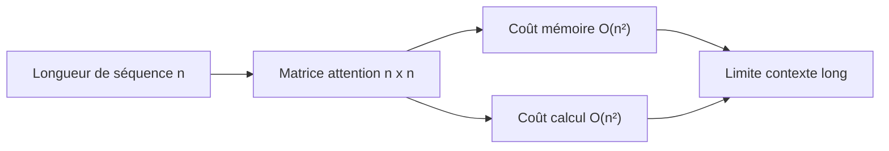

---

## 15.2 Pourquoi étudier la complexité ?

Comprendre l’architecture ne suffit pas.

Un modèle peut être élégant mathématiquement, mais difficile à entraîner ou à exécuter si son coût est trop élevé.

Dans les Transformers, plusieurs dimensions influencent le coût :

* la longueur de séquence ;
* la taille du batch ;
* la dimension du modèle ;
* le nombre de couches ;
* le nombre de têtes ;
* la taille du feed-forward network ;
* la taille du vocabulaire ;
* le mode entraînement ou inférence.

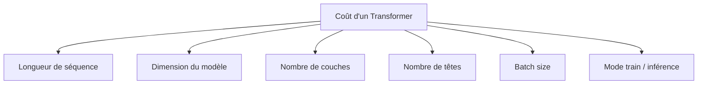

Nous devons donc apprendre à lire un Transformer non seulement comme une architecture, mais aussi comme un objet de calcul.

---

## 15.3 Notations utilisées

Nous utiliserons les notations suivantes :

| Symbole     | Signification                             |
| ----------- | ----------------------------------------- |
| $B$         | taille du batch                           |
| $n$ ou $T$  | longueur de séquence                      |
| $d_{model}$ | dimension du modèle                       |
| $h$         | nombre de têtes d’attention               |
| $d_k$       | dimension des queries et keys par tête    |
| $d_v$       | dimension des values par tête             |
| $d_{ff}$    | dimension interne du feed-forward network |
| $N$         | nombre de couches                         |
| $V$         | taille du vocabulaire                     |

Dans beaucoup de Transformers :

$$
d_k = d_v = \frac{d_{model}}{h}
$$

Par exemple, dans le Transformer original :

$$
d_{model} = 512
$$

$$
h = 8
$$

$$
d_k = d_v = 64
$$

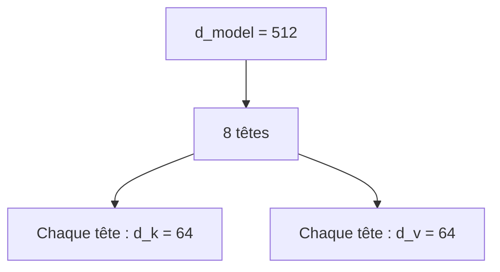

---

## 15.4 Les grandes sources de coût

Dans un bloc Transformer, les coûts principaux viennent de :

1. la projection en $Q$, $K$, $V$ ;
2. le produit $QK^T$ ;
3. le softmax ;
4. la multiplication des poids d’attention par $V$ ;
5. la projection finale de la multi-head attention ;
6. le feed-forward network ;
7. les activations stockées pendant l’entraînement ;
8. la projection vers le vocabulaire dans les modèles génératifs.

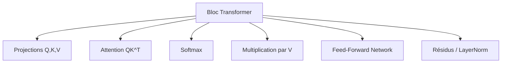

Nous allons détailler ces coûts progressivement.

---

## 15.5 Rappel : forme de l’attention dense

La formule de l’attention est :

$$
Attention(Q,K,V) =
softmax\left(\frac{QK^T}{\sqrt{d_k}}\right)V
$$

Pour une seule tête, avec une séquence de longueur $n$ :

$$
Q \in \mathbb{R}^{n \times d_k}
$$

$$
K \in \mathbb{R}^{n \times d_k}
$$

$$
V \in \mathbb{R}^{n \times d_v}
$$

Le produit :

$$
QK^T
$$

donne une matrice :

$$
n \times n
$$

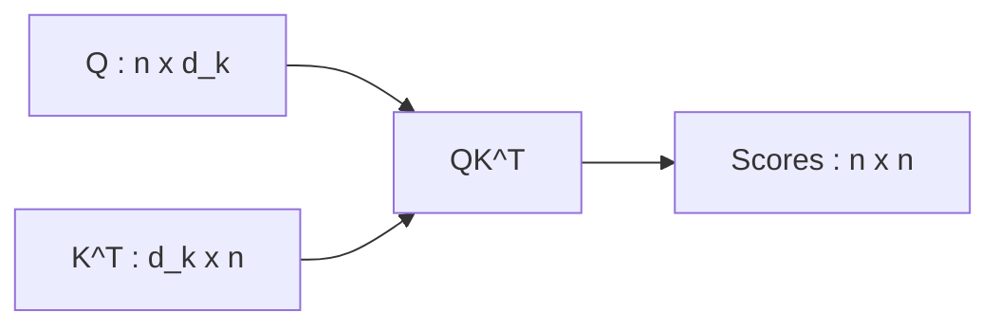

Cette matrice contient un score entre chaque paire de tokens.

C’est la source du coût quadratique.

---

## 15.6 Pourquoi l’attention est en (O(n^2))

Chaque token peut regarder chaque autre token.

Si nous avons $n$ tokens :

* le token 1 regarde $n$ tokens ;
* le token 2 regarde $n$ tokens ;
* le token 3 regarde $n$ tokens ;
* etc.

Nous calculons donc :

$$
n \times n = n^2
$$

scores d’attention.

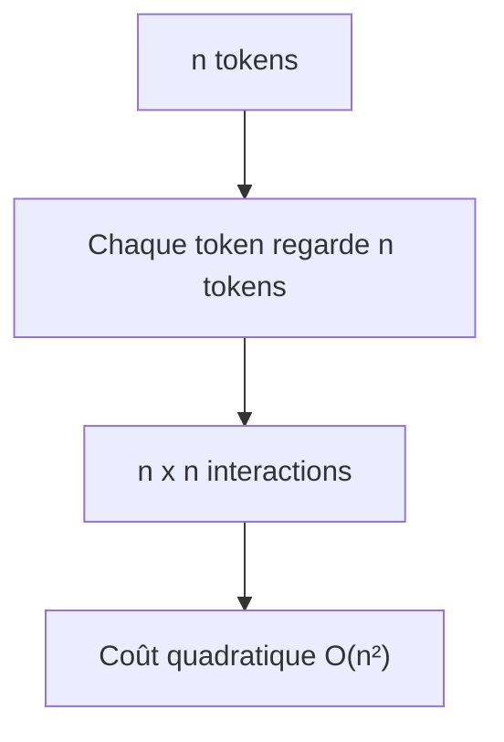

Si la séquence double, le nombre d’interactions est multiplié par 4.

C’est très différent d’un coût linéaire.

---

## 15.7 Exemple simple de croissance quadratique

Regardons quelques valeurs :

| Longueur $n$ | Nombre de scores (n^2) |
| -----------: | ---------------------: |
|          128 |                 16 384 |
|          512 |                262 144 |
|        1 024 |              1 048 576 |
|        4 096 |             16 777 216 |
|        8 192 |             67 108 864 |
|       32 768 |          1 073 741 824 |

Nous voyons que la croissance est très rapide.

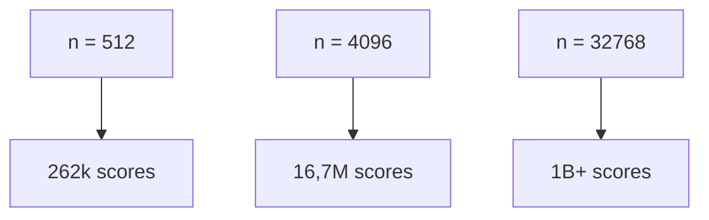

C’est pourquoi les longues fenêtres de contexte sont coûteuses.

---

## 15.8 Coût du produit $QK^T$

Le produit $QK^T$ multiplie une matrice :

$$
n \times d_k
$$

par une matrice :

$$
d_k \times n
$$

Le résultat est :

$$
n \times n
$$

Chaque score est un produit scalaire de dimension $d_k$.

Le coût est donc :

$$
O(n^2 d_k)
$$

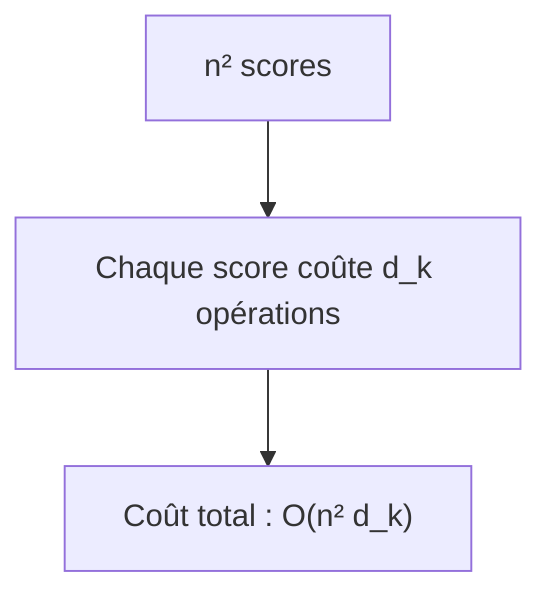

Pour une seule tête, c’est déjà coûteux si $n$ est grand.

---

## 15.9 Coût du softmax

Après le calcul des scores, nous appliquons un softmax ligne par ligne.

La matrice a une taille :

$$
n \times n
$$

Le coût du softmax est donc :

$$
O(n^2)
$$

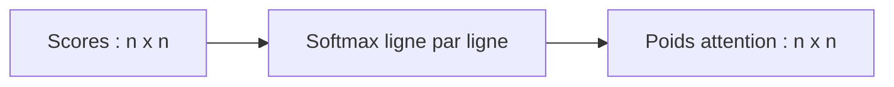

Le softmax n’est pas forcément le coût dominant en calcul, mais il participe fortement au coût mémoire, car les poids d’attention doivent souvent être conservés pendant l’entraînement.

---

## 15.10 Coût de la multiplication par $V$

Après le softmax, nous avons :

$$
A \in \mathbb{R}^{n \times n}
$$

et :

$$
V \in \mathbb{R}^{n \times d_v}
$$

Nous calculons :

$$
AV
$$

Le coût est :

$$
O(n^2 d_v)
$$

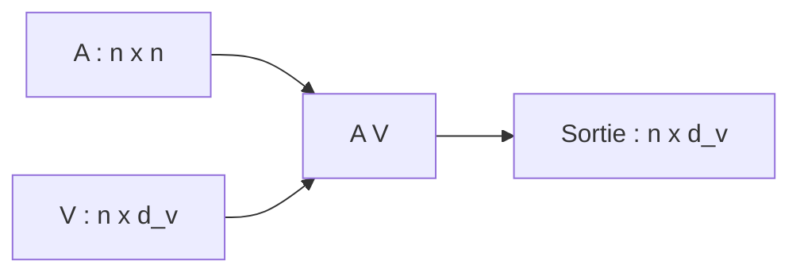

Pour une tête, le coût total de l’attention est donc environ :

$$
O(n^2d_k + n^2d_v)
$$

Si (d_k = d_v), nous retenons :

$$
O(n^2d_k)
$$

à un facteur constant près.

---

## 15.11 Passage à la multi-head attention

Avec $h$ têtes, chaque tête travaille dans un sous-espace de dimension :

$$
d_k = \frac{d_{model}}{h}
$$

Le coût d’une tête est :

$$
O(n^2 d_k)
$$

Avec $h$ têtes :

$$
h \times O(n^2d_k)
$$

Comme :

$$
h d_k = d_{model}
$$

nous obtenons :

$$
O(n^2d_{model})
$$

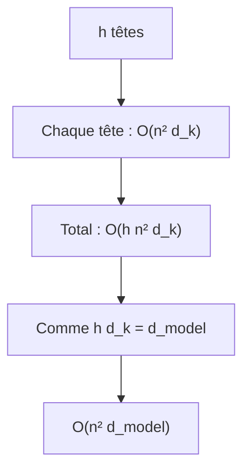

La multi-head attention ne change donc pas l’ordre de grandeur si $d_{model}$ reste fixé.

---

## 15.12 Coût des projections $Q$, $K$, $V$

Avant de calculer l’attention, nous projetons l’entrée $X$ en $Q$, $K$, $V$.

Si :

$$
X \in \mathbb{R}^{n \times d_{model}}
$$

et si chaque projection va de $d_{model}$ vers $d_{model}$, alors chaque projection coûte :

$$
O(n d_{model}^2)
$$

Nous avons trois projections :

$$
Q,\ K,\ V
$$

donc environ :

$$
O(3n d_{model}^2)
$$

Puis la projection finale de la multi-head attention coûte :

$$
O(n d_{model}^2)
$$

Au total :

$$
O(4n d_{model}^2)
$$

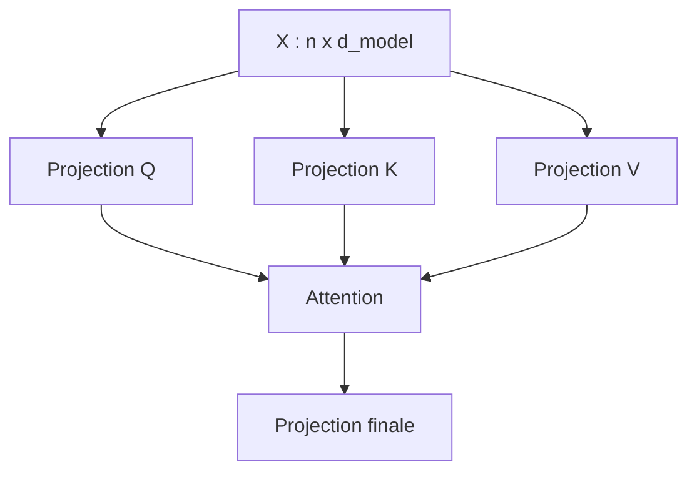

Ces projections sont linéaires en $n$, mais quadratiques en $d_{model}$.

---

## 15.13 Coût total de la multi-head attention

Nous pouvons résumer :

$$
C_{MHA}
=======

O(n d_{model}^2)
+
O(n^2 d_{model})
$$

Le premier terme vient des projections.

Le second terme vient de l’attention dense.

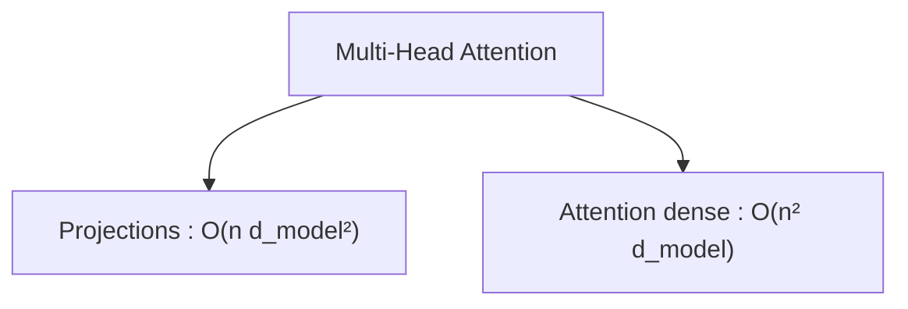

Si $n$ est relativement petit et $d_{model}$ grand, les projections peuvent coûter beaucoup.

Si $n$ devient très grand, le terme (n^2) domine.

---

## 15.14 Coût mémoire de l’attention

Le coût mémoire principal vient de la matrice d’attention.

Avec batch et têtes multiples, les poids d’attention ont la forme :

$$
B \times h \times n \times n
$$

Cela signifie :

$$
O(Bhn^2)
$$

éléments à stocker.

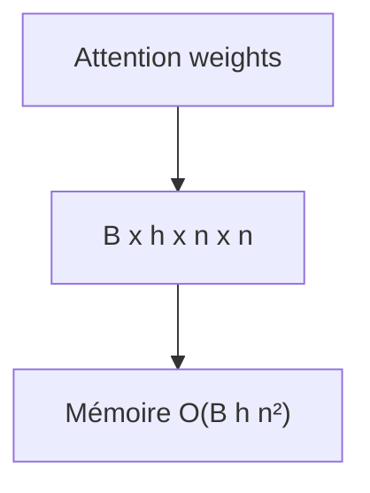

Pendant l’entraînement, nous devons souvent conserver ces valeurs ou des valeurs intermédiaires pour la rétropropagation.

Cela rend les longs contextes très coûteux.

---

## 15.15 Exemple de mémoire d’attention

Supposons :

$$
B = 1
$$

$$
h = 16
$$

$$
n = 8192
$$

Le nombre de valeurs d’attention est :

$$
1 \times 16 \times 8192 \times 8192
$$

$$
= 1,073,741,824
$$

C’est plus d’un milliard de valeurs.

Même si chaque valeur est stockée en float16, cela représente environ :

$$
2\ \text{Go}
$$

uniquement pour cette matrice d’attention, pour une seule couche, sans compter les autres activations.

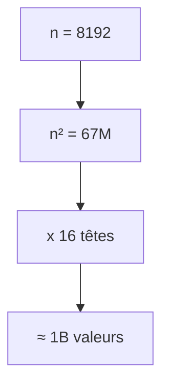

Nous comprenons pourquoi les longues séquences sont difficiles.

---

## 15.16 Coût du Feed-Forward Network

Le feed-forward network applique :

$$
d_{model} \rightarrow d_{ff} \rightarrow d_{model}
$$

Pour chaque token, le coût est approximativement :

$$
O(d_{model}d_{ff})
$$

pour la première projection, puis :

$$
O(d_{ff}d_{model})
$$

pour la seconde.

Donc :

$$
O(2d_{model}d_{ff})
$$

Pour $n$ tokens :

$$
O(n d_{model}d_{ff})
$$

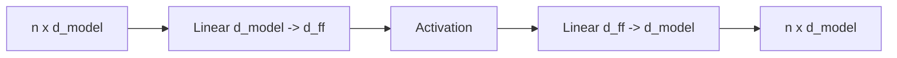

Le FFN est linéaire en $n$, mais il peut être très coûteux car $d_{ff}$ est souvent grand.

---

## 15.17 Comparaison attention et FFN

Pour une couche Transformer :

$$
Attention \approx O(n^2d_{model})
$$

$$
FFN \approx O(nd_{model}d_{ff})
$$

Si :

$$
d_{ff} = 4d_{model}
$$

alors :

$$
FFN \approx O(4nd_{model}^2)
$$

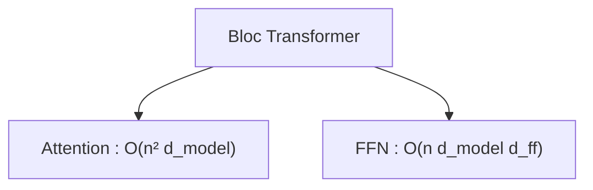

Pour des séquences courtes, le FFN peut coûter plus cher que l’attention.

Pour des séquences longues, l’attention finit par dominer à cause du (n^2).

---

## 15.18 Quand l’attention devient-elle dominante ?

Comparons :

$$
n^2d_{model}
$$

et :

$$
nd_{model}d_{ff}
$$

L’attention devient comparable au FFN lorsque :

$$
n^2d_{model} \approx nd_{model}d_{ff}
$$

En simplifiant :

$$
n \approx d_{ff}
$$

Donc si :

$$
d_{ff} = 4096
$$

l’attention devient très dominante lorsque la longueur de séquence approche ou dépasse plusieurs milliers de tokens.

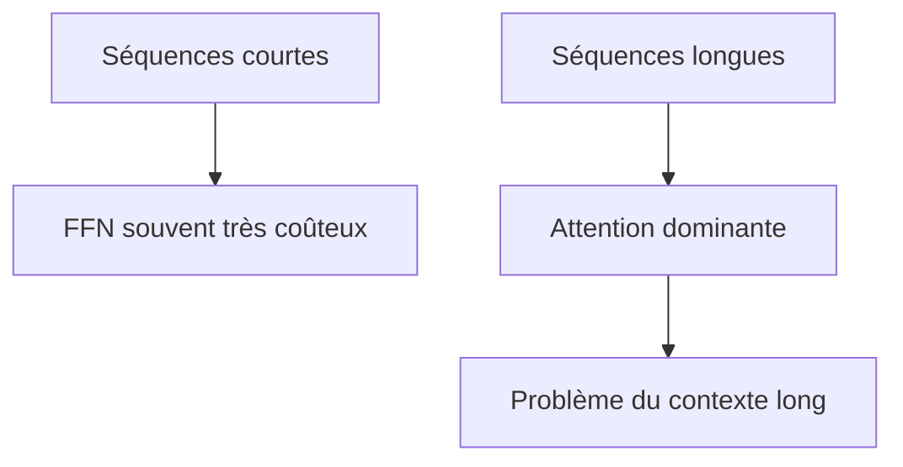

Cette règle est approximative, mais elle donne une bonne intuition.

---

## 15.19 Coût d’une couche Transformer

Pour une couche encoder, nous pouvons retenir :

$$
C_{layer}
=========

O(nd_{model}^2)
+
O(n^2d_{model})
+
O(nd_{model}d_{ff})
$$

Les termes correspondent à :

* projections attention ;
* attention dense ;
* feed-forward network.

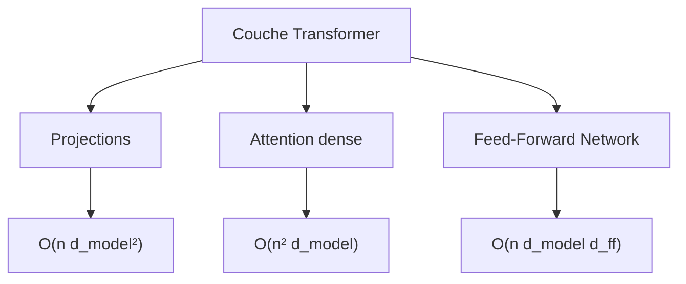

Avec $N$ couches, nous multiplions approximativement par $N$.

---

## 15.20 Coût total d’un empilement de couches

Si nous avons $N$ couches identiques :

$$
C_{total}
\approx
N \times C_{layer}
$$

Donc :

$$
C_{total}
=========

O(Nnd_{model}^2)
+
O(Nn^2d_{model})
+
O(Nnd_{model}d_{ff})
$$

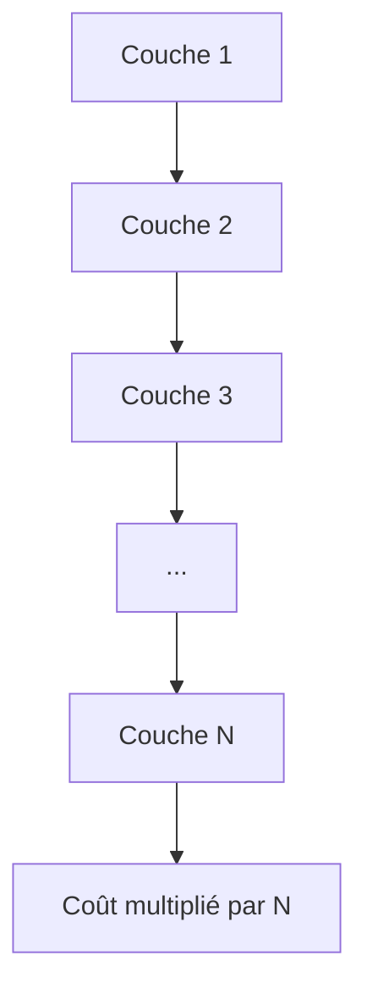

Le coût augmente linéairement avec le nombre de couches.

---

## 15.21 Coût de l’encoder

Dans un encoder, chaque couche contient :

* une self-attention complète ;
* un FFN.

Pour une séquence source de longueur $n$, le coût principal est :

$$
O(n^2d_{model})
+
O(nd_{model}d_{ff})
$$

par couche, en simplifiant les projections.

```mermaid
flowchart TD
    A["Encoder layer"] --> B["Self-attention source"]
    A --> C["FFN"]
    B --> D["O(n² d_model)"]
    C --> E["O(n d_model d_ff)"]
```

L’encoder peut traiter toute la séquence source en parallèle, mais il paie le coût de l’attention dense.

---

## 15.22 Coût du decoder en entraînement

Dans le decoder, une couche contient :

1. masked self-attention ;
2. cross-attention ;
3. FFN.

Si la cible a une longueur $T_t$ et la source une longueur $T_s$, nous avons :

Masked self-attention :

$$
O(T_t^2d_{model})
$$

Cross-attention :

$$
O(T_tT_sd_{model})
$$

FFN :

$$
O(T_td_{model}d_{ff})
$$

```mermaid
flowchart TD
    A["Decoder layer"] --> B["Masked self-attention"]
    A --> C["Cross-attention"]
    A --> D["FFN"]

    B --> E["O(T_t² d_model)"]
    C --> F["O(T_t T_s d_model)"]
    D --> G["O(T_t d_model d_ff)"]
```

Le decoder est donc plus coûteux qu’un bloc encoder équivalent, car il contient une attention supplémentaire.

---

## 15.23 Coût de la cross-attention

Dans la cross-attention :

$$
Q \in \mathbb{R}^{T_t \times d_k}
$$

$$
K \in \mathbb{R}^{T_s \times d_k}
$$

Le produit :

$$
QK^T
$$

donne :

$$
T_t \times T_s
$$

Le coût est donc :

$$
O(T_tT_sd_k)
$$

Avec toutes les têtes :

$$
O(T_tT_sd_{model})
$$

```mermaid
flowchart LR
    Q["Q decoder : T_t x d_k"] --> S["QK^T"]
    K["K encoder : T_s x d_k"] --> S
    S --> M["Scores : T_t x T_s"]
```

La cross-attention dépend des deux longueurs : source et cible.

---

## 15.24 Comparaison avec les RNN

Les RNN ont un traitement séquentiel.

Pour une séquence de longueur $n$, ils doivent traiter :

```txt
t1 puis t2 puis t3 puis ... puis tn
```

```mermaid
flowchart LR
    A["t1"] --> B["t2"]
    B --> C["t3"]
    C --> D["..."]
    D --> E["tn"]
```

Leur coût peut être linéaire en longueur de séquence par couche, mais ils ont une forte contrainte séquentielle.

Ils sont difficiles à paralléliser sur la dimension temporelle.

Le Transformer, lui, a un coût d’attention en (O(n^2)), mais il traite toutes les positions en parallèle.

```mermaid
flowchart TD
    A["RNN"] --> B["Coût séquentiel"]
    A --> C["Parallélisation limitée"]

    D["Transformer"] --> E["Coût attention O(n²)"]
    D --> F["Parallélisation forte"]
```

Le Transformer échange donc un coût quadratique contre une meilleure parallélisation.

---

## 15.25 Comparaison avec les CNN

Les CNN sont parallélisables, mais leur champ de vision est local.

Avec un noyau de taille $k$, un token ne voit directement que ses voisins proches.

Pour capturer une dépendance longue, il faut empiler plusieurs couches.

```mermaid
flowchart TD
    A["CNN"] --> B["Convolutions locales"]
    B --> C["Dépendances longues via profondeur"]
```

L’attention permet à deux tokens éloignés de se connecter directement.

```mermaid
flowchart LR
    A["Token au début"] -. "attention directe" .-> B["Token très éloigné"]
```

Comparaison :

| Architecture | Parallélisable ? | Dépendances longues             |
| ------------ | ---------------- | ------------------------------- |
| RNN          | Peu              | Difficiles, chemin long         |
| CNN          | Oui              | Besoin de plusieurs couches     |
| Transformer  | Oui              | Connexion directe par attention |

---

## 15.26 Longueur maximale du chemin entre positions

Dans un RNN, pour que l’information passe de (t_1) à $t_n$, elle traverse de nombreux états intermédiaires.

La longueur du chemin est proportionnelle à $n$.

Dans un CNN, elle dépend du nombre de couches et de la taille du noyau.

Dans un Transformer, une position peut regarder directement une autre position en une seule couche.

```mermaid
flowchart TD
    A["RNN"] --> B["Chemin long entre positions"]
    C["CNN"] --> D["Chemin réduit mais dépend des couches"]
    E["Transformer"] --> F["Chemin direct par attention"]
```

C’est l’un des grands avantages conceptuels de l’attention.

---

## 15.27 Pourquoi les longues séquences sont difficiles

Les longues séquences sont difficiles pour trois raisons.

Premièrement, l’attention dense coûte :

$$
O(n^2)
$$

Deuxièmement, la mémoire d’attention coûte :

$$
O(Bhn^2)
$$

Troisièmement, en inférence autoregressive, le modèle doit gérer un cache de plus en plus grand.

```mermaid
flowchart TD
    A["Longues séquences"] --> B["Coût calcul O(n²)"]
    A --> C["Coût mémoire O(n²)"]
    A --> D["KV cache important"]
```

Le contexte long est donc un problème à la fois algorithmique, mémoire et système.

---

## 15.28 Entraînement vs inférence

Les contraintes ne sont pas les mêmes pendant l’entraînement et pendant l’inférence.

| Aspect               | Entraînement               | Inférence               |
| -------------------- | -------------------------- | ----------------------- |
| Rétropropagation     | Oui                        | Non                     |
| Activations stockées | Oui                        | Beaucoup moins          |
| Génération           | Parallèle sur cible connue | Token par token         |
| KV cache             | Pas toujours central       | Très important          |
| Goulot fréquent      | Mémoire GPU                | Latence + mémoire cache |

```mermaid
flowchart TD
    A["Entraînement"] --> B["Stockage activations"]
    A --> C["Backward pass"]

    D["Inférence"] --> E["Pas de backward"]
    D --> F["Génération autoregressive"]
    D --> G["KV cache"]
```

Un modèle peut être difficile à entraîner pour des raisons mémoire, et difficile à servir pour des raisons de latence.

---

## 15.29 Mémoire pendant l’entraînement

Pendant l’entraînement, nous devons stocker :

* les activations ;
* les poids d’attention ;
* les sorties intermédiaires ;
* les gradients ;
* les états de l’optimiseur ;
* parfois les logits.

```mermaid
flowchart TD
    A["Forward pass"] --> B["Activations stockées"]
    B --> C["Backward pass"]
    C --> D["Gradients"]
    D --> E["Mise à jour paramètres"]
```

C’est pourquoi l’entraînement d’un Transformer consomme beaucoup plus de mémoire que son inférence.

---

## 15.30 Activation checkpointing

Une technique classique pour réduire la mémoire est l’**activation checkpointing**.

L’idée est de ne pas stocker toutes les activations.

Nous stockons seulement certains points, puis nous recalculons le reste pendant la rétropropagation.

```mermaid
flowchart TD
    A["Sans checkpointing"] --> B["Stocker toutes les activations"]
    C["Avec checkpointing"] --> D["Stocker moins d'activations"]
    D --> E["Recalculer pendant backward"]
```

C’est un compromis :

```txt
moins de mémoire, mais plus de calcul
```

Cette technique est très utilisée pour entraîner de grands Transformers.

---

## 15.31 Mémoire de l’optimiseur

Avec Adam, nous stockons pour chaque paramètre :

* le poids ;
* le gradient ;
* une moyenne mobile du gradient ;
* une moyenne mobile du carré du gradient.

```mermaid
flowchart TD
    A["Paramètre"] --> B["Poids"]
    A --> C["Gradient"]
    A --> D["Moment 1 Adam"]
    A --> E["Moment 2 Adam"]
```

Cela signifie que l’optimiseur peut consommer plusieurs fois la mémoire des seuls paramètres du modèle.

Pour les grands modèles, l’état de l’optimiseur devient un facteur majeur.

---

## 15.32 Précision réduite

Pour réduire le coût mémoire et accélérer les calculs, nous utilisons souvent :

* float16 ;
* bfloat16 ;
* mixed precision.

```mermaid
flowchart TD
    A["float32"] --> B["float16 / bfloat16"]
    B --> C["Moins de mémoire"]
    B --> D["Calcul plus rapide"]
    B --> E["Risque numérique"]
```

La précision réduite est très utile, mais demande des mécanismes de stabilité :

* LayerNorm ;
* scaling ;
* gestion des NaN ;
* optimiseur adapté ;
* parfois loss scaling.

---

## 15.33 Inférence autoregressive

En génération, un modèle decoder-only ou un decoder de Transformer génère les tokens un par un.

```txt
y1 → y2 → y3 → ... → yn
```

```mermaid
flowchart LR
    A["Générer y1"] --> B["Générer y2"]
    B --> C["Générer y3"]
    C --> D["..."]
    D --> E["Générer yn"]
```

Même si l’entraînement peut être parallélisé, l’inférence autoregressive reste séquentielle.

---

## 15.34 Inférence sans KV cache

Sans KV cache, à chaque nouveau token, nous recalculerions les keys et values de tout le préfixe.

Étape 1 :

```txt
1 token
```

Étape 2 :

```txt
2 tokens
```

Étape 3 :

```txt
3 tokens
```

Étape $n$ :

```txt
n tokens
```

```mermaid
flowchart TD
    A["Étape 1 : recalcul 1 token"] --> B["Étape 2 : recalcul 2 tokens"]
    B --> C["Étape 3 : recalcul 3 tokens"]
    C --> D["..."]
    D --> E["Étape n : recalcul n tokens"]
```

C’est très inefficace.

---

## 15.35 KV cache

Le **KV cache** stocke les keys et values déjà calculées.

À chaque nouveau token, nous calculons seulement les nouvelles $K$ et $V$, puis nous les ajoutons au cache.

```mermaid
flowchart TD
    A["Tokens précédents"] --> B["Keys/Values déjà calculées"]
    B --> C["KV cache"]

    D["Nouveau token"] --> E["Nouvelle Key"]
    D --> F["Nouvelle Value"]

    E --> C
    F --> C
    C --> G["Attention du nouveau token"]
```

Le KV cache évite de recalculer tout le passé.

---

## 15.36 Coût avec KV cache

Avec KV cache, pour générer un nouveau token, la query du nouveau token regarde toutes les keys du contexte.

Si le contexte a longueur $n$, le coût d’attention du nouveau token est approximativement :

$$
O(nd_{model})
$$

```mermaid
flowchart LR
    Q["Q nouveau token : 1 x d"] --> S["QK^T"]
    K["K cache : n x d"] --> S
    S --> A["Scores : 1 x n"]
```

Le coût par token augmente donc linéairement avec la longueur du contexte.

Le KV cache réduit le recalcul, mais ne rend pas la génération gratuite.

---

## 15.37 Mémoire du KV cache

Le KV cache stocke, pour chaque couche :

* les keys ;
* les values.

La forme typique est :

$$
B \times h \times n \times d_k
$$

pour les keys, et la même chose pour les values.

Donc :

$$
2 \times B \times h \times n \times d_k
$$

par couche.

Avec $N$ couches :

$$
2N B h n d_k
$$

Comme :

$$
h d_k = d_{model}
$$

nous pouvons retenir :

$$
O(NBnd_{model})
$$

```mermaid
flowchart TD
    A["KV cache"] --> B["Mémoire linéaire en n"]
    A --> C["Multipliée par N couches"]
    A --> D["Multipliée par B"]
    A --> E["Multipliée par d_model"]
```

Pour les longs contextes, le KV cache devient une limite importante.

---

## 15.38 Le paradoxe du contexte long

Un contexte plus long est utile, car le modèle peut lire plus d’informations.

Mais il coûte plus cher :

* plus de calcul ;
* plus de mémoire ;
* plus de latence ;
* plus de bruit potentiel ;
* plus de difficulté à retrouver l’information utile.

```mermaid
flowchart TD
    A["Contexte long"] --> B["Plus d'informations"]
    A --> C["Plus de coût"]
    A --> D["Plus de bruit"]
    A --> E["Latence plus élevée"]
```

Nous devons donc éviter une idée naïve :

> Plus de contexte n’est pas toujours automatiquement mieux.

Il faut aussi que le modèle sache utiliser ce contexte.

---

## 15.39 Sparse attention

Une première famille d’optimisations consiste à rendre l’attention **sparse**.

Au lieu de permettre à chaque token de regarder tous les autres, nous limitons les connexions.

```mermaid
flowchart TD
    A["Attention dense"] --> B["Tous les tokens regardent tous les tokens"]
    C["Sparse attention"] --> D["Chaque token regarde seulement certains tokens"]
```

Cela réduit potentiellement le coût.

Mais cela change aussi le comportement du modèle.

---

## 15.40 Attention locale

Une forme simple de sparse attention est l’attention locale.

Chaque token regarde seulement une fenêtre autour de lui.

Exemple :

```txt
chaque token regarde 256 tokens autour de lui
```

```mermaid
flowchart LR
    A["Tokens lointains"] -. "ignorés" .-> C["Token courant"]
    B["Fenêtre locale gauche"] --> C
    C --> D["Fenêtre locale droite"]
    E["Tokens lointains"] -. "ignorés" .-> C
```

Si la fenêtre a une taille $w$, le coût devient environ :

$$
O(nw)
$$

au lieu de :

$$
O(n^2)
$$

si $w \ll n$.

---

## 15.41 Limite de l’attention locale

L’attention locale réduit le coût, mais elle limite les dépendances longues directes.

Deux tokens très éloignés ne peuvent pas se voir directement.

```mermaid
flowchart TD
    A["Attention locale"] --> B["Coût réduit"]
    A --> C["Dépendances longues plus difficiles"]
```

Pour compenser, on peut :

* empiler plus de couches ;
* ajouter des tokens globaux ;
* utiliser des motifs sparse plus complexes ;
* combiner attention locale et attention globale.

---

## 15.42 Sliding window attention

La **sliding window attention** est une forme d’attention locale très utilisée.

Chaque token regarde une fenêtre glissante de tokens voisins.

Dans un modèle causal, un token peut par exemple regarder les $w$ tokens précédents.

```mermaid
flowchart LR
    A["t-4"] --> E["t"]
    B["t-3"] --> E
    C["t-2"] --> E
    D["t-1"] --> E
    F["t+1"] -. "interdit" .-> E
```

Dans ce cas, le coût devient :

$$
O(nw)
$$

Ce type d’attention est utile pour des séquences longues où les dépendances locales dominent.

---

## 15.43 Attention globale + locale

Certains modèles combinent :

* attention locale pour la majorité des tokens ;
* attention globale pour certains tokens spéciaux.

```mermaid
flowchart TD
    A["Tokens ordinaires"] --> B["Attention locale"]
    C["Tokens globaux"] --> D["Attention vers tous"]
    D --> E["Communication longue distance"]
```

Les tokens globaux peuvent servir de points de passage pour l’information longue distance.

Cette approche cherche un compromis entre coût réduit et capacité globale.

---

## 15.44 Linear attention

Une autre famille d’optimisations cherche à obtenir une attention quasi linéaire.

L’idée est de reformuler ou d’approximer l’attention pour éviter de construire explicitement la matrice :

$$
n \times n
$$

```mermaid
flowchart TD
    A["Attention classique"] --> B["Matrice n x n"]
    C["Linear attention"] --> D["Éviter la matrice complète"]
    D --> E["Coût proche de O(n)"]
```

Ces méthodes utilisent souvent des transformations de noyaux ou des approximations.

Elles peuvent être efficaces, mais elles ne reproduisent pas toujours exactement le comportement de l’attention dense.

---

## 15.45 Limites de la linear attention

La linear attention réduit le coût, mais elle peut avoir des limites :

* approximation de l’attention originale ;
* performances parfois inférieures ;
* difficulté à remplacer l’attention dense dans tous les contextes ;
* complexité d’implémentation ;
* comportement différent sur certaines tâches.

```mermaid
flowchart TD
    A["Linear attention"] --> B["Coût réduit"]
    A --> C["Approximation"]
    C --> D["Comportement potentiellement différent"]
```

Il ne faut donc pas croire que l’attention linéaire remplace toujours simplement l’attention dense.

---

## 15.46 FlashAttention

FlashAttention est une autre approche.

Contrairement à la sparse attention ou à la linear attention, FlashAttention ne change pas le résultat mathématique de l’attention dense.

Elle change la manière de la calculer.

L’idée est :

> Calculer l’attention par blocs pour réduire les lectures et écritures mémoire inutiles.

```mermaid
flowchart TD
    A["Attention dense classique"] --> B["Matérialise une grande matrice n x n"]
    C["FlashAttention"] --> D["Calcule par blocs"]
    D --> E["Réduit le coût mémoire pratique"]
```

FlashAttention est donc une optimisation d’implémentation.

---

## 15.47 Pourquoi FlashAttention est important

Sur GPU, le coût ne vient pas seulement des opérations arithmétiques.

Les accès mémoire sont souvent un goulot d’étranglement.

Si nous écrivons et relisons de grandes matrices en mémoire GPU globale, nous perdons beaucoup de temps.

FlashAttention réduit ces mouvements mémoire.

```mermaid
flowchart TD
    A["GPU"] --> B["Calcul rapide"]
    A --> C["Accès mémoire coûteux"]
    C --> D["Bottleneck"]
    E["FlashAttention"] --> F["Moins d'accès mémoire inutiles"]
```

C’est pourquoi elle accélère fortement l’attention en pratique.

---

## 15.48 FlashAttention ne rend pas l’attention linéaire

Il faut être très clair :

> FlashAttention ne transforme pas l’attention dense en (O(n)).

Elle calcule toujours une attention dense exacte.

Le coût théorique reste lié à (n^2).

Mais elle réduit fortement la mémoire intermédiaire et améliore l’efficacité matérielle.

```mermaid
flowchart TD
    A["FlashAttention"] --> B["Attention dense exacte"]
    A --> C["Meilleure efficacité mémoire"]
    A --> D["Pas une attention sparse"]
    A --> E["Pas une attention linéaire"]
```

C’est donc une optimisation très importante, mais pas une solution complète au problème des contextes gigantesques.

---

## 15.49 Comparaison des optimisations d’attention

| Méthode          | Idée                   | Change le résultat mathématique ? | Objectif                  |
| ---------------- | ---------------------- | --------------------------------: | ------------------------- |
| Sparse attention | Réduire les connexions |                               Oui | Moins de calcul           |
| Sliding window   | Fenêtre locale         |                               Oui | Long contexte local       |
| Linear attention | Approximer/reformuler  |                      Oui, souvent | Coût linéaire             |
| FlashAttention   | Calcul par blocs       |                               Non | Moins de mémoire pratique |
| KV cache         | Stocker K/V passés     |                               Non | Inférence plus rapide     |

```mermaid
flowchart TD
    A["Optimisations"] --> B["Changer le motif d'attention"]
    A --> C["Optimiser le calcul exact"]
    A --> D["Optimiser l'inférence"]

    B --> E["Sparse / sliding window"]
    C --> F["FlashAttention"]
    D --> G["KV cache"]
```

Ces méthodes répondent à des problèmes différents.

---

## 15.50 Attention et RAG : éviter de tout mettre dans le contexte

Une autre stratégie consiste à ne pas donner tout le contexte au Transformer.

Dans un système RAG, nous récupérons seulement les documents pertinents.

```mermaid
flowchart TD
    A["Grande base documentaire"] --> B["Recherche / retrieval"]
    B --> C["Passages pertinents"]
    C --> D["Contexte du Transformer"]
```

Cela réduit la longueur $n$ du contexte traité par le modèle.

Plutôt que de donner 1 million de tokens au modèle, nous lui donnons quelques passages bien choisis.

Le RAG est donc aussi une réponse indirecte au coût du contexte long.

---

## 15.51 Compression de contexte

Une autre idée est de compresser le contexte.

Nous pouvons :

* résumer ;
* regrouper des tokens ;
* créer des représentations latentes ;
* utiliser une mémoire externe ;
* conserver seulement les informations importantes.

```mermaid
flowchart TD
    A["Long contexte brut"] --> B["Compression"]
    B --> C["Contexte plus court"]
    C --> D["Transformer"]
```

La difficulté est de compresser sans perdre l’information utile.

---

## 15.52 Quantization

La quantization réduit la précision des poids ou activations.

Par exemple :

* float32 ;
* float16 ;
* int8 ;
* int4.

```mermaid
flowchart LR
    A["Poids float32"] --> B["Quantization"]
    B --> C["Poids int8 / int4"]
    C --> D["Moins de mémoire"]
```

La quantization est surtout utile en inférence.

Elle permet de faire tenir de plus grands modèles en mémoire et parfois d’accélérer le calcul.

Mais elle peut dégrader la qualité si elle est trop agressive.

---

## 15.53 Parallélisme de données

Le parallélisme de données consiste à copier le modèle sur plusieurs GPU.

Chaque GPU traite un batch différent.

Ensuite, les gradients sont synchronisés.

```mermaid
flowchart TD
    A["GPU 1 : batch A"] --> D["Synchronisation gradients"]
    B["GPU 2 : batch B"] --> D
    C["GPU 3 : batch C"] --> D
    D --> E["Mise à jour commune"]
```

Cette méthode est simple conceptuellement, mais elle suppose que le modèle tienne sur chaque GPU.

---

## 15.54 Parallélisme de modèle

Si le modèle est trop grand pour tenir sur un GPU, nous pouvons le répartir.

Deux stratégies importantes sont :

* tensor parallelism ;
* pipeline parallelism.

```mermaid
flowchart TD
    A["Grand modèle"] --> B["Tensor parallelism"]
    A --> C["Pipeline parallelism"]
```

Le tensor parallelism découpe certaines matrices entre plusieurs GPU.

Le pipeline parallelism place différentes couches sur différents GPU.

---

## 15.55 Tensor parallelism

Dans le tensor parallelism, une grande opération matricielle est répartie.

Par exemple, une projection linéaire peut être découpée sur plusieurs GPU.

```mermaid
flowchart TD
    A["Grande matrice"] --> B["Partie GPU 1"]
    A --> C["Partie GPU 2"]
    A --> D["Partie GPU 3"]
    B --> E["Résultat combiné"]
    C --> E
    D --> E
```

C’est très utile pour les grands Transformers, où les matrices $d_{model} \times d_{ff}$ ou $d_{model} \times d_{model}$ peuvent être énormes.

---

## 15.56 Pipeline parallelism

Dans le pipeline parallelism, les couches sont réparties entre GPU.

```mermaid
flowchart LR
    A["Couches 1-4 GPU 1"] --> B["Couches 5-8 GPU 2"]
    B --> C["Couches 9-12 GPU 3"]
```

Cela permet d’entraîner ou d’exécuter des modèles plus grands.

Mais cela introduit des difficultés :

* communication entre GPU ;
* bulles de pipeline ;
* équilibrage de charge ;
* synchronisation.

---

## 15.57 Latence et débit en inférence

En inférence, nous devons distinguer deux notions :

| Notion  | Signification                                    |
| ------- | ------------------------------------------------ |
| Latence | temps nécessaire pour obtenir une réponse        |
| Débit   | nombre de tokens ou requêtes traités par seconde |

```mermaid
flowchart TD
    A["Inférence"] --> B["Latence"]
    A --> C["Débit"]
```

Pour un assistant conversationnel, la latence est très importante.

Pour traiter un grand corpus en batch, le débit peut être plus important.

---

## 15.58 Batch en inférence

Nous pouvons faire du batching en inférence.

Cela permet de mieux utiliser le GPU.

```mermaid
flowchart TD
    A["Requête 1"] --> D["Batch inférence"]
    B["Requête 2"] --> D
    C["Requête 3"] --> D
    D --> E["GPU mieux utilisé"]
```

Mais cela peut augmenter la latence si une requête attend que le batch se remplisse.

Il y a donc un compromis entre débit et latence.

---

## 15.59 Décodage spéculatif

Le décodage spéculatif est une optimisation moderne de l’inférence autoregressive.

L’idée est :

1. un petit modèle propose rapidement plusieurs tokens ;
2. un grand modèle vérifie ces tokens ;
3. si les tokens sont acceptés, nous gagnons du temps.

```mermaid
flowchart TD
    A["Petit modèle"] --> B["Propose plusieurs tokens"]
    B --> C["Grand modèle vérifie"]
    C --> D["Accepte ou rejette"]
```

Cette technique ne change pas l’architecture Transformer.

Elle optimise la génération.

---

## 15.60 Pourquoi les Transformers restent dominants malgré leur coût

Nous pourrions nous demander :

> Si l’attention dense coûte (O(n^2)), pourquoi les Transformers sont-ils encore si dominants ?

La réponse est qu’ils ont plusieurs avantages majeurs :

* excellente parallélisation ;
* simplicité modulaire ;
* très bonnes performances empiriques ;
* compatibilité avec le scaling ;
* flexibilité pour texte, image, audio, code ;
* écosystème logiciel et matériel très optimisé.

```mermaid
flowchart TD
    A["Transformer"] --> B["Coût élevé"]
    A --> C["Mais très performant"]
    A --> D["Très parallélisable"]
    A --> E["Très optimisé"]
    A --> F["Très flexible"]
```

Le coût est réel, mais les bénéfices ont été considérables.

---

## 15.61 Erreur fréquente : croire que les têtes multiplient toujours le coût par $h$

On pourrait penser :

```txt
8 têtes = 8 fois plus cher
```

Mais chaque tête travaille sur une dimension plus petite.

Si $d_{model}$ reste constant :

$$
d_k = \frac{d_{model}}{h}
$$

Donc :

$$
h \times d_k = d_{model}
$$

```mermaid
flowchart TD
    A["Plus de têtes"] --> B["Dimension par tête plus petite"]
    B --> C["Coût total contrôlé"]
```

Le nombre de têtes influence les constantes, l’organisation mémoire et la qualité, mais pas forcément l’ordre de grandeur principal.

---

## 15.62 Erreur fréquente : ne parler que du (O(n^2))

Le (O(n^2)) de l’attention est très important.

Mais il ne faut pas oublier :

* les projections (Q,K,V) ;
* le FFN ;
* la projection vocabulaire ;
* les activations ;
* les gradients ;
* l’optimiseur ;
* le KV cache ;
* la communication multi-GPU.

```mermaid
flowchart TD
    A["Coût réel"] --> B["Attention"]
    A --> C["FFN"]
    A --> D["Mémoire"]
    A --> E["Optimiseur"]
    A --> F["Communication"]
```

Le coût réel d’un Transformer est un système complet, pas seulement une formule.

---

## 15.63 Erreur fréquente : confondre calcul et mémoire

Une opération peut être coûteuse en calcul, mais pas forcément en mémoire, ou inversement.

Par exemple :

* l’attention dense coûte en calcul et en mémoire ;
* le KV cache coûte surtout en mémoire ;
* FlashAttention réduit surtout les accès mémoire ;
* le FFN coûte beaucoup en calcul et en paramètres.

```mermaid
flowchart TD
    A["Coût"] --> B["Calcul"]
    A --> C["Mémoire"]

    B --> D["FLOPs"]
    C --> E["VRAM"]
```

Quand nous analysons un modèle, nous devons toujours distinguer ces deux dimensions.

---

## 15.64 Erreur fréquente : croire que FlashAttention change l’architecture

FlashAttention ne change pas l’architecture Transformer.

Elle ne change pas la formule :

$$
softmax\left(\frac{QK^T}{\sqrt{d_k}}\right)V
$$

Elle change l’implémentation.

```mermaid
flowchart TD
    A["Attention dense standard"] --> C["Même résultat mathématique"]
    B["FlashAttention"] --> C
    B --> D["Calcul plus efficace"]
```

C’est une optimisation système, pas une nouvelle architecture conceptuelle.

---

## 15.65 Synthèse mathématique

Pour une couche Transformer encoder, nous pouvons retenir :

$$
C_{attention} \approx O(n^2d_{model})
$$

$$
C_{FFN} \approx O(nd_{model}d_{ff})
$$

$$
C_{projections} \approx O(nd_{model}^2)
$$

Mémoire des poids d’attention :

$$
O(Bhn^2)
$$

Mémoire du KV cache en inférence :

$$
O(NBnd_{model})
$$

Le coût total dépend principalement de :

$$
n,\ B,\ N,\ d_{model},\ d_{ff},\ h
$$

---

## 15.66 Schéma global de synthèse

```mermaid
flowchart TD
    A["Transformer"] --> B["Attention dense"]
    B --> B1["Calcul : O(n² d_model)"]
    B --> B2["Mémoire : O(B h n²)"]

    A --> C["Feed-Forward"]
    C --> C1["Calcul : O(n d_model d_ff)"]
    C --> C2["Paramètres nombreux"]

    A --> D["Projections"]
    D --> D1["O(n d_model²)"]

    A --> E["Inférence autoregressive"]
    E --> E1["KV cache"]
    E1 --> E2["Mémoire : O(N B n d_model)"]

    A --> F["Optimisations"]
    F --> F1["FlashAttention"]
    F --> F2["Sparse attention"]
    F --> F3["Sliding window"]
    F --> F4["Linear attention"]
    F --> F5["Quantization"]
```

---

## 15.67 Résumé du chapitre

Nous avons étudié la complexité algorithmique et mémoire des Transformers.

Nous avons vu que la self-attention dense calcule une matrice de scores :

$$
n \times n
$$

ce qui entraîne un coût en :

$$
O(n^2d_{model})
$$

et une mémoire d’attention en :

$$
O(Bhn^2)
$$

Nous avons aussi vu que le feed-forward network est très coûteux :

$$
O(nd_{model}d_{ff})
$$

et qu’il représente souvent une grande partie des paramètres du modèle.

Nous avons comparé les Transformers aux RNN et CNN :

* les RNN ont une forte contrainte séquentielle ;
* les CNN sont parallélisables mais locaux ;
* les Transformers sont parallélisables et globaux, mais coûteux en (n^2).

Nous avons ensuite étudié les principales stratégies d’optimisation :

* KV cache ;
* FlashAttention ;
* sparse attention ;
* sliding window attention ;
* linear attention ;
* activation checkpointing ;
* quantization ;
* parallélisme de données ;
* parallélisme de modèle ;
* décodage spéculatif.

Le point central est :

> Le Transformer doit son succès à sa parallélisation et à sa capacité à relier directement les tokens, mais cette puissance a un prix : l’attention dense globale devient coûteuse lorsque la longueur de séquence augmente.

---

## 15.68 Questions de compréhension

### 15.68.1 Question 1

Pourquoi l’attention dense a-t-elle une complexité quadratique en longueur de séquence ?

Réponse attendue : parce que chaque token calcule un score d’attention avec chaque autre token, ce qui produit une matrice $n \times n$.

### 15.68.2 Question 2

Quelle est la complexité approximative de l’attention dense dans une couche ?

Réponse attendue :

$$
O(n^2d_{model})
$$

### 15.68.3 Question 3

Quelle est la forme de la matrice d’attention avec batch et plusieurs têtes ?

Réponse attendue :

$$
B \times h \times n \times n
$$

### 15.68.4 Question 4

Pourquoi le feed-forward network peut-il coûter très cher ?

Réponse attendue : parce qu’il est appliqué à chaque token et que $d_{ff}$ est souvent plusieurs fois plus grand que $d_{model}$.

### 15.68.5 Question 5

Quelle est la complexité approximative du FFN ?

Réponse attendue :

$$
O(nd_{model}d_{ff})
$$

### 15.68.6 Question 6

Pourquoi les RNN sont-ils moins parallélisables que les Transformers ?

Réponse attendue : parce qu’ils traitent les tokens séquentiellement, chaque état dépendant du précédent.

### 15.68.7 Question 7

Pourquoi les CNN capturent-ils moins directement les dépendances longues ?

Réponse attendue : parce que leurs convolutions sont locales et qu’il faut empiler plusieurs couches pour augmenter le champ de réception.

### 15.68.8 Question 8

À quoi sert le KV cache ?

Réponse attendue : à stocker les keys et values des tokens précédents pour éviter de les recalculer à chaque étape d’inférence.

### 15.68.9 Question 9

FlashAttention change-t-elle le résultat mathématique de l’attention ?

Réponse attendue : non. Elle calcule la même attention dense, mais de manière plus efficace en mémoire.

### 15.68.10 Question 10

Pourquoi une fenêtre de contexte plus longue n’est-elle pas toujours automatiquement meilleure ?

Réponse attendue : parce qu’elle augmente le coût, la mémoire, la latence et peut ajouter du bruit ou rendre l’information utile plus difficile à exploiter.

---

## 15.69 Transition vers le chapitre 16

Nous avons maintenant compris le coût des Transformers.

Nous savons que l’attention dense est puissante, mais coûteuse, et que de nombreuses optimisations cherchent à réduire son coût ou à améliorer son exécution.

Dans le chapitre suivant, nous allons étudier les **grandes familles de Transformers**.

Nous verrons comment l’architecture originale s’est divisée en plusieurs familles majeures :

* encoder-only ;
* decoder-only ;
* encoder-decoder ;
* BERT ;
* GPT ;
* T5 ;
* Vision Transformers ;
* Transformers multimodaux.

Nous passerons donc de l’analyse du coût à la cartographie des grandes architectures modernes.

---
> [!info] Livre « Les transformers » — chapitre 15/30
> [[Les transformers — Sommaire|Sommaire]] · [[Les transformers — 14 — Complexité algorithmique et mémoire des Transformers|← 14 — Complexité algorithmique et mémoire des Transformers]] · [[Les transformers — 16 — Grandes familles de Transformers encoder-only, decoder-only et encoder-decoder|16 — Grandes familles de Transformers encoder-only, decoder-only et encoder-decoder →]]
