> [!info] Livre « Les transformers » — chapitre 16/30
> [[Les transformers — Sommaire|Sommaire]] · [[Les transformers — 15 — Complexité algorithmique des Transformers|← 15 — Complexité algorithmique des Transformers]] · [[Les transformers — 17 — Modèles encoder-only BERT et la compréhension bidirectionnelle|17 — Modèles encoder-only BERT et la compréhension bidirectionnelle →]]

# Chapitre 16 — Grandes familles de Transformers : encoder-only, decoder-only et encoder-decoder
## 16.1 Objectif du chapitre

Jusqu’ici, nous avons étudié le Transformer original comme une architecture **encoder-decoder**, pensée principalement pour la traduction automatique.

Nous avons vu :

* l’encoder ;
* le decoder ;
* la self-attention ;
* la masked self-attention ;
* la cross-attention ;
* les masques ;
* le feed-forward network ;
* la complexité ;
* le papier **Attention Is All You Need**.

Dans ce chapitre, nous allons élargir notre vision.

Depuis 2017, l’architecture Transformer s’est divisée en plusieurs grandes familles :

1. les modèles **encoder-only** ;
2. les modèles **decoder-only** ;
3. les modèles **encoder-decoder** ;
4. les Transformers adaptés à la vision ;
5. les Transformers multimodaux.

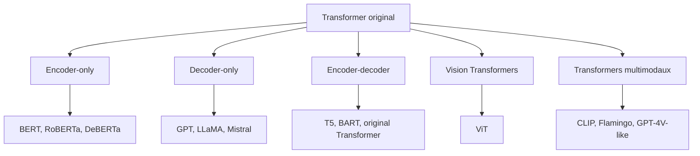

Le but du chapitre est de comprendre :

> Selon la tâche, nous ne gardons pas toujours tout le Transformer original. Nous pouvons utiliser seulement l’encoder, seulement le decoder, ou conserver l’architecture encoder-decoder complète.

---

## 16.2 Pourquoi plusieurs familles ?

Le Transformer original a été conçu pour la traduction :

```txt
source → cible
```

Exemple :

```txt
The cat sleeps. → Le chat dort.
```

Mais toutes les tâches ne ressemblent pas à de la traduction.

Certaines tâches demandent surtout de **comprendre** une entrée :

```txt
Ce texte est-il positif ou négatif ?
```

D’autres demandent surtout de **générer** la suite d’un texte :

```txt
Écris la suite de cette phrase...
```

D’autres demandent de **transformer** une entrée en une sortie :

```txt
Résume ce document.
```

Ces différences conduisent à différentes architectures.

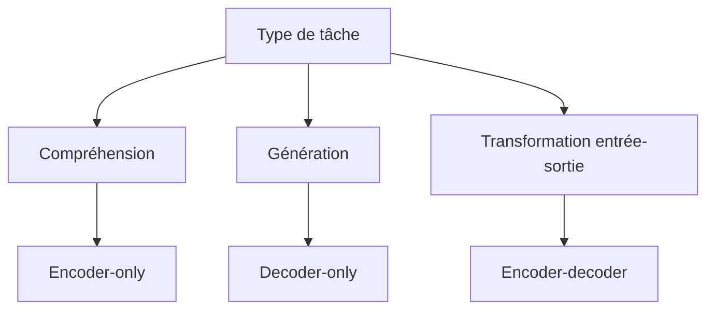

Nous devons donc choisir l’architecture selon le type de problème.

---

## 16.3 Les trois familles principales

Nous pouvons résumer les trois grandes familles ainsi :

| Famille         | Structure                   | Usage principal                                 |
| --------------- | --------------------------- | ----------------------------------------------- |
| Encoder-only    | Seulement l’encoder         | Compréhension, classification, extraction       |
| Decoder-only    | Seulement le decoder causal | Génération, chat, complétion                    |
| Encoder-decoder | Encoder + decoder           | Traduction, résumé, transformation text-to-text |

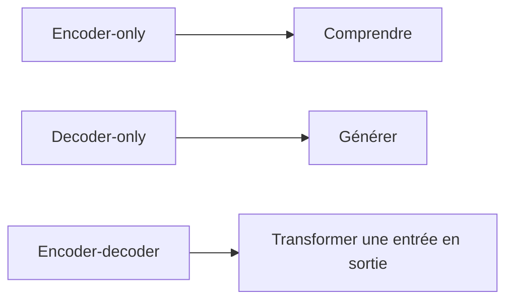

Cette table est une base fondamentale pour comprendre les modèles modernes.

---

## 16.4 Famille 1 : les modèles encoder-only

## 16.4.1 Principe général

Un modèle **encoder-only** utilise uniquement la partie encoder du Transformer.

Il reçoit une séquence complète et produit des représentations contextualisées pour chaque token.

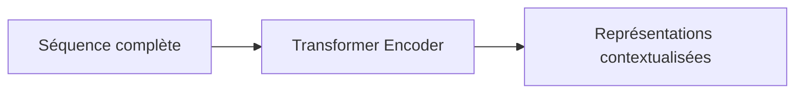

Dans un encoder, la self-attention est généralement **bidirectionnelle**.

Cela signifie que chaque token peut regarder :

* les tokens avant lui ;
* les tokens après lui ;
* lui-même.

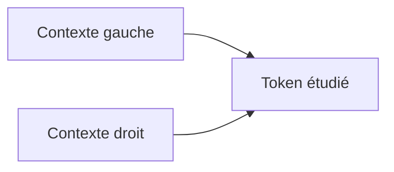

Cette bidirectionnalité rend les modèles encoder-only très adaptés aux tâches de compréhension.

---

## 16.4.2 Exemple : comprendre une phrase

Prenons la phrase :

```txt
L’avocat plaide devant le tribunal.
```

Le mot `avocat` est ambigu.

Il peut désigner :

* un fruit ;
* une profession juridique.

Un encoder bidirectionnel peut regarder `plaide` et `tribunal`.

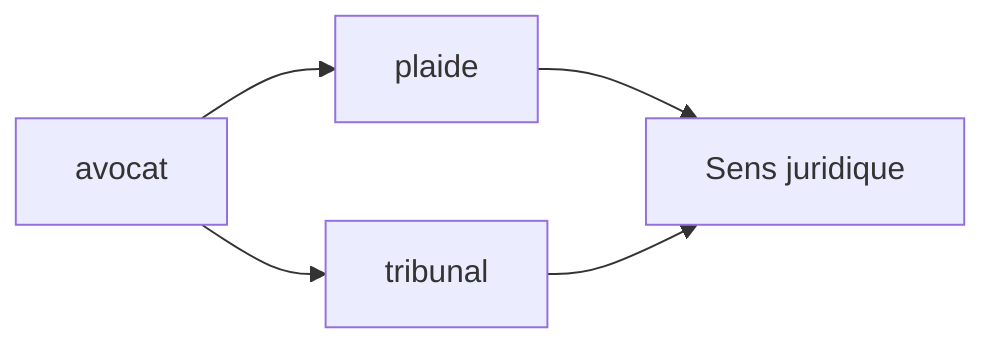

Le modèle peut donc construire une représentation contextualisée du mot `avocat`.

---

## 16.4.3 Architecture encoder-only

Un modèle encoder-only empile plusieurs blocs encoder.

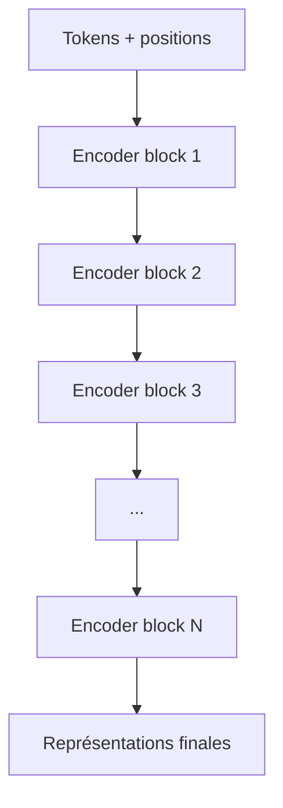

Chaque bloc contient :

* multi-head self-attention bidirectionnelle ;
* feed-forward network ;
* résidus ;
* normalisation.

Il n’y a pas de decoder.

Il n’y a pas de cross-attention.

Il n’y a pas de masque causal.

---

## 16.4.4 Tâches typiques des encoder-only

Les modèles encoder-only sont adaptés à des tâches comme :

* classification de texte ;
* analyse de sentiment ;
* reconnaissance d’entités nommées ;
* extraction d’information ;
* recherche sémantique ;
* similarité entre phrases ;
* question-réponse extractive ;
* scoring de pertinence.

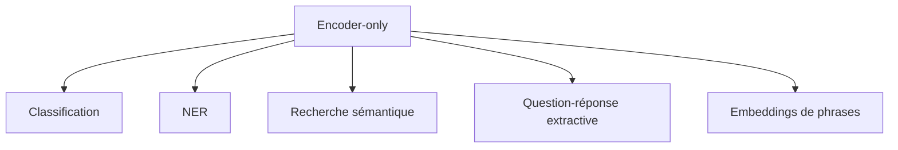

Ils sont excellents quand nous voulons représenter ou comprendre un texte.

---

## 16.4.5 BERT comme exemple majeur

Le modèle emblématique de la famille encoder-only est **BERT**.

BERT signifie :

```txt
Bidirectional Encoder Representations from Transformers
```

Il utilise uniquement l’encoder du Transformer.

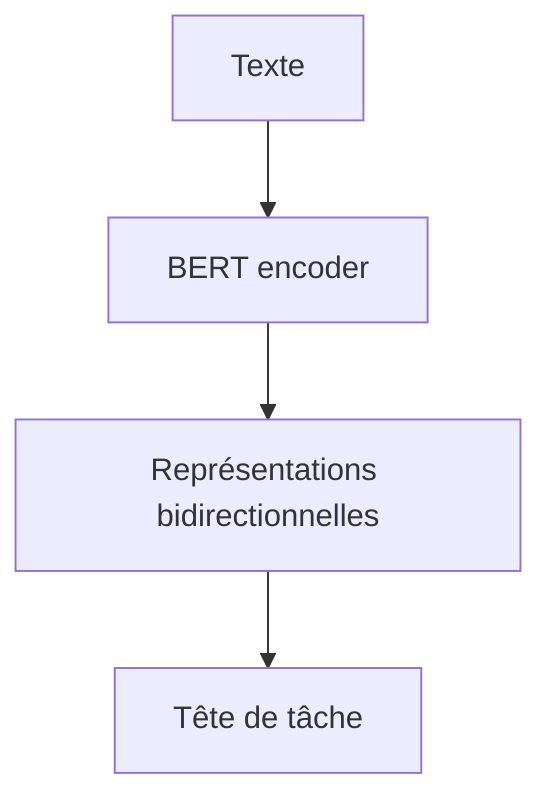

BERT est conçu pour produire des représentations riches d’un texte complet.

---

## 16.4.6 Le token `[CLS]`

Dans BERT, on ajoute souvent un token spécial au début :

```txt
[CLS] Le film est excellent.
```

Après passage dans l’encoder, la représentation du token `[CLS]` peut servir à classifier toute la phrase.

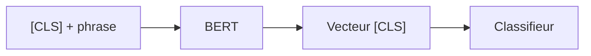

Par exemple, pour l’analyse de sentiment :

```txt
positif / négatif
```

le classifieur utilise la représentation finale de `[CLS]`.

---

## 16.4.7 Masked Language Modeling

BERT n’est pas entraîné à prédire uniquement le prochain token.

Il est entraîné notamment avec une tâche appelée **Masked Language Modeling**.

On masque certains tokens dans la phrase :

```txt
Le chat [MASK] sur le canapé.
```

Le modèle doit prédire le token masqué :

```txt
dort
```

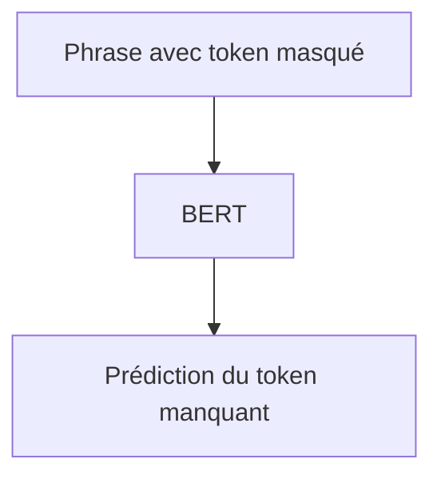

Cette tâche permet au modèle d’utiliser le contexte gauche et droit.

---

## 16.4.8 Pourquoi BERT n’est pas naturellement génératif

BERT peut prédire des tokens masqués, mais il n’est pas naturellement conçu pour générer un texte de gauche à droite.

Il n’utilise pas de masque causal.

Il regarde toute la séquence en même temps.

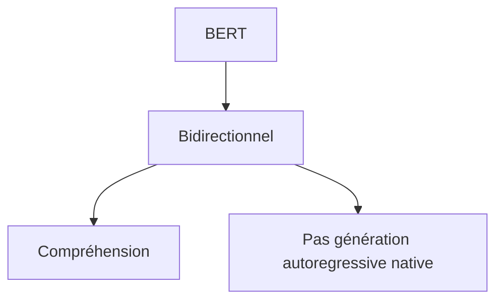

Pour générer du texte fluide token par token, les modèles decoder-only sont plus adaptés.

---

## 16.5 Famille 2 : les modèles decoder-only

## 16.5.1 Principe général

Un modèle **decoder-only** utilise uniquement des blocs de type decoder causal.

Il reçoit un contexte et prédit le prochain token.

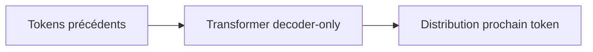

La tâche fondamentale est :

$$
P(x_t \mid x_{<t})
$$

C’est-à-dire :

> prédire le prochain token à partir des tokens précédents.

---

## 16.5.2 Le masque causal

Dans un decoder-only, chaque token ne peut regarder que les tokens précédents et lui-même.

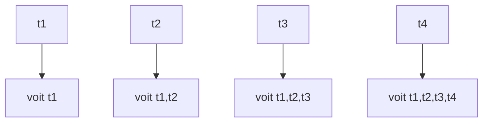

Ce masque causal empêche le modèle de voir le futur.

C’est la base de la génération autoregressive.

---

## 16.5.3 Architecture decoder-only

Un modèle decoder-only empile des blocs causaux.

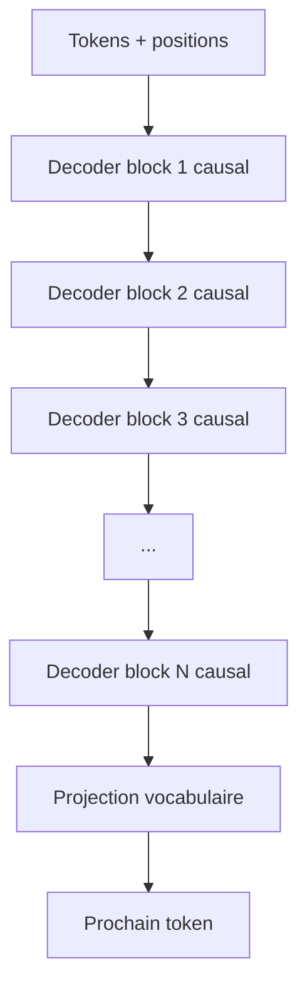

Dans un GPT standard, il n’y a pas d’encoder séparé.

Il n’y a donc pas de cross-attention classique vers une source encodée.

Le contexte est simplement placé dans la séquence d’entrée.

---

## 16.5.4 GPT comme exemple majeur

La famille GPT est l’exemple emblématique des modèles decoder-only.

GPT signifie :

```txt
Generative Pretrained Transformer
```

Ces modèles sont entraînés à prédire le prochain token sur de très grands corpus.

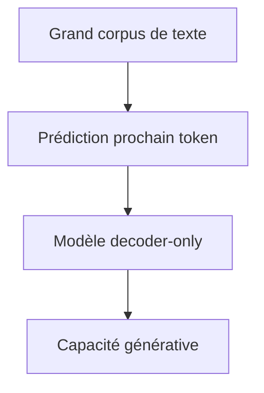

Le principe est simple, mais extrêmement puissant.

---

## 16.5.5 Génération autoregressive

La génération se fait token par token.

Exemple :

```txt
Entrée : Le chat
Prédiction : dort
Nouvelle entrée : Le chat dort
Prédiction : sur
Nouvelle entrée : Le chat dort sur
Prédiction : le
```

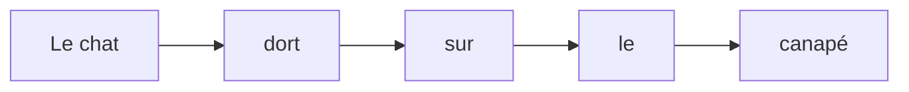

Chaque nouveau token devient une partie du contexte pour prédire le suivant.

---

## 16.5.6 Pourquoi les decoder-only sont adaptés au dialogue

Un dialogue peut être vu comme une longue séquence de tokens.

Exemple :

```txt
Utilisateur : Explique-moi les Transformers.
Assistant :
```

Le modèle prédit la suite :

```txt
Les Transformers sont des architectures...
```

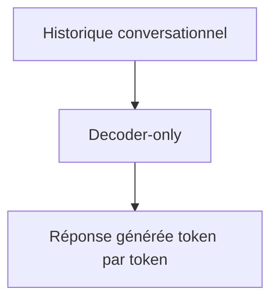

Nous pouvons donc formater beaucoup de tâches comme de la continuation de texte.

C’est une raison majeure du succès des modèles decoder-only dans les assistants conversationnels.

---

## 16.5.7 Instruction tuning

Un modèle decoder-only préentraîné sur du texte brut peut ensuite être adapté pour suivre des instructions.

Exemple :

```txt
Instruction : Résume ce texte en 5 lignes.
Réponse :
```

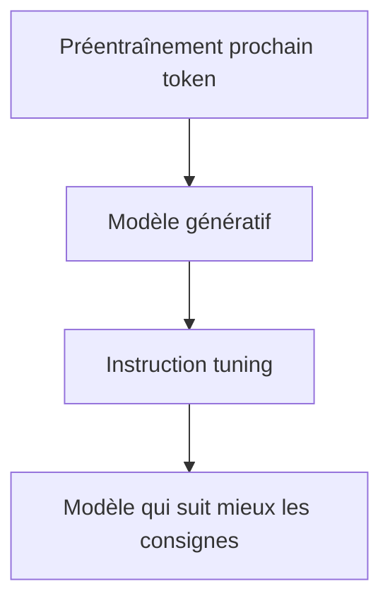

L’instruction tuning ne change pas nécessairement l’architecture.

Il change les données et l’objectif d’adaptation.

---

## 16.5.8 Avantages des decoder-only

Les modèles decoder-only ont plusieurs avantages :

* architecture simple ;
* excellent pour la génération ;
* même objectif pour préentraînement et génération ;
* compatible avec le dialogue ;
* facile à formater en prompt ;
* très scalable.

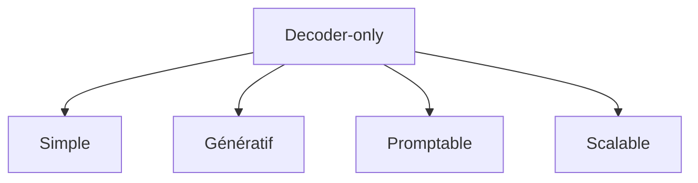

C’est pourquoi cette famille domine une grande partie des LLM conversationnels modernes.

---

## 16.5.9 Limites des decoder-only

Les decoder-only ont aussi des limites :

* génération séquentielle lente ;
* besoin d’un KV cache en inférence ;
* difficulté à utiliser très efficacement de très longs contextes ;
* possibilité d’hallucination ;
* absence d’encoder séparé pour structurer une entrée source ;
* coût important à grande échelle.

```mermaid
flowchart TD
    A["Decoder-only"] --> B["Inférence token par token"]
    A --> C["KV cache important"]
    A --> D["Risque hallucination"]
    A --> E["Coût élevé"]
```

Ils sont très puissants, mais pas magiques.

---

## 16.6 Famille 3 : les modèles encoder-decoder

## 16.6.1 Principe général

Les modèles **encoder-decoder** conservent l’architecture complète du Transformer original.

Ils utilisent :

* un encoder pour lire l’entrée ;
* un decoder pour générer la sortie.

```mermaid
flowchart LR
    A["Entrée"] --> B["Encoder"]
    B --> C["Mémoire encodée"]
    C --> D["Decoder"]
    E["Sortie décalée"] --> D
    D --> F["Sortie générée"]
```

Cette famille est particulièrement adaptée aux tâches de transformation.

---

## 16.6.2 Tâches typiques

Les modèles encoder-decoder sont bien adaptés à :

* traduction automatique ;
* résumé automatique ;
* reformulation ;
* correction grammaticale ;
* transformation de style ;
* génération conditionnée par un document ;
* text-to-text général.

```mermaid
flowchart TD
    A["Encoder-decoder"] --> B["Traduction"]
    A --> C["Résumé"]
    A --> D["Correction"]
    A --> E["Reformulation"]
    A --> F["Text-to-text"]
```

Ces tâches ont une entrée clairement séparée de la sortie.

---

## 16.6.3 Exemple : résumé

Entrée :

```txt
Un long article de presse...
```

Sortie :

```txt
Résumé en quelques phrases...
```

L’encoder lit le document.

Le decoder génère le résumé.

```mermaid
flowchart TD
    A["Document long"] --> B["Encoder"]
    B --> C["Mémoire du document"]
    C --> D["Decoder"]
    D --> E["Résumé"]
```

La cross-attention permet au decoder de revenir vers l’entrée pendant qu’il génère.

---

## 16.6.4 Exemple : traduction

Source :

```txt
The black cat sleeps.
```

Cible :

```txt
Le chat noir dort.
```

```mermaid
flowchart LR
    A["The black cat sleeps"] --> B["Encoder"]
    B --> C["Mémoire source"]
    C --> D["Decoder"]
    D --> E["Le chat noir dort"]
```

C’est exactement le cas d’usage du Transformer original.

---

## 16.6.5 T5 comme exemple majeur

T5 est un modèle encoder-decoder moderne important.

Son idée centrale est :

```txt
Text-to-Text Transfer Transformer
```

Toutes les tâches sont formulées comme :

```txt
texte en entrée → texte en sortie
```

Exemples :

```txt
translate English to French: The cat sleeps.
→ Le chat dort.
```

```txt
summarize: [document]
→ [résumé]
```

```mermaid
flowchart TD
    A["Tâche formulée en texte"] --> B["T5 encoder"]
    B --> C["T5 decoder"]
    C --> D["Sortie textuelle"]
```

Cette formulation unifie beaucoup de tâches.

---

## 16.6.6 BART comme autre exemple

BART est aussi un modèle encoder-decoder.

Il est entraîné comme un autoencodeur débruiteur.

On corrompt un texte, puis le modèle apprend à reconstruire le texte original.

```mermaid
flowchart LR
    A["Texte corrompu"] --> B["Encoder"]
    B --> C["Decoder"]
    C --> D["Texte reconstruit"]
```

BART est particulièrement utile pour :

* résumé ;
* génération conditionnée ;
* correction ;
* reformulation.

---

## 16.6.7 Avantages des encoder-decoder

Les architectures encoder-decoder ont plusieurs avantages :

* séparation claire entre entrée et sortie ;
* très adaptées aux tâches de transformation ;
* cross-attention explicite ;
* bonne exploitation d’une source structurée ;
* génération conditionnée naturellement.

```mermaid
flowchart TD
    A["Encoder-decoder"] --> B["Entrée clairement encodée"]
    A --> C["Sortie générée séparément"]
    A --> D["Cross-attention explicite"]
```

Cette séparation est très élégante pour les tâches sequence-to-sequence.

---

## 16.6.8 Limites des encoder-decoder

Les encoder-decoder sont plus complexes que les decoder-only.

Ils contiennent :

* un encoder ;
* un decoder ;
* de la cross-attention ;
* plusieurs types de masques.

```mermaid
flowchart TD
    A["Encoder-decoder"] --> B["Architecture plus complexe"]
    A --> C["Coût encoder + decoder"]
    A --> D["Moins simple pour dialogue libre"]
```

Pour le dialogue généraliste, les decoder-only sont souvent plus simples à utiliser.

Mais pour les tâches avec entrée-sortie bien séparées, les encoder-decoder restent très puissants.

---

## 16.7 Comparaison synthétique des trois familles

## 16.7.1 Tableau de comparaison

| Famille         | Attention                                    | Génération | Tâches typiques               | Exemples |
| --------------- | -------------------------------------------- | ---------- | ----------------------------- | -------- |
| Encoder-only    | Bidirectionnelle                             | Non native | Compréhension, classification | BERT     |
| Decoder-only    | Causale                                      | Oui        | Génération, chat, complétion  | GPT      |
| Encoder-decoder | Bidirectionnelle + causale + cross-attention | Oui        | Traduction, résumé            | T5, BART |

```mermaid
flowchart TD
    A["Transformer"] --> B["Encoder-only : comprendre"]
    A --> C["Decoder-only : générer"]
    A --> D["Encoder-decoder : transformer"]
```

---

## 16.7.2 Quelle famille choisir ?

Nous pouvons raisonner ainsi :

Si nous voulons classifier ou comprendre un texte :

```txt
encoder-only
```

Si nous voulons générer librement du texte :

```txt
decoder-only
```

Si nous voulons transformer une entrée en une sortie :

```txt
encoder-decoder
```

```mermaid
flowchart TD
    A["Problème"] --> B{"But principal ?"}
    B -->|"Comprendre"| C["Encoder-only"]
    B -->|"Générer"| D["Decoder-only"]
    B -->|"Transformer entrée en sortie"| E["Encoder-decoder"]
```

Cette règle n’est pas absolue, mais elle est très utile.

---

## 16.8 Transformers pour la vision

## 16.8.1 L’idée des Vision Transformers

Les Transformers ne sont pas limités au texte.

Pour appliquer un Transformer à une image, nous pouvons découper l’image en patches.

Chaque patch devient un token visuel.

```mermaid
flowchart LR
    A["Image"] --> B["Découpage en patches"]
    B --> C["Patch embeddings"]
    C --> D["Transformer Encoder"]
    D --> E["Classification / représentation"]
```

C’est l’idée des **Vision Transformers**, souvent abrégés **ViT**.

---

## 16.8.2 Image comme séquence

Une image peut être vue comme une séquence de morceaux.

Par exemple, une image est découpée en patches de (16 \times 16) pixels.

Chaque patch est projeté en vecteur.

```txt
patch 1, patch 2, patch 3, ...
```

```mermaid
flowchart TD
    A["Image 224x224"] --> B["Patches 16x16"]
    B --> C["196 patches"]
    C --> D["196 tokens visuels"]
```

Ensuite, le Transformer traite ces tokens comme une séquence.

---

## 16.8.3 Pourquoi cela fonctionne ?

L’attention peut relier des régions éloignées de l’image.

Un patch en haut à gauche peut interagir avec un patch en bas à droite.

```mermaid
flowchart LR
    A["Patch haut gauche"] -. "attention" .-> B["Patch bas droite"]
```

Cela donne au modèle une vision globale.

Les CNN construisent souvent cette vision globale progressivement par empilement de couches.

Les Transformers peuvent établir des relations globales plus directement.

---

## 16.8.4 Limites des Vision Transformers

Les Vision Transformers peuvent demander beaucoup de données.

Les CNN ont des biais inductifs utiles :

* localité ;
* translation ;
* motifs visuels locaux.

Les ViT ont moins de biais inductifs, donc ils peuvent nécessiter davantage de données ou de préentraînement.

```mermaid
flowchart TD
    A["Vision Transformer"] --> B["Attention globale"]
    A --> C["Moins de biais local qu'un CNN"]
    C --> D["Besoin de données / préentraînement"]
```

Cela ne les rend pas mauvais, mais cela explique pourquoi leur succès dépend fortement de l’échelle et de l’entraînement.

---

## 16.9 Transformers multimodaux

## 16.9.1 Qu’est-ce qu’un modèle multimodal ?

Un modèle multimodal traite plusieurs types de données.

Par exemple :

* texte ;
* image ;
* audio ;
* vidéo ;
* code ;
* actions ;
* données structurées.

```mermaid
flowchart TD
    A["Texte"] --> M["Modèle multimodal"]
    B["Image"] --> M
    C["Audio"] --> M
    D["Vidéo"] --> M
    M --> E["Réponse / représentation"]
```

Les Transformers sont très adaptés au multimodal, car ils traitent des séquences de vecteurs.

---

## 16.9.2 Tout transformer en tokens

L’idée générale est :

> Transformer chaque modalité en une séquence de tokens ou d’embeddings.

Texte :

```txt
tokens textuels
```

Image :

```txt
patch tokens
```

Audio :

```txt
frames ou tokens acoustiques
```

Vidéo :

```txt
patches spatio-temporels
```

```mermaid
flowchart TD
    A["Texte"] --> T["Tokens texte"]
    B["Image"] --> I["Tokens visuels"]
    C["Audio"] --> AU["Tokens audio"]

    T --> M["Transformer"]
    I --> M
    AU --> M
```

Une fois les modalités converties en vecteurs, l’attention peut les relier.

---

## 16.9.3 Exemple : texte + image

Un modèle vision-langage peut recevoir :

```txt
Image + question textuelle
```

Exemple :

```txt
Que voit-on sur cette image ?
```

```mermaid
flowchart TD
    A["Image"] --> B["Encodeur visuel"]
    C["Question texte"] --> D["Encodeur texte / decoder"]
    B --> E["Fusion multimodale"]
    D --> E
    E --> F["Réponse"]
```

Le modèle doit aligner des informations visuelles et linguistiques.

---

## 16.9.4 Fusion précoce et fusion tardive

Il existe plusieurs manières de combiner les modalités.

### Fusion précoce

Nous mélangeons les tokens de différentes modalités tôt dans le Transformer.

```mermaid
flowchart LR
    A["Tokens texte"] --> C["Transformer commun"]
    B["Tokens image"] --> C
    C --> D["Représentation fusionnée"]
```

### Fusion tardive

Nous encodons d’abord séparément les modalités, puis nous les combinons.

```mermaid
flowchart LR
    A["Texte"] --> B["Encodeur texte"]
    C["Image"] --> D["Encodeur image"]
    B --> E["Fusion"]
    D --> E
```

Chaque approche a ses avantages.

---

## 16.10 Évolution historique simplifiée

## 16.10.1 De 2017 aux LLM modernes

Nous pouvons résumer l’évolution ainsi :

```mermaid
timeline
    title Évolution simplifiée des Transformers
    2017 : Transformer original encoder-decoder
    2018 : BERT encoder-only
    2018-2020 : GPT decoder-only
    2019-2020 : T5 et BART encoder-decoder modernes
    2020 : Vision Transformers
    2020s : LLM multimodaux et modèles géants
```

Le Transformer original a donc donné naissance à plusieurs branches.

---

## 16.10.2 Trois héritages majeurs

Nous pouvons retenir trois héritages principaux :

```mermaid
flowchart TD
    A["Transformer 2017"] --> B["BERT : comprendre"]
    A --> C["GPT : générer"]
    A --> D["T5/BART : transformer"]
```

BERT pousse l’idée de représentation bidirectionnelle.

GPT pousse l’idée de génération autoregressive.

T5 et BART conservent la logique encoder-decoder pour les tâches text-to-text.

---

## 16.11 Comparaison avec le Transformer original

## 16.11.1 Transformer original

Le Transformer original :

```txt
encoder + decoder
```

Il est conçu pour :

```txt
source → cible
```

```mermaid
flowchart LR
    A["Source"] --> B["Encoder"]
    B --> C["Decoder"]
    D["Cible décalée"] --> C
    C --> E["Cible générée"]
```

---

## 16.11.2 BERT simplifie vers l’encoder

BERT garde surtout :

```txt
encoder
```

et supprime :

```txt
decoder autoregressif
```

```mermaid
flowchart LR
    A["Texte complet"] --> B["Encoder bidirectionnel"]
    B --> C["Représentations"]
```

---

## 16.11.3 GPT simplifie vers le decoder causal

GPT garde surtout :

```txt
decoder causal
```

et supprime :

```txt
encoder séparé + cross-attention
```

```mermaid
flowchart LR
    A["Contexte précédent"] --> B["Decoder causal"]
    B --> C["Prochain token"]
```

---

## 16.11.4 T5 conserve encoder-decoder

T5 conserve la structure :

```txt
encoder + decoder
```

mais reformule toutes les tâches en :

```txt
text-to-text
```

```mermaid
flowchart LR
    A["Instruction + entrée"] --> B["Encoder"]
    B --> C["Decoder"]
    C --> D["Sortie texte"]
```

---

## 16.12 Les modèles embedding

## 16.12.1 Encoder-only pour embeddings

Beaucoup de modèles d’embeddings utilisent une structure encoder-only.

Ils transforment un texte en vecteur.

```mermaid
flowchart LR
    A["Texte"] --> B["Encoder"]
    B --> C["Pooling"]
    C --> D["Vecteur embedding"]
```

Ce vecteur peut ensuite être utilisé pour :

* recherche sémantique ;
* clustering ;
* RAG ;
* similarité ;
* déduplication ;
* classification.

---

## 16.12.2 Pooling

Comme l’encoder produit un vecteur par token, nous devons souvent agréger ces vecteurs.

Méthodes possibles :

* utiliser `[CLS]` ;
* faire une moyenne ;
* utiliser un pooling attentionnel.

```mermaid
flowchart TD
    A["Vecteurs tokens"] --> B["Pooling"]
    B --> C["Vecteur phrase"]
```

Le choix du pooling influence la qualité de l’embedding final.

---

## 16.13 Les modèles de reranking

## 16.13.1 Rôle du reranker

Dans un système de recherche ou de RAG, un reranker évalue la pertinence d’un document par rapport à une requête.

```mermaid
flowchart LR
    A["Requête"] --> C["Reranker"]
    B["Document candidat"] --> C
    C --> D["Score de pertinence"]
```

Les rerankers utilisent souvent des architectures encoder-only ou encoder-cross.

Ils lisent ensemble la requête et le document.

---

## 16.13.2 Pourquoi pas simplement un embedding ?

Un modèle d’embedding encode souvent séparément :

```txt
requête
document
```

Puis compare les vecteurs.

Un reranker peut lire les deux ensemble :

```txt
[requête] + [document]
```

Il peut donc capturer des interactions plus fines.

```mermaid
flowchart TD
    A["Embedding search"] --> B["Encode séparément"]
    C["Reranking"] --> D["Encode ensemble"]
    D --> E["Pertinence plus fine"]
```

C’est plus coûteux, mais souvent plus précis.

---

## 16.14 Les modèles de code

## 16.14.1 Transformers pour le code

Les Transformers sont aussi utilisés pour le code.

Le code est une séquence de tokens, mais avec une structure particulière :

* syntaxe ;
* indentation ;
* blocs ;
* dépendances de variables ;
* appels de fonctions ;
* imports ;
* types.

```mermaid
flowchart TD
    A["Code source"] --> B["Tokenisation"]
    B --> C["Transformer"]
    C --> D["Complétion / explication / génération"]
```

Les modèles de code sont souvent decoder-only pour la complétion.

Mais des encoder-only ou encoder-decoder peuvent aussi être utilisés pour analyse, recherche ou transformation de code.

---

## 16.14.2 Exemple de complétion

Entrée :

```python
def add(a, b):
    return
```

Le modèle doit prédire :

```python
a + b
```

```mermaid
flowchart LR
    A["Contexte code"] --> B["Decoder-only"]
    B --> C["Suite du code"]
```

La génération de code ressemble donc à la génération de texte, mais avec des contraintes syntaxiques plus fortes.

---

## 16.15 Modèles généralistes et modèles spécialisés

## 16.15.1 Modèles généralistes

Les grands modèles decoder-only modernes sont souvent généralistes.

Ils savent faire :

* rédaction ;
* résumé ;
* code ;
* question-réponse ;
* traduction ;
* raisonnement ;
* dialogue.

```mermaid
flowchart TD
    A["LLM généraliste"] --> B["Texte"]
    A --> C["Code"]
    A --> D["Dialogue"]
    A --> E["Résumé"]
    A --> F["Traduction"]
```

Ils y parviennent en formulant beaucoup de tâches comme de la génération conditionnée par un prompt.

---

## 16.15.2 Modèles spécialisés

D’autres modèles sont spécialisés :

* modèle d’embedding ;
* modèle de traduction ;
* modèle de reranking ;
* modèle de vision ;
* modèle audio ;
* modèle de classification.

```mermaid
flowchart TD
    A["Modèles spécialisés"] --> B["Embedding"]
    A --> C["Reranking"]
    A --> D["Traduction"]
    A --> E["Vision"]
    A --> F["Audio"]
```

Un modèle spécialisé peut être plus petit, plus rapide et plus fiable pour une tâche précise.

---

## 16.16 Erreurs fréquentes

## 16.16.1 Croire que tous les Transformers sont des GPT

GPT est une famille de Transformers, mais tous les Transformers ne sont pas des GPT.

```mermaid
flowchart TD
    A["Transformers"] --> B["GPT"]
    A --> C["BERT"]
    A --> D["T5"]
    A --> E["ViT"]
```

GPT est decoder-only.

BERT est encoder-only.

T5 est encoder-decoder.

ViT est un Transformer appliqué à des patches d’image.

---

## 16.16.2 Croire que BERT et GPT font la même chose

BERT et GPT reposent tous deux sur des Transformers, mais leurs objectifs sont différents.

| Modèle | Architecture | Objectif      |
| ------ | ------------ | ------------- |
| BERT   | Encoder-only | Compréhension |
| GPT    | Decoder-only | Génération    |

```mermaid
flowchart LR
    A["BERT"] --> B["Comprendre un texte complet"]
    C["GPT"] --> D["Générer la suite"]
```

Ils ne sont donc pas interchangeables sans adaptation.

---

## 16.16.3 Croire que l’encoder-decoder est dépassé

Même si les decoder-only dominent beaucoup d’usages conversationnels, les encoder-decoder restent très utiles.

Ils sont particulièrement bons pour :

* traduction ;
* résumé ;
* reformulation ;
* tâches avec entrée et sortie bien séparées.

```mermaid
flowchart TD
    A["Encoder-decoder"] --> B["Toujours pertinent"]
    B --> C["Traduction"]
    B --> D["Résumé"]
    B --> E["Text-to-text contrôlé"]
```

Une architecture n’annule pas les autres.

Chaque famille a son domaine naturel.

---

## 16.16.4 Croire que le multimodal est une architecture totalement différente

Les modèles multimodaux modernes utilisent souvent les mêmes principes :

* embeddings ;
* tokens ;
* attention ;
* couches Transformer ;
* projections.

La différence est que les tokens ne viennent plus seulement du texte.

```mermaid
flowchart TD
    A["Texte"] --> D["Tokens"]
    B["Image"] --> D
    C["Audio"] --> D
    D --> E["Transformer"]
```

Le cœur conceptuel reste proche.

---

## 16.17 Synthèse des architectures

## 16.17.1 Schéma global

```mermaid
flowchart TD
    A["Transformer"] --> B["Encoder-only"]
    A --> C["Decoder-only"]
    A --> D["Encoder-decoder"]
    A --> E["Vision"]
    A --> F["Multimodal"]

    B --> B1["BERT : compréhension"]
    C --> C1["GPT : génération"]
    D --> D1["T5/BART : text-to-text"]
    E --> E1["ViT : patches image"]
    F --> F1["Texte + image + audio"]
```

---

## 16.17.2 Lecture fonctionnelle

Nous pouvons retenir :

```txt
Encoder-only    = comprendre
Decoder-only    = générer
Encoder-decoder = transformer
Vision          = traiter des patches visuels
Multimodal      = relier plusieurs types de tokens
```

```mermaid
flowchart LR
    A["Comprendre"] --> B["Encoder-only"]
    C["Générer"] --> D["Decoder-only"]
    E["Transformer"] --> F["Encoder-decoder"]
    G["Voir"] --> H["Vision Transformer"]
    I["Relier modalités"] --> J["Multimodal Transformer"]
```

---

## 16.18 Résumé du chapitre

Nous avons étudié les grandes familles de Transformers.

Le Transformer original est une architecture **encoder-decoder**, conçue pour transformer une séquence source en séquence cible.

Depuis, trois grandes familles se sont imposées.

Les modèles **encoder-only**, comme BERT, utilisent une self-attention bidirectionnelle et sont très adaptés aux tâches de compréhension, de classification, d’extraction et d’embedding.

Les modèles **decoder-only**, comme GPT, utilisent une self-attention causale et sont particulièrement adaptés à la génération autoregressive, au dialogue, à la complétion et aux LLM généralistes.

Les modèles **encoder-decoder**, comme T5 ou BART, conservent la séparation entre entrée et sortie, et restent très efficaces pour la traduction, le résumé et les tâches text-to-text.

Nous avons aussi vu que les Transformers se sont étendus à la vision, au code et au multimodal.

Le point central est :

> Le Transformer n’est pas une seule architecture figée, mais une famille de modèles construits autour de l’attention, adaptée selon la tâche : comprendre, générer, transformer ou relier plusieurs modalités.

---

## 16.19 Questions de compréhension

### 16.19.1 Question 1

Quelles sont les trois grandes familles de Transformers textuels ?

Réponse attendue :

* encoder-only ;
* decoder-only ;
* encoder-decoder.

### 16.19.2 Question 2

À quelles tâches les modèles encoder-only sont-ils particulièrement adaptés ?

Réponse attendue : aux tâches de compréhension, classification, extraction, embeddings et recherche sémantique.

### 16.19.3 Question 3

Pourquoi BERT est-il bidirectionnel ?

Réponse attendue : parce que son encoder permet à chaque token de regarder à gauche et à droite dans la séquence complète.

### 16.19.4 Question 4

Pourquoi GPT est-il decoder-only ?

Réponse attendue : parce qu’il est conçu pour prédire le prochain token à partir du contexte précédent, avec une attention causale.

### 16.19.5 Question 5

Quelle est la principale différence entre BERT et GPT ?

Réponse attendue : BERT est encoder-only et sert surtout à comprendre ; GPT est decoder-only et sert surtout à générer.

### 16.19.6 Question 6

À quoi sert une architecture encoder-decoder ?

Réponse attendue : à transformer une entrée en une sortie, comme dans la traduction, le résumé ou la reformulation.

### 16.19.7 Question 7

Pourquoi T5 est-il appelé text-to-text ?

Réponse attendue : parce qu’il formule toutes les tâches comme une transformation d’un texte d’entrée vers un texte de sortie.

### 16.19.8 Question 8

Comment un Vision Transformer traite-t-il une image ?

Réponse attendue : il découpe l’image en patches, transforme chaque patch en embedding, puis traite la séquence de patches avec un Transformer.

### 16.19.9 Question 9

Pourquoi les Transformers sont-ils adaptés au multimodal ?

Réponse attendue : parce qu’on peut transformer plusieurs types de données en séquences d’embeddings et les traiter avec l’attention.

### 16.19.10 Question 10

Pourquoi ne faut-il pas dire que tous les Transformers sont des GPT ?

Réponse attendue : parce que GPT n’est qu’une famille decoder-only parmi d’autres ; il existe aussi BERT, T5, BART, ViT et des Transformers multimodaux.

---

## 16.20 Transition vers le chapitre 17

Nous avons maintenant cartographié les grandes familles de Transformers.

Dans le chapitre suivant, nous allons approfondir les modèles **encoder-only**, en particulier **BERT**.

Nous verrons :

* pourquoi BERT utilise une attention bidirectionnelle ;
* comment fonctionne le Masked Language Modeling ;
* le rôle du token `[CLS]` ;
* le fine-tuning pour la classification ;
* l’extraction d’entités ;
* les embeddings de phrases ;
* les limites de BERT pour la génération ;
* l’héritage de BERT dans les modèles modernes de compréhension.

---
> [!info] Livre « Les transformers » — chapitre 16/30
> [[Les transformers — Sommaire|Sommaire]] · [[Les transformers — 15 — Complexité algorithmique des Transformers|← 15 — Complexité algorithmique des Transformers]] · [[Les transformers — 17 — Modèles encoder-only BERT et la compréhension bidirectionnelle|17 — Modèles encoder-only BERT et la compréhension bidirectionnelle →]]
