> [!info] Livre « Les transformers » — chapitre 17/30
> [[Les transformers — Sommaire|Sommaire]] · [[Les transformers — 16 — Grandes familles de Transformers encoder-only, decoder-only et encoder-decoder|← 16 — Grandes familles de Transformers encoder-only, decoder-only et encoder-decoder]] · [[Les transformers — 18 — Modèles decoder-only GPT et la génération autoregressive|18 — Modèles decoder-only GPT et la génération autoregressive →]]

# Chapitre 17 — Modèles encoder-only : BERT et la compréhension bidirectionnelle
## 17.1 Objectif du chapitre

Dans le chapitre précédent, nous avons distingué les grandes familles de Transformers :

* **encoder-only** ;
* **decoder-only** ;
* **encoder-decoder** ;
* Transformers pour la vision ;
* Transformers multimodaux.

Dans ce chapitre, nous allons approfondir la première famille : les modèles **encoder-only**.

Le modèle emblématique de cette famille est **BERT** :

```txt
Bidirectional Encoder Representations from Transformers
```

BERT repose sur une idée simple mais puissante :

> Utiliser uniquement l’encoder du Transformer pour construire des représentations bidirectionnelles profondes du texte.

Nous allons étudier :

* l’architecture encoder-only ;
* la self-attention bidirectionnelle ;
* le préentraînement de BERT ;
* le Masked Language Modeling ;
* le rôle du token `[CLS]` ;
* le fine-tuning pour la classification ;
* l’extraction d’entités ;
* les embeddings de phrases ;
* les limites de BERT pour la génération ;
* l’héritage de BERT dans les modèles modernes.

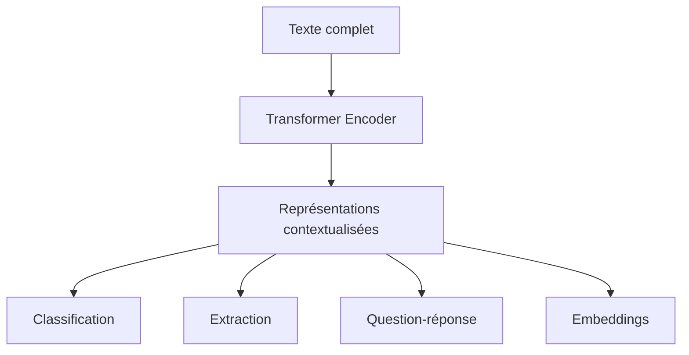

---

## 17.2 Rappel : qu’est-ce qu’un modèle encoder-only ?

Un modèle encoder-only utilise uniquement la partie **encoder** du Transformer.

Il n’utilise pas de decoder autoregressif.

Il ne génère pas naturellement du texte token par token.

Il sert surtout à **représenter** une séquence complète.

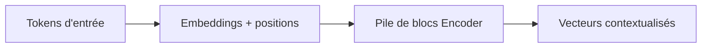

Chaque token de sortie possède une représentation qui dépend de l’ensemble de la séquence d’entrée.

Si l’entrée contient $T$ tokens, la sortie contient aussi $T$ vecteurs.

$$
X \in \mathbb{R}^{B \times T \times d_{model}}
$$

$$
H \in \mathbb{R}^{B \times T \times d_{model}}
$$

Le modèle conserve donc une représentation par position.

---

## 17.3 La self-attention bidirectionnelle

La caractéristique principale d’un encoder-only est la self-attention **bidirectionnelle**.

Cela signifie que chaque token peut regarder :

* les tokens à sa gauche ;
* les tokens à sa droite ;
* lui-même.

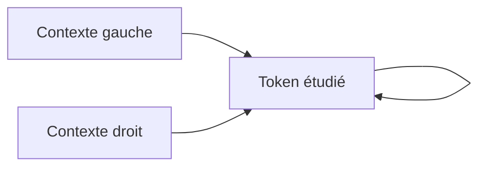

Contrairement à un decoder causal, il n’y a pas de masque interdisant le futur.

Dans un encoder, le texte complet est déjà connu.

Le modèle peut donc utiliser toute la phrase pour comprendre chaque token.

---

## 17.4 Exemple de compréhension bidirectionnelle

Prenons la phrase :

```txt
Il a déposé son argent à la banque avant de rentrer chez lui.
```

Le mot `banque` peut avoir plusieurs sens :

* établissement financier ;
* bord d’une rivière ;
* autre sens spécialisé.

Dans cette phrase, le modèle peut regarder :

```txt
argent
déposé
chez lui
```

et comprendre que `banque` désigne probablement un établissement financier.

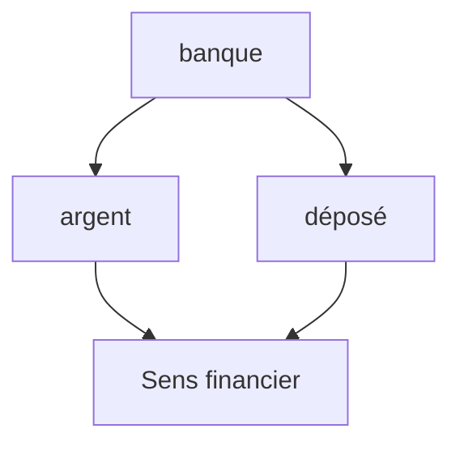

Dans une autre phrase :

```txt
La barque s’est échouée sur la banque de sable.
```

le contexte `barque` et `sable` oriente vers un autre sens.

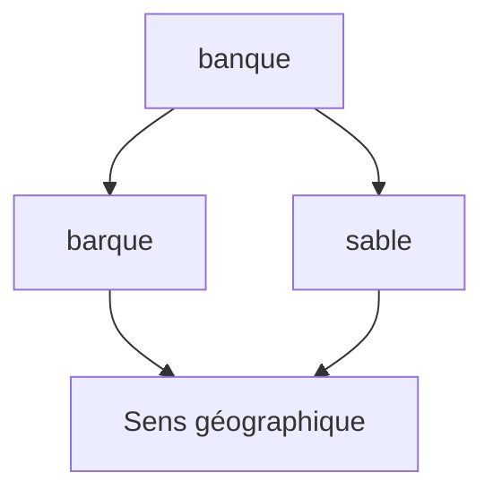

La bidirectionnalité est donc très utile pour la désambiguïsation.

---

## 17.5 Pourquoi la bidirectionnalité est utile pour comprendre

Comprendre un mot ou une phrase demande souvent de regarder ce qui vient après.

Exemple :

```txt
Le patient a été examiné par l’avocat...
```

Cette phrase semble étrange, car `avocat` peut être un métier ou un fruit, mais le contexte précédent et suivant permet de décider.

Autre exemple :

```txt
L’avocat était mûr.
```

Le mot `mûr` arrive après `avocat` et permet de comprendre qu’il s’agit du fruit.

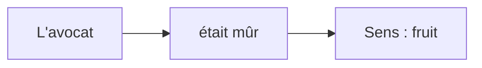

Un modèle causal de gauche à droite ne pourrait pas utiliser les mots futurs pour représenter les tokens précédents pendant la lecture.

Un encoder bidirectionnel le peut.

---

## 17.6 Architecture générale de BERT

BERT est construit comme une pile de blocs encoder Transformer.

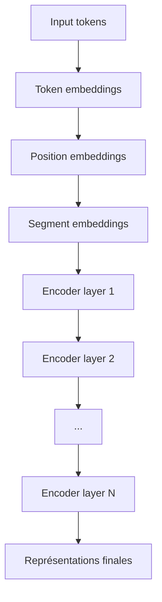

Chaque couche contient :

* multi-head self-attention bidirectionnelle ;
* feed-forward network ;
* connexions résiduelles ;
* LayerNorm.

BERT n’a pas de decoder.

BERT n’a pas de cross-attention.

BERT ne génère pas une séquence cible comme le Transformer original.

---

## 17.7 Les entrées de BERT

BERT combine plusieurs types d’embeddings :

1. **token embeddings** ;
2. **position embeddings** ;
3. **segment embeddings**.

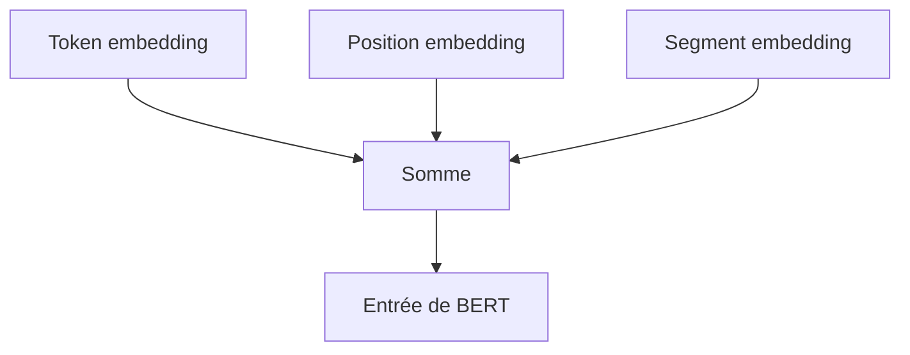

### Token embeddings

Ils représentent les tokens.

Exemple :

```txt
[CLS] Le chat dort . [SEP]
```

### Position embeddings

Ils indiquent la position des tokens dans la séquence.

### Segment embeddings

Ils indiquent à quelle phrase appartient un token, notamment quand BERT reçoit deux phrases.

Exemple :

```txt
[CLS] Phrase A [SEP] Phrase B [SEP]
```

---

## 17.8 Les tokens spéciaux `[CLS]` et `[SEP]`

BERT utilise des tokens spéciaux.

Le token `[CLS]` est placé au début de la séquence.

```txt
[CLS] Le film est excellent . [SEP]
```

Le token `[SEP]` sert à séparer les segments.

```txt
[CLS] Question [SEP] Passage [SEP]
```

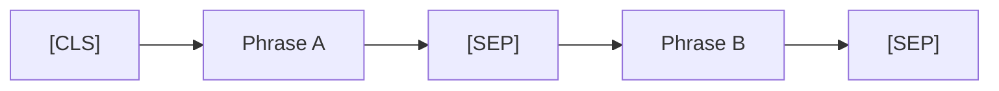

Le token `[CLS]` est souvent utilisé pour représenter toute la séquence.

Sa représentation finale peut être transmise à une couche de classification.

---

## 17.9 Le rôle du token `[CLS]`

Après passage dans BERT, chaque token possède un vecteur final.

Le vecteur du token `[CLS]` est souvent utilisé comme résumé global de l’entrée.

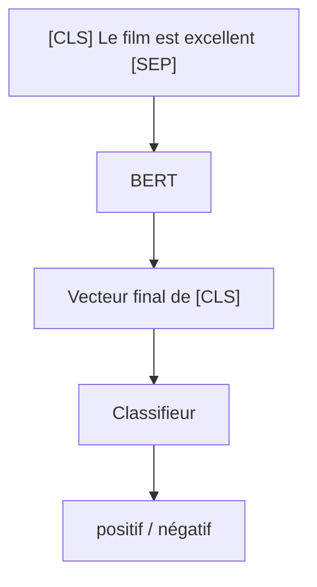

Pour une tâche de classification, on ajoute généralement une couche linéaire au-dessus de `[CLS]`.

Exemple :

```txt
Vecteur [CLS] → Linear → Softmax → Classe
```

---

## 17.10 Masked Language Modeling

BERT est préentraîné avec une tâche centrale : le **Masked Language Modeling**, ou MLM.

L’idée est de masquer certains tokens dans le texte.

Exemple :

```txt
Le chat [MASK] sur le canapé.
```

Le modèle doit prédire :

```txt
dort
```

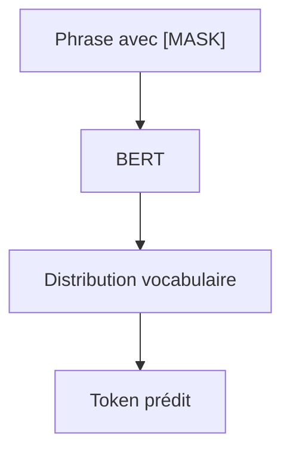

Cette tâche force le modèle à apprendre des représentations bidirectionnelles.

Pour prédire le token masqué, il utilise le contexte gauche et le contexte droit.

---

## 17.11 Pourquoi ne pas entraîner BERT comme GPT ?

GPT prédit le prochain token :

$$
P(x_t \mid x_{<t})
$$

BERT, lui, utilise le contexte complet.

Il ne peut donc pas être entraîné de la même manière sans perdre sa bidirectionnalité.

Le Masked Language Modeling permet d’utiliser :

$$
P(x_{masked} \mid contexte\ gauche,\ contexte\ droit)
$$

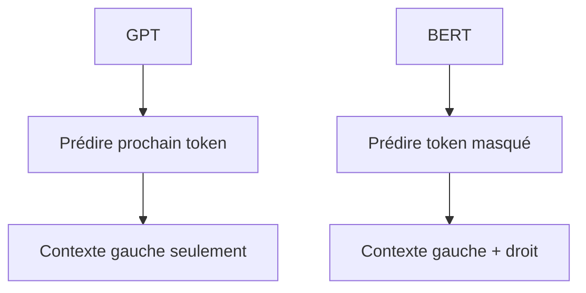

C’est la différence fondamentale entre un modèle causal et un modèle bidirectionnel.

---

## 17.12 Exemple de Masked Language Modeling

Phrase originale :

```txt
Paris est la capitale de la France.
```

Phrase masquée :

```txt
Paris est la capitale de la [MASK].
```

BERT doit prédire :

```txt
France
```

Autre exemple :

```txt
Le [MASK] dort sur le canapé.
```

BERT peut prédire :

```txt
chat
chien
bébé
```

selon le contexte.

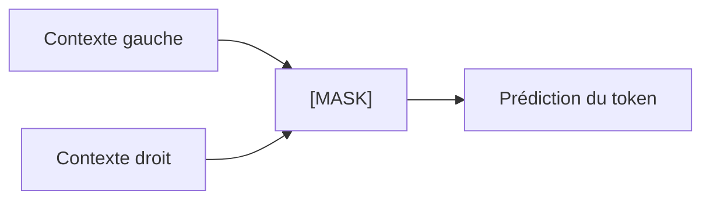

Le modèle apprend ainsi des régularités lexicales, syntaxiques et sémantiques.

---

## 17.13 Les limites du token `[MASK]`

Le token `[MASK]` est utile pour le préentraînement, mais il pose un problème.

Pendant le préentraînement, BERT voit des tokens `[MASK]`.

Pendant l’utilisation réelle, les textes ne contiennent généralement pas `[MASK]`.

Il y a donc un décalage entre préentraînement et usage.

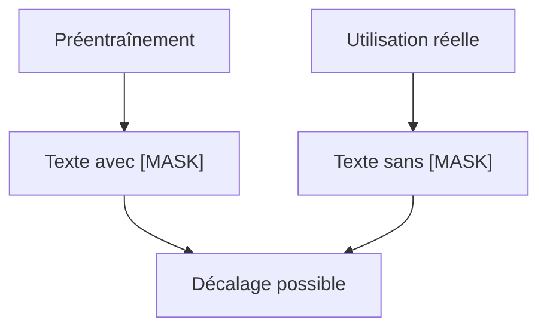

Pour réduire ce problème, le préentraînement de BERT utilise différentes stratégies : certains tokens choisis sont remplacés par `[MASK]`, certains par un token aléatoire, et certains sont laissés inchangés.

L’idée est d’éviter que le modèle s’habitue trop exclusivement au token `[MASK]`.

---

## 17.14 Next Sentence Prediction

BERT original utilise aussi une seconde tâche de préentraînement : **Next Sentence Prediction**, ou NSP.

Le modèle reçoit deux phrases A et B.

Il doit prédire si B suit réellement A dans le corpus.

Exemple positif :

```txt
A : Le chat est monté sur le canapé.
B : Il s’est endormi quelques minutes plus tard.
```

Exemple négatif :

```txt
A : Le chat est monté sur le canapé.
B : La photosynthèse dépend de la lumière.
```

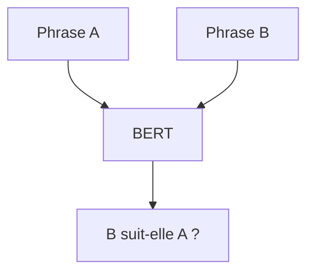

Cette tâche visait à aider le modèle à comprendre les relations entre phrases.

---

## 17.15 Limites de Next Sentence Prediction

Avec le recul, la tâche NSP a été discutée et critiquée.

Certains modèles ultérieurs, comme RoBERTa, ont supprimé NSP et amélioré d’autres aspects du préentraînement.

L’idée importante pour nous est :

> BERT original utilise MLM + NSP, mais les modèles encoder-only modernes ont souvent modifié cette recette.

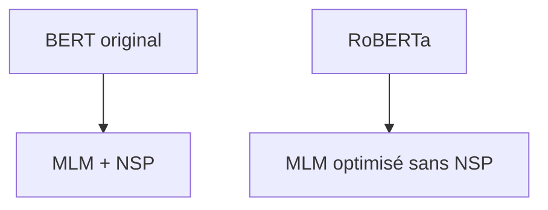

Cela montre que l’architecture et l’objectif d’entraînement sont deux choses différentes.

On peut garder l’architecture encoder-only tout en modifiant la stratégie de préentraînement.

---

## 17.16 Préentraînement puis fine-tuning

BERT suit une logique en deux étapes :

1. **préentraînement** sur de grands corpus ;
2. **fine-tuning** sur une tâche spécifique.

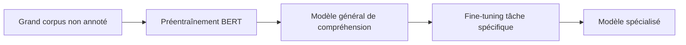

Le préentraînement apprend des représentations générales de la langue.

Le fine-tuning adapte ces représentations à une tâche concrète.

---

## 17.17 Exemple : fine-tuning pour classification

Supposons une tâche d’analyse de sentiment.

Entrée :

```txt
[CLS] Ce film est magnifique . [SEP]
```

BERT produit une représentation finale de `[CLS]`.

Puis une couche de classification prédit :

```txt
positif
négatif
neutre
```

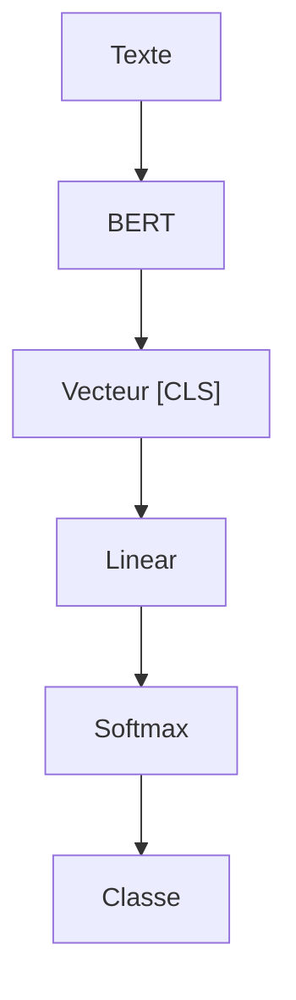

Pendant le fine-tuning, nous entraînons généralement :

* la tête de classification ;
* et souvent tout BERT en même temps.

---

## 17.18 Fine-tuning complet ou feature extraction

Il existe deux grandes façons d’utiliser BERT.

### Fine-tuning complet

Nous mettons à jour tous les paramètres de BERT sur la tâche.

```txt
BERT + tête de tâche → tout est entraîné
```

### Feature extraction

Nous gardons BERT gelé et utilisons ses représentations comme features.

```txt
BERT gelé → embeddings → classifieur
```

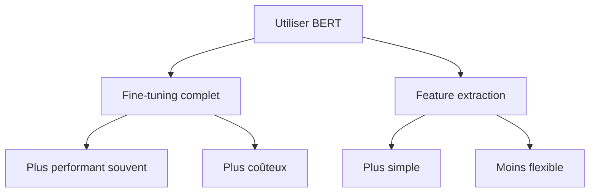

Le fine-tuning complet donne souvent de meilleurs résultats, mais demande plus de calcul et peut surapprendre si les données sont petites.

---

## 17.19 Classification de paires de phrases

BERT est aussi adapté aux tâches impliquant deux textes.

Exemple :

```txt
Phrase A : Un homme joue de la guitare.
Phrase B : Une personne fait de la musique.
```

Le modèle peut prédire :

```txt
implication
contradiction
neutre
```

Format :

```txt
[CLS] Phrase A [SEP] Phrase B [SEP]
```

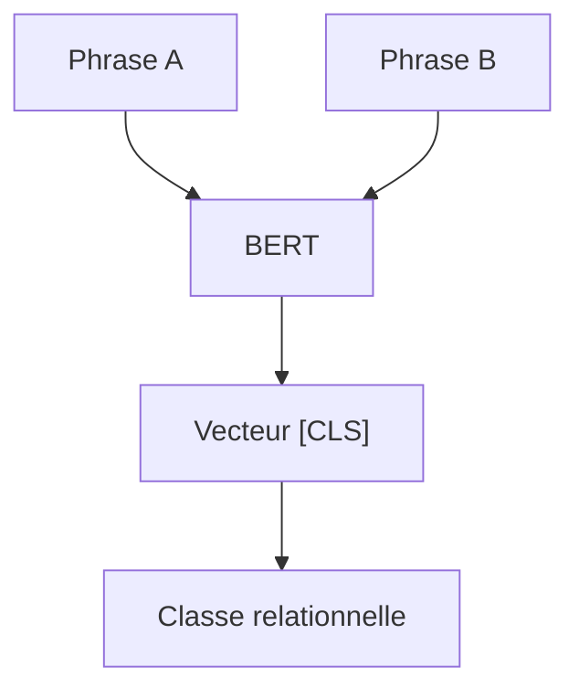

Grâce à la self-attention, les tokens de la phrase A peuvent interagir avec ceux de la phrase B.

---

## 17.20 Reconnaissance d’entités nommées

La reconnaissance d’entités nommées, ou NER, consiste à identifier des entités comme :

* personnes ;
* lieux ;
* organisations ;
* dates ;
* montants ;
* produits.

Exemple :

```txt
Marie travaille chez Airbus à Toulouse.
```

Sortie attendue :

| Token     | Label        |
| --------- | ------------ |
| Marie     | PERSON       |
| travaille | O            |
| chez      | O            |
| Airbus    | ORGANIZATION |
| à         | O            |
| Toulouse  | LOCATION     |

```mermaid
flowchart TD
    A["Tokens"] --> B["BERT"]
    B --> C["Vecteurs par token"]
    C --> D["Classifieur par token"]
    D --> E["Labels NER"]
```

Ici, on utilise la sortie de chaque token, pas seulement `[CLS]`.

---

## 17.21 Classification token par token

Pour une tâche comme NER, BERT produit une représentation par token.

Puis une couche linéaire prédit un label pour chaque position.

$$
H \in \mathbb{R}^{B \times T \times d_{model}}
$$

Projection :

$$
logits \in \mathbb{R}^{B \times T \times C}
$$

où $C$ est le nombre de classes.

```mermaid
flowchart LR
    A["B x T x d_model"] --> B["Linear"]
    B --> C["B x T x C"]
    C --> D["Label par token"]
```

La structure encoder-only est donc très adaptée aux tâches d’étiquetage de séquence.

---

## 17.22 Question-réponse extractive

BERT peut aussi être utilisé pour la question-réponse extractive.

Entrée :

```txt
[CLS] Question [SEP] Passage [SEP]
```

Le modèle doit prédire :

* le début de la réponse ;
* la fin de la réponse.

Exemple :

```txt
Question : Où se trouve la tour Eiffel ?
Passage : La tour Eiffel se trouve à Paris, en France.
Réponse : Paris
```

```mermaid
flowchart TD
    A["Question + Passage"] --> B["BERT"]
    B --> C["Score début pour chaque token"]
    B --> D["Score fin pour chaque token"]
    C --> E["Début réponse"]
    D --> F["Fin réponse"]
```

La réponse est extraite directement du passage.

---

## 17.23 Pourquoi BERT est bon pour l’extraction

BERT lit la question et le passage ensemble.

Grâce à la self-attention bidirectionnelle, les tokens de la question peuvent interagir avec ceux du passage.

```mermaid
flowchart LR
    A["Tokens question"] <--> B["Tokens passage"]
    B --> C["Localisation réponse"]
```

Cela permet de repérer précisément où se trouve la réponse dans le texte.

C’est très différent d’un modèle génératif qui produit une réponse libre.

BERT extrait une portion du passage.

---

## 17.24 Embeddings de phrases avec BERT

BERT produit naturellement des vecteurs par token.

Pour obtenir un vecteur de phrase, nous devons agréger ces vecteurs.

Méthodes possibles :

* utiliser le vecteur `[CLS]` ;
* faire la moyenne des vecteurs de tokens ;
* utiliser un modèle spécialement entraîné pour les embeddings.

```mermaid
flowchart TD
    A["Vecteurs tokens"] --> B["Pooling"]
    B --> C["Vecteur phrase"]
```

Ce vecteur peut servir pour :

* recherche sémantique ;
* clustering ;
* détection de doublons ;
* classification ;
* RAG.

---

## 17.25 Limite de BERT brut pour les embeddings

BERT brut n’est pas toujours optimal pour produire des embeddings de phrases directement.

Pourquoi ?

Parce qu’il n’a pas forcément été entraîné pour que la distance entre deux vecteurs de phrases reflète parfaitement leur similarité sémantique.

Des modèles spécialisés comme Sentence-BERT ont été créés pour cela.

```mermaid
flowchart TD
    A["BERT brut"] --> B["Bonnes représentations token"]
    B --> C["Pas toujours optimal pour similarité phrase"]
    D["Sentence-BERT"] --> E["Optimisé pour embeddings de phrases"]
```

Cela nous rappelle qu’un modèle dépend autant de son architecture que de son objectif d’entraînement.

---

## 17.26 Sentence-BERT : idée générale

Sentence-BERT adapte BERT pour produire de bons embeddings de phrases.

L’idée est d’entraîner le modèle pour que :

* deux phrases proches aient des embeddings proches ;
* deux phrases différentes aient des embeddings éloignés.

```mermaid
flowchart TD
    A["Phrase 1"] --> B["BERT / SBERT"]
    C["Phrase 2"] --> D["BERT / SBERT"]

    B --> E["Embedding 1"]
    D --> F["Embedding 2"]

    E --> G["Similarité cosinus"]
    F --> G
```

Cela est très utile pour la recherche sémantique.

---

## 17.27 Bi-encoder et cross-encoder

Dans la recherche sémantique, nous distinguons souvent deux approches.

### Bi-encoder

La requête et le document sont encodés séparément.

```mermaid
flowchart TD
    A["Requête"] --> B["Encoder"]
    C["Document"] --> D["Encoder"]

    B --> E["Vecteur requête"]
    D --> F["Vecteur document"]

    E --> G["Similarité"]
    F --> G
```

Avantage : rapide, car on peut pré-calculer les embeddings des documents.

### Cross-encoder

La requête et le document sont encodés ensemble.

```mermaid
flowchart TD
    A["[CLS] Requête [SEP] Document [SEP]"] --> B["Encoder"]
    B --> C["Score de pertinence"]
```

Avantage : plus précis, car les tokens de la requête et du document interagissent directement.

Limite : plus coûteux.

---

## 17.28 BERT dans un pipeline RAG

Dans un pipeline RAG, les modèles encoder-only peuvent intervenir à plusieurs endroits.

```mermaid
flowchart TD
    A["Question utilisateur"] --> B["Embedding model"]
    B --> C["Recherche vectorielle"]
    C --> D["Documents candidats"]
    D --> E["Reranker encoder"]
    E --> F["Documents sélectionnés"]
    F --> G["LLM génératif"]
```

Un encoder-only peut servir :

* à produire des embeddings ;
* à reranker des passages ;
* à classifier des documents ;
* à extraire des entités.

Il ne sert généralement pas directement à générer la réponse finale.

---

## 17.29 RoBERTa

RoBERTa est une amélioration de BERT.

Elle conserve l’idée encoder-only, mais modifie la recette d’entraînement.

Parmi les changements importants :

* plus de données ;
* entraînement plus long ;
* batchs plus grands ;
* suppression de Next Sentence Prediction ;
* masquage dynamique.

```mermaid
flowchart TD
    A["BERT"] --> B["RoBERTa"]
    B --> C["Même famille encoder-only"]
    B --> D["Préentraînement optimisé"]
```

RoBERTa montre que de meilleurs choix d’entraînement peuvent améliorer fortement une architecture proche.

---

## 17.30 DistilBERT

DistilBERT est une version plus légère de BERT.

Il utilise la distillation de connaissances.

L’idée est d’entraîner un modèle plus petit à imiter un modèle plus grand.

```mermaid
flowchart TD
    A["BERT grand modèle professeur"] --> B["Distillation"]
    B --> C["DistilBERT modèle élève"]
    C --> D["Plus petit et plus rapide"]
```

DistilBERT est utile quand nous avons des contraintes de latence ou de mémoire.

---

## 17.31 ALBERT

ALBERT cherche à réduire le nombre de paramètres de BERT.

Il utilise notamment :

* partage de paramètres entre couches ;
* factorisation des embeddings ;
* modifications de l’objectif d’entraînement.

```mermaid
flowchart TD
    A["BERT"] --> B["ALBERT"]
    B --> C["Moins de paramètres"]
    B --> D["Partage de poids"]
```

Cela montre qu’on peut optimiser une architecture encoder-only sans changer son principe général.

---

## 17.32 DeBERTa

DeBERTa est une autre évolution importante de BERT.

Elle améliore notamment la manière de représenter les positions et les contenus.

L’idée générale est de mieux séparer certaines informations :

* contenu du token ;
* position du token.

```mermaid
flowchart TD
    A["BERT"] --> B["DeBERTa"]
    B --> C["Meilleure modélisation contenu/position"]
```

Nous n’entrons pas ici dans les détails mathématiques, mais nous retenons que DeBERTa appartient toujours à la famille encoder-only.

---

## 17.33 Comparaison BERT, RoBERTa, DistilBERT, DeBERTa

| Modèle     | Famille      | Idée principale                                   |
| ---------- | ------------ | ------------------------------------------------- |
| BERT       | Encoder-only | MLM + représentations bidirectionnelles           |
| RoBERTa    | Encoder-only | Préentraînement BERT optimisé                     |
| DistilBERT | Encoder-only | Version plus légère par distillation              |
| ALBERT     | Encoder-only | Réduction de paramètres                           |
| DeBERTa    | Encoder-only | Amélioration des représentations position/contenu |

```mermaid
flowchart TD
    A["Encoder-only"] --> B["BERT"]
    A --> C["RoBERTa"]
    A --> D["DistilBERT"]
    A --> E["ALBERT"]
    A --> F["DeBERTa"]
```

La famille encoder-only est donc riche et variée.

---

## 17.34 Pourquoi BERT a été révolutionnaire

BERT a montré qu’un préentraînement bidirectionnel profond pouvait produire des représentations très utiles pour de nombreuses tâches NLP.

Avant BERT, beaucoup de systèmes nécessitaient des architectures spécifiques par tâche.

Avec BERT, on pouvait utiliser :

```txt
un même modèle préentraîné + une petite tête de tâche
```

puis fine-tuner.

```mermaid
flowchart TD
    A["BERT préentraîné"] --> B["Classification"]
    A --> C["NER"]
    A --> D["Question-réponse"]
    A --> E["Similarité"]
```

C’est une étape majeure vers les modèles préentraînés généralistes.

---

## 17.35 Pourquoi BERT n’est pas un LLM conversationnel

BERT est un grand modèle de langage au sens large, mais il n’est pas un LLM conversationnel comme GPT.

Pourquoi ?

* il n’est pas entraîné à générer de longues réponses autoregressives ;
* il n’a pas de decoder causal ;
* il fonctionne surtout comme modèle de représentation ;
* il est utilisé pour comprendre, classer ou extraire.

```mermaid
flowchart TD
    A["BERT"] --> B["Compréhension"]
    A --> C["Représentation"]
    A --> D["Pas génération naturelle longue"]

    E["GPT"] --> F["Génération"]
    E --> G["Dialogue"]
```

BERT et GPT sont complémentaires, pas équivalents.

---

## 17.36 Limites de BERT

BERT a plusieurs limites :

* pas naturellement génératif ;
* longueur de contexte limitée ;
* coût quadratique de l’attention ;
* préentraînement avec `[MASK]` absent en usage réel ;
* besoin de fine-tuning par tâche ;
* embeddings de phrase pas toujours optimaux sans adaptation ;
* difficulté à traiter de très longs documents.

```mermaid
flowchart TD
    A["Limites de BERT"] --> B["Pas autoregressif"]
    A --> C["Contexte limité"]
    A --> D["Coût attention O(n²)"]
    A --> E["Fine-tuning souvent nécessaire"]
```

Ces limites ont encouragé le développement d’autres familles et variantes.

---

## 17.37 Quand utiliser un encoder-only aujourd’hui ?

Un encoder-only reste très utile lorsque nous voulons :

* classifier un texte ;
* produire un embedding ;
* reranker des documents ;
* extraire des entités ;
* vérifier une relation entre deux textes ;
* analyser un document sans générer de réponse longue.

```mermaid
flowchart TD
    A["Besoin"] --> B{"Génération longue ?"}
    B -->|"Non"| C["Encoder-only possible"]
    B -->|"Oui"| D["Decoder-only ou encoder-decoder"]
```

Pour de nombreux usages industriels, un petit encoder spécialisé est plus rapide, moins cher et plus robuste qu’un grand modèle génératif.

---

## 17.38 Encoder-only et sécurité

Un modèle encoder-only génère peu ou pas de texte.

Cela peut être un avantage dans certains contextes :

* classification sensible ;
* filtrage ;
* modération ;
* détection ;
* scoring ;
* recherche.

```mermaid
flowchart TD
    A["Encoder-only"] --> B["Produit scores / labels / embeddings"]
    B --> C["Moins de génération libre"]
    C --> D["Comportement plus contrôlé"]
```

Un modèle génératif peut halluciner une réponse.

Un encoder-only produit généralement une représentation ou une décision plus contrainte.

---

## 17.39 Encoder-only dans les systèmes hybrides

Les systèmes modernes combinent souvent plusieurs modèles.

Exemple :

```mermaid
flowchart TD
    A["Requête utilisateur"] --> B["Encoder embedding"]
    B --> C["Recherche documents"]
    C --> D["Encoder reranker"]
    D --> E["LLM decoder-only"]
    E --> F["Réponse finale"]
```

Dans ce pipeline :

* l’encoder retrouve et classe l’information ;
* le modèle génératif rédige la réponse.

Chaque famille est utilisée pour ce qu’elle fait le mieux.

---

## 17.40 BERT et les représentations contextualisées

La grande différence entre BERT et les anciens embeddings statiques est la contextualisation.

Avec un embedding statique, le mot `avocat` aurait toujours le même vecteur.

Avec BERT, le vecteur dépend de la phrase.

```mermaid
flowchart TD
    A["avocat dans tribunal"] --> B["Vecteur sens juridique"]
    C["avocat dans salade"] --> D["Vecteur sens fruit"]
```

C’est un changement majeur.

Le sens n’est plus attaché seulement au mot, mais au mot dans son contexte.

---

## 17.41 Comparaison avec Word2Vec

Word2Vec produit des embeddings statiques.

Le mot `banque` a un seul vecteur.

BERT produit des embeddings contextualisés.

Le vecteur de `banque` change selon la phrase.

| Modèle   | Type de représentation |
| -------- | ---------------------- |
| Word2Vec | Statique               |
| BERT     | Contextualisée         |

```mermaid
flowchart TD
    A["Word2Vec"] --> B["Un mot = un vecteur"]
    C["BERT"] --> D["Un mot en contexte = un vecteur"]
```

Cette différence explique en grande partie l’amélioration des performances des modèles de type BERT.

---

## 17.42 BERT et la grammaire

BERT peut apprendre implicitement des régularités grammaticales.

Par exemple, dans :

```txt
Les enfants jouent dans le jardin.
```

le modèle peut relier :

* `enfants` ;
* `jouent` ;
* `Les`.

```mermaid
flowchart TD
    A["enfants"] --> B["jouent"]
    C["Les"] --> A
    A --> D["Sujet pluriel"]
    B --> E["Verbe pluriel"]
```

Ces relations ne sont pas codées à la main.

Elles émergent de l’apprentissage sur de grands corpus.

---

## 17.43 BERT et le sens

BERT apprend aussi des régularités sémantiques.

Exemple :

```txt
Le médecin ausculte le patient.
```

Le modèle peut apprendre que :

* `médecin` est probablement une personne ;
* `patient` est aussi une personne ;
* `ausculte` est une action médicale ;
* la relation entre les deux est asymétrique.

```mermaid
flowchart TD
    A["médecin"] --> B["ausculte"]
    B --> C["patient"]
    A --> D["agent"]
    C --> E["personne examinée"]
```

Ce type de représentation est utile pour l’extraction d’information.

---

## 17.44 BERT et les relations interphrases

Grâce au format :

```txt
[CLS] Phrase A [SEP] Phrase B [SEP]
```

BERT peut modéliser des relations entre deux textes.

Exemples :

* paraphrase ;
* contradiction ;
* implication ;
* réponse à une question ;
* pertinence documentaire.

```mermaid
flowchart TD
    A["Texte A"] --> C["BERT"]
    B["Texte B"] --> C
    C --> D["Relation A-B"]
```

C’est l’une des raisons de son succès dans les benchmarks NLP classiques.

---

## 17.45 BERT comme reranker

Un reranker prend une requête et un document candidat.

Il produit un score de pertinence.

Format :

```txt
[CLS] requête [SEP] document [SEP]
```

```mermaid
flowchart TD
    A["Requête"] --> C["BERT cross-encoder"]
    B["Document"] --> C
    C --> D["Score de pertinence"]
```

Le modèle peut comparer finement chaque mot de la requête avec chaque mot du document.

C’est plus précis qu’un simple produit scalaire d’embeddings, mais plus coûteux.

---

## 17.46 Bi-encoder vs cross-encoder dans un exemple

Supposons la requête :

```txt
traitement naturel du langage
```

et un document :

```txt
Ce cours présente les modèles Transformer pour le NLP.
```

Un bi-encoder encode séparément :

```txt
requête → vecteur
document → vecteur
```

Un cross-encoder encode ensemble :

```txt
[CLS] requête [SEP] document [SEP]
```

```mermaid
flowchart TD
    A["Bi-encoder"] --> B["Rapide"]
    A --> C["Moins d'interactions fines"]

    D["Cross-encoder"] --> E["Plus précis"]
    D --> F["Plus coûteux"]
```

En pratique, on utilise souvent les deux :

1. bi-encoder pour récupérer rapidement des candidats ;
2. cross-encoder pour reranker les meilleurs.

---

## 17.47 Pourquoi les encoder-only restent importants malgré les LLM

Les LLM decoder-only sont très visibles, mais les encoder-only restent importants parce qu’ils sont :

* plus rapides ;
* plus petits ;
* plus économiques ;
* efficaces pour les embeddings ;
* adaptés à la classification ;
* utiles pour le retrieval ;
* souvent plus simples à déployer.

```mermaid
flowchart TD
    A["Encoder-only"] --> B["Rapidité"]
    A --> C["Coût réduit"]
    A --> D["Embeddings"]
    A --> E["Classification"]
    A --> F["Reranking"]
```

Un grand modèle génératif n’est pas toujours le meilleur outil pour toutes les tâches.

---

## 17.48 Exemple industriel : classification automatique

Supposons que nous voulions classifier des tickets support.

Classes :

* bug ;
* demande commerciale ;
* problème de facturation ;
* demande technique ;
* spam.

Pipeline :

```mermaid
flowchart TD
    A["Ticket utilisateur"] --> B["BERT encoder"]
    B --> C["Vecteur [CLS]"]
    C --> D["Classifieur"]
    D --> E["Catégorie"]
```

Un encoder-only fine-tuné peut être plus adapté qu’un grand LLM si nous voulons :

* une sortie courte ;
* une latence faible ;
* un coût réduit ;
* une prédiction stable.

---

## 17.49 Exemple industriel : extraction d’information

Supposons des documents juridiques ou administratifs.

Nous voulons extraire :

* noms ;
* dates ;
* montants ;
* lieux ;
* références ;
* organisations.

```mermaid
flowchart TD
    A["Document"] --> B["Encoder-only"]
    B --> C["Labels par token"]
    C --> D["Entités extraites"]
```

Un encoder-only est très adapté, car il produit une représentation par token.

---

## 17.50 Exemple industriel : recherche sémantique

Pour une base documentaire, nous pouvons calculer des embeddings.

```mermaid
flowchart TD
    A["Documents"] --> B["Encoder embedding"]
    B --> C["Vecteurs stockés"]

    D["Question"] --> E["Encoder embedding"]
    E --> F["Recherche vectorielle"]
    C --> F
    F --> G["Documents proches"]
```

Ce type de modèle est au cœur de nombreux systèmes RAG.

---

## 17.51 Limite : longueur de documents

BERT classique a une longueur maximale souvent limitée.

Historiquement, beaucoup de modèles BERT utilisent une limite autour de 512 tokens.

Pour des documents longs, il faut donc :

* découper en chunks ;
* utiliser des modèles adaptés aux longs documents ;
* agréger plusieurs représentations ;
* utiliser un pipeline hiérarchique.

```mermaid
flowchart TD
    A["Document long"] --> B["Découpage en chunks"]
    B --> C["Encoder chaque chunk"]
    C --> D["Agrégation"]
```

La limite de contexte est donc un problème important.

---

## 17.52 Longformer et modèles adaptés aux longs textes

Certains modèles encoder-only ont été adaptés aux longues séquences.

Exemples d’idées :

* attention locale ;
* attention globale sur certains tokens ;
* mécanismes sparse ;
* architectures hiérarchiques.

```mermaid
flowchart TD
    A["BERT classique"] --> B["Attention dense"]
    B --> C["Coût O(n²)"]

    D["Longformer-like"] --> E["Attention locale + globale"]
    E --> F["Longs documents"]
```

Ces modèles cherchent à conserver les avantages des encoder-only tout en réduisant le coût du long contexte.

---

## 17.53 Erreur fréquente : croire que BERT lit seulement de gauche à droite

BERT ne lit pas seulement de gauche à droite.

Il utilise une attention bidirectionnelle.

```mermaid
flowchart TD
    A["BERT"] --> B["Contexte gauche"]
    A --> C["Contexte droit"]
    B --> D["Compréhension bidirectionnelle"]
    C --> D
```

C’est précisément ce qui le différencie d’un modèle causal comme GPT.

---

## 17.54 Erreur fréquente : croire que BERT est fait pour générer de longs textes

BERT peut prédire des tokens masqués.

Mais il n’est pas conçu pour générer naturellement un texte long token par token.

```mermaid
flowchart TD
    A["BERT"] --> B["Prédiction de tokens masqués"]
    C["GPT"] --> D["Génération autoregressive"]
```

Pour la génération libre, un decoder-only ou un encoder-decoder est généralement plus adapté.

---

## 17.55 Erreur fréquente : utiliser `[CLS]` comme embedding universel sans adaptation

Le vecteur `[CLS]` n’est pas toujours un excellent embedding de phrase si le modèle n’a pas été entraîné pour cela.

Pour la recherche sémantique, il vaut souvent mieux utiliser un modèle spécialisé.

```mermaid
flowchart TD
    A["BERT brut [CLS]"] --> B["Pas toujours optimal"]
    C["Sentence-BERT / embedding model"] --> D["Meilleur pour similarité"]
```

Le choix du modèle dépend de la tâche.

---

## 17.56 Erreur fréquente : confondre bi-encoder et cross-encoder

Un bi-encoder encode séparément la requête et le document.

Un cross-encoder les encode ensemble.

```mermaid
flowchart TD
    A["Bi-encoder"] --> B["Rapide pour recherche large"]
    C["Cross-encoder"] --> D["Précis pour reranking"]
```

Ils ne servent pas exactement au même moment du pipeline.

---

## 17.57 Erreur fréquente : croire que les encoder-only sont dépassés

Les modèles génératifs sont très populaires, mais les encoder-only restent essentiels.

Ils sont souvent meilleurs pour :

* scoring ;
* classification ;
* extraction ;
* embeddings ;
* reranking ;
* filtrage.

```mermaid
flowchart TD
    A["Encoder-only"] --> B["Toujours utile"]
    B --> C["Systèmes RAG"]
    B --> D["Classification"]
    B --> E["Recherche"]
    B --> F["Extraction"]
```

Dans un système robuste, on combine souvent plusieurs familles.

---

## 17.58 Synthèse mathématique

Un encoder-only transforme :

$$
X \in \mathbb{R}^{B \times T}
$$

en embeddings :

$$
E \in \mathbb{R}^{B \times T \times d_{model}}
$$

puis en représentations contextualisées :

$$
H \in \mathbb{R}^{B \times T \times d_{model}}
$$

Pour une classification de séquence, on utilise souvent :

$$
h_{CLS} \in \mathbb{R}^{B \times d_{model}}
$$

puis :

$$
logits = h_{CLS}W + b
$$

Pour une classification token par token :

$$
logits \in \mathbb{R}^{B \times T \times C}
$$

où $C$ est le nombre de classes.

---

## 17.59 Schéma global de synthèse

```mermaid
flowchart TD
    A["Texte d'entrée"] --> B["Tokenisation"]
    B --> C["[CLS] tokens [SEP]"]
    C --> D["Token + position + segment embeddings"]
    D --> E["Pile Transformer Encoder"]
    E --> F["Représentations contextualisées"]

    F --> G["Vecteur [CLS]"]
    G --> H["Classification"]

    F --> I["Vecteurs par token"]
    I --> J["NER / extraction"]

    F --> K["Pooling"]
    K --> L["Embedding de phrase"]

    F --> M["Question-réponse extractive"]
```

---

## 17.60 Résumé du chapitre

Nous avons étudié les modèles **encoder-only**, en particulier BERT.

Un modèle encoder-only utilise uniquement la partie encoder du Transformer.

Sa self-attention est bidirectionnelle : chaque token peut utiliser le contexte gauche et le contexte droit.

BERT est préentraîné principalement avec le **Masked Language Modeling**, qui consiste à masquer certains tokens et à demander au modèle de les retrouver.

BERT original utilise aussi **Next Sentence Prediction**, même si cette tâche a ensuite été discutée et retirée dans certains modèles comme RoBERTa.

Nous avons vu que BERT est très adapté aux tâches de compréhension :

* classification ;
* reconnaissance d’entités ;
* question-réponse extractive ;
* comparaison de phrases ;
* reranking ;
* embeddings ;
* recherche sémantique.

Nous avons aussi distingué :

* fine-tuning complet ;
* feature extraction ;
* bi-encoder ;
* cross-encoder ;
* embeddings bruts et embeddings spécialisés.

Le point central est :

> Les modèles encoder-only comme BERT ne sont pas faits principalement pour générer, mais pour comprendre et représenter un texte complet grâce à une attention bidirectionnelle.

---

## 17.61 Questions de compréhension

### 17.61.1 Question 1

Qu’est-ce qu’un modèle encoder-only ?

Réponse attendue : un Transformer qui utilise uniquement des blocs encoder pour produire des représentations contextualisées d’une séquence complète.

### 17.61.2 Question 2

Pourquoi dit-on que BERT est bidirectionnel ?

Réponse attendue : parce que chaque token peut regarder à la fois les tokens à gauche et à droite dans la séquence.

### 17.61.3 Question 3

À quoi sert le token `[CLS]` ?

Réponse attendue : sa représentation finale est souvent utilisée comme représentation globale de la séquence pour des tâches de classification.

### 17.61.4 Question 4

Qu’est-ce que le Masked Language Modeling ?

Réponse attendue : une tâche où certains tokens sont masqués et le modèle doit les prédire à partir du contexte gauche et droit.

### 17.61.5 Question 5

Pourquoi BERT n’est-il pas naturellement adapté à la génération autoregressive ?

Réponse attendue : parce qu’il n’utilise pas de masque causal et n’est pas entraîné à prédire la suite token par token.

### 17.61.6 Question 6

Quelle est la différence entre fine-tuning et feature extraction ?

Réponse attendue : en fine-tuning, on met à jour tout ou partie du modèle ; en feature extraction, on garde le modèle gelé et on utilise ses sorties comme features.

### 17.61.7 Question 7

Comment BERT peut-il être utilisé pour la reconnaissance d’entités nommées ?

Réponse attendue : on utilise la représentation de chaque token et on ajoute un classifieur par token pour prédire des labels d’entités.

### 17.61.8 Question 8

Quelle est la différence entre bi-encoder et cross-encoder ?

Réponse attendue : un bi-encoder encode séparément requête et document ; un cross-encoder les encode ensemble pour produire un score plus précis mais plus coûteux.

### 17.61.9 Question 9

Pourquoi BERT brut n’est-il pas toujours optimal pour les embeddings de phrases ?

Réponse attendue : parce qu’il n’a pas forcément été entraîné pour que la distance entre embeddings corresponde directement à la similarité sémantique.

### 17.61.10 Question 10

Pourquoi les encoder-only restent-ils utiles malgré les grands modèles génératifs ?

Réponse attendue : parce qu’ils sont rapides, efficaces et adaptés aux tâches de classification, extraction, embeddings, recherche et reranking.

---

## 17.62 Transition vers le chapitre 18

Nous avons étudié les modèles encoder-only, spécialisés dans la compréhension et la représentation.

Dans le chapitre suivant, nous allons étudier les modèles **decoder-only**, notamment GPT.

Nous verrons :

* la self-attention causale ;
* la prédiction du prochain token ;
* la génération autoregressive ;
* le préentraînement sur grands corpus ;
* le prompt ;
* l’instruction tuning ;
* le RLHF ;
* les limites comme les hallucinations ;
* le rôle des decoder-only dans les LLM modernes.

Nous passerons donc de la compréhension bidirectionnelle à la génération autoregressive.

---
> [!info] Livre « Les transformers » — chapitre 17/30
> [[Les transformers — Sommaire|Sommaire]] · [[Les transformers — 16 — Grandes familles de Transformers encoder-only, decoder-only et encoder-decoder|← 16 — Grandes familles de Transformers encoder-only, decoder-only et encoder-decoder]] · [[Les transformers — 18 — Modèles decoder-only GPT et la génération autoregressive|18 — Modèles decoder-only GPT et la génération autoregressive →]]
