> [!info] Livre « Les transformers » — chapitre 18/30
> [[Les transformers — Sommaire|Sommaire]] · [[Les transformers — 17 — Modèles encoder-only BERT et la compréhension bidirectionnelle|← 17 — Modèles encoder-only BERT et la compréhension bidirectionnelle]] · [[Les transformers — 19 — Modèles encoder-decoder modernes T5, BART et le paradigme text-to-text|19 — Modèles encoder-decoder modernes T5, BART et le paradigme text-to-text →]]

# Chapitre 18 — Modèles decoder-only : GPT et la génération autoregressive
## 18.1 Objectif du chapitre

Dans le chapitre précédent, nous avons étudié les modèles **encoder-only**, en particulier BERT.

Nous avons vu que ces modèles sont excellents pour comprendre, représenter, classifier ou extraire de l’information dans un texte complet.

Dans ce chapitre, nous allons étudier la deuxième grande famille : les modèles **decoder-only**.

Le modèle emblématique de cette famille est **GPT** :

```txt
Generative Pretrained Transformer
```

Les modèles GPT reposent sur une idée fondamentale :

> Apprendre à prédire le prochain token à partir des tokens précédents.

Cette idée paraît simple, mais elle permet de construire des modèles capables de générer du texte, répondre à des questions, écrire du code, reformuler, résumer, dialoguer, raisonner partiellement et suivre des instructions.

Nous allons étudier :

* l’architecture decoder-only ;
* la self-attention causale ;
* la prédiction du prochain token ;
* le préentraînement sur grands corpus ;
* la génération autoregressive ;
* le rôle du prompt ;
* l’instruction tuning ;
* le RLHF ;
* le KV cache ;
* les hallucinations ;
* les limites et forces des LLM decoder-only.

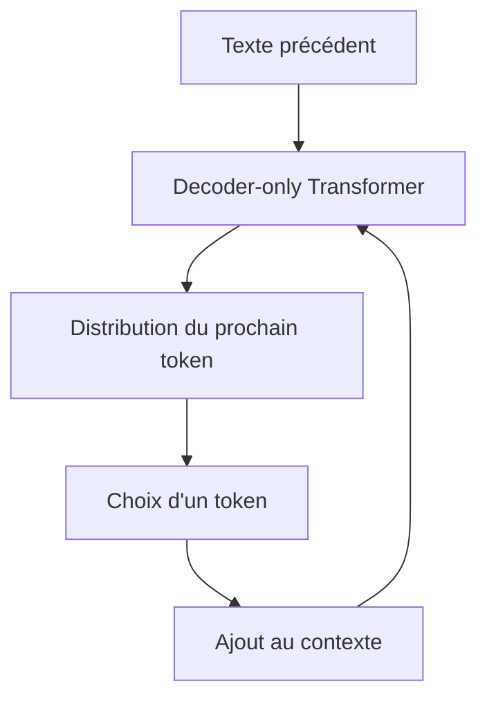

---

## 18.2 Rappel : qu’est-ce qu’un modèle decoder-only ?

Un modèle decoder-only utilise une pile de blocs Transformer de type decoder causal.

Contrairement au Transformer original, il n’utilise généralement pas :

* d’encoder séparé ;
* de cross-attention vers une source encodée ;
* d’architecture explicitement source-cible.

Il reçoit une séquence de tokens et prédit le token suivant.

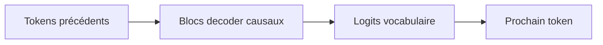

Son objectif est :

$$
P(x_t \mid x_{<t})
$$

Autrement dit :

> Quelle est la probabilité du prochain token sachant tous les tokens précédents ?

---

## 18.3 Différence avec le decoder du Transformer original

Le decoder du Transformer original appartient à une architecture encoder-decoder.

Il contient :

* masked self-attention ;
* cross-attention vers l’encoder ;
* feed-forward network.

Un modèle GPT standard contient surtout :

* masked self-attention ;
* feed-forward network ;
* pas de cross-attention classique vers un encoder séparé.

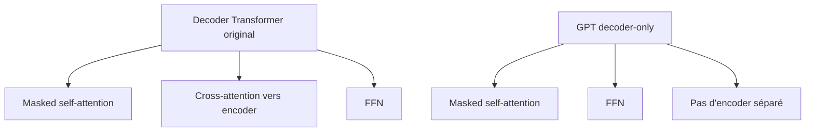

La source, la consigne, le contexte et l’historique sont simplement placés dans la séquence d’entrée.

---

## 18.4 La self-attention causale

Le cœur d’un decoder-only est la **self-attention causale**.

Chaque token peut regarder :

* lui-même ;
* les tokens précédents ;
* mais pas les tokens futurs.

Pour une séquence :

```txt
t1 t2 t3 t4
```

les visibilités sont :

| Token | Peut regarder        |
| ----- | -------------------- |
| (t_1) | (t_1)                |
| (t_2) | (t_1, t_2)           |
| (t_3) | (t_1, t_2, t_3)      |
| (t_4) | (t_1, t_2, t_3, t_4) |

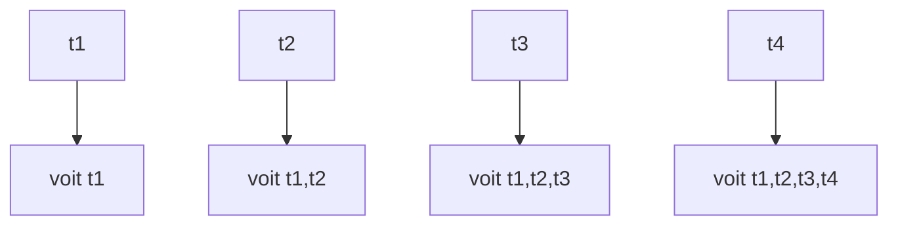

Cette contrainte est imposée par un **masque causal**.

---

## 18.5 Pourquoi le masque causal est indispensable

Pendant l’entraînement, on donne au modèle des séquences complètes.

Exemple :

```txt
Le chat dort sur le canapé.
```

Le modèle apprend à prédire chaque token à partir des précédents :

| Contexte visible      | Token à prédire |
| --------------------- | --------------- |
| `Le`                  | `chat`          |
| `Le chat`             | `dort`          |
| `Le chat dort`        | `sur`           |
| `Le chat dort sur`    | `le`            |
| `Le chat dort sur le` | `canapé`        |

Si le modèle pouvait voir les tokens futurs, il tricherait.

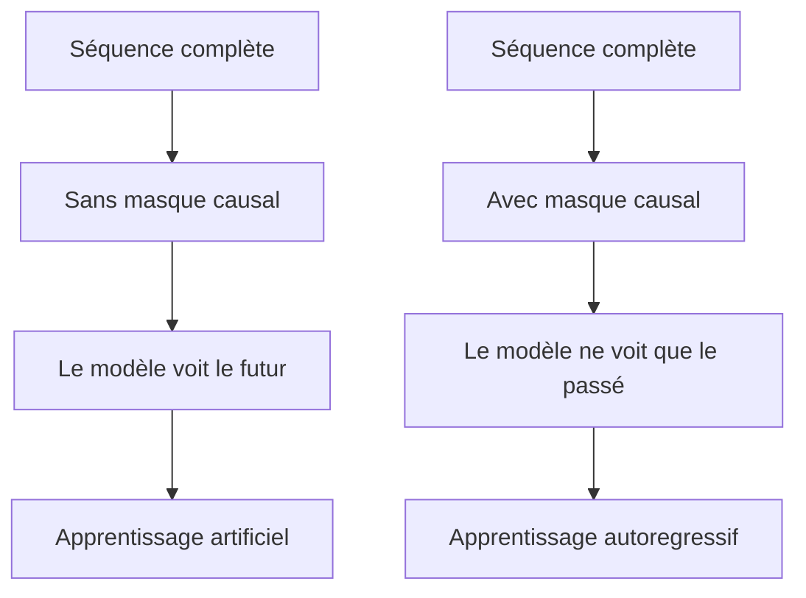

Le masque causal garantit que le modèle apprend réellement à prédire la suite.

---

## 18.6 Objectif de préentraînement : prédiction du prochain token

Les modèles decoder-only sont généralement préentraînés avec un objectif très simple :

$$
\mathcal{L}
===========

-\sum_t \log P(x_t \mid x_{<t})
$$

Cela signifie :

> On pénalise le modèle lorsqu’il donne une faible probabilité au vrai prochain token.

Exemple :

```txt
Contexte : Le chat dort sur le
Token réel : canapé
```

Le modèle doit donner une forte probabilité à `canapé`.

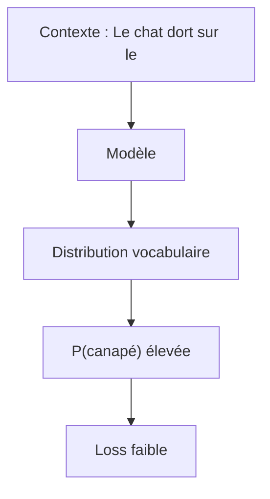

Cet objectif est appelé **language modeling causal**.

---

## 18.7 Pourquoi un objectif si simple fonctionne ?

La prédiction du prochain token oblige le modèle à apprendre énormément de choses.

Pour prédire correctement la suite d’un texte, il doit apprendre :

* la syntaxe ;
* le vocabulaire ;
* les faits présents dans les données ;
* les styles d’écriture ;
* les structures de dialogue ;
* des régularités de raisonnement ;
* des formats de documents ;
* du code ;
* des conventions sociales et linguistiques.

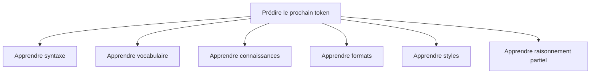

Le modèle n’apprend pas ces éléments par des règles explicites.

Il les apprend statistiquement à travers la tâche de prédiction.

---

## 18.8 Exemple de prédiction du prochain token

Phrase :

```txt
La capitale de la France est
```

Tokens probables :

| Token        | Probabilité intuitive |
| ------------ | --------------------: |
| `Paris`      |                élevée |
| `Lyon`       |                faible |
| `bleu`       |           très faible |
| `ordinateur` |           quasi nulle |

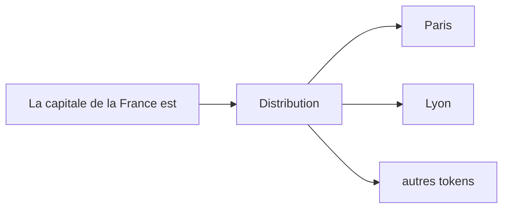

Le modèle apprend à produire cette distribution à partir des régularités vues pendant l’entraînement.

---

## 18.9 Génération autoregressive

Une fois entraîné, le modèle peut générer du texte.

Le processus est :

1. donner un prompt ;
2. prédire une distribution sur le prochain token ;
3. choisir un token ;
4. l’ajouter au contexte ;
5. recommencer.

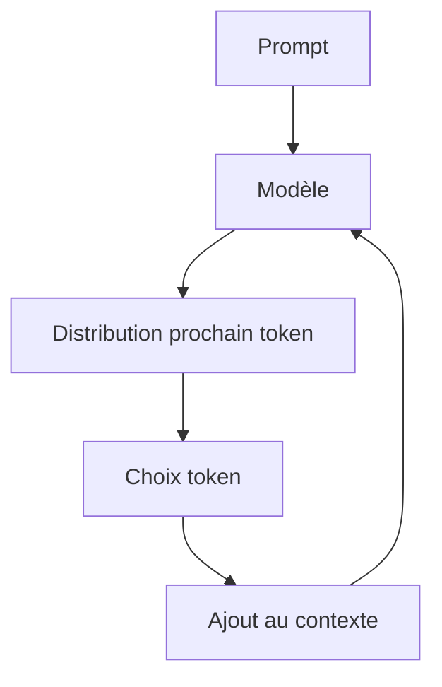

Exemple :

```txt
Prompt : Le chat
→ dort
→ sur
→ le
→ canapé
→ .
```

La génération est donc séquentielle.

---

## 18.10 Entraînement parallèle, inférence séquentielle

Il faut distinguer entraînement et inférence.

Pendant l’entraînement, nous avons toute la séquence.

Le modèle peut calculer les prédictions pour toutes les positions en parallèle grâce au masque causal.

Pendant l’inférence, les futurs tokens n’existent pas encore.

Il faut les générer un par un.

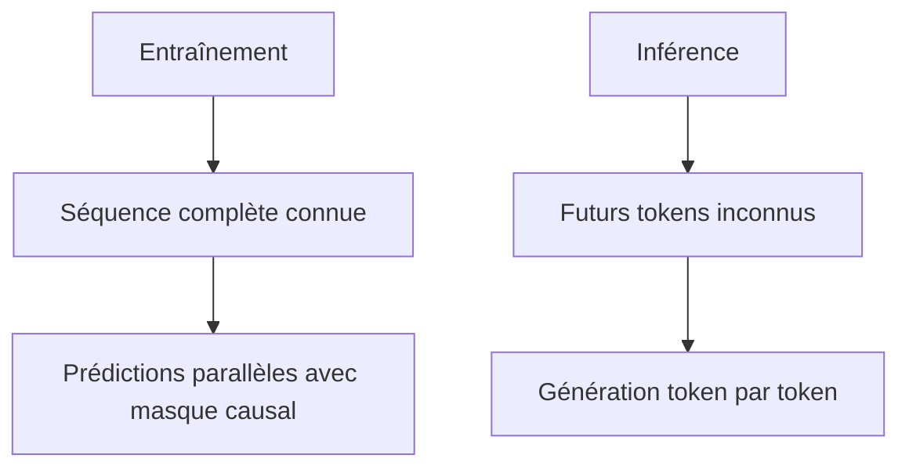

C’est une différence fondamentale des modèles autoregressifs.

---

## 18.11 Architecture générale d’un GPT

Un GPT est une pile de blocs Transformer causaux.

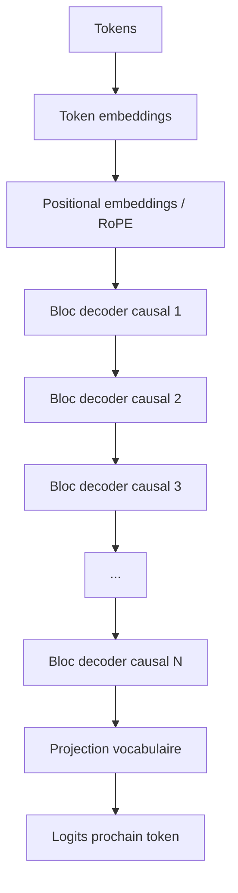

Chaque bloc contient généralement :

* self-attention causale ;
* feed-forward network ;
* résidus ;
* normalisation ;
* parfois des variantes modernes comme RMSNorm, SwiGLU, RoPE.

---

## 18.12 Le bloc decoder-only

Un bloc decoder-only moderne peut être représenté ainsi :

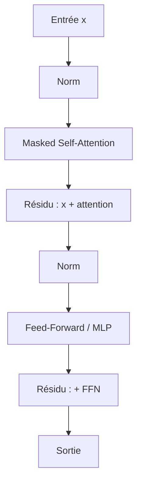

Dans beaucoup de modèles modernes, on utilise une structure **Pre-LN** :

$$
x = x + Attention(Norm(x))
$$

$$
x = x + FFN(Norm(x))
$$

Cette structure améliore souvent la stabilité des grands modèles profonds.

---

## 18.13 Decoder-only vs encoder-only

Nous pouvons comparer GPT et BERT :

| Aspect                 | BERT                   | GPT                    |
| ---------------------- | ---------------------- | ---------------------- |
| Famille                | Encoder-only           | Decoder-only           |
| Attention              | Bidirectionnelle       | Causale                |
| Objectif               | Prédire tokens masqués | Prédire prochain token |
| Usage naturel          | Compréhension          | Génération             |
| Peut voir le futur ?   | Oui                    | Non                    |
| Génère du texte long ? | Pas naturellement      | Oui                    |

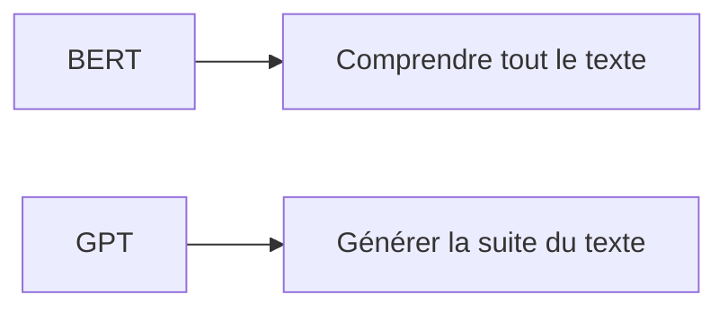

Ces deux modèles reposent sur le Transformer, mais ils n’ont pas le même usage naturel.

---

## 18.14 Le prompt

Dans un modèle decoder-only, le **prompt** est simplement le contexte donné au modèle.

Exemple :

```txt
Explique les Transformers en une phrase :
```

Le modèle continue :

```txt
Les Transformers sont des réseaux de neurones fondés sur l’attention...
```

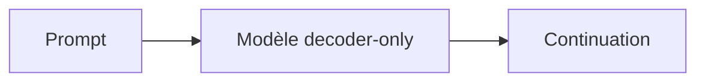

Le prompt conditionne fortement la sortie.

Il peut contenir :

* une question ;
* une instruction ;
* des exemples ;
* un rôle ;
* un contexte documentaire ;
* un format de réponse attendu.

---

## 18.15 Le prompt comme programmation souple

Avec les LLM decoder-only, on peut obtenir différents comportements en modifiant le prompt.

Exemple :

```txt
Résume ce texte en 3 phrases.
```

```txt
Traduis ce texte en anglais.
```

```txt
Explique ce code Python.
```

```txt
Réponds comme un professeur d’informatique.
```

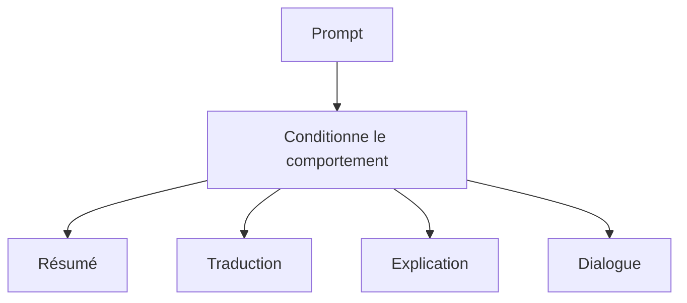

Cela explique pourquoi le **prompt engineering** est devenu important.

Le modèle n’est pas reprogrammé au sens classique.

Mais son comportement est orienté par le contexte textuel.

---

## 18.16 Few-shot prompting

Le prompt peut contenir des exemples.

C’est le **few-shot prompting**.

Exemple :

```txt
Exemple 1 :
Entrée : J'adore ce film.
Sortie : positif

Exemple 2 :
Entrée : Ce repas était mauvais.
Sortie : négatif

Entrée : Cette conférence était passionnante.
Sortie :
```

Le modèle complète :

```txt
positif
```

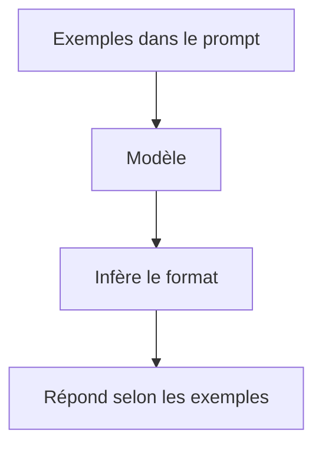

Le modèle apprend temporairement le format depuis le contexte, sans modification de ses poids.

---

## 18.17 In-context learning

Le few-shot prompting est un cas particulier de **in-context learning**.

Cela signifie :

> Le modèle adapte son comportement à partir des informations présentes dans le contexte, sans mise à jour de paramètres.

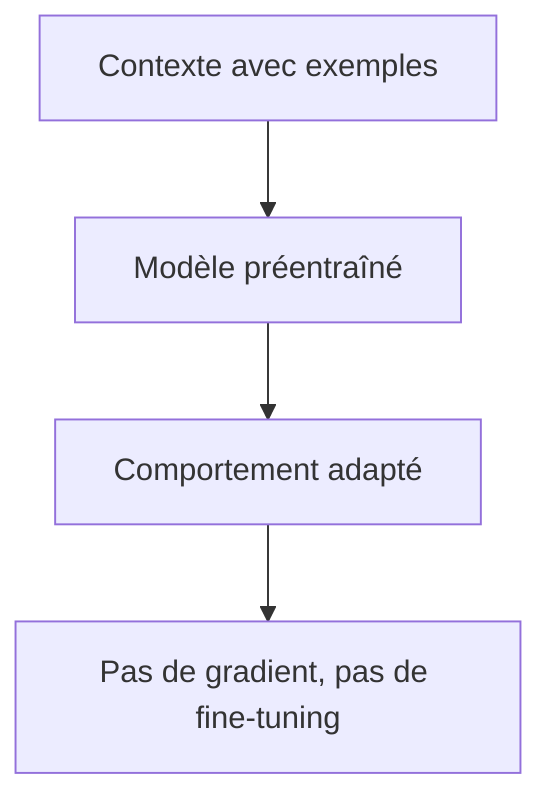

C’est une propriété remarquable des grands modèles decoder-only.

Elle devient plus visible à grande échelle.

---

## 18.18 Préentraînement des GPT

Le préentraînement consiste à exposer le modèle à de très grands corpus.

Ces corpus peuvent contenir :

* livres ;
* pages web ;
* articles ;
* code ;
* documentation ;
* conversations ;
* textes structurés.

L’objectif reste :

```txt
prédire le prochain token
```

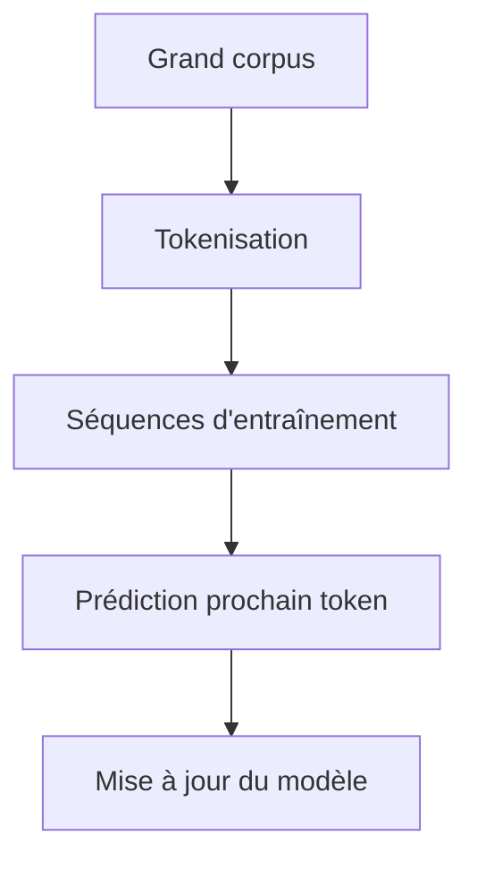

Le préentraînement donne au modèle ses capacités générales.

---

## 18.19 Données et qualité du modèle

La qualité d’un modèle decoder-only dépend fortement :

* de la quantité de données ;
* de la qualité des données ;
* de la diversité des données ;
* du filtrage ;
* de la déduplication ;
* de la proportion de code, dialogue, mathématiques, etc.

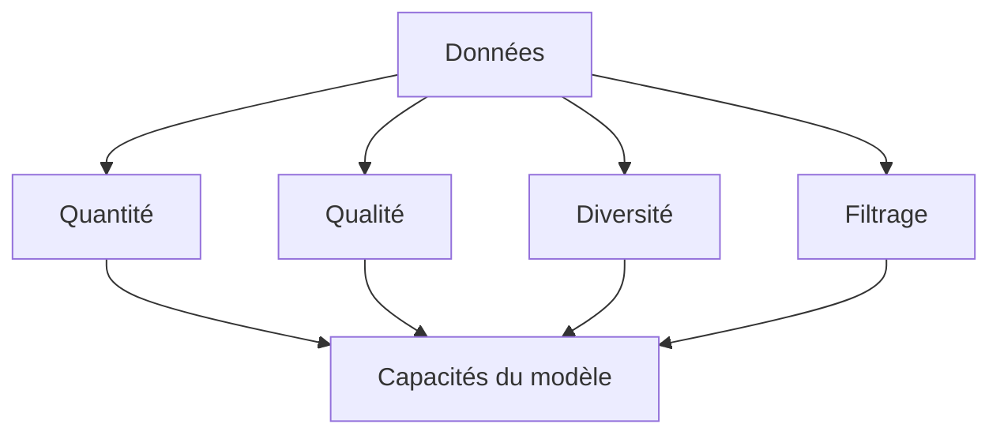

Un modèle entraîné sur des données bruitées ou biaisées reproduira une partie de ces défauts.

---

## 18.20 Tokenisation dans les GPT

Les modèles GPT utilisent une tokenisation en sous-mots ou fragments.

Exemple :

```txt
internationalisation
```

peut être découpé en plusieurs tokens.

La tokenisation influence :

* le coût ;
* la longueur effective du contexte ;
* les performances en langues différentes ;
* le traitement du code ;
* la gestion des mots rares.

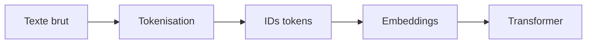

Un texte plus long en tokens coûte plus cher à traiter.

---

## 18.21 Projection vocabulaire

À la sortie du dernier bloc, le modèle produit un vecteur caché.

Ce vecteur est projeté vers le vocabulaire.

$$
logits = hW_{vocab}
$$

Si le vocabulaire contient $V$ tokens, alors le modèle produit $V$ logits.

```mermaid
flowchart LR
    A["Vecteur caché h"] --> B["Linear d_model -> V"]
    B --> C["Logits vocabulaire"]
    C --> D["Softmax"]
    D --> E["Distribution prochain token"]
```

Le token suivant est choisi à partir de cette distribution.

---

## 18.22 Stratégies de décodage

Une distribution de probabilité ne donne pas automatiquement un seul texte.

Il faut choisir comment sélectionner les tokens.

Les stratégies principales sont :

* greedy decoding ;
* beam search ;
* sampling ;
* top-k ;
* top-p ;
* température.

```mermaid
flowchart TD
    A["Distribution vocabulaire"] --> B["Greedy"]
    A --> C["Beam search"]
    A --> D["Sampling"]
    A --> E["Top-k"]
    A --> F["Top-p"]
    A --> G["Température"]
```

Le choix de décodage influence fortement le style, la créativité et la fiabilité de la sortie.

---

## 18.23 Greedy decoding

Le greedy decoding choisit toujours le token le plus probable.

Exemple :

| Token    | Probabilité |
| -------- | ----------: |
| `chat`   |        0.60 |
| `chien`  |        0.25 |
| `cheval` |        0.10 |
| `table`  |        0.05 |

Le modèle choisit :

```txt
chat
```

```mermaid
flowchart LR
    A["Distribution"] --> B["Token le plus probable"]
    B --> C["Ajout au texte"]
```

Avantage :

* simple ;
* déterministe.

Limite :

* peut produire des textes répétitifs ou moins naturels ;
* meilleur choix local pas toujours meilleur choix global.

---

## 18.24 Sampling

Le sampling tire un token selon la distribution.

Si :

```txt
P(chat)=0.60
P(chien)=0.25
P(cheval)=0.10
P(table)=0.05
```

alors `chat` sera souvent choisi, mais pas toujours.

```mermaid
flowchart TD
    A["Distribution"] --> B["Tirage aléatoire"]
    B --> C["Token choisi"]
```

Avantage :

* plus varié ;
* plus créatif.

Limite :

* peut produire des erreurs ;
* moins déterministe.

---

## 18.25 Température

La température modifie la distribution avant le choix du token.

$$
softmax\left(\frac{logits}{T}\right)
$$

Si (T < 1), la distribution devient plus concentrée.

Si (T > 1), la distribution devient plus plate.

```mermaid
flowchart TD
    A["Température basse"] --> B["Sortie plus déterministe"]
    C["Température haute"] --> D["Sortie plus variée"]
```

Une température trop élevée peut produire du texte incohérent.

Une température trop basse peut produire du texte répétitif.

---

## 18.26 Top-k

Avec top-k, on ne garde que les $k$ tokens les plus probables.

Exemple avec (k = 3) :

| Token     | Probabilité |
| --------- | ----------: |
| `chat`    |        0.40 |
| `chien`   |        0.30 |
| `lapin`   |        0.15 |
| `voiture` |        0.05 |
| `bleu`    |        0.03 |

On garde :

```txt
chat, chien, lapin
```

Puis on échantillonne parmi eux.

```mermaid
flowchart TD
    A["Distribution complète"] --> B["Garder k meilleurs tokens"]
    B --> C["Sampling restreint"]
```

Cela évite de choisir des tokens très improbables.

---

## 18.27 Top-p ou nucleus sampling

Avec top-p, on garde le plus petit ensemble de tokens dont la probabilité cumulée dépasse un seuil $p$.

Exemple :

```txt
p = 0.90
```

On garde les tokens les plus probables jusqu’à couvrir 90 % de la masse de probabilité.

```mermaid
flowchart TD
    A["Tokens triés par probabilité"] --> B["Somme cumulée"]
    B --> C["Garder jusqu'à p"]
    C --> D["Sampling dans le noyau"]
```

Top-p est plus flexible que top-k, car le nombre de tokens gardés dépend de la forme de la distribution.

---

## 18.28 Instruction tuning

Un modèle préentraîné sur la prédiction du prochain token sait continuer du texte.

Mais il ne sait pas nécessairement suivre correctement une instruction utilisateur.

L’**instruction tuning** consiste à entraîner le modèle sur des exemples :

```txt
Instruction → Réponse attendue
```

Exemple :

```txt
Instruction : Résume ce texte en trois phrases.
Réponse : ...
```

```mermaid
flowchart TD
    A["Modèle préentraîné"] --> B["Données instruction-réponse"]
    B --> C["Fine-tuning supervisé"]
    C --> D["Modèle qui suit mieux les consignes"]
```

Cela transforme un modèle de continuation en assistant plus utile.

---

## 18.29 Exemples de données d’instruction

Une donnée d’instruction peut contenir :

```txt
Utilisateur : Explique la récursivité à un débutant.
Assistant : La récursivité est...
```

ou :

```txt
Utilisateur : Corrige ce texte.
Texte : ...
Assistant : ...
```

ou :

```txt
Utilisateur : Écris une fonction Python qui trie une liste.
Assistant : ...
```

```mermaid
flowchart TD
    A["Instructions variées"] --> B["Correction"]
    A --> C["Explication"]
    A --> D["Code"]
    A --> E["Résumé"]
    A --> F["Question-réponse"]
```

Le modèle apprend alors à associer des consignes à des formats de réponses adaptés.

---

## 18.30 RLHF : Reinforcement Learning from Human Feedback

Après l’instruction tuning, certains modèles sont alignés avec du feedback humain.

Le RLHF suit souvent une logique en plusieurs étapes :

1. entraîner un modèle supervisé sur des réponses souhaitées ;
2. collecter des préférences humaines entre plusieurs réponses ;
3. entraîner un modèle de récompense ;
4. optimiser le modèle pour produire des réponses mieux notées.

```mermaid
flowchart TD
    A["Modèle préentraîné"] --> B["Supervised fine-tuning"]
    B --> C["Réponses candidates"]
    C --> D["Préférences humaines"]
    D --> E["Reward model"]
    E --> F["Optimisation RL"]
    F --> G["Modèle aligné"]
```

L’objectif est de rendre le modèle plus utile, plus sûr et plus conforme aux préférences humaines.

---

## 18.31 Pourquoi le RLHF est utile

Le préentraînement apprend à imiter des textes du corpus.

Mais un assistant ne doit pas seulement imiter Internet.

Il doit :

* répondre clairement ;
* suivre les consignes ;
* refuser certaines demandes dangereuses ;
* éviter certains comportements toxiques ;
* reconnaître ses incertitudes ;
* structurer ses réponses.

```mermaid
flowchart TD
    A["Préentraînement"] --> B["Continuation de texte"]
    C["RLHF / alignement"] --> D["Réponses plus utiles"]
    C --> E["Meilleur suivi d'instructions"]
    C --> F["Sécurité améliorée"]
```

Le RLHF aide à orienter le comportement du modèle vers un usage conversationnel.

---

## 18.32 RLHF et limites

Le RLHF n’est pas parfait.

Il peut produire :

* des réponses trop prudentes ;
* une tendance à donner des réponses qui “semblent bonnes” ;
* des refus excessifs ;
* une homogénéisation du style ;
* une illusion de confiance ;
* des biais liés aux préférences collectées.

```mermaid
flowchart TD
    A["RLHF"] --> B["Améliore l'utilité"]
    A --> C["Mais peut biaiser le style"]
    A --> D["Peut créer des refus excessifs"]
    A --> E["Ne supprime pas les hallucinations"]
```

Le RLHF améliore le comportement, mais ne transforme pas le modèle en source parfaite de vérité.

---

## 18.33 Hallucinations

Une hallucination est une sortie plausible mais fausse ou non fondée.

Exemple :

```txt
Le modèle invente une référence bibliographique inexistante.
```

Pourquoi cela arrive ?

Parce qu’un decoder-only apprend à produire des suites probables de tokens.

Il n’est pas, par défaut, connecté à une base de vérité vérifiée.

```mermaid
flowchart TD
    A["Objectif : prochain token probable"] --> B["Texte plausible"]
    B --> C["Peut être vrai"]
    B --> D["Peut être faux"]
    D --> E["Hallucination"]
```

La plausibilité linguistique ne garantit pas la factualité.

---

## 18.34 Pourquoi les hallucinations sont structurelles

Le modèle ne “sait” pas au sens humain.

Il manipule des représentations statistiques apprises.

Lorsqu’il manque d’information, il peut produire une suite vraisemblable.

```mermaid
flowchart TD
    A["Question"] --> B["Contexte insuffisant"]
    B --> C["Modèle génère une réponse probable"]
    C --> D["Réponse peut sembler crédible"]
    D --> E["Mais être fausse"]
```

Cela explique pourquoi les LLM doivent être utilisés avec prudence dans les domaines exigeant une forte exactitude.

---

## 18.35 Réduire les hallucinations

Plusieurs stratégies peuvent réduire les hallucinations :

* retrieval augmented generation ;
* citations de sources ;
* outils externes ;
* vérification ;
* entraînement sur données de qualité ;
* instruction tuning ;
* calibration ;
* refus en cas d’incertitude.

```mermaid
flowchart TD
    A["Hallucinations"] --> B["RAG"]
    A --> C["Sources"]
    A --> D["Outils"]
    A --> E["Vérification"]
    A --> F["Meilleures données"]
```

Mais aucune stratégie ne les supprime totalement.

---

## 18.36 RAG et decoder-only

Dans un système RAG, on fournit au modèle des documents récupérés.

Le modèle génère ensuite une réponse conditionnée par ces documents.

```mermaid
flowchart TD
    A["Question"] --> B["Recherche documentaire"]
    B --> C["Passages pertinents"]
    C --> D["Prompt enrichi"]
    D --> E["Decoder-only LLM"]
    E --> F["Réponse sourcée"]
```

Le modèle decoder-only reste génératif, mais il dispose d’un contexte externe plus fiable.

Cela améliore la factualité si le retrieval est bon et si le modèle utilise correctement les sources.

---

## 18.37 Outils et function calling

Les modèles decoder-only peuvent être connectés à des outils :

* calculatrice ;
* moteur de recherche ;
* base de données ;
* interpréteur Python ;
* API métier ;
* calendrier ;
* système de fichiers.

```mermaid
flowchart TD
    A["Question utilisateur"] --> B["LLM"]
    B --> C{"Besoin d'un outil ?"}
    C -->|"Oui"| D["Appel outil"]
    D --> E["Résultat outil"]
    E --> B
    C -->|"Non"| F["Réponse directe"]
```

Cela permet au modèle de dépasser certaines limites de ses connaissances internes.

---

## 18.38 Le contexte comme interface universelle

Dans un decoder-only, tout passe par le contexte :

* consigne système ;
* message utilisateur ;
* exemples ;
* documents RAG ;
* résultats d’outils ;
* historique de conversation.

```mermaid
flowchart TD
    A["Système"] --> F["Contexte"]
    B["Utilisateur"] --> F
    C["Exemples"] --> F
    D["Documents"] --> F
    E["Résultats outils"] --> F
    F --> G["Decoder-only"]
    G --> H["Réponse"]
```

Le modèle ne distingue pas magiquement ces éléments : ils sont représentés sous forme de tokens, souvent avec un format spécifique.

---

## 18.39 Fenêtre de contexte

La fenêtre de contexte est le nombre maximal de tokens que le modèle peut prendre en entrée.

Elle inclut :

* prompt ;
* historique ;
* documents ;
* réponse en cours ;
* résultats d’outils.

```mermaid
flowchart LR
    A["Prompt"] --> B["Historique"]
    B --> C["Documents"]
    C --> D["Réponse générée"]
    D --> E["Fenêtre de contexte"]
```

Si le contexte dépasse la limite, il faut :

* tronquer ;
* résumer ;
* sélectionner ;
* compresser ;
* faire du retrieval.

---

## 18.40 Coût du contexte long

Le contexte long augmente :

* la mémoire ;
* le coût d’attention ;
* le coût du KV cache ;
* la latence ;
* parfois le bruit.

```mermaid
flowchart TD
    A["Contexte long"] --> B["Plus d'information"]
    A --> C["Plus de coût"]
    A --> D["KV cache plus grand"]
    A --> E["Latence plus élevée"]
```

Dans les decoder-only, le long contexte est utile, mais coûteux.

---

## 18.41 KV cache en decoder-only

Pendant l’inférence, le modèle stocke les Keys et Values des tokens déjà traités.

Cela évite de recalculer le passé à chaque nouveau token.

```mermaid
flowchart TD
    A["Tokens passés"] --> B["K,V calculés"]
    B --> C["KV cache"]
    D["Nouveau token"] --> E["Nouvelle Q,K,V"]
    C --> F["Attention du nouveau token"]
    E --> F
```

Le KV cache est indispensable pour rendre la génération efficace.

Mais il consomme de la mémoire proportionnelle à la longueur du contexte.

---

## 18.42 Decoder-only et mémoire de conversation

Un modèle decoder-only ne possède pas une mémoire infinie par défaut.

Il utilise ce qui est dans le contexte.

Si une information ancienne sort de la fenêtre de contexte, le modèle ne peut plus l’utiliser directement.

```mermaid
flowchart TD
    A["Historique ancien"] --> B["Sort de la fenêtre"]
    B --> C["Non visible directement"]
    D["Historique récent"] --> E["Dans le contexte"]
    E --> F["Utilisable"]
```

Les systèmes conversationnels ajoutent donc souvent des mécanismes externes :

* résumé d’historique ;
* mémoire persistante ;
* retrieval sur anciennes conversations ;
* stockage structuré.

---

## 18.43 Emergence et passage à l’échelle

Les modèles decoder-only ont montré des capacités croissantes avec :

* plus de paramètres ;
* plus de données ;
* plus de calcul ;
* meilleur entraînement ;
* meilleur alignement.

```mermaid
flowchart TD
    A["Scaling"] --> B["Plus de paramètres"]
    A --> C["Plus de données"]
    A --> D["Plus de calcul"]
    B --> E["Capacités accrues"]
    C --> E
    D --> E
```

Certaines capacités deviennent plus visibles à grande échelle :

* in-context learning ;
* suivi d’instructions ;
* génération de code ;
* raisonnement multi-étapes partiel ;
* adaptation à des formats nouveaux.

---

## 18.44 Les limites du scaling

Augmenter la taille ne résout pas tout.

Les grands modèles peuvent encore :

* halluciner ;
* manquer de robustesse ;
* être sensibles au prompt ;
* reproduire des biais ;
* échouer sur des raisonnements simples ;
* mal gérer les sources ;
* produire une réponse plausible mais fausse.

```mermaid
flowchart TD
    A["Modèle plus grand"] --> B["Meilleures capacités"]
    A --> C["Coût plus élevé"]
    A --> D["Limites persistantes"]
```

Le scaling améliore beaucoup de choses, mais il ne remplace pas l’évaluation, les outils, les données de qualité et les garde-fous.

---

## 18.45 Decoder-only et code

Les modèles decoder-only sont très adaptés à la génération de code.

Le code est une séquence de tokens avec des régularités fortes :

* syntaxe ;
* indentation ;
* noms de variables ;
* imports ;
* fonctions ;
* tests ;
* documentation.

```mermaid
flowchart TD
    A["Contexte code"] --> B["Decoder-only"]
    B --> C["Complétion de code"]
    B --> D["Explication"]
    B --> E["Refactorisation"]
```

Objectif :

```txt
prédire la suite du code
```

Exemple :

```python
def add(a, b):
    return
```

Suite probable :

```python
a + b
```

---

## 18.46 Decoder-only et raisonnement

Les decoder-only peuvent produire des chaînes de texte qui ressemblent à du raisonnement.

Ils peuvent résoudre certains problèmes étape par étape.

Mais il faut rester prudent.

Le modèle génère des tokens, et ses étapes peuvent être :

* correctes ;
* partiellement correctes ;
* incohérentes ;
* plausibles mais fausses.

```mermaid
flowchart TD
    A["Question complexe"] --> B["Génération étape par étape"]
    B --> C["Peut aider"]
    B --> D["Peut se tromper"]
```

Pour les tâches critiques, il faut vérifier les résultats.

---

## 18.47 Chain-of-thought et raisonnement guidé

On a observé que demander au modèle de décomposer un problème peut améliorer certaines réponses.

Exemple :

```txt
Décompose le problème en étapes.
```

Cela encourage le modèle à produire une structure intermédiaire.

```mermaid
flowchart TD
    A["Problème"] --> B["Décomposition"]
    B --> C["Étapes"]
    C --> D["Réponse finale"]
```

Mais cela ne garantit pas la vérité.

Une explication peut sembler logique tout en étant incorrecte.

---

## 18.48 Alignement avec des outils de vérification

Pour améliorer la fiabilité, on peut combiner le modèle avec des outils :

* solveur mathématique ;
* exécution de code ;
* recherche web ;
* base documentaire ;
* tests unitaires ;
* vérificateur formel.

```mermaid
flowchart TD
    A["LLM"] --> B["Propose"]
    B --> C["Outil vérifie"]
    C --> D["Résultat"]
    D --> E["Réponse corrigée"]
```

C’est une voie importante : utiliser le modèle comme interface de raisonnement et de langage, mais déléguer certaines vérifications à des systèmes fiables.

---

## 18.49 Decoder-only et agents

Un agent fondé sur un LLM utilise le modèle pour choisir des actions.

Exemple :

1. lire une consigne ;
2. décider d’utiliser un outil ;
3. appeler l’outil ;
4. lire le résultat ;
5. décider de l’étape suivante ;
6. produire une réponse.

```mermaid
flowchart TD
    A["Objectif utilisateur"] --> B["LLM"]
    B --> C["Plan d'action"]
    C --> D["Outil"]
    D --> E["Observation"]
    E --> B
    B --> F["Réponse finale"]
```

Le modèle decoder-only devient alors un contrôleur linguistique.

---

## 18.50 Limites des agents LLM

Les agents LLM peuvent être puissants, mais ils ont des limites :

* erreurs de planification ;
* appels d’outils inutiles ;
* mauvaise interprétation des résultats ;
* boucles ;
* hallucination d’actions ;
* coût élevé ;
* latence ;
* sécurité.

```mermaid
flowchart TD
    A["Agent LLM"] --> B["Peut planifier"]
    A --> C["Peut utiliser outils"]
    A --> D["Mais peut se tromper"]
    A --> E["Besoin de garde-fous"]
```

Les agents ne sont pas simplement “des LLM autonomes parfaits”.

Ils demandent une architecture système rigoureuse.

---

## 18.51 Comparaison decoder-only et encoder-decoder

| Aspect            | Decoder-only                 | Encoder-decoder                  |
| ----------------- | ---------------------------- | -------------------------------- |
| Entrée            | Tout dans le prompt          | Source encodée séparément        |
| Génération        | Autoregressive               | Autoregressive côté decoder      |
| Cross-attention   | Non standard                 | Oui                              |
| Tâches naturelles | Chat, complétion, génération | Traduction, résumé, text-to-text |
| Simplicité        | Très simple à formater       | Plus structuré                   |
| Usage moderne     | LLM généralistes             | Transformation contrôlée         |

```mermaid
flowchart TD
    A["Decoder-only"] --> B["Tout est contexte"]
    C["Encoder-decoder"] --> D["Entrée encodée séparément"]
```

Le decoder-only est très flexible.

L’encoder-decoder reste très élégant pour les tâches entrée-sortie.

---

## 18.52 Pourquoi les decoder-only dominent les assistants modernes

Les assistants modernes sont souvent decoder-only parce que :

* le dialogue est naturellement une continuation ;
* les instructions peuvent être encodées dans le prompt ;
* l’architecture est simple ;
* le préentraînement prochain token est scalable ;
* le même modèle peut faire beaucoup de tâches ;
* le fine-tuning instructionnel rend le modèle interactif.

```mermaid
flowchart TD
    A["Assistant conversationnel"] --> B["Historique + instruction"]
    B --> C["Decoder-only"]
    C --> D["Réponse générée"]
```

Cette famille est donc particulièrement adaptée aux interfaces conversationnelles.

---

## 18.53 Erreur fréquente : croire que GPT comprend comme un humain

Un GPT produit des réponses à partir de représentations apprises.

Il peut manipuler des concepts, suivre des structures, générer des explications.

Mais il ne comprend pas nécessairement comme un humain.

```mermaid
flowchart TD
    A["GPT"] --> B["Représentations statistiques"]
    B --> C["Réponses cohérentes"]
    C --> D["Pas garantie de compréhension humaine"]
```

Il faut éviter les deux excès :

* croire qu’il ne fait que répéter ;
* croire qu’il comprend parfaitement comme une personne.

La réalité est plus subtile.

---

## 18.54 Erreur fréquente : croire que la réponse la plus probable est toujours vraie

Le modèle prédit des tokens probables.

Mais une phrase fausse peut être très plausible.

```mermaid
flowchart TD
    A["Token probable"] --> B["Texte fluide"]
    B --> C["Peut être vrai"]
    B --> D["Peut être faux"]
```

La probabilité linguistique n’est pas équivalente à la vérité factuelle.

C’est une erreur fondamentale à éviter.

---

## 18.55 Erreur fréquente : confondre prompt et apprentissage

Quand on donne des exemples dans le prompt, le modèle adapte son comportement dans le contexte.

Mais ses poids ne changent pas.

```mermaid
flowchart TD
    A["Prompt avec exemples"] --> B["In-context learning"]
    B --> C["Comportement adapté temporairement"]
    C --> D["Pas de mise à jour des poids"]
```

Ce n’est pas du fine-tuning.

Le modèle utilise simplement le contexte fourni.

---

## 18.56 Erreur fréquente : croire que plus de contexte règle tout

Ajouter plus de contexte peut aider.

Mais cela peut aussi :

* augmenter le bruit ;
* dépasser la capacité d’attention utile ;
* augmenter la latence ;
* coûter plus cher ;
* noyer l’information importante.

```mermaid
flowchart TD
    A["Plus de contexte"] --> B["Plus d'information"]
    A --> C["Plus de bruit"]
    A --> D["Plus de coût"]
```

Il vaut souvent mieux fournir un contexte bien sélectionné qu’un contexte énorme mais mal structuré.

---

## 18.57 Erreur fréquente : croire que le RLHF supprime les hallucinations

Le RLHF améliore le comportement conversationnel.

Mais il ne garantit pas la vérité.

```mermaid
flowchart TD
    A["RLHF"] --> B["Meilleur suivi d'instructions"]
    A --> C["Réponses plus utiles"]
    A --> D["Hallucinations encore possibles"]
```

Pour les faits, nous avons besoin de sources, d’outils ou de vérifications.

---

## 18.58 Synthèse mathématique

Un modèle decoder-only apprend :

$$
P(x_1, x_2, ..., x_n)
=====================

\prod_{t=1}^{n}
P(x_t \mid x_{<t})
$$

À chaque position $t$, le modèle produit :

$$
logits_t \in \mathbb{R}^{V}
$$

puis :

$$
P(x_t \mid x_{<t}) = softmax(logits_t)
$$

La loss de préentraînement est :

$$
\mathcal{L}
===========

-\sum_t \log P(x_t^{correct} \mid x_{<t})
$$

Le masque causal garantit que :

$$
x_t
$$

ne dépend que de :

$$
x_{<t}
$$

et non des futurs tokens.

---

## 18.59 Schéma global de synthèse

```mermaid
flowchart TD
    A["Corpus texte"] --> B["Tokenisation"]
    B --> C["Séquences de tokens"]

    C --> D["Decoder-only Transformer"]
    D --> E["Masque causal"]
    E --> F["Logits prochain token"]

    F --> G["Cross-entropy"]
    G --> H["Préentraînement"]

    H --> I["Instruction tuning"]
    I --> J["Alignement / RLHF éventuel"]

    J --> K["Prompt utilisateur"]
    K --> L["Génération autoregressive"]
    L --> M["Réponse"]
```

---

## 18.60 Résumé du chapitre

Nous avons étudié les modèles **decoder-only**, en particulier les modèles de type GPT.

Un decoder-only utilise une self-attention causale : chaque token ne peut regarder que les tokens précédents et lui-même.

Son objectif fondamental est la prédiction du prochain token :

$$
P(x_t \mid x_{<t})
$$

Cet objectif très simple permet d’apprendre des régularités linguistiques, factuelles, stylistiques, dialogiques et même du code.

En inférence, le modèle génère du texte token par token de manière autoregressive.

Nous avons vu que le prompt joue un rôle central : il conditionne le comportement du modèle.

Nous avons étudié :

* le préentraînement ;
* le prompt ;
* le few-shot prompting ;
* l’in-context learning ;
* l’instruction tuning ;
* le RLHF ;
* les stratégies de décodage ;
* le KV cache ;
* les hallucinations ;
* le RAG ;
* l’usage d’outils ;
* les agents.

Le point central est :

> Les modèles decoder-only transforment la prédiction du prochain token en une interface générale de génération, de dialogue et de résolution de tâches, mais leur nature probabiliste impose des limites importantes en factualité, robustesse et contrôle.

---

## 18.61 Questions de compréhension

### 18.61.1 Question 1

Qu’est-ce qu’un modèle decoder-only ?

Réponse attendue : un Transformer composé de blocs decoder causaux, entraîné principalement à prédire le prochain token à partir des tokens précédents.

### 18.61.2 Question 2

Pourquoi utilise-t-on un masque causal ?

Réponse attendue : pour empêcher chaque token de regarder les tokens futurs pendant l’entraînement et garantir l’autoregression.

### 18.61.3 Question 3

Quel est l’objectif de préentraînement principal d’un GPT ?

Réponse attendue : prédire le prochain token, c’est-à-dire maximiser (P(x_t \mid x_{<t})).

### 18.61.4 Question 4

Pourquoi l’entraînement peut-il être parallèle alors que l’inférence est séquentielle ?

Réponse attendue : pendant l’entraînement, la séquence complète est connue et masquée causalement ; pendant l’inférence, les futurs tokens doivent être générés un par un.

### 18.61.5 Question 5

Qu’est-ce qu’un prompt ?

Réponse attendue : le contexte textuel fourni au modèle pour conditionner sa génération.

### 18.61.6 Question 6

Quelle est la différence entre in-context learning et fine-tuning ?

Réponse attendue : l’in-context learning adapte le comportement via le prompt sans modifier les poids ; le fine-tuning modifie les paramètres du modèle.

### 18.61.7 Question 7

À quoi sert le RLHF ?

Réponse attendue : à aligner le modèle sur des préférences humaines pour produire des réponses plus utiles, sûres et conformes aux consignes.

### 18.61.8 Question 8

Pourquoi les hallucinations apparaissent-elles ?

Réponse attendue : parce que le modèle génère des suites de tokens plausibles, mais cette plausibilité ne garantit pas la vérité factuelle.

### 18.61.9 Question 9

À quoi sert le KV cache ?

Réponse attendue : à stocker les Keys et Values des tokens précédents pour éviter de recalculer tout le passé à chaque nouveau token.

### 18.61.10 Question 10

Pourquoi les decoder-only sont-ils adaptés aux assistants conversationnels ?

Réponse attendue : parce qu’un dialogue peut être représenté comme un contexte textuel que le modèle continue de manière autoregressive.

---

## 18.62 Transition vers le chapitre 19

Nous avons maintenant étudié les modèles encoder-only et decoder-only.

Dans le chapitre suivant, nous allons revenir à la troisième grande famille : les modèles **encoder-decoder modernes**, notamment T5 et BART.

Nous verrons :

* pourquoi conserver un encoder et un decoder ;
* comment fonctionne le paradigme text-to-text ;
* pourquoi T5 reformule toutes les tâches en génération textuelle ;
* comment BART utilise le débruitage ;
* les différences avec GPT ;
* les cas où l’encoder-decoder reste préférable ;
* les usages en traduction, résumé, reformulation et génération contrôlée.

---
> [!info] Livre « Les transformers » — chapitre 18/30
> [[Les transformers — Sommaire|Sommaire]] · [[Les transformers — 17 — Modèles encoder-only BERT et la compréhension bidirectionnelle|← 17 — Modèles encoder-only BERT et la compréhension bidirectionnelle]] · [[Les transformers — 19 — Modèles encoder-decoder modernes T5, BART et le paradigme text-to-text|19 — Modèles encoder-decoder modernes T5, BART et le paradigme text-to-text →]]
