> [!info] Livre « Les transformers » — chapitre 19/30
> [[Les transformers — Sommaire|Sommaire]] · [[Les transformers — 18 — Modèles decoder-only GPT et la génération autoregressive|← 18 — Modèles decoder-only GPT et la génération autoregressive]] · [[Les transformers — 20 — Transformers pour la vision|20 — Transformers pour la vision →]]

# Chapitre 19 — Modèles encoder-decoder modernes : T5, BART et le paradigme text-to-text
## 19.1 Objectif du chapitre

Dans les deux chapitres précédents, nous avons étudié :

* les modèles **encoder-only**, comme BERT ;
* les modèles **decoder-only**, comme GPT.

Nous allons maintenant revenir à la troisième grande famille : les modèles **encoder-decoder**.

C’est la famille la plus proche du Transformer original de 2017.

Un modèle encoder-decoder contient :

* un **encoder**, qui lit et représente l’entrée ;
* un **decoder**, qui génère la sortie ;
* une **cross-attention**, qui permet au decoder de regarder la mémoire de l’encoder.

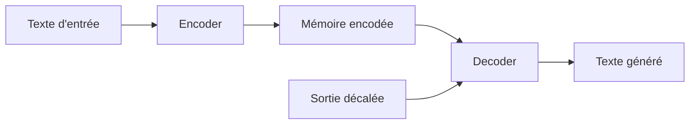

Dans ce chapitre, nous allons étudier :

* pourquoi conserver une architecture encoder-decoder ;
* le paradigme **text-to-text** ;
* le modèle **T5** ;
* le modèle **BART** ;
* les tâches de traduction, résumé, reformulation et correction ;
* les différences avec GPT ;
* les avantages et limites de cette famille ;
* les cas où encoder-decoder reste préférable.

Le point central est :

> Les modèles encoder-decoder sont particulièrement adaptés aux tâches où une entrée clairement identifiée doit être transformée en une sortie textuelle.

---

## 19.2 Rappel : le Transformer original est encoder-decoder

Le Transformer original, présenté dans **Attention Is All You Need**, est un modèle encoder-decoder.

Il a été conçu principalement pour la traduction automatique.

Exemple :

```txt
Source : The black cat sleeps.
Cible  : Le chat noir dort.
```

L’encoder lit la phrase source :

```txt
The black cat sleeps.
```

Le decoder génère la phrase cible :

```txt
Le chat noir dort.
```

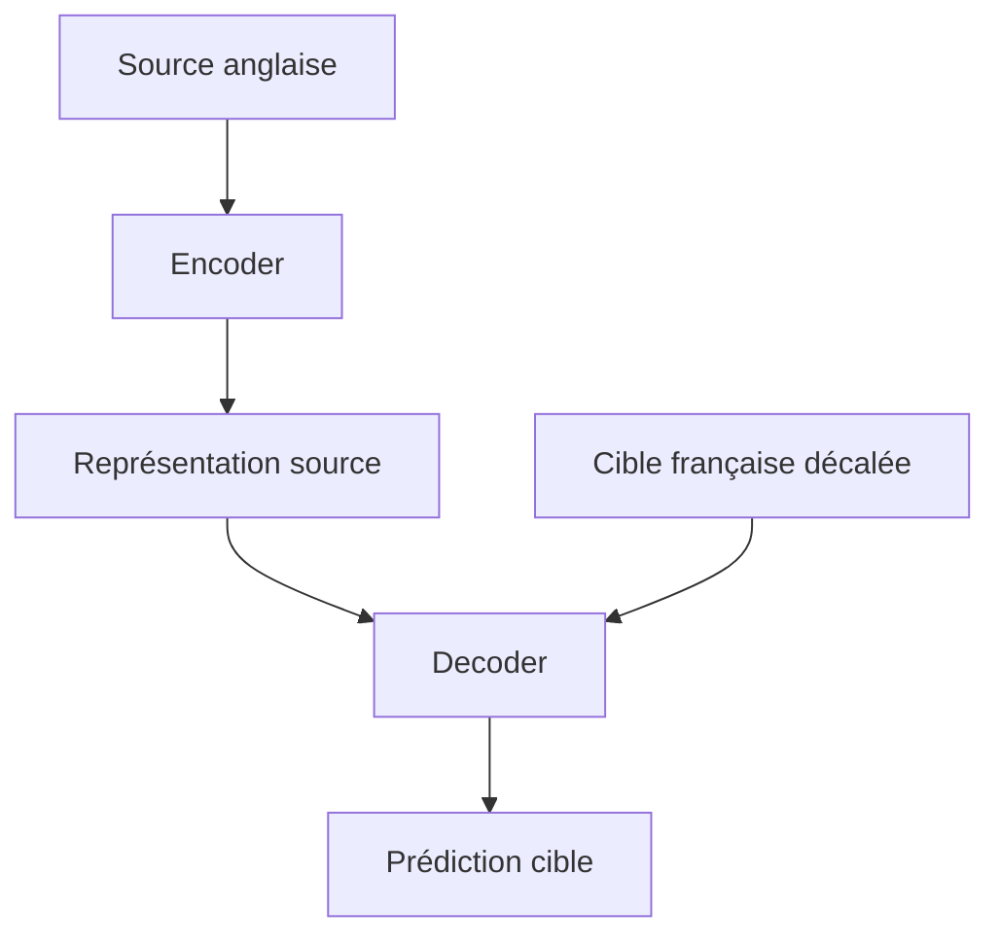

Cette structure reste très importante dans les modèles modernes.

---

## 19.3 Pourquoi ne pas tout faire avec un decoder-only ?

Les modèles decoder-only sont extrêmement flexibles.

Nous pouvons mettre dans le prompt :

```txt
Traduis en français : The black cat sleeps.
```

et le modèle génère :

```txt
Le chat noir dort.
```

Mais l’architecture encoder-decoder garde certains avantages.

Elle sépare explicitement :

* l’entrée à comprendre ;
* la sortie à générer.

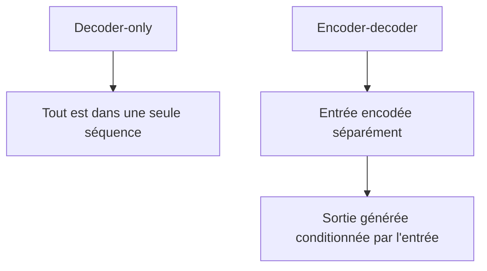

Cette séparation est utile lorsque la tâche consiste clairement à transformer une source en cible.

---

## 19.4 Structure générale d’un encoder-decoder

Un modèle encoder-decoder moderne suit cette logique :

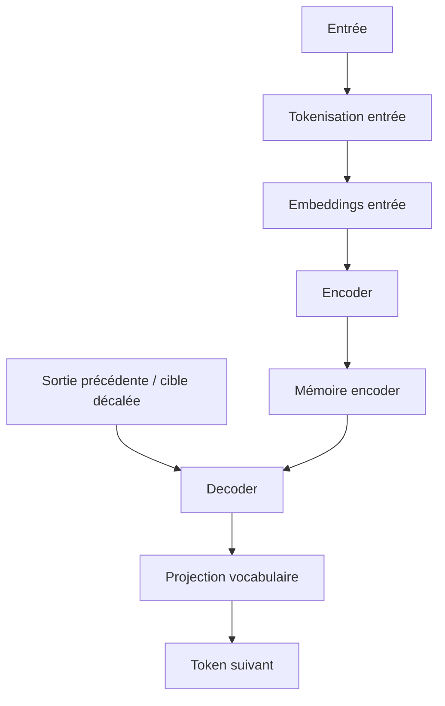

Le decoder utilise deux sources d’information :

1. les tokens déjà générés ;
2. la mémoire de l’entrée produite par l’encoder.

Cela se traduit mathématiquement par :

$$
P(y_t \mid y_{<t}, x)
$$

où :

* $x$ est l’entrée ;
* $y_{<t}$ sont les tokens de sortie déjà générés ;
* $y_t$ est le prochain token à prédire.

---

## 19.5 Les trois attentions dans un encoder-decoder

Un modèle encoder-decoder utilise généralement trois formes d’attention.

### 19.5.1 Self-attention de l’encoder

La source regarde la source.

```txt
Q = source
K = source
V = source
```

Elle est généralement bidirectionnelle.

### 19.5.2 Masked self-attention du decoder

La sortie regarde la sortie déjà générée.

```txt
Q = cible
K = cible
V = cible
avec masque causal
```

### 19.5.3 Cross-attention

La sortie regarde l’entrée encodée.

```txt
Q = decoder
K = encoder
V = encoder
```

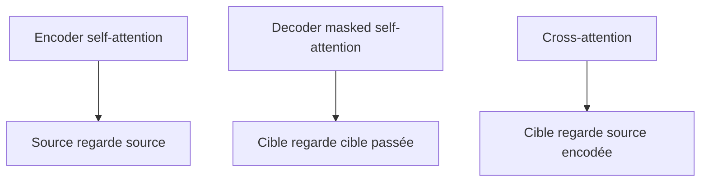

La cross-attention est la grande signature des modèles encoder-decoder.

---

## 19.6 Pourquoi la cross-attention est importante

La cross-attention permet au decoder de revenir vers l’entrée pendant qu’il génère.

Exemple en traduction :

```txt
Source : The black cat sleeps.
Cible partielle : Le chat
```

Pour générer `noir`, le decoder doit regarder `black`.

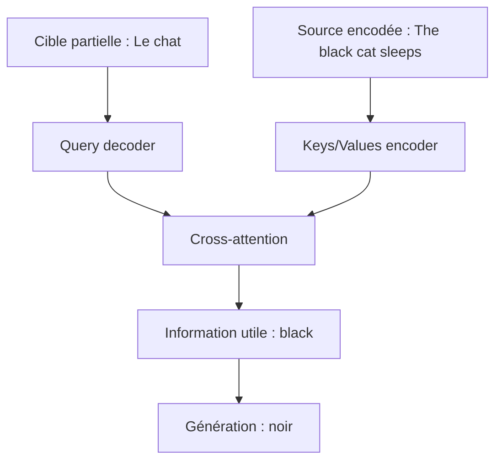

La cross-attention crée donc un lien explicite entre la sortie en cours de génération et l’entrée encodée.

---

## 19.7 Les tâches naturelles des encoder-decoder

Les modèles encoder-decoder sont adaptés aux tâches où l’on transforme une entrée en sortie.

Exemples :

* traduction ;
* résumé ;
* reformulation ;
* correction grammaticale ;
* simplification de texte ;
* génération de titre ;
* question-réponse conditionnée par un passage ;
* transformation de style ;
* normalisation de texte ;
* conversion de formats textuels.

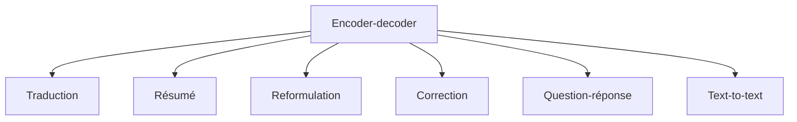

La structure entrée-sortie est naturelle.

---

## 19.8 Le paradigme text-to-text

Le paradigme **text-to-text** consiste à formuler toutes les tâches comme :

```txt
texte en entrée → texte en sortie
```

Exemples :

```txt
translate English to French: The cat sleeps.
→ Le chat dort.
```

```txt
summarize: [long document]
→ [résumé]
```

```txt
grammar correction: He go to school.
→ He goes to school.
```

```txt
question: Où est Paris ? context: Paris est la capitale de la France.
→ en France
```

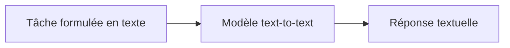

Ce paradigme rend l’architecture très générale.

---

## 19.9 T5 : Text-to-Text Transfer Transformer

T5 est l’un des modèles encoder-decoder modernes les plus importants.

Son nom signifie :

```txt
Text-to-Text Transfer Transformer
```

L’idée centrale est :

> Toutes les tâches NLP sont converties en tâches text-to-text.

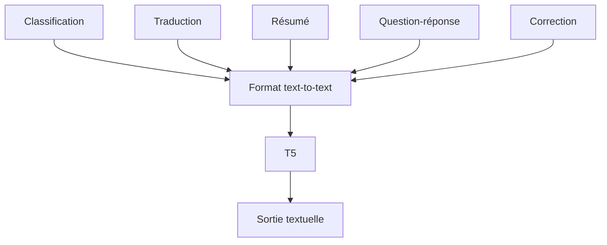

Au lieu d’avoir une architecture différente pour chaque tâche, on utilise un format unifié.

---

## 19.10 Exemple : classification avec T5

Une classification peut devenir une génération de texte.

Au lieu de produire directement une classe numérique, T5 génère le nom de la classe.

Exemple :

```txt
sst2 sentence: Ce film est excellent.
```

Sortie :

```txt
positive
```

Autre exemple :

```txt
sst2 sentence: Ce film est ennuyeux.
```

Sortie :

```txt
negative
```

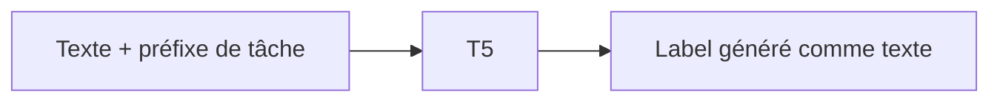

La classification devient donc une génération contrôlée.

---

## 19.11 Exemple : traduction avec T5

Pour la traduction, on indique la tâche dans l’entrée.

```txt
translate English to French: The black cat sleeps.
```

Sortie :

```txt
Le chat noir dort.
```

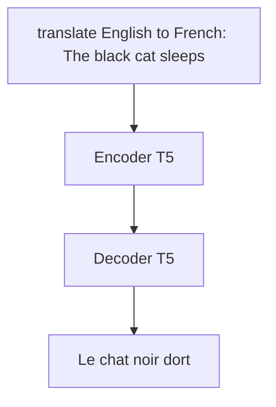

Le préfixe de tâche aide le modèle à savoir ce qu’il doit faire.

---

## 19.12 Exemple : résumé avec T5

Entrée :

```txt
summarize: [long article]
```

Sortie :

```txt
[short summary]
```

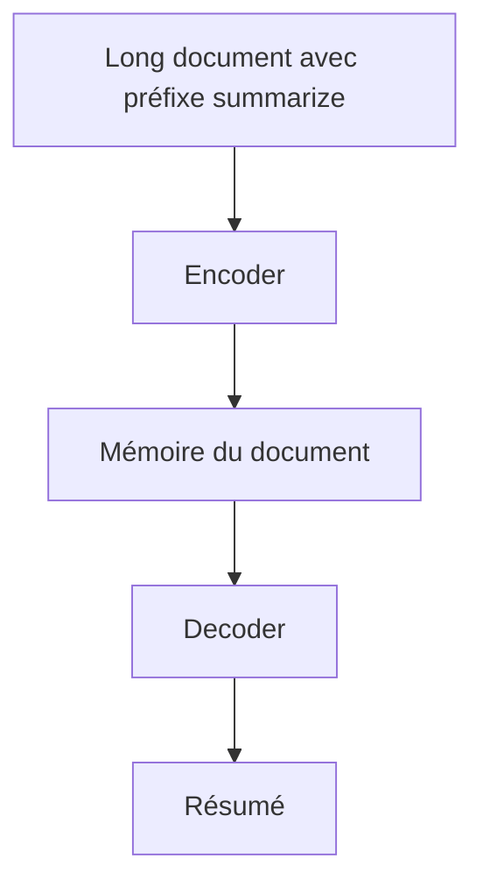

L’encoder lit le document.

Le decoder génère une version condensée.

La cross-attention permet au decoder de se référer au document pendant la génération.

---

## 19.13 Exemple : question-réponse avec T5

Une tâche de question-réponse peut être formulée ainsi :

```txt
question: Quelle est la capitale de la France ?
context: La France a pour capitale Paris.
```

Sortie :

```txt
Paris
```

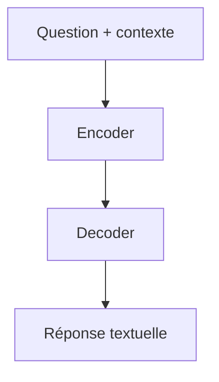

Contrairement à BERT extractif, T5 peut générer une réponse textuelle, pas seulement extraire un span.

---

## 19.14 Pourquoi les préfixes de tâche sont utiles

Dans T5, les préfixes indiquent au modèle la tâche à effectuer.

Exemples :

```txt
translate English to German:
summarize:
cola sentence:
sst2 sentence:
question:
```

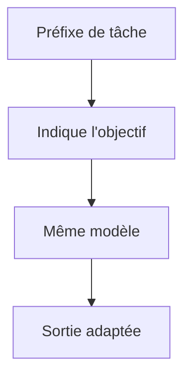

Cela transforme un modèle unique en système multitâche.

Le préfixe joue un rôle proche d’une instruction courte.

---

## 19.15 Préentraînement de T5 : débruitage textuel

T5 n’est pas seulement entraîné sur des tâches supervisées.

Il utilise aussi un objectif de préentraînement de type **denoising**, ou débruitage.

On corrompt un texte, puis le modèle doit reconstruire les morceaux manquants.

Exemple simplifié :

Texte original :

```txt
Le chat noir dort sur le canapé.
```

Texte corrompu :

```txt
Le chat <extra_id_0> sur le canapé.
```

Sortie attendue :

```txt
<extra_id_0> noir dort
```

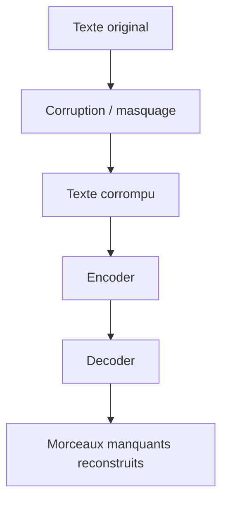

Le modèle apprend ainsi à reconstruire du texte à partir d’un contexte partiel.

---

## 19.16 T5 et les tokens sentinelles

T5 utilise des tokens spéciaux appelés parfois **sentinel tokens**.

Exemple :

```txt
Le <extra_id_0> dort sur <extra_id_1>.
```

Sortie :

```txt
<extra_id_0> chat noir <extra_id_1> le canapé
```

Ces tokens indiquent les zones manquantes à reconstruire.

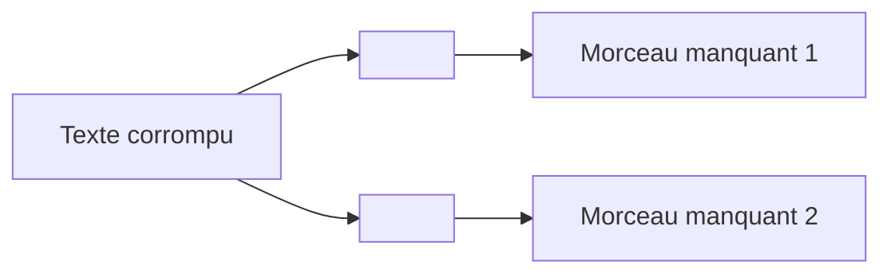

Ce format est adapté à une architecture encoder-decoder.

L’encoder lit le texte corrompu.

Le decoder génère les morceaux manquants.

---

## 19.17 BART : un autoencodeur débruiteur

BART est un autre modèle encoder-decoder important.

Il combine des idées proches de BERT et GPT :

* un encoder bidirectionnel ;
* un decoder autoregressif ;
* un objectif de reconstruction de texte corrompu.

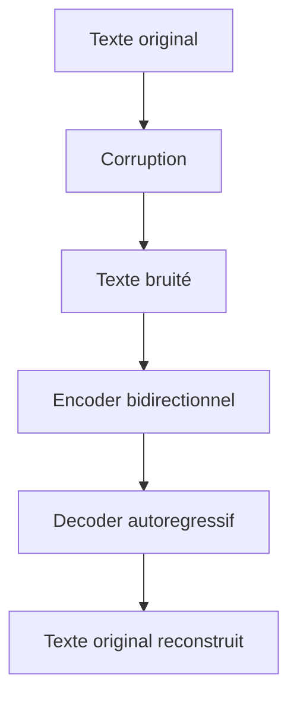

BART peut être vu comme un modèle de **denoising sequence-to-sequence**.

---

## 19.18 Les corruptions dans BART

BART peut utiliser plusieurs types de corruption :

* suppression de tokens ;
* masquage de spans ;
* permutation de phrases ;
* rotation de document ;
* insertion de bruit ;
* remplacement de morceaux par un masque.

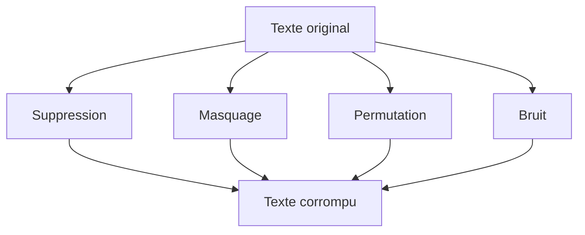

Le modèle apprend à reconstruire un texte propre.

Cette stratégie est particulièrement utile pour le résumé et la génération conditionnée.

---

## 19.19 BART pour le résumé

Pour le résumé, BART lit un document avec son encoder.

Puis son decoder génère un résumé.

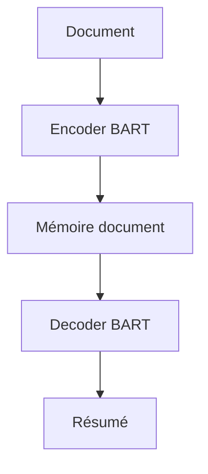

Son préentraînement par reconstruction le rend bien adapté à ce type de tâche.

Le résumé demande souvent de :

* comprendre un texte long ;
* sélectionner l’information importante ;
* reformuler ;
* générer une sortie cohérente.

---

## 19.20 BART pour la reformulation

BART peut aussi reformuler.

Entrée :

```txt
Cette phrase est mal écrite et peu claire.
```

Sortie :

```txt
Cette phrase manque de clarté et doit être reformulée.
```

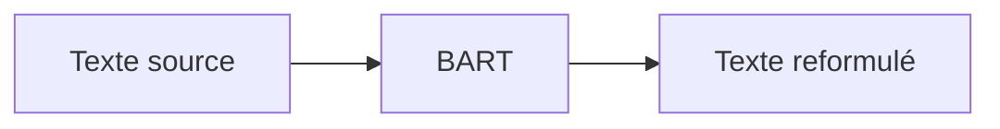

L’architecture encoder-decoder est naturellement adaptée à cette transformation.

---

## 19.21 T5 vs BART

T5 et BART sont tous deux encoder-decoder, mais leur philosophie diffère.

| Modèle | Idée principale                   | Format            |
| ------ | --------------------------------- | ----------------- |
| T5     | Toutes les tâches en text-to-text | Préfixes de tâche |
| BART   | Reconstruction de texte corrompu  | Denoising seq2seq |

```mermaid
flowchart TD
    A["Encoder-decoder modernes"] --> B["T5"]
    A --> C["BART"]

    B --> D["Text-to-text multitâche"]
    C --> E["Denoising autoencoder"]
```

Les deux peuvent être utilisés pour des tâches de génération conditionnée.

---

## 19.22 Comparaison avec BERT

BERT est encoder-only.

Il lit une entrée complète et produit des représentations.

T5 et BART ajoutent un decoder autoregressif.

Ils peuvent donc générer naturellement une sortie textuelle.

```mermaid
flowchart TD
    A["BERT"] --> B["Encoder-only"]
    B --> C["Compréhension / extraction"]

    D["T5 / BART"] --> E["Encoder-decoder"]
    E --> F["Compréhension + génération"]
```

BERT est très bon pour extraire ou classifier.

T5 et BART sont meilleurs pour générer une sortie conditionnée par une entrée.

---

## 19.23 Comparaison avec GPT

GPT est decoder-only.

Il met tout dans une seule séquence de contexte.

T5 et BART séparent l’entrée et la sortie.

```mermaid
flowchart TD
    A["GPT"] --> B["Prompt unique"]
    B --> C["Continuation autoregressive"]

    D["T5 / BART"] --> E["Encoder pour l'entrée"]
    E --> F["Decoder pour la sortie"]
```

GPT est très flexible pour le dialogue et la génération ouverte.

T5/BART sont très structurés pour les tâches entrée-sortie.

---

## 19.24 Exemple comparatif : résumé

Avec GPT, on peut écrire :

```txt
Résume le texte suivant :
[document]
```

Tout est dans le prompt.

Avec T5/BART :

```txt
Entrée encoder : document
Sortie decoder : résumé
```

```mermaid
flowchart TD
    A["GPT decoder-only"] --> B["Document dans le prompt"]
    B --> C["Continuation : résumé"]

    D["Encoder-decoder"] --> E["Document encodé"]
    E --> F["Résumé généré par decoder"]
```

Les deux peuvent fonctionner.

Mais encoder-decoder représente explicitement la tâche comme une transformation.

---

## 19.25 Exemple comparatif : traduction

Avec GPT :

```txt
Translate to French: The black cat sleeps.
```

Avec encoder-decoder :

```txt
Encoder: The black cat sleeps.
Decoder: Le chat noir dort.
```

```mermaid
flowchart LR
    A["Source"] --> B["Encoder"]
    B --> C["Mémoire source"]
    C --> D["Decoder"]
    D --> E["Traduction"]
```

En traduction supervisée, les encoder-decoder restent très naturels.

---

## 19.26 Pourquoi encoder-decoder peut être plus contrôlable

Dans un encoder-decoder, l’entrée est clairement séparée de la sortie.

Cela peut faciliter :

* la supervision ;
* l’alignement source-cible ;
* la traduction ;
* la génération conditionnée ;
* l’évaluation ;
* l’analyse de la cross-attention.

```mermaid
flowchart TD
    A["Entrée séparée"] --> B["Encoder"]
    C["Sortie séparée"] --> D["Decoder"]
    B --> E["Cross-attention explicite"]
    E --> D
```

Cette structure donne un cadre plus explicite que le prompt unique.

---

## 19.27 Pourquoi decoder-only peut être plus flexible

Le decoder-only est moins structuré, mais plus universel dans son interface.

Tout peut être écrit dans le prompt :

* instruction ;
* entrée ;
* exemples ;
* format attendu ;
* contexte ;
* dialogue.

```mermaid
flowchart TD
    A["Prompt unique"] --> B["Instruction"]
    A --> C["Entrée"]
    A --> D["Exemples"]
    A --> E["Contexte"]
    A --> F["Historique"]
    F --> G["Decoder-only"]
```

Cela rend GPT très flexible pour les assistants.

Mais cette flexibilité peut aussi rendre le contrôle plus difficile.

---

## 19.28 Encoder-decoder et multitâche

Les modèles encoder-decoder peuvent être entraînés sur plusieurs tâches.

Exemple :

```txt
translate English to French: ...
summarize: ...
question: ...
grammar correction: ...
```

```mermaid
flowchart TD
    A["Tâches multiples"] --> B["Format text-to-text"]
    B --> C["Modèle encoder-decoder"]
    C --> D["Apprentissage multitâche"]
```

Le modèle apprend à utiliser le préfixe ou le format d’entrée pour choisir la tâche.

Cela permet de mutualiser les connaissances.

---

## 19.29 Encoder-decoder et données supervisées

Les tâches encoder-decoder utilisent souvent des paires :

```txt
entrée → sortie
```

Exemples :

| Tâche            | Entrée              | Sortie            |
| ---------------- | ------------------- | ----------------- |
| Traduction       | phrase source       | phrase traduite   |
| Résumé           | document            | résumé            |
| Correction       | phrase fautive      | phrase corrigée   |
| Reformulation    | phrase originale    | phrase reformulée |
| Question-réponse | question + contexte | réponse           |

```mermaid
flowchart LR
    A["Entrée"] --> B["Modèle"]
    B --> C["Sortie cible"]
```

Ce format est très pratique pour l’apprentissage supervisé.

---

## 19.30 Entraînement d’un encoder-decoder

Pendant l’entraînement, nous utilisons le teacher forcing.

Entrée :

```txt
source
```

Cible complète :

```txt
<BOS> sortie correcte <EOS>
```

On donne au decoder la cible décalée.

```mermaid
flowchart TD
    A["Entrée source"] --> B["Encoder"]
    C["Cible décalée"] --> D["Decoder"]
    B --> D
    D --> E["Logits"]
    F["Cible attendue"] --> G["Cross-entropy"]
    E --> G
```

Le modèle apprend :

$$
P(y_t \mid y_{<t}, x)
$$

---

## 19.31 Inférence d’un encoder-decoder

Pendant l’inférence :

1. l’encoder lit l’entrée une seule fois ;
2. le decoder génère la sortie token par token ;
3. à chaque étape, le decoder utilise la cross-attention vers l’encoder.

```mermaid
flowchart TD
    A["Entrée"] --> B["Encoder"]
    B --> C["Mémoire encoder"]

    D["<BOS>"] --> E["Decoder"]
    C --> E
    E --> F["Token généré"]
    F --> G["Ajout à la sortie partielle"]
    G --> E
```

L’encoder est calculé une fois.

Le decoder est autoregressif.

---

## 19.32 KV cache dans l’encoder-decoder

En inférence, on peut aussi utiliser du cache.

### Cache côté decoder

Comme dans GPT, on peut stocker les Keys et Values des tokens déjà générés.

### Cache côté cross-attention

Les Keys et Values issues de l’encoder sont fixes pour toute la génération.

On peut donc les pré-calculer.

```mermaid
flowchart TD
    A["Encoder output"] --> B["K,V cross-attention pré-calculés"]
    C["Tokens générés"] --> D["K,V decoder cache"]
    B --> E["Decoder step"]
    D --> E
```

Cela rend l’inférence plus efficace.

---

## 19.33 Avantages des modèles encoder-decoder

Les avantages principaux sont :

* séparation claire entrée/sortie ;
* cross-attention explicite ;
* excellente adaptation aux tâches de transformation ;
* bonne structure pour traduction et résumé ;
* préentraînement par débruitage efficace ;
* multitâche text-to-text naturel.

```mermaid
flowchart TD
    A["Encoder-decoder"] --> B["Entrée/sortie séparées"]
    A --> C["Cross-attention"]
    A --> D["Transformation contrôlée"]
    A --> E["Text-to-text"]
```

Ce sont des modèles très puissants pour la génération conditionnée.

---

## 19.34 Limites des modèles encoder-decoder

Ils ont aussi des limites :

* architecture plus complexe ;
* coût de l’encoder + decoder ;
* moins simples pour dialogue libre ;
* besoin de données entrée-sortie pour certaines tâches ;
* inférence toujours autoregressive côté decoder ;
* contexte long toujours coûteux.

```mermaid
flowchart TD
    A["Limites encoder-decoder"] --> B["Complexité"]
    A --> C["Coût encoder + decoder"]
    A --> D["Moins naturel pour dialogue libre"]
    A --> E["Decoder autoregressif"]
```

Ils ne remplacent donc pas totalement les decoder-only.

---

## 19.35 Quand préférer encoder-decoder ?

Nous pouvons préférer un encoder-decoder quand :

* l’entrée est longue et structurée ;
* la sortie doit être fortement conditionnée par l’entrée ;
* la tâche est une transformation claire ;
* nous avons des paires entrée-sortie ;
* nous voulons un modèle spécialisé pour traduction, résumé ou correction.

```mermaid
flowchart TD
    A["Tâche"] --> B{"Entrée et sortie clairement séparées ?"}
    B -->|"Oui"| C["Encoder-decoder pertinent"]
    B -->|"Non / dialogue ouvert"| D["Decoder-only souvent plus naturel"]
```

Exemples typiques :

```txt
document → résumé
phrase source → traduction
phrase fautive → phrase corrigée
question + contexte → réponse
```

---

## 19.36 Quand préférer decoder-only ?

Nous pouvons préférer un decoder-only quand :

* nous voulons un assistant généraliste ;
* la tâche peut être formulée par prompt ;
* nous voulons du dialogue ;
* nous voulons de la génération ouverte ;
* nous voulons un modèle unique pour beaucoup de tâches ;
* l’interface conversationnelle est centrale.

```mermaid
flowchart TD
    A["Besoin"] --> B["Dialogue"]
    A --> C["Prompt flexible"]
    A --> D["Génération ouverte"]
    B --> E["Decoder-only"]
    C --> E
    D --> E
```

C’est pourquoi les LLM conversationnels modernes sont souvent decoder-only.

---

## 19.37 Encoder-decoder et hallucinations

Les modèles encoder-decoder peuvent aussi halluciner.

Même s’ils ont une entrée claire, le decoder reste génératif.

Il peut :

* ajouter une information non présente ;
* omettre une information importante ;
* reformuler incorrectement ;
* produire une traduction fluide mais infidèle.

```mermaid
flowchart TD
    A["Entrée source"] --> B["Encoder"]
    B --> C["Decoder génératif"]
    C --> D["Sortie plausible"]
    D --> E["Risque d'ajout ou omission"]
```

La cross-attention aide, mais ne garantit pas une fidélité parfaite.

---

## 19.38 Fidélité à la source

Dans les tâches comme résumé ou traduction, la fidélité est essentielle.

Une bonne sortie doit être :

* fluide ;
* grammaticalement correcte ;
* fidèle à l’entrée ;
* complète ;
* concise si demandé.

```mermaid
flowchart TD
    A["Bonne génération conditionnée"] --> B["Fluence"]
    A --> C["Fidélité"]
    A --> D["Complétude"]
    A --> E["Respect de la consigne"]
```

La difficulté est de trouver un équilibre entre reformulation et conservation du sens.

---

## 19.39 Cross-attention et interprétabilité

La cross-attention peut parfois aider à analyser quelles parties de l’entrée sont utilisées pendant la génération.

Exemple :

```txt
Source : The black cat sleeps.
Sortie : Le chat noir dort.
```

On peut observer que `noir` regarde fortement `black`.

```mermaid
flowchart LR
    A["black"] -. "cross-attention" .-> B["noir"]
    C["cat"] -. "cross-attention" .-> D["chat"]
    E["sleeps"] -. "cross-attention" .-> F["dort"]
```

Mais attention : les poids d’attention ne sont pas toujours une explication complète du comportement du modèle.

Ils donnent un indice, pas une preuve absolue.

---

## 19.40 Encoder-decoder et alignement source-cible

En traduction, le modèle apprend implicitement des alignements.

Exemple :

```txt
The black cat
Le chat noir
```

L’ordre change :

```txt
black cat → chat noir
```

```mermaid
flowchart LR
    A["black"] -.-> D["noir"]
    B["cat"] -.-> C["chat"]
```

La cross-attention permet au decoder de retrouver les bons éléments source même si l’ordre change.

C’est l’un des grands avantages de l’architecture.

---

## 19.41 Encoder-decoder et résumé abstractive

Un résumé peut être :

* extractif ;
* abstractive.

### Résumé extractif

On sélectionne des phrases existantes.

### Résumé abstractive

On reformule et génère une nouvelle version condensée.

Les modèles encoder-decoder sont particulièrement adaptés au résumé abstractive.

```mermaid
flowchart TD
    A["Document"] --> B["Encoder"]
    B --> C["Compréhension globale"]
    C --> D["Decoder"]
    D --> E["Résumé reformulé"]
```

Le decoder peut générer une phrase qui n’existe pas telle quelle dans le document.

---

## 19.42 Encoder-decoder et correction grammaticale

Correction :

```txt
He go to school every day.
```

Sortie :

```txt
He goes to school every day.
```

```mermaid
flowchart LR
    A["Phrase incorrecte"] --> B["Encoder"]
    B --> C["Decoder"]
    C --> D["Phrase corrigée"]
```

Le modèle doit conserver la majorité de l’entrée tout en corrigeant certains éléments.

C’est une tâche typique de transformation.

---

## 19.43 Encoder-decoder et simplification

Simplification :

```txt
Le patient présente une symptomatologie respiratoire aiguë.
```

Sortie :

```txt
Le patient a des problèmes respiratoires soudains.
```

```mermaid
flowchart LR
    A["Texte complexe"] --> B["Encoder-decoder"]
    B --> C["Texte simplifié"]
```

Le modèle doit préserver le sens tout en adaptant le niveau de langue.

---

## 19.44 Encoder-decoder et style transfer

Transformation de style :

```txt
Texte familier → texte formel
```

Exemple :

```txt
Franchement, ce truc marche pas.
```

Sortie :

```txt
Ce dispositif ne fonctionne pas correctement.
```

```mermaid
flowchart LR
    A["Style source"] --> B["Encoder"]
    B --> C["Decoder"]
    C --> D["Style cible"]
```

Encore une fois, il s’agit d’une transformation entrée-sortie.

---

## 19.45 Encoder-decoder et traduction spécialisée

Dans des domaines spécialisés, on peut entraîner ou fine-tuner un modèle encoder-decoder sur des paires spécialisées :

* juridique ;
* médical ;
* technique ;
* informatique ;
* administratif ;
* scientifique.

```mermaid
flowchart TD
    A["Corpus parallèle spécialisé"] --> B["Fine-tuning encoder-decoder"]
    B --> C["Traduction spécialisée"]
```

La structure source-cible est très adaptée à ce type de supervision.

---

## 19.46 Encoder-decoder et données bruitées

Un avantage des objectifs de débruitage est qu’ils permettent d’apprendre à partir de texte non annoté.

On crée artificiellement une entrée corrompue.

Le texte original devient la cible.

```mermaid
flowchart TD
    A["Texte non annoté"] --> B["Corruption artificielle"]
    B --> C["Entrée"]
    A --> D["Cible"]
    C --> E["Entraînement encoder-decoder"]
    D --> E
```

Cela permet de préentraîner des modèles sur de grands corpus sans avoir besoin de labels manuels.

---

## 19.47 Fine-tuning des encoder-decoder

Après préentraînement, on peut fine-tuner un encoder-decoder sur une tâche précise.

Exemple résumé :

```txt
Entrée : article
Sortie : résumé humain
```

Exemple traduction :

```txt
Entrée : phrase anglaise
Sortie : phrase française
```

```mermaid
flowchart TD
    A["Modèle préentraîné"] --> B["Données entrée-sortie spécifiques"]
    B --> C["Fine-tuning"]
    C --> D["Modèle spécialisé"]
```

Le modèle adapte ses représentations et sa génération à la tâche.

---

## 19.48 Évaluation des encoder-decoder

Selon la tâche, on utilise différentes métriques :

* BLEU pour traduction ;
* ROUGE pour résumé ;
* exact match pour certaines questions-réponses ;
* F1 ;
* métriques humaines ;
* évaluation de fidélité ;
* évaluation de factualité.

```mermaid
flowchart TD
    A["Évaluation"] --> B["Traduction : BLEU"]
    A --> C["Résumé : ROUGE"]
    A --> D["QA : EM/F1"]
    A --> E["Évaluation humaine"]
    A --> F["Fidélité / factualité"]
```

Les métriques automatiques sont utiles, mais imparfaites.

---

## 19.49 Limites des métriques automatiques

Une sortie peut être correcte même si elle ne correspond pas exactement à la référence.

Exemple traduction :

Référence :

```txt
Le chat dort sur le canapé.
```

Prédiction :

```txt
Le chat est endormi sur le sofa.
```

Les deux sont proches, mais les mots diffèrent.

```mermaid
flowchart TD
    A["Référence"] --> C["Métrique automatique"]
    B["Prédiction"] --> C
    C --> D["Score utile mais imparfait"]
```

C’est pourquoi l’évaluation humaine reste importante dans les tâches de génération.

---

## 19.50 Erreur fréquente : croire que T5 est un GPT

T5 n’est pas un GPT.

T5 est encoder-decoder.

GPT est decoder-only.

```mermaid
flowchart TD
    A["T5"] --> B["Encoder + Decoder"]
    C["GPT"] --> D["Decoder-only"]
```

Ils peuvent tous deux générer du texte, mais leur architecture et leur logique d’entrée sont différentes.

---

## 19.51 Erreur fréquente : croire que BART est seulement un BERT

BART contient un encoder bidirectionnel, comme BERT, mais il contient aussi un decoder autoregressif.

```mermaid
flowchart TD
    A["BERT"] --> B["Encoder-only"]
    C["BART"] --> D["Encoder + Decoder"]
```

BART est donc plus naturellement génératif que BERT.

---

## 19.52 Erreur fréquente : croire que encoder-decoder est toujours meilleur pour tout

Encoder-decoder est très adapté aux tâches entrée-sortie.

Mais pour le dialogue généraliste, un decoder-only peut être plus simple et plus flexible.

```mermaid
flowchart TD
    A["Tâche de transformation"] --> B["Encoder-decoder souvent adapté"]
    C["Dialogue ouvert"] --> D["Decoder-only souvent adapté"]
```

Il n’existe pas d’architecture universellement meilleure dans tous les cas.

---

## 19.53 Erreur fréquente : oublier le coût de l’encoder

Dans un encoder-decoder, l’encoder a un coût.

Le decoder aussi.

Et la cross-attention ajoute un coût supplémentaire.

```mermaid
flowchart TD
    A["Coût total"] --> B["Encoder"]
    A --> C["Decoder"]
    A --> D["Cross-attention"]
```

L’architecture est donc plus lourde qu’un simple decoder-only de taille comparable dans certains scénarios.

---

## 19.54 Erreur fréquente : croire que la cross-attention garantit la fidélité

La cross-attention aide le decoder à regarder l’entrée.

Mais elle ne garantit pas que la sortie sera fidèle.

```mermaid
flowchart TD
    A["Cross-attention"] --> B["Lien vers la source"]
    B --> C["Améliore le conditionnement"]
    C --> D["Mais erreurs possibles"]
```

Un modèle peut encore omettre, ajouter ou déformer des informations.

---

## 19.55 Synthèse mathématique

Un encoder-decoder modélise :

$$
P(y \mid x)
$$

avec :

$$
P(y_1, ..., y_m \mid x)
=======================

\prod_{t=1}^{m} P(y_t \mid y_{<t}, x)
$$

L’encoder produit :

$$
H = Encoder(x)
$$

Le decoder calcule :

$$
P(y_t \mid y_{<t}, H)
$$

La cross-attention utilise :

$$
Q = \text{états decoder}
$$

$$
K,V = H
$$

Le modèle apprend donc à générer une sortie autoregressive conditionnée par une entrée encodée.

---

## 19.56 Schéma global de synthèse

```mermaid
flowchart TD
    A["Entrée texte"] --> B["Tokenisation"]
    B --> C["Encoder"]
    C --> D["Mémoire encoder H"]

    E["Sortie décalée"] --> F["Decoder masked self-attention"]
    D --> G["Cross-attention"]
    F --> G
    G --> H["FFN + couches decoder"]
    H --> I["Projection vocabulaire"]
    I --> J["Token suivant"]

    K["Tâches"] --> L["Traduction"]
    K --> M["Résumé"]
    K --> N["Correction"]
    K --> O["Reformulation"]
    K --> P["Text-to-text"]
```

---

## 19.57 Résumé du chapitre

Nous avons étudié les modèles **encoder-decoder modernes**, en particulier T5 et BART.

Cette famille conserve la structure du Transformer original :

* un encoder pour lire l’entrée ;
* un decoder pour générer la sortie ;
* une cross-attention pour relier la génération à l’entrée.

Nous avons vu que les modèles encoder-decoder sont particulièrement adaptés aux tâches de transformation :

* traduction ;
* résumé ;
* correction ;
* reformulation ;
* simplification ;
* question-réponse conditionnée ;
* text-to-text multitâche.

T5 formule toutes les tâches comme du **text-to-text** : une entrée textuelle produit une sortie textuelle.

BART utilise une logique de **débruitage** : il apprend à reconstruire un texte original à partir d’une version corrompue.

Nous avons comparé cette famille avec BERT et GPT :

* BERT comprend et représente ;
* GPT génère à partir d’un prompt ;
* T5/BART transforment une entrée en sortie.

Le point central est :

> Les modèles encoder-decoder restent essentiels lorsque nous voulons générer une sortie fortement conditionnée par une entrée clairement séparée.

---

## 19.58 Questions de compréhension

### 19.58.1 Question 1

Qu’est-ce qu’un modèle encoder-decoder ?

Réponse attendue : un modèle composé d’un encoder qui lit l’entrée et d’un decoder qui génère la sortie en utilisant la mémoire de l’encoder.

### 19.58.2 Question 2

À quoi sert la cross-attention ?

Réponse attendue : elle permet au decoder de regarder la représentation de l’entrée produite par l’encoder pendant la génération.

### 19.58.3 Question 3

Quelles tâches sont naturellement adaptées aux encoder-decoder ?

Réponse attendue : traduction, résumé, reformulation, correction, simplification, question-réponse conditionnée et tâches text-to-text.

### 19.58.4 Question 4

Que signifie text-to-text dans T5 ?

Réponse attendue : toutes les tâches sont formulées comme une transformation d’un texte d’entrée vers un texte de sortie.

### 19.58.5 Question 5

À quoi servent les préfixes de tâche dans T5 ?

Réponse attendue : ils indiquent au modèle quelle tâche effectuer, par exemple traduire, résumer ou répondre à une question.

### 19.58.6 Question 6

Quel est le principe de préentraînement de BART ?

Réponse attendue : corrompre un texte puis entraîner le modèle à reconstruire le texte original.

### 19.58.7 Question 7

Quelle est la différence principale entre T5 et GPT ?

Réponse attendue : T5 est encoder-decoder, tandis que GPT est decoder-only.

### 19.58.8 Question 8

Quelle est la différence principale entre BERT et BART ?

Réponse attendue : BERT est encoder-only, alors que BART possède un encoder et un decoder, ce qui le rend naturellement génératif.

### 19.58.9 Question 9

Pourquoi la cross-attention ne garantit-elle pas une fidélité parfaite ?

Réponse attendue : parce que le decoder reste génératif et peut encore omettre, ajouter ou déformer des informations.

### 19.58.10 Question 10

Quand préférer un encoder-decoder à un decoder-only ?

Réponse attendue : quand la tâche possède une entrée et une sortie clairement séparées, par exemple traduction, résumé ou correction.

---

## 19.59 Transition vers le chapitre 20

Nous avons maintenant étudié les trois grandes familles textuelles de Transformers :

* encoder-only ;
* decoder-only ;
* encoder-decoder.

Dans le chapitre suivant, nous allons étudier les **Transformers multimodaux et Vision Transformers**.

Nous verrons :

* comment une image peut devenir une séquence de patches ;
* comment ViT adapte le Transformer à la vision ;
* comment texte, image et audio peuvent être représentés comme des tokens ;
* comment fonctionnent les modèles vision-langage ;
* pourquoi les Transformers sont devenus une architecture générale au-delà du texte.

---
> [!info] Livre « Les transformers » — chapitre 19/30
> [[Les transformers — Sommaire|Sommaire]] · [[Les transformers — 18 — Modèles decoder-only GPT et la génération autoregressive|← 18 — Modèles decoder-only GPT et la génération autoregressive]] · [[Les transformers — 20 — Transformers pour la vision|20 — Transformers pour la vision →]]
