> [!info] Livre « Les transformers » — chapitre 20/30
> [[Les transformers — Sommaire|Sommaire]] · [[Les transformers — 19 — Modèles encoder-decoder modernes T5, BART et le paradigme text-to-text|← 19 — Modèles encoder-decoder modernes T5, BART et le paradigme text-to-text]] · [[Les transformers — 21 — Transformers multimodaux|21 — Transformers multimodaux →]]

# Chapitre 20 — Transformers pour la vision
## 20.1 Objectif du chapitre

Dans les chapitres précédents, nous avons étudié les grandes familles de Transformers pour le texte :

* les modèles **encoder-only**, comme BERT ;
* les modèles **decoder-only**, comme GPT ;
* les modèles **encoder-decoder**, comme T5 et BART.

Nous allons maintenant quitter le texte pour étudier l’adaptation des Transformers à la **vision par ordinateur**.

Ce chapitre correspond au chapitre 20 de notre plan : nous allons étudier les Vision Transformers, le découpage de l’image en patches, les patch embeddings, la classification d’image, la comparaison avec les CNN, les Data-efficient Image Transformers, Swin Transformer, ainsi que l’attention locale et hiérarchique. 

L’idée centrale est :

> Une image peut être transformée en une séquence de vecteurs, puis traitée par un Transformer comme une séquence de tokens.

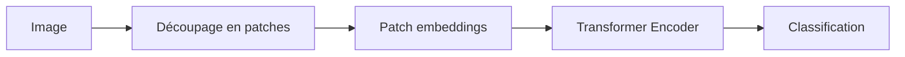

---

## 20.2 Pourquoi adapter les Transformers à la vision ?

Historiquement, la vision par ordinateur a été dominée par les **réseaux convolutionnels**, ou **CNN**.

Les CNN ont été très efficaces pour :

* classification d’image ;
* détection d’objets ;
* segmentation ;
* reconnaissance de formes ;
* analyse de scènes.

Mais après le succès des Transformers en NLP, une question naturelle est apparue :

> Si l’attention fonctionne si bien sur les séquences de mots, pouvons-nous l’utiliser sur les images ?

Pour cela, nous devons transformer l’image en une forme séquentielle.

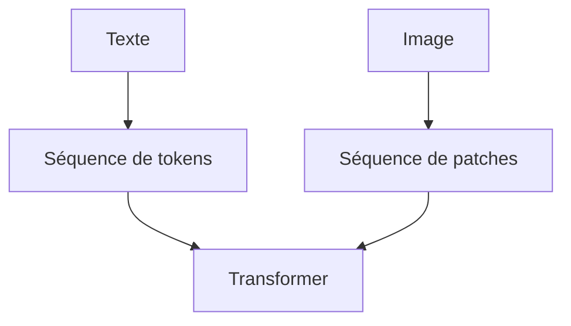

Le Vision Transformer repose précisément sur cette idée.

---

## 20.3 Le problème : une image n’est pas naturellement une phrase

Une phrase est déjà une séquence :

```txt
Le chat dort sur le canapé.
```

Nous pouvons la tokeniser en :

```txt
[Le] [chat] [dort] [sur] [le] [canapé]
```

Une image, elle, est une grille de pixels.

Par exemple, une image RGB peut être représentée par un tenseur :

$$
H \times W \times C
$$

où :

* $H$ est la hauteur ;
* $W$ est la largeur ;
* $C$ est le nombre de canaux, souvent 3 pour RGB.

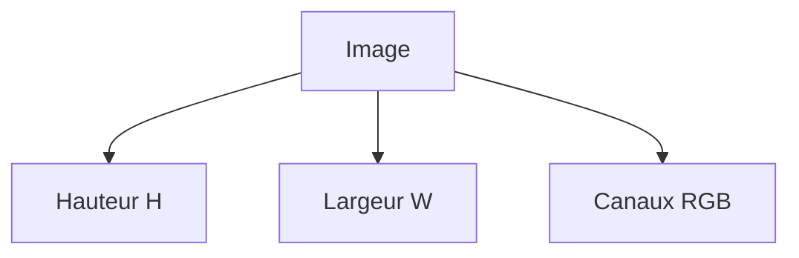

Pour utiliser un Transformer, nous devons convertir cette grille en séquence.

---

## 20.4 L’idée du Vision Transformer

Le **Vision Transformer**, ou **ViT**, propose une méthode simple :

1. découper l’image en petits blocs appelés **patches** ;
2. transformer chaque patch en vecteur ;
3. ajouter une information de position ;
4. envoyer la séquence de vecteurs dans un Transformer Encoder ;
5. utiliser la sortie pour classifier l’image.

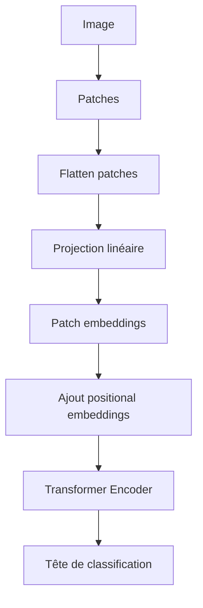

Nous remplaçons donc les mots par des patches d’image.

---

## 20.5 Découpage en patches

Supposons une image de taille :

$$
224 \times 224
$$

Nous choisissons des patches de taille :

$$
16 \times 16
$$

Le nombre de patches est alors :

$$
\frac{224}{16} \times \frac{224}{16}
====================================

## 14 \times 14

196
$$

L’image devient donc une séquence de 196 patches.

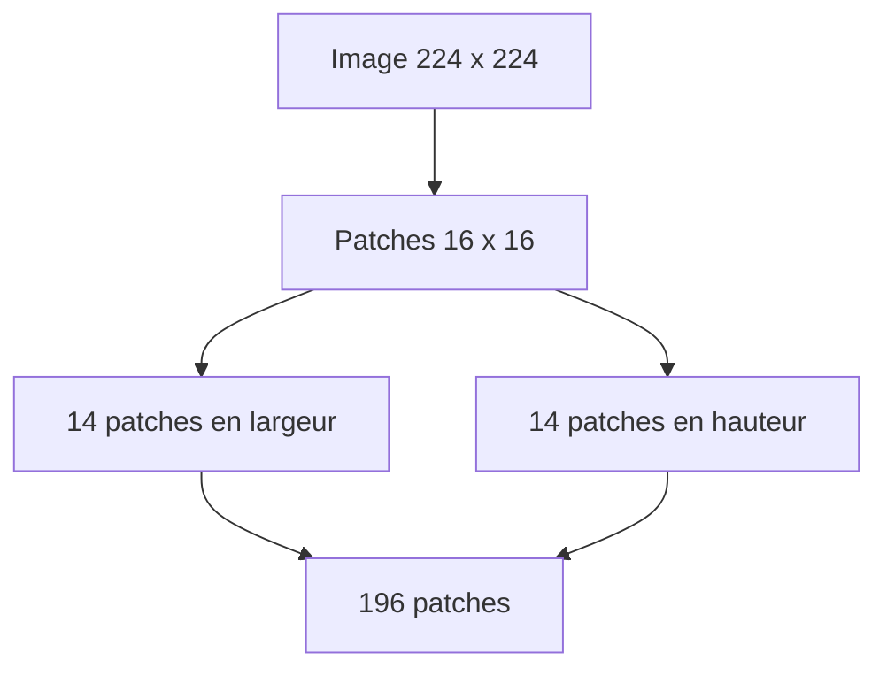

Chaque patch devient l’équivalent d’un token.

---

## 20.6 Patch comme token visuel

Dans le texte, un token est une unité discrète :

```txt
chat
```

Dans une image, un patch est un petit bloc de pixels.

Par exemple :

$$
16 \times 16 \times 3
$$

Cela donne :

$$
768
$$

valeurs par patch.

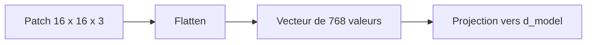

Le patch est ensuite projeté vers une dimension $d_{model}$, comme un embedding de mot.

---

## 20.7 Patch embedding

Chaque patch est aplati puis projeté par une couche linéaire.

Si un patch a une taille :

$$
P \times P \times C
$$

alors son vecteur aplati a une dimension :

$$
P^2C
$$

Ensuite, nous appliquons une projection :

$$
P^2C \rightarrow d_{model}
$$

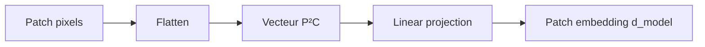

Ainsi, chaque patch devient un vecteur de même dimension que les tokens dans un Transformer texte.

---

## 20.8 Séquence de patches

Après projection, l’image devient :

$$
X \in \mathbb{R}^{N \times d_{model}}
$$

où $N$ est le nombre de patches.

Avec un batch :

$$
X \in \mathbb{R}^{B \times N \times d_{model}}
$$

C’est exactement le type d’entrée qu’un Transformer Encoder peut traiter.

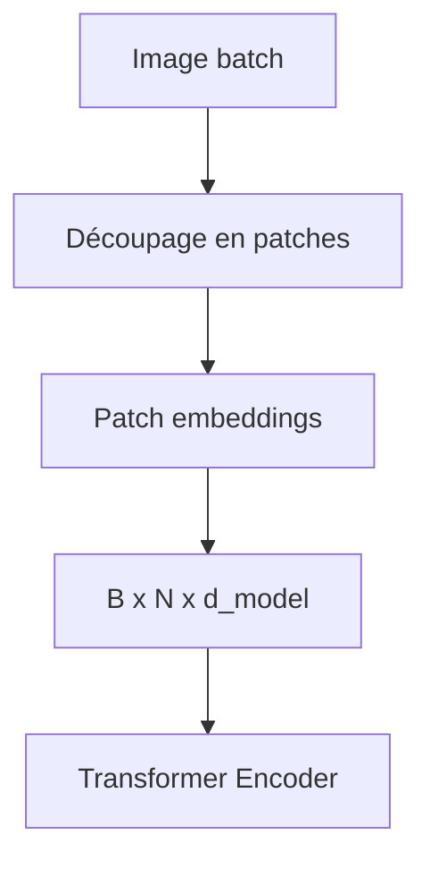

Nous avons donc converti un problème de vision en problème de séquence.

---

## 20.9 Token `[CLS]` dans ViT

Comme BERT, le Vision Transformer peut utiliser un token spécial `[CLS]`.

Ce token est ajouté au début de la séquence de patches.

```txt
[CLS], patch_1, patch_2, patch_3, ..., patch_N
```

Après le Transformer Encoder, la représentation finale de `[CLS]` est utilisée pour classifier l’image.

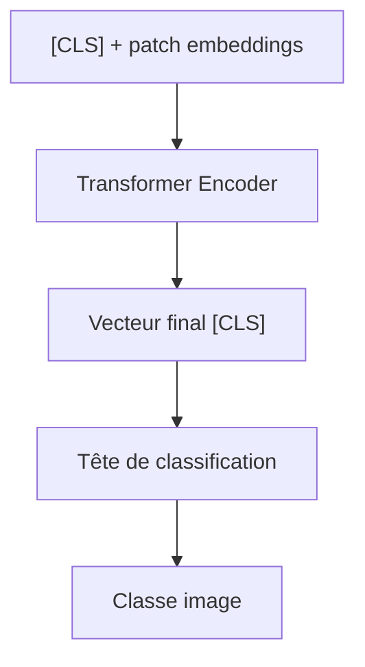

Par exemple :

```txt
chien
chat
voiture
oiseau
```

---

## 20.10 Positional embeddings dans ViT

Le Transformer ne connaît pas naturellement la position des patches.

Or, dans une image, la position est très importante.

Un patch en haut à gauche n’a pas la même signification qu’un patch au centre.

Nous ajoutons donc des **positional embeddings** aux patch embeddings.

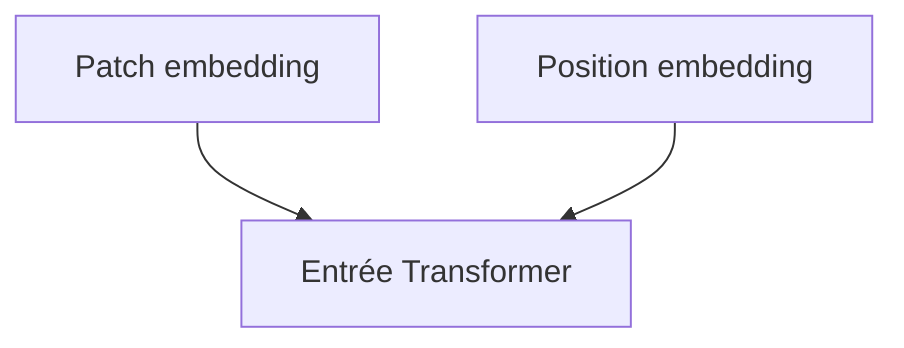

Cela permet au modèle de savoir où se trouve chaque patch dans l’image.

---

## 20.11 Pourquoi l’ordre spatial est important ?

Prenons une image de visage.

Les yeux sont généralement au-dessus du nez.

La bouche est généralement en dessous.

Si nous mélangions les patches sans information de position, le modèle perdrait une partie essentielle de la structure.

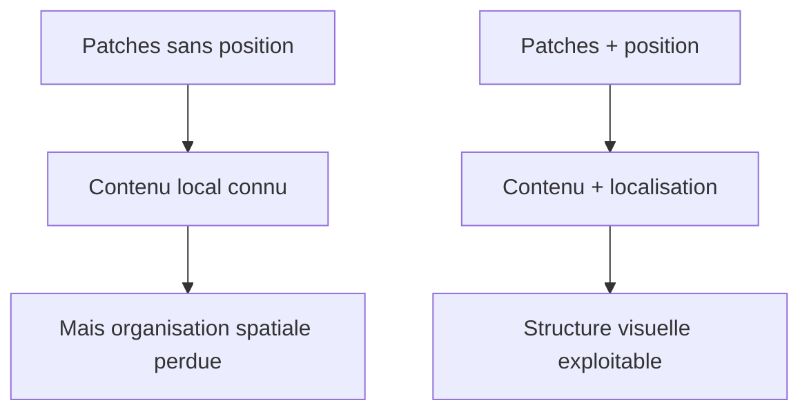

La position est donc indispensable pour la vision.

---

## 20.12 Transformer Encoder dans ViT

Une fois les patch embeddings construits, ViT utilise une pile de blocs Transformer Encoder.

Chaque bloc contient :

* multi-head self-attention ;
* feed-forward network ;
* connexions résiduelles ;
* normalisation.

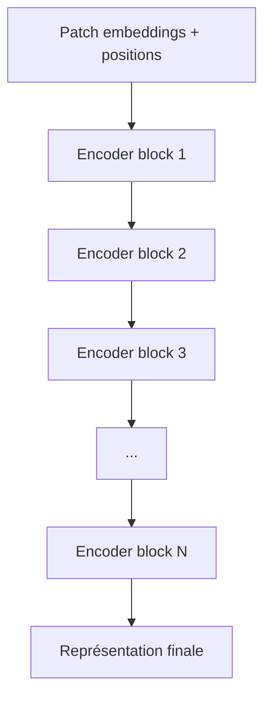

C’est très proche de BERT, sauf que les tokens sont des patches d’image.

---

## 20.13 Self-attention entre patches

Dans ViT, chaque patch peut regarder tous les autres patches.

Un patch en haut à gauche peut interagir avec un patch en bas à droite.

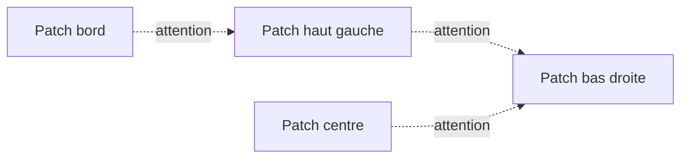

Cela donne au modèle une vision globale dès les premières couches.

C’est différent des CNN classiques, où les relations globales se construisent progressivement.

---

## 20.14 Classification d’image avec ViT

Pour classifier une image, nous procédons ainsi :

1. image ;
2. découpage en patches ;
3. patch embeddings ;
4. ajout du token `[CLS]` ;
5. ajout des positions ;
6. Transformer Encoder ;
7. vecteur `[CLS]` final ;
8. couche linéaire ;
9. softmax sur les classes.

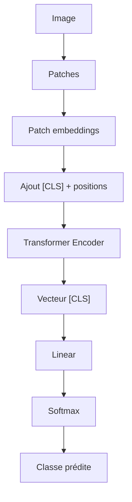

La sortie est une distribution de probabilité sur les classes.

---

## 20.15 Exemple de classification

Image :

```txt
photo d’un chien
```

Classes possibles :

```txt
chien, chat, voiture, avion, cheval
```

Le modèle produit des logits :

| Classe  | Logit |
| ------- | ----: |
| chien   |   5.8 |
| chat    |   1.2 |
| voiture |  -0.7 |
| avion   |  -1.4 |
| cheval  |   0.3 |

Après softmax, `chien` obtient la probabilité la plus élevée.

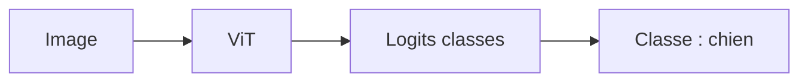

---

## 20.16 Comparaison avec les CNN

Les CNN utilisent des convolutions.

Une convolution applique un filtre local sur l’image.

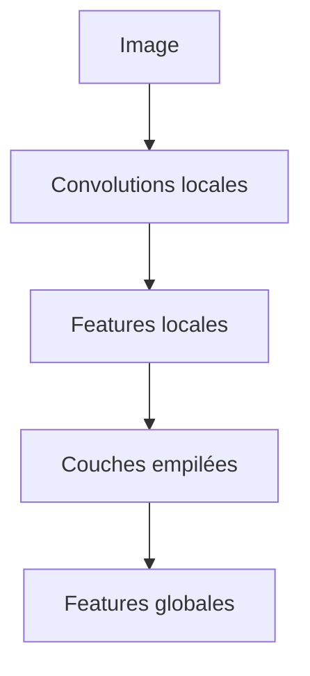

Les CNN ont des biais inductifs forts :

* localité ;
* partage de poids ;
* translation ;
* hiérarchie spatiale.

Les Transformers, eux, utilisent l’attention globale.

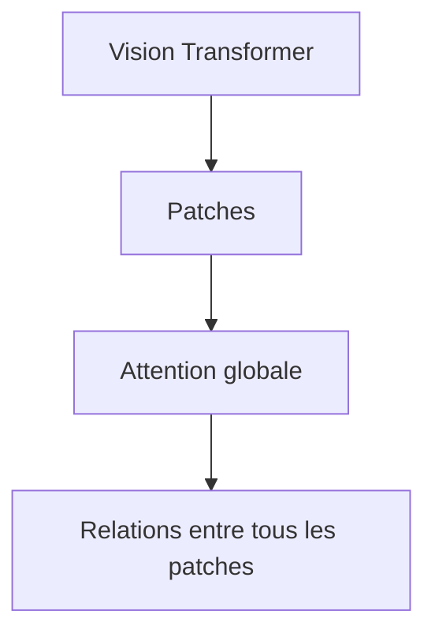

Les deux approches ont des forces différentes.

---

## 20.17 Biais inductifs des CNN

Un biais inductif est une hypothèse intégrée dans l’architecture.

Les CNN supposent que :

* les motifs locaux sont importants ;
* le même motif peut apparaître à différents endroits ;
* les features visuelles peuvent être construites hiérarchiquement.

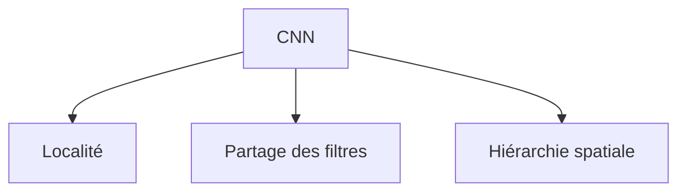

Ces biais sont très adaptés aux images.

C’est pourquoi les CNN fonctionnent bien même avec moins de données que les ViT classiques.

---

## 20.18 Les ViT ont moins de biais inductifs

Un Vision Transformer pur a moins de biais visuels intégrés.

Il ne suppose pas aussi fortement la localité ou la translation.

Cela le rend très flexible.

Mais cela signifie aussi qu’il peut avoir besoin de beaucoup de données pour apprendre ces structures.

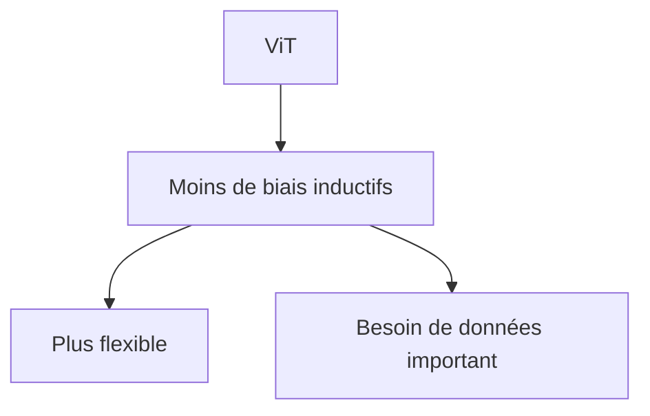

C’est une raison pour laquelle les premiers ViT étaient surtout très performants avec de grands préentraînements.

---

## 20.19 Attention globale : avantage

L’attention globale permet de relier directement des régions éloignées.

Exemple :

* une roue avant ;
* une roue arrière ;
* une carrosserie ;
* un pare-brise.

Le modèle peut relier ces patches pour reconnaître une voiture.

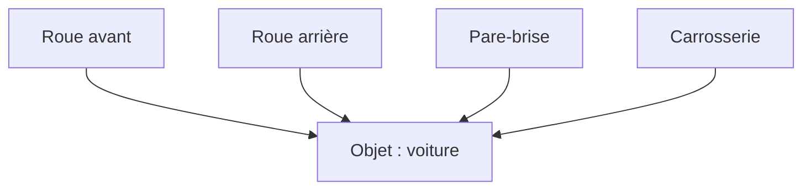

Cette capacité globale est un avantage important des Transformers.

---

## 20.20 Attention globale : coût

Mais l’attention globale a un coût.

Si l’image donne $N$ patches, la matrice d’attention est :

$$
N \times N
$$

Le coût est donc :

$$
O(N^2)
$$

```mermaid
flowchart TD
    A["Nombre de patches N"] --> B["Matrice attention N x N"]
    B --> C["Coût O(N²)"]
```

Si nous augmentons la résolution de l’image, le nombre de patches augmente, et le coût de l’attention augmente rapidement.

---

## 20.21 Exemple de coût avec patches

Image :

$$
224 \times 224
$$

Patch :

$$
16 \times 16
$$

Nombre de patches :

$$
14 \times 14 = 196
$$

Matrice attention :

$$
196 \times 196
$$

soit :

$$
38,416
$$

scores par tête.

Si nous passons à une image :

$$
1024 \times 1024
$$

avec les mêmes patches (16 \times 16) :

$$
64 \times 64 = 4096
$$

patches.

Matrice attention :

$$
4096 \times 4096
$$

soit :

$$
16,777,216
$$

scores par tête.

```mermaid
flowchart TD
    A["224x224"] --> B["196 patches"]
    B --> C["38k scores"]

    D["1024x1024"] --> E["4096 patches"]
    E --> F["16,7M scores"]
```

La résolution change tout.

---

## 20.22 Patch size : compromis

La taille des patches est un compromis.

Si les patches sont grands :

* moins de tokens ;
* coût plus faible ;
* mais perte de détails fins.

Si les patches sont petits :

* plus de tokens ;
* meilleure précision locale ;
* mais coût plus élevé.

```mermaid
flowchart TD
    A["Patchs grands"] --> B["Moins de tokens"]
    A --> C["Moins de coût"]
    A --> D["Moins de détails"]

    E["Patchs petits"] --> F["Plus de tokens"]
    E --> G["Plus de détails"]
    E --> H["Plus de coût"]
```

Le choix de la taille des patches dépend de la tâche.

---

## 20.23 ViT et classification supervisée

Dans le ViT original, le modèle est souvent préentraîné sur de grandes bases d’images, puis fine-tuné sur une tâche cible.

Pipeline :

```mermaid
flowchart TD
    A["Grand dataset d'images"] --> B["Préentraînement ViT"]
    B --> C["Représentations visuelles générales"]
    C --> D["Fine-tuning dataset cible"]
    D --> E["Classificateur final"]
```

Cela ressemble à la logique des modèles de langage préentraînés.

Nous préentraînons un grand modèle général, puis nous l’adaptons à une tâche spécifique.

---

## 20.24 Data-efficient Image Transformers

Les premiers ViT demandaient beaucoup de données.

Les **Data-efficient Image Transformers**, souvent associés à DeiT, cherchent à rendre les Transformers efficaces avec moins de données.

L’idée est d’améliorer l’entraînement avec :

* distillation ;
* meilleures augmentations ;
* régularisation ;
* stratégie d’entraînement adaptée.

```mermaid
flowchart TD
    A["ViT classique"] --> B["Besoin de beaucoup de données"]
    C["DeiT"] --> D["Entraînement plus efficace"]
    D --> E["Moins de données nécessaires"]
```

DeiT montre que l’architecture Transformer peut être compétitive en vision même sans préentraînement gigantesque, si la recette d’entraînement est bien conçue.

---

## 20.25 Distillation dans DeiT

La distillation consiste à entraîner un modèle élève à imiter un modèle professeur.

Dans DeiT, un CNN professeur peut guider un Transformer élève.

```mermaid
flowchart TD
    A["Image"] --> B["CNN professeur"]
    A --> C["Transformer élève"]

    B --> D["Signal de distillation"]
    D --> C

    C --> E["Prédiction finale"]
```

L’idée est que le CNN transmet une partie de ses biais utiles au Transformer.

Cela aide le Transformer à apprendre plus efficacement.

---

## 20.26 Token de distillation

Dans DeiT, on peut utiliser un token spécial de distillation.

Nous avons alors :

```txt
[CLS], [DIST], patch_1, patch_2, ..., patch_N
```

Le token `[CLS]` sert à la classification classique.

Le token `[DIST]` apprend à imiter le professeur.

```mermaid
flowchart TD
    A["Patches + CLS + DIST"] --> B["Transformer"]
    B --> C["Sortie CLS"]
    B --> D["Sortie DIST"]
    C --> E["Loss classification"]
    D --> F["Loss distillation"]
```

Cela montre comment on peut adapter l’architecture Transformer pour améliorer l’apprentissage visuel.

---

## 20.27 Limites du ViT pur

Un ViT pur a plusieurs limites :

* coût élevé pour les hautes résolutions ;
* besoin important de données ;
* absence de hiérarchie spatiale explicite ;
* attention globale coûteuse ;
* moins de biais local qu’un CNN ;
* difficulté pour certaines tâches denses comme segmentation haute résolution.

```mermaid
flowchart TD
    A["ViT pur"] --> B["Attention globale coûteuse"]
    A --> C["Peu de hiérarchie spatiale"]
    A --> D["Besoin de données"]
    A --> E["Résolution élevée difficile"]
```

Ces limites ont motivé des variantes comme Swin Transformer.

---

## 20.28 Swin Transformer : idée générale

Swin Transformer introduit une attention locale et hiérarchique.

Au lieu de faire attention globalement entre tous les patches, le modèle travaille par fenêtres locales.

```mermaid
flowchart TD
    A["Image en patches"] --> B["Fenêtres locales"]
    B --> C["Self-attention dans chaque fenêtre"]
    C --> D["Shifted windows"]
    D --> E["Hiérarchie multi-échelles"]
```

Swin signifie :

```txt
Shifted Window Transformer
```

L’idée est de réduire le coût tout en permettant aux informations de circuler entre fenêtres.

---

## 20.29 Attention par fenêtres

Dans Swin, l’attention est calculée dans des fenêtres locales.

Par exemple, au lieu de faire attention sur tous les patches de l’image, chaque patch regarde seulement les patches de sa fenêtre.

```mermaid
flowchart TD
    A["Image"] --> B["Fenêtre 1"]
    A --> C["Fenêtre 2"]
    A --> D["Fenêtre 3"]
    A --> E["Fenêtre 4"]

    B --> F["Attention locale"]
    C --> G["Attention locale"]
    D --> H["Attention locale"]
    E --> I["Attention locale"]
```

Cela réduit fortement le coût par rapport à l’attention globale.

---

## 20.30 Problème des fenêtres fixes

Si les fenêtres sont toujours fixes, les patches de fenêtres différentes communiquent peu.

Exemple :

```txt
patch A dans fenêtre 1
patch B dans fenêtre 2
```

Ils ne se voient pas directement.

```mermaid
flowchart LR
    A["Fenêtre 1"] -. "peu de communication" .-> B["Fenêtre 2"]
```

Pour résoudre cela, Swin utilise des fenêtres décalées.

---

## 20.31 Shifted windows

Les fenêtres décalées permettent de changer les regroupements entre couches.

Dans une couche, les patches sont groupés d’une façon.

Dans la couche suivante, les fenêtres sont décalées.

```mermaid
flowchart TD
    A["Couche 1 : fenêtres normales"] --> B["Attention locale"]
    B --> C["Couche 2 : fenêtres décalées"]
    C --> D["Communication entre régions voisines"]
```

Ainsi, l’information peut circuler progressivement entre fenêtres.

---

## 20.32 Hiérarchie dans Swin Transformer

Swin construit aussi une hiérarchie spatiale.

Comme dans les CNN, les résolutions diminuent progressivement et les représentations deviennent plus abstraites.

```mermaid
flowchart TD
    A["Patches haute résolution"] --> B["Stage 1"]
    B --> C["Fusion de patches"]
    C --> D["Stage 2"]
    D --> E["Fusion de patches"]
    E --> F["Stage 3"]
    F --> G["Représentations globales"]
```

Cette hiérarchie rend Swin plus adapté à des tâches denses comme :

* détection d’objets ;
* segmentation ;
* analyse multi-échelle.

---

## 20.33 ViT vs Swin Transformer

| Critère               | ViT classique    | Swin Transformer    |
| --------------------- | ---------------- | ------------------- |
| Attention             | Globale          | Locale par fenêtres |
| Structure             | Peu hiérarchique | Hiérarchique        |
| Coût haute résolution | Élevé            | Plus contrôlé       |
| Tâches denses         | Moins naturel    | Plus adapté         |
| Simplicité            | Très simple      | Plus complexe       |

```mermaid
flowchart TD
    A["Vision Transformers"] --> B["ViT"]
    A --> C["Swin"]

    B --> D["Attention globale"]
    C --> E["Attention locale hiérarchique"]
```

ViT est conceptuellement très simple.

Swin introduit plus de structure visuelle.

---

## 20.34 Attention locale en vision

L’attention locale est très naturelle en vision.

Un patch est souvent fortement lié à ses voisins.

Exemple :

* un contour ;
* une texture ;
* une partie d’objet ;
* une transition de couleur.

```mermaid
flowchart TD
    A["Patch central"] --> B["Voisin gauche"]
    A --> C["Voisin droit"]
    A --> D["Voisin haut"]
    A --> E["Voisin bas"]
```

L’attention locale réintroduit une forme de biais inductif proche des CNN.

---

## 20.35 Attention globale vs attention locale

Nous pouvons comparer :

| Attention    | Avantage                           | Limite                               |
| ------------ | ---------------------------------- | ------------------------------------ |
| Globale      | Relations longue distance directes | Coût élevé                           |
| Locale       | Coût réduit, structure visuelle    | Moins de relations globales directes |
| Hiérarchique | Multi-échelle                      | Architecture plus complexe           |

```mermaid
flowchart TD
    A["Attention en vision"] --> B["Globale"]
    A --> C["Locale"]
    A --> D["Hiérarchique"]

    B --> E["Puissante mais coûteuse"]
    C --> F["Efficace mais locale"]
    D --> G["Compromis multi-échelle"]
```

Les architectures modernes cherchent souvent un compromis.

---

## 20.36 Détection d’objets avec Transformers

La classification d’image donne une seule classe pour toute l’image.

Mais la détection d’objets doit répondre à :

```txt
Quels objets ?
Où sont-ils ?
```

Exemple :

```txt
chien à gauche
vélo au centre
personne à droite
```

```mermaid
flowchart TD
    A["Image"] --> B["Backbone visuel"]
    B --> C["Transformer / tête de détection"]
    C --> D["Classes d'objets"]
    C --> E["Bounding boxes"]
```

Des architectures comme DETR utilisent des Transformers pour la détection.

---

## 20.37 DETR : idée générale

DETR signifie :

```txt
DEtection TRansformer
```

L’idée est de formuler la détection d’objets comme une prédiction directe d’un ensemble d’objets.

```mermaid
flowchart TD
    A["Image"] --> B["Backbone CNN ou visuel"]
    B --> C["Transformer Encoder-Decoder"]
    C --> D["Object queries"]
    D --> E["Classes + boîtes"]
```

DETR utilise des **object queries** qui apprennent à représenter des objets potentiels.

---

## 20.38 Pourquoi DETR est intéressant ?

Avant DETR, beaucoup de systèmes de détection utilisaient des composants spécialisés :

* anchors ;
* non-maximum suppression ;
* heuristiques de post-traitement.

DETR simplifie conceptuellement la détection en utilisant un Transformer.

```mermaid
flowchart TD
    A["Détection classique"] --> B["Anchors / heuristiques"]
    C["DETR"] --> D["Prédiction directe par Transformer"]
```

Cela montre que les Transformers peuvent reformuler des problèmes classiques de vision.

---

## 20.39 Segmentation avec Transformers

La segmentation consiste à attribuer une classe à chaque pixel ou région.

Exemples :

* route ;
* voiture ;
* piéton ;
* ciel ;
* bâtiment.

```mermaid
flowchart TD
    A["Image"] --> B["Backbone Transformer"]
    B --> C["Représentations spatiales"]
    C --> D["Tête de segmentation"]
    D --> E["Masque par pixel"]
```

Pour la segmentation, il est important de conserver des informations spatiales fines.

C’est pourquoi les architectures hiérarchiques ou multi-échelles sont utiles.

---

## 20.40 Transformers et modèles auto-supervisés en vision

Comme en NLP, nous pouvons préentraîner des modèles de vision sans labels humains.

Une idée est de masquer des patches et de demander au modèle de les reconstruire.

```mermaid
flowchart TD
    A["Image originale"] --> B["Masquage de patches"]
    B --> C["Image partiellement masquée"]
    C --> D["Transformer"]
    D --> E["Reconstruction des patches manquants"]
```

C’est proche de l’idée du Masked Language Modeling de BERT, mais appliquée aux images.

---

## 20.41 Masked Autoencoders

Les **Masked Autoencoders**, ou MAE, masquent une grande partie des patches de l’image.

Le modèle doit reconstruire les parties manquantes.

```mermaid
flowchart TD
    A["Image"] --> B["Patches"]
    B --> C["Masquage d'une grande partie"]
    C --> D["Encoder sur patches visibles"]
    D --> E["Decoder reconstruit patches masqués"]
```

Cela permet d’apprendre des représentations visuelles utiles sans annotations.

---

## 20.42 Analogie BERT / MAE

Nous pouvons faire une analogie :

| Texte                   | Vision                         |
| ----------------------- | ------------------------------ |
| Token masqué            | Patch masqué                   |
| Prédire le mot manquant | Reconstruire le patch manquant |
| BERT                    | MAE                            |
| Contexte linguistique   | Contexte visuel                |

```mermaid
flowchart TD
    A["BERT"] --> B["Masquer des tokens"]
    B --> C["Prédire tokens manquants"]

    D["MAE"] --> E["Masquer des patches"]
    E --> F["Reconstruire patches manquants"]
```

Cela montre que les idées des Transformers peuvent se transférer entre modalités.

---

## 20.43 Vision Transformers et multimodalité

Les Vision Transformers servent souvent de briques visuelles dans des modèles multimodaux.

Par exemple :

* encoder une image ;
* produire des embeddings visuels ;
* les connecter à un modèle de langage ;
* répondre à des questions sur l’image.

```mermaid
flowchart TD
    A["Image"] --> B["Vision Transformer"]
    B --> C["Embeddings visuels"]
    D["Question texte"] --> E["Modèle langage"]
    C --> E
    E --> F["Réponse"]
```

Cela prépare le chapitre suivant sur les Transformers multimodaux.

---

## 20.44 CLIP : texte et image dans un espace commun

CLIP est un exemple important de modèle vision-langage.

Il apprend à rapprocher une image et son texte associé dans un espace latent commun.

```mermaid
flowchart TD
    A["Image"] --> B["Encodeur image"]
    C["Texte"] --> D["Encodeur texte"]

    B --> E["Embedding image"]
    D --> F["Embedding texte"]

    E --> G["Similarité"]
    F --> G
```

CLIP permet de comparer directement du texte et des images.

Par exemple, nous pouvons demander quelle description textuelle correspond le mieux à une image.

---

## 20.45 Classification zéro-shot avec CLIP

CLIP peut faire de la classification sans réentraîner une tête spécifique.

Nous écrivons des prompts :

```txt
a photo of a dog
a photo of a cat
a photo of a car
```

Nous comparons l’embedding de l’image aux embeddings de ces textes.

```mermaid
flowchart TD
    A["Image"] --> B["Embedding image"]

    C["a photo of a dog"] --> D["Embedding texte chien"]
    E["a photo of a cat"] --> F["Embedding texte chat"]
    G["a photo of a car"] --> H["Embedding texte voiture"]

    B --> I["Comparaison similarités"]
    D --> I
    F --> I
    H --> I

    I --> J["Classe la plus proche"]
```

Cela illustre la puissance des représentations multimodales.

---

## 20.46 Comparaison ViT et CLIP

ViT est une architecture visuelle.

CLIP est un modèle vision-langage.

CLIP peut utiliser un Vision Transformer comme encodeur image, mais son objectif est différent.

| Modèle | Rôle                                                             |
| ------ | ---------------------------------------------------------------- |
| ViT    | Encoder une image pour classification ou représentation visuelle |
| CLIP   | Aligner images et textes dans un espace commun                   |

```mermaid
flowchart TD
    A["ViT"] --> B["Représentation image"]
    C["CLIP"] --> D["Alignement image-texte"]
```

ViT est une brique possible.

CLIP est un système multimodal d’apprentissage contrastif.

---

## 20.47 Vision Transformer et génération d’images

Les Transformers peuvent aussi intervenir dans la génération d’images.

Plusieurs stratégies existent :

* générer des tokens visuels ;
* utiliser un Transformer dans l’espace latent ;
* combiner texte et image ;
* utiliser des architectures hybrides avec diffusion.

```mermaid
flowchart TD
    A["Texte"] --> B["Conditionnement"]
    B --> C["Modèle génératif"]
    C --> D["Image générée"]
```

Dans beaucoup de modèles modernes, les Transformers sont utilisés pour encoder le texte, encoder l’image, ou organiser les représentations latentes.

---

## 20.48 Vision et attention : interprétation

On peut visualiser certaines cartes d’attention entre patches.

Cela peut donner une intuition sur les régions utilisées par le modèle.

```mermaid
flowchart TD
    A["Patch [CLS]"] --> B["Patch objet"]
    A --> C["Patch arrière-plan"]
    A --> D["Patch contour"]
```

Mais comme pour le texte, attention :

> Les poids d’attention ne sont pas toujours une explication complète du raisonnement du modèle.

Ils donnent des indices, pas une preuve totale.

---

## 20.49 Forces des Transformers en vision

Les Transformers ont plusieurs forces en vision :

* relations globales entre régions ;
* architecture unifiée avec le NLP ;
* très bonne scalabilité ;
* préentraînement massif ;
* adaptation au multimodal ;
* flexibilité des entrées ;
* performances élevées à grande échelle.

```mermaid
flowchart TD
    A["Transformers vision"] --> B["Relations globales"]
    A --> C["Scalabilité"]
    A --> D["Multimodalité"]
    A --> E["Préentraînement massif"]
```

Ils sont devenus une famille majeure en vision moderne.

---

## 20.50 Limites des Transformers en vision

Ils ont aussi des limites :

* coût quadratique en nombre de patches ;
* besoin de beaucoup de données ;
* coût mémoire élevé ;
* parfois moins efficaces que CNN sur petits datasets ;
* architecture plus lourde ;
* perte de détails si patches trop grands ;
* difficulté avec très hautes résolutions.

```mermaid
flowchart TD
    A["Limites"] --> B["Coût O(N²)"]
    A --> C["Besoin de données"]
    A --> D["Hautes résolutions coûteuses"]
    A --> E["Patch size critique"]
```

Ces limites expliquent les variantes hybrides, locales et hiérarchiques.

---

## 20.51 Architectures hybrides CNN-Transformer

Certaines architectures combinent CNN et Transformer.

Le CNN extrait des features locales.

Le Transformer modélise les relations globales.

```mermaid
flowchart TD
    A["Image"] --> B["CNN backbone"]
    B --> C["Features visuelles"]
    C --> D["Transformer"]
    D --> E["Sortie tâche"]
```

Cette combinaison peut profiter des avantages des deux mondes :

* localité et efficacité des CNN ;
* relations globales des Transformers.

---

## 20.52 Pourquoi les CNN ne disparaissent pas

Malgré le succès des Transformers, les CNN restent importants.

Ils sont :

* efficaces ;
* robustes ;
* adaptés aux petits datasets ;
* bien optimisés ;
* naturellement hiérarchiques ;
* utiles dans des systèmes embarqués.

```mermaid
flowchart TD
    A["CNN"] --> B["Efficacité"]
    A --> C["Biais visuels utiles"]
    A --> D["Simplicité"]
    A --> E["Déploiement embarqué"]
```

Les Transformers n’ont pas “remplacé” totalement les CNN.

Ils ont enrichi la boîte à outils.

---

## 20.53 Erreur fréquente : croire qu’un patch est comme un mot

Un patch est traité comme un token, mais ce n’est pas un mot.

Un mot a souvent une signification symbolique assez claire.

Un patch est seulement un morceau d’image.

```mermaid
flowchart TD
    A["Mot"] --> B["Unité linguistique"]
    C["Patch"] --> D["Bloc de pixels"]
```

Un patch peut contenir :

* une partie d’objet ;
* du fond ;
* du bruit ;
* une texture ;
* un bord ;
* plusieurs éléments.

Il faut donc éviter une analogie trop directe.

---

## 20.54 Erreur fréquente : oublier la position des patches

Sans positional embeddings, le Transformer ne sait pas où se trouvent les patches.

Il verrait une séquence de morceaux sans organisation spatiale claire.

```mermaid
flowchart TD
    A["Patches"] --> B["Sans position"]
    B --> C["Structure spatiale ambiguë"]

    D["Patches + position"] --> E["Structure spatiale représentée"]
```

La position est aussi importante en vision qu’en texte.

---

## 20.55 Erreur fréquente : croire que ViT est toujours meilleur qu’un CNN

ViT peut être excellent, surtout avec beaucoup de données et de calcul.

Mais sur certains petits datasets ou contraintes fortes, un CNN peut être meilleur ou plus efficace.

```mermaid
flowchart TD
    A["Choix architecture"] --> B["Données disponibles"]
    A --> C["Budget calcul"]
    A --> D["Tâche"]
    A --> E["Résolution"]
```

Il faut choisir l’architecture selon le contexte.

---

## 20.56 Erreur fréquente : ignorer le coût de la résolution

Une image plus grande produit plus de patches.

Plus de patches signifie une attention plus coûteuse.

```mermaid
flowchart TD
    A["Résolution augmente"] --> B["Nombre de patches augmente"]
    B --> C["Matrice attention plus grande"]
    C --> D["Coût O(N²)"]
```

La résolution est donc un paramètre critique dans les Transformers vision.

---

## 20.57 Synthèse mathématique

Pour une image de taille :

$$
H \times W \times C
$$

avec des patches de taille :

$$
P \times P
$$

le nombre de patches est :

$$
N = \frac{H}{P} \times \frac{W}{P}
$$

Chaque patch aplati a une dimension :

$$
P^2C
$$

Il est projeté vers :

$$
d_{model}
$$

La séquence d’entrée du Transformer a donc une forme :

$$
B \times N \times d_{model}
$$

ou, avec token `[CLS]` :

$$
B \times (N+1) \times d_{model}
$$

Le coût de l’attention globale est :

$$
O(N^2d_{model})
$$

et la mémoire d’attention est :

$$
O(BhN^2)
$$

---

## 20.58 Schéma global de synthèse

```mermaid
flowchart TD
    A["Image H x W x C"] --> B["Découpage en patches P x P"]
    B --> C["N patches"]
    C --> D["Flatten"]
    D --> E["Projection linéaire"]
    E --> F["Patch embeddings"]

    F --> G["Ajout positional embeddings"]
    H["Token CLS éventuel"] --> G

    G --> I["Transformer Encoder"]
    I --> J["Représentation finale"]

    J --> K["Classification"]
    J --> L["Détection"]
    J --> M["Segmentation"]
    J --> N["Embedding visuel"]
    J --> O["Multimodalité"]
```

---

## 20.59 Résumé du chapitre

Nous avons étudié l’adaptation des Transformers à la vision.

L’idée principale du Vision Transformer est de transformer une image en une séquence de patches, puis de traiter ces patches comme des tokens dans un Transformer Encoder.

Nous avons vu que :

* une image est découpée en patches ;
* chaque patch est aplati ;
* chaque patch est projeté en embedding ;
* des positional embeddings sont ajoutés ;
* un Transformer Encoder traite la séquence ;
* un token `[CLS]` ou un pooling permet la classification.

Nous avons comparé les Vision Transformers aux CNN.

Les CNN possèdent des biais inductifs forts, comme la localité et la hiérarchie spatiale.

Les Vision Transformers sont plus flexibles et globaux, mais demandent souvent plus de données et de calcul.

Nous avons aussi étudié :

* DeiT, qui rend les ViT plus efficaces en données ;
* la distillation ;
* Swin Transformer ;
* l’attention locale par fenêtres ;
* les shifted windows ;
* les architectures hiérarchiques ;
* la détection avec DETR ;
* la segmentation ;
* les Masked Autoencoders ;
* le lien avec les modèles multimodaux comme CLIP.

Le point central est :

> Les Transformers peuvent traiter les images dès lors que nous convertissons l’image en séquence de tokens visuels, mais cette adaptation exige de gérer le coût de l’attention, la position spatiale et les besoins en données.

---

## 20.60 Questions de compréhension

### 20.60.1 Question 1

Quelle est l’idée principale du Vision Transformer ?

Réponse attendue : découper une image en patches, transformer chaque patch en embedding, puis traiter la séquence de patches avec un Transformer Encoder.

### 20.60.2 Question 2

Pourquoi doit-on ajouter des positional embeddings aux patches ?

Réponse attendue : parce que le Transformer ne connaît pas naturellement la position spatiale des patches dans l’image.

### 20.60.3 Question 3

Si une image (224 \times 224) est découpée en patches (16 \times 16), combien obtient-on de patches ?

Réponse attendue :

$$
14 \times 14 = 196
$$

### 20.60.4 Question 4

À quoi sert le token `[CLS]` dans un Vision Transformer ?

Réponse attendue : sa représentation finale peut être utilisée pour classifier l’image.

### 20.60.5 Question 5

Quelle est la principale différence entre un CNN et un ViT ?

Réponse attendue : un CNN utilise des convolutions locales avec des biais inductifs visuels forts, tandis qu’un ViT utilise l’attention entre patches.

### 20.60.6 Question 6

Pourquoi les ViT peuvent-ils demander beaucoup de données ?

Réponse attendue : parce qu’ils ont moins de biais inductifs visuels que les CNN et doivent apprendre davantage de structure à partir des données.

### 20.60.7 Question 7

Quel est le problème du coût en haute résolution ?

Réponse attendue : plus la résolution est grande, plus le nombre de patches augmente, et l’attention globale coûte (O(N^2)).

### 20.60.8 Question 8

Quelle est l’idée de Swin Transformer ?

Réponse attendue : utiliser une attention locale par fenêtres décalées et une structure hiérarchique pour réduire le coût et mieux traiter les images à différentes échelles.

### 20.60.9 Question 9

Quelle est l’idée des Masked Autoencoders ?

Réponse attendue : masquer une partie des patches d’une image et entraîner le modèle à reconstruire les patches manquants.

### 20.60.10 Question 10

Pourquoi les Vision Transformers sont-ils importants pour le multimodal ?

Réponse attendue : parce qu’ils peuvent produire des embeddings visuels qui peuvent ensuite être combinés avec des embeddings textuels dans des modèles vision-langage.

---

## 20.61 Transition vers le chapitre 21

Nous avons vu comment les Transformers peuvent traiter des images en les transformant en séquences de patches.

Dans le chapitre suivant, nous allons généraliser cette idée aux **Transformers multimodaux**.

Nous verrons comment différents types de données peuvent être convertis en tokens ou embeddings :

* texte ;
* image ;
* audio ;
* vidéo ;
* actions ;
* données structurées.

Nous étudierons ensuite comment ces modalités peuvent être alignées, fusionnées et utilisées dans des modèles vision-langage ou multimodaux modernes.

---
> [!info] Livre « Les transformers » — chapitre 20/30
> [[Les transformers — Sommaire|Sommaire]] · [[Les transformers — 19 — Modèles encoder-decoder modernes T5, BART et le paradigme text-to-text|← 19 — Modèles encoder-decoder modernes T5, BART et le paradigme text-to-text]] · [[Les transformers — 21 — Transformers multimodaux|21 — Transformers multimodaux →]]
