> [!info] Livre « Les transformers » — chapitre 21/30
> [[Les transformers — Sommaire|Sommaire]] · [[Les transformers — 20 — Transformers pour la vision|← 20 — Transformers pour la vision]] · [[Les transformers — 22 — Transformers et modèles de langage modernes|22 — Transformers et modèles de langage modernes →]]

# Chapitre 21 — Transformers multimodaux
## 21.1 Objectif du chapitre

Dans le chapitre précédent, nous avons vu comment les Transformers ont été adaptés à la vision par ordinateur.

Nous avons compris qu’une image peut être transformée en séquence de **patches**, puis traitée par un Transformer Encoder comme une séquence de tokens visuels.

Dans ce chapitre, nous allons généraliser cette idée.

Nous allons étudier les **Transformers multimodaux**, c’est-à-dire les modèles capables de traiter plusieurs types de données :

* texte ;
* image ;
* audio ;
* vidéo ;
* données structurées ;
* actions ;
* code ;
* signaux de capteurs.

Ce chapitre correspond au chapitre 21 de notre plan : nous y abordons texte + image, texte + audio, texte + vidéo, embeddings multimodaux, cross-attention, modèles vision-language, génération d’images et modèles multimodaux modernes. 

L’idée centrale est :

> Pour construire un Transformer multimodal, nous cherchons à transformer chaque modalité en représentations vectorielles compatibles, puis à les aligner ou les fusionner.

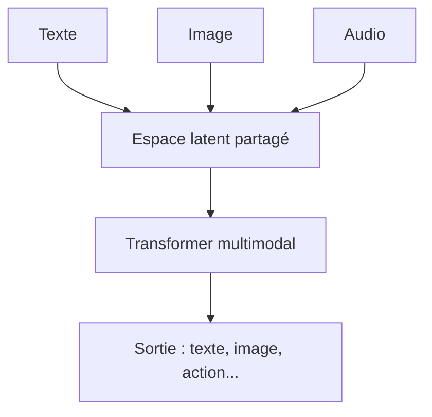

---

## 21.2 Qu’est-ce qu’une modalité ?

Une **modalité** est un type de donnée ou de signal.

Par exemple :

| Modalité            | Exemple                             |
| ------------------- | ----------------------------------- |
| Texte               | phrase, document, code              |
| Image               | photo, schéma, radiographie         |
| Audio               | parole, musique, bruit              |
| Vidéo               | suite d’images + son                |
| Données structurées | tableau, graphe, JSON               |
| Action              | clic, mouvement, commande robotique |

Un humain comprend naturellement plusieurs modalités à la fois.

Par exemple, nous pouvons regarder une image, lire une question, écouter une voix, puis répondre.

Un modèle multimodal cherche à reproduire partiellement cette capacité.

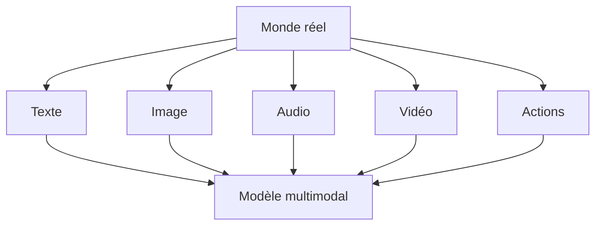

---

## 21.3 Pourquoi les Transformers sont adaptés au multimodal ?

Les Transformers manipulent des séquences de vecteurs.

Or, beaucoup de données peuvent être transformées en séquences de vecteurs.

Texte :

```txt
tokens textuels → embeddings
```

Image :

```txt
patches visuels → embeddings
```

Audio :

```txt
frames ou spectrogrammes → embeddings
```

Vidéo :

```txt
frames + patches spatio-temporels → embeddings
```

Données structurées :

```txt
champs / nœuds / relations → embeddings
```

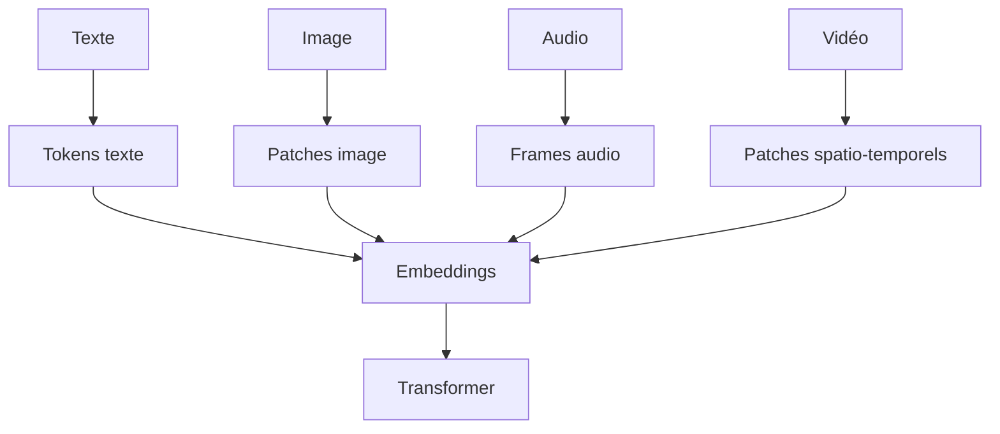

Cette abstraction est très puissante :

> Si nous savons transformer une donnée en séquence d’embeddings, nous pouvons souvent utiliser une architecture Transformer.

---

## 21.4 Le défi principal : aligner des représentations différentes

Le problème n’est pas seulement de convertir chaque modalité en vecteurs.

Le vrai défi est de faire en sorte que ces vecteurs soient **comparables**, **alignés** ou **fusionnables**.

Exemple :

```txt
Texte : "un chien joue dans un parc"
Image : photo d’un chien dans un parc
```

Nous voulons que le modèle comprenne que ces deux signaux parlent du même contenu.

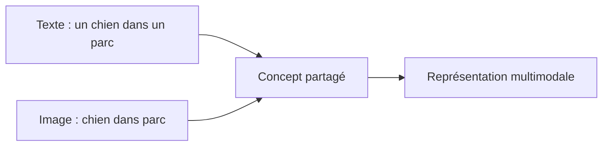

Le modèle doit apprendre des correspondances entre :

* mots et objets ;
* phrases et scènes ;
* sons et événements ;
* gestes et actions ;
* images et descriptions ;
* vidéos et narrations.

---

## 21.5 Espace latent partagé

Une stratégie fréquente est de projeter plusieurs modalités dans un **espace latent partagé**.

Dans cet espace, une image et son texte associé doivent être proches.

Exemple :

```txt
Image d’un chat noir
Texte : "a black cat"
```

doivent produire des vecteurs proches.

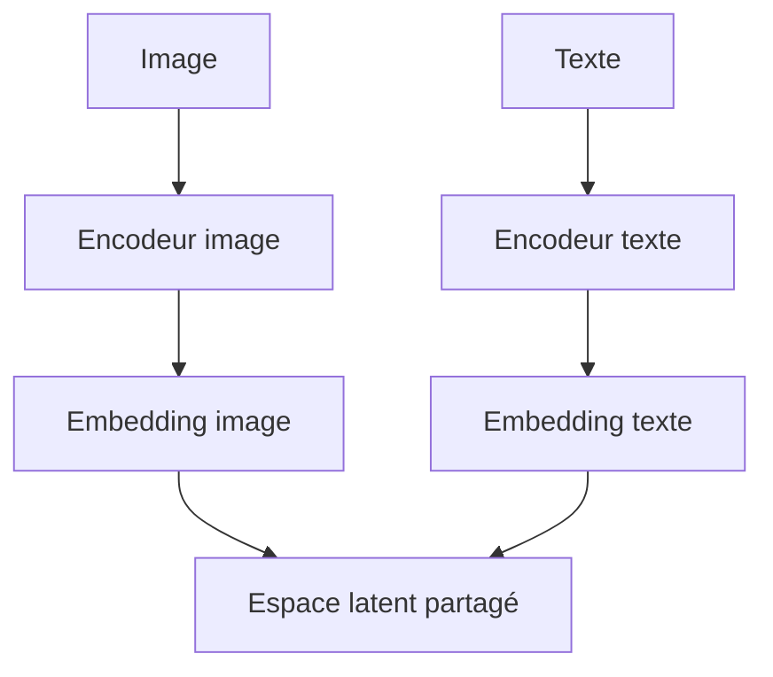

L’espace latent partagé permet ensuite de faire :

* recherche image → texte ;
* recherche texte → image ;
* classification zéro-shot ;
* alignement multimodal ;
* récupération de documents multimodaux.

---

## 21.6 Exemple : recherche texte-image

Supposons une base d’images.

Nous posons une requête textuelle :

```txt
un chien blanc qui court sur la plage
```

Le système encode la requête en vecteur.

Il compare ce vecteur avec les embeddings des images.

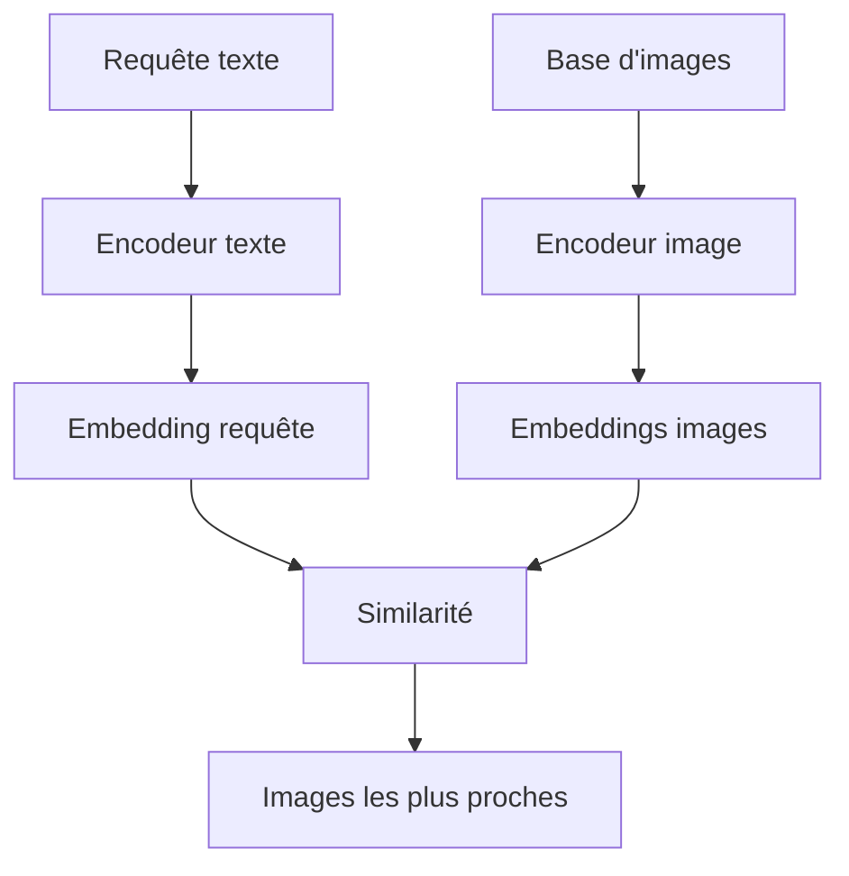

C’est l’un des usages les plus importants de l’alignement multimodal.

---

## 21.7 CLIP : un modèle vision-langage fondamental

CLIP est un exemple majeur de modèle vision-language.

Son idée est simple :

> Apprendre à rapprocher les embeddings des images et des textes qui vont ensemble, et à éloigner ceux qui ne vont pas ensemble.

Pendant l’entraînement, le modèle reçoit des paires :

```txt
image ↔ description textuelle
```

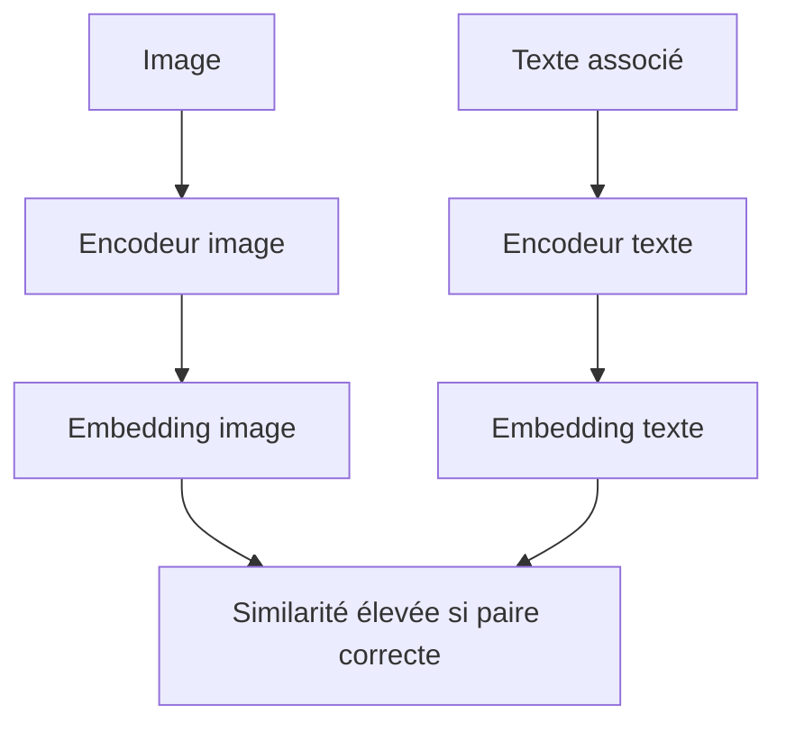

CLIP n’est pas seulement un classifieur.

C’est un modèle d’alignement entre vision et langage.

---

## 21.8 Apprentissage contrastif

CLIP utilise une logique d’**apprentissage contrastif**.

Dans un batch, nous avons plusieurs images et plusieurs textes.

Le modèle doit associer chaque image au bon texte.

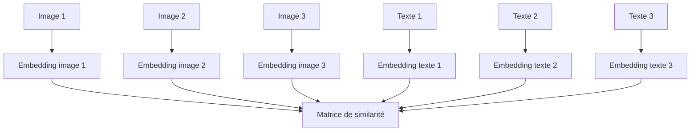

Le modèle apprend :

* image 1 proche du texte 1 ;
* image 2 proche du texte 2 ;
* image 3 proche du texte 3 ;
* image 1 éloignée des textes 2 et 3 ;
* etc.

C’est un mécanisme très efficace pour aligner deux modalités.

---

## 21.9 Classification zéro-shot avec CLIP

Une conséquence très intéressante de CLIP est la classification zéro-shot.

Au lieu d’entraîner une tête de classification spécifique, nous écrivons des descriptions textuelles.

Exemple :

```txt
a photo of a dog
a photo of a cat
a photo of a car
a photo of a bird
```

Nous encodons ces textes.

Puis nous comparons l’image à chaque texte.

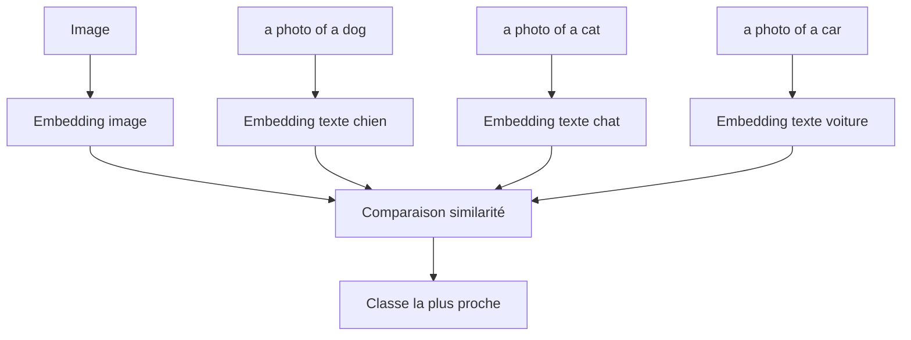

Le modèle peut classifier sans avoir été explicitement fine-tuné sur les classes exactes.

---

## 21.10 Fusion multimodale : deux grandes stratégies

Il existe deux grandes stratégies pour combiner plusieurs modalités.

### 21.10.1 Fusion tardive

Chaque modalité est encodée séparément, puis les représentations sont comparées ou combinées.

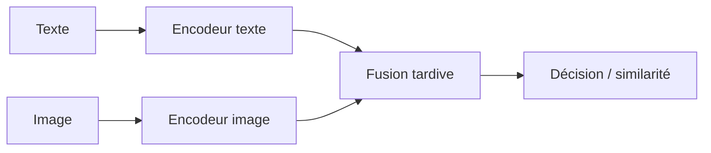

CLIP est proche de cette logique.

### 21.10.2 Fusion précoce

Les tokens de plusieurs modalités sont injectés ensemble dans un Transformer commun.

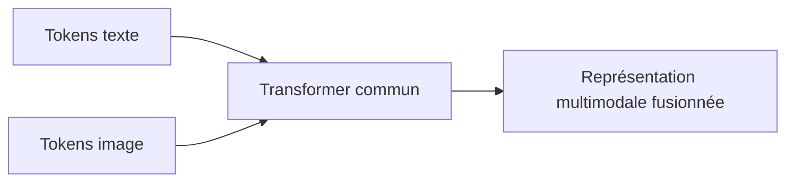

Cette approche permet des interactions plus fines, mais coûte souvent plus cher.

---

## 21.11 Fusion tardive : avantages et limites

La fusion tardive est efficace et simple.

Avantages :

* embeddings pré-calculables ;
* recherche rapide ;
* architecture modulaire ;
* bonne scalabilité ;
* adaptée à la recherche multimodale.

Limites :

* interactions fines limitées ;
* le texte et l’image sont surtout comparés après encodage ;
* moins adapté aux raisonnements complexes image + texte.

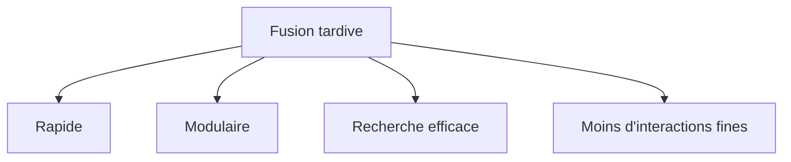

---

## 21.12 Fusion précoce : avantages et limites

La fusion précoce permet aux tokens texte et image d’interagir directement.

Avantages :

* compréhension fine texte-image ;
* utile pour question-réponse visuelle ;
* permet des alignements locaux ;
* meilleure interaction entre modalités.

Limites :

* plus coûteuse ;
* séquences plus longues ;
* complexité mémoire plus importante ;
* besoin de données multimodales de qualité.

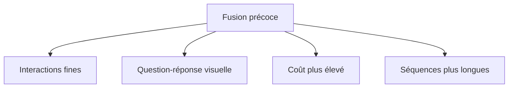

---

## 21.13 Cross-attention multimodale

La **cross-attention** est un mécanisme central dans de nombreux modèles multimodaux.

Elle permet à une modalité de regarder une autre modalité.

Exemple :

* le texte pose une question ;
* l’image fournit l’information ;
* le modèle utilise la cross-attention pour relier les mots aux régions visuelles.

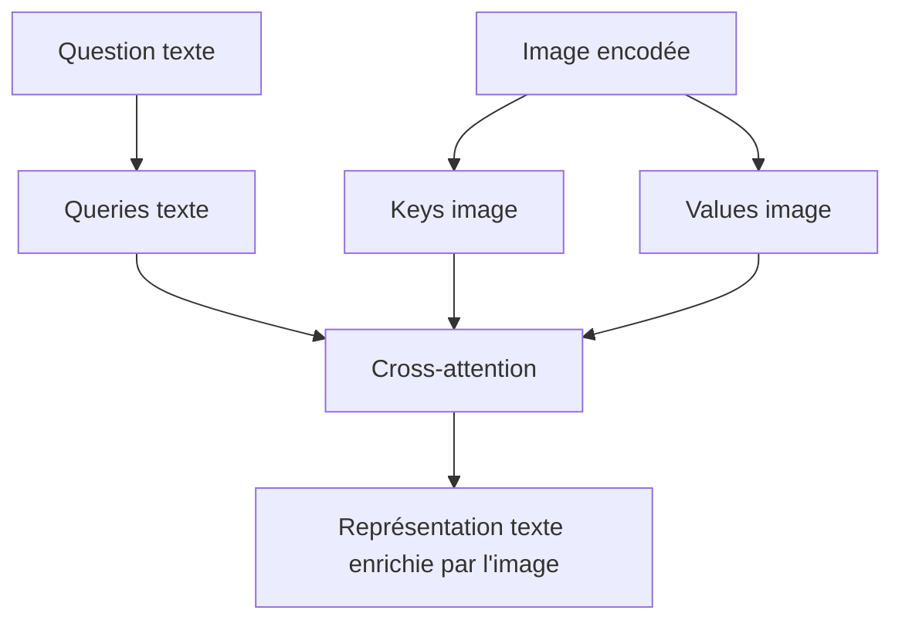

La cross-attention peut fonctionner dans plusieurs directions :

* texte vers image ;
* image vers texte ;
* audio vers texte ;
* texte vers vidéo ;
* action vers observation.

---

## 21.14 Exemple : question-réponse visuelle

La question-réponse visuelle, ou VQA, consiste à répondre à une question sur une image.

Image :

```txt
photo d’une table avec trois pommes
```

Question :

```txt
Combien y a-t-il de pommes ?
```

Réponse :

```txt
trois
```

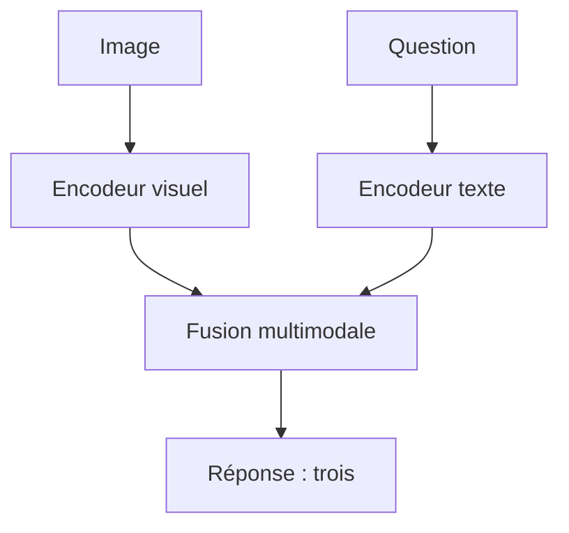

Le modèle doit relier le mot `pommes` aux objets visuels correspondants.

---

## 21.15 Alignement local entre mots et régions

Dans les modèles vision-language, nous voulons souvent aligner :

* un mot avec une région ;
* une phrase avec un objet ;
* une description avec une scène.

Exemple :

```txt
"le chien noir à gauche"
```

doit correspondre à une région précise de l’image.

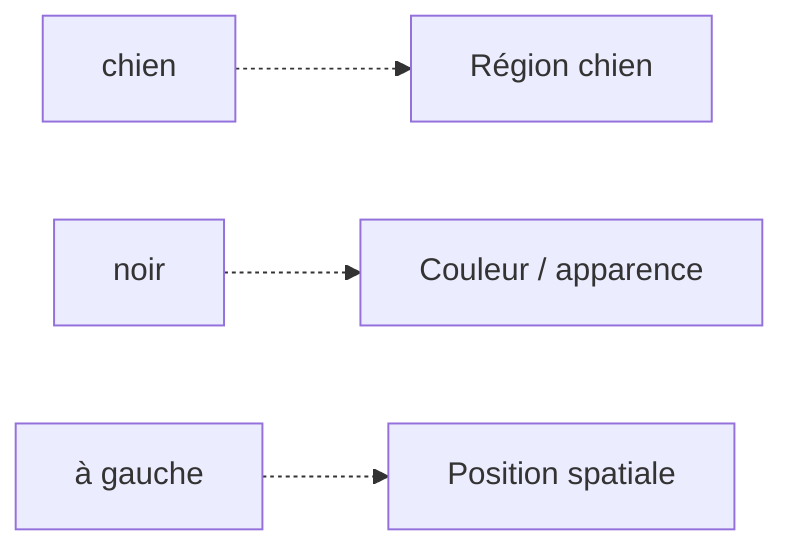

Ce type d’alignement est plus fin que la simple similarité globale image-texte.

---

## 21.16 Modèles image-to-text

Un modèle image-to-text génère du texte à partir d’une image.

Exemples :

* captioning ;
* description d’image ;
* OCR enrichi ;
* question-réponse sur image ;
* explication d’un graphique.

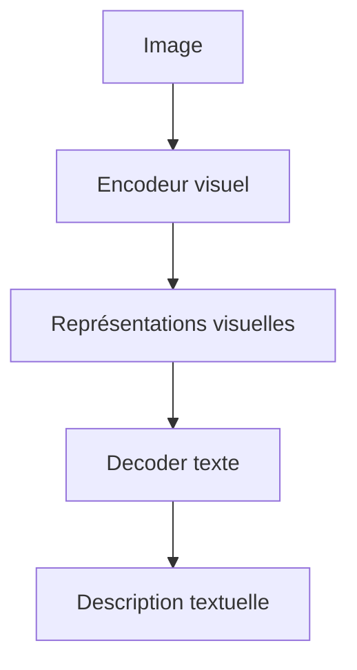

La sortie est générée token par token, comme dans un modèle decoder-only ou encoder-decoder.

---

## 21.17 Captioning d’image

Le captioning consiste à produire une légende.

Image :

```txt
un enfant joue avec un ballon dans un parc
```

Sortie :

```txt
Un enfant joue au ballon dans un parc.
```

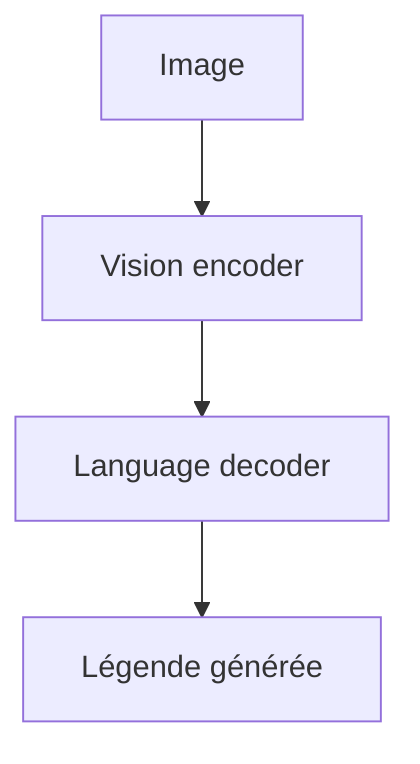

Le modèle doit :

* reconnaître les objets ;
* comprendre la scène ;
* générer une phrase grammaticalement correcte.

---

## 21.18 OCR et compréhension de documents

Les modèles multimodaux peuvent aussi traiter des documents scannés.

Ils doivent combiner :

* image du document ;
* texte reconnu ;
* mise en page ;
* tableaux ;
* relations spatiales.

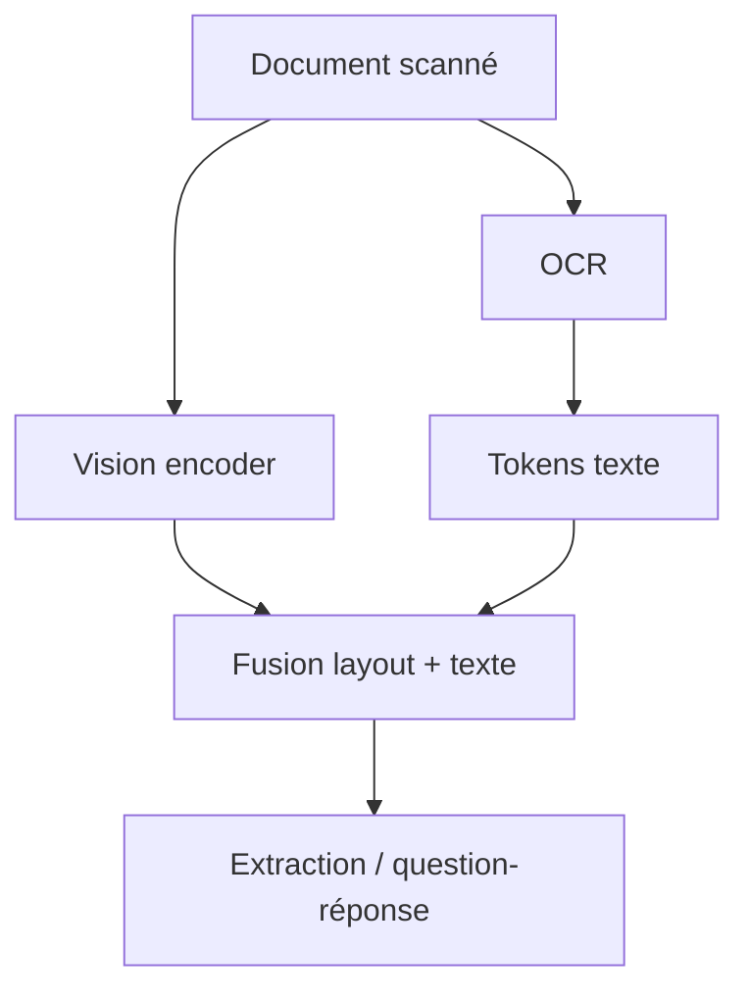

C’est important pour :

* factures ;
* contrats ;
* formulaires ;
* dossiers administratifs ;
* documents scientifiques ;
* tableaux.

---

## 21.19 Texte + audio

Les Transformers multimodaux ne se limitent pas aux images.

Pour l’audio, nous pouvons transformer un signal sonore en séquence.

Exemple :

* waveform brut ;
* spectrogramme ;
* frames acoustiques ;
* tokens audio discrets.

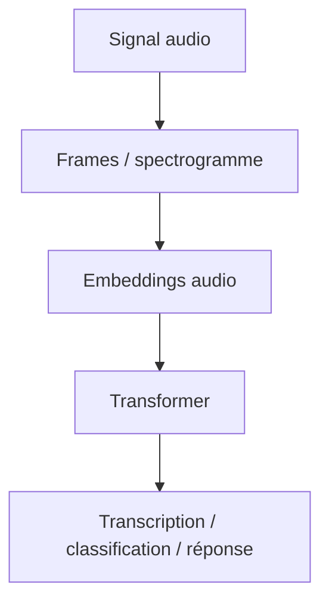

Le modèle peut ensuite faire :

* reconnaissance vocale ;
* traduction vocale ;
* classification sonore ;
* dialogue vocal ;
* analyse de musique.

---

## 21.20 Reconnaissance vocale avec Transformer

En reconnaissance vocale, l’entrée est un signal audio.

La sortie est un texte.

```mermaid
flowchart LR
    A["Audio parole"] --> B["Encodeur audio"]
    B --> C["Decoder texte"]
    C --> D["Transcription"]
```

Exemple :

```txt
Audio : "Bonjour, comment allez-vous ?"
Sortie : Bonjour, comment allez-vous ?
```

Nous sommes donc dans une logique encoder-decoder :

$$
audio \rightarrow texte
$$

---

## 21.21 Texte + audio dans un assistant vocal

Un assistant vocal multimodal peut combiner :

1. entrée audio ;
2. transcription ;
3. compréhension textuelle ;
4. génération de réponse ;
5. synthèse vocale.

```mermaid
flowchart TD
    A["Voix utilisateur"] --> B["Reconnaissance vocale"]
    B --> C["Texte utilisateur"]
    C --> D["LLM"]
    D --> E["Réponse texte"]
    E --> F["Synthèse vocale"]
    F --> G["Voix assistant"]
```

Dans les architectures plus intégrées, certaines étapes peuvent être fusionnées dans un même modèle multimodal.

---

## 21.22 Texte + vidéo

Une vidéo est plus complexe qu’une image.

Elle contient :

* une dimension spatiale ;
* une dimension temporelle ;
* parfois de l’audio ;
* des actions ;
* des événements.

```mermaid
flowchart TD
    A["Vidéo"] --> B["Frames"]
    B --> C["Patches spatiaux"]
    B --> D["Dimension temporelle"]
    C --> E["Tokens vidéo"]
    D --> E
    E --> F["Transformer vidéo"]
```

Un Transformer vidéo doit comprendre à la fois :

* ce qui est visible ;
* ce qui change dans le temps.

---

## 21.23 Patches spatio-temporels

Pour une vidéo, nous pouvons créer des patches dans l’espace et dans le temps.

Au lieu d’un patch 2D :

$$
P \times P
$$

nous pouvons utiliser un tube spatio-temporel :

$$
T \times P \times P
$$

```mermaid
flowchart TD
    A["Vidéo"] --> B["Segments temporels"]
    B --> C["Patches par frame"]
    C --> D["Tubes spatio-temporels"]
    D --> E["Embeddings vidéo"]
```

Ces tokens vidéo peuvent ensuite être traités par attention.

Mais le coût peut devenir très élevé, car le nombre de tokens augmente vite.

---

## 21.24 Tâches vidéo

Les Transformers vidéo peuvent être utilisés pour :

* classification d’action ;
* description de vidéo ;
* question-réponse sur vidéo ;
* détection d’événements ;
* compréhension de scènes ;
* résumé vidéo ;
* suivi d’objets.

```mermaid
flowchart TD
    A["Transformer vidéo"] --> B["Classification action"]
    A --> C["Captioning vidéo"]
    A --> D["Question-réponse vidéo"]
    A --> E["Détection événements"]
    A --> F["Résumé vidéo"]
```

Exemple :

```txt
Que fait la personne ?
→ Elle coupe des légumes.
```

Le modèle doit comprendre une action dans le temps.

---

## 21.25 Le problème du coût en vidéo

La vidéo produit énormément de tokens.

Si nous avons :

* plusieurs frames ;
* plusieurs patches par frame ;
* parfois de l’audio ;
* parfois du texte associé,

la séquence devient très longue.

```mermaid
flowchart TD
    A["Vidéo longue"] --> B["Beaucoup de frames"]
    B --> C["Beaucoup de patches"]
    C --> D["Très longue séquence"]
    D --> E["Attention coûteuse"]
```

Les modèles vidéo utilisent donc souvent :

* échantillonnage de frames ;
* attention locale ;
* hiérarchie temporelle ;
* compression ;
* pooling ;
* modèles hybrides.

---

## 21.26 Génération d’images à partir de texte

Une autre famille multimodale importante est la génération d’images.

Entrée :

```txt
un chat astronaute sur la Lune, style peinture à l’huile
```

Sortie :

```txt
image correspondante
```

```mermaid
flowchart LR
    A["Prompt texte"] --> B["Encodeur texte"]
    B --> C["Modèle génératif image"]
    C --> D["Image générée"]
```

Le modèle doit transformer une représentation textuelle en contenu visuel.

Les Transformers peuvent intervenir dans :

* l’encodage du texte ;
* la génération de tokens visuels ;
* l’organisation de l’espace latent ;
* la fusion texte-image.

---

## 21.27 Tokens visuels discrets

Certaines approches représentent une image comme une séquence de tokens visuels discrets.

L’image est d’abord compressée par un autoencodeur.

Puis le modèle génère des tokens visuels.

```mermaid
flowchart TD
    A["Image"] --> B["Encodeur visuel discret"]
    B --> C["Tokens visuels"]
    C --> D["Transformer génératif"]
    D --> E["Nouveaux tokens visuels"]
    E --> F["Décodeur image"]
    F --> G["Image générée"]
```

Cette approche rapproche la génération d’images de la génération de texte.

Au lieu de générer des mots, le modèle génère des tokens d’image.

---

## 21.28 Diffusion et Transformers

Beaucoup de modèles modernes de génération d’images utilisent des modèles de diffusion.

Les Transformers peuvent y intervenir de plusieurs manières :

* encodeur de texte ;
* architecture de débruitage ;
* bloc d’attention ;
* modèle latent ;
* fusion multimodale.

```mermaid
flowchart TD
    A["Texte"] --> B["Encodeur texte"]
    C["Bruit latent"] --> D["Modèle de diffusion"]
    B --> D
    D --> E["Latent débruité"]
    E --> F["Décodeur image"]
    F --> G["Image"]
```

Dans ces systèmes, le Transformer n’est pas toujours l’unique composant, mais il est souvent central pour représenter le texte et faire la fusion.

---

## 21.29 Cross-attention texte-image dans la génération

Dans la génération texte-image, la cross-attention permet au modèle visuel de regarder le prompt textuel.

Exemple :

```txt
un dragon rouge volant au-dessus d’un château
```

Les tokens visuels peuvent regarder les tokens textuels :

* `dragon` ;
* `rouge` ;
* `volant` ;
* `château`.

```mermaid
flowchart TD
    A["Tokens visuels"] --> Q["Queries visuelles"]
    B["Tokens texte"] --> K["Keys texte"]
    B --> V["Values texte"]

    Q --> C["Cross-attention"]
    K --> C
    V --> C

    C --> D["Image conditionnée par le texte"]
```

C’est une des manières de contrôler la génération d’image par le texte.

---

## 21.30 Modèles multimodaux conversationnels

Les modèles multimodaux modernes peuvent parfois recevoir :

* une image ;
* un texte ;
* une question ;
* un document ;
* une capture d’écran ;
* un graphique.

Ils produisent une réponse textuelle.

```mermaid
flowchart TD
    A["Image / document / capture"] --> B["Encodeur visuel"]
    C["Question texte"] --> D["LLM"]
    B --> D
    D --> E["Réponse textuelle"]
```

Exemple :

```txt
Utilisateur : Que montre ce graphique ?
Modèle : Il montre une augmentation progressive...
```

Le modèle doit combiner perception visuelle et génération linguistique.

---

## 21.31 Multimodalité et captures d’écran

Un usage important des modèles multimodaux est la compréhension d’interfaces.

Une capture d’écran contient :

* texte ;
* boutons ;
* icônes ;
* mise en page ;
* hiérarchie visuelle ;
* états de l’interface.

```mermaid
flowchart TD
    A["Capture d'écran"] --> B["Vision encoder"]
    B --> C["Compréhension layout"]
    C --> D["Question utilisateur"]
    D --> E["Réponse / action"]
```

Cela permet des assistants capables d’aider sur :

* logiciels ;
* sites web ;
* formulaires ;
* erreurs affichées ;
* interfaces de développement.

---

## 21.32 Multimodalité et documents complexes

Les documents complexes combinent souvent :

* texte ;
* tableaux ;
* figures ;
* schémas ;
* équations ;
* mise en page.

Un modèle multimodal doit tenir compte de tout cela.

```mermaid
flowchart TD
    A["PDF / document"] --> B["Texte OCR"]
    A --> C["Figures"]
    A --> D["Tableaux"]
    A --> E["Mise en page"]

    B --> F["Modèle multimodal"]
    C --> F
    D --> F
    E --> F

    F --> G["Analyse / résumé / extraction"]
```

Cela va au-delà d’un simple modèle texte.

La disposition spatiale peut porter une information essentielle.

---

## 21.33 Multimodalité et robotique

En robotique, un modèle peut recevoir :

* image caméra ;
* instruction texte ;
* état du robot ;
* capteurs ;
* historique d’actions.

Il peut produire :

* action ;
* trajectoire ;
* commande ;
* plan.

```mermaid
flowchart TD
    A["Image caméra"] --> M["Modèle multimodal"]
    B["Instruction texte"] --> M
    C["État robot"] --> M
    D["Capteurs"] --> M
    M --> E["Action / commande"]
```

Ici, la sortie n’est pas forcément du texte.

Elle peut être une action dans le monde.

---

## 21.34 Action comme modalité

Nous pouvons considérer une action comme une modalité.

Exemples :

* déplacer le bras ;
* cliquer sur un bouton ;
* ouvrir une porte ;
* exécuter une commande ;
* appeler une API.

```mermaid
flowchart LR
    A["Observation multimodale"] --> B["Transformer"]
    B --> C["Action"]
```

Dans ce cadre, le Transformer devient un modèle de décision.

Il ne se contente plus de décrire le monde.

Il peut choisir une action.

---

## 21.35 Embeddings multimodaux

Un embedding multimodal est une représentation vectorielle qui intègre plusieurs sources.

Exemple :

```txt
image + question → représentation fusionnée
```

ou :

```txt
audio + texte → représentation fusionnée
```

```mermaid
flowchart TD
    A["Modalité 1"] --> C["Fusion"]
    B["Modalité 2"] --> C
    C --> D["Embedding multimodal"]
```

Ces embeddings peuvent servir à :

* classifier ;
* générer ;
* rechercher ;
* décider ;
* comparer ;
* résumer.

---

## 21.36 Alignement vs fusion

Nous devons distinguer deux notions.

### Alignement

Nous apprenons à placer des modalités dans un espace comparable.

Exemple :

```txt
image proche de sa description
```

### Fusion

Nous combinons les informations pour produire une représentation commune.

Exemple :

```txt
question + image → réponse
```

```mermaid
flowchart TD
    A["Alignement"] --> B["Rendre comparables"]
    C["Fusion"] --> D["Combiner pour raisonner / répondre"]
```

CLIP fait surtout de l’alignement global.

Un modèle VQA fait plutôt de la fusion pour répondre.

---

## 21.37 Architecture à encodeurs séparés

Une architecture multimodale simple utilise un encodeur par modalité.

```mermaid
flowchart TD
    A["Texte"] --> B["Encodeur texte"]
    C["Image"] --> D["Encodeur image"]
    E["Audio"] --> F["Encodeur audio"]

    B --> G["Fusion"]
    D --> G
    F --> G

    G --> H["Sortie"]
```

Avantage :

* modularité ;
* possibilité de préentraîner séparément ;
* adaptation à chaque modalité.

Limite :

* fusion parfois tardive ;
* interactions fines moins directes.

---

## 21.38 Architecture à Transformer commun

Une autre approche consiste à convertir toutes les modalités en tokens, puis à les donner à un Transformer commun.

```mermaid
flowchart TD
    A["Tokens texte"] --> D["Séquence commune"]
    B["Tokens image"] --> D
    C["Tokens audio"] --> D

    D --> E["Transformer multimodal commun"]
    E --> F["Sortie"]
```

Avantage :

* interactions directes ;
* architecture unifiée ;
* forte expressivité.

Limite :

* coût élevé ;
* séquences longues ;
* besoin de beaucoup de données.

---

## 21.39 Architecture avec perceiver ou resampler

Certains modèles utilisent un module intermédiaire pour compresser les tokens visuels.

Par exemple, au lieu de donner des milliers de patches à un LLM, on les compresse en un petit nombre de tokens visuels.

```mermaid
flowchart TD
    A["Nombreux tokens image"] --> B["Resampler / Perceiver"]
    B --> C["Quelques tokens visuels"]
    C --> D["LLM"]
    D --> E["Réponse"]
```

Cela réduit le coût et facilite la connexion entre vision et langage.

---

## 21.40 Connecter un encodeur visuel à un LLM

Un modèle multimodal moderne peut combiner :

* un encodeur image préentraîné ;
* un projecteur linéaire ou MLP ;
* un LLM decoder-only.

```mermaid
flowchart TD
    A["Image"] --> B["Encodeur visuel"]
    B --> C["Projecteur vers dimension LLM"]
    C --> D["Tokens visuels compatibles LLM"]
    E["Prompt texte"] --> F["LLM"]
    C --> F
    F --> G["Réponse"]
```

Le projecteur adapte les dimensions.

Il transforme les embeddings visuels en tokens compréhensibles par le modèle de langage.

---

## 21.41 Pourquoi projeter les embeddings visuels ?

Un encodeur visuel produit souvent des vecteurs dans une dimension donnée.

Un LLM attend des embeddings dans sa propre dimension.

Si :

$$
d_{vision} \neq d_{LLM}
$$

nous devons projeter :

$$
d_{vision} \rightarrow d_{LLM}
$$

```mermaid
flowchart LR
    A["Embedding visuel d_vision"] --> B["Projection"]
    B --> C["Embedding compatible d_LLM"]
```

Cette projection peut être :

* linéaire ;
* MLP ;
* resampler attentionnel ;
* module plus complexe.

---

## 21.42 Multimodalité et tokens spéciaux

Les modèles multimodaux utilisent souvent des tokens spéciaux pour indiquer les modalités.

Exemple :

```txt
<image> ... </image>
Question : Que voit-on ?
```

ou :

```txt
<audio> ... </audio>
Transcris ce passage.
```

```mermaid
flowchart LR
    A["<image>"] --> B["Tokens visuels"]
    B --> C["</image>"]
    C --> D["Tokens texte"]
```

Ces marqueurs aident le modèle à distinguer les types d’information.

---

## 21.43 Cross-attention ou insertion directe ?

Pour connecter image et LLM, deux stratégies sont fréquentes.

### Insertion directe

Les tokens visuels sont insérés dans le contexte du LLM.

```mermaid
flowchart LR
    A["Tokens visuels"] --> C["Contexte LLM"]
    B["Tokens texte"] --> C
    C --> D["LLM"]
```

### Cross-attention

Le LLM garde son flux textuel, mais certaines couches peuvent regarder les embeddings visuels par cross-attention.

```mermaid
flowchart TD
    A["Tokens texte"] --> B["LLM"]
    C["Embeddings visuels"] --> D["Cross-attention"]
    B --> D
    D --> E["LLM enrichi"]
```

Les deux approches ont des avantages.

---

## 21.44 Avantages de l’insertion directe

L’insertion directe est conceptuellement simple.

Nous transformons l’image en tokens compatibles, puis nous les plaçons dans la séquence.

Avantages :

* intégration simple avec un decoder-only ;
* même mécanisme d’attention ;
* pas forcément besoin de modifier profondément le LLM.

Limites :

* augmente la longueur de contexte ;
* coût d’attention plus élevé ;
* besoin de compresser les tokens visuels.

```mermaid
flowchart TD
    A["Insertion directe"] --> B["Simple"]
    A --> C["Compatible decoder-only"]
    A --> D["Mais contexte plus long"]
```

---

## 21.45 Avantages de la cross-attention

La cross-attention permet de garder séparée la mémoire visuelle.

Avantages :

* séparation plus claire entre modalités ;
* le texte peut interroger l’image ;
* moins besoin d’insérer tous les tokens dans la séquence principale ;
* contrôle architectural plus explicite.

Limites :

* architecture plus complexe ;
* nécessite souvent de modifier le modèle ;
* coût supplémentaire.

```mermaid
flowchart TD
    A["Cross-attention multimodale"] --> B["Séparation des modalités"]
    A --> C["Interaction contrôlée"]
    A --> D["Architecture plus complexe"]
```

---

## 21.46 Génération multimodale

Un modèle multimodal peut générer différents types de sorties :

* texte ;
* image ;
* audio ;
* vidéo ;
* action ;
* code ;
* structure.

```mermaid
flowchart TD
    A["Entrées multimodales"] --> B["Modèle multimodal"]
    B --> C["Texte"]
    B --> D["Image"]
    B --> E["Audio"]
    B --> F["Vidéo"]
    B --> G["Action"]
```

Un assistant multimodal moderne peut donc être vu comme un système de traduction généralisée :

```txt
modalités d’entrée → modalités de sortie
```

---

## 21.47 Texte vers image

Entrée :

```txt
un château médiéval au coucher du soleil
```

Sortie :

```txt
image générée
```

```mermaid
flowchart LR
    A["Prompt texte"] --> B["Encodeur texte"]
    B --> C["Générateur image"]
    C --> D["Image"]
```

Le modèle doit comprendre le contenu, le style et les contraintes visuelles.

---

## 21.48 Image vers texte

Entrée :

```txt
image
```

Sortie :

```txt
description, réponse, analyse
```

```mermaid
flowchart LR
    A["Image"] --> B["Encodeur visuel"]
    B --> C["LLM / decoder texte"]
    C --> D["Texte"]
```

Exemples :

* décrire une image ;
* expliquer un graphique ;
* lire une capture d’écran ;
* répondre à une question sur une photo.

---

## 21.49 Audio vers texte

Entrée :

```txt
audio
```

Sortie :

```txt
transcription, résumé, traduction
```

```mermaid
flowchart LR
    A["Audio"] --> B["Encodeur audio"]
    B --> C["Decoder texte"]
    C --> D["Texte"]
```

Exemples :

* reconnaissance vocale ;
* résumé de réunion ;
* traduction automatique de parole.

---

## 21.50 Texte vers audio

Entrée :

```txt
texte
```

Sortie :

```txt
voix synthétique
```

```mermaid
flowchart LR
    A["Texte"] --> B["Modèle TTS"]
    B --> C["Audio généré"]
```

Dans certains systèmes modernes, des Transformers interviennent dans la modélisation de la prosodie, du contenu phonétique ou des tokens audio.

---

## 21.51 Texte vers vidéo

Entrée :

```txt
un astronaute marche dans une forêt enneigée
```

Sortie :

```txt
courte vidéo générée
```

```mermaid
flowchart TD
    A["Prompt texte"] --> B["Encodeur texte"]
    B --> C["Modèle génératif vidéo"]
    C --> D["Frames cohérentes dans le temps"]
```

La vidéo est plus difficile que l’image, car il faut maintenir :

* cohérence spatiale ;
* cohérence temporelle ;
* mouvement ;
* identité des objets ;
* causalité visuelle.

---

## 21.52 Multimodalité et temporalité

L’audio et la vidéo introduisent une dimension temporelle.

Nous devons comprendre non seulement ce qui est présent, mais aussi ce qui change.

```mermaid
flowchart LR
    A["t1"] --> B["t2"]
    B --> C["t3"]
    C --> D["t4"]
    D --> E["Événement"]
```

Exemple :

```txt
Une personne prend un verre, le remplit, puis boit.
```

Le modèle doit comprendre la séquence d’actions.

---

## 21.53 Multimodalité et grounding

Le **grounding** désigne le lien entre les symboles et le monde perceptif.

Exemple :

Le mot :

```txt
chien
```

doit être relié à des images, des sons, des comportements et des contextes associés aux chiens.

```mermaid
flowchart TD
    A["Mot : chien"] --> B["Images de chiens"]
    A --> C["Aboiements"]
    A --> D["Actions associées"]
    A --> E["Concept perceptif"]
```

Les modèles multimodaux peuvent avoir un meilleur grounding que les modèles purement textuels, car ils sont exposés à plusieurs types de signaux.

---

## 21.54 Grounding et limites

Le multimodal améliore le grounding, mais ne le rend pas parfait.

Un modèle peut encore :

* mal interpréter une image ;
* confondre des objets ;
* halluciner un détail visuel ;
* surestimer ce qu’il voit ;
* mal lire un texte dans une image ;
* rater une relation spatiale.

```mermaid
flowchart TD
    A["Entrées visuelles"] --> B["Meilleur ancrage perceptif"]
    B --> C["Mais erreurs possibles"]
    C --> D["Grounding imparfait"]
```

Nous devons donc rester prudents.

---

## 21.55 Multimodalité et hallucinations visuelles

Une hallucination visuelle se produit lorsque le modèle décrit un élément absent de l’image.

Exemple :

```txt
L’image ne contient pas de chien, mais le modèle mentionne un chien.
```

```mermaid
flowchart TD
    A["Image"] --> B["Modèle vision-language"]
    B --> C["Description plausible"]
    C --> D["Détail absent"]
    D --> E["Hallucination visuelle"]
```

Cela peut venir :

* d’un biais de données ;
* d’une mauvaise attention à l’image ;
* d’une influence trop forte du langage ;
* d’un prompt suggestif.

---

## 21.56 Langage dominant sur vision

Dans certains modèles vision-language, le modèle de langage peut dominer.

Si le prompt suggère fortement quelque chose, le modèle peut suivre le texte plutôt que l’image.

Exemple :

```txt
Question : Pourquoi le chien est-il sur la table ?
```

alors que l’image ne contient pas de chien.

```mermaid
flowchart TD
    A["Prompt suggestif"] --> B["LLM"]
    C["Image contradictoire"] --> B
    B --> D["Risque de suivre le prompt"]
```

Un bon modèle multimodal doit apprendre à refuser les présupposés faux.

---

## 21.57 Robustesse multimodale

La robustesse multimodale consiste à gérer :

* image floue ;
* audio bruité ;
* texte ambigu ;
* contradiction entre modalités ;
* données manquantes ;
* attaques adversariales ;
* mauvaise qualité OCR.

```mermaid
flowchart TD
    A["Entrées multimodales"] --> B["Qualité variable"]
    B --> C["Bruit"]
    B --> D["Contradictions"]
    B --> E["Données manquantes"]
    B --> F["Modèle robuste"]
```

Un modèle multimodal doit savoir dire :

```txt
Je ne peux pas déterminer cela clairement à partir de l’image.
```

lorsque l’information n’est pas suffisante.

---

## 21.58 Contradiction entre modalités

Parfois, le texte et l’image se contredisent.

Exemple :

```txt
Texte : "un chat noir"
Image : un chien blanc
```

Le modèle doit détecter cette contradiction.

```mermaid
flowchart LR
    A["Texte : chat noir"] --> C["Comparaison"]
    B["Image : chien blanc"] --> C
    C --> D["Contradiction"]
```

C’est important pour :

* vérification de contenu ;
* fact-checking visuel ;
* sécurité ;
* modération ;
* analyse de documents.

---

## 21.59 Multimodalité et biais

Les modèles multimodaux peuvent hériter de biais présents dans leurs données :

* stéréotypes visuels ;
* associations texte-image biaisées ;
* sous-représentation de certaines populations ;
* biais géographiques ;
* biais culturels ;
* biais linguistiques.

```mermaid
flowchart TD
    A["Données multimodales"] --> B["Biais textuels"]
    A --> C["Biais visuels"]
    A --> D["Biais culturels"]
    B --> E["Modèle multimodal"]
    C --> E
    D --> E
```

La multimodalité n’élimine pas les biais.

Elle peut même en créer de nouveaux par association entre modalités.

---

## 21.60 Données multimodales

Les modèles multimodaux nécessitent des données complexes :

* paires image-texte ;
* vidéos sous-titrées ;
* audio transcrit ;
* documents annotés ;
* interactions utilisateur ;
* démonstrations robotique ;
* données web bruitées.

```mermaid
flowchart TD
    A["Données multimodales"] --> B["Image-texte"]
    A --> C["Audio-texte"]
    A --> D["Vidéo-texte"]
    A --> E["Documents"]
    A --> F["Actions"]
```

Ces données sont difficiles à collecter, filtrer et aligner.

---

## 21.61 Qualité de l’alignement des données

Pour entraîner un bon modèle multimodal, il faut que les modalités soient correctement alignées.

Mauvais exemple :

```txt
image d’un chien
description : un avion décolle
```

Bon exemple :

```txt
image d’un chien
description : un chien court dans l’herbe
```

```mermaid
flowchart TD
    A["Paire image-texte correcte"] --> B["Signal utile"]
    C["Paire mal alignée"] --> D["Signal bruité"]
    B --> E["Meilleur apprentissage"]
    D --> F["Modèle confus"]
```

Le bruit d’alignement est un problème majeur dans les grands corpus web.

---

## 21.62 Évaluation des modèles multimodaux

Évaluer un modèle multimodal est difficile.

Selon la tâche, nous pouvons mesurer :

* précision de classification ;
* score de retrieval ;
* qualité de captioning ;
* exactitude VQA ;
* robustesse aux contradictions ;
* fidélité visuelle ;
* qualité de génération d’image ;
* jugement humain.

```mermaid
flowchart TD
    A["Évaluation multimodale"] --> B["Classification"]
    A --> C["Retrieval"]
    A --> D["VQA"]
    A --> E["Captioning"]
    A --> F["Génération"]
    A --> G["Évaluation humaine"]
```

Une métrique unique ne suffit pas à tout mesurer.

---

## 21.63 Exemple d’évaluation VQA

Question :

```txt
Combien de personnes sont dans l’image ?
```

Réponse attendue :

```txt
3
```

Le modèle répond :

```txt
2
```

C’est une erreur factuelle visuelle.

```mermaid
flowchart TD
    A["Image"] --> B["Question"]
    B --> C["Réponse modèle"]
    C --> D["Comparaison avec vérité terrain"]
```

La VQA mesure à la fois perception et compréhension du langage.

---

## 21.64 Exemple d’évaluation image-texte

Pour le retrieval image-texte, nous pouvons mesurer si le bon texte est retrouvé pour une image.

```mermaid
flowchart TD
    A["Image requête"] --> B["Embedding image"]
    C["Textes candidats"] --> D["Embeddings textes"]
    B --> E["Similarité"]
    D --> E
    E --> F["Classement"]
```

Métriques possibles :

* Recall@1 ;
* Recall@5 ;
* Recall@10 ;
* rang moyen ;
* précision de retrieval.

---

## 21.65 Multimodalité et sécurité

Les modèles multimodaux introduisent de nouveaux risques :

* interprétation erronée d’images médicales ;
* mauvaise lecture de documents ;
* hallucination visuelle ;
* manipulation par image ou prompt ;
* extraction d’informations sensibles ;
* deepfakes ;
* génération d’images trompeuses.

```mermaid
flowchart TD
    A["Modèles multimodaux"] --> B["Nouveaux usages"]
    A --> C["Nouveaux risques"]
    C --> D["Hallucinations visuelles"]
    C --> E["Deepfakes"]
    C --> F["Mauvaise interprétation"]
    C --> G["Données sensibles"]
```

La sécurité multimodale demande donc des évaluations spécifiques.

---

## 21.66 Multimodalité et génération d’images trompeuses

Les modèles texte-image peuvent produire des images très réalistes.

Cela peut être utile :

* art ;
* design ;
* prototypage ;
* éducation ;
* simulation.

Mais cela peut aussi être utilisé pour produire :

* fausses preuves visuelles ;
* deepfakes ;
* images manipulées ;
* désinformation.

```mermaid
flowchart TD
    A["Génération d'images"] --> B["Créativité"]
    A --> C["Prototypage"]
    A --> D["Risque de désinformation"]
    A --> E["Images trompeuses"]
```

L’évaluation critique des sorties est donc indispensable.

---

## 21.67 Modèles multimodaux modernes : vue fonctionnelle

Un modèle multimodal moderne peut être vu comme une composition de modules :

```mermaid
flowchart TD
    A["Encodeurs spécialisés"] --> B["Projection / alignement"]
    B --> C["Fusion multimodale"]
    C --> D["Modèle génératif"]
    D --> E["Sortie"]
```

Selon les modèles, ces modules peuvent être :

* séparés ;
* partiellement fusionnés ;
* entraînés ensemble ;
* préentraînés séparément puis alignés.

---

## 21.68 Modèle multimodal comme système

Un système multimodal complet peut inclure :

* OCR ;
* encodeur image ;
* encodeur audio ;
* LLM ;
* moteur de recherche ;
* outils ;
* mémoire ;
* modules de sécurité.

```mermaid
flowchart TD
    A["Entrées"] --> B["Prétraitements"]
    B --> C["Encodeurs"]
    C --> D["Fusion / LLM"]
    D --> E["Outils externes"]
    E --> D
    D --> F["Réponse"]
    D --> G["Filtres sécurité"]
```

Il ne faut donc pas confondre :

```txt
modèle multimodal
```

et :

```txt
système multimodal complet
```

Le système autour du modèle est souvent aussi important que le modèle lui-même.

---

## 21.69 Erreur fréquente : croire que multimodal signifie seulement texte + image

Texte + image est très important, mais ce n’est qu’un cas.

La multimodalité inclut aussi :

* audio ;
* vidéo ;
* documents ;
* capteurs ;
* actions ;
* code ;
* interfaces.

```mermaid
flowchart TD
    A["Multimodal"] --> B["Texte + image"]
    A --> C["Texte + audio"]
    A --> D["Texte + vidéo"]
    A --> E["Texte + action"]
    A --> F["Documents structurés"]
```

Le principe général est de relier plusieurs formes de données.

---

## 21.70 Erreur fréquente : croire que tout est fusionné dans un seul espace magique

Un espace latent partagé ne garantit pas une compréhension parfaite.

Aligner des vecteurs ne signifie pas que le modèle maîtrise toutes les relations fines.

```mermaid
flowchart TD
    A["Espace latent partagé"] --> B["Comparaison utile"]
    B --> C["Mais pas compréhension parfaite"]
    C --> D["Besoin de fusion / raisonnement / vérification"]
```

Un embedding global peut dire qu’une image et un texte sont proches, mais ne pas capturer tous les détails.

---

## 21.71 Erreur fréquente : croire que voir une image supprime les hallucinations

Un modèle multimodal peut encore halluciner.

Il peut :

* mal voir ;
* mal lire ;
* mal compter ;
* suivre le prompt plutôt que l’image ;
* inventer un détail.

```mermaid
flowchart TD
    A["Image fournie"] --> B["Information supplémentaire"]
    B --> C["Moins d'incertitude parfois"]
    B --> D["Mais hallucinations possibles"]
```

La perception visuelle du modèle n’est pas infaillible.

---

## 21.72 Erreur fréquente : confondre OCR et compréhension visuelle

Lire du texte dans une image est une tâche.

Comprendre l’image en est une autre.

Un document peut contenir :

* texte ;
* mise en page ;
* relations spatiales ;
* tableaux ;
* signatures ;
* graphiques.

```mermaid
flowchart TD
    A["OCR"] --> B["Texte reconnu"]
    C["Compréhension visuelle"] --> D["Structure + objets + relations"]
```

Un bon système documentaire doit souvent combiner OCR, layout analysis et compréhension multimodale.

---

## 21.73 Erreur fréquente : négliger le coût des tokens visuels

Une image peut produire beaucoup de tokens.

Une vidéo peut en produire énormément.

```mermaid
flowchart TD
    A["Image"] --> B["Patches"]
    B --> C["Tokens visuels"]
    C --> D["Coût attention"]

    E["Vidéo"] --> F["Frames x patches"]
    F --> G["Encore plus de tokens"]
```

La multimodalité augmente rapidement la taille du contexte.

Il faut donc compresser, sélectionner ou hiérarchiser.

---

## 21.74 Synthèse mathématique

Supposons une entrée texte et une entrée image.

Le texte est transformé en embeddings :

$$
X_{text} \in \mathbb{R}^{B \times T \times d}
$$

L’image est transformée en embeddings :

$$
X_{image} \in \mathbb{R}^{B \times N \times d}
$$

où :

* $T$ est le nombre de tokens texte ;
* $N$ est le nombre de tokens visuels ;
* $d$ est la dimension commune.

En fusion précoce, nous concaténons :

$$
X = [X_{text}; X_{image}]
$$

donc :

$$
X \in \mathbb{R}^{B \times (T+N) \times d}
$$

Le coût d’attention globale devient :

$$
O((T+N)^2 d)
$$

En cross-attention texte vers image :

$$
Q = X_{text}
$$

$$
K,V = X_{image}
$$

le coût est approximativement :

$$
O(TNd)
$$

Ces formules montrent que la multimodalité augmente rapidement les coûts.

---

## 21.75 Schéma global de synthèse

```mermaid
flowchart TD
    A["Texte"] --> B["Tokenisation"]
    B --> C["Embeddings texte"]

    D["Image"] --> E["Patches / encodeur visuel"]
    E --> F["Embeddings image"]

    G["Audio"] --> H["Frames / spectrogramme"]
    H --> I["Embeddings audio"]

    C --> J["Alignement / projection"]
    F --> J
    I --> J

    J --> K["Fusion multimodale"]
    K --> L["Transformer / LLM"]
    L --> M["Sortie texte"]
    L --> N["Sortie image"]
    L --> O["Sortie audio"]
    L --> P["Action"]
```

---

## 21.76 Résumé du chapitre

Nous avons étudié les **Transformers multimodaux**.

Nous avons vu qu’une modalité est un type de donnée, comme le texte, l’image, l’audio, la vidéo ou l’action.

Les Transformers sont adaptés au multimodal parce qu’ils manipulent des séquences d’embeddings.

Nous pouvons transformer :

* le texte en tokens textuels ;
* l’image en patches ;
* l’audio en frames ou spectrogrammes ;
* la vidéo en patches spatio-temporels ;
* les actions en tokens de décision.

Nous avons distingué :

* alignement multimodal ;
* fusion multimodale ;
* fusion précoce ;
* fusion tardive ;
* cross-attention ;
* espaces latents partagés.

Nous avons étudié des cas importants :

* CLIP ;
* recherche texte-image ;
* classification zéro-shot ;
* question-réponse visuelle ;
* captioning d’image ;
* reconnaissance vocale ;
* vidéo ;
* génération d’images ;
* modèles multimodaux conversationnels ;
* documents complexes ;
* robotique.

Nous avons aussi vu les limites :

* coût élevé ;
* séquences multimodales longues ;
* hallucinations visuelles ;
* biais multimodaux ;
* mauvais alignement des données ;
* difficulté d’évaluation ;
* risques de sécurité.

Le point central est :

> Un Transformer multimodal cherche à convertir plusieurs formes de données en représentations compatibles, puis à les aligner ou les fusionner pour comprendre, générer ou agir à partir de plusieurs sources d’information.

---

## 21.77 Questions de compréhension

### 21.77.1 Question 1

Qu’est-ce qu’une modalité ?

Réponse attendue : une modalité est un type de donnée ou de signal, comme le texte, l’image, l’audio, la vidéo ou une action.

### 21.77.2 Question 2

Pourquoi les Transformers sont-ils adaptés au multimodal ?

Réponse attendue : parce qu’ils traitent des séquences d’embeddings, et que plusieurs modalités peuvent être transformées en séquences de vecteurs.

### 21.77.3 Question 3

Quelle est la différence entre alignement et fusion multimodale ?

Réponse attendue : l’alignement rend les modalités comparables dans un espace commun ; la fusion combine plusieurs modalités pour produire une représentation ou une réponse commune.

### 21.77.4 Question 4

Quel est le principe de CLIP ?

Réponse attendue : rapprocher les embeddings des images et des textes correspondants, et éloigner les paires qui ne correspondent pas.

### 21.77.5 Question 5

Qu’est-ce que la classification zéro-shot avec CLIP ?

Réponse attendue : comparer une image à des descriptions textuelles de classes et choisir la description la plus proche.

### 21.77.6 Question 6

Quelle est la différence entre fusion précoce et fusion tardive ?

Réponse attendue : en fusion précoce, les tokens des différentes modalités interagissent tôt dans un Transformer commun ; en fusion tardive, chaque modalité est encodée séparément puis combinée ensuite.

### 21.77.7 Question 7

À quoi sert la cross-attention multimodale ?

Réponse attendue : elle permet à une modalité, par exemple le texte, de regarder les représentations d’une autre modalité, par exemple l’image.

### 21.77.8 Question 8

Pourquoi la vidéo est-elle plus coûteuse que l’image ?

Réponse attendue : parce qu’elle ajoute une dimension temporelle et produit beaucoup plus de tokens, avec des frames et des patches spatio-temporels.

### 21.77.9 Question 9

Qu’est-ce qu’une hallucination visuelle ?

Réponse attendue : une sortie où le modèle décrit ou affirme la présence d’un élément qui n’existe pas dans l’image.

### 21.77.10 Question 10

Pourquoi la multimodalité ne supprime-t-elle pas tous les problèmes des modèles de langage ?

Réponse attendue : parce que les modèles peuvent encore mal aligner les modalités, halluciner, être biaisés, mal lire une image ou mal interpréter une information visuelle.

---

## 21.78 Transition vers le chapitre 22

Nous avons maintenant vu comment les Transformers se sont étendus au-delà du texte :

* vision ;
* image + texte ;
* audio ;
* vidéo ;
* documents ;
* robotique ;
* génération multimodale.

Dans le chapitre suivant, nous allons revenir aux **grands modèles de langage modernes**.

Nous verrons comment les Transformers sont devenus la base des LLM actuels.

Nous étudierons :

* les scaling laws ;
* le préentraînement massif ;
* l’instruction tuning ;
* le RLHF ;
* l’alignement ;
* les hallucinations ;
* le contexte long ;
* le raisonnement ;
* les limites structurelles ;
* le coût matériel et énergétique.

Nous passerons donc de la multimodalité à la compréhension des LLM modernes comme systèmes construits autour de Transformers à grande échelle.

---
> [!info] Livre « Les transformers » — chapitre 21/30
> [[Les transformers — Sommaire|Sommaire]] · [[Les transformers — 20 — Transformers pour la vision|← 20 — Transformers pour la vision]] · [[Les transformers — 22 — Transformers et modèles de langage modernes|22 — Transformers et modèles de langage modernes →]]
