> [!info] Livre « Les transformers » — chapitre 25/30
> [[Les transformers — Sommaire|Sommaire]] · [[Les transformers — 24 — Agents, outils et function calling avec les Transformers|← 24 — Agents, outils et function calling avec les Transformers]] · [[Les transformers — 26 — Évaluation des Transformers et des LLM|26 — Évaluation des Transformers et des LLM →]]

# Chapitre 25 — Fine-tuning et adaptation des Transformers
## 25.1 Objectif du chapitre

Dans les chapitres précédents, nous avons étudié :

* les Transformers ;
* les LLM modernes ;
* le RAG ;
* les agents ;
* les outils ;
* le function calling.

Nous avons vu qu’un modèle peut être augmenté par des documents ou par des outils.

Dans ce chapitre, nous allons étudier une autre stratégie : **adapter le modèle lui-même**.

Adapter un Transformer signifie modifier ou compléter son comportement pour qu’il soit meilleur sur :

* une tâche spécifique ;
* un domaine métier ;
* un style de réponse ;
* une langue ;
* un format ;
* un comportement attendu ;
* un environnement logiciel.

L’idée centrale est :

> Le fine-tuning consiste à partir d’un modèle préentraîné et à l’entraîner à nouveau sur des données plus spécifiques.

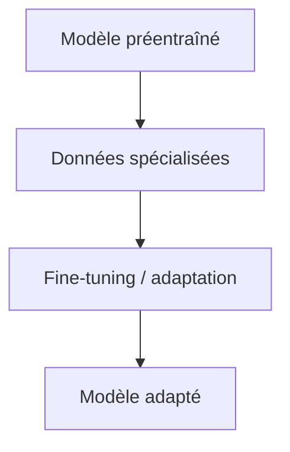

Nous allons étudier :

* préentraînement ;
* fine-tuning ;
* prompting ;
* RAG ;
* fine-tuning complet ;
* LoRA ;
* QLoRA ;
* adapters ;
* distillation ;
* spécialisation métier ;
* surapprentissage ;
* catastrophic forgetting ;
* évaluation après adaptation ;
* choix entre RAG, fine-tuning et outils.

---

## 25.2 Pourquoi adapter un Transformer ?

Un modèle généraliste sait faire beaucoup de choses.

Mais il peut ne pas être optimal pour un cas précis.

Exemples :

* répondre dans un format métier strict ;
* classer des tickets internes ;
* générer du SQL selon un schéma précis ;
* reformuler des rapports administratifs ;
* respecter une terminologie juridique ;
* produire du code selon les conventions d’un projet ;
* répondre dans un style pédagogique donné ;
* extraire des informations selon un référentiel.

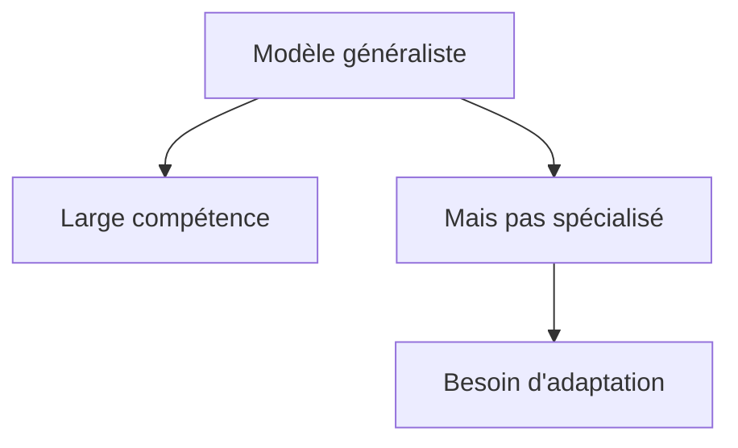

L’adaptation sert à rendre le modèle plus utile dans un contexte précis.

---

## 25.3 Trois grandes manières d’adapter un modèle

Nous pouvons distinguer trois grandes familles :

1. **prompting** ;
2. **RAG** ;
3. **fine-tuning**.

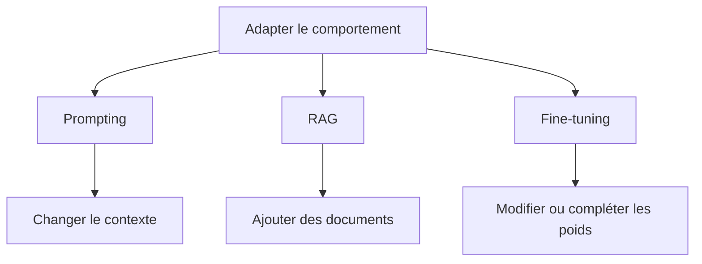

Ces méthodes ne s’opposent pas forcément.

On peut les combiner.

---

## 25.4 Prompting

Le prompting consiste à guider le modèle par une consigne.

Exemple :

```txt
Réponds comme un professeur d’informatique de Master.
Utilise la première personne du pluriel.
Structure la réponse en chapitres.
```


Avantages :

* rapide ;
* pas d’entraînement ;
* flexible ;
* facile à modifier.

Limites :

* comportement pas toujours stable ;
* coût en tokens ;
* dépend fortement de la formulation ;
* ne modifie pas réellement le modèle.

---

## 25.5 RAG

Le RAG consiste à ajouter des documents pertinents au contexte.

Exemple :

```txt
Question utilisateur + extraits de documentation interne → réponse sourcée
```

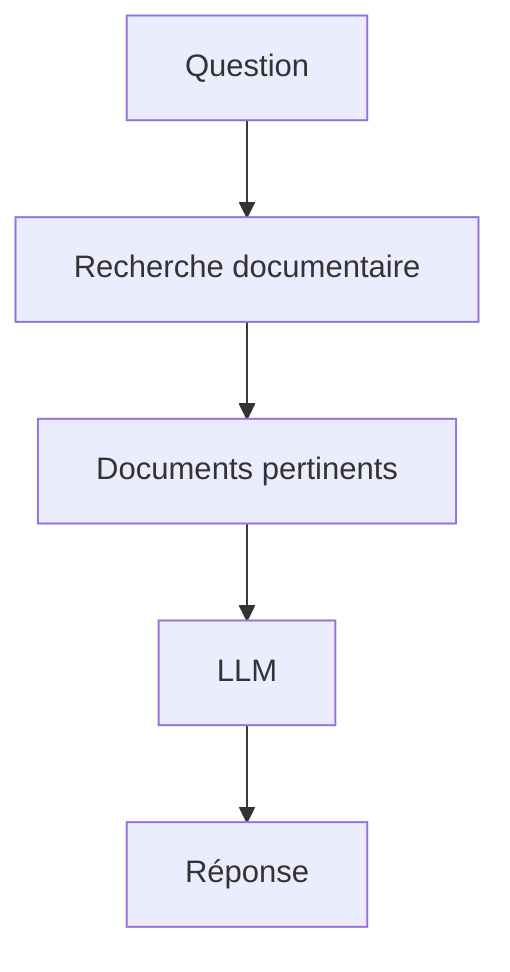

Avantages :

* données faciles à mettre à jour ;
* sources vérifiables ;
* pas besoin de réentraîner ;
* adapté aux connaissances documentaires.

Limites :

* dépend de la qualité du retrieval ;
* chunking important ;
* sources parfois mal utilisées ;
* ne change pas les compétences profondes du modèle.

---

## 25.6 Fine-tuning

Le fine-tuning consiste à entraîner le modèle sur des données spécifiques.

Exemple :

```txt
Instruction métier → réponse attendue
```

Le modèle ajuste ses paramètres pour mieux reproduire ce comportement.

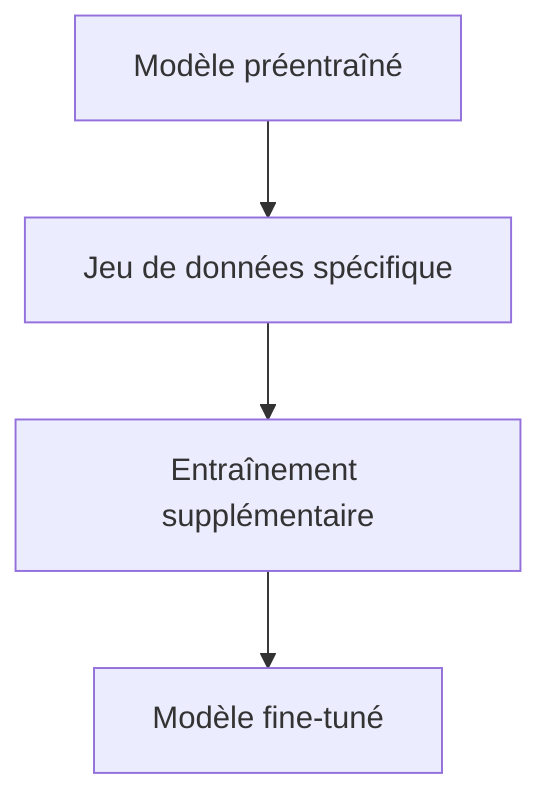

Avantages :

* comportement plus stable ;
* meilleur respect d’un format ;
* spécialisation possible ;
* utile pour tâches répétitives.

Limites :

* demande des données de qualité ;
* coût d’entraînement ;
* risque de surapprentissage ;
* risque d’oubli ;
* mise à jour moins simple que RAG.

---

## 25.7 Préentraînement vs fine-tuning

Le **préentraînement** apprend des capacités générales.

Le **fine-tuning** adapte ces capacités.

| Étape           | Données               | Objectif                                      |
| --------------- | --------------------- | --------------------------------------------- |
| Préentraînement | corpus massif général | apprendre la langue, le code, les régularités |
| Fine-tuning     | données ciblées       | adapter à une tâche ou un comportement        |
| RAG             | documents récupérés   | fournir une information externe               |
| Prompting       | consigne              | guider temporairement                         |


Nous ne devons pas confondre ces étapes.

---

## 25.8 Exemple simple de fine-tuning

Supposons que nous voulions un modèle qui reformule des notes sociales de manière professionnelle.

Donnée d’entraînement :

```txt
Entrée :
La dame galère grave avec son logement, elle paye plus.

Sortie :
Madame rencontre d’importantes difficultés liées à son logement et présente des impayés de loyer.
```

Le modèle apprend :

* le style attendu ;
* le vocabulaire professionnel ;
* le type de reformulation ;
* le niveau de langage ;
* la structure des réponses.

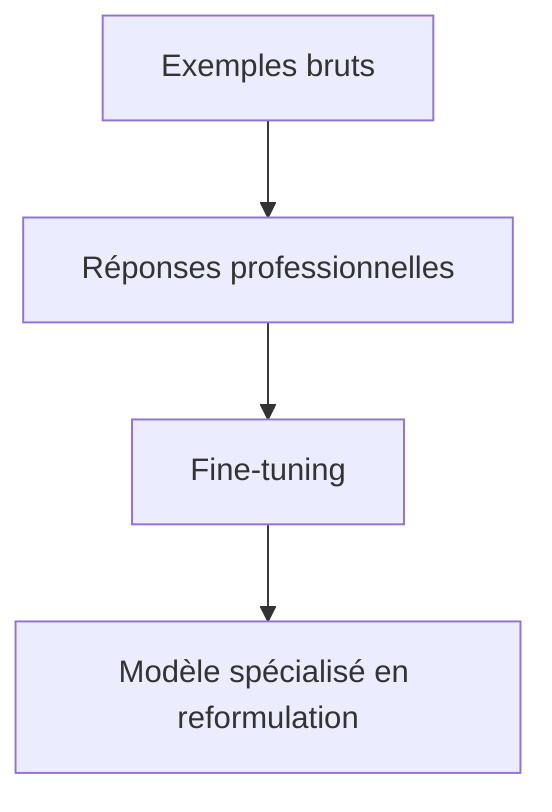

Ce type d’adaptation ne consiste pas à apprendre un fait, mais un comportement.

---

## 25.9 Fine-tuning pour classification

Un Transformer peut être fine-tuné pour classifier.

Exemple :

```txt
Ticket : Je n’arrive plus à me connecter.
Classe : support technique
```

Classes possibles :

* bug ;
* facturation ;
* demande commerciale ;
* support technique ;
* spam.

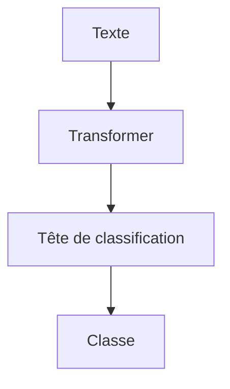

Dans ce cas, on ajoute souvent une tête de classification au-dessus du modèle.

---

## 25.10 Fine-tuning pour génération

Pour un LLM decoder-only, on fine-tune souvent avec des paires :

```txt
instruction → réponse
```

Exemple :

```txt
Instruction :
Résume ce mail en une phrase.

Réponse :
Le client demande une confirmation du délai de livraison.
```

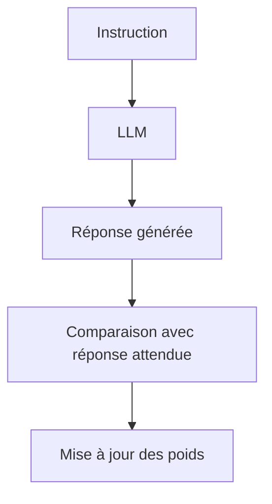

Le modèle apprend à produire le type de sortie attendu.

---

## 25.11 Supervised Fine-Tuning

Le **Supervised Fine-Tuning**, ou **SFT**, est un fine-tuning supervisé.

On fournit des exemples corrects.

Le modèle apprend à imiter ces réponses.

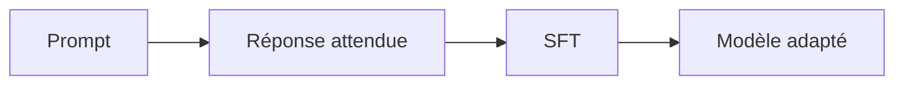

C’est la méthode classique pour transformer un modèle de base en modèle qui suit des instructions.

---

## 25.12 Format des données SFT

Un exemple SFT peut contenir :

```json
{
  "messages": [
    {
      "role": "user",
      "content": "Explique la récursivité simplement."
    },
    {
      "role": "assistant",
      "content": "La récursivité consiste à résoudre un problème en le découpant..."
    }
  ]
}
```

ou un format plus simple :

```json
{
  "instruction": "Corrige ce texte.",
  "input": "Je suis allez au magasin.",
  "output": "Je suis allé au magasin."
}
```

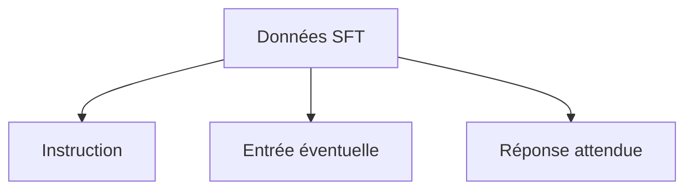

La cohérence du format est essentielle.

---

## 25.13 Qualité des données

Le fine-tuning est très sensible à la qualité des données.

Des données mauvaises entraînent un mauvais comportement.

Problèmes fréquents :

* réponses incorrectes ;
* styles incohérents ;
* formats contradictoires ;
* données dupliquées ;
* exemples trop faciles ;
* erreurs factuelles ;
* consignes ambiguës ;
* labels faux.

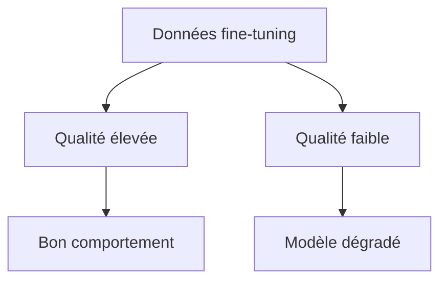

Pour fine-tuner, il vaut souvent mieux peu de bonnes données que beaucoup de mauvaises données.

---

## 25.14 Nettoyage des données de fine-tuning

Avant le fine-tuning, nous devons souvent :

* supprimer les doublons ;
* corriger les erreurs ;
* harmoniser les formats ;
* filtrer les exemples inutiles ;
* vérifier les labels ;
* équilibrer les classes ;
* retirer les données sensibles ;
* séparer train, validation et test.

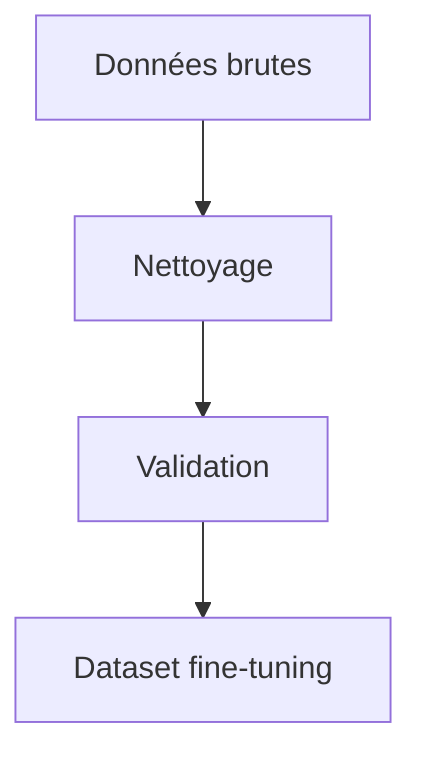

La préparation des données représente souvent la plus grande partie du travail.

---

## 25.15 Fine-tuning complet

Le fine-tuning complet met à jour tous les paramètres du modèle.

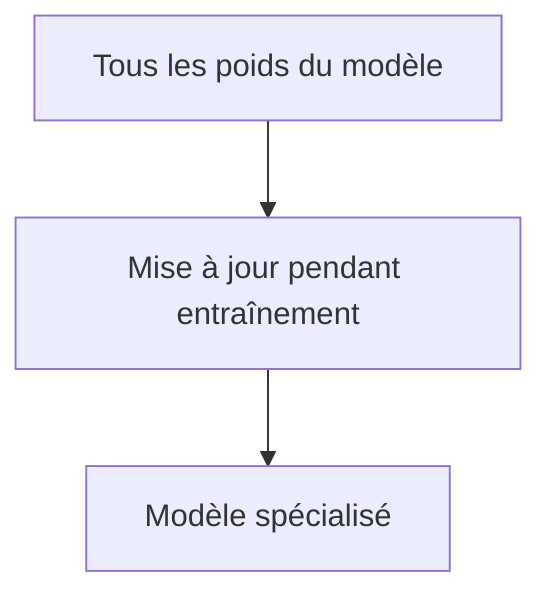

Avantages :

* adaptation forte ;
* très flexible ;
* performant si beaucoup de données.

Limites :

* coûteux ;
* demande beaucoup de mémoire ;
* risque de surapprentissage ;
* risque d’oubli catastrophique ;
* difficile à gérer pour plusieurs adaptations.

Le fine-tuning complet est puissant, mais lourd.

---

## 25.16 Parameter-Efficient Fine-Tuning

Le **Parameter-Efficient Fine-Tuning**, ou **PEFT**, regroupe des méthodes qui adaptent un modèle sans modifier tous ses paramètres.

L’idée est :

> Geler la majorité du modèle et entraîner seulement un petit nombre de paramètres supplémentaires.

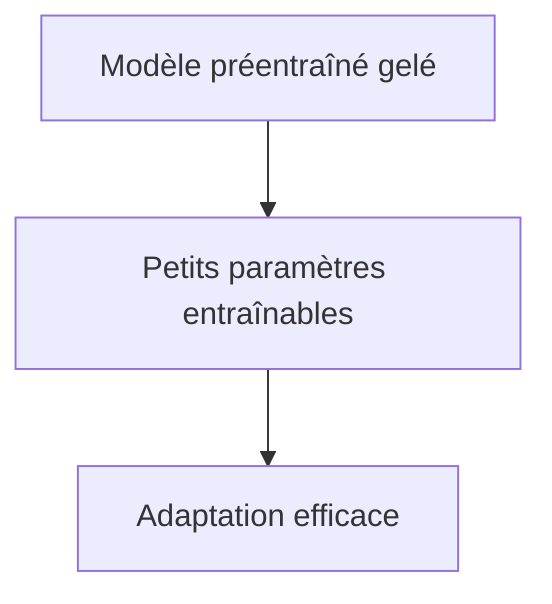

Cela réduit :

* mémoire ;
* coût ;
* temps d’entraînement ;
* taille des fichiers d’adaptation.

---

## 25.17 Adapters

Les **adapters** ajoutent de petits modules entre les couches du Transformer.

Le modèle principal reste gelé.

Seuls les adapters sont entraînés.

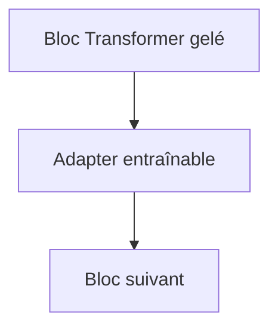

Avantages :

* léger ;
* plusieurs adapters possibles pour plusieurs tâches ;
* modèle principal réutilisable.

Limites :

* ajoute parfois de la latence ;
* peut être moins performant qu’un fine-tuning complet ;
* nécessite une architecture compatible.

---

## 25.18 LoRA

LoRA signifie :

```txt
Low-Rank Adaptation
```

L’idée est de ne pas modifier directement une grande matrice de poids.

On ajoute une mise à jour de faible rang.

Si une couche a une matrice :

$$
W
$$

au lieu d’apprendre une nouvelle matrice complète, on apprend :

$$
W + \Delta W
$$

avec :

$$
\Delta W = BA
$$

où $A$ et $B$ sont de petites matrices.

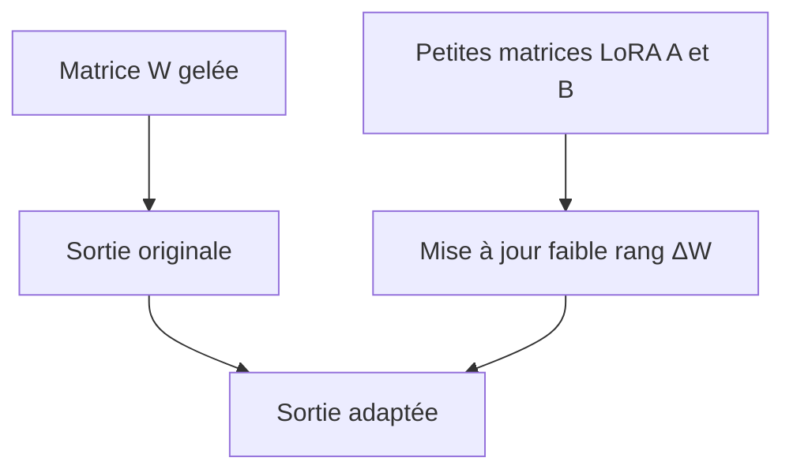

LoRA est aujourd’hui une méthode très populaire pour adapter des LLM.

---

## 25.19 Intuition de LoRA

Une grande matrice peut contenir des millions de paramètres.

Mais pour adapter le modèle à une tâche, nous n’avons pas forcément besoin de modifier toute cette matrice.

Nous pouvons apprendre une petite correction.

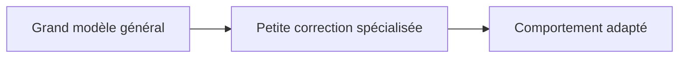

LoRA suppose que beaucoup d’adaptations utiles peuvent être représentées par une mise à jour de faible rang.

---

## 25.20 Avantages de LoRA

LoRA a plusieurs avantages :

* beaucoup moins de paramètres entraînables ;
* moins de mémoire ;
* entraînement plus rapide ;
* stockage léger ;
* plusieurs adaptations possibles ;
* modèle de base conservé ;
* utile pour modèles open-weights.

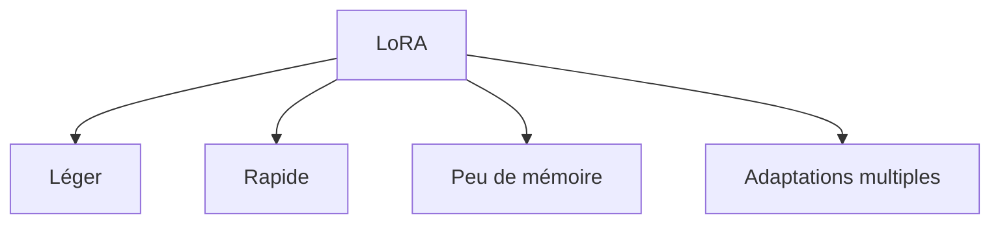

On peut avoir un modèle de base et plusieurs LoRA spécialisés.

---

## 25.21 Limites de LoRA

LoRA n’est pas magique.

Limites :

* dépend du rang choisi ;
* moins flexible qu’un fine-tuning complet ;
* peut mal fonctionner si la tâche est très différente ;
* demande quand même des données propres ;
* peut surapprendre ;
* nécessite une bonne évaluation.

```mermaid
flowchart TD
    A["LoRA"] --> B["Efficace"]
    A --> C["Mais capacité limitée"]
    C --> D["Rang trop faible"]
    C --> E["Données insuffisantes"]
```

LoRA est un compromis.

---

## 25.22 QLoRA

QLoRA combine :

* quantization du modèle de base ;
* LoRA sur des paramètres légers.

Le modèle principal est chargé en basse précision.

Les petites matrices LoRA sont entraînées.

```mermaid
flowchart TD
    A["Modèle de base quantifié"] --> B["Poids gelés"]
    B --> C["LoRA entraînable"]
    C --> D["Adaptation avec moins de mémoire"]
```

QLoRA permet d’adapter de grands modèles avec beaucoup moins de VRAM.

---

## 25.23 Pourquoi QLoRA est utile

Le fine-tuning d’un grand modèle peut demander énormément de mémoire GPU.

QLoRA réduit cette contrainte.

Avantages :

* fine-tuning de grands modèles sur matériel plus modeste ;
* coût réduit ;
* accessibilité pour la recherche et l’open-source ;
* stockage léger des adaptations.

```mermaid
flowchart TD
    A["Grand modèle"] --> B["Fine-tuning complet coûteux"]
    A --> C["QLoRA"]
    C --> D["Adaptation plus accessible"]
```

C’est une technique très importante pour démocratiser l’adaptation des LLM.

---

## 25.24 Distillation

La distillation consiste à entraîner un petit modèle à imiter un grand modèle.

Le grand modèle est appelé **professeur**.

Le petit modèle est appelé **élève**.

```mermaid
flowchart TD
    A["Grand modèle professeur"] --> B["Réponses / distributions"]
    B --> C["Petit modèle élève"]
    C --> D["Modèle compact"]
```

La distillation sert à obtenir un modèle :

* plus rapide ;
* moins coûteux ;
* plus facile à déployer ;
* adapté à une tâche.

---

## 25.25 Distillation par réponses

Une méthode simple consiste à demander au grand modèle de produire des réponses.

Ces réponses deviennent des données d’entraînement pour le petit modèle.

```mermaid
flowchart TD
    A["Prompts"] --> B["Grand modèle"]
    B --> C["Réponses générées"]
    C --> D["Dataset synthétique"]
    D --> E["Petit modèle entraîné"]
```

Cette méthode est pratique, mais il faut contrôler la qualité des réponses générées.

Un mauvais professeur transmet ses erreurs.

---

## 25.26 Distillation par logits

Une distillation plus fine utilise les distributions de probabilité du professeur.

Au lieu de seulement imiter la réponse finale, l’élève apprend à imiter les probabilités du professeur.

```mermaid
flowchart TD
    A["Entrée"] --> B["Professeur"]
    B --> C["Logits / probabilités"]
    C --> D["Élève"]
    D --> E["Apprentissage"]
```

Cela transmet plus d’information qu’une simple réponse texte.

---

## 25.27 Fine-tuning pour domaine métier

Un modèle peut être adapté à un domaine :

* juridique ;
* médical ;
* finance ;
* social ;
* industriel ;
* informatique ;
* support client ;
* administration.

```mermaid
flowchart TD
    A["Modèle général"] --> B["Données métier"]
    B --> C["Fine-tuning domaine"]
    C --> D["Modèle spécialisé"]
```

Mais attention :

> Pour ajouter des connaissances factuelles, le RAG est souvent plus approprié que le fine-tuning.

Le fine-tuning est surtout utile pour apprendre un comportement, un style, un format ou une tâche.

---

## 25.28 Fine-tuning pour style

Le fine-tuning peut apprendre un style.

Exemples :

* ton pédagogique ;
* style juridique ;
* rédaction administrative ;
* concision ;
* structure de rapport ;
* format Markdown ;
* style conversationnel.

```mermaid
flowchart LR
    A["Exemples de style"] --> B["Fine-tuning"]
    B --> C["Réponses dans le style appris"]
```

C’est utile lorsque le prompting ne suffit pas à stabiliser le style.

---

## 25.29 Fine-tuning pour format

Certains cas exigent un format strict.

Exemples :

* JSON ;
* XML ;
* SQL ;
* tickets ;
* rapports ;
* fiches d’évaluation ;
* extraction structurée.

```mermaid
flowchart TD
    A["Entrée"] --> B["Modèle fine-tuné"]
    B --> C["Sortie formatée"]
    C --> D["Validation schéma"]
```

Le fine-tuning peut améliorer le respect du format, mais il faut quand même valider les sorties.

---

## 25.30 Fine-tuning pour extraction

Exemple :

```txt
Texte :
La société ACME a signé le contrat le 12 mars 2026 pour un montant de 45 000 €.

Sortie :
{
  "organisation": "ACME",
  "date_signature": "12 mars 2026",
  "montant": "45 000 €"
}
```

```mermaid
flowchart TD
    A["Texte brut"] --> B["Modèle adapté"]
    B --> C["JSON extrait"]
    C --> D["Validation"]
```

Le modèle apprend à transformer du texte en structure.

---

## 25.31 Fine-tuning pour code

Un modèle de code peut être fine-tuné sur :

* un langage spécifique ;
* une base de code interne ;
* des conventions de style ;
* des APIs ;
* des exemples de bugs/corrections ;
* des tests.

```mermaid
flowchart TD
    A["Modèle code général"] --> B["Données projet"]
    B --> C["Adaptation"]
    C --> D["Assistant code spécialisé"]
```

Mais pour connaître une base de code évolutive, le RAG code reste souvent préférable.

Le fine-tuning peut apprendre les conventions.

Le RAG fournit le contenu actualisé.

---

## 25.32 Fine-tuning et données synthétiques

Les données synthétiques sont générées par un modèle ou un programme.

Exemple :

1. on génère des questions ;
2. on génère des réponses ;
3. on filtre ;
4. on fine-tune un modèle plus petit.

```mermaid
flowchart TD
    A["Modèle professeur"] --> B["Génère exemples"]
    B --> C["Filtrage"]
    C --> D["Dataset synthétique"]
    D --> E["Fine-tuning"]
```

Les données synthétiques peuvent accélérer la création d’un dataset.

Mais elles peuvent aussi propager des erreurs ou appauvrir la diversité.

---

## 25.33 Risque : surapprentissage

Le surapprentissage, ou overfitting, se produit lorsque le modèle apprend trop précisément les exemples d’entraînement.

Il devient bon sur le train set, mais mauvais sur de nouveaux cas.

```mermaid
flowchart TD
    A["Dataset trop petit"] --> B["Modèle mémorise"]
    B --> C["Performance train élevée"]
    B --> D["Généralisation faible"]
```

Signes possibles :

* réponses trop proches des exemples ;
* mauvaise performance sur validation ;
* perte de flexibilité ;
* comportement répétitif.

---

## 25.34 Risque : catastrophic forgetting

Le **catastrophic forgetting** signifie que le modèle oublie certaines capacités générales après un fine-tuning trop agressif.

Exemple :

* le modèle devient bon sur une tâche métier ;
* mais perd en qualité générale ;
* il répond moins bien hors domaine ;
* il suit moins bien les consignes générales.

```mermaid
flowchart TD
    A["Modèle général"] --> B["Fine-tuning trop fort"]
    B --> C["Spécialisation excessive"]
    C --> D["Oubli de capacités générales"]
```

Pour limiter cela, on peut :

* réduire le learning rate ;
* utiliser LoRA ;
* mélanger des données générales ;
* surveiller des benchmarks de régression ;
* arrêter l’entraînement plus tôt.

---

## 25.35 Risque : apprendre de mauvaises habitudes

Si les données contiennent un mauvais style, le modèle peut l’apprendre.

Exemples :

* réponses trop longues ;
* absence de prudence ;
* citations inventées ;
* JSON invalide ;
* ton inadapté ;
* raisonnement faux ;
* erreurs métier.

```mermaid
flowchart TD
    A["Mauvaises données"] --> B["Fine-tuning"]
    B --> C["Mauvaises habitudes apprises"]
```

Le modèle imite ce qu’on lui donne.

La qualité des exemples est donc centrale.

---

## 25.36 Train, validation et test

Nous devons séparer les données :

* train ;
* validation ;
* test.

```mermaid
flowchart TD
    A["Dataset"] --> B["Train"]
    A --> C["Validation"]
    A --> D["Test"]
```

Le train sert à entraîner.

La validation sert à ajuster les hyperparamètres.

Le test sert à évaluer une performance finale plus réaliste.

Il faut éviter que les mêmes exemples apparaissent dans plusieurs splits.

---

## 25.37 Évaluation après fine-tuning

Après adaptation, nous devons vérifier :

* performance sur la tâche cible ;
* respect du format ;
* robustesse ;
* absence de régression ;
* factualité ;
* sécurité ;
* généralisation ;
* comportement hors domaine.

```mermaid
flowchart TD
    A["Modèle fine-tuné"] --> B["Évaluation tâche"]
    A --> C["Évaluation format"]
    A --> D["Évaluation sécurité"]
    A --> E["Évaluation régression"]
```

Un fine-tuning réussi ne se juge pas seulement à la loss d’entraînement.

---

## 25.38 Évaluer le respect de format

Si nous voulons du JSON, nous devons mesurer :

* JSON valide ;
* schéma respecté ;
* champs obligatoires présents ;
* types corrects ;
* valeurs plausibles.

```mermaid
flowchart TD
    A["Sortie modèle"] --> B["Parser JSON"]
    B --> C{"Valide ?"}
    C -->|"Oui"| D["Validation schéma"]
    C -->|"Non"| E["Erreur format"]
```

La validation automatique est indispensable.

---

## 25.39 Évaluer la spécialisation

Pour un domaine métier, nous pouvons construire un jeu de tests représentatif.

Exemples :

* cas simples ;
* cas limites ;
* cas ambigus ;
* cas contradictoires ;
* cas hors domaine ;
* cas avec données manquantes.

```mermaid
flowchart TD
    A["Jeu de test métier"] --> B["Cas simples"]
    A --> C["Cas limites"]
    A --> D["Cas ambigus"]
    A --> E["Hors domaine"]
```

Un modèle spécialisé doit aussi savoir dire quand il ne sait pas.

---

## 25.40 Choisir entre RAG et fine-tuning

Question centrale :

> Devons-nous fine-tuner ou utiliser un RAG ?

Cela dépend de ce que nous voulons changer.

Si nous voulons ajouter des connaissances documentaires :

```txt
RAG
```

Si nous voulons changer le comportement ou le format :

```txt
fine-tuning
```

Si nous voulons guider temporairement :

```txt
prompting
```

```mermaid
flowchart TD
    A["Besoin"] --> B{"Type de besoin ?"}
    B -->|"Connaissance externe"| C["RAG"]
    B -->|"Comportement / style / format"| D["Fine-tuning"]
    B -->|"Instruction ponctuelle"| E["Prompting"]
    B -->|"Action / calcul / système"| F["Outils"]
```

---

## 25.41 Exemples de décision

### Cas 1 : base documentaire interne

```txt
Le modèle doit répondre à partir de contrats internes à jour.
```

Solution privilégiée :

```txt
RAG
```

### Cas 2 : sortie JSON stricte

```txt
Le modèle doit extraire toujours les mêmes champs.
```

Solution possible :

```txt
fine-tuning + validation
```

### Cas 3 : calculs exacts

```txt
Le modèle doit calculer des montants.
```

Solution :

```txt
outil de calcul
```

### Cas 4 : style pédagogique stable

```txt
Le modèle doit répondre comme un professeur avec une structure régulière.
```

Solution :

```txt
prompting ou fine-tuning selon le besoin de stabilité
```

---

## 25.42 Combiner RAG et fine-tuning

On peut combiner les deux.

Exemple :

* fine-tuning pour apprendre à répondre dans un format métier ;
* RAG pour fournir les documents à jour.

```mermaid
flowchart TD
    A["Question"] --> B["RAG récupère sources"]
    B --> C["Contexte documentaire"]
    C --> D["Modèle fine-tuné"]
    D --> E["Réponse au format métier"]
```

Cette combinaison est fréquente en production.

Le fine-tuning apprend la forme.

Le RAG apporte le fond.

---

## 25.43 Combiner fine-tuning et outils

On peut fine-tuner un modèle à utiliser des outils.

Exemple :

* reconnaître quand appeler une calculatrice ;
* produire un appel SQL correct ;
* choisir une API ;
* formater les arguments.

```mermaid
flowchart TD
    A["Données avec appels outils"] --> B["Fine-tuning"]
    B --> C["Modèle meilleur en tool calling"]
```

Le modèle apprend non seulement à répondre, mais à utiliser le bon outil au bon moment.

---

## 25.44 Adapter un modèle embedding

Nous pouvons aussi adapter un modèle d’embedding.

Objectif :

* rapprocher les textes pertinents ;
* éloigner les textes non pertinents ;
* améliorer la recherche dans un domaine.

```mermaid
flowchart TD
    A["Paires requête-document"] --> B["Entraînement embedding"]
    B --> C["Embedding spécialisé"]
    C --> D["Meilleur retrieval"]
```

C’est utile si les embeddings génériques ne capturent pas bien le vocabulaire métier.

---

## 25.45 Adapter un reranker

Un reranker peut être fine-tuné sur des exemples :

```txt
question + document → score de pertinence
```

ou :

```txt
question + document pertinent > question + document non pertinent
```

```mermaid
flowchart TD
    A["Paires question-document"] --> B["Labels pertinence"]
    B --> C["Fine-tuning reranker"]
    C --> D["Meilleur classement"]
```

Dans un RAG, améliorer le reranker peut parfois avoir plus d’effet que fine-tuner le LLM génératif.

---

## 25.46 Fine-tuning et sécurité

Le fine-tuning peut modifier les comportements de sécurité.

Risques :

* affaiblir des refus nécessaires ;
* apprendre des réponses dangereuses ;
* suradapter à un domaine sensible ;
* ignorer l’incertitude ;
* produire des réponses trop affirmatives.

```mermaid
flowchart TD
    A["Fine-tuning"] --> B["Améliore tâche"]
    A --> C["Peut modifier sécurité"]
    C --> D["Évaluation nécessaire"]
```

Après fine-tuning, il faut refaire des tests de sécurité.

---

## 25.47 Fine-tuning et données sensibles

Les données de fine-tuning peuvent contenir des informations sensibles.

Il faut vérifier :

* données personnelles ;
* secrets industriels ;
* données médicales ;
* documents juridiques ;
* informations financières ;
* code privé ;
* identifiants ;
* clés API.

```mermaid
flowchart TD
    A["Dataset fine-tuning"] --> B["Données sensibles ?"]
    B --> C["Anonymisation"]
    B --> D["Filtrage"]
    B --> E["Contrôle accès"]
```

Un dataset d’adaptation doit être gouverné sérieusement.

---

## 25.48 Fine-tuning et mémorisation

Un modèle peut mémoriser certains exemples.

C’est problématique si les données contiennent :

* noms ;
* adresses ;
* secrets ;
* mots de passe ;
* informations confidentielles.

```mermaid
flowchart TD
    A["Données sensibles"] --> B["Fine-tuning"]
    B --> C["Risque de mémorisation"]
    C --> D["Fuite possible"]
```

Il ne faut pas fine-tuner naïvement sur des données confidentielles brutes sans stratégie de protection.

---

## 25.49 Hyperparamètres importants

Pendant un fine-tuning, plusieurs hyperparamètres sont importants :

* learning rate ;
* batch size ;
* nombre d’époques ;
* longueur de séquence ;
* warmup ;
* weight decay ;
* rang LoRA ;
* dropout ;
* gradient accumulation.

```mermaid
flowchart TD
    A["Fine-tuning"] --> B["Learning rate"]
    A --> C["Batch size"]
    A --> D["Epochs"]
    A --> E["LoRA rank"]
    A --> F["Longueur séquence"]
```

Un mauvais learning rate peut dégrader rapidement le modèle.

---

## 25.50 Learning rate

Le learning rate contrôle l’amplitude des mises à jour.

Trop élevé :

* instabilité ;
* oubli ;
* dégradation.

Trop faible :

* adaptation lente ;
* apprentissage insuffisant.

```mermaid
flowchart TD
    A["Learning rate"] --> B["Trop élevé"]
    A --> C["Trop faible"]

    B --> D["Instabilité"]
    C --> E["Peu d'adaptation"]
```

Pour le fine-tuning de LLM, on utilise souvent des learning rates faibles.

---

## 25.51 Nombre d’époques

Une époque correspond à un passage complet sur le dataset d’entraînement.

Trop peu d’époques :

* modèle pas assez adapté.

Trop d’époques :

* surapprentissage ;
* mémorisation ;
* perte de généralité.

```mermaid
flowchart TD
    A["Nombre d'époques"] --> B["Trop faible"]
    A --> C["Trop élevé"]

    B --> D["Sous-adaptation"]
    C --> E["Overfitting"]
```

Il faut surveiller la validation loss et les tests métier.

---

## 25.52 Rang LoRA

Le rang LoRA contrôle la capacité de l’adaptation.

Rang faible :

* adaptation légère ;
* peu de mémoire ;
* peut être insuffisant.

Rang élevé :

* plus de capacité ;
* plus de mémoire ;
* plus de risque de surapprentissage.

```mermaid
flowchart TD
    A["Rang LoRA"] --> B["Faible"]
    A --> C["Élevé"]

    B --> D["Léger mais limité"]
    C --> E["Plus expressif mais coûteux"]
```

Le bon rang dépend de la tâche.

---

## 25.53 Monitoring de l’entraînement

Pendant le fine-tuning, nous suivons :

* train loss ;
* validation loss ;
* exactitude ou métrique métier ;
* taux de format valide ;
* exemples générés ;
* erreurs ;
* temps ;
* mémoire GPU.

```mermaid
flowchart TD
    A["Fine-tuning"] --> B["Train loss"]
    A --> C["Validation loss"]
    A --> D["Métriques métier"]
    A --> E["Exemples qualitatifs"]
```

Les métriques automatiques doivent être complétées par une inspection qualitative.

---

## 25.54 Early stopping

L’early stopping consiste à arrêter l’entraînement quand la performance validation ne s’améliore plus.

```mermaid
flowchart TD
    A["Validation loss"] --> B{"S'améliore ?"}
    B -->|"Oui"| C["Continuer"]
    B -->|"Non"| D["Arrêter"]
```

Cela réduit le surapprentissage.

---

## 25.55 Déploiement d’un modèle adapté

Après adaptation, il faut déployer le modèle.

Questions :

* modèle complet ou LoRA ?
* quantization ?
* latence ?
* mémoire ?
* versioning ?
* rollback ?
* monitoring ?
* sécurité ?
* coût ?

```mermaid
flowchart TD
    A["Modèle adapté"] --> B["Packaging"]
    B --> C["Déploiement"]
    C --> D["Monitoring"]
    D --> E["Rollback si problème"]
```

Le fine-tuning n’est pas terminé quand l’entraînement s’arrête.

---

## 25.56 Versioning des adaptations

Il faut versionner :

* dataset ;
* code d’entraînement ;
* hyperparamètres ;
* modèle de base ;
* poids LoRA ;
* métriques ;
* date ;
* objectif.

```mermaid
flowchart TD
    A["Version adaptation"] --> B["Dataset"]
    A --> C["Modèle base"]
    A --> D["Hyperparamètres"]
    A --> E["Métriques"]
    A --> F["Poids"]
```

Sans versioning, il devient difficile de reproduire ou corriger un modèle.

---

## 25.57 Rollback

Si une adaptation dégrade le modèle, il faut pouvoir revenir à une version précédente.

```mermaid
flowchart TD
    A["Nouvelle version"] --> B["Monitoring"]
    B --> C{"Problème ?"}
    C -->|"Oui"| D["Rollback"]
    C -->|"Non"| E["Conserver"]
```

Le rollback est essentiel en production.

---

## 25.58 Évaluation continue

Même après déploiement, il faut continuer à évaluer :

* taux d’erreur ;
* retours utilisateurs ;
* dérive des données ;
* nouveaux cas ;
* coûts ;
* latence ;
* sécurité.

```mermaid
flowchart TD
    A["Production"] --> B["Logs"]
    B --> C["Évaluation continue"]
    C --> D["Amélioration dataset"]
    D --> E["Nouvelle adaptation"]
```

Un modèle adapté doit être maintenu.

---

## 25.59 Erreur fréquente : fine-tuner pour apprendre des faits

Si nous voulons que le modèle connaisse une nouvelle documentation, le fine-tuning n’est pas toujours le bon choix.

Exemple :

```txt
Le modèle doit connaître tous les contrats clients à jour.
```

Meilleure solution :

```txt
RAG
```

Pourquoi ?

* les contrats changent ;
* il faut citer ;
* il faut gérer les droits ;
* il faut retirer des documents ;
* il faut mettre à jour sans réentraîner.

```mermaid
flowchart TD
    A["Connaissance documentaire évolutive"] --> B["RAG préférable"]
    C["Comportement / style"] --> D["Fine-tuning préférable"]
```

Le fine-tuning n’est pas une base de données.

---

## 25.60 Erreur fréquente : fine-tuner avec trop peu de données

Un petit dataset peut suffire pour un LoRA simple.

Mais s’il est trop petit ou répétitif, le modèle risque de surapprendre.

```mermaid
flowchart TD
    A["Peu de données"] --> B["Surapprentissage"]
    B --> C["Mauvaise généralisation"]
```

Il faut tester sur des exemples nouveaux, pas seulement sur les exemples d’entraînement.

---

## 25.61 Erreur fréquente : oublier l’évaluation métier

La loss peut baisser, mais le modèle peut rester mauvais pour l’usage réel.

```mermaid
flowchart TD
    A["Loss basse"] --> B["Pas forcément bon produit"]
    B --> C["Besoin évaluation métier"]
```

Nous devons construire des tests représentatifs du vrai usage.

---

## 25.62 Erreur fréquente : oublier le modèle de base

Une adaptation dépend fortement du modèle de base.

Un mauvais modèle de base donnera rarement un excellent modèle adapté.

```mermaid
flowchart TD
    A["Modèle de base faible"] --> B["Fine-tuning"]
    B --> C["Résultat limité"]
```

Le fine-tuning améliore, mais ne crée pas toutes les capacités à partir de rien.

---

## 25.63 Erreur fréquente : croire que LoRA ne peut pas dégrader le modèle

Même si LoRA est léger, il peut dégrader le comportement.

Risques :

* style trop rigide ;
* réponses erronées ;
* surapprentissage ;
* mauvais suivi d’instructions ;
* perte de robustesse.

```mermaid
flowchart TD
    A["LoRA"] --> B["Adaptation légère"]
    B --> C["Mais dégradation possible"]
```

Il faut toujours évaluer.

---

## 25.64 Erreur fréquente : ne pas valider les sorties structurées

Même un modèle fine-tuné pour JSON peut produire un JSON invalide.

```mermaid
flowchart TD
    A["Modèle"] --> B["JSON généré"]
    B --> C["Validation obligatoire"]
```

Pour les systèmes critiques, la validation logicielle est indispensable.

---

## 25.65 Synthèse mathématique

Un modèle préentraîné possède des paramètres :

$$
\theta
$$

Le fine-tuning complet cherche de nouveaux paramètres :

$$
\theta' = \theta + \Delta \theta
$$

où $\Delta \theta$ est appris sur un dataset spécifique.

Dans LoRA, nous ne modifions pas directement $W$.

Nous ajoutons :

$$
W' = W + BA
$$

avec :

$$
rank(BA) \ll rank(W)
$$

Le modèle de base reste gelé, et seules les petites matrices $A$ et $B$ sont entraînées.

Dans un SFT, nous minimisons généralement une loss de type cross-entropy :

$$
\mathcal{L}
===========

-\sum_t \log P(y_t \mid y_{<t}, x)
$$

où :

* $x$ est l’instruction ou l’entrée ;
* $y$ est la réponse attendue.

---

## 25.66 Schéma global de synthèse

```mermaid
flowchart TD
    A["Modèle préentraîné"] --> B{"Besoin ?"}

    B -->|"Guidage ponctuel"| C["Prompting"]
    B -->|"Connaissance documentaire"| D["RAG"]
    B -->|"Action / calcul"| E["Outils"]
    B -->|"Comportement / format / style"| F["Fine-tuning"]

    F --> G["Fine-tuning complet"]
    F --> H["PEFT"]
    H --> I["Adapters"]
    H --> J["LoRA"]
    H --> K["QLoRA"]

    F --> L["Évaluation"]
    L --> M["Déploiement"]
    M --> N["Monitoring"]
    N --> O["Nouvelle itération"]
```

---

## 25.67 Résumé du chapitre

Nous avons étudié le fine-tuning et l’adaptation des Transformers.

Adapter un modèle signifie modifier ou orienter son comportement pour une tâche, un domaine, un style ou un format.

Nous avons distingué :

* prompting ;
* RAG ;
* fine-tuning ;
* outils.

Nous avons vu que le fine-tuning complet met à jour tous les paramètres du modèle, alors que les méthodes PEFT, comme adapters, LoRA et QLoRA, adaptent le modèle avec beaucoup moins de paramètres.

Nous avons étudié :

* Supervised Fine-Tuning ;
* qualité des datasets ;
* nettoyage des données ;
* surapprentissage ;
* catastrophic forgetting ;
* distillation ;
* données synthétiques ;
* adaptation métier ;
* adaptation d’embeddings ;
* adaptation de rerankers ;
* sécurité ;
* données sensibles ;
* monitoring ;
* versioning ;
* rollback.

Le point central est :

> Le fine-tuning est utile pour apprendre un comportement, un format, un style ou une tâche, mais il ne doit pas être utilisé naïvement comme remplacement d’une base documentaire ou d’un outil vérifiable.

---

## 25.68 Questions de compréhension

### 25.68.1 Question 1

Quelle est la différence entre préentraînement et fine-tuning ?

Réponse attendue : le préentraînement apprend des capacités générales sur de grands corpus ; le fine-tuning adapte le modèle à une tâche ou un comportement spécifique.

### 25.68.2 Question 2

Quand faut-il préférer le RAG au fine-tuning ?

Réponse attendue : lorsque nous voulons fournir au modèle des connaissances documentaires évolutives, vérifiables ou privées.

### 25.68.3 Question 3

Qu’est-ce que le SFT ?

Réponse attendue : le Supervised Fine-Tuning, c’est-à-dire un fine-tuning supervisé sur des exemples instruction-réponse.

### 25.68.4 Question 4

Qu’est-ce que LoRA ?

Réponse attendue : une méthode d’adaptation de faible rang qui ajoute de petites matrices entraînables aux poids gelés du modèle.

### 25.68.5 Question 5

Pourquoi QLoRA est-il utile ?

Réponse attendue : parce qu’il permet d’adapter de grands modèles avec moins de mémoire en combinant quantization et LoRA.

### 25.68.6 Question 6

Qu’est-ce que la distillation ?

Réponse attendue : entraîner un petit modèle élève à imiter un grand modèle professeur.

### 25.68.7 Question 7

Qu’est-ce que le surapprentissage ?

Réponse attendue : lorsque le modèle mémorise trop les exemples d’entraînement et généralise mal à de nouveaux cas.

### 25.68.8 Question 8

Qu’est-ce que le catastrophic forgetting ?

Réponse attendue : la perte de capacités générales du modèle après une adaptation trop forte ou mal contrôlée.

### 25.68.9 Question 9

Pourquoi faut-il évaluer après fine-tuning ?

Réponse attendue : pour vérifier la performance réelle, le respect du format, la sécurité, l’absence de régression et la généralisation.

### 25.68.10 Question 10

Pourquoi le fine-tuning ne remplace-t-il pas la validation logicielle ?

Réponse attendue : parce qu’un modèle peut encore produire des sorties invalides, fausses ou dangereuses ; il faut donc valider les formats, les permissions et les résultats.

---

## 25.69 Transition vers le chapitre 26

Nous avons étudié comment adapter un Transformer à une tâche ou un comportement.

Dans le chapitre suivant, nous allons étudier l’**évaluation des Transformers et des LLM**.

Nous verrons :

* pourquoi l’évaluation est difficile ;
* les benchmarks ;
* l’évaluation automatique ;
* l’évaluation humaine ;
* les métriques de classification ;
* les métriques de génération ;
* l’évaluation du RAG ;
* l’évaluation des hallucinations ;
* l’évaluation du raisonnement ;
* l’évaluation de la sécurité ;
* l’évaluation en production.

Nous passerons donc du modèle adapté au modèle évalué, car un modèle non évalué n’est pas un modèle fiable.

---
> [!info] Livre « Les transformers » — chapitre 25/30
> [[Les transformers — Sommaire|Sommaire]] · [[Les transformers — 24 — Agents, outils et function calling avec les Transformers|← 24 — Agents, outils et function calling avec les Transformers]] · [[Les transformers — 26 — Évaluation des Transformers et des LLM|26 — Évaluation des Transformers et des LLM →]]
