> [!info] Livre « Les transformers » — chapitre 27/30
> [[Les transformers — Sommaire|Sommaire]] · [[Les transformers — 26 — Évaluation des Transformers et des LLM|← 26 — Évaluation des Transformers et des LLM]] · [[Les transformers — 28 — Limites, risques et enjeux éthiques des Transformers et des LLM|28 — Limites, risques et enjeux éthiques des Transformers et des LLM →]]

# Chapitre 27 — Déploiement et industrialisation des Transformers et des LLM
## 27.1 Objectif du chapitre

Dans le chapitre précédent, nous avons étudié l’évaluation des Transformers et des LLM.

Nous avons vu qu’un modèle doit être évalué sur :

* sa qualité ;
* sa factualité ;
* sa robustesse ;
* son coût ;
* sa sécurité ;
* sa latence ;
* sa pertinence métier.

Mais un modèle évalué n’est pas encore un modèle **industrialisé**.

Dans ce chapitre, nous allons étudier comment passer d’un modèle entraîné ou choisi à un système réellement exploitable en production.

Nous verrons :

* comment servir un modèle ;
* les contraintes GPU ;
* la mémoire VRAM ;
* le KV cache ;
* le batching ;
* le streaming ;
* la quantization ;
* les files d’attente ;
* le monitoring ;
* les logs ;
* les coûts ;
* les architectures API ;
* les choix entre API externe, cloud privé et déploiement local ;
* les enjeux de confidentialité et de sécurité.

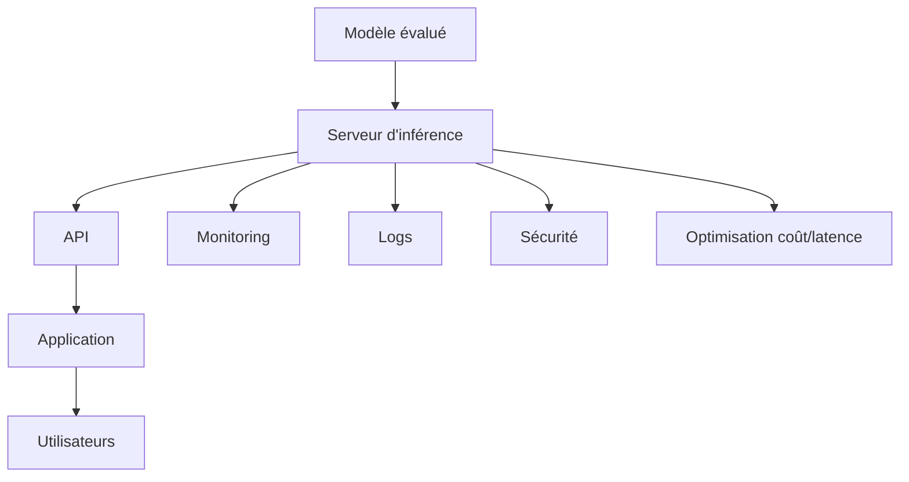

Le point central est :

> Industrialiser un LLM, ce n’est pas seulement lancer un modèle : c’est construire un système fiable, observable, sécurisé, scalable et économiquement viable.

---

## 27.2 Du modèle au service

Un modèle seul est un ensemble de poids.

Pour l’utiliser en production, nous devons l’intégrer dans un service.

Ce service doit :

* recevoir des requêtes ;
* construire un prompt ;
* appeler le modèle ;
* gérer la génération ;
* retourner la réponse ;
* journaliser les événements ;
* surveiller les erreurs ;
* contrôler les accès.

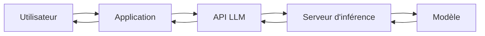

Nous passons donc d’un objet de recherche à un composant logiciel.

---

## 27.3 Les trois grandes options de déploiement

Pour utiliser un LLM, nous avons généralement trois options.

| Option             | Description                                                  |
| ------------------ | ------------------------------------------------------------ |
| API externe        | on utilise un modèle hébergé par un fournisseur              |
| Cloud privé        | on déploie le modèle dans une infrastructure cloud contrôlée |
| Local / on-premise | on déploie le modèle sur ses propres machines                |

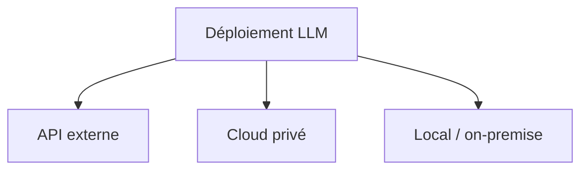

Chaque option a des avantages et des limites.

---

## 27.4 API externe

Avec une API externe, nous envoyons les requêtes à un fournisseur.

Avantages :

* pas besoin de gérer les GPU ;
* accès à des modèles performants ;
* scalabilité simplifiée ;
* maintenance externalisée ;
* mise à jour du modèle par le fournisseur.

Limites :

* dépendance à un tiers ;
* coût par requête ;
* questions de confidentialité ;
* moins de contrôle ;
* risque de changement d’API ou de modèle ;
* latence réseau.

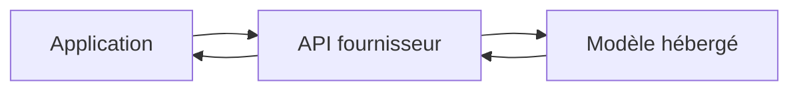

C’est souvent le choix le plus simple pour démarrer.

---

## 27.5 Cloud privé

Dans un cloud privé ou contrôlé, nous déployons le modèle sur une infrastructure dont nous maîtrisons davantage les paramètres.

Avantages :

* plus de contrôle ;
* intégration avec les systèmes internes ;
* meilleure gouvernance des données ;
* choix du modèle ;
* personnalisation possible ;
* sécurité réseau renforcée.

Limites :

* gestion de l’infrastructure ;
* coût GPU ;
* complexité DevOps ;
* besoin d’expertise MLOps ;
* monitoring à mettre en place.

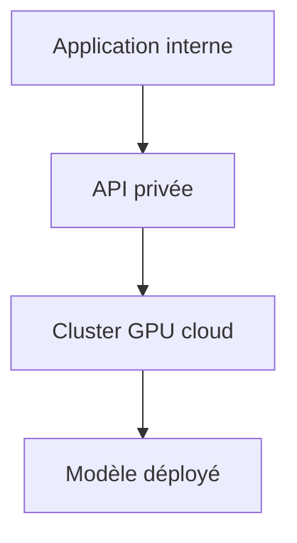

C’est un bon compromis pour des usages professionnels sensibles.

---

## 27.6 Déploiement local ou on-premise

Le déploiement local consiste à faire tourner le modèle sur ses propres machines.

Avantages :

* contrôle maximal ;
* données qui restent en interne ;
* pas de dépendance API externe ;
* possible fonctionnement hors ligne ;
* personnalisation forte.

Limites :

* coût matériel ;
* maintenance ;
* refroidissement ;
* consommation électrique ;
* mises à jour ;
* supervision ;
* montée en charge plus difficile.

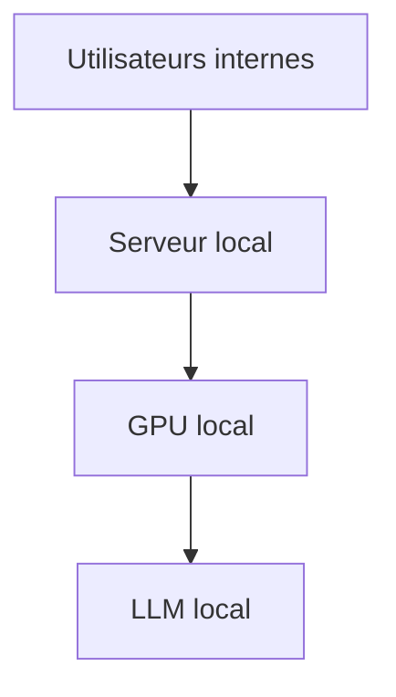

Cette option est intéressante pour la confidentialité, mais demande une vraie compétence système.

---

## 27.7 Choisir une stratégie de déploiement

Le choix dépend de plusieurs critères :

* sensibilité des données ;
* budget ;
* latence attendue ;
* volume de requêtes ;
* compétences internes ;
* besoin de personnalisation ;
* contraintes réglementaires ;
* disponibilité du matériel ;
* niveau de contrôle souhaité.

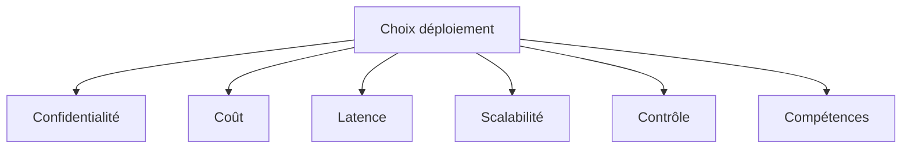

Il n’y a pas de solution universelle.

---

## 27.8 Serveur d’inférence

## 27.8.1 Qu’est-ce qu’un serveur d’inférence ?

Un serveur d’inférence est le composant qui charge le modèle et répond aux requêtes.

Il doit gérer :

* chargement des poids ;
* tokenisation ;
* génération ;
* gestion du batch ;
* streaming ;
* mémoire GPU ;
* erreurs ;
* timeouts ;
* métriques.

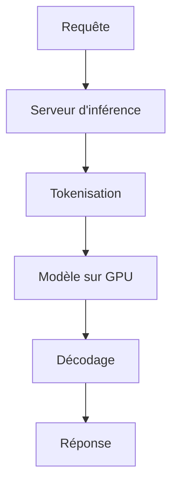

C’est le cœur technique du déploiement.

---

## 27.8.2 Cycle d’une requête

Une requête suit généralement ce chemin :

1. réception du prompt ;
2. validation ;
3. tokenisation ;
4. passage dans le modèle ;
5. génération token par token ;
6. décodage ;
7. retour de la réponse.

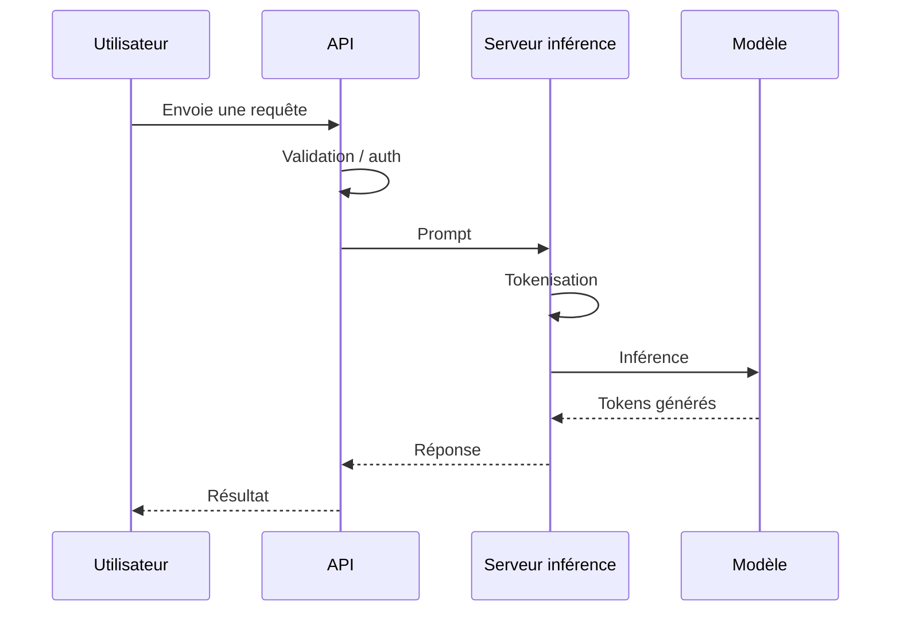

Chaque étape ajoute de la latence.

---

## 27.9 GPU et VRAM

## 27.9.1 Pourquoi les GPU sont importants ?

Les Transformers utilisent beaucoup de multiplications de matrices.

Les GPU sont conçus pour effectuer massivement ce type d’opération en parallèle.

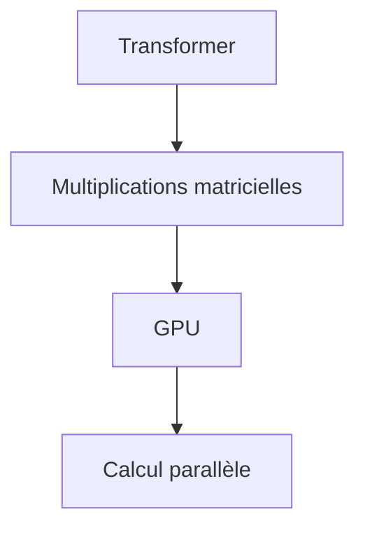

Les GPU permettent donc d’accélérer fortement l’inférence et l’entraînement.

---

## 27.9.2 VRAM

La VRAM est la mémoire de la carte graphique.

Elle doit contenir :

* les poids du modèle ;
* les activations ;
* le KV cache ;
* les buffers temporaires ;
* parfois plusieurs requêtes en batch.

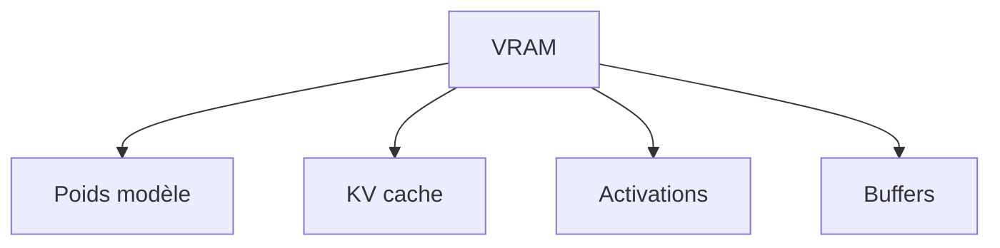

Si le modèle ne tient pas en VRAM, l’inférence devient difficile ou très lente.

---

## 27.9.3 Taille du modèle et mémoire

Un modèle de $N$ paramètres demande une mémoire approximative qui dépend de la précision numérique.

Exemples :

| Précision   | Mémoire par paramètre |
| ----------- | --------------------: |
| FP32        |              4 octets |
| FP16 / BF16 |              2 octets |
| INT8        |               1 octet |
| INT4        |             0,5 octet |

Un modèle de 7 milliards de paramètres en FP16 demande environ :

$$
7 \times 10^9 \times 2 = 14 \text{ Go}
$$

rien que pour les poids.

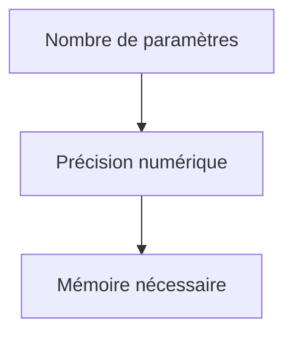

La quantization permet donc de réduire fortement la mémoire.

---

## 27.10 Quantization en production

## 27.10.1 Principe

La quantization réduit la précision des poids.

Au lieu de stocker les poids en FP16 ou FP32, nous les stockons en INT8, INT4 ou formats spécialisés.

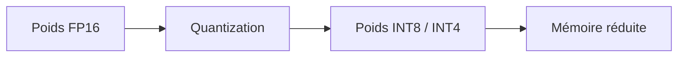

Cela permet de servir des modèles plus grands sur du matériel plus limité.

---

## 27.10.2 Avantages

La quantization peut réduire :

* mémoire ;
* coût matériel ;
* bande passante mémoire ;
* parfois latence ;
* consommation énergétique.

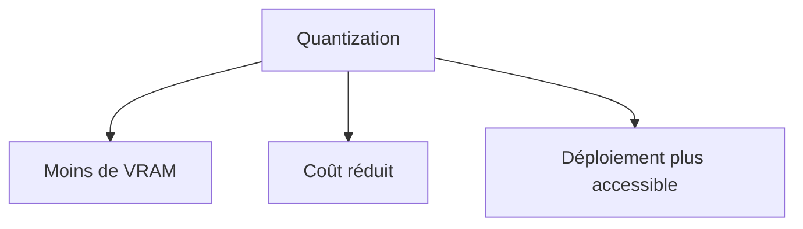

Elle est très importante pour le déploiement local.

---

## 27.10.3 Limites

Une quantization trop agressive peut dégrader :

* précision ;
* raisonnement ;
* génération ;
* respect du format ;
* capacités multilingues ;
* qualité sur les cas difficiles.

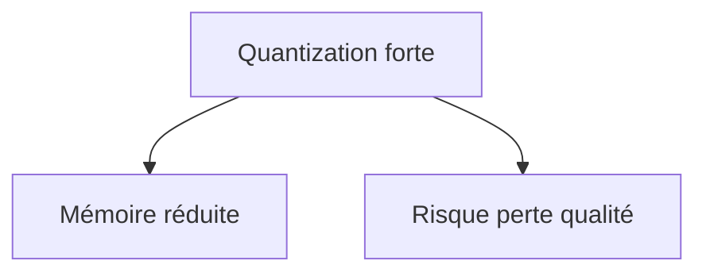

Il faut donc mesurer la qualité après quantization.

---

## 27.11 KV cache

## 27.11.1 Rappel

Dans un modèle decoder-only, la génération est autoregressive.

À chaque nouveau token, le modèle doit regarder les tokens précédents.

Le KV cache stocke les Keys et Values déjà calculées.

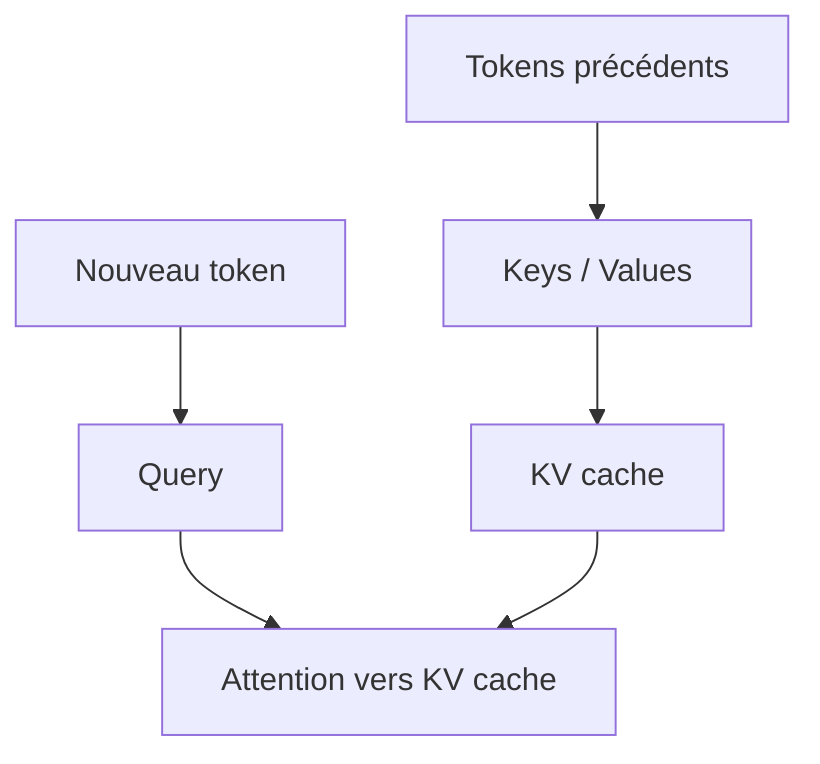

Sans KV cache, il faudrait recalculer tout le contexte à chaque token.

---

## 27.11.2 Coût mémoire du KV cache

Le KV cache augmente avec :

* nombre de couches ;
* nombre de têtes ;
* dimension des têtes ;
* longueur du contexte ;
* batch size ;
* nombre de séquences simultanées.

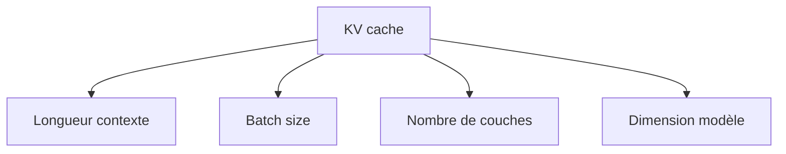

Le contexte long peut donc devenir très coûteux en mémoire.

---

## 27.11.3 KV cache et utilisateurs simultanés

Si plusieurs utilisateurs génèrent en même temps, chacun consomme du KV cache.

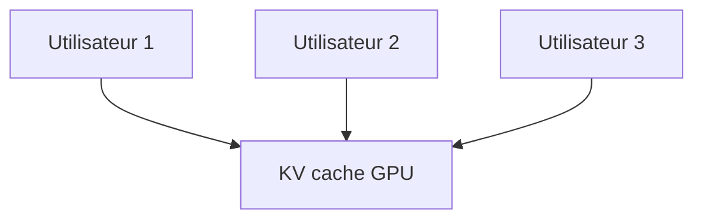

Plus il y a de conversations simultanées, plus la mémoire utilisée augmente.

C’est un point critique du serving LLM.

---

## 27.12 Batching

## 27.12.1 Pourquoi batcher ?

Le batching consiste à traiter plusieurs requêtes ensemble.

Cela améliore l’utilisation du GPU.

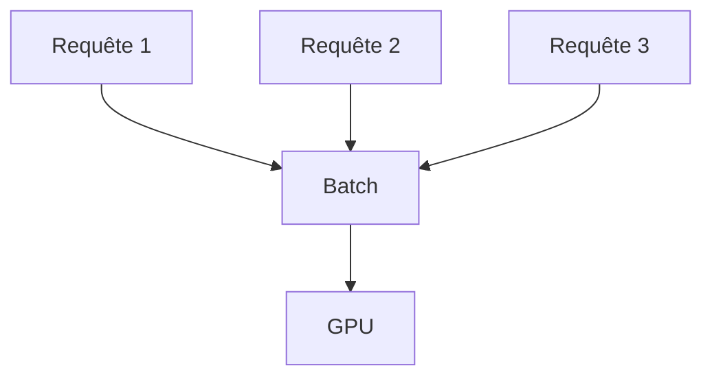

Un GPU est plus efficace lorsqu’il traite de grosses opérations parallèles.

---

## 27.12.2 Difficulté du batching en génération

Pour les LLM autoregressifs, le batching est difficile parce que :

* les prompts ont des longueurs différentes ;
* les réponses ont des longueurs différentes ;
* certaines requêtes terminent avant les autres ;
* de nouvelles requêtes arrivent continuellement.

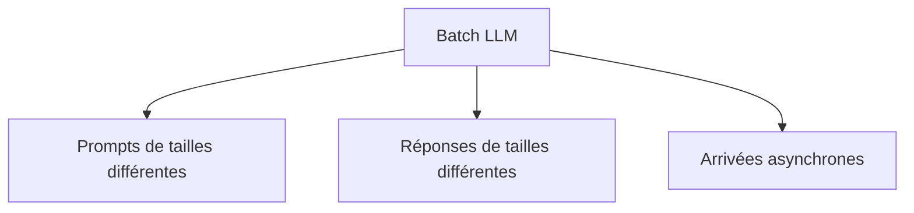

Il faut donc des techniques de batching dynamique.

---

## 27.12.3 Dynamic batching

Le dynamic batching regroupe les requêtes arrivant dans une courte fenêtre de temps.

```mermaid
flowchart TD
    A["Requêtes entrantes"] --> B["File courte"]
    B --> C["Batch dynamique"]
    C --> D["GPU"]
```

Cela améliore le throughput, mais peut ajouter un peu de latence.

Il faut donc équilibrer :

* débit ;
* latence ;
* temps d’attente.

---

## 27.12.4 Continuous batching

Le continuous batching permet d’ajouter et de retirer des séquences pendant la génération.

Quand une requête se termine, une autre peut rejoindre le batch.

```mermaid
flowchart TD
    A["Batch en cours"] --> B["Séquence terminée"]
    B --> C["Libère une place"]
    C --> D["Nouvelle requête ajoutée"]
    D --> A
```

C’est une technique importante pour servir des LLM efficacement.

---

## 27.13 Streaming

## 27.13.1 Principe

Le streaming consiste à envoyer la réponse au fur et à mesure de sa génération.

Au lieu d’attendre la réponse complète, l’utilisateur voit les tokens apparaître progressivement.

```mermaid
sequenceDiagram
    participant S as Serveur
    participant U as Utilisateur

    S->>U: token 1
    S->>U: token 2
    S->>U: token 3
    S->>U: ...
```

Cela améliore la perception de rapidité.

---

## 27.13.2 Avantages du streaming

Le streaming permet :

* meilleure expérience utilisateur ;
* feedback rapide ;
* interruption possible ;
* affichage progressif ;
* perception de latence réduite.

```mermaid
flowchart TD
    A["Streaming"] --> B["Réponse progressive"]
    A --> C["Meilleure UX"]
    A --> D["Interruption possible"]
```

Même si la réponse complète prend du temps, l’utilisateur commence à lire rapidement.

---

## 27.13.3 Limites du streaming

Le streaming peut compliquer :

* modération de sortie ;
* validation de format ;
* rollback d’une réponse ;
* correction d’erreurs en cours de génération ;
* affichage de JSON complet ;
* logs partiels.

```mermaid
flowchart TD
    A["Streaming"] --> B["UX améliorée"]
    A --> C["Validation plus difficile"]
    A --> D["Modération plus complexe"]
```

Pour des formats stricts, il peut être préférable d’attendre la sortie complète.

---

## 27.14 Files d’attente et orchestration

## 27.14.1 Pourquoi utiliser des files d’attente ?

Quand trop de requêtes arrivent, nous devons éviter de saturer le système.

Une file d’attente permet de réguler la charge.

```mermaid
flowchart TD
    A["Requêtes entrantes"] --> B["Queue"]
    B --> C["Workers inférence"]
    C --> D["Réponses"]
```

Elle permet :

* lissage de charge ;
* priorisation ;
* retry ;
* contrôle de débit ;
* backpressure.

---

## 27.14.2 Backpressure

La backpressure consiste à ralentir ou refuser des requêtes lorsque le système est saturé.

Exemples :

```txt
Trop de requêtes simultanées.
Réessayez plus tard.
```

ou :

```txt
Votre requête est placée en attente.
```

```mermaid
flowchart TD
    A["Charge élevée"] --> B["Backpressure"]
    B --> C["Limiter nouvelles requêtes"]
    B --> D["Protéger le système"]
```

Sans backpressure, le service peut s’effondrer.

---

## 27.14.3 Priorisation

Toutes les requêtes n’ont pas la même priorité.

Exemples :

* utilisateur interactif ;
* tâche batch ;
* traitement nocturne ;
* requête interne critique ;
* tâche de test.

```mermaid
flowchart TD
    A["Requêtes"] --> B["Priorité haute"]
    A --> C["Priorité moyenne"]
    A --> D["Priorité basse"]

    B --> E["Traitement prioritaire"]
    C --> E
    D --> E
```

La priorisation aide à maintenir une bonne qualité de service.

---

## 27.15 Latence et throughput

## 27.15.1 Latence

La latence est le temps entre la requête et la réponse.

On distingue souvent :

* time to first token ;
* time per output token ;
* temps total.

```mermaid
flowchart LR
    A["Requête"] --> B["Premier token"]
    B --> C["Tokens suivants"]
    C --> D["Réponse complète"]
```

Le time to first token est très important pour l’expérience utilisateur.

---

## 27.15.2 Throughput

Le throughput mesure le débit du système.

Exemples :

```txt
tokens / seconde
requêtes / minute
utilisateurs simultanés
```

```mermaid
flowchart TD
    A["Throughput"] --> B["Tokens/s"]
    A --> C["Requêtes/s"]
    A --> D["Utilisateurs simultanés"]
```

Un bon système doit équilibrer latence et throughput.

---

## 27.15.3 Latence vs throughput

Optimiser le throughput peut parfois augmenter la latence.

Par exemple, attendre pour former un batch améliore l’utilisation GPU, mais ajoute un délai.

```mermaid
flowchart TD
    A["Batch plus grand"] --> B["Meilleur throughput"]
    A --> C["Latence potentiellement plus élevée"]
```

Il faut choisir selon l’usage :

* chat interactif : faible latence ;
* traitement batch : throughput élevé ;
* génération massive : coût optimisé.

---

## 27.16 Optimisations d’inférence

## 27.16.1 FlashAttention

FlashAttention optimise le calcul de l’attention pour réduire les accès mémoire et améliorer les performances.

```mermaid
flowchart TD
    A["Attention classique"] --> B["Coût mémoire important"]
    C["FlashAttention"] --> D["Calcul plus efficace"]
    D --> E["Inférence plus rapide"]
```

L’idée importante est que l’optimisation ne change pas le modèle, mais la manière de calculer l’attention.

---

## 27.16.2 Speculative decoding

Le speculative decoding utilise souvent un petit modèle pour proposer plusieurs tokens.

Le grand modèle vérifie ensuite ces propositions.

```mermaid
flowchart TD
    A["Petit modèle"] --> B["Propose tokens"]
    B --> C["Grand modèle vérifie"]
    C --> D["Tokens acceptés"]
    C --> E["Tokens rejetés"]
```

Cela peut accélérer la génération si le petit modèle propose souvent de bons tokens.

---

## 27.16.3 Modèles spécialisés

Une autre optimisation consiste à ne pas toujours utiliser le plus gros modèle.

Exemple :

* petite question simple → petit modèle ;
* tâche complexe → grand modèle ;
* embedding → modèle embedding ;
* reranking → modèle reranker.

```mermaid
flowchart TD
    A["Requête"] --> B["Routeur"]
    B --> C["Petit modèle"]
    B --> D["Grand modèle"]
    B --> E["Embedding model"]
    B --> F["Reranker"]
```

Le routage permet d’optimiser coût et qualité.

---

## 27.16.4 Cache applicatif

Certaines requêtes reviennent souvent.

On peut mettre en cache :

* embeddings ;
* résultats de retrieval ;
* réponses fréquentes ;
* prompts systèmes ;
* résultats d’outils ;
* préfixes de contexte.

```mermaid
flowchart TD
    A["Requête"] --> B{"Cache hit ?"}
    B -->|"Oui"| C["Retour rapide"]
    B -->|"Non"| D["Calcul normal"]
    D --> E["Stockage cache"]
```

Le cache peut réduire fortement les coûts.

---

## 27.17 Architecture API

## 27.17.1 API simple

Une API simple expose un endpoint :

```txt
POST /generate
```

avec :

```json
{
  "prompt": "...",
  "max_tokens": 512
}
```

```mermaid
flowchart LR
    A["Client"] --> B["POST /generate"]
    B --> C["Serveur LLM"]
    C --> B
    B --> A
```

C’est suffisant pour un prototype.

---

## 27.17.2 API conversationnelle

Une API conversationnelle utilise des messages.

```json
{
  "messages": [
    {"role": "system", "content": "..."},
    {"role": "user", "content": "..."}
  ]
}
```

```mermaid
flowchart TD
    A["Messages"] --> B["Gestion contexte"]
    B --> C["LLM"]
    C --> D["Réponse assistant"]
```

Cette structure est plus adaptée aux assistants.

---

## 27.17.3 API avec outils

Une API plus avancée permet au modèle d’appeler des fonctions.

```mermaid
flowchart TD
    A["Client"] --> B["API orchestrateur"]
    B --> C["LLM"]
    C --> D{"Tool call ?"}
    D -->|"Oui"| E["Outil"]
    E --> B
    D -->|"Non"| F["Réponse finale"]
    F --> A
```

L’orchestrateur gère :

* appels outils ;
* validation ;
* permissions ;
* erreurs ;
* traces.

---

## 27.18 Orchestrateur LLM

## 27.18.1 Rôle de l’orchestrateur

L’orchestrateur est le composant qui coordonne :

* le modèle ;
* le RAG ;
* les outils ;
* les permissions ;
* les prompts ;
* les logs ;
* les validations ;
* les retries.

```mermaid
flowchart TD
    A["Utilisateur"] --> B["Orchestrateur"]
    B --> C["RAG"]
    B --> D["LLM"]
    B --> E["Outils"]
    B --> F["Validation"]
    B --> G["Logs"]
```

C’est souvent l’élément central d’une application LLM professionnelle.

---

## 27.18.2 Pourquoi ne pas tout mettre dans le prompt ?

Le prompt ne doit pas remplacer l’architecture logicielle.

Certaines règles doivent être codées :

* permissions ;
* limites de coût ;
* validation JSON ;
* accès aux outils ;
* filtrage de documents ;
* logs ;
* sécurité.

```mermaid
flowchart TD
    A["Prompt"] --> B["Guide le modèle"]
    C["Code applicatif"] --> D["Garantit règles critiques"]
```

Un prompt peut être ignoré ou contourné.

Le code système doit appliquer les contraintes fortes.

---

## 27.19 Monitoring

## 27.19.1 Pourquoi monitorer ?

Un service LLM peut échouer de nombreuses manières :

* latence trop élevée ;
* coût qui explose ;
* erreurs serveur ;
* réponses invalides ;
* hallucinations ;
* mauvais retrieval ;
* saturation GPU ;
* timeouts ;
* outils indisponibles.

```mermaid
flowchart TD
    A["Service LLM"] --> B["Latence"]
    A --> C["Coût"]
    A --> D["Erreurs"]
    A --> E["Qualité"]
    A --> F["Sécurité"]
```

Le monitoring permet de détecter les problèmes.

---

## 27.19.2 Métriques techniques

Nous devons suivre :

* requêtes par seconde ;
* latence moyenne ;
* latence p95/p99 ;
* time to first token ;
* tokens par seconde ;
* erreurs ;
* timeouts ;
* utilisation GPU ;
* mémoire VRAM ;
* saturation queue.

```mermaid
flowchart TD
    A["Métriques techniques"] --> B["Latence"]
    A --> C["Throughput"]
    A --> D["GPU"]
    A --> E["VRAM"]
    A --> F["Erreurs"]
```

---

## 27.19.3 Métriques produit

Nous pouvons aussi suivre :

* taux de satisfaction ;
* taux de correction humaine ;
* taux de refus ;
* taux de réponses régénérées ;
* durée des conversations ;
* tâches réussies ;
* feedback utilisateur.

```mermaid
flowchart TD
    A["Métriques produit"] --> B["Satisfaction"]
    A --> C["Taux réussite"]
    A --> D["Feedback"]
    A --> E["Régénérations"]
```

Ces métriques indiquent si le système est réellement utile.

---

## 27.19.4 Métriques RAG

Pour un système RAG, nous suivons aussi :

* documents récupérés ;
* scores de retrieval ;
* sources citées ;
* taux de réponse sans source ;
* taux de contexte vide ;
* taux de contradictions ;
* qualité du reranking.

```mermaid
flowchart TD
    A["Monitoring RAG"] --> B["Chunks récupérés"]
    A --> C["Scores"]
    A --> D["Citations"]
    A --> E["Contexte vide"]
```

---

## 27.20 Logs et traces

## 27.20.1 Pourquoi journaliser ?

Les logs permettent de comprendre :

* ce qui a été demandé ;
* quels documents ont été récupérés ;
* quels outils ont été appelés ;
* quelle réponse a été produite ;
* combien cela a coûté ;
* quelles erreurs sont apparues.

```mermaid
flowchart TD
    A["Requête"] --> B["Logs"]
    B --> C["Debug"]
    B --> D["Audit"]
    B --> E["Évaluation"]
```

Sans logs, il est très difficile d’améliorer un système LLM.

---

## 27.20.2 Attention aux données sensibles

Les logs peuvent contenir :

* données personnelles ;
* secrets ;
* documents internes ;
* prompts utilisateurs ;
* réponses du modèle ;
* résultats d’outils.

```mermaid
flowchart TD
    A["Logs"] --> B["Données sensibles possibles"]
    B --> C["Protection nécessaire"]
```

Il faut donc appliquer :

* anonymisation ;
* chiffrement ;
* contrôle d’accès ;
* rétention limitée ;
* masquage des secrets.

---

## 27.20.3 Traces d’agents

Pour les agents, il faut tracer :

* plan ;
* actions ;
* arguments ;
* observations ;
* erreurs ;
* décisions ;
* confirmations humaines.

```mermaid
flowchart TD
    A["Agent"] --> B["Trace"]
    B --> C["Plan"]
    B --> D["Actions"]
    B --> E["Observations"]
    B --> F["Résultat"]
```

Ces traces sont indispensables pour auditer les actions.

---

## 27.21 Gestion des erreurs

## 27.21.1 Types d’erreurs

Un système LLM peut rencontrer :

* erreur modèle ;
* timeout ;
* outil indisponible ;
* réponse invalide ;
* JSON invalide ;
* retrieval vide ;
* GPU saturé ;
* permission refusée ;
* entrée trop longue.

```mermaid
flowchart TD
    A["Erreurs"] --> B["Timeout"]
    A --> C["JSON invalide"]
    A --> D["Outil indisponible"]
    A --> E["Contexte trop long"]
    A --> F["Permission refusée"]
```

Chaque type d’erreur doit avoir une stratégie.

---

## 27.21.2 Retry

Un retry consiste à relancer une opération.

Cela peut être utile pour :

* erreur réseau ;
* timeout temporaire ;
* outil indisponible ;
* réponse mal formatée.

```mermaid
flowchart TD
    A["Erreur"] --> B{"Retry possible ?"}
    B -->|"Oui"| C["Nouvelle tentative"]
    B -->|"Non"| D["Échec propre"]
```

Mais les retries doivent être limités pour éviter les boucles et les coûts excessifs.

---

## 27.21.3 Fallback

Un fallback est une solution de secours.

Exemples :

* utiliser un autre modèle ;
* réduire le contexte ;
* répondre plus brièvement ;
* désactiver un outil ;
* passer en mode dégradé ;
* demander à l’utilisateur de reformuler.

```mermaid
flowchart TD
    A["Échec modèle principal"] --> B["Fallback"]
    B --> C["Modèle secondaire"]
    B --> D["Mode dégradé"]
    B --> E["Message d'erreur clair"]
```

Un bon système échoue proprement.

---

## 27.22 Sécurité

## 27.22.1 Contrôle d’accès

Un service LLM doit vérifier :

* identité utilisateur ;
* droits ;
* quotas ;
* documents accessibles ;
* outils autorisés ;
* actions sensibles.

```mermaid
flowchart TD
    A["Utilisateur"] --> B["Authentification"]
    B --> C["Autorisation"]
    C --> D["Accès documents/outils"]
```

Les droits doivent être appliqués avant retrieval et avant outil.

---

## 27.22.2 Protection contre prompt injection

Dans une application RAG ou agentique, des contenus externes peuvent contenir des instructions malveillantes.

Le système doit :

* traiter les documents comme données ;
* isoler les instructions système ;
* valider les tool calls ;
* limiter les permissions ;
* détecter les comportements suspects.

```mermaid
flowchart TD
    A["Document externe"] --> B["Contenu non fiable"]
    B --> C["LLM"]
    C --> D["Validation actions"]
```

Le modèle ne doit pas obéir à une instruction trouvée dans un document externe.

---

## 27.22.3 Validation des outils

Avant d’exécuter un outil, nous devons vérifier :

* nom de l’outil ;
* arguments ;
* types ;
* permissions ;
* limites ;
* risque de l’action.

```mermaid
flowchart TD
    A["Tool call proposé"] --> B["Validation"]
    B --> C{"Autorisé ?"}
    C -->|"Oui"| D["Exécution"]
    C -->|"Non"| E["Refus"]
```

Le modèle propose.

Le système dispose.

---

## 27.23 Confidentialité

## 27.23.1 Données envoyées au modèle

Avant d’envoyer une requête à un modèle, nous devons savoir :

* quelles données sont incluses ;
* où elles sont envoyées ;
* qui peut les voir ;
* combien de temps elles sont conservées ;
* si elles sont utilisées pour entraînement ;
* si elles contiennent des informations sensibles.

```mermaid
flowchart TD
    A["Prompt"] --> B["Données incluses"]
    B --> C["Analyse confidentialité"]
    C --> D["Envoi autorisé ?"]
```

Cela influence le choix entre API externe, cloud privé et local.

---

## 27.23.2 Minimisation des données

Principe :

> Envoyer seulement ce qui est nécessaire.

Exemples :

* ne pas envoyer tout un dossier si un extrait suffit ;
* masquer les identifiants ;
* anonymiser les noms ;
* retirer les secrets ;
* filtrer les métadonnées sensibles.

```mermaid
flowchart TD
    A["Données brutes"] --> B["Filtrage"]
    B --> C["Données minimales nécessaires"]
    C --> D["Modèle"]
```

La minimisation réduit les risques.

---

## 27.23.3 Chiffrement et stockage

Il faut protéger :

* prompts ;
* réponses ;
* logs ;
* embeddings ;
* documents ;
* fichiers temporaires ;
* traces d’outils.

```mermaid
flowchart TD
    A["Données LLM"] --> B["Chiffrement"]
    A --> C["Contrôle accès"]
    A --> D["Rétention limitée"]
```

Les embeddings eux-mêmes peuvent parfois révéler des informations sensibles.

Ils doivent être protégés comme des données dérivées.

---

## 27.24 Coûts

## 27.24.1 Coût total

Le coût d’un système LLM inclut :

* modèle ;
* GPU ;
* API ;
* stockage ;
* embeddings ;
* reranking ;
* outils ;
* monitoring ;
* logs ;
* maintenance ;
* réseau ;
* énergie.

```mermaid
flowchart TD
    A["Coût total"] --> B["Inférence"]
    A --> C["Stockage"]
    A --> D["RAG"]
    A --> E["Monitoring"]
    A --> F["Maintenance"]
```

Il ne faut pas compter uniquement le coût par token.

---

## 27.24.2 Coût par requête

Le coût par requête dépend de :

* longueur du prompt ;
* longueur de sortie ;
* modèle choisi ;
* nombre d’appels RAG ;
* reranking ;
* appels outils ;
* retries ;
* streaming ;
* cache.

```mermaid
flowchart TD
    A["Coût requête"] --> B["Tokens input"]
    A --> C["Tokens output"]
    A --> D["RAG"]
    A --> E["Outils"]
    A --> F["Retries"]
```

Une requête agentique peut coûter beaucoup plus qu’une simple génération.

---

## 27.24.3 Optimiser le coût

Pour optimiser le coût, nous pouvons :

* réduire le contexte ;
* utiliser RAG plus précis ;
* choisir un modèle plus petit ;
* router selon complexité ;
* mettre en cache ;
* quantifier ;
* limiter la longueur de sortie ;
* éviter les retries inutiles ;
* batcher.

```mermaid
flowchart TD
    A["Optimisation coût"] --> B["Modèle adapté"]
    A --> C["Contexte réduit"]
    A --> D["Cache"]
    A --> E["Batching"]
    A --> F["Quantization"]
```

L’optimisation doit préserver la qualité.

---

## 27.25 Scalabilité

## 27.25.1 Monter en charge

Un service LLM doit gérer :

* plus d’utilisateurs ;
* plus de requêtes ;
* plus de documents ;
* plus d’outils ;
* plus de modèles.

```mermaid
flowchart TD
    A["Charge augmente"] --> B["Plus de workers"]
    A --> C["Plus de GPU"]
    A --> D["Queues"]
    A --> E["Autoscaling"]
```

La scalabilité doit être pensée dès la conception.

---

## 27.25.2 Autoscaling

L’autoscaling ajuste le nombre de ressources selon la charge.

```mermaid
flowchart TD
    A["Monitoring charge"] --> B{"Charge élevée ?"}
    B -->|"Oui"| C["Ajouter ressources"]
    B -->|"Non"| D["Réduire ressources"]
```

Avec les GPU, l’autoscaling est plus complexe qu’avec des services web classiques, car les modèles sont lourds à charger.

---

## 27.25.3 Temps de chargement du modèle

Un grand modèle peut prendre du temps à charger.

Cela complique :

* autoscaling rapide ;
* redémarrage ;
* rollback ;
* déploiement bleu/vert ;
* reprise après incident.

```mermaid
flowchart TD
    A["Démarrer worker"] --> B["Charger modèle"]
    B --> C["Initialiser GPU"]
    C --> D["Prêt à servir"]
```

Il faut anticiper ce délai.

---

## 27.26 Déploiement progressif

## 27.26.1 Canary release

Une canary release consiste à envoyer une petite partie du trafic vers une nouvelle version.

```mermaid
flowchart TD
    A["Trafic utilisateur"] --> B["Ancienne version 95%"]
    A --> C["Nouvelle version 5%"]
    C --> D["Monitoring"]
    D --> E{"OK ?"}
    E -->|"Oui"| F["Augmenter trafic"]
    E -->|"Non"| G["Rollback"]
```

Cela limite les risques.

---

## 27.26.2 A/B testing

On compare deux versions :

* modèle A ;
* modèle B ;
* prompt A ;
* prompt B ;
* retriever A ;
* retriever B.

```mermaid
flowchart TD
    A["Utilisateurs"] --> B["Version A"]
    A --> C["Version B"]
    B --> D["Métriques"]
    C --> D
    D --> E["Comparaison"]
```

L’A/B testing permet de mesurer l’impact réel.

---

## 27.26.3 Rollback

Si une nouvelle version pose problème, il faut revenir en arrière.

```mermaid
flowchart TD
    A["Nouvelle version"] --> B["Incident"]
    B --> C["Rollback"]
    C --> D["Version stable précédente"]
```

Le rollback doit être prévu avant le déploiement.

---

## 27.27 Versioning

## 27.27.1 Versionner quoi ?

Il faut versionner :

* modèle ;
* prompt système ;
* outil ;
* schéma de function calling ;
* index RAG ;
* embeddings ;
* données ;
* hyperparamètres ;
* code d’orchestration ;
* règles de sécurité.

```mermaid
flowchart TD
    A["Versioning LLM"] --> B["Modèle"]
    A --> C["Prompt"]
    A --> D["RAG index"]
    A --> E["Outils"]
    A --> F["Code"]
```

Un changement de prompt peut changer fortement le comportement.

Il doit donc être versionné.

---

## 27.27.2 Reproductibilité

Pour reproduire une réponse, nous devons savoir :

* quel modèle ;
* quelle version ;
* quel prompt ;
* quels documents récupérés ;
* quels paramètres de génération ;
* quels outils ;
* quels résultats d’outils.

```mermaid
flowchart TD
    A["Réponse"] --> B["Modèle"]
    A --> C["Prompt"]
    A --> D["Documents"]
    A --> E["Paramètres"]
    A --> F["Outils"]
```

Sans ces informations, l’audit est difficile.

---

## 27.28 Paramètres de génération

## 27.28.1 Paramètres courants

Les paramètres de génération incluent :

* temperature ;
* top-p ;
* top-k ;
* max tokens ;
* stop sequences ;
* penalties ;
* seed éventuelle.

```mermaid
flowchart TD
    A["Génération"] --> B["Temperature"]
    A --> C["Top-p"]
    A --> D["Max tokens"]
    A --> E["Stop sequences"]
```

Ces paramètres influencent la sortie.

---

## 27.28.2 Production et déterminisme

En production, on veut souvent des réponses stables.

Pour des tâches factuelles ou structurées, on utilise généralement :

* température basse ;
* contraintes de format ;
* validation ;
* prompts stricts.

```mermaid
flowchart TD
    A["Tâche production"] --> B["Stabilité"]
    B --> C["Température basse"]
    B --> D["Validation format"]
```

Pour des tâches créatives, on peut accepter plus de variabilité.

---

## 27.29 RAG en production

## 27.29.1 Indexation continue

Les documents changent.

Il faut gérer :

* ajout ;
* modification ;
* suppression ;
* version ;
* droits ;
* réindexation ;
* invalidation cache.

```mermaid
flowchart TD
    A["Documents"] --> B["Changements"]
    B --> C["Pipeline ingestion"]
    C --> D["Index RAG mis à jour"]
```

Un RAG en production n’est pas un index figé.

---

## 27.29.2 Cohérence entre documents et index

Si un document est supprimé, ses chunks et embeddings doivent être supprimés aussi.

Sinon, le système peut citer un document obsolète ou interdit.

```mermaid
flowchart TD
    A["Document supprimé"] --> B["Supprimer chunks"]
    B --> C["Supprimer embeddings"]
    C --> D["Mettre à jour index"]
```

La cohérence documentaire est essentielle.

---

## 27.29.3 RAG et permissions

Le filtrage des droits doit être appliqué avant la réponse.

```mermaid
flowchart TD
    A["Utilisateur"] --> B["Droits"]
    B --> C["Filtrage retrieval"]
    C --> D["Documents autorisés"]
    D --> E["Réponse"]
```

Un utilisateur ne doit jamais recevoir une information provenant d’un document non autorisé.

---

## 27.30 Multi-modèle et routage

## 27.30.1 Pourquoi plusieurs modèles ?

Un système peut utiliser plusieurs modèles :

* petit modèle rapide ;
* grand modèle complexe ;
* modèle embedding ;
* modèle reranker ;
* modèle de modération ;
* modèle de classification ;
* modèle de code.

```mermaid
flowchart TD
    A["Système LLM"] --> B["Petit modèle"]
    A --> C["Grand modèle"]
    A --> D["Embedding"]
    A --> E["Reranker"]
    A --> F["Modération"]
```

Chaque modèle a un rôle.

---

## 27.30.2 Routage intelligent

Un routeur choisit le bon modèle selon :

* complexité ;
* coût ;
* langue ;
* domaine ;
* besoin de raisonnement ;
* confidentialité ;
* latence.

```mermaid
flowchart TD
    A["Requête"] --> B["Routeur"]
    B --> C{"Complexité ?"}
    C -->|"Simple"| D["Petit modèle"]
    C -->|"Complexe"| E["Grand modèle"]
    C -->|"Recherche"| F["RAG"]
```

Le routage optimise l’équilibre qualité/coût.

---

## 27.31 Déploiement de modèles spécialisés

Un modèle spécialisé peut être utilisé pour :

* classification ;
* extraction ;
* reformulation ;
* génération structurée ;
* embeddings ;
* reranking.

```mermaid
flowchart TD
    A["Pipeline"] --> B["Classifier"]
    A --> C["Embedding model"]
    A --> D["Reranker"]
    A --> E["LLM génératif"]
```

Tous les composants ne doivent pas être des grands LLM.

Des petits modèles spécialisés sont souvent plus efficaces.

---

## 27.32 Edge et déploiement embarqué

## 27.32.1 Pourquoi déployer en edge ?

Le déploiement edge signifie exécuter le modèle près de l’utilisateur ou sur l’appareil.

Avantages :

* faible latence ;
* confidentialité ;
* fonctionnement hors ligne ;
* moins de dépendance réseau.

Limites :

* ressources limitées ;
* modèle plus petit ;
* quantization nécessaire ;
* consommation batterie.

```mermaid
flowchart TD
    A["Appareil local"] --> B["Petit modèle"]
    B --> C["Réponse locale"]
```

---

## 27.32.2 Cas d’usage

Exemples :

* assistant embarqué ;
* clavier intelligent ;
* analyse locale de documents ;
* robotique ;
* application mobile ;
* industrie ;
* environnement sans réseau.

```mermaid
flowchart TD
    A["Edge AI"] --> B["Mobile"]
    A --> C["Robotique"]
    A --> D["Industrie"]
    A --> E["Confidentialité"]
```

Le edge impose une forte optimisation.

---

## 27.33 Déploiement et énergie

## 27.33.1 Consommation énergétique

La consommation dépend de :

* taille du modèle ;
* nombre de requêtes ;
* matériel ;
* refroidissement ;
* taux d’utilisation GPU ;
* longueur des générations.

```mermaid
flowchart TD
    A["Énergie"] --> B["Modèle"]
    A --> C["Inférence"]
    A --> D["Refroidissement"]
    A --> E["Utilisation GPU"]
```

L’inférence à grande échelle peut consommer beaucoup d’énergie.

---

## 27.33.2 Optimisation énergétique

Pour réduire l’énergie :

* utiliser des modèles plus petits ;
* quantifier ;
* batcher ;
* router ;
* mettre en cache ;
* limiter les tokens ;
* optimiser l’infrastructure ;
* utiliser du matériel adapté.

```mermaid
flowchart TD
    A["Réduction énergie"] --> B["Modèles plus petits"]
    A --> C["Quantization"]
    A --> D["Batching"]
    A --> E["Cache"]
    A --> F["Routage"]
```

L’efficacité énergétique devient une contrainte d’industrialisation.

---

## 27.34 Gouvernance

## 27.34.1 Pourquoi une gouvernance ?

Un système LLM peut influencer :

* décisions ;
* documents ;
* utilisateurs ;
* données sensibles ;
* processus métier.

Il faut donc définir :

* responsabilités ;
* règles d’usage ;
* validation ;
* supervision ;
* gestion des incidents ;
* audit.

```mermaid
flowchart TD
    A["Système LLM"] --> B["Gouvernance"]
    B --> C["Responsabilités"]
    B --> D["Audit"]
    B --> E["Règles"]
    B --> F["Gestion incidents"]
```

---

## 27.34.2 Documentation du système

Il faut documenter :

* modèles utilisés ;
* données utilisées ;
* limites connues ;
* cas d’usage autorisés ;
* risques ;
* métriques ;
* procédures de rollback ;
* contacts responsables.

```mermaid
flowchart TD
    A["Documentation"] --> B["Modèle"]
    A --> C["Données"]
    A --> D["Limites"]
    A --> E["Procédures"]
```

La documentation est une partie de l’industrialisation.

---

## 27.35 Erreurs fréquentes

## 27.35.1 Croire qu’un notebook suffit pour la production

Un notebook permet de tester.

Mais la production exige :

* API robuste ;
* sécurité ;
* logs ;
* monitoring ;
* gestion des erreurs ;
* scalabilité ;
* versioning.

```mermaid
flowchart TD
    A["Notebook"] --> B["Prototype"]
    C["Production"] --> D["Système robuste"]
```

Un prototype n’est pas un produit.

---

## 27.35.2 Sous-estimer la VRAM

Un modèle qui tient juste en mémoire sans charge réelle peut échouer en production.

Pourquoi ?

* KV cache ;
* batchs ;
* requêtes simultanées ;
* contexte long ;
* buffers.

```mermaid
flowchart TD
    A["VRAM suffisante pour charger"] --> B["Pas forcément suffisante pour servir"]
    B --> C["KV cache + batch + contexte"]
```

Il faut tester en charge réelle.

---

## 27.35.3 Oublier le coût du contexte

Un prompt très long coûte cher.

Il augmente :

* latence ;
* mémoire ;
* coût par requête ;
* bruit documentaire.

```mermaid
flowchart TD
    A["Contexte long"] --> B["Coût"]
    A --> C["Latence"]
    A --> D["Bruit"]
```

Il faut optimiser le contexte, surtout en RAG.

---

## 27.35.4 Ne pas versionner les prompts

Changer un prompt peut changer tout le comportement.

```mermaid
flowchart TD
    A["Prompt v1"] --> B["Comportement A"]
    C["Prompt v2"] --> D["Comportement B"]
```

Les prompts doivent être traités comme du code.

---

## 27.35.5 Ne pas protéger les logs

Les logs peuvent contenir les données les plus sensibles du système.

```mermaid
flowchart TD
    A["Logs"] --> B["Prompts"]
    A --> C["Documents"]
    A --> D["Réponses"]
    A --> E["Secrets possibles"]
```

Il faut les sécuriser sérieusement.

---

## 27.35.6 Déployer sans rollback

Une nouvelle version peut échouer.

Sans rollback, l’incident dure plus longtemps.

```mermaid
flowchart TD
    A["Déploiement"] --> B["Incident"]
    B --> C["Rollback nécessaire"]
```

Un plan de retour arrière est indispensable.

---

## 27.36 Synthèse mathématique

Le coût mémoire minimal des poids d’un modèle est approximativement :

$$
Memory_{weights} = N_{params} \times bytes_{per_param}
$$

Le coût total en production ajoute notamment :

$$
Memory_{total}
==============

Memory_{weights}
+
Memory_{KV}
+
Memory_{activations}
+
Memory_{buffers}
$$

Le coût d’une requête dépend grossièrement de :

$$
Cost
====

f(tokens_{input}, tokens_{output}, modèle, outils, retrieval, retries)
$$

La latence peut être vue comme :

$$
Latency
=======

T_{queue}
+
T_{prefill}
+
T_{decode}
+
T_{tools}
+
T_{network}
$$

où :

* $T_{queue}$ est le temps d’attente ;
* $T_{prefill}$ est le traitement du prompt ;
* $T_{decode}$ est la génération token par token ;
* $T_{tools}$ est le temps des outils ;
* $T_{network}$ est le temps réseau.

L’industrialisation consiste à optimiser ces termes sans dégrader la qualité.

---

## 27.37 Schéma global de synthèse

```mermaid
flowchart TD
    A["Utilisateur"] --> B["Application"]
    B --> C["API / Orchestrateur"]

    C --> D["Authentification"]
    C --> E["Prompt building"]
    C --> F["RAG"]
    C --> G["Outils"]
    C --> H["Routeur modèle"]

    H --> I["Petit modèle"]
    H --> J["Grand modèle"]
    H --> K["Embedding model"]
    H --> L["Reranker"]

    I --> M["Réponse"]
    J --> M
    K --> F
    L --> F

    M --> N["Validation"]
    N --> O["Streaming / réponse finale"]

    C --> P["Logs"]
    C --> Q["Monitoring"]
    C --> R["Sécurité"]
    C --> S["Gestion coûts"]
```

---

## 27.38 Résumé du chapitre

Nous avons étudié le déploiement et l’industrialisation des Transformers et des LLM.

Nous avons vu qu’un modèle évalué doit encore être intégré dans une architecture robuste pour devenir un service utilisable.

Nous avons étudié :

* API externe ;
* cloud privé ;
* déploiement local ;
* serveur d’inférence ;
* GPU et VRAM ;
* quantization ;
* KV cache ;
* batching ;
* continuous batching ;
* streaming ;
* files d’attente ;
* backpressure ;
* monitoring ;
* logs ;
* sécurité ;
* confidentialité ;
* coût ;
* scalabilité ;
* versioning ;
* rollback ;
* RAG en production ;
* routage multi-modèle ;
* edge deployment ;
* gouvernance.

Le point central est :

> La production LLM est une discipline système : elle combine machine learning, infrastructure, sécurité, produit, coût, observabilité et gouvernance.

Un LLM performant mais mal déployé peut être trop lent, trop cher, instable, dangereux ou inutilisable.

---

## 27.39 Questions de compréhension

### 27.39.1 Question 1

Pourquoi un modèle évalué n’est-il pas encore un modèle industrialisé ?

Réponse attendue : parce qu’il faut encore le servir via une API, gérer la latence, les coûts, la sécurité, les logs, le monitoring, les erreurs et la scalabilité.

### 27.39.2 Question 2

Quelle est la différence entre API externe, cloud privé et déploiement local ?

Réponse attendue : l’API externe délègue l’hébergement ; le cloud privé donne plus de contrôle ; le local maximise le contrôle et la confidentialité mais demande plus de maintenance.

### 27.39.3 Question 3

Pourquoi la VRAM est-elle critique ?

Réponse attendue : parce qu’elle doit contenir les poids du modèle, le KV cache, les activations, les buffers et les requêtes simultanées.

### 27.39.4 Question 4

À quoi sert la quantization ?

Réponse attendue : à réduire la mémoire et parfois le coût d’inférence en stockant les poids avec une précision plus faible.

### 27.39.5 Question 5

Qu’est-ce que le KV cache ?

Réponse attendue : une mémoire qui stocke les Keys et Values des tokens précédents pour accélérer la génération autoregressive.

### 27.39.6 Question 6

Pourquoi le batching est-il utile ?

Réponse attendue : parce qu’il améliore l’utilisation du GPU en traitant plusieurs requêtes ensemble.

### 27.39.7 Question 7

Quel est l’intérêt du streaming ?

Réponse attendue : il améliore l’expérience utilisateur en envoyant les tokens au fur et à mesure de leur génération.

### 27.39.8 Question 8

Pourquoi faut-il monitorer un service LLM ?

Réponse attendue : pour surveiller latence, coût, erreurs, saturation GPU, qualité, sécurité et incidents.

### 27.39.9 Question 9

Pourquoi les logs LLM sont-ils sensibles ?

Réponse attendue : parce qu’ils peuvent contenir prompts, documents, réponses, données personnelles, secrets et résultats d’outils.

### 27.39.10 Question 10

Pourquoi faut-il versionner les prompts ?

Réponse attendue : parce qu’un changement de prompt peut modifier fortement le comportement du système, comme un changement de code.

---

## 27.40 Transition vers le chapitre 28

Nous avons étudié comment déployer et industrialiser les Transformers et les LLM.

Dans le chapitre suivant, nous allons prendre du recul sur les **limites, risques et enjeux éthiques**.

Nous verrons :

* hallucinations ;
* biais ;
* confidentialité ;
* droits d’auteur ;
* consommation énergétique ;
* dépendance aux fournisseurs ;
* risques sociaux ;
* désinformation ;
* automatisation ;
* responsabilité ;
* gouvernance ;
* usages raisonnables et usages dangereux.

Nous passerons donc de la production technique à la responsabilité sociale, juridique et éthique des systèmes fondés sur les Transformers.

---
> [!info] Livre « Les transformers » — chapitre 27/30
> [[Les transformers — Sommaire|Sommaire]] · [[Les transformers — 26 — Évaluation des Transformers et des LLM|← 26 — Évaluation des Transformers et des LLM]] · [[Les transformers — 28 — Limites, risques et enjeux éthiques des Transformers et des LLM|28 — Limites, risques et enjeux éthiques des Transformers et des LLM →]]
