> [!info] Livre « Les transformers » — chapitre 29/30
> [[Les transformers — Sommaire|Sommaire]] · [[Les transformers — 28 — Limites, risques et enjeux éthiques des Transformers et des LLM|← 28 — Limites, risques et enjeux éthiques des Transformers et des LLM]] · [[Les transformers — 30 — Synthèse générale du cours des mécanismes d’attention aux systèmes fondés sur les Transformers|30 — Synthèse générale du cours des mécanismes d’attention aux systèmes fondés sur les Transformers →]]

# Chapitre 29 — Perspectives futures des Transformers
## 29.1 Objectif du chapitre

Dans le chapitre précédent, nous avons étudié les limites, les risques et les enjeux éthiques des Transformers et des LLM.

Nous avons vu que les Transformers sont devenus une architecture centrale de l’intelligence artificielle moderne, mais qu’ils ne sont pas une solution magique.

Dans ce chapitre, nous allons prendre une perspective d’avenir.

Nous allons étudier les pistes d’évolution possibles des Transformers :

* modèles plus longs ;
* modèles plus efficaces ;
* architectures hybrides ;
* mémoire externe ;
* RAG avancé ;
* agents mieux contrôlés ;
* multimodalité avancée ;
* modèles spécialisés ;
* IA embarquée ;
* neuro-symbolique ;
* open-source ;
* limites possibles du paradigme Transformer.

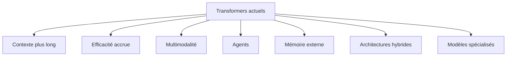

Le point central est :

> L’avenir des Transformers ne consiste pas seulement à faire des modèles plus grands, mais à construire des systèmes plus efficaces, plus fiables, plus contrôlables et mieux intégrés à leur environnement.

---

## 29.2 Le Transformer comme architecture dominante

Depuis 2017, les Transformers sont devenus dominants dans de nombreux domaines :

* traitement du langage ;
* vision ;
* audio ;
* vidéo ;
* génération de code ;
* modèles multimodaux ;
* recherche documentaire ;
* agents ;
* systèmes conversationnels.

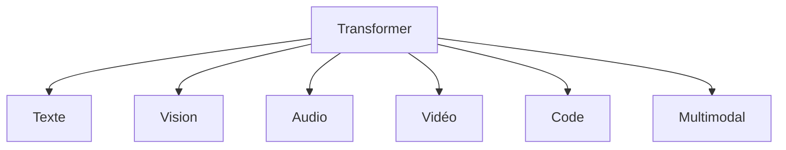

Cette domination vient de plusieurs qualités :

* parallélisation ;
* scalabilité ;
* flexibilité ;
* compatibilité avec le préentraînement massif ;
* capacité à traiter des séquences ;
* adaptation à plusieurs modalités.

Mais une architecture dominante n’est pas forcément une architecture finale.

---

## 29.3 Limites qui motivent les évolutions

Les Transformers actuels ont plusieurs limites importantes.

Nous pouvons citer :

* coût quadratique de l’attention ;
* mémoire importante ;
* contexte limité ;
* coût énergétique ;
* hallucinations ;
* raisonnement fragile ;
* besoin massif de données ;
* difficulté d’interprétabilité ;
* faiblesse sur certaines tâches symboliques ;
* dépendance aux infrastructures matérielles.

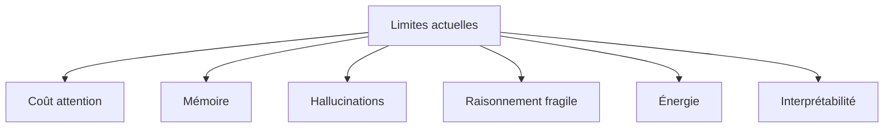

Ces limites ne signifient pas que les Transformers vont disparaître.

Elles indiquent les directions de recherche et d’ingénierie.

---

## 29.4 Vers des contextes plus longs

## 29.4.1 Pourquoi augmenter le contexte ?

Un contexte plus long permet au modèle de traiter :

* livres complets ;
* bases de code ;
* longs historiques de conversation ;
* dossiers administratifs ;
* documents juridiques ;
* transcriptions longues ;
* ensembles de sources ;
* traces d’outils.

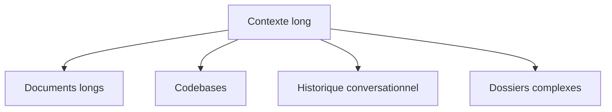

Cela rend le modèle plus utile dans des situations réelles.

---

## 29.4.2 Limites du contexte long

Mais augmenter la fenêtre de contexte ne règle pas tout.

Un modèle peut avoir une fenêtre très longue, mais :

* ne pas utiliser toute l’information ;
* se perdre dans le milieu du contexte ;
* être ralenti ;
* consommer beaucoup de mémoire ;
* intégrer trop de bruit ;
* confondre des documents.

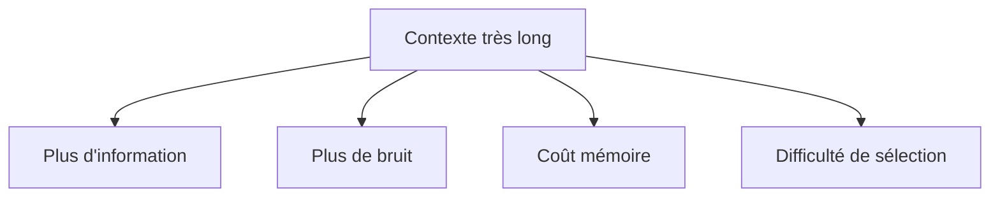

Le défi n’est pas seulement de faire entrer plus de tokens.

Le défi est de sélectionner, organiser et utiliser correctement l’information.

---

## 29.4.3 Contexte long et hiérarchisation

Une piste consiste à hiérarchiser le contexte.

Au lieu de donner tous les tokens au même niveau, on peut organiser :

* résumé global ;
* sections ;
* passages ;
* citations ;
* métadonnées ;
* graphe de relations.

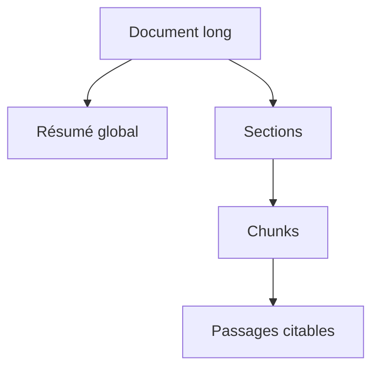

Le modèle peut alors raisonner sur plusieurs niveaux d’abstraction.

---

## 29.4.4 Contexte long vs RAG

Le contexte long et le RAG ne sont pas opposés.

Le contexte long permet de fournir plus de matière.

Le RAG permet de sélectionner la matière pertinente.

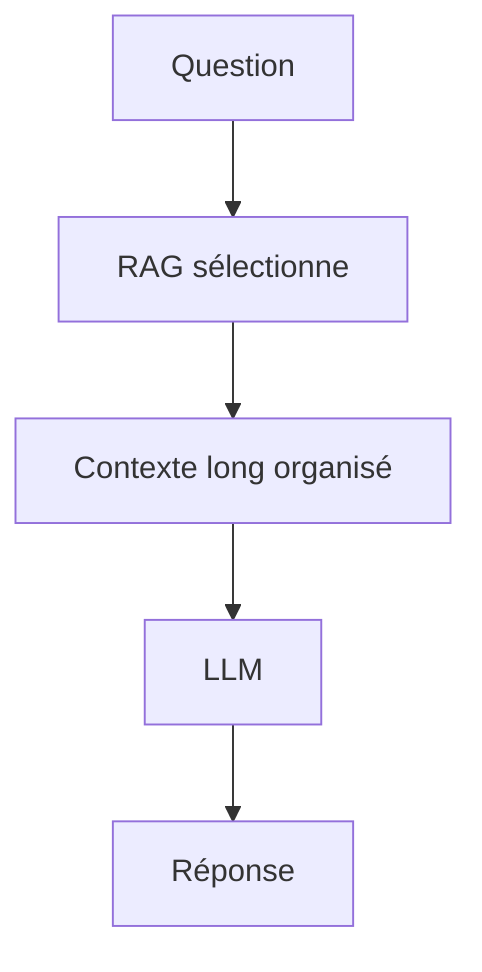

Même avec une grande fenêtre, il reste utile de récupérer les bons passages.

Un contexte long mal sélectionné peut être moins bon qu’un contexte court très pertinent.

---

## 29.5 Vers des Transformers plus efficaces

## 29.5.1 Le coût de l’attention

L’attention classique a un coût quadratique en longueur de séquence :

[
O(n^2)
]

Si la séquence double, la matrice d’attention devient quatre fois plus grande.

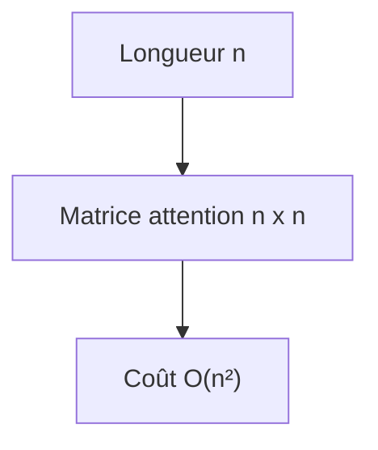

C’est une limite majeure pour les longs contextes, la vidéo et les documents massifs.

---

## 29.5.2 Attention sparse

Une piste est l’attention sparse.

Au lieu que chaque token regarde tous les autres, il regarde seulement certains tokens.

Exemples :

* voisins locaux ;
* tokens globaux ;
* blocs ;
* positions importantes ;
* mémoire compressée.

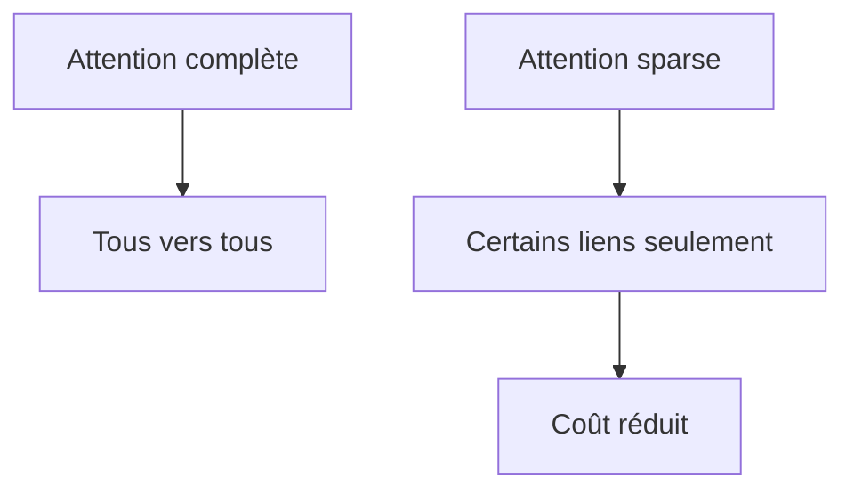

Cela réduit le coût, mais peut perdre certaines interactions utiles.

---

## 29.5.3 Attention locale

L’attention locale limite l’attention à une fenêtre autour du token.

C’est naturel pour :

* texte long ;
* audio ;
* vidéo ;
* image ;
* signaux temporels.

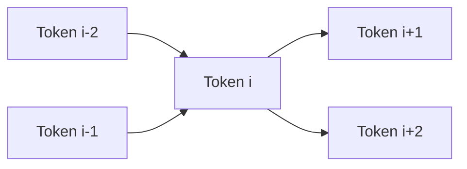

Elle est moins coûteuse que l’attention globale.

Mais les informations très éloignées circulent plus lentement.

---

## 29.5.4 Attention hiérarchique

Une autre piste est l’attention hiérarchique.

On traite d’abord localement, puis on construit des représentations plus globales.

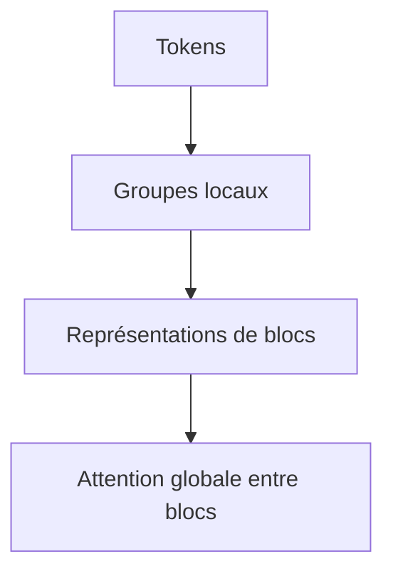

Cela ressemble à la manière dont les CNN construisent des représentations multi-échelles.

---

## 29.5.5 Modèles linéaires et alternatives à l’attention

Certains travaux cherchent à remplacer ou approximer l’attention par des mécanismes plus efficaces.

Objectif :

$$
O(n)
$$

ou :

$$
O(n \log n)
$$

au lieu de :

$$
O(n^2)
$$

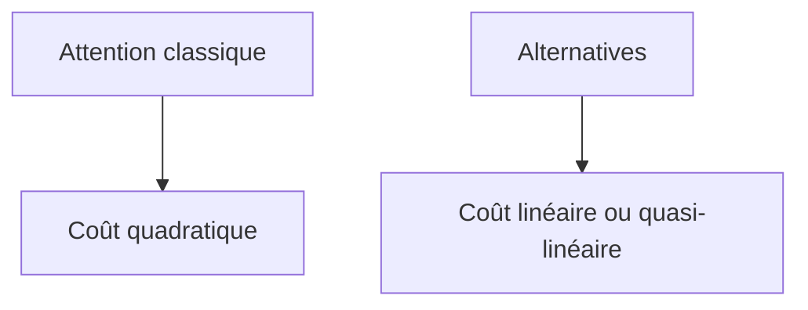

Ces approches sont prometteuses, mais doivent conserver la qualité des Transformers classiques.

---

## 29.6 Modèles plus petits et plus spécialisés

## 29.6.1 Tous les usages n’exigent pas un grand modèle

L’avenir ne sera pas uniquement composé de modèles toujours plus grands.

Beaucoup d’usages peuvent être couverts par :

* petits modèles ;
* modèles spécialisés ;
* modèles quantifiés ;
* modèles embarqués ;
* modèles fine-tunés ;
* pipelines hybrides.

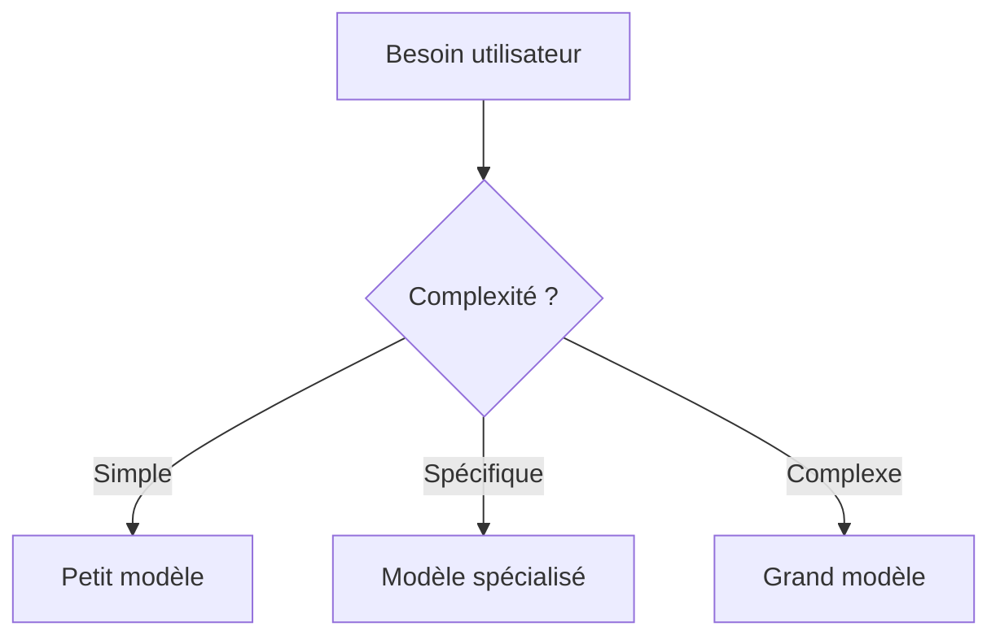

Le bon modèle est celui qui répond au besoin avec un coût acceptable.

---

## 29.6.2 Modèles spécialisés métier

Nous verrons probablement davantage de modèles spécialisés pour :

* droit ;
* santé ;
* éducation ;
* industrie ;
* programmation ;
* cybersécurité défensive ;
* administration ;
* recherche scientifique ;
* analyse documentaire.

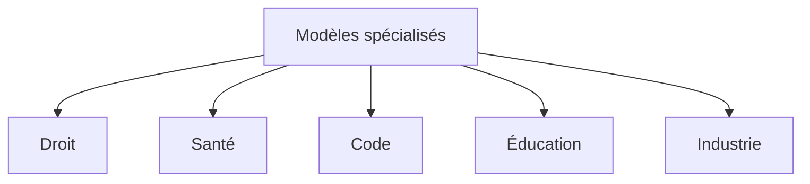

Ces modèles peuvent être plus petits mais meilleurs dans leur domaine.

---

## 29.6.3 Avantages des petits modèles

Les petits modèles ont plusieurs avantages :

* coût réduit ;
* latence faible ;
* déploiement local ;
* meilleure confidentialité ;
* maintenance plus simple ;
* consommation plus faible ;
* adaptation plus facile.

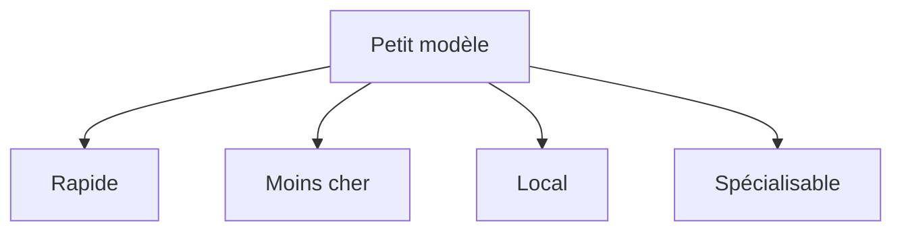

Un petit modèle bien entraîné peut être préférable à un grand modèle généraliste pour une tâche précise.

---

## 29.6.4 Routage multi-modèle

Un système peut utiliser plusieurs modèles selon la tâche.

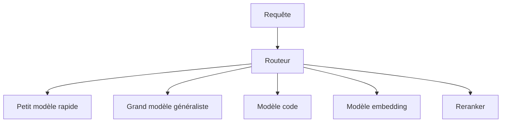

L’avenir des LLM pourrait donc être moins un modèle unique qu’une orchestration intelligente de modèles spécialisés.

---

## 29.7 Mixture of Experts

## 29.7.1 Principe

Les modèles **Mixture of Experts**, ou MoE, contiennent plusieurs experts.

Pour chaque token, un routeur choisit quelques experts à activer.

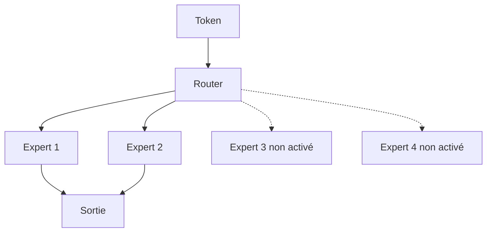

L’idée est d’augmenter la capacité totale sans utiliser tous les paramètres à chaque token.

---

## 29.7.2 Avantages des MoE

Les MoE permettent :

* grande capacité ;
* coût d’inférence contrôlé ;
* spécialisation partielle des experts ;
* meilleure scalabilité ;
* entraînement efficace à grande échelle.

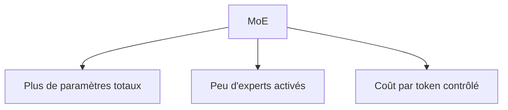

C’est une voie importante pour construire de très grands modèles.

---

## 29.7.3 Limites des MoE

Les MoE ajoutent aussi des difficultés :

* routage instable ;
* déséquilibre entre experts ;
* complexité d’entraînement ;
* communication distribuée ;
* difficulté de déploiement ;
* interprétabilité plus complexe.

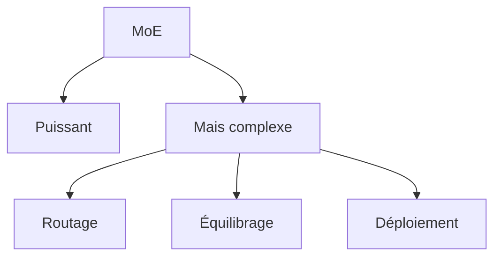

Ils sont prometteurs, mais demandent une ingénierie importante.

---

## 29.8 Mémoire externe et modèles augmentés

## 29.8.1 Limite de la mémoire paramétrique

Un LLM stocke une partie de ses connaissances dans ses poids.

Mais cette mémoire est :

* difficile à modifier ;
* difficile à auditer ;
* parfois obsolète ;
* non sourcée ;
* mélangée ;
* coûteuse à mettre à jour.

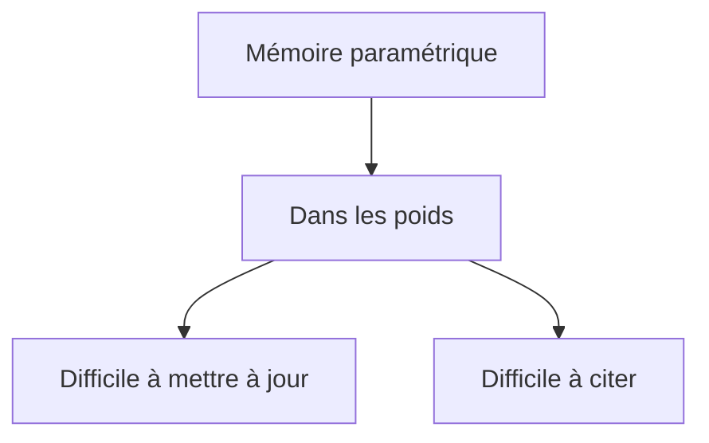

Cela explique l’importance de la mémoire externe.

---

## 29.8.2 Mémoire documentaire

Le RAG ajoute une mémoire documentaire.

```mermaid
flowchart TD
    A["Question"] --> B["Recherche documentaire"]
    B --> C["Sources récupérées"]
    C --> D["LLM"]
```

Cette mémoire est :

* modifiable ;
* vérifiable ;
* sourçable ;
* filtrable ;
* contrôlable.

Elle restera probablement centrale dans les systèmes futurs.

---

## 29.8.3 Mémoire conversationnelle

Les assistants peuvent utiliser une mémoire conversationnelle.

Elle peut contenir :

* préférences utilisateur ;
* projets en cours ;
* contraintes ;
* historique résumé ;
* décisions précédentes.

```mermaid
flowchart TD
    A["Conversation"] --> B["Résumé"]
    B --> C["Mémoire externe"]
    C --> D["Récupération future"]
```

Mais cette mémoire pose des questions de confidentialité, de contrôle utilisateur et d’effacement.

---

## 29.8.4 Mémoire structurée

Au lieu de stocker seulement des textes, on peut stocker des informations structurées :

* graphes ;
* tables ;
* objets JSON ;
* événements ;
* relations ;
* états de tâches.

```mermaid
flowchart TD
    A["Informations"] --> B["Texte"]
    A --> C["Tables"]
    A --> D["Graphes"]
    A --> E["États"]
```

Les futurs systèmes combineront probablement mémoire textuelle, vectorielle, relationnelle et graphique.

---

## 29.9 RAG avancé et Graph RAG

## 29.9.1 RAG de nouvelle génération

Le RAG évolue vers des systèmes plus sophistiqués.

Au lieu d’un simple :

```txt
embedding question → top-k chunks
```

nous allons vers :

* recherche hybride ;
* reranking ;
* query rewriting ;
* multi-hop retrieval ;
* graphes de connaissances ;
* vérification des sources ;
* gestion des versions ;
* contradiction detection ;
* raisonnement sur documents.

```mermaid
flowchart TD
    A["Question"] --> B["Reformulation"]
    B --> C["Recherche hybride"]
    C --> D["Reranking"]
    D --> E["Graphe"]
    E --> F["Sources finales"]
    F --> G["Réponse vérifiée"]
```

Le RAG devient une architecture complète de raisonnement documentaire.

---

## 29.9.2 Graph RAG

Le Graph RAG représente explicitement les relations.

Exemple :

```txt
Entreprise → contrat → projet → responsable
```

```mermaid
graph LR
    A["Entreprise"] --> B["Contrat"]
    B --> C["Projet"]
    C --> D["Responsable"]
```

C’est utile pour les questions multi-hop et les domaines structurés.

---

## 29.9.3 RAG et vérification

Une direction importante est le RAG vérifié.

Le système ne se contente pas de générer une réponse.

Il vérifie ensuite :

* chaque affirmation ;
* chaque citation ;
* chaque chiffre ;
* chaque source ;
* les contradictions éventuelles.

```mermaid
flowchart TD
    A["Réponse générée"] --> B["Découpage en affirmations"]
    B --> C["Vérification sources"]
    C --> D{"Toutes supportées ?"}
    D -->|"Oui"| E["Réponse validée"]
    D -->|"Non"| F["Correction / refus"]
```

Ce type de pipeline est plus lent, mais plus fiable.

---

## 29.10 Agents plus contrôlés

## 29.10.1 Agents actuels

Les agents actuels sont puissants, mais fragiles.

Ils peuvent :

* mal planifier ;
* boucler ;
* appeler les mauvais outils ;
* mal interpréter les observations ;
* agir sans assez de contrôle ;
* accumuler les erreurs.

```mermaid
flowchart TD
    A["Agent LLM"] --> B["Planification"]
    A --> C["Outils"]
    A --> D["Observations"]
    B --> E["Risques"]
    C --> E
    D --> E
```

L’avenir des agents passera par plus de contrôle.

---

## 29.10.2 Workflows hybrides

Une direction prometteuse consiste à combiner :

* workflows déterministes ;
* LLM pour les sous-tâches linguistiques ;
* outils validés ;
* checkpoints humains ;
* état explicite ;
* logs.

```mermaid
flowchart TD
    A["Workflow contrôlé"] --> B["Étape déterministe"]
    B --> C["LLM pour analyse"]
    C --> D["Validation"]
    D --> E["Outil"]
    E --> F["Trace"]
```

Le modèle devient un composant d’un processus, pas un agent totalement libre.

---

## 29.10.3 Agents avec état explicite

Les futurs agents devront mieux gérer un état explicite :

```json
{
  "goal": "corriger un bug",
  "current_step": "analyser les tests",
  "completed_steps": ["identifier l'erreur"],
  "constraints": ["ne pas modifier l'API publique"]
}
```

```mermaid
flowchart TD
    A["Agent"] --> B["État explicite"]
    B --> C["Objectif"]
    B --> D["Étape courante"]
    B --> E["Contraintes"]
    B --> F["Historique actions"]
```

Un état explicite permet de mieux contrôler, reprendre et auditer l’agent.

---

## 29.10.4 Agents vérifiés

Un agent plus fiable peut être couplé à :

* tests ;
* types ;
* schémas ;
* solveurs ;
* validateurs ;
* permissions ;
* contrats d’API.

```mermaid
flowchart TD
    A["Agent propose action"] --> B["Validation"]
    B --> C{"Autorisé et valide ?"}
    C -->|"Oui"| D["Exécution"]
    C -->|"Non"| E["Correction ou refus"]
```

L’avenir des agents est probablement moins dans l’autonomie totale que dans l’autonomie contrôlée.

---

## 29.11 Multimodalité avancée

## 29.11.1 Vers des modèles vraiment multimodaux

Les modèles multimodaux actuels combinent déjà :

* texte ;
* image ;
* audio ;
* vidéo ;
* documents ;
* captures d’écran.

À l’avenir, les systèmes pourraient intégrer plus naturellement :

* voix ;
* gestes ;
* environnement ;
* capteurs ;
* actions ;
* interface utilisateur ;
* monde physique.

```mermaid
flowchart TD
    A["Modèle multimodal"] --> B["Texte"]
    A --> C["Image"]
    A --> D["Audio"]
    A --> E["Vidéo"]
    A --> F["Capteurs"]
    A --> G["Actions"]
```

Le modèle devient alors une interface générale entre plusieurs formes de données.

---

## 29.11.2 Compréhension de documents complexes

Les modèles multimodaux seront particulièrement utiles pour :

* PDF ;
* formulaires ;
* factures ;
* contrats ;
* graphiques ;
* tableaux ;
* schémas ;
* notes manuscrites ;
* rapports scientifiques.

```mermaid
flowchart TD
    A["Document complexe"] --> B["Texte"]
    A --> C["Mise en page"]
    A --> D["Tableaux"]
    A --> E["Figures"]
    A --> F["Modèle multimodal"]
```

L’enjeu est de comprendre non seulement le texte, mais aussi la structure visuelle.

---

## 29.11.3 Vidéo et temporalité

La vidéo reste un défi important.

Un modèle doit comprendre :

* objets ;
* actions ;
* temporalité ;
* causalité ;
* continuité ;
* audio ;
* scène.

```mermaid
flowchart LR
    A["Frame 1"] --> B["Frame 2"]
    B --> C["Frame 3"]
    C --> D["Événement compris"]
```

La vidéo produit beaucoup de tokens, donc beaucoup de coût.

Les modèles devront combiner compression, attention locale, mémoire et temporalité.

---

## 29.11.4 Modèles audio et conversation naturelle

Les interfaces vocales vont probablement devenir plus naturelles.

Un assistant vocal avancé doit gérer :

* transcription ;
* compréhension ;
* émotion vocale éventuelle ;
* prosodie ;
* interruptions ;
* temps réel ;
* synthèse vocale ;
* dialogue.

```mermaid
flowchart TD
    A["Voix utilisateur"] --> B["Compréhension audio"]
    B --> C["LLM"]
    C --> D["Réponse"]
    D --> E["Voix synthétique"]
```

Le défi est de réduire la latence tout en conservant la qualité.

---

## 29.12 Neuro-symbolique

## 29.12.1 Pourquoi combiner neural et symbolique ?

Les LLM sont forts pour :

* langage ;
* flexibilité ;
* généralisation ;
* reformulation ;
* génération.

Mais ils sont plus fragiles pour :

* logique stricte ;
* preuves ;
* calcul exact ;
* contraintes formelles ;
* cohérence globale ;
* vérification.

Les systèmes symboliques sont meilleurs pour :

* règles explicites ;
* déduction ;
* vérification ;
* contraintes ;
* calcul formel.

```mermaid
flowchart TD
    A["Neural"] --> B["Langage et flexibilité"]
    C["Symbolique"] --> D["Règles et vérification"]
    B --> E["Neuro-symbolique"]
    D --> E
```

L’avenir pourrait combiner les deux.

---

## 29.12.2 LLM + solveurs

Un LLM peut formuler un problème.

Un solveur peut le résoudre ou le vérifier.

Exemples :

* SMT solver ;
* moteur logique ;
* système de types ;
* preuve formelle ;
* calcul formel ;
* solveur d’optimisation.

```mermaid
flowchart TD
    A["Problème en langage naturel"] --> B["LLM formalise"]
    B --> C["Solveur"]
    C --> D["Résultat vérifié"]
    D --> E["LLM explique"]
```

Le LLM sert d’interface.

Le solveur sert de garant formel.

---

## 29.12.3 LLM et preuves formelles

Dans les mathématiques et l’informatique, les LLM peuvent aider à produire des preuves.

Mais la preuve doit être vérifiée par un système formel.

```mermaid
flowchart TD
    A["LLM propose preuve"] --> B["Vérificateur formel"]
    B --> C{"Preuve valide ?"}
    C -->|"Oui"| D["Acceptée"]
    C -->|"Non"| E["Correction"]
    E --> A
```

Ce couplage est puissant, car le modèle peut explorer, mais le vérificateur décide.

---

## 29.13 Interprétabilité et compréhension des modèles

## 29.13.1 Pourquoi l’interprétabilité est cruciale

Plus les modèles sont utilisés dans des domaines sensibles, plus nous avons besoin de comprendre :

* pourquoi ils répondent ainsi ;
* quelles connaissances ils utilisent ;
* quelles erreurs ils font ;
* quels biais ils portent ;
* comment les corriger.

```mermaid
flowchart TD
    A["LLM complexe"] --> B["Difficile à comprendre"]
    B --> C["Besoin interprétabilité"]
```

L’interprétabilité reste un défi majeur.

---

## 29.13.2 Comprendre les circuits internes

Une piste de recherche est d’identifier des circuits internes.

Un circuit peut être vu comme un ensemble de composants du modèle qui réalisent une fonction.

Exemples possibles :

* détection de syntaxe ;
* copie de tokens ;
* suivi d’indentation ;
* gestion de parenthèses ;
* association sujet-verbe ;
* rappel factuel.

```mermaid
flowchart TD
    A["Modèle"] --> B["Têtes d'attention"]
    A --> C["MLP"]
    A --> D["Activations"]
    B --> E["Circuit potentiel"]
    C --> E
```

Comprendre ces circuits pourrait améliorer la sécurité et le contrôle.

---

## 29.13.3 Interprétabilité et édition de modèles

Si nous comprenons mieux où une connaissance ou un comportement est représenté, nous pourrions :

* corriger une erreur ;
* supprimer un biais ;
* modifier une connaissance ;
* contrôler un comportement ;
* détecter une capacité dangereuse.

```mermaid
flowchart TD
    A["Compréhension interne"] --> B["Édition ciblée"]
    B --> C["Correction modèle"]
```

Mais modifier un modèle sans effets secondaires reste difficile.

---

## 29.14 Données synthétiques et auto-amélioration

## 29.14.1 Données générées par modèles

Les modèles peuvent générer des données d’entraînement.

Exemples :

* questions-réponses ;
* exercices ;
* explications ;
* code ;
* tests ;
* dialogues ;
* cas limites.

```mermaid
flowchart TD
    A["Modèle professeur"] --> B["Génère données"]
    B --> C["Filtrage"]
    C --> D["Entraînement modèle élève"]
```

Cela peut accélérer l’entraînement et la spécialisation.

---

## 29.14.2 Risques des données synthétiques

Les données synthétiques peuvent aussi :

* propager des erreurs ;
* réduire la diversité ;
* renforcer les biais ;
* créer des réponses trop standardisées ;
* amplifier les hallucinations ;
* produire une boucle fermée.

```mermaid
flowchart TD
    A["Données synthétiques"] --> B["Utile"]
    A --> C["Risques"]
    C --> D["Biais"]
    C --> E["Uniformisation"]
    C --> F["Erreurs propagées"]
```

Il faut donc filtrer, évaluer et mélanger avec des données réelles de qualité.

---

## 29.14.3 Auto-amélioration contrôlée

L’idée d’un modèle qui s’améliore lui-même est séduisante.

Mais elle doit être encadrée.

Une boucle d’amélioration doit inclure :

* évaluation externe ;
* tests ;
* validation humaine ;
* vérification ;
* garde-fous ;
* traçabilité.

```mermaid
flowchart TD
    A["Modèle génère amélioration"] --> B["Tests"]
    B --> C["Évaluation"]
    C --> D{"Validé ?"}
    D -->|"Oui"| E["Intégration"]
    D -->|"Non"| F["Rejet"]
```

Sans validation externe, une auto-amélioration peut amplifier les erreurs.

---

## 29.15 IA embarquée et locale

## 29.15.1 Pourquoi l’IA locale progresse

Les modèles deviennent plus efficaces.

Le matériel local devient plus performant.

La quantization et les petits modèles permettent d’exécuter des LLM sur :

* ordinateurs personnels ;
* smartphones ;
* serveurs locaux ;
* systèmes embarqués ;
* robots ;
* équipements industriels.

```mermaid
flowchart TD
    A["Modèles plus efficaces"] --> B["Déploiement local"]
    C["Matériel plus performant"] --> B
    D["Quantization"] --> B
```

Cela ouvre la voie à des usages plus confidentiels et plus autonomes.

---

## 29.15.2 Avantages du local

Le local permet :

* confidentialité ;
* faible latence ;
* fonctionnement hors ligne ;
* contrôle ;
* coût marginal réduit ;
* indépendance réseau.

```mermaid
flowchart TD
    A["LLM local"] --> B["Confidentialité"]
    A --> C["Hors ligne"]
    A --> D["Faible latence"]
    A --> E["Contrôle"]
```

C’est important pour les entreprises, l’éducation, la santé, l’industrie et les développeurs.

---

## 29.15.3 Limites du local

Le local impose :

* modèles plus petits ;
* mémoire limitée ;
* vitesse limitée ;
* maintenance ;
* mises à jour ;
* sécurité locale ;
* évaluation.

```mermaid
flowchart TD
    A["Déploiement local"] --> B["Contrôle"]
    A --> C["Mais ressources limitées"]
    C --> D["Modèle plus petit"]
    C --> E["Maintenance"]
```

L’avenir combinera probablement cloud et local selon les besoins.

---

## 29.16 Open-source et écosystème

## 29.16.1 Importance de l’open-source

L’open-source et les modèles open-weights permettent :

* enseignement ;
* recherche ;
* audit ;
* adaptation ;
* souveraineté ;
* innovation ;
* déploiement local ;
* réduction de dépendance.

```mermaid
flowchart TD
    A["Open-source / open-weights"] --> B["Recherche"]
    A --> C["Audit"]
    A --> D["Déploiement local"]
    A --> E["Innovation"]
```

Ils jouent un rôle central dans la diffusion des compétences.

---

## 29.16.2 Limites de l’ouverture

L’ouverture ne garantit pas :

* absence de biais ;
* sécurité ;
* conformité juridique ;
* qualité ;
* sobriété ;
* bon usage.

```mermaid
flowchart TD
    A["Modèle ouvert"] --> B["Transparence partielle"]
    A --> C["Mais risques persistants"]
```

Un modèle ouvert doit aussi être évalué, documenté et gouverné.

---

## 29.16.3 Écosystème logiciel

Autour des Transformers, un écosystème logiciel continue de se développer :

* bibliothèques de modèles ;
* serveurs d’inférence ;
* frameworks RAG ;
* outils d’évaluation ;
* outils de fine-tuning ;
* bases vectorielles ;
* systèmes agentiques ;
* outils de monitoring.

```mermaid
flowchart TD
    A["Écosystème IA"] --> B["Modèles"]
    A --> C["Serving"]
    A --> D["RAG"]
    A --> E["Évaluation"]
    A --> F["Fine-tuning"]
    A --> G["Monitoring"]
```

L’innovation ne vient pas seulement des modèles, mais aussi de l’infrastructure autour.

---

## 29.17 Transformers et science

## 29.17.1 Aide à la recherche scientifique

Les Transformers peuvent aider à :

* lire des articles ;
* résumer ;
* extraire des relations ;
* générer des hypothèses ;
* écrire du code scientifique ;
* analyser des données ;
* rechercher dans la littérature ;
* modéliser des séquences biologiques.

```mermaid
flowchart TD
    A["Transformers"] --> B["Littérature scientifique"]
    A --> C["Analyse données"]
    A --> D["Code scientifique"]
    A --> E["Hypothèses"]
```

Ils peuvent accélérer certaines tâches de recherche.

---

## 29.17.2 Risques en science

Mais il faut éviter :

* hallucination de références ;
* erreurs de méthode ;
* conclusions non supportées ;
* biais dans les données ;
* reproduction de résultats faux ;
* confusion entre hypothèse et preuve.

```mermaid
flowchart TD
    A["LLM en science"] --> B["Aide"]
    A --> C["Risques"]
    C --> D["Références inventées"]
    C --> E["Méthodes erronées"]
    C --> F["Conclusions fragiles"]
```

Dans la recherche, le modèle doit assister, pas remplacer la méthode scientifique.

---

## 29.18 Transformers et éducation

## 29.18.1 Tuteurs personnalisés

Les LLM peuvent devenir des tuteurs personnalisés.

Ils peuvent :

* expliquer autrement ;
* générer des exercices ;
* corriger ;
* adapter le niveau ;
* proposer des indices ;
* simuler un oral ;
* accompagner un projet.

```mermaid
flowchart TD
    A["Étudiant"] --> B["Tuteur IA"]
    B --> C["Explications"]
    B --> D["Exercices"]
    B --> E["Feedback"]
```

C’est une opportunité majeure.

---

## 29.18.2 Nouvelles formes d’évaluation

Si les étudiants ont accès à des LLM, les évaluations doivent évoluer.

Nous devons évaluer davantage :

* compréhension réelle ;
* capacité à critiquer ;
* capacité à vérifier ;
* capacité à utiliser l’IA intelligemment ;
* oral ;
* projets ;
* raisonnement ;
* justification.

```mermaid
flowchart TD
    A["Éducation avec LLM"] --> B["Moins de simple restitution"]
    B --> C["Plus de critique"]
    B --> D["Plus de projets"]
    B --> E["Plus de vérification"]
```

L’enjeu n’est pas seulement d’empêcher l’usage, mais d’apprendre à bien l’utiliser.

---

## 29.19 Transformers et programmation

## 29.19.1 Assistant de développement

Les LLM transforment déjà le développement logiciel.

Ils peuvent aider à :

* écrire du code ;
* expliquer ;
* refactoriser ;
* générer des tests ;
* lire une base de code ;
* trouver des bugs ;
* documenter ;
* migrer des projets.

```mermaid
flowchart TD
    A["Développeur"] --> B["Assistant IA"]
    B --> C["Code"]
    B --> D["Tests"]
    B --> E["Documentation"]
    B --> F["Debug"]
```

Le développeur devient davantage superviseur, architecte et vérificateur.

---

## 29.19.2 Risques en programmation

Les risques sont :

* code incorrect ;
* failles de sécurité ;
* dépendances inventées ;
* mauvaise compréhension du projet ;
* licences problématiques ;
* tests insuffisants ;
* confiance excessive.

```mermaid
flowchart TD
    A["Code généré"] --> B["Peut être utile"]
    A --> C["Peut être dangereux"]
    C --> D["Bugs"]
    C --> E["Sécurité"]
    C --> F["Licences"]
```

Le code généré doit être relu, testé et audité.

---

## 29.19.3 Vers des agents de développement

Les agents de code peuvent :

* lire une issue ;
* chercher les fichiers ;
* modifier ;
* lancer les tests ;
* corriger ;
* proposer une pull request.

```mermaid
flowchart TD
    A["Issue"] --> B["Agent code"]
    B --> C["Recherche contexte"]
    C --> D["Modification"]
    D --> E["Tests"]
    E --> F{"OK ?"}
    F -->|"Non"| D
    F -->|"Oui"| G["Proposition PR"]
```

Mais ils doivent être encadrés par des tests, du versioning et une revue humaine.

---

## 29.20 Limites possibles du paradigme Transformer

## 29.20.1 Les Transformers ne résolvent pas tout

Malgré leur puissance, les Transformers restent limités.

Ils peuvent être inefficaces pour :

* raisonnement symbolique strict ;
* mémoire longue structurée ;
* planification robuste ;
* apprentissage continu contrôlé ;
* compréhension causale profonde ;
* interaction physique ;
* vérification formelle.

```mermaid
flowchart TD
    A["Transformer"] --> B["Très puissant"]
    A --> C["Mais limites"]
    C --> D["Symbolique"]
    C --> E["Causalité"]
    C --> F["Planification"]
    C --> G["Vérification"]
```

Nous devons donc rester ouverts à d’autres architectures.

---

## 29.20.2 Au-delà du scaling

Pendant plusieurs années, l’augmentation de taille a fortement amélioré les modèles.

Mais le scaling rencontre des limites :

* données disponibles ;
* coût ;
* énergie ;
* rendement décroissant ;
* latence ;
* infrastructure ;
* réglementation ;
* acceptabilité sociale.

```mermaid
flowchart TD
    A["Scaling"] --> B["Améliore performances"]
    A --> C["Mais coût croissant"]
    C --> D["Limites économiques"]
    C --> E["Limites énergétiques"]
    C --> F["Limites données"]
```

L’avenir ne peut pas reposer uniquement sur “plus grand”.

---

## 29.20.3 Besoin de nouveaux principes

Nous aurons probablement besoin de :

* meilleure mémoire ;
* meilleure vérification ;
* meilleure planification ;
* architectures plus efficaces ;
* interactions avec outils ;
* apprentissage continu sûr ;
* modèles plus interprétables ;
* meilleure intégration symbolique.

```mermaid
flowchart TD
    A["Prochaines étapes"] --> B["Mémoire"]
    A --> C["Vérification"]
    A --> D["Efficacité"]
    A --> E["Interprétabilité"]
    A --> F["Outils"]
```

Les Transformers seront peut-être une partie du système, pas tout le système.

---

## 29.21 Vers des systèmes composés

## 29.21.1 Le LLM comme composant

Un système moderne peut combiner :

* LLM ;
* RAG ;
* outils ;
* bases de données ;
* solveurs ;
* modèles spécialisés ;
* règles métier ;
* validation ;
* humains.

```mermaid
flowchart TD
    A["Système IA"] --> B["LLM"]
    A --> C["RAG"]
    A --> D["Outils"]
    A --> E["Solveurs"]
    A --> F["Humain"]
    A --> G["Règles métier"]
```

Le LLM devient un composant central, mais pas unique.

---

## 29.21.2 Architecture composable

Une architecture composable permet de remplacer ou améliorer chaque brique.

```mermaid
flowchart TD
    A["Orchestrateur"] --> B["Modèle génération"]
    A --> C["Retriever"]
    A --> D["Reranker"]
    A --> E["Outils"]
    A --> F["Validation"]
```

Avantages :

* modularité ;
* testabilité ;
* sécurité ;
* évolution progressive ;
* meilleure maintenance.

---

## 29.21.3 Systèmes vérifiables

L’objectif futur n’est pas seulement une réponse plausible.

Nous voulons des systèmes qui peuvent :

* citer ;
* vérifier ;
* expliquer leurs limites ;
* refuser quand nécessaire ;
* tracer leurs actions ;
* être audités ;
* respecter les permissions.

```mermaid
flowchart TD
    A["Système LLM fiable"] --> B["Citations"]
    A --> C["Vérification"]
    A --> D["Traçabilité"]
    A --> E["Permissions"]
    A --> F["Audit"]
```

La fiabilité viendra de la combinaison modèle + système.

---

## 29.22 Erreur fréquente : croire que l’avenir sera seulement des modèles plus grands

Les modèles plus grands continueront probablement à exister.

Mais l’avenir sera aussi :

* modèles plus petits ;
* modèles spécialisés ;
* RAG ;
* outils ;
* agents contrôlés ;
* modèles locaux ;
* systèmes hybrides ;
* vérification ;
* orchestration.

```mermaid
flowchart TD
    A["Avenir IA"] --> B["Grands modèles"]
    A --> C["Petits modèles"]
    A --> D["Systèmes composés"]
    A --> E["Outils"]
    A --> F["RAG"]
```

La taille n’est qu’un facteur parmi d’autres.

---

## 29.23 Erreur fréquente : croire que le contexte long remplace la recherche

Un contexte long aide.

Mais il ne remplace pas forcément :

* indexation ;
* sélection ;
* filtrage ;
* droits d’accès ;
* citations ;
* structuration ;
* reranking.

```mermaid
flowchart TD
    A["Contexte long"] --> B["Plus de place"]
    B --> C["Mais besoin sélection"]
    C --> D["RAG reste utile"]
```

Le problème n’est pas seulement d’avoir assez de place.

C’est de fournir la bonne information.

---

## 29.24 Erreur fréquente : croire que les agents doivent être totalement autonomes

Un agent totalement libre est souvent risqué.

Un agent utile peut être :

* limité ;
* spécialisé ;
* supervisé ;
* vérifié ;
* intégré à un workflow.

```mermaid
flowchart TD
    A["Agent utile"] --> B["Autonomie contrôlée"]
    A --> C["Outils limités"]
    A --> D["Validation"]
    A --> E["Logs"]
```

L’autonomie n’est pas une valeur en soi.

Ce qui compte, c’est la fiabilité.

---

## 29.25 Erreur fréquente : croire que multimodal signifie compréhension parfaite

Un modèle multimodal peut voir une image, mais il peut encore :

* mal compter ;
* mal lire ;
* halluciner ;
* confondre des objets ;
* rater des relations spatiales ;
* suivre le prompt plutôt que l’image.

```mermaid
flowchart TD
    A["Multimodal"] --> B["Plus d'information"]
    B --> C["Mais erreurs possibles"]
```

La multimodalité améliore l’ancrage, mais ne garantit pas la compréhension parfaite.

---

## 29.26 Synthèse : les grandes directions futures

Nous pouvons résumer les directions futures en huit axes.

```mermaid
mindmap
  root((Avenir des Transformers))
    Efficacité
      Attention sparse
      Quantization
      Petits modèles
      Routage
    Contexte
      Long contexte
      RAG
      Mémoire externe
      Hiérarchie
    Fiabilité
      Vérification
      Citations
      Évaluation
      Garde-fous
    Agents
      Workflows
      État explicite
      Permissions
      Outils
    Multimodalité
      Image
      Audio
      Vidéo
      Documents
    Spécialisation
      Domaine métier
      Code
      Science
      Éducation
    Neuro-symbolique
      Solveurs
      Logique
      Preuves
      Contraintes
    Local
      Edge
      Open-source
      Confidentialité
      Souveraineté
```

Ces axes ne sont pas séparés.

Ils se combinent dans les systèmes réels.

---

## 29.27 Synthèse opérationnelle

Pour concevoir un système futur fondé sur les Transformers, nous devons nous demander :

```mermaid
flowchart TD
    A["Nouveau système IA"] --> B{"Besoin de génération ?"}
    A --> C{"Besoin de sources ?"}
    A --> D{"Besoin d'actions ?"}
    A --> E{"Besoin de vérification ?"}
    A --> F{"Données sensibles ?"}
    A --> G{"Coût acceptable ?"}
    A --> H{"Modèle local possible ?"}
```

Ces questions conduisent à choisir :

* modèle généraliste ou spécialisé ;
* RAG ou non ;
* outils ou non ;
* cloud ou local ;
* agent libre ou workflow ;
* validation humaine ou automatique.

---

## 29.28 Schéma global de synthèse

```mermaid
flowchart TD
    A["Transformers actuels"] --> B["Évolutions techniques"]
    A --> C["Évolutions système"]
    A --> D["Évolutions sociales"]

    B --> B1["Efficacité"]
    B --> B2["Long contexte"]
    B --> B3["MoE"]
    B --> B4["Multimodalité"]

    C --> C1["RAG avancé"]
    C --> C2["Agents contrôlés"]
    C --> C3["Outils"]
    C --> C4["Vérification"]
    C --> C5["Mémoire externe"]

    D --> D1["Gouvernance"]
    D --> D2["Open-source"]
    D --> D3["Sobriété"]
    D --> D4["Éducation"]
    D --> D5["Responsabilité"]
```

---

## 29.29 Résumé du chapitre

Nous avons étudié les perspectives futures des Transformers.

Nous avons vu que l’avenir ne se limite pas à l’augmentation de taille des modèles.

Les grandes directions sont :

* contextes plus longs ;
* attention plus efficace ;
* architectures sparse ou hiérarchiques ;
* Mixture of Experts ;
* modèles plus petits et spécialisés ;
* mémoire externe ;
* RAG avancé ;
* Graph RAG ;
* agents plus contrôlés ;
* workflows outillés ;
* multimodalité avancée ;
* neuro-symbolique ;
* vérification formelle ;
* IA locale et embarquée ;
* open-source ;
* systèmes composés.

Nous avons insisté sur une idée importante :

> Le futur des Transformers sera probablement moins celui d’un modèle unique qui fait tout, que celui de systèmes composés combinant modèles, mémoire, outils, vérification, données structurées et contrôle humain.

Les Transformers resteront probablement une brique majeure, mais ils seront de plus en plus intégrés dans des architectures hybrides, vérifiables et spécialisées.

---

## 29.30 Questions de compréhension

### 29.30.1 Question 1

Pourquoi le contexte long ne suffit-il pas à résoudre tous les problèmes ?

Réponse attendue : parce qu’un contexte long peut être coûteux, bruité, difficile à exploiter, et ne remplace pas la sélection pertinente des informations.

### 29.30.2 Question 2

Pourquoi cherche-t-on des alternatives à l’attention complète ?

Réponse attendue : parce que l’attention complète a un coût quadratique en longueur de séquence.

### 29.30.3 Question 3

Quel est l’intérêt des modèles spécialisés ?

Réponse attendue : ils peuvent être plus rapides, moins coûteux et meilleurs sur un domaine précis qu’un grand modèle généraliste.

### 29.30.4 Question 4

Qu’est-ce qu’un modèle Mixture of Experts ?

Réponse attendue : un modèle contenant plusieurs experts, dont seulement certains sont activés pour chaque token.

### 29.30.5 Question 5

Pourquoi la mémoire externe est-elle importante ?

Réponse attendue : parce qu’elle permet de stocker des informations modifiables, vérifiables, sourçables et contrôlables, contrairement à la mémoire paramétrique du modèle.

### 29.30.6 Question 6

Pourquoi les agents futurs devront-ils être plus contrôlés ?

Réponse attendue : parce que les agents peuvent agir, se tromper, boucler, appeler de mauvais outils ou effectuer des actions dangereuses.

### 29.30.7 Question 7

Quel est l’intérêt du neuro-symbolique ?

Réponse attendue : combiner la flexibilité linguistique des modèles neuronaux avec la rigueur des systèmes symboliques et des solveurs.

### 29.30.8 Question 8

Pourquoi l’IA locale est-elle importante ?

Réponse attendue : elle améliore la confidentialité, réduit la dépendance réseau, permet le fonctionnement hors ligne et donne plus de contrôle.

### 29.30.9 Question 9

Pourquoi l’avenir ne sera-t-il pas seulement constitué de modèles plus grands ?

Réponse attendue : parce que le coût, l’énergie, la latence, les limites de données et les besoins de spécialisation favorisent aussi des modèles plus petits, hybrides et mieux orchestrés.

### 29.30.10 Question 10

Quelle est l’idée principale des systèmes composés ?

Réponse attendue : un LLM devient une brique parmi d’autres, combinée avec RAG, outils, bases de données, solveurs, validation, règles métier et contrôle humain.

---

## 29.31 Transition vers le chapitre 30

Nous avons étudié les perspectives futures des Transformers.

Dans le dernier chapitre, nous allons faire une **synthèse générale du cours**.

Nous reprendrons :

* les idées fondamentales ;
* le chemin depuis l’attention jusqu’aux LLM modernes ;
* le rôle du papier *Attention Is All You Need* ;
* les grandes familles de modèles ;
* les usages ;
* les limites ;
* les enjeux ;
* les points à retenir pour un étudiant de Master.

Nous conclurons le cours en reliant les concepts techniques, les architectures, les systèmes et les responsabilités associées.

---
> [!info] Livre « Les transformers » — chapitre 29/30
> [[Les transformers — Sommaire|Sommaire]] · [[Les transformers — 28 — Limites, risques et enjeux éthiques des Transformers et des LLM|← 28 — Limites, risques et enjeux éthiques des Transformers et des LLM]] · [[Les transformers — 30 — Synthèse générale du cours des mécanismes d’attention aux systèmes fondés sur les Transformers|30 — Synthèse générale du cours des mécanismes d’attention aux systèmes fondés sur les Transformers →]]
