> [!info] Livre « Les transformers » — chapitre 30/30
> [[Les transformers — Sommaire|Sommaire]] · [[Les transformers — 29 — Perspectives futures des Transformers|← 29 — Perspectives futures des Transformers]] · [[Les transformers — Compléments 2026|Compléments 2026 →]]

# Chapitre 30 — Synthèse générale du cours : des mécanismes d’attention aux systèmes fondés sur les Transformers
## 30.1 Objectif du chapitre

Dans ce dernier chapitre, nous allons reprendre l’ensemble du cours.

Nous avons parcouru un long chemin :

* des tenseurs et embeddings ;
* jusqu’à l’attention ;
* puis au Transformer original ;
* puis à BERT, GPT, T5, ViT ;
* puis aux LLM modernes ;
* puis au RAG, aux agents, au fine-tuning, à l’évaluation, au déploiement et aux enjeux éthiques.

L’objectif de ce chapitre est de donner une vue d’ensemble cohérente.

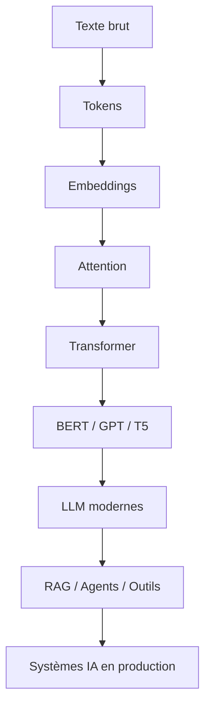

Le point central du cours est :

> Le Transformer n’est pas seulement une architecture de réseau de neurones : c’est devenu une brique centrale pour construire des systèmes capables de traiter, générer, chercher, raisonner partiellement, agir et interagir avec plusieurs modalités.

---

## 30.2 Le problème de départ : représenter des séquences

Nous sommes partis d’un problème simple :

> Comment représenter une phrase pour qu’un réseau de neurones puisse la traiter ?

Une phrase est une séquence :

```txt
Le chat dort sur le canapé.
```

Mais un réseau de neurones ne manipule pas directement des mots.

Il manipule des nombres.

Nous devons donc passer par :

1. tokenisation ;
2. IDs de tokens ;
3. embeddings ;
4. tenseurs ;
5. traitement par le modèle.

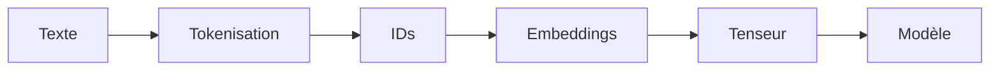

Cette transformation est la base de tout le cours.

---

## 30.3 Tokens et embeddings

Un token est une unité manipulée par le modèle.

Ce peut être :

* un mot ;
* un fragment de mot ;
* un caractère ;
* un symbole ;
* un token spécial ;
* un morceau de code.

Un embedding est un vecteur représentant ce token.

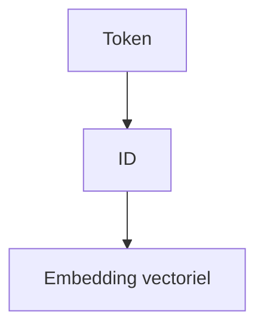

L’idée importante est :

> Le modèle ne raisonne pas directement sur des mots, mais sur des vecteurs appris.

Les embeddings permettent de passer d’une représentation symbolique à une représentation distribuée.

---

## 30.4 Pourquoi les séquences sont difficiles

Les séquences posent plusieurs problèmes :

* longueur variable ;
* dépendances longues ;
* ambiguïtés ;
* ordre important ;
* contexte ;
* références ;
* structure grammaticale ;
* relations entre tokens éloignés.

Exemple :

```txt
Le livre que tu m’as prêté hier est passionnant.
```

Pour comprendre `est passionnant`, il faut savoir que le sujet est `Le livre`.

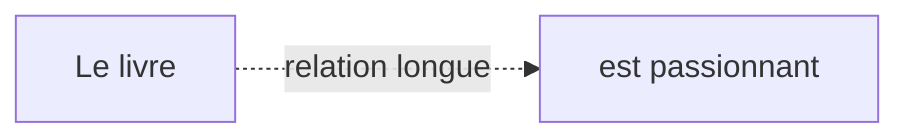

Le Transformer a été conçu pour mieux traiter ces relations.

---

## 30.5 Avant les Transformers : RNN et LSTM

Avant les Transformers, les séquences étaient souvent traitées par des réseaux récurrents.

Les RNN et LSTM lisent les tokens progressivement.

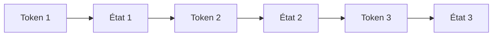

Ils ont permis des progrès importants.

Mais ils ont des limites :

* traitement séquentiel ;
* parallélisation difficile ;
* dépendances longues difficiles ;
* entraînement moins efficace à grande échelle.

Le Transformer va rompre avec cette logique en utilisant l’attention.

---

## 30.6 L’idée centrale : l’attention

L’attention permet à un token de regarder d’autres tokens.

Au lieu de compresser toute l’information dans un état caché unique, le modèle apprend à pondérer les éléments importants du contexte.

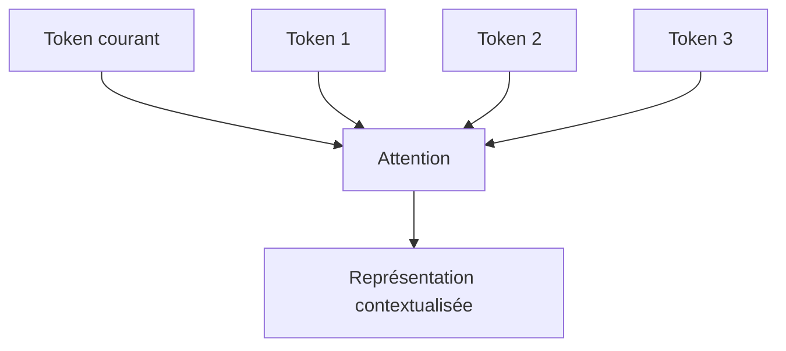

L’attention répond à la question :

> Quels éléments du contexte sont utiles pour représenter ce token ?

---

## 30.7 Queries, Keys, Values

Le mécanisme d’attention repose sur trois projections :

* Query ;
* Key ;
* Value.

Chaque token produit :

[
Q = XW_Q
]

[
K = XW_K
]

[
V = XW_V
]

Le score d’attention est calculé par :

[
Attention(Q,K,V)
================

softmax\left(\frac{QK^T}{\sqrt{d_k}}\right)V
]

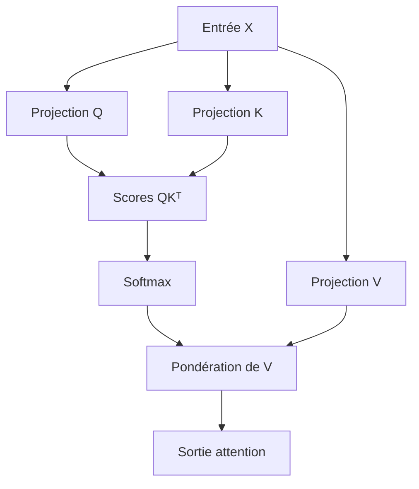

Cette formule est l’un des cœurs mathématiques du cours.

---

## 30.8 Self-attention

La self-attention signifie que la séquence se regarde elle-même.

Chaque token peut utiliser les autres tokens pour construire sa représentation.

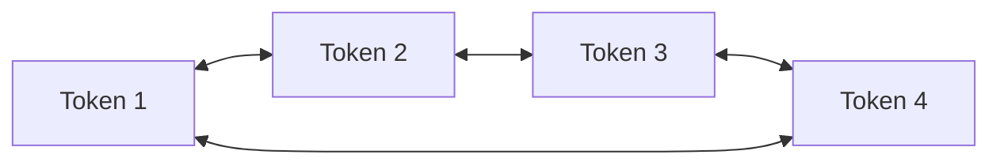

C’est ce mécanisme qui permet au Transformer de créer des représentations contextualisées.

Le mot `banque`, par exemple, ne sera pas représenté de la même manière dans :

```txt
Je vais à la banque.
```

et :

```txt
Je m’assois sur la banque de sable.
```

Le contexte change l’embedding interne.

---

## 30.9 Multi-head attention

Une seule attention peut capturer un type de relation.

La multi-head attention permet d’apprendre plusieurs relations en parallèle.

Une tête peut se spécialiser dans :

* syntaxe ;
* co-référence ;
* position ;
* dépendances locales ;
* dépendances longues ;
* structure de code ;
* relations sémantiques.

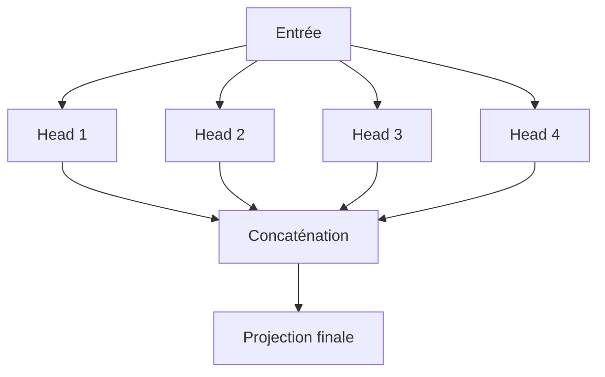

L’idée importante est :

> Plusieurs têtes permettent au modèle d’observer la séquence sous plusieurs angles.

---

## 30.10 Positional encoding

Le Transformer ne traite pas naturellement l’ordre.

Si nous donnons seulement un ensemble d’embeddings, le modèle ne sait pas si un token vient avant ou après un autre.

Nous ajoutons donc une information de position.

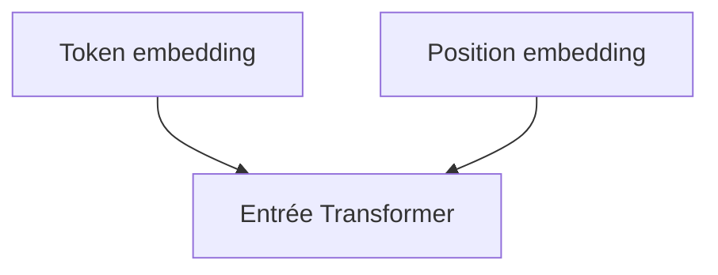

Sans position, les phrases suivantes seraient difficiles à distinguer :

```txt
Le chien mord l’homme.
L’homme mord le chien.
```

L’ordre est essentiel.

---

## 30.11 Le bloc Transformer

Un bloc Transformer contient généralement :

* multi-head attention ;
* connexion résiduelle ;
* normalisation ;
* feed-forward network ;
* nouvelle connexion résiduelle ;
* nouvelle normalisation.

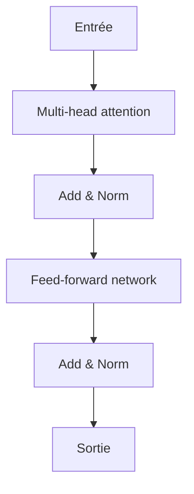

Le Transformer empile plusieurs blocs.

Chaque couche construit des représentations de plus en plus abstraites.

---

## 30.12 Le papier *Attention Is All You Need*

Le papier fondateur **Attention Is All You Need** introduit en 2017 une architecture qui remplace les récurrences par l’attention.

Son idée centrale est radicale :

> Nous pouvons construire un modèle de séquence performant sans RNN ni CNN, uniquement avec attention, projections linéaires, normalisation et feed-forward networks.

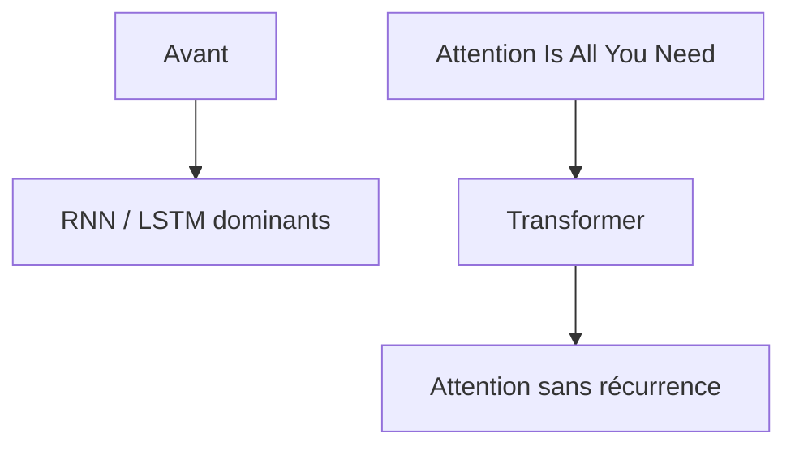

Ce papier marque un tournant majeur dans l’histoire du deep learning.

---

## 30.13 Le Transformer original

Le Transformer original est une architecture encoder-decoder conçue pour la traduction automatique.

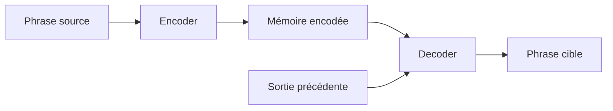

L’encoder lit la phrase source.

Le decoder génère la phrase cible token par token.

La cross-attention permet au decoder de regarder l’encoder pendant la génération.

---

## 30.14 Les trois formes d’attention

Nous avons distingué trois formes d’attention.

### Encoder self-attention

La source regarde la source.

### Decoder masked self-attention

La cible regarde les tokens précédents, mais pas les futurs.

### Cross-attention

Le decoder regarde la mémoire de l’encoder.

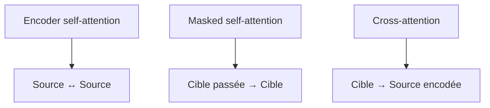

Ces trois mécanismes structurent le Transformer encoder-decoder.

---

## 30.15 Mask causal

Dans un modèle autoregressif, le modèle ne doit pas voir le futur.

Pour prédire le token (t), il ne peut utiliser que :

[
x_{<t}
]

Le mask causal empêche l’attention vers les positions futures.

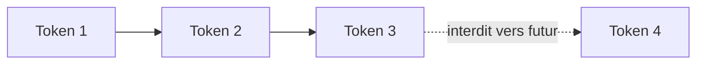

C’est essentiel pour les modèles GPT.

---

## 30.16 Les grandes familles de Transformers

Nous avons étudié trois grandes familles.

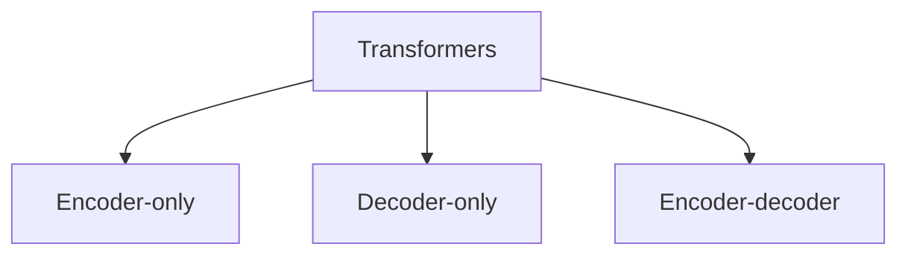

Chaque famille correspond à une manière différente d’utiliser l’architecture.

---

## 30.17 Encoder-only : BERT

Les modèles encoder-only, comme BERT, lisent toute la séquence de manière bidirectionnelle.

Ils sont adaptés à :

* classification ;
* extraction ;
* compréhension ;
* embeddings ;
* recherche ;
* analyse de texte.

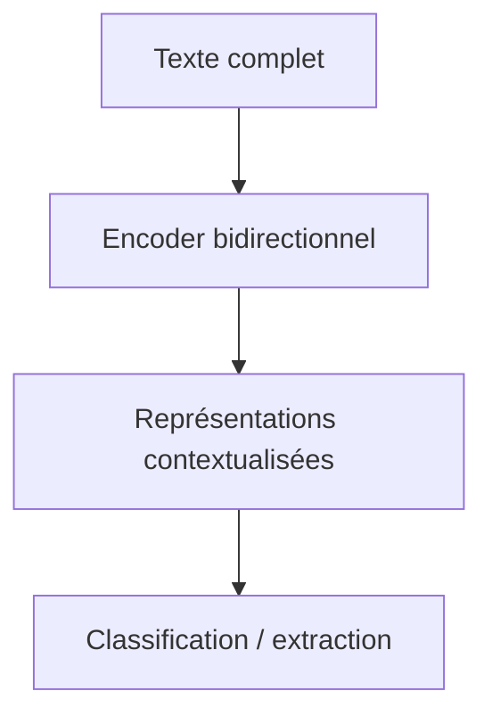

BERT est excellent pour comprendre une entrée, mais il n’est pas naturellement conçu pour générer longuement du texte.

---

## 30.18 Decoder-only : GPT

Les modèles decoder-only génèrent du texte autoregressivement.

Ils prédisent le prochain token à partir du contexte précédent.

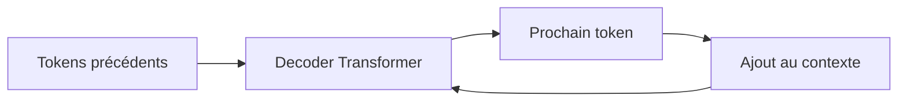

Ils sont adaptés à :

* génération ;
* dialogue ;
* complétion ;
* code ;
* agents ;
* assistants ;
* instruction following.

Les LLM conversationnels modernes sont souvent construits sur cette famille.

---

## 30.19 Encoder-decoder : T5 et BART

Les modèles encoder-decoder séparent clairement l’entrée et la sortie.

Ils sont adaptés aux tâches :

* traduction ;
* résumé ;
* reformulation ;
* correction ;
* question-réponse conditionnée ;
* text-to-text.

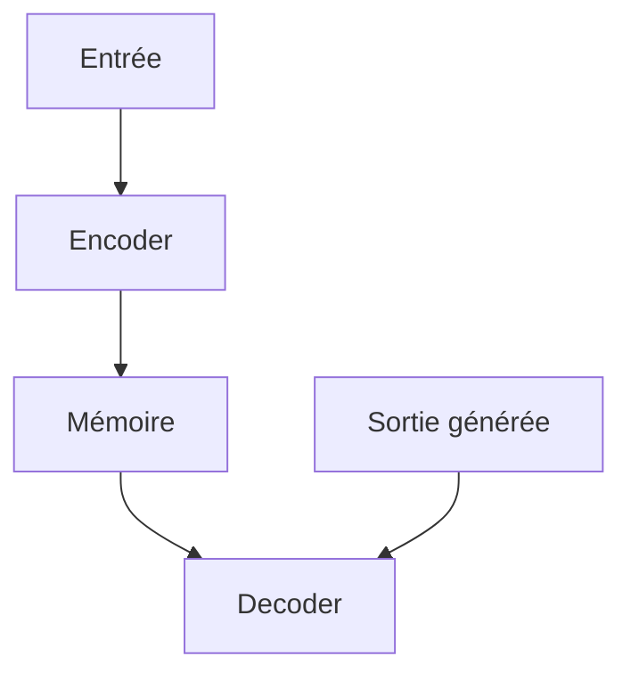

T5 généralise cette idée avec le paradigme text-to-text.

BART utilise une logique de débruitage.

---

## 30.20 Vision Transformers

Nous avons vu que les Transformers ne se limitent pas au texte.

Pour traiter une image, nous la découpons en patches.

Chaque patch devient un token visuel.

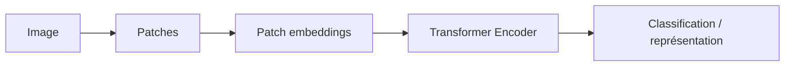

Le Vision Transformer montre que l’idée de séquence de tokens peut être étendue à la vision.

---

## 30.21 Transformers multimodaux

Les Transformers peuvent aussi combiner plusieurs modalités :

* texte ;
* image ;
* audio ;
* vidéo ;
* documents ;
* actions.

```mermaid
flowchart TD
    A["Texte"] --> E["Embeddings communs"]
    B["Image"] --> E
    C["Audio"] --> E
    D["Vidéo"] --> E
    E --> F["Transformer multimodal"]
```

La multimodalité cherche à aligner ou fusionner différentes formes de données.

C’est une direction centrale des modèles modernes.

---

## 30.22 Les LLM modernes

Un LLM moderne est généralement un grand Transformer entraîné sur d’immenses corpus.

Son objectif de base est souvent :

[
P(x_t \mid x_{<t})
]

Il apprend à prédire le prochain token.

```mermaid
flowchart TD
    A["Corpus massif"] --> B["Préentraînement"]
    B --> C["Modèle de base"]
    C --> D["Instruction tuning"]
    D --> E["Alignement"]
    E --> F["Assistant"]
```

Mais un assistant moderne n’est pas seulement un modèle préentraîné.

Il est aussi post-entraîné, aligné, évalué et intégré dans un système.

---

## 30.23 Scaling laws

Nous avons étudié l’idée des scaling laws.

La performance dépend notamment :

* du nombre de paramètres ;
* du volume de données ;
* du calcul disponible.

```mermaid
flowchart TD
    A["Performance"] --> B["Paramètres"]
    A --> C["Données"]
    A --> D["Calcul"]
```

Le passage à l’échelle a été un moteur majeur des progrès récents.

Mais il rencontre des limites économiques, énergétiques et techniques.

---

## 30.24 Instruction tuning

Le préentraînement apprend au modèle à compléter du texte.

L’instruction tuning apprend au modèle à suivre des consignes.

```mermaid
flowchart LR
    A["Modèle de base"] --> B["Exemples instruction-réponse"]
    B --> C["Modèle instruction-tuned"]
```

Cette étape est essentielle pour transformer un modèle de langage brut en assistant utile.

---

## 30.25 RLHF et préférences humaines

Le RLHF utilise des préférences humaines pour améliorer le comportement du modèle.

Pipeline typique :

```mermaid
flowchart TD
    A["Réponses candidates"] --> B["Préférences humaines"]
    B --> C["Reward model"]
    C --> D["Optimisation"]
    D --> E["Modèle aligné"]
```

Le RLHF améliore souvent :

* utilité ;
* clarté ;
* prudence ;
* suivi d’instructions.

Mais il ne garantit pas la vérité.

---

## 30.26 Hallucinations

Une hallucination est une réponse plausible mais fausse ou non supportée.

```mermaid
flowchart TD
    A["LLM génère"] --> B["Texte fluide"]
    B --> C{"Support factuel ?"}
    C -->|"Oui"| D["Réponse fiable"]
    C -->|"Non"| E["Hallucination"]
```

Les hallucinations sont une limite fondamentale des LLM.

Elles expliquent pourquoi nous avons besoin de :

* RAG ;
* outils ;
* citations ;
* vérification ;
* évaluation ;
* supervision humaine.

---

## 30.27 RAG

Le RAG ajoute une mémoire documentaire externe au LLM.

```mermaid
flowchart TD
    A["Question"] --> B["Retriever"]
    B --> C["Documents pertinents"]
    C --> D["Prompt enrichi"]
    D --> E["LLM"]
    E --> F["Réponse sourcée"]
```

Le RAG est utile lorsque nous voulons :

* répondre à partir de documents ;
* citer des sources ;
* utiliser des informations récentes ;
* interroger une base privée ;
* éviter de tout mettre dans les poids du modèle.

Le RAG transforme le LLM en composant d’un système documentaire.

---

## 30.28 Embeddings et recherche vectorielle

Le RAG repose souvent sur les embeddings.

Un texte devient un vecteur.

Deux textes proches sémantiquement doivent avoir des vecteurs proches.

```mermaid
flowchart LR
    A["Question"] --> B["Embedding"]
    C["Document"] --> D["Embedding"]
    B --> E["Similarité"]
    D --> E
```

La recherche vectorielle permet de récupérer des passages sémantiquement proches de la question.

Mais elle doit souvent être complétée par :

* recherche lexicale ;
* métadonnées ;
* reranking ;
* Graph RAG ;
* évaluation.

---

## 30.29 Agents et outils

Les LLM peuvent être connectés à des outils.

Ils peuvent alors :

* chercher ;
* calculer ;
* interroger une base ;
* appeler une API ;
* exécuter du code ;
* utiliser un calendrier ;
* générer des actions.

```mermaid
flowchart TD
    A["Utilisateur"] --> B["LLM"]
    B --> C{"Outil nécessaire ?"}
    C -->|"Oui"| D["Tool call"]
    D --> E["Observation"]
    E --> B
    C -->|"Non"| F["Réponse finale"]
```

Un agent est un système où le LLM choisit des actions, observe les résultats et continue.

Mais les agents doivent être fortement contrôlés.

---

## 30.30 Function calling

Le function calling permet au modèle de produire un appel structuré.

```json
{
  "function": "search_documents",
  "arguments": {
    "query": "préavis contrat maintenance"
  }
}
```

```mermaid
flowchart TD
    A["Langage naturel"] --> B["LLM"]
    B --> C["Appel structuré"]
    C --> D["Validation"]
    D --> E["Exécution"]
```

Cela permet de relier langage naturel et systèmes informatiques.

Le modèle propose.

Le système valide.

L’outil exécute.

---

## 30.31 Fine-tuning

Le fine-tuning adapte le modèle à un comportement, un style, un format ou une tâche.

```mermaid
flowchart TD
    A["Modèle préentraîné"] --> B["Données spécialisées"]
    B --> C["Fine-tuning"]
    C --> D["Modèle adapté"]
```

Nous avons distingué :

* fine-tuning complet ;
* adapters ;
* LoRA ;
* QLoRA ;
* distillation.

Le fine-tuning est utile pour apprendre une manière de répondre.

Mais il ne remplace pas toujours le RAG pour les connaissances documentaires.

---

## 30.32 Choisir entre prompting, RAG, fine-tuning et outils

Un point essentiel du cours est de savoir choisir la bonne stratégie.

```mermaid
flowchart TD
    A["Besoin"] --> B{"Nature du besoin ?"}
    B -->|"Guidage temporaire"| C["Prompting"]
    B -->|"Connaissance documentaire"| D["RAG"]
    B -->|"Style / format / comportement"| E["Fine-tuning"]
    B -->|"Calcul / action / vérification"| F["Outils"]
```

Cette décision est fondamentale en conception de systèmes LLM.

---

## 30.33 Évaluation

Un modèle non évalué n’est pas fiable.

Nous avons étudié plusieurs dimensions :

* accuracy ;
* precision ;
* recall ;
* F1 ;
* BLEU ;
* ROUGE ;
* faithfulness ;
* citation correctness ;
* recall@k ;
* robustesse ;
* sécurité ;
* coût ;
* latence.

```mermaid
flowchart TD
    A["Évaluation"] --> B["Classification"]
    A --> C["Génération"]
    A --> D["RAG"]
    A --> E["Agents"]
    A --> F["Sécurité"]
    A --> G["Production"]
```

L’évaluation doit correspondre au cas d’usage réel.

---

## 30.34 Évaluation du RAG

Pour un RAG, nous devons évaluer séparément :

* le retrieval ;
* la génération ;
* les citations ;
* la fidélité aux sources.

```mermaid
flowchart TD
    A["Question"] --> B["Retrieval"]
    B --> C["Sources"]
    C --> D["Génération"]
    D --> E["Réponse"]

    B --> F["Recall@k"]
    D --> G["Faithfulness"]
    E --> H["Citation correctness"]
```

Une mauvaise réponse peut venir du retriever ou du générateur.

Nous devons donc analyser la chaîne complète.

---

## 30.35 Déploiement

Un modèle évalué doit ensuite être industrialisé.

Nous avons étudié :

* serveur d’inférence ;
* API ;
* GPU ;
* VRAM ;
* quantization ;
* KV cache ;
* batching ;
* streaming ;
* monitoring ;
* logs ;
* sécurité ;
* coûts ;
* scalabilité.

```mermaid
flowchart TD
    A["Modèle"] --> B["Serveur d'inférence"]
    B --> C["API"]
    C --> D["Application"]
    D --> E["Utilisateurs"]

    B --> F["Monitoring"]
    B --> G["Logs"]
    B --> H["Sécurité"]
```

La production LLM est une discipline système.

Elle demande des compétences en machine learning, infrastructure, sécurité et produit.

---

## 30.36 Confidentialité et sécurité

Les systèmes LLM manipulent souvent des données sensibles.

Nous devons protéger :

* prompts ;
* documents ;
* logs ;
* embeddings ;
* réponses ;
* résultats d’outils ;
* traces d’agents.

```mermaid
flowchart TD
    A["Données LLM"] --> B["Prompts"]
    A --> C["Documents"]
    A --> D["Embeddings"]
    A --> E["Logs"]
    A --> F["Outils"]
```

Nous avons vu l’importance :

* du contrôle d’accès ;
* de la minimisation ;
* du chiffrement ;
* du filtrage ;
* du principe du moindre privilège ;
* de la séparation entre instructions et contenus externes.

---

## 30.37 Enjeux éthiques

Les Transformers et LLM soulèvent des enjeux importants :

* hallucinations ;
* biais ;
* droits d’auteur ;
* désinformation ;
* deepfakes ;
* automatisation du travail ;
* dépendance cognitive ;
* impact énergétique ;
* responsabilité ;
* contestabilité ;
* concentration du pouvoir.

```mermaid
flowchart TD
    A["LLM"] --> B["Risques techniques"]
    A --> C["Risques sociaux"]
    A --> D["Risques juridiques"]
    A --> E["Risques environnementaux"]
```

Ces enjeux ne sont pas extérieurs à l’informatique.

Ils font partie de la conception responsable des systèmes.

---

## 30.38 Gouvernance

Un système LLM sérieux nécessite une gouvernance.

Cela signifie définir :

* usages autorisés ;
* usages interdits ;
* responsabilités ;
* procédures ;
* évaluations ;
* audits ;
* gestion des incidents ;
* documentation ;
* validation humaine.

```mermaid
flowchart TD
    A["Système LLM"] --> B["Gouvernance"]
    B --> C["Règles"]
    B --> D["Responsabilités"]
    B --> E["Audit"]
    B --> F["Incidents"]
```

La gouvernance est indispensable dès que les systèmes ont un impact réel.

---

## 30.39 Perspectives futures

Nous avons étudié plusieurs directions futures :

* contexte long ;
* attention plus efficace ;
* modèles sparse ;
* Mixture of Experts ;
* petits modèles spécialisés ;
* RAG avancé ;
* Graph RAG ;
* agents contrôlés ;
* multimodalité avancée ;
* neuro-symbolique ;
* IA locale ;
* open-source ;
* systèmes composés.

```mermaid
mindmap
  root((Futur des Transformers))
    Efficacité
      Attention sparse
      Quantization
      Petits modèles
    Mémoire
      RAG
      Graph RAG
      Contexte long
    Agents
      Outils
      Workflows
      Vérification
    Multimodalité
      Image
      Audio
      Vidéo
    Gouvernance
      Sécurité
      Évaluation
      Responsabilité
```

L’avenir ne sera probablement pas seulement constitué de modèles plus grands.

Il sera aussi composé de systèmes mieux organisés.

---

## 30.40 Ce que nous devons retenir du papier *Attention Is All You Need*

Le papier *Attention Is All You Need* a apporté plusieurs idées fondamentales :

1. remplacer la récurrence par l’attention ;
2. paralléliser le traitement des séquences ;
3. utiliser la self-attention comme mécanisme central ;
4. empiler des blocs simples et efficaces ;
5. séparer encoder et decoder ;
6. utiliser positional encoding ;
7. montrer qu’une architecture sans RNN peut battre les approches dominantes en traduction.

```mermaid
flowchart TD
    A["Attention Is All You Need"] --> B["Self-attention"]
    A --> C["Multi-head attention"]
    A --> D["Positional encoding"]
    A --> E["Encoder-decoder"]
    A --> F["Parallélisation"]
    A --> G["Base des LLM modernes"]
```

Ce papier n’a pas seulement proposé une amélioration technique.

Il a changé la trajectoire de l’IA moderne.

---

## 30.41 L’idée la plus importante du cours

Si nous devions résumer le cours en une phrase :

> Les Transformers transforment des séquences de tokens en représentations contextualisées grâce à l’attention, et cette idée simple est devenue la base de modèles et systèmes capables de traiter du texte, des images, de l’audio, du code, des documents et des actions.

Cette idée se décline dans de nombreux systèmes.

```mermaid
flowchart LR
    A["Tokens"] --> B["Attention"]
    B --> C["Représentations contextualisées"]
    C --> D["Génération / compréhension / action"]
```

---

## 30.42 Les trois niveaux de compréhension

Pour maîtriser les Transformers, nous devons comprendre trois niveaux.

### Niveau 1 : mathématique

* tenseurs ;
* embeddings ;
* attention ;
* softmax ;
* projections ;
* loss.

### Niveau 2 : architectural

* encoder ;
* decoder ;
* BERT ;
* GPT ;
* T5 ;
* ViT ;
* multimodal.

### Niveau 3 : système

* RAG ;
* agents ;
* outils ;
* fine-tuning ;
* évaluation ;
* déploiement ;
* sécurité.

```mermaid
flowchart TD
    A["Maîtrise des Transformers"] --> B["Mathématiques"]
    A --> C["Architectures"]
    A --> D["Systèmes"]
```

Un étudiant de Master doit progressivement articuler ces trois niveaux.

---

## 30.43 Ce qu’il faut savoir expliquer simplement

À la fin du cours, nous devons être capables d’expliquer :

* ce qu’est un token ;
* ce qu’est un embedding ;
* ce qu’est l’attention ;
* pourquoi on divise par (\sqrt{d_k}) ;
* ce qu’est une tête d’attention ;
* ce qu’est un mask causal ;
* la différence entre BERT, GPT et T5 ;
* pourquoi les LLM hallucinent ;
* ce qu’est le RAG ;
* ce qu’est le fine-tuning ;
* ce qu’est LoRA ;
* pourquoi l’évaluation est difficile ;
* pourquoi le déploiement est coûteux ;
* pourquoi l’éthique est centrale.

```mermaid
flowchart TD
    A["Savoirs fondamentaux"] --> B["Attention"]
    A --> C["Architectures"]
    A --> D["LLM"]
    A --> E["RAG"]
    A --> F["Déploiement"]
    A --> G["Responsabilité"]
```

---

## 30.44 Ce qu’il faut savoir faire techniquement

Nous devons aussi savoir construire ou analyser :

* une tokenisation ;
* une matrice d’attention ;
* un mini-bloc Transformer ;
* un pipeline RAG ;
* une évaluation retrieval ;
* une sortie JSON validée ;
* une comparaison de modèles ;
* une architecture avec outils ;
* un plan de déploiement ;
* une analyse de risques.

```mermaid
flowchart TD
    A["Compétences pratiques"] --> B["Implémenter"]
    A --> C["Évaluer"]
    A --> D["Déployer"]
    A --> E["Sécuriser"]
    A --> F["Documenter"]
```

La compréhension théorique doit se traduire en compétences pratiques.

---

## 30.45 Erreurs conceptuelles à éviter

Nous devons éviter plusieurs erreurs.

### Erreur 1 : croire que le LLM sait tout

Il génère à partir de ses poids et de son contexte.

### Erreur 2 : confondre fluidité et vérité

Une réponse bien écrite peut être fausse.

### Erreur 3 : penser que le RAG supprime toutes les hallucinations

Le RAG réduit les risques, mais peut échouer.

### Erreur 4 : croire que plus grand est toujours meilleur

Le coût, la latence et le besoin réel comptent.

### Erreur 5 : donner trop de pouvoir aux agents

Un agent doit être limité et contrôlé.

### Erreur 6 : oublier l’évaluation

Un système non testé est dangereux.

```mermaid
flowchart TD
    A["Erreurs à éviter"] --> B["LLM omniscient"]
    A --> C["Fluidité = vérité"]
    A --> D["RAG magique"]
    A --> E["Plus grand = toujours mieux"]
    A --> F["Agent autonome sans contrôle"]
    A --> G["Pas d'évaluation"]
```

---

## 30.46 Une grille de décision pour concevoir un système LLM

Avant de construire un système, nous pouvons poser ces questions :

```mermaid
flowchart TD
    A["Projet LLM"] --> B{"Besoin de connaissances à jour ?"}
    B -->|"Oui"| C["RAG"]

    A --> D{"Besoin de calcul exact ?"}
    D -->|"Oui"| E["Outil"]

    A --> F{"Besoin de format stable ?"}
    F -->|"Oui"| G["Fine-tuning / validation"]

    A --> H{"Données sensibles ?"}
    H -->|"Oui"| I["Confidentialité / local / filtrage"]

    A --> J{"Action réelle ?"}
    J -->|"Oui"| K["Permissions / confirmation"]

    A --> L{"Impact élevé ?"}
    L -->|"Oui"| M["Évaluation forte / humain dans la boucle"]
```

Cette grille permet de passer de la théorie à la conception responsable.

---

## 30.47 Le rôle de l’informaticien

Dans ce domaine, l’informaticien ne doit pas être seulement un utilisateur de modèles.

Il doit être capable de :

* comprendre les mécanismes ;
* choisir les architectures ;
* évaluer les performances ;
* identifier les limites ;
* sécuriser les systèmes ;
* documenter ;
* expliquer ;
* alerter sur les risques ;
* concevoir des usages proportionnés.

```mermaid
flowchart TD
    A["Informaticien"] --> B["Comprendre"]
    A --> C["Construire"]
    A --> D["Évaluer"]
    A --> E["Sécuriser"]
    A --> F["Responsabiliser"]
```

La maîtrise technique implique une responsabilité professionnelle.

---

## 30.48 Synthèse finale : du token au système

Nous pouvons résumer tout le cours comme une progression.

```mermaid
flowchart TD
    A["Token"] --> B["Embedding"]
    B --> C["Attention"]
    C --> D["Bloc Transformer"]
    D --> E["Architecture"]
    E --> F["Modèle préentraîné"]
    F --> G["Assistant"]
    G --> H["RAG / outils"]
    H --> I["Système déployé"]
    I --> J["Évaluation"]
    J --> K["Gouvernance"]
```

Chaque niveau ajoute de la puissance, mais aussi de la complexité.

---

## 30.49 Synthèse finale : les trois dimensions d’un système Transformer

Un système moderne fondé sur les Transformers possède trois dimensions.

### Dimension modèle

* architecture ;
* paramètres ;
* entraînement ;
* fine-tuning ;
* inférence.

### Dimension système

* RAG ;
* outils ;
* API ;
* monitoring ;
* sécurité ;
* déploiement.

### Dimension sociale

* usages ;
* risques ;
* gouvernance ;
* responsabilité ;
* impact.

```mermaid
flowchart TD
    A["Système Transformer"] --> B["Modèle"]
    A --> C["Système"]
    A --> D["Société"]

    B --> B1["Architecture / entraînement"]
    C --> C1["RAG / outils / déploiement"]
    D --> D1["Éthique / responsabilité"]
```

Un bon ingénieur doit tenir les trois dimensions ensemble.

---

## 30.50 Conclusion générale

Les Transformers ont commencé comme une architecture pour améliorer la traduction automatique.

Avec *Attention Is All You Need*, l’idée d’utiliser l’attention comme mécanisme principal a ouvert une nouvelle période de l’intelligence artificielle.

Depuis, cette architecture a été adaptée :

* au langage ;
* au code ;
* aux images ;
* à l’audio ;
* à la vidéo ;
* aux documents ;
* aux systèmes multimodaux ;
* aux agents.

Mais le plus important à comprendre est que les Transformers modernes ne sont plus seulement des modèles.

Ils sont devenus des composants de systèmes complexes.

Ces systèmes combinent :

* modèles ;
* données ;
* mémoire externe ;
* outils ;
* évaluations ;
* humains ;
* infrastructures ;
* règles ;
* responsabilités.

Le Transformer est donc à la fois :

* une avancée mathématique ;
* une architecture logicielle ;
* une infrastructure industrielle ;
* un objet social et politique.

Pour un étudiant de Master en informatique, l’enjeu n’est pas seulement de savoir utiliser une API de LLM.

L’enjeu est de comprendre ce que fait le modèle, ce qu’il ne fait pas, comment l’intégrer correctement, comment l’évaluer, comment le sécuriser, et comment décider s’il est raisonnable de l’utiliser.

Le message final du cours est donc :

> Nous devons apprendre à construire des systèmes fondés sur les Transformers qui soient non seulement performants, mais aussi vérifiables, sobres, sécurisés, utiles et responsables.

---

## 30.51 Questions de synthèse finale

### 30.51.1 Question 1

Quelle est l’idée centrale du mécanisme d’attention ?

Réponse attendue : permettre à chaque token de pondérer les autres tokens du contexte pour construire une représentation contextualisée.

### 30.51.2 Question 2

Pourquoi le papier *Attention Is All You Need* est-il fondateur ?

Réponse attendue : parce qu’il propose une architecture de séquence sans récurrence, fondée principalement sur la self-attention et hautement parallélisable.

### 30.51.3 Question 3

Quelle est la différence entre encoder-only, decoder-only et encoder-decoder ?

Réponse attendue : encoder-only comprend une entrée complète, decoder-only génère autoregressivement, encoder-decoder transforme une entrée en sortie.

### 30.51.4 Question 4

Pourquoi les LLM modernes hallucinent-ils ?

Réponse attendue : parce qu’ils génèrent des suites probables de tokens sans garantie intrinsèque de vérité ou de source.

### 30.51.5 Question 5

Pourquoi le RAG est-il utile ?

Réponse attendue : parce qu’il fournit au modèle des documents externes pertinents, récents, privés ou sourçables.

### 30.51.6 Question 6

Pourquoi le fine-tuning ne remplace-t-il pas toujours le RAG ?

Réponse attendue : parce que le fine-tuning adapte le comportement du modèle, tandis que le RAG fournit des connaissances documentaires vérifiables et mises à jour.

### 30.51.7 Question 7

Pourquoi les agents LLM doivent-ils être contrôlés ?

Réponse attendue : parce qu’ils peuvent appeler des outils et déclencher des actions réelles, donc provoquer des erreurs ou des effets dangereux.

### 30.51.8 Question 8

Pourquoi l’évaluation est-elle indispensable ?

Réponse attendue : parce qu’un modèle peut sembler bon sur quelques exemples tout en échouant sur des cas limites, des sources, des formats, des hallucinations ou des risques de sécurité.

### 30.51.9 Question 9

Pourquoi le déploiement d’un LLM est-il une question système ?

Réponse attendue : parce qu’il faut gérer API, GPU, VRAM, latence, coût, monitoring, logs, sécurité, confidentialité et scalabilité.

### 30.51.10 Question 10

Quelle est la responsabilité principale de l’informaticien face aux Transformers ?

Réponse attendue : comprendre, évaluer, intégrer, sécuriser et gouverner ces systèmes de manière proportionnée et responsable.

---

## 30.52 Mot de fin

Nous avons terminé le parcours.

Nous avons commencé avec une phrase transformée en tokens.

Nous terminons avec des systèmes capables de lire, générer, chercher, agir, voir, écouter, s’adapter et être déployés à grande échelle.

Mais à chaque étape, une exigence demeure :

> Comprendre avant d’utiliser, évaluer avant de déployer, contrôler avant d’automatiser.

C’est cette exigence qui doit guider notre pratique des Transformers et des LLM.

---
> [!info] Livre « Les transformers » — chapitre 30/30
> [[Les transformers — Sommaire|Sommaire]] · [[Les transformers — 29 — Perspectives futures des Transformers|← 29 — Perspectives futures des Transformers]] · [[Les transformers — Compléments 2026|Compléments 2026 →]]
