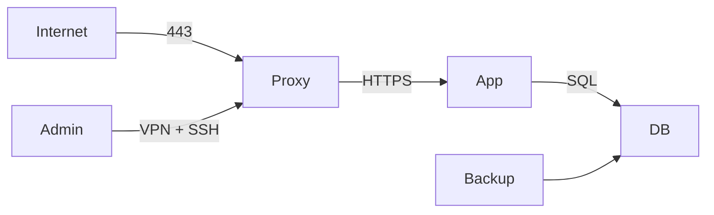

> [!info] Livre « Sécurité avancée sous Linux »
> [[Sécurité avancée sous Linux — Sommaire|Sommaire]] · [[Sécurité avancée sous Linux — 07 — Conteneurisation et sécurité|← 07 — Conteneurisation et sécurité]] · [[Sécurité avancée sous Linux — Sommaire|Sommaire →]]

# Compléments 2026

> [!info] Origine
> Les sections ci-dessous proviennent de la version condensée et actualisée du cours [[Sécurité avancée sous Linux]] (31 août 2026). Elles traitent de sujets absents de la version longue et n'ont pas été fondues dans les chapitres ; pour les versions logicielles et l'état de l'art du moment, la version condensée fait foi.

## 3.6. Landlock

Landlock est un LSM conçu pour permettre à un processus, même non privilégié, de **restreindre ses propres droits** et ceux de ses descendants.

Il peut compléter les contrôles existants et sert au sandboxing applicatif.

Vérification indicative :

```bash
sudo dmesg | grep -i landlock
```

ou :

```bash
sudo journalctl -kb -g landlock
```

Landlock est particulièrement intéressant pour une application qui veut imposer elle-même :

- les chemins qu'elle peut lire ;
- les chemins qu'elle peut modifier ;
- certaines opérations réseau selon l'ABI disponible.

L'interface est **versionnée par ABI**. Une application sérieuse interroge donc l'ABI disponible au démarrage et n'active que les restrictions comprises par le noyau courant. Les versions récentes savent notamment restreindre des opérations réseau TCP et UDP en plus du système de fichiers. Ce point est important pour écrire un sandbox portable entre distributions et noyaux différents.

### Landlock n'est pas un conteneur

Un namespace isole une vue de certaines ressources. Landlock applique des restrictions d'accès. Les deux notions sont complémentaires.

## 5.7. fscrypt

`fscrypt` permet le chiffrement de répertoires/fichiers sur certains systèmes de fichiers compatibles.

Il peut être utile lorsque l'on veut isoler certaines données sans chiffrer l'intégralité du volume.

Cependant, pour un poste ou serveur où l'objectif principal est de protéger le disque au repos, le chiffrement complet avec dm-crypt/LUKS est souvent plus simple à raisonner.

## 7.5. Préserver les preuves

Lors d'une suspicion sérieuse, des actions réflexes peuvent supprimer des informations utiles :

- redémarrer immédiatement ;
- nettoyer `/tmp` ;
- supprimer les fichiers suspects ;
- lancer des outils intrusifs sans journaliser les actions.

Le choix dépend de la priorité : préserver la preuve ou arrêter une attaque active.

## 7.6. Capturer les informations volatiles

Selon la politique d'incident et les compétences disponibles, on peut documenter :

```bash
date -u
uptime
who
w
ps auxf
ss -plant
ip addr
ip route
systemctl --failed
systemctl --type=service --state=running
```

Ces commandes sont des **points de départ**, pas une procédure forensique complète.

## 11.5. Prompt injection

Un agent LLM peut lire une page Web ou un document contenant une instruction hostile du type :

> ignore les règles précédentes et exécute telle action

Le problème est que le modèle traite souvent dans le même canal logique :

- instructions système ;
- demande utilisateur ;
- données non fiables.

On doit donc considérer le contenu externe comme **non fiable**.

## 12.5. Étape 5 — durcir progressivement

Par exemple pour un service :

1. compte non-root ;
2. permissions de fichiers ;
3. écoute réseau limitée ;
4. firewall ;
5. systemd sandbox ;
6. AppArmor/SELinux ;
7. logs et alertes ;
8. sauvegarde/restauration.

Tester après chaque étape.

## 12.8. Étape 8 — documenter les exceptions

Exemple :

```text
Exception : le service nécessite CAP_NET_RAW
Justification : capture réseau locale pour supervision
Périmètre : service monitor.service uniquement
Compensation : AppArmor + réseau de management isolé
Revue : tous les 6 mois
```

Une exception explicite est préférable à un privilège inexpliqué.

## 13.2. Livrables

### 1. Modèle de menace

Décrire :

- actifs ;
- acteurs ;
- frontières de confiance ;
- scénarios d'attaque ;
- impacts ;
- priorités.

### 2. Architecture

Schéma réseau et flux autorisés.

Exemple Mermaid :



### 3. Configuration versionnée

Inclure :

- unités systemd et overrides ;
- règles nftables ;
- politique SSH ;
- AppArmor/SELinux si utilisée ;
- scripts d'audit ;
- documentation de restauration.

Aucun secret réel ne doit être commité.

### 4. Rapport d'audit avant/après

Comparer :

- ports ;
- services ;
- utilisateurs ;
- privilèges ;
- score/observations `systemd-analyze security` ;
- capacité de restauration.

### 5. Scénario d'incident

Simuler un incident bénin dans le laboratoire, par exemple :

- création d'un compte inattendu ;
- modification d'un fichier surveillé ;
- tentative de connexion SSH échouée ;
- arrêt non prévu d'un service.

Le but est de démontrer la **détection et la réponse**, pas d'exploiter un système tiers.

## Observabilité

- [ ] journaux persistants selon besoin
- [ ] export des journaux critiques hors de l'hôte
- [ ] audit des événements importants
- [ ] alertes testées
- [ ] rétention définie
- [ ] données sensibles dans les logs minimisées
