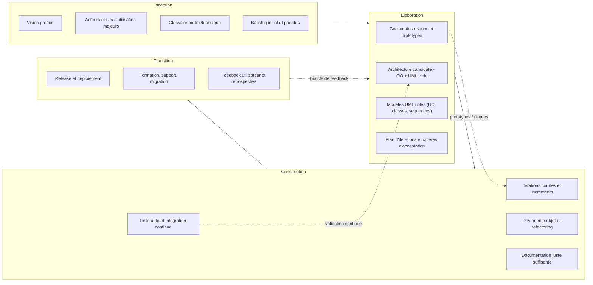

# 1. Origine de l’AUP

- Créé par **Scott Ambler (2005)**, l’Agile Unified Process est une **adaptation allégée** du **Rational Unified Process (RUP)**.
    
- Il conserve la structure du RUP (inception, élaboration, construction, transition), mais applique les **valeurs du Manifeste Agile (2001)** :
    
    - Interaction plutôt que processus lourds.
    - Logiciel fonctionnel plutôt que documentation exhaustive.
    - Collaboration avec le client plutôt que négociation contractuelle.
    - Adaptation plutôt que suivi d’un plan figé.

# 2. Principes fondamentaux de l’AUP

### 2.1. Itératif et incrémental

- Le projet est découpé en **itérations courtes** (souvent 2 à 6 semaines).
- Chaque itération livre une **version fonctionnelle** du système.
- Le cycle global (inception → élaboration → construction → transition) est **parcouru plusieurs fois** à petite échelle.

### 2.2. Minimalisme documentaire

- Documentation réduite au **minimum utile**.
- UML est utilisé, mais de manière pragmatique (juste les diagrammes nécessaires pour communiquer).
- Les artefacts lourds du RUP sont allégés ou remplacés par des outils collaboratifs (wiki, tickets, user stories).

### 2.3. Automatisation et qualité

- Tests unitaires, intégration continue et refactorings font partie du processus.
- Forte attention à la **qualité du code** et à la **maintenabilité**.

### 2.4. Adaptabilité

- Les exigences peuvent **évoluer** en cours de projet (contrairement au cycle en V ou au Y, trop rigides).
- La planification est **progressive**, revue à chaque itération.

# 3. Les disciplines de l’AUP

L’AUP reprend les disciplines du RUP, mais en simplifiant.

### 3.1. Disciplines principales

1. **Modélisation**
    
    - Compréhension du domaine métier et conception orientée objet.
    - UML utilisé de manière pragmatique (diagrammes de cas d’utilisation, classes, séquences).
    - Glossaire métier et technique.
    
2. **Implémentation**
    
    - Développement orienté objet, codage par binôme possible (XP).
    - Respect du guide de nommage et des conventions de l’équipe.
    
3. **Tests**
    
    - Automatisation des tests unitaires et fonctionnels.
    - Tests à chaque itération, pas seulement à la fin.
    - Validation continue de la qualité architecturale.
    
4. **Déploiement**
    
    - Livraison fréquente (chaque itération produit une version exécutable).
    - Usage d’outils d’intégration et de déploiement continus.

### 3.2. Disciplines de support

1. **Gestion de configuration** (code, documentation, modèles versionnés avec Git).
2. **Gestion de projet** (planification légère, pilotée par la valeur métier, souvent via Kanban ou Scrum).
3. **Environnement** (mise en place des outils de développement, tests, CI/CD).

# 4. Les phases de l’AUP

Comme dans le RUP, on retrouve 4 grandes phases, mais plus **agiles et itératives** :

1. **Inception**
    
    - Compréhension du besoin, identification des acteurs et cas d’utilisation principaux.
    - Vision partagée du projet, définition des priorités.
    - Exemple : définir les grandes fonctionnalités de la bibliothèque numérique (emprunt, dépôt, modération).
    
2. **Élaboration**
    
    - Mise en place de l’architecture logicielle de base.
    - Définition des scénarios critiques.
    - Conception UML simplifiée (classes principales, diagramme d’architecture).
        
3. **Construction**
    
    - Développement itératif et incrémental des fonctionnalités.
    - Chaque itération livre un **logiciel utilisable**.
    - Tests automatisés intégrés dans le cycle.
        
4. **Transition**
    
    - Livraison finale au client.
    - Formation, documentation minimale, retours utilisateurs.
    - Stabilisation du produit.
        

Contrairement au RUP, ces phases ne sont pas strictement séquentielles : elles se recouvrent et reviennent à petite échelle dans chaque itération.

# 5. Avantages de l’AUP

- **Agile mais structuré** → combine l’OO, UML et la rigueur d’UP avec la souplesse de l’agile.
- **Itératif** → feedback rapide du client.
- **Pragmatique** → élimine la lourdeur documentaire du RUP.
- **Qualité intégrée** → tests et refactorings dès le début.
- **Adapté à l’enseignement** → garde les modèles UML et l’OO comme outils pédagogiques, tout en exposant les étudiants aux pratiques agiles modernes.

# 6. Limites de l’AUP

- Moins répandu que Scrum ou SAFe → peu d’outils/communautés.
- Peut sembler « hybride bancal » si mal appliqué : trop lourd pour les agiles purs, trop léger pour les traditionnels.
- Repose fortement sur la **discipline de l’équipe** (risque de dérive vers « no doc, no process »).

# 7. Schéma de synthèse

```
         Vision            Architecture          Construction         Livraison
      +-----------+     +----------------+     +---------------+     +-----------+
      | Inception | --> | Élaboration    | --> | Construction  | --> | Transition|
      +-----------+     +----------------+     +---------------+     +-----------+
          |                   |                     |                    |
          v                   v                     v                    v
      Cas d’utilisation   Design OO UML        Dév. itératif        Livraison
      Glossaire métier    Prototype archi      Tests auto           Support
```



Chaque bloc est **itératif**, produit un livrable concret, et reste ouvert à l’adaptation.
