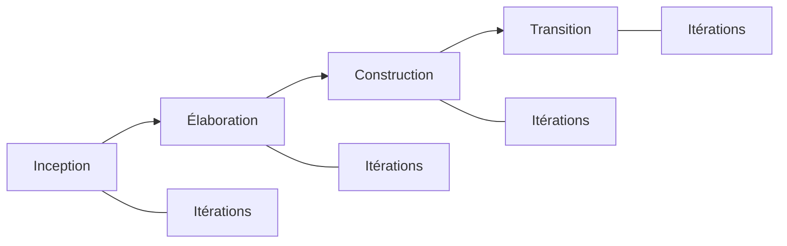
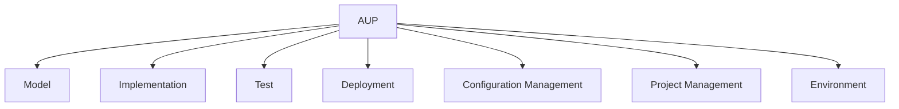
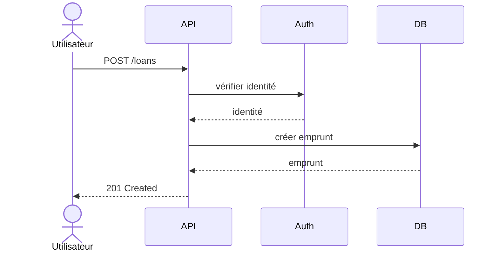

# Agile Unified Process (AUP)

> [!abstract] Objectif du cours
> Comprendre l'**Agile Unified Process (AUP)** comme une adaptation légère du Unified Process, savoir utiliser ses **quatre phases**, ses **sept disciplines**, son approche **itérative et incrémentale** et son pilotage par les risques, puis savoir transposer ses idées dans un projet logiciel moderne utilisant Git, CI/CD, observabilité et pratiques agiles contemporaines.

> [!important] Positionnement en 2026
> AUP est surtout un **cadre historique et pédagogique**. Il n'est plus activement développé comme méthode autonome. Scott Ambler a ensuite co-créé **Disciplined Agile (DA)** avec Mark Lines en 2012. AUP reste néanmoins intéressant pour comprendre comment combiner une structure de cycle de vie explicite avec des pratiques agiles et une architecture pilotée par les risques.

## Sommaire

1. Origines et positionnement
2. Famille Unified Process
3. Les idées fondamentales de l'AUP
4. Cycle de vie : les quatre phases
5. Les jalons majeurs
6. Les sept disciplines
7. Itérations et incréments
8. Pilotage par les risques
9. Exigences et valeur métier
10. Modélisation agile
11. Architecture et élaboration
12. Implémentation
13. Tests et qualité
14. Déploiement
15. Gestion de configuration
16. Gestion de projet
17. Environnement et outillage
18. Artefacts : documentation juste suffisante
19. Rôles et responsabilités
20. Planification d'un projet AUP
21. AUP et DevOps moderne
22. Métriques et pilotage
23. Travail distribué et asynchrone
24. IA générative et agents
25. Comparaison avec RUP, Scrum, Kanban, XP, OpenUP et DA
26. Quand utiliser AUP ?
27. Anti-patterns et erreurs fréquentes
28. Étude de cas complète
29. Travaux pratiques
30. Projet final
31. Checklists
32. Glossaire
33. Références

---

# 1. Origines et positionnement

## 1.1. De l'Unified Process à l'AUP

L'**Agile Unified Process** est une adaptation simplifiée du **Rational Unified Process (RUP)** proposée par **Scott W. Ambler** au milieu des années 2000.

L'objectif n'était pas de jeter le Unified Process, mais de conserver ses idées les plus utiles :

- développement **itératif** ;
- développement **incrémental** ;
- prise en compte explicite des **risques** ;
- importance de l'**architecture** ;
- découpage en quatre grandes phases ;
- disciplines techniques menées en parallèle ;

...tout en supprimant une partie importante de la lourdeur méthodologique et documentaire associée à certaines mises en œuvre du RUP.

## 1.2. Influence du Manifeste Agile

AUP applique les valeurs du [[Les méthodes agiles|Manifeste Agile]] :

| Valeur agile | Conséquence dans AUP |
|---|---|
| Individus et interactions | processus léger, collaboration directe |
| Logiciel opérationnel | incrément exécutable à chaque itération |
| Collaboration avec le client | participation active des parties prenantes |
| Adaptation au changement | planification révisée au fil des itérations |

AUP ne signifie donc pas :

> « RUP avec moins de documents ».

Il s'agit plutôt de :

> conserver la structure utile du Unified Process en appliquant une philosophie agile, pragmatique et orientée livraison.

## 1.3. AUP aujourd'hui

AUP n'est plus un framework en évolution active.

À partir de 2012, Scott Ambler et Mark Lines ont développé **Disciplined Agile Delivery**, devenu ensuite une partie du toolkit **Disciplined Agile**.

En 2026, PMI présente Disciplined Agile comme une approche permettant de choisir un **Way of Working** adapté au contexte.

Il est donc utile de voir :

```text
Unified Process
     |
     +--> Rational Unified Process (RUP)
     |
     +--> Agile Unified Process (AUP)
     |       |
     |       +--> influence historique
     |               |
     |               v
     |        Disciplined Agile
     |
     +--> OpenUP
```

AUP reste particulièrement intéressant :

- en enseignement ;
- dans les projets où une gouvernance par phases reste utile ;
- dans les projets techniques à risque architectural ;
- comme pont entre méthodes prédictives et agiles.

---

# 2. Famille Unified Process

## 2.1. Le Unified Process

Le **Unified Process (UP)** est une famille de processus de développement logiciel fondés sur trois idées fortes :

1. **itératif et incrémental** ;
2. **piloté par les risques** ;
3. **centré sur l'architecture**.

Historiquement, il est également fortement associé aux **cas d'utilisation** et à la modélisation objet.

## 2.2. RUP

Le **Rational Unified Process** est une mise en œuvre détaillée et industrialisée de ces idées.

Il propose :

- de nombreux rôles ;
- de nombreuses activités ;
- de nombreux artefacts ;
- une forte personnalisation possible ;
- des outils et guides associés.

Le problème n'est pas que RUP impose nécessairement beaucoup de documents : RUP est configurable. En pratique, certaines organisations l'ont cependant appliqué de façon très lourde.

## 2.3. AUP

AUP simplifie fortement ce modèle.

Il conserve :

- 4 phases ;
- 7 disciplines ;
- les itérations ;
- les risques ;
- l'architecture ;
- la qualité continue.

Il encourage :

- des modèles **juste suffisants** ;
- une documentation courte ;
- les tests automatisés ;
- le refactoring ;
- la livraison fréquente ;
- la participation active des parties prenantes.

---

# 3. Les idées fondamentales de l'AUP

## 3.1. « Serial in the large, iterative in the small »

Une formule fréquemment associée à AUP est :

> **serial in the large, iterative in the small**.

À grande échelle, le projet traverse les quatre phases :

```text
Inception -> Élaboration -> Construction -> Transition
```

Mais **chaque phase peut contenir plusieurs itérations**.

Il ne faut donc pas représenter AUP comme un cycle en cascade.


```mermaid
flowchart LR
    I[Inception] --> E[Élaboration]
    E --> C[Construction]
    C --> T[Transition]

    I --- I1[Itérations]
    E --- E1[Itérations]
    C --- C1[Itérations]
    T --- T1[Itérations]
```

## 3.2. Incrémental

Une itération doit produire un résultat observable :

- logiciel exécutable ;
- prototype ;
- amélioration d'architecture ;
- scénario métier complet ;
- version déployable.

Le projet ne se contente pas de produire des documents jusqu'à la phase de construction.

## 3.3. Piloté par les risques

Une fonctionnalité n'est pas priorisée uniquement parce qu'elle apporte beaucoup de valeur.

Un travail peut être prioritaire parce qu'il réduit un risque majeur :

- performance ;
- sécurité ;
- technologie inconnue ;
- intégration externe ;
- migration de données ;
- architecture distribuée.

On peut résumer :

```text
Priorité ≈ valeur + risque + dépendances + apprentissage
```

## 3.4. Architecture suffisamment tôt

AUP ne recommande pas un **Big Design Up Front**.

Il recommande en revanche de ne pas attendre la fin du projet pour découvrir que l'architecture ne tient pas.

L'élaboration sert donc à établir une architecture **suffisamment crédible pour réduire les risques structurants**.

## 3.5. Documentation juste suffisante

La documentation doit exister lorsqu'elle :

- facilite une décision ;
- réduit un risque ;
- transmet une connaissance ;
- permet d'exploiter le système ;
- est requise réglementairement ;
- évite une ambiguïté coûteuse.

Elle ne doit pas devenir un objectif en soi.

---

# 4. Cycle de vie : les quatre phases

Les quatre phases de l'AUP sont héritées du Unified Process :

1. **Inception** ;
2. **Élaboration** ;
3. **Construction** ;
4. **Transition**.

Une phase ne correspond pas à une discipline.

Par exemple, on ne fait pas :

```text
Inception = exigences
Élaboration = conception
Construction = code
Transition = tests
```

Ceci recréerait un cycle en cascade.

Toutes les disciplines peuvent être actives dans toutes les phases, avec des intensités différentes.

```mermaid
xychart-beta
    title "Intensité indicative des activités"
    x-axis [Inception, Élaboration, Construction, Transition]
    y-axis "Intensité" 0 --> 10
    line [8,6,3,2]
    line [3,9,6,3]
    line [2,5,10,5]
    line [2,4,8,10]
```

> [!note]
> Le graphique est pédagogique : il illustre des tendances, pas des pourcentages imposés par AUP.

---

# 5. Les jalons majeurs

Les phases du Unified Process sont traditionnellement associées à quatre jalons.

| Phase | Jalon | Question principale |
|---|---|---|
| Inception | Lifecycle Objectives (LCO) | savons-nous pourquoi et quoi construire ? |
| Élaboration | Lifecycle Architecture (LCA) | l'architecture et les risques principaux sont-ils maîtrisés ? |
| Construction | Initial Operational Capability (IOC) | le produit est-il assez complet pour être exploité/testé sérieusement ? |
| Transition | Product Release (PR) | le produit est-il prêt pour ses utilisateurs ? |

## 5.1. Lifecycle Objectives

À la fin de l'inception, on doit raisonnablement connaître :

- le problème à résoudre ;
- les parties prenantes ;
- le périmètre ;
- les principaux scénarios ;
- les risques majeurs ;
- une estimation grossière ;
- les critères de succès.

Le jalon est aussi un **Go / No Go**.

## 5.2. Lifecycle Architecture

À la fin de l'élaboration :

- les risques architecturaux principaux ont été attaqués ;
- les choix structurants ont été expérimentés ;
- les scénarios les plus risqués traversent l'architecture ;
- la construction peut être engagée avec une confiance raisonnable.

## 5.3. Initial Operational Capability

À la fin de la construction :

- le système est fonctionnel ;
- la plupart des exigences importantes sont couvertes ;
- le logiciel peut être déployé dans un environnement réaliste ;
- les principaux défauts bloquants sont maîtrisés.

## 5.4. Product Release

À la fin de la transition :

- déploiement terminé ;
- migration effectuée ;
- documentation d'exploitation disponible ;
- utilisateurs accompagnés ;
- incidents de lancement traités ;
- transfert vers l'exploitation réalisé.

---

# 6. Les sept disciplines

AUP retient sept disciplines :

1. **Model** ;
2. **Implementation** ;
3. **Test** ;
4. **Deployment** ;
5. **Configuration Management** ;
6. **Project Management** ;
7. **Environment**.


```mermaid
flowchart TB
    A[AUP]
    A --> M[Model]
    A --> I[Implementation]
    A --> T[Test]
    A --> D[Deployment]
    A --> C[Configuration Management]
    A --> P[Project Management]
    A --> E[Environment]
```

## 6.1. Model

Objectif : comprendre :

- l'organisation ;
- le domaine métier ;
- le problème ;
- les besoins ;
- les options de solution.

Cela peut inclure :

- user stories ;
- cas d'utilisation ;
- event storming ;
- diagrammes UML ;
- modèle de domaine ;
- prototypes ;
- ADR.

## 6.2. Implementation

Objectif : transformer les idées en logiciel exécutable.

Pratiques modernes :

- programmation par petites étapes ;
- revue de code ;
- pair/mob programming ;
- TDD lorsque pertinent ;
- refactoring ;
- trunk-based development ;
- feature flags.

## 6.3. Test

Les tests ne constituent pas une phase tardive.

Ils couvrent :

- tests unitaires ;
- intégration ;
- contrats ;
- end-to-end ;
- sécurité ;
- performance ;
- acceptation.

## 6.4. Deployment

Le déploiement comprend :

- packaging ;
- automatisation ;
- infrastructure ;
- migration de données ;
- release ;
- rollback ;
- observabilité ;
- exploitation.

## 6.5. Configuration Management

Elle couvre :

- versionnement Git ;
- gestion des branches ;
- dépendances ;
- configuration ;
- artefacts binaires ;
- release tags ;
- traçabilité ;
- infrastructure as code.

## 6.6. Project Management

Le rôle n'est pas de produire un plan figé.

Il s'agit de :

- gérer les risques ;
- organiser les itérations ;
- suivre la valeur ;
- gérer les dépendances ;
- faciliter les décisions ;
- maintenir une vision réaliste.

## 6.7. Environment

Cette discipline fournit l'environnement permettant aux autres de fonctionner :

- CI/CD ;
- conventions ;
- templates ;
- environnements de développement ;
- observabilité ;
- outils de tests ;
- documentation ;
- politiques de sécurité.

---

# 7. Itérations et incréments

## 7.1. Une itération n'est pas un mini-cycle en V

Mauvaise interprétation :

```text
Jour 1-2 : analyse
Jour 3-4 : design
Jour 5-8 : code
Jour 9-10 : tests
```

Meilleure approche :

```text
modéliser -> coder -> tester -> apprendre
      ^                       |
      +-----------------------+
```

plusieurs fois pendant l'itération.

## 7.2. Durée

AUP ne nécessite pas une durée universelle.

Une équipe peut choisir :

- 1 semaine ;
- 2 semaines ;
- 3 semaines ;
- 4 semaines.

Les itérations très longues augmentent le coût du feedback.

## 7.3. Critère de fin

À la fin d'une itération, on doit pouvoir répondre :

- qu'avons-nous appris ?
- quelle valeur est disponible ?
- quel risque a diminué ?
- le logiciel fonctionne-t-il ?
- quelle est la prochaine hypothèse importante ?

## 7.4. Definition of Done moderne

AUP ne prescrit pas la Definition of Done de Scrum, mais une équipe moderne peut en utiliser une.

Exemple :

- code revu ;
- tests automatiques verts ;
- sécurité de base vérifiée ;
- migrations testées ;
- documentation utile mise à jour ;
- observable en production ;
- déployable automatiquement.

---

# 8. Pilotage par les risques

## 8.1. Pourquoi les risques sont centraux

Dans un projet logiciel, l'inconnu coûte souvent plus cher que la quantité de code.

Exemples :

- « cette API supportera-t-elle notre charge ? » ;
- « peut-on migrer 2 To de données sans interruption ? » ;
- « le fournisseur autorise-t-il ce flux ? » ;
- « cette architecture répond-elle au SLA ? ».

AUP encourage à traiter ces questions tôt.

## 8.2. Risk register léger

| Risque | Probabilité | Impact | Action | Échéance |
|---|---:|---:|---|---|
| API tierce limitée | forte | fort | prototype de charge | Élaboration |
| migration complexe | moyenne | fort | dry-run + rollback | Élaboration |
| UX incertaine | moyenne | moyen | test utilisateur | Inception |

## 8.3. Spike

Un **spike** est une expérimentation limitée visant à réduire une incertitude.

Il doit répondre à une question précise.

Mauvais :

> Étudier Kubernetes.

Meilleur :

> Vérifier si un déploiement blue/green de notre API peut être réalisé sans interruption avec notre base actuelle.

---

# 9. Exigences et valeur métier

## 9.1. Cas d'utilisation et user stories

AUP vient d'une famille historiquement centrée sur les **use cases**.

Une équipe moderne peut cependant combiner :

- vision produit ;
- user stories ;
- use cases pour les scénarios complexes ;
- critères d'acceptation ;
- exemples métier.

## 9.2. Cas d'utilisation

Exemple :

```text
Cas : Emprunter un livre numérique
Acteur principal : Lecteur
Précondition : compte actif
Scénario nominal :
  1. Le lecteur choisit un ouvrage.
  2. Le système vérifie ses droits.
  3. Le système crée l'emprunt.
  4. Le lecteur reçoit l'accès.
Exceptions :
  - quota atteint ;
  - licence indisponible ;
  - compte suspendu.
```

Le cas d'utilisation est utile lorsqu'il faut explorer les variantes et interactions.

## 9.3. Priorisation

On peut combiner :

- valeur métier ;
- risque ;
- urgence ;
- dépendance ;
- coût ;
- apprentissage.

AUP ne prescrit pas WSJF, MoSCoW ou RICE, mais rien n'empêche de les utiliser.

---

# 10. Modélisation agile

## 10.1. Agile Modeling

Scott Ambler est également associé à **Agile Modeling**.

Le principe :

> modéliser juste assez pour comprendre et décider, puis retourner rapidement au logiciel exécutable.

## 10.2. Model storming

Une séance courte de modélisation peut durer 10 à 30 minutes.

Exemple :


```mermaid
sequenceDiagram
    actor U as Utilisateur
    participant API
    participant Auth
    participant DB

    U->>API: POST /loans
    API->>Auth: vérifier identité
    Auth-->>API: identité
    API->>DB: créer emprunt
    DB-->>API: emprunt
    API-->>U: 201 Created
```

Le diagramme sert à une décision immédiate.

Il n'a pas vocation à devenir une représentation exhaustive de tout le système.

## 10.3. Modèle jetable vs modèle durable

**Jetable** : tableau blanc utilisé pour clarifier une discussion.

**Durable** : C4, ADR ou diagramme d'architecture dont l'équipe aura encore besoin dans six mois.

Tous les modèles ne doivent donc pas être versionnés.

---

# 11. Architecture et élaboration

## 11.1. But de l'élaboration

L'élaboration doit attaquer les risques architecturaux majeurs.

Exemple : une application doit absorber 20 000 connexions simultanées.

L'élaboration ne consiste pas simplement à produire :

- un diagramme de classes ;
- un document de 80 pages.

Elle consiste à **démontrer** que l'architecture choisie est crédible.

## 11.2. Architecture exécutable

Une bonne preuve est souvent un **walking skeleton** :

```text
UI -> API -> service -> base -> observabilité -> déploiement
```

même si la logique métier reste minimale.

## 11.3. ADR

Exemple :

```markdown
# ADR-004 - PostgreSQL comme base transactionnelle

## Contexte
Nous avons besoin de transactions fortes et de requêtes analytiques modérées.

## Décision
Utiliser PostgreSQL.

## Conséquences
+ transactions ACID
+ expertise interne
- exploitation plus complexe que SQLite
```

L'ADR est souvent plus utile qu'un long document d'architecture figé.

---

# 12. Implémentation

## 12.1. Boucle courte

Une boucle moderne peut être :

```text
petit changement
    |
    v
tests locaux
    |
    v
commit
    |
    v
CI
    |
    v
review
    |
    v
merge
```

## 12.2. Refactoring

AUP valorise le refactoring comme moyen de maintenir la capacité d'évolution.

On évite deux extrêmes :

- architecture parfaite avant de coder ;
- architecture laissée se dégrader indéfiniment.

## 12.3. Trunk-based development

Pour une équipe moderne, des branches courtes facilitent :

- intégration continue ;
- réduction des conflits ;
- feedback rapide.

Les changements incomplets peuvent être protégés par feature flags.

---

# 13. Tests et qualité

## 13.1. Qualité continue

La qualité n'est pas une activité de fin de projet.

Une stratégie typique :

```text
              E2E
            /     \
       intégration
      /             \
   unitaires / composants
```

Le nombre exact de tests par niveau dépend du système.

## 13.2. Tests de risques

Pendant l'élaboration, les tests doivent viser les risques :

- charge ;
- latence ;
- sécurité ;
- résilience ;
- compatibilité ;
- récupération.

## 13.3. Quality gates

Exemple CI :

```yaml
stages:
  - test
  - security
  - build

unit-tests:
  stage: test
  script:
    - pytest

lint:
  stage: test
  script:
    - ruff check .

security:
  stage: security
  script:
    - pip-audit
```

Le pipeline n'est pas « AUP » en soi : il est une traduction moderne de ses objectifs de qualité continue.

---

# 14. Déploiement

## 14.1. Déployer tôt

Une erreur classique est de conserver le vrai déploiement pour la transition.

AUP moderne devrait au contraire tester le mécanisme de déploiement très tôt.

La **Transition** met l'accent sur l'adoption et la mise en production finale ; elle n'interdit pas les déploiements précédents.

## 14.2. Progressive delivery

Pratiques utiles :

- feature flags ;
- canary ;
- blue/green ;
- progressive rollout ;
- rollback automatisé.

## 14.3. Migration de données

La migration est souvent l'un des risques les plus élevés.

On doit tester :

1. sauvegarde ;
2. migration ;
3. validation ;
4. rollback ;
5. temps nécessaire.

---

# 15. Gestion de configuration

## 15.1. Git

Voir [[git]].

Tous les artefacts qui bénéficient d'un historique doivent idéalement être versionnés :

- code ;
- tests ;
- configuration ;
- infrastructure ;
- documentation ;
- ADR ;
- migrations.

## 15.2. Artefacts binaires

Les gros modèles, datasets ou binaires peuvent nécessiter :

- registry OCI ;
- object storage ;
- Git LFS ;
- Git Xet ;
- dépôt de packages.

## 15.3. Configuration par environnement

Éviter :

```text
config-prod-final-v2-really-final.ini
```

Préférer :

- configuration déclarative ;
- secrets séparés ;
- Infrastructure as Code ;
- promotion contrôlée entre environnements.

---

# 16. Gestion de projet

## 16.1. Planifier sans prédire artificiellement

Un plan AUP n'est pas un engagement à connaître précisément les six prochains mois.

On peut distinguer :

```text
vision long terme       -> grossière
phase courante          -> détaillée
itération suivante      -> très détaillée
```

C'est une forme de **rolling-wave planning**.

## 16.2. Pilotage par objectifs

Une phase doit avoir un objectif clair.

Exemple d'élaboration :

> Prouver que l'architecture permet 5 000 requêtes/s, valider l'authentification OIDC et tester la migration des données historiques.

C'est plus utile que :

> terminer les tickets 381 à 426.

## 16.3. Gestion des risques

Revue régulière :

- risques nouveaux ;
- risques réduits ;
- hypothèses invalidées ;
- décisions à prendre.

---

# 17. Environnement et outillage

Une équipe 2026 peut considérer l'environnement comme un **produit interne**.

Il peut comprendre :

```text
bootstrap du projet
      |
      +--> devcontainer / Nix / Docker
      +--> linters
      +--> tests
      +--> CI
      +--> observabilité
      +--> secrets
      +--> documentation
```

## 17.1. Objectif

Réduire le délai entre :

> « je rejoins le projet »

et :

> « je peux produire un changement testé et déployable ».

## 17.2. Platform engineering

À grande échelle, la discipline Environment rejoint le **platform engineering** :

- golden paths ;
- templates ;
- self-service ;
- politiques ;
- observabilité intégrée.

---

# 18. Artefacts : documentation juste suffisante

AUP ne supprime pas la documentation.

Il réduit les artefacts qui ne créent pas de valeur.

## 18.1. Artefacts possibles

| Besoin | Artefact léger possible |
|---|---|
| vision | 1 page de vision produit |
| périmètre | backlog / carte de capacités |
| architecture | C4 + ADR |
| scénarios | use cases / examples |
| risques | risk register |
| décisions | ADR |
| exploitation | runbook |
| API | OpenAPI |
| données | migrations + schéma |

## 18.2. Documentation vivante

Préférer lorsque possible :

- documentation versionnée avec le code ;
- schémas générables ;
- tests exécutables ;
- OpenAPI ;
- ADR ;
- runbooks testés.

---

# 19. Rôles et responsabilités

AUP n'est pas aussi prescriptif que Scrum sur les accountabilities.

Une équipe doit néanmoins couvrir plusieurs responsabilités :

- priorisation produit ;
- architecture ;
- développement ;
- qualité ;
- exploitation ;
- sécurité ;
- coordination ;
- facilitation.

Une même personne peut couvrir plusieurs responsabilités.

L'erreur serait de recréer une chaîne :

```text
analyste -> architecte -> développeur -> testeur -> ops
```

avec des handoffs à chaque étape.

Une équipe agile cherche au contraire à être **cross-functional**.

---

# 20. Planification d'un projet AUP

## 20.1. Exemple

Projet : plateforme de bibliothèque numérique.

### Inception — 2 semaines

Objectifs :

- vision ;
- parties prenantes ;
- scénario d'emprunt ;
- contraintes juridiques ;
- risques ;
- première estimation.

### Élaboration — 4 semaines

Deux itérations de 2 semaines :

**E1** :

- authentification ;
- modèle de données ;
- walking skeleton ;
- première CI.

**E2** :

- test de charge ;
- prototype de gestion des droits ;
- stratégie de déploiement ;
- migration pilote.

### Construction — 8 semaines

Quatre itérations :

- catalogue ;
- emprunts ;
- recherche ;
- modération ;
- administration ;
- monitoring.

### Transition — 2 semaines

- migration réelle ;
- canary ;
- documentation d'exploitation ;
- formation ;
- support renforcé.

## 20.2. Les phases ne sont pas des contrats figés

Une information découverte en construction peut imposer :

- une nouvelle expérimentation ;
- une décision d'architecture ;
- un retour ponctuel à des activités typiques d'élaboration.

---

# 21. AUP et DevOps moderne

AUP précède l'essor de DevOps.

Une adaptation moderne doit réduire la frontière entre :

```text
développement | déploiement | exploitation
```

## 21.1. Continuous Integration

Chaque changement devrait idéalement :

- compiler ;
- être testé ;
- être analysé ;
- produire un artefact traçable.

## 21.2. Continuous Delivery

Le système doit rester déployable.

Cela ne signifie pas forcément :

> déployer chaque commit en production.

## 21.3. Observabilité

Ajouter dès l'élaboration :

- logs structurés ;
- métriques ;
- traces ;
- health checks.

Une architecture difficile à observer est une architecture risquée.

## 21.4. Infrastructure as Code

L'environnement de production doit être reproductible.

Exemples :

- Terraform ;
- OpenTofu ;
- Ansible ;
- Helm ;
- Kubernetes manifests.

---

# 22. Métriques et pilotage

Éviter :

- nombre de lignes de code ;
- nombre de tickets fermés ;
- utilisation des développeurs à 100 %.

## 22.1. Flow metrics

Voir [[Les méthodes agiles]].

Mesures utiles :

- cycle time ;
- throughput ;
- work item age ;
- WIP.

## 22.2. Delivery metrics

Selon le contexte :

- fréquence de déploiement ;
- délai de changement ;
- taux d'échec ;
- récupération ;
- rework.

## 22.3. Outcome metrics

La question la plus importante reste :

> le produit crée-t-il la valeur attendue ?

---

# 23. Travail distribué et asynchrone

AUP peut fonctionner avec une équipe distribuée si les artefacts de coordination sont légers et accessibles.

Pratiques utiles :

- décisions dans les ADR ;
- backlog visible ;
- diagrammes versionnés ;
- PR courtes ;
- documentation asynchrone ;
- démonstrations enregistrées ;
- réunions uniquement lorsqu'une interaction synchrone apporte une vraie valeur.

Un outil collaboratif ne remplace pas la clarté des responsabilités.

---

# 24. IA générative et agents

AUP peut être adapté à un environnement où des agents IA accélèrent certaines tâches.

## 24.1. Cas d'usage

- génération de tests ;
- exploration de code ;
- documentation ;
- prototypes ;
- migration ;
- revue préparatoire ;
- génération de diagrammes ;
- analyse de risques.

## 24.2. Ce qui ne change pas

L'IA ne supprime pas :

- la responsabilité humaine ;
- la validation métier ;
- les tests ;
- la sécurité ;
- la gestion des risques ;
- l'architecture.

## 24.3. Effet sur le WIP

Un agent peut générer des changements plus vite que l'équipe ne peut les relire.

Le goulot devient alors :

```text
review -> validation -> intégration -> déploiement
```

Il faut donc limiter le nombre de tâches agentiques simultanées.

## 24.4. Sandbox et moindre privilège

Un agent utilisé dans la discipline Implementation devrait avoir :

- un workspace isolé ;
- des secrets minimaux ;
- un accès réseau limité ;
- des tests automatiques ;
- une revue humaine avant merge.

---

# 25. Comparaison avec d'autres approches

## 25.1. AUP vs RUP

| AUP | RUP |
|---|---|
| léger | très détaillé/configurable |
| 7 disciplines | davantage de disciplines et artefacts |
| documentation minimale utile | large catalogue d'artefacts |
| philosophie agile explicite | UP industrialisé |

## 25.2. AUP vs Scrum

| AUP | Scrum |
|---|---|
| cycle de vie en 4 phases | pas de phases projet prescrites |
| forte notion de risque architectural | empirisme produit général |
| 7 disciplines | 3 accountabilities, 5 events, 3 artifacts |
| use cases/modélisation possibles | aucune technique d'ingénierie imposée |

On peut utiliser des pratiques Scrum à l'intérieur d'un projet inspiré d'AUP, mais il faut éviter de créer deux systèmes de gouvernance contradictoires.

## 25.3. AUP vs Kanban

Kanban se concentre principalement sur le **flux de travail**.

AUP apporte un cycle de vie et des disciplines.

Une équipe AUP peut parfaitement visualiser son travail avec Kanban et limiter le WIP.

## 25.4. AUP vs XP

XP fournit beaucoup plus de pratiques techniques précises :

- TDD ;
- pair programming ;
- refactoring ;
- continuous integration ;
- simple design.

AUP peut intégrer ces pratiques dans ses disciplines Implementation et Test.

## 25.5. AUP vs OpenUP

OpenUP est une autre simplification du Unified Process.

Les deux partagent :

- itérations ;
- architecture ;
- risques ;
- légèreté relative.

Mais leur vocabulaire et leur formalisation diffèrent.

## 25.6. AUP vs Disciplined Agile

Disciplined Agile ne doit pas être vu comme « AUP v2 » au sens strict.

DA est un **toolkit de décision contextuelle** beaucoup plus large :

- delivery ;
- DevOps ;
- enterprise architecture ;
- portfolio ;
- data ;
- opérations ;
- gouvernance.

Sa philosophie est :

> choisir et faire évoluer son Way of Working selon le contexte.

AUP reste un cadre de cycle de vie logiciel beaucoup plus simple.

---

# 26. Quand utiliser AUP ?

## 26.1. Contextes favorables

AUP peut être utile lorsqu'on veut :

- conserver des jalons explicites ;
- traiter tôt de forts risques techniques ;
- garder une discipline d'architecture ;
- travailler avec des parties prenantes habituées à des phases ;
- enseigner le développement itératif ;
- migrer progressivement depuis un processus lourd.

## 26.2. Contextes moins favorables

AUP peut être inutilement lourd pour :

- une petite application très simple ;
- une équipe produit mature livrant en continu ;
- un produit sans notion de « projet » fini ;
- une équipe déjà efficace avec un système Kanban/DevOps adapté.

## 26.3. Matrice de décision

| Situation | AUP |
|---|---|
| gros risque architectural initial | ++ |
| forte gouvernance par jalons | ++ |
| petite équipe SaaS mature | + / inutile |
| enseignement UML + agilité | ++ |
| produit continu sans fin de projet | + |
| migration d'un cycle en V | ++ |

---

# 27. Anti-patterns et erreurs fréquentes

## 27.1. Mini-cascade

```text
Inception = besoins
Élaboration = design
Construction = code
Transition = tests
```

C'est une mauvaise interprétation.

## 27.2. Big Design Up Front

Élaborer ne signifie pas modéliser tout le système avant le code.

## 27.3. « Agile = aucune documentation »

Faux.

La bonne question est :

> cette documentation a-t-elle une utilité durable supérieure à son coût ?

## 27.4. Architecture astronaut

Accumuler :

- microservices ;
- message broker ;
- Kubernetes ;
- CQRS ;
- Event Sourcing ;

...avant d'avoir démontré leur nécessité.

## 27.5. Phase gates bureaucratiques

Un jalon doit aider une décision.

S'il consiste uniquement à faire signer 14 documents, on a perdu la logique agile.

## 27.6. Faux incréments

Une itération qui produit uniquement :

- spécifications ;
- maquettes ;
- diagrammes ;

sans apprentissage exécutable peut cacher le risque jusqu'à trop tard.

## 27.7. « Transition = premier déploiement »

Le mécanisme de déploiement doit être exercé bien avant.

## 27.8. Utilisation à 100 %

Chercher à occuper toutes les personnes à 100 % augmente généralement :

- files d'attente ;
- délais ;
- handoffs ;
- multitâche.

## 27.9. AUP cosplay

Renommer simplement les phases d'un cycle en V :

```text
Analyse -> Inception
Conception -> Élaboration
Code -> Construction
Recette -> Transition
```

ne crée pas un processus AUP.

---

# 28. Étude de cas complète

## 28.1. Contexte

Une université souhaite remplacer son ancien système de réservation de salles.

Contraintes :

- 35 000 utilisateurs ;
- SSO institutionnel ;
- calendrier existant ;
- données historiques ;
- montée en charge en septembre ;
- exigences RGPD ;
- disponibilité élevée.

## 28.2. Inception

Travaux :

- ateliers métier ;
- cartographie des parties prenantes ;
- scénarios majeurs ;
- risques ;
- première architecture ;
- budget approximatif.

Risques :

1. intégration SSO ;
2. synchronisation calendrier ;
3. pic de charge ;
4. migration ;
5. règles de réservation complexes.

Décision LCO : le problème, le financement et le périmètre sont suffisamment compris.

## 28.3. Élaboration

Itération E1 :

- authentification OIDC ;
- walking skeleton ;
- base PostgreSQL ;
- CI/CD ;
- environnement de staging.

Itération E2 :

- prototype de synchronisation ;
- test de charge ;
- migration pilote ;
- ADR architecture ;
- instrumentation OpenTelemetry.

Décision LCA : les risques techniques majeurs ont une réponse crédible.

## 28.4. Construction

Itérations :

- réservation simple ;
- conflits ;
- droits ;
- notifications ;
- administration ;
- historique ;
- exports.

À chaque itération :

```text
modèle léger -> code -> tests -> staging -> démo -> feedback
```

## 28.5. Transition

- répétition générale de migration ;
- canary ;
- documentation support ;
- formation ;
- migration réelle ;
- monitoring renforcé ;
- rétrospective de lancement.

## 28.6. Après la transition

Le produit continue à évoluer.

AUP ne doit pas forcer artificiellement un nouveau projet complet pour chaque amélioration.

Une organisation produit peut ensuite passer à un flux continu plus proche de Kanban/DevOps.

---

# 29. Travaux pratiques

## TP 1 — Identifier les phases

Pour un projet de plateforme de streaming, définir :

- objectif d'Inception ;
- objectif d'Élaboration ;
- objectif de Construction ;
- objectif de Transition.

Ne pas lister uniquement des activités : formuler des **résultats à obtenir**.

## TP 2 — Construire un registre des risques

Choisir cinq risques d'un projet logiciel et produire :

| Risque | Probabilité | Impact | Expérience de réduction |
|---|---|---|---|

## TP 3 — Walking skeleton

Concevoir le plus petit flux traversant :

```text
UI -> API -> base -> logs -> déploiement
```

## TP 4 — Modélisation juste suffisante

À partir d'un besoin métier, produire :

- un diagramme de contexte ;
- un diagramme de séquence ;
- un ADR.

Puis supprimer tout élément qui n'aide aucune décision.

## TP 5 — Découper une élaboration

Définir deux itérations d'élaboration pour un système comportant :

- paiement ;
- forte charge ;
- API tierce ;
- migration.

## TP 6 — Pipeline CI

Créer un pipeline comportant :

- lint ;
- tests ;
- analyse de dépendances ;
- build ;
- artefact versionné.

## TP 7 — Stratégie de déploiement

Comparer :

- rolling ;
- blue/green ;
- canary.

Choisir une stratégie et justifier le choix.

## TP 8 — AUP + Kanban

Créer un board comportant :

```text
Ready -> In progress -> Review -> Validation -> Done
```

Définir des limites de WIP.

Expliquer comment ce board coexiste avec les phases AUP.

## TP 9 — Réduire la documentation

Prendre un processus documentaire lourd et remplacer les documents par :

- ADR ;
- tests ;
- README ;
- OpenAPI ;
- runbook.

## TP 10 — Comparaison AUP/Scrum

Pour un même projet, proposer :

- une organisation AUP ;
- une organisation Scrum.

Comparer :

- gouvernance ;
- risques ;
- architecture ;
- feedback ;
- releases.

## TP 11 — Agent IA dans AUP

Créer une politique précisant :

- tâches délégables à un agent ;
- permissions ;
- tests ;
- validation humaine ;
- données interdites ;
- traces nécessaires.

## TP 12 — Revue LCA

Organiser une revue de fin d'élaboration.

Préparer :

- risques ;
- architecture ;
- prototype ;
- tests ;
- coût ;
- plan de construction.

Conclure par :

- Go ;
- Go sous conditions ;
- pivot ;
- arrêt.

---

# 30. Projet final

## Objectif

Mettre en place un projet complet inspiré d'AUP pour une application réelle.

## Sujet possible

Plateforme de réservation de ressources partagées.

## Livrables

### Inception

- vision ;
- acteurs ;
- scénarios majeurs ;
- risques ;
- backlog initial ;
- jalon LCO.

### Élaboration

- walking skeleton ;
- architecture C4 ;
- ADR ;
- CI ;
- tests des risques ;
- prototype ;
- jalon LCA.

### Construction

- au moins trois incréments ;
- tests automatisés ;
- revues ;
- métriques ;
- déploiement staging.

### Transition

- runbook ;
- migration ;
- release ;
- monitoring ;
- feedback ;
- jalon Product Release.

## Critères d'évaluation

| Critère | Points |
|---|---:|
| compréhension du cycle de vie | 15 |
| traitement des risques | 20 |
| architecture | 15 |
| qualité automatisée | 15 |
| incréments fonctionnels | 15 |
| déploiement | 10 |
| documentation utile | 5 |
| rétrospective | 5 |

---

# 31. Checklists

## 31.1. Inception

- [ ] problème clairement formulé ;
- [ ] parties prenantes identifiées ;
- [ ] périmètre initial compris ;
- [ ] scénarios majeurs identifiés ;
- [ ] risques principaux visibles ;
- [ ] critères de succès définis ;
- [ ] Go / No Go possible.

## 31.2. Élaboration

- [ ] architecture exécutable ;
- [ ] risques techniques majeurs testés ;
- [ ] intégrations critiques expérimentées ;
- [ ] CI opérationnelle ;
- [ ] déploiement testé ;
- [ ] observabilité minimale ;
- [ ] estimation de construction crédible ;
- [ ] décision LCA explicite.

## 31.3. Construction

- [ ] incréments fréquents ;
- [ ] tests automatisés ;
- [ ] feedback utilisateur ;
- [ ] dette suivie ;
- [ ] documentation utile tenue à jour ;
- [ ] logiciel toujours déployable.

## 31.4. Transition

- [ ] migration répétée ;
- [ ] rollback connu ;
- [ ] support prêt ;
- [ ] dashboards prêts ;
- [ ] utilisateurs accompagnés ;
- [ ] responsabilités d'exploitation définies ;
- [ ] critères de release satisfaits.

## 31.5. AUP moderne

- [ ] phases utilisées comme objectifs, pas comme silos ;
- [ ] WIP limité ;
- [ ] décisions enregistrées ;
- [ ] risques traités tôt ;
- [ ] architecture testée par du logiciel exécutable ;
- [ ] CI/CD active ;
- [ ] sécurité intégrée ;
- [ ] observabilité intégrée ;
- [ ] métriques orientées flux et outcomes ;
- [ ] agents IA soumis aux mêmes quality gates que les humains.

---

# 32. Glossaire

**AUP**
Agile Unified Process.

**UP**
Unified Process, famille de processus itératifs et incrémentaux.

**RUP**
Rational Unified Process.

**Iteration**
Période de développement courte produisant un résultat observable.

**Increment**
Ajout fonctionnel ou technique intégré au système.

**LCO**
Lifecycle Objectives milestone.

**LCA**
Lifecycle Architecture milestone.

**IOC**
Initial Operational Capability milestone.

**PR**
Product Release milestone.

**Walking skeleton**
Implémentation minimale traversant les principales couches du système.

**Spike**
Expérience limitée visant à réduire une incertitude.

**ADR**
Architecture Decision Record.

**Model storming**
Courte séance de modélisation destinée à résoudre une question immédiate.

**Way of Working (WoW)**
Terme utilisé notamment par Disciplined Agile pour désigner la manière de travailler choisie selon le contexte.

---

# 33. Références

## Sources historiques

- Scott W. Ambler, **The Agile Unified Process (AUP)**, ressources historiques AUP.
- IBM Rational, **Rational Unified Process Best Practices for Software Development Teams**.
- IBM Rational, documentation sur les phases **Inception, Elaboration, Construction, Transition**.

## Références modernes

- PMI, **Disciplined Agile** : <https://www.pmi.org/learning/agile/disciplined-agile>
- PMI, **About Disciplined Agile** : <https://www.pmi.org/disciplined-agile/about>
- PMI, **Agile Practice Guide — Second Edition**, 2026.
- Scrum Guide : <https://scrumguides.org/>
- Kanban Guide : <https://kanbanguides.org/>

## Cours liés

- [[Les méthodes agiles]]
- [[Architecture des logiciels]]
- [[Design patterns]]
- [[git]]
- [[Docker]]
- [[Sécurité avancée sous Linux]]

---

# Conclusion

L'Agile Unified Process est surtout utile pour comprendre qu'il n'est pas nécessaire de choisir entre :

```text
structure
    ou
agilité
```

AUP propose une troisième voie :

```text
phases orientées objectifs
        +
itérations courtes
        +
réduction précoce des risques
        +
architecture juste suffisante
        +
logiciel exécutable
        +
feedback continu
```

Son intérêt en 2026 n'est pas de reproduire exactement un processus de 2005.

Il est d'en conserver les idées encore fortes :

1. **attaquer les risques tôt** ;
2. **construire par incréments** ;
3. **valider l'architecture avec du logiciel réel** ;
4. **documenter ce qui aide réellement** ;
5. **adapter le processus au contexte** ;
6. **garder le logiciel testable et déployable en permanence**.
