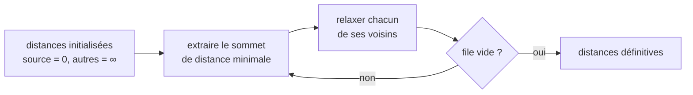
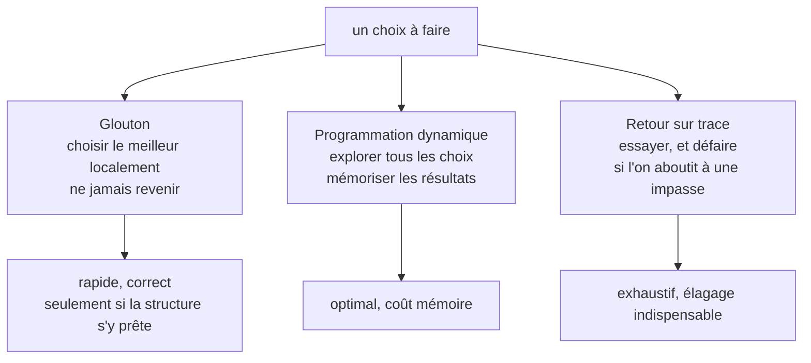
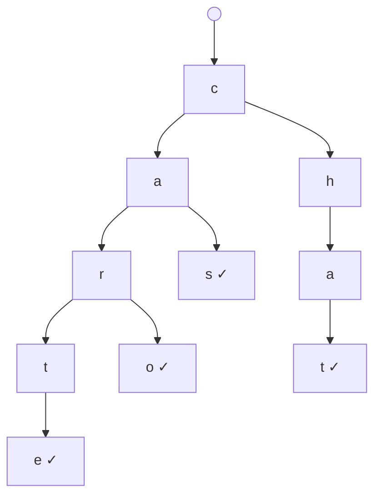
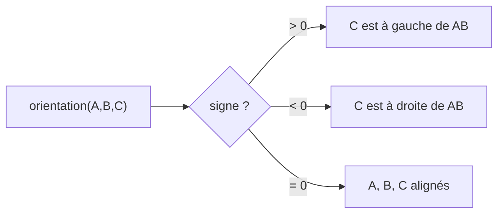
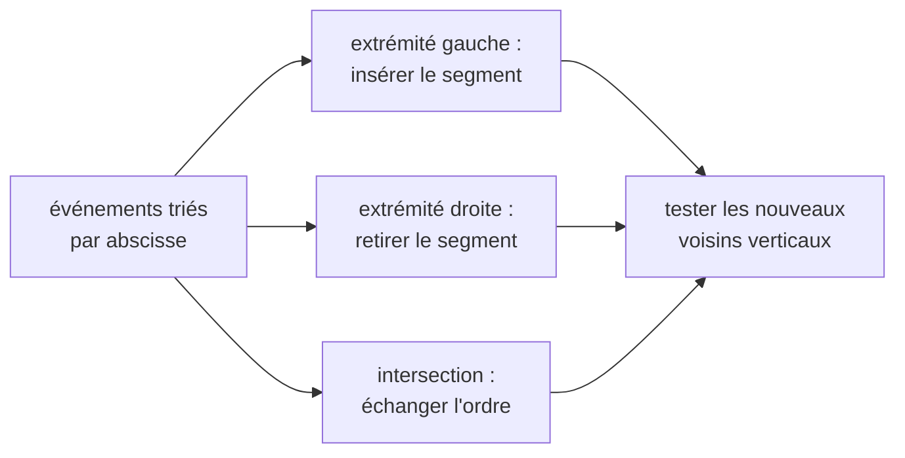
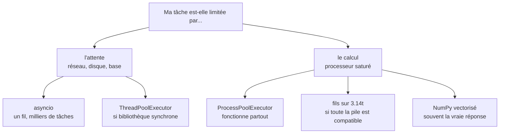

# Origine
Le terme "algorithme" tire son origine du nom d'un mathématicien persan du IXe siècle, Abu Abdullah Muhammad ibn Musa al-Khwarizmi. Le mot "algorithme" est dérivé de la latinisation de son nom, Algoritmi, dans les traductions médiévales de ses travaux en Europe.

Al-Khwarizmi a joué un rôle crucial dans le développement des mathématiques, en particulier dans le domaine de l'algèbre. Son ouvrage le plus célèbre, "Al-Kitab al-Mukhtasar fi Hisab al-Jabr wal-Muqabala" (Le compendium du calcul par complétion et équilibrage), a introduit les concepts de base de l'algèbre. Le mot "algèbre" lui-même est dérivé du titre de ce livre.

Les travaux d'Al-Khwarizmi sur les méthodes systématiques de résolution d'équations ont posé les fondations de l'algèbre et, par extension, ont influencé le développement des algorithmes mathématiques et informatiques. Au Moyen Âge, ses textes traduits en latin ont été largement étudiés en Europe, ce qui a permis de diffuser ses méthodes de calcul et de résolution de problèmes.

Ainsi, l'origine du terme "algorithme" est étroitement liée à ce mathématicien et à ses contributions à la science des mathématiques, qui ont joué un rôle fondamental dans l'évolution de la discipline et dans l'élaboration des principes des algorithmes tels que nous les connaissons aujourd'hui.
# Évolution

### Le Moyen Âge et la Renaissance

Pendant le Moyen Âge et la Renaissance, les travaux d'Al-Khwarizmi ont été traduits et étudiés en Europe, influençant grandement les mathématiques occidentales. L'utilisation des algorithmes s'est alors étendue aux calculs astronomiques, à la navigation et à la finance, avec le développement de nouvelles méthodes pour le calcul des intérêts, l'amortissement des prêts, et la conversion des devises.

### L'ère de la Mécanisation

Au XVIIe siècle, avec l'invention des premières machines à calculer par Blaise Pascal et Gottfried Wilhelm Leibniz, la notion d'algorithmes commence à se matérialiser sous forme mécanique. Ces machines étaient capables de réaliser des opérations arithmétiques de base, démontrant ainsi le potentiel des algorithmes pour automatiser le calcul et réduire les erreurs humaines.

### Le Métier à Tisser de Jacquard

Au début du XIXe siècle, le métier à tisser programmable de Joseph Marie Jacquard marque un tournant. Utilisant des cartes perforées pour contrôler le tissage du tissu, cette invention démontre comment des instructions codées peuvent piloter une machine pour exécuter des tâches complexes. Ce concept de programmation mécanique préfigure les principes de base de l'informatique moderne.

### La Machine Analytique de Babbage et la Note G d'Ada Lovelace

Charles Babbage conçoit la machine analytique dans les années 1830, envisageant la première calculatrice mécanique programmable capable d'exécuter n'importe quelle opération algorithmique. Bien que jamais entièrement réalisée de son vivant, sa conception influencera fortement le développement futur de l'informatique. Ada Lovelace, collaboratrice de Babbage, rédige la Note G, considérée comme le premier algorithme destiné à être exécuté par une machine, faisant d'elle la première programmeuse de l'histoire.

### La Trieuse d'Hollerith

La fin du XIXe siècle voit l'invention par Herman Hollerith d'une machine capable de trier et de compter les cartes perforées, conçue pour accélérer le recensement américain de 1890. Cette innovation montre l'efficacité des machines dans le traitement des données et jette les bases de l'informatique d'entreprise.
Elle est à l'origine de la société IBM.

### L'Avènement des Ordinateurs

Le XXe siècle a vu l'émergence de l'informatique, avec le développement des premiers ordinateurs. Les algorithmes ont alors pris une importance centrale, permettant l'exécution de tâches complexes à une vitesse et avec une précision inimaginables auparavant. Les travaux de pionniers tels qu'Alan Turing et John von Neumann ont établi les fondements théoriques de l'informatique, y compris la conception des premiers algorithmes pour le traitement de l'information, le codage et le décryptage, et la résolution de problèmes mathématiques complexes.

### L'Ère Numérique

Avec l'avènement de l'ère numérique, les algorithmes sont devenus omniprésents dans tous les aspects de la vie quotidienne et de la société. Les progrès en algorithmique ont permis le développement de l'intelligence artificielle, du traitement automatique du langage naturel, des graphes complexes et des réseaux sociaux, ainsi que des méthodes avancées de cryptographie. Les algorithmes sont aujourd'hui essentiels pour analyser d'immenses quantités de données, optimiser les opérations logistiques, développer des logiciels complexes et créer des systèmes de recommandation sophistiqués.

----------------------------
# Plan

## 1. Introduction aux algorithmes avancés
### 1.1. Brève révision des fondamentaux d'algorithmique et de Python.
### 1.2. Importance des algorithmes avancés dans le développement logiciel.

## 2. Algorithmes de tri et de recherche
### 2.1. Tri rapide (QuickSort).
### 2.2. Tri par fusion (MergeSort).
### 2.3. Recherche binaire.

## 3. Structures de données avancées
### 3.1. Arbres binaires de recherche (BST).
### 3.2. Tas (Heaps).
### 3.3. Graphes (représentation, parcours en profondeur et en largeur).

## 4. Algorithmes sur les graphes
### 4.1. Algorithme de Dijkstra pour les plus courts chemins.
### 4.2. Algorithme de Kruskal pour les arbres couvrants minimums.
### 4.3. Algorithme de Floyd-Warshall.

## 5. Techniques algorithmiques avancées
### 5.1. Programmation dynamique : principes de base et applications.
### 5.2.  Backtracking : résolution de problèmes de type puzzles (ex. Sudoku).
### 5.3. Greedy algorithms : principe et exemples d'application.

## 6. Algorithmes de traitement de chaînes de caractères
### 6.1. Recherche de sous-chaînes (ex. algorithme de KMP).
### 6.2. Trie (arbre de préfixes) et ses applications.

## 7. Algorithmes en géométrie computationnelle
### 7.1. Convex hull (enveloppe convexe).
### 7.2. Intersection de segments.

## 8. Optimisation combinatoire
### 8.1. Problème du sac à dos.
### 8.2. Problème du voyageur de commerce (TSP).

## 9. Algorithmes en parallèle et concurrents
### 9.1. Introduction à la programmation parallèle en Python.
### 9.2. Exemples d'algorithmes parallèles.

## 10. Intelligence artificielle et algorithmes d'apprentissage automatique
### 10.1. Aperçu des algorithmes de clustering (ex. K-means).
### 10.2. Algorithmes de classification (ex. arbres de décision).

## 11. Projet de fin de cours
### 11.1. Application pratique : résolution d'un problème complexe en utilisant les techniques apprises.
### 11.2. Présentation et discussion des solutions.

---------------------------
# 1. Introduction aux algorithmes avancés
## 1.1. Brève révision des fondamentaux d'algorithmique et de Python.

### 1.1.1. Algorithmique : les bases
- **Définition et objectifs :** Un algorithme est une suite finie et non ambiguë d'instructions permettant de résoudre un problème ou d'effectuer une tâche. Les algorithmes cherchent à optimiser certains critères comme la vitesse d'exécution, l'utilisation de la mémoire, ou la simplicité de l'implémentation.
- **Complexité algorithmique :** Introduction aux notions de complexité temporelle et spatiale (Big O notation) pour évaluer et comparer l'efficacité des algorithmes.
- **Algorithmes de base :** Révision des algorithmes de tri (comme le tri par insertion, le tri à bulles) et de recherche (recherche linéaire et recherche binaire), en mettant l'accent sur leur mise en œuvre et leur analyse de complexité.

### 1.1.2. Python : rappels essentiels
- **Syntaxe de base :** Révision des structures de données intégrées (listes, dictionnaires, ensembles, tuples), des boucles (for, while), des instructions conditionnelles (if, elif, else), et des fonctions.
- **Fonctions importantes :** Focus sur les fonctions intégrées utiles en algorithmique, telles que `range()`, `len()`, `min()`, `max()`, et les compréhensions de listes.
- **Programmation orientée objet (POO) :** Bref rappel sur la définition de classes et la création d'objets en Python, car certains algorithmes avancés peuvent être plus facilement implémentés et compris en utilisant des concepts de POO.
- **Modules et bibliothèques :** Présentation des modules standards (`math`, `itertools`, `collections`) et des bibliothèques tierces (comme NumPy pour les opérations mathématiques avancées) qui facilitent l'implémentation d'algorithmes complexes.

### 1.1.3. Bonnes pratiques de développement en Python
- **Écriture de code lisible et maintenable :** Importance du respect des conventions de nommage, de l'utilisation de commentaires pertinents, et du respect des principes DRY (Don't Repeat Yourself) et KISS (Keep It Simple, Stupid).
- **Tests et débogage :** Introduction aux assertions, à l'utilisation de `pytest` pour les tests unitaires, et aux techniques de base de débogage.

## 1.2. Importance des algorithmes avancés dans le développement logiciel

L'étude et l'application des algorithmes avancés jouent un rôle crucial dans le développement logiciel pour plusieurs raisons fondamentales. Comprendre leur importance permet aux développeurs et aux chercheurs de mieux appréhender la manière dont ces algorithmes peuvent être utilisés pour résoudre des problèmes complexes de manière efficace et optimale.

### 1.2.1. Résolution de problèmes complexes

Les algorithmes avancés offrent des solutions aux problèmes qui sont soit trop difficiles, soit inefficaces à résoudre avec des approches naïves ou basiques. En exploitant des structures de données sophistiquées et des techniques de calcul intelligentes, ils permettent de traiter des données volumineuses, des graphes complexes, des chaînes de caractères de grande taille, et d'autres structures de données avancées de manière plus efficace.

### 1.2.2. Optimisation des performances

L'un des principaux avantages des algorithmes avancés est leur capacité à optimiser les performances d'une application, que ce soit en termes de vitesse d'exécution, d'utilisation de la mémoire ou de consommation d'énergie. Ceci est particulièrement important dans le développement de logiciels destinés à fonctionner sur des appareils aux ressources limitées ou dans des environnements où le temps de réponse est critique.

### 1.2.3. Amélioration de la qualité du logiciel

L'application d'algorithmes avancés contribue à l'amélioration de la qualité du logiciel en garantissant des solutions plus robustes, fiables et maintenables. En utilisant des approches algorithmiques éprouvées, les développeurs peuvent réduire la probabilité d'erreurs, simplifier le processus de test et améliorer la facilité de maintenance du code.

### 1.2.4. Fondation pour l'innovation

Les algorithmes avancés servent de base à l'innovation dans de nombreux domaines de la technologie, y compris l'intelligence artificielle, l'apprentissage automatique, la cryptographie, la bioinformatique, et bien d'autres. La compréhension et l'application de ces algorithmes sont essentielles pour le développement de nouvelles applications et technologies qui façonnent notre avenir.

### 1.2.5. Compétitivité sur le marché

Dans un environnement commercial de plus en plus compétitif, la capacité à résoudre efficacement des problèmes complexes peut donner un avantage significatif. Les entreprises qui intègrent des algorithmes avancés dans leurs solutions peuvent offrir des produits plus performants, plus sûrs et plus innovants, se démarquant ainsi sur le marché.
# 2. Algorithmes de tri et de recherche
## 2.1. Tri rapide (QuickSort)

Le tri rapide, ou QuickSort, est un algorithme de tri extrêmement efficace et largement utilisé, développé par Tony Hoare en 1960. Il est basé sur le principe de la "division pour régner" et se distingue par sa rapidité et sa simplicité, surtout pour de grands ensembles de données. Voici une explication de son fonctionnement et de sa mise en œuvre en Python.

### 2.1.1. Principe de fonctionnement

Le tri rapide trie un tableau en suivant ces étapes :

1. **Choix d'un pivot :** Sélectionnez un élément du tableau à utiliser comme pivot. Le choix du pivot peut être aléatoire, fixe, ou optimisé par différentes stratégies comme le médian de trois.
2. **Partitionnement :** Réorganisez le tableau de sorte que tous les éléments inférieurs au pivot viennent avant lui, tandis que tous les éléments supérieurs viennent après. À la fin de cette étape, le pivot est dans sa position finale.
3. **Récursion :** Appliquez récursivement la même opération aux sous-tableaux situés de part et d'autre du pivot, jusqu'à ce que le tableau entier soit trié.

### 2.1.2. Propriétés

- **Complexité temporelle :** En moyenne, QuickSort a une complexité temporelle de O(n log n), mais dans le pire des cas, elle peut dégrader à O(n²). Le pire des cas se produit généralement lorsque le plus petit ou le plus grand élément est toujours choisi comme pivot.
- **Espace mémoire :** QuickSort est un tri en place, ne nécessitant qu'une petite quantité de mémoire supplémentaire pour les piles d'appels récursifs. Sa complexité spatiale est donc de O(log n) en moyenne.
- **Stabilité :** Le tri rapide n'est pas stable; c'est-à-dire que l'ordre des éléments égaux peut ne pas être préservé.

### 2.1.3. Mise en œuvre en Python

```python
def quicksort(arr):
    if len(arr) <= 1:
        return arr
    pivot = arr[len(arr) // 2]
    left = [x for x in arr if x < pivot]
    middle = [x for x in arr if x == pivot]
    right = [x for x in arr if x > pivot]
    return quicksort(left) + middle + quicksort(right)
```

### 2.1.4. Exemple d'utilisation

```python
arr = [3, 6, 8, 10, 1, 2, 1]
print(quicksort(arr))
```

### 2.1.5. Conclusion

QuickSort est particulièrement efficace pour le traitement de grands ensembles de données grâce à sa complexité moyenne en O(n log n) et sa simplicité de mise en œuvre. Bien que son cas le plus défavorable puisse être coûteux en termes de temps d'exécution, des stratégies de choix de pivot intelligentes peuvent réduire cette probabilité. QuickSort demeure l'un des algorithmes de tri les plus populaires et les plus puissants disponibles.
## 2.2. Tri par fusion (MergeSort).

Le tri par fusion, ou MergeSort, est un autre exemple puissant d'algorithmes de tri basé sur le paradigme de la division pour régner. Développé par John von Neumann en 1945, cet algorithme démontre une efficacité constante dans divers scénarios, traitant efficacement de grands ensembles de données avec une complexité temporelle garantie de O(n log n) dans le meilleur, le moyen et le pire des cas. Voici comment MergeSort fonctionne et comment il peut être implémenté en Python.

### 2.2.1. Principe de fonctionnement

Le tri par fusion opère selon les étapes suivantes :

1. **Division :** Si le tableau contient plus d'un élément, divisez-le en deux moitiés (ou presque égales si le nombre d'éléments est impair).
2. **Conquête :** Appliquez récursivement le tri par fusion aux deux moitiés.
3. **Fusion :** Combine les deux moitiés triées en un seul tableau trié.

### 2.2.2. Propriétés

- **Complexité temporelle :** MergeSort a une complexité temporelle de O(n log n) pour tous les cas, ce qui le rend extrêmement efficace et prévisible pour le traitement de grandes quantités de données.
- **Espace mémoire :** Contrairement au QuickSort, le tri par fusion n'est pas un tri en place. Il nécessite un espace mémoire supplémentaire proportionnel à la taille du tableau à trier, ce qui donne une complexité spatiale de O(n).
- **Stabilité :** Le tri par fusion est stable, ce qui signifie que l'ordre des éléments équivalents est préservé, un avantage important lors du tri de structures de données complexes où cette propriété est requise.

### 2.2.3. Mise en œuvre en Python

```python
def merge_sort(arr):
    if len(arr) > 1:
        mid = len(arr) // 2
        left_half = arr[:mid]
        right_half = arr[mid:]

        merge_sort(left_half)
        merge_sort(right_half)

        i = j = k = 0

        while i < len(left_half) and j < len(right_half):
            if left_half[i] < right_half[j]:
                arr[k] = left_half[i]
                i += 1
            else:
                arr[k] = right_half[j]
                j += 1
            k += 1

        while i < len(left_half):
            arr[k] = left_half[i]
            i += 1
            k += 1

        while j < len(right_half):
            arr[k] = right_half[j]
            j += 1
            k += 1
    return arr
```

### 2.2.4. Exemple d'utilisation

```python
arr = [38, 27, 43, 3, 9, 82, 10]
print(merge_sort(arr))
```

### 2.2.5. Conclusion

Le tri par fusion est idéal pour les applications nécessitant une garantie de performance en termes de temps, indépendamment de la nature des données d'entrée. Sa stabilité et sa prévisibilité en font un choix privilégié pour le tri de données complexes dans des applications critiques. Bien qu'il soit plus gourmand en mémoire que certains autres algorithmes de tri, les avantages en termes de performance et de fiabilité compensent souvent cet inconvénient.
## 2.3. Recherche binaire.

La recherche binaire est une technique efficace pour trouver un élément spécifique dans un tableau trié. Cette méthode utilise une approche de division pour régner, ce qui la rend considérablement plus rapide que les méthodes de recherche séquentielle, en particulier pour de grands ensembles de données. Voici une explication de son fonctionnement et de sa mise en œuvre en Python.

### 2.3.1. Principe de fonctionnement

La recherche binaire compare l'élément cible avec l'élément au milieu du tableau :

1. **Si l'élément cible est égal à l'élément du milieu, la recherche est terminée.**
2. **Si l'élément cible est plus petit que l'élément du milieu, la recherche continue sur la sous-séquence à gauche de l'élément du milieu.**
3. **Si l'élément cible est plus grand que l'élément du milieu, la recherche continue sur la sous-séquence à droite de l'élément du milieu.**

La recherche se poursuit récursivement ou itérativement sur des sous-séquences de plus en plus petites jusqu'à ce que l'élément cible soit trouvé ou que la sous-séquence soit réduite à zéro.

### 2.3.2. Propriétés

- **Complexité temporelle :** La recherche binaire a une complexité temporelle de O(log n), ce qui est nettement plus efficace que la recherche linéaire pour les grands ensembles de données.
- **Pré-requis :** Le tableau doit être trié pour appliquer la recherche binaire. Si le tableau n'est pas trié, le coût de le trier doit être pris en compte.
- **Espace mémoire :** La recherche binaire elle-même ne nécessite qu'un espace constant, O(1), si elle est implémentée de manière itérative; la version récursive nécessite O(log n) en raison de la pile d'appels récursifs.

### 2.3.3. Mise en œuvre en Python

Voici une mise en œuvre itérative de la recherche binaire :

```python
def binary_search(arr, x):
    low = 0
    high = len(arr) - 1
    mid = 0

    while low <= high:
        mid = (high + low) // 2

        # Si x est plus grand, ignorer la moitié gauche
        if arr[mid] < x:
            low = mid + 1

        # Si x est plus petit, ignorer la moitié droite
        elif arr[mid] > x:
            high = mid - 1

        # x est exactement au milieu
        else:
            return mid

    # Si nous sommes ici, l'élément n'était pas présent
    return -1
```

### 2.3.4. Exemple d'utilisation

```python
arr = [2, 3, 4, 10, 40]
x = 10

# La fonction renvoie l'index de x dans 'arr' si présent, sinon -1
result = binary_search(arr, x)
if result != -1:
    print(f"L'élément est présent à l'index {result}")
else:
    print("L'élément n'est pas présent dans le tableau")
```

### 2.3.5. Conclusion

La recherche binaire est un outil essentiel dans la boîte à outils de tout développeur ou scientifique des données, offrant une méthode de recherche rapide et efficace pour les tableaux triés. Sa simplicité et son efficacité font de la recherche binaire une première étape privilégiée avant d'envisager des algorithmes de recherche plus complexes.
# 3. Structures de données avancées
## 3.1. Arbres binaires de recherche (BST)

Les Arbres Binaires de Recherche (BST pour Binary Search Tree) sont une structure de données fondamentale qui permet de stocker des données de manière organisée pour faciliter les opérations de recherche, d'insertion et de suppression. Les BST tirent parti des propriétés des arbres binaires et des algorithmes de recherche binaire pour offrir des performances efficaces en moyenne.

### 3.1.1 Définition et Propriétés

Un BST est un arbre binaire où chaque nœud possède au plus deux enfants (appelés enfant gauche et enfant droit) avec les propriétés suivantes :
- La clé stockée dans chaque nœud est supérieure à toutes les clés stockées dans les nœuds de son sous-arbre gauche et inférieure à celles de son sous-arbre droit.
- Chaque sous-arbre gauche et droit doit également être un BST.

Ces propriétés assurent que l'arbre est toujours trié, ce qui permet des recherches rapides, ainsi que des insertions et suppressions efficaces.

### 3.1.2. Opérations Principales

#### 3.1.2.1. Recherche
Pour rechercher une valeur dans un BST, on commence par comparer la valeur avec la clé du nœud racine. Si la valeur est inférieure à la clé du nœud, on se déplace vers le sous-arbre gauche ; si elle est supérieure, vers le sous-arbre droit. Ce processus se répète jusqu'à ce que la valeur soit trouvée ou que le sous-arbre exploré soit vide.

#### 3.1.2.2. Insertion
L'insertion commence par rechercher la position appropriée pour le nouvel élément, en suivant le même processus que pour une recherche. Une fois la position trouvée (un nœud feuille), le nouvel élément est ajouté comme enfant de ce nœud, en maintenant les propriétés du BST.

#### 3.1.2.3. Suppression
La suppression est plus complexe et peut se dérouler selon trois cas :
1. **Suppression d'un nœud feuille (sans enfants) :** Le nœud est simplement supprimé.
2. **Suppression d'un nœud avec un seul enfant :** Le nœud est supprimé et son enfant prend sa place.
3. **Suppression d'un nœud avec deux enfants :** Généralement, on recherche le prédécesseur immédiat (le plus grand nœud du sous-arbre gauche) ou le successeur immédiat (le plus petit nœud du sous-arbre droit), et on remplace la clé du nœud à supprimer par celle du prédécesseur/successeur. Ensuite, on supprime le prédécesseur/successeur.

### 3.1.2.4. Complexité

- **Recherche, insertion, suppression :** En moyenne, ces opérations ont une complexité temporelle de O(log n) dans un BST équilibré. Cependant, dans le pire des cas (par exemple, un arbre dégénéré où l'arbre prend la forme d'une liste chaînée), la complexité peut dégrader à O(n).

### 3.1.2.5. Exemple d'implémentation en Python

Voici un exemple simple de structure de nœud pour un BST :

```python
class Node:
    def __init__(self, key):
        self.left = None
        self.right = None
        self.val = key

def insert(root, key):
    if root is None:
        return Node(key)
    else:
        if root.val < key:
            root.right = insert(root.right, key)
        else:
            root.left = insert(root.left, key)
    return root
```

### 3.1.2.6. Conclusion

Les BST sont une structure de données extrêmement utile pour stocker des données de manière organisée pour un accès rapide. Ils sont largement utilisés dans la mise en œuvre de bases de données et de systèmes de fichiers en raison de leur efficacité pour effectuer les opérations de base sur les données. Toutefois, il est crucial de maintenir les arbres équilibrés pour éviter les performances dégradées dans les cas extrêmes.
## 3.2. Tas (Heaps)

Un tas (heap) est une structure de données de type arbre binaire qui satisfait la propriété de tas : dans un tas max, pour tout nœud autre que la racine, la valeur du nœud est inférieure ou égale à celle de son parent ; dans un tas min, pour tout nœud autre que la racine, la valeur du nœud est supérieure ou égale à celle de son parent. Cette propriété garantit que l'élément le plus grand (dans un tas max) ou le plus petit (dans un tas min) se trouve toujours à la racine de l'arbre. Les tas sont principalement utilisés pour implémenter des files de priorité et pour le tri par tas (heapsort).

### 3.2.1. Propriétés

- **Forme complète :** Un tas est toujours un arbre binaire complet ; tous les niveaux de l'arbre, sauf peut-être le dernier, sont entièrement remplis, et tous les nœuds sont aussi loin à gauche que possible.
- **Accès rapide au minimum/maximum :** La racine du tas contient toujours l'élément minimum (dans un tas min) ou maximum (dans un tas max), permettant un accès en O(1).
- **Insertion et suppression efficaces :** L'insertion et la suppression (généralement de l'élément minimum/maximum) peuvent être effectuées en O(log n) grâce à la restructuration de l'arbre pour maintenir la propriété de tas.

### 3.2.2. Opérations principales

#### 3.2.2.1. Insertion
1. Ajoutez le nouvel élément à la fin du dernier niveau pour maintenir la forme complète de l'arbre.
2. Comparez la valeur de cet élément avec celle de son parent ; si elles ne satisfont pas la propriété de tas, échangez-les.
3. Répétez le processus jusqu'à ce que la propriété de tas soit rétablie.

#### 3.2.2.2. Suppression de la racine (élément min/max)
1. Supprimez la racine et remplacez-la par le dernier élément de l'arbre.
2. Comparez la nouvelle racine avec ses enfants et échangez-la avec l'un d'eux pour maintenir la propriété de tas (l'enfant choisi est celui qui maintiendra la propriété de tas après l'échange).
3. Répétez le processus jusqu'à ce que la propriété de tas soit rétablie.

### 3.2.3. Utilisations

- **Files de priorité :** Les tas permettent d'implémenter efficacement des files de priorité, où l'élément de plus haute ou de plus basse priorité doit être accédé, inséré ou supprimé rapidement.
- **Tri par tas (Heapsort) :** Un algorithme de tri qui utilise un tas pour trier un tableau de manière efficace.
- **Graphes :** Utilisés dans des algorithmes de graphes, comme l'algorithme de Dijkstra pour trouver le chemin le plus court, où les tas min sont utilisés pour sélectionner rapidement le nœud avec la distance minimale non traitée.

### 3.2.4. Exemple d'implémentation en Python

Python fournit un module `heapq` qui implémente les fonctionnalités d'un tas min à l'aide d'une liste. Voici comment utiliser `heapq` pour créer un tas min et effectuer des opérations de base :

```python
import heapq

# Créer un tas min vide
heap = []

# Insérer des éléments
heapq.heappush(heap, 10)
heapq.heappush(heap, 1)
heapq.heappush(heap, 5)

# Obtenir et supprimer l'élément minimum
min_element = heapq.heappop(heap)
print(f"L'élément minimum est : {min_element}")

# Obtenir l'élément minimum sans le supprimer
min_element = heap[0]
print(f"L'élément minimum sans le supprimer est : {min_element}")
```

### 3.2.5. Conclusion

Les tas sont une structure de données extrêmement utile pour gérer des ensembles de données organisés par priorité, offrant des opérations efficaces pour l'insertion et la suppression d'éléments. Leur capacité à fournir un accès rapide à l'élément minimum ou maximum les rend indispensables pour de nombreuses applications algorithmiques et systèmes.
## 3.3. Graphes (représentation, parcours en profondeur et en largeur)

Les graphes sont des structures de données qui modélisent un ensemble d'objets (sommets ou nœuds) ainsi que les relations (arêtes) entre ces objets. Ils sont utilisés dans de nombreux domaines tels que les réseaux sociaux, les systèmes de navigation, et l'analyse de réseau, offrant un moyen puissant de représenter et de résoudre des problèmes complexes.

### 3.3.1. Représentation des graphes

Il existe principalement deux manières de représenter un graphe en informatique :

#### 3.3.2. Matrice d'adjacence
Une matrice carrée utilisée pour représenter un graphe fini. Les éléments de la matrice indiquent si une paire de sommets est adjacente ou non dans le graphe.

#### 3.3.3. Liste d'adjacence
Une liste où chaque élément représente un sommet du graphe, et chaque sommet stocke une liste des sommets adjacents. Cette représentation est plus économique en termes de mémoire pour les graphes creux.

### 3.3.4. Parcours de graphe

Le parcours de graphe est une méthode fondamentale pour explorer tous les sommets et arêtes d'un graphe. Les deux approches de base sont le parcours en profondeur (Depth-First Search, DFS) et le parcours en largeur (Breadth-First Search, BFS).

#### 3.3.4.1. Parcours en profondeur (DFS)

DFS explore un graphe en allant aussi loin que possible le long de chaque branche avant de revenir en arrière. Cela peut être réalisé récursivement ou avec une pile. DFS est particulièrement utile pour la recherche de composantes connexes, la vérification de connectivité, et la détection de cycles.

**Implémentation en Python (récursive) :**

```python
def dfs(graph, node, visited=None):
    if visited is None:
        visited = set()
    visited.add(node)
    print(node, end=' ')
    for neighbour in graph[node]:
        if neighbour not in visited:
            dfs(graph, neighbour, visited)
```

#### 3.3.4.2. Parcours en largeur (BFS)

BFS explore le graphe couche par couche, en visitant tous les voisins d'un sommet avant de passer aux voisins des voisins. BFS utilise une file pour gérer l'ordre de visite et est utile pour trouver le chemin le plus court dans un graphe non pondéré.

**Implémentation en Python :**

```python
from collections import deque

def bfs(graph, start):
    visited = set()
    queue = deque([start])
    while queue:
        vertex = queue.popleft()
        if vertex not in visited:
            visited.add(vertex)
            print(vertex, end=' ')
            queue.extend(set(graph[vertex]) - visited)
```

### 3.3.4.3. Exemple

Considérons le graphe représenté par la liste d'adjacence suivante :

```python
graph = {
    'A' : ['B','C'],
    'B' : ['D', 'E'],
    'C' : ['F'],
    'D' : [],
    'E' : ['F'],
    'F' : []
}
```

Le parcours DFS de ce graphe, en commençant par 'A', pourrait ressembler à A B D E F C, tandis que le parcours BFS pourrait être A B C D E F.

### 3.3.4.4. Conclusion

La représentation et le parcours des graphes sont des outils essentiels en informatique, permettant de modéliser et d'explorer efficacement des données complexes. La compréhension profonde de ces concepts est cruciale pour résoudre des problèmes algorithmiques avancés et pour l'application pratique dans des domaines tels que l'analyse de réseau, la planification de chemin, et au-delà.

---

# 4. Algorithmes sur les graphes

Les parcours de la partie précédente répondent à « peut-on aller de A à B ». Les algorithmes qui suivent répondent à « **par où**, et à quel coût ».

Tous s'appuient sur la même représentation : un dictionnaire d'adjacence associant à chaque sommet la liste de ses voisins et le poids de l'arête.

```python
graphe = {
    "A": {"B": 4, "C": 2},
    "B": {"C": 5, "D": 10},
    "C": {"E": 3},
    "D": {"F": 11},
    "E": {"D": 4},
    "F": {},
}
```

## 4.1. Algorithme de Dijkstra pour les plus courts chemins

### 4.1.1. Principe de fonctionnement

Dijkstra maintient une distance provisoire pour chaque sommet, initialement infinie sauf pour la source. À chaque étape, il **extrait le sommet non traité de plus petite distance connue**, le déclare définitif, et met à jour ses voisins — c'est la *relaxation* d'arête.



L'algorithme est **glouton** : il ne revient jamais sur une décision. Cette hardiesse repose sur une hypothèse précise, énoncée plus bas.

### 4.1.2. Propriétés

- **Complexité :** O((V + E) log V) avec un tas binaire, où V est le nombre de sommets et E celui d'arêtes.
- **Correction :** garantie uniquement si **tous les poids sont positifs ou nuls**.
- **Sortie :** les distances depuis une source vers tous les sommets, et l'arbre des plus courts chemins.

> **Une arête de poids négatif casse Dijkstra.** Un sommet déclaré définitif pourrait être amélioré plus tard par un détour au coût négatif, ce que l'algorithme ne réexamine jamais. Il faut alors Bellman-Ford, en O(V·E).

C'est le point que les étudiants retiennent le moins et qui compte le plus : connaître la condition de validité d'un algorithme importe autant que son fonctionnement.

### 4.1.3. Mise en œuvre en Python

```python
import heapq


def dijkstra(graphe: dict, source: str) -> tuple[dict, dict]:
    """Distances minimales depuis `source`, et prédécesseurs pour reconstruire.

    `heapq` fournit un tas-min : la file de priorité de la partie 3.2 sans
    avoir à la réécrire.
    """
    distances = {sommet: float("inf") for sommet in graphe}
    distances[source] = 0
    predecesseurs: dict[str, str | None] = {source: None}
    file = [(0, source)]
    visites = set()

    while file:
        distance, sommet = heapq.heappop(file)
        if sommet in visites:          # entrée périmée, laissée dans le tas
            continue
        visites.add(sommet)

        for voisin, poids in graphe[sommet].items():
            candidate = distance + poids
            if candidate < distances[voisin]:
                distances[voisin] = candidate
                predecesseurs[voisin] = sommet
                heapq.heappush(file, (candidate, voisin))

    return distances, predecesseurs


def chemin(predecesseurs: dict, cible: str) -> list[str]:
    route = []
    while cible is not None:
        route.append(cible)
        cible = predecesseurs.get(cible)
    return route[::-1]
```

Le test `if sommet in visites: continue` mérite une explication : `heapq` ne sait pas diminuer la clef d'un élément déjà présent. On empile donc une nouvelle entrée et on ignore les anciennes au moment de les extraire. C'est la version dite *paresseuse*, plus simple et aussi rapide en pratique.

### 4.1.4. Exemple d'utilisation

```python
distances, predecesseurs = dijkstra(graphe, "A")
print(distances)              # {'A': 0, 'B': 4, 'C': 2, 'D': 9, 'E': 5, 'F': 20}
print(chemin(predecesseurs, "F"))   # ['A', 'C', 'E', 'D', 'F']
```

Le chemin vers `D` passe par `C` et `E` pour un coût de 9, alors que l'arête directe `B → D` coûterait 14. C'est exactement ce qu'un parcours en largeur, aveugle aux poids, aurait manqué.

### 4.1.5. Conclusion

Dijkstra est l'algorithme de routage par excellence : calcul d'itinéraire, protocoles OSPF et IS-IS, planification de trajectoire. Sa limite — les poids négatifs — n'est pas théorique : un « gain » modélisé comme un coût négatif suffit à invalider le résultat sans le moindre message d'erreur.

---

## 4.2. Algorithme de Kruskal pour les arbres couvrants minimaux

### 4.2.1. Principe de fonctionnement

Un **arbre couvrant minimal** relie tous les sommets d'un graphe non orienté au coût total le plus faible, sans cycle. Kruskal procède par tri :

```text
1. trier toutes les arêtes par poids croissant
2. pour chaque arête, dans l'ordre :
       si elle relie deux composantes distinctes, la retenir
       sinon, l'écarter — elle créerait un cycle
3. s'arrêter à V − 1 arêtes retenues
```

Toute la difficulté tient dans « deux composantes distinctes », qu'il faut savoir décider vite.

### 4.2.2. La structure union-find

Elle maintient une partition de l'ensemble des sommets sous deux opérations : trouver le représentant d'un élément, et fusionner deux classes.

```python
class UnionFind:
    """Partition avec compression de chemin et union par rang.

    Ces deux optimisations amènent le coût amorti d'une opération à
    O(α(n)), où α est l'inverse de la fonction d'Ackermann — inférieure
    à 5 pour tout n physiquement représentable. Autrement dit :
    constant en pratique.
    """

    def __init__(self, elements):
        self.parent = {e: e for e in elements}
        self.rang = {e: 0 for e in elements}

    def trouver(self, x):
        if self.parent[x] != x:
            self.parent[x] = self.trouver(self.parent[x])   # compression
        return self.parent[x]

    def unir(self, a, b) -> bool:
        ra, rb = self.trouver(a), self.trouver(b)
        if ra == rb:
            return False                    # déjà dans la même classe
        if self.rang[ra] < self.rang[rb]:
            ra, rb = rb, ra
        self.parent[rb] = ra
        if self.rang[ra] == self.rang[rb]:
            self.rang[ra] += 1
        return True
```

### 4.2.3. Mise en œuvre en Python

```python
def kruskal(sommets: list, aretes: list[tuple]) -> list[tuple]:
    """`aretes` est une liste de (poids, u, v)."""
    partition = UnionFind(sommets)
    arbre = []
    for poids, u, v in sorted(aretes):
        if partition.unir(u, v):
            arbre.append((poids, u, v))
            if len(arbre) == len(sommets) - 1:
                break
    return arbre
```

### 4.2.4. Exemple d'utilisation

```python
sommets = ["A", "B", "C", "D", "E"]
aretes = [(1, "A", "B"), (3, "A", "C"), (4, "B", "C"),
          (2, "C", "D"), (5, "B", "E"), (7, "D", "E")]

arbre = kruskal(sommets, aretes)
print(arbre)                              # [(1,'A','B'), (2,'C','D'), (3,'A','C'), (5,'B','E')]
print(sum(p for p, _, _ in arbre))        # 11
```

### 4.2.5. Propriétés et conclusion

- **Complexité :** O(E log E), dominée par le tri des arêtes.
- **Alternative :** l'algorithme de Prim, en O(E log V) avec un tas, préférable sur un graphe **dense** ; Kruskal l'emporte sur un graphe **creux**.

Applications : réseaux de distribution — électricité, fibre, eau —, classification hiérarchique en apprentissage non supervisé, et segmentation d'images.

---

## 4.3. Algorithme de Floyd-Warshall

### 4.3.1. Principe de fonctionnement

Là où Dijkstra part d'**une** source, Floyd-Warshall calcule les plus courts chemins entre **toutes les paires** de sommets. Son idée est d'une simplicité remarquable :

> Pour chaque sommet intermédiaire `k`, vérifier si passer par `k` améliore le trajet de `i` à `j`.

```python
for k in sommets:
    for i in sommets:
        for j in sommets:
            if d[i][k] + d[k][j] < d[i][j]:
                d[i][j] = d[i][k] + d[k][j]
```

L'ordre des boucles n'est pas interchangeable : `k` doit être la boucle **externe**, car l'invariant est « `d[i][j]` est optimal en n'utilisant que les intermédiaires déjà traités ». C'est un exemple de programmation dynamique, sujet de la partie 5.

### 4.3.2. Mise en œuvre en Python

```python
def floyd_warshall(graphe: dict) -> dict:
    sommets = list(graphe)
    d = {i: {j: (0 if i == j else float("inf")) for j in sommets} for i in sommets}

    for i in graphe:
        for j, poids in graphe[i].items():
            d[i][j] = min(d[i][j], poids)

    for k in sommets:
        for i in sommets:
            if d[i][k] == float("inf"):
                continue                     # aucun chemin i → k, on saute
            for j in sommets:
                if d[i][k] + d[k][j] < d[i][j]:
                    d[i][j] = d[i][k] + d[k][j]

    for i in sommets:
        if d[i][i] < 0:
            raise ValueError("cycle de poids négatif détecté")

    return d
```

### 4.3.3. Propriétés

- **Complexité :** O(V³) en temps, O(V²) en mémoire.
- **Poids négatifs :** admis, contrairement à Dijkstra. Le contrôle final `d[i][i] < 0` **détecte** les cycles négatifs, pour lesquels aucun plus court chemin n'existe.
- **Choix :** sur un graphe creux, exécuter Dijkstra depuis chaque sommet coûte O(V·E log V), souvent moins que V³. Floyd-Warshall l'emporte sur les graphes denses et sur les petits graphes, où sa simplicité prime.

### 4.3.4. Conclusion

Retenons la grille de décision, qui vaut mieux que trois algorithmes mémorisés séparément :

| Question | Poids | Algorithme |
| --- | --- | --- |
| Une source, tous les sommets | positifs | Dijkstra |
| Une source, tous les sommets | quelconques | Bellman-Ford |
| Toutes les paires | quelconques | Floyd-Warshall |
| Relier tout au moindre coût | non orienté | Kruskal ou Prim |
| Le plus court en nombre d'arêtes | non pondéré | parcours en largeur |

La dernière ligne est celle qu'on oublie : sur un graphe non pondéré, un simple BFS donne le plus court chemin, sans tas ni tri.

---

# 5. Techniques algorithmiques avancées

Les trois techniques de cette partie ne sont pas des algorithmes mais des **méthodes de conception**. Elles se distinguent par la manière dont elles traitent les choix.



## 5.1. Programmation dynamique

### 5.1.1. Les deux conditions

La programmation dynamique s'applique lorsqu'un problème vérifie deux propriétés :

- **sous-structure optimale** : la solution optimale se compose de solutions optimales de sous-problèmes ;
- **chevauchement des sous-problèmes** : les mêmes sous-problèmes reviennent plusieurs fois.

Sans la seconde, il s'agit simplement de « diviser pour régner » — le tri fusion de la partie 2 en est un exemple, et mémoriser n'y apporterait rien.

### 5.1.2. Mémoïsation : l'approche descendante

La suite de Fibonacci en fournit l'illustration canonique.

```python
def fibonacci_naif(n: int) -> int:
    if n < 2:
        return n
    return fibonacci_naif(n - 1) + fibonacci_naif(n - 2)
```

Cette version recalcule `fibonacci(30)` des milliers de fois : sa complexité est exponentielle, en O(φⁿ). Une ligne suffit à la corriger :

```python
from functools import cache


@cache
def fibonacci(n: int) -> int:
    if n < 2:
        return n
    return fibonacci(n - 1) + fibonacci(n - 2)
```

`functools.cache`, disponible depuis Python 3.9, mémorise les résultats déjà calculés. La complexité passe d'exponentielle à **linéaire**, sans changer une ligne de la logique.

```python
import timeit

timeit.timeit(lambda: fibonacci_naif(30), number=1)   # ≈ 0,3 s
timeit.timeit(lambda: fibonacci(30), number=1)        # ≈ 10⁻⁵ s
```

Deux précautions : le cache est illimité — `functools.lru_cache(maxsize=1000)` le borne — et les arguments doivent être **hachables**, ce qui interdit de passer une liste. On transmet alors un tuple, ou des indices.

### 5.1.3. Tabulation : l'approche ascendante

```python
def fibonacci_table(n: int) -> int:
    if n < 2:
        return n
    precedent, courant = 0, 1
    for _ in range(n - 1):
        precedent, courant = courant, precedent + courant
    return courant
```

La version ascendante remplit un tableau du plus petit sous-problème au plus grand. Elle évite la pile de récursion — donc la limite de profondeur de Python, fixée à 1 000 par défaut — et permet ici de ne conserver que deux valeurs au lieu de n.

| | Mémoïsation | Tabulation |
| --- | --- | --- |
| Écriture | proche de la définition | demande de trouver l'ordre de remplissage |
| Calculs | seulement les sous-problèmes atteints | tous |
| Pile | profondeur récursive | aucune |
| Mémoire | dictionnaire complet | souvent réductible à quelques lignes |

### 5.1.4. Un exemple moins scolaire : la distance d'édition

Combien d'insertions, suppressions ou substitutions faut-il pour transformer un mot en un autre ? C'est la distance de Levenshtein, au cœur des correcteurs orthographiques et de l'alignement de séquences.

```python
def distance_edition(a: str, b: str) -> int:
    ligne_precedente = list(range(len(b) + 1))

    for i, ca in enumerate(a, 1):
        ligne = [i]
        for j, cb in enumerate(b, 1):
            cout = 0 if ca == cb else 1
            ligne.append(min(
                ligne_precedente[j] + 1,        # suppression
                ligne[j - 1] + 1,               # insertion
                ligne_precedente[j - 1] + cout, # substitution
            ))
        ligne_precedente = ligne

    return ligne_precedente[-1]
```

```python
distance_edition("chaton", "chien")     # 3
```

Trois opérations : `a → i`, `t → e`, puis suppression du `o`. Le décompte se
vérifie à la main, et c'est un bon réflexe : une distance d'édition fausse passe
inaperçue, contrairement à un tri incorrect.

Complexité O(m·n) en temps ; en mémoire, O(n) au lieu de O(m·n) car seule la ligne précédente est conservée — une optimisation classique de la tabulation.

## 5.2. Retour sur trace

### 5.2.1. Principe

Le *backtracking* construit une solution par étapes et **défait** le dernier choix dès qu'une contrainte est violée. C'est un parcours en profondeur de l'arbre des possibilités, avec élagage.

```text
choisir      → poser une valeur candidate
explorer     → descendre dans la suite du problème
défaire      → retirer la valeur si l'exploration a échoué
```

### 5.2.2. Les huit dames

```python
def dames(n: int = 8) -> list[list[int]]:
    """Retourne toutes les dispositions de n dames sans prise mutuelle.

    `position[colonne] = ligne`. Le codage par un seul entier par colonne
    élimine d'emblée les conflits de colonne : la moitié des contraintes
    disparaît du simple fait de la représentation choisie.
    """
    solutions = []
    position: list[int] = []

    def compatible(ligne: int) -> bool:
        colonne = len(position)
        return all(
            l != ligne and abs(l - ligne) != colonne - c
            for c, l in enumerate(position)
        )

    def explorer():
        if len(position) == n:
            solutions.append(position.copy())
            return
        for ligne in range(n):
            if compatible(ligne):
                position.append(ligne)      # choisir
                explorer()                  # explorer
                position.pop()              # défaire
        return

    explorer()
    return solutions
```

```python
print(len(dames(8)))       # 92 solutions
```

> **Le choix de la représentation fait la moitié du travail.** Une grille 8×8 de booléens aurait exigé de vérifier lignes, colonnes et diagonales ; une liste d'entiers rend les conflits de colonne impossibles par construction. C'est une leçon qui dépasse le retour sur trace.

### 5.2.3. Quand l'élagage devient indispensable

Sans contrainte, le retour sur trace est une recherche exhaustive : 8⁸ ≈ 16 millions de positions pour les huit dames. L'élagage par `compatible` ramène l'exploration à quelques milliers de nœuds.

L'efficacité d'un retour sur trace ne tient donc pas à l'algorithme mais à la **qualité des contraintes** et à leur détection **au plus tôt** — dès qu'un choix est fait, jamais à la fin.

## 5.3. Algorithmes gloutons

### 5.3.1. Principe et condition de validité

Un algorithme glouton fait à chaque étape le choix qui paraît le meilleur localement, sans jamais revenir dessus. Il est rapide ; il n'est correct que si le problème possède la **propriété du choix glouton** : un optimum local mène à un optimum global.

Dijkstra et Kruskal, vus plus haut, sont gloutons — et corrects, propriété qui se démontre.

### 5.3.2. Le rendu de monnaie : quand cela marche, et quand cela échoue

```python
def rendre(montant: int, pieces: list[int]) -> list[int]:
    rendu = []
    for piece in sorted(pieces, reverse=True):
        while montant >= piece:
            rendu.append(piece)
            montant -= piece
    return rendu
```

```python
rendre(63, [1, 2, 5, 10, 20, 50])     # [50, 10, 2, 1] — optimal
rendre(6,  [1, 3, 4])                 # [4, 1, 1] — trois pièces
                                      # l'optimum est [3, 3], deux pièces
```

Le système euro est *canonique* : l'approche gloutonne y est toujours optimale. Un système quelconque ne l'est pas, et il faut alors la programmation dynamique.

> **C'est l'exemple à retenir de toute la partie 5.** Le même algorithme, sur le même problème, est optimal ou faux selon les données. Un glouton doit toujours s'accompagner de la preuve — ou au moins de l'énoncé — de sa condition de validité.

### 5.3.3. Un glouton qui se démontre : la sélection d'activités

Choisir le plus grand nombre d'activités compatibles parmi des créneaux qui se chevauchent.

```python
def selectionner(activites: list[tuple[int, int]]) -> list[tuple[int, int]]:
    """`activites` : liste de (debut, fin). Trier par fin croissante."""
    retenues = []
    fin_courante = float("-inf")
    for debut, fin in sorted(activites, key=lambda a: a[1]):
        if debut >= fin_courante:
            retenues.append((debut, fin))
            fin_courante = fin
    return retenues
```

Le critère de tri est tout l'algorithme : trier par **fin croissante** est optimal, trier par durée ou par début ne l'est pas. Choisir l'activité qui se termine le plus tôt laisse le maximum de temps disponible pour la suite — et cet argument constitue la preuve.

---

# 6. Algorithmes de traitement de chaînes de caractères

## 6.1. Recherche de sous-chaînes

### 6.1.1. Le coût de l'approche naïve

```python
def recherche_naive(texte: str, motif: str) -> int:
    n, m = len(texte), len(motif)
    for i in range(n - m + 1):
        if texte[i:i + m] == motif:
            return i
    return -1
```

Complexité O(n·m) dans le pire cas. Le cas dégénéré s'obtient facilement : chercher `"aaaab"` dans une chaîne de mille `"a"` compare quatre caractères avant d'échouer, mille fois de suite.

L'observation qui fonde l'algorithme de Knuth-Morris-Pratt tient en une phrase :

> Lorsqu'une comparaison échoue après avoir reconnu `k` caractères, on connaît déjà ces `k` caractères — il est inutile de revenir en arrière dans le texte.

### 6.1.2. La table des préfixes

KMP précalcule, pour chaque position du motif, la longueur du plus long préfixe qui soit aussi un suffixe. Cette table indique de combien décaler sans rien perdre.

```python
def table_prefixes(motif: str) -> list[int]:
    table = [0] * len(motif)
    longueur = 0
    for i in range(1, len(motif)):
        while longueur and motif[i] != motif[longueur]:
            longueur = table[longueur - 1]
        if motif[i] == motif[longueur]:
            longueur += 1
            table[i] = longueur
    return table
```

```python
table_prefixes("ABABCABAB")     # [0, 0, 1, 2, 0, 1, 2, 3, 4]
```

### 6.1.3. L'algorithme complet

```python
def kmp(texte: str, motif: str) -> list[int]:
    """Toutes les positions d'apparition de `motif` dans `texte`."""
    if not motif:
        return []
    table = table_prefixes(motif)
    positions = []
    j = 0                                   # caractères du motif reconnus

    for i, caractere in enumerate(texte):
        while j and caractere != motif[j]:
            j = table[j - 1]                # décalage sans reculer dans le texte
        if caractere == motif[j]:
            j += 1
        if j == len(motif):
            positions.append(i - j + 1)
            j = table[j - 1]                # poursuivre pour les chevauchements

    return positions
```

```python
kmp("ABABDABACDABABCABAB", "ABABCABAB")     # [10]
kmp("aaaaa", "aa")                          # [0, 1, 2, 3] — chevauchements inclus
```

### 6.1.4. Propriétés

- **Complexité :** O(n + m), contre O(n·m) pour l'approche naïve.
- **L'indice `i` ne recule jamais** : c'est ce qui rend l'algorithme utilisable sur un flux qu'on ne peut pas relire.
- **Alternatives :** Boyer-Moore, souvent plus rapide en pratique sur du texte naturel car il saute vers l'avant ; Rabin-Karp, qui compare des empreintes et se généralise bien à la recherche simultanée de plusieurs motifs.

### 6.1.5. En pratique, en Python

```python
"chaîne".find("aîn")          # C optimisé, à préférer pour un motif unique
import re
re.finditer(r"motif", texte)  # pour un motif complexe
```

La méthode `str.find` de CPython emploie un algorithme hybride, plus rapide que toute réimplémentation en Python pur. **KMP s'étudie pour comprendre, pas pour remplacer `find`.** Il redevient utile lorsqu'on travaille sur autre chose que des chaînes — une séquence d'événements, un flux d'octets — ou lorsqu'on doit borner le pire cas.

## 6.2. L'arbre de préfixes

### 6.2.1. Principe

Un *trie* stocke un ensemble de mots dans un arbre où chaque chemin de la racine à un nœud représente un préfixe. Deux mots partageant un préfixe partagent le début de leur chemin.



Les mots stockés sont ici *carte*, *caro*, *cas* et *chat* — les nœuds terminaux sont marqués.

### 6.2.2. Mise en œuvre en Python

```python
class Trie:
    def __init__(self):
        self.enfants: dict[str, "Trie"] = {}
        self.terminal = False

    def inserer(self, mot: str) -> None:
        noeud = self
        for lettre in mot:
            noeud = noeud.enfants.setdefault(lettre, Trie())
        noeud.terminal = True

    def _descendre(self, prefixe: str) -> "Trie | None":
        noeud = self
        for lettre in prefixe:
            noeud = noeud.enfants.get(lettre)
            if noeud is None:
                return None
        return noeud

    def contient(self, mot: str) -> bool:
        noeud = self._descendre(mot)
        return noeud is not None and noeud.terminal

    def par_prefixe(self, prefixe: str) -> list[str]:
        """Tous les mots commençant par `prefixe` — l'opération qui justifie
        la structure : aucun autre conteneur ne la rend efficace."""
        depart = self._descendre(prefixe)
        if depart is None:
            return []

        trouves = []

        def parcourir(noeud: "Trie", courant: str) -> None:
            if noeud.terminal:
                trouves.append(courant)
            for lettre, enfant in sorted(noeud.enfants.items()):
                parcourir(enfant, courant + lettre)

        parcourir(depart, prefixe)
        return trouves
```

### 6.2.3. Exemple d'utilisation

```python
dictionnaire = Trie()
for mot in ["carte", "caro", "cas", "chat", "chien"]:
    dictionnaire.inserer(mot)

dictionnaire.contient("cas")        # True
dictionnaire.contient("ca")         # False — préfixe, pas un mot
dictionnaire.par_prefixe("ca")      # ['caro', 'carte', 'cas']
dictionnaire.par_prefixe("ch")      # ['chat', 'chien']
```

### 6.2.4. Propriétés et comparaison

| Opération | Trie | `set` | Liste triée |
| --- | --- | --- | --- |
| Recherche exacte | O(m) | O(m) en moyenne | O(m log n) |
| Recherche par préfixe | **O(m + k)** | O(n) | O(m log n + k) |
| Mémoire | élevée | moyenne | faible |

`m` est la longueur du mot, `n` le nombre de mots, `k` le nombre de résultats.

Sur la recherche exacte, un `set` fait aussi bien pour beaucoup moins de mémoire. **La seule raison d'employer un trie est la recherche par préfixe** : autocomplétion, correction orthographique, tables de routage IP, filtrage d'URL.

### 6.2.5. Conclusion

Le trie illustre un principe qui dépasse son cas : une structure de données ne se choisit pas pour ce qu'elle stocke, mais pour **l'opération qu'on répétera le plus souvent**. Stocker un dictionnaire dans un trie pour ne faire que des recherches exactes est un gaspillage ; y stocker les mêmes mots pour proposer des complétions est le bon choix.

---

# 7. Algorithmes en géométrie computationnelle

La géométrie computationnelle a une particularité : les énoncés y sont visuellement évidents et les mises en œuvre pleines de pièges. Un point est-il *sur* un segment ou juste à côté ? La réponse dépend de la représentation des flottants, pas de la géométrie.

D'où le principe directeur de cette partie :

> **Ramener toute question géométrique à un test de signe sur des entiers, chaque fois que c'est possible.**

## 7.1. Le produit vectoriel, brique de base

Trois points *A*, *B*, *C* forment un virage à gauche, à droite, ou sont alignés. Le produit vectoriel des vecteurs *AB* et *AC* répond aux trois cas d'un seul signe :

```python
def orientation(a: tuple, b: tuple, c: tuple) -> int:
    """> 0 : virage à gauche (sens trigonométrique)
       < 0 : virage à droite
       = 0 : les trois points sont alignés"""
    return (b[0] - a[0]) * (c[1] - a[1]) - (b[1] - a[1]) * (c[0] - a[0])
```

Sur des coordonnées entières, ce calcul est **exact** : aucune division, aucun arrondi. C'est ce qui permet de bâtir dessus des algorithmes robustes.



## 7.2. Enveloppe convexe

### 7.2.1. Principe

L'enveloppe convexe d'un nuage de points est le plus petit polygone convexe les contenant tous — l'élastique tendu autour des punaises. Elle sert à délimiter une zone, à détecter des collisions, à réduire un nuage à sa forme extérieure.

L'algorithme de la **chaîne monotone** d'Andrew procède en deux passes :

```text
1. trier les points par abscisse, puis ordonnée
2. construire l'enveloppe inférieure de gauche à droite
3. construire l'enveloppe supérieure de droite à gauche
4. concaténer, en retirant les extrémités dupliquées
```

À chaque ajout, on retire du sommet de la pile tout point qui ne « tourne » pas dans le bon sens.

### 7.2.2. Mise en œuvre en Python

```python
def enveloppe_convexe(points: list[tuple]) -> list[tuple]:
    """Chaîne monotone d'Andrew. Retourne les sommets en sens trigonométrique.

    Complexité O(n log n), dominée par le tri.
    """
    points = sorted(set(points))
    if len(points) <= 2:
        return points

    def demi_enveloppe(sequence):
        pile = []
        for point in sequence:
            while len(pile) >= 2 and orientation(pile[-2], pile[-1], point) <= 0:
                pile.pop()
            pile.append(point)
        return pile

    inferieure = demi_enveloppe(points)
    superieure = demi_enveloppe(reversed(points))
    return inferieure[:-1] + superieure[:-1]
```

Le `<= 0` mérite un mot : avec `< 0`, les points alignés sur un bord seraient conservés. Selon l'usage, on veut l'un ou l'autre — les garder pour dessiner le contour, les écarter pour compter les sommets.

### 7.2.3. Exemple d'utilisation

```python
nuage = [(0, 0), (1, 1), (2, 2), (2, 0), (0, 2), (1, 0), (3, 1)]
print(enveloppe_convexe(nuage))
# [(0, 0), (2, 0), (3, 1), (2, 2), (0, 2)]
```

Les points intérieurs — `(1, 1)` — et ceux alignés sur un bord — `(1, 0)` — sont écartés.

### 7.2.4. Propriétés

- **Complexité :** O(n log n) ; le tri domine, la double passe est linéaire.
- **Robustesse :** exacte sur des entiers, à surveiller sur des flottants.
- **Alternatives :** le parcours de Graham, de même complexité, trie par angle polaire — ce qui introduit un `atan2` et donc des flottants. La chaîne monotone lui est préférable pour cette seule raison.

## 7.3. Intersection de segments

### 7.3.1. Le test par orientation

Deux segments *[P1P2]* et *[P3P4]* se croisent si *P3* et *P4* sont de part et d'autre de la droite *(P1P2)*, **et** réciproquement.

```python
def sur_segment(p, q, r) -> bool:
    """q est-il dans le rectangle englobant de [pr] ? (utilisé quand alignés)"""
    return (min(p[0], r[0]) <= q[0] <= max(p[0], r[0])
            and min(p[1], r[1]) <= q[1] <= max(p[1], r[1]))


def segments_se_croisent(p1, p2, p3, p4) -> bool:
    d1 = orientation(p3, p4, p1)
    d2 = orientation(p3, p4, p2)
    d3 = orientation(p1, p2, p3)
    d4 = orientation(p1, p2, p4)

    if ((d1 > 0) != (d2 > 0)) and ((d3 > 0) != (d4 > 0)):
        return True                          # cas général

    # cas dégénérés : un point aligné avec l'autre segment
    if d1 == 0 and sur_segment(p3, p1, p4):
        return True
    if d2 == 0 and sur_segment(p3, p2, p4):
        return True
    if d3 == 0 and sur_segment(p1, p3, p2):
        return True
    if d4 == 0 and sur_segment(p1, p4, p2):
        return True
    return False
```

Les quatre derniers tests représentent la moitié du code pour des cas que l'intuition oublie : segments colinéaires qui se chevauchent, extrémité posée exactement sur l'autre segment. **En géométrie computationnelle, les cas dégénérés ne sont pas des exceptions rares : ce sont les données réelles.** Des coordonnées issues d'une grille, d'un plan cadastral ou d'un maillage produisent des alignements en permanence.

### 7.3.2. Exemple d'utilisation

```python
segments_se_croisent((0, 0), (4, 4), (0, 4), (4, 0))   # True  — croisement en (2,2)
segments_se_croisent((0, 0), (1, 1), (2, 2), (3, 3))   # False — alignés, disjoints
segments_se_croisent((0, 0), (2, 2), (1, 1), (3, 3))   # True  — alignés, chevauchants
segments_se_croisent((0, 0), (2, 0), (2, 0), (4, 0))   # True  — extrémité commune
```

### 7.3.3. Détecter toutes les intersections : le balayage

Tester toutes les paires coûte O(n²). L'algorithme de Bentley-Ottmann balaie le plan avec une droite verticale et ne compare que les segments **voisins dans l'ordre vertical**, atteignant O((n + k) log n) pour k intersections.



Sa mise en œuvre complète dépasse le cadre de ce cours ; `shapely`, adossé à la bibliothèque GEOS, la fournit — de même que les opérations booléennes sur les polygones.

```python
from shapely.geometry import LineString

a = LineString([(0, 0), (4, 4)])
b = LineString([(0, 4), (4, 0)])
print(a.intersects(b), a.intersection(b))    # True POINT (2 2)
```

---

# 8. Optimisation combinatoire

Les problèmes de cette partie ont un espace de solutions **fini mais gigantesque**. Choisir un sous-ensemble parmi 100 objets, c'est 2¹⁰⁰ possibilités — davantage qu'il n'y a d'atomes dans la Voie lactée. L'énumération est donc exclue, et il faut soit une structure exploitable, soit renoncer à l'optimalité.

## 8.1. Le problème du sac à dos

### 8.1.1. Énoncé et variantes

Étant donné des objets ayant chacun un poids et une valeur, et un sac de capacité limitée, maximiser la valeur emportée.

| Variante | Règle | Méthode | Complexité |
| --- | --- | --- | --- |
| Fractionnaire | on peut couper un objet | glouton | O(n log n) |
| 0/1 | chaque objet entier, une fois | programmation dynamique | O(n·W) |
| Non borné | chaque objet en quantité libre | programmation dynamique | O(n·W) |

La première ligne est instructive : rendre le problème **plus permissif** le rend beaucoup plus facile. C'est fréquent en optimisation.

### 8.1.2. La variante fractionnaire : un glouton correct

```python
def sac_fractionnaire(objets: list[tuple], capacite: float) -> float:
    """`objets` : liste de (valeur, poids). Retourne la valeur maximale."""
    total = 0.0
    for valeur, poids in sorted(objets, key=lambda o: o[0] / o[1], reverse=True):
        if capacite <= 0:
            break
        pris = min(poids, capacite)
        total += valeur * pris / poids
        capacite -= pris
    return total
```

Trier par **densité de valeur** — valeur par unité de poids — est optimal, et l'argument tient en une ligne : si l'on remplaçait une fraction de l'objet le plus dense par un autre, on perdrait de la valeur à poids égal.

### 8.1.3. La variante 0/1 : programmation dynamique

Le glouton échoue ici. Contre-exemple : capacité 10, trois objets.

| Objet | Valeur | Poids | Densité |
| --- | ---: | ---: | ---: |
| A | 10 | 6 | 1,67 |
| B | 7 | 5 | 1,40 |
| C | 7 | 5 | 1,40 |

Le glouton prend A — la meilleure densité — puis il ne reste que 4 de capacité : ni B ni C n'entrent. Total : **10**. L'optimum prend B et C, soit **14**.

L'objet le plus dense n'est donc pas toujours dans la solution optimale : c'est l'indivisibilité qui brise la propriété du choix glouton.

```python
def sac_01(objets: list[tuple], capacite: int) -> tuple[int, list[int]]:
    """Retourne (valeur maximale, indices des objets retenus)."""
    n = len(objets)
    table = [[0] * (capacite + 1) for _ in range(n + 1)]

    for i in range(1, n + 1):
        valeur, poids = objets[i - 1]
        for c in range(capacite + 1):
            table[i][c] = table[i - 1][c]                    # ne pas prendre
            if poids <= c:
                table[i][c] = max(table[i][c],
                                  table[i - 1][c - poids] + valeur)   # prendre

    # remonter la table pour retrouver les objets choisis
    retenus, c = [], capacite
    for i in range(n, 0, -1):
        if table[i][c] != table[i - 1][c]:
            retenus.append(i - 1)
            c -= objets[i - 1][1]

    return table[n][capacite], retenus[::-1]
```

```python
objets = [(10, 6), (7, 5), (7, 5)]
print(sac_01(objets, 10))              # (14, [1, 2])  — les deux derniers
print(sac_fractionnaire(objets, 10))   # 15.6 — on coupe, donc on fait mieux
```

L'écart entre 14 et 15,6 mesure exactement le coût de l'indivisibilité.

### 8.1.4. La complexité pseudo-polynomiale

O(n·W) semble polynomial. Il ne l'est pas : `W` est une **valeur**, pas une taille de donnée. Une capacité de 10⁹ tient sur dix caractères mais engendre un milliard de colonnes.

> **Une complexité qui dépend de la valeur d'un nombre, et non du nombre de chiffres qui l'écrivent, est dite *pseudo-polynomiale*.** Le sac à dos 0/1 reste NP-difficile.

C'est la distinction que les étudiants manquent le plus souvent, et elle décide de l'applicabilité réelle de l'algorithme.

## 8.2. Le problème du voyageur de commerce

### 8.2.1. Énoncé

Visiter n villes une fois chacune et revenir au départ, en minimisant la distance totale. L'énumération naïve coûte (n−1)!/2 tournées : 181 440 pour 10 villes, plus de 10⁶⁰ pour 50.

### 8.2.2. La solution exacte : Held-Karp

```python
from functools import cache


def tsp_exact(distances: list[list[float]]) -> tuple[float, list[int]]:
    """Programmation dynamique sur les sous-ensembles. O(n²·2ⁿ).

    L'état est (ensemble de villes visitées, ville courante). Le masque de bits
    représente l'ensemble : la ville i est visitée si le bit i vaut 1.
    """
    n = len(distances)
    complet = (1 << n) - 1

    @cache
    def parcourir(visitees: int, ville: int) -> float:
        if visitees == complet:
            return distances[ville][0]
        return min(
            distances[ville][suivante] + parcourir(visitees | (1 << suivante), suivante)
            for suivante in range(n)
            if not visitees & (1 << suivante)
        )

    cout = parcourir(1, 0)

    # reconstruction de la tournée
    tournee, visitees, ville = [0], 1, 0
    while visitees != complet:
        suivante = min(
            (v for v in range(n) if not visitees & (1 << v)),
            key=lambda v: distances[ville][v] + parcourir(visitees | (1 << v), v),
        )
        tournee.append(suivante)
        visitees |= 1 << suivante
        ville = suivante

    return cout, tournee
```

```python
distances = [[0, 10, 15, 20],
             [10, 0, 35, 25],
             [15, 35, 0, 30],
             [20, 25, 30, 0]]
print(tsp_exact(distances))      # (80, [0, 1, 3, 2])
```

O(n²·2ⁿ) est un progrès considérable sur O(n!) — mais reste exponentiel. En pratique, la limite se situe vers vingt villes.

### 8.2.3. Les heuristiques

Au-delà, on renonce à l'optimalité pour une bonne solution. Deux briques suffisent à obtenir des résultats honorables.

```python
def plus_proche_voisin(distances: list[list[float]], depart: int = 0) -> list[int]:
    """Construction gloutonne. Rapide, typiquement 25 % au-dessus de l'optimum."""
    n = len(distances)
    tournee = [depart]
    restantes = set(range(n)) - {depart}
    while restantes:
        courante = tournee[-1]
        suivante = min(restantes, key=lambda v: distances[courante][v])
        tournee.append(suivante)
        restantes.remove(suivante)
    return tournee


def longueur(distances, tournee) -> float:
    return sum(distances[tournee[i]][tournee[(i + 1) % len(tournee)]]
               for i in range(len(tournee)))


def deux_opt(distances: list[list[float]], tournee: list[int]) -> list[int]:
    """Amélioration locale : décroiser les arêtes qui se croisent.

    Tant qu'un échange réduit la longueur, on le fait. On s'arrête sur un
    optimum local — pas global.
    """
    ameliore = True
    while ameliore:
        ameliore = False
        for i in range(1, len(tournee) - 1):
            for j in range(i + 1, len(tournee)):
                candidate = tournee[:i] + tournee[i:j + 1][::-1] + tournee[j + 1:]
                if longueur(distances, candidate) < longueur(distances, tournee):
                    tournee = candidate
                    ameliore = True
    return tournee
```

L'intuition de 2-opt est géométrique : dans le plan euclidien, **une tournée optimale ne se croise jamais elle-même**. Chaque croisement peut être défait en inversant un tronçon, ce qui raccourcit toujours le trajet.

### 8.2.4. Que retenir

| Taille | Approche |
| --- | --- |
| n ≤ 20 | Held-Karp, solution exacte |
| n ≤ 100 000 | heuristiques : plus proche voisin, puis 2-opt ou Lin-Kernighan |
| en production | un solveur : OR-Tools, Concorde |

Et la leçon générale de la partie 8 :

> Face à un problème NP-difficile, la question n'est pas « quel algorithme le résout », mais **« que suis-je prêt à abandonner »** : l'optimalité, la généralité, ou le temps.

---

# 9. Algorithmes parallèles et concurrents

## 9.1. Le verrou global, et ce qu'il devient

Pendant trente ans, la réponse à « pourquoi mes fils d'exécution Python n'utilisent-ils qu'un cœur ? » a été le **verrou global de l'interpréteur** (*GIL*) : un seul fil exécute du bytecode Python à la fois.

Ce n'est plus une fatalité. La PEP 703 a conçu une version sans verrou, la PEP 779 l'a promue de « expérimentale » à **officiellement prise en charge** dans Python 3.14, sorti en octobre 2025.

```bash
python3.14t --version        # le suffixe « t » désigne la version sans verrou
```

État des lieux à connaître :

- surcoût sur du code mono-fil : **5 à 10 %**, contre environ 40 % au stade expérimental de 3.13 ;
- accélération observée sur du calcul multi-fil : d'un facteur **2 à 4** sur quatre cœurs ;
- consommation mémoire supérieure de 15 à 20 % ;
- **la version reste optionnelle** : elle n'est pas installée par défaut ;
- si une extension C non déclarée compatible est importée, l'interpréteur **réactive silencieusement le verrou** pour tout le processus. Les fils continuent de tourner, mais plus en parallèle.

Le dernier point est celui qui compte en pratique : dans un projet réel avec NumPy, Pandas et quelques bibliothèques compilées, la garantie de parallélisme dépend de la pile complète, pas de notre code.

La feuille de route prévoit une phase III où la version sans verrou deviendrait celle par défaut, sans date arrêtée.

## 9.2. Choisir le bon outil



La branche `H` mérite d'être posée d'emblée : avant de paralléliser une boucle Python, il faut se demander si elle ne doit pas simplement disparaître. Une opération vectorisée NumPy est déjà en C, souvent multi-fils, et généralement plus rapide que la même boucle répartie sur quatre processus.

## 9.3. `concurrent.futures`, l'interface unique

Le module offre la même interface pour les fils et les processus, ce qui permet de changer d'avis en modifiant un mot.

```python
from concurrent.futures import ProcessPoolExecutor, ThreadPoolExecutor
import math


def est_premier(n: int) -> bool:
    if n < 2:
        return False
    for d in range(2, math.isqrt(n) + 1):
        if n % d == 0:
            return False
    return True


nombres = [112_272_535_095_293, 112_582_705_942_171, 115_280_095_190_773,
           115_797_848_077_099, 1_099_726_899_285_419]

if __name__ == "__main__":
    # calcul : les processus contournent le verrou global
    with ProcessPoolExecutor() as executeur:
        resultats = list(executeur.map(est_premier, nombres))
```

```python
# attente : les fils suffisent, ils sont bien moins coûteux
with ThreadPoolExecutor(max_workers=32) as executeur:
    pages = list(executeur.map(telecharger, urls))
```

Trois précautions avec les processus :

- les arguments et résultats sont **sérialisés** par `pickle` — un objet non sérialisable échoue, et de gros tableaux coûtent cher à transmettre ;
- la création d'un processus coûte des millisecondes : sur des tâches courtes, la parallélisation ralentit ;
- sous Windows et macOS, le code de premier niveau est réexécuté dans chaque processus enfant, d'où la nécessité du `if __name__ == "__main__":` ci-dessus.

## 9.4. Le parallélisme de données : diviser pour régner

Le tri fusion de la partie 2 se parallélise naturellement, ses deux moitiés étant indépendantes.

```python
from concurrent.futures import ProcessPoolExecutor


def tri_fusion_parallele(tableau: list, profondeur: int = 2) -> list:
    """Parallélise les `profondeur` premiers niveaux de récursion, puis
    bascule en séquentiel : au-delà, le coût de création des processus
    dépasse le gain."""
    if len(tableau) <= 1:
        return tableau
    if profondeur == 0:
        return tri_fusion(tableau)

    milieu = len(tableau) // 2
    with ProcessPoolExecutor(max_workers=2) as executeur:
        gauche = executeur.submit(tri_fusion_parallele, tableau[:milieu], profondeur - 1)
        droite = executeur.submit(tri_fusion_parallele, tableau[milieu:], profondeur - 1)
        return fusionner(gauche.result(), droite.result())
```

Le paramètre `profondeur` illustre une règle générale : **la granularité fait tout**. Trop fine, le coût de coordination absorbe le gain ; trop grosse, les cœurs restent inoccupés.

## 9.5. La loi d'Amdahl

Si une fraction *p* du programme est parallélisable, l'accélération maximale sur *n* cœurs vaut :

```text
            1
S(n) = ─────────────
       (1 − p) + p/n
```

Avec 90 % de code parallélisable et une infinité de cœurs, l'accélération plafonne à **10**. Avec 95 %, à 20.

```python
def amdahl(p: float, n: int) -> float:
    return 1 / ((1 - p) + p / n)


amdahl(0.90, 4)      # 3.08
amdahl(0.90, 64)     # 8.77
amdahl(0.90, 10**6)  # 9.99 — le plafond
```

> **Optimiser la partie séquentielle rapporte souvent davantage que d'ajouter des cœurs.** C'est le contre-argument le plus utile à opposer à un projet de parallélisation.

## 9.6. Les sous-interpréteurs

Stabilisés par la PEP 734 dans Python 3.14, ils offrent une voie intermédiaire : plusieurs interpréteurs dans un même processus, chacun avec son propre état et son propre verrou. On obtient l'isolation mémoire des processus avec un coût de création bien moindre — utile pour un serveur web ou une file de tâches.

---

# 10. Intelligence artificielle et algorithmes d'apprentissage

Cette partie n'est pas un cours d'apprentissage automatique — voir [[Data Mining en Python]] — mais un examen **algorithmique** de deux méthodes classiques. La question n'est pas « comment s'en servir » mais « qu'est-ce qui est calculé, à quel coût, et pourquoi cela converge ».

## 10.1. Le partitionnement en k moyennes

### 10.1.1. L'algorithme de Lloyd

```text
1. choisir k centres initiaux
2. répéter :
       affecter chaque point au centre le plus proche
       recalculer chaque centre comme barycentre de son groupe
   jusqu'à stabilisation
```

```python
import random


def distance2(a, b) -> float:
    return sum((x - y) ** 2 for x, y in zip(a, b))


def barycentre(points: list[tuple]) -> tuple:
    n = len(points)
    return tuple(sum(coord) / n for coord in zip(*points))


def kmeans(points: list[tuple], k: int, iterations: int = 100,
           graine: int = 42) -> tuple[list, list]:
    rng = random.Random(graine)
    centres = rng.sample(points, k)

    for _ in range(iterations):
        groupes = [[] for _ in range(k)]
        for point in points:
            indice = min(range(k), key=lambda i: distance2(point, centres[i]))
            groupes[indice].append(point)

        nouveaux = [barycentre(g) if g else centres[i]
                    for i, g in enumerate(groupes)]
        if nouveaux == centres:
            return centres, groupes          # convergence
        centres = nouveaux

    return centres, groupes
```

`distance2` retourne le carré de la distance : la racine ne change pas l'ordre des comparaisons, et l'éviter économise un calcul par point et par centre.

### 10.1.2. Pourquoi cela converge, et vers quoi

Chacune des deux étapes **diminue** l'inertie — la somme des distances au carré de chaque point à son centre. Comme le nombre de partitions est fini et que l'inertie décroît tant que l'affectation change, l'algorithme s'arrête.

Mais il converge vers un **minimum local**, qui dépend des centres initiaux :

```python
kmeans(nuage, 3, graine=1)      # une partition
kmeans(nuage, 3, graine=2)      # possiblement une autre
```

D'où l'initialisation **k-means++**, qui choisit des centres initiaux éloignés les uns des autres, et l'usage courant de plusieurs exécutions dont on garde la meilleure — `n_init` dans scikit-learn.

### 10.1.3. Limites

- **k doit être fixé d'avance.** La méthode du coude et le score de silhouette aident, sans trancher.
- **Les groupes sont supposés sphériques et de tailles comparables.** Sur deux croissants imbriqués, k-means échoue là où DBSCAN réussit.
- **Complexité :** O(n·k·d·i) pour n points en dimension d et i itérations.
- **La normalisation est indispensable** : une variable exprimée en euros écrase une variable exprimée en années.

```python
from sklearn.cluster import KMeans

modele = KMeans(n_clusters=3, n_init=10, random_state=42).fit(donnees)
```

## 10.2. Les arbres de décision

### 10.2.1. Le critère de découpe

Un arbre de décision pose des questions successives sur les variables. Toute la difficulté est de choisir, à chaque nœud, **quelle question produit la meilleure séparation**.

L'impureté de Gini mesure le désordre d'un ensemble : 0 si tous les éléments portent la même étiquette, maximale si elles sont équiréparties.

```python
from collections import Counter


def gini(etiquettes: list) -> float:
    n = len(etiquettes)
    if n == 0:
        return 0.0
    return 1 - sum((c / n) ** 2 for c in Counter(etiquettes).values())
```

```python
gini(["a", "a", "a", "a"])        # 0.0   — pur
gini(["a", "a", "b", "b"])        # 0.5   — équiréparti
gini(["a", "a", "a", "b"])        # 0.375
```

Le **gain** d'une découpe est la réduction d'impureté qu'elle produit, pondérée par la taille des branches :

```python
def gain(parent: list, gauche: list, droite: list) -> float:
    n = len(parent)
    return gini(parent) - (len(gauche) / n * gini(gauche)
                           + len(droite) / n * gini(droite))
```

### 10.2.2. Construction récursive

```python
def meilleure_decoupe(donnees: list[tuple], etiquettes: list):
    """Cherche exhaustivement (variable, seuil) maximisant le gain.

    Coût : O(variables × valeurs distinctes × n). C'est là que passe
    l'essentiel du temps d'entraînement.
    """
    meilleur, choix = 0.0, None
    for variable in range(len(donnees[0])):
        for seuil in sorted({ligne[variable] for ligne in donnees}):
            gauche = [e for l, e in zip(donnees, etiquettes) if l[variable] <= seuil]
            droite = [e for l, e in zip(donnees, etiquettes) if l[variable] > seuil]
            if not gauche or not droite:
                continue
            g = gain(etiquettes, gauche, droite)
            if g > meilleur:
                meilleur, choix = g, (variable, seuil)
    return choix, meilleur
```

L'algorithme est **glouton** : il choisit la meilleure découpe locale sans jamais reconsidérer. Trouver l'arbre optimal est NP-difficile — nous retrouvons la partie 5.3, et sa mise en garde.

### 10.2.3. Le surapprentissage, et l'élagage

Un arbre non contraint continue de découper jusqu'à ce que chaque feuille soit pure. Il obtient alors 100 % sur l'entraînement et se généralise mal : il a mémorisé, il n'a pas appris.

Trois garde-fous :

```python
from sklearn.tree import DecisionTreeClassifier

modele = DecisionTreeClassifier(
    max_depth=5,               # profondeur maximale
    min_samples_leaf=20,       # taille minimale d'une feuille
    ccp_alpha=0.01,            # élagage par complexité de coût
    random_state=42,
)
```

> **Un arbre profond n'est pas un arbre savant.** La profondeur mesure la finesse du découpage, pas la qualité de la généralisation — et les deux varient en sens inverse au-delà d'un certain point.

### 10.2.4. Des arbres à la forêt

Un arbre unique est instable : changer quelques exemples change sa structure. Les méthodes d'ensemble exploitent cette instabilité au lieu de la subir.

| Méthode | Principe |
| --- | --- |
| Forêt aléatoire | plusieurs arbres sur des échantillons et des variables tirés au hasard, vote majoritaire |
| Gradient boosting | arbres construits en séquence, chacun corrigeant les erreurs du précédent |

Le prix est l'interprétabilité : un arbre unique se lit et s'explique — argument décisif face au droit à l'explication du RGPD — là où une forêt de cinq cents arbres ne se lit plus.

---

# 11. Projet de fin de cours

## 11.1. Objectif

Le projet vise à faire ce que les exercices isolés ne permettent pas : **choisir** un algorithme, justifier ce choix, mesurer ce qu'il produit et reconnaître ses limites.

L'attendu n'est pas d'écrire le code le plus rapide, mais de savoir dire pourquoi il l'est — ou pourquoi il ne l'est pas.

## 11.2. Sujets proposés

Chacun mobilise au moins trois parties du cours.

**Planificateur d'itinéraire multimodal.** À partir d'un extrait d'OpenStreetMap, calculer le meilleur trajet en combinant marche et transports. *Parties 3, 4, 9.* Le sujet devient intéressant lorsque le coût dépend de l'heure — un arc n'a plus un poids fixe.

**Correcteur orthographique.** Proposer des corrections pour un mot absent d'un dictionnaire, classées par vraisemblance. *Parties 5, 6.* Trie pour les candidats par préfixe, distance d'édition pour le classement, et une contrainte de temps de réponse.

**Ordonnanceur de production.** Répartir des tâches sur des machines en minimisant la durée totale. *Parties 5, 8.* NP-difficile : une heuristique et une borne inférieure sont attendues, pas l'optimum.

**Détection de communautés.** Sur un graphe de collaborations, identifier les groupes. *Parties 3, 4, 10.* L'occasion de confronter une approche par graphe et une approche par partitionnement.

**Enveloppe et collisions.** Détecter les collisions entre objets mobiles dans le plan. *Parties 7, 9.* Enveloppes convexes, tests d'intersection, et partitionnement de l'espace pour éviter le O(n²).

## 11.3. Attendus

```text
1. Énoncé du problème et modélisation retenue
2. Choix des algorithmes, avec justification et complexité annoncée
3. Mise en œuvre commentée, testée
4. Mesures : temps réel selon la taille des données
5. Comparaison de la mesure à la complexité théorique, et explication des écarts
6. Limites connues et pistes d'amélioration
```

Le point 5 est le cœur de l'exercice. Un écart entre O(n log n) annoncé et une courbe qui n'y ressemble pas a toujours une cause : constante cachée, cache processeur, allocation mémoire, ou complexité mal analysée. **L'identifier vaut mieux que d'obtenir une belle courbe.**

## 11.4. Critères d'évaluation

| Critère | Poids |
| --- | ---: |
| Justesse de la modélisation et du choix algorithmique | 30 % |
| Correction de la mise en œuvre, présence de tests | 25 % |
| Qualité de la mesure et de son analyse | 25 % |
| Lucidité sur les limites | 10 % |
| Clarté du code et de la restitution | 10 % |

Un projet qui reconnaît honnêtement une limite obtient davantage qu'un projet qui la dissimule. En algorithmique comme ailleurs, **savoir ce que l'on ne sait pas fait partie du résultat**.

## 11.5. Une mise en garde méthodologique

Un assistant de code produira sans peine une implémentation de Dijkstra ou de KMP. Ce n'est pas ce qui est évalué. Ce qui l'est : le choix de la structure de données, l'analyse de complexité, la conception du protocole de mesure et l'interprétation des résultats.

C'est aussi ce que le métier demande. Écrire un tri est un exercice d'école ; savoir qu'il ne faut pas l'écrire, et pourquoi, est une compétence professionnelle.

---

# 12. Ce que la bibliothèque standard fournit déjà

Les parties précédentes réimplémentent des structures et des algorithmes que Python fournit. Ce n'est pas contradictoire : **on les écrit pour les comprendre, on utilise les modules pour produire**. Encore faut-il savoir ce qui existe.

## 12.1. Le tableau de correspondance

| Écrit dans ce cours | À employer en production | Remarque |
| --- | --- | --- |
| `quicksort`, `mergesort` | `sorted`, `list.sort` | Timsort, stable, O(n log n), écrit en C |
| `binary_search` | `bisect.bisect_left` | insertion et recherche dans une liste triée |
| classe `Tas` | `heapq` | tas-min sur une liste ordinaire |
| file pour le BFS | `collections.deque` | `popleft` en O(1), là où `list.pop(0)` est en O(n) |
| mémoïsation manuelle | `functools.cache` | une ligne |
| comptage d'occurrences | `collections.Counter` | avec `most_common` |
| graphes complets | `networkx` | Dijkstra, Kruskal, flots, communautés |

## 12.2. Deux pièges de performance

**`list.pop(0)` est en O(n).** Une file d'attente implémentée avec une liste dégrade un BFS de O(V + E) à O(V²). `collections.deque` corrige cela sans rien changer d'autre.

```python
from collections import deque

file = deque(["A"])
sommet = file.popleft()      # O(1)
file.append("B")             # O(1)
```

**La concaténation de chaînes dans une boucle est quadratique.** Chaque `+=` recopie toute la chaîne.

```python
# O(n²)
resultat = ""
for morceau in morceaux:
    resultat += morceau

# O(n)
resultat = "".join(morceaux)
```

## 12.3. Mesurer avant d'optimiser

```python
import timeit
timeit.timeit(lambda: ma_fonction(donnees), number=100)
```

```bash
python3 -m cProfile -s cumtime mon_script.py    # où passe le temps
```

> **Un algorithme en O(n log n) écrit en Python peut être plus lent qu'un O(n²) écrit en C pour les tailles usuelles.** La complexité décrit le comportement asymptotique, pas la performance sur vos données. Un `sorted` sur dix mille éléments bat toute implémentation manuelle, quelle que soit son élégance.

La règle de travail qui en découle : écrire d'abord la version la plus simple et la plus lisible, mesurer, puis n'optimiser que ce que la mesure désigne.
