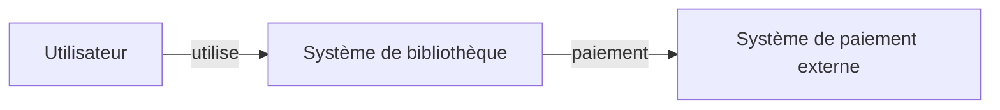
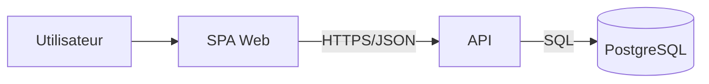
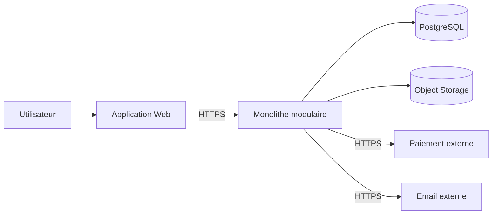

# Architecture des logiciels

> [!abstract] Objectif
> Apprendre à décider en architecture logicielle : attributs de qualité et compromis, styles (monolithe modulaire, hexagonal, microservices, événementiel), modularité et DDD, systèmes distribués et résilience, sécurité, observabilité, documentation (C4, ADR) et gouvernance des évolutions.

Voir aussi : [[Design patterns]], [[Principes SOLID en COO]], [[TOGAF]], [[Docker]], [[HTTP]], [[Bases de données relationnelles]].

L'architecture logicielle est l'ensemble des **structures, décisions, contraintes et principes** qui déterminent comment un système est organisé et comment il peut évoluer. Elle ne consiste pas à choisir le plus grand nombre possible de technologies ni à produire de beaux diagrammes : elle sert avant tout à rendre les **compromis explicites** et à préserver les qualités importantes du système dans le temps.

> [!important]
> Une architecture n'est pas « bonne » dans l'absolu. Elle est adaptée — ou non — à un **contexte**, à des **contraintes**, à des **risques** et à des **attributs de qualité**.

Ce cours complète notamment [[Design patterns]], [[Principes SOLID en COO]], [[Docker]], [[HTTP]], [[Les protocoles de communications]], [[Sécurité avancée sous Linux]], [[RGPD]] et [[Mermaid pour Obsidian]].

## Plan du cours

1. Fondamentaux de l'architecture logicielle
2. Exigences, contraintes et attributs de qualité
3. Décisions architecturales et compromis
4. Modularité, couplage et cohésion
5. Styles architecturaux
6. Architecture hexagonale, Clean Architecture et ports/adapters
7. Domain-Driven Design et frontières métier
8. Patterns architecturaux
9. Données, cohérence et transactions
10. Architecture orientée événements
11. Microservices et systèmes distribués
12. Résilience et fiabilité
13. Performance et capacité
14. Sécurité et confidentialité par conception
15. Observabilité et exploitabilité
16. Déploiement, conteneurs, cloud et plateformes
17. Supply chain et architecture de livraison
18. Documentation : ISO 42010, C4, UML, ADR et arc42
19. Évaluation et revues d'architecture
20. Évolution, dette et modernisation
21. Organisation des équipes et architecture
22. Architectures pour IA et systèmes à agents
23. Étude de cas complète
24. Travaux pratiques et projet final

---

# 1. Fondamentaux de l'architecture logicielle

## 1.1 Qu'est-ce qu'une architecture ?

L'architecture d'un système décrit les éléments structurants qui ont un impact important sur son fonctionnement et son évolution :

- les **responsabilités** majeures ;
- les **frontières** entre modules, processus ou services ;
- les **relations** et dépendances ;
- les mécanismes de communication ;
- les modèles de données ;
- les choix de déploiement ;
- les décisions qui influencent fortement les qualités du système ;
- les contraintes techniques, réglementaires et organisationnelles.

Une classe individuelle n'est pas nécessairement un élément architectural. En revanche, une frontière entre deux domaines métier, un protocole entre deux processus, un modèle de cohérence ou une séparation de données peuvent être des décisions architecturales.

## 1.2 Architecture, conception et implémentation

Les trois niveaux se recouvrent partiellement :

| Niveau | Question typique | Exemple |
|---|---|---|
| Architecture | Comment le système est-il structuré ? | Monolithe modulaire avec événements internes |
| Conception | Comment un module résout-il son problème ? | Repository + Strategy |
| Implémentation | Comment le code réalise-t-il la conception ? | Classe Python, requête SQL, fonction |

La frontière n'est pas absolue. Une décision devient « architecturale » lorsqu'elle est **difficile ou coûteuse à changer**, touche plusieurs parties du système ou influence fortement un attribut de qualité.

## 1.3 Architecture logique et architecture physique

Il faut distinguer :

- l'**architecture logique** : responsabilités, composants, domaines, dépendances ;
- l'**architecture d'exécution** : processus, threads, files, événements ;
- l'**architecture de données** : modèles, propriétaires, réplication, cohérence ;
- l'**architecture de déploiement** : machines, conteneurs, régions, réseaux ;
- l'**architecture de développement** : dépôts, modules, packages, pipelines.

Une même architecture logique peut être déployée de plusieurs manières.

## 1.4 Architecture intentionnelle et architecture réelle

Deux architectures coexistent souvent :

1. **l'architecture intentionnelle**, décrite dans les documents ;
2. **l'architecture réelle**, observable dans le code, les dépendances, les flux réseau et l'infrastructure.

Si elles divergent, **le système exécuté a toujours raison**. La documentation doit donc être vérifiée régulièrement contre le système réel.

## 1.5 L'architecte logiciel

L'architecte n'est pas nécessairement une personne isolée ni un rôle hiérarchique. Les responsabilités architecturales peuvent être distribuées dans l'équipe.

Elles comprennent :

- comprendre le métier et les contraintes ;
- identifier les risques ;
- faciliter les décisions ;
- rendre les compromis visibles ;
- maintenir les frontières ;
- documenter les décisions importantes ;
- vérifier les qualités du système ;
- aider les équipes à expérimenter ;
- éviter les dépendances irréversibles non justifiées.

> [!warning]
> Un « architecte » qui ne lit jamais le code, n'observe jamais la production et ne vérifie jamais ses hypothèses risque de documenter un système imaginaire.

## 1.6 Architecture émergente et conception anticipée

Deux erreurs opposées sont fréquentes :

- **Big Design Up Front** : tout décider avant d'avoir suffisamment d'information ;
- **aucune conception** : laisser toutes les décisions émerger sans garde-fous.

Une approche saine consiste à :

1. décider tôt ce qui est coûteux à changer ;
2. repousser les décisions réversibles ;
3. prototyper les inconnues ;
4. mesurer ;
5. documenter les décisions significatives ;
6. faire évoluer l'architecture avec le produit.

---

# 2. Exigences, contraintes et attributs de qualité

## 2.1 Fonctionnel et non fonctionnel

Les exigences fonctionnelles indiquent **ce que le système doit faire**.

Exemples :

- créer une commande ;
- calculer un tarif ;
- envoyer une notification.

Les exigences de qualité décrivent **comment** le système doit se comporter.

Exemples :

- répondre en moins de 200 ms au percentile 95 ;
- être disponible 99,95 % ;
- restaurer les données en moins de 30 minutes ;
- permettre à une équipe de livrer un module sans redéployer tout le système.

## 2.2 ISO/IEC 25010:2023

La deuxième édition d'ISO/IEC 25010 définit neuf grandes caractéristiques de qualité du produit :

1. **adéquation fonctionnelle** (*functional suitability*) ;
2. **efficacité de performance** ;
3. **compatibilité** ;
4. **capacité d'interaction** (*interaction capability*) ;
5. **fiabilité** ;
6. **sécurité** ;
7. **maintenabilité** ;
8. **flexibilité** ;
9. **sûreté** (*safety*).

Ces catégories fournissent un vocabulaire, mais une architecture doit les traduire en **scénarios mesurables**.

## 2.3 Scénarios d'attributs de qualité

Une exigence vague :

> Le système doit être performant.

Une exigence exploitable :

> Pour une recherche standard, avec 5 000 utilisateurs simultanés et un catalogue de 10 millions d'objets, 95 % des réponses doivent être produites en moins de 300 ms, hors latence réseau externe.

On peut décrire un scénario par :

- **source** du stimulus ;
- **stimulus** ;
- **environnement** ;
- **artefact** concerné ;
- **réponse attendue** ;
- **mesure** de la réponse.

## 2.4 Contraintes

Une contrainte n'est pas un objectif à optimiser ; c'est une limite imposée.

Exemples :

- données hébergées dans l'Union européenne ;
- PostgreSQL imposé par l'organisation ;
- compatibilité avec un protocole industriel existant ;
- équipe de quatre personnes ;
- fonctionnement hors ligne ;
- budget maximal ;
- exigences RGPD ;
- matériel embarqué à 512 Mo de RAM.

Une architecture qui ignore une contrainte réelle est invalide, même si elle est élégante.

## 2.5 Les qualités entrent en conflit

Exemples de tensions :

- sécurité ↔ facilité d'utilisation ;
- cohérence forte ↔ disponibilité/latence ;
- faible coût ↔ redondance ;
- isolation forte ↔ performance ;
- déploiement indépendant ↔ simplicité opérationnelle ;
- abstraction ↔ contrôle fin ;
- flexibilité ↔ simplicité.

L'architecture est donc une discipline de **trade-offs**.

---

# 3. Décisions architecturales et compromis

## 3.1 Décisions réversibles et irréversibles

Toutes les décisions ne méritent pas le même niveau d'analyse.

### Décision facilement réversible

- changer un outil de formatage ;
- modifier la disposition d'une page ;
- remplacer une petite bibliothèque isolée.

### Décision coûteuse à inverser

- partager une base entre dix services ;
- choisir un modèle de partitionnement irréversible ;
- exposer une API publique utilisée par des tiers ;
- construire autour d'un fournisseur propriétaire sans abstraction ni plan de sortie.

Plus une décision est coûteuse à inverser, plus il faut obtenir des **preuves** avant de la figer.

## 3.2 ADR — Architecture Decision Record

Un ADR enregistre une décision importante avec son contexte et ses conséquences.

Exemple :

```markdown
# ADR-004 — Utiliser PostgreSQL comme source de vérité

Date: 2026-08-29
Statut: accepté

## Contexte

Nous avons besoin de transactions ACID et de contraintes relationnelles fortes.

## Décision

PostgreSQL sera la source de vérité des commandes.

## Alternatives étudiées

- MongoDB
- DynamoDB
- stockage événementiel intégral

## Conséquences

Positives :
- transactions simples ;
- contraintes fortes ;
- compétences déjà présentes.

Négatives :
- montée en charge horizontale moins transparente ;
- dépendance aux capacités PostgreSQL pour le cœur transactionnel.
```

Un ADR documente **pourquoi** une décision a été prise. Un diagramme documente principalement **ce qui existe**.

## 3.3 Ne pas transformer les ADR en journal de tout

Un ADR est utile pour une décision qui :

- influence plusieurs modules ;
- modifie un contrat ;
- entraîne un coût significatif ;
- introduit une dépendance structurante ;
- répond à un risque important.

Il est inutile de créer un ADR pour chaque nom de variable.

## 3.4 Architecture fitness functions

Une *fitness function* est un contrôle automatisé ou mesurable qui vérifie qu'une propriété architecturale reste vraie.

Exemples :

- aucun module `domain` n'importe `infrastructure` ;
- p95 < 300 ms ;
- aucune image Docker ne s'exécute en root ;
- aucun service ne dépend directement de la base d'un autre service ;
- couverture des contrats API ;
- dépendances cycliques interdites.

L'architecture devient ainsi en partie **exécutable**.

---

# 4. Modularité, couplage et cohésion

## 4.1 La modularité avant la distribution

Un système modulaire n'est pas nécessairement un ensemble de microservices.

La première question est :

> Où sont les frontières de responsabilité ?

La deuxième seulement :

> Ces frontières doivent-elles correspondre à des processus déployés séparément ?

## 4.2 Cohésion

Un module cohérent rassemble des éléments qui changent pour des raisons proches.

Mauvais découpage :

```text
utils/
services/
helpers/
managers/
```

Meilleur découpage métier :

```text
catalogue/
commande/
facturation/
expedition/
```

## 4.3 Couplage

Le couplage peut être :

- structurel ;
- temporel ;
- de données ;
- de protocole ;
- de disponibilité ;
- organisationnel.

Deux services peuvent être dans deux dépôts différents mais rester extrêmement couplés si l'un ne peut fonctionner sans l'autre à chaque requête.

## 4.4 Dépendances orientées

Une dépendance a une direction.

```text
UI ──> Application ──> Domaine
              │
              └──> ports abstraits
                       ▲
                       │
              Infrastructure
```

Le cœur métier doit autant que possible dépendre de **concepts stables**, et non de détails d'infrastructure.

## 4.5 Cycles de dépendances

Un cycle :

```text
A -> B -> C -> A
```

rend l'évolution plus difficile :

- construction et tests couplés ;
- compréhension globale nécessaire ;
- déploiements coordonnés ;
- propagation des changements.

Les cycles importants doivent être détectés automatiquement lorsque cela est possible.

## 4.6 Monolithe modulaire

Le **monolithe modulaire** combine :

- une unité de déploiement principale ;
- des frontières internes fortes ;
- des contrats entre modules ;
- une propriété claire des données ;
- la possibilité d'extraire certains modules plus tard.

Pour de nombreuses équipes, il constitue un meilleur point de départ que les microservices.

---

# 5. Styles architecturaux

## 5.1 Monolithe

Un monolithe est déployé comme une unité principale.

Avantages :

- transactions locales ;
- appels en mémoire ;
- debug plus simple ;
- déploiement facile ;
- coût opérationnel faible.

Inconvénients possibles :

- frontières internes difficiles à maintenir ;
- déploiement global ;
- scaling moins granulaire ;
- risque de « big ball of mud ».

> [!important]
> « Monolithe » ne signifie pas « mauvais design ». Un monolithe modulaire peut être plus robuste qu'une collection de microservices fortement couplés.

## 5.2 Architecture en couches

Exemple :

```text
Présentation
    ↓
Application
    ↓
Domaine
    ↓
Infrastructure / données
```

Avantages :

- modèle facile à comprendre ;
- responsabilités séparées ;
- adapté à de nombreuses applications classiques.

Risque : toutes les couches deviennent de simples tuyaux et le domaine se retrouve dépendant de la base.

## 5.3 Client/serveur

Le modèle client/serveur sépare les responsabilités entre consommateurs et fournisseurs de services.

Il se retrouve dans :

- navigateur ↔ serveur HTTP ;
- client SQL ↔ base de données ;
- application ↔ API.

## 5.4 SOA

Une architecture orientée services (*Service-Oriented Architecture*) organise le SI autour de services métier réutilisables, souvent associés à :

- contrats explicites ;
- intégration inter-applications ;
- orchestration ;
- gouvernance ;
- parfois ESB.

SOA et microservices ne sont pas synonymes.

## 5.5 Microservices

Un microservice est une unité de capacité métier pouvant être déployée de manière largement indépendante.

Caractéristiques recherchées :

- frontière métier explicite ;
- propriété de ses données ;
- contrat de communication ;
- cycle de déploiement autonome ;
- observabilité propre.

Le mot **micro** ne fournit aucune taille optimale en lignes de code.

## 5.6 Event-driven architecture

Les composants communiquent via des événements :

```text
Commande créée
      │
      ├──> Paiement
      ├──> Stock
      └──> Notifications
```

Cette architecture réduit certains couplages temporels mais introduit :

- cohérence éventuelle ;
- duplication ;
- besoin d'idempotence ;
- difficulté de traçage ;
- gestion des événements en erreur.

## 5.7 Pipe-and-filter

Chaque étape transforme un flux :

```text
entrée -> filtre A -> filtre B -> filtre C -> sortie
```

Exemples :

- compilateurs ;
- ETL ;
- traitements multimédias ;
- pipelines ML.

## 5.8 Architecture plugin / microkernel

Un noyau stable fournit les mécanismes essentiels et des extensions ajoutent les fonctionnalités.

Exemples :

- IDE ;
- CMS ;
- moteurs de règles ;
- applications à plugins.

## 5.9 Serverless et fonctions

Le style *functions as a service* peut être intéressant pour :

- charge irrégulière ;
- événements ;
- traitements ponctuels ;
- réduction de l'administration serveur.

Il introduit :

- contraintes de durée et d'environnement ;
- dépendance à une plateforme ;
- démarrages à froid selon les contextes ;
- observabilité distribuée ;
- gestion particulière de l'état.

## 5.10 Architecture distribuée ≠ meilleure architecture

Distribuer un système transforme des appels de fonctions fiables et rapides en communications réseau pouvant :

- expirer ;
- être dupliquées ;
- arriver dans le désordre ;
- être partiellement exécutées ;
- être indisponibles.

La distribution doit répondre à un **besoin démontré**.

---

# 6. Architecture hexagonale, Clean Architecture et ports/adapters

## 6.1 Objectif commun

Ces familles d'architecture visent principalement à protéger le **cœur métier** contre les détails externes.

```text
         Web
          │
       Adapter
          │
          ▼
      [ Port ]
          │
     Application
          │
       Domaine
          │
      [ Port ]
          ▲
          │
       Adapter
          │
       PostgreSQL
```

## 6.2 Ports

Un port décrit une capacité nécessaire ou fournie.

Exemple Python :

```python
from typing import Protocol

class CatalogueLivres(Protocol):
    def trouver(self, isbn: str) -> "Livre | None": ...
```

Le domaine dépend du **contrat**, pas de PostgreSQL, REST ou LDAP.

## 6.3 Adapters

Un adapter réalise un port pour une technologie donnée :

```python
class CataloguePostgreSQL:
    def __init__(self, connexion):
        self.connexion = connexion

    def trouver(self, isbn: str):
        ...
```

Un autre adapter peut être utilisé dans les tests :

```python
class CatalogueMemoire:
    def __init__(self, livres):
        self.livres = {livre.isbn: livre for livre in livres}

    def trouver(self, isbn: str):
        return self.livres.get(isbn)
```

## 6.4 Dependency inversion

La règle importante est la **direction des dépendances** :

```text
Infrastructure -> Application -> Domaine
```

Le domaine ne connaît pas :

- le framework Web ;
- SQLAlchemy ;
- Kafka ;
- Redis ;
- le SDK cloud.

## 6.5 Ne pas sur-abstraire

Créer une interface pour chaque fonction augmente inutilement le coût cognitif.

On crée une frontière lorsque :

- le détail est instable ;
- plusieurs implémentations sont plausibles ;
- le test en bénéficie ;
- le domaine doit être protégé ;
- la dépendance externe est coûteuse ou risquée.

---

# 7. Domain-Driven Design et frontières métier

## 7.1 Pourquoi le domaine ?

Un découpage purement technique produit souvent :

```text
controllers/
models/
repositories/
services/
```

Lorsque le produit grossit, toutes les fonctionnalités se mélangent.

DDD encourage à structurer autour du **métier**.

## 7.2 Ubiquitous Language

Le code, la documentation et les discussions utilisent les mêmes termes métier.

Si le métier parle de « prêt », le code ne devrait pas appeler partout ce concept `GenericTransactionManager`.

## 7.3 Bounded Context

Un *bounded context* délimite un modèle métier cohérent.

Exemple :

```text
Catalogue
  Livre = contenu éditorial

Stock
  Livre = exemplaire physique

Facturation
  Livre = ligne facturable
```

Le mot « Livre » peut avoir des significations différentes selon le contexte.

## 7.4 Aggregate

Un agrégat définit une frontière de cohérence transactionnelle.

Exemple :

```text
Commande (racine)
 ├── LigneCommande
 ├── LigneCommande
 └── AdresseLivraison
```

Toutes les invariants internes sont protégés via la racine d'agrégat.

## 7.5 Entity et Value Object

**Entity** : identité stable dans le temps.

```text
Utilisateur #8472
```

**Value Object** : défini par sa valeur.

```text
Money(10, "EUR")
Adresse(...)
```

## 7.6 Context Map

Une *context map* décrit les relations entre contextes :

- Customer/Supplier ;
- Conformist ;
- Anti-Corruption Layer ;
- Shared Kernel ;
- Open Host Service.

Le but n'est pas d'utiliser tous les termes de DDD, mais de rendre les **frontières et dépendances métier explicites**.

---

# 8. Patterns architecturaux

## 8.1 MVC

MVC sépare :

- modèle ;
- vue ;
- contrôleur.

Les implémentations varient fortement selon les frameworks.

## 8.2 MVVM

MVVM est courant dans les interfaces riches :

```text
View <-> ViewModel <-> Model
```

Le ViewModel expose l'état et les commandes adaptées à l'interface.

## 8.3 Repository

Un repository offre une collection abstraite d'entités métier.

Il n'est pas obligatoire d'en ajouter un au-dessus d'un ORM si cette couche n'apporte aucune abstraction utile.

## 8.4 Unit of Work

Le pattern Unit of Work coordonne les modifications faisant partie d'une même transaction logique.

## 8.5 CQRS

CQRS sépare conceptuellement :

- **Command** : modifie l'état ;
- **Query** : lit l'état.

CQRS ne signifie pas nécessairement :

- deux bases ;
- Kafka ;
- microservices ;
- Event Sourcing.

Une application peut appliquer CQRS dans un seul processus.

## 8.6 Event Sourcing

Avec Event Sourcing, les événements métier constituent la source de vérité :

```text
CompteCréé
+ 100 EUR Crédité
- 20 EUR Débité
```

L'état courant est reconstruit à partir des événements ou de snapshots.

Avantages :

- historique complet ;
- audit ;
- reconstruction ;
- nouveaux modèles de lecture.

Coûts :

- migrations d'événements ;
- complexité des projections ;
- debugging ;
- cohérence éventuelle.

## 8.7 Saga

Une saga coordonne une transaction métier distribuée par une série d'étapes et de compensations.

```text
Réserver stock
    ↓
Autoriser paiement
    ↓
Créer expédition
```

En cas d'échec, une action compensatoire peut annuler une étape métier. Une compensation n'est pas un `ROLLBACK` ACID magique.

## 8.8 Strangler Fig

Le pattern Strangler facilite une migration incrémentale :

```text
Clients
   │
Facade / Router
   ├──> Ancien système
   └──> Nouveau module
```

Les fonctionnalités sont déplacées progressivement.

---

# 9. Données, cohérence et transactions

## 9.1 La donnée fait partie de l'architecture

Questions structurantes :

- qui possède la donnée ?
- où est la source de vérité ?
- qui peut écrire ?
- quel modèle de cohérence ?
- combien de temps conserver ?
- comment restaurer ?
- comment faire évoluer le schéma ?

## 9.2 Base partagée

Une base partagée facilite :

- jointures ;
- transactions ;
- reporting.

Mais elle peut créer :

- dépendances implicites ;
- changements coordonnés ;
- accès directs aux tables d'autres équipes.

## 9.3 Database per service

Dans un système de services autonomes, chaque service devrait généralement posséder son modèle de données.

```text
Service Commande -> DB Commande
Service Stock    -> DB Stock
```

Il n'est pas obligatoire d'avoir un serveur physique différent pour chaque base ; le point important est la **propriété logique et contractuelle**.

## 9.4 Cohérence forte et éventuelle

Cohérence forte : une lecture observe immédiatement les écritures selon les garanties prévues.

Cohérence éventuelle : les replicas/projections convergent avec un délai.

La cohérence éventuelle n'est acceptable que si le métier peut tolérer la fenêtre d'incohérence.

## 9.5 Transactional Outbox

Problème :

```text
1. COMMIT SQL réussi
2. publication Kafka échoue
```

La base contient la commande mais aucun événement n'est publié.

Solution Outbox : écrire dans la même transaction :

```text
commande
outbox_event
```

Puis un publisher transmet l'événement.

## 9.6 Idempotence

Un consommateur doit souvent tolérer une livraison répétée :

```text
événement #42 reçu
événement #42 reçu à nouveau
```

L'effet métier ne doit être produit qu'une fois lorsque cela est requis.

Techniques :

- identifiant d'événement ;
- table d'idempotence ;
- clé métier unique ;
- opération naturellement idempotente.

## 9.7 Migrations de schéma

Une migration distribuée doit rester compatible pendant la transition.

Pattern **expand-contract** :

1. ajouter le nouveau champ ;
2. déployer un code acceptant ancien + nouveau ;
3. migrer les données ;
4. basculer les producteurs ;
5. supprimer l'ancien champ plus tard.

---

# 10. Architecture orientée événements

## 10.1 Commande, événement et message

Une commande exprime une intention :

```text
CréerCommande
```

Un événement exprime un fait passé :

```text
CommandeCréée
```

Un message est l'enveloppe technique transportée.

## 10.2 Broker

Exemples de technologies :

- Kafka ;
- RabbitMQ ;
- NATS ;
- Pulsar ;
- services de files cloud.

Le choix dépend de :

- ordre ;
- débit ;
- rétention ;
- replay ;
- routage ;
- latence ;
- opérations ;
- coût.

## 10.3 Livraison

Les formulations « exactly once » doivent être examinées avec précision. Une plateforme peut garantir certaines propriétés dans un périmètre précis, mais l'**effet métier de bout en bout** nécessite souvent idempotence et transactions adaptées.

## 10.4 Schémas d'événements

Un événement est un contrat.

Bonnes pratiques :

- identifiant ;
- type ;
- version ;
- timestamp ;
- correlation ID ;
- causation ID ;
- payload versionné.

## 10.5 Évolution des événements

Privilégier les évolutions compatibles :

- ajouter un champ optionnel ;
- ne pas changer la signification d'un champ existant ;
- versionner les ruptures ;
- conserver les consommateurs anciens pendant la transition.

---

# 11. Microservices et systèmes distribués

## 11.1 Pourquoi découper ?

Motivations valides possibles :

- équipes réellement autonomes ;
- cycles de déploiement distincts ;
- profils de charge très différents ;
- isolation forte ;
- technologies spécifiques ;
- domaine assez vaste pour justifier des frontières indépendantes.

Motivations faibles :

- « tout le monde fait des microservices » ;
- « Kubernetes est moderne » ;
- « nous avons 20 tables ».

## 11.2 Le réseau est une frontière de panne

Une requête distante peut produire :

```text
succès
échec explicite
latence longue
timeout
réponse perdue
requête exécutée mais réponse perdue
réponse dupliquée
```

Le code doit traiter ces cas.

## 11.3 API Gateway

Une gateway peut fournir :

- routage ;
- authentification ;
- rate limiting ;
- terminaison TLS ;
- agrégation limitée ;
- observabilité.

Elle ne doit pas devenir un nouveau monolithe métier.

## 11.4 Service discovery

Dans un environnement dynamique, l'adresse d'un service n'est pas nécessairement fixe.

Découverte possible par :

- DNS ;
- plateforme orchestrée ;
- registre dédié.

## 11.5 Communication synchrone vs asynchrone

### Synchrone

```text
A --HTTP/gRPC--> B
```

Avantages : simple à raisonner.

Risque : couplage temporel.

### Asynchrone

```text
A -> Broker -> B
```

Avantages : découplage temporel.

Coût : état intermédiaire, redelivery, traçage, cohérence éventuelle.

## 11.6 Chatty architecture

Si une requête utilisateur déclenche 25 appels séquentiels interservices, la latence et le risque de panne se multiplient.

Une frontière de service doit idéalement correspondre à une responsabilité suffisamment **cohérente**.

## 11.7 Distributed monolith

Un « monolithe distribué » cumule :

- coûts des microservices ;
- dépendances de déploiement ;
- base partagée ;
- appels synchrones en cascade ;
- livraisons coordonnées.

C'est souvent pire qu'un monolithe modulaire.

---

# 12. Résilience et fiabilité

## 12.1 Timeout

Tout appel distant doit avoir un timeout cohérent avec le budget global.

```text
requête utilisateur : budget 1 s
  ├─ service A : 300 ms
  ├─ service B : 400 ms
  └─ marge : 300 ms
```

Un timeout de 30 s dans chaque dépendance n'est pas compatible avec un SLO d'une seconde.

## 12.2 Retry

Un retry est utile seulement si :

- l'erreur est probablement transitoire ;
- l'opération est idempotente ou protégée ;
- on applique un backoff ;
- on ajoute du jitter ;
- on limite les tentatives.

```text
1000 clients
   ↓ panne
retry immédiat
   ↓
1000 + 1000 + 1000 requêtes
```

C'est une **retry storm**.

## 12.3 Circuit breaker

États simplifiés :

```text
CLOSED -> OPEN -> HALF_OPEN -> CLOSED
```

Le circuit breaker évite de continuer à saturer une dépendance manifestement indisponible.

## 12.4 Bulkhead

On isole les ressources :

```text
Pool paiement
Pool recherche
Pool notification
```

Une saturation de la notification ne doit pas nécessairement consommer tous les threads de paiement.

## 12.5 Backpressure

Lorsque le producteur va plus vite que le consommateur, il faut :

- ralentir ;
- tamponner avec une limite ;
- rejeter ;
- échantillonner ;
- délester.

Une queue « illimitée » déplace souvent la panne vers la mémoire ou le délai.

## 12.6 Graceful degradation

Exemple :

- recommandations indisponibles ;
- catalogue encore accessible ;
- commande encore possible.

Toutes les fonctionnalités n'ont pas la même criticité.

## 12.7 SLI, SLO et error budget

**SLI** : mesure observée.

```text
99,97 % de requêtes réussies
```

**SLO** : objectif interne.

```text
>= 99,95 % sur 30 jours
```

L'error budget représente la marge d'indisponibilité acceptable.

## 12.8 RTO et RPO

- **RTO** : durée maximale acceptable de restauration ;
- **RPO** : quantité maximale de données que l'on accepte de perdre.

Exemple :

```text
RTO = 30 min
RPO = 5 min
```

Ces objectifs déterminent l'architecture de sauvegarde, de réplication et de reprise.

---

# 13. Performance et capacité

## 13.1 Mesurer avant d'optimiser

Les performances doivent être étudiées avec :

- profilage ;
- métriques ;
- traces ;
- tests de charge ;
- données réalistes.

Une architecture plus complexe n'est pas automatiquement plus rapide.

## 13.2 Latence et throughput

**Latence** : temps d'une opération.

**Throughput** : nombre d'opérations par unité de temps.

Les deux ne sont pas interchangeables.

## 13.3 Percentiles

Une moyenne masque les extrêmes.

Préférer :

```text
p50
p95
p99
```

Une API à 50 ms en moyenne peut avoir un p99 à 5 secondes.

## 13.4 Cache

Niveaux possibles :

```text
Browser
CDN
Reverse proxy
Application
Cache distribué
Database buffer cache
```

Questions :

- qui invalide ?
- quelle durée ?
- que faire en cas de panne du cache ?
- la donnée peut-elle être périmée ?

## 13.5 Scalabilité verticale et horizontale

Verticale :

```text
8 Go RAM -> 32 Go RAM
```

Horizontale :

```text
1 instance -> 8 instances
```

Le scaling horizontal nécessite généralement :

- état externe ou partitionnable ;
- équilibrage ;
- idempotence ;
- gestion de la concurrence.

## 13.6 Load shedding

Sous surcharge, il peut être préférable de rejeter rapidement certaines requêtes plutôt que de rendre **toutes** les requêtes extrêmement lentes.

## 13.7 Capacity planning

Un modèle simple :

```text
pics d'utilisateurs
× requêtes/utilisateur
× coût/requête
× marge de sécurité
```

Les hypothèses doivent être mesurées puis révisées.

---

# 14. Sécurité et confidentialité par conception

Voir aussi [[Sécurité avancée sous Linux]], [[RGPD]] et [[OAuth OpenID]].

## 14.1 Threat modeling

Pour chaque frontière :

- quelles données ?
- qui peut appeler ?
- quelle confiance ?
- quel impact si compromis ?
- quelle preuve d'identité ?
- quelle journalisation ?

## 14.2 Trust boundaries

```text
Internet
  │
  ▼
[Reverse Proxy]
  │ trust boundary
  ▼
[Application]
  │ trust boundary
  ▼
[Database]
```

Chaque frontière implique validation et contrôle.

## 14.3 Zero Trust comme principe

Ne jamais utiliser « réseau interne » comme preuve suffisante d'identité.

Principes :

- identité explicite ;
- moindre privilège ;
- authentification des workloads ;
- segmentation ;
- logs ;
- rotation des secrets.

## 14.4 Secrets

Un secret ne doit pas être :

- dans Git ;
- dans une image Docker ;
- écrit en clair dans un log ;
- partagé entre tous les environnements.

Préférer :

- secret manager ;
- credentials courts ;
- identités de workload ;
- rotation.

## 14.5 Chiffrement

Séparer :

- données **en transit** ;
- données **au repos** ;
- données **en traitement**.

TLS ne protège pas les données une fois terminées dans l'application.

## 14.6 Privacy by design

Questions :

- a-t-on besoin de cette donnée ?
- combien de temps ?
- qui peut la consulter ?
- peut-on pseudonymiser ?
- comment supprimer ?
- dans quelles régions est-elle répliquée ?

## 14.7 Supply chain

Une architecture moderne inclut aussi les risques :

```text
Source -> Dépendances -> Build -> Registry -> Déploiement
```

Contrôles possibles :

- lockfiles ;
- SBOM ;
- signature ;
- provenance ;
- scans ;
- isolation du build ;
- politiques de déploiement.

---

# 15. Observabilité et exploitabilité

## 15.1 Observabilité

L'observabilité vise à comprendre l'état interne à partir des signaux émis par le système.

Trois signaux essentiels :

- **métriques** ;
- **logs** ;
- **traces**.

OpenTelemetry fournit aujourd'hui un cadre standard d'instrumentation de ces signaux.

## 15.2 Correlation ID

Une requête distribuée doit pouvoir être suivie :

```text
HTTP request
trace_id=abc
   │
   ├─ API
   ├─ paiement
   └─ stock
```

## 15.3 Logs structurés

Préférer :

```json
{
  "level": "error",
  "service": "payment",
  "trace_id": "abc",
  "order_id": "1234",
  "message": "provider timeout"
}
```

à :

```text
ça a planté dans paiement
```

## 15.4 Métriques USE et RED

**RED** pour un service :

- Rate ;
- Errors ;
- Duration.

**USE** pour une ressource :

- Utilization ;
- Saturation ;
- Errors.

## 15.5 Observabilité par conception

Chaque nouvelle dépendance distante doit s'accompagner de :

- métriques ;
- traces ;
- timeouts ;
- logs ;
- dashboard ;
- alerte si nécessaire ;
- runbook.

## 15.6 Exploitabilité

Un système exploitable doit permettre :

- déploiement reproductible ;
- rollback ;
- diagnostic ;
- sauvegarde ;
- restauration ;
- rotation des secrets ;
- montée de version ;
- maintenance sans connaissance tribale excessive.

---

# 16. Déploiement, conteneurs, cloud et plateformes

## 16.1 Architecture de déploiement

Exemple :

```text
Internet
   │
 CDN/WAF
   │
Load Balancer
   │
 ┌─┴──────────────┐
 │                │
App A           App B
 │                │
 └──────┬─────────┘
        │
   PostgreSQL
```

Il faut documenter les différences entre :

- développement ;
- test ;
- staging ;
- production.

## 16.2 Conteneurs

Voir [[Docker]].

Un conteneur est un mécanisme de packaging/exécution, pas un style métier.

Il ne transforme pas automatiquement :

- un monolithe en microservices ;
- une application en système scalable ;
- un logiciel en logiciel sécurisé.

## 16.3 Orchestration

Un orchestrateur peut fournir :

- scheduling ;
- service discovery ;
- rollout ;
- autoscaling ;
- secrets/config ;
- health checks.

Il introduit également une plateforme à exploiter.

## 16.4 Cloud

Un service cloud managé peut réduire le coût opérationnel mais augmenter :

- dépendance fournisseur ;
- coûts variables ;
- contraintes de localisation ;
- complexité IAM.

La question n'est pas « cloud ou non », mais quels **risques et qualités** sont mieux servis.

## 16.5 Multi-région

Une architecture multi-région exige de clarifier :

- routage ;
- réplication ;
- cohérence ;
- résidence des données ;
- failover ;
- RTO/RPO ;
- tests de bascule.

## 16.6 Platform Engineering

Une plateforme interne peut offrir aux équipes des chemins standardisés :

```text
Template service
 + CI/CD
 + observabilité
 + secrets
 + runtime
 + politiques
```

Le but est de réduire la charge cognitive, pas de créer un nouveau portail bureaucratique.

---

# 17. Supply chain et architecture de livraison

## 17.1 Le pipeline fait partie du système

```text
Git
 │
CI
 │
Build
 │
Tests
 │
Artefact
 │
Registry
 │
Deployment
```

Une compromission du pipeline peut contourner la sécurité du code source.

## 17.2 Reproductibilité

Questions :

- versions de dépendances verrouillées ?
- base image identifiée par digest ?
- build isolé ?
- artefact immuable ?
- provenance disponible ?

## 17.3 SBOM

Une Software Bill of Materials inventorie les composants d'un artefact.

Formats courants :

- SPDX ;
- CycloneDX.

Une SBOM ne prouve pas qu'un logiciel est sûr ; elle améliore la **traçabilité**.

## 17.4 Provenance

La provenance décrit comment un artefact a été construit :

- source ;
- builder ;
- paramètres ;
- identité de l'artefact ;
- environnement selon le niveau de garantie.

Le projet SLSA formalise des niveaux et exigences de sécurité de chaîne de production.

## 17.5 Déploiement progressif

Stratégies :

- rolling update ;
- blue/green ;
- canary ;
- feature flags.

Une stratégie de rollback doit être prévue **avant** l'incident.

---

# 18. Documentation : ISO 42010, C4, UML, ADR et arc42

## 18.1 Architecture et description d'architecture

ISO/IEC/IEEE 42010:2022 distingue l'**architecture** d'une entité de sa **description d'architecture**.

Le document d'architecture doit répondre aux préoccupations de parties prenantes via des **viewpoints** et des **views** adaptés.

## 18.2 Parties prenantes et concerns

Exemples :

| Partie prenante | Préoccupation |
|---|---|
| Produit | évolution fonctionnelle |
| Développeur | frontières et dépendances |
| SRE | fiabilité et observabilité |
| Sécurité | trust boundaries et menaces |
| DPO | données personnelles |
| Direction | coûts et risques |

Un seul diagramme ne répond pas à toutes ces questions.

## 18.3 C4 Model

C4 définit quatre niveaux de zoom structurels :

1. **System Context** ;
2. **Container** ;
3. **Component** ;
4. **Code**.

Le niveau Code est optionnel et souvent généré à la demande.

### 18.3.1 System Context



Objectif : montrer le système dans son environnement.

### 18.3.2 Container

Dans C4, un « container » n'est **pas forcément un conteneur Docker**. C'est une application ou un data store exécutable/déployable : application Web, API, base, application mobile, etc.



### 18.3.3 Component

Le niveau Component détaille un container lorsqu'il apporte réellement de la valeur.

### 18.3.4 Diagrammes complémentaires

C4 propose également :

- System Landscape ;
- Dynamic ;
- Deployment.

## 18.4 UML

UML reste utile lorsqu'une notation précise est nécessaire :

- séquence ;
- état ;
- activité ;
- classes ;
- déploiement.

Ne pas produire un diagramme de classes exhaustif de 500 classes si personne ne peut le lire.

## 18.5 Mermaid

Voir [[Mermaid pour Obsidian]].

Avantages :

- texte versionné dans Git ;
- diffs ;
- intégration Markdown ;
- automatisation.

## 18.6 PlantUML

PlantUML offre un très grand nombre de diagrammes et s'intègre bien aux dépôts de documentation.

## 18.7 D2 et autres outils

D2, Structurizr, Graphviz ou des outils de modélisation spécialisés peuvent être préférables selon les besoins.

Le principe reste : **diagram as code lorsque cela apporte une valeur de maintenance**.

## 18.8 arc42

arc42 propose une structure de documentation avec notamment :

- objectifs et contexte ;
- contraintes ;
- stratégie de solution ;
- building block view ;
- runtime view ;
- deployment view ;
- concepts transverses ;
- décisions ;
- risques ;
- glossaire.

C4 et arc42 sont complémentaires : C4 fournit des vues visuelles, arc42 une structure documentaire.

## 18.9 Structure de dépôt recommandée

```text
docs/
├── architecture/
│   ├── README.md
│   ├── context.md
│   ├── containers.md
│   ├── runtime.md
│   ├── deployment.md
│   ├── data.md
│   ├── security.md
│   ├── quality.md
│   ├── risks.md
│   └── adr/
│       ├── 0001-record-architecture-decisions.md
│       └── 0002-use-postgresql.md
├── runbooks/
└── api/
```

## 18.10 Documentation vivante

Une documentation utile doit être :

- proche du code ;
- versionnée ;
- revue ;
- datée ;
- testable lorsque possible ;
- liée aux ADR ;
- supprimée lorsqu'elle devient fausse.

> [!tip]
> Une documentation courte, exacte et maintenue vaut mieux qu'un dossier UML exhaustif obsolète.

---

# 19. Évaluation et revues d'architecture

## 19.1 Architecture review

Une revue doit chercher des **risques**, pas distribuer des notes esthétiques.

Questions :

- quelles sont les qualités prioritaires ?
- où sont les single points of failure ?
- quelles données sont critiques ?
- quelles dépendances sont irréversibles ?
- comment restaure-t-on ?
- comment observe-t-on ?
- quelles parties sont difficiles à changer ?

## 19.2 ATAM — idée générale

L'Architecture Tradeoff Analysis Method met l'accent sur :

- scénarios de qualité ;
- décisions ;
- points sensibles ;
- compromis ;
- risques.

On peut reprendre cet esprit sans appliquer une cérémonie complète.

## 19.3 Risk storming

À partir d'un diagramme d'architecture :

1. identifier les zones critiques ;
2. attribuer une probabilité ;
3. attribuer un impact ;
4. discuter des mitigations.

## 19.4 Tests architecturaux

Exemples :

- tests de contrats ;
- tests de résilience ;
- tests de charge ;
- tests de restauration ;
- architecture tests sur les dépendances ;
- tests de migration ;
- tests de sécurité.

## 19.5 Chaos engineering

Le chaos engineering consiste à vérifier des hypothèses de résilience via des expériences contrôlées.

Exemples :

- tuer une instance ;
- ajouter de la latence ;
- couper une dépendance ;
- saturer une ressource.

Jamais sans garde-fous, observabilité et possibilité d'arrêt.

---

# 20. Évolution, dette et modernisation

## 20.1 L'architecture évolue

Une architecture doit changer avec :

- le métier ;
- la charge ;
- l'équipe ;
- les risques ;
- la réglementation ;
- les technologies.

Une décision raisonnable en 2023 peut être inadéquate en 2028.

## 20.2 Dette technique

Toute dette n'est pas mauvaise. Une dette **consciente, mesurée et remboursable** peut être un compromis économique.

Problème : dette invisible et sans propriétaire.

## 20.3 Dette architecturale

Exemples :

- cycles entre modules ;
- base partagée empêchant l'autonomie ;
- protocole propriétaire non documenté ;
- dépendance obsolète au cœur du système ;
- absence d'observabilité ;
- secrets diffusés partout.

## 20.4 Mesurer la dette

Indicateurs :

- temps nécessaire pour livrer un changement ;
- fréquence des déploiements coordonnés ;
- incidents liés aux mêmes causes ;
- nombre de composants impactés par une modification ;
- dépendances circulaires ;
- âge des dépendances critiques.

## 20.5 Strangler et migration incrémentale

Préférer une migration progressive :

```text
Ancien système
   │
   ├── fonctionnalité A
   ├── fonctionnalité B ---> Nouveau module B
   └── fonctionnalité C
```

à une réécriture totale lorsque le risque métier est élevé.

## 20.6 Branch by abstraction

Pour remplacer une dépendance :

1. introduire une abstraction ;
2. faire passer l'ancien comportement derrière ;
3. ajouter la nouvelle implémentation ;
4. basculer progressivement ;
5. supprimer l'ancienne.

## 20.7 Réécriture totale

Une réécriture peut être justifiée, mais elle perd souvent :

- années de corrections métier ;
- cas limites ;
- compréhension opérationnelle.

Elle doit être motivée par des contraintes objectives et un plan de transition.

---

# 21. Organisation des équipes et architecture

## 21.1 Loi de Conway

La structure de communication d'une organisation influence souvent la structure du logiciel.

Si cinq équipes doivent modifier le même module pour chaque fonctionnalité, le problème n'est peut-être pas seulement technique.

## 21.2 Ownership

Pour chaque capacité :

- qui décide ?
- qui exploite ?
- qui répond en incident ?
- qui peut modifier ?

Un composant « possédé par tout le monde » est souvent possédé par personne.

## 21.3 Team Topologies — concepts utiles

Une organisation peut distinguer notamment :

- équipes orientées flux métier ;
- équipe plateforme ;
- équipe enabling ;
- équipe de sous-système complexe.

Ces catégories sont des outils de réflexion, pas un organigramme universel.

## 21.4 Architecture centralisée vs fédérée

### Centralisée

Avantages : cohérence.

Risques : goulot d'étranglement.

### Fédérée

Avantages : autonomie.

Risques : duplication et fragmentation.

Une approche courante :

- principes communs ;
- standards minimaux ;
- décisions locales dans les frontières ;
- revue seulement pour les décisions transverses.

## 21.5 Golden paths

Une plateforme peut fournir des chemins recommandés :

```text
Créer API
 -> template
 -> CI
 -> observabilité
 -> sécurité
 -> déploiement
```

Le *golden path* doit rester utile et suffisamment flexible pour les cas légitimes.

---

# 22. Architectures pour IA et systèmes à agents

## 22.1 Un modèle n'est pas tout le système

Architecture d'une application LLM :

```text
Utilisateur
   │
API / Orchestrateur
   ├──> Modèle
   ├──> RAG
   ├──> Outils
   ├──> Mémoire
   └──> Policy / Guardrails
```

Voir [[LLM]] et [[RAG]].

## 22.2 RAG

Un système RAG comporte typiquement :

```text
Ingestion -> parsing -> chunks -> embeddings -> index
                                      │
Question -> retrieval -> context -> LLM -> réponse
```

Décisions architecturales :

- source de vérité ;
- fraîcheur ;
- droits d'accès ;
- indexation ;
- citations ;
- observabilité ;
- effacement de données.

## 22.3 Agents et outils

Un agent capable d'appeler des outils doit être traité comme un composant **non déterministe à privilèges contrôlés**.

Principes :

- allowlist d'outils ;
- validation des paramètres ;
- moindre privilège ;
- confirmation humaine pour actions sensibles ;
- journalisation ;
- budgets ;
- timeout ;
- sandbox.

## 22.4 Prompt injection

Une donnée externe peut contenir des instructions hostiles.

```text
Page Web -> RAG -> LLM -> outil interne
```

Il faut séparer :

- données ;
- instructions système ;
- politiques ;
- autorisation effective de l'outil.

## 22.5 Model gateway

Une gateway de modèles peut centraliser :

- routage ;
- quotas ;
- journalisation ;
- fallback ;
- masquage de secrets ;
- politique de données ;
- choix fournisseur.

Elle peut aussi devenir un point unique de panne et doit être conçue en conséquence.

## 22.6 Évaluation continue

Pour l'IA, les fitness functions peuvent inclure :

- qualité de réponse ;
- hallucinations ;
- précision du retrieval ;
- latence ;
- coût par requête ;
- taux d'appel d'outil invalide ;
- sécurité.

---

# 23. Étude de cas complète : plateforme de bibliothèque numérique

## 23.1 Contexte

Nous devons créer une plateforme permettant :

- recherche de documents ;
- prêt numérique ;
- gestion des comptes ;
- paiement de services optionnels ;
- notifications ;
- administration.

Contraintes :

- équipe de 6 développeurs ;
- 50 000 utilisateurs ;
- données personnelles soumises au RGPD ;
- disponibilité cible 99,9 % ;
- budget d'exploitation limité.

## 23.2 Première décision : monolithe modulaire

Choix :

```text
Application
├── identity
├── catalogue
├── lending
├── billing
└── notification
```

Pourquoi pas 5 microservices dès le départ ?

- petite équipe ;
- charge modérée ;
- nombreuses transactions locales ;
- besoin d'aller vite ;
- autonomie de déploiement encore faible.

## 23.3 Frontières



## 23.4 Données

Chaque module possède ses tables logiquement :

```text
identity.*
catalogue.*
lending.*
billing.*
```

Les modules ne requêtent pas directement les tables internes d'un autre module.

## 23.5 Événements internes

```text
LoanCreated
PaymentConfirmed
LoanExpired
```

Les événements restent d'abord **in-process**, ce qui permet de garder un modèle simple.

## 23.6 Extraction future

Si `notification` devient lourd :

1. stabiliser son contrat ;
2. ajouter outbox ;
3. déplacer vers un worker ;
4. introduire broker si nécessaire ;
5. mesurer avant/après.

## 23.7 Attributs de qualité

| Qualité | Décision |
|---|---|
| Maintenabilité | modules métier explicites |
| Performance | appels locaux pour le cœur |
| Sécurité | OIDC, moindre privilège |
| Résilience | timeout/retry sur fournisseurs externes |
| Observabilité | traces + logs + métriques |
| Flexibilité | ports sur paiement et stockage |
| Coût | une plateforme de déploiement principale |

## 23.8 ADR essentiels

- ADR-001 : monolithe modulaire ;
- ADR-002 : PostgreSQL source de vérité ;
- ADR-003 : OIDC pour l'identité ;
- ADR-004 : object storage pour les fichiers ;
- ADR-005 : événements internes + outbox si extraction.

## 23.9 SLO

```text
Disponibilité API : 99,9 % / mois
p95 recherche : < 400 ms
p95 création prêt : < 700 ms
RPO : 15 min
RTO : 60 min
```

## 23.10 Quand passer aux microservices ?

Seulement si des preuves apparaissent :

- besoin de scaling indépendant ;
- équipe séparée ;
- fréquence de déploiement incompatible ;
- exigences d'isolation ;
- besoin opérationnel justifié.

---

# 24. Travaux pratiques et projet final

## TP 1 — Cartographier un système existant

Objectif : produire :

- acteurs ;
- systèmes externes ;
- System Context ;
- principaux risques.

Livrable : `context.md` + diagramme Mermaid.

## TP 2 — Scénarios de qualité

Écrire au moins 8 scénarios mesurables couvrant :

- performance ;
- sécurité ;
- fiabilité ;
- maintenabilité ;
- flexibilité.

## TP 3 — ADR

Prendre une décision réelle et rédiger :

- contexte ;
- alternatives ;
- décision ;
- conséquences ;
- critères de réévaluation.

## TP 4 — Monolithe modulaire

Créer quatre modules métier et vérifier automatiquement l'absence de dépendances interdites.

## TP 5 — Architecture hexagonale

Implémenter :

- un cas d'usage ;
- un port repository ;
- un adapter mémoire ;
- un adapter SQL ;
- des tests sans base réelle.

## TP 6 — Event-driven

Concevoir :

```text
OrderCreated -> Billing
             -> Stock
             -> Notification
```

Définir :

- schéma ;
- idempotence ;
- retry ;
- dead-letter strategy ;
- observabilité.

## TP 7 — Outbox

Simuler la panne suivante :

```text
DB COMMIT OK
Broker DOWN
```

Puis corriger avec le pattern Outbox.

## TP 8 — Résilience

Sur une API appelant un service externe :

- timeout ;
- retry avec backoff/jitter ;
- circuit breaker ;
- métriques.

## TP 9 — Threat modeling

À partir d'un diagramme :

- identifier les trust boundaries ;
- données sensibles ;
- menaces ;
- contrôles ;
- risques résiduels.

## TP 10 — Observabilité

Instrumenter un flux distribué avec :

- trace ID ;
- logs structurés ;
- métriques RED ;
- dashboard minimal.

## TP 11 — Revue d'architecture

Analyser une architecture donnée et fournir :

- 5 risques ;
- 3 points sensibles ;
- 3 compromis ;
- 5 questions non résolues ;
- recommandations priorisées.

## TP 12 — Modernisation incrémentale

À partir d'un monolithe ancien :

1. cartographier ;
2. identifier une frontière métier ;
3. introduire une abstraction ;
4. migrer avec Strangler ;
5. préserver la compatibilité ;
6. mesurer les effets.

# Projet final — Concevoir et défendre une architecture

## Contexte

Concevoir une plateforme SaaS multi-utilisateurs avec :

- application Web ;
- API ;
- tâches asynchrones ;
- paiements ;
- stockage de fichiers ;
- notifications ;
- authentification ;
- données personnelles ;
- déploiement automatisé.

## Livrables

### 1. Contexte

- objectifs métier ;
- contraintes ;
- parties prenantes ;
- risques.

### 2. Attributs de qualité

Au moins 10 scénarios mesurables.

### 3. C4

- System Context ;
- Container ;
- Deployment ;
- Component seulement si utile.

### 4. ADR

Au moins 5 décisions structurantes.

### 5. Données

- sources de vérité ;
- propriété ;
- sauvegarde ;
- RPO/RTO ;
- conformité RGPD.

### 6. Résilience

- timeouts ;
- retries ;
- dégradation ;
- SLO ;
- reprise.

### 7. Sécurité

- trust boundaries ;
- identité ;
- secrets ;
- chiffrement ;
- audit.

### 8. Observabilité

- logs ;
- métriques ;
- traces ;
- alertes ;
- runbooks.

### 9. Livraison

- CI/CD ;
- artefacts ;
- SBOM ;
- rollback ;
- stratégie de déploiement.

### 10. Défense

Présenter les compromis et répondre à la question :

> Qu'est-ce qui vous ferait changer cette architecture dans six mois ?

---

# Checklist d'architecture

## Contexte

- [ ] Le problème métier est compris.
- [ ] Les parties prenantes sont identifiées.
- [ ] Les contraintes sont écrites.
- [ ] Les hypothèses sont explicites.

## Qualité

- [ ] Les qualités prioritaires sont classées.
- [ ] Elles disposent de scénarios mesurables.
- [ ] Les compromis sont documentés.

## Structure

- [ ] Les frontières sont explicites.
- [ ] La propriété des données est claire.
- [ ] Les dépendances sont orientées.
- [ ] Les cycles importants sont évités.

## Distribution

- [ ] Chaque appel distant a un timeout.
- [ ] Les retries sont justifiés et bornés.
- [ ] L'idempotence est traitée.
- [ ] Les échecs partiels sont prévus.

## Sécurité

- [ ] Les trust boundaries sont identifiées.
- [ ] Les secrets sont gérés hors du code.
- [ ] Le moindre privilège est appliqué.
- [ ] Les données personnelles sont cartographiées.

## Résilience

- [ ] SLI/SLO définis.
- [ ] RTO/RPO définis.
- [ ] Les sauvegardes sont testées.
- [ ] Le rollback est possible.

## Observabilité

- [ ] Logs structurés.
- [ ] Métriques utiles.
- [ ] Traces pour les flux distribués.
- [ ] Correlation/trace ID.
- [ ] Runbooks pour les incidents critiques.

## Documentation

- [ ] System Context à jour.
- [ ] Container diagram à jour.
- [ ] ADR pour les décisions structurantes.
- [ ] Diagrammes lisibles et versionnés.
- [ ] Documentation rapprochée du code.

## Évolution

- [ ] La dette architecturale est visible.
- [ ] Les décisions ont des critères de réévaluation.
- [ ] Les migrations sont incrémentales lorsque possible.
- [ ] Les fitness functions protègent les invariants importants.

---

# Glossaire

**ADR** : Architecture Decision Record.

**Aggregate** : frontière de cohérence transactionnelle en DDD.

**Bounded Context** : frontière dans laquelle un modèle métier a un sens cohérent.

**C4** : modèle de visualisation par niveaux Context, Container, Component et Code.

**CQRS** : séparation conceptuelle entre commandes et lectures.

**Couplage** : niveau de dépendance entre éléments.

**Cohésion** : degré auquel les éléments d'un module appartiennent à une responsabilité commune.

**Event Sourcing** : stockage de l'historique des événements comme source de vérité.

**Fitness Function** : contrôle vérifiant qu'une propriété architecturale reste vraie.

**Idempotence** : propriété permettant de répéter une opération sans multiplier son effet au-delà de ce qui est défini.

**RPO** : perte maximale de données acceptable exprimée dans le temps.

**RTO** : durée maximale acceptable avant restauration du service.

**Saga** : coordination de transaction métier distribuée avec étapes et compensations.

**SLI** : indicateur de niveau de service observé.

**SLO** : objectif de niveau de service.

**Trust Boundary** : frontière où change le niveau de confiance et où des contrôles sont nécessaires.

---

# Références

## Normes et modèles

- ISO/IEC/IEEE 42010:2022 — *Software, systems and enterprise — Architecture description* : https://www.iso.org/standard/74393.html
- ISO/IEC 25010:2023 — *SQuaRE — Product quality model* : https://www.iso.org/standard/78176.html
- C4 Model : https://c4model.com/
- arc42 : https://arc42.org/

## Observabilité et supply chain

- OpenTelemetry — Concepts d'observabilité : https://opentelemetry.io/docs/concepts/observability-primer/
- SLSA 1.2 : https://slsa.dev/spec/v1.2/

## Notes liées

- [[Design patterns]]
- [[Principes SOLID en COO]]
- [[Docker]]
- [[HTTP]]
- [[Les protocoles de communications]]
- [[Sécurité avancée sous Linux]]
- [[RGPD]]
- [[OAuth OpenID]]
- [[Mermaid pour Obsidian]]
- [[LLM]]
- [[RAG]]

---

# Conclusion

L'architecture logicielle consiste moins à connaître une liste de styles qu'à savoir **raisonner sous contraintes**.

Une bonne démarche architecturale est capable de répondre à six questions :

1. **Quelles qualités comptent réellement ?**
2. **Où sont les frontières ?**
3. **Quelles décisions sont coûteuses à inverser ?**
4. **Quels compromis avons-nous acceptés ?**
5. **Comment savons-nous que l'architecture fonctionne en production ?**
6. **Comment pourra-t-elle évoluer sans réécriture permanente ?**

Le meilleur résultat n'est généralement ni « tout monolithe » ni « tout microservices », ni « tout synchrone » ni « tout événementiel ». C'est une architecture suffisamment simple pour le problème actuel, suffisamment structurée pour préserver ses qualités, et suffisamment observable pour permettre aux décisions futures de s'appuyer sur des faits.
