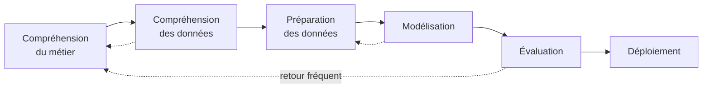

# Plan de cours

## I. Introduction au "data mining"

### 1. Concepts fondamentaux du "data mining"

- Définition et objectifs du "data mining"
- Aperçu historique et évolution du domaine

### 2. Processus de "data mining"

- Compréhension des données
- Préparation des données
- Modélisation
- Évaluation
- Déploiement

### 3. Python dans le "data mining"

- Avantages de Python pour le ""data mining""
- Écosystème des bibliothèques Python pour l'analyse de données

## II. Préparation et nettoyage des données

### 1. Exploration des données avec Pandas

- Manipulation de données avec Pandas
- Techniques d'exploration et de visualisation des données

### 2. Nettoyage et prétraitement des données

- Gestion des valeurs manquantes
- Encodage des variables catégorielles
- Normalisation et standardisation

### 3. Intégration et transformation des données

- Fusion et agrégation des données
- Techniques de réduction de dimensionnalité (PCA, t-SNE)

## III. Techniques et modèles de "data mining"

### 1. Apprentissage supervisé

- Algorithmes de classification (arbres de décision, SVM, forêts aléatoires)
- Algorithmes de régression (régression linéaire, régression logistique)

### 2. Apprentissage non supervisé

- Clustering (K-means, DBSCAN)
- Association Rule Mining (Apriori, Eclat)

### 3. Techniques avancées

- Apprentissage en profondeur avec TensorFlow et Keras
- modèles d'ensemble et techniques de boosting

## IV. Évaluation et optimisation des modèles

### 1. Métriques d'évaluation

- Métriques pour la classification et la régression
- Validation croisée et techniques de partitionnement

### 2. Optimisation des hyperparamètres

- Grid Search et Random Search
- Automatisation avec des bibliothèques comme Hyperopt

## V. Applications pratiques du "data mining"

### 1. Projets réels de "data mining"

- Études de cas et analyse de jeux de données réels
- Applications industrielles du "data mining"

### 2. Éthique et confidentialité

- Questions éthiques dans le "data mining"
- Gestion de la confidentialité et de la sécurité des données

## VI. Travaux pratiques et projets : Analyse de fr.wikipedia.org

- Récupération des données
- Prétraitement des données
- Analyse des données
	- Exploration et analyse  statistique
	- Visualisation des données
- Recherche et analyse spécifique
	- Analyse approfondie
	- Extraction d'Insights
	- Corrélations
- Conclusion et présentation
- Présentation des résultats
- Conseils pour l'exécution de l'exercice

## VII. Conclusion et ressources pour poursuivre l'apprentissage

### 1. Récapitulatif du cours

- Synthèse des compétences et connaissances acquises
- Perspectives d'avenir dans le domaine du "data mining"

### 2. Ressources supplémentaires

- Livres, cours en ligne, et communautés pour une étude approfondie
- Conseils pour rester à jour dans le domaine en évolution rapide du "data mining"

-----------------------------
# I. Introduction au "data mining"

## 1. Concepts fondamentaux du "data mining"

Le "data mining", également connu sous le nom de fouille de données, est un processus essentiel dans le domaine de l'analyse de données. Cette section introduit les concepts fondamentaux du "data mining", fournissant une base solide pour comprendre cette discipline complexe et dynamique.

### Définition du "data mining"

- **Qu'est-ce que le "data mining" ?**
    - Le "data mining" est l'art et la science de découvrir des modèles et des informations cachées dans de grandes bases de données. Il implique l'utilisation de techniques  statistiques, d'apprentissage automatique, et de reconnaissance de modèles pour extraire et identifier des informations utiles ou des connaissances à partir de grands ensembles de données.

### Objectifs du "data mining"

- **Extraction de Connaissances :**
    - L'objectif principal du "data mining" est d'extraire des connaissances significatives et exploitables à partir de grandes quantités de données. Ces connaissances peuvent prendre la forme de modèles, de relations, de tendances, ou de profils d'utilisateur.
- **Prise de Décision Basée sur les données :**
    - Le "data mining" aide les organisations à prendre des décisions éclairées en fournissant des insights approfondis basés sur l'analyse de données.

### Types de tâches en "data mining"

- **Classification et Prédiction :**
    - Il s'agit de classer les données en différentes catégories et de prédire les résultats pour de nouvelles données en se basant sur les modèles appris.
- **Clustering :**
    - Cette tâche implique de regrouper les données en clusters ou segments, où les membres de chaque groupe sont plus similaires entre eux qu'avec ceux d'autres groupes.
- **Association :**
    - Il s'agit de découvrir des règles d'association qui mettent en évidence des relations intéressantes entre les variables dans de grandes bases de données.

### Processus de "knowledge discovery in databases" (KDD)

- **Comprendre le KDD :**
    - Le "data mining" fait partie intégrante du processus de KDD, qui est le processus global d'extraction de connaissances à partir de données. Ce processus comprend la sélection des données, leur prétraitement, leur transformation, l'exécution de l'algorithme de "data mining", et l'évaluation et l'interprétation des résultats.

### Importance du "data mining"

- **Applications dans divers secteurs :**
    - Le "data mining" a des applications dans divers domaines tels que le marketing, la finance, la santé, la recherche scientifique, etc.
- **Découverte de tendances et de modèles cachés :**
    - Il permet aux organisations de découvrir des tendances et des modèles cachés qui ne seraient pas évidents sans une analyse approfondie.
## 2. Processus de "data mining"

Le processus de "data mining" est un ensemble structuré d'étapes qui guide l'exploration et l'analyse des données pour extraire des informations significatives. Chaque étape est cruciale pour garantir l'efficacité et la pertinence des résultats obtenus.

### Compréhension des données

#### Exploration initiale

- **Collecte des données :** Identification et collecte des données pertinentes pour le problème à résoudre.
- **Évaluation de la qualité :** Analyse de la qualité des données en termes de complétude, cohérence, et exactitude.

#### Analyse exploratoire

- **Statistiques descriptives :** Utilisation de  statistiques descriptives pour comprendre la distribution, la centralité, et la dispersion des données.
- **Visualisation des données :** Emploi de graphiques et de visualisations pour révéler des tendances et des modèles potentiels.

### Préparation des données

#### Nettoyage des données

- **Gestion des valeurs manquantes :** Techniques pour traiter les valeurs manquantes, telles que l'imputation ou l'élimination.
- **Correction des erreurs :** Identification et correction des erreurs et des incohérences dans les données.

#### Transformation des données

- **Normalisation et standardisation :** Ajustement des échelles des caractéristiques pour une comparaison équitable.
- **Codage des variables catégorielles :** Transformation des variables catégorielles en formats numériques utilisables par les modèles de "machine learning".

### Modélisation

#### Choix des modèles

- **Sélection d'algorithmes :** Choix des algorithmes appropriés en fonction de la nature du problème (classification, régression, clustering, etc.).
- **Construction de modèles :** Développement de modèles en utilisant des ensembles de données d'entraînement.

#### Optimisation

- **Ajustement des paramètres :** Optimisation des hyperparamètres pour améliorer les performances du modèle.
- **Validation croisée :** Utilisation de la validation croisée pour évaluer la généralisabilité du modèle.

### Évaluation

#### Analyse des résultats

- **Évaluation des performances :** Utilisation de métriques appropriées (exactitude, précision, rappel, etc.) pour évaluer la performance des modèles.
- **Interprétation :** Compréhension et interprétation des résultats en termes de pertinence pour le problème d'affaires.

#### Révision du modèle

- **Ajustements :** Modification et réajustement des modèles en fonction des résultats de l'évaluation.

### Déploiement

#### Intégration dans le processus de décision

- **Mise en production :** Intégration des modèles dans l'environnement de production pour une utilisation réelle.
- **Automatisation :** Automatisation des processus de prise de décision basés sur les modèles déployés.

#### Suivi et maintenance

- **Surveillance continue :** Suivi des performances du modèle en production et ajustement en cas de changement dans les tendances des données.
- **Mises à jour régulières :** Actualisation des modèles pour maintenir leur précision et leur efficacité face à l'évolution des données.
## 3. Python dans le "data mining"

Python s'est établi comme un langage de choix dans le domaine du "data mining" en raison de sa simplicité, de sa flexibilité et de son riche écosystème de bibliothèques dédiées à l'analyse de données. Cette section explore les avantages de Python dans le "data mining" et les outils clés disponibles dans son écosystème.

### Avantages de Python pour le "data mining"

#### Facilité d'utilisation et lisibilité

- **Syntaxe claire :** Python est réputé pour sa syntaxe claire et lisible, ce qui rend le code plus facile à comprendre et à maintenir.
- **Courbe d'apprentissage douce :** Python est souvent recommandé pour les débutants en programmation en raison de sa courbe d'apprentissage relativement douce.

#### Polyvalence et flexibilité

- **Langage polyvalent :** Python est utilisé dans divers domaines, allant du développement web à l'analyse de données, ce qui le rend extrêmement polyvalent.
- **Intégration facile :** Il peut facilement être intégré à d'autres langages et technologies, ce qui en fait un excellent choix pour le "data mining" dans des environnements complexes.

#### Communauté et soutien

- **Grande communauté :** Python bénéficie d'une large communauté de développeurs et de data scientists, ce qui facilite l'accès à un soutien, des conseils et des ressources d'apprentissage.
- **Ressources abondantes :** Il existe une multitude de tutoriels, forums, et documentation en ligne pour Python, rendant l'apprentissage et la résolution de problèmes plus accessibles.

### Écosystème des bibliothèques Python pour l'analyse de données

#### Bibliothèques de "data mining" et "machine learning"

- **Scikit-learn :** Une bibliothèque de "machine learning" proposant une large gamme d'outils pour le "data mining", y compris des algorithmes de classification, de régression, de clustering et de réduction de dimension.
- **Pandas :** Une bibliothèque offrant des structures de données et des outils d'analyse de données hautement performants et faciles à utiliser.

#### Traitement et Analyse de données

- **NumPy :** Fondation pour le calcul scientifique en Python, offrant un puissant objet tableau pour les manipulations numériques.
- **SciPy :** Utilisé pour des calculs scientifiques et techniques plus avancés.

#### Visualisation de données

- **Matplotlib :** Une bibliothèque de base pour la création de visualisations statiques, animées et interactives en Python.
- **Seaborn :** Basé sur Matplotlib, Seaborn facilite la création de graphiques  statistiques attrayants.

#### Apprentissage profond

- **TensorFlow et Keras :** Pour des modèles d'apprentissage en profondeur plus complexes, ces bibliothèques offrent des outils avancés et flexibles.

#### Bibliothèques spécialisées

- **NLTK et spaCy :** Pour le traitement du langage naturel.
- **OpenCV :** Pour le traitement d'images et la vision par ordinateur.

Pour utiliser `Spacy` pour l'analyse de texte en français, vous pouvez suivre ces étapes :

## NLTK
Pour traiter le contenu des articles Wikipedia en français et réaliser des  statistiques sur le niveau de langage, nous utiliserons la bibliothèque Natural Language Toolkit (NLTK) en Python. Voici les étapes à suivre :

### Installation de NLTK
Tout d'abord, assurons-nous que NLTK est installé dans notre environnement Python. Nous pouvons l'installer via pip :
```python
pip install nltk
```

### Téléchargement des ressources NLTK pour le Français
NLTK nécessite des ressources linguistiques spécifiques. Pour le français, téléchargeons les corpus et les tokenizers nécessaires :
```python
import nltk
nltk.download('stopwords')
nltk.download('punkt')
```

### Tokenization
La tokenization consiste à diviser le texte en mots ou phrases. Utilisons le tokenizer de NLTK adapté au français :
```python
from nltk.tokenize import word_tokenize
nltk.download('punkt')  # Si pas déjà fait

texte_francais = "Votre texte en français ici."
mots = word_tokenize(texte_francais, language='french')
```

### Suppression des "stop words"
Les stop words sont des mots très courants, peu utiles pour l'analyse  statistique. Supprimons-les :
```python
from nltk.corpus import stopwords
stop_words = set(stopwords.words('french'))

mots_filtres = [mot for mot in mots if not mot in stop_words]
```

### Analyse de fréquence
Utilisons `FreqDist` de NLTK pour analyser la fréquence des mots :
```python
from nltk.probability import FreqDist
freq = FreqDist(mots_filtres)

for mot, frequence in freq.items():
    print(f"{mot}: {frequence}")
```

### Analyse morphosyntaxique (Tagging)
Pour une analyse plus avancée, nous pouvons tagger les mots avec leurs parties du discours. NLTK supporte plusieurs taggers, mais pour le français, nous devrions peut-être trouver un tagger spécifique ou utiliser un autre package comme `Spacy` qui sera détaillé ci-après.

### Traitement avancé
- **Lemmatisation** : Réduction des mots à leur forme de base. NLTK ne fournit pas de lemmatiseur pour le français, donc nous pourrions utiliser `Spacy` ou une autre bibliothèque.
- **Analyse de Sentiments** : NLTK permet l'analyse de sentiments, mais principalement pour l'anglais. Pour le français, explorons des options comme `TextBlob-fr` ou `Spacy`.

### Visualisation
Utilisez des bibliothèques comme `Matplotlib` pour visualiser les résultats, par exemple sous forme de graphiques à barres montrant la fréquence des mots.

### Traitement à grande échelle
Pour traiter l'ensemble des articles Wikipedia en français, envisageons d'utiliser des techniques de traitement parallèle ou des plateformes comme Apache Spark, adaptées au traitement de grands volumes de données.

## Spacy
### Installation de Spacy et du modèle français
Tout d'abord, installons `Spacy` et téléchargeons le modèle pour le français :
```bash
pip install spacy
python -m spacy download fr_core_news_sm
```

### Chargement du modèle français
Chargeons le modèle français dans notre script Python :
```python
import spacy
nlp = spacy.load('fr_core_news_sm')
```

### Tokenization
Divisons un texte en mots (tokens) :
```python
texte = "Spacy est une bibliothèque très puissante pour le traitement du langage naturel."
doc = nlp(texte)
tokens = [token.text for token in doc]
print(tokens)
```

### Analyse morphosyntaxique (Part-of-Speech Tagging)
Identifions les parties du discours (noms, verbes, adjectifs, etc.) :
```python
for token in doc:
    print(token.text, token.pos_)
```

### Reconnaissance d'entités nommées (Named Entity Recognition, NER)
Détectons et catégorisons les entités nommées (noms de personnes, lieux, organisations, etc.) :
```python
for ent in doc.ents:
    print(ent.text, ent.label_)
```

### Lemmatisation
Réduisons les mots à leur forme de base :
```python
lemmes = [token.lemma_ for token in doc]
print(lemmes)
```

### Dépendances syntaxiques
Analysons la structure syntaxique et les relations entre les mots :
```python
for token in doc:
    print(token.text, token.dep_, token.head.text)
```

### "Stop Words"
Filtrons les mots courants peu informatifs :
```python
mots_filtrés = [token for token in doc if not token.is_stop]
print(mots_filtrés)
```

### Similarité de texte
Calculons la similarité entre différents textes (nécessite un modèle plus grand) :
```python
doc1 = nlp("J'aime les fruits.")
doc2 = nlp("Les pommes sont des fruits.")
similarité = doc1.similarity(doc2)
print(similarité)
```

### Visualisation avec Displacy
`Spacy` offre un outil de visualisation pour voir les entités, les dépendances, etc. :
```python
from spacy import displacy

# Pour les entités
displacy.render(doc, style='ent')

# Pour les dépendances
displacy.render(doc, style='dep')
```

# II. Préparation et nettoyage des données

## 1. Exploration des données avec Pandas

Pandas est une bibliothèque Python essentielle pour la manipulation et l'analyse de données. Elle offre des structures de données puissantes et flexibles, facilitant l'exploration, le nettoyage et la transformation des données.

### Manipulation de données avec Pandas

#### Structures de données en Pandas

- **DataFrame et Series :** Les deux principales structures de données en Pandas. DataFrame est une table bidimensionnelle, tandis que Series est unidimensionnelle.
- **Création et Chargement :** Création de DataFrames à partir de diverses sources comme des fichiers CSV, Excel, bases de données SQL, ou même de dictionnaires Python.

#### Opérations de base

- **Sélection et Filtrage :** Sélection de colonnes spécifiques, filtrage de lignes basé sur des conditions.
```python
df[df['colonne'] > valeur]
```
    
- **Tri et Rang :** Tri des données par valeurs et calcul du rang des données dans un DataFrame.
```python
df.sort_values(by='colonne')
```

#### Gestion des données manquantes

- **Détection :** Identification des valeurs manquantes avec `isnull()` ou `notnull()`.
- **Traitement :** Remplissage des valeurs manquantes (`fillna()`) ou élimination des lignes/colonnes avec des valeurs manquantes (`dropna()`).

#### Transformation des données

- **Application de fonctions :** Utilisation de `apply()` pour appliquer des fonctions aux lignes ou colonnes.
- **Groupement et agrégation :** Groupement de données avec `groupby()` suivi d'opérations d'agrégation comme `sum()`, `mean()`, etc.

### Techniques d'exploration et de visualisation des données

####  statistiques descriptives

- **Résumé  statistique :** Utilisation de `describe()` pour obtenir un résumé  statistique des colonnes numériques.
- **Corrélation :** Analyse des corrélations entre les variables avec `corr()`.

#### Visualisation avec Pandas et Matplotlib

- **Graphiques intégrés :** Pandas s'intègre étroitement avec Matplotlib pour permettre la visualisation directe des DataFrames.
```python
df['colonne'].hist()
df.plot(kind='scatter', x='col_x', y='col_y')
``` 

#### Exploration avancée

- **Tableaux Croisés :** Utilisation de `pivot_table` pour créer des tableaux croisés dynamiques.
- **Fenêtres de Temps :** Exploration des séries temporelles avec des fonctions de fenêtrage comme `rolling()`.

## 2. Nettoyage et prétraitement des données

Le nettoyage et le prétraitement des données sont des étapes cruciales dans le processus de "data mining", car la qualité des données influe directement sur la performance des modèles d'analyse.

### Gestion des valeurs manquantes

#### Identification des valeurs manquantes

- **Utilisation de Pandas :** Utiliser des fonctions comme `isna()` ou `isnull()` pour détecter les valeurs manquantes dans un DataFrame.
- **Visualisation des manquants :** Des bibliothèques comme Seaborn ou Matplotlib peuvent être utilisées pour visualiser les données manquantes, par exemple avec des heatmaps.

#### Traitement des valeurs manquantes

- **Imputation :** Remplacement des valeurs manquantes par un autre valeur, telle que la moyenne, la médiane ou le mode de la colonne.
```python
# Depuis pandas 3.0, la forme df['colonne'].fillna(..., inplace=True) est une
# affectation chaînée : elle lève ChainedAssignmentError.
df['colonne'] = df['colonne'].fillna(df['colonne'].mean())
```
    
- **Suppression :** Suppression des lignes ou des colonnes comportant des valeurs manquantes, généralement utilisée lorsque le nombre de données manquantes est négligeable.
```python
df = df.dropna()
```

### Encodage des variables catégorielles

#### Pourquoi encoder ?

- La plupart des algorithmes de machine learning travaillent mieux avec des données numériques. L'encodage transforme les variables catégorielles en format numérique.

#### Méthodes d'encodage

- **Encodage "One-Hot" :** Crée de nouvelles colonnes indiquant la présence (ou l'absence) d'une catégorie avec des valeurs binaires.
```python
pd.get_dummies(df)`
```

- **"Label Encoding" :** Attribue un identifiant unique à chaque catégorie.
```python
from sklearn.preprocessing import LabelEncoder
label_encoder = LabelEncoder()
df['colonne'] = label_encoder.fit_transform(df['colonne'])`
```

### Normalisation et standardisation

#### But de la normalisation et de la standardisation

- Ces techniques ajustent l'échelle des caractéristiques pour que les algorithmes de machine learning puissent mieux interpréter les données.

#### Techniques de normalisation

- **Min-Max Scaling :** Redimensionne les caractéristiques pour qu'elles se situent dans une plage donnée, souvent entre 0 et 1.
```python
from sklearn.preprocessing import MinMaxScaler

scaler = MinMaxScaler()
# Attention : ajuster sur le jeu complet crée une fuite de données.
# Voir le chapitre « La fuite de données » en fin de cours.
X_train_scaled = scaler.fit_transform(X_train)
X_test_scaled = scaler.transform(X_test)
```

#### Techniques de standardisation

- **Standard Scaling (Z-Score Normalization) :** Transforme les caractéristiques pour qu'elles aient une moyenne de 0 et un écart-type de 1.
```python
from sklearn.preprocessing import StandardScaler

scaler = StandardScaler()
# Même remarque : « fit » sur l'entraînement, « transform » sur le test.
X_train_scaled = scaler.fit_transform(X_train)
X_test_scaled = scaler.transform(X_test)
```

## 3. Intégration et transformation des données

L'intégration et la transformation des données sont des étapes clés dans le processus de préparation des données pour le "data mining". Elles impliquent la combinaison de données provenant de sources multiples et leur transformation en un format adapté à l'analyse.

### Fusion et agrégation des données

#### Fusion de données
- **Objectif :** Combinez des données provenant de différentes sources pour obtenir une vue complète.
- **Techniques en Pandas :**
  - `merge()`: Fusionne deux DataFrames sur la base de valeurs clés communes.
    ```python
    merged_df = pd.merge(df1, df2, on='key_column')
    ```
  - `concat()`: Concatène des DataFrames le long d'un axe spécifique.
    ```python
    concatenated_df = pd.concat([df1, df2])
    ```

#### Agrégation de données
- **Résumé  statistique :** Résumer les informations en utilisant des mesures telles que la moyenne, la médiane, la somme, etc.
- **GroupBy en Pandas :** Utilisation de `groupby()` pour regrouper les données en fonction de certaines caractéristiques et appliquer des fonctions d'agrégation.
  ```python
  grouped_df = df.groupby('category').mean()
  ```

### Techniques de réduction de dimensionnalité

#### Pourquoi réduire la dimensionnalité ?
- **Simplification des modèles :** Des ensembles de données à haute dimension peuvent être complexes à modéliser et peuvent souffrir de la malédiction de la dimensionnalité.
- **Visualisation des données :** La réduction de la dimensionnalité permet de visualiser des données multidimensionnelles dans des espaces à deux ou trois dimensions.

#### "Principal component analysis" (PCA)
- **Concept :** PCA est une technique  statistique qui utilise une transformation orthogonale pour convertir un ensemble de variables possiblement corrélées en un ensemble de valeurs de variables non corrélées appelées composantes principales.
- **Utilisation en Python :**
  ```python
  from sklearn.decomposition import PCA
  pca = PCA(n_components=2)
  pca_result = pca.fit_transform(df)
  ```

#### "t-Distributed stochastic neighbor embedding" (t-SNE)
- **Concept :** t-SNE est une technique de réduction de dimensionnalité particulièrement adaptée à la visualisation de données à haute dimension dans un espace à deux ou trois dimensions.
- **Avantages :** Très efficace pour visualiser des groupes ou des clusters de données.
- **Utilisation en Python :**
  ```python
  from sklearn.manifold import TSNE
  tsne = TSNE(n_components=2)
  tsne_result = tsne.fit_transform(df)
  ```

# III. Techniques et modèles de "data mining"

## 1. Apprentissage supervisé

L'apprentissage supervisé est une approche clé en "data mining" où le modèle est entraîné sur un ensemble de données étiqueté, c'est-à-dire que chaque exemple de l'ensemble de données est associé à une étiquette ou une sortie spécifique. Cette section explore les algorithmes populaires de classification et de régression utilisés en apprentissage supervisé.

### Algorithmes de classification

#### Arbres de décision
- **Concept :** Les arbres de décision sont des modèles prédictifs qui utilisent un ensemble de règles binaires pour calculer une décision finale. Ils sont utiles pour leur interprétabilité et leur simplicité.
- **Application en Python :**
  ```python
  from sklearn.tree import DecisionTreeClassifier
  model = DecisionTreeClassifier()
  model.fit(X_train, y_train)
  ```

#### Support Vector Machines (SVM)
- **Concept :** SVM est une technique puissante qui vise à trouver le meilleur hyperplan de séparation entre les différentes classes dans un espace multidimensionnel.
- **Application en Python :**
  ```python
  from sklearn.svm import SVC
  model = SVC()
  model.fit(X_train, y_train)
  ```

#### Forêts Aléatoires (Random Forests)
- **Concept :** Les forêts aléatoires sont une méthode d'ensemble qui utilise de multiples arbres de décision pour obtenir une prédiction plus précise et robuste.
- **Application en Python :**
  ```python
  from sklearn.ensemble import RandomForestClassifier
  model = RandomForestClassifier()
  model.fit(X_train, y_train)
  ```

### Algorithmes de Régression

#### Régression Linéaire
- **Concept :** La régression linéaire est un modèle  statistique qui vise à établir une relation linéaire entre les variables indépendantes et la variable dépendante.
- **Application en Python :**
  ```python
  from sklearn.linear_model import LinearRegression
  model = LinearRegression()
  model.fit(X_train, y_train)
  ```

#### Régression Logistique
- **Concept :** Bien qu'elle soit classée comme un modèle de régression, la régression logistique est souvent utilisée pour la classification binaire. Elle estime la probabilité qu'une instance appartienne à une classe particulière.
- **Application en Python :**
  ```python
  from sklearn.linear_model import LogisticRegression
  model = LogisticRegression()
  model.fit(X_train, y_train)
  ```

## 2. Apprentissage Non Supervisé

Contrairement à l'apprentissage supervisé, l'apprentissage non supervisé n'utilise pas de données étiquetées. Il cherche plutôt à découvrir des motifs ou des structures inhérentes aux données. Ce type d'apprentissage est essentiel pour comprendre les relations complexes au sein de vastes ensembles de données non étiquetées.

### Clustering

#### K-means
- **Principe :** K-means est une méthode de clustering qui partitionne les données en K clusters distincts en minimisant la variance intra-cluster et en maximisant la variance inter-cluster.
- **Application en Python :**
  ```python
  from sklearn.cluster import KMeans
  kmeans = KMeans(n_clusters=3)
  kmeans.fit(X)
  labels = kmeans.predict(X)
  ```
- **Utilisation :** Très utilisé pour la segmentation de marché, l'organisation de grandes bases de données, et comme outil d'exploration de données.

#### DBSCAN (Density-Based Spatial Clustering of Applications with Noise)
- **Principe :** DBSCAN est un algorithme de clustering basé sur la densité qui identifie les régions de haute densité et les sépare des régions de faible densité.
- **Application en Python :**
  ```python
  from sklearn.cluster import DBSCAN
  dbscan = DBSCAN(eps=0.5, min_samples=5)
  dbscan.fit(X)
  labels = dbscan.labels_
  ```
- **Utilisation :** Efficace pour les données ayant des formes de cluster inhabituelles et pour la détection de valeurs aberrantes.

### "Association rule mining"

#### Apriori
- **Principe :** Apriori est un algorithme classique utilisé pour l'extraction de règles d'association fréquentes. Il se base sur le principe que tous les sous-ensembles d'un ensemble d'éléments fréquent doivent également être fréquents.
- **Application en Python :**
  - Utilisation de bibliothèques comme `mlxtend` pour implémenter Apriori.
  ```python
  from mlxtend.frequent_patterns import apriori
  frequent_itemsets = apriori(df, min_support=0.5, use_colnames=True)
  ```
- **Utilisation :** Largement utilisé dans l'analyse de panier de marché, la recommandation de produits, et la découverte de motifs.

#### Eclat
- **Principe :** Eclat (Equivalence Class Clustering and bottom-up Lattice Traversal) est similaire à Apriori, mais utilise une approche différente pour explorer l'espace de données, se concentrant sur les colonnes plutôt que sur les lignes.
- **Application en Python :**
  - Implémentation similaire à celle d'Apriori, souvent utilisée dans des bibliothèques spécialisées.
- **Utilisation :** Utilisé dans des contextes similaires à Apriori, mais souvent avec une meilleure performance en termes de temps d'exécution.

## 3. Techniques avancées

Dans le domaine du "data mining", l'adoption de techniques avancées peut apporter une compréhension plus profonde et des prédictions plus précises à partir de données complexes. Parmi ces techniques, l'apprentissage en profondeur et les modèles d'ensemble, en particulier les techniques de boosting, jouent un rôle crucial.

### Apprentissage en profondeur avec TensorFlow et Keras

#### TensorFlow
- **Introduction :** TensorFlow est une bibliothèque open-source développée par Google pour les calculs numériques et l'apprentissage automatique, particulièrement adaptée à l'apprentissage en profondeur.
- **Caractéristiques :** TensorFlow offre un contrôle flexible et détaillé sur les modèles et les calculs, ce qui le rend idéal pour les projets de recherche et les applications complexes.

#### Keras
- **Introduction :** Keras est une API de haut niveau pour les réseaux de neurones, construite sur TensorFlow. Elle est conçue pour être rapide et facile à utiliser, tout en étant suffisamment flexible pour la recherche.
- **Facilité d'Utilisation :** Keras rend la création, l'entraînement et l'évaluation de modèles d'apprentissage en profondeur plus accessibles.
- **Exemple d'Utilisation :**
  ```python
  from keras.models import Sequential
  from keras.layers import Dense

  model = Sequential([
      Dense(64, activation='relu', input_shape=(X_train.shape[1],)),
      Dense(1, activation='sigmoid')
  ])
  model.compile(optimizer='adam', loss='binary_crossentropy')
  model.fit(X_train, y_train)
  ```

### modèles d'ensemble et techniques de "Boosting"

#### modèles d'ensemble
- **Concept :** Les modèles d'ensemble combinent les prédictions de plusieurs modèles de base pour améliorer la robustesse et la précision.
- **Techniques courantes :** Bagging (Bootstrap Aggregating), comme dans les forêts aléatoires, et Boosting.

#### Techniques de "Boosting"
- **Principe :** Le boosting combine les résultats de plusieurs modèles faibles pour former un modèle global plus fort. Chaque modèle consécutif corrige les erreurs de son prédécesseur.
- **Exemples :**
  - **XGBoost :** Optimisé pour la performance et l'efficacité, XGBoost est largement utilisé dans les compétitions de data science.
    ```python
    import xgboost as xgb
    model = xgb.XGBClassifier()
    model.fit(X_train, y_train)
    ```
  - **LightGBM :** Un framework de boosting rapide avec un faible usage de la mémoire, idéal pour les ensembles de données de grande taille.
  - **CatBoost :** Optimisé pour le traitement des variables catégorielles, CatBoost offre des performances de pointe sur de nombreux problèmes.
# IV. Évaluation et optimisation des modèles

## 1. Métriques d'évaluation

L'évaluation des modèles est une étape cruciale dans tout projet de "data mining". Elle implique l'utilisation de métriques spécifiques pour mesurer la performance des modèles de machine learning. Ces métriques aident à déterminer la qualité des prédictions du modèle et à identifier les domaines nécessitant des améliorations.

### Métriques pour la classification

#### Précision (Accuracy)
- **Définition :** La précision mesure la proportion totale des prédictions correctes par rapport à toutes les prédictions.
- **Utilisation :** Utile pour les ensembles de données où les classes sont à peu près équilibrées.

#### Précision (Precision) et rappel (Recall)
- **Précision :** Mesure la proportion des identifications positives qui sont effectivement correctes.
- **Rappel :** Mesure la proportion des véritables positifs qui ont été correctement identifiés par le modèle.
- **Utilisation :** Importantes pour les ensembles de données déséquilibrés ou lorsque les coûts des faux positifs/négatifs sont différents.

#### Score F1
- **Définition :** Le score F1 est la moyenne harmonique de la précision et du rappel.
- **Utilisation :** Utile lorsque l'équilibre entre la précision et le rappel est nécessaire.

#### Aire sous la courbe ROC (AUC-ROC)
- **Définition :** Mesure la capacité du modèle à distinguer entre les classes.
- **Utilisation :** Importante pour les problèmes de classification binaire, en particulier dans les contextes médicaux ou financiers.

### Métriques pour la régression

#### Erreur quadratique moyenne (MSE) et erreur absolue moyenne (MAE)
- **MSE :** La moyenne des carrés des écarts entre les prédictions et les valeurs réelles.
- **MAE :** La moyenne des valeurs absolues des écarts entre les prédictions et les valeurs réelles.
- **Utilisation :** Fournissent une mesure claire de la performance du modèle en termes d'erreur de prédiction.

#### Coefficient de détermination (R²)
- **Définition :** Mesure la quantité de variance dans la variable dépendante qui est prévisible à partir de la variable indépendante.
- **Utilisation :** Utile pour évaluer la qualité d'ajustement du modèle dans les problèmes de régression.

### Validation croisée et techniques de partitionnement

#### Validation croisée (Cross-Validation)
- **Principe :** Divise l'ensemble de données en sous-ensembles et utilise ces sous-ensembles pour évaluer la performance du modèle.
- **Types :** Validation croisée K-fold, validation croisée stratifiée, validation croisée Leave-One-Out (LOO).
- **Utilisation :** Permet une évaluation plus robuste de la performance du modèle en évitant la dépendance à un seul découpage en ensembles d'entraînement et de test.

#### Techniques de partitionnement
- **Split Train-Test :** Division simple de l'ensemble de données en un ensemble d'entraînement et un ensemble de test.
- **Stratégies de partitionnement :** Peuvent inclure des approches stratifiées pour maintenir la proportion des classes dans chaque sous-ensemble.

## 2. Optimisation des hyperparamètres

L'optimisation des hyperparamètres est une étape clé dans la construction de modèles de machine learning performants. Elle implique la recherche de la meilleure combinaison de paramètres pour un modèle, ce qui peut avoir un impact significatif sur la performance du modèle.

### "Grid Search"

#### Principe
- **Définition :** Le Grid Search consiste à tester systématiquement plusieurs combinaisons d'hyperparamètres pour trouver celle qui donne les meilleurs résultats.
- **Méthodologie :** Définir une grille d'hyperparamètres possibles et évaluer les performances du modèle pour chaque combinaison de ces paramètres.

#### Application en Python
- **Utilisation avec Scikit-learn :**
  ```python
  from sklearn.model_selection import GridSearchCV
  param_grid = {'param1': [1, 2, 3], 'param2': [0.1, 0.2, 0.3]}
  grid_search = GridSearchCV(estimator=model, param_grid=param_grid, cv=5)
  grid_search.fit(X_train, y_train)
  best_params = grid_search.best_params_
  ```

### "Random Search"

#### Principe
- **Définition :** Le Random Search sélectionne au hasard des combinaisons d'hyperparamètres à partir d'une distribution de valeurs possibles pour chaque hyperparamètre.
- **Avantages :** Peut être plus rapide que le Grid Search, en particulier lorsque l'espace des paramètres est très large.

#### Application en Python
- **Utilisation avec Scikit-learn :**
  ```python
  from sklearn.model_selection import RandomizedSearchCV
  random_search = RandomizedSearchCV(estimator=model, param_distributions=param_grid, n_iter=100, cv=5)
  random_search.fit(X_train, y_train)
  best_params = random_search.best_params_
  ```

### Automatisation avec des bibliothèques comme Hyperopt

#### Hyperopt
- **Présentation :** Hyperopt est une bibliothèque Python pour l'optimisation des hyperparamètres en utilisant des algorithmes tels que l'optimisation bayésienne et les arbres de Parzen.
- **Fonctionnalités :** Permet une recherche plus intelligente et souvent plus rapide des hyperparamètres par rapport aux approches traditionnelles comme le Grid Search ou le Random Search.

#### Utilisation d'Hyperopt
- **Exemple d'Implémentation :**
  ```python
  from hyperopt import hp, fmin, tpe, STATUS_OK, Trials

  space = {
      'param1': hp.choice('param1', [1, 2, 3]),
      'param2': hp.uniform('param2', 0.1, 0.3)
  }

  def objective(params):
      model = Model(param1=params['param1'], param2=params['param2'])
      accuracy = cross_val_score(model, X_train, y_train).mean()
      return {'loss': -accuracy, 'status': STATUS_OK}

  trials = Trials()
  best = fmin(objective, space, algo=tpe.suggest, max_evals=100, trials=trials)
  ```

# V. Applications pratiques du "data mining"

Les quatre parties précédentes ont traité de méthodes. Celle-ci traite de leur emploi : ce que la fouille de données produit réellement dans une organisation, et ce qu'elle y coûte.

## 1. Projets réels de "data mining"

### 1.1. La forme d'un projet

Un projet de fouille de données ne commence pas par un algorithme, et il échoue rarement à cause de lui. La méthodologie **CRISP-DM**, formalisée en 1999 et toujours la plus employée, en décrit six phases :



Les proportions comptent plus que la liste. Sur un projet réel, la répartition observée est de l'ordre de :

| Phase | Part du temps |
| --- | ---: |
| Compréhension du métier et des données | 30 % |
| Préparation et nettoyage | 40 % |
| Modélisation | 10 % |
| Évaluation | 10 % |
| Déploiement et suivi | 10 % |

**La modélisation — la partie que ce cours a détaillée le plus — occupe un dixième du travail.** C'est la première chose à dire à quiconque envisage ce métier.

### 1.2. La question métier avant la question technique

La faute la plus fréquente consiste à partir des données disponibles plutôt que d'une décision à prendre.

```text
mauvaise formulation   « Que peut-on trouver dans ces données ? »
bonne formulation      « Quelle décision devons-nous prendre, et
                         quelle information la rendrait meilleure ? »
```

La seconde formulation impose de définir ce qu'est un succès **avant** de commencer. Sans elle, un modèle à 92 % de justesse est un chiffre sans interprétation possible.

Deux questions à poser avant toute chose :

- **Quelle est la référence ?** Un modèle qui prédit la résiliation à 92 % dans une population où 92 % des clients restent n'a rien appris : la règle « personne ne résilie » fait aussi bien.
- **Que coûte une erreur, dans chaque sens ?** Un faux positif et un faux négatif ont rarement le même prix. En détection de fraude, refuser une transaction légitime coûte un client ; en laisser passer une frauduleuse coûte la transaction. Le seuil de décision se règle sur ce rapport, pas sur la maximisation de la justesse.

### 1.3. Trois familles d'application

**La prédiction de résiliation.** Identifier les clients susceptibles de partir, pour agir avant. C'est un problème de classification déséquilibrée — 5 à 20 % de positifs — où la métrique utile est le rappel sur la classe minoritaire, jamais la justesse globale.

Le piège caractéristique est temporel : entraîner sur des données postérieures à la résiliation. Une colonne « nombre d'appels au service client le mois dernier » prend une valeur très particulière chez quelqu'un qui vient de partir. C'est la fuite de données décrite plus loin, sous sa forme la plus difficile à repérer.

**La maintenance prédictive.** Anticiper une panne à partir de relevés de capteurs. Les positifs y sont rarissimes — moins de 1 % —, ce qui rend la justesse totalement inopérante et impose des techniques de rééchantillonnage ou de détection d'anomalies.

**La segmentation de clientèle.** Regrouper des clients par comportement pour adapter une offre. C'est le cas d'usage type du partitionnement non supervisé, avec sa difficulté propre : **aucune vérité terrain** ne permet de dire si la segmentation est bonne. Le score de silhouette mesure la cohérence géométrique, pas la pertinence commerciale — celle-ci se valide en confrontant les groupes obtenus à la connaissance métier.

### 1.4. Un projet type, de bout en bout

```python
import pandas as pd
from sklearn.model_selection import train_test_split, cross_val_score
from sklearn.pipeline import Pipeline
from sklearn.compose import ColumnTransformer
from sklearn.impute import SimpleImputer
from sklearn.preprocessing import StandardScaler, OneHotEncoder
from sklearn.ensemble import RandomForestClassifier
from sklearn.metrics import classification_report, confusion_matrix

donnees = pd.read_parquet("clients.parquet")

# 1. la référence, avant tout modèle
taux_base = donnees["resilie"].mean()
print(f"Référence : prédire « personne ne résilie » donne {1 - taux_base:.1%}")

# 2. découpage AVANT toute transformation
X = donnees.drop(columns=["resilie", "date_resiliation"])   # colonne postérieure retirée
y = donnees["resilie"]
X_train, X_test, y_train, y_test = train_test_split(
    X, y, test_size=0.2, stratify=y, random_state=42)

# 3. chaîne de traitement
numeriques = X.select_dtypes(include="number").columns
categorielles = X.select_dtypes(include=["str", "category"]).columns

modele = Pipeline([
    ("preparation", ColumnTransformer([
        ("num", Pipeline([("imp", SimpleImputer(strategy="median")),
                          ("ech", StandardScaler())]), numeriques),
        ("cat", Pipeline([("imp", SimpleImputer(strategy="most_frequent")),
                          ("enc", OneHotEncoder(handle_unknown="ignore"))]), categorielles),
    ])),
    ("classifieur", RandomForestClassifier(
        n_estimators=300, class_weight="balanced", random_state=42)),
])

# 4. validation croisée sur l'entraînement seulement
scores = cross_val_score(modele, X_train, y_train, cv=5, scoring="f1")
print(f"F1 en validation croisée : {scores.mean():.3f} ± {scores.std():.3f}")

# 5. évaluation finale, une seule fois
modele.fit(X_train, y_train)
print(classification_report(y_test, modele.predict(X_test)))
print(confusion_matrix(y_test, modele.predict(X_test)))
```

`class_weight="balanced"` compense le déséquilibre sans rééchantillonner. Et l'évaluation sur le jeu de test n'est faite **qu'une fois** : la répéter en ajustant entre-temps revient à ajuster sur le test, donc à perdre le seul estimateur honnête dont on disposait.

### 1.5. Le déploiement, et ce qui se dégrade ensuite

Un modèle en production n'est pas un modèle terminé. Deux phénomènes le dégradent silencieusement.

**La dérive des données** : la distribution des entrées change. Une crise, un changement tarifaire, un nouveau canal d'acquisition, et les clients de 2027 ne ressemblent plus à ceux sur lesquels le modèle a appris.

**La dérive du concept** : la relation entre les variables et la cible change. Les causes de résiliation ne sont plus les mêmes qu'il y a deux ans, même si les données se ressemblent.

```python
# une surveillance minimale : comparer les distributions
from scipy.stats import ks_2samp

for colonne in numeriques:
    stat, p = ks_2samp(X_train[colonne], X_production[colonne])
    if p < 0.01:
        print(f"dérive probable sur {colonne} (p={p:.4f})")
```

Trois éléments à mettre en place dès le premier déploiement, faute de quoi ils ne le seront jamais : **journaliser les prédictions** avec leurs entrées, **mesurer périodiquement** la performance réelle quand la vérité arrive, et **fixer un seuil de réentraînement** décidé à l'avance plutôt qu'après incident.

> **Un modèle est un actif périssable.** La date de son entraînement est une métadonnée aussi importante que sa performance — c'est le même raisonnement que le `date_verification` d'une procédure.

## 2. Éthique et confidentialité

Cette section est indissociable de la précédente. Les obligations décrites ici ne s'ajoutent pas au projet : elles en conditionnent la légalité.

### 2.1. Ce que le RGPD impose au projet

Trois principes s'appliquent dès la collecte, non au déploiement.

**La minimisation.** Ne collecter que ce qui est nécessaire à la finalité déclarée. Un entrepôt constitué « au cas où » est illicite, et l'argument « les données pourraient servir à un modèle futur » n'est pas une finalité.

**La limitation des finalités.** Des données collectées pour la facturation ne peuvent pas servir à entraîner un modèle de prédiction sans une nouvelle base légale. C'est le point qui bloque le plus souvent un projet techniquement prêt.

**Le droit à l'explication.** Une décision automatisée produisant des effets juridiques ou significatifs doit pouvoir être expliquée à la personne concernée.

Ce dernier point pèse directement sur le **choix du modèle**, ce qui en fait une contrainte technique et non seulement juridique :

| Modèle | Explicabilité |
| --- | --- |
| Régression logistique | coefficients lisibles, effet de chaque variable |
| Arbre de décision unique | chemin de décision énonçable en français |
| Forêt aléatoire | importance des variables, pas de règle lisible |
| Gradient boosting | idem, avec des interactions difficiles à énoncer |

Une explication *post hoc* — SHAP, LIME — approxime le comportement du modèle autour d'un point. C'est utile pour comprendre, mais ce n'est pas la règle appliquée : présenter une approximation comme la justification d'une décision est trompeur. Voir [[Règlement Général sur la Protection des Données (RGPD)]].

### 2.2. Anonymisation et pseudonymisation

Retirer le nom ne suffit pas.

```python
# pseudonymisation : réversible, reste une donnée personnelle
donnees["id"] = donnees["email"].apply(lambda e: hashlib.sha256(e.encode()).hexdigest())
```

Un identifiant haché reste un identifiant : il permet de relier toutes les lignes d'une même personne, et il se retrouve par force brute sur un espace aussi petit qu'un fichier d'adresses. Un jeu pseudonymisé demeure une donnée personnelle au sens du RGPD, avec toutes les obligations correspondantes.

La **réidentification par recoupement** est le risque principal. Un triplet code postal, date de naissance, sexe suffit à identifier une large part de la population d'un pays. La *k-anonymité* — garantir qu'au moins *k* individus partagent la même combinaison de quasi-identifiants — est la parade classique, et elle a un coût : plus *k* est grand, plus les données perdent en finesse.

```python
# vérification élémentaire de k-anonymité
quasi = ["code_postal", "annee_naissance", "sexe"]
tailles = donnees.groupby(quasi).size()
print(f"plus petit groupe : {tailles.min()} individus")
if tailles.min() < 5:
    print("réidentification possible : généraliser ou supprimer des quasi-identifiants")
```

### 2.3. Les biais

Un modèle apprend les régularités des données, y compris celles qui reproduisent une discrimination passée. Le cas d'école — un outil de tri de candidatures pénalisant les CV féminins parce que l'historique d'embauche était masculin — n'est pas une anecdote : c'est le fonctionnement normal d'un apprentissage supervisé sur un historique biaisé.

**Retirer la variable sensible ne suffit pas.** Le sexe se reconstitue depuis le prénom, l'établissement fréquenté, les activités mentionnées ; l'origine depuis le code postal. C'est la différence entre ignorer un attribut et neutraliser son effet, et la première ne garantit jamais la seconde.

Trois mesures d'équité, qui **ne peuvent pas être satisfaites simultanément** — c'est un résultat démontré, non une limite d'outillage :

| Critère | Ce qu'il exige |
| --- | --- |
| Parité démographique | même taux de prédictions positives entre groupes |
| Égalité des chances | même taux de vrais positifs entre groupes |
| Calibration | à score égal, même probabilité réelle entre groupes |

Choisir lequel appliquer est une **décision politique**, pas technique. Le rôle de l'analyste est de rendre le choix explicite et mesuré, pas de le trancher seul.

```python
# mesurer avant de discuter
for groupe, sous in donnees.groupby("groupe_protege"):
    predictions = modele.predict(sous[X.columns])
    print(f"{groupe} : taux positif {predictions.mean():.1%}, "
          f"rappel {recall_score(sous['cible'], predictions):.1%}")
```

### 2.4. Le règlement européen sur l'IA

Le règlement (UE) 2024/1689 classe les systèmes par niveau de risque. Un système employé pour le **recrutement, l'accès au crédit, l'éducation, les services essentiels ou l'application de la loi** relève de la catégorie « haut risque », qui impose notamment :

```text
gestion documentée des risques
qualité, représentativité et traçabilité des jeux de données
documentation technique et journalisation
supervision humaine effective
exactitude, robustesse et cybersécurité
```

La deuxième ligne transforme la partie II de ce cours — préparation et nettoyage — en **obligation documentée**. Ce qui relevait de la bonne pratique devient une pièce à produire en cas de contrôle.

### 2.5. Une liste de contrôle

À parcourir avant de déployer, et à archiver avec le modèle :

```text
□ finalité déclarée, base légale identifiée
□ minimisation vérifiée : chaque colonne justifiée
□ absence de variable postérieure à la cible (fuite)
□ référence établie et comparée
□ coût des deux types d'erreur estimé, seuil réglé en conséquence
□ performance mesurée par sous-groupe, pas seulement globalement
□ modèle explicable si la décision produit des effets juridiques
□ k-anonymité vérifiée si les données sont partagées
□ journalisation des prédictions en place
□ seuil et procédure de réentraînement fixés à l'avance
□ date d'entraînement et version des données consignées
```

La dernière ligne est celle qu'on oublie, et c'est celle qui manque toujours au moment où l'on cherche à comprendre pourquoi un modèle s'est mis à dériver.

---

# VI. Travaux pratiques et projets : Analyse de fr.wikipedia.org

Cet exercice a pour but de développer en groupes nos compétences en "data mining" et en analyse de données en travaillant sur un ensemble de données réel et volumineux : le contenu de la version française de Wikipedia (fr.wikipedia.org). Ce projet sera divisé en plusieurs étapes, allant de la collecte des données à leur analyse pour produire des  statistiques significatives.

## Étape 1: Récupération des données
Il est possible d'avoir une version de wikipedia en utilisant le code source php de wikimedia, voir [Téléchargement d'une version locale de wikipedia](https://linux.how2shout.com/how-to-install-mediawiki-on-ubuntu-22-04-lts-jammy/)
### Téléchargement du "dump" de Wikipedia
- **Accès aux données :** Les dumps de Wikipedia sont disponibles gratuitement sur https://dumps.wikimedia.org/. Cherchez la section correspondant à la version française (frwikis) par exemple http://mirror.accum.se/mirror/wikimedia.org/dumps/frwiki/  .
- **Sélection du Fichier :** Choisissez un dump récent qui contient le contenu de l'ensemble des pages (généralement indiqué par 'pages-articles') en format XML.

### Conseils pour le téléchargement
- Les fichiers de dump peuvent être volumineux, par exemple l'archive frwiki fait 5go en version compressée et 25go décompressée sous forme d'un seul fichier xml . Assurez-vous d'avoir une connexion stable et suffisamment d'espace de stockage.
- Utilisez des outils comme `wget` ou `curl` pour télécharger le fichier en ligne de commande.

## Étape 2: Prétraitement des données

### Extraction et nettoyage
- **Extraction :** Utilisez un outil ou une bibliothèque pour parser le fichier XML et extraire le contenu textuel des pages.
- **Nettoyage :** Nettoyez le texte extrait pour éliminer les balises HTML, les marqueurs de formatage Wiki, etc.

### Stockage des données
- **Base de données :** Envisagez de stocker les données nettoyées dans une base de données (comme SQLite, PostgreSQL) pour faciliter l'accès et la manipulation.
- **Format Structuré :** Si vous préférez travailler avec des fichiers, stockez les données dans un format structuré comme JSON ou CSV.
- Format Markdown: Après avoir analyser ce qu'apporte les formats et bases de données nous allons mapper les donner au format markdown.

## Étape 3: Analyse des données

### Exploration et analyse  statistique
- **Calcul de  statistiques Basiques :** Nombre de pages, longueur moyenne des articles, distribution des tailles d'articles, etc.
- **Analyse de Fréquence :** Fréquence des mots, analyse des thèmes les plus courants.
### Visualisation des données
- **Graphiques et Diagrammes :** Utilisez des bibliothèques comme Matplotlib ou Seaborn pour visualiser les résultats de votre analyse (par exemple, un histogramme des tailles d'articles).

## Étape 4: Recherche et analyse spécifique

### Analyse approfondie
- **Recherche de Motifs :** Analysez des motifs ou des tendances spécifiques, comme les liens entre les articles, la popularité de certains sujets, etc.
- **Text Mining :** Utilisez des techniques de NLP pour une analyse plus poussée, comme le sentiment des articles, la classification des sujets, etc.

### Extraction d'Insights
- **Corrélations :** Cherchez des corrélations intéressantes dans les données, par exemple entre la longueur des articles et leur popularité ou leur fréquence de mise à jour.

## Conclusion et présentation

### Rédaction d'un rapport
- **Synthèse des Résultats :** Compilez vos résultats et analyses dans un rapport structuré.
- **Insights et Recommandations :** Fournissez des insights clairs basés sur vos analyses et proposez des recommandations ou des conclusions.

### Présentation des résultats
- Préparez une présentation pour partager vos découvertes avec vos pairs ou la communauté. Utilisez des visualisations pour rendre votre présentation plus engageante.

## Conseils pour l'exécution de l'exercice

- **Planification :** Vu l'ampleur du projet, planifiez votre travail en décomposant le projet en tâches gérables.
- **Documentation :** Documentez votre processus d'analyse et vos méthodes pour assurer la clarté et la reproductibilité.
- **Collaboration :** Si possible, travaillez en équipe pour partager les tâches et les idées.

Cet exercice offre une opportunité exceptionnelle d'appliquer des compétences de "data mining" sur un ensemble de données réel et complexe, tout en développant une compréhension pratique des défis associés à l'analyse de grandes quantités de données textuelles.

# La fuite de données : l'erreur qui invalide tout le reste

Ce chapitre vient avant les autres parce qu'aucune métrique n'a de sens tant qu'il n'est pas compris. La *fuite de données* — **data leakage** — est l'erreur la plus coûteuse du domaine : elle ne provoque aucun message d'erreur, et elle produit d'excellents résultats. En apparence.

## Le mécanisme

Les exemples de préparation vus plus haut contiennent tous la même faute :

```python
from sklearn.preprocessing import StandardScaler

scaler = StandardScaler()
df_scaled = scaler.fit_transform(df)      # ← sur TOUT le jeu de données
```

`fit` calcule la moyenne et l'écart-type. En les calculant sur l'ensemble complet, on fait entrer dans la transformation une information issue des données de test. Le modèle est ensuite évalué sur des données qu'il a, indirectement, déjà vues.


La règle tient en une phrase :

> **Rien de ce qui est calculé à partir des données de test ne doit influencer l'entraînement — pas même une moyenne.**

## Les formes courantes

| Forme | Comment elle se manifeste |
| --- | --- |
| Normalisation globale | `fit` avant le découpage, comme ci-dessus |
| Imputation globale | remplacer les manquants par la moyenne de tout le jeu |
| Sélection de variables globale | choisir les meilleures variables sur l'ensemble complet |
| Fuite temporelle | entraîner sur des données postérieures au test |
| Variable dérivée de la cible | une colonne qui contient l'information à prédire |

La dernière est la plus vicieuse. Une colonne « date de résiliation » dans un modèle de prédiction de résiliation donnera 100 % de justesse — et zéro utilité, puisqu'elle n'existe pas au moment où l'on veut prédire.

## Le symptôme

> Un modèle qui obtient 0,99 en validation croisée et 0,60 en production n'est pas un modèle malchanceux : c'est un modèle qui a triché sans le savoir.

Une performance anormalement élevée doit toujours déclencher une recherche de fuite avant toute célébration.

---

# La chaîne de traitement scikit-learn

L'outil qui rend la fuite structurellement impossible est le `Pipeline`. Il enchaîne les transformations et le modèle en un seul objet, dont le `fit` ne voit que les données d'entraînement.

## Le découpage, d'abord

```python
from sklearn.model_selection import train_test_split

X = df.drop(columns=["cible"])
y = df["cible"]

X_train, X_test, y_train, y_test = train_test_split(
    X, y,
    test_size=0.2,
    random_state=42,
    stratify=y,          # conserve la proportion des classes
)
```

`stratify=y` est indispensable en classification déséquilibrée : sans lui, un découpage aléatoire peut placer presque toute la classe minoritaire d'un seul côté.

## Le pipeline

```python
from sklearn.pipeline import Pipeline
from sklearn.impute import SimpleImputer
from sklearn.preprocessing import StandardScaler
from sklearn.linear_model import LogisticRegression

modele = Pipeline([
    ("imputation", SimpleImputer(strategy="median")),
    ("normalisation", StandardScaler()),
    ("classifieur", LogisticRegression(max_iter=1000)),
])

modele.fit(X_train, y_train)          # tout est ajusté sur l'entraînement seul
score = modele.score(X_test, y_test)
```

Chaque étape reçoit le `fit` de l'étape précédente appliqué aux seules données d'entraînement. La fuite devient impossible **par construction**, ce qui vaut mieux que de compter sur la vigilance.

## Le traitement par colonne

Les jeux réels mêlent numérique et catégoriel, qui n'appellent pas le même prétraitement.

```python
from sklearn.compose import ColumnTransformer
from sklearn.preprocessing import OneHotEncoder

numeriques = ["age", "revenu"]
categorielles = ["ville", "categorie"]

preparation = ColumnTransformer([
    ("num", Pipeline([
        ("imputation", SimpleImputer(strategy="median")),
        ("echelle", StandardScaler()),
    ]), numeriques),
    ("cat", Pipeline([
        ("imputation", SimpleImputer(strategy="most_frequent")),
        ("encodage", OneHotEncoder(handle_unknown="ignore")),
    ]), categorielles),
])

modele = Pipeline([
    ("preparation", preparation),
    ("classifieur", LogisticRegression(max_iter=1000)),
])
```

`handle_unknown="ignore"` évite l'échec en production lorsqu'une modalité absente de l'entraînement apparaît — situation garantie sur des données réelles.

## Récupérer des DataFrames

Par défaut, un transformateur scikit-learn rend un tableau NumPy et les noms de colonnes sont perdus. Depuis la version 1.2, on peut demander des DataFrames :

```python
preparation.set_output(transform="pandas")
```

C'est précieux au moment d'inspecter ce que le prétraitement a réellement produit, et pour interpréter l'importance des variables.

## Valider, puis seulement optimiser

```python
from sklearn.model_selection import cross_val_score, GridSearchCV

scores = cross_val_score(modele, X_train, y_train, cv=5, scoring="f1_macro")
print(f"{scores.mean():.3f} ± {scores.std():.3f}")

recherche = GridSearchCV(
    modele,
    {"classifieur__C": [0.1, 1, 10]},
    cv=5, scoring="f1_macro", n_jobs=-1,
)
recherche.fit(X_train, y_train)
print(recherche.best_params_, recherche.best_score_)
```

La double barre basse `classifieur__C` désigne le paramètre `C` de l'étape nommée `classifieur` : c'est la convention qui permet d'optimiser n'importe quel maillon de la chaîne.

Et le point qui conclut le chapitre précédent : la validation croisée réajuste tout le pipeline à chaque pli, **prétraitement compris**. C'est précisément ce qu'une normalisation faite avant le découpage rendait impossible.

---

# L'écosystème en 2026

La section « Écosystème des bibliothèques » plus haut reste valable, mais trois évolutions méritent d'être connues.

## Le format colonnaire Arrow

`pandas` 3.0, `Polars`, `DuckDB` et `PyArrow` partagent désormais la même représentation mémoire. Les données passent de l'un à l'autre sans recopie ni sérialisation.

| Outil | Position |
| --- | --- |
| `pandas` | la référence, la plus documentée, l'écosystème le plus large |
| `Polars` | même domaine, exécution différée et parallèle, souvent 5 à 10 fois plus rapide |
| `DuckDB` | SQL sur des fichiers, sans serveur — idéal pour explorer un CSV de plusieurs gigaoctets |

Le choix n'oppose plus ces outils : on interroge un fichier en SQL avec DuckDB, on rend le résultat à pandas, sans coût de conversion.

```python
import duckdb

df = duckdb.sql("""
    SELECT categorie, count(*) AS n, avg(montant) AS moyenne
    FROM 'ventes.parquet'
    GROUP BY categorie
""").df()
```

## Le format Parquet

Pour tout jeu dépassant quelques dizaines de mégaoctets, le CSV n'est plus un bon choix : il ne porte aucun type, il ne compresse pas, il se relit intégralement.

```python
df.to_parquet("donnees.parquet")            # typé, compressé, colonnaire
pd.read_parquet("donnees.parquet", columns=["date", "montant"])   # lit 2 colonnes
```

La dernière ligne est l'argument décisif : un format colonnaire ne lit que les colonnes demandées.

## La fouille de texte a changé de nature

Les sections NLTK et spaCy de ce cours enseignent la chaîne classique — segmentation, mots vides, lemmatisation, étiquetage morphosyntaxique. Elle reste la bonne approche quand on veut **comprendre et contrôler** ce qui est fait, et elle demeure indispensable en linguistique de corpus.

Pour la similarité et la recherche sémantique, les plongements lexicaux l'ont supplantée :

```python
from sentence_transformers import SentenceTransformer

modele = SentenceTransformer("sentence-transformers/paraphrase-multilingual-MiniLM-L12-v2")
vecteurs = modele.encode(["Le chat dort.", "Un félin se repose."])
```

Deux phrases sans aucun mot commun obtiennent une similarité élevée, ce que `TfidfVectorizer` ne peut pas produire.

> **Le choix n'est pas « ancien contre moderne ».** Un plongement est un vecteur opaque : il ne dit pas *pourquoi* deux textes se ressemblent. Une analyse morphosyntaxique le dit. Pour un travail explicatif, spaCy reste supérieur ; pour de la recherche par similarité, les plongements gagnent.

---

# Éthique, RGPD et règlement européen sur l'IA

La section « Éthique et confidentialité » du plan mérite d'être adossée au droit en vigueur, qui a changé depuis la rédaction de ce cours.

## Le RGPD s'applique dès la fouille

Trois principes contraignent directement un projet de *data mining* :

- **la minimisation** : ne collecter que les données nécessaires à la finalité déclarée. Un entrepôt « au cas où » est illégal ;
- **la limitation des finalités** : des données collectées pour la facturation ne peuvent pas servir à entraîner un modèle de prédiction sans nouvelle base légale ;
- **le droit à l'explication** : une décision automatisée produisant des effets juridiques doit pouvoir être expliquée à la personne concernée.

Le dernier point pèse sur le choix du modèle : une régression logistique s'explique, un gradient boosting à mille arbres beaucoup moins. Voir le cours [[Règlement Général sur la Protection des Données (RGPD)]].

## L'anonymisation n'est pas la pseudonymisation

Retirer le nom ne suffit pas. Un individu se réidentifie souvent à partir de la combinaison de quelques attributs — code postal, date de naissance, sexe. Un jeu pseudonymisé reste une donnée personnelle au sens du RGPD, avec toutes les obligations qui s'y attachent.

## Le règlement européen sur l'IA

Le règlement (UE) 2024/1689 classe les systèmes par niveau de risque, avec des obligations croissantes. Un modèle utilisé pour le recrutement, l'accès au crédit, l'éducation ou l'application de la loi relève de la catégorie **haut risque** : documentation technique, gestion des risques, qualité des données, journalisation et supervision humaine deviennent obligatoires.

Ces exigences s'appliquent aux jeux de données eux-mêmes — leur représentativité, leurs biais, leur provenance. Autrement dit : **la préparation des données décrite au chapitre II devient une obligation documentée**, et non plus seulement une bonne pratique.

## Les biais

Un modèle apprend les régularités des données, y compris celles qui reproduisent une discrimination passée. Le cas d'école reste l'outil de tri de candidatures pénalisant les CV féminins parce que l'historique d'embauche était masculin.

Retirer la variable « sexe » ne suffit pas : elle se reconstitue depuis le prénom, l'établissement fréquenté ou les activités mentionnées. C'est la différence entre l'ignorance d'un attribut et l'absence de son effet — la première ne garantit jamais la seconde.

---

# VII. Conclusion et ressources pour poursuivre l'apprentissage

## 1. Récapitulatif du cours

### Synthèse des compétences et connaissances acquises
- **Fondamentaux du "data mining" :** Compréhension approfondie des principes et objectifs du "data mining", y compris les types de tâches et processus impliqués.
- **Préparation des données :** Maîtrise des techniques de nettoyage, de prétraitement et de transformation des données, essentielles pour garantir la qualité des analyses.
- **Modélisation et Évaluation :** Compétences acquises en matière de modélisation, que ce soit en apprentissage supervisé ou non supervisé, ainsi que les méthodes d'évaluation des modèles.
- **Techniques Avancées :** Introduction à des techniques plus sophistiquées, telles que l'apprentissage en profondeur et les méthodes de boosting.
- **Optimisation :** Compréhension de l'importance de l'optimisation des hyperparamètres pour améliorer la performance des modèles.

### Perspectives d'avenir dans le domaine du "data mining"
- **Évolution continue :** Le domaine du "data mining" est en constante évolution, avec l'émergence de nouvelles techniques et technologies.
- **Application croissante :** Utilisation croissante du "data mining" dans divers secteurs tels que la santé, la finance, le marketing, etc.
- **Intégration avec d'autres domaines :** Convergence croissante avec d'autres domaines comme l'intelligence artificielle, l'analyse prédictive et le big data.

## 2. Ressources supplémentaires

### Livres, cours en ligne et communautés

#### Livres
- ""data mining": Practical Machine Learning Tools and Techniques" par Ian H. Witten, Eibe Frank, Mark A. Hall et Christopher J. Pal.
- "The Elements of Statistical Learning" par Trevor Hastie, Robert Tibshirani et Jerome Friedman.

#### Cours en Ligne
- Cours de "data mining" et de machine learning sur des plateformes comme Coursera, Udemy, fun-mooc.fr.
- Formations spécialisées, comme celles proposées par DataCamp ou Kaggle.

#### Communautés
- Forums en ligne comme Stack Overflow, Reddit (subreddits dédiés au machine learning et au data science).
- Groupes LinkedIn et Meetup pour le réseautage professionnel et le partage de connaissances.

### Conseils pour rester à jour

#### Suivre les dernières tendances
- Lire régulièrement des blogs spécialisés, des bulletins d'informations et des articles de recherche.
- Participer à des conférences, des webinaires et des workshops dans le domaine du "data mining" et du machine learning.

#### Pratique continue
- Travailler sur des projets personnels ou contribuer à des projets open-source pour acquérir de l'expérience pratique.
- Participer à des compétitions de data science, comme celles sur Kaggle, pour tester et affiner vos compétences.
