**Plan** du cours :

**1. Introduction aux Design Patterns**
   - Qu'est-ce qu'un design pattern ?
   - Pourquoi les design patterns sont-ils importants ?
   - Les principes fondamentaux des design patterns.

**2. Catégorisation des Design Patterns**
   - Création de patterns
   - Patterns structurels
   - Patterns comportementaux

**3. Design Patterns de Création**
   - Singleton
   - Builder
   - Prototype
   - Factory Method
   - Abstract Factory

**4. Design Patterns Structurels**
   - Adapter
   - Bridge
   - Composite
   - Decorator
   - Facade
   - Flyweight
   - Proxy

**5. Design Patterns Comportementaux**
   - Chain of Responsibility
   - Command
   - Interpreter
   - Iterator
   - Mediator
   - Memento
   - Observer
   - State
   - Strategy
   - Template Method
   - Visitor

**6. Etude de cas**
   - Application des design patterns dans des projets de programmation réels.
   - Analyse de codes existants : identification et amélioration avec des design patterns.

**7. Anti-patterns**
   - Qu'est-ce qu'un anti-pattern ?
   - Anti-patterns communs et comment les éviter.

**8. Projet Final**
   - Conception et développement d'un projet en utilisant plusieurs design patterns.

**9. Ressources**
  - Livres
  - Ressources en ligne
  - Cours en ligne

# 1. Introduction aux Design Patterns

## 1.1 Qu'est-ce qu'un design pattern?

Un design pattern est une solution éprouvée à un problème courant de conception de logiciels. Il n'est pas un morceau de code réutilisable, mais plutôt un guide pour résoudre certains problèmes de manière générale. Les patterns peuvent accélérer le processus de développement en fournissant des paradigmes de test, des modèles de développement éprouvés.

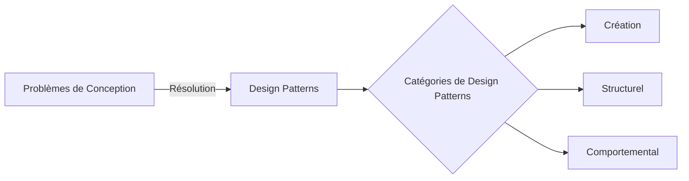

## 1.2 Pourquoi les design patterns sont-ils importants?

Les design patterns sont importants parce qu'ils fournissent des solutions testées et éprouvées à des problèmes de conception fréquemment rencontrés, ils améliorent la lisibilité du code et peuvent rendre le code plus facile à maintenir ou à adapter.

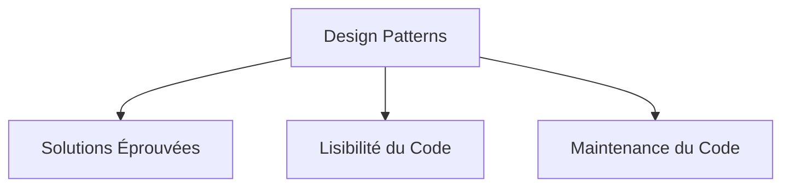

## 1.3 Les principes fondamentaux des design patterns

Il y a quelques principes fondamentaux que tous les design patterns suivent. Ces principes sont :
   
   - **L'Encapsulation** : Les détails spécifiques sont cachés derrière une interface.
   - **La Composition** : Les objets sont composés pour obtenir de nouvelles fonctionnalités.
   - **Le Polymorphisme** : Les entités de base peuvent être remplacées par des entités dérivées.

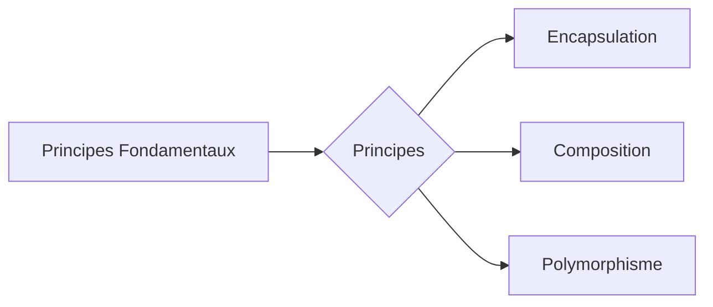

Dans les prochaines sections, nous explorerons les divers types de design patterns et nous plongerons dans des exemples spécifiques de chacun.

# 2. Catégorisation des Design Patterns

Les design patterns sont généralement catégorisés en trois types : Création de patterns (ou Creation), Patterns Structurels (ou Structural) et Patterns Comportementaux (ou Behavioral).

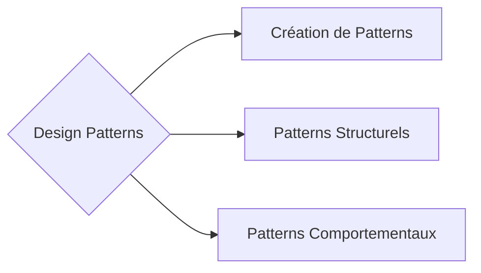

## **2.1 Création de patterns (Creational Patterns)**

Les patterns de création sont conçus pour traiter les problèmes de création d'objets. Ils résolvent ce problème en contrôlant de manière appropriée le processus de création d'objets. Les principaux patterns de cette catégorie incluent : Singleton, Builder, Prototype, Factory Method, et Abstract Factory.

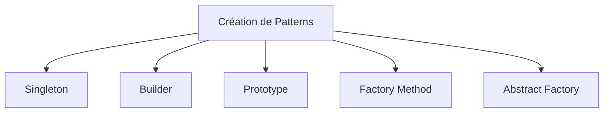

## **2.2 Patterns Structurels (Structural Patterns)**

Les patterns structurels se préoccupent de la composition des classes et des objets pour former des structures plus grandes. Ils aident à assurer que lorsque les parties d'un système changent, l'ensemble du système n'a pas besoin de changer. Les principaux patterns de cette catégorie incluent : Adapter, Bridge, Composite, Decorator, Facade, Flyweight, et Proxy.

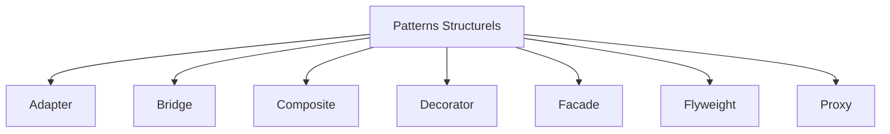

## **2.3 Patterns Comportementaux (Behavioral Patterns)**

Les patterns comportementaux sont concernés par la communication entre les objets, comment ils interagissent et se répartissent les responsabilités. Les principaux patterns de cette catégorie incluent : Chain of Responsibility, Command, Interpreter, Iterator, Mediator, Memento, Observer, State, Strategy, Template Method, et Visitor.

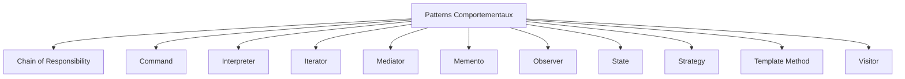

Dans les sections suivantes, nous aborderons plus en détail chaque catégorie et chaque pattern spécifique.

# 3. Design Patterns de Création

Les Design Patterns de Création se focalisent sur le contrôle de la création des instances. Ces modèles encapsulent la connaissance sur quels objets spécifiques du système doivent être créés, comment ces objets sont créés, et comment ils sont associés.

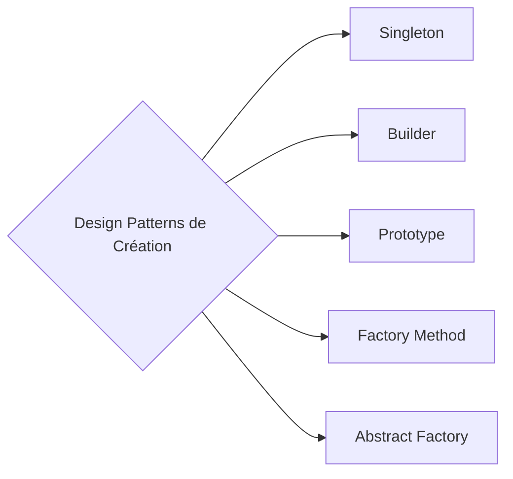

## 3.1 Singleton

Le Singleton est un pattern de conception qui limite l'instanciation d'une classe à un seul objet. Il est utilisé lorsque vous voulez vous assurer qu'une classe n'a qu'une seule instance, et que vous voulez fournir un point d'accès global à cette instance.

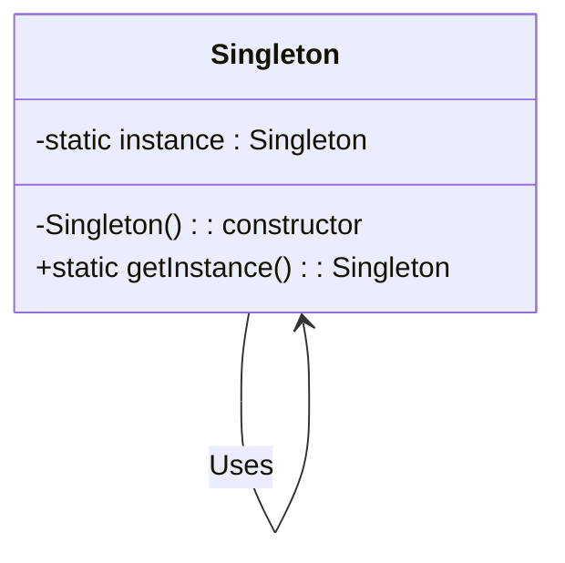

Exemple en python :

Le Singleton peut être implémenté de plusieurs façons. L'une des façons les plus simples est d'utiliser un module. En voici un exemple :

```python
class Singleton:
    _instance = None

    @staticmethod
    def getInstance():
        if Singleton._instance == None:
            Singleton()
        return Singleton._instance

    def __init__(self):
        if Singleton._instance != None:
            raise Exception("Cette classe est un singleton !")
        else:
            Singleton._instance = self

s = Singleton.getInstance()
print(s)

```


## 3.2 Builder

Le pattern Builder ou Constructeur en français est utilisé pour construire des objets complexes étape par étape. Il sépare le code de construction d'un objet de la représentation de cet objet, de sorte que le même code de construction peut créer différents types d'objets.

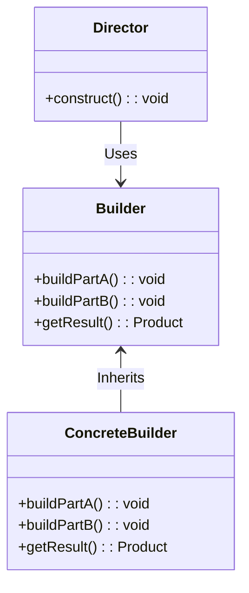

Le pattern Builder peut être implémenté comme suit :

```python
class Director:
    __builder = None

    def setBuilder(self, builder):
        self.__builder = builder

    def getCar(self):
        car = Car()

        # Build parts
        body = self.__builder.getBody()
        car.setBody(body)

        engine = self.__builder.getEngine()
        car.setEngine(engine)

        return car

# The whole product
class Car:
    def __init__(self):
        self.__engine = None
        self.__body = None

    def setBody(self, body):
        self.__body = body

    def setEngine(self, engine):
        self.__engine = engine

# Abstract Builder
class Builder:
    def getEngine(self): pass
    def getBody(self): pass

# Concrete Builder 
class CarBuilder(Builder):
    def getEngine(self):
        return "Sport engine"

    def getBody(self):
        return "Sport body"

director = Director()
director.setBuilder(CarBuilder())

car = director.getCar()
print(car)
```

## 3.3 Prototype

Le pattern Prototype est utilisé lorsque la création d'un nouvel objet est coûteuse. Il offre un mécanisme pour copier un objet original ou prototype, et ainsi éviter une création coûteuse.

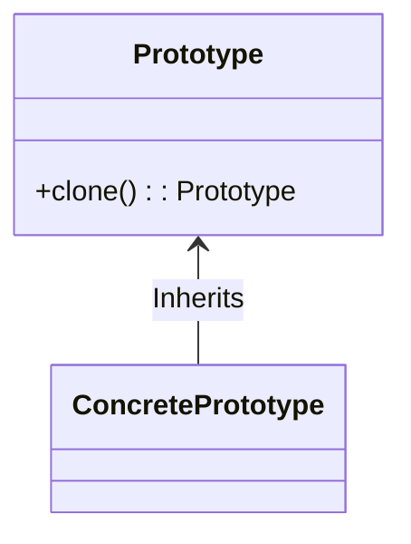

Le pattern Prototype peut être implémenté grâce à la fonction de copie :

```python
import copy

class Prototype:

    def __init__(self):
        self._objects = {}

    def registerObject(self, name, obj):
        self._objects[name] = obj

    def unregisterObject(self, name):
        del self._objects[name]

    def clone(self, name, **attr):
        obj = copy.deepcopy(self._objects.get(name))
        obj.__dict__.update(attr)
        return obj

class Car:
    def __init__(self):
        self.name = "Car"
        self.color = "Red"
        self.options = "Ex"

car = Car()
prototype = Prototype()
prototype.registerObject("car1", car)

car2 = prototype.clone("car1")
print(car2)
```

## 3.4 Factory Method

Le Factory Method est un pattern qui définit une interface pour créer un objet, mais laisse les sous-classes décider quelles classes instancier. Il permet à une classe de déléguer l'instanciation à des sous-classes.

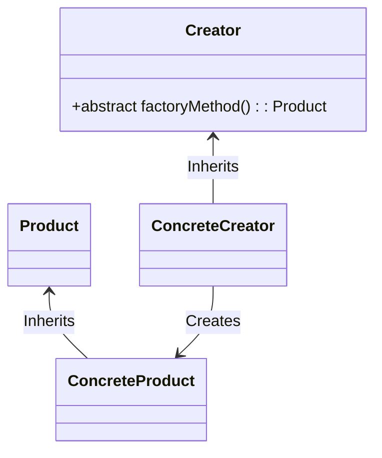

Le pattern Factory Method peut être implémenté de la manière suivante :

```python
class Dog:
    def __init__(self, name):
        self._name = name

    def speak(self):
        return "Woof!"

class Cat:
    def __init__(self, name):
        self._name = name

    def speak(self):
        return "Meow!"

def get_pet(pet="dog"):
    pets = dict(dog=Dog("Hope"), cat=Cat("Peace"))
    return pets[pet]

d = get_pet("dog")
print(d.speak())

c = get_pet("cat")
print(c.speak())
```

## 3.5 Abstract Factory

L'Abstract Factory est un pattern qui fournit une interface pour créer des familles d'objets liés ou dépendants sans spécifier leurs classes concrètes.

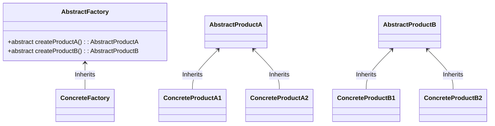

Le pattern Abstract Factory peut être implémenté  comme suit :

```python
class Dog:
    def __init__(self, name):
        self._name = name

    def speak(self):
        return "Woof!"

class Cat:
    def __init__(self, name):
        self._name = name

    def speak(self):
        return "Meow!"

class DogFactory:
    def get_pet(self):
        return Dog("Hope")

    def get_food(self):
        return "Dog Food"

class CatFactory:
    def get_pet(self):
        return Cat("Peace")

    def get_food(self):
        return "Cat Food"

class PetStore:
    def __init__(self, pet_factory=None):
        self._pet_factory = pet_factory

    def show_pet(self):
        pet = self._pet_factory.get_pet()
        pet_food = self._pet_factory.get_food()

        print("Our pet is '{}'!".format(pet))
        print("Our pet says hello by '{}'".format(pet.speak()))
        print("Its food is '{}'!".format(pet_food))

#Create a Concrete Factory
factory = DogFactory()

#Create a pet store housing our Abstract Factory
shop = PetStore(factory)

#Invoke the utility method to show the details of our pet
shop.show_pet()
```
Dans cet exemple, le `DogFactory` et le `CatFactory` sont les fabriques concrètes qui produisent des produits cohérents (le `Dog` et la `Dog Food` pour `DogFactory`, le `Cat` et la `Cat Food` pour `CatFactory`). Le `PetStore` est une application qui utilise une Abstract Factory pour créer ses produits.

# 4. Design Patterns Structurels

Les Design Patterns Structurels se focalisent sur la façon dont les classes et les objets sont composés pour former de plus grandes structures. 

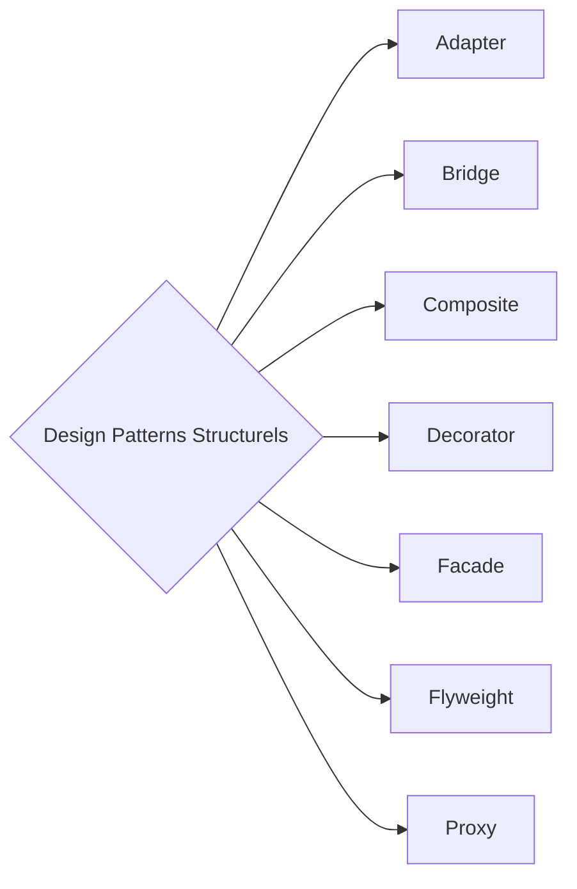

## 4.1 Adapter

L'Adapter est un pattern structurel qui permet à des interfaces incompatibles de collaborer. Il convertit l'interface d'une classe en une autre interface que les clients attendent.

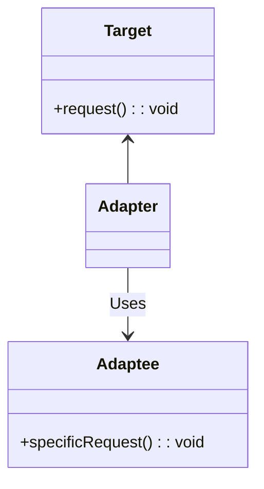

Exemple en Python :

```python
class EuropeanSocketInterface:
    def voltage(self): pass

class Socket(EuropeanSocketInterface):
    def voltage(self):
        return 230

class AmericanSocketInterface:
    def voltage(self): pass

class Adapter(EuropeanSocketInterface):
    def __init__(self, socket):
        self.socket = socket

    def voltage(self):
        return 110

american_socket = Adapter(Socket())
print(american_socket.voltage())
```

## 4.2 Bridge

Le Bridge est un pattern qui permet de séparer l'abstraction d'une implémentation, de telle sorte que les deux peuvent être modifiées indépendamment.

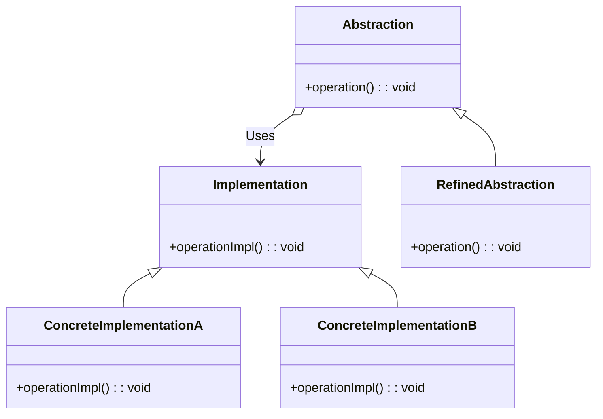

Exemple en Python :

```python
class ImplementationInterface:
    def operation_implementation(self):
        pass

class Abstraction:
    def __init__(self, implementation):
        self.implementation = implementation

    def operation(self):
        self.implementation.operation_implementation()

class ImplementationA(ImplementationInterface):
    def operation_implementation(self):
        return 'Implementation A'

class ImplementationB(ImplementationInterface):
    def operation_implementation(self):
        return 'Implementation B'

a = Abstraction(ImplementationA())
b = Abstraction(ImplementationB())
print(a.operation())
print(b.operation())
```

## 4.3 Composite

Le Composite est un pattern de conception qui permet de traiter les objets individuels et les compositions d'objets de manière uniforme.

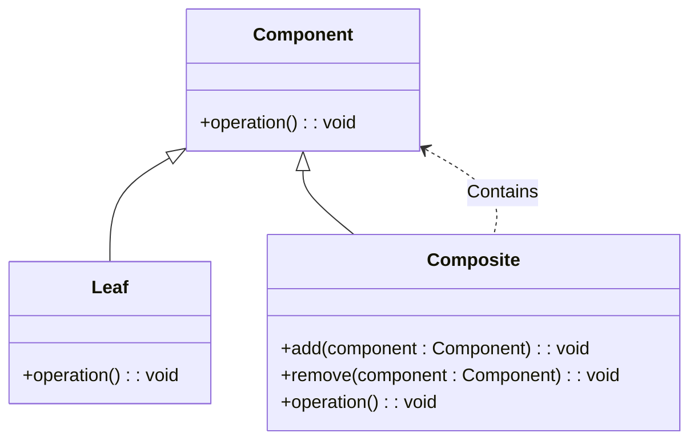

Exemple en Python :
Pardon pour l'interruption précédente. Je vais reprendre l'exemple du Composite en Python.

```python
class Component:
    def __init__(self, name):
        self._name = name

    def component_function(self):
        print(f"{self._name}")

class Child(Component):
    def __init__(self, name):
        super().__init__(name)

    def component_function(self):
        super().component_function()

class Composite(Component):
    def __init__(self, name):
        super().__init__(name)
        self._children = []

    def add(self, child):
        self._children.append(child)

    def remove(self, child):
        self._children.remove(child)

    def component_function(self):
        print(f"{self._name}")
        for i in self._children:
            i.component_function()

sub1 = Composite("submenu1")
sub11 = Child("sub_submenu 11")
sub12 = Child("sub_submenu 12")

sub1.add(sub11)
sub1.add(sub12)

top = Composite("top_menu")
sub2 = Child("submenu2")

top.add(sub1)
top.add(sub2)
top.component_function()
```

* **4.4 Decorator**

Le Decorator est un pattern de conception qui permet d'ajouter de nouveaux comportements à des objets en les plaçant dans des objets enveloppeurs spéciaux.

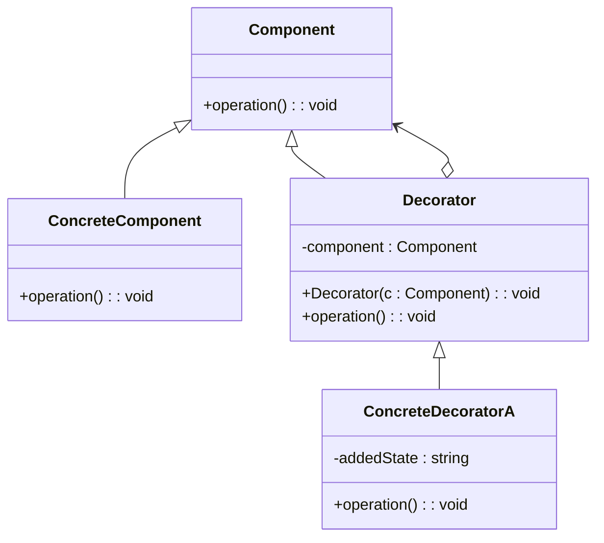

Exemple en Python :

```python
class Component:
    def operation(self):
        pass

class ConcreteComponent(Component):
    def operation(self):
        return "ConcreteComponent"

class Decorator(Component):
    _component = None

    def __init__(self, component):
        self._component = component

    def operation(self):
        self._component.operation()

class ConcreteDecoratorA(Decorator):
    def operation(self):
        return f"ConcreteDecoratorA({self._component.operation()})"

simple = ConcreteComponent()
decorator = ConcreteDecoratorA(simple)
print(decorator.operation())
```

## 4.5 Facade

La Facade est un pattern de conception structurel qui offre une interface simplifiée à une bibliothèque, un framework ou tout autre ensemble complexe de classes.

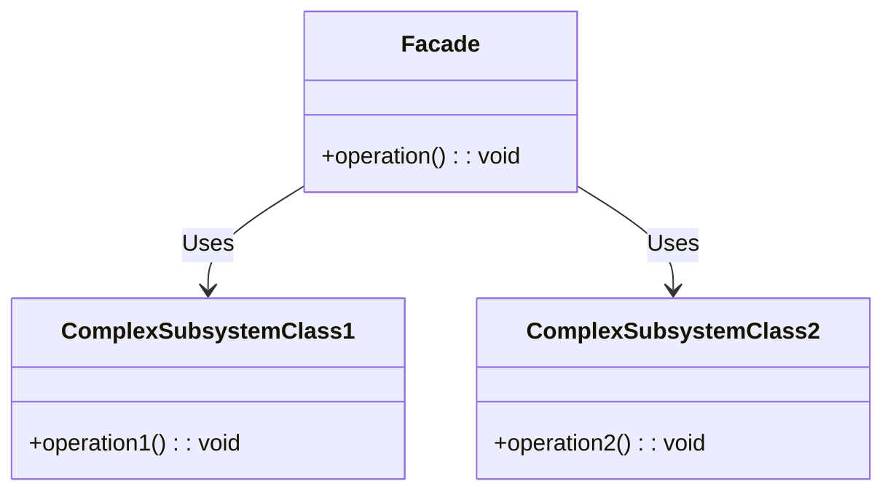

Exemple en Python :

```python
class ComplexSubsystem1:
    def operation1(self):
        return "Subsystem1: Ready!"

class ComplexSubsystem2:
    def operation1(self):
        return "Subsystem2: Ready!"

class Facade:
    def __init__(self, subsystem1, subsystem2):
        self._subsystem1 = subsystem1 or ComplexSubsystem1()
        self._subsystem2 = subsystem2 or ComplexSubsystem2()

    def operation(self):
        results = []
        results.append(self._subsystem1.operation1())
        results.append(self._subsystem2.operation1())
        return "\n".join(results)

subsystem1 = ComplexSubsystem1()
subsystem2 = ComplexSubsystem2()
facade = Facade(subsystem1, subsystem2)
print(facade.operation())
```

## 4.6 Flyweight

Le Flyweight est un pattern de conception structurel qui permet d'adapter plus d'objets dans la quantité de RAM disponible en partageant des parties communes des états d'objets entre plusieurs objets.

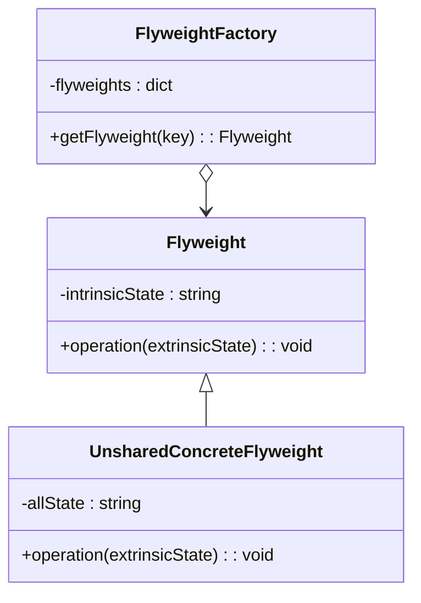

Exemple en Python :

```python
class Flyweight:
    def operation(self, extrinsic_state):
        pass

class ConcreteFlyweight(Flyweight):
    def operation(self, extrinsic_state):
        return f"ConcreteFlyweight: {str(extrinsic_state)}"

class FlyweightFactory:
    _flyweights = {}

    def get_flyweight(self, key):
        try:
            flyweight = self._flyweights[key]
        except KeyError:
            flyweight = ConcreteFlyweight()
            self._flyweights[key] = flyweight
        return flyweight

factory = FlyweightFactory()
flyweight = factory.get_flyweight("key")
print(flyweight.operation([1, 2, 3]))
```

## 4.7 Proxy

Le Proxy est un pattern de conception structurel qui offre un substitut ou un espace réservé pour un autre objet. Un Proxy contrôle l'accès à l'objet original, permettant d'effectuer quelque chose soit avant soit après la demande atteint l'objet original.

```mermaid
classDiagram
    class Subject {
        +request() : void
    }
    class RealSubject {
        +request() : void
    }
    Subject <|-- RealSubject
    class Proxy {
        -realSubject : RealSubject
        +request() : void
    }
    Subject <|-- Proxy
    Proxy o--> RealSubject
```

Exemple en Python :

Excusez-moi pour l'interruption. Je vais reprendre avec l'exemple de Proxy en Python :

```python
class RealSubject:
    def request(self):
        return "RealSubject: Handling request."

class Proxy:
    def __init__(self, real_subject):
        self._real_subject = real_subject

    def request(self):
        if self.check_access():
            self._real_subject.request()
            self.log_access()

    def check_access(self):
        print("Proxy: Checking access prior to firing a real request.")
        return True

    def log_access(self):
        print("Proxy: Logging the time of request.", end="")

real_subject = RealSubject()
proxy = Proxy(real_subject)
proxy.request()
```
Dans cet exemple, le `Proxy` est utilisé pour contrôler l'accès à `RealSubject`. Avant de transmettre la demande à `RealSubject`, `Proxy` effectue d'autres actions comme la vérification des droits d'accès et le journalisation.

# 5. Design Patterns Comportementaux

Ces modèles sont centrés sur la communication et la délégation de responsabilités entre les objets.

```mermaid
graph LR
    A{Design Patterns Comportementaux} --> B[Chain of Responsibility]
    A --> C[Command]
    A --> D[Interpreter]
    A --> E[Iterator]
    A --> F[Mediator]
    A --> G[Memento]
    A --> H[Observer]
    A --> I[State]
    A --> J[Strategy]
    A --> K[Template Method]
    A --> L[Visitor]
```

Commençons par le premier de notre liste.

* **5.1 Chain of Responsibility**

Ce modèle crée une chaîne d'objets récepteurs pour une requête. Cette chaîne de responsabilité passe la requête le long de la chaîne jusqu'à ce qu'un objet la traite.

```mermaid
classDiagram
    class Handler {
        +set_next(handler : Handler) : Handler
        +handle(request) : string
    }
    Handler <|-- ConcreteHandler1
    Handler <|-- ConcreteHandler2
    class Client {
        -handler : Handler
        +Client() : void
        +do_something() : void
    }
    Client o--> Handler : Uses >
```

Voici un exemple de ce modèle en Python :

```python
class Handler:
    _next_handler = None

    def set_next(self, handler):
        self._next_handler = handler
        return handler

    def handle(self, request):
        if self._next_handler:
            return self._next_handler.handle(request)
        return None

class ConcreteHandler1(Handler):
    def handle(self, request):
        if request == "request1":
            return "ConcreteHandler1"
        else:
            return super().handle(request)

class ConcreteHandler2(Handler):
    def handle(self, request):
        if request == "request2":
            return "ConcreteHandler2"
        else:
            return super().handle(request)

handler1 = ConcreteHandler1()
handler2 = ConcreteHandler2()
handler1.set_next(handler2)

print(handler1.handle("request2"))
```

Dans cet exemple, nous avons deux gestionnaires : `ConcreteHandler1` et `ConcreteHandler2`. Chaque gestionnaire vérifie si elle peut traiter la requête. Si elle ne le peut pas, elle passe la requête au prochain gestionnaire de la chaîne.

## 5.2 Command

Le modèle de Commande transforme une requête en un objet autonome qui contient toute l'information nécessaire à la requête. Cette transformation permet de paramétrer des méthodes avec des files d'attente, des demandes et des opérations, de retarder l'exécution d'une commande et de soutenir les opérations réversibles.

```mermaid
classDiagram
    class Invoker {
        -command : Command
        +set_command(c : Command) : void
        +do_something() : void
    }
    class Command {
        +execute() : void
    }
    Command <|-- ConcreteCommand
    class Receiver {
        +do_something() : void
    }
    ConcreteCommand --> Receiver
    Invoker o--> Command
```

Voici un exemple de ce modèle en Python :

```python
class Command:
    def execute(self):
        pass

class ConcreteCommand(Command):
    def __init__(self, receiver):
        self._receiver = receiver

    def execute(self):
        self._receiver.do_something()

class Receiver:
    def do_something(self):
        print("Receiver is doing something.")

class Invoker:
    def set_command(self, command):
        self._command = command

    def do_something(self):
        self._command.execute()

receiver = Receiver()
command = ConcreteCommand(receiver)
invoker = Invoker()
invoker.set_command(command)
invoker.do_something()
```

## 5.3 Interpreter

L'Interpréteur est un modèle de conception comportemental qui spécifie comment évaluer des phrases dans une langue. Ce modèle implique la mise en œuvre d'un processeur de langage de programmation, peut être utilisé pour développer un compilateur ou un interpréteur.

```mermaid
classDiagram
    class AbstractExpression {
        +interpret(context : Context) : void
    }
    class TerminalExpression {
        +interpret(context : Context) : void
    }
    class NonterminalExpression {
        +interpret(context : Context) : void
    }
    AbstractExpression <|-- TerminalExpression
    AbstractExpression <|-- NonterminalExpression
    class Context {
        -input : string
        -output : string
    }
    NonterminalExpression o--> Context
    TerminalExpression o--> Context
```

Exemple en Python :

```python
class Context:
    def __init__(self, input):
        self.input = input
        self.output = 0

class AbstractExpression:
    def interpret(self, context):
        pass

class NonterminalExpression(AbstractExpression):
    def interpret(self, context):
        context.output = int(context.input) * 2

class TerminalExpression(AbstractExpression):
    def interpret(self, context):
        context.output = int(context.input) + 1

context = Context("5")
list_of_expressions = []
list_of_expressions.append(NonterminalExpression())
list_of_expressions.append(TerminalExpression())

for expression in list_of_expressions:
    expression.interpret(context)

print(context.output)
```
Dans cet exemple, `NonterminalExpression` double la valeur de `input` et `TerminalExpression` l'incrémente.

## 5.4 Iterator

L'itérateur est un modèle de conception comportemental qui permet de parcourir les éléments d'un objet complexe sans exposer sa représentation sous-jacente.

```mermaid
classDiagram
    class Iterator {
        +next() : Element
        +has_next() : boolean
    }
    class ConcreteIterator {
        -collection : Collection
        -position : int
        +next() : Element
        +has_next() : boolean
    }
    Iterator <|-- ConcreteIterator
    class Aggregate {
        +create_iterator() : Iterator
    }
    class ConcreteAggregate {
        -elements : list
        +create_iterator() : Iterator
    }
    Aggregate <|-- ConcreteAggregate
    Aggregate o--> Iterator : Creates >
    ConcreteIterator --> ConcreteAggregate : Uses >
```

Exemple en Python :
Attention ! Ce code est donné à titre d'exemple, car le patron de modèle "Iterator" fait parti de la définition du langage python, en conséquence il est préférable d'utiliser ceux fournis par les bibliothèques standards.
```python
class Iterator:
    def next(self):
        pass

    def has_next(self):
        pass

class ConcreteIterator(Iterator):
    def __init__(self, collection):
        self._collection = collection
        self._position = 0

    def next(self):
        try:
            result = self._collection[self._position]
            self._position += 1
        except IndexError:
            result = None
        return result

    def has_next(self):
        return self._position < len(self._collection)

class Aggregate:
    def create_iterator(self):
        pass

class ConcreteAggregate(Aggregate):
    def __init__(self):
        self._elements = ["Element 1", "Element 2", "Element 3"]

    def create_iterator(self):
        return ConcreteIterator(self._elements)

aggregate = ConcreteAggregate()
iterator = aggregate.create_iterator()

while iterator.has_next():
    print(iterator.next())
```

Dans cet exemple, `ConcreteIterator` itère sur `ConcreteAggregate`, qui est une collection d'éléments de chaînes.

## 5.5 Mediator

Le modèle Mediator définit un objet qui encapsule comment un ensemble d'objets interagit. Il est utile pour promouvoir un couplage faible en évitant que les objets communiquent explicitement entre eux.

```mermaid
classDiagram
    class Mediator {
        +notify(sender : Component, event : string) : void
    }
    class ConcreteMediator {
        -component1 : Component1
        -component2 : Component2
        +notify(sender : Component, event : string) : void
    }
    Mediator <|-- ConcreteMediator
    class Component {
        -mediator : Mediator
        +set_mediator(mediator : Mediator) : void
    }
    class Component1 {
        +do_something() : void
        +do_something_else() : void
    }
    class Component2 {
        +do_something() : void
        +do_something_else() : void
    }
    Component <|-- Component1
    Component <|-- Component2
    Component1 --> Mediator
    Component2 --> Mediator
    ConcreteMediator --> Component1 : Knows >
    ConcreteMediator --> Component2 : Knows >
```

Exemple en Python :

```python
class Mediator:
    def notify(self, sender, event):
        pass

class ConcreteMediator(Mediator):
    def notify(self, sender, event):
        if sender == "component1" and event == "event1":
            print("Mediator reacts on event1 and triggers following operations:")
        elif sender == "component2" and event == "event2":
            print("Mediator reacts on event2 and triggers following operations:")

class Component:
    def __init__(self, mediator):
        self._mediator = mediator

class Component1(Component):
    def do_something(self):
        self._mediator.notify("component1", "event1")

class Component2(Component):
    def do_something(self):
        self._mediator.notify("component2", "event2")

mediator = ConcreteMediator()
component1 = Component1(mediator)
component2 = Component2(mediator)
component1.do_something()
component2.do_something()
```
Dans cet exemple, `ConcreteMediator` coordonne les actions entre `Component1` et `Component2` en réponse à des notifications.

## 5.6 Memento

Le modèle Memento est utilisé pour restaurer l'état d'un objet à un moment précédent.

```mermaid
classDiagram
    class Originator {
        -state : string
        +do_something() : void
        +save() : Memento
        +restore(memento : Memento) : void
    }
    class Memento {
        -state : string
        +get_state() : string
    }
    class Caretaker {
        -mementos : list
        -originator : Originator
        +backup() : void
        +undo() : void
    }
    Caretaker o--> Originator
    Originator --> Memento
    Caretaker --> Memento
```

Exemple en Python :

```python
import datetime

class Memento:
    def __init__(self, state):
        self._state = state
        self._date = str(datetime.datetime.now())

    def get_state(self):
        return self._state

class Originator:
    _state = ""

    def do_something(self):
        self._state = "new state"

    def save(self):
        return Memento(self._state)

    def restore(self, memento):
        self._state = memento.get_state()

class Caretaker:
    def __init__(self, originator):
        self._mementos = []
        self._originator = originator

    def backup(self):
        self._mementos.append(self._originator.save())

    def undo(self):
        if not len(self._mementos):
            return
        memento = self._mementos.pop()
        self._originator.restore(memento)

originator = Originator()
caretaker = Caretaker(originator)

originator.do_something()
caretaker.backup()

originator.do_something()
caretaker.backup()

caretaker.undo()
```

Dans cet exemple, chaque fois que `originator` fait quelque chose, `caretaker` fait une sauvegarde. `Caretaker` peut annuler les actions de `originator` en restaurant son état à partir d'un memento.

## 5.7 Observer

L'Observer est un modèle de conception comportemental qui permet de définir un mécanisme de souscription pour notifier plusieurs objets des événements qui se produisent dans l'objet qu'ils observent.

```mermaid
classDiagram
    class Subject {
        +attach(observer : Observer) : void
        +detach(observer : Observer) : void
        +notify() : void
    }
    class ConcreteSubject {
        -state : int
        +attach(observer : Observer) : void
        +detach(observer : Observer) : void
        +notify() : void
        +do_something() : void
    }
    Subject <|-- ConcreteSubject
    class Observer {
        +update(subject : Subject) : void
    }
    class ConcreteObserverA {
        +update(subject : Subject) : void
    }
    class ConcreteObserverB {
        +update(subject : Subject) : void
    }
    Observer <|-- ConcreteObserverA
    Observer <|-- ConcreteObserverB
    ConcreteSubject --> Observer : Notifies >
    Observer --> ConcreteSubject : Observes >
```

Exemple en Python :

```python
class Subject:
    def attach(self, observer):
        pass

    def detach(self, observer):
        pass

    def notify(self):
        pass

class ConcreteSubject(Subject):
    _state = None
    _observers = []

    def attach(self, observer):
        self._observers.append(observer)

    def detach(self, observer):
        self._observers.remove(observer)

    def notify(self):
        for observer in self._observers:
            observer.update(self)

    def do_something(self):
        self._state = "new state"
        self.notify()

class Observer:
    def update(self, subject):
        pass

class ConcreteObserverA(Observer):
    def update(self, subject):
        print(f"ConcreteObserverA: Reacted to {subject._state}")

class ConcreteObserverB(Observer):
    def update(self, subject):
        print(f"ConcreteObserverB: Reacted to {subject._state}")

subject = ConcreteSubject()
observer_a = ConcreteObserverA()
subject.attach(observer_a)
observer_b = ConcreteObserverB()
subject.attach(observer_b)

subject.do_something()
```
Dans cet exemple, `ConcreteObserverA` et `ConcreteObserverB` sont attachés à `ConcreteSubject`. Lorsque `ConcreteSubject` change d'état, il notifie tous les observateurs attachés.

## 5.8 State

Le modèle State permet à un objet de modifier son comportement lorsque son état interne change. Il semble que l'objet ait modifié sa classe.

```mermaid
classDiagram
    class Context {
        -state : State
        +request1() : void
        +request2() : void
    }
    class State {
        +handle1() : void
        +handle2() : void
    }
    class ConcreteStateA {
        +handle1() : void
        +handle2() : void
    }
    class ConcreteStateB {
        +handle1() : void
        +handle2() : void
    }
    Context --> State : Has a >
    State <|-- ConcreteStateA
    State <|-- ConcreteStateB
```

Exemple en Python :

```python
class State:
    def handle1(self):
        pass

    def handle2(self):
        pass

class ConcreteStateA(State):
    def handle1(self):
        print("ConcreteStateA handles request1.")
        print("ConcreteStateA wants to change the state of the context.")

    def handle2(self):
        print("ConcreteStateA handles request2.")

class ConcreteStateB(State):
    def handle1(self):
        print("ConcreteStateB handles request1.")

    def handle2(self):
        print("ConcreteStateB handles request2.")
        print("ConcreteStateB wants to change the state of the context.")

class Context:
    _state = None

    def __init__(self, state: State) -> None:
        self.transition_to(state)

    def transition_to(self, state: State):
        print(f"Context: Transition to {type(state).__name__}")
        self._state = state
        self._state.context = self

    def request1(self):
        self._state.handle1()

    def request2(self):
        self._state.handle2()

context = Context(ConcreteStateA())
context.request1()
context.request2()
```

Dans cet exemple, `Context` alterne entre `ConcreteStateA` et `ConcreteStateB`. L'état actuel est conservé dans le `Context`.

## 5.9 Strategy

Le modèle Strategy définit une famille d'algorithmes, les encapsule chacun et les rend interchangeables. Ce modèle permet à l'algorithme de varier indépendamment des clients qui l'utilisent.

```mermaid
classDiagram
    class Context {
        -strategy : Strategy
        +Context(strategy : Strategy) : void
        +do_something() : void
    }
    class Strategy {
        +do_algorithm() : void
    }
    class ConcreteStrategyA {
        +do_algorithm() : void
    }
    class ConcreteStrategyB {
        +do_algorithm() : void
    }
    Context --> Strategy : Has a >
    Strategy <|-- ConcreteStrategyA
    Strategy <|-- ConcreteStrategyB
```

Exemple en Python :

```python
from abc import ABC, abstractmethod
from typing import List

class Context:
    def __init__(self, strategy):
        self._strategy = strategy

    def do_something(self, data: List):
        result = self._strategy.do_algorithm(data)
        print(",".join(result))

class Strategy(ABC):
    @abstractmethod
    def do_algorithm(self, data: List):
        pass

class ConcreteStrategyA(Strategy):
    def do_algorithm(self, data: List):
        return sorted(data)

class ConcreteStrategyB(Strategy):
    def do_algorithm(self, data: List):
        return reversed(sorted(data))

data = ["a", "b", "c", "d", "e"]

context = Context(ConcreteStrategyA())
context.do_something(data)

context = Context(ConcreteStrategyB())
context.do_something(data)
```

Dans cet exemple, `Context` utilise une instance de `Strategy` pour effectuer une opération. Les `ConcreteStrategyA` et `ConcreteStrategyB` implémentent cette opération de manière différente.

## 5.10 Template Method

Le modèle Template Method définit le squelette d'un algorithme dans la méthode de superclasse mais laisse les sous-classes redéfinir certaines étapes de l'algorithme sans changer sa structure globale.

```mermaid
classDiagram
    class AbstractClass {
        +template_method() : void
        +base_operation1() : void
        +base_operation2() : void
        +required_operations1() : void
        +required_operations2() : void
        +hook1() : void
        +hook2() : void
    }
    class ConcreteClass1 {
        +required_operations1() : void
        +required_operations2() : void
        +hook1() : void
    }
    class ConcreteClass2 {
        +required_operations1() : void
        +required_operations2() : void
        +hook1() : void
    }
    AbstractClass <|-- ConcreteClass1
    AbstractClass <|-- ConcreteClass2
```

Exemple en Python :

```python
from abc import ABC, abstractmethod

class AbstractClass(ABC):
    def template_method(self):
        self.base_operation1()
        self.required_operations1()
        self.base_operation2()
        self.hook1()

    def base_operation1(self):
        print("AbstractClass says: I am doing the bulk of the work")

    def base_operation2(self):
        print("AbstractClass says: But I let subclasses override some operations")

    @abstractmethod
    def required_operations1(self):
        pass

    def hook1(self):
        pass

class ConcreteClass1(AbstractClass):
    def required_operations1(self):
        print("ConcreteClass1 says: Implemented Operation1")

    def hook1(self):
        print("ConcreteClass1 says: Overridden Hook1")

class ConcreteClass2(AbstractClass):
    def required_operations1(self):
        print("ConcreteClass2 says: Implemented Operation2")

    def hook1(self):
        print("ConcreteClass2 says: Overridden Hook1")

concrete_class = ConcreteClass1()
concrete_class.template_method()

print("\n")

concrete_class = ConcreteClass2()
concrete_class.template_method()
```

Dans cet exemple, `ConcreteClass1` et `ConcreteClass2` utilisent `template_method()` de `AbstractClass` mais redéfinissent `required_operations1()` et `hook1()`.

## 5.11 Visitor

Le modèle Visitor permet d'effectuer des opérations sur des éléments d'un ensemble d'objets. Avec Visitor, vous pouvez définir une nouvelle opération sans changer les classes des éléments sur lesquels elle opère.

```mermaid
classDiagram
    class Component {
        +accept(visitor : Visitor) : void
    }
    class ConcreteComponentA {
        +accept(visitor : Visitor) : void
        +exclusive_method_of_concrete_component_a() : string
    }
    class ConcreteComponentB {
        +accept(visitor : Visitor) : void
        +special_method_of_concrete_component_b() : string
    }
    Component <|-- ConcreteComponentA
    Component <|-- ConcreteComponentB
    class Visitor {
        +visit_concrete_component_a(element) : void
        +visit_concrete_component_b(element) : void
    }
    class ConcreteVisitor1 {
        +visit_concrete_component_a(element) : void
        +visit_concrete_component_b(element) : void
    }
    class ConcreteVisitor2 {
        +visit_concrete_component_a(element) : void
        +visit_concrete_component_b(element) : void
    }
    Visitor <|-- ConcreteVisitor1
    Visitor <|-- ConcreteVisitor2
    ConcreteComponentA --> Visitor : accept >
    ConcreteComponentB --> Visitor : accept >
    Visitor --> ConcreteComponentA : visit >
    Visitor --> ConcreteComponentB : visit >
```

Exemple en Python :

```python
from abc import ABC, abstractmethod

class Component(ABC):
    @abstractmethod
    def accept(self, visitor):
        pass

class ConcreteComponentA(Component):
    def accept(self, visitor):
        visitor.visit_concrete_component_a(self)

    def exclusive_method_of_concrete_component_a(self):
        return "A"

class ConcreteComponentB(Component):
    def accept(self, visitor):
        visitor.visit_concrete_component_b(self)

    def special_method_of_concrete_component_b(self):
        return "B"

class Visitor(ABC):
    @abstractmethod
    def visit_concrete_component_a(self, element):
        pass

    @abstractmethod
    def visit_concrete_component_b(self, element):
        pass

class ConcreteVisitor1(Visitor):
    def visit_concrete_component_a(self, element):
        print(f"{element.exclusive_method_of_concrete_component_a()} + ConcreteVisitor1")

    def visit_concrete_component_b(self, element):
        print(f"{element.special_method_of_concrete_component_b()} + ConcreteVisitor1")

class ConcreteVisitor2(Visitor):
    def visit_concrete_component_a(self, element):
        print(f"{element.exclusive_method_of_concrete_component_a()} + ConcreteVisitor2")

    def visit_concrete_component_b(self, element):
        print(f"{element.special_method_of_concrete_component_b()} + ConcreteVisitor2")

component_a = ConcreteComponentA()
component_b = ConcreteComponentB()

visitor1 = ConcreteVisitor1()
visitor2 = ConcreteVisitor2()

component_a.accept(visitor1)
component_a.accept(visitor2)
component_b.accept(visitor1)
component_b.accept(visitor2)
```

Dans cet exemple, `ConcreteComponentA` et `ConcreteComponentB` acceptent n'importe quel objet qui hérite de `Visitor`. `ConcreteVisitor1` et `ConcreteVisitor2` sont deux visiteurs qui effectuent différentes opérations sur `ConcreteComponentA` et `ConcreteComponentB`.

## 6. Étude de cas

Voir [[Conception orientée objet]]

# 7. Anti-patterns

## 7.1 Qu'est-ce qu'un anti-pattern ?

Un anti-pattern est un modèle couramment utilisé mais inefficace et/ou contre-productif dans la pratique. Les anti-patterns sont des "leçons apprises à la dure", et sont généralement le résultat de gestionnaires ou de développeurs qui ne reconnaissent pas les inadéquations d'un processus ou d'une technique de développement.

## 7.2 Anti-patterns communs et comment les éviter

Voici quelques exemples d'anti-patterns courants dans le développement logiciel :

1. **God Object** : Il s'agit d'un objet qui connaît trop ou fait trop de choses. L'objet est si central que pratiquement toutes les autres fonctionnalités du système dépendent de lui. 

   *Solution* : Découpons les responsabilités en objets plus petits et spécialisés.

2. **Spaghetti Code** : C'est un code avec peu ou pas de structure ou de conception. Cela rend le code difficile à comprendre et à maintenir.

   *Solution* : Utilisons des design patterns appropriés, et assurons-nous que votre code est bien structuré et commenté.

3. **Golden Hammer** : Il s'agit d'essayer d'adapter toutes les situations à un outil ou une technologie particulière, même si ce n'est pas le meilleur choix pour la tâche.

   *Solution* : Essayons de choisir la meilleure technologie pour chaque tâche. Ne vous limitons pas à ce que vous connaissons déjà.

4. **Premature Optimization** : C'est l'acte d'essayer d'optimiser votre code avant même de savoir où seront les véritables goulots d'étranglement.

   *Solution* : Ecrivons d'abord le code pour qu'il fonctionne correctement, puis optimisons en fonction des besoins mesurés.

5. **Cargo Cult Programming** : C'est l'acte de copier et coller du code sans comprendre comment il fonctionne.

   *Solution* : Prenons le temps de comprendre le code que vous utilisons. Cela vous aidera à éviter des problèmes inattendus plus tard.

En reconnaissant ces anti-patterns et en comprenant comment les éviter, nous pouvons améliorer la qualité de notre code et rendre notre processus de développement plus efficace.

# 8. Projet final

Voir [[Conception ]]

# 9. Ressources

Voici quelques livres et ressources en ligne pour approfondir vos connaissances sur les design patterns, les anti-patterns, et le développement logiciel en général :

## 9.1 Livres

   - "Design Patterns: Elements of Reusable Object-Oriented Software" par Erich Gamma, Richard Helm, Ralph Johnson, et John Vlissides (aussi connu sous le nom de "Gang of Four").
   - "Refactoring: Improving the Design of Existing Code" par Martin Fowler.
   - "Clean Code: A Handbook of Agile Software Craftsmanship" par Robert C. Martin.
   - "AntiPatterns: Refactoring Software, Architectures, and Projects in Crisis" par William J. Brown, Raphael C. Malveau, Hays W. "Skip" McCormick, et Thomas J. Mowbray.

## 9.2 Ressources en ligne

   - [Refactoring Guru](https://refactoring.guru/design-patterns) : Un site web dédié aux design patterns et au refactoring. Il contient des descriptions détaillées des différents design patterns, ainsi que des exemples de code en plusieurs langages.
   - [SourceMaking](https://sourcemaking.com/) : Un autre excellent site web pour apprendre les design patterns, le refactoring, et les anti-patterns.
   - [Wikipedia](https://en.wikipedia.org/wiki/Software_design_pattern) : Les pages Wikipedia sur les design patterns, les anti-patterns et le développement logiciel contiennent généralement de bonnes informations de base, ainsi que des liens vers d'autres ressources.

## 9.3 Cours en ligne

   - Les plateformes comme [Coursera](https://www.coursera.org/), [edX](https://www.edx.org/), et [Udemy](https://www.udemy.com/) offrent de nombreux cours sur le développement logiciel, y compris les design patterns.

N'oublions pas que la meilleure façon d'apprendre est par la pratique. Donc, après avoir étudié ces ressources, essayons d'appliquer ce que nous avons appris dans nos projets.