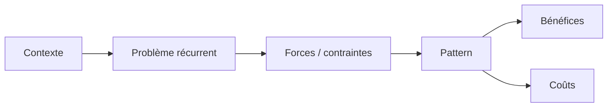
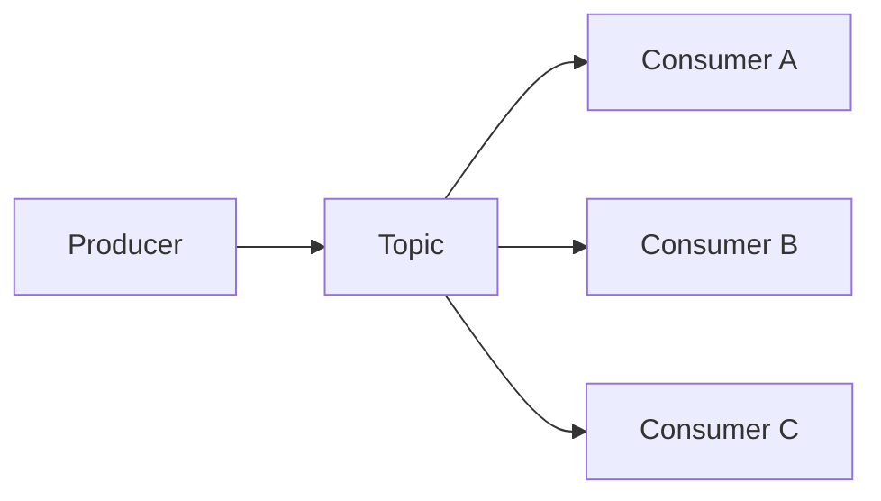
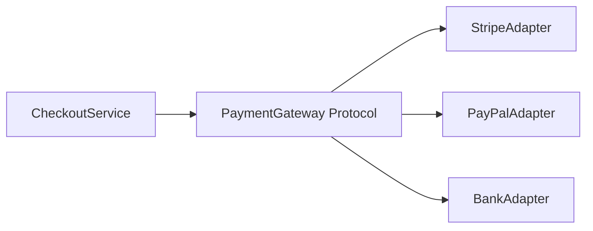
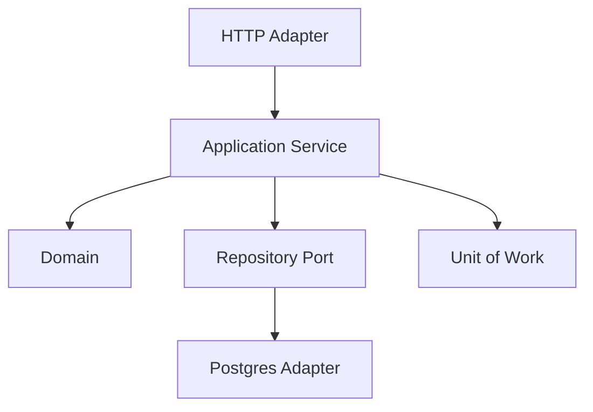

# Sommaire

1. [[#1. Comprendre les design patterns]]
2. [[#2. Comment choisir un pattern sans sur-concevoir]]
3. [[#3. Patterns de création GoF]]
4. [[#4. Patterns structurels GoF]]
5. [[#5. Patterns comportementaux GoF]]
6. [[#6. Les patterns à l'épreuve de Python moderne]]
7. [[#7. Injection de dépendances et composition]]
8. [[#8. Patterns de domaine et d'application]]
9. [[#9. Patterns de persistance]]
10. [[#10. Patterns événementiels et de messagerie]]
11. [[#11. Patterns de résilience]]
12. [[#12. Patterns de concurrence et d'asynchronisme]]
13. [[#13. Patterns d'interface et de présentation]]
14. [[#14. Patterns pour les systèmes distribués]]
15. [[#15. Patterns de sécurité]]
16. [[#16. Tests et testabilité des patterns]]
17. [[#17. Refactoring vers un pattern]]
18. [[#18. Anti-patterns]]
19. [[#19. Études de cas]]
20. [[#20. Guide de décision]]
21. [[#21. Travaux pratiques]]
22. [[#22. Projet final]]
23. [[#23. Checklist]]
24. [[#24. Glossaire]]
25. [[#25. Ressources]]

# 1. Comprendre les design patterns

## 1.1 Définition

Un **design pattern** — ou patron de conception — est une solution générale et réutilisable à un problème de conception récurrent dans un contexte donné.

Un pattern n'est donc pas :

- une bibliothèque ;
- un fragment de code à copier aveuglément ;
- une règle obligatoire ;
- une architecture complète ;
- une preuve qu'une conception est bonne.

Un pattern décrit plutôt :

1. un **contexte** ;
2. un **problème** récurrent ;
3. les **forces** et contraintes qui s'opposent ;
4. une **structure de solution** ;
5. les **conséquences** et compromis de cette solution.

Le mot important est **compromis**. Un pattern résout certains problèmes en ajoutant généralement de nouvelles abstractions, de l'indirection ou des objets supplémentaires.


```mermaid
graph LR
    A[Contexte] --> B[Problème récurrent]
    B --> C[Forces / contraintes]
    C --> D[Pattern]
    D --> E[Bénéfices]
    D --> F[Coûts]
```

## 1.2 Origine du vocabulaire

Le concept de pattern vient des travaux de l'architecte Christopher Alexander sur les formes récurrentes dans l'architecture des bâtiments.

En génie logiciel, l'ouvrage le plus célèbre est :

> *Design Patterns: Elements of Reusable Object-Oriented Software* — Erich Gamma, Richard Helm, Ralph Johnson et John Vlissides, 1994.

Ces quatre auteurs sont souvent appelés le **Gang of Four**, ou **GoF**.

Ils ont catalogué **23 patterns orientés objet**, répartis en trois familles :

- création ;
- structure ;
- comportement.

Ces patterns restent utiles, mais il faut les replacer dans leur contexte historique : C++ et Smalltalk au début des années 1990. Les langages modernes possèdent parfois directement des mécanismes qui rendent certaines implémentations beaucoup plus simples.

## 1.3 Pattern, idiome, principe et architecture

Ces termes ne sont pas synonymes.

| Notion | Échelle | Exemple |
|---|---|---|
| Idiome | Très locale, liée au langage | context manager Python |
| Principe | Règle de conception | Dependency Inversion |
| Design pattern | Collaboration de composants | Strategy |
| Pattern architectural | Organisation d'une application | Hexagonal Architecture |
| Architecture | Ensemble cohérent de décisions | monolithe modulaire événementiel |

Un pattern peut appliquer un principe. Par exemple, **Strategy** peut aider à respecter Open/Closed et Dependency Inversion, mais le simple fait d'utiliser Strategy ne garantit pas le respect de SOLID.

Voir aussi [[Principes SOLID en COO]] et [[Architecture des logiciels]].

## 1.4 Les trois familles GoF


```mermaid
graph TD
    DP[Design Patterns GoF]
    DP --> C[Création]
    DP --> S[Structure]
    DP --> B[Comportement]
    C --> C1[Factory Method]
    C --> C2[Abstract Factory]
    C --> C3[Builder]
    C --> C4[Prototype]
    C --> C5[Singleton]
    S --> S1[Adapter]
    S --> S2[Bridge]
    S --> S3[Composite]
    S --> S4[Decorator]
    S --> S5[Facade]
    S --> S6[Flyweight]
    S --> S7[Proxy]
    B --> B1[Chain of Responsibility]
    B --> B2[Command]
    B --> B3[Interpreter]
    B --> B4[Iterator]
    B --> B5[Mediator]
    B --> B6[Memento]
    B --> B7[Observer]
    B --> B8[State]
    B --> B9[Strategy]
    B --> B10[Template Method]
    B --> B11[Visitor]
```

## 1.5 Pourquoi apprendre les patterns ?

Le premier bénéfice est **le vocabulaire commun**.

Dire :

> « Ici nous avons un Adapter entre notre domaine et le SDK fournisseur. »

est plus précis que :

> « Nous avons cette classe qui convertit un truc en un autre truc. »

Les patterns permettent aussi :

- de reconnaître des structures existantes ;
- de comparer plusieurs solutions ;
- de communiquer des intentions ;
- d'améliorer une conception par refactoring ;
- de comprendre les frameworks et bibliothèques ;
- de reconnaître les coûts de certaines abstractions.

## 1.6 Le danger : Patternitis

La **Patternitis** consiste à introduire des patterns partout, même en l'absence de problème réel.

Exemple excessif :

```text
UserServiceFactory
  -> UserServiceBuilder
    -> UserRepositoryAdapter
      -> UserRepositoryProxy
        -> UserRepositoryFacade
```

alors qu'une fonction et une classe simples auraient suffi.

Une bonne règle est :

> Commencer simple. Introduire un pattern lorsque la pression du changement rend son coût justifié.

# 2. Comment choisir un pattern sans sur-concevoir

## 2.1 Partir du changement attendu

On ne choisit pas un pattern parce qu'il est élégant. On le choisit pour isoler une **variation**.

Questions utiles :

- Qu'est-ce qui varie réellement ?
- Qu'est-ce qui doit rester stable ?
- Qu'est-ce qui risque de changer souvent ?
- Qui doit connaître ce changement ?
- Peut-on résoudre le problème avec une fonction simple ?

Exemple : si le mode de calcul des frais de livraison change selon le transporteur, **Strategy** peut isoler cet axe de variation.

## 2.2 Composition avant héritage

Une idée centrale des patterns GoF est :

> Favoriser la composition d'objets plutôt que l'héritage de classes.

L'héritage crée un couplage fort entre parent et enfant.

La composition permet généralement :

- de remplacer un comportement à l'exécution ;
- de tester chaque composant séparément ;
- de combiner plusieurs comportements ;
- d'éviter les hiérarchies profondes.

## 2.3 Programmer vers un contrat

En Python moderne, le contrat peut être :

- une classe abstraite (`abc.ABC`) ;
- un `typing.Protocol` ;
- un simple contrat implicite lorsque le contexte est suffisamment local.

```python
from typing import Protocol

class Sender(Protocol):
    def send(self, message: str) -> None: ...

class EmailSender:
    def send(self, message: str) -> None:
        print(f"email: {message}")

def notify(sender: Sender, message: str) -> None:
    sender.send(message)
```

`EmailSender` n'a pas besoin d'hériter explicitement de `Sender`. C'est du **sous-typage structurel**.

Cela rend beaucoup de patterns GoF plus légers en Python.

## 2.4 Mesurer le coût de l'indirection

Chaque abstraction ajoute un coût cognitif.

Un pattern est intéressant lorsque :

```text
bénéfice du découplage > coût de l'indirection
```

Signaux qu'une abstraction est peut-être prématurée :

- une seule implémentation sans variation prévue ;
- aucune frontière externe ;
- aucun test rendu plus simple ;
- plusieurs classes qui ne font que déléguer ;
- noms génériques sans sens métier : `Manager`, `Handler`, `Processor` ;
- pattern impossible à expliquer par un problème concret.

# 3. Patterns de création GoF

Les patterns de création contrôlent **comment les objets apparaissent**.

## 3.1 Factory Method

## Intention

Déléguer la création d'un objet afin que le code appelant dépende d'un contrat plutôt que d'une classe concrète.

## Exemple moderne

```python
from typing import Protocol

class Storage(Protocol):
    def put(self, key: str, data: bytes) -> None: ...

class LocalStorage:
    def put(self, key: str, data: bytes) -> None:
        print(f"write {key} locally")

class S3Storage:
    def put(self, key: str, data: bytes) -> None:
        print(f"upload {key} to S3")


def create_storage(kind: str) -> Storage:
    match kind:
        case "local":
            return LocalStorage()
        case "s3":
            return S3Storage()
        case _:
            raise ValueError(f"Unknown storage: {kind}")
```

En Python, une **fonction factory** suffit souvent. Il n'est pas nécessaire de reproduire la hiérarchie de classes de l'exemple GoF original.

## Utiliser Factory Method lorsque

- le choix de l'implémentation dépend de la configuration ;
- le constructeur concret ne doit pas fuiter dans le domaine ;
- plusieurs implémentations partagent un contrat ;
- la création contient une logique significative.

## Ne pas l'utiliser lorsque

```python
thing = Thing()
```

est déjà toute la logique nécessaire.

## 3.2 Abstract Factory

## Intention

Créer des **familles cohérentes d'objets liés** sans exposer leurs classes concrètes.

Exemple : un moteur de rendu doit créer un bouton et une boîte de dialogue appartenant au même thème.

```python
from typing import Protocol

class Button(Protocol):
    def render(self) -> str: ...

class Dialog(Protocol):
    def render(self) -> str: ...

class UIFactory(Protocol):
    def button(self) -> Button: ...
    def dialog(self) -> Dialog: ...
```

Le pattern devient intéressant lorsque plusieurs objets doivent évoluer **ensemble**.

Sinon, plusieurs factories indépendantes sont souvent plus simples.

## 3.3 Builder

## Intention

Construire progressivement un objet complexe, en séparant le processus de construction de la représentation finale.

```python
from dataclasses import dataclass, field

@dataclass(frozen=True)
class Query:
    table: str
    filters: tuple[str, ...] = field(default_factory=tuple)
    limit: int | None = None

class QueryBuilder:
    def __init__(self, table: str) -> None:
        self._table = table
        self._filters: list[str] = []
        self._limit: int | None = None

    def where(self, expression: str) -> "QueryBuilder":
        self._filters.append(expression)
        return self

    def limit(self, value: int) -> "QueryBuilder":
        self._limit = value
        return self

    def build(self) -> Query:
        return Query(self._table, tuple(self._filters), self._limit)
```

Usage :

```python
query = (
    QueryBuilder("users")
    .where("active = true")
    .where("age >= 18")
    .limit(100)
    .build()
)
```

### Builder ou simple constructeur ?

Avec les arguments nommés et les `dataclass`, beaucoup de builders Java classiques sont inutiles en Python :

```python
config = Config(host="localhost", port=5432, debug=True)
```

Builder reste utile lorsque :

- la construction comporte plusieurs étapes ;
- certaines combinaisons sont invalides ;
- on veut une API fluide ;
- la construction est différente de l'objet final.

## 3.4 Prototype

## Intention

Créer un objet à partir d'un objet existant.

Python fournit déjà des mécanismes adaptés :

```python
from copy import copy, deepcopy
```

Avec une `dataclass`, on peut préférer `dataclasses.replace()` :

```python
from dataclasses import dataclass, replace

@dataclass(frozen=True)
class ReportConfig:
    format: str
    include_details: bool
    language: str

base = ReportConfig("pdf", True, "fr")
english = replace(base, language="en")
```

Le pattern conceptuel reste utile pour expliquer l'intention, mais une classe `Prototype` explicite n'est généralement pas nécessaire en Python.

## 3.5 Singleton

## Intention historique

Garantir qu'une classe ne possède qu'une seule instance et fournir un point d'accès global.

## Pourquoi le Singleton est souvent problématique

Il introduit un **état global caché** :

- dépendances invisibles ;
- ordre des tests important ;
- concurrence difficile ;
- initialisation implicite ;
- difficulté à remplacer l'objet.

En Python, un module est déjà chargé une seule fois par interpréteur :

```python
# settings.py
CACHE_SIZE = 1024
```

Pour une dépendance applicative, l'injection explicite est généralement préférable :

```python
class Application:
    def __init__(self, cache: Cache) -> None:
        self.cache = cache
```

## Cas acceptables

- objet réellement stateless ;
- registre purement technique ;
- contrainte imposée par une API externe ;
- ressource explicitement gérée au niveau du processus.

Même dans ces cas, il faut éviter que le Singleton devienne un **Service Locator global**.

## 3.6 Comparatif des patterns de création

| Pattern | Question principale |
|---|---|
| Factory Method | Quelle implémentation créer ? |
| Abstract Factory | Quelle famille cohérente créer ? |
| Builder | Comment construire progressivement ? |
| Prototype | Comment dériver d'une instance existante ? |
| Singleton | Comment garantir une instance unique ? |

# 4. Patterns structurels GoF

Les patterns structurels organisent les relations entre composants.

## 4.1 Adapter

## Intention

Faire correspondre une interface externe avec le contrat attendu par l'application.

```python
from typing import Protocol

class PaymentGateway(Protocol):
    def charge(self, amount_cents: int) -> str: ...

class LegacyBankSDK:
    def make_payment(self, amount_euros: float) -> dict[str, str]:
        return {"transaction": "abc123"}

class BankAdapter:
    def __init__(self, sdk: LegacyBankSDK) -> None:
        self._sdk = sdk

    def charge(self, amount_cents: int) -> str:
        result = self._sdk.make_payment(amount_cents / 100)
        return result["transaction"]
```

L'Adapter constitue une excellente **frontière anti-corruption** entre le domaine et un SDK fournisseur.

## Adapter vs Facade

- Adapter **change le contrat** ;
- Facade **simplifie le contrat**.

## 4.2 Bridge

## Intention

Séparer deux axes de variation afin qu'ils puissent évoluer indépendamment.

Exemple :

- type de notification : alerte, résumé ;
- canal : mail, SMS, push.

Sans Bridge, on risque :

```text
EmailAlert
SmsAlert
PushAlert
EmailDigest
SmsDigest
PushDigest
```

Avec composition :

```python
class Notification:
    def __init__(self, channel: Channel) -> None:
        self.channel = channel
```

Bridge est utile lorsque deux dimensions indépendantes provoqueraient une explosion combinatoire des sous-classes.

## 4.3 Composite

## Intention

Traiter uniformément un objet individuel et une composition d'objets.

```python
from dataclasses import dataclass, field
from typing import Protocol

class Node(Protocol):
    def size(self) -> int: ...

@dataclass
class File:
    bytes_count: int

    def size(self) -> int:
        return self.bytes_count

@dataclass
class Directory:
    children: list[Node] = field(default_factory=list)

    def size(self) -> int:
        return sum(child.size() for child in self.children)
```

Composite convient naturellement :

- arbres syntaxiques ;
- systèmes de fichiers ;
- interfaces graphiques ;
- organisations hiérarchiques.

## 4.4 Decorator

## Intention

Ajouter dynamiquement un comportement autour d'un objet sans modifier son interface principale.

```python
class LoggingStorage:
    def __init__(self, wrapped: Storage) -> None:
        self._wrapped = wrapped

    def put(self, key: str, data: bytes) -> None:
        print(f"put {key}")
        self._wrapped.put(key, data)
```

On peut empiler les décorateurs :

```text
MetricsStorage
    -> LoggingStorage
        -> RetryStorage
            -> S3Storage
```

### Ne pas confondre

Le **Decorator pattern** est une structure d'objets.

Le décorateur Python `@decorator` est une syntaxe permettant de transformer une fonction ou une classe. Il peut implémenter le pattern Decorator, mais les deux notions ne sont pas identiques.

## 4.5 Facade

## Intention

Exposer une interface simple devant un sous-système complexe.

```python
class CheckoutFacade:
    def __init__(self, inventory, payments, shipping) -> None:
        self.inventory = inventory
        self.payments = payments
        self.shipping = shipping

    def checkout(self, order) -> str:
        self.inventory.reserve(order)
        payment_id = self.payments.charge(order.total)
        self.shipping.schedule(order)
        return payment_id
```

Une Facade peut devenir une **Application Service** lorsque l'opération orchestre plusieurs capacités applicatives.

## 4.6 Flyweight

## Intention

Partager un état immuable commun entre un très grand nombre d'objets.

Exemples :

- glyphes de polices ;
- tuiles d'un jeu ;
- métadonnées communes ;
- objets valeur internés.

La distinction essentielle :

```text
état intrinsèque  = partagé
état extrinsèque  = fourni par le contexte
```

Python applique déjà certaines formes d'interning à des objets internes, mais il ne faut pas compter sur les détails d'implémentation pour la logique métier.

## 4.7 Proxy

## Intention

Interposer un objet possédant le même contrat qu'un objet cible afin de contrôler l'accès.

Types courants :

- virtual proxy : chargement paresseux ;
- protection proxy : contrôle d'accès ;
- remote proxy : accès distant ;
- caching proxy ;
- monitoring proxy.

```python
class CachingCatalog:
    def __init__(self, origin: Catalog) -> None:
        self.origin = origin
        self.cache: dict[str, Product] = {}

    def get(self, product_id: str) -> Product:
        if product_id not in self.cache:
            self.cache[product_id] = self.origin.get(product_id)
        return self.cache[product_id]
```

## Proxy vs Decorator

Ils peuvent avoir une structure similaire.

La différence est surtout **l'intention** :

- Decorator : enrichir le comportement ;
- Proxy : contrôler l'accès à la cible.

# 5. Patterns comportementaux GoF

## 5.1 Chain of Responsibility

## Intention

Faire passer une requête à travers une chaîne de handlers jusqu'à ce qu'elle soit traitée ou que la chaîne soit terminée.

```python
from typing import Protocol

class Handler(Protocol):
    def handle(self, request: dict) -> dict: ...
```

Exemples réels :

- middleware HTTP ;
- pipelines de validation ;
- filtres de logs ;
- authentification/autorisation ;
- traitement documentaire.

Attention aux chaînes dont l'ordre devient implicite et fragile.

## 5.2 Command

## Intention

Représenter une action comme une valeur manipulable.

```python
from dataclasses import dataclass

@dataclass(frozen=True)
class CreateUser:
    email: str
    display_name: str
```

Un handler exécute la commande :

```python
class CreateUserHandler:
    def __init__(self, users: UserRepository) -> None:
        self.users = users

    def __call__(self, command: CreateUser) -> None:
        self.users.add(User(command.email, command.display_name))
```

Command permet :

- files d'attente ;
- audit ;
- retry contrôlé ;
- undo dans certains domaines ;
- séparation intention/exécution.

En Python, une fonction ou un callable suffit souvent comme commande.

## 5.3 Interpreter

## Intention

Représenter une grammaire simple et son interprétation.

Exemples :

- DSL de règles ;
- filtres ;
- expressions de recherche ;
- règles métier configurables.

Pour une grammaire complexe, utiliser un vrai parseur est généralement préférable : Lark, ANTLR, PEG, etc.

Interpreter GoF n'est pas un substitut à une infrastructure de parsing robuste.

## 5.4 Iterator

## Intention

Parcourir une collection sans exposer sa représentation interne.

En Python, le pattern est directement intégré au langage :

```python
class Countdown:
    def __init__(self, start: int) -> None:
        self.start = start

    def __iter__(self):
        current = self.start
        while current > 0:
            yield current
            current -= 1
```

On préfère souvent un **générateur** à une classe Iterator complète.

```python
def countdown(start: int):
    for current in range(start, 0, -1):
        yield current
```

## 5.5 Mediator

## Intention

Centraliser les interactions entre plusieurs composants afin qu'ils ne se connaissent pas directement.

Exemples :

- dialogue GUI ;
- bus de commandes interne ;
- orchestrateur de workflow.

Risque : transformer le Mediator en **God Object** connaissant tout le système.

Une règle utile : le Mediator doit orchestrer, pas absorber toute la logique métier.

## 5.6 Memento

## Intention

Capturer l'état d'un objet afin de pouvoir le restaurer sans exposer tous ses détails internes.

Exemples :

- undo/redo ;
- éditeur ;
- simulation ;
- checkpoint local.

```python
from dataclasses import dataclass

@dataclass(frozen=True)
class EditorSnapshot:
    text: str
    cursor: int
```

Pour de gros états, copier tout l'objet peut être coûteux. On peut préférer :

- journal de commandes ;
- événements ;
- structures persistantes ;
- snapshots périodiques + delta.

## 5.7 Observer

## Intention

Notifier plusieurs abonnés lorsqu'un sujet change.

```python
from collections.abc import Callable

class Event:
    def __init__(self) -> None:
        self._subscribers: list[Callable[[str], None]] = []

    def subscribe(self, callback: Callable[[str], None]) -> None:
        self._subscribers.append(callback)

    def publish(self, message: str) -> None:
        for callback in tuple(self._subscribers):
            callback(message)
```

Observer synchrone dans un processus est différent d'un **event bus distribué** comme Kafka ou RabbitMQ.

Risques :

- ordre des callbacks implicite ;
- exceptions d'un observateur ;
- fuite mémoire si l'abonnement n'est jamais retiré ;
- effets de bord difficiles à tracer.

## 5.8 State

## Intention

Faire varier le comportement d'un objet selon son état courant sans accumuler des `if state == ...` partout.

```python
from enum import Enum, auto

class OrderState(Enum):
    DRAFT = auto()
    PAID = auto()
    SHIPPED = auto()
    CANCELLED = auto()
```

Pour un workflow simple, un `Enum` + une table de transitions peut être suffisant.

State devient utile lorsque chaque état possède beaucoup de comportements propres.

```text
DRAFT --pay--> PAID --ship--> SHIPPED
  |               |
cancel          refund
  v               v
CANCELLED       CANCELLED
```

## 5.9 Strategy

## Intention

Encapsuler plusieurs algorithmes interchangeables derrière un contrat commun.

En Python, les stratégies peuvent être de simples fonctions :

```python
from collections.abc import Callable

Discount = Callable[[int], int]

def no_discount(total: int) -> int:
    return total

def ten_percent(total: int) -> int:
    return int(total * 0.90)

def checkout(total: int, discount: Discount) -> int:
    return discount(total)
```

Une classe Strategy est utile si la stratégie porte :

- un état ;
- plusieurs opérations ;
- des dépendances ;
- une configuration complexe.

## 5.10 Template Method

## Intention

Définir le squelette d'un algorithme dans une classe de base, en laissant certaines étapes aux sous-classes.

```python
from abc import ABC, abstractmethod

class Importer(ABC):
    def run(self, raw: bytes) -> None:
        data = self.parse(raw)
        self.validate(data)
        self.persist(data)

    @abstractmethod
    def parse(self, raw: bytes): ...

    def validate(self, data) -> None:
        pass

    @abstractmethod
    def persist(self, data) -> None: ...
```

En Python, on peut souvent remplacer Template Method par **composition + callbacks**, surtout lorsque la hiérarchie n'apporte aucune autre valeur.

## 5.11 Visitor

## Intention

Ajouter une opération à une structure d'objets stable sans modifier toutes ses classes.

Visitor est surtout utile lorsque :

- les types de nœuds changent rarement ;
- les opérations changent souvent ;
- on travaille sur un AST ou une structure hétérogène.

Inconvénient : ajouter un nouveau type de nœud oblige souvent à modifier tous les visiteurs.

Python propose plusieurs alternatives :

- pattern matching `match` ;
- `functools.singledispatch` ;
- méthodes polymorphes ;
- dictionnaire de handlers.

```python
from functools import singledispatch

@singledispatch
def render(node) -> str:
    raise TypeError(type(node))

@render.register
def _(node: TextNode) -> str:
    return node.text

@render.register
def _(node: BoldNode) -> str:
    return f"<strong>{render(node.child)}</strong>"
```

## 5.12 Tableau récapitulatif des patterns comportementaux

| Pattern | Problème principal |
|---|---|
| Chain of Responsibility | pipeline de handlers |
| Command | représenter une action |
| Interpreter | interpréter une petite grammaire |
| Iterator | parcourir une structure |
| Mediator | réduire les dépendances croisées |
| Memento | capturer/restaurer un état |
| Observer | diffuser des notifications |
| State | comportement dépendant de l'état |
| Strategy | algorithme interchangeable |
| Template Method | squelette d'algorithme par héritage |
| Visitor | opérations sur structure stable |

# 6. Les patterns à l'épreuve de Python moderne

Les patterns ne disparaissent pas, mais leur **forme** change avec le langage.

## 6.1 Protocol plutôt qu'une hiérarchie artificielle

`typing.Protocol` permet un sous-typage structurel : un objet respecte le contrat s'il fournit les opérations attendues.

```python
from typing import Protocol

class Clock(Protocol):
    def now(self) -> float: ...
```

Cela convient très bien à Adapter, Strategy, Repository et ports hexagonaux.

## 6.2 Fonctions de première classe

Une classe Strategy n'est pas nécessaire lorsque le comportement tient dans une fonction.

Une classe Command n'est pas nécessaire lorsque :

```python
def command() -> None:
    ...
```

suffit.

Utiliser une classe lorsque le comportement a besoin d'identité, d'état, de sérialisation ou de plusieurs opérations.

## 6.3 Décorateurs Python

```python
from collections.abc import Callable
from functools import wraps


def traced(fn: Callable):
    @wraps(fn)
    def wrapper(*args, **kwargs):
        print(f"call {fn.__name__}")
        return fn(*args, **kwargs)
    return wrapper
```

Ce mécanisme peut implémenter des préoccupations transverses :

- logs ;
- métriques ;
- cache ;
- auth ;
- retry.

Attention à ne pas cacher des effets de bord critiques derrière trop de décorateurs.

## 6.4 Context Manager

Le protocole `with` encapsule acquisition et libération d'une ressource.

```python
from contextlib import contextmanager

@contextmanager
def transaction(db):
    try:
        yield db
        db.commit()
    except Exception:
        db.rollback()
        raise
```

Il remplace de nombreuses implémentations manuelles de type « execute around ».

## 6.5 Dataclasses et Value Objects

```python
from dataclasses import dataclass

@dataclass(frozen=True, slots=True)
class Money:
    cents: int
    currency: str
```

`frozen=True` ne rend pas récursivement tous les objets contenus immuables, mais convient bien aux petits objets valeur si leurs champs sont eux-mêmes traités comme immuables.

## 6.6 Pattern matching

Le `match` peut être une alternative claire à Visitor ou State dans des structures fermées et locales.

```python
def area(shape) -> float:
    match shape:
        case Circle(radius=r):
            return 3.14159 * r * r
        case Rectangle(width=w, height=h):
            return w * h
        case _:
            raise TypeError(shape)
```

Si de nouveaux types apparaissent très souvent et sont fournis par des plugins, le polymorphisme reste généralement plus extensible.

## 6.7 singledispatch

`functools.singledispatch` fournit du dispatch générique sur le type du premier argument.

C'est une excellente alternative légère à Visitor lorsque le modèle de données ne doit pas dépendre des opérations ajoutées.

## 6.8 Iterator et générateurs

Le pattern Iterator est pratiquement natif en Python grâce à :

- `iter()` ;
- `next()` ;
- `yield` ;
- générateurs ;
- comprehensions.

Il faut connaître le pattern conceptuel, sans pour autant créer systématiquement une classe `ConcreteIterator`.

# 7. Injection de dépendances et composition

L'injection de dépendances n'est pas l'un des 23 GoF mais elle est fondamentale dans les systèmes modernes.

## 7.1 Injection par constructeur

```python
class InvoiceService:
    def __init__(
        self,
        repository: InvoiceRepository,
        clock: Clock,
        sender: Sender,
    ) -> None:
        self.repository = repository
        self.clock = clock
        self.sender = sender
```

Les dépendances sont visibles et remplaçables.

## 7.2 Composition Root

La **Composition Root** est l'endroit où l'application assemble les implémentations concrètes.

```python
repository = PostgresInvoiceRepository(pool)
clock = SystemClock()
sender = SmtpSender(settings.smtp)
service = InvoiceService(repository, clock, sender)
```

Le domaine ne doit pas connaître la Composition Root.

## 7.3 Service Locator : prudence

Un Service Locator ressemble à :

```python
mailer = services.get("mailer")
```

Il masque les dépendances et rend les tests plus difficiles.

Préférer l'injection explicite, sauf contraintes spécifiques d'un framework/plugin system.

# 8. Patterns de domaine et d'application

## 8.1 Value Object

Un **Value Object** est défini par sa valeur plutôt que par une identité persistante.

Exemples :

- Money ;
- EmailAddress ;
- DateRange ;
- Coordinates.

Caractéristiques habituelles :

- petit ;
- cohérent ;
- valide dès construction ;
- souvent immuable.

## 8.2 Entity

Une Entity possède une identité qui reste significative lorsque ses attributs changent.

```python
@dataclass
class Customer:
    id: CustomerId
    name: str
```

## 8.3 Aggregate

Un Aggregate regroupe des objets métier dont la cohérence transactionnelle est protégée par une racine.

```text
Order (Aggregate Root)
├── OrderLine
├── ShippingAddress
└── Money
```

Une règle métier doit idéalement être protégée par l'Aggregate lui-même.

## 8.4 Domain Service

Un Domain Service contient une opération métier qui ne correspond naturellement à aucune Entity ou Value Object.

Il ne doit pas devenir un fourre-tout de logique procédurale.

## 8.5 Application Service

L'Application Service orchestre :

- chargement des objets ;
- appel du domaine ;
- transaction ;
- publication d'événements ;
- réponse.

Il ne devrait pas contenir les règles métier principales.

## 8.6 Specification

Une Specification représente une règle ou un prédicat métier composable.

```python
from typing import Protocol, TypeVar

T = TypeVar("T")

class Specification(Protocol[T]):
    def is_satisfied_by(self, candidate: T) -> bool: ...
```

Attention à ne pas construire un mini-langage abstrait si quelques prédicats suffisent.

# 9. Patterns de persistance

Voir aussi [[Bases de données relationnelles]].

## 9.1 Repository

Le Repository fournit une interface orientée domaine pour accéder à un ensemble d'objets persistés.

```python
from typing import Protocol

class UserRepository(Protocol):
    def get(self, user_id: str) -> User | None: ...
    def add(self, user: User) -> None: ...
```

Le Repository n'est pas simplement un wrapper systématique autour de chaque table.

Il est particulièrement utile lorsque :

- le domaine doit rester indépendant de l'ORM ;
- plusieurs sources de données existent ;
- les requêtes représentent des concepts métier ;
- les tests doivent utiliser un faux stockage.

## 9.2 Unit of Work

Unit of Work suit les changements d'une transaction métier et coordonne leur persistance.

```python
class UnitOfWork(Protocol):
    users: UserRepository

    def commit(self) -> None: ...
    def rollback(self) -> None: ...
```

Une implémentation peut être un context manager :

```python
with uow_factory() as uow:
    user = uow.users.get(user_id)
    user.rename(new_name)
    uow.commit()
```

## 9.3 Data Mapper

Data Mapper sépare les objets du domaine de la représentation de stockage.

Il s'oppose conceptuellement à Active Record, où l'objet porte lui-même ses opérations de persistance.

## 9.4 Active Record

```text
user.save()
user.delete()
```

Avantages :

- très productif pour CRUD simple ;
- API facile à comprendre.

Inconvénients :

- domaine couplé à la persistence ;
- tests purs plus difficiles ;
- logique complexe susceptible de se disperser.

## 9.5 Identity Map

Identity Map garantit qu'une même entité chargée plusieurs fois dans une unité de travail correspond à une même instance en mémoire.

De nombreux ORM implémentent ce mécanisme dans leur session.

## 9.6 Lazy Load

Lazy Load retarde le chargement d'une donnée jusqu'à son utilisation.

Risque majeur : le **N+1 query problem**.

Le pattern est utile, mais il doit être accompagné de :

- profiling SQL ;
- eager loading lorsqu'il est approprié ;
- limites de frontières de session claires.

# 10. Patterns événementiels et de messagerie

## 10.1 Domain Event

Un événement de domaine décrit un **fait métier passé** :

```python
@dataclass(frozen=True)
class OrderPaid:
    order_id: str
    amount_cents: int
```

Nommer un événement au passé évite de le confondre avec une commande.

```text
Commande : PayOrder
Événement : OrderPaid
```

## 10.2 Event Bus

Un Event Bus route les événements vers les handlers.

Dans un seul processus, cela peut rester synchrone.

Dans un système distribué, il faut gérer :

- livraison au moins une fois ;
- doublons ;
- ordre ;
- retry ;
- dead-letter queue ;
- observabilité.

## 10.3 Publish/Subscribe

Un producteur publie sans connaître les consommateurs.


```mermaid
graph LR
    P[Producer] --> T[Topic]
    T --> C1[Consumer A]
    T --> C2[Consumer B]
    T --> C3[Consumer C]
```

Découplage logique ne signifie pas absence de couplage : le schéma de l'événement reste un contrat.

## 10.4 Transactional Outbox

Problème classique :

```text
1. COMMIT base de données
2. publier événement
```

Si l'application tombe entre les deux opérations, les données et les événements divergent.

Transactional Outbox écrit dans la même transaction :

```text
transaction
├── tables métier
└── outbox
```

Un worker publie ensuite l'outbox vers le broker.

## 10.5 Idempotent Consumer

Comme un message peut être livré plusieurs fois, le consumer doit souvent être idempotent.

Techniques :

- clé d'idempotence ;
- table des messages traités ;
- contrainte UNIQUE ;
- transition métier qui refuse naturellement le doublon.

## 10.6 Saga

Une Saga coordonne une transaction métier distribuée par une suite de transactions locales et d'actions compensatoires.

Deux styles :

- orchestration ;
- chorégraphie.

Saga n'offre pas magiquement les propriétés ACID d'une transaction locale.

# 11. Patterns de résilience

## 11.1 Timeout

Toute dépendance distante devrait avoir une limite de temps explicite.

```python
async with asyncio.timeout(2.0):
    await remote_call()
```

Un appel sans timeout peut immobiliser indéfiniment une ressource.

## 11.2 Retry avec backoff

Retry convient surtout aux erreurs **transitoires**.

```text
100 ms → 200 ms → 400 ms → 800 ms
```

Ajouter du **jitter** évite que tous les clients réessayent simultanément.

Ne pas retry aveuglément :

- validation 400 ;
- permission 403 ;
- opération non idempotente sans clé d'idempotence.

## 11.3 Circuit Breaker

États classiques :

```text
CLOSED -> OPEN -> HALF_OPEN -> CLOSED
```

Lorsque les erreurs dépassent un seuil, le circuit s'ouvre afin d'éviter de saturer une dépendance déjà défaillante.

## 11.4 Bulkhead

Bulkhead isole les ressources de plusieurs flux :

- pools séparés ;
- queues séparées ;
- limites de concurrence ;
- quotas.

La panne d'un client ne doit pas consommer toutes les ressources.

## 11.5 Rate Limiting

Patterns fréquents :

- token bucket ;
- leaky bucket ;
- fenêtre fixe ;
- fenêtre glissante.

Le choix dépend du compromis entre simplicité, burst autorisé et équité.

## 11.6 Cache-Aside

```text
1. lire le cache
2. si miss -> lire la source
3. remplir le cache
4. retourner
```

Le problème le plus difficile n'est pas de remplir le cache, mais son **invalidation**.

## 11.7 Hedging : prudence

Envoyer une requête secondaire lorsque la première est trop lente peut réduire la latence de queue, mais augmente la charge.

À réserver aux systèmes mesurés et maîtrisés.

# 12. Patterns de concurrence et d'asynchronisme

## 12.1 Producer / Consumer

```python
import asyncio

async def producer(queue: asyncio.Queue[int]) -> None:
    for item in range(10):
        await queue.put(item)

async def consumer(queue: asyncio.Queue[int]) -> None:
    while True:
        item = await queue.get()
        try:
            print(item)
        finally:
            queue.task_done()
```

Une queue bornée introduit de la **backpressure**.

## 12.2 Structured Concurrency

En Python moderne, `asyncio.TaskGroup` permet de gérer un groupe de tâches comme une unité structurée.

```python
import asyncio

async def main() -> None:
    async with asyncio.TaskGroup() as tg:
        tg.create_task(fetch_user())
        tg.create_task(fetch_orders())
```

L'objectif est d'éviter les tâches orphelines dont le cycle de vie est difficile à suivre.

## 12.3 Worker Pool

Un nombre borné de workers consomme une file de tâches.

Bon pour :

- limiter la concurrence ;
- protéger une API distante ;
- réguler CPU/mémoire.

## 12.4 Actor Model

Un actor possède son état et reçoit des messages.

Les actors réduisent le partage direct de mémoire, mais introduisent :

- messages ;
- supervision ;
- ordering ;
- partitionnement ;
- distribution éventuelle.

## 12.5 Immutable Data

L'immuabilité réduit le besoin de synchronisation.

Elle ne garantit cependant pas à elle seule qu'une opération distribuée ou multi-thread est correcte.

# 13. Patterns d'interface et de présentation

## 13.1 MVC

Model-View-Controller sépare :

- modèle ;
- présentation ;
- traitement des interactions.

Les frameworks modernes utilisent souvent des variantes du modèle original.

## 13.2 MVP et MVVM

MVP et MVVM déplacent l'orchestration pour faciliter binding ou testabilité dans certaines interfaces graphiques.

Il est plus important de comprendre les responsabilités que de forcer chaque framework dans une étiquette exacte.

## 13.3 Presenter

Un Presenter prépare des données déjà adaptées à la vue.

```python
@dataclass(frozen=True)
class InvoiceView:
    number: str
    total_label: str
    overdue: bool
```

Cela évite de charger les templates avec de la logique métier.

## 13.4 Front Controller

Un Front Controller fournit un point d'entrée commun pour les requêtes : routing, auth, middleware, logs, etc.

Les frameworks Web modernes implémentent souvent ce pattern implicitement.

# 14. Patterns pour les systèmes distribués

Voir aussi [[Architecture des logiciels]] et [[Les protocoles de communications]].

## 14.1 API Gateway

Point d'entrée commun pour plusieurs services :

- routing ;
- auth ;
- quotas ;
- observabilité ;
- transformation limitée.

Éviter d'y recréer toute la logique métier.

## 14.2 Backend for Frontend

Un BFF adapte l'API à un type de client :

```text
Web --> Web BFF ----\
                    > services
Mobile -> Mobile BFF/
```

Utile lorsque les besoins d'agrégation et de sécurité diffèrent fortement.

## 14.3 Strangler Fig

Moderniser un système progressivement :

```text
ancien système <--- routeur ---> nouveau système
```

On déplace capacité après capacité plutôt qu'effectuer une réécriture totale.

## 14.4 Anti-Corruption Layer

Une ACL protège le modèle du domaine contre le modèle d'un système externe.

Adapter est souvent l'un de ses constituants.

## 14.5 Sidecar

Un processus auxiliaire accompagne le service principal pour une capacité transverse : proxy, logs, sécurité, etc.

Le pattern ajoute néanmoins des coûts d'exploitation et ne doit pas être utilisé pour chaque petite préoccupation.

# 15. Patterns de sécurité

## 15.1 Policy Enforcement Point

Séparer :

- décision de sécurité ;
- application de la décision.

```text
request -> PEP -> PDP -> décision
```

Cette séparation apparaît dans de nombreux systèmes IAM et Zero Trust.

## 15.2 Secure by Default

Le chemin par défaut doit être le plus sûr :

- deny by default ;
- moindre privilège ;
- configuration explicite pour élargir les droits.

## 15.3 Capability Pattern

Donner un objet/capability spécifique plutôt qu'un accès global à tout un service limite les pouvoirs disponibles.

Exemple : fournir un `ReadOnlyRepository` plutôt qu'une connexion SQL arbitraire.

## 15.4 Secrets Provider Adapter

Le domaine ne devrait pas connaître Vault, AWS Secrets Manager ou un fichier `.env`.

```python
class SecretProvider(Protocol):
    def get(self, name: str) -> str: ...
```

## 15.5 Audit Log

Un audit log doit permettre de répondre à :

- qui ?
- quoi ?
- quand ?
- sur quelle ressource ?
- avec quel résultat ?

Attention : un audit log n'est pas un dump complet des secrets et données sensibles.

# 16. Tests et testabilité des patterns

## 16.1 Tester le comportement, pas le dessin UML

Un test ne devrait pas échouer simplement parce qu'une classe a été renommée ou qu'un pattern a été remplacé par un idiome plus simple.

Tester :

- règles métier ;
- contrats ;
- effets observables ;
- invariants.

## 16.2 Fake, Stub, Mock et Spy

## Fake

Implémentation fonctionnelle simplifiée :

```python
class InMemoryUserRepository:
    def __init__(self) -> None:
        self.users: dict[str, User] = {}

    def add(self, user: User) -> None:
        self.users[user.id] = user
```

## Stub

Retourne des valeurs prédéfinies.

## Spy

Enregistre les appels pour inspection.

## Mock

Vérifie des interactions attendues.

Ne pas sur-mocker : des tests qui connaissent chaque appel interne rendent le refactoring pénible.

## 16.3 Contract Tests

Si plusieurs Adapters implémentent le même port, exécuter les mêmes tests de contrat sur chacun.

```text
UserRepositoryContract
├── InMemoryUserRepository
├── PostgresUserRepository
└── ApiUserRepository
```

## 16.4 Property-Based Testing

Les Value Objects et stratégies algorithmiques se prêtent bien aux tests de propriétés :

- total jamais négatif ;
- sérialisation réversible ;
- tri idempotent ;
- invariant préservé.

# 17. Refactoring vers un pattern

Le meilleur moment pour introduire un pattern est souvent lorsque le code montre une **douleur répétée**.

## 17.1 Conditionnelle répétée → Strategy

Avant :

```python
if provider == "stripe":
    ...
elif provider == "paypal":
    ...
elif provider == "bank":
    ...
```

Lorsque cette condition apparaît dans plusieurs fonctions, isoler le comportement devient pertinent.

## 17.2 SDK externe qui fuit partout → Adapter

Avant :

```text
Controller -> Stripe SDK
Service -> Stripe SDK
Job -> Stripe SDK
```

Après :

```text
Controller -> PaymentPort <- StripeAdapter
Service ----^
Job --------^
```

## 17.3 Constructeur énorme → Builder ou Factory

Un constructeur avec 15 paramètres peut signaler :

- objet trop gros ;
- manque d'objets valeur ;
- plusieurs responsabilités ;
- besoin éventuel de Builder.

Ne choisir Builder qu'après avoir vérifié les trois premières causes.

## 17.4 Héritage combinatoire → Bridge/Strategy

Si le nombre de classes est le produit de plusieurs axes indépendants, préférer la composition.

## 17.5 Effets transverses dupliqués → Decorator/Middleware

Logs, métriques, auth ou tracing peuvent être extraits vers une chaîne de décorateurs/middleware, à condition de garder l'ordre visible et testable.

# 18. Anti-patterns

## 18.1 God Object

Une classe concentre :

- logique métier ;
- persistence ;
- HTTP ;
- logs ;
- cache ;
- configuration.

Symptômes :

- fichier énorme ;
- beaucoup de dépendances ;
- tests difficiles ;
- changements non liés dans la même classe.

## 18.2 Golden Hammer

> « Nous savons utiliser Kafka, donc chaque problème est un problème Kafka. »

Ou :

> « Nous faisons toujours des microservices. »

Un outil ou pattern familier ne devient pas optimal pour chaque contexte.

## 18.3 Singleton global

Un singleton mutable accessible partout devient une dépendance cachée et complique les tests.

## 18.4 Service Locator

Dépendances récupérées dynamiquement au lieu d'être explicites.

## 18.5 Anemic Domain Model

Des objets ne portent que des données tandis que toutes les règles métier sont regroupées dans d'énormes services procéduraux.

Ce n'est pas toujours mauvais : pour une application CRUD simple, un modèle anémique peut être parfaitement raisonnable.

L'anti-pattern apparaît lorsque le domaine est complexe mais que ses invariants ne sont protégés nulle part.

## 18.6 Speculative Generality

Créer des abstractions « au cas où » :

- cinq interfaces pour une implémentation ;
- plugin system jamais utilisé ;
- generic framework interne avant le premier besoin réel.

Appliquer **YAGNI**.

## 18.7 Lava Flow

Code ancien jamais supprimé parce que personne ne sait s'il est encore utilisé.

Solution :

- instrumentation ;
- tests ;
- feature flags temporaires ;
- suppression progressive.

## 18.8 Shotgun Surgery

Un changement fonctionnel impose de modifier beaucoup de fichiers non liés.

Cela signale souvent une responsabilité mal localisée.

## 18.9 Primitive Obsession

Utiliser des `str`, `int`, `dict` pour représenter tous les concepts métier :

```python
send_email("user@example.org")
```

alors qu'un `EmailAddress` validé pourrait protéger les invariants.

## 18.10 Abstract Factory Factory

Multiplier les couches d'abstraction sans besoin réel.

Un système trop abstrait peut être aussi difficile à modifier qu'un système trop couplé.

## 18.11 Event-Driven Spaghetti

Tout devient un événement, les dépendances sont invisibles et l'ordre des effets devient incompréhensible.

Remèdes :

- conventions de nommage ;
- observabilité ;
- schémas versionnés ;
- documentation des flux ;
- limiter les événements aux faits réellement utiles.

## 18.12 Distributed Monolith

Microservices fortement couplés :

- déploiements synchronisés ;
- appels en chaîne ;
- base partagée ;
- contrats instables.

C'est souvent pire qu'un monolithe modulaire.

# 19. Études de cas

## 19.1 Paiement multi-fournisseurs

## Problème

Une application doit supporter :

- Stripe ;
- PayPal ;
- banque interne.

Le domaine ne doit pas dépendre des SDK fournisseurs.

## Solution


```mermaid
graph LR
    C[CheckoutService] --> P[PaymentGateway Protocol]
    P --> S[StripeAdapter]
    P --> PP[PayPalAdapter]
    P --> B[BankAdapter]
```

Patterns :

- Adapter pour les SDK ;
- Strategy pour choisir le fournisseur ;
- Factory dans la Composition Root ;
- Outbox pour l'événement `PaymentCompleted`.

## 19.2 Génération de documents

Besoin : PDF, HTML et e-mail, avec plusieurs thèmes.

Patterns possibles :

- Abstract Factory si chaque thème doit produire une famille cohérente de composants ;
- Strategy pour le format de rendu ;
- Builder si le document se construit en plusieurs étapes ;
- Composite pour l'arbre du document ;
- Visitor pour exporter une structure stable vers plusieurs formats.

Le meilleur choix dépend de l'axe de variation réel.

## 19.3 Workflow de commande

```text
DRAFT -> PAID -> PREPARING -> SHIPPED
   \        \
    -> CANCELLED
```

Pour quelques transitions, `Enum + table` suffit.

Si chaque état possède de nombreuses règles et opérations, **State** peut devenir pertinent.

## 19.4 Application métier avec base de données


```mermaid
graph TB
    HTTP[HTTP Adapter] --> APP[Application Service]
    APP --> DOMAIN[Domain]
    APP --> PORT[Repository Port]
    PORT --> DB[Postgres Adapter]
    APP --> UOW[Unit of Work]
```

Patterns :

- Ports/Adapters ;
- Repository ;
- Unit of Work ;
- Domain Events ;
- Outbox.

Le but n'est pas d'utiliser beaucoup de patterns, mais de protéger les frontières qui changent indépendamment.

# 20. Guide de décision

## 20.1 Je dois changer un algorithme

→ **Strategy**.

Mais une fonction passée en paramètre peut suffire.

## 20.2 Je dois intégrer une API au contrat incompatible

→ **Adapter**.

## 20.3 Je veux simplifier un sous-système complexe

→ **Facade**.

## 20.4 Je veux ajouter des couches de comportement

→ **Decorator**.

## 20.5 Je veux contrôler l'accès à un objet

→ **Proxy**.

## 20.6 Je crée des objets selon une configuration

→ Factory Method.

## 20.7 Je crée plusieurs objets qui doivent appartenir à la même famille

→ Abstract Factory.

## 20.8 Je construis un objet en plusieurs étapes

→ Builder.

## 20.9 Je dois représenter une action dans une queue ou un journal

→ Command.

## 20.10 Mon comportement dépend fortement de l'état courant

→ State.

## 20.11 Plusieurs consommateurs doivent réagir à un événement

→ Observer ou Pub/Sub selon la frontière de processus.

## 20.12 Je dois isoler le domaine de la base de données

→ Repository + éventuellement Unit of Work.

## 20.13 J'hésite entre plusieurs patterns

Écrire d'abord la version simple.

Puis comparer :

1. nombre de variantes réelles ;
2. fréquence de changement ;
3. besoin de tests ;
4. frontière externe ;
5. coût de l'indirection ;
6. compétence de l'équipe.

## 20.14 Tableau de synthèse

| Symptôme | Pattern candidat | Alternative simple |
|---|---|---|
| gros `if` sur un algorithme | Strategy | fonction |
| SDK externe partout | Adapter | wrapper local |
| construction compliquée | Builder | dataclass + kwargs |
| familles cohérentes | Abstract Factory | plusieurs factories |
| arbre uniforme | Composite | récursion simple |
| comportement transversal | Decorator | fonction décoratrice |
| accès contrôlé | Proxy | fonction wrapper |
| pipeline | Chain | boucle de fonctions |
| action sérialisable | Command | callable |
| état complexe | State | Enum + table |
| diffusion locale | Observer | callbacks |
| source persistante | Repository | accès direct ORM |
| transaction métier | Unit of Work | transaction framework |

# 21. Travaux pratiques

## TP 1 — Reconnaître les patterns

À partir d'un projet existant :

1. identifier trois structures ressemblant à des patterns ;
2. nommer le problème résolu ;
3. vérifier si le pattern est réellement utile ;
4. proposer une version plus simple si possible.

## TP 2 — Strategy fonctionnelle

Créer un calculateur de prix avec :

- prix normal ;
- remise étudiant ;
- remise fidélité ;
- remise promotionnelle.

Première version : fonctions.

Deuxième version : classes Strategy avec configuration.

Comparer les deux.

## TP 3 — Adapter

Créer un port :

```python
class WeatherProvider(Protocol):
    def temperature_celsius(self, city: str) -> float: ...
```

Puis adapter deux API fictives aux formats différents.

## TP 4 — Decorator

Créer :

```text
Storage
```

puis empiler :

```text
MetricsStorage
 -> LoggingStorage
   -> InMemoryStorage
```

Vérifier l'ordre des effets.

## TP 5 — State

Implémenter le cycle de vie d'un ticket :

```text
OPEN -> IN_PROGRESS -> RESOLVED -> CLOSED
```

Comparer :

- `Enum + match` ;
- classes State.

## TP 6 — Repository et Unit of Work

Implémenter :

- `InMemoryRepository` ;
- `SqliteRepository` ;
- mêmes tests de contrat ;
- `UnitOfWork` comme context manager.

## TP 7 — Domain Events

Créer :

```text
OrderCreated
OrderPaid
OrderCancelled
```

Puis gérer plusieurs handlers sans coupler l'entité aux infrastructures.

## TP 8 — Outbox

Créer une table :

```sql
CREATE TABLE outbox (
    id TEXT PRIMARY KEY,
    event_type TEXT NOT NULL,
    payload TEXT NOT NULL,
    created_at TEXT NOT NULL,
    published_at TEXT
);
```

Écrire la donnée métier et l'outbox dans la même transaction.

## TP 9 — Résilience

Construire un client HTTP simulé avec :

- timeout ;
- retry exponentiel ;
- jitter ;
- circuit breaker.

Injecter des erreurs et mesurer le comportement.

## TP 10 — Refactoring anti-pattern

Partir d'une classe `ApplicationManager` réalisant :

- SQL ;
- envoi d'e-mail ;
- validation ;
- logique métier ;
- génération PDF.

Refactorer uniquement les frontières réellement utiles.

## TP 11 — Visitor vs singledispatch

Construire un mini AST :

```text
Number
Add
Multiply
```

Implémenter :

- évaluation ;
- affichage ;
- export JSON.

Comparer Visitor classique et `singledispatch`.

## TP 12 — Architecture d'un service métier

Concevoir un petit service de réservation avec :

- domaine ;
- Repository ;
- Unit of Work ;
- Adapter de paiement ;
- événements ;
- Outbox ;
- tests de contrat.

Justifier chaque pattern dans un ADR court.

# 22. Projet final

## 22.1 Sujet

Construire un **service de commandes e-commerce** sans framework métier imposé.

Fonctionnalités :

- créer une commande ;
- ajouter des lignes ;
- calculer une remise ;
- payer ;
- expédier ;
- annuler selon les règles métier ;
- notifier le client ;
- publier les événements métier.

## 22.2 Contraintes

Le projet doit contenir au maximum les abstractions justifiées par les besoins.

Patterns candidats :

- Value Object : `Money`, `EmailAddress` ;
- Aggregate : `Order` ;
- Strategy : remise ;
- Adapter : paiement ;
- Repository : persistance ;
- Unit of Work : transaction ;
- State ou table de transitions : cycle de commande ;
- Domain Event ;
- Transactional Outbox ;
- Decorator : métriques/logs autour du gateway.

Il n'est **pas obligatoire** de tous les utiliser.

## 22.3 Livrables

- code ;
- tests ;
- diagramme de composants ;
- 3 ADR minimum ;
- README expliquant les patterns retenus et refusés ;
- section « dette et simplifications possibles ».

## 22.4 Critères d'évaluation

| Critère | Poids |
|---|---:|
| Correction métier | 25 % |
| Simplicité de la conception | 20 % |
| Justification des patterns | 20 % |
| Tests | 15 % |
| Lisibilité | 10 % |
| Documentation des compromis | 10 % |

Le projet n'obtient pas plus de points parce qu'il contient plus de patterns.

# 23. Checklist

Avant d'introduire un pattern :

- [ ] Le problème existe réellement.
- [ ] Je peux décrire l'axe de variation.
- [ ] Une fonction ou une classe simple ne suffit pas.
- [ ] L'abstraction réduit un couplage réel.
- [ ] Le pattern améliore les tests ou la maintenabilité.
- [ ] L'équipe pourra le comprendre.
- [ ] Les coûts sont connus.

Pour une frontière externe :

- [ ] Le SDK externe reste dans un Adapter.
- [ ] Le domaine ne dépend pas de types fournisseurs.
- [ ] Les erreurs externes sont traduites.
- [ ] Les timeouts sont explicites.
- [ ] Les retries sont limités et justifiés.

Pour les événements :

- [ ] Une commande exprime une intention.
- [ ] Un événement exprime un fait passé.
- [ ] Le schéma est versionné.
- [ ] Les consommateurs supportent les doublons lorsque nécessaire.
- [ ] L'ordre n'est supposé que s'il est garanti.
- [ ] Les erreurs sont observables.

Pour la persistence :

- [ ] Le Repository correspond à un besoin du domaine.
- [ ] La transaction est clairement bornée.
- [ ] Les tests de contrat couvrent les implémentations.
- [ ] Le lazy loading ne provoque pas de N+1 invisible.

Pour les tests :

- [ ] Je teste le comportement et non la forme exacte du pattern.
- [ ] Je préfère les fakes simples aux mocks excessifs.
- [ ] Les contrats sont testés sur chaque Adapter important.

# 24. Glossaire

**Adapter**
Convertit le contrat d'une interface en un autre.

**Aggregate**
Frontière de cohérence métier autour d'une racine.

**Anti-pattern**
Solution récurrente séduisante mais produisant généralement de mauvaises conséquences dans son contexte.

**Command**
Objet ou valeur représentant une intention d'action.

**Composition Root**
Emplacement où les dépendances concrètes d'une application sont assemblées.

**Decorator**
Ajoute du comportement autour d'un objet conservant le même contrat.

**Domain Event**
Fait métier significatif ayant déjà eu lieu.

**Facade**
Interface simplifiée devant un sous-système.

**Factory**
Abstraction de la création d'objets.

**Flyweight**
Partage un état intrinsèque commun entre de nombreux objets.

**GoF**
Gang of Four, auteurs du catalogue classique des 23 patterns.

**Idempotence**
Propriété selon laquelle répéter une opération produit le même effet pertinent qu'une seule exécution.

**Memento**
Snapshot permettant de restaurer un état.

**Observer**
Diffuse une notification à plusieurs abonnés.

**Outbox**
Table transactionnelle contenant les événements à publier après commit.

**Pattern**
Structure de solution récurrente à un problème dans un contexte donné.

**Port**
Contrat exprimant ce dont le cœur applicatif a besoin ou ce qu'il expose.

**Proxy**
Objet interposé contrôlant l'accès à une cible.

**Repository**
Abstraction orientée domaine pour accéder à des objets persistés.

**Saga**
Coordination d'une transaction métier distribuée par transactions locales et compensations.

**State**
Encapsule un comportement dépendant de l'état courant.

**Strategy**
Algorithme interchangeable.

**Unit of Work**
Coordonne les changements d'une transaction métier et leur persistance.

**Value Object**
Objet défini par sa valeur plutôt que par son identité.

# 25. Ressources

## 25.1 Ouvrages fondateurs

- Erich Gamma, Richard Helm, Ralph Johnson, John Vlissides — *Design Patterns: Elements of Reusable Object-Oriented Software*, Addison-Wesley, 1994.
- Frank Buschmann et al. — *Pattern-Oriented Software Architecture, Volume 1*, Wiley, 1996.
- Martin Fowler — *Patterns of Enterprise Application Architecture*, Addison-Wesley, 2002.
- Eric Evans — *Domain-Driven Design*, Addison-Wesley, 2003.
- Gregor Hohpe, Bobby Woolf — *Enterprise Integration Patterns*, Addison-Wesley, 2003.

## 25.2 Python moderne

Documentation Python :

- `typing.Protocol` : https://docs.python.org/3/library/typing.html#typing.Protocol
- `functools.singledispatch` : https://docs.python.org/3/library/functools.html#functools.singledispatch
- `contextlib` : https://docs.python.org/3/library/contextlib.html
- `asyncio.TaskGroup` : https://docs.python.org/3/library/asyncio-task.html#task-groups
- `dataclasses` : https://docs.python.org/3/library/dataclasses.html

Ces mécanismes sont importants parce qu'ils permettent d'exprimer certains patterns de manière beaucoup plus légère que les implémentations orientées objet historiques.

## 25.3 Patterns d'entreprise

Catalogue de Martin Fowler :

- Repository : https://martinfowler.com/eaaCatalog/repository.html
- Unit of Work : https://martinfowler.com/eaaCatalog/unitOfWork.html
- catalogue complet : https://martinfowler.com/eaaCatalog/

## 25.4 Pour aller plus loin

Étudier ensuite :

- [[Principes SOLID en COO]] ;
- [[Architecture des logiciels]] ;
- [[Bases de données relationnelles]] ;
- [[Les protocoles de communications]] ;
- [[Python]].

# Conclusion

Les design patterns sont avant tout un **langage de conception**.

La compétence importante n'est pas de réciter 23 diagrammes UML, mais de savoir répondre aux questions suivantes :

1. Quel problème est réellement présent ?
2. Qu'est-ce qui varie ?
3. Quelle abstraction réduit ce couplage ?
4. Le langage fournit-il déjà un idiome plus simple ?
5. Quels coûts introduit la solution ?
6. Comment pourra-t-on la tester et la supprimer si elle ne sert plus ?

Un bon design ne cherche pas à maximiser le nombre de patterns. Il cherche à rendre **les changements probables faciles, les invariants visibles et le code compréhensible**.
