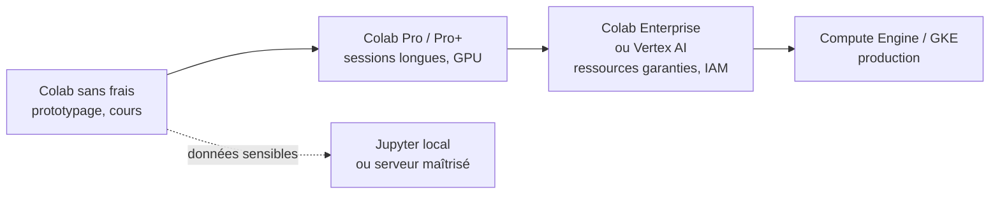

**Google Colab** (ou Google Collaboratory) est un environnement de développement interactif basé sur Jupyter Notebook, hébergé par Google. Il permet d'écrire et d'exécuter du code Python directement dans le cloud, sans nécessiter d'installation locale. Colab est principalement conçu pour la **science des données**, le **machine learning** et d'autres applications d'intelligence artificielle, et il est particulièrement apprécié pour sa simplicité et l'accès gratuit aux ressources de calcul GPU et TPU.

Voici un aperçu des caractéristiques principales de Google Colab :

### 1. **Jupyter Notebook dans le cloud**
Google Colab utilise l'interface de **Jupyter Notebook**, qui est un outil largement utilisé pour écrire et exécuter du code Python en cellules interactives. Cela permet aux utilisateurs de :

- **Combiner du texte, des images, du code et des graphiques** dans un même document.
- **Exécuter des cellules individuellement**, facilitant ainsi l'expérimentation et la visualisation des résultats immédiatement après exécution.
- **Partager facilement des notebooks**, car les notebooks Colab sont enregistrés sur **Google Drive**.

### 2. **Accès aux ressources matérielles (GPU/TPU)**
Un des grands avantages de Google Colab est la possibilité d'accéder à des ressources matérielles avancées, notamment des **GPU** (Graphics Processing Units) et des **TPU** (Tensor Processing Units). Ces ressources sont particulièrement utiles pour :

- **L'entraînement des modèles de machine learning** : Les GPU et TPU accélèrent les calculs, en particulier pour des opérations matricielles massives, comme celles utilisées dans l'entraînement des réseaux de neurones.
- **Les calculs intensifs** : Google Colab permet d'accéder à des machines virtuelles (VM) avec GPU, ce qui est idéal pour des tâches intensives comme la vision par ordinateur, le traitement du langage naturel, ou l'IA.

### 3. **Environnement de développement prêt à l'emploi**
Colab est fourni avec une multitude de bibliothèques Python préinstallées, prêtes à l'emploi. Par exemple, des bibliothèques populaires comme **TensorFlow**, **Keras**, **NumPy**, **Pandas**, **Matplotlib**, **Scikit-learn**, et bien d'autres sont déjà disponibles, ce qui évite de les installer manuellement.

Les utilisateurs peuvent également installer des bibliothèques supplémentaires avec **pip** directement dans le notebook. Cela permet une grande flexibilité pour ajouter des packages spécifiques ou à jour.

### 4. **Intégration avec Google Drive**
Un autre point fort de Google Colab est son intégration avec **Google Drive**, ce qui permet de :

- **Enregistrer automatiquement les notebooks** sur Google Drive.
- **Accéder aux fichiers de Google Drive** depuis un notebook Colab, facilitant ainsi l'importation et l'exportation de données.
- **Collaborer** facilement avec d'autres utilisateurs en partageant les notebooks comme n'importe quel fichier Google Drive.

### 5. **Collaborations en temps réel**
Comme les documents Google (Docs, Sheets), Google Colab permet une collaboration en temps réel avec plusieurs utilisateurs. Vous pouvez partager un notebook avec d'autres personnes, et ils peuvent voir, modifier ou exécuter le code avec vous en temps réel. Cette fonctionnalité est particulièrement utile pour :

- **Les projets collaboratifs** : Les équipes peuvent travailler ensemble sur un même notebook, ce qui est idéal pour les projets académiques ou professionnels.
- **L'enseignement** : Les enseignants peuvent utiliser Colab pour partager des tutoriels, des exercices interactifs et des projets avec leurs étudiants.

### 6. **Gratuit avec des options premium**
Google Colab est gratuit et offre une quantité généreuse de ressources CPU, GPU et TPU. Cependant, pour des besoins plus intensifs, Google propose des plans payants comme **Colab Pro** et **Colab Pro+**, qui offrent des GPU plus puissants, des temps d'exécution plus longs, et une disponibilité accrue des machines.

### 7. **Accès aux ressources externes**
Colab permet également d’accéder à des ressources externes via des services tels que **Google Cloud Storage**, **BigQuery**, ou encore des bases de données hébergées dans d'autres environnements cloud. Cela facilite le traitement de grands ensembles de données sans avoir à les transférer localement.

### 8. **Environnement de développement flexible**
Google Colab permet l'importation de fichiers depuis GitHub, ainsi que l'intégration avec d'autres services et bibliothèques pour un développement plus avancé. Par exemple, vous pouvez cloner un dépôt Git directement dans Colab, ce qui permet de travailler avec des projets versionnés ou collaboratifs directement dans l'environnement cloud.

### Cas d’utilisation courants
Google Colab est largement utilisé dans plusieurs domaines, notamment :

- **Data Science** : Analyse de données avec des bibliothèques comme Pandas et Matplotlib.
- **Machine Learning et Deep Learning** : Entraînement et test de modèles d'apprentissage automatique avec TensorFlow, PyTorch, ou Scikit-learn.
- **Recherche académique** : Partage de projets de recherche, d'expérimentations et de prototypes avec d'autres chercheurs.
- **Prototypage rapide** : Création de prototypes de modèles d'IA et d'applications basées sur des algorithmes.

### Limites de Google Colab
- **Temps d'exécution limité** : Les sessions Colab sont limitées en durée (généralement jusqu'à 12 heures), après quoi la session peut être automatiquement déconnectée.
- **Ressources partagées** : Les GPU et TPU disponibles sur Colab sont partagés entre tous les utilisateurs, donc leur disponibilité peut être limitée pendant les heures de pointe.
- **Déconnexion des VM** : Si une session reste inactive pendant un certain temps, elle peut être interrompue, ce qui signifie que vous devez sauvegarder régulièrement votre travail.

# Colab en 2026 : ce qui a changé

Trois évolutions ont modifié la nature de l'outil depuis la rédaction de cette fiche. Aucune ne relève du détail.

## 1. Gemini est intégré au notebook

Colab n'est plus seulement un Jupyter hébergé : un modèle de langage y est intégré à trois niveaux.

**Au niveau de la cellule.** Une invite en langue naturelle produit le code de la cellule, et les erreurs d'exécution peuvent être expliquées puis corrigées d'un clic.

**Au niveau du carnet — le *Data Science Agent*.** Ouvert à tous les comptes majeurs depuis mars 2025, il produit un **carnet complet et exécutable** à partir d'un fichier de données et d'un objectif exprimé en français : importation des bibliothèques, chargement, exploration préliminaire, visualisations, modèle.

```text
Fichier CSV + « Visualise les tendances et construis un modèle de prédiction »
        ↓
carnet complet, exécutable et modifiable
```

Il accepte les formats CSV, JSON et texte jusqu'à 1 Go, et traite environ 120 000 jetons par invite.

## 2. Ce que cela change pour l'enseignement

C'est le point qui mérite réflexion plutôt qu'enthousiasme.

Un étudiant à qui l'on demande « charger ce CSV, traiter les valeurs manquantes, entraîner un classifieur et tracer la matrice de confusion » obtient désormais un carnet fonctionnel en une invite. L'exercice, tel qu'il était formulé, ne mesure plus rien.

Deux réponses possibles, non exclusives :

- **déplacer l'évaluation vers ce que l'agent fait mal** : justifier le choix d'une métrique, repérer une fuite de données dans un carnet fourni, expliquer pourquoi un résultat est trop beau, critiquer une visualisation trompeuse ;
- **assumer l'outil et évaluer la relecture** : demander à l'étudiant de produire le carnet avec l'agent, puis d'en documenter les erreurs. C'est une compétence professionnelle réelle, et elle est plus difficile que d'écrire le code soi-même.

Le carnet produit contient d'ailleurs régulièrement le défaut décrit dans le cours de fouille de données : un `fit_transform` appliqué avant le découpage entraînement/test. Le faire trouver est un excellent exercice.

## 3. La confidentialité

> **Google collecte les invites, le code engendré et les retours des utilisateurs** pour améliorer ses modèles. Les données sont conservées jusqu'à dix-huit mois, elles sont anonymisées, **des relecteurs humains peuvent les examiner**, et une demande de suppression n'est pas toujours honorée.

Trois conséquences pratiques pour un usage universitaire ou professionnel :

- ne jamais téléverser dans Colab des données personnelles, des données de santé, des copies d'étudiants nominatives ou des données couvertes par un accord de confidentialité ;
- pour un travail sur données réelles, préférer un carnet local — [[Jupyter Notebook et Google Colab]] — ou une instance maîtrisée ;
- vérifier avant un cours que le jeu de données distribué aux étudiants est publiable.

Cette contrainte n'est pas propre à Colab, mais elle est ici particulièrement explicite : autant s'en servir comme cas d'école sur le RGPD, voir [[Règlement Général sur la Protection des Données (RGPD)]].

## 4. Le modèle tarifaire : les unités de calcul

Le modèle « gratuit avec options premium » décrit plus haut a été remplacé par un système d'**unités de calcul** consommées selon le type de machine et la durée.

| Formule | Coût indicatif | Unités |
| --- | --- | --- |
| Sans frais | 0 | quota variable, sans garantie |
| Colab Pro | ≈ 10 $ / mois | 100 unités, GPU plus rapides, terminal |
| Colab Pro+ | ≈ 50 $ / mois | 500 unités, exécution en arrière-plan |
| À la demande | 10 $ / 100 unités | sans abonnement |
| Colab Enterprise | facturation GCP | intégration Google Cloud, IAM |

Deux points que la documentation formule sans détour : un abonné dont le solde d'unités est épuisé **retombe sous les règles de la version gratuite** ; et l'accès aux machines n'est jamais garanti, quel que soit le plan — seuls Colab Enterprise ou une réservation sur GCP Marketplace donnent une garantie.

La version sans frais interdit par ailleurs le contrôle à distance — shells SSH, bureaux distants — et le détournement de l'interface pour héberger un service. Ces usages entraînent une fermeture sans avertissement.

## 5. Le chemin d'escalade



La branche du bas est celle qu'on oublie : dès que les données ne peuvent pas quitter l'établissement, aucune formule Colab ne convient, et la question du budget ne se pose même pas.

## 6. Les alternatives

| Outil | Intérêt propre |
| --- | --- |
| **Kaggle Notebooks** | GPU gratuits avec quota hebdomadaire annoncé, jeux de données intégrés |
| **JupyterLab local** | contrôle total, aucune donnée ne sort |
| **Binder** | exécute un dépôt Git public, sans compte, idéal pour un TP reproductible |
| **VS Code + extension Jupyter** | carnets locaux avec un vrai éditeur, débogueur et intégration Git |
| **marimo** | carnets réactifs stockés en `.py` : versionnables, sans état caché |

Le dernier mérite un mot pour un enseignant. Le format `.ipynb` est un JSON contenant les sorties : un `git diff` y est illisible, et deux étudiants qui rendent le même carnet exécuté dans un ordre différent produisent des fichiers différents. `marimo` stocke le carnet en Python pur et interdit l'état incohérent — deux problèmes de correction en moins.

---

# Lien entre GoogleColab et GCP
Le lien entre **Google Colab** et **Google Cloud Platform (GCP)** réside dans leur intégration au sein de l’écosystème Google, permettant de tirer parti des services et infrastructures puissants de Google Cloud pour enrichir les fonctionnalités de Google Colab. Voici quelques points clés de cette relation :

### 1. **Accès aux services GCP depuis Google Colab**
Google Colab peut se connecter à plusieurs services de **Google Cloud Platform**, facilitant l'accès aux ressources cloud avancées directement depuis un notebook Colab :

- **Google Cloud Storage (GCS)** : Colab permet d’accéder aux données stockées dans GCS. Vous pouvez monter un bucket Google Cloud Storage dans Colab pour charger et enregistrer de grands ensembles de données, sans avoir à les stocker localement. Cela est particulièrement utile pour les projets de machine learning qui nécessitent d'énormes volumes de données.

- **BigQuery** : Colab offre des intégrations avec Google BigQuery, un service d'entrepôt de données massivement évolutif de GCP. Vous pouvez interroger des ensembles de données volumineux directement à partir de Colab et analyser les résultats via Python, facilitant l'analyse des grandes quantités de données.

- **AI Platform** : Google Colab peut également être utilisé en conjonction avec Google AI Platform (maintenant Google Vertex AI) pour l’entraînement et le déploiement de modèles de machine learning à plus grande échelle. Colab est idéal pour le prototypage rapide, mais pour des charges de travail plus lourdes ou la mise en production, vous pouvez transférer vos notebooks vers Google AI Platform pour des entraînements plus robustes et scalables.

### 2. **Utilisation de machines virtuelles GCP dans Colab**
Bien que Google Colab fournisse gratuitement des GPU et TPU pour l’entraînement des modèles, ces ressources sont limitées en termes de capacité et de durée d’utilisation. Pour des besoins de calcul plus intensifs ou continus, vous pouvez migrer vos tâches vers **Google Compute Engine** (GCE) sur GCP.

Vous pouvez, par exemple :
- **Exporter le code de votre notebook Colab** et l’exécuter sur une instance Compute Engine, où vous aurez un accès dédié à des GPU/TPU plus puissants, et vous pourrez également configurer des temps d’exécution beaucoup plus longs.
- **Monter des disques GCP** ou des systèmes de fichiers cloud pour des calculs distribués ou des projets nécessitant beaucoup de mémoire et de puissance de calcul.

### 3. **Déploiement et production avec GCP**
Si vous utilisez Colab pour **prototyper et développer des modèles de machine learning**, une fois que votre modèle est prêt pour le déploiement en production, vous pouvez le migrer vers des services GCP plus spécialisés, comme :
- **Google Kubernetes Engine (GKE)** : Pour orchestrer des conteneurs et mettre en production des pipelines de machine learning à grande échelle.
- **Cloud Functions ou Cloud Run** : Pour déployer vos modèles sous forme de microservices ou d’API dans des environnements scalables sans gestion explicite de serveurs.

### 4. **Gestion des environnements via GCP**
En utilisant Google Colab avec GCP, vous pouvez gérer des environnements hybrides. Colab vous permet de tester rapidement des idées, puis vous pouvez migrer vers GCP pour des calculs intensifs, du stockage massif ou des environnements multi-utilisateurs robustes.

Par exemple :
- Vous pouvez configurer un **environnement hybride** où vous effectuez des expérimentations et du développement dans Google Colab, puis lancer des tâches massives sur **Dataflow** ou **Dataproc** (services GCP pour le traitement des données).
  
### 5. **Facturation et ressources cloud**
Bien que Google Colab offre des ressources gratuites, les utilisateurs peuvent atteindre leurs limites d'utilisation (durée d'exécution limitée, ressources GPU partagées, etc.). Pour contourner ces limitations, vous pouvez passer à **Google Colab Pro** ou **Pro+** pour obtenir des ressources plus puissantes, ou bien utiliser directement les services de Google Cloud Platform pour un contrôle et une gestion plus avancés des ressources cloud (GPU dédiés, TPU de longue durée, etc.).
