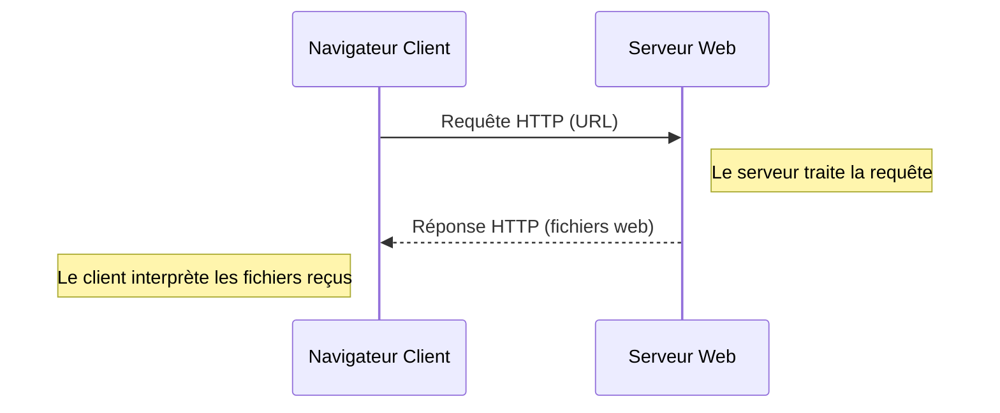
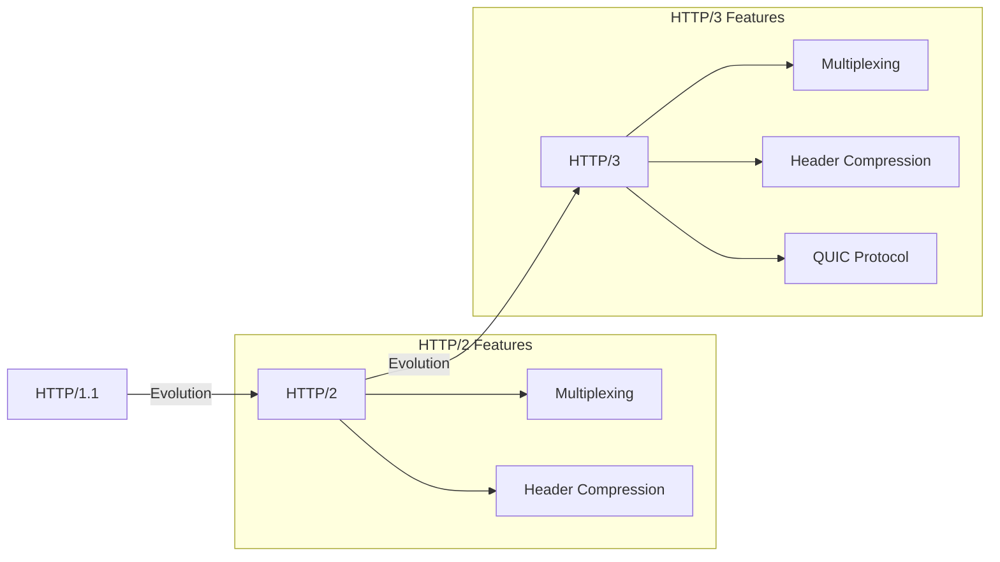
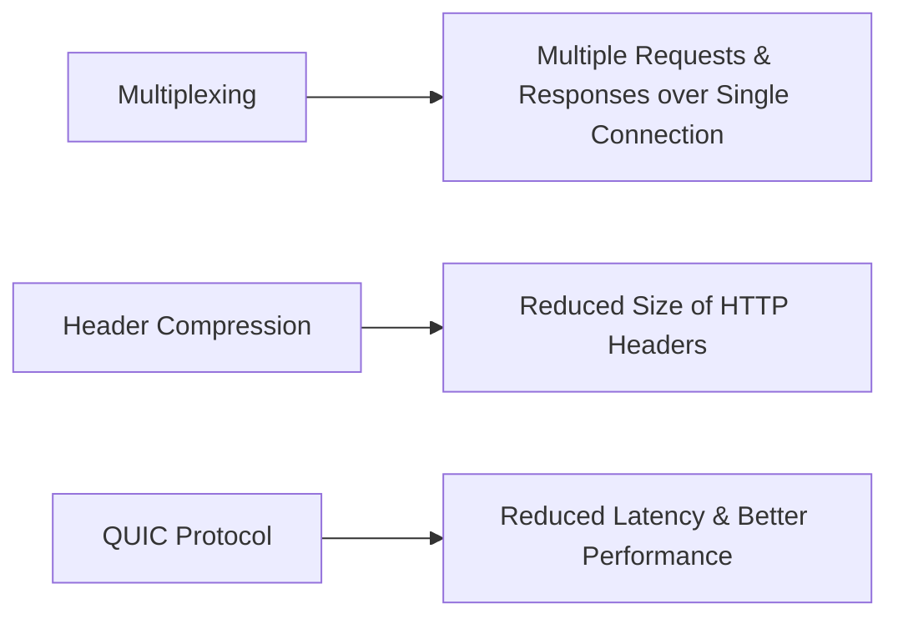
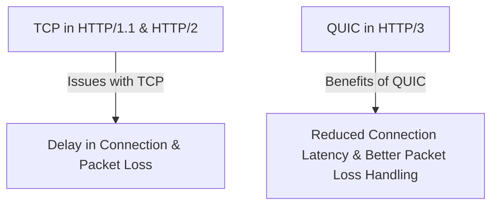

Le protocole HTTP (Hypertext Transfer Protocol) est à le protocole utilisé par les sites web sur internet, nous allons voir ses fondamentaux.

**1. Introduction au Protocole HTTP**

1. Contexte historique et raison d'être du HTTP
2. Définition et objectifs du protocole HTTP
3. L'architecture client-serveur et son rôle dans HTTP
4. Principes de base du protocole HTTP

**2. Les fondamentaux du HTTP**

1. Le cycle de vie d'une requête HTTP: requête et réponse
2. Méthodes HTTP : GET, POST, PUT, DELETE, etc.
3. Les en-têtes HTTP : request headers et response headers
4. Codes de statut HTTP et leur signification
5. Cookies HTTP et gestion des sessions

**3. HTTP et sécurité**

1. Introduction à la sécurité avec HTTP
2. HTTP vs HTTPS: les différences et l'importance du SSL/TLS
3. Les problèmes de sécurité courants dans HTTP et comment les éviter
4. Les bonnes pratiques en matière de sécurité avec HTTP

**4. HTTP/2 et HTTP/3**

1. Les raisons de l'évolution de HTTP vers HTTP/2 et HTTP/3
2. Les différences et les améliorations par rapport à HTTP/1.1
3. Les principes de multiplexage, compression d'en-tête, etc.
4. Le passage de HTTP/2 à HTTP/3: QUIC et l'importance de UDP

**5. Utilisation de HTTP dans le développement web**

1. Les outils de débogage HTTP (comme Postman, curl, etc.)
2. Les API RESTful et l'utilisation de HTTP
3. Les services web et l'importance du HTTP
4. La mise en cache HTTP et ses avantages pour les performances

**6. Conclusion et perspectives**

1. Les tendances actuelles et futures concernant HTTP
2. Les alternatives à HTTP et quand les utiliser
3. Révision et discussion

# 1. Introduction au Protocole HTTP

## 1.1 Qu'est ce qu'un protocole

Voir [[Les protocoles de communications]].

## 1.2 Contexte historique et raison d'être du HTTP

   Le protocole HTTP a été développé par le CERN au début des années 90, avec Tim Berners-Lee comme l'un de ses principaux instigateurs. HTTP a été créé pour faciliter l'échange d'informations sur le World Wide Web, réseau global basé sur l'hypertexte et application d'internet. Il s'agissait d'un système permettant à un document de référencer d'autres documents, créant ainsi un réseau d'informations.

## 1.3 Définition et objectifs du protocole HTTP

HTTP est l'acronyme de Hypertext Transfer Protocol. C'est un protocole de communication qui définit comment les messages sont formatés et transmis, et quelles actions les serveurs web et les navigateurs doivent prendre en réponse à différentes commandes. Par exemple, quand nous entrons une URL dans votre navigateur, celui-ci envoie en fait une requête HTTP au serveur du site web, et celui-ci répond en renvoyant les fichiers web. En d'autres termes, HTTP est le protocole qui permet l'échange de données sur le Web.

Voici un diagramme de séquence Mermaid qui illustre le processus de communication HTTP entre un navigateur (client) et un serveur web.



Ce diagramme décrit le processus suivant :

1. L'utilisateur entre une URL dans son navigateur. Le navigateur envoie alors une requête HTTP au serveur du site web.
2. Le serveur web reçoit la requête et la traite.
3. Le serveur web répond en renvoyant les fichiers web correspondants à l'URL demandée. Cette réponse est également transmise via HTTP.
4. Le navigateur client reçoit la réponse et interprète les fichiers reçus pour afficher la page web à l'utilisateur.

# 1.3 L'architecture client-serveur et son rôle dans HTTP

Le HTTP est basé sur une architecture client-serveur. Dans ce modèle, un client (généralement un navigateur web) envoie une requête à un serveur. Le serveur traite la requête et renvoie une réponse au client. Le client est l'initiateur de la communication, tandis que le serveur attend et répond aux demandes des clients. Ce modèle permet une division claire des responsabilités et permet d'isoler les clients des détails de la mise en œuvre du serveur.

## 1.4 Principes de base du protocole HTTP

HTTP est un protocole sans état, ce qui signifie que chaque requête est traitée indépendamment des autres. Le serveur ne conserve aucune donnée entre les requêtes et chaque requête est traitée comme une transaction complète en soi. Cependant, des mécanismes tels que les cookies peuvent être utilisés pour maintenir l'état entre les requêtes.

De plus, HTTP est un protocole orienté texte. Les messages HTTP sont constitués de textes lisibles par l'homme, ce qui simplifie leur création et leur débogage. 

C'est tout pour cette première partie. Nous avons appris comment HTTP est né, ce qu'il est, comment il fonctionne sur une architecture client-serveur et quelques-uns de ses principes de base. Dans la prochaine partie, nous nous pencherons sur les détails du protocole HTTP, y compris les différentes méthodes, les en-têtes et les codes de statut.

# 2. Les fondamentaux du HTTP

Après avoir introduit le protocole HTTP, nous allons maintenant approfondir notre compréhension de ses fondamentaux. Nous étudierons le cycle de vie d'une requête HTTP, les différentes méthodes HTTP, les en-têtes HTTP et enfin, les codes de statut HTTP.

## 2.1 Le cycle de vie d'une requête HTTP: requête et réponse

Le cycle de vie d'une requête HTTP commence par le client, généralement un navigateur, qui envoie une requête HTTP à un serveur. Cette requête comprend la méthode HTTP (comme GET ou POST), l'URL, les en-têtes de requête et éventuellement un corps de requête. Le serveur traite la requête et renvoie une réponse HTTP. Cette réponse comprend un code de statut, des en-têtes de réponse et un corps de réponse. 

## 2.2. Méthodes HTTP : GET, POST, PUT, DELETE, etc

   Les méthodes HTTP définissent le type d'action que le client souhaite effectuer. Les plus courantes sont :

- GET : Demande une ressource spécifiée.
- POST : Soumet des données à traiter à une ressource spécifique.
- PUT : Met à jour une ressource spécifiée avec des données fournies.
- DELETE : Supprime la ressource spécifiée.
- HEAD : Similaire à la méthode GET, la méthode HEAD demande une ressource à un serveur, mais contrairement à GET, elle demande uniquement les en-têtes de la ressource et non le corps de la ressource lui-même. C'est utile pour récupérer des métadonnées.
- OPTIONS : Cette méthode demande au serveur de décrire les options de communication disponibles pour la ressource ciblée. C'est utile pour déterminer les fonctionnalités d'un serveur ou les méthodes HTTP prises en charge par une ressource.
- PATCH : La méthode PATCH est utilisée pour appliquer des modifications partielles à une ressource. Elle est souvent utilisée lorsqu'il est nécessaire de mettre à jour seulement certaines parties d'une ressource, plutôt que de la remplacer entièrement comme le fait la méthode PUT.
- CONNECT : La méthode CONNECT est utilisée pour établir un réseau de tunnelage à utiliser dans les communications réseau à bas niveau, généralement pour faciliter les communications HTTPS via un proxy HTTP.
- TRACE : La méthode TRACE effectue un test de boucle de retour de message le long du chemin vers la ressource cible. En d'autres termes, il demande au serveur de renvoyer la requête telle qu'elle a été reçue, ce qui peut être utile pour le débogage.

Chaque méthode HTTP a un rôle spécifique et est utilisée dans des circonstances spécifiques. En comprenant ce que chaque méthode fait, nous pouvons utiliser HTTP de manière plus efficace et appropriée.

### 2.3 Les en-têtes HTTP : request headers et response headers

Les en-têtes HTTP fournissent des informations supplémentaires sur la requête ou la réponse HTTP. Ils sont utilisés pour représenter les méta-données associées à la requête ou la réponse HTTP.

#### 2.3.1 Request Headers (En-têtes de requête)

Les en-têtes de requête HTTP fournissent des informations sur la requête elle-même. Ces en-têtes sont envoyés par le client au serveur et peuvent inclure des détails tels que :

- `User-Agent` : contient des informations sur le client, généralement le navigateur, qui effectue la requête. Par exemple, le navigateur web que nous utilisez, sa version, etc.
- `Accept` : spécifie les types de média que le client est capable de comprendre et accepter.
- `Host` : spécifie le domaine hôte de la ressource à laquelle le client souhaite accéder.
- `Referer` : indique l'URL de la page qui a conduit le client à effectuer la requête actuelle.

#### 2.3.2 Response Headers (En-têtes de réponse)

Les en-têtes de réponse HTTP fournissent des informations sur la réponse elle-même. Ces en-têtes sont envoyés par le serveur au client et peuvent inclure des détails tels que :

- `Content-Type` : indique le type de média de la ressource renvoyée.
- `Date` : indique la date et l'heure auxquelles la réponse a été générée par le serveur.
- `Server` : contient des informations sur le logiciel utilisé par le serveur.
- `Content-Length` : indique la taille de la ressource renvoyée.

En comprenant les en-têtes HTTP, nous pouvons personnaliser nos requêtes et nos réponses pour mieux répondre à nos besoins, et nous pouvons également utiliser ces informations pour le débogage et l'optimisation des performances.

### 2.4 Codes de statut HTTP et leur signification

Les codes de statut HTTP font partie de la réponse que le serveur envoie après avoir reçu une requête HTTP. Ces codes sont conçus pour indiquer le résultat de la requête et informer le client sur la manière dont elle a été traitée.

#### 2.4.1 Les codes de statut 1xx : Information

Les codes de statut commençant par 1 sont des réponses d'information. Ils indiquent que la requête a été reçue et que le processus est en cours. Par exemple, `100 Continue` signifie que le serveur a bien reçu les en-têtes de la requête et que le client peut continuer à envoyer le corps de la requête.

#### 2.4.2 Les codes de statut 2xx : Succès

Les codes de statut commençant par 2 signifient que la requête a été traitée avec succès. Par exemple, `200 OK` est probablement le code de statut le plus connu. Il signifie que la requête a réussi et que la réponse dépend de la méthode de la requête : GET, HEAD, POST, PUT.

#### 2.4.3 Les codes de statut 3xx : Redirection

Les codes de statut commençant par 3 sont utilisés pour les redirections. Ils indiquent que le client doit effectuer d'autres actions pour terminer la requête. Par exemple, `301 Moved Permanently` indique que l'URL demandée a été modifiée de manière permanente et que toute référence future à cette ressource doit utiliser l'une des URL de retour.

#### 2.4.4 Les codes de statut 4xx : Erreurs du client

Les codes de statut commençant par 4 sont des erreurs du côté client. Ils indiquent qu'il y a eu un problème avec la requête. Le code de statut `404 Not Found`, signifie que le client a demandé une ressource qui n'existe pas sur le serveur.

#### 2.4.5 Les codes de statut 5xx : Erreurs du serveur

Les codes de statut commençant par 5 sont des erreurs du côté serveur. Ils indiquent que le serveur a rencontré une erreur lors du traitement de la requête. Par exemple, `500 Internal Server Error` signifie que le serveur a rencontré une condition inattendue qui l'a empêché de répondre à la requête.

Les codes de statut HTTP jouent un rôle clé dans le web. Ils aident les développeurs à comprendre ce qui se passe lorsque les choses ne se passent pas comme prévu et sont essentiels pour le débogage des problèmes. Dans la prochaine section, nous explorerons comment HTTP est utilisé dans le développement web et comment nous pouvons l'utiliser pour créer des applications web plus performantes et plus fiables.

# 3. HTTP et sécurité

Nous avons appris les bases du protocole HTTP et comment il facilite la communication entre les clients et les serveurs. Cependant, dans un monde de plus en plus connecté et numérisé, la sécurité est une préoccupation majeure. Dans cette partie, nous allons étudier les aspects liés à la sécurité avec HTTP.

## 3.1 Introduction à la sécurité avec HTTP

HTTP, en soi, n'est pas un protocole sécurisé. Les informations échangées entre le client et le serveur sont en clair, ce qui signifie que toute personne qui peut intercepter la communication peut lire et modifier les informations. Cela pose des problèmes pour la confidentialité des données et l'intégrité des communications. Il est crucial de comprendre que, par défaut, nos communications sur le port 80 sont similaires à l'envoi de cartes postales. En effet, tout intermédiaire acheminant ces "cartes postales" numériques peut lire le contenu du message. Si ce dernier contient des informations sensibles comme un mot de passe, alors ces informations ne sont plus secrètes. C'est comme si nous écrivions nos secrets sur une carte postale et que nous les laissions à la merci de tous ceux qui manipulent cette carte durant son acheminement.

# 3.2 HTTP vs HTTPS: les différences et l'importance du SSL/TLS

Pour résoudre les problèmes de sécurité de HTTP, le protocole HTTPS a été introduit. HTTPS est essentiellement du HTTP sur une connexion sécurisée par SSL/TLS. SSL (Secure Sockets Layer) et TLS (Transport Layer Security) sont des protocoles qui chiffrent les données transmises entre le client et le serveur. Cela garantit que les données ne peuvent pas être lues ou modifiées par des tiers. De plus, SSL/TLS assure l'authentification du serveur, ce qui signifie que le client peut être sûr qu'il communique avec le bon serveur.

## 3.3 Les problèmes de sécurité courants dans HTTP et comment les éviter

Il existe plusieurs problèmes de sécurité courants avec HTTP, tels que l'écoute clandestine (lorsqu'un attaquant lit les données transmises), le détournement de session (lorsqu'un attaquant prend le contrôle d'une session entre un client et un serveur) et le spoofing (lorsqu'un attaquant se fait passer pour un autre utilisateur ou serveur). L'utilisation de HTTPS est une mesure de protection contre ces attaques. De plus, des pratiques telles que l'envoi de cookies uniquement sur des connexions sécurisées et l'utilisation de la politique de sécurité du contenu (CSP) peuvent aider à prévenir ces attaques.

## 3.4 Les bonnes pratiques en matière de sécurité avec HTTP

En plus de l'utilisation de HTTPS, il y a d'autres bonnes pratiques en matière de sécurité avec HTTP. Par exemple, il est important de contrôler les en-têtes de réponse pour éviter les attaques de type clickjacking ou Cross-Site Scripting (XSS). Il est également recommandé de contrôler l'accès aux ressources du serveur, de mettre en œuvre des protections contre les attaques par force brute et de tenir à jour les logiciels du serveur.

C'est tout pour cette partie sur HTTP et la sécurité. Nous avons appris l'importance de la sécurité dans les communications HTTP, la différence entre HTTP et HTTPS, les problèmes de sécurité courants et comment les éviter, ainsi que les bonnes pratiques en matière de sécurité. Dans la prochaine partie, nous examinerons les évolutions récentes du protocole HTTP avec HTTP/2 et HTTP/3.

# 4. HTTP/2 et HTTP/3

Les protocoles HTTP/2 et HTTP/3 sont des évolutions importantes du protocole HTTP/1.1, offrant des améliorations en termes de performances, d'efficacité et de sécurité. Nous allons explorer les raisons de ces évolutions, les différences clés et les nouvelles fonctionnalités qu'elles introduisent.

## 4.1 Les raisons de l'évolution de HTTP vers HTTP/2 et HTTP/3

Avec le temps et l'évolution du web, certaines limites de HTTP/1.1 ont commencé à apparaître, notamment des problèmes de performances et d'efficacité. HTTP/2 et HTTP/3 ont été développés pour répondre à ces problèmes, avec des améliorations telles que le multiplexage, la compression des en-têtes, et le passage à un transport sur UDP pour HTTP/3.

## 4.2 Les différences et les améliorations par rapport à HTTP/1.1

HTTP/2 a introduit plusieurs améliorations majeures par rapport à HTTP/1.1. Par exemple, HTTP/2 permet le multiplexage, qui permet à plusieurs demandes et réponses d'être envoyées simultanément sur une seule connexion, ce qui améliore considérablement l'efficacité. De plus, HTTP/2 a introduit la compression des en-têtes, qui réduit la quantité de données qui doivent être transmises. HTTP/3 va encore plus loin en remplaçant TCP par UDP grâce au protocole QUIC, ce qui améliore les performances, surtout en cas de perte de paquets.



## 4.3 Les principes de multiplexage, compression d'en-tête, etc.

Le multiplexage est une technique qui permet à plusieurs demandes et réponses d'être transmises simultanément sur une seule connexion. Cela améliore l'efficacité car il n'est pas nécessaire d'ouvrir et de fermer de multiples connexions.

La compression d'en-tête est une technique qui réduit la taille des en-têtes HTTP en les compressant. Cela réduit la quantité de données qui doivent être transmises et améliore les performances.

QUIC est un protocole de transport basé sur UDP qui est utilisé dans HTTP/3. Il améliore les performances en réduisant la latence, en particulier en cas de perte de paquets.



## 4.4 Le passage de HTTP/2 à HTTP/3: QUIC et l'importance de UDP

QUIC est un protocole de transport développé par Google et standardisé par l'IETF. QUIC utilise UDP (User Datagram Protocol) au lieu de TCP (Transmission Control Protocol), ce qui permet d'améliorer considérablement les performances, en particulier en cas de perte de paquets. TCP, utilisé dans HTTP/1.1 et HTTP/2, nécessite plusieurs allers-retours pour établir une connexion et chaque paquet perdu entraîne un retard important. En revanche, QUIC, utilisé dans HTTP/3, réduit les retards de connexion et gère mieux les pertes de paquets, ce qui est particulièrement avantageux pour les applications en temps réel et les connexions mobiles.



**5. Utilisation de HTTP dans le développement web**

## 5.1 Les outils de débogage HTTP (comme Postman, curl, etc.)

Dans le processus de développement web, l'utilisation d'outils de débogage HTTP est essentielle. Ils nous aident à comprendre, tester et débuguer la communication entre le client et le serveur.

**Postman** est un outil populaire qui nous permet d'envoyer des requêtes HTTP vers nos serveurs et d'inspecter les réponses. Il offre une interface utilisateur intuitive qui facilite la configuration des requêtes, y compris la définition de l'URL, des paramètres, des en-têtes, et du corps des requêtes.

**Curl** est un autre outil couramment utilisé, généralement en ligne de commande. Il est extrêmement flexible et permet d'envoyer presque n'importe quel type de requête HTTP.

## 5.1.1 Postman

[Postman](https://www.postman.com/) est un outil très utilisé par les développeurs pour tester et déboguer des API. Il offre une interface utilisateur graphique qui permet d'envoyer des requêtes HTTP et d'examiner les réponses.

Avec Postman, nous pouvons configurer tous les aspects de la requête HTTP :

- URL et méthode (GET, POST, PUT, DELETE, etc.)
- En-têtes HTTP (par exemple, `Content-Type`, `Authorization`, etc.)
- Paramètres de l'URL ou du corps de la requête
- Corps de la requête pour les méthodes POST et PUT
- Gestion des cookies

Postman permet également de créer des collections de requêtes, ce qui est très utile pour organiser vos tests ou pour partager des requêtes avec votre équipe.

L'une des fonctionnalités les plus puissantes de Postman est la possibilité d'écrire des scripts de test qui s'exécutent après que la requête a été envoyée. nous pouvons utiliser ces scripts pour vérifier que la réponse est correcte, pour extraire des données de la réponse, ou pour configurer des variables d'environnement.

Enfin, Postman dispose d'un système de variables d'environnement qui nous permet de configurer des valeurs différentes en fonction de l'environnement dans lequel nous travaillons (par exemple, développement, test, production, etc.)

Nous pouvons télécharger Postman depuis [ici](https://www.postman.com/downloads/).

## 5.1.2 Curl

[Curl](https://curl.haxx.se/) (Client URL) est un outil de ligne de commande open-source largement utilisé pour transférer des données avec des URL. Il est extrêmement puissant et flexible, et supporte un grand nombre de protocoles, dont HTTP, HTTPS, FTP, FTPS, SCP, SFTP, TFTP, DICT, TELNET, LDAP, entre autres.

Curl est très apprécié pour sa flexibilité. Il permet d'envoyer n'importe quel type de requête HTTP (GET, POST, PUT, DELETE, etc.), et de personnaliser les en-têtes HTTP, les données de requête, et d'autres aspects de la requête. 

Voici quelques exemples d'utilisation de Curl pour envoyer des requêtes HTTP :

- Envoi d'une requête GET :

    ```bash
    curl http://exemple.com
    ```

- Envoi d'une requête POST avec des données :

    ```bash
    curl -d "param1=valeur1&param2=valeur2" -X POST http://exemple.com
    ```

- Envoi d'une requête avec un en-tête personnalisé :

    ```bash
    curl -H "Content-Type: application/json" -X POST -d '{"param1":"valeur1", "param2":"valeur2"}' http://exemple.com
    ```

Curl est généralement préinstallé sur la plupart des systèmes Unix et Mac. Sur Windows, nous pouvons l'installer via le gestionnaire de paquets [Chocolatey](https://chocolatey.org/) ou le télécharger directement depuis le [site officiel](https://curl.haxx.se/download.html).

L'une des raisons pour lesquelles Curl est si utile est qu'il permet de tester rapidement une API sans avoir besoin d'écrire un code client complet. En outre, comme Curl est un outil en ligne de commande, nous pouvons l'utiliser dans des scripts shell pour automatiser des tâches, telles que le test de votre API pendant le développement ou le déploiement.

## 5.2 Les API RESTful et l'utilisation de HTTP

Le développement de services web modernes repose souvent sur ce que l'on appelle les API RESTful. REST signifie Representational State Transfer. Il s'agit d'une architecture qui définit un ensemble de contraintes pour la création de services web. Les API qui respectent ces contraintes sont dites "RESTful".

Le protocole HTTP est au cœur des API RESTful. En fait, REST utilise les méthodes HTTP pour définir les actions qui peuvent être effectuées sur une ressource. Une "ressource" peut être n'importe quel objet que nous souhaitons manipuler et qui peut être identifié par une URL, un URI pour être plus précis. 

Par exemple, dans une API pour une bibliothèque, une ressource pourrait être un "livre". Un livre pourrait être représenté par une URL comme "http://bibliotheque.com/livres/1234". Pour récupérer les informations sur ce livre, nous pourrions envoyer une requête GET à cette URL. Pour mettre à jour les informations sur le livre, nous pourrions envoyer une requête PUT avec les nouvelles informations. Pour supprimer le livre, nous pourrions envoyer une requête DELETE.

Voici comment les méthodes HTTP sont généralement utilisées dans une API RESTful :

- GET : récupère une ressource.
- POST : crée une nouvelle ressource.
- PUT : met à jour une ressource existante.
- DELETE : supprime une ressource.

Une caractéristique clé des API RESTful est qu'elles sont sans état. Cela signifie que chaque requête est indépendante et que le serveur n'a pas besoin de garder la trace de l'état de la session entre les requêtes.

Nous allons explorer cela plus en détail dans la suite de ce cours, lorsque nous aborderons comment concevoir et développer une API RESTful.

## 5.3 Les services web et l'importance du HTTP

HTTP est le pilier des services web. Que ce soit pour le transfert de pages HTML, pour faire appel à des API RESTful ou SOAP, ou pour échanger des données au format JSON ou XML, HTTP est le protocole qui rend tout cela possible. Sa simplicité, sa flexibilité et son universalité sont les raisons pour lesquelles il est le protocole de choix pour les services web.

## 5.4 La mise en cache HTTP et ses avantages pour les performances

La mise en cache est une méthode qui consiste à garder une copie locale des ressources souvent demandées pour accélérer leur livraison lors des demandes suivantes. Cette technique est particulièrement utile dans le contexte HTTP pour optimiser les performances de nos services web.

Comment cela fonctionne-t-il ? HTTP définit plusieurs en-têtes, tels que `Cache-Control` et `ETag`, qui gèrent la mise en cache des réponses. Par exemple, `Cache-Control` peut être utilisé pour définir combien de temps une ressource doit être gardée en cache avant qu'une nouvelle demande ne soit faite au serveur. `ETag`, de son côté, est un identifiant unique attribué à une version spécifique d'une ressource. Lorsqu'une ressource est mise à jour sur le serveur, son `ETag` change. Cela permet au client de savoir si sa version en cache est toujours à jour ou non.

L'utilisation judicieuse de la mise en cache HTTP peut apporter des avantages significatifs en termes de performances. Voici quelques-uns de ces avantages :

1. **Réduction du temps de chargement des pages :** En stockant les ressources localement, les clients peuvent afficher les pages plus rapidement, car ils n'ont pas besoin de les télécharger à chaque fois.

2. **Diminution de la charge sur le serveur :** En servant des ressources depuis le cache plutôt que de les générer à chaque fois, le serveur peut économiser des ressources précieuses et répondre à davantage de requêtes.

3. **Réduction de la consommation de bande passante :** En récupérant les ressources du cache local plutôt que du serveur, nous économisons de la bande passante, ce qui peut être particulièrement bénéfique pour les utilisateurs avec des connexions Internet limitées.

Ainsi, comprendre et implémenter correctement la mise en cache HTTP est essentiel pour optimiser la performance de nos applications et offrir une expérience utilisateur de qualité. Dans la prochaine section, nous discuterons des problèmes de sécurité liés à HTTP et comment y faire face.

## 6. Conclusion et perspectives

Après avoir exploré en profondeur le protocole HTTP, ses mécanismes de base, ses méthodes, codes de statut et en-têtes, ainsi que son rôle central dans les services web et le développement web, il est temps de conclure notre cours et de regarder vers l'avenir.

### 6.1 Les tendances actuelles et futures concernant HTTP

HTTP continue d'évoluer pour répondre aux besoins toujours croissants en matière de performances, de sécurité et de fonctionnalités sur le web. HTTP/2 et HTTP/3, les versions les plus récentes du protocole, introduisent des améliorations majeures comme le multiplexage, la compression d'en-tête, la priorisation des requêtes et même le transport sur UDP dans le cas de HTTP/3. Ces améliorations rendent le web plus rapide, plus efficace et plus robuste.

De plus, l'adoption de HTTPS, la version sécurisée de HTTP, continue de croître grâce à la prise de conscience accrue de l'importance de la sécurité sur le web. HTTPS chiffre la communication entre le client et le serveur, empêchant les attaques d'écoute et assurant la confidentialité des données échangées.

### 6.2 Les alternatives à HTTP et quand les utiliser

Bien que HTTP soit le protocole de choix pour les services web, il existe d'autres protocoles qui peuvent être plus appropriés dans certaines situations. Par exemple, le protocole WebSocket est conçu pour des communications bidirectionnelles en temps réel et est parfaitement adapté pour les applications interactives comme les jeux en ligne ou les chats en direct. De même, le protocole MQTT est optimisé pour l'Internet des objets, offrant une communication légère et fiable entre les appareils.

Cependant, il est important de noter que l'utilisation de ces protocoles nécessite généralement une compréhension plus approfondie de leurs spécificités et de leurs contraintes, et que HTTP reste le protocole le plus universel et le plus facile à utiliser pour les services web.

### 6.3 Révision et discussion

En conclusion, le protocole HTTP est le pilier du web. Comprendre son fonctionnement et savoir comment l'utiliser efficacement est une compétence essentielle pour tout développeur web. Que vous construisiez une application web, une API ou un service web, HTTP est l'outil qui vous permet de communiquer entre le client et le serveur, d'échanger des données et d'interagir avec le reste du web.

Mais comme toujours, il est important de rester curieux et ouvert à l'apprentissage. Le web évolue constamment, et de nouveaux protocoles, normes et technologies sont constamment introduits. Alors, continuez à apprendre, à explorer et à expérimenter, et vous serez toujours prêts à relever les défis du développement web.

Nous avons couvert beaucoup de terrain dans ce cours, et nous espérons qu'il vous a été utile. N'hésitez pas à revoir les sections précédentes si vous avez des doutes ou des questions. Et rappelez-vous, la meilleure façon d'apprendre est de faire. Alors, mettez en pratique ce que vous avez appris, construisez quelque chose de nouveau et amusez-vous en le faisant !
