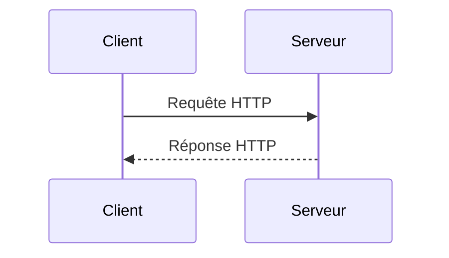
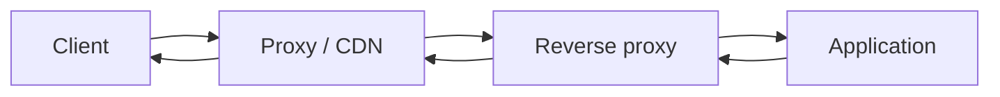
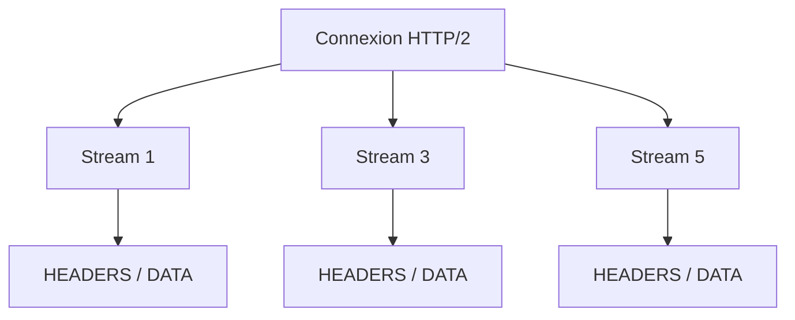

> [!info] Livre GNU/Linux
> Ce cours est repris dans le livre [[GNU Linux — Sommaire]] — chapitre [[GNU Linux — 16 — Le protocole HTTP et le serveur Apache|16]].

# HTTP

> [!abstract] Objectif
> Maîtriser HTTP tel qu'il est spécifié et déployé en 2026 : sémantique (RFC 9110), méthodes dont le nouveau QUERY, en-têtes, codes, négociation, cache (RFC 9111), HTTP/1.1, HTTP/2 et HTTP/3 sur QUIC, TLS, sécurité des applications Web, performance et outils de diagnostic.

Voir aussi : [[HTML]], [[Javascript]], [[SEO]], [[Apache]], [[Les protocoles de communications]], [[OAuth OpenID]], [[IPFS]].

HTTP, **Hypertext Transfer Protocol**, est la famille de protocoles applicatifs au cœur du Web. Il fournit une interface générique permettant à un client d'interagir avec des **ressources** au moyen de requêtes et de réponses.

HTTP n'est pas limité aux pages HTML. Il transporte aussi des API JSON, des images, des vidéos, des fichiers, des flux d'événements, des appels RPC et de nombreux autres formats.

> [!important]
> HTTP définit avant tout une **sémantique** : méthodes, champs, codes de statut, cache, représentations, etc. HTTP/1.1, HTTP/2 et HTTP/3 expriment cette même sémantique avec des formats de transport différents.

En 2026, les références principales sont notamment :

- **RFC 9110** — HTTP Semantics ;
- **RFC 9111** — HTTP Caching ;
- **RFC 9112** — HTTP/1.1 ;
- **RFC 9113** — HTTP/2 ;
- **RFC 9114** — HTTP/3 ;
- **RFC 9000** — QUIC ;
- **RFC 9204** — QPACK ;
- **RFC 9218** — Extensible Prioritization Scheme for HTTP ;
- **RFC 9651** — Structured Field Values for HTTP ;
- **RFC 9530** — Digest Fields ;
- **RFC 9421** — HTTP Message Signatures ;
- **RFC 9931** — sécurité des transitions optimistes de protocole en HTTP/1.1 ;
- **RFC 10008** — méthode HTTP `QUERY`, publiée en juin 2026.

## Objectifs du cours

À l'issue de ce cours, nous devons être capables de :

1. expliquer le modèle ressource/représentation de HTTP ;
2. lire et construire une requête ou une réponse HTTP ;
3. choisir correctement une méthode et un code de statut ;
4. comprendre HTTP/1.1, HTTP/2 et HTTP/3 ;
5. utiliser correctement le cache et les requêtes conditionnelles ;
6. comprendre cookies, sessions, authentification et autorisation ;
7. diagnostiquer CORS, CSP, TLS et les problèmes de proxy ;
8. concevoir une API HTTP robuste ;
9. mesurer et améliorer les performances ;
10. reconnaître les principales classes de vulnérabilités liées à HTTP.

# Sommaire

1. Repères historiques et modèle mental
2. Ressources, URI, représentations et messages
3. Méthodes HTTP et propriétés sémantiques
4. Codes de statut
5. Champs HTTP et métadonnées
6. HTTP/1.1
7. HTTP/2
8. HTTP/3 et QUIC
9. Représentations, négociation et compression
10. Cache HTTP et requêtes conditionnelles
11. Cookies, état et sessions
12. Authentification et autorisation
13. HTTPS, TLS, certificats et HSTS
14. Sécurité navigateur : origine, CORS, CSP et politiques associées
15. Proxies, reverse proxies, CDN et intermédiaires
16. Concevoir des API HTTP
17. Streaming et communications temps réel
18. Performance HTTP
19. Diagnostic et observabilité
20. Déploiement et exploitation
21. Sécurité HTTP avancée
22. Extensions modernes de HTTP
23. Choisir entre HTTP et d'autres protocoles
24. Travaux pratiques
25. Synthèse, checklist et références

# 1. Repères historiques et modèle mental

## 1.1 Origine

HTTP naît avec le World Wide Web au CERN autour de Tim Berners-Lee. La toute première forme, aujourd'hui appelée **HTTP/0.9**, était extrêmement simple : une requête `GET` suivie d'un document.

La famille évolue ensuite :

| Période | Évolution |
|---|---|
| 1991 | HTTP/0.9, modèle minimal |
| 1996 | RFC 1945, HTTP/1.0 |
| 1997 puis 1999 | premières normalisations de HTTP/1.1 |
| 2014 | série RFC 723x |
| 2015 | HTTP/2, RFC 7540 |
| 2022 | réorganisation moderne : RFC 9110 à 9114 |
| 2022 | HTTP/3 standardisé sur QUIC |
| 2026 | HTTP/1.1 reçoit encore des mises à jour de sécurité, par exemple RFC 9931 |

La normalisation moderne sépare volontairement :

- la **sémantique HTTP** ;
- le **cache** ;
- la syntaxe et le transport propres à chaque version.

## 1.2 HTTP est un protocole applicatif

HTTP est situé à la couche application.

```text
Application      HTTP
                 │
Sécurité         TLS, intégré au transport QUIC pour HTTP/3
                 │
Transport        TCP pour HTTP/1.1 et HTTP/2
                 QUIC/UDP pour HTTP/3
                 │
Réseau           IP
```

HTTP ne remplace donc ni TCP, ni UDP, ni IP.

## 1.3 Client, serveur et intermédiaires

Le modèle le plus simple est :


```mermaid
sequenceDiagram
    participant C as Client
    participant S as Serveur
    C->>S: Requête HTTP
    S-->>C: Réponse HTTP
```

Dans la réalité, plusieurs intermédiaires peuvent intervenir :


```mermaid
graph LR
    C[Client] --> P[Proxy / CDN]
    P --> R[Reverse proxy]
    R --> A[Application]
    A --> R
    R --> P
    P --> C
```

Ces acteurs peuvent :

- terminer TLS ;
- mettre en cache ;
- compresser ;
- équilibrer la charge ;
- authentifier ;
- filtrer ;
- ajouter ou retirer certains champs ;
- transformer le protocole entre deux segments.

## 1.4 Sans état ne signifie pas sans session

HTTP est qualifié de **stateless** : une requête possède une sémantique compréhensible indépendamment d'un état de connexion applicatif implicite.

Cela n'empêche pas une application de conserver un état via :

- un cookie de session ;
- un jeton d'accès ;
- une base de données ;
- un cache distribué ;
- un identifiant envoyé dans chaque requête.

La différence est importante : **l'état applicatif n'est pas fourni automatiquement par HTTP**.

## 1.5 HTTP n'est pas toujours « du texte »

HTTP/1.1 utilise une syntaxe textuelle pour sa ligne de départ et ses champs.

HTTP/2 et HTTP/3 utilisent au contraire un **framing binaire**.

La sémantique reste similaire, mais la représentation sur le réseau change.

# 2. Ressources, URI, représentations et messages

## 2.1 Ressource et représentation

Une **ressource** est un concept identifié par une URI.

Une **représentation** est une forme transmissible de l'état de cette ressource.

Exemple :

```text
https://api.example.org/users/42
```

peut désigner un utilisateur. Selon la négociation, le serveur peut renvoyer :

```json
{
  "id": 42,
  "name": "Ada"
}
```

ou une représentation HTML.

Il faut donc éviter de confondre :

```text
ressource ≠ fichier ≠ représentation
```

## 2.2 URI, URL et origine

Une URL typique :

```text
https://www.example.org:443/catalogue/livres?page=2#resultats
\___/   \_____________/ \________________/ \____/ \_______/
 schéma       autorité        chemin          query  fragment
```

Le fragment `#resultats` n'est généralement **pas envoyé au serveur** dans une requête HTTP classique : il est interprété côté client.

Une **origine Web** est définie essentiellement par :

```text
scheme + host + port
```

Ainsi :

```text
https://example.org
https://api.example.org
```

sont deux origines différentes.

## 2.3 Anatomie conceptuelle d'une requête

Une requête possède :

- une méthode ;
- une cible ;
- des champs ;
- éventuellement un contenu.

Exemple HTTP/1.1 :

```http
POST /api/users HTTP/1.1
Host: example.org
Content-Type: application/json
Accept: application/json
Content-Length: 35

{"name":"Ada","role":"admin"}
```

## 2.4 Anatomie conceptuelle d'une réponse

```http
HTTP/1.1 201 Created
Content-Type: application/json
Location: /api/users/42
Cache-Control: no-store

{"id":42,"name":"Ada"}
```

HTTP/2 et HTTP/3 n'envoient pas exactement cette syntaxe textuelle, mais ils expriment les mêmes éléments sémantiques.

## 2.5 Contenu, représentation et encodage

Il faut distinguer :

- le type de média : `Content-Type` ;
- l'encodage du contenu : `Content-Encoding` ;
- la taille du contenu : `Content-Length` lorsque connue et appropriée ;
- le codage de transfert propre à HTTP/1.1 : par exemple `Transfer-Encoding: chunked`.

Exemple :

```http
Content-Type: application/json; charset=utf-8
Content-Encoding: gzip
```

Le contenu est du JSON, puis compressé avec gzip pour le transport.

# 3. Méthodes HTTP et propriétés sémantiques

## 3.1 Les méthodes principales

| Méthode | Usage général | Sûre | Idempotente |
|---|---|---:|---:|
| `GET` | obtenir une représentation | oui | oui |
| `HEAD` | obtenir les métadonnées d'un GET sans contenu de réponse | oui | oui |
| `POST` | demander un traitement défini par la ressource | non | non en général |
| `QUERY` | exécuter une requête de consultation décrite dans le contenu | oui | oui |
| `PUT` | créer/remplacer l'état de la ressource cible | non | oui |
| `PATCH` | appliquer une modification partielle | non | dépend de l'opération |
| `DELETE` | demander la suppression | non | oui sémantiquement |
| `OPTIONS` | découvrir les options de communication | oui | oui |
| `CONNECT` | établir un tunnel | non | non |
| `TRACE` | boucle de diagnostic | oui sémantiquement | oui |

> [!important]
> **Idempotent** ne signifie pas « la réponse est toujours identique ». Cela signifie que répéter la même requête a l'intention d'avoir le même effet côté serveur qu'une seule exécution.

## 3.2 GET

`GET` demande une représentation de la ressource cible.

```bash
curl https://api.example.org/users/42
```

Une requête GET devrait rester **sans effet de bord intentionnel**.

Une application ne devrait donc pas concevoir :

```text
GET /delete-account
```

pour supprimer un compte.

## 3.3 HEAD

`HEAD` demande au serveur les mêmes métadonnées qu'un `GET`, sans envoyer le contenu de la réponse.

```bash
curl -I https://example.org/archive.tar.zst
```

Utile pour :

- inspecter les champs ;
- vérifier `Content-Length` ;
- récupérer un `ETag` ;
- tester l'existence d'une ressource.

## 3.4 POST

`POST` signifie : **demander à la ressource cible de traiter le contenu selon sa propre sémantique**.

Il est souvent utilisé pour créer une ressource :

```http
POST /orders
```

mais aussi pour :

```text
POST /search
POST /login
POST /payments/42/capture
```

Donc :

```text
POST ≠ « create » par définition
```

## 3.5 QUERY — nouveauté standardisée en 2026

Le **RFC 10008**, publié en juin 2026, définit la méthode `QUERY`.

Elle répond à un besoin précis : effectuer une consultation **sûre et idempotente** tout en plaçant la description de la requête dans le contenu HTTP plutôt que dans une URI potentiellement très longue ou sensible.

Exemple :

```http
QUERY /feed HTTP/1.1
Host: example.org
Content-Type: application/json
Accept: application/json

{
  "filters": {"author": "Ada"},
  "sort": ["-published"],
  "limit": 100
}
```

Comparaison :

| Propriété | GET | QUERY | POST |
|---|---:|---:|---:|
| sûre | oui | oui | pas nécessairement |
| idempotente | oui | oui | pas nécessairement |
| contenu de requête avec sémantique définie | non en général | oui | oui |
| consultation complexe | URI/query string | contenu | contenu, mais sémantique non nécessairement sûre |

`QUERY` est particulièrement intéressant lorsque :

- le filtre est trop volumineux pour être raisonnablement placé dans l'URI ;
- les données de recherche ne devraient pas apparaître dans les URLs et leurs logs ;
- nous voulons exprimer explicitement qu'une opération reste sûre et retentable.

> [!note]
> `QUERY` étant très récent, le support des frameworks, proxies, WAF et clients doit être vérifié avant de l'utiliser en production. Une requête CORS `QUERY` déclenche aussi un preflight dans les navigateurs.

## 3.6 PUT

`PUT` demande de créer ou remplacer l'état de la ressource à l'URI cible à partir de la représentation fournie.

```http
PUT /profiles/42
Content-Type: application/json

{"name":"Ada","email":"ada@example.org"}
```

Le sens de `PUT` est plus proche de **remplacer** que de « modifier partiellement ».

Pour les modifications partielles, `PATCH` est souvent plus adapté.

## 3.7 PATCH

La sémantique du patch dépend du type de média utilisé.

Exemple JSON Patch :

```http
PATCH /profiles/42
Content-Type: application/json-patch+json

[
  {"op":"replace","path":"/name","value":"Ada Lovelace"}
]
```

Il ne faut pas supposer qu'un `PATCH` est automatiquement idempotent : cela dépend des opérations décrites.

## 3.8 DELETE

Une deuxième suppression peut renvoyer un autre code (`404`, par exemple), tout en restant idempotente sur le plan de l'effet souhaité : la ressource est absente.

## 3.9 OPTIONS et CORS

`OPTIONS` peut être utilisé pour annoncer certaines capacités.

Dans les navigateurs, il intervient aussi dans les requêtes **CORS preflight**.

## 3.10 CONNECT

`CONNECT` sert principalement à créer un tunnel via un proxy.

Pour HTTPS via un proxy HTTP/1.1 :

```text
client -- CONNECT example.org:443 --> proxy
client ===== tunnel TLS =====> example.org
```

HTTP/2 et HTTP/3 disposent également de mécanismes CONNECT adaptés à leurs streams.

## 3.11 TRACE

`TRACE` sert au diagnostic du chemin d'une requête. Il est rarement utile dans les applications et est souvent désactivé par politique de sécurité.

# 4. Codes de statut

## 4.1 Familles

| Famille | Sens général |
|---|---|
| `1xx` | information / réponse intermédiaire |
| `2xx` | succès |
| `3xx` | redirection ou traitement lié au cache |
| `4xx` | la requête ne peut pas être satisfaite telle quelle |
| `5xx` | le serveur ou un intermédiaire a échoué |

## 4.2 Codes 1xx utiles

### 100 Continue

Permet au client d'attendre l'accord du serveur avant d'envoyer un contenu volumineux :

```http
Expect: 100-continue
```

### 101 Switching Protocols

Utilisé en HTTP/1.1 pour certains changements de protocole, notamment le WebSocket historique.

### 103 Early Hints

`103 Early Hints` permet d'envoyer des indications avant la réponse finale, souvent avec `Link` :

```http
HTTP/1.1 103 Early Hints
Link: </app.css>; rel=preload; as=style

HTTP/1.1 200 OK
Content-Type: text/html
```

Il est principalement pertinent avec HTTP/2 ou HTTP/3 dans les navigateurs modernes.

## 4.3 Codes 2xx

### 200 OK

Succès générique.

### 201 Created

Une ressource a été créée. `Location` peut indiquer son URI :

```http
HTTP/1.1 201 Created
Location: /users/42
```

### 202 Accepted

La demande est acceptée mais son traitement n'est pas terminé.

Très utile pour les traitements asynchrones :

```http
POST /exports

HTTP/1.1 202 Accepted
Location: /jobs/991
```

### 204 No Content

Succès sans contenu de réponse.

### 206 Partial Content

Réponse à une requête `Range` partielle.

## 4.4 Codes 3xx

### 301 Moved Permanently

Redirection permanente historique.

### 302 Found

Redirection temporaire historique. Certains clients peuvent modifier la méthode lors du suivi.

### 303 See Other

Très utile après un POST :

```text
POST -> 303 -> GET
```

C'est le motif **Post/Redirect/Get**.

### 304 Not Modified

Réponse à une requête conditionnelle indiquant que la représentation en cache reste valide.

`304` n'est pas une redirection vers une autre URL.

### 307 Temporary Redirect

Redirection temporaire qui préserve la méthode et le contenu.

### 308 Permanent Redirect

Équivalent permanent de `307`.

## 4.5 Codes 4xx courants

| Code | Signification pratique |
|---|---|
| `400` | requête invalide |
| `401` | authentification requise ou invalide |
| `403` | requête comprise mais refusée |
| `404` | ressource non trouvée |
| `405` | méthode non autorisée pour cette ressource |
| `406` | aucune représentation acceptable |
| `408` | délai de requête dépassé |
| `409` | conflit avec l'état courant |
| `410` | ressource volontairement disparue |
| `412` | précondition échouée |
| `413` | contenu trop volumineux |
| `415` | type de média non supporté |
| `421` | requête envoyée au mauvais serveur/origine |
| `422` | contenu syntaxiquement compris mais sémantiquement non traitable |
| `425` | Too Early, protection contre certains risques de rejeu de 0-RTT |
| `429` | trop de requêtes |
| `431` | champs de requête trop volumineux |
| `451` | indisponible pour des raisons légales |

### 401 ou 403 ?

En simplifiant :

- `401` : le client doit s'authentifier correctement ;
- `403` : le serveur refuse l'action, même si l'identité est connue.

Une réponse `401` utilise généralement `WWW-Authenticate`.

## 4.6 Codes 5xx courants

| Code | Usage |
|---|---|
| `500` | erreur serveur générique |
| `501` | fonctionnalité/méthode non implémentée |
| `502` | réponse invalide d'un serveur amont |
| `503` | service indisponible |
| `504` | délai dépassé auprès du serveur amont |

`503` peut être accompagné de :

```http
Retry-After: 120
```

# 5. Champs HTTP et métadonnées

## 5.1 Terminologie moderne

Les RFC modernes utilisent volontiers le terme **HTTP field**. Un champ peut apparaître dans une section d'en-têtes ou, lorsque permis, dans des trailers.

Les noms de champs sont insensibles à la casse :

```text
Content-Type
content-type
CONTENT-TYPE
```

sont sémantiquement équivalents.

## 5.2 Champs de représentation

### Content-Type

```http
Content-Type: application/json; charset=utf-8
```

Il décrit le type de média du contenu.

### Content-Length

```http
Content-Length: 1234
```

Indique la longueur du contenu lorsque la version du protocole et le contexte utilisent ce mécanisme.

### Content-Encoding

```http
Content-Encoding: br
```

Indique un encodage appliqué au contenu, souvent une compression.

### Content-Language

```http
Content-Language: fr
```

## 5.3 Champs de requête fréquents

```http
Accept: application/json
Accept-Encoding: br, gzip
Accept-Language: fr-FR, fr;q=0.9, en;q=0.7
Authorization: Bearer <token>
If-None-Match: "abc123"
Range: bytes=0-1048575
```

## 5.4 Champs de réponse fréquents

```http
Cache-Control: public, max-age=3600
ETag: "abc123"
Location: /users/42
Vary: Accept-Encoding
WWW-Authenticate: Bearer
```

## 5.5 Champs hop-by-hop et end-to-end

Certains champs ne concernent qu'une connexion entre deux voisins. En HTTP/1.1, `Connection` permet notamment de déclarer certains champs hop-by-hop.

Un proxy ne doit pas transférer aveuglément des informations propres à une connexion.

Exemples liés à HTTP/1.1 :

```http
Connection: close
Transfer-Encoding: chunked
```

HTTP/2 et HTTP/3 interdisent ou remplacent plusieurs mécanismes de connexion de HTTP/1.1.

## 5.6 Structured Fields

Le RFC 9651 définit des types structurés réutilisables pour les nouveaux champs :

- Item ;
- List ;
- Dictionary ;
- paramètres associés.

But : éviter d'inventer un parseur ad hoc différent pour chaque nouveau champ.

# 6. HTTP/1.1

## 6.1 Syntaxe textuelle

Exemple complet :

```http
GET /docs/index.html?lang=fr HTTP/1.1
Host: example.org
Accept: text/html
Connection: keep-alive

```

Réponse :

```http
HTTP/1.1 200 OK
Content-Type: text/html; charset=utf-8
Content-Length: 1234
Cache-Control: max-age=60

<!doctype html>...
```

## 6.2 Host

HTTP/1.1 permet plusieurs sites virtuels sur la même adresse IP. Le champ `Host` permet d'identifier l'autorité demandée.

## 6.3 Connexions persistantes

HTTP/1.1 utilise les connexions persistantes par défaut sauf indication contraire.

```http
Connection: close
```

peut demander la fermeture après la réponse.

## 6.4 Pipelining

HTTP/1.1 a défini le pipelining, mais il a été peu utilisé dans les navigateurs en raison de contraintes pratiques et du **head-of-line blocking applicatif**.

Il ne faut pas confondre pipelining HTTP/1.1 et multiplexage HTTP/2.

## 6.5 Transfer-Encoding: chunked

Lorsque la taille finale n'est pas connue à l'avance, HTTP/1.1 peut utiliser le codage de transfert chunked :

```http
HTTP/1.1 200 OK
Transfer-Encoding: chunked

4\r\n
Wiki\r\n
5\r\n
pedia\r\n
0\r\n
\r\n

```

Ce framing est propre à HTTP/1.1. HTTP/2 et HTTP/3 possèdent leur propre framing.

## 6.6 Request smuggling et parsing ambigu

La coexistence historique de plusieurs mécanismes de délimitation (`Content-Length`, `Transfer-Encoding`, tolérance de parsing) a créé une classe de vulnérabilités appelée **HTTP request smuggling**.

Règle d'exploitation :

- utiliser des bibliothèques HTTP maintenues ;
- rejeter les requêtes ambiguës ;
- harmoniser front proxy et serveur applicatif ;
- maintenir reverse proxies et serveurs à jour.

## 6.7 Upgrade et RFC 9931

HTTP/1.1 permet certaines transitions de protocole. Le RFC 9931, publié en 2026, ajoute des exigences de sécurité pour éviter qu'un client transmette prématurément des données à un protocole non encore confirmé.

Pour `CONNECT`, un proxy manipulant du trafic non fiable doit notamment éviter de transférer le payload TCP avant confirmation appropriée du tunnel.

# 7. HTTP/2

## 7.1 Objectif

HTTP/2 conserve la sémantique HTTP et change la manière dont les messages sont transportés.

Principales propriétés :

- framing binaire ;
- streams ;
- multiplexage ;
- compression des champs avec HPACK ;
- contrôle de flux ;
- moins de connexions TCP parallèles nécessaires.

## 7.2 Streams et frames


```mermaid
graph TD
    C[Connexion HTTP/2] --> S1[Stream 1]
    C --> S3[Stream 3]
    C --> S5[Stream 5]
    S1 --> F1[HEADERS / DATA]
    S3 --> F3[HEADERS / DATA]
    S5 --> F5[HEADERS / DATA]
```

Les frames de plusieurs streams peuvent être entremêlées sur une seule connexion.

## 7.3 Pseudo-champs

HTTP/2 encode certaines informations sous forme de pseudo-champs, par exemple :

```text
:method
:scheme
:authority
:path
:status
```

Ils ne doivent pas être traités comme de simples champs HTTP arbitraires.

## 7.4 HPACK

HTTP/2 compresse les champs avec **HPACK**.

Le but est de réduire la redondance de champs souvent répétés :

```text
user-agent
accept
cookie
authorization
```

Cette compression ne doit pas être confondue avec gzip ou Brotli appliqués au contenu.

## 7.5 Head-of-line blocking TCP

HTTP/2 élimine le head-of-line blocking **au niveau HTTP**, mais tous les streams partagent encore une connexion TCP.

Une perte de paquet TCP peut donc bloquer temporairement l'ensemble de la connexion jusqu'à récupération du paquet.

C'est l'un des problèmes auxquels QUIC répond.

## 7.6 Priorités

Le système historique de priorités de RFC 7540 s'est révélé trop complexe et est déprécié dans RFC 9113.

La signalisation moderne peut utiliser le RFC 9218 :

```http
Priority: u=1, i
```

avec notamment une notion d'urgence et d'incrémentalité.

## 7.7 Server Push

HTTP/2 définit le Server Push, mais il ne faut pas construire une stratégie de performance moderne en supposant qu'il sera utilisé par tous les navigateurs ou intermédiaires.

Les mécanismes comme :

- `preload` ;
- `preconnect` ;
- `103 Early Hints` ;

sont souvent plus prévisibles côté Web.

## 7.8 h2 et h2c

- `h2` : HTTP/2, généralement négocié via TLS/ALPN dans le Web ;
- `h2c` : HTTP/2 en clair, surtout rencontré dans des environnements contrôlés ou entre services.

# 8. HTTP/3 et QUIC

## 8.1 HTTP/3 n'est pas « HTTP/2 sur UDP »

HTTP/3 conserve la sémantique HTTP mais utilise **QUIC**, un protocole de transport complet construit au-dessus d'UDP.

QUIC fournit notamment :

- chiffrement intégré via TLS 1.3 ;
- streams indépendants ;
- contrôle de congestion ;
- récupération de pertes ;
- migration de connexion ;
- établissement de connexion optimisé.

UDP sert ici de substrat permettant de déployer QUIC dans l'espace utilisateur.

## 8.2 Architecture

```text
HTTP/1.1 : HTTP  -> TCP -> IP
HTTP/2   : HTTP2 -> TCP -> IP
HTTP/3   : HTTP3 -> QUIC -> UDP -> IP
```

## 8.3 Streams indépendants

Une perte affectant les données d'un stream QUIC ne bloque pas nécessairement les autres streams.

C'est la différence majeure avec HTTP/2 sur TCP.

## 8.4 QPACK

HTTP/3 utilise **QPACK** plutôt que HPACK.

QPACK est conçu pour compresser les champs tout en limitant le head-of-line blocking associé à la compression dans un transport multi-streams indépendant.

## 8.5 TLS 1.3 intégré

QUIC intègre le handshake cryptographique TLS 1.3 au transport.

Il ne faut donc pas représenter HTTP/3 comme :

```text
HTTP/3 -> TLS -> UDP
```

avec trois couches totalement indépendantes comme en HTTP/2.

Le transport QUIC et TLS 1.3 coopèrent étroitement.

## 8.6 0-RTT et rejeu

QUIC/TLS peut permettre la reprise de connexion et l'envoi **0-RTT**.

Mais les données 0-RTT peuvent être rejouées dans certains scénarios.

Il faut donc être extrêmement prudent pour les opérations non idempotentes :

```text
paiement
création de commande
changement de mot de passe
```

Le code `425 Too Early` peut être utilisé lorsqu'un serveur refuse de traiter trop tôt une requête exposée au rejeu.

## 8.7 Migration de connexion

QUIC peut continuer une connexion malgré certains changements de chemin réseau, par exemple lors du passage Wi-Fi -> réseau mobile.

C'est particulièrement intéressant sur terminaux mobiles.

## 8.8 Découverte de HTTP/3

Un serveur peut annoncer un service alternatif :

```http
Alt-Svc: h3=":443"; ma=86400
```

Le client peut ensuite essayer HTTP/3 tout en conservant l'origine HTTP logique.

Le **RFC 9460** définit également les enregistrements DNS `HTTPS`/`SVCB`, qui peuvent fournir avant la connexion des informations sur les endpoints et protocoles disponibles, notamment pour permettre à certains clients de tenter directement HTTP/3.

## 8.9 Tous les réseaux ne traitent pas UDP de la même manière

Certains pare-feu, VPN ou équipements intermédiaires peuvent perturber QUIC.

Une infrastructure robuste prévoit donc généralement un repli vers HTTP/2 ou HTTP/1.1.

# 9. Représentations, négociation et compression

## 9.1 Content-Type et Accept

Le client exprime ce qu'il accepte :

```http
Accept: application/json
```

Le serveur décrit ce qu'il renvoie :

```http
Content-Type: application/json
```

Ces deux champs n'ont pas le même rôle.

## 9.2 Quality values

```http
Accept: text/html, application/xhtml+xml;q=0.9, application/json;q=0.8
```

Le paramètre `q` donne une préférence relative.

## 9.3 Négociation de langue

```http
Accept-Language: fr-FR, fr;q=0.9, en;q=0.5
```

Une réponse variant selon la langue devrait considérer correctement le cache, souvent avec :

```http
Vary: Accept-Language
```

## 9.4 Compression

Le client annonce :

```http
Accept-Encoding: br, gzip
```

Le serveur peut répondre :

```http
Content-Encoding: br
Vary: Accept-Encoding
```

Formats souvent rencontrés :

- gzip ;
- Brotli (`br`) ;
- parfois Zstandard (`zstd`) lorsque l'écosystème le supporte.

## 9.5 Ne pas compresser aveuglément

La compression a un coût CPU et peut être inutile pour des formats déjà compressés :

```text
JPEG
AVIF
WebP
MP4
ZIP
```

Elle doit aussi être analysée dans les contextes où secret et entrée attaquant sont mélangés, à cause des familles d'attaques comme BREACH/CRIME.

## 9.6 Range requests

Pour télécharger une partie d'une ressource :

```http
Range: bytes=0-1048575
```

Réponse :

```http
HTTP/1.1 206 Partial Content
Content-Range: bytes 0-1048575/7340032
```

Utile pour :

- reprise de téléchargement ;
- vidéo ;
- gros fichiers ;
- accès partiel.

## 9.7 Content-Disposition

```http
Content-Disposition: attachment; filename="rapport.pdf"
```

Le serveur suggère ainsi un téléchargement plutôt qu'un rendu inline.

# 10. Cache HTTP et requêtes conditionnelles

## 10.1 Pourquoi le cache est subtil

Un cache peut se trouver :

- dans le navigateur ;
- dans un proxy ;
- dans un CDN ;
- dans un reverse proxy.

Il faut distinguer :

```text
stockage
fraîcheur
validation
réutilisation
invalidation
```

## 10.2 Cache-Control

Exemple :

```http
Cache-Control: public, max-age=3600
```

Directives importantes :

| Directive | Sens |
|---|---|
| `max-age=N` | fraîcheur pendant N secondes |
| `s-maxage=N` | fraîcheur pour caches partagés |
| `public` | autorise explicitement cache partagé |
| `private` | destiné à un cache privé |
| `no-store` | ne pas stocker la réponse |
| `no-cache` | peut stocker, mais doit revalider avant réutilisation |
| `must-revalidate` | ne pas servir stale lorsque la validation est requise |
| `immutable` | représentation annoncée comme immuable pendant sa fraîcheur |

> [!warning]
> `no-cache` **ne signifie pas** « désactiver le cache ». Pour interdire le stockage, utiliser `no-store` selon le besoin.

## 10.3 Ressources versionnées

Pour un asset dont l'URL contient un hash :

```text
/app.8b78c41.js
```

on peut souvent utiliser :

```http
Cache-Control: public, max-age=31536000, immutable
```

Une nouvelle version reçoit une nouvelle URL.

## 10.4 ETag et validation

Réponse initiale :

```http
ETag: "v42-a91c"
Cache-Control: no-cache
```

Revalidation :

```http
If-None-Match: "v42-a91c"
```

Si inchangé :

```http
HTTP/1.1 304 Not Modified
```

Le serveur évite alors de renvoyer la représentation complète.

## 10.5 Last-Modified

```http
Last-Modified: Sat, 29 Aug 2026 10:00:00 GMT
```

Le client peut envoyer :

```http
If-Modified-Since: Sat, 29 Aug 2026 10:00:00 GMT
```

`ETag` peut être plus précis et plus souple qu'une date de modification.

## 10.6 If-Match et concurrence optimiste

`ETag` n'est pas seulement utile au cache.

Supposons :

```http
GET /documents/42

ETag: "version-7"
```

Le client modifie ensuite :

```http
PUT /documents/42
If-Match: "version-7"
Content-Type: application/json

...
```

Si quelqu'un a modifié la ressource entre-temps :

```http
HTTP/1.1 412 Precondition Failed
```

Cela évite d'écraser silencieusement une modification concurrente.

## 10.7 Vary

```http
Vary: Accept-Encoding
```

indique que le choix de réponse dépend de ce champ de requête.

Attention à :

```http
Vary: *
```

et aux clés de cache trop fragmentées.

## 10.8 stale-while-revalidate et stale-if-error

Ces extensions permettent des stratégies de résilience :

```http
Cache-Control: public, max-age=60, stale-while-revalidate=30, stale-if-error=86400
```

Elles peuvent améliorer latence et disponibilité lorsque correctement utilisées.

## 10.9 Cache et données privées

Ne jamais supposer qu'un CDN comprend automatiquement la sensibilité applicative.

Pour des données personnelles ou authentifiées, définir explicitement la politique souhaitée.

# 11. Cookies, état et sessions

## 11.1 Set-Cookie et Cookie

Le serveur définit :

```http
Set-Cookie: session=abc123; Path=/; Secure; HttpOnly; SameSite=Lax
```

Le navigateur pourra ensuite envoyer :

```http
Cookie: session=abc123
```

## 11.2 Attributs importants

### Secure

```text
Secure
```

Le cookie n'est transmis que dans un contexte sécurisé adapté.

### HttpOnly

```text
HttpOnly
```

Empêche l'accès JavaScript via `document.cookie`.

Cela réduit certains impacts d'une XSS, sans rendre la XSS inoffensive.

### SameSite

Valeurs :

```text
Strict
Lax
None
```

`SameSite=None` doit généralement être accompagné de `Secure`.

SameSite est un outil de réduction du risque CSRF, pas une politique d'autorisation universelle.

### Path et Domain

Ils contrôlent la portée d'envoi du cookie.

Il est souvent préférable de garder la portée la plus étroite possible.

## 11.3 Préfixes de cookies

Exemple robuste :

```http
Set-Cookie: __Host-session=...; Secure; HttpOnly; Path=/; SameSite=Lax
```

Le préfixe `__Host-` impose des contraintes utiles lorsque le navigateur le reconnaît.

## 11.4 Cookies partitionnés / CHIPS

Les navigateurs modernes peuvent prendre en charge :

```http
Set-Cookie: __Host-widget=...; Secure; SameSite=None; Path=/; Partitioned
```

Le cookie tiers est alors partitionné selon le site de premier niveau, ce qui réduit certaines formes de suivi transversal.

## 11.5 Session serveur

Architecture classique :

```text
Cookie : identifiant aléatoire opaque
          │
          v
Stockage serveur : utilisateur, expiration, droits, CSRF, etc.
```

Le cookie ne doit pas nécessairement contenir toutes les données de session.

## 11.6 Rotation et invalidation

Après authentification ou changement de privilèges :

- régénérer l'identifiant de session si nécessaire ;
- expirer correctement les anciennes sessions ;
- définir une expiration absolue et/ou inactive ;
- prévoir la révocation.

# 12. Authentification et autorisation

## 12.1 Deux concepts différents

```text
Authentification : qui es-tu ?
Autorisation     : as-tu le droit de faire cela ?
```

HTTP fournit des mécanismes et champs utilisables par des schémas d'authentification, mais la logique métier d'autorisation appartient à l'application.

## 12.2 WWW-Authenticate et Authorization

Exemple :

```http
HTTP/1.1 401 Unauthorized
WWW-Authenticate: Bearer realm="api"
```

Client :

```http
Authorization: Bearer <access-token>
```

## 12.3 Basic

HTTP Basic encode des identifiants ; il ne les chiffre pas lui-même.

Il ne doit être utilisé que dans un canal HTTPS correctement protégé et dans un contexte approprié.

## 12.4 Bearer

Un Bearer token donne l'autorité à celui qui le possède.

Conséquence :

- ne pas le mettre dans une URL ;
- ne pas le journaliser ;
- utiliser TLS ;
- limiter durée, audience et scopes ;
- protéger le stockage client.

Voir [[OAuth OpenID]].

## 12.5 Bearer n'est pas JWT

`Bearer` décrit la **façon de présenter** le jeton.

`JWT` décrit un **format** possible.

Un Bearer token peut être opaque ou être un JWT.

## 12.6 API keys

Une clé API est généralement un secret applicatif statique ou semi-statique.

Elle doit être :

- transmise dans un champ prévu ;
- stockée hors du code source ;
- rotatable ;
- limitée en privilèges ;
- surveillée.

## 12.7 HTTP Message Signatures

RFC 9421 définit un mécanisme standard permettant de signer certains composants d'un message HTTP.

Il peut protéger, selon le profil retenu :

- méthode ;
- URI ;
- certains champs ;
- un digest du contenu.

Il ne remplace pas TLS : ce sont des propriétés différentes.

# 13. HTTPS, TLS, certificats et HSTS

## 13.1 HTTPS

HTTPS est l'utilisation des sémantiques HTTP avec une protection cryptographique TLS adaptée.

Il fournit principalement :

- confidentialité ;
- intégrité de la connexion ;
- authentification du serveur ;
- éventuellement authentification mutuelle par certificat.

## 13.2 SSL est historique

On parle encore parfois de « certificat SSL », mais les protocoles SSL historiques sont obsolètes.

Le terme moderne est **TLS**.

## 13.3 Certificat

Un certificat lie une identité, généralement un nom DNS, à une clé publique via une chaîne de confiance.

Le client vérifie notamment :

- chaîne de certification ;
- période de validité ;
- nom de domaine ;
- politiques de confiance ;
- paramètres cryptographiques.

## 13.4 TLS 1.3

TLS 1.3 est la version moderne de référence. TLS 1.2 reste présent pour compatibilité dans de nombreux environnements.

Les anciennes versions ne doivent pas être maintenues sans justification forte.

## 13.5 ALPN

**ALPN** permet de négocier le protocole applicatif dans TLS :

```text
h2
http/1.1
```

Pour diagnostiquer :

```bash
openssl s_client -connect example.org:443 -servername example.org -alpn h2,http/1.1
```

## 13.6 HSTS

```http
Strict-Transport-Security: max-age=31536000; includeSubDomains
```

HSTS demande au navigateur de privilégier HTTPS pour l'hôte concerné pendant la durée définie.

Le déploiement de `includeSubDomains` ou du preload doit être fait avec prudence : il faut être certain que les sous-domaines sont compatibles.

## 13.7 mTLS

TLS peut aussi authentifier le client par certificat.

Cela peut être pertinent pour :

- infrastructure interne ;
- API machine-to-machine ;
- environnements industriels ;
- systèmes à forte exigence d'identité réseau.

Ce n'est pas un remplacement automatique de l'autorisation applicative.

# 14. Sécurité navigateur : origine, CORS, CSP et politiques associées

## 14.1 Same-Origin Policy

Le navigateur applique une politique de sécurité autour de l'origine.

Deux URLs dont le schéma, l'hôte ou le port diffèrent ne sont généralement pas de même origine.

Cette politique limite certaines interactions JavaScript entre origines.

## 14.2 CORS

**CORS** permet à un serveur d'indiquer dans quelles conditions du code exécuté dans une origine peut accéder à ses réponses.

Exemple :

```http
Access-Control-Allow-Origin: https://app.example.org
```

> [!warning]
> CORS n'est **pas un mécanisme d'authentification** et ne protège pas une API contre des clients non-navigateurs comme `curl`.

## 14.3 Preflight

Le navigateur peut envoyer :

```http
OPTIONS /api/orders HTTP/1.1
Origin: https://app.example.org
Access-Control-Request-Method: POST
Access-Control-Request-Headers: authorization, content-type
```

Réponse :

```http
Access-Control-Allow-Origin: https://app.example.org
Access-Control-Allow-Methods: POST
Access-Control-Allow-Headers: Authorization, Content-Type
Access-Control-Max-Age: 600
```

## 14.4 Credentials

Pour les requêtes CORS avec credentials :

```http
Access-Control-Allow-Credentials: true
```

Une configuration permissive doit être évitée. En particulier, les règles autour de `*` et des credentials doivent être comprises plutôt que contournées.

## 14.5 CSP

**Content Security Policy** réduit notamment le risque d'exécution de contenu non autorisé.

Exemple simple :

```http
Content-Security-Policy: default-src 'self'; script-src 'self'; object-src 'none'; base-uri 'self'
```

Une CSP robuste est une défense en profondeur contre XSS ; elle ne remplace pas l'échappement correct et l'absence d'injection.

## 14.6 Clickjacking

Politique moderne :

```http
Content-Security-Policy: frame-ancestors 'none'
```

Le champ historique :

```http
X-Frame-Options: DENY
```

reste encore rencontré.

## 14.7 Referrer-Policy

```http
Referrer-Policy: strict-origin-when-cross-origin
```

contrôle les informations de référent envoyées.

## 14.8 MIME sniffing

```http
X-Content-Type-Options: nosniff
```

réduit certains comportements de détection de type non souhaités dans les navigateurs.

## 14.9 COOP, COEP et CORP

Selon le besoin, les applications avancées peuvent utiliser :

```http
Cross-Origin-Opener-Policy: same-origin
Cross-Origin-Embedder-Policy: require-corp
Cross-Origin-Resource-Policy: same-origin
```

Ces politiques sont particulièrement importantes pour certains scénarios d'isolation cross-origin.

## 14.10 Fetch Metadata

Des champs comme :

```http
Sec-Fetch-Site
Sec-Fetch-Mode
Sec-Fetch-Dest
```

peuvent fournir au serveur des signaux supplémentaires sur le contexte navigateur d'une requête.

Ils peuvent participer à une défense en profondeur contre certaines requêtes cross-site.

# 15. Proxies, reverse proxies, CDN et intermédiaires

## 15.1 Forward proxy

Le client connaît explicitement le proxy :

```text
Client -> Proxy -> Internet
```

## 15.2 Reverse proxy

Le client croit parler au service public :

```text
Client -> Nginx/HAProxy/Envoy/CDN -> Application
```

Le reverse proxy peut :

- terminer TLS ;
- équilibrer ;
- compresser ;
- faire du cache ;
- appliquer du rate limiting ;
- centraliser les logs.

## 15.3 CDN

Un CDN rapproche des copies ou des traitements du client.

Il peut améliorer :

- latence ;
- débit ;
- disponibilité ;
- absorption de charge.

Mais il introduit aussi :

- une clé de cache ;
- des règles d'invalidation ;
- des risques de cache poisoning ;
- une dépendance supplémentaire.

## 15.4 Informations du client

Un reverse proxy peut transmettre des informations telles que :

```http
Forwarded: for=192.0.2.60;proto=https;host=example.org
```

ou les familles `X-Forwarded-*` encore très répandues.

> [!warning]
> Une application ne doit faire confiance à ces champs que lorsqu'ils proviennent d'un **proxy de confiance contrôlé**. Un client Internet peut autrement les forger.

## 15.5 Chaîne de confiance

Il faut savoir où TLS se termine :

```text
Client --TLS--> CDN --TLS--> reverse proxy --HTTP/TLS--> application
```

Si un segment interne est en clair, il faut l'assumer explicitement dans le modèle de menace.

# 16. Concevoir des API HTTP

## 16.1 HTTP n'est pas REST

REST est un style architectural. HTTP est un protocole.

Une API utilisant JSON et HTTP n'est pas automatiquement RESTful.

## 16.2 URI orientées ressource

Préférer :

```text
GET    /users/42
POST   /orders
DELETE /sessions/991
```

à des RPC artificiels lorsque la sémantique ressource convient :

```text
POST /getUser
POST /deleteSession
```

Mais il ne faut pas forcer REST lorsqu'une opération métier ressemble réellement à une commande :

```text
POST /payments/42/capture
```

peut être plus clair qu'une représentation artificielle.

## 16.3 Choisir les statuts

Exemple création synchrone :

```http
POST /users
-> 201 Created
Location: /users/42
```

Traitement asynchrone :

```http
POST /exports
-> 202 Accepted
Location: /jobs/123
```

Suppression réussie sans réponse :

```http
DELETE /users/42
-> 204 No Content
```

## 16.4 Erreurs structurées

Éviter :

```json
{"error":"bad"}
```

sans structure stable.

Une API devrait définir un format cohérent comprenant par exemple :

```json
{
  "type": "https://api.example.org/problems/invalid-email",
  "title": "Adresse invalide",
  "status": 422,
  "detail": "Le domaine n'est pas accepté",
  "instance": "/requests/abc123"
}
```

## 16.5 Idempotency-Key

Pour certaines opérations POST sensibles aux répétitions, une application peut définir un mécanisme d'idempotence applicative :

```http
Idempotency-Key: 7bd3f2bd-...
```

Le serveur doit définir précisément la durée, la portée et les paramètres couverts.

Ce n'est pas une propriété automatique de HTTP.

## 16.6 Pagination

Approches :

```text
?page=3&limit=50
```

ou curseur :

```text
?cursor=eyJpZCI6...
```

Le curseur est souvent plus robuste sur des ensembles fortement mutables.

## 16.7 Versionnement

Options courantes :

```text
/api/v1/users
```

ou négociation par média/version.

Le plus important est de définir une politique stable de compatibilité et de dépréciation.

## 16.8 Rate limiting

Le serveur peut renvoyer :

```http
HTTP/1.1 429 Too Many Requests
Retry-After: 60
```

Le client doit utiliser backoff et jitter plutôt que boucler immédiatement.

## 16.9 REST, GraphQL et gRPC

- REST : ressources et sémantique HTTP très visibles ;
- GraphQL : souvent un endpoint HTTP avec protocole applicatif GraphQL ;
- gRPC : RPC fortement typé, couramment sur HTTP/2, avec d'autres transports/évolutions selon l'écosystème.

Le bon choix dépend du problème.

# 17. Streaming et communications temps réel

## 17.1 Réponse HTTP en streaming

Une réponse HTTP peut être produite progressivement.

HTTP/1.1 peut utiliser chunked ; HTTP/2 et HTTP/3 utilisent leur framing propre.

Le serveur applicatif ne doit donc pas dépendre du détail `Transfer-Encoding: chunked` pour exprimer le concept général de streaming.

## 17.2 Server-Sent Events

SSE utilise HTTP et un flux :

```http
Content-Type: text/event-stream
Cache-Control: no-cache
```

Contenu :

```text
event: message
data: {"value": 42}

```

Atouts :

- simple ;
- reconnexion navigateur ;
- idéal serveur -> client.

## 17.3 WebSocket

WebSocket fournit une communication bidirectionnelle persistante.

Avec HTTP/1.1, il utilise historiquement `Upgrade` :

```http
Connection: Upgrade
Upgrade: websocket
```

HTTP/2 et HTTP/3 utilisent des mécanismes de tunnel/CONNECT étendu adaptés plutôt que la même mécanique de connexion globale.

## 17.4 Long polling

Le client laisse une requête ouverte jusqu'à disponibilité d'un événement, puis recommence.

Cette technique reste parfois utile pour compatibilité mais est moins élégante que SSE/WebSocket selon le cas.

## 17.5 WebTransport

WebTransport s'appuie sur HTTP/3/QUIC pour fournir des communications modernes avec streams et datagrams dans les environnements qui le prennent en charge.

Il est adapté à certains cas temps réel pour lesquels WebSocket n'est pas idéal.

# 18. Performance HTTP

## 18.1 Mesurer avant d'optimiser

Indicateurs à observer :

- DNS ;
- connexion TCP ou QUIC ;
- handshake TLS ;
- TTFB ;
- taille transférée ;
- taux de cache hit ;
- nombre de requêtes ;
- pertes réseau ;
- temps serveur ;
- Core Web Vitals pour le Web.

## 18.2 Réutiliser les connexions

Ouvrir constamment de nouvelles connexions ajoute :

- handshake transport ;
- handshake TLS ;
- slow start ;
- CPU.

Les pools de connexions sont fondamentaux côté client HTTP.

## 18.3 HTTP/2 et HTTP/3

Ils réduisent le besoin de multiplier artificiellement les connexions ou les domaines uniquement pour contourner HTTP/1.1.

Les anciennes techniques de **domain sharding** peuvent être contre-productives.

## 18.4 Cache d'abord

Un octet servi depuis un cache local n'a pas besoin de traverser le réseau.

Avant de micro-optimiser le protocole, vérifier :

- cache des assets ;
- validation ;
- compression ;
- taille d'image ;
- invalidation.

## 18.5 Preload et preconnect

HTML peut suggérer :

```html
<link rel="preconnect" href="https://cdn.example.org">
<link rel="preload" href="/fonts/inter.woff2" as="font" type="font/woff2" crossorigin>
```

À utiliser avec mesure : trop de preload peut gaspiller bande passante et priorité.

## 18.6 103 Early Hints

Le serveur peut commencer à transmettre certains hints avant la réponse finale.

Cela permet au navigateur de démarrer des opérations réseau plus tôt.

## 18.7 Priority

Le RFC 9218 permet un signal simple et indépendant de la version HTTP :

```http
Priority: u=0
```

La priorité reste un signal, pas une garantie absolue de planification.

## 18.8 Compression et CPU

Brotli à niveau maximal peut réduire la taille mais augmenter fortement le coût CPU.

Stratégies :

- précompresser les assets statiques ;
- choisir un niveau raisonnable pour dynamique ;
- mesurer le compromis.

# 19. Diagnostic et observabilité

## 19.1 curl

Afficher en-têtes et détail de connexion :

```bash
curl -v https://example.org/
```

Uniquement les en-têtes de réponse :

```bash
curl -I https://example.org/
```

Forcer HTTP/1.1 :

```bash
curl --http1.1 -I https://example.org/
```

Demander HTTP/2 lorsque le build de curl le supporte :

```bash
curl --http2 -I https://example.org/
```

HTTP/3 dépend du support de la version de curl installée :

```bash
curl --http3 -I https://example.org/
```

## 19.2 Afficher le timing avec curl

```bash
curl -sS -o /dev/null \
  -w 'dns=%{time_namelookup}\nconnect=%{time_connect}\ntls=%{time_appconnect}\nttfb=%{time_starttransfer}\ntotal=%{time_total}\n' \
  https://example.org/
```

## 19.3 Requête JSON

```bash
curl -sS https://api.example.org/users \
  -H 'Accept: application/json'
```

POST :

```bash
curl -sS https://api.example.org/users \
  -H 'Content-Type: application/json' \
  -d '{"name":"Ada"}'
```

`-d` implique déjà POST dans le cas habituel ; `-X POST` est donc souvent inutile.

## 19.4 Tester les validations cache

```bash
curl -i https://example.org/app.js
```

Puis :

```bash
curl -i https://example.org/app.js \
  -H 'If-None-Match: "etag-obtenu"'
```

## 19.5 DevTools navigateur

L'onglet Network permet d'inspecter :

- protocole ;
- timing ;
- initiateur ;
- taille ;
- cache ;
- champs ;
- preflight CORS ;
- cookies ;
- priorité.

## 19.6 openssl

Inspecter TLS et ALPN :

```bash
openssl s_client \
  -connect example.org:443 \
  -servername example.org \
  -alpn h2,http/1.1
```

## 19.7 Logs structurés

Un log HTTP utile contient idéalement :

- timestamp ;
- request ID ;
- méthode ;
- route normalisée ;
- statut ;
- durée ;
- octets ;
- protocole ;
- service amont ;
- erreur structurée.

Éviter de journaliser :

```text
Authorization
Cookie complet
mot de passe
jeton CSRF
corps sensible
```

## 19.8 Correlation ID / traceparent

Pour un système distribué, propager une identité de trace plutôt que d'essayer de reconstruire le chemin après coup.

W3C Trace Context utilise notamment :

```http
traceparent: ...
```

# 20. Déploiement et exploitation

## 20.1 Terminaison TLS

Architecture courante :

```text
Internet
   |
HTTPS
   v
Reverse proxy / load balancer
   |
HTTP interne ou TLS interne
   v
Application
```

Le choix du second segment dépend du modèle de menace.

## 20.2 Timeouts

Toujours définir des timeouts :

- connexion ;
- lecture ;
- écriture ;
- upstream ;
- idle ;
- durée globale.

Sans timeout, une dépendance lente peut épuiser progressivement les ressources.

## 20.3 Limites

Définir :

- taille maximale des champs ;
- taille maximale du contenu ;
- nombre de connexions ;
- débit ;
- concurrence ;
- durée de traitement.

## 20.4 Graceful shutdown

Lors d'un déploiement :

1. retirer l'instance du load balancer ;
2. refuser les nouvelles requêtes ;
3. terminer les requêtes en cours dans une limite ;
4. fermer proprement les connexions.

## 20.5 Health checks

Distinguer :

```text
liveness  : le processus fonctionne-t-il ?
readiness : peut-il recevoir du trafic ?
```

Une readiness ne doit pas renvoyer `200` si le service sait qu'il ne peut plus traiter correctement le trafic.

## 20.6 Retry

Ne pas réessayer aveuglément toute requête.

Les retries doivent tenir compte :

- de l'idempotence ;
- du statut ;
- du timeout ;
- du budget global ;
- du backoff ;
- du jitter.

Sinon un incident peut devenir une **retry storm**.

# 21. Sécurité HTTP avancée

## 21.1 Request smuggling

Une différence de parsing entre deux intermédiaires peut permettre de faire interpréter les limites de requêtes différemment.

Mesures :

- parsing strict ;
- composants à jour ;
- rejet des ambiguïtés ;
- tests front/back ;
- éviter les chaînes d'intermédiaires incohérentes.

## 21.2 Response splitting / injection CRLF

Une donnée utilisateur ne doit jamais être concaténée naïvement dans la syntaxe brute d'un champ HTTP.

Utiliser l'API de framework plutôt que :

```python
# Mauvaise idée conceptuelle
header = "X-Name: " + user_input
```

## 21.3 Host header attacks

Ne pas générer des liens de sécurité sensibles à partir d'un `Host` non validé.

Exemples :

- reset de mot de passe ;
- URL d'activation ;
- callbacks signés.

L'application doit connaître ses origines publiques autorisées.

## 21.4 Cache poisoning

Un cache peut être empoisonné si sa clé ne tient pas compte d'une entrée qui modifie réellement la réponse.

Vérifier :

- quels champs/query entrent dans la clé ;
- `Vary` ;
- normalisation ;
- cookies ;
- redirections ;
- champs `Host`/forwarded.

## 21.5 Cache deception

Une mauvaise interaction entre routage dynamique et règles de cache statique peut rendre des réponses privées cacheables sous une URL trompeuse.

Toujours définir explicitement la politique de cache des routes authentifiées.

## 21.6 TLS ne suffit pas

TLS protège la connexion entre deux pairs.

Il ne corrige pas :

- XSS ;
- CSRF ;
- injections SQL ;
- autorisations incorrectes ;
- secrets exposés côté client ;
- SSRF ;
- dépendances compromises.

## 21.7 SSRF et clients HTTP serveurs

Lorsqu'un serveur accepte une URL fournie par un utilisateur puis effectue la requête lui-même, il peut devenir un relais vers :

- réseau interne ;
- metadata cloud ;
- localhost ;
- services d'administration.

Défenses :

- allowlist lorsque possible ;
- validation DNS/IP ;
- blocage des réseaux internes ;
- limitation des redirects ;
- proxy de sortie contrôlé ;
- timeouts et taille maximale.

## 21.8 Secrets dans les URL

Éviter :

```text
https://example.org/callback?token=SECRET
```

Les URLs peuvent apparaître dans :

- historique ;
- logs ;
- analytics ;
- `Referer` ;
- captures.

## 21.9 Content-Digest

RFC 9530 définit :

```http
Content-Digest: sha-256=:...:
```

pour exprimer un digest cryptographique du contenu.

Cela permet de vérifier l'intégrité applicative du contenu, indépendamment de la simple intégrité d'une connexion donnée.

## 21.10 Message signatures

RFC 9421 peut couvrir des composants comme :

```text
@method
@target-uri
content-digest
content-type
```

Une signature correctement conçue doit préciser :

- composants couverts ;
- algorithme ;
- clé ;
- expiration ;
- nonce lorsque nécessaire ;
- stratégie anti-rejeu.

# 22. Extensions modernes de HTTP

## 22.1 103 Early Hints

Permet au serveur de transmettre rapidement des hints de ressources alors que la réponse finale est encore en préparation.

## 22.2 Extensible Priorities

RFC 9218 standardise le champ `Priority` de manière indépendante de HTTP/2 ou HTTP/3.

## 22.3 Structured Fields RFC 9651

Les nouveaux champs peuvent utiliser une grammaire structurée commune au lieu de créer une syntaxe incompatible par champ.

## 22.4 Digest Fields RFC 9530

Champs principaux :

```text
Content-Digest
Repr-Digest
Want-Content-Digest
Want-Repr-Digest
```

Ils remplacent le vieux champ HTTP `Digest` défini par RFC 3230.

## 22.5 HTTP Message Signatures RFC 9421

Permet de créer des signatures couvrant des composants HTTP sélectionnés et leurs métadonnées.

## 22.6 Alt-Svc

```http
Alt-Svc: h3=":443"; ma=86400
```

permet d'annoncer un service alternatif pour la même origine.

## 22.7 CONNECT étendu

Les versions modernes de HTTP utilisent des extensions de CONNECT pour construire des tunnels par stream et supporter des protocoles comme WebSocket ou certaines formes de transport UDP.

## 22.8 HTTP Datagrams et MASQUE

L'écosystème HTTP moderne peut transporter certains datagrams/tunnels au-dessus d'HTTP/3, notamment dans la famille de travaux MASQUE.

Cela illustre qu'HTTP devient aussi un **substrat de transport applicatif extensible**, pas uniquement un protocole de documents.

# 23. Choisir entre HTTP et d'autres protocoles

## 23.1 HTTP classique

À privilégier pour :

- pages Web ;
- API publiques ;
- CRUD ;
- téléchargement ;
- services interopérables ;
- traversée facile des infrastructures existantes.

## 23.2 SSE

Choix simple pour :

```text
serveur -> navigateur
```

avec événements continus.

## 23.3 WebSocket

Choix adapté lorsque :

- bidirectionnel temps réel ;
- protocole applicatif persistant ;
- faible overhead par message.

## 23.4 MQTT

Voir [[Sécurité des IOT en python avec SCADA]].

MQTT est souvent préférable pour :

- IoT ;
- pub/sub ;
- clients intermittents ;
- brokers dédiés.

## 23.5 gRPC

Intéressant pour :

- communications inter-services ;
- schémas protobuf ;
- code généré ;
- streaming RPC.

## 23.6 QUIC natif

N'utiliser QUIC directement que si nous avons réellement besoin d'un protocole applicatif sur mesure et acceptons la complexité associée.

HTTP/3 nous donne déjà beaucoup des avantages de QUIC avec un écosystème HTTP standard.

# 24. Travaux pratiques

## TP 1 — Lire une transaction HTTP/1.1 brute

Objectif : comprendre la syntaxe HTTP/1.1.

Avec un serveur de laboratoire en clair :

```bash
printf 'GET / HTTP/1.1\r\nHost: localhost\r\nConnection: close\r\n\r\n' \
  | nc 127.0.0.1 8080
```

Questions :

1. quelle est la ligne de statut ?
2. où commencent les champs ?
3. comment sépare-t-on champs et contenu ?
4. quelle est la méthode ?
5. quels éléments seraient différents en HTTP/2 ?

## TP 2 — Explorer un site avec curl

```bash
curl -v https://example.org/
curl -I https://example.org/
curl --http1.1 -I https://example.org/
```

Si le build le supporte :

```bash
curl --http2 -I https://example.org/
curl --http3 -I https://example.org/
```

Relever :

- version HTTP ;
- certificat ;
- statut ;
- redirections ;
- cache ;
- compression ;
- HSTS.

## TP 3 — Méthodes et statuts

Créer une petite API de test avec :

```text
GET    /notes
POST   /notes
GET    /notes/{id}
PUT    /notes/{id}
PATCH  /notes/{id}
DELETE /notes/{id}
```

Définir les statuts attendus pour :

- création ;
- ressource absente ;
- JSON invalide ;
- conflit ;
- suppression.

## TP 4 — Cache et ETag

Construire une réponse :

```http
Cache-Control: no-cache
ETag: "v1"
```

Puis envoyer :

```http
If-None-Match: "v1"
```

Faire renvoyer `304` lorsque le contenu est inchangé.

Ensuite modifier la version et observer le retour `200`.

## TP 5 — Concurrence avec If-Match

Scénario : deux clients lisent :

```http
ETag: "42"
```

Le client A modifie avec :

```http
If-Match: "42"
```

La ressource passe en version `43`.

Le client B tente encore :

```http
If-Match: "42"
```

Le serveur doit répondre :

```http
412 Precondition Failed
```

## TP 6 — Cookies sécurisés

Créer une session de laboratoire avec :

```http
Set-Cookie: __Host-session=...; Secure; HttpOnly; Path=/; SameSite=Lax
```

Observer dans les DevTools :

- portée ;
- expiration ;
- Secure ;
- HttpOnly ;
- SameSite.

Tester ensuite la suppression du cookie.

## TP 7 — CORS

Configurer deux origines :

```text
https://app.example.test
https://api.example.test
```

Autoriser uniquement la première.

Observer :

- requête simple ;
- preflight ;
- `Origin` ;
- `Access-Control-Allow-Origin` ;
- credentials.

Vérifier ensuite que `curl` n'est pas « bloqué par CORS » : c'est le navigateur qui applique la politique.

## TP 8 — TLS et ALPN

```bash
openssl s_client \
  -connect example.org:443 \
  -servername example.org \
  -alpn h2,http/1.1
```

Identifier :

- protocole TLS ;
- certificat ;
- chaîne ;
- ALPN négocié.

## TP 9 — Reverse proxy

Déployer :

```text
curl -> Nginx -> application
```

Faire transmettre :

- host ;
- schéma original ;
- adresse client selon politique ;
- request ID.

Puis vérifier que l'application ne fait confiance qu'au proxy contrôlé.

## TP 10 — HTTP/2 et HTTP/3

Avec un serveur compatible :

1. comparer HTTP/1.1 et HTTP/2 ;
2. observer une seule connexion multiplexée ;
3. tester HTTP/3 si disponible ;
4. simuler un fallback ;
5. relever `Alt-Svc` lorsque présent.

## TP 11 — Sécurité des champs

Auditer une application et rechercher :

```text
HSTS
CSP
Referrer-Policy
X-Content-Type-Options
cookies Secure/HttpOnly/SameSite
CORS
Cache-Control
```

Justifier chaque valeur au lieu d'appliquer une checklist aveugle.

## TP 12 — Mini-projet API HTTP robuste

Créer une API de documents avec :

- JSON ;
- authentification ;
- `ETag` ;
- `If-Match` ;
- pagination ;
- erreurs structurées ;
- rate limiting ;
- logs corrélés ;
- HTTPS ;
- tests automatisés ;
- reverse proxy.

### Critères de réussite

Le projet doit démontrer :

1. choix cohérent des méthodes ;
2. statuts corrects ;
3. absence de secret dans les URLs ;
4. cache explicitement défini ;
5. concurrence gérée ;
6. timeouts ;
7. CORS minimal ;
8. cookies ou tokens correctement protégés ;
9. observabilité ;
10. documentation des invariants de sécurité.

# 25. Synthèse, checklist et références

## 25.1 Modèle mental à retenir

```text
URI -> ressource
       |
       +--> représentation

client -- requête --> serveur
client <-- réponse -- serveur

sémantique commune
  |
  +-- HTTP/1.1 : framing textuel sur TCP
  +-- HTTP/2   : framing binaire multiplexé sur TCP
  +-- HTTP/3   : framing binaire sur QUIC/UDP
```

## 25.2 Checklist de conception

Avant de mettre en production un service HTTP, vérifier :

### Sémantique

- [ ] méthodes cohérentes ;
- [ ] statut cohérent avec l'issue réelle ;
- [ ] `PUT` et `PATCH` correctement distingués ;
- [ ] idempotence comprise ;
- [ ] erreurs structurées.

### Représentations

- [ ] `Content-Type` correct ;
- [ ] charset explicite lorsque pertinent ;
- [ ] compression mesurée ;
- [ ] taille maximale définie ;
- [ ] négociation documentée.

### Cache

- [ ] politique `Cache-Control` explicite ;
- [ ] données privées non exposées à un cache partagé ;
- [ ] `ETag` ou validators si utile ;
- [ ] `Vary` correct ;
- [ ] assets versionnés et immuables si possible.

### Sécurité

- [ ] HTTPS partout où nécessaire ;
- [ ] TLS moderne ;
- [ ] HSTS réfléchi ;
- [ ] cookies Secure/HttpOnly/SameSite ;
- [ ] CORS restrictif ;
- [ ] CSP adaptée ;
- [ ] pas de secret dans URL/log ;
- [ ] limites de taille ;
- [ ] parsing strict ;
- [ ] proxies de confiance explicitement configurés.

### Exploitation

- [ ] timeouts ;
- [ ] retries bornés ;
- [ ] graceful shutdown ;
- [ ] readiness/liveness ;
- [ ] logs structurés ;
- [ ] traces ;
- [ ] métriques ;
- [ ] support/fallback des versions HTTP testé.

## 25.3 Erreurs classiques à éviter

| Erreur | Correction |
|---|---|
| « HTTP est un protocole texte » | seulement HTTP/1.x a une syntaxe de message textuelle ; HTTP/2 et 3 sont binaires |
| « POST crée » | POST demande un traitement ; créer n'est qu'un usage courant |
| « PUT met à jour » | PUT crée/remplace l'état de la cible ; PATCH est souvent l'outil partiel |
| « DELETE n'est pas idempotent » | son effet demandé est idempotent même si les réponses peuvent différer |
| « no-cache désactive le cache » | no-cache autorise le stockage mais impose la revalidation |
| « HTTPS = HTTP sur le port 443 » | HTTPS décrit HTTP protégé par TLS ; 443 est le port par défaut usuel |
| « HTTP/3 = HTTP/2 sur UDP » | HTTP/3 utilise QUIC, véritable transport sécurisé multi-stream |
| « CORS protège mon API » | CORS est une politique imposée par les navigateurs |
| « TLS sécurise toute l'application » | TLS ne remplace ni authz, ni prévention XSS/CSRF/injections |
| « Bearer = JWT » | Bearer est un mode de présentation ; JWT est un format |

## 25.4 Références normatives principales

- RFC 9110 — *HTTP Semantics* : <https://www.rfc-editor.org/rfc/rfc9110>
- RFC 9111 — *HTTP Caching* : <https://www.rfc-editor.org/rfc/rfc9111>
- RFC 9112 — *HTTP/1.1* : <https://www.rfc-editor.org/rfc/rfc9112>
- RFC 9113 — *HTTP/2* : <https://www.rfc-editor.org/rfc/rfc9113>
- RFC 9114 — *HTTP/3* : <https://www.rfc-editor.org/rfc/rfc9114>
- RFC 9000 — *QUIC: A UDP-Based Multiplexed and Secure Transport* : <https://www.rfc-editor.org/rfc/rfc9000>
- RFC 9001 — *Using TLS to Secure QUIC* : <https://www.rfc-editor.org/rfc/rfc9001>
- RFC 9204 — *QPACK* : <https://www.rfc-editor.org/rfc/rfc9204>
- RFC 9218 — *Extensible Prioritization Scheme for HTTP* : <https://www.rfc-editor.org/rfc/rfc9218>
- RFC 9651 — *Structured Field Values for HTTP* : <https://www.rfc-editor.org/rfc/rfc9651>
- RFC 9530 — *Digest Fields* : <https://www.rfc-editor.org/rfc/rfc9530>
- RFC 9421 — *HTTP Message Signatures* : <https://www.rfc-editor.org/rfc/rfc9421>
- RFC 9931 — *Security Considerations for Optimistic Protocol Transitions in HTTP/1.1* : <https://www.rfc-editor.org/rfc/rfc9931>
- RFC 10008 — *The HTTP QUERY Method* : <https://www.rfc-editor.org/rfc/rfc10008>
- RFC 9460 — *Service Binding and Parameter Specification via the DNS (SVCB and HTTPS Resource Records)* : <https://www.rfc-editor.org/rfc/rfc9460>

## 25.5 Ressources pédagogiques

- MDN Web Docs — HTTP : <https://developer.mozilla.org/fr/docs/Web/HTTP>
- HTTP Working Group : <https://httpwg.org/>
- curl : <https://curl.se/docs/>

## 25.6 Cours liés

- [[Les protocoles de communications]]
- [[HTML]]
- [[CSS]]
- [[Javascript]]
- [[SEO]]
- [[OAuth OpenID]]
- [[Sécurité avancée sous Linux]]
- [[Sécurité des IOT en python avec SCADA]]

# Conclusion

HTTP est moins un « protocole de pages Web » qu'une **interface universelle de manipulation de ressources et d'échange de représentations**.

Les trois grandes versions doivent être comprises ensemble :

- HTTP/1.1 reste très présent et fondamental pour comprendre les messages et les intermédiaires ;
- HTTP/2 apporte framing binaire, compression de champs et multiplexage sur TCP ;
- HTTP/3 conserve la même sémantique mais s'appuie sur QUIC pour améliorer l'indépendance des streams et la mobilité des connexions.

La maîtrise réelle de HTTP vient surtout de la compréhension de sa sémantique : **méthodes, préconditions, cache, champs, statuts, sécurité et comportement des intermédiaires**. Ce sont ces mécanismes qui permettent de construire des applications plus rapides, plus sûres et plus faciles à exploiter.
