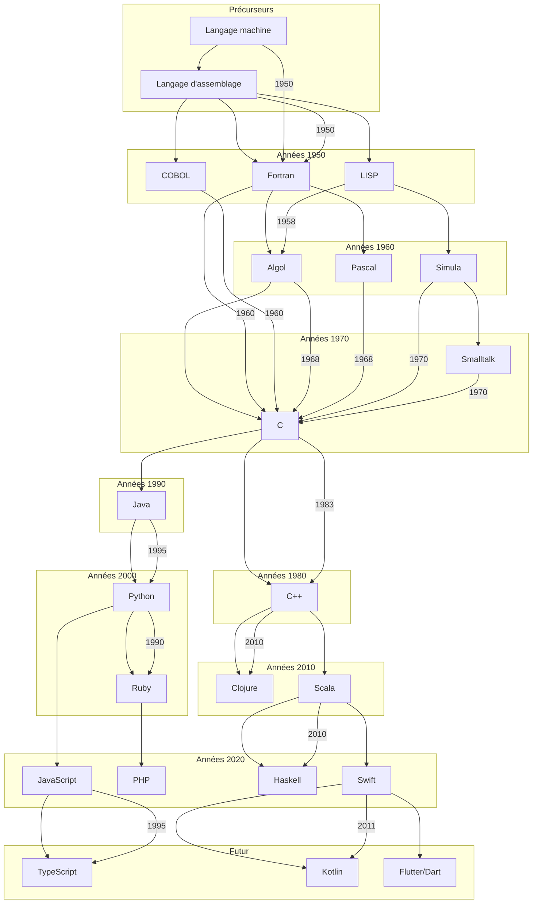

# 1. Introduction aux Langages de Programmation

Dans ce cours nous abordons l'histoire des langages de programmation. Nous explorons les racines, les évolutions et les innovations qui ont façonné l'univers complexe et fascinant de la programmation informatique.
Nous remontons le temps et découvrir les pierres angulaires qui ont conduit à la naissance des langages que nous utilisons aujourd'hui.

Comme tout bon explorateur nous avons besoin d'une carte, à savoir la "Fresque" des principaux langages :

## 1.1 Présentation du cours et de ses objectifs

Avant de plonger dans le passé, permettez-nous de vous présenter le cadre de ce voyage intellectuel. Dans cette section, nous allons discuter des objectifs du cours et de la manière dont ils s'intègrent dans votre développement en tant que programmeurs aguerris. Nous aborderons également l'importance d'explorer l'histoire des langages de programmation pour mieux comprendre les choix modernes et les innovations futures.

## 1.2 Concepts de base des langages de programmation : syntaxe, sémantique et grammaire

Dans cette section, nous allons explorer de manière approfondie les concepts clés de syntaxe, de sémantique et de grammaire qui sont au cœur de tout langage de programmation. Comprendre ces concepts est fondamental pour exprimer des instructions claires et cohérentes à la machine.

### 1.2.1 Syntaxe : L'Art de la Structure

La syntaxe d'un langage de programmation fait référence aux règles spécifiques qui dictent comment les éléments du code doivent être structurés et agencés pour créer des instructions valides dans ce langage. En d'autres termes, la syntaxe définit la manière exacte dont les éléments tels que les mots-clés, les opérateurs, les noms de variables et les symboles doivent être utilisés pour former des constructions qui peuvent être interprétées et exécutées par un ordinateur.

La syntaxe est comparable aux règles grammaticales d'une langue naturelle. Tout comme une phrase doit suivre des règles précises pour être correctement comprise, chaque ligne de code dans un langage de programmation doit adhérer à la syntaxe définie pour être correctement interprétée par le compilateur ou l'interpréteur.

Voici quelques éléments clés de la syntaxe dans un langage de programmation :

1. **Structure des Instructions :** La syntaxe définit comment les instructions doivent être structurées. Par exemple, dans de nombreux langages, une instruction se termine par un point-virgule (";"). La structure d'une instruction peut inclure des éléments tels que les mots-clés, les noms de variables, les opérateurs et les valeurs littérales.
    
2. **Noms de Variables et d'Identificateurs :** Les règles de syntaxe déterminent comment les noms de variables et d'identificateurs doivent être formés. Par exemple, certains langages peuvent exiger que les noms de variables commencent par une lettre, suivie de lettres ou de chiffres. Les caractères spéciaux ou les espaces peuvent être restreints ou interdits.
    
3. **Utilisation d'Opérateurs :** La syntaxe précise comment les opérateurs (comme +, -, _, /) doivent être utilisés pour effectuer des opérations sur les données. Par exemple, l'utilisation d'un opérateur de multiplication sans espace (comme "a_b") peut être valide dans certaines langues, tandis que dans d'autres, un espace ("a * b") peut être nécessaire.
    
4. **Expressions et Groupement :** Les règles de syntaxe régissent la manière dont les expressions mathématiques et logiques sont écrites. Les parenthèses et autres symboles de groupement indiquent la priorité des opérations et la manière dont les expressions doivent être évaluées.
    
5. **Indentation :** Bien que cela dépende du langage, certains langages de programmation, comme [[Python]], utilisent l'indentation pour définir la structure du code. L'indentation détermine les blocs de code et leur niveau d'imbrication.

### 1.2.2 Sémantique : L'Esprit du Code

La sémantique dans le contexte des langages de programmation se réfère à la signification des instructions et des expressions écrites dans un langage. Elle concerne la manière dont les différents éléments du code interagissent et sont interprétés pour donner un sens et un but à un programme. Alors que la syntaxe se préoccupe de la structure et de la forme du code, la sémantique se concentre sur le sens que le code transmet aux ordinateurs et aux programmeurs.

La sémantique inclut les concepts suivants :

1. **Sémantique Opérationnelle :** Elle décrit comment chaque instruction est exécutée pas à pas et comment elle modifie l'état du programme et des données. Cela implique d'expliquer en détail comment chaque opération et chaque instruction sont évaluées et comment elles influencent l'état interne du programme.
    
2. **Sémantique Déclarative :** Plutôt que de se concentrer sur les étapes détaillées de l'exécution, la sémantique déclarative se concentre sur la signification générale du code. Cela peut inclure la description de relations logiques, de contraintes ou de propriétés attendues du résultat.
    
3. **Sémantique Statique et Dynamique :** La sémantique statique concerne l'analyse du code sans son exécution réelle. Elle englobe des notions telles que la vérification des types et la détection d'erreurs potentielles avant l'exécution. La sémantique dynamique, quant à elle, se penche sur le comportement du code pendant l'exécution, en se concentrant sur les valeurs que prennent les variables et les expressions au fil du temps.
    
4. **Sémantique Comportementale :** Elle décrit comment les différentes parties d'un programme interagissent et coopèrent pour produire un comportement global cohérent. Cela englobe les effets de bord, les interactions entre les objets et les composants, ainsi que la manière dont les données sont manipulées et transformées.
    
5. **Sémantique Formelle :** Pour une précision maximale, des méthodes formelles sont utilisées pour définir rigoureusement le comportement des langages de programmation. Ces méthodes se basent sur des concepts mathématiques et logiques pour prouver des propriétés du code, identifier les incohérences et garantir sa correction.
    

En comprenant la sémantique d'un langage, nous pouvons anticiper comment les instructions interagissent et influencent l'exécution du programme. Cela nous aide à écrire un code qui produit les résultats attendus et évite les erreurs logiques. Une maîtrise de la sémantique est essentielle pour créer des programmes fiables et fonctionnels, car elle nous permet de traduire nos idées en instructions qui peuvent être correctement interprétées par la machine.

### 1.2.3 Grammaire : Les Règles de Composition

La grammaire d'un langage de programmation définit les règles précises qui déterminent comment les éléments syntaxiques du langage peuvent être combinés pour former des constructions valides. En d'autres termes, la grammaire établit les schémas et les relations qui définissent la structure syntaxique correcte du langage. Elle joue un rôle fondamental dans la création de phrases et d'instructions cohérentes et compréhensibles dans un langage donné.

La grammaire peut être considérée comme le "vocabulaire" et la "syntaxe" formels d'un langage de programmation. Elle indique comment les différents éléments du langage, tels que les mots-clés, les opérateurs, les noms de variables et les symboles spéciaux, peuvent être agencés pour former des expressions, des instructions et des blocs de code.

Voici quelques concepts clés liés à la grammaire d'un langage de programmation :

1. **Règles de Formation :** La grammaire établit des règles précises sur la manière dont les éléments syntaxiques peuvent être combinés pour former des constructions valides. Par exemple, une règle pourrait indiquer comment un opérateur doit être utilisé dans une expression ou comment une déclaration de fonction doit être écrite.

2. **Hiérarchie des Opérateurs :** La grammaire peut spécifier la priorité des opérateurs dans les expressions mathématiques et logiques. Par exemple, la multiplication peut avoir une priorité plus élevée que l'addition, ce qui signifie qu'elle est évaluée en premier.

3. **Expression Régulière :** Les grammaires peuvent inclure des expressions régulières pour décrire des motifs de caractères acceptables. Cela peut être utilisé pour définir des règles de formation pour les identificateurs, les noms de variables, les constantes, etc.

4. **Syntaxe Contextuelle :** Parfois, la grammaire peut également prendre en compte le contexte pour déterminer la validité d'une construction. Par exemple, certaines déclarations de fonctions peuvent nécessiter un type de retour spécifique en fonction de la déclaration elle-même.

5. **Grammaire Formelle :** Pour les langages de programmation plus complexes, une approche formelle peut être utilisée pour définir rigoureusement la grammaire. Cela peut impliquer l'utilisation de notations formelles telles que les grammaires de Backus-Naur (BNF) pour décrire les règles syntaxiques.

### 1.2.4 Les Tokens

Un token est une unité atomique dans un langage de programmation. Il représente le plus petit élément identifiable dans le code source. Les tokens sont les blocs de construction de base d'un programme et comprennent des éléments tels que les mots-clés, les identificateurs, les opérateurs, les symboles spéciaux et les valeurs littérales. Par exemple, dans l'instruction `int x = 10;`, les tokens sont `int`, `x`, `=`, `10` et `;`.

### 1.2.5 L'Analyseur Lexical (Lexer)

L'analyseur lexical, également appelé lexer ou scanner, est la première étape d'un compilateur. Son rôle est de prendre le code source en entrée et de le diviser en tokens significatifs. Il analyse le texte caractère par caractère, identifie les motifs correspondant aux tokens et génère une séquence de tokens pour la phase suivante du processus de compilation.

### 1.2.6 L'Analyseur Syntaxique (Parser)

L'analyseur syntaxique, ou parser, est la deuxième étape du processus de compilation. Il prend la séquence de tokens générée par l'analyseur lexical et vérifie si elle suit la grammaire syntaxique du langage. Le parser crée une structure arborescente appelée arbre syntaxique ou arbre d'analyse, qui représente la hiérarchie des opérations et des expressions dans le code. L'arbre syntaxique reflète la structure grammaticale du code source.

### 1.2.7 Création de Compilateurs

La création d'un compilateur, y compris le développement d'un analyseur syntaxique (parser), est un processus complexe qui implique plusieurs étapes :

1. **Analyse Lexicale :** L'analyseur lexical identifie et génère des tokens à partir du code source. Il utilise des expressions régulières ou d'autres méthodes pour reconnaître les motifs correspondant aux tokens. Les tokens générés sont ensuite envoyés à l'analyseur syntaxique.

2. **Analyse Syntaxique :** L'analyseur syntaxique vérifie si la séquence de tokens suit la grammaire du langage. Il crée un arbre syntaxique en utilisant des règles définies par la grammaire du langage. L'arbre syntaxique représente la structure hiérarchique du code et est utilisé pour vérifier la validité syntaxique et pour générer le code intermédiaire.

3. **Analyse Sémantique :** Après l'analyse syntaxique, l'analyse sémantique est effectuée pour vérifier la cohérence du code et détecter les erreurs sémantiques. Cela implique de vérifier que les types sont compatibles, que les variables sont correctement déclarées et utilisées, etc.

4. **Génération de Code Intermediaire :** Le compilateur génère généralement un code intermédiaire, qui est une représentation intermédiaire du code source. Ce code intermédiaire est plus proche du langage machine et facilite l'optimisation et la génération du code final.

5. **Optimisation :** Après la génération du code intermédiaire, le compilateur peut effectuer des optimisations pour améliorer l'efficacité du code généré. Cela peut inclure la réduction de l'utilisation de la mémoire, l'optimisation des boucles, etc.

6. **Génération de Code Final :** Enfin, le compilateur génère le code machine final à partir du code intermédiaire. Ce code est exécutable directement par le processeur cible.

La création d'un compilateur, en particulier le développement d'un analyseur syntaxique, exige une solide compréhension des concepts de grammaire formelle, d'analyse de langage et de traitement des langages. Des outils et des générateurs de code peuvent également être utilisés pour simplifier le processus de développement du parser.

## 1.3 Classification des langages de programmation : impératifs, fonctionnels, orientés objet, etc.

L'univers des langages de programmation est vaste et diversifié, avec une grande variété d'approches pour résoudre des problèmes et exprimer des idées dans le code. Pour mieux comprendre cette diversité, nous classons souvent les langages en différentes catégories appelées paradigmes de programmation. Chaque paradigme représente une approche fondamentale pour structurer et organiser le code. Dans cette section, nous allons explorer certaines des classifications les plus courantes :

### 1.3.1 Paradigme Impératif :
Les langages impératifs se concentrent sur la définition des étapes à suivre pour résoudre un problème. Ils utilisent des séquences d'instructions qui modifient l'état des données en mémoire. Les langages impératifs sont proches de la manière dont nous pensons et résolvons les problèmes dans la vie quotidienne. Les exemples incluent les langages C, C++, Java et Python (dans une certaine mesure).

### 1.3.2 Paradigme Fonctionnel :
Les langages fonctionnels traitent le calcul comme une évaluation de fonctions mathématiques. Ils mettent l'accent sur les transformations de données immuables plutôt que sur les états mutables. La composition de fonctions et les opérations sur les fonctions sont des concepts clés dans ce paradigme. Les langages fonctionnels incluent Haskell, Lisp, Scala et Erlang.

### 1.3.3 Paradigme Orienté Objet :
Le paradigme orienté objet (POO) modélise le monde sous forme d'objets qui encapsulent des données et les méthodes qui agissent sur ces données. Les langages orientés objet encouragent la réutilisation de code et la modélisation des problèmes à l'aide de concepts du monde réel. Des langages comme Java, C#, Python (avec ses classes) et C++ utilisent ce paradigme.

### 1.3.4 Paradigme Structuré :
Les langages de programmation structurés mettent l'accent sur la clarté et la facilité de compréhension du code. Ils évitent les constructions comme les sauts non conditionnels (comme le "goto") et privilégient les structures de contrôle telles que les boucles et les conditions. Le langage C est souvent considéré comme un exemple de langage de programmation structuré.

### 1.3.5 Paradigme Déclaratif :
Les langages déclaratifs se concentrent sur la description du résultat souhaité plutôt que sur les étapes pour y parvenir. Ils décrivent ce que le programme devrait faire plutôt que comment le faire. SQL (Structured Query Language) est un exemple courant de langage déclaratif utilisé pour interroger les bases de données.

### 1.3.6 Autres Paradigmes :
Il existe de nombreux autres paradigmes, tels que le paradigme logique (utilisé par Prolog), le paradigme événementiel (pour la programmation d'interfaces utilisateur), et plus encore. Certains langages combinent plusieurs paradigmes pour offrir plus de flexibilité et d'expressivité.

La classification des langages en paradigmes permet aux programmeurs de choisir l'approche la mieux adaptée à leurs besoins. Chaque paradigme a ses avantages et ses inconvénients, et la connaissance de plusieurs paradigmes peut aider les développeurs à résoudre différents types de problèmes de manière plus efficace et créative.

## 1.4 Environnements de développement et outils de programmation modernes

Dans le monde moderne de la programmation, les outils et environnements de développement ont évolué de manière spectaculaire pour faciliter le processus de création, de débogage et de déploiement de logiciels. Les développeurs d'aujourd'hui ont accès à une gamme d'outils sophistiqués qui leur permettent de travailler plus efficacement et de produire des applications de haute qualité. Dans cette section, nous explorerons certains des environnements de développement (IDE) et des outils clés qui façonnent le paysage de la programmation moderne.

### 1.4.1 Environnements de Développement Intégrés (IDE)

Les IDE sont des plateformes logicielles complètes qui regroupent divers outils et fonctionnalités pour faciliter le développement de logiciels. Ils offrent un espace de travail centralisé où les développeurs peuvent écrire, éditer, tester et déboguer leur code. Les IDE fournissent souvent des fonctionnalités telles que la coloration syntaxique, l'autocomplétion, la gestion de version intégrée et des outils de débogage avancés. Des exemples populaires d'IDE comprennent , [[Visual studio code]], Eclipse, IntelliJ IDEA et Xcode.

### 1.4.2 Editeurs de Texte Avancés

Les éditeurs de texte avancés sont plus légers que les IDE, mais ils sont dotés de fonctionnalités puissantes pour la programmation. Ils offrent des fonctionnalités telles que la coloration syntaxique, l'autocomplétion, la prise en charge de plugins et la personnalisation de l'interface. Des éditeurs de texte comme Visual Studio Code, Sublime Text et Atom sont largement utilisés par les développeurs pour leur simplicité et leur extensibilité.

### 1.4.3 Outils de Gestion de Version

Les outils de gestion de version permettent aux développeurs de suivre les modifications apportées au code source au fil du temps. Ils facilitent la collaboration entre plusieurs développeurs en gérant les modifications concurrentes et en fournissant des mécanismes pour fusionner les modifications. Git est l'un des outils de gestion de version les plus populaires, avec des plateformes telles que GitHub, GitLab et Bitbucket pour héberger des dépôts de code.

### 1.4.4 Environnements Virtuels

Les environnements virtuels permettent aux développeurs de créer des espaces isolés pour leurs projets, où les dépendances et les versions des packages peuvent être gérées indépendamment. Cela aide à éviter les conflits entre les projets et facilite la gestion des dépendances. Des outils tels que virtualenv (Python) et npm (Node.js) permettent de créer des environnements virtuels pour différents langages.

### 1.4.5 Outils de Débogage

Les outils de débogage aident les développeurs à identifier et à corriger les erreurs dans leur code. Ils offrent des fonctionnalités telles que les points d'arrêt, l'inspection des variables, la trace d'exécution et le suivi des appels de fonctions. Les IDE et les éditeurs avancés intègrent souvent des fonctionnalités de débogage. Pour les langages comme Python, des outils comme pdb et les débogueurs intégrés dans les IDE sont utilisés.

### 1.4.6 Outils de Test Automatisé

Les outils de test automatisé aident à garantir la qualité du code en automatisant le processus de test. Les cadres de test tels que JUnit (Java), pytest (Python) et Jasmine (JavaScript) permettent de créer et d'exécuter des tests unitaires et d'intégration. L'automatisation des tests améliore la fiabilité et la maintenabilité du code.

Ces outils et environnements de développement modernes ont considérablement amélioré la productivité des développeurs et ont contribué à l'efficacité de la création de logiciels de haute qualité. Le choix des bons outils et environnements dépend du langage de programmation, du type de projet et des préférences personnelles du développeur.

# 2 : Précurseurs et Débuts de la Programmation
#@TODO à développer
## 2.1 Les premières formes de programmation : langage machine et langage d'assemblage.
## 2.2 Fortran et l'avènement de la programmation de haut niveau.
## 2.3 COBOL et les langages orientés métier.
## 2.4 LISP et l'essor de la programmation fonctionnelle.

# 3 L'Ère des Langages de Haut Niveau
## 3.1 L'émergence de langages structurés : Algol et Pascal.
## 3.2 C et la naissance de la programmation structurée.
## 3.3 Programmation orientée objet : naissance de Simula et Smalltalk.
## 3.4 Les langages de script et l'importance de Python et Ruby.

# 4 Langages Modernes et Paradigmes
## 4.1 La montée en puissance de C++ : la fusion entre la programmation orientée objet et structurée.
## 4.2 Java et la portabilité grâce à la machine virtuelle Java.
## 4.5 Programmation fonctionnelle avancée avec Haskell et Scala.
## 4.6 La révolution des langages interprétés : JavaScript et PHP.

# 5 Les Langages et le Monde Actuel
## 5.1 Langages pour le web : HTML, CSS et JavaScript.
## 5.2 Langages pour l'analyse de données : R et Python.
## 5.3 Langages pour le calcul scientifique : MATLAB et Julia.
## 5.4 Langages de bas niveau : C et C++ dans le contexte actuel.

# 6 Tendances Actuelles et Futur des Langages
## 6.1 Langages fonctionnels modernes : Clojure et Elixir.
## 6.2 Programmation réactive et langages adaptés aux systèmes distribués.
## 6.3 Langages pour l'intelligence artificielle et l'apprentissage automatique.
## 6.4 Les langages quantiques et la programmation quantique.

# 7 Projet Final et Évolution Continue
## 7.1 Présentation des projets finaux et choix des sujets.
## 7.2 Suivi des projets et discussions sur l'application des langages.
## 7.3 Présentations des projets finaux par les étudiant.e.s.
## 7.4 Discussion sur l'importance de rester à jour dans le monde des langages de programmation.