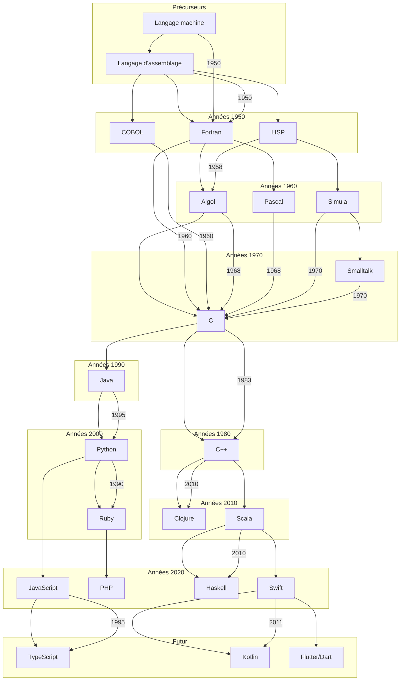

# 1. Introduction aux Langages de Programmation

Dans ce cours nous abordons l'histoire des langages de programmation. Nous explorons les racines, les évolutions et les innovations qui ont façonné l'univers complexe et fascinant de la programmation informatique.
Nous remontons le temps et découvrir les pierres angulaires qui ont conduit à la naissance des langages que nous utilisons aujourd'hui.

Comme tout bon explorateur nous avons besoin d'une carte, à savoir la "Fresque" des principaux langages :

## 1.1 Présentation du cours et de ses objectifs

Dans cette section, nous allons discuter des objectifs du cours. Nous aborderons également l'importance d'explorer l'histoire des langages de programmation pour mieux comprendre les choix modernes et les innovations futures.

## 1.2 Concepts de base des langages de programmation : syntaxe, sémantique et grammaire

Ici, nous allons explorer de manière approfondie les concepts clés de syntaxe, de sémantique et de grammaire qui sont au cœur de tout langage de programmation.

### 1.2.1 Syntaxe : L'Art de la Structure

La syntaxe d'un langage de programmation fait référence aux règles spécifiques qui dictent comment les éléments du code doivent être structurés et agencés pour créer des instructions valides dans ce langage. En d'autres termes, la syntaxe définit la manière exacte dont les éléments tels que les mots-clés, les opérateurs, les noms de variables et les symboles doivent être utilisés pour former des constructions qui peuvent être interprétées et exécutées par un ordinateur.

La syntaxe est une partie de la grammaire d'un langage, comparable aux **règles** grammaticales d'une langue naturelle. Tout comme une phrase doit suivre des règles précises pour être correctement comprise, chaque ligne de code dans un langage de programmation doit adhérer à la syntaxe définie pour être correctement interprétée par le compilateur ou l'interpréteur.

Voici quelques éléments clés de la syntaxe dans un langage de programmation :

1. **Structure des Instructions :** La syntaxe définit comment les instructions doivent être structurées. Par exemple, dans de nombreux langages, une instruction se termine par un point-virgule (";"). La structure d'une instruction peut inclure des éléments tels que les mots-clés, les noms de variables, les opérateurs et les valeurs littérales.
    
2. **Noms de Variables et d'Identificateurs :** Les règles de syntaxe déterminent comment les noms de variables et d'identificateurs doivent être formés. Par exemple, certains langages peuvent exiger que les noms de variables commencent par une lettre, suivie de lettres ou de chiffres. Les caractères spéciaux ou les espaces peuvent être restreints ou interdits.
    
3. **Utilisation d'Opérateurs :** La syntaxe précise comment les opérateurs (comme +, -, _, /) doivent être utilisés pour effectuer des opérations sur les données. Par exemple, l'utilisation d'un opérateur de multiplication sans espace (comme "a_b") peut être valide dans certaines langues, tandis que dans d'autres, un espace ("a * b") peut être nécessaire.
    
4. **Expressions et Groupement :** Les règles de syntaxe régissent la manière dont les expressions mathématiques et logiques sont écrites. Les parenthèses et autres symboles de groupement indiquent la priorité des opérations et la manière dont les expressions doivent être évaluées.
    
5. **Indentation :** Bien que cela dépende du langage, certains langages de programmation, comme [[Python]], utilisent l'indentation pour définir la structure du code. L'indentation détermine les blocs de code et leur niveau d'imbrication.

### 1.2.2 Sémantique : L'Esprit du Code

La sémantique dans le contexte des langages de programmation se réfère à la signification des instructions et des expressions écrites dans un langage. Elle concerne la manière dont les différents éléments du code interagissent et sont interprétés pour donner un sens et un but à un programme. Alors que la syntaxe se préoccupe de la structure et de la forme du code, la sémantique se concentre sur le sens que le code transmet aux ordinateurs et aux programmeurs. Voir [[UML Ecore EMF Plantuml QVT Mermaid PyEcore#Denotational Semantics]]

La sémantique inclut les concepts suivants :

1. **Sémantique Opérationnelle :** Elle décrit comment chaque instruction est exécutée pas à pas et comment elle modifie l'état du programme et des données. Cela implique d'expliquer en détail comment chaque opération et chaque instruction sont évaluées et comment elles influencent l'état interne du programme.
    
2. **Sémantique Déclarative :** Plutôt que de se concentrer sur les étapes détaillées de l'exécution, la sémantique déclarative se concentre sur la signification générale du code. Cela peut inclure la description de relations logiques, de contraintes ou de propriétés attendues du résultat.
    
3. **Sémantique Statique et Dynamique :** La sémantique statique concerne l'analyse du code sans son exécution réelle. Elle englobe des notions telles que la vérification des types et la détection d'erreurs potentielles avant l'exécution. La sémantique dynamique, quant à elle, se penche sur le comportement du code pendant l'exécution, en se concentrant sur les valeurs que prennent les variables et les expressions au fil du temps.
    
4. **Sémantique Comportementale :** Elle décrit comment les différentes parties d'un programme interagissent et coopèrent pour produire un comportement global cohérent. Cela englobe les effets de bord, les interactions entre les objets et les composants, ainsi que la manière dont les données sont manipulées et transformées.
    
5. **Sémantique Formelle :** Pour une précision maximale, des méthodes formelles sont utilisées pour définir rigoureusement le comportement des langages de programmation. Ces méthodes se basent sur des concepts mathématiques et logiques pour prouver des propriétés du code, identifier les incohérences et garantir sa correction. Voir  [[UML Ecore EMF Plantuml QVT Mermaid PyEcore#Operational_semantics]].
    

En comprenant la sémantique d'un langage, nous pouvons anticiper comment les instructions interagissent et influencent l'exécution du programme. Cela nous aide à écrire un code qui produit les résultats attendus et évite les erreurs logiques. Une maîtrise de la sémantique est essentielle pour créer des programmes fiables et fonctionnels, car elle nous permet de traduire nos idées en instructions qui peuvent être correctement interprétées par la machine.

### 1.2.3 Grammaire : Les Règles de Composition

La grammaire d'un langage de programmation définit les règles précises qui déterminent comment les éléments syntaxiques du langage peuvent être combinés pour former des constructions valides. En d'autres termes, la grammaire établit les schémas et les relations qui définissent la structure syntaxique correcte du langage. Elle joue un rôle fondamental dans la création de phrases et d'instructions cohérentes et compréhensibles dans un langage donné.

La grammaire peut être considérée comme le "vocabulaire" et la "syntaxe" formels d'un langage de programmation. Elle indique comment les différents éléments du langage, tels que les mots-clés, les opérateurs, les noms de variables et les symboles spéciaux, peuvent être agencés pour former des expressions, des instructions et des blocs de code.

Voici quelques concepts clés liés à la grammaire d'un langage de programmation :

1. **Règles de Formation :** La grammaire établit des règles précises sur la manière dont les éléments syntaxiques peuvent être combinés pour former des constructions valides. Par exemple, une règle pourrait indiquer comment un opérateur doit être utilisé dans une expression ou comment une déclaration de fonction doit être écrite.

2. **Hiérarchie des Opérateurs :** La grammaire peut spécifier la priorité des opérateurs dans les expressions mathématiques et logiques. Par exemple, la multiplication peut avoir une priorité plus élevée que l'addition, ce qui signifie qu'elle est évaluée en premier.

3. **Expression Régulière :** Les grammaires peuvent inclure des expressions régulières pour décrire des motifs de caractères acceptables. Cela peut être utilisé pour définir des règles de formation pour les identificateurs, les noms de variables, les constantes, etc.

4. **Syntaxe Contextuelle :** Parfois, la grammaire peut également prendre en compte le contexte pour déterminer la validité d'une construction. Par exemple, certaines déclarations de fonctions peuvent nécessiter un type de retour spécifique en fonction de la déclaration elle-même.

5. **Grammaire Formelle :** Pour les langages de programmation plus complexes, une approche formelle peut être utilisée pour définir rigoureusement la grammaire. Cela peut impliquer l'utilisation de notations formelles telles que les grammaires de Backus-Naur (BNF voir [[UML Ecore EMF Plantuml QVT Mermaid PyEcore#BNF]]) pour décrire les règles syntaxiques.

### 1.2.4 Les Tokens

Un token est une unité atomique dans un langage de programmation. Il représente le plus petit élément identifiable dans le code source. Les tokens sont les blocs de construction de base d'un programme et comprennent des éléments tels que les mots-clés, les identificateurs, les opérateurs, les symboles spéciaux et les valeurs littérales. Par exemple, dans l'instruction `int x = 10;`, les tokens sont `int`, `x`, `=`, `10` et `;`.

### 1.2.5 L'Analyseur Lexical (Lexer)

L'analyseur lexical, également appelé lexer ou scanner, est la première étape d'un compilateur. Son rôle est de prendre le code source en entrée et de le diviser en tokens significatifs. Il analyse le texte caractère par caractère, identifie les motifs correspondant aux tokens et génère une séquence de tokens pour la phase suivante du processus de compilation.

### 1.2.6 L'Analyseur Syntaxique (Parser)

L'analyseur syntaxique, ou parser, est la deuxième étape du processus de compilation. Il prend la séquence de tokens générée par l'analyseur lexical et vérifie si elle suit la grammaire syntaxique du langage. Le parser crée une structure arborescente appelée arbre syntaxique ou arbre d'analyse, qui représente la hiérarchie des opérations et des expressions dans le code. L'arbre syntaxique reflète la structure grammaticale du code source.

### 1.2.7 Création de Compilateurs

La création d'un compilateur, y compris le développement d'un analyseur syntaxique (parser), est un processus complexe qui implique plusieurs étapes :

1. **Analyse Lexicale :** L'analyseur lexical identifie et génère des tokens à partir du code source. Il utilise des expressions régulières ou d'autres méthodes pour reconnaître les motifs correspondant aux tokens. Les tokens générés sont ensuite envoyés à l'analyseur syntaxique.

2. **Analyse Syntaxique :** L'analyseur syntaxique vérifie si la séquence de tokens suit la grammaire du langage. Il crée un arbre syntaxique en utilisant des règles définies par la grammaire du langage. L'arbre syntaxique représente la structure hiérarchique du code et est utilisé pour vérifier la validité syntaxique et pour générer le code intermédiaire.

3. **Analyse Sémantique :** Après l'analyse syntaxique, l'analyse sémantique est effectuée pour vérifier la cohérence du code et détecter les erreurs sémantiques. Cela implique de vérifier que les types sont compatibles, que les variables sont correctement déclarées et utilisées, etc.

4. **Génération de Code Intermediaire :** Le compilateur génère généralement un code intermédiaire, qui est une représentation intermédiaire du code source. Ce code intermédiaire est plus proche du langage machine et facilite l'optimisation et la génération du code final.

5. **Optimisation :** Après la génération du code intermédiaire, le compilateur peut effectuer des optimisations pour améliorer l'efficacité du code généré. Cela peut inclure la réduction de l'utilisation de la mémoire, l'optimisation des boucles, etc.

6. **Génération de Code Final :** Enfin, le compilateur génère le code machine final à partir du code intermédiaire. Ce code est exécutable directement par le processeur cible.

La création d'un compilateur, en particulier le développement d'un analyseur syntaxique, exige une solide compréhension des concepts de grammaire formelle, d'analyse de langage et de traitement des langages. Des outils et des générateurs de code peuvent également être utilisés pour simplifier le processus de développement du parser.

## 1.3 Classification des langages de programmation : impératifs, fonctionnels, orientés objet, etc.

L'univers des langages de programmation est vaste et diversifié, avec une grande variété d'approches pour résoudre des problèmes et exprimer des idées dans le code. Pour mieux comprendre cette diversité, nous classons souvent les langages en différentes catégories appelées paradigmes de programmation. Chaque paradigme représente une approche fondamentale pour structurer et organiser le code. Dans cette section, nous allons explorer certaines des classifications les plus courantes :

### 1.3.1 Paradigme Impératif :
Les langages impératifs se concentrent sur la définition des étapes à suivre pour résoudre un problème. Ils utilisent des séquences d'instructions qui modifient l'état des données en mémoire. Les langages impératifs sont proches de la manière dont nous pensons et résolvons les problèmes dans la vie quotidienne. Les exemples incluent les langages C, C++, Java et Python (dans une certaine mesure).

### 1.3.2 Paradigme Fonctionnel :
Les langages fonctionnels traitent le calcul comme une évaluation de fonctions mathématiques. Ils mettent l'accent sur les transformations de données immuables plutôt que sur les états mutables. La composition de fonctions et les opérations sur les fonctions sont des concepts clés dans ce paradigme. Les langages fonctionnels incluent Haskell, Lisp, Scala et Erlang.

### 1.3.3 Paradigme Orienté Objet :
Le paradigme orienté objet (POO) modélise le monde sous forme d'objets qui encapsulent des données et les méthodes qui agissent sur ces données. Les langages orientés objet encouragent la réutilisation de code et la modélisation des problèmes à l'aide de concepts du monde réel. Des langages comme Java, C#, Python (avec ses classes) et C++ utilisent ce paradigme.

### 1.3.4 Paradigme Structuré :
Les langages de programmation structurés mettent l'accent sur la clarté et la facilité de compréhension du code. Ils évitent les constructions comme les sauts non conditionnels (comme le "goto") et privilégient les structures de contrôle telles que les boucles et les conditions. Le langage C est souvent considéré comme un exemple de langage de programmation structuré.

### 1.3.5 Paradigme Déclaratif :
Les langages déclaratifs se concentrent sur la description du résultat souhaité plutôt que sur les étapes pour y parvenir. Ils décrivent ce que le programme devrait faire plutôt que comment le faire. SQL (Structured Query Language) est un exemple courant de langage déclaratif utilisé pour interroger les bases de données.

### 1.3.6 Autres Paradigmes :
Il existe de nombreux autres paradigmes, tels que le paradigme logique (utilisé par Prolog), le paradigme événementiel (pour la programmation d'interfaces utilisateur), et plus encore. Certains langages combinent plusieurs paradigmes pour offrir plus de flexibilité et d'expressivité.

La classification des langages en paradigmes permet aux programmeurs de choisir l'approche la mieux adaptée à leurs besoins. Chaque paradigme a ses avantages et ses inconvénients, et la connaissance de plusieurs paradigmes peut aider les développeurs à résoudre différents types de problèmes de manière plus efficace et créative.

## 1.4 Environnements de développement et outils de programmation modernes

Dans le monde moderne de la programmation, les outils et environnements de développement ont évolué de manière spectaculaire pour faciliter le processus de création, de débogage et de déploiement de logiciels. Les développeurs d'aujourd'hui ont accès à une gamme d'outils sophistiqués qui leur permettent de travailler plus efficacement et de produire des applications de haute qualité. Dans cette section, nous explorerons certains des environnements de développement (IDE) et des outils clés qui façonnent le paysage de la programmation moderne.

### 1.4.1 Environnements de Développement Intégrés (IDE)

Les IDE sont des plateformes logicielles complètes qui regroupent divers outils et fonctionnalités pour faciliter le développement de logiciels. Ils offrent un espace de travail centralisé où les développeurs peuvent écrire, éditer, tester et déboguer leur code. Les IDE fournissent souvent des fonctionnalités telles que la coloration syntaxique, l'autocomplétion, la gestion de version intégrée et des outils de débogage avancés. Des exemples populaires d'IDE comprennent , [[Visual studio code]], Eclipse, IntelliJ IDEA et Xcode.

### 1.4.2 Editeurs de Texte Avancés

Les éditeurs de texte avancés sont plus légers que les IDE, mais ils sont dotés de fonctionnalités puissantes pour la programmation. Ils offrent des fonctionnalités telles que la coloration syntaxique, l'autocomplétion, la prise en charge de plugins et la personnalisation de l'interface. Des éditeurs de texte comme Visual Studio Code, Sublime Text et Atom sont largement utilisés par les développeurs pour leur simplicité et leur extensibilité.

### 1.4.3 Outils de Gestion de Version

Les outils de gestion de version permettent aux développeurs de suivre les modifications apportées au code source au fil du temps. Ils facilitent la collaboration entre plusieurs développeurs en gérant les modifications concurrentes et en fournissant des mécanismes pour fusionner les modifications. Git (voir [[git]]) est l'un des outils de gestion de version les plus populaires, avec des plateformes telles que GitHub, GitLab et Bitbucket pour héberger des dépôts de code.

### 1.4.4 Environnements Virtuels

Les environnements virtuels permettent aux développeurs de créer des espaces isolés pour leurs projets, où les dépendances et les versions des packages peuvent être gérées indépendamment. Cela aide à éviter les conflits entre les projets et facilite la gestion des dépendances. Des outils tels que virtualenv (Python) et npm (Node.js) permettent de créer des environnements virtuels pour différents langages.

### 1.4.5 Outils de Débogage

Les outils de débogage aident les développeurs à identifier et à corriger les erreurs dans leur code. Ils offrent des fonctionnalités telles que les points d'arrêt, l'inspection des variables, la trace d'exécution et le suivi des appels de fonctions. Les IDE et les éditeurs avancés intègrent souvent des fonctionnalités de débogage. Pour les langages comme Python, des outils comme pdb et les débogueurs intégrés dans les IDE sont utilisés.

### 1.4.6 Outils de Test Automatisé

Les outils de test automatisé aident à garantir la qualité du code en automatisant le processus de test. Les cadres de test tels que JUnit (Java), pytest (Python) et Jasmine (JavaScript) permettent de créer et d'exécuter des tests unitaires et d'intégration. L'automatisation des tests améliore la fiabilité et la maintenabilité du code.

Ces outils et environnements de développement modernes ont considérablement amélioré la productivité des développeurs et ont contribué à l'efficacité de la création de logiciels de haute qualité. Le choix des bons outils et environnements dépend du langage de programmation, du type de projet et des préférences personnelles du développeur.

# 2 Précurseurs et Débuts de la Programmation

## 2.1 Les premières formes de programmation : langage machine et langage d'assemblage

Les débuts de la programmation informatique étaient marqués par une simplicité brute et un besoin profond de compréhension technique. Avant l'avènement des langages de programmation modernes, les pionniers de l'informatique devaient communiquer avec les ordinateurs en utilisant le langage machine, la forme la plus élémentaire de communication entre l'homme et la machine.

### 2.1.1 Langage Machine : Une Communication Binaire

Les premières générations d'ordinateurs, souvent des mastodontes remplissant des salles entières, n'avaient pas la capacité de comprendre un langage humain ou abstrait. Pour les programmer, il fallait traduire les instructions en langage binaire, c'est-à-dire en séquences de 0 et de 1 qui représentaient directement les opérations et les données pour le processeur. Chaque instruction était composée d'une combinaison de bits qui activaient différents circuits dans l'ordinateur.

La programmation en langage machine était laborieuse et propice aux erreurs. Chaque opération, même la plus élémentaire, devait être représentée sous forme de combinaisons de bits complexes. Un seul mauvais bit pouvait avoir des conséquences désastreuses. Les programmeurs devaient donc non seulement maîtriser les concepts de la programmation, mais aussi comprendre en profondeur le fonctionnement interne de l'ordinateur.

### 2.1.2 Langage d'Assemblage : L'Abstraction Émergente

Face à la complexité du langage machine, les langages d'assemblage ont été développés pour faciliter la programmation et rendre le processus plus lisible et gérable. Les langages d'assemblage fournissaient une couche d'abstraction entre le langage machine et le programmeur.

Dans les langages d'assemblage, les instructions étaient représentées par des mnémoniques plus significatifs que les combinaisons de bits. Ces mnémoniques étaient ensuite traduits en langage machine par des programmes appelés assembleurs. Les langages d'assemblage ont permis aux programmeurs de communiquer avec les ordinateurs de manière plus compréhensible, en utilisant des instructions telles que "ADD" pour additionner et "MOV" pour déplacer des données.

Cependant, les langages d'assemblage avaient encore des limitations majeures. Ils étaient spécifiques à chaque architecture matérielle, ce qui signifie qu'un programme écrit en langage d'assemblage pour une machine ne fonctionnerait pas sur une autre machine avec une architecture différente. Cela a conduit à des difficultés lors de la portabilité des programmes entre différents systèmes.
## 2.2 Fortran et l'avènement de la programmation de haut niveau

L'avènement de Fortran (FORmula TRANslation) marque une étape cruciale dans l'histoire de la programmation, car il a marqué le début de la programmation de haut niveau. À mesure que les ordinateurs devenaient plus puissants et que les problèmes à résoudre devenaient plus complexes, la nécessité d'outils plus abstraits et plus expressifs est devenue évidente. Fortran est né pour répondre à cette nécessité croissante.

### 2.2.1 Un Nouveau Niveau d'Abstraction

Fortran, développé par IBM dans les années 1950, a été conçu spécifiquement pour les applications scientifiques et d'ingénierie. Il a introduit des concepts de programmation de haut niveau qui ont permis aux programmeurs de s'abstraire davantage des détails de l'architecture matérielle. Au lieu de manipuler des bits et des opérations binaires directement, les programmeurs pouvaient utiliser des instructions plus intuitives pour exprimer leurs calculs.

### 2.2.2 Boucles "DO" et Sous-Programmes

L'une des caractéristiques marquantes de Fortran était l'introduction des boucles "DO". Les boucles "DO" ont permis aux programmeurs d'itérer facilement sur un ensemble de données en spécifiant simplement la plage et les instructions à exécuter. Cela a grandement simplifié la manipulation de listes de données, un besoin fréquent dans les domaines scientifiques et d'ingénierie.

Un autre élément révolutionnaire introduit par Fortran était celui des sous-programmes. Les sous-programmes sont des sections de code indépendantes et réutilisables qui peuvent être appelées à partir d'autres parties du programme. Cela a considérablement amélioré la modularité du code, permettant aux programmeurs de diviser leurs tâches en petites unités gérables et de réutiliser ces unités dans différents contextes.

### 2.2.3 Impact et Héritage

Fortran a eu un impact profond sur la façon dont les programmes étaient écrits. Il a permis aux scientifiques et aux ingénieurs de se concentrer davantage sur la résolution des problèmes réels plutôt que sur les détails de bas niveau de la programmation. Fortran a également inspiré d'autres langages de programmation de haut niveau qui ont suivi, ouvrant la voie à une nouvelle ère de développement logiciel.

Bien que Fortran soit aujourd'hui moins couramment utilisé que d'autres langages plus modernes, il reste une partie essentielle de l'histoire de la programmation. Son héritage réside dans les concepts qu'il a introduits et qui continuent à influencer les langages de programmation actuels. Fortran a ouvert la voie à la programmation de haut niveau, permettant aux programmeurs d'exprimer leurs idées de manière plus naturelle et efficace, tout en posant les bases de la résolution de problèmes complexes à l'aide de l'informatique.

## 2.3 COBOL et les langages orientés métier

À mesure que les ordinateurs gagnaient en popularité et en puissance, les besoins de l'industrie évoluaient également. Les entreprises cherchaient des moyens d'automatiser les opérations commerciales et de gérer les données financières de manière plus efficace. Cela a conduit à la création de langages orientés métier, dont le plus emblématique est COBOL (COmmon Business-Oriented Language).

### 2.3.1 Répondre aux Besoins Commerciaux

COBOL a été développé dans les années 1950, principalement par Grace Hopper et son équipe, en réponse aux besoins croissants de l'automatisation des opérations commerciales. Les entreprises étaient confrontées à la tâche complexe de gérer d'énormes quantités de données financières, de suivre les transactions et de générer des rapports. Les langages de programmation existants n'étaient pas suffisamment adaptés à ces tâches spécifiques.

### 2.3.2 Syntaxe Proche de l'Anglais

L'une des caractéristiques distinctives de COBOL était sa syntaxe qui ressemblait à l'anglais. Contrairement aux langages précédents qui utilisaient une syntaxe technique et cryptique, COBOL a été conçu pour être plus lisible et compréhensible par les personnes non-techniques, telles que les gestionnaires et les comptables. Cette approche visait à réduire la barrière entre les informaticiens et les utilisateurs métier.

### 2.3.3 Gestion des Données Tabulaires

COBOL a introduit des fonctionnalités spécifiques pour la manipulation et la gestion de données tabulaires, telles que les fichiers plats et les enregistrements. Les opérations courantes liées aux données commerciales, telles que le tri, la recherche et la génération de rapports, ont été simplifiées dans COBOL. Cela a permis aux entreprises de gérer plus efficacement leurs données et de prendre des décisions plus éclairées.

### 2.3.4 Héritage et Évolution

COBOL a eu un impact significatif sur l'automatisation des opérations commerciales et la gestion des données financières. Même aujourd'hui, de nombreuses applications commerciales critiques sont encore écrites en COBOL. Bien que d'autres langages aient gagné en popularité, COBOL reste pertinent en raison de sa stabilité et de son importance historique.

L'histoire de COBOL illustre la façon dont les langages de programmation peuvent être adaptés pour répondre aux besoins spécifiques d'un secteur particulier. En créant un langage avec une syntaxe plus accessible et des fonctionnalités adaptées aux tâches commerciales, COBOL a joué un rôle essentiel dans la transformation des opérations commerciales et la gestion des données à grande échelle.

## 2.4 LISP et l'essor de la programmation fonctionnelle

L'essor de LISP (LISt Processing) a marqué une percée significative dans le monde de la programmation, introduisant un nouveau paradigme : la programmation fonctionnelle. Conçu à l'origine pour la manipulation symbolique et le traitement de listes, LISP a profondément influencé la façon dont nous abordons la résolution de problèmes et la construction de logiciels.

### 2.4.1 Fonctions Récursives et Liste comme Structure de Données

L'une des caractéristiques fondamentales de LISP était sa manipulation naturelle des listes en tant que structure de données. LISP traitait les données et les programmes de la même manière, permettant ainsi aux programmes de manipuler d'autres programmes. Les fonctions récursives étaient un élément clé de LISP, permettant de décomposer les problèmes en sous-problèmes plus petits et plus gérables.

### 2.4.2 Fonctions de Première Classe et Lambdas

LISP a introduit le concept de fonctions de première classe, traitant les fonctions comme des éléments de données pouvant être passés en tant qu'arguments à d'autres fonctions, retournés par des fonctions et stockés dans des structures de données. Cette capacité a ouvert la voie à une programmation plus modulaire et expressive.

Les lambdas, également connus sous le nom de fonctions anonymes, ont été introduits dans LISP. Ils ont permis la création dynamique de fonctions sans avoir besoin de les nommer explicitement. Cette flexibilité a renforcé la puissance de LISP en tant que langage de manipulation de fonctions.

### 2.4.3 Focus sur l'Immutabilité et l'Évitement des Effets de Bord

La programmation fonctionnelle, telle qu'introduite par LISP, met l'accent sur l'utilisation de fonctions pures, c'est-à-dire des fonctions dont le résultat dépend uniquement de leurs entrées et qui ne modifient pas l'état externe. Cela permet d'éviter les effets de bord indésirables et facilite la compréhension et la maintenance du code.

LISP a également promu l'utilisation de données immuables, où les structures de données ne peuvent pas être modifiées une fois créées. Cela évite les problèmes liés aux modifications inattendues des données et facilite la parallélisation du code.

### 2.4.4 Héritage et Influence

LISP a été influent non seulement en tant que langage de programmation, mais aussi en tant que source d'idées pour d'autres langages. Les concepts de fonctions de première classe, de fonctions récursives et de manipulation symbolique ont trouvé leur chemin dans de nombreux langages modernes.

La programmation fonctionnelle, inspirée par LISP, a gagné en popularité ces dernières années en raison de son potentiel pour écrire un code plus clair, plus modulaire et plus prédictif. Les langages comme Haskell, Clojure et Scala sont des exemples de langages de programmation fonctionnelle qui s'appuient sur les concepts introduits par LISP.
# 3 L'Ère des Langages de Haut Niveau

L'ère des langages de haut niveau marque une transition majeure dans l'histoire de la programmation. Les langages de cette période se sont concentrés sur la création d'outils plus abstraits et expressifs pour les développeurs, rendant le processus de programmation plus accessible et plus efficace. Dans ce chapitre, nous explorerons les moments clés de cette ère, depuis l'émergence des langages structurés jusqu'à l'essor de la programmation orientée objet et l'importance des langages de script.

## 3.1 L'émergence de langages structurés : Algol et Pascal

L'évolution rapide de la technologie informatique a entraîné une croissance exponentielle de la complexité des programmes. À mesure que les logiciels devenaient plus volumineux et sophistiqués, la nécessité de développer des méthodes plus organisées et gérables pour structurer le code s'est fait sentir. C'est dans ce contexte que sont nés les langages de programmation structurés, des langages conçus pour apporter de l'ordre et de la clarté dans le développement logiciel.

### 3.1.1 Algol : L'Approche Structurée Pionnière

Apparaissant pour la première fois dans les années 1950, l'Algol (ALGOrithmic Language) a été l'un des premiers langages à proposer une approche plus structurée de la programmation. Algol avait pour objectif de fournir des notations formelles pour les structures de contrôle, telles que les boucles et les conditionnelles, afin de favoriser une écriture plus modulaire et lisible des programmes.

Algol a introduit des concepts tels que les blocs de code, permettant aux programmeurs de regrouper des instructions connexes dans des unités cohérentes. Cela a facilité la compréhension du code, la détection d'erreurs et la maintenance. L'approche structurée d'Algol a eu un impact profond sur la façon dont les programmes étaient écrits, jetant les bases d'une méthodologie plus disciplinée.

### 3.1.2 Pascal : La Simplicité au Service de la Structuration

Dans les années 1970, Niklaus Wirth a créé Pascal avec un objectif en tête : créer un langage simple, lisible et adapté à l'enseignement de la programmation. En concevant Pascal, Wirth a mis l'accent sur la programmation structurée en fournissant des outils pour diviser les programmes en morceaux plus petits et plus gérables.

Pascal a introduit des concepts tels que les procédures et les fonctions, permettant aux développeurs de définir des blocs de code autonomes pour effectuer des tâches spécifiques. Cela a favorisé la réutilisation de code et la modularité, rendant les programmes plus faciles à comprendre et à entretenir. La limitation intentionnelle de certaines fonctionnalités a également contribué à la clarté du code, encourageant les bonnes pratiques de programmation.

### 3.1.3 Impact sur le Développement Logiciel

L'émergence d'Algol et de Pascal a eu un impact profond sur la culture du développement logiciel. Ces langages ont introduit des pratiques structurées qui ont élargi la vision des programmeurs sur la manière d'aborder les problèmes complexes. Les idées de modularity, de lisibilité et de réutilisation de code ont été popularisées grâce à ces langages.

L'approche structurée initiée par Algol et Pascal a jeté les bases des méthodologies modernes de développement logiciel. Elle a préparé le terrain pour l'adoption ultérieure de la programmation orientée objet, de la programmation fonctionnelle et d'autres paradigmes qui ont contribué à façonner le paysage de la programmation moderne.

## 3.2 **C** et la naissance de la programmation structurée

L'avènement de C dans les années 1970 a marqué un jalon décisif dans l'évolution de la programmation, introduisant des concepts fondamentaux de la programmation structurée et laissant une empreinte durable sur le monde de l'informatique. Conçu par Dennis Ritchie à Bell Labs, C a été conçu avec une vision unique : combiner l'efficacité du langage machine avec l'abstraction des langages de haut niveau.

### 3.2.1 Un Langage pour le Développement Système

Initialement, C a été développé pour la création du système d'exploitation UNIX. Ritchie souhaitait un langage qui permettrait une programmation plus efficace tout en offrant une abstraction supérieure à celle du langage machine. C'était une tâche ambitieuse, mais le résultat a été un langage qui a su atteindre ces deux objectifs.

### 3.2.2 Fonctionnalités de Programmation Structurée

L'une des contributions les plus significatives de C à l'histoire de la programmation a été sa promotion de la programmation structurée. C a introduit des concepts tels que les boucles "for" et "while", qui offraient des alternatives plus claires et plus expressives aux sauts inconditionnels et aux boucles basées sur des indices. Les structures de contrôle conditionnelles "if-else" et les fonctions ont également été intégrées dans C, permettant aux programmeurs de diviser leur code en blocs logiques et de créer des fonctions réutilisables.

### 3.2.3 Influence de "The C Programming Language"

La publication du livre "The C Programming Language" par Brian Kernighan et Dennis Ritchie en 1978 a eu un impact considérable sur la diffusion et l'adoption de C. Ce livre a servi de référence complète pour le langage, expliquant ses fonctionnalités et ses principes avec clarté. Il a contribué à populariser les concepts de la programmation structurée et a établi C comme l'un des langages les plus influents et largement utilisés de l'histoire de l'informatique.

### 3.2.4 Héritage et Influence Continue

L'influence de C ne s'est pas limitée à sa popularité immédiate. De nombreux langages ultérieurs ont été influencés par les concepts et les principes introduits par C, y compris C++, C#, Objective-C et bien d'autres. La programmation structurée, promue par C, a jeté les bases pour des pratiques de développement plus modulaires, lisibles et maintenables.

En résumé, C a été un pivot essentiel dans l'évolution de la programmation, facilitant la transition de méthodes de codage moins structurées vers des approches plus disciplinées. Son héritage se perpétue encore aujourd'hui, tant dans les langages directement inspirés que dans les principes fondamentaux qui continuent d'influencer la manière dont nous abordons le développement logiciel.

## 3.3 Programmation orientée objet : naissance de Simula et Smalltalk

La naissance de la programmation orientée objet (POO) a marqué une transformation fondamentale dans la manière dont les programmes étaient conçus et structurés. Ce paradigme a introduit la modélisation des problèmes du monde réel en utilisant des objets et leurs interactions, offrant une approche plus intuitive et organisée du développement logiciel. Deux langages ont joué un rôle majeur dans l'émergence de la POO : Simula et Smalltalk.

### 3.3.1 Simula : Les Fondations de la POO

Simula, développé dans les années 1960 en Norvège par Ole-Johan Dahl et Kristen Nygaard, est largement considéré comme l'un des précurseurs de la programmation orientée objet. Simula a introduit des concepts clés tels que les classes, les objets, l'héritage et le polymorphisme. Le langage a été conçu pour permettre aux programmeurs de créer des simulations plus réalistes en modélisant les objets du monde réel avec précision.

Les classes en Simula définissaient des modèles pour créer des objets avec des attributs et des comportements spécifiques. L'héritage permettait de créer de nouvelles classes basées sur des classes existantes, favorisant la réutilisation de code. Le polymorphisme permettait à différentes classes d'avoir des méthodes portant le même nom, mais avec des implémentations spécifiques à chaque classe.

### 3.3.2 Smalltalk : L'Émergence de la POO Moderne

Smalltalk, créé au Xerox PARC dans les années 1970, a joué un rôle majeur dans la popularisation et la diffusion de la programmation orientée objet. Smalltalk a pris la philosophie de la POO un cran plus loin en construisant l'ensemble de son environnement et de son langage autour du paradigme orienté objet. Dans Smalltalk, tout est un objet, y compris les classes elles-mêmes.

L'interaction entre les objets en Smalltalk se faisait par envoi de messages, un concept qui a inspiré le terme "méthode" dans la POO moderne. La POO en Smalltalk était basée sur la notion de "tout est un objet", ce qui signifie que même les entités de base comme les nombres et les caractères étaient traitées comme des objets.

### 3.3.3 Héritage et Influence

L'influence de Simula et Smalltalk a été profonde et durable. Ces langages ont posé les bases des concepts centraux de la programmation orientée objet, tels que l'encapsulation, l'héritage et le polymorphisme. Ils ont également inspiré la création de nombreux autres langages orientés objet, notamment C++, Java, Python et bien d'autres.

La POO a apporté une nouvelle manière de penser la conception logicielle en mettant l'accent sur la modélisation du monde réel en termes d'objets interagissant les uns avec les autres. Cette approche a contribué à améliorer la modularité, la réutilisation du code et la gestion de la complexité, ce qui a laissé une marque indélébile sur la manière dont nous développons des logiciels aujourd'hui.

## 3.4 Les langages de script et l'importance de Python et Ruby

Avec l'évolution rapide de la technologie et des besoins en développement logiciel, une demande croissante s'est fait sentir pour des outils plus agiles et flexibles. C'est dans ce contexte que les langages de script ont émergé en tant qu'outils puissants pour la création de prototypes, l'automatisation de tâches et le développement rapide. Ces langages se distinguent par leur exécution interprétée, qui élimine le besoin de compilation, et par leur syntaxe concise, qui permet aux développeurs d'exprimer des concepts de manière simple et directe.

### 3.4.1 Python : La Versatilité à Portée de Main

Créé dans les années 1980 par Guido van Rossum, [[Python]] est rapidement devenu l'un des langages de script les plus populaires et influents. Sa philosophie axée sur la lisibilité et la simplicité en a fait un langage accessible même pour les débutants. La syntaxe claire et intuitive de Python ressemble presque à du pseudocode, ce qui facilite la communication des idées et la compréhension du code.

Python a rapidement gagné en popularité dans un large éventail de domaines. De la création de scripts simples pour l'automatisation de tâches à la réalisation d'applications web complexes, en passant par l'analyse de données et l'intelligence artificielle, Python a prouvé sa polyvalence. Sa riche bibliothèque standard et la pléthore de bibliothèques tierces disponibles en font un choix idéal pour de nombreux développeurs.

### 3.4.2 Ruby : Élégance et Expressivité

Développé dans les années 1990 par Yukihiro Matsumoto, Ruby est un autre langage de script qui a gagné en popularité pour son élégance et son expressivité. La philosophie de Ruby, axée sur le plaisir de la programmation, a conduit à la création d'un langage qui met l'accent sur la productivité et la convivialité pour les développeurs.

La syntaxe de Ruby est conçue pour être naturelle et intuitive, ce qui permet de créer du code concis et facilement compréhensible. Ruby a également introduit des concepts innovants, tels que les blocs et les lambdas, qui facilitent la création de fonctions plus flexibles et génériques. Comme Python, Ruby a une communauté active et une bibliothèque riche qui couvre une variété de domaines.
### 3.4.3 L'Impact des Langages de Script

L'importance de Python et Ruby va au-delà de leur statut de simples langages de script. Ils ont contribué à rendre la programmation plus accessible et ont permis à un plus grand nombre de personnes de participer au développement logiciel. Leur capacité à faciliter le développement rapide et à résoudre des problèmes variés a ouvert la voie à de nouvelles possibilités et a élargi le champ de la programmation.

Avec l'essor de l'automatisation, de l'analyse de données, du développement web et de l'intelligence artificielle, Python et Ruby continuent de jouer un rôle majeur dans l'écosystème technologique. Leur impact sur la programmation moderne illustre comment des langages de script bien conçus peuvent catalyser l'innovation et transformer la manière dont nous abordons le développement logiciel.

## 4.1 La montée en puissance de C++ : la fusion entre la programmation orientée objet et structurée.

La montée en puissance de C++ dans le paysage de la programmation a été marquée par sa capacité à fusionner les concepts de la programmation orientée objet et de la programmation structurée. Créé dans les années 1980 par Bjarne Stroustrup, C++ est une extension du langage C qui introduit des fonctionnalités orientées objet tout en conservant la puissance et la flexibilité de C.

### 4.1.1 L'Hybridation de Deux Paradigmes

C++ a permis aux développeurs de combiner la simplicité et la structure de la programmation structurée avec la flexibilité de la programmation orientée objet. Il a introduit des classes et l'héritage multiple, permettant aux développeurs de créer des hiérarchies d'objets et de réutiliser du code de manière plus efficace. En même temps, C++ a maintenu les concepts de C tels que les pointeurs et la gestion manuelle de la mémoire, offrant un contrôle fin sur le matériel.

### 4.1.2 L'Impact de C++

La popularité de C++ a augmenté avec l'émergence des applications nécessitant des performances élevées et une manipulation complexe des données. Les jeux vidéo, les systèmes d'exploitation et les logiciels scientifiques sont quelques exemples de domaines où C++ a trouvé une grande utilité. Son approche hybride a permis aux développeurs de combiner des abstractions orientées objet avec des opérations de bas niveau, offrant une flexibilité rarement atteinte par d'autres langages.

C++ a également eu une influence profonde sur d'autres langages. De nombreux langages modernes, tels que Java et C#, ont été influencés par les concepts de C++, ce qui montre l'impact durable qu'il a eu sur la manière dont nous abordons la conception et le développement logiciel.

## 4.2 Java et la portabilité grâce à la machine virtuelle Java.

L'introduction de Java dans les années 1990 a apporté une innovation majeure : la portabilité grâce à la machine virtuelle Java (JVM). Créé par James Gosling et son équipe chez Sun Microsystems, Java a été conçu pour être un langage sûr, portable et orienté objet.

### 4.2.1 La JVM : Un Pas vers la Portabilité

La JVM est une abstraction logicielle qui permet d'exécuter des programmes Java sur différents systèmes d'exploitation sans nécessiter de modifications du code source. Cela signifie que le même code Java peut être exécuté sur n'importe quelle plateforme prenant en charge la JVM. Cette portabilité a été un énorme avantage pour le développement logiciel, réduisant considérablement les défis liés à la compatibilité entre les différents systèmes.

### 4.2.2 Sûreté et Facilité d'Utilisation

Java a également introduit des fonctionnalités pour améliorer la sécurité et la fiabilité du code. Le système de gestion de la mémoire automatisé de Java a éliminé les problèmes liés aux fuites de mémoire et aux erreurs de gestion des pointeurs, qui étaient courants dans d'autres langages. De plus, l'approche rigoureuse de la gestion des exceptions a contribué à la robustesse des applications Java.

### 4.2.3 L'Expansion de Java

Java est devenu largement utilisé pour le développement d'applications web, d'applications mobiles et d'applications d'entreprise. L'introduction de frameworks comme Spring et des plateformes comme Android a consolidé la position de Java dans le développement moderne. Sa popularité et sa portabilité en font un choix attrayant pour un large éventail de projets.

## 4.5 Programmation fonctionnelle avancée avec Haskell et Scala.

La programmation fonctionnelle a continué à évoluer avec l'émergence de langages tels que Haskell et Scala. Ces langages ont repoussé les limites de la programmation fonctionnelle en introduisant des concepts avancés et en les combinant avec d'autres paradigmes.

### 4.5.1 Haskell : Pureté et Expressivité

Haskell, créé dans les années 1990, se distingue par sa pureté fonctionnelle. Il met l'accent sur l'immutabilité des données et l'absence d'effets secondaires, ce qui facilite la compréhension du code et garantit une meilleure prévisibilité du comportement. Haskell a également introduit des concepts tels que les types monadiques, qui permettent de gérer élégamment des opérations complexes et des effets.

### 4.5.2 Scala : L'Union de la Programmation Fonctionnelle et Objet

Scala, apparu au début des années 2000, a cherché à combiner les avantages de la programmation fonctionnelle avec ceux de la programmation orientée objet. Scala s'exécute sur la JVM, ce qui lui permet de tirer parti de la vaste bibliothèque Java tout en introduisant des fonctionnalités propres à la programmation fonctionnelle, telles que les fonctions de première classe et les fonctions d'ordre supérieur.

## 4.6 La révolution des langages interprétés : JavaScript et PHP.

JavaScript et PHP ont révolutionné la manière dont nous interagissons avec les sites web et les applications en ligne en introduisant des langages interprétés directement dans les navigateurs web et les serveurs.

### 4.6.1 JavaScript : Le Langage du Web

JavaScript, créé dans les années 1990, a apporté la programmation interactive aux navigateurs web. Il permet aux développeurs de créer des interfaces dynamiques et réactives directement dans les pages web. L'introduction de frameworks comme Node.js a étendu l'utilisation de JavaScript aux applications côté serveur, permettant ainsi un développement plus cohérent et efficace des applications web.

### 4.6.2 PHP : Le Langage du Côté Serveur

PHP, développé au début des années 1990, a révolutionné la création de sites web dynamiques en introduisant un langage interprété côté serveur. PHP permet aux développeurs de générer du contenu web personnalisé en fonction des interactions de l'utilisateur, ouvrant ainsi la voie à la création de sites web plus interactifs et axés sur l'utilisateur.

Ces langages interprétés ont grandement contribué à l'expansion du web et à l'émergence d'applications web plus sophistiquées, interactives et centrées sur l'utilisateur.

## 5.1 Langages pour le web : HTML, CSS et JavaScript.

Le web moderne repose sur trois langages essentiels : HTML, CSS et JavaScript. Chacun de ces langages joue un rôle spécifique dans la création et la conception des sites web interactifs et attrayants que nous utilisons aujourd'hui.

### 5.1.1 HTML (Hypertext Markup Language)

HTML est le langage de balisage de base utilisé pour structurer et organiser le contenu d'une page web. Il permet de définir la hiérarchie des éléments, tels que les titres, les paragraphes, les images et les liens. HTML est la fondation structurelle d'une page web et sert de base sur laquelle d'autres langages interviennent pour ajouter des fonctionnalités et des styles.

### 5.1.2 CSS (Cascading Style Sheets)

[[CSS]] est utilisé pour styliser et mettre en forme le contenu d'une page web créé avec HTML. Il permet de contrôler les couleurs, les polices, les marges, les alignements et d'autres aspects visuels du design. En utilisant CSS, les développeurs peuvent séparer le contenu (HTML) de la présentation (CSS), ce qui facilite la maintenance et permet une personnalisation visuelle cohérente sur tout le site.

### 5.1.3 JavaScript

[[JavaScript]] est un langage de programmation de haut niveau utilisé pour ajouter des interactions et des fonctionnalités dynamiques aux pages web. Il permet aux développeurs de créer des applications web interactives, de gérer des événements utilisateur, de manipuler le contenu de la page en temps réel et de communiquer avec des serveurs pour récupérer ou envoyer des données sans recharger la page.

En combinant HTML, CSS et JavaScript, les développeurs peuvent créer des expériences en ligne riches et interactives, de la simple page web aux applications web complexes.

## 5.2 Langages pour l'analyse de données : R et Python.

L'explosion des données dans le monde moderne a donné naissance à une demande croissante d'outils pour l'analyse, la visualisation et la compréhension de ces données. Deux langages se sont imposés dans ce domaine : R et Python.

### 5.2.1 R

R a été spécialement conçu pour l'analyse statistique et la visualisation de données. Il offre un large éventail de bibliothèques et de packages dédiés à l'analyse des données, à la modélisation statistique et à la création de graphiques. R est particulièrement apprécié par les statisticiens, les chercheurs et les professionnels de la science des données pour sa richesse en outils d'analyse.

### 5.2.2 Python

Python a également gagné en popularité en tant que langage de choix pour l'analyse de données. Grâce à des bibliothèques puissantes comme NumPy, Pandas, Matplotlib et SciPy, Python offre des capacités d'analyse, de traitement et de visualisation de données comparables à celles de R. De plus, la polyvalence de Python en fait un choix attrayant pour les professionnels de la science des données qui souhaitent combiner l'analyse avec d'autres tâches de programmation.

## 5.3 Langages pour le calcul scientifique : MATLAB et Julia.

Dans le domaine du calcul scientifique et de la simulation, deux langages se sont distingués : MATLAB et Julia.

### 5.3.1 MATLAB

MATLAB est largement utilisé pour les calculs scientifiques et l'analyse numérique. Il offre des outils conviviaux pour la manipulation de matrices, la résolution d'équations différentielles, la modélisation et la simulation. MATLAB est populaire dans les domaines de l'ingénierie, des mathématiques appliquées et de la recherche scientifique.

### 5.3.2 Julia

Julia est un langage de programmation émergent qui vise à combiner la facilité d'utilisation de MATLAB avec les performances de langages de bas niveau tels que C et Fortran. Julia a été conçu pour l'analyse numérique et le calcul scientifique intensif, et il a gagné en popularité en raison de sa vitesse d'exécution élevée et de sa capacité à s'adapter aux besoins des domaines scientifiques et techniques.

## 5.4 Langages de bas niveau : C et C++ dans le contexte actuel.

Bien que les langages de haut niveau dominent de nombreux domaines de la programmation, les langages de bas niveau comme C et C++ restent vitaux dans le développement de systèmes d'exploitation, de logiciels embarqués et de solutions nécessitant un contrôle maximal sur le matériel.

### 5.4.1 C

C continue d'être utilisé pour le développement de systèmes d'exploitation, de pilotes de périphériques et d'autres logiciels qui nécessitent un

# 6 Tendances Actuelles et Futur des Langages
@TODO à completer
## 6.1 Langages fonctionnels modernes : Clojure et Elixir.
## 6.2 Programmation réactive et langages adaptés aux systèmes distribués.
## 6.3 Langages pour l'intelligence artificielle et l'apprentissage automatique.
## 6.4 Les langages quantiques et la programmation quantique.

# 7 Projet Final et Évolution Continue
## 7.1 Présentation des projets finaux et choix des sujets.
## 7.2 Suivi des projets et discussions sur l'application des langages.
## 7.3 Présentations des projets finaux par les étudiant.e.s.
## 7.4 Discussion sur l'importance de rester à jour dans le monde des langages de programmation.