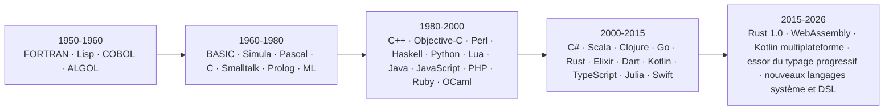
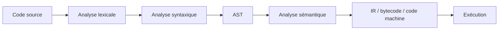
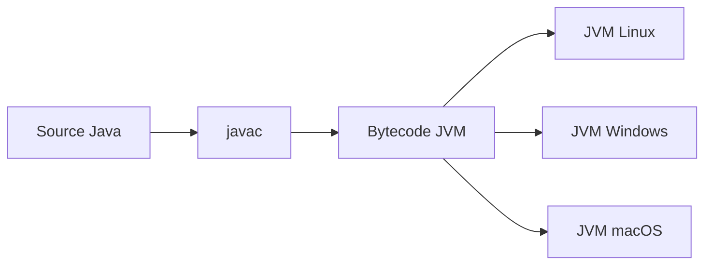
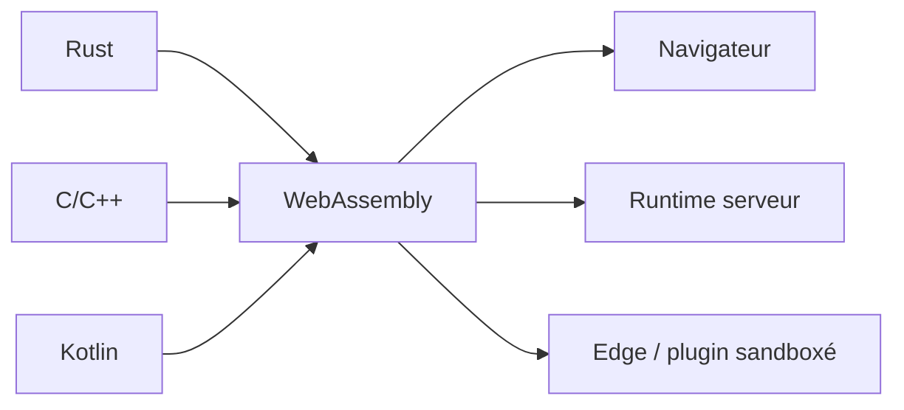
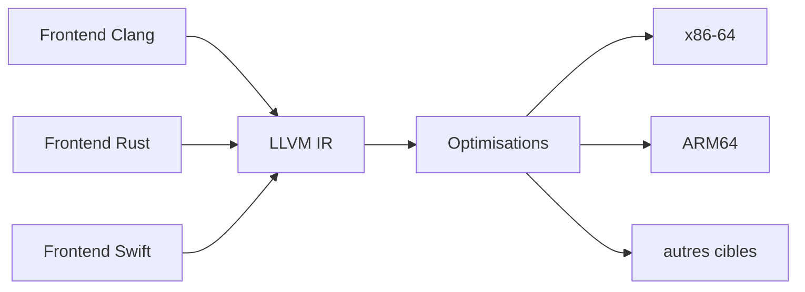

# Histoire des langages de programmation

L'histoire des langages de programmation n'est pas une succession linéaire où un langage en remplace simplement un autre. C'est plutôt une histoire de **problèmes**, de **compromis** et d'**idées** qui réapparaissent sous de nouvelles formes : abstraction, portabilité, sûreté mémoire, expressivité, performances, concurrence, vérification, interopérabilité ou productivité.

Un langage moderne hérite souvent de plusieurs familles à la fois. Rust, par exemple, appartient au monde de la programmation système, reprend des idées de langages fonctionnels pour son système de types et adopte une syntaxe familière aux programmeurs C/C++. TypeScript reste compatible avec JavaScript tout en y ajoutant un système de types statique progressivement adopté. Kotlin combine programmation orientée objet et fonctionnelle tout en ciblant plusieurs plateformes.

> [!important]
> Une chronologie n'est pas une généalogie. Deux langages proches dans le temps ne sont pas nécessairement liés, et un langage peut être influencé par plusieurs dizaines de prédécesseurs.

## Sommaire

1. Comprendre ce qu'est un langage de programmation
2. Des machines aux premiers langages de haut niveau
3. Programmation structurée, fonctionnelle, logique et objet
4. L'explosion des langages généralistes : 1980-2000
5. Les langages du XXIe siècle : 2000-2015
6. De 2015 à 2026 : sûreté, types, concurrence et portabilité
7. Les domaines spécialisés : Web, données, IA, embarqué et calcul scientifique
8. Standards, runtimes, compilateurs et écosystèmes
9. Choisir un langage : critères techniques et organisationnels
10. Tendances futures
11. Travaux pratiques
12. Projet final
13. Repères chronologiques
14. Ce qu’il faut retenir
15. Sources et ressources

## Une chronologie visuelle

La fresque suivante donne des **repères temporels**, sans prétendre représenter toutes les influences entre langages.


```mermaid
flowchart LR
    A["1950-1960\nFORTRAN · Lisp · COBOL · ALGOL"]
    B["1960-1980\nBASIC · Simula · Pascal · C · Smalltalk · Prolog · ML"]
    C["1980-2000\nC++ · Objective-C · Perl · Haskell · Python · Lua · Java · JavaScript · PHP · Ruby · OCaml"]
    D["2000-2015\nC# · Scala · Clojure · Go · Rust · Elixir · Dart · Kotlin · TypeScript · Julia · Swift"]
    E["2015-2026\nRust 1.0 · WebAssembly · Kotlin multiplateforme · essor du typage progressif · nouveaux langages système et DSL"]

    A --> B --> C --> D --> E
```

# 1. Comprendre ce qu'est un langage de programmation

## 1.1 Objectifs du cours

À la fin de ce cours, il faut être capable de :

- replacer les principaux langages dans leur contexte historique ;
- distinguer langage de programmation, langage de balisage, langage de requête et format de données ;
- comprendre les grands paradigmes : impératif, fonctionnel, objet, logique, déclaratif, concurrent ;
- distinguer syntaxe, sémantique et système de types ;
- comprendre les grandes stratégies d'exécution : code machine, bytecode, interprétation, compilation JIT et AOT ;
- reconnaître les grandes familles d'influence ;
- expliquer pourquoi certains langages persistent pendant plusieurs décennies ;
- analyser les compromis d'un langage plutôt que de chercher un hypothétique « meilleur langage ».

## 1.2 Qu'est-ce qu'un langage de programmation ?

Un **langage de programmation** permet d'exprimer des calculs et des comportements qu'une machine pourra exécuter directement ou après traduction.

Exemples :

- C ;
- Python ;
- Java ;
- Rust ;
- JavaScript ;
- Haskell ;
- Prolog ;
- Go.

Un langage de programmation possède généralement :

- une syntaxe ;
- une sémantique ;
- des types ou au minimum des catégories de valeurs ;
- des règles d'évaluation ;
- des mécanismes de contrôle ;
- une stratégie d'exécution ou de compilation.

### 1.2.1 Ce qui n'est pas forcément un langage de programmation

HTML est principalement un **langage de balisage**. CSS est un langage déclaratif de feuilles de style. JSON est un format de sérialisation. SQL est un langage déclaratif de requête et de manipulation de données.

Ces technologies sont parfois appelées par raccourci « langages informatiques », mais elles ne remplissent pas toutes le même rôle.

| Technologie | Catégorie principale | Rôle |
|---|---|---|
| C | langage de programmation | programmer des logiciels et systèmes |
| Python | langage de programmation | programmation généraliste |
| JavaScript | langage de programmation | applications Web et généralistes |
| HTML | langage de balisage | structurer un document Web |
| CSS | langage de style déclaratif | décrire la présentation |
| SQL | langage déclaratif de requête | interroger et modifier des données |
| JSON | format de données | représenter des données structurées |
| RegEx | notation / langage formel | décrire des motifs textuels |

Voir aussi [[HTML]], [[CSS]], [[Javascript]], [[Regex]].

## 1.3 Syntaxe, sémantique et grammaire

### 1.3.1 Syntaxe

La **syntaxe** définit la forme des programmes valides.

Exemple en Python :

```python
if temperature < 0:
    print("gel")
```

En C :

```c
if (temperature < 0) {
    printf("gel\n");
}
```

La même intention s'exprime avec deux syntaxes différentes.

### 1.3.2 Sémantique

La **sémantique** décrit ce que signifie un programme valide.

Deux fragments peuvent être syntaxiquement corrects mais avoir des comportements très différents selon le langage :

```text
1 / 2
```

Selon le langage et les types impliqués, cela peut produire :

- `0` ;
- `0.5` ;
- une valeur rationnelle exacte ;
- une erreur de type.

### 1.3.3 Grammaire

Une grammaire formalise les constructions du langage. Une forme simplifiée peut être exprimée en BNF ou EBNF :

```text
expression = terme { ("+" | "-") terme } ;
terme      = facteur { ("*" | "/") facteur } ;
facteur    = nombre | "(" expression ")" ;
```

Les grammaires sont utilisées par les parseurs, les compilateurs, les analyseurs statiques et les IDE.

## 1.4 De la source à l'exécution

Un programme traverse souvent plusieurs étapes :


```mermaid
flowchart LR
    A[Code source] --> B[Analyse lexicale]
    B --> C[Analyse syntaxique]
    C --> D[AST]
    D --> E[Analyse sémantique]
    E --> F[IR / bytecode / code machine]
    F --> G[Exécution]
```

### 1.4.1 Lexer

Le lexer transforme une suite de caractères en **tokens** :

```text
x = 12 + 4
```

peut devenir :

```text
IDENT(x) ASSIGN INT(12) PLUS INT(4)
```

### 1.4.2 Parser

Le parser transforme ces tokens en arbre syntaxique abstrait, ou **AST**.

### 1.4.3 Interprétation et compilation

La distinction « compilé » / « interprété » est utile pédagogiquement mais trop simpliste pour les runtimes modernes.

Exemples :

- C est généralement compilé en code machine avant l'exécution ;
- CPython compile le code Python vers un bytecode ensuite exécuté par une machine virtuelle ;
- Java compile vers du bytecode JVM, souvent ensuite compilé à chaud par un JIT ;
- JavaScript est exécuté par des moteurs qui combinent interprétation, bytecode et compilation JIT ;
- WebAssembly est généralement produit comme cible de compilation puis exécuté par un runtime ou navigateur.

> [!note]
> Il vaut mieux parler de **modèle d'exécution** que classer un langage une fois pour toutes comme « compilé » ou « interprété ».

## 1.5 Les grands paradigmes

Un paradigme est une manière d'organiser et de raisonner sur les programmes.

### 1.5.1 Impératif

Le programme décrit une suite d'actions qui modifient un état.

Langages représentatifs : C, Pascal, Python, Java.

```python
somme = 0
for valeur in valeurs:
    somme += valeur
```

### 1.5.2 Structuré

La programmation structurée privilégie blocs, fonctions, boucles et conditions plutôt que des sauts arbitraires.

Elle a été fortement popularisée par ALGOL, Pascal et C.

### 1.5.3 Orienté objet

Le système est organisé autour d'objets combinant état et comportements.

Langages historiques importants : Simula et Smalltalk.

Langages modernes multiparadigmes : Java, C++, Python, Ruby, Kotlin, Swift.

### 1.5.4 Fonctionnel

La programmation fonctionnelle met l'accent sur :

- les fonctions comme valeurs ;
- la composition ;
- l'immutabilité ;
- les fonctions d'ordre supérieur ;
- la réduction des effets de bord.

Langages représentatifs : Lisp, ML, Haskell, Clojure, Elixir.

Les idées fonctionnelles ont aussi été intégrées dans JavaScript, Python, Java, C++, Rust, Kotlin ou Swift.

### 1.5.5 Logique

Le programme décrit des faits et règles ; le moteur cherche une solution.

Exemple classique : Prolog.

```prolog
parent(alice, bob).
parent(bob, claire).

grand_parent(X, Z) :-
    parent(X, Y),
    parent(Y, Z).
```

### 1.5.6 Déclaratif

Le programme indique **ce que l'on souhaite obtenir** plutôt que toutes les étapes nécessaires.

Exemples :

- SQL ;
- règles Prolog ;
- expressions de configuration ;
- langages fonctionnels dans certains styles.

### 1.5.7 Concurrent et orienté messages

Certains langages ou runtimes placent la concurrence au cœur de leur modèle.

Exemples :

- Erlang et son modèle acteur ;
- Elixir sur la VM BEAM ;
- Go avec goroutines et channels ;
- Rust avec garanties de sûreté renforcées autour du partage de mémoire.

## 1.6 Les systèmes de types

### 1.6.1 Typage statique et dynamique

Un langage à typage **statique** vérifie une partie importante des contraintes de types avant l'exécution.

Exemples : C, Java, Rust, Go, Haskell.

Un langage à typage **dynamique** associe les types aux valeurs à l'exécution.

Exemples : Python, Ruby, JavaScript.

La frontière est moins nette avec le **gradual typing** :

- Python peut utiliser des annotations contrôlées par mypy, Pyright ou d'autres outils ;
- TypeScript ajoute un système de types statique au monde JavaScript sans changer le runtime JavaScript.

### 1.6.2 « Fort » et « faible »

Les expressions « typage fort » et « typage faible » n'ont pas une définition universelle. Elles doivent être utilisées avec prudence.

Il vaut mieux préciser :

- conversions implicites autorisées ;
- vérifications statiques ;
- comportement sur les opérations invalides ;
- représentation mémoire ;
- possibilité de contourner le système de types.

## 1.7 Gestion de la mémoire

Les langages diffèrent aussi par leur gestion des ressources.

### Gestion manuelle

C repose largement sur une gestion explicite :

```c
int *values = malloc(100 * sizeof(int));
/* ... */
free(values);
```

### RAII

C++ associe la durée de vie des ressources à celle des objets.

Voir [[C++]].

### Garbage collector

Java, C#, Go, Python ou JavaScript disposent de runtimes avec ramasse-miettes, même si les détails diffèrent.

### Ownership

Rust introduit un modèle de propriété et d'emprunts vérifié à la compilation afin de garantir de nombreuses propriétés de sûreté mémoire sans garbage collector généraliste.

# 2. Des machines aux premiers langages de haut niveau

## 2.1 Avant les ordinateurs électroniques

L'idée de programmer une machine précède l'ordinateur moderne.

### 2.1.1 Cartes perforées

Au début du XIXe siècle, le métier Jacquard utilise des cartes perforées pour contrôler les motifs d'un métier à tisser. Ce n'est pas un langage de programmation moderne, mais c'est un exemple historique majeur de **contrôle d'une machine par une représentation externe d'instructions**.

### 2.1.2 Babbage et Ada Lovelace

Charles Babbage conçoit au XIXe siècle la machine analytique. Ada Lovelace décrit une méthode de calcul pour cette machine et réfléchit à sa capacité à manipuler autre chose que des nombres lorsque des objets peuvent être représentés symboliquement.

Elle est souvent qualifiée de première programmeuse. La machine analytique n'ayant jamais été achevée sous sa forme complète à son époque, cette qualification doit être comprise dans son contexte historique.

## 2.2 Langage machine

Les premiers ordinateurs électroniques sont programmés à un niveau extrêmement proche du matériel.

Un langage machine dépend directement de l'architecture du processeur.

Avantages :

- contrôle maximal ;
- aucune couche d'abstraction nécessaire.

Inconvénients :

- faible lisibilité ;
- très forte dépendance au matériel ;
- maintenance difficile ;
- productivité faible.

## 2.3 Assembleur

L'assembleur introduit des noms symboliques pour les instructions et adresses.

Exemple conceptuel :

```asm
MOV R1, 5
ADD R1, R2
```

L'assembleur reste étroitement lié à une architecture, mais il constitue une abstraction majeure par rapport à l'écriture directe de codes binaires.

## 2.4 FORTRAN : le calcul scientifique devient programmable à haut niveau

FORTRAN, développé chez IBM sous la direction de John Backus, apparaît dans les années 1950 et est diffusé commercialement en 1957.

Son importance historique vient de plusieurs facteurs :

- expression de formules mathématiques de haut niveau ;
- compilation vers du code performant ;
- réduction considérable de la quantité de code à écrire ;
- adoption massive dans le calcul scientifique et l'ingénierie.

Exemple historique simplifié :

```fortran
DO 100 I = 1, 10
    X(I) = X(I) * 2
100 CONTINUE
```

FORTRAN n'est pas seulement un langage historique : sa famille continue d'évoluer et reste utilisée dans certains domaines de calcul scientifique et de simulation.

## 2.5 Lisp : le calcul symbolique et les fonctions

Lisp est créé par John McCarthy à la fin des années 1950.

Ses contributions sont considérables :

- listes comme structure centrale ;
- fonctions comme valeurs ;
- récursion ;
- traitement symbolique ;
- représentation du code sous forme de structures de données ;
- macros dans plusieurs dialectes.

Exemple :

```lisp
(defun factorial (n)
  (if (<= n 1)
      1
      (* n (factorial (- n 1)))))
```

La famille Lisp comprend notamment :

- Common Lisp ;
- Scheme ;
- Racket ;
- Clojure.

## 2.6 COBOL : programmer les processus métier

COBOL naît en 1959 dans un contexte de traitement de données administratives et commerciales.

Ses objectifs historiques :

- lisibilité ;
- traitement de fichiers et enregistrements ;
- portabilité entre machines ;
- expression de processus métier.

Son style très verbeux est volontaire.

```cobol
IF BALANCE > 0
    DISPLAY "ACCOUNT IN CREDIT"
END-IF
```

Une partie importante des systèmes bancaires, administratifs et d'assurance a longtemps reposé sur COBOL. Cela illustre un phénomène central de l'histoire des langages : **la durée de vie d'un logiciel peut être bien supérieure à celle des modes technologiques**.

## 2.7 ALGOL : la grammaire des langages modernes

ALGOL 58 puis ALGOL 60 influencent profondément la conception des langages.

Héritages majeurs :

- blocs lexicaux ;
- portée locale ;
- structures de contrôle ;
- notation syntaxique formelle ;
- influence sur Pascal, C et de nombreux descendants.

La notation BNF est étroitement associée aux travaux autour d'ALGOL.

## 2.8 BASIC : rendre la programmation accessible

BASIC est créé en 1964 à Dartmouth pour rendre la programmation plus accessible aux étudiants.

Il devient particulièrement important avec les micro-ordinateurs des années 1970 et 1980.

```basic
10 PRINT "HELLO"
20 GOTO 10
```

Les dialectes BASIC ont beaucoup évolué. Visual Basic, apparu bien plus tard, hérite du nom et de certains concepts mais appartient à un contexte radicalement différent.

# 3. Programmation structurée, objet, logique et fonctionnelle

## 3.1 La crise du logiciel

Dans les années 1960 et 1970, la taille croissante des programmes révèle les limites des méthodes artisanales :

- logiciels livrés en retard ;
- bugs difficiles à corriger ;
- maintenance coûteuse ;
- complexité croissante.

Une partie de la recherche sur les langages cherche alors à rendre la structure des programmes plus contrôlable.

## 3.2 Programmation structurée

La programmation structurée favorise :

- séquence ;
- sélection ;
- itération ;
- procédures ;
- blocs ;
- réduction des sauts non structurés.

### 3.2.1 Pascal

Pascal est conçu par Niklaus Wirth autour de 1970 dans un objectif pédagogique et de programmation structurée.

Il popularise une écriture claire des structures de contrôle :

```pascal
for i := 1 to 10 do
begin
    writeln(i);
end;
```

Des descendants comme Object Pascal / Delphi prolongeront son influence.

## 3.3 Simula : les fondations de la programmation objet

Simula, développé dans les années 1960, est conçu pour la simulation.

Il introduit des idées essentielles :

- classes ;
- objets ;
- héritage ;
- instances.

La programmation orientée objet naît donc d'abord d'un besoin de **modélisation**.

## 3.4 Smalltalk : « tout est objet » comme philosophie

Smalltalk est développé au Xerox PARC dans les années 1970.

Il pousse très loin le modèle objet :

- environnement interactif ;
- envoi de messages ;
- classes ;
- image système ;
- outils intégrés.

Son influence dépasse sa part d'utilisation directe : interfaces graphiques, IDE, refactoring et conception orientée objet lui doivent beaucoup.

## 3.5 C et Unix

C est développé au début des années 1970 par Dennis Ritchie aux Bell Labs, en lien étroit avec Unix.

Son apport historique majeur est d'offrir un compromis entre :

- contrôle bas niveau ;
- portabilité ;
- efficacité ;
- structures de haut niveau suffisantes pour développer un système d'exploitation.

```c
for (int i = 0; i < 10; ++i) {
    printf("%d\n", i);
}
```

C devient une référence pour :

- systèmes d'exploitation ;
- compilateurs ;
- bibliothèques ;
- embarqué ;
- interfaces de bas niveau.

Il influence directement ou indirectement C++, Objective-C, Java, C#, JavaScript, Go, Rust et de nombreux autres langages.

## 3.6 Prolog et la programmation logique

Prolog apparaît au début des années 1970.

Plutôt que de décrire une procédure, on définit des faits et relations puis on pose une question.

```prolog
human(socrates).
mortal(X) :- human(X).
```

Les idées de Prolog restent importantes pour :

- systèmes de règles ;
- recherche symbolique ;
- résolution de contraintes ;
- raisonnement logique.

## 3.7 ML et l'inférence de types

ML est créé dans les années 1970 autour de travaux sur la démonstration assistée.

Son influence majeure concerne :

- fonctions de première classe ;
- types algébriques ;
- pattern matching ;
- inférence de types ;
- polymorphisme paramétrique.

La famille ML influencera notamment OCaml, Haskell, F#, Rust et plusieurs systèmes de types modernes.

## 3.8 Ada : fiabilité et grands systèmes

Ada est développé à la fin des années 1970 et au début des années 1980 à la demande du département américain de la Défense.

Le langage met l'accent sur :

- typage fort ;
- modularité ;
- concurrence ;
- fiabilité ;
- systèmes embarqués et critiques.

Ada et son sous-ensemble SPARK restent pertinents dans les contextes où la vérification et la sûreté sont prioritaires.

# 4. L'explosion des langages généralistes : 1980-2000

## 4.1 C++ : abstraction sans abandonner les performances

Bjarne Stroustrup développe « C with Classes », qui devient C++ dans les années 1980.

Objectif : ajouter des abstractions de plus haut niveau au monde C sans abandonner le contrôle des ressources et les performances.

C++ évolue ensuite vers un langage multiparadigme intégrant :

- programmation générique ;
- templates ;
- RAII ;
- métaprogrammation ;
- lambdas ;
- concepts ;
- ranges ;
- concurrence.

Voir [[C++]].

## 4.2 Objective-C

Objective-C combine C et un modèle de messages inspiré de Smalltalk.

Il joue un rôle majeur dans l'écosystème NeXT puis Apple, avant que Swift ne devienne le langage privilégié pour les nouveaux développements Apple.

## 4.3 Perl : le langage de colle de l'Unix des années 1990

Perl est créé par Larry Wall en 1987.

Il excelle historiquement pour :

- traitement de texte ;
- administration système ;
- scripts ;
- CGI ;
- expressions régulières.

Il popularise une culture de programmation très pragmatique et un immense écosystème de modules via CPAN.

## 4.4 Haskell : un laboratoire devenu langage de référence

Haskell apparaît en 1990 comme langage fonctionnel paresseux standardisé pour la recherche et l'enseignement.

Caractéristiques majeures :

- fonctions pures ;
- évaluation paresseuse ;
- types algébriques ;
- classes de types ;
- monades pour structurer les effets.

Son influence sur les systèmes de types et la programmation fonctionnelle moderne est considérable.

## 4.5 Python : lisibilité et langage généraliste

Python est créé par Guido van Rossum au début des années 1990, avec une première version publique en 1991.

Principes qui contribuent à son succès :

- syntaxe lisible ;
- batteries included ;
- modèle multiparadigme ;
- interactivité ;
- extension facile avec des bibliothèques natives ;
- communauté et écosystème très vastes.

Python devient central dans :

- automatisation ;
- Web ;
- science des données ;
- calcul scientifique ;
- IA et machine learning ;
- enseignement.

Voir [[Python]], [[Numpy]], [[Pandas]], [[Pytorch]].

## 4.6 Visual Basic

Visual Basic est lancé par Microsoft au début des années 1990.

Son environnement visuel et son modèle événementiel rendent le développement d'interfaces Windows accessible à un très grand nombre de développeurs.

Son importance historique illustre que le succès d'un langage dépend aussi fortement de son **environnement de développement**.

## 4.7 Lua : petit langage embarquable

Lua est créé au Brésil au début des années 1990.

Il privilégie :

- simplicité ;
- petite taille ;
- facilité d'intégration dans une application ;
- tables comme structure centrale.

Il devient très populaire comme langage embarqué dans :

- jeux vidéo ;
- logiciels ;
- équipements ;
- systèmes de configuration.

## 4.8 Java : bytecode, JVM et portabilité

Java est annoncé publiquement en 1995 par Sun Microsystems.

Son slogan historique « Write Once, Run Anywhere » repose sur :


```mermaid
flowchart LR
    A[Source Java] --> B[javac]
    B --> C[Bytecode JVM]
    C --> D[JVM Linux]
    C --> E[JVM Windows]
    C --> F[JVM macOS]
```

La JVM apporte :

- portabilité du bytecode ;
- garbage collection ;
- vérification du bytecode ;
- JIT ;
- un runtime commun à plusieurs langages.

Java devient incontournable pour les applications d'entreprise et joue un rôle historique majeur dans Android.

> [!note]
> Le garbage collector réduit de nombreuses erreurs de gestion mémoire, mais ne supprime pas toutes les formes de fuite de ressources ou de mémoire logique.

## 4.9 JavaScript : le Web devient programmable

JavaScript est créé en 1995 par Brendan Eich chez Netscape.

Le langage est ensuite standardisé sous le nom **ECMAScript** par Ecma International.

Évolution historique :

1. scripts simples dans les pages Web ;
2. DOM et DHTML ;
3. Ajax ;
4. moteurs JIT rapides ;
5. Node.js côté serveur ;
6. modules ECMAScript ;
7. applications complètes dans navigateur, serveur, desktop et edge.

JavaScript n'est donc pas un langage « apparu dans les années 2020 » : il est au cœur du Web depuis 1995.

Voir [[Javascript]].

## 4.10 PHP : démocratisation du Web dynamique

PHP apparaît également au milieu des années 1990.

Il permet d'intégrer facilement du traitement côté serveur aux pages Web.

Sa facilité de déploiement sur les hébergements mutualisés et l'écosystème LAMP jouent un rôle majeur dans son adoption.

## 4.11 Ruby : objet, expressivité et productivité

Yukihiro Matsumoto commence Ruby en 1993 ; une première version publique est diffusée au Japon en 1995.

Ruby cherche à combiner :

- modèle objet ;
- expressivité ;
- inspiration de Smalltalk, Lisp et Perl ;
- plaisir du développeur.

Ruby on Rails, apparu dans les années 2000, aura ensuite un impact considérable sur la conception des frameworks Web modernes.

## 4.12 OCaml

OCaml apparaît dans la famille ML dans les années 1990.

Il combine :

- programmation fonctionnelle ;
- types algébriques ;
- inférence de types ;
- modules ;
- programmation impérative et objet.

Il devient important dans les compilateurs, l'analyse statique, les outils formels et certains systèmes industriels.

# 5. Les langages du XXIe siècle : 2000-2015

## 5.1 C# et .NET

C# apparaît au début des années 2000 avec la plateforme .NET.

Comme Java, C# bénéficie d'un runtime managé : le CLR.

Avec le temps, C# adopte de nombreuses idées issues de la programmation fonctionnelle et de la recherche sur les langages :

- generics ;
- lambdas ;
- LINQ ;
- async/await ;
- pattern matching ;
- records.

## 5.2 Scala

Scala est rendu public au début des années 2000 et cible la JVM.

Il cherche à fusionner programmation orientée objet et fonctionnelle.

Il influence fortement l'usage moderne de la JVM et joue un rôle important dans des outils de traitement distribué comme Apache Spark.

## 5.3 Clojure

Clojure apparaît en 2007.

C'est un Lisp moderne conçu principalement pour la JVM.

Il met l'accent sur :

- données immuables ;
- fonctions ;
- structures persistantes ;
- gestion explicite de l'état ;
- concurrence.

## 5.4 Go

Go est développé chez Google à partir de 2007 par Robert Griesemer, Rob Pike et Ken Thompson. Le projet est publié en open source en novembre 2009 et Go 1 sort en mars 2012.

Objectifs :

- simplicité ;
- compilation rapide ;
- binaire natif ;
- garbage collector ;
- concurrence intégrée ;
- outillage standard cohérent.

Exemple :

```go
go process(job)
```

Les **goroutines** et **channels** rendent la concurrence particulièrement visible dans le langage.

Go devient très important pour :

- cloud ;
- infrastructure ;
- réseau ;
- outils CLI ;
- plateformes distribuées.

## 5.5 Rust

Rust naît chez Mozilla à partir des travaux de Graydon Hoare et atteint sa version 1.0 en mai 2015.

Son objectif central est de réunir :

- performances proches du C/C++ ;
- contrôle bas niveau ;
- sûreté mémoire ;
- concurrence sûre ;
- abstractions sans coût inutile.

Le mécanisme clé est l'**ownership** associé aux emprunts et durées de vie.

```rust
fn length(value: &String) -> usize {
    value.len()
}
```

Rust marque une évolution importante : une partie des erreurs traditionnellement détectées à l'exécution ou par analyse externe est transformée en contraintes vérifiées par le compilateur.

## 5.6 Elixir et la continuité d'Erlang

Elixir est créé par José Valim au début des années 2010 et s'exécute sur la VM BEAM d'Erlang.

Il combine :

- programmation fonctionnelle ;
- immutabilité ;
- modèle acteur ;
- tolérance aux pannes ;
- supervision ;
- concurrence massive.

Il montre qu'une machine virtuelle conçue dans les années 1980 peut rester extrêmement pertinente lorsqu'elle résout un problème fondamental : construire des systèmes distribués résilients.

## 5.7 Dart

Dart est présenté par Google en 2011.

Il est aujourd'hui particulièrement associé à Flutter pour créer des interfaces multiplateformes.

Le cas Dart illustre la relation étroite entre un langage et son **framework phare**.

## 5.8 Kotlin

Le développement de Kotlin commence chez JetBrains en 2010 et le projet est présenté publiquement en 2011. La version 1.0 stable sort en 2016.

Kotlin combine :

- typage statique ;
- interopérabilité avec Java ;
- null-safety ;
- fonctions d'ordre supérieur ;
- coroutines ;
- programmation multiplateforme.

Google annonce son support officiel pour Android en 2017 puis le présente comme langage privilégié pour les nouveaux projets Android en 2019.

## 5.9 TypeScript

TypeScript est dévoilé par Microsoft le 1er octobre 2012 et atteint la version 1.0 en 2014.

Il ajoute à JavaScript :

- types statiques optionnels ;
- inférence ;
- interfaces et types structurels ;
- tooling puissant ;
- compilation vers JavaScript.

```typescript
function total(values: number[]): number {
    return values.reduce((a, b) => a + b, 0);
}
```

TypeScript ne remplace pas le runtime JavaScript : son système de types disparaît en grande partie lors de la compilation.

## 5.10 Julia

Julia est rendue publique au début des années 2010.

Elle vise particulièrement :

- calcul scientifique ;
- calcul numérique ;
- statistiques ;
- hautes performances ;
- programmation interactive.

Son design repose notamment sur le **multiple dispatch**.

## 5.11 Swift

Swift est présenté par Apple en 2014 et devient open source en décembre 2015.

Il remplace progressivement Objective-C pour les nouveaux développements Apple.

Objectifs :

- sécurité accrue ;
- syntaxe moderne ;
- performances ;
- interopérabilité avec les bibliothèques de l'écosystème Apple ;
- outils modernes.

# 6. De 2015 à 2026 : sûreté, types, concurrence et portabilité

## 6.1 Une période de consolidation plutôt qu'une rupture totale

Depuis le milieu des années 2010, l'histoire des langages est moins dominée par un unique nouveau paradigme que par la combinaison de plusieurs tendances :

- sûreté mémoire ;
- systèmes de types plus expressifs ;
- concurrence structurée ;
- asynchronisme ;
- portabilité ;
- WebAssembly ;
- compilation multi-cible ;
- outillage intégré ;
- gestion de dépendances ;
- reproductibilité ;
- sécurité de la chaîne logicielle.

## 6.2 La sûreté mémoire devient un objectif de premier plan

Une grande partie des vulnérabilités historiques des logiciels système vient d'erreurs comme :

- use-after-free ;
- double free ;
- buffer overflow ;
- pointeurs invalides ;
- data races.

Les réponses diffèrent selon les langages :

| Approche | Exemples |
|---|---|
| garbage collector | Java, C#, Go |
| ownership / borrow checking | Rust |
| vérifications runtime | Swift, Kotlin selon les cas |
| gestion manuelle + outils | C, C++ |

La tendance n'implique pas la disparition de C/C++, mais augmente la pression pour utiliser des langages memory-safe lorsque le contexte le permet.

## 6.3 Les langages deviennent multiparadigmes

La séparation stricte entre impératif, objet et fonctionnel s'atténue.

Exemples :

- Java possède lambdas et streams ;
- C++ possède lambdas, ranges et concepts ;
- Python possède compréhension, générateurs et fonctions de première classe ;
- Kotlin et Swift mêlent objet et fonctionnel ;
- Rust mélange programmation impérative, traits, pattern matching et types algébriques.

## 6.4 Les types gagnent en expressivité

Les langages modernes adoptent de plus en plus :

- types somme / enums riches ;
- generics ;
- traits / interfaces ;
- pattern matching ;
- null-safety ;
- types optionnels ;
- inférence ;
- annotations progressives.

Exemple Rust :

```rust
enum Result<T, E> {
    Ok(T),
    Err(E),
}
```

Exemple TypeScript :

```typescript
type State =
    | { kind: "loading" }
    | { kind: "ready"; value: string }
    | { kind: "error"; message: string };
```

## 6.5 `async` / `await` devient un langage commun

L'asynchronisme a longtemps été exprimé avec callbacks, événements ou futures explicites.

La syntaxe `async` / `await` se généralise dans de nombreux écosystèmes :

- C# ;
- JavaScript / TypeScript ;
- Python ;
- Rust ;
- Swift ;
- Kotlin avec ses propres abstractions de coroutines.

Cette convergence montre qu'une idée peut traverser plusieurs familles de langages lorsqu'elle résout un problème partagé.

## 6.6 WebAssembly : une cible portable

WebAssembly, ou Wasm, devient une recommandation W3C en décembre 2019.

Il s'agit d'un format d'instructions bas niveau, portable et compact, conçu pour une exécution efficace.

Il peut être produit à partir de langages comme :

- C ;
- C++ ;
- Rust ;
- Go selon toolchain ;
- Kotlin/Wasm ;
- divers langages expérimentaux.


```mermaid
flowchart LR
    A[Rust] --> W[WebAssembly]
    B[C/C++] --> W
    C[Kotlin] --> W
    W --> D[Navigateur]
    W --> E[Runtime serveur]
    W --> F[Edge / plugin sandboxé]
```

> [!important]
> WebAssembly n'est pas un remplacement général de JavaScript. Sur le Web, les deux technologies sont souvent complémentaires.

## 6.7 Les runtimes deviennent des plateformes

Une idée importante de la période récente est qu'un langage ne se résume plus à sa syntaxe.

Écosystèmes majeurs :

- JVM : Java, Kotlin, Scala, Clojure ;
- .NET CLR : C#, F#, Visual Basic .NET ;
- BEAM : Erlang, Elixir ;
- JavaScript runtimes : navigateurs, Node.js, Deno, Bun ;
- LLVM : infrastructure de compilation utilisée par de nombreux langages ;
- WebAssembly runtimes : navigateur et hors navigateur.

Le runtime peut être presque aussi déterminant que le langage.

## 6.8 Zig et les nouveaux langages système

Zig apparaît dans la seconde moitié des années 2010 comme langage système mettant l'accent sur :

- simplicité explicite ;
- contrôle de l'allocation ;
- compilation croisée ;
- interopérabilité C ;
- absence de garbage collector obligatoire.

Il illustre une tendance : revisiter le domaine C/C++ avec des choix de conception différents.

> [!note]
> Les langages récents ou pré-1.0 doivent être évalués aussi selon la stabilité de leur spécification, de leur écosystème et de leurs outils, pas seulement selon leurs fonctionnalités.

## 6.9 Les DSL reviennent au premier plan

Un **Domain-Specific Language** est conçu pour un domaine précis.

Exemples :

- SQL pour les données relationnelles ;
- CUDA C++ et langages de kernels GPU ;
- shader languages ;
- Terraform HCL pour l'infrastructure ;
- langages de requête ;
- langages de configuration ;
- DSL embarqués dans Python ou Rust.

À l'ère de l'IA et du calcul accéléré, beaucoup d'innovations passent par des DSL spécialisés plutôt que par de nouveaux langages généralistes.

# 7. Langages par domaine

## 7.1 Le Web

Le Web repose sur plusieurs couches :

| Couche | Technologie principale |
|---|---|
| structure | HTML |
| style | CSS |
| programmation navigateur | JavaScript |
| typage outillé | TypeScript |
| code natif portable | WebAssembly |
| serveur | nombreux langages : JavaScript, Python, Java, Go, Rust, PHP, Ruby, C#, etc. |

HTML et CSS sont indispensables au Web mais ne doivent pas être confondus avec des langages de programmation généralistes.

## 7.2 Données et statistiques

### R

R est spécialisé dans :

- statistiques ;
- exploration de données ;
- visualisation ;
- recherche.

### Python

Python devient une plateforme scientifique grâce à son écosystème :

- NumPy ;
- pandas ;
- SciPy ;
- scikit-learn ;
- PyTorch ;
- Jupyter.

Voir [[Data Mining en Python]], [[Numpy]], [[Pandas]], [[Pytorch]].

### Julia

Julia vise à réduire le compromis historique entre langage interactif simple et langage compilé performant.

## 7.3 Intelligence artificielle

L'histoire de l'IA est liée à plusieurs familles :

- Lisp pour l'IA symbolique ;
- Prolog pour le raisonnement logique ;
- C/C++ pour les moteurs haute performance ;
- Python comme langage d'orchestration dominant de nombreux frameworks modernes ;
- CUDA et DSL spécialisés pour le calcul GPU.

> [!important]
> Le succès de Python en IA ne signifie pas que tous les calculs sont exécutés en Python pur. Une grande partie du travail intensif est réalisée par des bibliothèques natives, compilateurs, kernels GPU ou runtimes spécialisés.

Voir [[LLM]], [[Les transformers]], [[RAG]], [[Pytorch]].

## 7.4 Calcul scientifique

FORTRAN, C, C++, MATLAB, Python et Julia coexistent.

Le choix dépend de :

- bibliothèques existantes ;
- performance ;
- coût de réécriture ;
- validation scientifique ;
- capacité d'interfaçage ;
- facilité de prototypage.

## 7.5 Embarqué

C et C++ restent majeurs, mais d'autres langages gagnent du terrain :

- Rust ;
- Ada/SPARK ;
- MicroPython dans certains contextes ;
- DSL et environnements spécifiques aux microcontrôleurs.

Les contraintes sont différentes du desktop :

- mémoire limitée ;
- temps réel ;
- consommation ;
- absence éventuelle de système d'exploitation ;
- certification.

## 7.6 Cloud et systèmes distribués

Langages fréquents :

- Go ;
- Java ;
- Kotlin ;
- C# ;
- Rust ;
- Python ;
- JavaScript / TypeScript ;
- Erlang / Elixir.

Ici, l'écosystème réseau, l'observabilité, la concurrence et la facilité de déploiement peuvent peser plus lourd que la syntaxe.

## 7.7 Mobile

L'histoire récente du mobile est dominée par :

- Java puis Kotlin sur Android ;
- Objective-C puis Swift chez Apple ;
- Dart avec Flutter ;
- JavaScript / TypeScript avec plusieurs frameworks multiplateformes.

# 8. Standards, runtimes, compilateurs et écosystèmes

## 8.1 Un langage peut avoir plusieurs implémentations

Exemples :

### Python

- CPython ;
- PyPy ;
- MicroPython ;
- autres implémentations spécialisées.

### JavaScript

- V8 ;
- SpiderMonkey ;
- JavaScriptCore.

### C/C++

- GCC ;
- Clang/LLVM ;
- MSVC.

Un langage et son implémentation ne doivent donc pas être confondus.

## 8.2 Standardisation

Les langages sont gouvernés de manières différentes.

### Standards internationaux

C et C++ sont standardisés par ISO.

### Ecma

ECMAScript, base standard de JavaScript, est maintenu par TC39 au sein d'Ecma International.

C# possède également une spécification standardisée par Ecma et ISO pour certaines versions.

### Gouvernance communautaire

Python évolue via les PEP.

Rust utilise un processus RFC et des équipes de gouvernance.

Go utilise propositions, discussions et processus de compatibilité particulièrement strict autour de Go 1.

Kotlin, Swift ou TypeScript disposent chacun de leurs propres processus et équipes de conception.

## 8.3 Pourquoi la gouvernance compte

Avant d'adopter un langage, il faut regarder :

- qui décide de son évolution ;
- stabilité des versions ;
- politique de compatibilité ;
- disponibilité de la spécification ;
- licences ;
- diversité des contributeurs ;
- dépendance éventuelle à une entreprise unique.

## 8.4 Le rôle des package managers

Les écosystèmes modernes associent presque toujours le langage à un gestionnaire de paquets :

| Écosystème | Gestionnaire / dépôt courant |
|---|---|
| Python | pip / PyPI |
| JavaScript | npm / registre npm |
| Rust | Cargo / crates.io |
| Go | Go modules |
| Java | Maven / Gradle et dépôts Maven |
| C# | NuGet |
| Swift | Swift Package Manager |
| Dart | pub |

Les package managers deviennent une partie centrale de l'expérience du langage.

## 8.5 Tooling et LSP

Le **Language Server Protocol** sépare une partie de l'intelligence du langage de l'éditeur.

Fonctions :

- autocomplétion ;
- navigation ;
- diagnostics ;
- refactoring ;
- documentation ;
- symboles.

Cette évolution réduit l'importance de choisir un IDE spécifique et facilite des outils multi-éditeurs.

Voir [[Visual studio code]].

## 8.6 LLVM

LLVM est une infrastructure de compilation utilisée par de nombreux langages.

Schéma conceptuel :


```mermaid
flowchart LR
    A[Frontend Clang] --> I[LLVM IR]
    B[Frontend Rust] --> I
    C[Frontend Swift] --> I
    I --> O[Optimisations]
    O --> X[x86-64]
    O --> Y[ARM64]
    O --> Z[autres cibles]
```

L'intérêt est de mutualiser :

- optimisations ;
- génération de code ;
- support des architectures ;
- outils de debugging.

## 8.7 Compatibilité descendante

Un langage largement déployé doit arbitrer entre :

- corriger ses erreurs historiques ;
- introduire de nouvelles fonctionnalités ;
- ne pas casser des millions de lignes existantes.

Java, JavaScript, C++, Python ou Go adoptent des stratégies différentes.

Python 2 → Python 3 montre le coût potentiel d'une rupture majeure.

Go met au contraire fortement l'accent sur la compatibilité de la famille Go 1.

# 9. Choisir un langage

## 9.1 Il n'existe pas de meilleur langage universel

Le bon choix dépend du problème.

Une comparaison pertinente doit intégrer plusieurs axes.

## 9.2 Critères techniques

### Performance

Questions :

- latence ?
- débit ?
- temps de démarrage ?
- consommation mémoire ?
- taille des binaires ?

### Sûreté

- sûreté mémoire ;
- null-safety ;
- système de types ;
- concurrence ;
- sandbox ;
- maturité des bibliothèques.

### Temps réel

Un garbage collector peut être parfaitement acceptable pour un serveur Web mais problématique pour certains systèmes temps réel stricts.

### Portabilité

- navigateur ;
- Linux ;
- Windows ;
- macOS ;
- mobile ;
- microcontrôleur ;
- WebAssembly.

## 9.3 Critères humains

- compétences de l'équipe ;
- lisibilité ;
- facilité de recrutement ;
- documentation ;
- outils ;
- vitesse de développement ;
- facilité de revue de code.

## 9.4 Critères d'écosystème

Un langage excellent sans bibliothèques adaptées peut être un mauvais choix.

Évaluer :

- bibliothèques ;
- frameworks ;
- qualité des dépendances ;
- maintenance ;
- sécurité ;
- licence ;
- maturité des outils.

## 9.5 Matrice de décision

Exemple :

| Critère | Poids | Python | Go | Rust |
|---|---:|---:|---:|---:|
| prototypage rapide | 5 | 5 | 4 | 2 |
| performance native | 4 | 2 | 4 | 5 |
| sûreté mémoire | 5 | 4 | 4 | 5 |
| écosystème ML | 5 | 5 | 2 | 2 |
| binaire autonome | 3 | 2 | 5 | 5 |
| courbe d'apprentissage | 3 | 5 | 4 | 2 |

Cette table n'est pas une vérité universelle : elle doit être adaptée au projet.

# 10. Tendances actuelles et futur des langages

## 10.1 La sûreté mémoire comme exigence

L'une des tendances les plus fortes est la recherche de langages qui préviennent davantage d'erreurs par construction.

Cela favorise :

- Rust ;
- Swift dans certains domaines ;
- langages managés ;
- outils d'analyse et sous-ensembles sûrs pour C/C++ ;
- recherches sur de nouveaux langages système.

## 10.2 Typage plus riche sans sacrifier l'ergonomie

Les utilisateurs veulent simultanément :

- inférence de types ;
- excellent IDE ;
- erreurs précoces ;
- syntaxe concise.

C'est un moteur important derrière TypeScript, Kotlin, Swift, Rust et les évolutions récentes de nombreux langages.

## 10.3 Concurrence structurée

La simple création de threads ou tâches asynchrones ne suffit pas.

Les langages et bibliothèques cherchent à mieux structurer :

- durée de vie des tâches ;
- annulation ;
- propagation des erreurs ;
- supervision.

On retrouve ces idées dans différents écosystèmes sous des formes différentes.

## 10.4 WebAssembly hors du navigateur

Wasm est également utilisé comme cible pour :

- plugins ;
- sandbox ;
- edge computing ;
- composants portables ;
- environnements serveur.

La portabilité des composants pourrait devenir aussi importante que la portabilité du code source.

## 10.5 IA générative et programmation

Les LLM modifient surtout **la manière d'utiliser les langages**, pas la nécessité des langages eux-mêmes.

Impacts probables :

- génération de code ;
- migration entre langages ;
- documentation ;
- tests ;
- refactoring ;
- analyse de code ;
- création plus rapide de DSL.

Mais la génération automatique renforce aussi l'importance de :

- compilateurs stricts ;
- systèmes de types ;
- linters ;
- tests ;
- analyse statique ;
- propriétés formelles ;
- sandboxing.

> [!important]
> Un code plausible généré par une IA n'est pas nécessairement un code correct. Les outils de langage restent le filet de sécurité essentiel.

## 10.6 Programmation quantique

La programmation quantique reste un domaine spécialisé et en évolution rapide.

Exemples d'environnements :

- Q# ;
- Qiskit via Python ;
- Cirq via Python ;
- langages et IR quantiques spécialisés.

Le modèle de programmation diffère fortement des architectures classiques :

- qubits ;
- superposition ;
- intrication ;
- circuits ;
- mesure.

Il est prématuré de parler d'un langage quantique universel comparable à C ou Python.

## 10.7 Vérification et langages assistés par preuve

Les frontières entre langage de programmation et assistant de preuve se rapprochent dans certains domaines.

Exemples :

- Coq / Rocq ;
- Lean ;
- Agda ;
- Dafny ;
- F*.

Ces outils permettent d'exprimer et vérifier des propriétés mathématiques plus fortes que des tests ordinaires.

## 10.8 Langages spécialisés pour accélérateurs

La montée des GPU, TPU, NPU et autres accélérateurs favorise :

- CUDA ;
- langages de shaders ;
- DSL de kernels ;
- compilateurs tensoriels ;
- IR spécialisés.

Une part croissante de l'innovation ne consiste plus à créer un langage généraliste, mais à créer une couche adaptée à une architecture de calcul particulière.

## 10.9 Le futur sera probablement polyglotte

Une application moderne peut combiner :

- TypeScript dans le frontend ;
- Go ou Java dans les services ;
- Python pour l'IA ;
- Rust pour un composant sensible ;
- SQL pour les données ;
- WebAssembly pour un plugin isolé.

Le développeur moderne doit donc comprendre les **concepts transférables** entre langages davantage que mémoriser une syntaxe unique.

# 11. Travaux pratiques

## TP 1 — Construire une frise historique

Créer une frise contenant au minimum :

- FORTRAN ;
- Lisp ;
- COBOL ;
- ALGOL ;
- C ;
- Smalltalk ;
- C++ ;
- Haskell ;
- Python ;
- Java ;
- JavaScript ;
- Ruby ;
- C# ;
- Go ;
- Rust ;
- TypeScript ;
- Kotlin ;
- Swift ;
- WebAssembly.

Pour chacun, indiquer :

1. année ou période d'apparition ;
2. créateur ou organisation ;
3. problème principal visé ;
4. influence notable.

## TP 2 — Même algorithme, quatre paradigmes

Implémenter ou décrire une recherche dans une collection dans quatre styles :

- impératif ;
- fonctionnel ;
- objet ;
- logique.

Comparer :

- lisibilité ;
- quantité d'état mutable ;
- abstraction ;
- facilité de test.

## TP 3 — Compilation et interprétation

Étudier :

- C avec GCC ou Clang ;
- Python avec CPython ;
- Java avec `javac` et la JVM ;
- JavaScript avec Node.js.

Identifier pour chaque cas :

- source ;
- représentation intermédiaire ;
- runtime ;
- moment où du code machine est produit.

## TP 4 — Comparer les systèmes de types

Comparer un même modèle de données en :

- Python ;
- TypeScript ;
- Rust ;
- Haskell ou Kotlin.

Analyser :

- inférence ;
- nullabilité ;
- unions / enums ;
- generics ;
- erreurs détectées avant exécution.

## TP 5 — Explorer une famille de langages

Choisir une famille :

- Lisp ;
- ML ;
- C ;
- JVM ;
- .NET ;
- BEAM.

Construire un arbre d'influences documenté.

> [!warning]
> Ne pas confondre « influence » et « descendance directe ». Chaque flèche doit être justifiée par une source.

## TP 6 — Histoire d'une fonctionnalité

Choisir une idée et suivre son évolution :

- garbage collection ;
- objets ;
- generics ;
- lambdas ;
- pattern matching ;
- async/await ;
- ownership ;
- modules.

Exemple :

```text
Lisp → fonctions de première classe
    ↓
ML / Haskell → programmation fonctionnelle typée
    ↓
JavaScript / Python / C# / Java / C++ → adoption de lambdas et fonctions d'ordre supérieur
```

## TP 7 — WebAssembly

Compiler un programme simple vers WebAssembly à partir d'un langage supporté par la toolchain choisie.

Observer :

- fichier `.wasm` ;
- taille ;
- imports/exports ;
- environnement d'exécution ;
- différence entre source et cible.

## TP 8 — Étude d'un langage disparu ou marginal

Choisir un langage ancien ou aujourd'hui minoritaire :

- ALGOL ;
- Pascal ;
- Smalltalk ;
- Ada ;
- Perl ;
- Prolog.

Répondre :

1. pourquoi a-t-il été créé ?
2. quelles idées a-t-il apportées ?
3. pourquoi son usage a-t-il diminué ou s'est-il spécialisé ?
4. quelles idées ont survécu ailleurs ?

## TP 9 — Choix de langage

Pour chaque projet, proposer un langage et justifier :

1. microcontrôleur critique ;
2. API Web à fort trafic ;
3. prototype ML ;
4. application Android ;
5. moteur de traitement de fichiers haute performance ;
6. outil CLI distribué sous forme d'un binaire ;
7. frontend Web complexe.

Il n'y a pas une seule réponse correcte : l'évaluation porte sur l'argumentation.

## TP 10 — Audit historique d'un dépôt

Choisir un projet open source ancien et examiner son historique :

- langage initial ;
- migrations éventuelles ;
- versions de langage ;
- frameworks ;
- outils de build ;
- compatibilité ;
- dette technique liée au langage.

# 12. Projet final

## 12.1 Objectif

Produire une étude historique et technique d'un langage ou d'une famille de langages.

## 12.2 Sujets possibles

- de C à Rust : évolution de la programmation système ;
- Lisp, Scheme, Clojure : continuité d'une famille ;
- Smalltalk → Objective-C → Swift : objets et écosystème Apple ;
- Java → Scala/Kotlin/Clojure : la JVM comme plateforme ;
- Erlang → Elixir : résilience et concurrence ;
- JavaScript → TypeScript : évolution du Web à grande échelle ;
- ML → OCaml/F#/Rust : héritage des types algébriques ;
- FORTRAN → Python/Julia : évolution du calcul scientifique ;
- du code natif à WebAssembly ;
- histoire des langages de programmation quantique.

## 12.3 Livrables

Le projet doit contenir :

1. contexte historique ;
2. chronologie ;
3. motivations initiales ;
4. concepts techniques majeurs ;
5. comparaisons avec au moins deux autres langages ;
6. évolution du runtime et des outils ;
7. état de l'écosystème actuel ;
8. limites ;
9. héritage ;
10. bibliographie.

## 12.4 Critères d'évaluation

| Critère | Pondération indicative |
|---|---:|
| exactitude historique | 25 % |
| compréhension technique | 25 % |
| qualité des sources | 15 % |
| capacité de comparaison | 15 % |
| clarté de la présentation | 10 % |
| recul critique | 10 % |

# 13. Repères chronologiques

Les dates suivantes servent de repères. Selon les langages, il faut distinguer : début du projet, annonce publique, première version, version 1.0 et standardisation.

| Période / année | Langage / technologie | Repère |
|---|---|---|
| 1957 | FORTRAN | diffusion du premier compilateur FORTRAN |
| 1958 | Lisp | premiers travaux publiés autour de Lisp |
| 1959 | COBOL | conception initiale |
| 1960 | ALGOL 60 | langage structuré de référence |
| 1964 | BASIC | création à Dartmouth |
| années 1960 | Simula | classes et objets |
| 1970 | Pascal | programmation structurée et enseignement |
| 1972 | C | développement aux Bell Labs |
| 1972 | Prolog | programmation logique |
| années 1970 | Smalltalk | environnement objet intégral |
| années 1970 | ML | inférence de types et fonctionnel typé |
| 1983 | C++ | nom C++ adopté durant le développement |
| 1987 | Perl | première version publique |
| 1990 | Haskell | première spécification |
| 1991 | Python | première version publique |
| 1991 | Visual Basic | première version |
| 1993 | Lua | création du langage |
| 1995 | Java | lancement public |
| 1995 | JavaScript | création chez Netscape |
| 1995 | PHP | premières versions publiques |
| 1995 | Ruby | première diffusion publique |
| 1996 | OCaml | première version OCaml |
| 2000 | C# | annonce publique autour de .NET |
| 2004 | Scala | première version publique |
| 2007 | Clojure | première version publique |
| 2009 | Go | publication open source |
| 2010 | Rust | projet rendu public |
| 2011 | Elixir | premières versions publiques |
| 2011 | Dart | présentation publique |
| 2011 | Kotlin | présentation publique |
| 2012 | Go 1 | première version stable compatible Go 1 |
| 2012 | TypeScript | première présentation publique |
| 2012 | Julia | annonce publique |
| 2014 | Swift | présentation par Apple |
| 2014 | TypeScript 1.0 | première version 1.0 |
| 2015 | Rust 1.0 | première version stable |
| 2015 | Swift open source | publication du code source |
| 2016 | Kotlin 1.0 | première version stable |
| 2019 | WebAssembly | recommandation W3C 1.0 |

> [!note]
> Les dates historiques doivent toujours être accompagnées de la nature du jalon : création, publication, version stable ou standardisation.

# 14. Ce qu'il faut retenir

L'histoire des langages montre plusieurs constantes.

## 14.1 Les idées survivent mieux que les langages

Smalltalk a influencé des générations d'outils et de langages même si peu de nouveaux projets sont écrits en Smalltalk.

ML influence des systèmes de types modernes sans que tous les développeurs aient utilisé ML.

Lisp reste une source majeure d'idées autour des fonctions, macros et représentation du code.

## 14.2 Le contexte d'exécution est déterminant

Java doit une grande partie de son histoire à la JVM.

C est indissociable d'Unix.

JavaScript est indissociable du navigateur.

Elixir bénéficie de BEAM.

TypeScript bénéficie de l'écosystème JavaScript.

Dart bénéficie largement de Flutter.

## 14.3 L'écosystème compte autant que la syntaxe

Le succès dépend aussi de :

- bibliothèques ;
- documentation ;
- outils ;
- package manager ;
- communauté ;
- compatibilité ;
- plateformes disponibles.

## 14.4 Les compromis changent avec le matériel

Un choix raisonnable en 1970 peut ne plus l'être en 2026, et inversement.

L'évolution du matériel influence directement la conception des langages :

- mémoire plus abondante → runtimes managés ;
- multicœurs → concurrence ;
- GPU → DSL et calcul massivement parallèle ;
- edge → binaires légers et démarrage rapide ;
- sécurité → sûreté mémoire et sandboxing.

## 14.5 Comprendre les concepts est plus durable que mémoriser les syntaxes

Un développeur capable de reconnaître :

- mutation ;
- closures ;
- types algébriques ;
- garbage collection ;
- ownership ;
- pattern matching ;
- concurrence par messages ;
- compilation JIT ;
- bytecode ;
- ABI ;
- module ;

peut apprendre un nouveau langage beaucoup plus rapidement.

# 15. Sources et ressources

Sources institutionnelles et documentations de référence utilisées pour les repères historiques et techniques :

- Python — histoire du logiciel : <https://docs.python.org/3/license.html>
- Rust — annonce de Rust 1.0 : <https://blog.rust-lang.org/2015/05/15/Rust-1.0/>
- Go — historique vers Go 1 : <https://go.dev/blog/toward-go2>
- Go 1 : <https://go.dev/blog/go1>
- TypeScript — dix ans de TypeScript : <https://devblogs.microsoft.com/typescript/ten-years-of-typescript/>
- TypeScript 1.0 : <https://devblogs.microsoft.com/typescript/announcing-typescript-1-0/>
- Kotlin — FAQ et historique : <https://kotlinlang.org/docs/faq.html>
- Swift — projet et open source : <https://www.swift.org/about/>
- Ruby — FAQ officielle et historique : <https://www.ruby-lang.org/en/documentation/faq/1/>
- ECMAScript : <https://tc39.es/ecma262/>
- WebAssembly Core Specification : <https://www.w3.org/TR/wasm-core-1/>
- WebAssembly, recommandation W3C : <https://www.w3.org/press-releases/2019/wasm/>

Pour approfondir l'histoire académique des langages, rechercher également les actes des conférences **HOPL — History of Programming Languages** de l'ACM.
