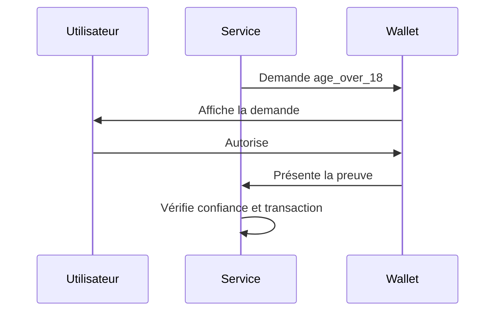

> [!info] Refonte
> Cours développé le 31 août 2026 (d'environ 650 à 14 376 mots  remplacement complet du texte précédent)  vérifié le même jour : schéma  titres  liens et affirmations datées contrôlés. La version précédente reste dans l'historique git du dépôt.

# Identité numérique européenne : eIDAS 2 et portefeuille EUDI

> [!abstract] Objectif
> Comprendre le cadre européen moderne de l'identité numérique : ce que change le règlement **(UE) 2024/1183**, ce qu'est réellement le **European Digital Identity Wallet (EUDI Wallet)**, quels acteurs interviennent, comment circulent les données d'identité et les attestations, quelles garanties juridiques et techniques sont prévues, et comment un service devra s'intégrer à cet écosystème.

Voir aussi : [[OAuth OpenID]], [[Règlement Général sur la Protection des Données (RGPD)]], [[Droits d'auteur]], [[HTTP]], [[Les protocoles de communications]], [[Sécurité avancée sous Linux]].

> [!important] Mise à jour 2026
> La version précédente de cette fiche datait d'août 2023, à une époque où le portefeuille européen était encore principalement décrit comme un **projet législatif et technique**.
>
> Depuis :
>
> - le règlement **(UE) 2024/1183** a été adopté ;
> - il est entré en vigueur le **20 mai 2024** ;
> - plusieurs règlements d'exécution ont fixé les règles techniques ;
> - l'Architecture and Reference Framework, ou **ARF**, a atteint la version **3.0.0 en juillet 2026** ;
> - les États membres doivent mettre à disposition au moins un portefeuille EUDI selon le calendrier prévu par les textes, avec un déploiement attendu **d'ici fin 2026**.

# 1. Le problème que cherche à résoudre l'Union européenne

Sur Internet, une personne doit constamment répondre à des questions comme :

```text
Qui êtes-vous ?
Êtes-vous majeur ?
Avez-vous le droit de conduire ?
Êtes-vous inscrit dans cette université ?
Êtes-vous diplômé ?
Résidez-vous dans ce pays ?
Êtes-vous habilité à exercer cette profession ?
Pouvez-vous signer juridiquement ce document ?
```

Aujourd'hui, ces preuves sont souvent fragmentées entre :

- comptes locaux ;
- mots de passe ;
- systèmes nationaux d'identité électronique ;
- FranceConnect ou équivalents ;
- cartes physiques ;
- scans de documents ;
- certificats électroniques ;
- bases administratives ;
- services privés de vérification d'identité.

Le résultat est souvent :

```text
beaucoup de comptes
+ beaucoup de copies de documents
+ des données partagées en excès
+ peu d'interopérabilité transfrontière
+ des parcours différents selon les pays
```

Le projet européen vise donc à créer un cadre où une personne peut :

1. obtenir des données d'identification fiables ;
2. recevoir des justificatifs numériques vérifiables ;
3. les conserver dans un portefeuille ;
4. présenter uniquement ce qui est nécessaire ;
5. les utiliser dans plusieurs États membres ;
6. signer électroniquement lorsque cela est nécessaire.

# 2. Ne pas confondre identité, authentification et attributs

Ces notions sont liées mais différentes.

## 2.1 Identité

Une **identité** représente une personne ou une organisation dans un contexte donné.

Exemples :

```text
nom
prénom
date de naissance
identifiant administratif
identité d'une société
```

## 2.2 Identification

L'identification répond à :

> Qui affirme être cette personne ?

## 2.3 Authentification

L'authentification répond plutôt à :

> Peut-elle prouver qu'elle contrôle bien le moyen associé à cette identité ?

Un mot de passe, une clé cryptographique ou une authentification biométrique locale peuvent participer à l'authentification.

## 2.4 Attribut

Un attribut décrit une propriété.

Exemples :

```text
âge = 25
nationalité = française
diplôme = master
permis_B = valide
statut_etudiant = vrai
```

## 2.5 Preuve d'attribut

Il n'est pas toujours nécessaire de transmettre l'identité complète.

Un service de vente réglementée peut avoir besoin de savoir :

```text
âge >= 18
```

sans avoir besoin de connaître :

```text
nom
adresse exacte
date de naissance complète
numéro de document
```

C'est une idée essentielle du portefeuille EUDI : **présenter la preuve utile plutôt que recopier systématiquement toute l'identité**.

# 3. eIDAS : le cadre historique

## 3.1 Le règlement de 2014

Le règlement **(UE) n° 910/2014**, appelé eIDAS pour :

> electronic IDentification, Authentication and trust Services

crée un cadre européen pour :

- l'identification électronique ;
- les signatures électroniques ;
- les cachets électroniques ;
- l'horodatage électronique ;
- l'envoi recommandé électronique ;
- l'authentification des sites web ;
- les prestataires de services de confiance.

Un objectif central était la reconnaissance transfrontière de moyens d'identification électronique notifiés par les États membres.

## 3.2 Une limite de la première version

Le premier eIDAS repose fortement sur des schémas nationaux et leur interconnexion.

Cela ne donne pas nécessairement à l'utilisateur un portefeuille dans lequel il peut :

```text
stocker plusieurs justificatifs
présenter des attributs choisis
utiliser les mêmes mécanismes dans de nombreux secteurs privés
signer directement depuis le portefeuille
```

D'où la révision du cadre.

# 4. Ce que l'on appelle « eIDAS 2.0 »

« eIDAS 2.0 » est une expression courante mais ce n'est pas le titre juridique exact du texte.

Le texte central est :

> **Règlement (UE) 2024/1183 du Parlement européen et du Conseil du 11 avril 2024 modifiant le règlement (UE) n° 910/2014 en ce qui concerne l'établissement du cadre européen relatif à une identité numérique.**

Il ne remplace donc pas entièrement eIDAS : il **modifie et étend** le règlement de 2014.

On rencontre aussi les expressions :

```text
European Digital Identity Regulation
EUDI Regulation
European Digital Identity Framework
cadre européen relatif à une identité numérique
```

# 5. Chronologie essentielle

| Date | Événement |
|---|---|
| 2014 | Adoption du règlement eIDAS initial, règlement (UE) n° 910/2014 |
| 2021 | Proposition de nouveau cadre européen d'identité numérique |
| 2021 | Recommandation (UE) 2021/946 lançant le travail sur une boîte à outils commune |
| 2023 | Lancement de grands pilotes européens EUDI |
| 11 avril 2024 | Adoption du règlement (UE) 2024/1183 |
| 30 avril 2024 | Publication au Journal officiel de l'UE |
| 20 mai 2024 | Entrée en vigueur du nouveau cadre |
| 28 novembre 2024 | Adoption par la Commission d'un premier ensemble de règles techniques pour les wallets |
| décembre 2024 | Publication des principaux règlements d'exécution du cœur du wallet |
| 6 mai 2025 | Adoption du règlement d'exécution (UE) 2025/848 sur l'enregistrement des parties utilisatrices |
| juillet 2025 | Publication d'un blueprint européen de vérification d'âge respectueuse de la vie privée |
| 2025-2026 | Poursuite des spécifications, pilotes, normalisation et implémentations de référence |
| juillet 2026 | Publication de l'ARF 3.0.0 |
| fin 2026 | Échéance politique et réglementaire de mise à disposition des wallets nationaux |
| 24 décembre 2026 | Date d'application prévue du règlement 2025/848 sur l'enregistrement des parties utilisatrices |

> [!note]
> Le calendrier juridique exact dépend des dates d'entrée en vigueur et d'application des différents actes d'exécution. Il ne faut donc pas réduire le déploiement à une seule date.

# 6. Qu'est-ce qu'un EUDI Wallet ?

EUDI signifie :

> **European Digital Identity**

Un **European Digital Identity Wallet** est une solution de portefeuille d'identité numérique conforme au cadre européen.

Il doit permettre à l'utilisateur, selon les cas, de :

- s'identifier ;
- s'authentifier ;
- obtenir des données d'identification personnelles ;
- obtenir des attestations d'attributs ;
- conserver ces données ;
- les présenter à un service ;
- présenter seulement certains attributs ;
- utiliser le portefeuille en ligne ;
- utiliser certains justificatifs en proximité ;
- signer électroniquement ;
- gérer l'historique et le cycle de vie de ses justificatifs.

Le portefeuille n'est donc pas simplement :

```text
une photo de carte d'identité dans une application
```

Il repose sur :

```text
preuves cryptographiques
+ émetteurs identifiés
+ règles de confiance
+ formats interopérables
+ protocoles communs
+ certification
```

# 7. Un portefeuille européen, mais pas une application unique européenne

Il est fréquent d'imaginer :

```text
Commission européenne
        │
        ▼
une application unique pour tous les Européens
```

Ce n'est pas le modèle retenu.

Chaque État membre doit fournir **au moins une solution EUDI Wallet**.

Une solution peut être fournie :

- directement par l'État membre ;
- sous mandat d'un État membre ;
- indépendamment mais reconnue par un État membre, selon les conditions du règlement.

L'interopérabilité doit venir du cadre commun :

```text
Wallet français ─────┐
Wallet allemand ─────┼── mêmes règles d'interopérabilité ── service européen
Wallet italien ──────┤
Wallet finlandais ───┘
```

# 8. Utilisation volontaire

Le règlement prévoit que l'utilisation du portefeuille par une personne reste **volontaire**.

Cela implique une distinction importante :

```text
État membre : obligation de proposer un wallet conforme
Utilisateur : pas d'obligation générale de l'utiliser
```

Un utilisateur doit pouvoir décider d'utiliser ou non cette voie d'identification, sous réserve des règles particulières applicables au service concerné.

# 9. Les acteurs de l'écosystème

L'EUDI Wallet n'est pas une relation à deux acteurs.

Il faut comprendre au minimum :

```text
Utilisateur
Wallet Provider
PID Provider
Attestation Provider
Relying Party
Trust Service Provider
Authentic Source
Registre / Trust List / LoTE
```

# 10. Wallet User

Le **Wallet User** est la personne qui contrôle son unité de portefeuille.

Dans l'usage courant :

```text
citoyen
résident
représentant d'une personne morale
```

Le modèle insiste sur le contrôle par l'utilisateur du processus de présentation.

# 11. Wallet Provider

Le **Wallet Provider** fournit la solution de portefeuille.

Il est responsable de la conformité de cette solution.

Le provider doit notamment permettre que l'unité de wallet atteigne les exigences de sécurité et le niveau de garantie attendu.

Dans l'ARF, le portefeuille s'appuie sur plusieurs composants, et le Wallet Provider est responsable de leur intégration cohérente.

# 12. Wallet Unit

Une **Wallet Unit** représente l'environnement concret contrôlé par un utilisateur.

Conceptuellement :

```text
┌──────────────────────────────┐
│ Wallet Unit                  │
│                              │
│  Wallet Instance             │
│  données / attestations      │
│  clés / fonctions crypto     │
│  composant sécurisé          │
│  attestations du wallet      │
└──────────────────────────────┘
```

Le vocabulaire exact est important dans les spécifications techniques.

# 13. Wallet Secure Cryptographic Device

Le portefeuille doit protéger des opérations cryptographiques sensibles.

L'ARF parle notamment de :

```text
WSCD = Wallet Secure Cryptographic Device
```

Le WSCD peut s'appuyer sur une technologie matérielle ou logicielle répondant aux exigences de sécurité applicables.

L'idée générale est de ne pas traiter les clés privées sensibles comme de simples chaînes copiables dans un fichier ordinaire.

# 14. Wallet Unit Attestation

Une **Wallet Unit Attestation**, souvent abrégée **WUA**, permet d'attester des propriétés de l'unité de wallet.

Elle participe à la confiance accordée au portefeuille lui-même.

Cela permet aux autres acteurs de raisonner sur :

```text
ce wallet est-il authentique ?
provient-il d'une solution reconnue ?
respecte-t-il les exigences attendues ?
```

# 15. Person Identification Data — PID

Le **PID**, ou **Person Identification Data**, correspond aux données d'identification personnelle de référence associées à l'utilisateur.

On peut le voir comme le socle d'identité du portefeuille.

Exemples conceptuels :

```text
nom
prénom
date de naissance
identifiant ou données nationales pertinentes
```

Le contenu exact est encadré par les spécifications et les règles applicables.

Le PID ne doit pas être confondu avec toutes les attestations que le wallet peut stocker.

# 16. Electronic Attestation of Attributes — EAA

Une **Electronic Attestation of Attributes** prouve un ou plusieurs attributs.

Exemples :

```text
permis de conduire valide
étudiant à l'université X
diplôme Y
qualification professionnelle Z
âge supérieur à 18 ans
adresse
statut social
```

Le portefeuille peut contenir plusieurs catégories d'attestations.

# 17. EAA non qualifiée

Une EAA non qualifiée peut être émise par un fournisseur qui n'est pas nécessairement un prestataire de confiance qualifié.

La confiance doit donc être établie par des mécanismes adaptés au type d'attestation.

Il ne faut pas en déduire :

```text
signature cryptographique = vérité juridique absolue
```

Une signature prouve surtout que :

```text
quelqu'un contrôlant une clé donnée a signé des données données
```

La question suivante reste :

> Pourquoi faisons-nous confiance à cet émetteur pour cet attribut précis ?

# 18. QEAA

**QEAA** signifie :

> Qualified Electronic Attestation of Attributes

Une QEAA est fournie par un **Qualified Trust Service Provider**, ou QTSP.

Le statut qualifié ajoute un cadre réglementaire et de supervision plus fort.

Exemple conceptuel :

```text
Attestation
    │
    ├── attributs
    ├── identité / statut de l'émetteur
    ├── preuve cryptographique
    └── chaîne de confiance qualifiée
```

# 19. PuB-EAA

L'ARF distingue également les attestations émises par ou pour un organisme public responsable d'une **source authentique**.

On rencontre l'abréviation :

```text
PuB-EAA
```

Ce mécanisme vise notamment les attributs dont la valeur de référence provient d'une source publique authentique.

# 20. Authentic Source

Une **Authentic Source** est une source de référence faisant autorité pour certaines informations.

Exemples conceptuels :

```text
registre d'état civil
registre d'entreprise
registre de diplôme
registre professionnel
base officielle de permis
```

Le wallet n'a pas vocation à devenir lui-même la source de vérité de toutes ces données.

Il transporte ou présente des preuves issues d'acteurs autorisés.

# 21. Relying Party

Une **Relying Party** est une organisation ou un service qui demande et vérifie des informations provenant du wallet.

Exemples :

```text
administration
banque
université
hôtel
opérateur télécom
loueur de véhicules
plateforme en ligne
employeur
```

En français juridique, on rencontre l'expression :

> partie utilisatrice du portefeuille

# 22. Un Relying Party ne doit pas demander arbitrairement toutes les données

Le modèle européen prévoit l'enregistrement des parties utilisatrices et de leurs usages déclarés.

Le règlement d'exécution **(UE) 2025/848** encadre notamment :

- les registres nationaux de parties utilisatrices ;
- les informations d'identification de ces parties ;
- leurs usages déclarés ;
- les catégories de données qu'elles prévoient de demander ;
- les certificats associés à l'accès et à l'enregistrement.

L'idée est importante :

```text
Relying Party
    │
    ├── identité connue
    ├── usage déclaré
    └── données qu'elle prévoit de demander
```

plutôt que :

```text
site inconnu → donne-moi toutes tes données
```

# 23. Registre national des Relying Parties

Le règlement 2025/848 prévoit que les États membres établissent et maintiennent au moins un registre national des parties utilisatrices.

Ces registres doivent permettre de publier les informations nécessaires sous une forme :

- lisible par l'humain ;
- exploitable par machine ;
- accessible notamment via une API commune selon les règles prévues.

Le règlement 2025/848 doit s'appliquer à partir du **24 décembre 2026**.

# 24. Services de confiance

L'identité numérique européenne ne se réduit pas au wallet.

Le cadre eIDAS couvre les **trust services**, ou services de confiance.

Ils servent à donner une valeur technique et juridique à différentes opérations numériques.

# 25. Signatures électroniques

Le règlement maintient les distinctions classiques :

```text
signature électronique
signature électronique avancée
signature électronique qualifiée
```

Une **Qualified Electronic Signature**, ou QES, bénéficie du niveau juridique le plus élevé dans le cadre eIDAS.

Une signature électronique qualifiée a l'effet juridique d'une signature manuscrite dans l'Union selon le règlement.

# 26. Signature qualifiée gratuite pour les personnes physiques

Le règlement 2024/1183 prévoit que les personnes physiques puissent signer, par défaut et gratuitement, au moyen d'une signature électronique qualifiée via le wallet.

Les États membres peuvent encadrer cette gratuité afin de la limiter aux usages **non professionnels**.

C'est une évolution majeure.

Le wallet ne sert donc pas seulement à :

```text
se connecter
```

mais aussi potentiellement à :

```text
signer juridiquement un document
```

# 27. Cachets électroniques

Un **electronic seal** est principalement destiné aux personnes morales.

On peut simplifier ainsi :

```text
signature électronique → personne physique
cachet électronique    → personne morale / organisation
```

Cette simplification aide à mémoriser la différence, même si les règles juridiques précises doivent être consultées pour un cas réel.

# 28. Autres services de confiance

Le cadre comprend ou étend notamment :

- horodatage électronique ;
- envoi recommandé électronique ;
- authentification de sites web ;
- attestations électroniques d'attributs ;
- archivage électronique ;
- registres électroniques.

> [!warning]
> Cette fiche est un cours d'informatique et d'architecture, pas un avis juridique. Pour qualifier un service comme « qualifié » ou déterminer une obligation légale précise, il faut revenir au règlement consolidé et aux actes d'exécution applicables.

# 29. Le principe de divulgation sélective

Le wallet doit permettre de limiter ce qui est transmis.

Supposons qu'un service veuille uniquement vérifier :

```text
âge >= 18
```

Le mauvais modèle serait :

```json
{
  "nom": "Alice Martin",
  "date_naissance": "1999-04-03",
  "adresse": "...",
  "nationalite": "FR",
  "numero_document": "..."
}
```

alors que le service n'a besoin que de :

```json
{
  "age_over_18": true
}
```

La réduction de données est cohérente avec le principe de minimisation du [[Règlement Général sur la Protection des Données (RGPD)]].

# 30. Divulgation sélective ne signifie pas anonymat total

C'est un piège fréquent.

Même si un format permet de présenter seulement certains attributs, il reste possible de créer des corrélations par :

- métadonnées ;
- identifiants stables ;
- valeurs uniques ;
- clés publiques ;
- signatures ;
- habitudes d'utilisation ;
- informations réseau ;
- collusion entre services.

L'ARF traite explicitement le risque de **linkability**.

Le bon raisonnement est donc :

```text
data minimisation ≠ anonymat automatique
selective disclosure ≠ unlinkability garantie
```

# 31. Unlinkability

L'**unlinkability** signifie qu'un service ne devrait pas pouvoir relier facilement plusieurs présentations entre elles afin de conclure qu'elles proviennent du même utilisateur, lorsque ce lien n'est pas nécessaire.

C'est une propriété importante mais techniquement difficile.

Exemple de menace :

```text
présentation A ─┐
présentation B ─┼── même valeur technique stable → corrélation
présentation C ─┘
```

Les formats et protocoles doivent donc éviter autant que possible les identifiants corrélables inutiles.

# 32. Consentement et contrôle utilisateur

Le wallet doit présenter à l'utilisateur les informations nécessaires avant une divulgation.

Un flux sain ressemble à :

```text
service demande des attributs
        │
        ▼
wallet identifie le service
        │
        ▼
wallet affiche ce qui est demandé
        │
        ▼
utilisateur approuve ou refuse
        │
        ▼
wallet présente les données autorisées
```

Le wallet ne doit pas devenir un mécanisme invisible d'exfiltration d'attributs.

# 33. Niveau de garantie élevé

Le cadre exige un haut niveau de confiance pour le portefeuille.

L'ARF vise un **Level of Assurance high** pour la Wallet Unit.

Cela entraîne des exigences sur :

- l'enrôlement ;
- les clés ;
- les composants sécurisés ;
- l'authentification ;
- le cycle de vie ;
- la certification ;
- la résistance à certaines attaques.

# 34. Architecture simplifiée de l'écosystème

```text
                         ┌────────────────────┐
                         │ Authentic Sources  │
                         └──────────┬─────────┘
                                    │
                   vérifie / obtient│des attributs
                                    ▼
┌───────────────┐           ┌────────────────────┐
│ PID Provider  │           │ EAA / QEAA Provider│
└───────┬───────┘           └──────────┬─────────┘
        │                               │
        │ délivrance                    │ délivrance
        ▼                               ▼
┌───────────────────────────────────────────────┐
│                   Wallet Unit                 │
│                                               │
│ PID │ attestations │ clés │ consentement      │
└───────────────────────┬───────────────────────┘
                        │ présentation
                        ▼
              ┌──────────────────────┐
              │    Relying Party     │
              └──────────────────────┘
```

# 35. Trois familles d'opérations

On peut regrouper les opérations du wallet en :

```text
1. émission / issuance
2. présentation / presentation
3. signature / signing
```

Ces opérations n'utilisent pas forcément le même protocole.

# 36. Issuance

L'**issuance** est le processus par lequel le wallet reçoit un PID ou une attestation d'un émetteur.

Flux conceptuel :

```text
Wallet              Issuer
  │                    │
  │ demande credential │
  ├───────────────────►│
  │                    │ vérifie identité / droit
  │                    │ construit attestation
  │ credential signé   │
  │◄───────────────────┤
  │ vérifie signature  │
  │ demande accord     │
  │ stocke             │
```

# 37. Presentation

La **presentation** est le processus par lequel le wallet transmet certains attributs à une Relying Party.

```text
Relying Party         Wallet
     │                  │
     │ demande          │
     ├─────────────────►│
     │                  │ vérifie la demande
     │                  │ informe utilisateur
     │                  │ consentement
     │ présentation     │
     │◄─────────────────┤
     │ vérifie preuve   │
```

# 38. Présentation à distance

Une présentation distante peut avoir lieu :

- sur le même appareil ;
- entre deux appareils ;
- via navigateur ;
- via redirection ;
- via API d'identifiants numériques lorsque le profil l'autorise.

Les spécifications EUDI utilisent notamment **OpenID4VP** pour les présentations distantes.

# 39. Présentation en proximité

Certaines attestations doivent fonctionner face à face, sans service web classique.

Exemple :

```text
contrôle d'un permis de conduire mobile
```

Le standard **ISO/IEC 18013-5** joue un rôle central pour le mobile driving licence, ou mDL.

# 40. OpenID4VCI

**OpenID for Verifiable Credential Issuance**, souvent écrit :

```text
OpenID4VCI
OID4VCI
```

définit un protocole pour l'émission de credentials vers un wallet.

La version de référence actuelle utilisée dans l'écosystème EUDI est **OpenID4VCI 1.0**.

Il s'appuie sur des concepts proches d'[[OAuth OpenID]] :

```text
authorization endpoint
token endpoint
credential endpoint
metadata
proof
```

## 40.1 Rôle du wallet

Dans un flux OpenID4VCI, le wallet agit notamment comme client vis-à-vis de l'émetteur.

## 40.2 Credential Offer

Un émetteur peut proposer au wallet de récupérer un credential.

Conceptuellement :

```text
Issuer
  │
  │ Credential Offer
  ▼
Wallet
  │
  │ autorisation
  ▼
Issuer
  │
  │ credential
  ▼
Wallet
```

# 41. OpenID4VP

**OpenID for Verifiable Presentations** définit des mécanismes de présentation de credentials à un vérificateur.

On écrit souvent :

```text
OpenID4VP
OID4VP
```

Dans l'écosystème EUDI, OpenID4VP est central pour les présentations distantes.

# 42. OpenID4VCI et OpenID4VP ne sont pas la même chose

À mémoriser :

```text
OpenID4VCI
    Issuer ─────► Wallet
    délivrer

OpenID4VP
    Wallet ─────► Verifier / Relying Party
    présenter
```

# 43. HAIP

**HAIP** signifie :

> High Assurance Interoperability Profile

Il s'agit d'un profil de l'écosystème OpenID4VC destiné à réduire les variations possibles et à obtenir une interopérabilité adaptée à des environnements à forte assurance.

L'ARF actuel référence **HAIP 1.0**.

# 44. DCQL

**Digital Credentials Query Language**, ou **DCQL**, permet à un vérificateur d'exprimer les credentials et attributs qu'il demande dans les flux OpenID4VP modernes.

Conceptuellement :

```json
{
  "credentials": [
    {
      "id": "age_proof",
      "format": "...",
      "claims": ["age_over_18"]
    }
  ]
}
```

Le JSON exact dépend du protocole et du profil utilisés.

# 45. Les formats ne sont pas les protocoles

Il faut distinguer :

```text
protocole = comment les acteurs communiquent
format    = comment le credential est représenté
```

Par exemple :

```text
OpenID4VCI ── peut transporter ──► mso_mdoc
                                └─► SD-JWT VC

OpenID4VP  ── peut présenter ─────► mso_mdoc
                                └─► SD-JWT VC
```

# 46. mso_mdoc

Le format **mso_mdoc** est issu de la famille ISO/IEC 18013-5.

Il a été conçu autour du mobile driving licence mais sert plus largement de format de credential dans l'écosystème EUDI.

Il utilise notamment :

- CBOR ;
- signatures ;
- Mobile Security Object ;
- mécanismes de device binding ;
- divulgation de données sélectionnées.

# 47. SD-JWT VC

**SD-JWT VC** signifie :

> Selective Disclosure JSON Web Token based Verifiable Credential

Il s'agit d'un format permettant la divulgation sélective de claims dans un environnement JSON/JWT.

Idée simplifiée :

```text
Issuer signe une structure
       │
       ├── claim A
       ├── claim B
       ├── claim C
       └── mécanismes de divulgation

Utilisateur présente seulement A et C
```

> [!warning]
> En 2026, le document SD-JWT VC référencé par les outils EUDI reste un travail de normalisation IETF en évolution. Il faut vérifier la version exacte exigée par le profil EUDI au moment de développer un produit.

# 48. Device binding

Un credential peut être lié cryptographiquement à une unité de wallet ou à une clé contrôlée par cette unité.

Cela vise à éviter le scénario :

```text
Alice copie simplement le credential signé
                  │
                  ▼
Bob le présente comme s'il était Alice
```

Le mécanisme dépend du format :

```text
ISO mdoc   → mdoc authentication / device binding
SD-JWT VC  → key binding
```

# 49. Digital Credentials API

Les navigateurs et systèmes d'exploitation travaillent également sur des API permettant aux sites web de demander des identifiants numériques à un wallet.

Dans l'architecture EUDI, la **Digital Credentials API** peut intervenir dans certains flux.

Il ne faut cependant pas supposer :

```text
EUDI Wallet = dépendance obligatoire à une API propriétaire de navigateur
```

L'ARF prévoit également des mécanismes basés sur redirection et OpenID4VP.

# 50. ISO/IEC 18013-7

ISO/IEC 18013-7 complète les scénarios du permis mobile avec des fonctions de présentation à distance.

L'écosystème EUDI combine donc plusieurs familles de standards :

```text
ISO
ETSI
OpenID Foundation
IETF
W3C / Web APIs selon les usages
```

# 51. EUDI n'est pas simplement « W3C Verifiable Credentials »

C'est une simplification trop forte.

L'implémentation de référence EUDI actuelle supporte notamment :

```text
mso_mdoc
SD-JWT VC
```

Le service de référence d'émission indique explicitement que W3C VC Data Model n'est pas son format pris en charge par défaut dans ce profil.

Donc :

```text
verifiable credential au sens générique
        ≠
obligatoirement W3C VC Data Model
```

# 52. Trust anchors

Pour vérifier une signature, posséder la clé publique brute ne suffit pas toujours.

Il faut savoir :

```text
qui contrôle cette clé ?
pour quel rôle ?
cette autorité est-elle encore valide ?
peut-elle émettre ce type d'attestation ?
```

L'écosystème EUDI utilise des mécanismes de listes de confiance et de **trust anchors**.

# 53. Trusted Lists et LoTEs

L'ARF 3.0.0 introduit et consolide notamment l'usage de :

```text
Trusted Lists
LoTEs = Lists of Trusted Entities
```

avec des références ETSI telles que :

```text
ETSI TS 119 612
ETSI TS 119 602
```

Le but est de distribuer de manière fiable les ancres de confiance nécessaires aux wallets, émetteurs et vérificateurs.

# 54. Vérifier un credential

Une vérification sérieuse ne consiste pas à faire :

```python
if signature_is_valid:
    accept()
```

Il faut potentiellement vérifier :

```text
signature
algorithme autorisé
chaîne de confiance
statut de l'émetteur
credential attendu
claims demandés
validité temporelle
révocation / statut
binding au wallet
contexte de présentation
identité de la Relying Party
```

# 55. Algorithmes cryptographiques

L'ARF ne laisse pas chaque implémentation choisir n'importe quel algorithme historique.

Il se réfère à des mécanismes cryptographiques agréés au niveau européen.

Une application EUDI ne doit donc pas raisonner ainsi :

```text
la bibliothèque supporte RSA-SHA1 → je peux l'utiliser
```

mais plutôt :

```text
le profil EUDI autorise-t-il cet algorithme ?
```

# 56. Certification

Une solution EUDI Wallet n'est pas considérée conforme simplement parce qu'elle :

```text
compile
+ parle OpenID4VP
+ affiche une carte
```

Le cadre prévoit des mécanismes de certification et d'évaluation.

Cela couvre notamment :

- sécurité ;
- conformité aux exigences ;
- composants critiques ;
- cycle de vie ;
- interopérabilité.

# 57. Functional Conformance Assessment Framework

L'ARF 3.0.0 introduit une section dédiée au :

```text
FCAF
Functional Conformance Assessment Framework
```

Le FCAF fournit des cas de test fonctionnels communs.

Une plateforme publique de conformité est publiée sur :

```text
https://conformance.eudi.dev/
```

> [!important]
> La conformité fonctionnelle ne remplace pas l'évaluation de sécurité. Ce sont deux dimensions différentes.

# 58. Architecture and Reference Framework — ARF

L'**Architecture and Reference Framework** est le document technique central de l'écosystème EUDI.

Il décrit notamment :

- les acteurs ;
- l'architecture ;
- les flux ;
- les formats ;
- les protocoles ;
- les exigences de sécurité ;
- les exigences de confidentialité ;
- les trust anchors ;
- les cas d'usage ;
- les règles d'interopérabilité.

Ce n'est pas à lui seul le règlement juridique.

Il faut distinguer :

```text
règlement européen
        │ fixe le droit
        ▼
règlements d'exécution
        │ fixent des modalités obligatoires
        ▼
ARF / standards / spécifications
        │ décrivent l'architecture et les profils techniques
        ▼
implémentations
```

# 59. ARF 3.0.0

La version **3.0.0**, publiée en juillet 2026, aligne l'architecture avec les dernières modifications des règlements d'exécution et introduit notamment le FCAF.

Elle prend en compte :

- les évolutions PID/EAA ;
- les fonctions cœur du wallet ;
- les notifications d'écosystème ;
- les protocoles et interfaces ;
- l'enregistrement des Relying Parties ;
- les interactions wallet-to-wallet ;
- les nouvelles règles de récupération des trust anchors.

# 60. Les principaux règlements d'exécution du wallet

Le premier noyau de règles techniques adopté fin 2024 comprend notamment :

| Règlement | Sujet résumé |
|---|---|
| (UE) 2024/2977 | Person Identification Data et Electronic Attestations of Attributes |
| (UE) 2024/2979 | Intégrité et fonctionnalités essentielles du wallet |
| (UE) 2024/2980 | Notifications dans l'écosystème |
| (UE) 2024/2981 | Certification des solutions de wallet |
| (UE) 2024/2982 | Protocoles et interfaces |

À cela s'ajoute notamment :

| Règlement | Sujet |
|---|---|
| (UE) 2025/848 | Enregistrement des parties utilisatrices de wallet |

En 2026, des règlements d'exécution modificatifs ont encore fait évoluer ce socle, notamment :

```text
(UE) 2026/1730
(UE) 2026/1731
(UE) 2026/1735
```

> [!tip]
> Pour un développement réel, ne recopier jamais cette liste dans le code comme si elle était figée. Utiliser les textes consolidés, les versions courantes de l'ARF et les profils de conformité.

# 61. Exemple : prouver que l'on a plus de 18 ans

Un utilisateur veut accéder à un service qui exige seulement la majorité.

## Mauvais parcours

```text
service
  │
  │ « envoyez une copie de votre carte d'identité »
  ▼
utilisateur envoie :
nom + prénom + photo + date de naissance + numéro + adresse...
```

## Parcours cible

```text
service
  │ demande « age_over_18 »
  ▼
wallet
  │ affiche la demande
  │ utilisateur accepte
  ▼
preuve : age_over_18 = true
```

Le service reçoit moins de données.

# 62. Blueprint européen de vérification d'âge

En juillet 2025, la Commission a publié une première version d'un **blueprint européen de vérification d'âge**.

L'objectif est de permettre de prouver un seuil d'âge sans dévoiler inutilement l'identité complète.

Les premiers pays annoncés pour expérimenter cette solution incluent :

```text
Danemark
France
Grèce
Italie
Espagne
```

Cette solution est conçue pour être compatible avec le futur écosystème EUDI.

# 63. Exemple : ouverture d'un compte bancaire

Une banque doit effectuer des vérifications réglementaires.

Flux conceptuel :

```text
Banque                       Wallet
  │                            │
  │ demande PID + attributs    │
  ├───────────────────────────►│
  │                            │ utilisateur vérifie
  │                            │ et approuve
  │ présentation signée        │
  │◄───────────────────────────┤
  │ vérifie émetteurs          │
  │ vérifie validité           │
  │ poursuit le KYC            │
```

Le wallet ne supprime pas toutes les obligations KYC de la banque.

Il fournit un canal d'identité et d'attestations fiables.

# 64. Exemple : diplôme

Une université peut émettre une attestation :

```json
{
  "degree": "Master",
  "field": "Informatique",
  "issuer": "Université X",
  "graduation_year": 2026
}
```

Un employeur peut ensuite vérifier :

```text
signature
émetteur
validité
attribut demandé
```

sans demander un scan PDF non vérifiable.

# 65. Exemple : permis de conduire mobile

Le mobile driving licence est un cas important parce qu'il combine :

- identité ;
- credential mobile ;
- présentation en proximité ;
- présentation distante ;
- ISO/IEC 18013-5 ;
- ISO/IEC 18013-7 ;
- OpenID4VP selon le flux.

# 66. Exemple : prescription médicale

Le wallet peut participer à un scénario où une prescription est présentée de manière transfrontière.

Cela ne signifie pas que toutes les données de santé deviennent automatiquement stockées localement dans le wallet.

Il faut distinguer :

```text
preuve / attestation
        ≠
dossier médical complet
```

# 67. Exemple : signature électronique qualifiée

Un utilisateur reçoit un contrat.

```text
contrat
   │
   ▼
service de signature
   │ demande authentification / autorisation
   ▼
wallet
   │ utilisateur confirme
   ▼
QES
   │
   ▼
document signé
```

L'ARF 3.0 contient plusieurs parcours autour de la QES, y compris des scénarios locaux et distants.

# 68. Pilotes européens

Avant le déploiement généralisé, la Commission a financé de grands pilotes pour tester l'écosystème.

Parmi les premiers grands consortiums :

```text
POTENTIAL
EWC
NOBID
DC4EU
```

Ils ont testé différents usages dans de nombreux pays et organisations.

# 69. Cas d'usage testés par les pilotes

Les pilotes ont notamment couvert :

- services publics ;
- ouverture de compte bancaire ;
- enregistrement de carte SIM ;
- permis de conduire mobile ;
- signature électronique ;
- prescription électronique ;
- paiements ;
- éducation ;
- sécurité sociale ;
- justificatifs de voyage.

# 70. Implémentation de référence

La Commission soutient une **EUDI Wallet Reference Implementation** open source.

Elle sert à :

- expérimenter ;
- valider les spécifications ;
- fournir des bibliothèques ;
- construire des wallets de démonstration ;
- construire des issuers ;
- construire des verifiers ;
- tester l'interopérabilité.

Documentation :

```text
https://docs.eudi.dev/
```

# 71. Ne pas confondre référence et produit de production

Une implémentation de référence sert à démontrer et tester le cadre.

Elle n'est pas nécessairement :

```text
un service clé en main
+ certifié
+ durci
+ exploitable directement en production
```

La documentation du verifier de référence précise d'ailleurs que certains aspects d'exploitation ne sont pas traités comme ils le seraient dans un produit de production.

# 72. Relying Party : architecture d'intégration

Un service qui souhaite accepter un wallet peut avoir une architecture comme :

```text
┌───────────────┐
│ Application   │
└───────┬───────┘
        │
        ▼
┌─────────────────┐
│ Backend / RP    │
│ OpenID4VP       │
└───────┬─────────┘
        │ request
        ▼
┌─────────────────┐
│ EUDI Wallet     │
└───────┬─────────┘
        │ vp_token / présentation
        ▼
┌─────────────────┐
│ Verifier        │
│ validation      │
└─────────────────┘
```

# 73. HTTPS reste obligatoire

Les protocoles cryptographiques du wallet ne dispensent pas de sécuriser le transport réseau.

Un verifier distant doit être exposé sur HTTPS.

Donc :

```text
credential signé
        +
TLS correctement configuré
        +
authentification de la Relying Party
        +
validation stricte
```

# 74. Ne jamais faire confiance aux claims avant validation

Anti-pattern :

```python
payload = decode_without_verification(token)
if payload["age_over_18"]:
    allow_access()
```

Cette logique est dangereuse.

Il faut d'abord vérifier la preuve et le contexte.

Pseudo-code conceptuel :

```python
presentation = verifier.verify(response)

if not presentation.is_valid:
    deny()

if presentation.issuer_not_trusted:
    deny()

if not presentation.matches_request:
    deny()

if presentation.claim("age_over_18") is True:
    allow()
```

# 75. Validation du contexte

Même une présentation cryptographiquement correcte doit être liée à la transaction attendue.

Sinon, une présentation pourrait être :

```text
capturée dans transaction A
puis rejouée dans transaction B
```

Les protocoles modernes utilisent notamment :

- nonce ;
- state ;
- audience ;
- client identifiers ;
- binding cryptographique ;
- contexte de session.

# 76. Replay attacks

Une attaque de rejeu consiste à réutiliser un message valide hors de son contexte initial.

```text
Utilisateur ── preuve valide ──► Service
                    │
                    └── attaquant la copie
                              │
                              ▼
                        rejeu ultérieur
```

Le protocole doit empêcher que la même preuve soit acceptée comme nouvelle transaction lorsque cela n'est pas prévu.

# 77. Relying Party authentication

Le wallet doit savoir à qui il transmet les données.

L'écosystème utilise notamment des certificats associés aux parties utilisatrices.

Cela permet d'éviter le modèle :

```text
« je suis banque.example »
        │
        └── aucune preuve
```

# 78. Enregistrement et certificats de Relying Party

Le règlement 2025/848 définit notamment :

```text
wallet-relying party access certificate
wallet-relying party registration certificate
```

Ces objets n'ont pas exactement le même rôle.

L'un contribue à authentifier l'accès de la partie utilisatrice ; l'autre peut décrire son enregistrement et ses usages déclarés.

# 79. Privacy policy

L'enregistrement des parties utilisatrices prévoit également des informations liées à l'usage déclaré et à la politique de confidentialité.

Un bon service doit pouvoir expliquer :

```text
qui demande ?
pourquoi ?
quels attributs ?
combien de temps sont-ils conservés ?
quelle base légale ?
```

Le wallet ne remplace pas les obligations du [[Règlement Général sur la Protection des Données (RGPD)]].

# 80. eIDAS et RGPD sont complémentaires

Le RGPD répond notamment à :

```text
pourquoi traiter une donnée ?
quelle base légale ?
combien de temps ?
quels droits pour la personne ?
```

eIDAS / EUDI répond notamment à :

```text
comment identifier ?
comment vérifier ?
comment établir la confiance ?
comment rendre les identités interopérables ?
```

Les deux cadres doivent être appliqués ensemble.

# 81. Le consentement n'est pas toujours la base légale RGPD

Attention à une confusion fréquente.

Le fait que le wallet demande à l'utilisateur d'approuver une présentation ne signifie pas automatiquement que :

```text
consentement UI du wallet
        =
consentement comme base légale RGPD
```

Un traitement peut reposer sur une autre base légale.

La confirmation du wallet contrôle la divulgation technique ; la base légale RGPD est une question juridique distincte.

# 82. Le wallet ne doit pas devenir un identifiant universel de traçage

Une mauvaise conception serait :

```text
un identifiant permanent unique
utilisé par tous les sites
        │
        ▼
profilage inter-services trivial
```

L'architecture cherche au contraire à réduire les possibilités de corrélation injustifiée.

# 83. Données locales et composants distants

« Wallet sur téléphone » ne veut pas dire que tout est nécessairement calculé ou stocké uniquement sur le téléphone.

Une solution peut combiner :

```text
Wallet Instance locale
secure hardware local
services provider distants
services de confiance distants
HSM distants selon architecture
issuers distants
```

La sécurité doit être analysée au niveau de l'ensemble de la solution.

# 84. Biométrie

La biométrie peut être utilisée localement pour déverrouiller un téléphone ou autoriser une opération.

Il faut distinguer :

```text
biométrie locale de déverrouillage
        ≠
attribut biométrique envoyé au service
```

Un service n'a pas besoin de recevoir l'empreinte digitale de l'utilisateur simplement parce que le wallet est déverrouillé par empreinte.

# 85. Perte du téléphone

Un wallet sérieux doit prévoir le cycle de vie :

```text
activation
utilisation
mise à jour
suspension éventuelle
révocation
perte
remplacement de terminal
récupération
```

La récupération ne doit pas affaiblir le niveau de sécurité au point de rendre l'identité facilement détournable.

# 86. Révocation et statut

Une attestation peut devenir invalide avant sa date d'expiration.

Exemple :

```text
permis suspendu
diplôme révoqué pour fraude
habilitation professionnelle retirée
credential compromis
```

Les systèmes doivent donc prévoir des mécanismes de statut ou de révocation adaptés.

# 87. Expiration

Même en l'absence de révocation, un credential peut avoir :

```text
issued_at
valid_from
valid_until
```

Le verifier doit contrôler ces contraintes.

# 88. Mise à jour d'attribut

Une identité numérique n'est pas statique.

Exemples :

```text
changement de nom
changement d'adresse
nouveau permis
nouveau statut professionnel
expiration d'une carte
```

Le wallet doit gérer le cycle de vie des attestations, pas seulement leur import initial.

# 89. Personnes morales

Le cadre couvre également des usages pour les personnes morales et leurs représentants.

Exemple :

```text
Alice
  │ agit au nom de
  ▼
Entreprise X
```

Il faut alors pouvoir prouver :

```text
identité d'Alice
+ identité de l'entreprise
+ pouvoir ou rôle d'Alice
```

# 90. Représentation

Un cas complexe est la représentation :

```text
parent → enfant
salarié → entreprise
mandataire → personne
avocat → client
```

Une identité numérique moderne doit permettre de distinguer :

```text
qui est la personne ?
au nom de qui agit-elle ?
avec quel pouvoir ?
```

# 91. Identité pseudonyme

Le règlement protège également l'usage de pseudonymes lorsqu'aucune règle spécifique n'impose l'identification réelle.

C'est important :

```text
identité numérique forte
        ≠
obligation de montrer son identité civile partout
```

# 92. Authentification sans mot de passe

Un wallet peut permettre des parcours sans mot de passe classique.

Mais il ne faut pas simplifier en :

```text
EUDI = Passkey
```

Les passkeys/WebAuthn et l'EUDI Wallet répondent à des problèmes différents, même s'ils peuvent coexister.

## 92.1 Passkey

Une passkey prouve principalement :

```text
je contrôle un authenticator enregistré pour ce service
```

## 92.2 Wallet

Un wallet peut prouver :

```text
mon identité
mon âge
mon permis
mon diplôme
une qualité professionnelle
```

# 93. EUDI et OpenID Connect

[[OAuth OpenID|OpenID Connect]] reste très utilisé pour l'authentification web classique.

EUDI ajoute des flux de présentation de credentials.

Une architecture peut donc rencontrer :

```text
OIDC
OpenID4VCI
OpenID4VP
```

Ces protocoles ont des liens de famille mais des objectifs différents.

# 94. Comparaison OIDC / OpenID4VP

| OIDC | OpenID4VP |
|---|---|
| Authentifie via un OpenID Provider | Présente des credentials via un wallet |
| ID Token | Verifiable Presentation / credential presentation |
| Claims fournis par l'OP | Claims issus d'attestations présentées |
| Session d'authentification | Transaction de présentation |

Ce tableau simplifie volontairement.

# 95. France : France Identité

En France, l'application **France Identité** est portée par **France Titres**.

En 2026, le site officiel présente France Identité comme :

- la solution française d'identité numérique notifiée au niveau européen ;
- le futur portefeuille européen d'identité numérique pour la France ;
- une application préparant son intégration complète dans le cadre EUDI.

# 96. France Identité n'est pas seulement FranceConnect

France Identité peut être utilisée avec FranceConnect, mais l'application possède également ses propres modes d'intégration.

Le site officiel annonce en 2026 trois modes pour les services :

```text
raccordement direct OIDC
raccordement EUDI Wallet / OID4VP
raccordement au Playground d'expérimentation
```

C'est un bon exemple de coexistence entre l'identité numérique nationale actuelle et le futur écosystème EUDI.

# 97. Conditions actuelles de France Identité

En août 2026, l'usage grand public de France Identité nécessite notamment, selon le service officiel :

- être majeur ;
- disposer d'une carte nationale d'identité française au format carte bancaire ;
- utiliser un smartphone compatible NFC ;
- disposer d'une version de système suffisamment récente.

Ces contraintes nationales sont susceptibles d'évoluer.

# 98. France Identité et le portefeuille EUDI futur

Il faut distinguer :

```text
France Identité aujourd'hui
        │
        ├── fonctions déjà disponibles
        └── identité numérique nationale

France Identité comme wallet EUDI
        │
        ├── exigences eIDAS révisées
        ├── protocoles EUDI
        ├── certification
        └── interopérabilité européenne
```

Le produit évolue progressivement vers le second ensemble.

# 99. Playground et intégration anticipée

Pour un fournisseur de service français, l'existence d'un playground EUDI permet de commencer à tester :

```text
OpenID4VP
requêtes d'attributs
flux wallet
validation
UX de consentement
```

avant la généralisation de l'usage.

# 100. Exemple d'intégration d'un service français

Supposons un service de location de véhicule.

Il a besoin de :

```text
identité minimale
âge
permis B valide
```

Il ne devrait pas demander :

```text
diplôme
adresse complète
numéro fiscal
historique de toutes les présentations
```

Architecture :

```text
Application web
     │
     ▼
Backend RP
     │ OpenID4VP
     ▼
Wallet
     │
     ├── PID minimal
     ├── âge
     └── mDL / permis
```

# 101. Concevoir une demande minimale

Avant d'écrire une requête OpenID4VP, poser la question :

> Quelles décisions mon service doit-il réellement prendre ?

Puis :

> Quel est l'ensemble minimal d'attributs nécessaire à ces décisions ?

Exemple :

```text
Décision : autoriser accès à contenu +18
Besoin : âge >= 18
Pas besoin : nom, adresse, numéro de document
```

# 102. Ne pas transformer le wallet en base CRM

Anti-pattern :

```text
« Puisque le wallet donne des données fiables,
 stockons toutes les données reçues pour plus tard. »
```

La fiabilité cryptographique ne crée pas une base légale RGPD.

Le service doit toujours appliquer :

- finalité ;
- minimisation ;
- durée de conservation ;
- sécurité ;
- information de la personne.

# 103. Journalisation

La journalisation d'un verifier doit être pensée avec prudence.

Mauvais log :

```text
2026-08-31 user Alice Martin, DOB 1999-04-03, address ..., ID ...
```

Meilleur principe :

```text
transaction_id=...
credential_type=age_proof
verification=success
policy=adult_access
```

sans copier inutilement le credential complet dans les logs.

# 104. Secrets

Un backend EUDI peut manipuler :

- clés privées ;
- certificats ;
- secrets OAuth ;
- credentials de services ;
- trust anchors ;
- données personnelles.

Ils doivent être séparés du code source.

Voir [[Sécurité avancée sous Linux]].

# 105. Rotation des clés

Les certificats et clés ont un cycle de vie.

Une implémentation doit prévoir :

```text
provisionnement
rotation
expiration
révocation
retrait
```

Un service qui « pin » une seule clé pour toujours finit par casser lors d'une rotation légitime.

# 106. Horloge système

La validation de credentials dépend souvent du temps.

Une dérive d'horloge importante peut produire :

```text
credential pas encore valide
credential déjà expiré
nonce expiré
certificat invalide
```

Les serveurs doivent donc disposer d'une synchronisation temporelle fiable.

# 107. Disponibilité des trust lists

Une architecture de production doit prévoir que les listes ou ancres de confiance puissent être :

- mises à jour ;
- mises en cache ;
- vérifiées ;
- indisponibles temporairement.

Ne pas dépendre d'une requête réseau fragile à chaque authentification sans stratégie de résilience.

# 108. Fail closed ou fail open ?

Si le verifier ne peut pas vérifier le statut d'un credential sensible :

```text
fail open  → accepter quand même
fail closed → refuser / différer
```

Pour une opération à forte assurance, **fail closed** est généralement la position de sécurité attendue.

Mais l'architecture doit gérer l'impact sur la disponibilité.

# 109. Protection contre les demandes excessives

Le wallet peut détecter qu'une Relying Party demande des données non conformes à son usage déclaré.

Exemple :

```text
RP enregistrée : preuve d'âge
requête réelle : nom + adresse + diplôme + numéro fiscal
```

Cela doit être visible et traité conformément aux règles de l'écosystème.

# 110. UX de consentement

Une mauvaise UX :

```text
Autoriser ? [Oui] [Non]
```

sans expliquer les données.

Une bonne UX doit rendre compréhensible :

```text
Qui demande ?
Pourquoi ?
Quelles données ?
Quel credential ?
```

La sécurité cryptographique ne compense pas une interface trompeuse.

# 111. Dark patterns

Une Relying Party ne devrait pas concevoir :

```text
[ACCEPTER TOUT] gros bouton vert
[refuser] minuscule lien gris
```

Le contrôle utilisateur suppose un consentement d'interface réellement intelligible.

# 112. Accessibilité

Un wallet d'identité devient un service essentiel.

Il doit être utilisable par :

- personnes malvoyantes ;
- utilisateurs avec déficiences motrices ;
- personnes âgées ;
- utilisateurs peu familiers avec le numérique ;
- utilisateurs disposant de terminaux variés.

La conformité ne doit pas être seulement cryptographique.

# 113. Offline

Certains scénarios doivent fonctionner avec une connectivité limitée.

Le cas typique est la présentation en proximité d'un mDL.

Mais « offline » ne veut pas dire :

```text
aucune vérification de confiance nécessaire
```

La conception doit prévoir ce qui peut être vérifié localement et quelle fraîcheur des données est acceptable.

# 114. Same-device flow

Exemple : l'utilisateur visite un site sur le smartphone qui contient son wallet.

```text
Browser
   │ demande credential
   ▼
Wallet
   │ consentement
   ▼
Browser / backend
```

La transition entre navigateur et wallet doit être sécurisée contre :

- interception ;
- confusion de client ;
- open redirect ;
- phishing ;
- rejeu.

# 115. Cross-device flow

Exemple :

```text
ordinateur affiche QR code
            │
            ▼
smartphone ouvre wallet
            │
            ▼
présentation liée à la session ordinateur
```

La session doit être correctement corrélée sans exposer un secret réutilisable.

# 116. QR codes

Un QR code n'est pas en soi un mécanisme de sécurité.

Il ne fait qu'encoder des données.

Il faut vérifier :

```text
contenu signé ou lié à une transaction
origine
durée de validité
nonce
URL
contexte
```

# 117. Phishing

Un attaquant peut afficher une fausse page :

```text
« Connectez-vous avec votre EUDI Wallet »
```

La sécurité repose donc aussi sur l'authentification de la Relying Party et une UX qui affiche clairement son identité.

# 118. Malware sur le terminal

Le wallet fonctionne sur un terminal généraliste potentiellement exposé.

La sécurité ne peut pas supposer :

```text
Android/iOS compromis impossible
```

D'où le rôle :

- composants sécurisés ;
- binding ;
- isolation ;
- attestations du wallet ;
- certification ;
- politique de mise à jour.

# 119. Root / jailbreak

Une solution peut appliquer des contrôles de posture du terminal.

Cependant la politique exacte relève de l'implémentation et des exigences de certification.

Il faut éviter les affirmations simplistes :

```text
root = toujours refusé
```

ou :

```text
root n'a aucun impact
```

Le risque doit être évalué selon le modèle de sécurité du wallet.

# 120. Sauvegarde

Sauvegarder un wallet comme une simple archive copiée dans le cloud peut casser le device binding.

La récupération doit distinguer :

```text
données restaurables
clés non exportables
credentials à réémettre
preuves de récupération
```

# 121. Multi-device

Un utilisateur peut posséder plusieurs appareils.

Il faut distinguer :

```text
un même compte de Wallet Provider
plusieurs Wallet Units
plusieurs clés
plusieurs attestations liées aux unités
```

Une copie bit-à-bit du wallet n'est pas forcément le modèle autorisé.

# 122. Wallet-to-wallet

L'ARF 3.0.0 contient également des évolutions liées aux interactions **wallet-to-wallet**.

Ce cas est utile lorsque :

```text
un utilisateur présente directement une attestation
à un autre utilisateur équipé d'un wallet
```

Les règles de confiance et de confidentialité restent nécessaires.

# 123. Cas des entreprises

Une entreprise peut vouloir utiliser le wallet pour :

- authentifier un client ;
- vérifier une habilitation ;
- demander une preuve d'âge ;
- vérifier un représentant ;
- accepter une signature qualifiée ;
- recevoir une attestation de diplôme.

Elle peut être :

```text
Relying Party
Issuer
Trust Service Provider
ou plusieurs rôles selon ses services
```

# 124. European Business Wallets

À partir de 2025, la Commission a également proposé un cadre de **European Business Wallets** pour simplifier certaines opérations des entreprises.

Ce projet est lié à la stratégie européenne d'identité et de documents numériques, mais il ne faut pas le confondre avec le wallet EUDI destiné au cadre d'identité de 2024.

# 125. Choisir les bons standards

Pour un nouveau projet en 2026 :

```text
émission distante       → OpenID4VCI 1.0
présentation distante   → OpenID4VP 1.0 + profil EUDI/HAIP
mDL proximité           → ISO/IEC 18013-5
credential JSON EUDI    → SD-JWT VC selon version profilée
credential CBOR mdoc    → mso_mdoc
```

Puis vérifier la version exacte dans l'ARF et les actes d'exécution.

# 126. Ne pas coder contre un draft trouvé au hasard

Anti-pattern :

```text
blog de 2023
   │
   └── OpenID4VP draft 18
          │
          └── implémenté en 2026
```

Les standards ont évolué.

Toujours partir de :

1. règlement applicable ;
2. actes d'exécution ;
3. version courante de l'ARF ;
4. profil de conformité ;
5. versions exactes des standards référencés.

# 127. Versionner les dépendances protocolaires

Dans un projet, conserver une matrice :

```text
ARF:              3.0.0
OpenID4VCI:       1.0
OpenID4VP:        1.0
HAIP:             1.0
SD-JWT VC:        version exigée par profil
ISO 18013-5:      édition exigée
CIR:              versions consolidées
```

Cela rend les migrations auditables.

# 128. Tests de conformité

Il faut tester au minimum :

- happy path ;
- credential expiré ;
- signature invalide ;
- émetteur inconnu ;
- mauvais audience ;
- nonce incorrect ;
- replay ;
- mauvais binding ;
- attribut absent ;
- attribut supplémentaire ;
- Relying Party non enregistrée ;
- consentement refusé ;
- trust list indisponible ;
- rotation de certificat.

# 129. Exemple de tests conceptuels

```python
def test_reject_expired_credential():
    presentation = build_presentation(expired=True)
    assert verify(presentation).accepted is False


def test_reject_wrong_nonce():
    presentation = build_presentation(nonce="attacker")
    assert verify(presentation, expected_nonce="server").accepted is False


def test_accept_minimal_age_proof():
    presentation = build_age_proof(over_18=True)
    result = verify(presentation)
    assert result.claim("age_over_18") is True
```

Ces exemples ne représentent pas une API réelle EUDI.

# 130. Tests d'interopérabilité

Il faut éviter de tester seulement :

```text
mon issuer
+ mon wallet
+ mon verifier
```

car trois composants contenant la même erreur peuvent sembler compatibles.

Tester aussi :

```text
issuer A → wallet B → verifier C
issuer C → wallet A → verifier B
```

# 131. Fuzzing et entrées hostiles

Les structures de présentation proviennent de systèmes externes.

Elles doivent être considérées comme des entrées hostiles.

Tester :

- JSON malformé ;
- CBOR malformé ;
- tailles anormales ;
- algorithmes non autorisés ;
- certificats pathologiques ;
- claims dupliqués ;
- encodages inattendus ;
- redirections malicieuses.

# 132. Dépendances cryptographiques

Une bibliothèque de wallet doit rester à jour.

Surveiller :

```text
OpenSSL / BoringSSL / platform crypto
bibliothèques JOSE
bibliothèques CBOR / COSE
X.509
OpenID protocol stack
```

Une vulnérabilité dans une dépendance peut invalider une partie du modèle de sécurité.

# 133. JOSE, COSE et X.509

Selon le format et le protocole, on rencontre :

```text
JOSE
JWT
JWS
COSE
CBOR
X.509
```

Il faut comprendre ces briques avant d'implémenter un verifier bas niveau.

# 134. Ne pas réimplémenter la cryptographie

Anti-pattern :

```python
def verify_signature(data, sig):
    # ma propre implémentation crypto maison
```

Utiliser :

- bibliothèques reconnues ;
- implémentations auditées ;
- profils de conformité ;
- tests officiels lorsque disponibles.

# 135. Rôle d'ETSI

ETSI produit plusieurs spécifications importantes pour les services de confiance et l'écosystème EUDI.

En 2026, les spécifications EUDI référencent notamment des profils ETSI pour :

- certificats ;
- attestations ;
- Relying Parties ;
- trusted lists ;
- signatures.

# 136. Rôle d'ISO

ISO intervient notamment sur :

```text
mobile driving licence
mdoc
présentation en proximité
présentation distante mDL
```

avec la famille ISO/IEC 18013.

# 137. Rôle de l'OpenID Foundation

L'OpenID Foundation standardise notamment :

```text
OpenID4VCI
OpenID4VP
HAIP
```

Ces standards sont particulièrement importants pour les flux web et mobiles d'émission et de présentation.

# 138. Rôle de l'IETF

L'IETF intervient sur plusieurs briques Internet utilisées directement ou indirectement :

```text
OAuth
JWT
SD-JWT VC
Token Status List
HTTP
TLS
```

Certaines spécifications peuvent encore être des drafts lors d'une version donnée de l'ARF.

# 139. Source de vérité documentaire

Ordre recommandé pour vérifier une information :

```text
1. EUR-Lex
2. Commission européenne / Digital Strategy
3. eudi.dev / ARF
4. conformance.eudi.dev
5. docs.eudi.dev
6. standards officiels ISO / ETSI / OIDF / IETF
7. documentation nationale
8. blogs secondaires
```

# 140. Pourquoi les articles de 2023 sont dangereux

En 2023, de nombreux articles décrivaient :

```text
proposal
future wallet
possible standards
prototype
```

En 2026, il faut distinguer :

```text
ce qui a été adopté
ce qui a été modifié
ce qui reste en spécification
ce qui relève d'un pilote
```

# 141. Méthode d'audit d'une intégration EUDI

Pour auditer un service, vérifier :

## Juridique

```text
rôle de l'organisation
base légale des traitements
attributs nécessaires
obligation éventuelle d'accepter le wallet
registre Relying Party
politique de confidentialité
```

## Protocole

```text
versions OpenID
nonce/state
audience
HTTPS
redirections
binding
```

## Cryptographie

```text
algorithmes autorisés
trust anchors
certificats
rotation
révocation
```

## Données

```text
minimisation
logs
rétention
chiffrement
accès
```

## UX

```text
identité de la RP visible
attributs demandés visibles
refus possible
accessibilité
```

# 142. Modèle de menace minimal

Actifs :

```text
PID
attestations
clés privées
historique
sessions
trust anchors
certificats
```

Adversaires :

```text
site de phishing
malware
Relying Party malveillante
issuer compromis
attaquant réseau
attaquant serveur
utilisateur frauduleux
```

# 143. Menace : Relying Party malveillante

Objectif : collecter plus de données que nécessaire.

Mitigations :

```text
enregistrement
usage déclaré
certificat
UX de consentement
minimisation
contrôle wallet
RGPD
```

# 144. Menace : faux issuer

Objectif : émettre de faux diplômes.

Mitigations :

```text
trust anchors
rulebooks
statut QEAA / PuB-EAA
validation de chaîne
registre d'émetteurs
```

# 145. Menace : vol du téléphone

Objectif : utiliser le wallet de la victime.

Mitigations :

```text
authentification locale
secure hardware
device binding
révocation
cycle de vie wallet
```

# 146. Menace : serveur verifier compromis

Objectif : voler les données reçues.

Mitigations :

```text
minimiser les données demandées
minimiser les logs
chiffrer
segmenter
contrôler les accès
rotation de secrets
supervision
```

# 147. Menace : corrélation inter-services

Objectif : suivre un utilisateur entre plusieurs services.

Mitigations :

```text
selective disclosure
identifiants non corrélables lorsque possible
formats/protocoles adaptés
limitation des métadonnées
règles juridiques
```

# 148. Menace : replay

Mitigations :

```text
nonce
binding transactionnel
expiration courte
audience
état de session
```

# 149. Menace : downgrade

Un attaquant peut essayer de forcer :

```text
ancien algorithme
ancien profil
ancienne version
mode non sécurisé
```

Les implémentations doivent appliquer une politique explicite de versions et d'algorithmes.

# 150. Observabilité

Une plateforme EUDI en production doit mesurer :

- taux de succès d'émission ;
- taux de succès de présentation ;
- erreurs de validation ;
- trust lists expirées ;
- certificats proches de l'expiration ;
- latence des issuers ;
- erreurs par version de wallet ;
- refus utilisateur ;
- erreurs de protocole.

Sans journaliser les données personnelles complètes.

# 151. Métriques utiles

Exemples :

```text
eudi_verification_total{result="success"}
eudi_verification_total{result="invalid_signature"}
eudi_verification_total{result="expired"}
eudi_openid4vp_latency_seconds
eudi_trust_list_age_seconds
eudi_certificate_days_remaining
```

# 152. Alertes

Alertes utiles :

```text
certificat expire bientôt
trust list trop ancienne
taux d'erreur > seuil
hausse de signatures invalides
issuer indisponible
latence anormale
```

# 153. Haute disponibilité

Un service qui exige une preuve EUDI pour une opération critique doit prévoir :

- plusieurs instances ;
- cache de trust anchors ;
- stratégie de mise à jour ;
- gestion des indisponibilités externes ;
- reprise après incident.

# 154. Sauvegarde des systèmes serveur

Sauvegarder :

```text
configuration
certificats publics
configuration de confiance
règles métier
bases nécessaires
```

Protéger particulièrement :

```text
clés privées
secrets
journaux contenant des données personnelles
```

# 155. Gestion d'incident

Prévoir la réponse à :

```text
clé compromise
certificat compromis
issuer compromis
fuite de données
bug de validation
wallet malveillant
vulnérabilité de dépendance
```

Le plan doit permettre de :

1. contenir ;
2. révoquer ;
3. mettre à jour ;
4. notifier si nécessaire ;
5. restaurer ;
6. analyser.

# 156. Le wallet ne remplace pas l'autorisation métier

Une preuve d'identité répond à :

```text
qui est cette personne ?
```

Une preuve d'attribut peut répondre à :

```text
possède-t-elle le diplôme X ?
```

Mais l'application doit encore décider :

```text
peut-elle accéder à cette ressource ?
```

Donc :

```text
authentication / identity
        ≠
authorization
```

# 157. Exemple d'autorisation

```python
identity = verify_wallet_presentation(request)

if not identity.valid:
    deny()

if not database.user_has_role(identity.subject, "admin"):
    deny()

allow()
```

Le wallet ne doit pas devenir le moteur de toutes les permissions internes.

# 158. Le wallet ne remplace pas non plus une base métier

Un permis présenté dans le wallet ne transforme pas le wallet en :

```text
base des contrats de location
base des paiements
base des sinistres
CRM
```

Chaque système conserve ses responsabilités.

# 159. Architecture hexagonale pour un verifier

Une bonne architecture peut séparer :

```text
Domain
  │
  ├── politique d'accès
  ├── besoins d'attributs
  └── décisions métier

Adapters
  │
  ├── OpenID4VP
  ├── trust store
  ├── RP registry
  └── HTTP
```

Cela évite de mélanger règles métier et détails du protocole.

# 160. Interface conceptuelle

```python
from typing import Protocol

class IdentityPresentationVerifier(Protocol):
    def verify(self, response: bytes) -> "VerifiedPresentation": ...
```

Puis le domaine dépend de l'abstraction, pas de la bibliothèque OpenID précise.

# 161. Modèle de données interne minimal

```python
from dataclasses import dataclass

@dataclass(frozen=True)
class VerifiedAttribute:
    name: str
    value: object
    issuer: str
    credential_type: str

@dataclass(frozen=True)
class VerifiedPresentation:
    attributes: tuple[VerifiedAttribute, ...]
    relying_party_id: str
    transaction_id: str
```

Éviter de propager le token brut partout dans l'application.

# 162. Ne pas stocker le token brut par défaut

Une fois validé et réduit aux données nécessaires, le token complet n'est souvent plus utile.

Stocker seulement :

```text
les attributs nécessaires
la décision
les preuves d'audit strictement utiles
```

selon la politique de conservation.

# 163. Séparer preuve et donnée métier

Exemple :

```text
preuve EUDI : age_over_18 = true

base métier : customer.age_verified_at = 2026-08-31
```

Le système métier n'a peut-être pas besoin de conserver le credential source.

# 164. Idempotence

Les callbacks ou réponses protocolaires peuvent être reçus plusieurs fois.

Le backend doit éviter :

```text
même transaction validée deux fois
→ deux commandes créées
```

Utiliser un identifiant de transaction et une logique idempotente.

# 165. État de transaction

Exemple :

```text
CREATED
REQUEST_SENT
PRESENTATION_RECEIVED
VERIFIED
REJECTED
EXPIRED
```

Les transitions doivent être explicites.

# 166. Timeout

Une transaction de wallet ne doit pas rester valide indéfiniment.

Prévoir :

```text
expiration de session
expiration de nonce
expiration de request object
```

# 167. Corrélation backend

Éviter de mettre des données personnelles dans l'URL de retour :

```text
/callback?name=Alice&dob=...
```

Préférer des identifiants opaques liés à une session serveur.

# 168. Redirections

Valider strictement les redirect URIs.

Anti-pattern :

```text
redirect_uri=https://attacker.example
```

accepté parce que le code vérifie seulement :

```python
if "example" in redirect_uri:
    accept()
```

# 169. Deep links

Les wallets mobiles peuvent être invoqués via des liens ou schémas d'URL.

Ces mécanismes doivent protéger contre :

- app impersonation ;
- injection ;
- open redirects ;
- perte de contexte ;
- downgrade.

# 170. Same-origin et navigateur

Lorsque le navigateur participe au flux, les règles web classiques restent pertinentes :

```text
origin
CSP
SameSite cookies
CSRF
XSS
TLS
```

EUDI ne rend pas une application web immunisée aux vulnérabilités web.

# 171. XSS

Une XSS sur la page de callback peut voler :

- données présentées ;
- identifiants de transaction ;
- session utilisateur.

Voir [[Sécurité avancée sous Linux]] et les cours web associés.

# 172. CSRF

Les flux doivent distinguer la session qui a initié la demande de celle qui reçoit la réponse.

Les mécanismes `state` et équivalents participent à cette protection selon le protocole.

# 173. SSRF

Un verifier ou issuer qui récupère dynamiquement des métadonnées ou URLs doit éviter les SSRF.

Ne pas autoriser aveuglément :

```text
http://127.0.0.1:...
http://169.254.169.254/...
file://...
```

# 174. Validation des métadonnées

Les métadonnées OpenID et credential issuer doivent être :

- récupérées via des canaux fiables ;
- validées ;
- mises en cache raisonnablement ;
- liées à l'émetteur attendu.

# 175. Supply chain

Un wallet est une application de sécurité critique.

Il faut surveiller :

```text
dépendances
build reproductible autant que possible
signatures de releases
SBOM
CI/CD
secrets de signature
```

# 176. Open source et auditabilité

L'écosystème EUDI publie de nombreuses briques open source et une implémentation de référence.

Cela facilite :

- audit ;
- expérimentation ;
- interopérabilité ;
- développement de solutions nationales.

Mais :

```text
open source ≠ automatiquement sécurisé
```

La certification et l'exploitation restent nécessaires.

# 177. Mise à jour continue des spécifications

L'ARF est un document vivant.

Exemple :

```text
2.8.0 → février 2026
2.9.0 → mai 2026
3.0.0 → juillet 2026
```

Une équipe doit donc prévoir une veille technique.

# 178. Veille recommandée

Suivre :

```text
EUR-Lex
Digital Strategy de la Commission
https://eudi.dev/
https://conformance.eudi.dev/
https://docs.eudi.dev/
GitHub eu-digital-identity-wallet
OpenID Foundation
ETSI
IETF OAuth WG
```

# 179. Politique de mise à jour d'un service

Exemple :

```text
mensuel : vérifier nouvelles releases ARF
trimestriel : revoir matrice de standards
à chaque CIR : analyse juridique et technique
avant expiration cert : rotation planifiée
à chaque CVE critique : analyse immédiate
```

# 180. Ce qu'un développeur doit connaître

Un développeur EUDI doit être à l'aise avec :

- HTTP/TLS ;
- OAuth 2.0 ;
- OpenID Connect ;
- OpenID4VCI ;
- OpenID4VP ;
- JWT/JWS ;
- CBOR/COSE ;
- X.509 ;
- PKI ;
- JSON ;
- cryptographie asymétrique ;
- RGPD ;
- gestion de secrets.

# 181. Ce qu'un architecte doit connaître

En plus :

- modèles de confiance ;
- certification ;
- haute disponibilité ;
- observabilité ;
- threat modeling ;
- data minimisation ;
- gouvernance des versions ;
- interopérabilité ;
- contraintes légales.

# 182. Ce qu'un DPO / juriste doit connaître

En plus :

- rôles de responsable et sous-traitant ;
- finalités ;
- bases légales ;
- conservation ;
- données sensibles ;
- droits des personnes ;
- obligations eIDAS ;
- usages déclarés par les Relying Parties.

# 183. Ce qu'un RSSI doit connaître

En plus :

- PKI ;
- threat model du wallet ;
- niveaux d'assurance ;
- cycle de vie des clés ;
- certification ;
- sécurité mobile ;
- incident response ;
- supply chain ;
- audits.

# 184. Ce qu'un Product Owner doit connaître

Surtout :

```text
quelles preuves demander ?
pourquoi ?
à quel moment ?
quelle UX ?
quel fallback ?
quel niveau de confiance ?
```

# 185. Fallback

Un service doit prévoir le cas :

```text
utilisateur sans wallet
wallet incompatible
smartphone perdu
credential manquant
service EUDI indisponible
```

Puis définir un mécanisme alternatif conforme au contexte juridique.

# 186. Ne pas créer un utilisateur exclu par conception

Si un service obligatoire ne fonctionne qu'avec un smartphone récent, cela peut créer un problème d'accessibilité et d'inclusion.

Le cadre prévoit une utilisation volontaire du wallet et doit être articulé avec les autres moyens d'accès nécessaires.

# 187. Cas d'un service public

Pour un service public :

```text
identité EUDI
        │
        ├── peut simplifier l'accès transfrontière
        ├── réduire les justificatifs papier
        └── augmenter la fiabilité
```

mais la procédure administrative demeure encadrée par le droit applicable.

# 188. Cas d'une plateforme privée

Une plateforme privée doit déterminer :

```text
suis-je juridiquement tenu d'accepter EUDI ?
quels attributs sont nécessaires ?
dois-je m'enregistrer comme Relying Party ?
quel profil technique utiliser ?
```

Les obligations varient selon le secteur et le type de service.

# 189. Acceptation par certains services

Le règlement prévoit des obligations de reconnaissance du wallet dans certains contextes publics et privés, notamment lorsque des exigences d'authentification forte s'appliquent et pour certaines catégories de services.

Il prévoit aussi des dispositions concernant certaines très grandes plateformes en ligne.

> [!warning]
> Ne pas transformer cette phrase en règle métier générique. Pour savoir si **une entreprise précise** est obligée d'accepter un wallet à **une date précise**, consulter le règlement consolidé et les dispositions sectorielles applicables.

# 190. Différence entre acceptation et confiance aveugle

Accepter le protocole EUDI ne signifie pas :

```text
accepter n'importe quel credential
```

Le service peut avoir besoin d'une attestation particulière émise par une catégorie d'émetteurs donnée.

# 191. Exemple de policy

```yaml
policy: car_rental
required:
  - age_over_21
  - driving_privilege_B
trusted_credential_types:
  - mDL
retention:
  age_over_21: decision_only
  driving_privilege_B: transaction_duration
```

Ce YAML est un exemple pédagogique, pas une spécification EUDI.

# 192. Décorréler policy et protocole

Le métier dit :

```text
« permis B valide et âge >= 21 »
```

L'adapter EUDI traduit ensuite cela en requête OpenID4VP.

Ainsi, un changement de protocole n'oblige pas à réécrire toutes les règles métier.

# 193. Rulebooks

L'ARF utilise la notion de **rulebook** pour certains types d'attestations.

Un rulebook peut préciser :

- schéma ;
- règles d'émission ;
- émetteurs autorisés ;
- validation ;
- confiance ;
- sémantique des attributs.

# 194. Sémantique commune

Deux pays peuvent stocker un même concept sous des noms différents.

Sans sémantique commune :

```text
birth_date
birthDate
dateOfBirth
geburtsdatum
```

les services doivent multiplier les adaptateurs.

Les schémas communs et rulebooks réduisent cette ambiguïté.

# 195. Internationalisation

Un wallet européen doit être utilisable dans plusieurs langues.

Voir [[Internationalisation]].

Mais les noms des claims techniques ne doivent pas être traduits dynamiquement comme du texte d'interface.

# 196. Localisation des données

La localisation UI :

```text
« Date de naissance »
« Geburtsdatum »
```

est différente de la clé technique stable :

```text
birth_date
```

# 197. Encodage

Les données européennes contiennent :

```text
accents
alphabets multiples
noms composés
apostrophes
caractères non latins
```

Toujours travailler en Unicode et respecter les règles de normalisation prévues par les schémas.

# 198. Noms de personnes

Ne jamais supposer :

```text
first_name + last_name
```

comme modèle universel de tous les noms humains.

Utiliser les champs et règles définis par les spécifications PID.

# 199. Dates

Ne pas représenter une date avec un format local ambigu :

```text
03/04/2026
```

qui peut signifier :

```text
3 avril
ou
4 mars
```

Utiliser les formats normalisés exigés par le schéma.

# 200. Fuseaux horaires

Pour les timestamps :

```text
issued_at
expires_at
transaction_time
```

utiliser des dates avec timezone explicite selon la spécification.

# 201. Canonicalisation

Les signatures cryptographiques exigent souvent une représentation précise des données.

Ne pas :

```text
parser → réordonner arbitrairement → vérifier signature sur nouvelle représentation
```

Utiliser les règles du format signé.

# 202. JSON n'est pas toujours le format wire

mso_mdoc repose notamment sur CBOR.

Donc même si l'application interne convertit en objets JSON :

```text
wire format
        ≠
modèle interne
```

# 203. CBOR

CBOR est un format binaire compact utilisé dans plusieurs protocoles modernes.

Il est particulièrement fréquent dans l'écosystème mdoc/COSE.

# 204. COSE

COSE joue pour CBOR un rôle comparable à JOSE pour JSON dans plusieurs usages cryptographiques.

Simplification :

```text
JSON  ↔ JOSE
CBOR  ↔ COSE
```

Les détails diffèrent, mais ce parallèle aide à mémoriser.

# 205. X.509

X.509 reste important pour :

- certificats de confiance ;
- authentification d'acteurs ;
- chaînes de certification ;
- trust lists ;
- Relying Party authentication.

Une compréhension de PKI reste donc nécessaire même dans un monde de wallets mobiles.

# 206. Sources authentiques et mise en cache

Si un issuer consulte une source authentique :

```text
Source authentique
       │
       ▼
Issuer
       │
       ▼
Credential
```

il doit définir :

```text
fraîcheur
cache
révocation
synchronisation
```

# 207. Émission dérivée

Une attestation peut être dérivée d'un PID ou d'une autre source.

Exemple :

```text
PID : date de naissance = 2000-01-01
        │
        ▼
attestation : age_over_18 = true
```

Le service final n'a pas besoin de connaître la date complète.

# 208. Zero-knowledge proofs

La vérification d'attributs minimale est parfois décrite médiatiquement comme « zero knowledge ».

Il faut être précis :

```text
selective disclosure
        ≠
nécessairement protocole ZKP général
```

SD-JWT VC et mdoc utilisent des mécanismes de divulgation sélective ; cela ne signifie pas que toutes les propriétés sont prouvées par des ZKP sophistiquées.

# 209. Preuve de prédicat

Une preuve :

```text
age_over_18 = true
```

peut être émise comme attribut dédié plutôt que calculée localement par un ZKP sur la date de naissance.

La conception exacte dépend du credential et du profil.

# 210. Métadonnées et confidentialité

Même une transaction qui ne transmet qu'un attribut peut révéler :

```text
heure
adresse IP
service utilisé
type de credential
terminal
```

La confidentialité doit donc être traitée de bout en bout.

# 211. Network privacy

Le portefeuille n'est pas un VPN.

Un service réseau peut toujours voir certaines métadonnées de connexion.

Si un niveau de confidentialité réseau supplémentaire est requis, il faut le traiter séparément.

# 212. Telemetry

Une application wallet doit être prudente avec la télémétrie.

Éviter d'envoyer à un fournisseur analytique tiers :

```text
credential utilisé
service consulté
attribut présenté
identité
```

sans nécessité et base appropriée.

# 213. Crash reports

Les crash dumps peuvent contenir des données sensibles.

Nettoyer :

- tokens ;
- credentials ;
- PII ;
- clés ;
- QR payloads.

# 214. Clipboard

Éviter de copier des secrets ou credentials complets dans le presse-papiers.

Le clipboard est souvent accessible à d'autres composants du système.

# 215. Screenshots

Selon le risque, une application peut limiter ou signaler les captures d'écran de certains écrans sensibles.

Ce contrôle n'est pas une protection absolue.

# 216. Notifications

Une notification système ne devrait pas afficher :

```text
« Votre preuve de maladie X a été présentée »
```

sur un écran verrouillé.

Minimiser les données sensibles dans les notifications.

# 217. Clipboard, logs, notifications : même principe

> Une donnée qui n'est pas nécessaire ne doit pas se retrouver accidentellement dans un canal secondaire.

# 218. API design

Un verifier interne peut exposer :

```http
POST /eudi/transactions
GET  /eudi/transactions/{id}
POST /eudi/callback
```

mais l'API publique doit suivre le protocole exact requis par OpenID4VP et les profils EUDI.

# 219. Séparer API métier et API wallet

```text
Frontend métier
     │
     ▼
API métier
     │
     ▼
EUDI adapter
     │
     ▼
protocoles wallet
```

Cela limite le couplage.

# 220. Validation JSON Schema

Les objets internes peuvent être validés par schéma.

Mais cela ne remplace pas la vérification cryptographique.

```text
schema valid
        ≠
signature valid
```

# 221. Validation cryptographique

Inversement :

```text
signature valid
        ≠
semantic valid
```

Un issuer peut signer :

```json
{"age": -400}
```

La signature peut être correcte alors que la donnée est incohérente.

# 222. Validation métier

Il faut donc trois niveaux :

```text
1. structure
2. cryptographie / confiance
3. sémantique / métier
```

# 223. Exemple de pipeline

```text
bytes reçus
   │
   ▼
parse strict
   │
   ▼
validation protocole
   │
   ▼
validation crypto
   │
   ▼
validation confiance
   │
   ▼
validation claims
   │
   ▼
policy métier
```

# 224. Gestion des erreurs

Ne pas retourner au client :

```text
private key parsing failed at /etc/eudi/private.pem line ...
```

Retourner une erreur générique et journaliser côté serveur avec prudence.

# 225. Codes d'erreur

Définir une taxonomie :

```text
invalid_request
invalid_presentation
untrusted_issuer
expired_credential
unsupported_format
user_cancelled
service_unavailable
```

Puis mapper vers les erreurs protocolaires prévues par les standards.

# 226. User cancelled n'est pas une erreur de sécurité

L'utilisateur peut refuser une présentation.

Ne pas journaliser cela comme :

```text
SECURITY INCIDENT
```

C'est une branche fonctionnelle normale.

# 227. Rate limiting

Un endpoint de verifier peut être attaqué par volume.

Appliquer :

- rate limiting ;
- quotas ;
- timeouts ;
- limites de taille ;
- protection DDoS.

# 228. Limites de taille

Un token ou objet CBOR gigantesque peut provoquer :

- consommation mémoire ;
- consommation CPU ;
- parser bombs.

Définir des tailles maximales raisonnables selon les profils.

# 229. Certificats malveillants

Les chaînes X.509 peuvent être construites pour exploiter :

- parseurs ;
- boucles ;
- chaînes profondes ;
- extensions inattendues.

Utiliser une bibliothèque robuste et imposer des limites.

# 230. Revocation checking

Les mécanismes de statut peuvent eux-mêmes être indisponibles.

Prévoir :

```text
cache
TTL
réponse inconnue
politique de repli
```

# 231. Données sensibles

Certaines attestations peuvent révéler des catégories particulièrement sensibles.

Exemples potentiels :

```text
santé
handicap
appartenance professionnelle spécifique
situation sociale
```

Le fait que le wallet puisse les porter ne signifie pas qu'un service puisse les demander librement.

# 232. Principe de finalité

Exemple :

```text
pharmacie → prescription
```

ne justifie pas automatiquement :

```text
pharmacie → historique complet des diplômes
```

# 233. Principe de minimisation

Toujours demander le minimum.

```text
besoin : vérifier résidence dans l'UE
mauvais : demander adresse complète
mieux : demander attribut de résidence adéquat
```

# 234. Privacy by design

La protection des données doit influencer l'architecture avant le code.

Questions :

```text
peut-on demander moins ?
peut-on dériver un booléen ?
peut-on ne rien stocker ?
peut-on supprimer plus tôt ?
peut-on éviter un identifiant stable ?
```

# 235. Security by design

Questions :

```text
que se passe-t-il si ce composant est compromis ?
quelles clés peut-il voler ?
peut-il forger une présentation ?
peut-il corréler les utilisateurs ?
peut-il demander plus de données ?
```

# 236. Threat modeling STRIDE

On peut utiliser STRIDE :

```text
Spoofing
Tampering
Repudiation
Information Disclosure
Denial of Service
Elevation of Privilege
```

pour structurer l'analyse.

# 237. Threat modeling LINDDUN

Pour la confidentialité, LINDDUN peut compléter STRIDE avec des risques tels que :

```text
Linkability
Identifiability
Non-repudiation
Detectability
Disclosure of information
Unawareness
Non-compliance
```

Particulièrement pertinent pour un wallet d'identité.

# 238. Exemple de risque LINDDUN

```text
Deux hôtels colludent
     │
     ├── même identifiant stable reçu
     └── même clé publique visible
             │
             ▼
       corrélation du voyageur
```

# 239. DPIA

Selon les traitements et risques, une analyse d'impact relative à la protection des données peut être nécessaire.

Voir [[Règlement Général sur la Protection des Données (RGPD)]].

# 240. Audit de conformité

Un audit doit vérifier :

```text
code
configuration
certificats
processus
UX
documentation
organisation
sous-traitants
journalisation
rétention
```

Pas seulement le SDK utilisé.

# 241. Documentation d'architecture

Conserver :

- diagrammes des acteurs ;
- diagrammes des flux ;
- matrice de confiance ;
- matrice de données ;
- matrice de standards ;
- threat model ;
- procédures de rotation ;
- plan d'incident.

# 242. Matrice de données

Exemple :

| Attribut | Source | But | Stocké ? | Durée |
|---|---|---|---|---|
| age_over_18 | EAA | contrôle majorité | non | transaction |
| nom | PID | contrat | oui | durée légale |
| permis_B | mDL | location | décision | contrat |

# 243. Matrice de confiance

| Credential | Émetteur acceptable | Source de confiance |
|---|---|---|
| PID | PID Providers reconnus | LoTE / liste applicable |
| QEAA | QTSP autorisé | Trusted List |
| mDL | émetteur conforme | rulebook / trust list |

# 244. Matrice de protocole

| Flux | Protocole | Format |
|---|---|---|
| émission PID | OpenID4VCI | mdoc / SD-JWT VC |
| émission EAA | OpenID4VCI | mdoc / SD-JWT VC |
| présentation distante | OpenID4VP | mdoc / SD-JWT VC |
| présentation proximité mDL | ISO 18013-5 | mdoc |

# 245. Matrice de responsabilité

| Rôle | Responsabilité principale |
|---|---|
| Wallet Provider | conformité de la solution wallet |
| PID Provider | émission du PID |
| EAA Provider | émission d'attestations |
| Relying Party | demander/vérifier les attributs nécessaires |
| QTSP | fournir un service de confiance qualifié |
| Authentic Source | source faisant autorité |

# 246. Cas pratique 1 — preuve d'âge

Objectif : concevoir un service qui vérifie seulement la majorité.

## Étape 1 — besoin métier

```text
Autoriser si âge >= 18
```

## Étape 2 — données minimales

```text
age_over_18
```

## Étape 3 — éviter

```text
nom
date de naissance
adresse
numéro de carte
```

## Étape 4 — flow



## Étape 5 — stockage

Stocker seulement :

```text
age_check = passed
checked_at = timestamp
```

si le métier a réellement besoin d'une trace.

# 247. Cas pratique 2 — diplôme

Objectif : vérifier un diplôme.

## Besoin

```text
degree = Master Informatique
issuer = université reconnue
```

## Vérifications

```text
credential valide
issuer autorisé
signature valide
non expiré / non révoqué
champ degree conforme
```

# 248. Cas pratique 3 — permis

Objectif : louer une voiture.

Besoin :

```text
âge minimal
catégorie B
permis valide
```

Ne pas demander :

```text
tous les champs du mDL
```

si le service n'en a pas besoin.

# 249. Cas pratique 4 — Relying Party web

Concevoir :

```text
POST /login/eudi
    │
    ├── crée transaction
    ├── génère request
    └── renvoie URL / QR

POST /eudi/callback
    │
    ├── vérifie transaction
    ├── valide présentation
    ├── réduit claims
    └── crée session
```

# 250. Cas pratique 5 — incident de clé

Scénario : la clé d'un verifier est soupçonnée compromise.

Procédure :

1. désactiver la clé ;
2. révoquer le certificat si nécessaire ;
3. publier / propager le nouveau trust material ;
4. déployer une nouvelle clé ;
5. analyser les journaux ;
6. déterminer l'exposition ;
7. notifier selon les obligations applicables.

# 251. Quiz

## Question 1

EUDI Wallet est-il une application unique développée par Bruxelles ?

**Réponse : non.** Les États membres fournissent des solutions conformes à un cadre commun.

## Question 2

OpenID4VCI sert-il principalement à la présentation à un service ?

**Réponse : non.** Il sert à l'émission de credentials.

## Question 3

OpenID4VP sert-il à présenter des credentials ?

**Réponse : oui.**

## Question 4

Selective disclosure garantit-elle automatiquement l'anonymat ?

**Réponse : non.**

## Question 5

Une signature valide suffit-elle à décider qu'un diplôme est authentique ?

**Réponse : non.** Il faut aussi établir la confiance dans l'émetteur et le contexte.

## Question 6

Le wallet remplace-t-il le RGPD ?

**Réponse : non.**

## Question 7

Une personne physique doit-elle obligatoirement utiliser le wallet ?

**Réponse : non, son usage est volontaire dans le cadre général prévu par le règlement.**

## Question 8

Quel format binaire est central pour le mDL ?

**Réponse : mso_mdoc / ISO 18013-5, basé notamment sur CBOR/COSE.**

## Question 9

Quel protocole est central pour l'émission distante ?

**Réponse : OpenID4VCI.**

## Question 10

Quel protocole est central pour la présentation distante ?

**Réponse : OpenID4VP.**

# 252. Anti-patterns à retenir

## Envoyer un scan de pièce alors qu'un attribut suffit

```text
❌ copie de CNI
✅ preuve ciblée
```

## Décoder sans vérifier

```text
❌ decode(token)
✅ verify(token, trust, transaction)
```

## Faire confiance à tous les issuers

```text
❌ signature valide = issuer autorisé
✅ vérifier le rôle et la chaîne de confiance
```

## Utiliser un vieux draft

```text
❌ blog 2023
✅ ARF + profils actuels
```

## Tout journaliser

```text
❌ credential complet dans logs
✅ résultat et métadonnées minimales
```

## Utiliser le PID comme identifiant CRM global

```text
❌ corrélation inutile
✅ identifiant interne du service
```

## Confondre consentement UI et base légale RGPD

```text
❌ l'utilisateur a cliqué Oui donc tout traitement est légal
✅ analyser la base légale séparément
```

# 253. Checklist pour un développeur Relying Party

- [ ] Identifier le besoin métier.
- [ ] Définir les attributs minimaux.
- [ ] Déterminer les obligations d'enregistrement.
- [ ] Utiliser le profil OpenID4VP exigé.
- [ ] Authentifier la Relying Party.
- [ ] Lier la réponse à la transaction.
- [ ] Vérifier signature et confiance.
- [ ] Vérifier expiration et statut.
- [ ] Vérifier device/key binding lorsque requis.
- [ ] Refuser les algorithmes non autorisés.
- [ ] Éviter de stocker le token brut.
- [ ] Minimiser les logs.
- [ ] Tester le refus utilisateur.
- [ ] Tester les erreurs réseau.
- [ ] Tester la rotation de certificats.
- [ ] Tester l'interopérabilité avec plusieurs wallets.
- [ ] Suivre les versions ARF et standards.

# 254. Checklist pour un Wallet Provider

- [ ] Cycle de vie du wallet défini.
- [ ] Protection des clés définie.
- [ ] Niveau de garantie élevé atteint.
- [ ] WUA gérées.
- [ ] PID et attestations distingués.
- [ ] Selective disclosure implémentée selon formats.
- [ ] Relying Party authentication implémentée.
- [ ] Consentement utilisateur clair.
- [ ] Unlinkability analysée.
- [ ] Recovery sécurisé.
- [ ] Révocation / invalidation gérée.
- [ ] Conformance testée.
- [ ] Certification préparée.
- [ ] Accessibilité testée.
- [ ] Supply chain sécurisée.

# 255. Checklist pour un projet européen

- [ ] Textes juridiques consolidés vérifiés.
- [ ] ARF courant vérifié.
- [ ] Standards exacts versionnés.
- [ ] Rulebooks applicables identifiés.
- [ ] Trust lists/LoTEs définies.
- [ ] Rôles des organisations définis.
- [ ] Flux transfrontières testés.
- [ ] Localisation testée.
- [ ] Gestion des incidents documentée.
- [ ] DPIA évaluée.

# 256. Résumé en dix phrases

1. eIDAS 2014 a créé le cadre européen de l'identification électronique et des services de confiance.
2. Le règlement (UE) 2024/1183 a profondément étendu ce cadre et créé le régime EUDI Wallet.
3. Chaque État membre doit fournir au moins une solution conforme selon le calendrier réglementaire.
4. L'utilisation du wallet par l'utilisateur est volontaire.
5. Le wallet transporte un PID et différentes attestations d'attributs.
6. Les présentations doivent limiter les données au besoin réel.
7. OpenID4VCI sert principalement à l'émission et OpenID4VP à la présentation distante.
8. Les formats majeurs de l'écosystème comprennent mso_mdoc et SD-JWT VC.
9. La confiance dépend des émetteurs, certificats, trust anchors, listes et règles de certification — pas uniquement d'une signature cryptographique.
10. En 2026, l'ARF 3.0.0 et les actes d'exécution constituent les références techniques à surveiller pour tout nouveau projet.

# 257. Glossaire

**ARF**
Architecture and Reference Framework.

**EAA**
Electronic Attestation of Attributes.

**eIDAS**
Electronic Identification, Authentication and Trust Services.

**EUDI**
European Digital Identity.

**FCAF**
Functional Conformance Assessment Framework.

**HAIP**
High Assurance Interoperability Profile.

**LoTE**
List of Trusted Entities.

**mDL**
Mobile Driving Licence.

**mdoc**
Format de document mobile issu de la famille ISO 18013-5.

**OpenID4VCI**
OpenID for Verifiable Credential Issuance.

**OpenID4VP**
OpenID for Verifiable Presentations.

**PID**
Person Identification Data.

**PuB-EAA**
Electronic Attestation of Attributes associée à un organisme public / source authentique selon le cadre EUDI.

**QEAA**
Qualified Electronic Attestation of Attributes.

**QES**
Qualified Electronic Signature.

**QTSP**
Qualified Trust Service Provider.

**Relying Party**
Service qui demande et vérifie des informations d'un wallet.

**SD-JWT VC**
Selective Disclosure JWT based Verifiable Credential.

**Trust anchor**
Point de confiance cryptographique utilisé pour établir la validité d'une chaîne.

**Wallet Provider**
Organisation responsable de la fourniture d'une solution de wallet.

**Wallet Unit**
Instance de wallet contrôlée par un utilisateur, incluant les composants nécessaires à son fonctionnement sécurisé.

**WUA**
Wallet Unit Attestation.

**WSCD**
Wallet Secure Cryptographic Device.

# 258. Sources officielles et documentation

## Textes juridiques

- Règlement (UE) 2024/1183 : <https://eur-lex.europa.eu/eli/reg/2024/1183/oj>
- Règlement eIDAS (UE) n° 910/2014 consolidé : <https://eur-lex.europa.eu/eli/reg/2014/910/oj>
- Règlement d'exécution (UE) 2025/848 sur les parties utilisatrices : <https://eur-lex.europa.eu/eli/reg_impl/2025/848/oj>

## Commission européenne

- European Digital Identity Wallet : <https://digital-strategy.ec.europa.eu/en/factpages/european-digital-identity-wallet>
- Entrée en vigueur du règlement : <https://digital-strategy.ec.europa.eu/en/news/entry-force-digital-identity-regulation>
- Règlements d'exécution : <https://digital-strategy.ec.europa.eu/en/library/implementing-regulation-european-digital-identity-wallets>
- Toolbox : <https://digital-strategy.ec.europa.eu/en/policies/eudi-wallet-toolbox>
- Pilotes : <https://digital-strategy.ec.europa.eu/en/policies/eudi-wallet-implementation>

## Architecture et conformité

- ARF : <https://eudi.dev/>
- Releases ARF : <https://github.com/eu-digital-identity-wallet/eudi-doc-architecture-and-reference-framework/releases>
- Standards essentiels : <https://eudi.dev/latest/technical-specifications/>
- Conformance : <https://conformance.eudi.dev/>
- Implémentation de référence : <https://docs.eudi.dev/>

## France

- France Identité : <https://france-identite.gouv.fr/>
- Présentation de France Identité : <https://france-identite.gouv.fr/presenter-france-identite/>
- Raccordement OIDC / EUDI OID4VP : <https://france-identite.gouv.fr/authentification-france-identite/>
- Mémorandum d'entente pour le wallet européen : <https://france-identite.gouv.fr/actualite/memorandum_entente.html>

# 259. Pour aller plus loin

Étudier ensuite :

1. [[OAuth OpenID]] pour maîtriser OAuth 2.0 et OpenID Connect ;
2. [[Règlement Général sur la Protection des Données (RGPD)]] pour les bases légales et la protection des données ;
3. X.509 et PKI ;
4. JOSE/JWT ;
5. CBOR/COSE ;
6. OpenID4VCI 1.0 ;
7. OpenID4VP 1.0 ;
8. HAIP 1.0 ;
9. ISO/IEC 18013-5 ;
10. la version courante de l'ARF.

> [!summary] À retenir
> Le portefeuille européen d'identité numérique n'est pas une simple carte d'identité dématérialisée. C'est un **écosystème réglementé de wallets, émetteurs, attestations, services de confiance et parties utilisatrices**, construit sur des standards cryptographiques et des protocoles interopérables. Sa valeur vient autant de la **gouvernance de la confiance** et de la **minimisation des données** que de la cryptographie elle-même.
