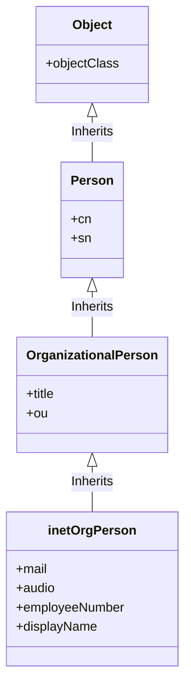

# Cours sur l'Object Class inetOrgPerson dans LDAP

## Objectifs du cours

À la fin de ce cours, les étudiants seront en mesure de :

- Comprendre ce qu'est l'Object Class inetOrgPerson dans le contexte de LDAP.
- Identifier les attributs et les propriétés de inetOrgPerson.
- Appliquer l'utilisation de inetOrgPerson dans un environnement réel.

## Prérequis

- Connaissance de base du protocole [[LDAP]] (Lightweight Directory Access Protocol).
- Compréhension des object classes et des attributs en LDAP.

---

## Introduction

### Définition de inetOrgPerson

Dans le cadre de LDAP, `inetOrgPerson` est une classe d'objet souvent utilisée pour représenter les individus au sein d'une organisation. Il s'agit d'une extension de l'object class `organizationalPerson`, qui à son tour étend l'object class `person`. L'object class `inetOrgPerson` est défini dans la [RFC 2798](https://www.rfc-editor.org/rfc/rfc2798) et est largement adopté dans diverses applications et services.

---

## Caractéristiques de inetOrgPerson

### Attributs Hérités

Étant une extension de `organizationalPerson` et `person`, `inetOrgPerson` hérite d'un ensemble d'attributs tels que :

- `cn` (Common Name)
- `sn` (Surname)
- `telephoneNumber`

### Attributs Propres

`inetOrgPerson` introduit également de nouveaux attributs, tels que :

- `mail`: adresse e-mail.
- `audio`: enregistrement audio.
- `employeeNumber`: numéro d'employé.
- `displayName`: nom d'affichage.
  
#### Schéma en Mermaid



---

## Exemple d'Utilisation

### Création d'une entrée inetOrgPerson

Pour ajouter une nouvelle entrée en utilisant l'object class `inetOrgPerson`, on peut suivre la structure LDIF (LDAP Data Interchange Format) suivante :

```ldif
dn: uid=jdoe,ou=users,dc=example,dc=com
objectClass: top
objectClass: person
objectClass: organizationalPerson
objectClass: inetOrgPerson
cn: John Doe
sn: Doe
mail: jdoe@example.com
audio: /path/to/audio
employeeNumber: 12345
displayName: J. Doe
```

---

## Résumé

L'object class `inetOrgPerson` enrichit les capacités de représentation des individus au sein d'un annuaire LDAP. Il est flexible et peut être étendu pour s'adapter aux besoins spécifiques d'une organisation. En comprenant ses attributs et ses fonctionnalités, les étudiants peuvent mieux exploiter le potentiel du protocole LDAP dans des contextes organisationnels.

---

Pour des questions ou des clarifications, n'hésitez pas à consulter les documents et les références additionnelles.

## Références

- [RFC 2798](https://www.rfc-editor.org/rfc/rfc2798): Definition of the inetOrgPerson LDAP Object Class
- Documentation officielle de LDAP

## Survol de la RFC 2798 : Définition de la Classe d'Objets inetOrgPerson dans LDAP

### Résumé

La RFC décrit une nouvelle Object Class appelée `inetOrgPerson`, destinée à être utilisée dans des services d'annuaire LDAP. Cette classe est conçue pour stocker des informations sur des individus au sein d'organisations et est particulièrement utile pour les applications de messagerie et les services en ligne.

### Introduction

L'Object Class `inetOrgPerson` est une extension de l'Object Class `organizationalPerson`, elle-même basée sur l'Object Class `person`. Elle est conçue pour combler les lacunes de ces classes en ajoutant de nouveaux attributs utiles pour les applications modernes.

### Attributs

La RFC 2798 présente un ensemble d'attributs associés à `inetOrgPerson`, y compris mais sans s'y limiter :

- `audio`
- `businessCategory`
- `carLicense`
- `departmentNumber`
- `displayName`
- `employeeNumber`
- `employeeType`
- `givenName`
- `homePhone`
- `homePostalAddress`
- `initials`
- `jpegPhoto`
- `labeledURI`
- `mail`
- `manager`
- `mobile`
- `o`
- `pager`
- `photo`
- `roomNumber`
- `secretary`
- `uid`
- `userCertificate`
- `x500uniqueIdentifier`
- `preferredLanguage`
- `userSMIMECertificate`
- `userPKCS12`

## Détails des Attributs de la Classe d'Objets inetOrgPerson dans LDAP

### displayName

#### Définition

Le champ `displayName` est utilisé pour stocker le nom qui sera affiché dans les applications utilisateur. Il peut être différent du `cn` (Common Name).

#### Exemple

```ldif
displayName: John A. Doe
```

#### Utilisation

Ce champ est souvent utilisé dans les interfaces de messagerie ou les applications collaboratives pour afficher le nom de l'utilisateur de manière plus conviviale.

#### Syntaxe

- Type de donnée : Chaîne de caractères UTF-8
- Longueur maximale : Aucune limite spécifiée
- Caractères autorisés : Tous les caractères Unicode
- Restrictions : Aucune

---

### employeeNumber

#### Définition

Le champ `employeeNumber` est un identifiant unique attribué à un employé au sein de l'organisation.

#### Exemple

```ldif
employeeNumber: 123456
```

#### Utilisation

Cet attribut est souvent utilisé pour l'intégration avec les systèmes de gestion des ressources humaines (RH) et les applications financières.

#### Syntaxe

- Type de donnée : Chaîne de caractères UTF-8
- Longueur maximale : Aucune limite spécifiée
- Caractères autorisés : Caractères alphanumériques et symboles
- Restrictions : Aucune

---

### employeeType

#### Définition

L'attribut `employeeType` est utilisé pour spécifier le type d'emploi de l'individu, comme "temps plein", "temps partiel", "stagiaire", etc.

#### Exemple

```ldif
employeeType: Full-Time
```

#### Utilisation

Ce champ est utile pour des requêtes basées sur le type d'emploi ou pour des intégrations avec des systèmes RH.

#### Syntaxe

- Type de donnée : Chaîne de caractères UTF-8
- Longueur maximale : Aucune limite spécifiée
- Caractères autorisés : Caractères alphabétiques
- Restrictions : Aucune

---

### givenName

#### Définition

L'attribut `givenName` représente le prénom de l'individu.

#### Exemple

```ldif
givenName: John
```

#### Utilisation

Cet attribut est souvent utilisé avec `sn` (Surname) pour générer des valeurs pour d'autres attributs comme `cn` (Common Name) ou `displayName`.

#### Syntaxe

- Type de donnée : Chaîne de caractères UTF-8
- Longueur maximale : Aucune limite spécifiée
- Caractères autorisés : Caractères alphabétiques
- Restrictions : Aucune

---

### mail

#### Définition

Le champ `mail` contient l'adresse e-mail de l'individu.
#### Exemple

```ldif
mail: johndoe@example.com
```

#### Utilisation

Cet attribut est essentiel pour toutes les formes de communication électronique au sein de l'organisation.
#### Syntaxe

- Type de donnée : Chaîne de caractères UTF-8
- Format : adresse email valide selon la norme RFC 5322
- Longueur maximale : 254 caractères
- Caractères autorisés : Caractères alphanumériques, symboles spéciaux (@, ., -, _)
- Restrictions : Doit contenir un "@" et un "."
---

### uid

#### Définition

L'attribut `uid` (User Identifier) est un identifiant unique pour chaque utilisateur dans le système LDAP.

#### Exemple

```ldif
uid: jdoe
```

#### Utilisation

Utilisé comme clé primaire pour identifier de manière unique chaque entrée utilisateur. C'est souvent le "nom d'utilisateur" dans les systèmes Linux/Unix.
#### Syntaxe

- Type de donnée : Chaîne de caractères UTF-8
- Longueur maximale : Aucune limite spécifiée
- Caractères autorisés : Caractères alphanumériques
- Restrictions : Aucune

---

### preferredLanguage

#### Définition

L'attribut `preferredLanguage` est utilisé pour spécifier la langue préférée de l'utilisateur.

#### Exemple

```ldif
preferredLanguage: en-US
```

#### Utilisation

Ce champ est utile pour localiser les applications et services en fonction des préférences linguistiques de l'utilisateur.
#### Syntaxe

- Type de donnée : Chaîne de caractères UTF-8
- Format : Code de langue selon la norme ISO 639-1 ou ISO 639-2
- Longueur maximale : 3 caractères
- Caractères autorisés : Caractères alphabétiques
- Restrictions : Doit correspondre à un code de langue valide selon ISO 639-1 ou ISO 639-2